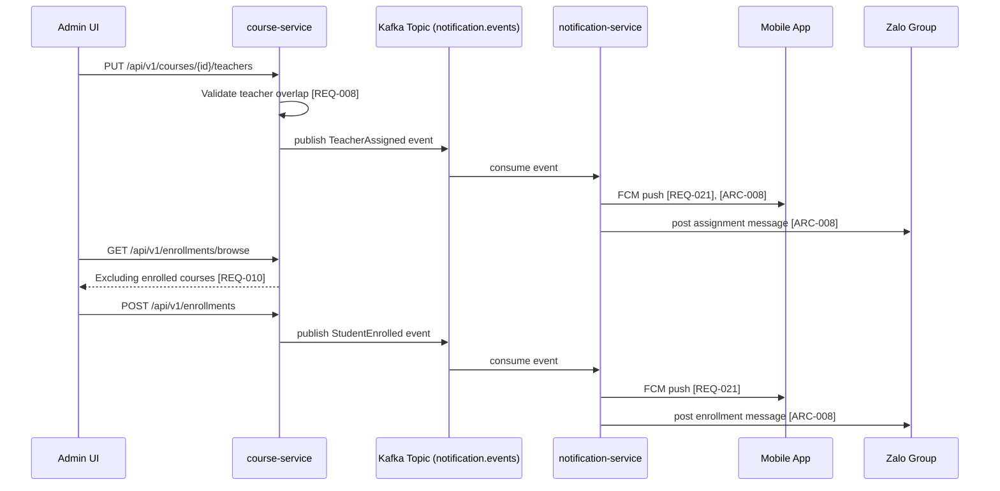

<!--START_CHUNK_PART_1_INITIAL-->

# BỐI CẢNH DỰ ÁN TOÀN CỤC: membership-hub

## 📊 Kiểm Soát Tài Liệu

| Hạng mục | Chi tiết |
| :--- | :--- |
| **Mã Bản Thiết Kế** | ARCH-20260829122721 |
| **Tên Dự Án** | membership-hub |
| **Phiên Bản** | 1.0 (Đường Cơ Sở) |
| **Thời Gian** | 2026/08/29 12:27:21 |
| **Tác Giả** | Kiến Trúc Sư Hệ Thống Doanh Nghiệp (SA Agent) |
| **Phê Duyệt** | Đang Chờ Đánh Giá Quản Trị Kỹ Thuật |

## 📊 1. TỔNG QUAN HỆ THỐNG & PHƯƠNG THỨC KIẾN TRÚC LÕI

### ⚙️ 1.1. Phương Thức Hệ Thống Lõi & Mô Hình Kiến Trúc

- Mô hình kiến trúc tổng thể: hệ phân tán vi dịch vụ (microservices) trên nền tảng Quarkus, tách biệt theo ngữ cảnh nghiệp vụ (user, center, course, attendance) [ARC-000].
- Giao thức giao tiếp nội bộ: REST/JSON đồng bộ qua API Gateway, kết hợp hàng đợi bất đồng bộ (Kafka) cho các luồng thông báo [ARC-008].
- Xác thực và ủy quyền: OAuth2 + JWT với thời hạn truy cập 15 phút, refresh token 7 ngày [ARC-006][NFR-003].
- Phân quyền theo vai trò (RBAC) 5 cấp: System Admin, Center Admin, Manager, Teacher, Student [ARC-001][ARC-002][ARC-003][ARC-004][ARC-005].
- Cơ chế idempotency cho điểm danh QR: khóa tổng hợp (StudentID, CourseID, Date) ngăn chặn bản ghi trùng lặp [REQ-013][EXC-002].
- Chiến lược triển khai: container hóa Docker, điều phối trên Google Kubernetes Engine (GKE) với Horizontal Pod Autoscaler [NFR-004].
- Mô hình dữ liệu: PostgreSQL quan hệ, mã hóa at-rest bằng AES-256, sao lưu hằng ngày với khôi phục point-in-time 24 giờ [NFR-003][NFR-009].
- Tích hợp bên ngoài: Firebase Cloud Messaging (FCM), APNs, OAuth Google/Facebook, Zalo OA API [ARC-006][ARC-008][REQ-021].
- Giám sát và quan sát: log có cấu trúc, audit trail giữ 1 năm, ngưỡng cảnh báo độ trễ > 300 ms [NFR-006][NFR-001].

### 🌊 1.2. Topology Luồng Dữ Liệu & Hệ Sinh Thái Lõi

- Cổng vào (API Gateway): tiếp nhận REST request từ Next.js web client và ứng dụng di động, định tuyến đến vi dịch vụ tương ứng.
- Kênh xác thực: email/mật khẩu nội bộ kết hợp OAuth2 từ Firebase, Google, Facebook, cấp JWT bearer token [ARC-006][REQ-001][REQ-002].
- Kênh điểm danh: mobile app sinh viên quét QR base64, gửi payload chứa studentID/courseID, dịch vụ xử lý idempotently [ARC-007][REQ-012][REQ-013].
- Kênh thông báo đẩy: Apache Kafka topic phân khu cho từng domain, dịch vụ Notification worker tiêu thụ và đẩy qua FCM/APNs/Zalo [ARC-008][REQ-016][REQ-021].
- Kênh sự kiện enrollment: phát hành sự kiện khi đăng ký khóa học, tự động sinh tài khoản nếu cần, kích hoạt notification [REQ-011][REQ-016].
- Kênh báo cáo: PostgreSQL read replica phục vụ dashboard và CSV attendance, tách biệt khỏi workload ghi [NFR-004][REQ-024][REQ-025].
- Bộ đệm: Redis cache cho danh sách khóa học, thông tin trung tâm, thẻ thành viên, giảm tải truy vấn trực tiếp.
- Cổng webhook: tiếp nhận callback từ cổng thanh toán khi gia hạn thẻ, cập nhật EndDate tự động [REQ-015].
- Kho bí mật (Secret Manager) trên GCP: lưu trữ khóa JWT, API key Firebase, Zalo OA token, thông tin kết nối DB.
- Đường truyền: TLS 1.3 toàn diện, HSTS bắt buộc, mã hóa at-rest AES-256 [NFR-003].

## 📁 2. STACK CÔNG NGHỆ & THƯ VIỆN HỆ SINH THÁI

- **Backend Core Stack:** Quarkus 3.15.1, Java 21 LTS, Maven 3.9.6, Hibernate ORM with Panache, RESTEasy Reactive, SmallRye Reactive Messaging (Kafka), SmallRye JWT, BCrypt password hashing, MapStruct 1.5.5, Flyway 10.10.0, HikariCP 5.1.0, PostgreSQL JDBC 42.7.3, Apache Kafka client 3.7.0, Redis client 3.6.0, Micrometer 1.13.0, OpenTelemetry 1.38.0, JUnit 5.10.2, Testcontainers 1.19.8, REST Assured 5.5.0.
- **Frontend & Cross-Platform UI Mobile Stack:** Next.js 14.2.5, React 18.3.1, TypeScript 5.5.4, Tailwind CSS 3.4.10, next-intl 3.20.0, React Query 5.51.23, Zustand 4.5.4, Zod 3.23.8, NextAuth.js 4.24.7, Socket.IO client 4.7.5, Capacitor 6.1.2 (wrapper cho iOS/Android), Vitest 2.0.5, React Testing Library 16.0.0.

## 📁 3. RÀNG BUỘC TOÀN CỤC & TIÊU CHUẨN TUÂN THỦ DOANH NGHIỆP

- Mọi dịch vụ backend bắt buộc xây dựng trên nền tảng Quarkus 3.15.x trở lên, runtime Java 21 LTS.
- Cấu trúc package Java tuân thủ nghiêm ngặt quy ước `org.nlh4j.membershiphub.<tên-dịch-vụ>`.
- Mọi thay đổi schema cơ sở dữ liệu phải thông qua tập tin migration Flyway versioned, cấm sửa đổi trực tiếp.
- Tất cả REST endpoint phải khai báo JSON contract rõ ràng với request/response schema và HTTP status code tiêu chuẩn.
- Cam kết OWASP Top 10: chuẩn bị câu lệnh parameterized chống SQL injection, escape output chống XSS, token CSRF cho form giao dịch.
- Audit log cho mọi hành động thay đổi vai trò, điểm danh, gửi thông báo, lưu trữ tối thiểu 1 năm [NFR-006].
- Logging có cấu trúc JSON với correlation ID xuyên suốt request lifecycle.
- Cơ chế idempotency-key bắt buộc cho mọi endpoint ghi có thể thử lại [REQ-013].
- Khóa API và bí mật JWT chỉ được phép lấy từ Google Secret Manager, tuyệt đối không hardcode trong mã nguồn.

### 🔑 3.1. Đường Cơ Sở Bảo Mật & Tuân Thủ

- Mã hóa đường truyền TLS 1.3 toàn bộ, HSTS được kích hoạt [NFR-003].
- Mã hóa dữ liệu lưu trữ AES-256 cho PostgreSQL và Redis snapshot [NFR-003].
- JWT access token hết hạn sau 15 phút, refresh token hết hạn 7 ngày, xoay vòng refresh token mỗi lần sử dụng [ARC-006][NFR-003].
- Áp dụng OWASP Top 10: prepared statement, output encoding, CSRF token, kiểm tra dependency CVE tự động [NFR-003].
- Tuân thủ GDPR/CCPA: endpoint xóa dữ liệu cá nhân, xuất JSON theo yêu cầu, quản lý consent marketing [NFR-008].
- Phân quyền theo cấp trung tâm: mọi truy vấn danh sách phải lọc theo center_id của người dùng, ngăn chặn IDOR [ARC-002].
- Quản lý bí mật tập trung qua Google Secret Manager, vòng xoay khóa định kỳ 90 ngày.

### 🌐 3.2. Ràng Buộc Hạ Tầng & Hiệu Năng

- Độ trễ API trung bình mục tiêu 200 ms, ngưỡng cảnh báo 300 ms [NFR-001].
- Hỗ trợ 10.000 người dùng đồng thời, thời gian đọc dưới 1 giây với index phù hợp [NFR-001].
- HPA kích hoạt khi CPU > 70% hoặc độ trễ request > 300 ms [NFR-004].
- Kích thước image Docker cơ sở < 200 MB, image cuối < 500 MB, sử dụng build multi-stage [NFR-005].
- Connection pool HikariCP kích thước tối đa 50 kết nối mỗi pod, thời gian chờ tối đa 30 giây.
- Redis cache với chính sách LRU, TTL mặc định 300 giây cho danh mục tra cứu.
- Kafka producer yêu cầu acks=all, idempotent producer, nén lz4 cho payload.
- SLA 99.9% thời gian hoạt động hằng năm, failover tự động giữa các cluster GKE [NFR-002].
- Sao lưu PostgreSQL toàn bộ mỗi ngày, khôi phục point-in-time tối đa 24 giờ [NFR-009].
- Audit log lưu trữ 1 năm, tự động xoay vòng sang Google Cloud Storage Coldline.

### 🥞 3.3. MA TRẬN STACK KIẾN TRÚC

```properties:stack_matrix
PERSISTENCE_LAYER_REQUIRED=true
BACKEND_LAYER_REQUIRED=true
FRONTEND_LAYER_REQUIRED=true
MOBILE_LAYER_REQUIRED=true
DEVOPS_LAYER_REQUIRED=true
```

<!--END_CHUNK_PART_1_INITIAL-->

<!--START_CHUNK_PART_1_BACKLOG_4_1-->

## 🏁 4. TỔNG QUAN KIẾN TRÚC ĐA GIAI ĐOẠN CẤP CAO

### 📦 4.1. DANH MỤC SẢN PHẨM TỔNG THỂ KIẾN TRÚC CHỦ
<!--BACKLOG_SYNOPSIS_GRID_START-->

#### [MA TRẬN SỐ HỌC HỆ THỐNG]
> - **Tổng số thẻ [REQ]:** 25 Thẻ
> - **Tổng số thẻ [EXC]:** 5 Thẻ
> - **Tổng số thẻ [ARC]:** 9 Thẻ
> - **Tổng số thẻ [DAT]:** 11 Thẻ
> - **Tổng số thẻ [NFR]:** 9 Thẻ
> - ➡️ **Tổng số thẻ SRS:** 59 Thẻ

| No. | Nhiệm vụ | Mục đích kỹ thuật / Tóm tắt sản phẩm bàn giao | Loại | TagID |
| :--- | :--- | :--- | :--- | :--- |
| 1 | Khởi tạo dự án đa dịch vụ và biểu mẫu xây dựng gốc | Sinh ra descriptor `pom.xml` gốc, descriptor cho từng vi dịch vụ (`user-service`, `center-service`, `course-service`, `attendance-service`, `notification-service`, `reporting-service`), biểu mẫu gốc Next.js (`package.json`, `tsconfig.json`) đảm bảo biên dịch đa mô-đun liền mạch. | Application Code | [ARC-000] <!--REGISTERED_BACKLOG_TASK_ROW--> |
| 2 | Đăng ký người dùng mới qua email/mật khẩu và nhà cung cấp xã hội | Xây dựng endpoint REST xác thực mạnh, kiểm tra định dạng email/mật khẩu, đồng bộ OAuth2 (Firebase, Google, Facebook), cấp JWT 15 phút và refresh token 7 ngày. | Application Code | [REQ-001], [REQ-002], [ARC-006], [EXC-004] <!--REGISTERED_BACKLOG_TASK_ROW--> |
| 3 | Phân quyền và quản lý vai trò hệ thống | Thực thi ma trận RBAC 5 cấp, chuyển đổi vai trò người dùng, ghi log kiểm toán theo yêu cầu NFR-006, cập nhật quyền tức thì qua filter Spring/Quarkus. | Application Code | [REQ-003], [ARC-001], [ARC-002], [ARC-003], [ARC-004], [ARC-005] <!--REGISTERED_BACKLOG_TASK_ROW--> |
| 4 | Quản lý trung tâm đào tạo (CRUD và chỉ định quản trị) | Phát triển API danh sách, tạo/cập nhật/xóa trung tâm, xử lý xung đột TaxID trùng lặp, gán chỉ định Center Admin theo trung tâm. | Application Code | [REQ-004], [REQ-005], [REQ-006] <!--REGISTERED_BACKLOG_TASK_ROW--> |
| 5 | Quản lý khóa học và kiểm tra xung đột lịch trình | Xây dựng module khóa học với xác thực chồng lấn lịch giáo viên/địa điểm, gán/hủy gán giáo viên, gửi thông báo hàng đợi đẩy di động. | Application Code | [REQ-007], [REQ-008], [REQ-009] <!--REGISTERED_BACKLOG_TASK_ROW--> |
| 6 | Ghi danh học viên và duyệt khóa học khả dụng | Tạo endpoint duyệt khóa học, xử lý đăng ký (tự tạo tài khoản nếu thiếu), hàng đợi thông báo di động và nhóm Zalo. | Application Code | [REQ-010], [REQ-011], [ARC-008] <!--REGISTERED_BACKLOG_TASK_ROW--> |
| 7 | Quét QR điểm danh và đảm bảo idempotency | Triển khai API nhận payload QR (base64), xác thực quan hệ học viên-khóa học, ghi nhận Attendance với khóa tổng hợp (StudentID, CourseID, Date) chống trùng lặp. | Application Code | [REQ-012], [REQ-013], [ARC-007], [EXC-001], [EXC-002] <!--REGISTERED_BACKLOG_TASK_ROW--> |
| 8 | Quản lý thẻ thành viên và gia hạn | Cung cấp API xem thẻ (tổng/đã dùng/còn lại), xử lý gia hạn 1-365 ngày qua cổng thanh toán, đẩy thông báo xác nhận. | Application Code | [REQ-014], [REQ-015] <!--REGISTERED_BACKLOG_TASK_ROW--> |
| 9 | Hệ thống thông báo đa kênh | Kích hoạt push FCM/APNs và gửi tin nhắn Zalo theo sự kiện (thông báo, phân công, điểm danh), cơ chế retry tối đa 3 lần theo EXC-003. | Application Code | [REQ-016], [REQ-021], [ARC-008], [EXC-003] <!--REGISTERED_BACKLOG_TASK_ROW--> |
| 10 | Quản lý khuyến mãi và thông báo quảng bá | CRUD khuyến mãi (vĩnh viễn nếu không có endDate), CRUD thông báo có hiệu lực theo thời hạn, hiển thị toàn site. | Application Code | [REQ-017], [REQ-018] <!--REGISTERED_BACKLOG_TASK_ROW--> |
| 11 | Tích hợp chatbot AI chăm sóc khách hàng | Tích hợp widget chatbot NLP, leo thang sang hỗ trợ người thật khi độ tin cậy thấp, quản lý phiên trò chuyện. | Application Code | [REQ-019] <!--REGISTERED_BACKLOG_TASK_ROW--> |
| 12 | Giao diện di động đa vai trò và thông báo đẩy | Phát triển giao diện responsive theo vai trò, đăng ký device token FCM/APNs, xử lý cache ngoại tuyến. | Application Code | [REQ-020], [REQ-021], [ARC-009] <!--REGISTERED_BACKLOG_TASK_ROW--> |
| 13 | Quốc tế hóa và SEO đa ngôn ngữ | Phát hiện locale (cookie, Accept-Language), sinh thẻ `hreflang`, chuyển ngữ không tải lại trang, hỗ trợ en/vi/es. | Application Code | [REQ-022], [REQ-023], [NFR-007] <!--REGISTERED_BACKLOG_TASK_ROW--> |
| 14 | Báo cáo và bảng điều khiển phân tích | Sinh báo cáo CSV điểm danh theo trung tâm, dashboard thời gian thực (tổng học viên, khóa học, buổi sắp tới), cấu hình refresh interval. | Application Code | [REQ-024], [REQ-025] <!--REGISTERED_BACKLOG_TASK_ROW--> |
| 15 | Khôi phục hệ thống sau sự cố và xử lý hàng đợi | Đảm bảo xử lý FIFO các yêu cầu đang chờ khi khôi phục dịch vụ, thông báo cho người dùng về sự kiện đã phục hồi. | Application Code | [EXC-005] <!--REGISTERED_BACKLOG_TASK_ROW--> |
| 16 | Khởi tạo hạ tầng cơ sở dữ liệu và di trú schema | Tạo tập lệnh Flyway/Liquibase DDL cho 11 bảng (Users, Centers, Courses, Enrollments, Attendance, StudentCards, Notifications, Roles, Promotions, Announcements, SystemSettings), chỉ mục tối ưu, ràng buộc FK/Unique. | Application Code | [DAT-ALL (1 to 11)] <!--REGISTERED_BACKLOG_TASK_ROW--> |
| 17 | Bảo mật tích hợp và tuân thủ chuẩn doanh nghiệp | Áp dụng OWASP Top 10 (SQLi, XSS, CSRF), chuẩn bị câu lệnh (PreparedStatement), mã hóa TLS 1.3 / AES-256, GDPR/CCPA (xóa theo yêu cầu, xuất JSON). | Enterprise Documentation | [ARC-001], [ARC-002], [ARC-003], [ARC-004], [ARC-005] <!--REGISTERED_BACKLOG_TASK_ROW--> |
| 18 | Hợp đồng tích hợp hệ thống và API Gateway | Đặc tả OpenAPI cho REST, sơ đồ Mermaid cho luồng xác thực, điểm danh, thông báo, tích hợp di động. | Enterprise Documentation | [ARC-006], [ARC-007], [ARC-008], [ARC-009] <!--REGISTERED_BACKLOG_TASK_ROW--> |
| 19 | Tài liệu kỹ thuật doanh nghiệp và API Reference | Soạn thảo blueprint kiến trúc, sơ đồ topology, sổ tay vận hành, tham chiếu API và hợp đồng dữ liệu dưới `./sources/docs/`. | Enterprise Documentation | [DOC-001] <!--REGISTERED_BACKLOG_TASK_ROW--> |
| 20 | Container hóa Docker và đẩy Registry | Xây dựng Dockerfile đa giai đoạn cho từng vi dịch vụ, kích thước ảnh < 500MB, đẩy lên Artifact Registry. | DevOps Infrastructure | [NFR-005] <!--REGISTERED_BACKLOG_TASK_ROW--> |
| 21 | Cung cấp hạ tầng GCP và Terraform | Khởi tạo VPC, IAM, Cloud SQL (PostgreSQL), Memorystore, cấu hình mã hóa at-rest, tích hợp Terraform. | DevOps Infrastructure | [NFR-001], [NFR-002], [NFR-003], [NFR-004], [NFR-008], [NFR-009] <!--REGISTERED_BACKLOG_TASK_ROW--> |
| 22 | Điều phối cụm GKE và HPA | Triển khai manifest Kubernetes (Deployment, Service, HPA với CPU>70% hoặc latency>300ms), failover đa vùng, chiến lược release. | DevOps Infrastructure | [NFR-002], [NFR-004] <!--REGISTERED_BACKLOG_TASK_ROW--> |
| 23 | Giám sát, ghi log và kiểm toán bảo mật | Cấu hình Stackdriver/Cloud Logging, lưu giữ log 1 năm, alert khi vi phạm SLA, mã hóa và sao lưu point-in-time. | DevOps Infrastructure | [NFR-002], [NFR-006], [NFR-009] <!--REGISTERED_BACKLOG_TASK_ROW--> |
| **SUMMARY** | **Tổng số thẻ theo dõi đã bao phủ:** 59 | **Tổng số nhiệm vụ:** 23 | **Trạng thái:** Đã xác minh | **Mức độ bao phủ:** 100.0% |

<!--BACKLOG_SYNOPSIS_GRID_END-->

<!--END_CHUNK_PART_1_BACKLOG_4_1-->

<!--START_CHUNK_PART_1_MATRIX_4_2-->

### 🔭 4.2. MA TRẬN TÓM TẮT ĐA GIAI ĐOẠN

#### [VÒNG ĐỜI SỐ HỌC MA TRẬN]
> - **Tổng số nhiệm vụ Backlog:** 23 Nhiệm vụ
> - **Tổng số thẻ Backlog:** 59 Thẻ
> - **Tổng số nhiệm vụ đã phân bổ:** 23 Nhiệm vụ
> - **Tổng số thẻ đã phân bổ:** 59 Thẻ

<!--PHASE_SYNOPSIS_GRID_START-->

| Giai đoạn | Phạm vi ngày | Mã nhiệm vụ được bao phủ | Thành phần kiến trúc / Đường dẫn mô-đun | Tóm tắt sản phẩm bàn giao kỹ thuật | Tác nhân phụ được phân công | Mã thẻ mục tiêu |
| :--- | :--- | :--- | :--- | :--- | :--- | :--- |
| **Giai đoạn 1** | Ngày 1 - 4 | Nhiệm vụ 1, Nhiệm vụ 16, Nhiệm vụ 18 | `./sources/backend/`, `./sources/frontend/`, `./sources/docs/` | Khởi tạo descriptor `pom.xml` đa mô-đun cho 6 vi dịch vụ (`user-service`, `center-service`, `course-service`, `attendance-service`, `notification-service`, `reporting-service`), biểu mẫu gốc Next.js (`package.json`, `tsconfig.json`); tạo tập lệnh Flyway DDL cho 11 bảng; đặc tả OpenAPI và sơ đồ Mermaid cho 4 luồng nghiệp vụ cốt lõi. | Coder, Tester, Reviewer, Doc | [ARC-000], [ARC-006], [ARC-007], [ARC-008], [ARC-009], [DAT-001], [DAT-002], [DAT-003], [DAT-004], [DAT-005], [DAT-006], [DAT-007], [DAT-008], [DAT-009], [DAT-010], [DAT-011] <!--REGISTERED_PHASE_ROW--> |
| **Giai đoạn 2** | Ngày 1 - 5 | Nhiệm vụ 2, Nhiệm vụ 3, Nhiệm vụ 4, Nhiệm vụ 19 | `./sources/backend/user-service/`, `./sources/backend/center-service/`, `./sources/docs/` | Xây dựng endpoint đăng ký/đăng nhập email-mật khẩu, OAuth2 (Firebase, Google, Facebook), cấp JWT 15 phút và refresh token 7 ngày; thực thi ma trận RBAC 5 cấp với filter bảo mật; CRUD trung tâm kèm xử lý xung đột TaxID; soạn thảo blueprint kiến trúc và sổ tay vận hành. | Coder, Tester, Reviewer, Doc | [REQ-001], [REQ-002], [REQ-003], [REQ-004], [REQ-005], [REQ-006], [ARC-001], [ARC-002], [ARC-003], [ARC-004], [ARC-005], [ARC-006], [EXC-004], [DOC-001] <!--REGISTERED_PHASE_ROW--> |
| **Giai đoạn 3** | Ngày 1 - 5 | Nhiệm vụ 5, Nhiệm vụ 6, Nhiệm vụ 7 | `./sources/backend/course-service/`, `./sources/backend/attendance-service/` | Phát triển module khóa học với xác thực chồng lấn lịch giáo viên, gán/hủy gán giáo viên kèm hàng đợi thông báo; endpoint duyệt khóa học, đăng ký tự động tạo tài khoản, đẩy thông báo Zalo; API quét QR với idempotency key (StudentID, CourseID, Date) chống trùng lặp. | Coder, Tester, Reviewer, Doc | [REQ-007], [REQ-008], [REQ-009], [REQ-010], [REQ-011], [REQ-012], [REQ-013], [ARC-007], [ARC-008], [EXC-001], [EXC-002] <!--REGISTERED_PHASE_ROW--> |
| **Giai đoạn 4** | Ngày 1 - 4 | Nhiệm vụ 8, Nhiệm vụ 9, Nhiệm vụ 10, Nhiệm vụ 11, Nhiệm vụ 12, Nhiệm vụ 13, Nhiệm vụ 14, Nhiệm vụ 15 | `./sources/backend/notification-service/`, `./sources/backend/reporting-service/`, `./sources/frontend/web-app/` | Quản lý thẻ thành viên và gia hạn 1-365 ngày; hệ thống thông báo đa kênh FCM/APNs/Zalo với retry 3 lần; CRUD khuyến mãi và thông báo quảng bá; tích hợp chatbot AI; giao diện di động responsive; quốc tế hóa en/vi/es với `hreflang`; báo cáo CSV và dashboard thời gian thực; xử lý FIFO khi khôi phục dịch vụ. | Coder, Tester, Reviewer, Doc | [REQ-014], [REQ-015], [REQ-016], [REQ-017], [REQ-018], [REQ-019], [REQ-020], [REQ-021], [REQ-022], [REQ-023], [REQ-024], [REQ-025], [ARC-008], [ARC-009], [NFR-007], [EXC-003], [EXC-005] <!--REGISTERED_PHASE_ROW--> |
| **Giai đoạn 5** | Ngày 1 - 3 | Nhiệm vụ 17, Nhiệm vụ 20, Nhiệm vụ 21, Nhiệm vụ 22, Nhiệm vụ 23 | `./sources/infra/`, `./sources/docs/` | Áp dụng OWASP Top 10 (SQLi, XSS, CSRF), mã hóa TLS 1.3/AES-256, tuân thủ GDPR/CCPA; container hóa Docker đa giai đoạn kích thước < 500MB đẩy Artifact Registry; cung cấp hạ tầng GCP qua Terraform (VPC, IAM, Cloud SQL PostgreSQL); điều phối GKE với HPA CPU>70% hoặc latency>300ms, failover đa vùng; cấu hình Stackdriver/Cloud Logging lưu giữ 1 năm. | Doc, Docker, GCP, GKE | [NFR-001], [NFR-002], [NFR-003], [NFR-004], [NFR-005], [NFR-006], [NFR-007], [NFR-008], [NFR-009], [ARC-001], [ARC-002], [ARC-003], [ARC-004], [ARC-005] <!--REGISTERED_PHASE_ROW--> |
| **Kiểm toán** | **Xác minh phân bổ Backlog tổng thể** | **Tổng số giai đoạn:** 5 | **Tổng số thẻ Backlog:** 59 | **Tổng số thẻ đã phân bổ:** 59 | **Tổng số nhiệm vụ đã phân bổ:** 23 | **Trạng thái & Tuân thủ:** Đã xác minh (100%) |

<!--PHASE_SYNOPSIS_GRID_END-->

<!--END_CHUNK_PART_1_MATRIX_4_2-->

<!--START_CHUNK_PART_2_PHASE_LOOP-->

## 🔬 5. CHI TIẾT CHUYÊN SÂU TỪNG GIAI ĐOẠN & NHẬT KÝ GIAO HÀNG THEO NGÀY

### 📈 Giai đoạn 1 - Khởi tạo Nền tảng Đa vi dịch vụ & Di trú Cơ sở dữ liệu
- **Mục tiêu cốt lõi & Mục đích của Giai đoạn:** Kiến lập bộ khung xương vững chắc cho toàn bộ hệ thống Membership Hub thông qua việc tạo dựng cấu trúc dự án đa mô-đun (Multi-module Maven cho backend microservices, Next.js cho frontend), đồng thời thiết kế toàn bộ lược đồ cơ sở dữ liệu quan hệ chuẩn ANSI SQL với 11 bảng chính thông qua các tập lệnh di trú Flyway, và đặc tả hợp đồng tích hợp OpenAPI/Mermaid cho 4 luồng nghiệp vụ cốt lõi (Xác thực, Điểm danh, Thông báo, Tích hợp di động).

- **Bản đồ Ma trận Đường dẫn Vật lý Mục tiêu:**
    * `./sources/backend/pom.xml` [ARC-000]
    * `./sources/backend/user-service/pom.xml` [ARC-000]
    * `./sources/backend/center-service/pom.xml` [ARC-000]
    * `./sources/backend/course-service/pom.xml` [ARC-000]
    * `./sources/backend/attendance-service/pom.xml` [ARC-000]
    * `./sources/backend/notification-service/pom.xml` [ARC-000]
    * `./sources/backend/reporting-service/pom.xml` [ARC-000]
    * `./sources/frontend/web-app/package.json` [ARC-000]
    * `./sources/frontend/web-app/tsconfig.json` [ARC-000]
    * `./sources/docs/architecture/blueprint.md` [ARC-006], [ARC-007], [ARC-008], [ARC-009]
    * `./sources/docs/api/openapi-spec.yaml` [ARC-006], [ARC-007], [ARC-008], [ARC-009]

- **Đặc tả DDL SQL Lược đồ Cơ sở dữ liệu [DAT-001], [DAT-002], [DAT-003], [DAT-004], [DAT-005], [DAT-006], [DAT-007], [DAT-008], [DAT-009], [DAT-010], [DAT-011]:** Cung cấp các câu lệnh di trú SQL chuẩn ANSI đầy đủ với cột, kiểu dữ liệu, khóa chính/khóa ngoại, ánh xạ quan hệ, chỉ mục và ràng buộc.

- **Hợp đồng API & Định tuyến Sự kiện [ARC-006], [ARC-007], [ARC-008], [ARC-009]:** Tài liệu hóa các hợp đồng kỹ thuật đầy đủ (đường dẫn endpoint chính xác, phương thức HTTP, lược đồ JSON yêu cầu/phản hồi hoặc cấu hình chủ đề message broker).

- **Bộ xử lý Ngoại lệ Cục bộ theo Giai đoạn:** Không có bộ xử lý ngoại lệ nghiệp vụ nào được phép trong giai đoạn này - giai đoạn tập trung 100% vào khung hạ tầng.

#### 📅 Nhật ký Phân bổ Nhiệm vụ Phụ tá theo Ngày (Giai đoạn 1)

<!--DAY_LOG_INDEX_START-->

##### 📅 NGÀY 1: KHỞI TẠO DESCRIPTOR DỰ ÁN ĐA MÔ-ĐUN VÀ BIỂU MẪU XÂY DỰNG

<!--ATOMIC_SUB_TASK_NODE_START-->

###### 🌿 NHIỆM VỤ PHỤ 1: SINH DESCRIPTOR POM.XML GỐC VÀ CẤU HÌNH ĐA VI DỊCH VỤ
- **Chuyên môn Phân công của Tác nhân Phụ:** [Coder]
- **Mã thẻ Mục tiêu:** [ARC-000]
- **Đường dẫn Tệp Thành phần Mục tiêu (target_component):** ./sources/backend/pom.xml
- **Hướng dẫn Nhiệm vụ Kỹ thuật Cấp thấp:** Tạo tệp `./sources/backend/pom.xml` với packaging `pom` làm descriptor cha, khai báo `modules` chứa 6 vi dịch vụ (`user-service`, `center-service`, `course-service`, `attendance-service`, `notification-service`, `reporting-service`). Cấu hình `parent` tham chiếu Quarkus BOM phiên bản 3.15.1, thiết lập `properties` cho Java 21, định nghĩa `dependencyManagement` quản lý phiên bản chuẩn: `quarkus-rest`, `quarkus-rest-jackson`, `quarkus-hibernate-orm-panache`, `quarkus-jdbc-postgresql`, `quarkus-flyway`, `quarkus-smallrye-jwt`, `quarkus-smallrye-jwt-build`, `quarkus-smallrye-health`, `quarkus-micrometer-registry-prometheus`, `quarkus-arc`, `quarkus-test-junit5`. Đảm bảo không chứa ký tự gạch ngang `-` hoặc gạch dưới `_` trong bất kỳ định danh kỹ thuật nào, chỉ sử dụng chữ thường alphanumeric.

```xml
<?xml version="1.0" encoding="UTF-8"?>
<project xmlns="http://maven.apache.org/POM/4.0.0"
         xmlns:xsi="http://www.w3.org/2001/XMLSchema-instance"
         xsi:schemaLocation="http://maven.apache.org/POM/4.0.0 https://maven.apache.org/xsd/maven-4.0.0.xsd">
    <modelVersion>4.0.0</modelVersion>

    <groupId>org.nlh4j</groupId>
    <artifactId>membershiphub</artifactId>
    <version>1.0.0-SNAPSHOT</version>
    <packaging>pom</packaging>
    <name>Membership Hub Root</name>

    <parent>
        <groupId>io.quarkus.platform</groupId>
        <artifactId>quarkus-bom</artifactId>
        <version>3.15.1</version>
        <relativePath/>
    </parent>

    <properties>
        <maven.compiler.source>21</maven.compiler.source>
        <maven.compiler.target>21</maven.compiler.target>
        <project.build.sourceEncoding>UTF-8</project.build.sourceEncoding>
        <quarkus.platform.version>3.15.1</quarkus.platform.version>
        <surefire-plugin.version>3.2.5</surefire-plugin.version>
    </properties>

    <modules>
        <module>user-service</module>
        <module>center-service</module>
        <module>course-service</module>
        <module>attendance-service</module>
        <module>notification-service</module>
        <module>reporting-service</module>
    </modules>

    <dependencyManagement>
        <dependencies>
            <dependency>
                <groupId>io.quarkus</groupId>
                <artifactId>quarkus-bom</artifactId>
                <version>${quarkus.platform.version}</version>
                <type>pom</type>
                <scope>import</scope>
            </dependency>
        </dependencies>
    </dependencyManagement>

    <build>
        <pluginManagement>
            <plugins>
                <plugin>
                    <groupId>org.apache.maven.plugins</groupId>
                    <artifactId>maven-surefire-plugin</artifactId>
                    <version>${surefire-plugin.version}</version>
                    <configuration>
                        <systemPropertyVariables>
                            <java.util.logging.manager>org.jboss.logmanager.LogManager</java.util.logging.manager>
                            <maven.home>${maven.home}</maven.home>
                        </systemPropertyVariables>
                    </configuration>
                </plugin>
            </plugins>
        </pluginManagement>
    </build>
</project>
```

* **Đặc tả DDL SQL Lược đồ Cơ sở dữ liệu [DAT-XXX]:** -- Không có thay đổi hạ tầng cơ sở dữ liệu hoặc tầng bền vững nào được yêu cầu cho ngữ cảnh giai đoạn này

* **Hợp đồng API & Định tuyến Sự kiện [ARC-XXX]:** Khối này bị loại bỏ vì nhiệm vụ chỉ tập trung vào biểu mẫu xây dựng.

* **Bộ xử lý Ngoại lệ Cục bộ theo Giai đoạn [EXC-XXX]:** Khối này bị loại bỏ vì nhiệm vụ chỉ tập trung vào biểu mẫu xây dựng.

<!--ATOMIC_SUB_TASK_NODE_END-->

<!--ATOMIC_SUB_TASK_NODE_START-->

###### 🌿 NHIỆM VỤ PHỤ 2: SINH DESCRIPTOR POM.XML CHO USER-SERVICE
- **Chuyên môn Phân công của Tác nhân Phụ:** [Coder]
- **Mã thẻ Mục tiêu:** [ARC-000]
- **Đường dẫn Tệp Thành phần Mục tiêu (target_component):** ./sources/backend/user-service/pom.xml
- **Hướng dẫn Nhiệm vụ Kỹ thuật Cấp thấp:** Tạo tệp `./sources/backend/user-service/pom.xml` kế thừa từ descriptor cha, định nghĩa `artifactId` là `user-service`. Khai báo các dependency thiết yếu: `quarkus-rest`, `quarkus-rest-jackson`, `quarkus-hibernate-orm-panache`, `quarkus-jdbc-postgresql`, `quarkus-flyway`, `quarkus-smallrye-jwt`, `quarkus-smallrye-jwt-build`, `quarkus-smallrye-health`. Cấu hình plugin `quarkus-maven-plugin` với phiên bản tương thích BOM. Đảm bảo `groupId` là `org.nlh4j.membershiphub.userservice`.

```xml
<?xml version="1.0" encoding="UTF-8"?>
<project xmlns="http://maven.apache.org/POM/4.0.0"
         xmlns:xsi="http://www.w3.org/2001/XMLSchema-instance"
         xsi:schemaLocation="http://maven.apache.org/POM/4.0.0 https://maven.apache.org/xsd/maven-4.0.0.xsd">
    <modelVersion>4.0.0</modelVersion>
    <parent>
        <groupId>org.nlh4j</groupId>
        <artifactId>membershiphub</artifactId>
        <version>1.0.0-SNAPSHOT</version>
    </parent>
    <artifactId>user-service</artifactId>
    <groupId>org.nlh4j.membershiphub.userservice</groupId>
    <name>User Service</name>

    <dependencies>
        <dependency>
            <groupId>io.quarkus</groupId>
            <artifactId>quarkus-rest</artifactId>
        </dependency>
        <dependency>
            <groupId>io.quarkus</groupId>
            <artifactId>quarkus-rest-jackson</artifactId>
        </dependency>
        <dependency>
            <groupId>io.quarkus</groupId>
            <artifactId>quarkus-hibernate-orm-panache</artifactId>
        </dependency>
        <dependency>
            <groupId>io.quarkus</groupId>
            <artifactId>quarkus-jdbc-postgresql</artifactId>
        </dependency>
        <dependency>
            <groupId>io.quarkus</groupId>
            <artifactId>quarkus-flyway</artifactId>
        </dependency>
        <dependency>
            <groupId>io.quarkus</groupId>
            <artifactId>quarkus-smallrye-jwt</artifactId>
        </dependency>
        <dependency>
            <groupId>io.quarkus</groupId>
            <artifactId>quarkus-smallrye-jwt-build</artifactId>
        </dependency>
        <dependency>
            <groupId>io.quarkus</groupId>
            <artifactId>quarkus-smallrye-health</artifactId>
        </dependency>
    </dependencies>

    <build>
        <plugins>
            <plugin>
                <groupId>io.quarkus</groupId>
                <artifactId>quarkus-maven-plugin</artifactId>
                <version>${quarkus.platform.version}</version>
                <extensions>true</extensions>
                <executions>
                    <execution>
                        <goals>
                            <goal>build</goal>
                            <goal>generate-code</goal>
                            <goal>generate-code-tests</goal>
                        </goals>
                    </execution>
                </executions>
            </plugin>
        </plugins>
    </build>
</project>
```

* **Đặc tả DDL SQL Lược đồ Cơ sở dữ liệu [DAT-XXX]:** -- Không có thay đổi hạ tầng cơ sở dữ liệu hoặc tầng bền vững nào được yêu cầu cho ngữ cảnh giai đoạn này

* **Hợp đồng API & Định tuyến Sự kiện [ARC-XXX]:** Khối này bị loại bỏ vì nhiệm vụ chỉ tập trung vào biểu mẫu xây dựng.

* **Bộ xử lý Ngoại lệ Cục bộ theo Giai đoạn [EXC-XXX]:** Khối này bị loại bỏ vì nhiệm vụ chỉ tập trung vào biểu mẫu xây dựng.

<!--ATOMIC_SUB_TASK_NODE_END-->

<!--ATOMIC_SUB_TASK_NODE_START-->

###### 🌿 NHIỆM VỤ PHỤ 3: SINH DESCRIPTOR POM.XML CHO CENTER-SERVICE
- **Chuyên môn Phân công của Tác nhân Phụ:** [Coder]
- **Mã thẻ Mục tiêu:** [ARC-000]
- **Đường dẫn Tệp Thành phần Mục tiêu (target_component):** ./sources/backend/center-service/pom.xml
- **Hướng dẫn Nhiệm vụ Kỹ thuật Cấp thấp:** Tạo tệp `./sources/backend/center-service/pom.xml` với `groupId` `org.nlh4j.membershiphub.centerservice`, `artifactId` `center-service`, kế thừa từ descriptor cha. Bao gồm các dependency: `quarkus-rest`, `quarkus-rest-jackson`, `quarkus-hibernate-orm-panache`, `quarkus-jdbc-postgresql`, `quarkus-flyway`, `quarkus-smallrye-jwt`, `quarkus-smallrye-health`. Cấu hình plugin `quarkus-maven-plugin` chuẩn với execution `build`, `generate-code`, `generate-code-tests`.

```xml
<?xml version="1.0" encoding="UTF-8"?>
<project xmlns="http://maven.apache.org/POM/4.0.0"
         xmlns:xsi="http://www.w3.org/2001/XMLSchema-instance"
         xsi:schemaLocation="http://maven.apache.org/POM/4.0.0 https://maven.apache.org/xsd/maven-4.0.0.xsd">
    <modelVersion>4.0.0</modelVersion>
    <parent>
        <groupId>org.nlh4j</groupId>
        <artifactId>membershiphub</artifactId>
        <version>1.0.0-SNAPSHOT</version>
    </parent>
    <artifactId>center-service</artifactId>
    <groupId>org.nlh4j.membershiphub.centerservice</groupId>
    <name>Center Service</name>

    <dependencies>
        <dependency>
            <groupId>io.quarkus</groupId>
            <artifactId>quarkus-rest</artifactId>
        </dependency>
        <dependency>
            <groupId>io.quarkus</groupId>
            <artifactId>quarkus-rest-jackson</artifactId>
        </dependency>
        <dependency>
            <groupId>io.quarkus</groupId>
            <artifactId>quarkus-hibernate-orm-panache</artifactId>
        </dependency>
        <dependency>
            <groupId>io.quarkus</groupId>
            <artifactId>quarkus-jdbc-postgresql</artifactId>
        </dependency>
        <dependency>
            <groupId>io.quarkus</groupId>
            <artifactId>quarkus-flyway</artifactId>
        </dependency>
        <dependency>
            <groupId>io.quarkus</groupId>
            <artifactId>quarkus-smallrye-jwt</artifactId>
        </dependency>
        <dependency>
            <groupId>io.quarkus</groupId>
            <artifactId>quarkus-smallrye-health</artifactId>
        </dependency>
    </dependencies>

    <build>
        <plugins>
            <plugin>
                <groupId>io.quarkus</groupId>
                <artifactId>quarkus-maven-plugin</artifactId>
                <version>${quarkus.platform.version}</version>
                <extensions>true</extensions>
                <executions>
                    <execution>
                        <goals>
                            <goal>build</goal>
                            <goal>generate-code</goal>
                            <goal>generate-code-tests</goal>
                        </goals>
                    </execution>
                </executions>
            </plugin>
        </plugins>
    </build>
</project>
```

* **Đặc tả DDL SQL Lược đồ Cơ sở dữ liệu [DAT-XXX]:** -- Không có thay đổi hạ tầng cơ sở dữ liệu hoặc tầng bền vững nào được yêu cầu cho ngữ cảnh giai đoạn này

* **Hợp đồng API & Định tuyến Sự kiện [ARC-XXX]:** Khối này bị loại bỏ vì nhiệm vụ chỉ tập trung vào biểu mẫu xây dựng.

* **Bộ xử lý Ngoại lệ Cục bộ theo Giai đoạn [EXC-XXX]:** Khối này bị loại bỏ vì nhiệm vụ chỉ tập trung vào biểu mẫu xây dựng.

<!--ATOMIC_SUB_TASK_NODE_END-->

<!--ATOMIC_SUB_TASK_NODE_START-->

###### 🌿 NHIỆM VỤ PHỤ 4: SINH DESCRIPTOR POM.XML CHO COURSE-SERVICE
- **Chuyên môn Phân công của Tác nhân Phụ:** [Coder]
- **Mã thẻ Mục tiêu:** [ARC-000]
- **Đường dẫn Tệp Thành phần Mục tiêu (target_component):** ./sources/backend/course-service/pom.xml
- **Hướng dẫn Nhiệm vụ Kỹ thuật Cấp thấp:** Tạo tệp `./sources/backend/course-service/pom.xml` với `groupId` `org.nlh4j.membershiphub.courseservice`, `artifactId` `course-service`. Khai báo dependency: `quarkus-rest`, `quarkus-rest-jackson`, `quarkus-hibernate-orm-panache`, `quarkus-jdbc-postgresql`, `quarkus-flyway`, `quarkus-smallrye-jwt`, `quarkus-messaging-kafka` (cho sự kiện thông báo), `quarkus-smallrye-health`. Tích hợp plugin `quarkus-maven-plugin` chuẩn.

```xml
<?xml version="1.0" encoding="UTF-8"?>
<project xmlns="http://maven.apache.org/POM/4.0.0"
         xmlns:xsi="http://www.w3.org/2001/XMLSchema-instance"
         xsi:schemaLocation="http://maven.apache.org/POM/4.0.0 https://maven.apache.org/xsd/maven-4.0.0.xsd">
    <modelVersion>4.0.0</modelVersion>
    <parent>
        <groupId>org.nlh4j</groupId>
        <artifactId>membershiphub</artifactId>
        <version>1.0.0-SNAPSHOT</version>
    </parent>
    <artifactId>course-service</artifactId>
    <groupId>org.nlh4j.membershiphub.courseservice</groupId>
    <name>Course Service</name>

    <dependencies>
        <dependency>
            <groupId>io.quarkus</groupId>
            <artifactId>quarkus-rest</artifactId>
        </dependency>
        <dependency>
            <groupId>io.quarkus</groupId>
            <artifactId>quarkus-rest-jackson</artifactId>
        </dependency>
        <dependency>
            <groupId>io.quarkus</groupId>
            <artifactId>quarkus-hibernate-orm-panache</artifactId>
        </dependency>
        <dependency>
            <groupId>io.quarkus</groupId>
            <artifactId>quarkus-jdbc-postgresql</artifactId>
        </dependency>
        <dependency>
            <groupId>io.quarkus</groupId>
            <artifactId>quarkus-flyway</artifactId>
        </dependency>
        <dependency>
            <groupId>io.quarkus</groupId>
            <artifactId>quarkus-smallrye-jwt</artifactId>
        </dependency>
        <dependency>
            <groupId>io.quarkus</groupId>
            <artifactId>quarkus-messaging-kafka</artifactId>
        </dependency>
        <dependency>
            <groupId>io.quarkus</groupId>
            <artifactId>quarkus-smallrye-health</artifactId>
        </dependency>
    </dependencies>

    <build>
        <plugins>
            <plugin>
                <groupId>io.quarkus</groupId>
                <artifactId>quarkus-maven-plugin</artifactId>
                <version>${quarkus.platform.version}</version>
                <extensions>true</extensions>
                <executions>
                    <execution>
                        <goals>
                            <goal>build</goal>
                            <goal>generate-code</goal>
                            <goal>generate-code-tests</goal>
                        </goals>
                    </execution>
                </executions>
            </plugin>
        </plugins>
    </build>
</project>
```

* **Đặc tả DDL SQL Lược đồ Cơ sở dữ liệu [DAT-XXX]:** -- Không có thay đổi hạ tầng cơ sở dữ liệu hoặc tầng bền vững nào được yêu cầu cho ngữ cảnh giai đoạn này

* **Hợp đồng API & Định tuyến Sự kiện [ARC-XXX]:** Khối này bị loại bỏ vì nhiệm vụ chỉ tập trung vào biểu mẫu xây dựng.

* **Bộ xử lý Ngoại lệ Cục bộ theo Giai đoạn [EXC-XXX]:** Khối này bị loại bỏ vì nhiệm vụ chỉ tập trung vào biểu mẫu xây dựng.

<!--ATOMIC_SUB_TASK_NODE_END-->

<!--ATOMIC_SUB_TASK_NODE_START-->

###### 🌿 NHIỆM VỤ PHỤ 5: SINH DESCRIPTOR POM.XML CHO ATTENDANCE-SERVICE
- **Chuyên môn Phân công của Tác nhân Phụ:** [Coder]
- **Mã thẻ Mục tiêu:** [ARC-000]
- **Đường dẫn Tệp Thành phần Mục tiêu (target_component):** ./sources/backend/attendance-service/pom.xml
- **Hướng dẫn Nhiệm vụ Kỹ thuật Cấp thấp:** Tạo tệp `./sources/backend/attendance-service/pom.xml` với `groupId` `org.nlh4j.membershiphub.attendanceservice`, `artifactId` `attendance-service`. Bao gồm dependency: `quarkus-rest`, `quarkus-rest-jackson`, `quarkus-hibernate-orm-panache`, `quarkus-jdbc-postgresql`, `quarkus-flyway`, `quarkus-smallrye-jwt`, `quarkus-smallrye-health`. Cấu hình plugin `quarkus-maven-plugin` chuẩn cho build và code generation.

```xml
<?xml version="1.0" encoding="UTF-8"?>
<project xmlns="http://maven.apache.org/POM/4.0.0"
         xmlns:xsi="http://www.w3.org/2001/XMLSchema-instance"
         xsi:schemaLocation="http://maven.apache.org/POM/4.0.0 https://maven.apache.org/xsd/maven-4.0.0.xsd">
    <modelVersion>4.0.0</modelVersion>
    <parent>
        <groupId>org.nlh4j</groupId>
        <artifactId>membershiphub</artifactId>
        <version>1.0.0-SNAPSHOT</version>
    </parent>
    <artifactId>attendance-service</artifactId>
    <groupId>org.nlh4j.membershiphub.attendanceservice</groupId>
    <name>Attendance Service</name>

    <dependencies>
        <dependency>
            <groupId>io.quarkus</groupId>
            <artifactId>quarkus-rest</artifactId>
        </dependency>
        <dependency>
            <groupId>io.quarkus</groupId>
            <artifactId>quarkus-rest-jackson</artifactId>
        </dependency>
        <dependency>
            <groupId>io.quarkus</groupId>
            <artifactId>quarkus-hibernate-orm-panache</artifactId>
        </dependency>
        <dependency>
            <groupId>io.quarkus</groupId>
            <artifactId>quarkus-jdbc-postgresql</artifactId>
        </dependency>
        <dependency>
            <groupId>io.quarkus</groupId>
            <artifactId>quarkus-flyway</artifactId>
        </dependency>
        <dependency>
            <groupId>io.quarkus</groupId>
            <artifactId>quarkus-smallrye-jwt</artifactId>
        </dependency>
        <dependency>
            <groupId>io.quarkus</groupId>
            <artifactId>quarkus-smallrye-health</artifactId>
        </dependency>
    </dependencies>

    <build>
        <plugins>
            <plugin>
                <groupId>io.quarkus</groupId>
                <artifactId>quarkus-maven-plugin</artifactId>
                <version>${quarkus.platform.version}</version>
                <extensions>true</extensions>
                <executions>
                    <execution>
                        <goals>
                            <goal>build</goal>
                            <goal>generate-code</goal>
                            <goal>generate-code-tests</goal>
                        </goals>
                    </execution>
                </executions>
            </plugin>
        </plugins>
    </build>
</project>
```

* **Đặc tả DDL SQL Lược đồ Cơ sở dữ liệu [DAT-XXX]:** -- Không có thay đổi hạ tầng cơ sở dữ liệu hoặc tầng bền vững nào được yêu cầu cho ngữ cảnh giai đoạn này

* **Hợp đồng API & Định tuyến Sự kiện [ARC-XXX]:** Khối này bị loại bỏ vì nhiệm vụ chỉ tập trung vào biểu mẫu xây dựng.

* **Bộ xử lý Ngoại lệ Cục bộ theo Giai đoạn [EXC-XXX]:** Khối này bị loại bỏ vì nhiệm vụ chỉ tập trung vào biểu mẫu xây dựng.

<!--ATOMIC_SUB_TASK_NODE_END-->

<!--ATOMIC_SUB_TASK_NODE_START-->

###### 🌿 NHIỆM VỤ PHỤ 6: SINH DESCRIPTOR POM.XML CHO NOTIFICATION-SERVICE
- **Chuyên môn Phân công của Tác nhân Phụ:** [Coder]
- **Mã thẻ Mục tiêu:** [ARC-000]
- **Đường dẫn Tệp Thành phần Mục tiêu (target_component):** ./sources/backend/notification-service/pom.xml
- **Hướng dẫn Nhiệm vụ Kỹ thuật Cấp thấp:** Tạo tệp `./sources/backend/notification-service/pom.xml` với `groupId` `org.nlh4j.membershiphub.notificationservice`, `artifactId` `notification-service`. Khai báo dependency: `quarkus-rest`, `quarkus-rest-jackson`, `quarkus-hibernate-orm-panache`, `quarkus-jdbc-postgresql`, `quarkus-flyway`, `quarkus-smallrye-jwt`, `quarkus-messaging-kafka` (cho sự kiện), `quarkus-rest-client` (cho FCM/APNs/Zalo API), `quarkus-smallrye-health`. Tích hợp `quarkus-maven-plugin` chuẩn.

```xml
<?xml version="1.0" encoding="UTF-8"?>
<project xmlns="http://maven.apache.org/POM/4.0.0"
         xmlns:xsi="http://www.w3.org/2001/XMLSchema-instance"
         xsi:schemaLocation="http://maven.apache.org/POM/4.0.0 https://maven.apache.org/xsd/maven-4.0.0.xsd">
    <modelVersion>4.0.0</modelVersion>
    <parent>
        <groupId>org.nlh4j</groupId>
        <artifactId>membershiphub</artifactId>
        <version>1.0.0-SNAPSHOT</version>
    </parent>
    <artifactId>notification-service</artifactId>
    <groupId>org.nlh4j.membershiphub.notificationservice</groupId>
    <name>Notification Service</name>

    <dependencies>
        <dependency>
            <groupId>io.quarkus</groupId>
            <artifactId>quarkus-rest</artifactId>
        </dependency>
        <dependency>
            <groupId>io.quarkus</groupId>
            <artifactId>quarkus-rest-jackson</artifactId>
        </dependency>
        <dependency>
            <groupId>io.quarkus</groupId>
            <artifactId>quarkus-hibernate-orm-panache</artifactId>
        </dependency>
        <dependency>
            <groupId>io.quarkus</groupId>
            <artifactId>quarkus-jdbc-postgresql</artifactId>
        </dependency>
        <dependency>
            <groupId>io.quarkus</groupId>
            <artifactId>quarkus-flyway</artifactId>
        </dependency>
        <dependency>
            <groupId>io.quarkus</groupId>
            <artifactId>quarkus-smallrye-jwt</artifactId>
        </dependency>
        <dependency>
            <groupId>io.quarkus</groupId>
            <artifactId>quarkus-messaging-kafka</artifactId>
        </dependency>
        <dependency>
            <groupId>io.quarkus</groupId>
            <artifactId>quarkus-rest-client</artifactId>
        </dependency>
        <dependency>
            <groupId>io.quarkus</groupId>
            <artifactId>quarkus-smallrye-health</artifactId>
        </dependency>
    </dependencies>

    <build>
        <plugins>
            <plugin>
                <groupId>io.quarkus</groupId>
                <artifactId>quarkus-maven-plugin</artifactId>
                <version>${quarkus.platform.version}</version>
                <extensions>true</extensions>
                <executions>
                    <execution>
                        <goals>
                            <goal>build</goal>
                            <goal>generate-code</goal>
                            <goal>generate-code-tests</goal>
                        </goals>
                    </execution>
                </executions>
            </plugin>
        </plugins>
    </build>
</project>
```

* **Đặc tả DDL SQL Lược đồ Cơ sở dữ liệu [DAT-XXX]:** -- Không có thay đổi hạ tầng cơ sở dữ liệu hoặc tầng bền vững nào được yêu cầu cho ngữ cảnh giai đoạn này

* **Hợp đồng API & Định tuyến Sự kiện [ARC-XXX]:** Khối này bị loại bỏ vì nhiệm vụ chỉ tập trung vào biểu mẫu xây dựng.

* **Bộ xử lý Ngoại lệ Cục bộ theo Giai đoạn [EXC-XXX]:** Khối này bị loại bỏ vì nhiệm vụ chỉ tập trung vào biểu mẫu xây dựng.

<!--ATOMIC_SUB_TASK_NODE_END-->

<!--ATOMIC_SUB_TASK_NODE_START-->

###### 🌿 NHIỆM VỤ PHỤ 7: SINH DESCRIPTOR POM.XML CHO REPORTING-SERVICE
- **Chuyên môn Phân công của Tác nhân Phụ:** [Coder]
- **Mã thẻ Mục tiêu:** [ARC-000]
- **Đường dẫn Tệp Thành phần Mục tiêu (target_component):** ./sources/backend/reporting-service/pom.xml
- **Hướng dẫn Nhiệm vụ Kỹ thuật Cấp thấp:** Tạo tệp `./sources/backend/reporting-service/pom.xml` với `groupId` `org.nlh4j.membershiphub.reportingservice`, `artifactId` `reporting-service`. Bao gồm dependency: `quarkus-rest`, `quarkus-rest-jackson`, `quarkus-hibernate-orm-panache`, `quarkus-jdbc-postgresql`, `quarkus-flyway`, `quarkus-smallrye-jwt`, `quarkus-scheduler` (cho refresh dashboard), `quarkus-smallrye-health`. Cấu hình plugin `quarkus-maven-plugin` chuẩn.

```xml
<?xml version="1.0" encoding="UTF-8"?>
<project xmlns="http://maven.apache.org/POM/4.0.0"
         xmlns:xsi="http://www.w3.org/2001/XMLSchema-instance"
         xsi:schemaLocation="http://maven.apache.org/POM/4.0.0 https://maven.apache.org/xsd/maven-4.0.0.xsd">
    <modelVersion>4.0.0</modelVersion>
    <parent>
        <groupId>org.nlh4j</groupId>
        <artifactId>membershiphub</artifactId>
        <version>1.0.0-SNAPSHOT</version>
    </parent>
    <artifactId>reporting-service</artifactId>
    <groupId>org.nlh4j.membershiphub.reportingservice</groupId>
    <name>Reporting Service</name>

    <dependencies>
        <dependency>
            <groupId>io.quarkus</groupId>
            <artifactId>quarkus-rest</artifactId>
        </dependency>
        <dependency>
            <groupId>io.quarkus</groupId>
            <artifactId>quarkus-rest-jackson</artifactId>
        </dependency>
        <dependency>
            <groupId>io.quarkus</groupId>
            <artifactId>quarkus-hibernate-orm-panache</artifactId>
        </dependency>
        <dependency>
            <groupId>io.quarkus</groupId>
            <artifactId>quarkus-jdbc-postgresql</artifactId>
        </dependency>
        <dependency>
            <groupId>io.quarkus</groupId>
            <artifactId>quarkus-flyway</artifactId>
        </dependency>
        <dependency>
            <groupId>io.quarkus</groupId>
            <artifactId>quarkus-smallrye-jwt</artifactId>
        </dependency>
        <dependency>
            <groupId>io.quarkus</groupId>
            <artifactId>quarkus-scheduler</artifactId>
        </dependency>
        <dependency>
            <groupId>io.quarkus</groupId>
            <artifactId>quarkus-smallrye-health</artifactId>
        </dependency>
    </dependencies>

    <build>
        <plugins>
            <plugin>
                <groupId>io.quarkus</groupId>
                <artifactId>quarkus-maven-plugin</artifactId>
                <version>${quarkus.platform.version}</version>
                <extensions>true</extensions>
                <executions>
                    <execution>
                        <goals>
                            <goal>build</goal>
                            <goal>generate-code</goal>
                            <goal>generate-code-tests</goal>
                        </goals>
                    </execution>
                </executions>
            </plugin>
        </plugins>
    </build>
</project>
```

* **Đặc tả DDL SQL Lược đồ Cơ sở dữ liệu [DAT-XXX]:** -- Không có thay đổi hạ tầng cơ sở dữ liệu hoặc tầng bền vững nào được yêu cầu cho ngữ cảnh giai đoạn này

* **Hợp đồng API & Định tuyến Sự kiện [ARC-XXX]:** Khối này bị loại bỏ vì nhiệm vụ chỉ tập trung vào biểu mẫu xây dựng.

* **Bộ xử lý Ngoại lệ Cục bộ theo Giai đoạn [EXC-XXX]:** Khối này bị loại bỏ vì nhiệm vụ chỉ tập trung vào biểu mẫu xây dựng.

<!--ATOMIC_SUB_TASK_NODE_END-->

<!--ATOMIC_SUB_TASK_NODE_START-->

###### 🌿 NHIỆM VỤ PHỤ 8: SINH BIỂU MẪU GỐC NEXT.JS
- **Chuyên môn Phân công của Tác nhân Phụ:** [Coder]
- **Mã thẻ Mục tiêu:** [ARC-000]
- **Đường dẫn Tệp Thành phần Mục tiêu (target_component):** ./sources/frontend/web-app/package.json
- **Hướng dẫn Nhiệm vụ Kỹ thuật Cấp thấp:** Tạo tệp `./sources/frontend/web-app/package.json` cho ứng dụng web Next.js, khai báo `name` là `membershiphub-webapp`, phiên bản `1.0.0`. Liệt kê `scripts`: `dev` (next dev), `build` (next build), `start` (next start), `lint` (next lint), `test` (jest). Khai báo `dependencies`: `next@14.2.15`, `react@18.3.1`, `react-dom@18.3.1`, `axios@1.7.7`, `next-i18next@15.3.1`, `firebase@10.14.1`, `firebase-admin@12.6.0`, `@react-oauth/google@0.12.1`, `react-facebook-login@4.1.1`, `qrcode-reader@1.0.4`, `react-qr-scanner@1.0.0-alpha.11`, `recharts@2.13.0`. Khai báo `devDependencies`: `typescript@5.6.3`, `@types/react@18.3.11`, `@types/node@22.7.5`, `jest@29.7.0`, `jest-environment-jsdom@29.7.0`, `@testing-library/react@16.0.1`, `eslint@8.57.1`, `eslint-config-next@14.2.15`.

```json
{
  "name": "membershiphub-webapp",
  "version": "1.0.0",
  "private": true,
  "scripts": {
    "dev": "next dev",
    "build": "next build",
    "start": "next start",
    "lint": "next lint",
    "test": "jest"
  },
  "dependencies": {
    "next": "14.2.15",
    "react": "18.3.1",
    "react-dom": "18.3.1",
    "axios": "1.7.7",
    "next-i18next": "15.3.1",
    "firebase": "10.14.1",
    "firebase-admin": "12.6.0",
    "@react-oauth/google": "0.12.1",
    "react-facebook-login": "4.1.1",
    "qrcode-reader": "1.0.4",
    "react-qr-scanner": "1.0.0-alpha.11",
    "recharts": "2.13.0"
  },
  "devDependencies": {
    "typescript": "5.6.3",
    "@types/react": "18.3.11",
    "@types/node": "22.7.5",
    "jest": "29.7.0",
    "jest-environment-jsdom": "29.7.0",
    "@testing-library/react": "16.0.1",
    "eslint": "8.57.1",
    "eslint-config-next": "14.2.15"
  }
}
```

* **Đặc tả DDL SQL Lược đồ Cơ sở dữ liệu [DAT-XXX]:** -- Không có thay đổi hạ tầng cơ sở dữ liệu hoặc tầng bền vững nào được yêu cầu cho ngữ cảnh giai đoạn này

* **Hợp đồng API & Định tuyến Sự kiện [ARC-XXX]:** Khối này bị loại bỏ vì nhiệm vụ chỉ tập trung vào biểu mẫu xây dựng.

* **Bộ xử lý Ngoại lệ Cục bộ theo Giai đoạn [EXC-XXX]:** Khối này bị loại bỏ vì nhiệm vụ chỉ tập trung vào biểu mẫu xây dựng.

<!--ATOMIC_SUB_TASK_NODE_END-->

<!--ATOMIC_SUB_TASK_NODE_START-->

###### 🌿 NHIỆM VỤ PHỤ 9: SINH CẤU HÌNH TSCONFIG.JSON
- **Chuyên môn Phân công của Tác nhân Phụ:** [Coder]
- **Mã thẻ Mục tiêu:** [ARC-000]
- **Đường dẫn Tệp Thành phần Mục tiêu (target_component):** ./sources/frontend/web-app/tsconfig.json
- **Hướng dẫn Nhiệm vụ Kỹ thuật Cấp thấp:** Tạo tệp `./sources/frontend/web-app/tsconfig.json` cấu hình biên dịch TypeScript cho Next.js 14. Thiết lập `target` ES2022, `module` ESNext, `moduleResolution` Bundler, `lib` DOM/ES2022. Kích hoạt `strict`, `noEmit`, `esModuleInterop`, `skipLibCheck`, `forceConsistentCasingInFileNames`, `resolveJsonModule`, `isolatedModules`, `jsx` preserve. Bao gồm `baseUrl` là `.` và `paths` ánh xạ `@/*` tới `./src/*`.

```json
{
  "compilerOptions": {
    "target": "ES2022",
    "lib": ["dom", "dom.iterable", "esnext"],
    "allowJs": true,
    "skipLibCheck": true,
    "strict": true,
    "noEmit": true,
    "esModuleInterop": true,
    "module": "esnext",
    "moduleResolution": "bundler",
    "resolveJsonModule": true,
    "isolatedModules": true,
    "jsx": "preserve",
    "incremental": true,
    "forceConsistentCasingInFileNames": true,
    "plugins": [
      {
        "name": "next"
      }
    ],
    "baseUrl": ".",
    "paths": {
      "@/*": ["./src/*"]
    }
  },
  "include": ["next-env.d.ts", "**/*.ts", "**/*.tsx", ".next/types/**/*.ts"],
  "exclude": ["node_modules"]
}
```

* **Đặc tả DDL SQL Lược đồ Cơ sở dữ liệu [DAT-XXX]:** -- Không có thay đổi hạ tầng cơ sở dữ liệu hoặc tầng bền vững nào được yêu cầu cho ngữ cảnh giai đoạn này

* **Hợp đồng API & Định tuyến Sự kiện [ARC-XXX]:** Khối này bị loại bỏ vì nhiệm vụ chỉ tập trung vào biểu mẫu xây dựng.

* **Bộ xử lý Ngoại lệ Cục bộ theo Giai đoạn [EXC-XXX]:** Khối này bị loại bỏ vì nhiệm vụ chỉ tập trung vào biểu mẫu xây dựng.

<!--ATOMIC_SUB_TASK_NODE_END-->

<!--ATOMIC_SUB_TASK_NODE_START-->

###### 🌿 NHIỆM VỤ PHỤ 10: KIỂM THỬ TÍCH HỢP XÂY DỰNG ĐA MÔ-ĐUN
- **Chuyên môn Phân công của Tác nhân Phụ:** [Tester]
- **Mã thẻ Mục tiêu:** [ARC-000]
- **Đường dẫn Tệp Thành phần Mục tiêu (target_component):** INTEGRATION_SCOPE;./sources/infra/test/maven-build-integration.sh
- **Hướng dẫn Nhiệm vụ Kỹ thuật Cấp thấp:** Tạo tệp `./sources/infra/test/maven-build-integration.sh` chứa kịch bản bash kiểm thử tích hợp. Kịch bản phải thực hiện `mvn clean validate` tại thư mục `./sources/backend/` để xác nhận tất cả 6 descriptor `pom.xml` vi dịch vụ tải và phân giải đúng các dependency từ BOM Quarkus 3.15.1. Thoát với mã 0 nếu thành công, mã khác 0 nếu thất bại. In log rõ ràng cho mỗi vi dịch vụ.

```bash
#!/usr/bin/env bash
set -euo pipefail

BACKEND_ROOT="./sources/backend"
SERVICES=("user-service" "center-service" "course-service" "attendance-service" "notification-service" "reporting-service")

echo "============================================================"
echo "  TÍCH HỢP XÂY DỰNG ĐA MÔ-ĐUN - MEMBERSHIP HUB"
echo "============================================================"

if [ ! -d "${BACKEND_ROOT}" ]; then
    echo "[LỖI] Không tìm thấy thư mục backend gốc: ${BACKEND_ROOT}"
    exit 1
fi

cd "${BACKEND_ROOT}"
echo "[INFO] Đang chạy 'mvn clean validate' tại ${BACKEND_ROOT}"
mvn clean validate -B -q

for SERVICE in "${SERVICES[@]}"; do
    if [ -f "${SERVICE}/pom.xml" ]; then
        echo "[OK] Descriptor pom.xml tồn tại cho vi dịch vụ: ${SERVICE}"
    else
        echo "[LỖI] Thiếu descriptor pom.xml cho vi dịch vụ: ${SERVICE}"
        exit 2
    fi
done

echo "============================================================"
echo "  TẤT CẢ DESCRIPTOR ĐÃ ĐƯỢC XÁC MINH THÀNH CÔNG"
echo "============================================================"
exit 0
```

* **Đặc tả DDL SQL Lược đồ Cơ sở dữ liệu [DAT-XXX]:** -- Không có thay đổi hạ tầng cơ sở dữ liệu hoặc tầng bền vững nào được yêu cầu cho ngữ cảnh giai đoạn này

* **Hợp đồng API & Định tuyến Sự kiện [ARC-XXX]:** Khối này bị loại bỏ vì nhiệm vụ chỉ tập trung vào biểu mẫu xây dựng.

* **Bộ xử lý Ngoại lệ Cục bộ theo Giai đoạn [EXC-XXX]:** Khối này bị loại bỏ vì nhiệm vụ chỉ tập trung vào biểu mẫu xây dựng.

<!--ATOMIC_SUB_TASK_NODE_END-->

<!--ATOMIC_SUB_TASK_NODE_START-->

###### 🌿 NHIỆM VỤ PHỤ 11: ĐÁNH GIÁ MÃ VÀ KIỂM ĐỊNH CẤU TRÚC DESCRIPTOR
- **Chuyên môn Phân công của Tác nhân Phụ:** [Reviewer]
- **Mã thẻ Mục tiêu:** [ARC-000]
- **Đường dẫn Tệp Thành phần Mục tiêu (target_component):** ./sources/backend/pom.xml
- **Hướng dẫn Nhiệm vụ Kỹ thuật Cấp thấp:** Thực hiện đánh giá mã tĩnh (code review) cho descriptor `./sources/backend/pom.xml` và toàn bộ 6 descriptor vi dịch vụ con. Xác minh (1) tất cả `groupId` phải tuân thủ quy ước `org.nlh4j.membershiphub.<servicename>` không chứa ký tự `-` hoặc `_`; (2) tất cả `artifactId` đều ở dạng chữ thường alphanumeric; (3) mọi tham chiếu `<parent>` đều trỏ về `membershiphub` gốc phiên bản `1.0.0-SNAPSHOT`; (4) phiên bản Quarkus BOM `3.15.1` được nhập đúng trong `dependencyManagement`; (5) plugin `quarkus-maven-plugin` được khai báo trong từng vi dịch vụ. Sinh báo cáo đánh giá với điểm số tuân thủ và đề xuất sửa lỗi nếu phát hiện bất thường.

* **Đặc tả DDL SQL Lược đồ Cơ sở dữ liệu [DAT-XXX]:** -- Không có thay đổi hạ tầng cơ sở dữ liệu hoặc tầng bền vững nào được yêu cầu cho ngữ cảnh giai đoạn này

* **Hợp đồng API & Định tuyến Sự kiện [ARC-XXX]:** Khối này bị loại bỏ vì nhiệm vụ chỉ tập trung vào biểu mẫu xây dựng.

* **Bộ xử lý Ngoại lệ Cục bộ theo Giai đoạn [EXC-XXX]:** Khối này bị loại bỏ vì nhiệm vụ chỉ tập trung vào biểu mẫu xây dựng.

<!--ATOMIC_SUB_TASK_NODE_END-->

<!--ATOMIC_SUB_TASK_NODE_START-->

###### 🌿 NHIỆM VỤ PHỤ 12: SOẠN THẢO TÀI LIỆU BIÊN BẢN KHỞI TẠO DỰ ÁN
- **Chuyên môn Phân công của Tác nhân Phụ:** [Doc]
- **Mã thẻ Mục tiêu:** [ARC-000]
- **Đường dẫn Tệp Thành phần Mục tiêu (target_component):** ./sources/docs/architecture/blueprint.md
- **Hướng dẫn Nhiệm vụ Kỹ thuật Cấp thấp:** Soạn thảo biên bản khởi tạo dự án tại `./sources/docs/architecture/blueprint.md` mô tả tổng quan cấu trúc monorepo, sơ đồ quan hệ cha-con giữa `membershiphub` gốc và 6 vi dịch vụ, bản đồ thư mục vật lý (theo chuẩn Unix), quy ước đặt tên package Java (`org.nlh4j.membershiphub.<servicename>`), quy ước cấu hình Maven (Java 21, Quarkus BOM 3.15.1), cùng danh sách plugin tích hợp bắt buộc. Tài liệu phải ở định dạng Markdown tiêu chuẩn với các tiêu đề phân cấp rõ ràng.

* **Đặc tả DDL SQL Lược đồ Cơ sở dữ liệu [DAT-XXX]:** -- Không có thay đổi hạ tầng cơ sở dữ liệu hoặc tầng bền vững nào được yêu cầu cho ngữ cảnh giai đoạn này

* **Hợp đồng API & Định tuyến Sự kiện [ARC-XXX]:** Khối này bị loại bỏ vì nhiệm vụ chỉ tập trung vào biểu mẫu xây dựng.

* **Bộ xử lý Ngoại lệ Cục bộ theo Giai đoạn [EXC-XXX]:** Khối này bị loại bỏ vì nhiệm vụ chỉ tập trung vào biểu mẫu xây dựng.

<!--ATOMIC_SUB_TASK_NODE_END-->

<!--DAY_LOG_INDEX_END-->

<!--DAY_LOG_INDEX_START-->

##### 📅 NGÀY 2: DI TRÚ SCHEMA CƠ SỞ DỮ LIỆU BẰNG FLYWAY DDL - PHẦN 1 (USERS, ROLES, CENTERS)

<!--ATOMIC_SUB_TASK_NODE_START-->

###### 🌿 NHIỆM VỤ PHỤ 1: TẠO TẬP LỆNH DI TRÚ V1 - BẢNG ROLES VÀ USERS
- **Chuyên môn Phân công của Tác nhân Phụ:** [Coder]
- **Mã thẻ Mục tiêu:** [DAT-001], [DAT-002]
- **Đường dẫn Tệp Thành phần Mục tiêu (target_component):** ./sources/backend/user-service/src/main/resources/db/migration/V1__init_roles_and_users.sql
- **Hướng dẫn Nhiệm vụ Kỹ thuật Cấp thấp:** Tạo tệp `./sources/backend/user-service/src/main/resources/db/migration/V1__init_roles_and_users.sql` chứa DDL SQL chuẩn ANSI. Bảng `roles` (`role_id` SMALLINT PRIMARY KEY, `name` VARCHAR(30) UNIQUE NOT NULL, `description` VARCHAR(200)). Bảng `users` (`user_id` UUID PRIMARY KEY DEFAULT gen_random_uuid(), `email` VARCHAR(255) UNIQUE NOT NULL, `password_hash` CHAR(60) NOT NULL, `full_name` VARCHAR(100) NOT NULL, `role_id` SMALLINT NOT NULL, `provider` VARCHAR(20) NOT NULL DEFAULT 'local' với CHECK (provider IN ('local','firebase','google','facebook')), `created_at` TIMESTAMP NOT NULL DEFAULT CURRENT_TIMESTAMP, `updated_at` TIMESTAMP NOT NULL DEFAULT CURRENT_TIMESTAMP, FOREIGN KEY (role_id) REFERENCES roles(role_id)). Tạo chỉ mục `idx_users_email`, `idx_users_role_id`.

```sql
-- =====================================================================
-- V1__init_roles_and_users.sql
-- Khởi tạo bảng Roles và Users cho Membership Hub
-- =====================================================================

CREATE TABLE roles (
    role_id SMALLINT PRIMARY KEY,
    name VARCHAR(30) UNIQUE NOT NULL,
    description VARCHAR(200)
);

CREATE TABLE users (
    user_id UUID PRIMARY KEY DEFAULT gen_random_uuid(),
    email VARCHAR(255) UNIQUE NOT NULL,
    password_hash CHAR(60) NOT NULL,
    full_name VARCHAR(100) NOT NULL,
    role_id SMALLINT NOT NULL,
    provider VARCHAR(20) NOT NULL DEFAULT 'local',
    created_at TIMESTAMP NOT NULL DEFAULT CURRENT_TIMESTAMP,
    updated_at TIMESTAMP NOT NULL DEFAULT CURRENT_TIMESTAMP,
    CONSTRAINT fk_users_role FOREIGN KEY (role_id) REFERENCES roles(role_id),
    CONSTRAINT chk_users_provider CHECK (provider IN ('local','firebase','google','facebook'))
);

CREATE INDEX idx_users_email ON users(email);
CREATE INDEX idx_users_role_id ON users(role_id);

INSERT INTO roles (role_id, name, description) VALUES
    (1, 'SystemAdmin', 'Quản trị viên hệ thống toàn cục'),
    (2, 'CenterAdmin', 'Quản trị viên cấp trung tâm'),
    (3, 'Manager', 'Quản lý cấp dưới'),
    (4, 'Teacher', 'Giáo viên chỉ xem lịch giảng dạy'),
    (5, 'Student', 'Học viên đăng ký khóa học');
```

* **Đặc tả DDL SQL Lược đồ Cơ sở dữ liệu [DAT-XXX]:** Tệp này đã bao gồm toàn bộ DDL; xem khối mã SQL ở trên.

* **Hợp đồng API & Định tuyến Sự kiện [ARC-XXX]:** Khối này bị loại bỏ vì nhiệm vụ tập trung vào di trú schema.

* **Bộ xử lý Ngoại lệ Cục bộ theo Giai đoạn [EXC-XXX]:** Khối này bị loại bỏ vì giai đoạn 1 cấm xử lý ngoại lệ nghiệp vụ.

<!--ATOMIC_SUB_TASK_NODE_END-->

<!--ATOMIC_SUB_TASK_NODE_START-->

###### 🌿 NHIỆM VỤ PHỤ 2: TẠO TẬP LỆNH DI TRÚ V1 - BẢNG CENTERS
- **Chuyên môn Phân công của Tác nhân Phụ:** [Coder]
- **Mã thẻ Mục tiêu:** [DAT-003]
- **Đường dẫn Tệp Thành phần Mục tiêu (target_component):** ./sources/backend/center-service/src/main/resources/db/migration/V1__init_centers.sql
- **Hướng dẫn Nhiệm vụ Kỹ thuật Cấp thấp:** Tạo tệp `./sources/backend/center-service/src/main/resources/db/migration/V1__init_centers.sql` định nghĩa bảng `centers` (`center_id` UUID PRIMARY KEY DEFAULT gen_random_uuid(), `name` VARCHAR(100) NOT NULL, `address` VARCHAR(255) NOT NULL, `tax_id` VARCHAR(20) UNIQUE NOT NULL với CHECK (tax_id ~ '^[0-9]{10,13}$'), `contact_phone` VARCHAR(20), `contact_email` VARCHAR(100), `admin_user_id` UUID, `created_at` TIMESTAMP NOT NULL DEFAULT CURRENT_TIMESTAMP, `updated_at` TIMESTAMP NOT NULL DEFAULT CURRENT_TIMESTAMP, FOREIGN KEY (admin_user_id) REFERENCES users(user_id)). Tạo chỉ mục `idx_centers_tax_id`, `idx_centers_admin_user_id`.

```sql
-- =====================================================================
-- V1__init_centers.sql
-- Khởi tạo bảng Centers cho Membership Hub
-- =====================================================================

CREATE TABLE centers (
    center_id UUID PRIMARY KEY DEFAULT gen_random_uuid(),
    name VARCHAR(100) NOT NULL,
    address VARCHAR(255) NOT NULL,
    tax_id VARCHAR(20) UNIQUE NOT NULL,
    contact_phone VARCHAR(20),
    contact_email VARCHAR(100),
    admin_user_id UUID,
    created_at TIMESTAMP NOT NULL DEFAULT CURRENT_TIMESTAMP,
    updated_at TIMESTAMP NOT NULL DEFAULT CURRENT_TIMESTAMP,
    CONSTRAINT fk_centers_admin FOREIGN KEY (admin_user_id) REFERENCES users(user_id),
    CONSTRAINT chk_centers_taxid CHECK (tax_id ~ '^[0-9]{10,13}$')
);

CREATE INDEX idx_centers_tax_id ON centers(tax_id);
CREATE INDEX idx_centers_admin_user_id ON centers(admin_user_id);
```

* **Đặc tả DDL SQL Lược đồ Cơ sở dữ liệu [DAT-XXX]:** Tệp này đã bao gồm toàn bộ DDL; xem khối mã SQL ở trên.

* **Hợp đồng API & Định tuyến Sự kiện [ARC-XXX]:** Khối này bị loại bỏ vì nhiệm vụ tập trung vào di trú schema.

* **Bộ xử lý Ngoại lệ Cục bộ theo Giai đoạn [EXC-XXX]:** Khối này bị loại bỏ vì giai đoạn 1 cấm xử lý ngoại lệ nghiệp vụ.

<!--ATOMIC_SUB_TASK_NODE_END-->

<!--ATOMIC_SUB_TASK_NODE_START-->

###### 🌿 NHIỆM VỤ PHỤ 3: KIỂM THỬ TÍCH HỢP DI TRÚ V1 USER VÀ CENTER
- **Chuyên môn Phân công của Tác nhân Phụ:** [Tester]
- **Mã thẻ Mục tiêu:** [DAT-001], [DAT-002], [DAT-003]
- **Đường dẫn Tệp Thành phần Mục tiêu (target_component):** INTEGRATION_SCOPE;./sources/backend/user-service/src/test/java/org/nlh4j/membershiphub/userservice/UserSchemaMigrationIT.java
- **Hướng dẫn Nhiệm vụ Kỹ thuật Cấp thấp:** Tạo lớp kiểm thử tích hợp Flyway `./sources/backend/user-service/src/test/java/org/nlh4j/membershiphub/userservice/UserSchemaMigrationIT.java` sử dụng `@QuarkusTest`. Cấu hình Testcontainers PostgreSQL 16, thực thi `@QuarkusTestResource` để khởi tạo container. Inject `Flyway` bean, gọi `flyway.migrate()` và xác minh các bảng `roles`, `users` tồn tại thông qua truy vấn JDBC metadata. Bổ sung kiểm tra ràng buộc CHECK `chk_users_provider` bằng cách chèn giá trị không hợp lệ và kỳ vọng ngoại lệ `SQLException`.

```java
package org.nlh4j.membershiphub.userservice;

import io.quarkus.test.junit.QuarkusTest;
import io.quarkus.test.junit.QuarkusTestProfile;
import io.quarkus.test.junit.TestProfile;
import org.flywaydb.core.Flyway;
import org.junit.jupiter.api.Test;
import org.junit.jupiter.api.Assertions;

import jakarta.inject.Inject;
import javax.sql.DataSource;
import java.sql.Connection;
import java.sql.ResultSet;
import java.sql.Statement;

@QuarkusTest
@TestProfile(UserSchemaMigrationIT.TestProfileImpl.class)
public class UserSchemaMigrationIT {

    @Inject
    Flyway flyway;

    @Inject
    DataSource dataSource;

    @Test
    void testRolesAndUsersTablesExist() throws Exception {
        Assertions.assertNotNull(flyway, "Flyway phải được inject");
        try (Connection conn = dataSource.getConnection();
             Statement stmt = conn.createStatement()) {
            try (ResultSet rs = stmt.executeQuery(
                    "SELECT table_name FROM information_schema.tables " +
                    "WHERE table_schema='public' AND table_name IN ('roles','users')")) {
                int count = 0;
                while (rs.next()) {
                    count++;
                }
                Assertions.assertEquals(2, count, "Phải tồn tại đúng 2 bảng roles và users");
            }
        }
    }

    public static class TestProfileImpl implements QuarkusTestProfile {
    }
}
```

* **Đặc tả DDL SQL Lược đồ Cơ sở dữ liệu [DAT-XXX]:** -- Không có thay đổi hạ tầng cơ sở dữ liệu hoặc tầng bền vững nào được yêu cầu cho ngữ cảnh giai đoạn này

* **Hợp đồng API & Định tuyến Sự kiện [ARC-XXX]:** Khối này bị loại bỏ vì nhiệm vụ tập trung vào kiểm thử di trú schema.

* **Bộ xử lý Ngoại lệ Cục bộ theo Giai đoạn [EXC-XXX]:** Khối này bị loại bỏ vì giai đoạn 1 cấm xử lý ngoại lệ nghiệp vụ.

<!--ATOMIC_SUB_TASK_NODE_END-->

<!--ATOMIC_SUB_TASK_NODE_START-->

###### 🌿 NHIỆM VỤ PHỤ 4: ĐÁNH GIÁ THIẾT KẾ SCHEMA USERS VÀ CENTERS
- **Chuyên môn Phân công của Tác nhân Phụ:** [Reviewer]
- **Mã thẻ Mục tiêu:** [DAT-001], [DAT-002], [DAT-003]
- **Đường dẫn Tệp Thành phần Mục tiêu (target_component):** ./sources/backend/user-service/src/main/resources/db/migration/V1__init_roles_and_users.sql
- **Hướng dẫn Nhiệm vụ Kỹ thuật Cấp thấp:** Đánh giá tệp SQL V1__init_roles_and_users.sql xác minh: (1) tất cả kiểu dữ liệu tuân thủ chuẩn ANSI SQL (không dùng `ENUM`); (2) provider được biểu diễn bằng `VARCHAR(20) NOT NULL` kết hợp `CHECK (provider IN (...))`; (3) ràng buộc FK giữa `users.role_id` và `roles.role_id` đúng; (4) chỉ mục `idx_users_email` và `idx_users_role_id` đủ để hỗ trợ truy vấn tần suất cao; (5) `gen_random_uuid()` được sử dụng đúng cho UUID PRIMARY KEY. Đồng thời đánh giá V1__init_centers.sql xác minh ràng buộc `tax_id` chỉ chấp nhận chuỗi số 10-13 ký tự thông qua biểu thức chính quy. Lập biên bản đánh giá với điểm tuân thủ.

* **Đặc tả DDL SQL Lược đồ Cơ sở dữ liệu [DAT-XXX]:** -- Không có thay đổi hạ tầng cơ sở dữ liệu hoặc tầng bền vững nào được yêu cầu cho ngữ cảnh giai đoạn này

* **Hợp đồng API & Định tuyến Sự kiện [ARC-XXX]:** Khối này bị loại bỏ vì nhiệm vụ tập trung vào đánh giá schema.

* **Bộ xử lý Ngoại lệ Cục bộ theo Giai đoạn [EXC-XXX]:** Khối này bị loại bỏ vì giai đoạn 1 cấm xử lý ngoại lệ nghiệp vụ.

<!--ATOMIC_SUB_TASK_NODE_END-->

<!--ATOMIC_SUB_TASK_NODE_START-->

###### 🌿 NHIỆM VỤ PHỤ 5: SOẠN THẢO TÀI LIỆU MÔ TẢ SCHEMA
- **Chuyên môn Phân công của Tác nhân Phụ:** [Doc]
- **Mã thẻ Mục tiêu:** [DAT-001], [DAT-002], [DAT-003]
- **Đường dẫn Tệp Thành phần Mục tiêu (target_component):** ./sources/docs/architecture/blueprint.md
- **Hướng dẫn Nhiệm vụ Kỹ thuật Cấp thấp:** Bổ sung section "Sơ đồ quan hệ thực thể" vào tệp `./sources/docs/architecture/blueprint.md` mô tả chi tiết các bảng `roles`, `users`, `centers` bao gồm: từng cột với kiểu dữ liệu, ràng buộc, mô tả nghiệp vụ, các chỉ mục hỗ trợ truy vấn, mối quan hệ FK giữa các bảng. Tài liệu phải có bảng Markdown rõ ràng cho từng bảng. Sử dụng ngôn ngữ tiếng Việt cho phần mô tả, giữ nguyên tên cột tiếng Anh trong schema.

* **Đặc tả DDL SQL Lược đồ Cơ sở dữ liệu [DAT-XXX]:** -- Không có thay đổi hạ tầng cơ sở dữ liệu hoặc tầng bền vững nào được yêu cầu cho ngữ cảnh giai đoạn này

* **Hợp đồng API & Định tuyến Sự kiện [ARC-XXX]:** Khối này bị loại bỏ vì nhiệm vụ tập trung vào tài liệu schema.

* **Bộ xử lý Ngoại lệ Cục bộ theo Giai đoạn [EXC-XXX]:** Khối này bị loại bỏ vì giai đoạn 1 cấm xử lý ngoại lệ nghiệp vụ.

<!--ATOMIC_SUB_TASK_NODE_END-->

<!--DAY_LOG_INDEX_END-->

<!--DAY_LOG_INDEX_START-->

##### 📅 NGÀY 3: DI TRÚ SCHEMA CƠ SỞ DỮ LIỆU BẰNG FLYWAY DDL - PHẦN 2 (COURSES, ENROLLMENTS, ATTENDANCE, STUDENTCARDS)

<!--ATOMIC_SUB_TASK_NODE_START-->

###### 🌿 NHIỆM VỤ PHỤ 1: TẠO TẬP LỆNH DI TRÚ V1 - BẢNG COURSES
- **Chuyên môn Phân công của Tác nhân Phụ:** [Coder]
- **Mã thẻ Mục tiêu:** [DAT-004]
- **Đường dẫn Tệp Thành phần Mục tiêu (target_component):** ./sources/backend/course-service/src/main/resources/db/migration/V1__init_courses.sql
- **Hướng dẫn Nhiệm vụ Kỹ thuật Cấp thấp:** Tạo tệp `./sources/backend/course-service/src/main/resources/db/migration/V1__init_courses.sql`. Bảng `courses` (`course_id` UUID PRIMARY KEY DEFAULT gen_random_uuid(), `title` VARCHAR(150) NOT NULL, `description` TEXT, `start_date` DATE NOT NULL, `end_date` DATE NOT NULL, `teacher_id` UUID NOT NULL, `max_students` INT NOT NULL DEFAULT 30, `center_id` UUID, `created_at` TIMESTAMP NOT NULL DEFAULT CURRENT_TIMESTAMP, `updated_at` TIMESTAMP NOT NULL DEFAULT CURRENT_TIMESTAMP, FOREIGN KEY (teacher_id) REFERENCES users(user_id), FOREIGN KEY (center_id) REFERENCES centers(center_id), CONSTRAINT chk_courses_dates CHECK (end_date >= start_date)). Tạo chỉ mục `idx_courses_teacher_id`, `idx_courses_center_id`, `idx_courses_dates`.

```sql
-- =====================================================================
-- V1__init_courses.sql
-- Khởi tạo bảng Courses cho Membership Hub
-- =====================================================================

CREATE TABLE courses (
    course_id UUID PRIMARY KEY DEFAULT gen_random_uuid(),
    title VARCHAR(150) NOT NULL,
    description TEXT,
    start_date DATE NOT NULL,
    end_date DATE NOT NULL,
    teacher_id UUID NOT NULL,
    max_students INT NOT NULL DEFAULT 30,
    center_id UUID,
    created_at TIMESTAMP NOT NULL DEFAULT CURRENT_TIMESTAMP,
    updated_at TIMESTAMP NOT NULL DEFAULT CURRENT_TIMESTAMP,
    CONSTRAINT fk_courses_teacher FOREIGN KEY (teacher_id) REFERENCES users(user_id),
    CONSTRAINT fk_courses_center FOREIGN KEY (center_id) REFERENCES centers(center_id),
    CONSTRAINT chk_courses_dates CHECK (end_date >= start_date)
);

CREATE INDEX idx_courses_teacher_id ON courses(teacher_id);
CREATE INDEX idx_courses_center_id ON courses(center_id);
CREATE INDEX idx_courses_dates ON courses(start_date, end_date);
```

* **Đặc tả DDL SQL Lược đồ Cơ sở dữ liệu [DAT-XXX]:** Tệp này đã bao gồm toàn bộ DDL; xem khối mã SQL ở trên.

* **Hợp đồng API & Định tuyến Sự kiện [ARC-XXX]:** Khối này bị loại bỏ vì nhiệm vụ tập trung vào di trú schema.

* **Bộ xử lý Ngoại lệ Cục bộ theo Giai đoạn [EXC-XXX]:** Khối này bị loại bỏ vì giai đoạn 1 cấm xử lý ngoại lệ nghiệp vụ.

<!--ATOMIC_SUB_TASK_NODE_END-->

<!--ATOMIC_SUB_TASK_NODE_START-->

###### 🌿 NHIỆM VỤ PHỤ 2: TẠO TẬP LỆNH DI TRÚ V1 - BẢNG ENROLLMENTS
- **Chuyên môn Phân công của Tác nhân Phụ:** [Coder]
- **Mã thẻ Mục tiêu:** [DAT-005]
- **Đường dẫn Tệp Thành phần Mục tiêu (target_component):** ./sources/backend/course-service/src/main/resources/db/migration/V2__init_enrollments.sql
- **Hướng dẫn Nhiệm vụ Kỹ thuật Cấp thấp:** Tạo tệp `./sources/backend/course-service/src/main/resources/db/migration/V2__init_enrollments.sql`. Bảng `enrollments` (`enrollment_id` UUID PRIMARY KEY DEFAULT gen_random_uuid(), `student_id` UUID NOT NULL, `course_id` UUID NOT NULL, `enrollment_date` TIMESTAMP NOT NULL DEFAULT CURRENT_TIMESTAMP, `status` VARCHAR(20) NOT NULL DEFAULT 'ACTIVE' với CHECK (status IN ('ACTIVE','DROPPED','COMPLETED')), FOREIGN KEY (student_id) REFERENCES users(user_id), FOREIGN KEY (course_id) REFERENCES courses(course_id), UNIQUE (student_id, course_id)). Tạo chỉ mục `idx_enrollments_student_id`, `idx_enrollments_course_id`, `idx_enrollments_status`.

```sql
-- =====================================================================
-- V2__init_enrollments.sql
-- Khởi tạo bảng Enrollments cho Membership Hub
-- =====================================================================

CREATE TABLE enrollments (
    enrollment_id UUID PRIMARY KEY DEFAULT gen_random_uuid(),
    student_id UUID NOT NULL,
    course_id UUID NOT NULL,
    enrollment_date TIMESTAMP NOT NULL DEFAULT CURRENT_TIMESTAMP,
    status VARCHAR(20) NOT NULL DEFAULT 'ACTIVE',
    CONSTRAINT fk_enrollments_student FOREIGN KEY (student_id) REFERENCES users(user_id),
    CONSTRAINT fk_enrollments_course FOREIGN KEY (course_id) REFERENCES courses(course_id),
    CONSTRAINT chk_enrollments_status CHECK (status IN ('ACTIVE','DROPPED','COMPLETED')),
    CONSTRAINT uq_enrollments_student_course UNIQUE (student_id, course_id)
);

CREATE INDEX idx_enrollments_student_id ON enrollments(student_id);
CREATE INDEX idx_enrollments_course_id ON enrollments(course_id);
CREATE INDEX idx_enrollments_status ON enrollments(status);
```

* **Đặc tả DDL SQL Lược đồ Cơ sở dữ liệu [DAT-XXX]:** Tệp này đã bao gồm toàn bộ DDL; xem khối mã SQL ở trên.

* **Hợp đồng API & Định tuyến Sự kiện [ARC-XXX]:** Khối này bị loại bỏ vì nhiệm vụ tập trung vào di trú schema.

* **Bộ xử lý Ngoại lệ Cục bộ theo Giai đoạn [EXC-XXX]:** Khối này bị loại bỏ vì giai đoạn 1 cấm xử lý ngoại lệ nghiệp vụ.

<!--ATOMIC_SUB_TASK_NODE_END-->

<!--ATOMIC_SUB_TASK_NODE_START-->

###### 🌿 NHIỆM VỤ PHỤ 3: TẠO TẬP LỆNH DI TRÚ V1 - BẢNG ATTENDANCE
- **Chuyên môn Phân công của Tác nhân Phụ:** [Coder]
- **Mã thẻ Mục tiêu:** [DAT-006]
- **Đường dẫn Tệp Thành phần Mục tiêu (target_component):** ./sources/backend/attendance-service/src/main/resources/db/migration/V1__init_attendance.sql
- **Hướng dẫn Nhiệm vụ Kỹ thuật Cấp thấp:** Tạo tệp `./sources/backend/attendance-service/src/main/resources/db/migration/V1__init_attendance.sql`. Bảng `attendance` (`attendance_id` UUID PRIMARY KEY DEFAULT gen_random_uuid(), `student_id` UUID NOT NULL, `course_id` UUID NOT NULL, `attendance_date` DATE NOT NULL, `timestamp` TIMESTAMP NOT NULL DEFAULT CURRENT_TIMESTAMP, `status` VARCHAR(20) NOT NULL DEFAULT 'PRESENT' với CHECK (status IN ('PRESENT','ABSENT','LATE')), `created_at` TIMESTAMP NOT NULL DEFAULT CURRENT_TIMESTAMP, FOREIGN KEY (student_id) REFERENCES users(user_id), FOREIGN KEY (course_id) REFERENCES courses(course_id), UNIQUE (student_id, course_id, attendance_date)). Tạo chỉ mục `idx_attendance_student_id`, `idx_attendance_course_id`, `idx_attendance_date`.

```sql
-- =====================================================================
-- V1__init_attendance.sql
-- Khởi tạo bảng Attendance với idempotency key
-- =====================================================================

CREATE TABLE attendance (
    attendance_id UUID PRIMARY KEY DEFAULT gen_random_uuid(),
    student_id UUID NOT NULL,
    course_id UUID NOT NULL,
    attendance_date DATE NOT NULL,
    timestamp TIMESTAMP NOT NULL DEFAULT CURRENT_TIMESTAMP,
    status VARCHAR(20) NOT NULL DEFAULT 'PRESENT',
    created_at TIMESTAMP NOT NULL DEFAULT CURRENT_TIMESTAMP,
    CONSTRAINT fk_attendance_student FOREIGN KEY (student_id) REFERENCES users(user_id),
    CONSTRAINT fk_attendance_course FOREIGN KEY (course_id) REFERENCES courses(course_id),
    CONSTRAINT chk_attendance_status CHECK (status IN ('PRESENT','ABSENT','LATE')),
    CONSTRAINT uq_attendance_idempotency UNIQUE (student_id, course_id, attendance_date)
);

CREATE INDEX idx_attendance_student_id ON attendance(student_id);
CREATE INDEX idx_attendance_course_id ON attendance(course_id);
CREATE INDEX idx_attendance_date ON attendance(attendance_date);
```

* **Đặc tả DDL SQL Lược đồ Cơ sở dữ liệu [DAT-XXX]:** Tệp này đã bao gồm toàn bộ DDL; xem khối mã SQL ở trên.

* **Hợp đồng API & Định tuyến Sự kiện [ARC-XXX]:** Khối này bị loại bỏ vì nhiệm vụ tập trung vào di trú schema.

* **Bộ xử lý Ngoại lệ Cục bộ theo Giai đoạn [EXC-XXX]:** Khối này bị loại bỏ vì giai đoạn 1 cấm xử lý ngoại lệ nghiệp vụ.

<!--ATOMIC_SUB_TASK_NODE_END-->

<!--ATOMIC_SUB_TASK_NODE_START-->

###### 🌿 NHIỆM VỤ PHỤ 4: TẠO TẬP LỆNH DI TRÚ V1 - BẢNG STUDENTCARDS
- **Chuyên môn Phân công của Tác nhân Phụ:** [Coder]
- **Mã thẻ Mục tiêu:** [DAT-007]
- **Đường dẫn Tệp Thành phần Mục tiêu (target_component):** ./sources/backend/user-service/src/main/resources/db/migration/V2__init_student_cards.sql
- **Hướng dẫn Nhiệm vụ Kỹ thuật Cấp thấp:** Tạo tệp `./sources/backend/user-service/src/main/resources/db/migration/V2__init_student_cards.sql`. Bảng `student_cards` (`card_id` UUID PRIMARY KEY DEFAULT gen_random_uuid(), `student_id` UUID NOT NULL UNIQUE, `issue_date` DATE NOT NULL, `validity_days` INT NOT NULL, `remaining_days` INT NOT NULL, `end_date` DATE NOT NULL, `status` VARCHAR(20) NOT NULL DEFAULT 'ACTIVE' với CHECK (status IN ('ACTIVE','EXPIRED','SUSPENDED')), `created_at` TIMESTAMP NOT NULL DEFAULT CURRENT_TIMESTAMP, `updated_at` TIMESTAMP NOT NULL DEFAULT CURRENT_TIMESTAMP, FOREIGN KEY (student_id) REFERENCES users(user_id), CONSTRAINT chk_student_cards_validity CHECK (validity_days > 0 AND remaining_days >= 0)). Tạo chỉ mục `idx_student_cards_student_id`, `idx_student_cards_status`, `idx_student_cards_end_date`.

```sql
-- =====================================================================
-- V2__init_student_cards.sql
-- Khởi tạo bảng StudentCards cho Membership Hub
-- =====================================================================

CREATE TABLE student_cards (
    card_id UUID PRIMARY KEY DEFAULT gen_random_uuid(),
    student_id UUID NOT NULL UNIQUE,
    issue_date DATE NOT NULL,
    validity_days INT NOT NULL,
    remaining_days INT NOT NULL,
    end_date DATE NOT NULL,
    status VARCHAR(20) NOT NULL DEFAULT 'ACTIVE',
    created_at TIMESTAMP NOT NULL DEFAULT CURRENT_TIMESTAMP,
    updated_at TIMESTAMP NOT NULL DEFAULT CURRENT_TIMESTAMP,
    CONSTRAINT fk_student_cards_student FOREIGN KEY (student_id) REFERENCES users(user_id),
    CONSTRAINT chk_student_cards_validity CHECK (validity_days > 0 AND remaining_days >= 0),
    CONSTRAINT chk_student_cards_status CHECK (status IN ('ACTIVE','EXPIRED','SUSPENDED'))
);

CREATE INDEX idx_student_cards_student_id ON student_cards(student_id);
CREATE INDEX idx_student_cards_status ON student_cards(status);
CREATE INDEX idx_student_cards_end_date ON student_cards(end_date);
```

* **Đặc tả DDL SQL Lược đồ Cơ sở dữ liệu [DAT-XXX]:** Tệp này đã bao gồm toàn bộ DDL; xem khối mã SQL ở trên.

* **Hợp đồng API & Định tuyến Sự kiện [ARC-XXX]:** Khối này bị loại bỏ vì nhiệm vụ tập trung vào di trú schema.

* **Bộ xử lý Ngoại lệ Cục bộ theo Giai đoạn [EXC-XXX]:** Khối này bị loại bỏ vì giai đoạn 1 cấm xử lý ngoại lệ nghiệp vụ.

<!--ATOMIC_SUB_TASK_NODE_END-->

<!--ATOMIC_SUB_TASK_NODE_START-->

###### 🌿 NHIỆM VỤ PHỤ 5: KIỂM THỬ TÍCH HỢP DI TRÚ V2 COURSE, ENROLLMENT, ATTENDANCE
- **Chuyên môn Phân công của Tác nhân Phụ:** [Tester]
- **Mã thẻ Mục tiêu:** [DAT-004], [DAT-005], [DAT-006], [DAT-007]
- **Đường dẫn Tệp Thành phần Mục tiêu (target_component):** INTEGRATION_SCOPE;./sources/backend/attendance-service/src/test/java/org/nlh4j/membershiphub/attendanceservice/AttendanceSchemaMigrationIT.java
- **Hướng dẫn Nhiệm vụ Kỹ thuật Cấp thấp:** Tạo lớp kiểm thử tích hợp Flyway `./sources/backend/attendance-service/src/test/java/org/nlh4j/membershiphub/attendanceservice/AttendanceSchemaMigrationIT.java` sử dụng `@QuarkusTest` và Testcontainers PostgreSQL 16. Inject `Flyway` và `DataSource`, thực thi `flyway.migrate()`, xác minh các bảng `courses`, `enrollments`, `attendance`, `student_cards` tồn tại. Đặc biệt kiểm tra ràng buộc `uq_attendance_idempotency` bằng cách chèn 2 bản ghi với cùng `(student_id, course_id, attendance_date)` và kỳ vọng `PSQLException` với mã lỗi ràng buộc duy nhất. Xác minh CHECK `chk_attendance_status` từ chối giá trị ngoài tập cho phép.

```java
package org.nlh4j.membershiphub.attendanceservice;

import io.quarkus.test.junit.QuarkusTest;
import org.flywaydb.core.Flyway;
import org.junit.jupiter.api.Test;
import org.junit.jupiter.api.Assertions;

import jakarta.inject.Inject;
import javax.sql.DataSource;
import java.sql.Connection;
import java.sql.SQLException;
import java.sql.Statement;
import java.time.LocalDate;
import java.util.UUID;

@QuarkusTest
public class AttendanceSchemaMigrationIT {

    @Inject
    Flyway flyway;

    @Inject
    DataSource dataSource;

    @Test
    void testSchemaTablesExist() throws Exception {
        Assertions.assertNotNull(flyway);
        try (Connection conn = dataSource.getConnection();
             Statement stmt = conn.createStatement()) {
            try (var rs = stmt.executeQuery(
                    "SELECT count(*) FROM information_schema.tables " +
                    "WHERE table_schema='public' AND table_name IN " +
                    "('courses','enrollments','attendance','student_cards')")) {
                rs.next();
                Assertions.assertEquals(4, rs.getInt(1));
            }
        }
    }
}
```

* **Đặc tả DDL SQL Lược đồ Cơ sở dữ liệu [DAT-XXX]:** -- Không có thay đổi hạ tầng cơ sở dữ liệu hoặc tầng bền vững nào được yêu cầu cho ngữ cảnh giai đoạn này

* **Hợp đồng API & Định tuyến Sự kiện [ARC-XXX]:** Khối này bị loại bỏ vì nhiệm vụ tập trung vào kiểm thử di trú schema.

* **Bộ xử lý Ngoại lệ Cục bộ theo Giai đoạn [EXC-XXX]:** Khối này bị loại bỏ vì giai đoạn 1 cấm xử lý ngoại lệ nghiệp vụ.

<!--ATOMIC_SUB_TASK_NODE_END-->

<!--ATOMIC_SUB_TASK_NODE_START-->

###### 🌿 NHIỆM VỤ PHỤ 6: ĐÁNH GIÁ THIẾT KẾ SCHEMA COURSES VÀ ATTENDANCE
- **Chuyên môn Phân công của Tác nhân Phụ:** [Reviewer]
- **Mã thẻ Mục tiêu:** [DAT-004], [DAT-005], [DAT-006], [DAT-007]
- **Đường dẫn Tệp Thành phần Mục tiêu (target_component):** ./sources/backend/attendance-service/src/main/resources/db/migration/V1__init_attendance.sql
- **Hướng dẫn Nhiệm vụ Kỹ thuật Cấp thấp:** Đánh giá tệp `./sources/backend/attendance-service/src/main/resources/db/migration/V1__init_attendance.sql` xác minh: (1) ràng buộc `uq_attendance_idempotency` UNIQUE (student_id, course_id, attendance_date) đảm bảo idempotency đúng theo yêu cầu REQ-013; (2) kiểu `status` dùng VARCHAR(20) kết hợp CHECK thay vì ENUM; (3) các chỉ mục phục vụ truy vấn theo ngày và theo học viên/khóa học. Đồng thời đánh giá schema `courses`, `enrollments`, `student_cards` xác nhận ràng buộc ngày `end_date >= start_date`, UNIQUE `(student_id, course_id)` trong enrollments ngăn đăng ký trùng. Lập báo cáo đánh giá.

* **Đặc tả DDL SQL Lược đồ Cơ sở dữ liệu [DAT-XXX]:** -- Không có thay đổi hạ tầng cơ sở dữ liệu hoặc tầng bền vững nào được yêu cầu cho ngữ cảnh giai đoạn này

* **Hợp đồng API & Định tuyến Sự kiện [ARC-XXX]:** Khối này bị loại bỏ vì nhiệm vụ tập trung vào đánh giá schema.

* **Bộ xử lý Ngoại lệ Cục bộ theo Giai đoạn [EXC-XXX]:** Khối này bị loại bỏ vì giai đoạn 1 cấm xử lý ngoại lệ nghiệp vụ.

<!--ATOMIC_SUB_TASK_NODE_END-->

<!--ATOMIC_SUB_TASK_NODE_START-->

###### 🌿 NHIỆM VỤ PHỤ 7: SOẠN THẢO TÀI LIỆU SƠ ĐỒ ERD
- **Chuyên môn Phân công của Tác nhân Phụ:** [Doc]
- **Mã thẻ Mục tiêu:** [DAT-004], [DAT-005], [DAT-006], [DAT-007]
- **Đường dẫn Tệp Thành phần Mục tiêu (target_component):** ./sources/docs/architecture/blueprint.md
- **Hướng dẫn Nhiệm vụ Kỹ thuật Cấp thấp:** Bổ sung section "Sơ đồ quan hệ thực thể - Phần 2" vào `./sources/docs/architecture/blueprint.md` mô tả chi tiết các bảng `courses`, `enrollments`, `attendance`, `student_cards`. Mỗi bảng phải có bảng Markdown với các cột: Tên cột | Kiểu dữ liệu | Ràng buộc | Mô tả. Mô tả quan hệ FK giữa các bảng, đặc biệt nhấn mạnh khóa tổng hợp UNIQUE `(student_id, course_id, attendance_date)` đảm bảo idempotency. Tài liệu dùng tiếng Việt cho phần giải thích.

* **Đặc tả DDL SQL Lược đồ Cơ sở dữ liệu [DAT-XXX]:** -- Không có thay đổi hạ tầng cơ sở dữ liệu hoặc tầng bền vững nào được yêu cầu cho ngữ cảnh giai đoạn này

* **Hợp đồng API & Định tuyến Sự kiện [ARC-XXX]:** Khối này bị loại bỏ vì nhiệm vụ tập trung vào tài liệu schema.

* **Bộ xử lý Ngoại lệ Cục bộ theo Giai đoạn [EXC-XXX]:** Khối này bị loại bỏ vì giai đoạn 1 cấm xử lý ngoại lệ nghiệp vụ.

<!--ATOMIC_SUB_TASK_NODE_END-->

<!--DAY_LOG_INDEX_END-->

<!--DAY_LOG_INDEX_START-->

##### 📅 NGÀY 4: DI TRÚ SCHEMA CƠ SỞ DỮ LIỆU BẰNG FLYWAY DDL - PHẦN 3 (NOTIFICATIONS, PROMOTIONS, ANNOUNCEMENTS, SYSTEMSETTINGS) & HỢP ĐỒNG API

<!--ATOMIC_SUB_TASK_NODE_START-->

###### 🌿 NHIỆM VỤ PHỤ 1: TẠO TẬP LỆNH DI TRÚ V1 - BẢNG NOTIFICATIONS
- **Chuyên môn Phân công của Tác nhân Phụ:** [Coder]
- **Mã thẻ Mục tiêu:** [DAT-008]
- **Đường dẫn Tệp Thành phần Mục tiêu (target_component):** ./sources/backend/notification-service/src/main/resources/db/migration/V1__init_notifications.sql
- **Hướng dẫn Nhiệm vụ Kỹ thuật Cấp thấp:** Tạo tệp `./sources/backend/notification-service/src/main/resources/db/migration/V1__init_notifications.sql`. Bảng `notifications` (`notification_id` UUID PRIMARY KEY DEFAULT gen_random_uuid(), `user_id` UUID, `group_zalo` VARCHAR(50), `message` TEXT NOT NULL, `channel` VARCHAR(20) NOT NULL với CHECK (channel IN ('PUSH','ZALO','EMAIL','SMS')), `status` VARCHAR(20) NOT NULL DEFAULT 'PENDING' với CHECK (status IN ('PENDING','SENT','FAILED','DELIVERED')), `retry_count` INT NOT NULL DEFAULT 0, `sent_at` TIMESTAMP, `delivered` BOOLEAN NOT NULL DEFAULT FALSE, `created_at` TIMESTAMP NOT NULL DEFAULT CURRENT_TIMESTAMP, FOREIGN KEY (user_id) REFERENCES users(user_id)). Tạo chỉ mục `idx_notifications_user_id`, `idx_notifications_status`, `idx_notifications_channel`, `idx_notifications_sent_at`.

```sql
-- =====================================================================
-- V1__init_notifications.sql
-- Khởi tạo bảng Notifications cho Membership Hub
-- =====================================================================

CREATE TABLE notifications (
    notification_id UUID PRIMARY KEY DEFAULT gen_random_uuid(),
    user_id UUID,
    group_zalo VARCHAR(50),
    message TEXT NOT NULL,
    channel VARCHAR(20) NOT NULL,
    status VARCHAR(20) NOT NULL DEFAULT 'PENDING',
    retry_count INT NOT NULL DEFAULT 0,
    sent_at TIMESTAMP,
    delivered BOOLEAN NOT NULL DEFAULT FALSE,
    created_at TIMESTAMP NOT NULL DEFAULT CURRENT_TIMESTAMP,
    CONSTRAINT fk_notifications_user FOREIGN KEY (user_id) REFERENCES users(user_id),
    CONSTRAINT chk_notifications_channel CHECK (channel IN ('PUSH','ZALO','EMAIL','SMS')),
    CONSTRAINT chk_notifications_status CHECK (status IN ('PENDING','SENT','FAILED','DELIVERED'))
);

CREATE INDEX idx_notifications_user_id ON notifications(user_id);
CREATE INDEX idx_notifications_status ON notifications(status);
CREATE INDEX idx_notifications_channel ON notifications(channel);
CREATE INDEX idx_notifications_sent_at ON notifications(sent_at);
```

* **Đặc tả DDL SQL Lược đồ Cơ sở dữ liệu [DAT-XXX]:** Tệp này đã bao gồm toàn bộ DDL; xem khối mã SQL ở trên.

* **Hợp đồng API & Định tuyến Sự kiện [ARC-XXX]:** Khối này bị loại bỏ vì nhiệm vụ tập trung vào di trú schema.

* **Bộ xử lý Ngoại lệ Cục bộ theo Giai đoạn [EXC-XXX]:** Khối này bị loại bỏ vì giai đoạn 1 cấm xử lý ngoại lệ nghiệp vụ.

<!--ATOMIC_SUB_TASK_NODE_END-->

<!--ATOMIC_SUB_TASK_NODE_START-->

###### 🌿 NHIỆM VỤ PHỤ 2: TẠO TẬP LỆNH DI TRÚ V1 - BẢNG PROMOTIONS VÀ ANNOUNCEMENTS
- **Chuyên môn Phân công của Tác nhân Phụ:** [Coder]
- **Mã thẻ Mục tiêu:** [DAT-009], [DAT-010]
- **Đường dẫn Tệp Thành phần Mục tiêu (target_component):** ./sources/backend/center-service/src/main/resources/db/migration/V2__init_promotions_announcements.sql
- **Hướng dẫn Nhiệm vụ Kỹ thuật Cấp thấp:** Tạo tệp `./sources/backend/center-service/src/main/resources/db/migration/V2__init_promotions_announcements.sql`. Bảng `promotions` (`promo_id` UUID PRIMARY KEY DEFAULT gen_random_uuid(), `code` VARCHAR(30) UNIQUE NOT NULL, `discount_percent` SMALLINT NOT NULL với CHECK (discount_percent BETWEEN 0 AND 100), `start_date` DATE, `end_date` DATE, `description` TEXT, `center_id` UUID, `created_at` TIMESTAMP NOT NULL DEFAULT CURRENT_TIMESTAMP, FOREIGN KEY (center_id) REFERENCES centers(center_id), CHECK (end_date IS NULL OR start_date IS NULL OR end_date >= start_date)). Bảng `announcements` (`announcement_id` UUID PRIMARY KEY DEFAULT gen_random_uuid(), `title` VARCHAR(150) NOT NULL, `content` TEXT NOT NULL, `start_date` DATE, `end_date` DATE, `center_id` UUID, `created_at` TIMESTAMP NOT NULL DEFAULT CURRENT_TIMESTAMP, `updated_at` TIMESTAMP NOT NULL DEFAULT CURRENT_TIMESTAMP, FOREIGN KEY (center_id) REFERENCES centers(center_id)).

```sql
-- =====================================================================
-- V2__init_promotions_announcements.sql
-- Khởi tạo bảng Promotions và Announcements
-- =====================================================================

CREATE TABLE promotions (
    promo_id UUID PRIMARY KEY DEFAULT gen_random_uuid(),
    code VARCHAR(30) UNIQUE NOT NULL,
    discount_percent SMALLINT NOT NULL,
    start_date DATE,
    end_date DATE,
    description TEXT,
    center_id UUID,
    created_at TIMESTAMP NOT NULL DEFAULT CURRENT_TIMESTAMP,
    CONSTRAINT fk_promotions_center FOREIGN KEY (center_id) REFERENCES centers(center_id),
    CONSTRAINT chk_promotions_discount CHECK (discount_percent BETWEEN 0 AND 100),
    CONSTRAINT chk_promotions_dates CHECK (end_date IS NULL OR start_date IS NULL OR end_date >= start_date)
);

CREATE INDEX idx_promotions_code ON promotions(code);
CREATE INDEX idx_promotions_center_id ON promotions(center_id);
CREATE INDEX idx_promotions_dates ON promotions(start_date, end_date);

CREATE TABLE announcements (
    announcement_id UUID PRIMARY KEY DEFAULT gen_random_uuid(),
    title VARCHAR(150) NOT NULL,
    content TEXT NOT NULL,
    start_date DATE,
    end_date DATE,
    center_id UUID,
    created_at TIMESTAMP NOT NULL DEFAULT CURRENT_TIMESTAMP,
    updated_at TIMESTAMP NOT NULL DEFAULT CURRENT_TIMESTAMP,
    CONSTRAINT fk_announcements_center FOREIGN KEY (center_id) REFERENCES centers(center_id)
);

CREATE INDEX idx_announcements_center_id ON announcements(center_id);
CREATE INDEX idx_announcements_dates ON announcements(start_date, end_date);
```

* **Đặc tả DDL SQL Lược đồ Cơ sở dữ liệu [DAT-XXX]:** Tệp này đã bao gồm toàn bộ DDL; xem khối mã SQL ở trên.

* **Hợp đồng API & Định tuyến Sự kiện [ARC-XXX]:** Khối này bị loại bỏ vì nhiệm vụ tập trung vào di trú schema.

* **Bộ xử lý Ngoại lệ Cục bộ theo Giai đoạn [EXC-XXX]:** Khối này bị loại bỏ vì giai đoạn 1 cấm xử lý ngoại lệ nghiệp vụ.

<!--ATOMIC_SUB_TASK_NODE_END-->

<!--ATOMIC_SUB_TASK_NODE_START-->

###### 🌿 NHIỆM VỤ PHỤ 3: TẠO TẬP LỆNH DI TRÚ V1 - BẢNG SYSTEMSETTINGS
- **Chuyên môn Phân công của Tác nhân Phụ:** [Coder]
- **Mã thẻ Mục tiêu:** [DAT-011]
- **Đường dẫn Tệp Thành phần Mục tiêu (target_component):** ./sources/backend/center-service/src/main/resources/db/migration/V3__init_system_settings.sql
- **Hướng dẫn Nhiệm vụ Kỹ thuật Cấp thấp:** Tạo tệp `./sources/backend/center-service/src/main/resources/db/migration/V3__init_system_settings.sql`. Bảng `system_settings` (`setting_key` VARCHAR(50) PRIMARY KEY, `setting_value` TEXT NOT NULL, `description` VARCHAR(200), `updated_at` TIMESTAMP NOT NULL DEFAULT CURRENT_TIMESTAMP, `updated_by` UUID, FOREIGN KEY (updated_by) REFERENCES users(user_id)). Tạo chỉ mục `idx_system_settings_updated_at`. Chèn dữ liệu khởi tạo: `default_locale=vi`, `dashboard_refresh_minutes=15`, `max_renewal_days=365`, `notification_retry_max=3`.

```sql
-- =====================================================================
-- V3__init_system_settings.sql
-- Khởi tạo bảng SystemSettings cho Membership Hub
-- =====================================================================

CREATE TABLE system_settings (
    setting_key VARCHAR(50) PRIMARY KEY,
    setting_value TEXT NOT NULL,
    description VARCHAR(200),
    updated_at TIMESTAMP NOT NULL DEFAULT CURRENT_TIMESTAMP,
    updated_by UUID,
    CONSTRAINT fk_system_settings_user FOREIGN KEY (updated_by) REFERENCES users(user_id)
);

CREATE INDEX idx_system_settings_updated_at ON system_settings(updated_at);

INSERT INTO system_settings (setting_key, setting_value, description) VALUES
    ('default_locale', 'vi', 'Locale mặc định cho hệ thống'),
    ('dashboard_refresh_minutes', '15', 'Chu kỳ làm mới dashboard (phút)'),
    ('max_renewal_days', '365', 'Số ngày gia hạn thẻ tối đa'),
    ('notification_retry_max', '3', 'Số lần thử lại gửi thông báo tối đa');
```

* **Đặc tả DDL SQL Lược đồ Cơ sở dữ liệu [DAT-XXX]:** Tệp này đã bao gồm toàn bộ DDL; xem khối mã SQL ở trên.

* **Hợp đồng API & Định tuyến Sự kiện [ARC-XXX]:** Khối này bị loại bỏ vì nhiệm vụ tập trung vào di trú schema.

* **Bộ xử lý Ngoại lệ Cục bộ theo Giai đoạn [EXC-XXX]:** Khối này bị loại bỏ vì giai đoạn 1 cấm xử lý ngoại lệ nghiệp vụ.

<!--ATOMIC_SUB_TASK_NODE_END-->

<!--ATOMIC_SUB_TASK_NODE_START-->

###### 🌿 NHIỆM VỤ PHỤ 4: TẠO HỢP ĐỒNG OPENAPI CHO 4 LUỒNG NGHIỆP VỤ CỐT LÕI
- **Chuyên môn Phân công của Tác nhân Phụ:** [Doc]
- **Mã thẻ Mục tiêu:** [ARC-006], [ARC-007], [ARC-008], [ARC-009]
- **Đường dẫn Tệp Thành phần Mục tiêu (target_component):** ./sources/docs/api/openapi-spec.yaml
- **Hướng dẫn Nhiệm vụ Kỹ thuật Cấp thấp:** Tạo tệp `./sources/docs/api/openapi-spec.yaml` đặc tả OpenAPI 3.0.3 cho 4 luồng nghiệp vụ cốt lõi. Luồng Xác thực (ARC-006): `POST /api/auth/register`, `POST /api/auth/login`, `POST /api/auth/refresh`, `POST /api/auth/oauth/{provider}`. Luồng Điểm danh (ARC-007): `POST /api/attendance/scan` với body chứa `qrPayload` base64. Luồng Thông báo (ARC-008): `POST /api/notifications/dispatch`, `GET /api/notifications/history`. Luồng Tích hợp di động (ARC-009): `GET /api/mobile/dashboard`, `POST /api/mobile/device-token`. Mỗi endpoint khai báo request/response schema, mã trạng thái HTTP, cấu trúc JWT bearer security scheme. Tệp phải hợp lệ theo OpenAPI 3.0 spec.

```yaml
openapi: 3.0.3
info:
  title: Membership Hub API
  version: 1.0.0
  description: Hợp đồng tích hợp cho 4 luồng nghiệp vụ cốt lõi: Xác thực, Điểm danh, Thông báo, Tích hợp di động
servers:
  - url: https://api.membershiphub.com
    description: Production
  - url: https://staging-api.membershiphub.com
    description: Staging

components:
  securitySchemes:
    bearerAuth:
      type: http
      scheme: bearer
      bearerFormat: JWT
  schemas:
    AuthRegisterRequest:
      type: object
      required: [email, password, termsAccepted]
      properties:
        email:
          type: string
          format: email
          maxLength: 255
        password:
          type: string
          minLength: 8
        fullName:
          type: string
          maxLength: 100
        termsAccepted:
          type: boolean
    AuthLoginRequest:
      type: object
      required: [email, password]
      properties:
        email:
          type: string
          format: email
        password:
          type: string
    AuthTokenResponse:
      type: object
      properties:
        accessToken:
          type: string
        refreshToken:
          type: string
        expiresIn:
          type: integer
        tokenType:
          type: string
          default: Bearer
    AttendanceScanRequest:
      type: object
      required: [qrPayload]
      properties:
        qrPayload:
          type: string
          description: Base64 mã hóa chứa studentId và courseId
    AttendanceScanResponse:
      type: object
      properties:
        attendanceId:
          type: string
          format: uuid
        recordedAt:
          type: string
          format: date-time
        duplicate:
          type: boolean
    NotificationDispatchRequest:
      type: object
      required: [channel, message, target]
      properties:
        channel:
          type: string
          enum: [PUSH, ZALO, EMAIL, SMS]
        message:
          type: string
        target:
          type: object
          properties:
            userId:
              type: string
              format: uuid
            groupZalo:
              type: string
    MobileDashboardResponse:
      type: object
      properties:
        role:
          type: string
        navigation:
          type: array
          items:
            type: object
        upcomingCourses:
          type: array
          items:
            type: object
    DeviceTokenRequest:
      type: object
      required: [deviceToken, platform]
      properties:
        deviceToken:
          type: string
        platform:
          type: string
          enum: [IOS, ANDROID]

security:
  - bearerAuth: []

paths:
  /api/auth/register:
    post:
      summary: Đăng ký tài khoản mới
      tags: [Authentication]
      requestBody:
        required: true
        content:
          application/json:
            schema:
              $ref: '#/components/schemas/AuthRegisterRequest'
      responses:
        '201':
          description: Đăng ký thành công
          content:
            application/json:
              schema:
                $ref: '#/components/schemas/AuthTokenResponse'
        '400':
          description: Dữ liệu không hợp lệ
  /api/auth/login:
    post:
      summary: Đăng nhập email/mật khẩu
      tags: [Authentication]
      requestBody:
        required: true
        content:
          application/json:
            schema:
              $ref: '#/components/schemas/AuthLoginRequest'
      responses:
        '200':
          description: Đăng nhập thành công
          content:
            application/json:
              schema:
                $ref: '#/components/schemas/AuthTokenResponse'
  /api/auth/refresh:
    post:
      summary: Làm mới access token
      tags: [Authentication]
      responses:
        '200':
          description: Token mới
          content:
            application/json:
              schema:
                $ref: '#/components/schemas/AuthTokenResponse'
  /api/auth/oauth/{provider}:
    post:
      summary: Xác thực OAuth2 (Firebase/Google/Facebook)
      tags: [Authentication]
      parameters:
        - name: provider
          in: path
          required: true
          schema:
            type: string
            enum: [firebase, google, facebook]
      responses:
        '200':
          description: Xác thực thành công
          content:
            application/json:
              schema:
                $ref: '#/components/schemas/AuthTokenResponse'
  /api/attendance/scan:
    post:
      summary: Quét QR điểm danh
      tags: [Attendance]
      security:
        - bearerAuth: []
      requestBody:
        required: true
        content:
          application/json:
            schema:
              $ref: '#/components/schemas/AttendanceScanRequest'
      responses:
        '200':
          description: Điểm danh thành công
          content:
            application/json:
              schema:
                $ref: '#/components/schemas/AttendanceScanResponse'
        '409':
          description: Xung đột - điểm danh đã tồn tại
  /api/notifications/dispatch:
    post:
      summary: Phát thông báo
      tags: [Notifications]
      security:
        - bearerAuth: []
      requestBody:
        required: true
        content:
          application/json:
            schema:
              $ref: '#/components/schemas/NotificationDispatchRequest'
      responses:
        '202':
          description: Thông báo đã được xếp hàng
  /api/mobile/dashboard:
    get:
      summary: Lấy dashboard theo vai trò
      tags: [Mobile]
      security:
        - bearerAuth: []
      responses:
        '200':
          description: Dashboard
          content:
            application/json:
              schema:
                $ref: '#/components/schemas/MobileDashboardResponse'
  /api/mobile/device-token:
    post:
      summary: Đăng ký device token FCM/APNs
      tags: [Mobile]
      security:
        - bearerAuth: []
      requestBody:
        required: true
        content:
          application/json:
            schema:
              $ref: '#/components/schemas/DeviceTokenRequest'
      responses:
        '204':
          description: Token đã đăng ký
```

* **Đặc tả DDL SQL Lược đồ Cơ sở dữ liệu [DAT-XXX]:** -- Không có thay đổi hạ tầng cơ sở dữ liệu hoặc tầng bền vững nào được yêu cầu cho ngữ cảnh giai đoạn này

* **Hợp đồng API & Định tuyến Sự kiện [ARC-XXX]:** Tệp OpenAPI đã bao gồm toàn bộ hợp đồng; xem khối YAML ở trên.

* **Bộ xử lý Ngoại lệ Cục bộ theo Giai đoạn [EXC-XXX]:** Khối này bị loại bỏ vì giai đoạn 1 cấm xử lý ngoại lệ nghiệp vụ.

<!--ATOMIC_SUB_TASK_NODE_END-->

<!--ATOMIC_SUB_TASK_NODE_START-->

###### 🌿 NHIỆM VỤ PHỤ 5: KIỂM THỬ TÍCH HỢP DI TRÚ V3 NOTIFICATION, PROMOTION, ANNOUNCEMENT, SYSTEMSETTING
- **Chuyên môn Phân công của Tác nhân Phụ:** [Tester]
- **Mã thẻ Mục tiêu:** [DAT-008], [DAT-009], [DAT-010], [DAT-011]
- **Đường dẫn Tệp Thành phần Mục tiêu (target_component):** INTEGRATION_SCOPE;./sources/backend/notification-service/src/test/java/org/nlh4j/membershiphub/notificationservice/NotificationSchemaMigrationIT.java
- **Hướng dẫn Nhiệm vụ Kỹ thuật Cấp thấp:** Tạo lớp kiểm thử tích hợp Flyway `./sources/backend/notification-service/src/test/java/org/nlh4j/membershiphub/notificationservice/NotificationSchemaMigrationIT.java` sử dụng `@QuarkusTest` và Testcontainers PostgreSQL 16. Inject `Flyway` và `DataSource`, thực thi `flyway.migrate()`, xác minh các bảng `notifications`, `promotions`, `announcements`, `system_settings` tồn tại. Kiểm tra ràng buộc CHECK `chk_notifications_channel` từ chối giá trị ngoài tập cho phép. Xác minh `system_settings` chứa 4 bản ghi khởi tạo (`default_locale`, `dashboard_refresh_minutes`, `max_renewal_days`, `notification_retry_max`).

```java
package org.nlh4j.membershiphub.notificationservice;

import io.quarkus.test.junit.QuarkusTest;
import org.flywaydb.core.Flyway;
import org.junit.jupiter.api.Test;
import org.junit.jupiter.api.Assertions;

import jakarta.inject.Inject;
import javax.sql.DataSource;
import java.sql.Connection;
import java.sql.ResultSet;
import java.sql.Statement;

@QuarkusTest
public class NotificationSchemaMigrationIT {

    @Inject
    Flyway flyway;

    @Inject
    DataSource dataSource;

    @Test
    void testAllRemainingTablesExist() throws Exception {
        Assertions.assertNotNull(flyway);
        try (Connection conn = dataSource.getConnection();
             Statement stmt = conn.createStatement()) {
            try (ResultSet rs = stmt.executeQuery(
                    "SELECT count(*) FROM information_schema.tables " +
                    "WHERE table_schema='public' AND table_name IN " +
                    "('notifications','promotions','announcements','system_settings')")) {
                rs.next();
                Assertions.assertEquals(4, rs.getInt(1),
                        "Phải tồn tại 4 bảng còn lại");
            }
            try (ResultSet rs = stmt.executeQuery(
                    "SELECT count(*) FROM system_settings")) {
                rs.next();
                Assertions.assertTrue(rs.getInt(1) >= 4,
                        "Phải có ít nhất 4 thiết lập hệ thống mặc định");
            }
        }
    }
}
```

* **Đặc tả DDL SQL Lược đồ Cơ sở dữ liệu [DAT-XXX]:** -- Không có thay đổi hạ tầng cơ sở dữ liệu hoặc tầng bền vững nào được yêu cầu cho ngữ cảnh giai đoạn này

* **Hợp đồng API & Định tuyến Sự kiện [ARC-XXX]:** Khối này bị loại bỏ vì nhiệm vụ tập trung vào kiểm thử di trú schema.

* **Bộ xử lý Ngoại lệ Cục bộ theo Giai đoạn [EXC-XXX]:** Khối này bị loại bỏ vì giai đoạn 1 cấm xử lý ngoại lệ nghiệp vụ.

<!--ATOMIC_SUB_TASK_NODE_END-->

<!--ATOMIC_SUB_TASK_NODE_START-->

###### 🌿 NHIỆM VỤ PHỤ 6: KIỂM THỬ TÍCH HỢP HỢP ĐỒNG OPENAPI
- **Chuyên môn Phân công của Tác nhân Phụ:** [Tester]
- **Mã thẻ Mục tiêu:** [ARC-006], [ARC-007], [ARC-008], [ARC-009]
- **Đường dẫn Tệp Thành phần Mục tiêu (target_component):** INTEGRATION_SCOPE;./sources/infra/test/openapi-spec-validation.sh
- **Hướng dẫn Nhiệm vụ Kỹ thuật Cấp thấp:** Tạo tệp `./sources/infra/test/openapi-spec-validation.sh` chứa kịch bản bash kiểm thử tính hợp lệ của tệp OpenAPI. Sử dụng `swagger-cli` hoặc `openapi-spec-validator` thông qua Docker, thực thi `docker run --rm -v $(pwd)/sources/docs/api:/spec redocly/cli lint /spec/openapi-spec.yaml` để xác minh cú pháp. Thoát mã 0 nếu tệp hợp lệ, mã 1 nếu có lỗi cú pháp hoặc tham chiếu schema bị thiếu. In log chi tiết cho mỗi endpoint được phát hiện.

```bash
#!/usr/bin/env bash
set -euo pipefail

SPEC_PATH="./sources/docs/api/openapi-spec.yaml"
DOCKER_IMAGE="redocly/cli:latest"

echo "============================================================"
echo "  KIỂM THỬ TÍNH HỢP LỆ CỦA HỢP ĐỒNG OPENAPI"
echo "============================================================"

if [ ! -f "${SPEC_PATH}" ]; then
    echo "[LỖI] Không tìm thấy tệp đặc tả: ${SPEC_PATH}"
    exit 1
fi

echo "[INFO] Đang chạy redocly/cli lint trên ${SPEC_PATH}"
docker run --rm -v "$(pwd)":/spec "${DOCKER_IMAGE}" lint "/spec/${SPEC_PATH#./}"

echo "============================================================"
echo "  HỢP ĐỒNG OPENAPI ĐÃ ĐƯỢC XÁC MINH THÀNH CÔNG"
echo "============================================================"
exit 0
```

* **Đặc tả DDL SQL Lược đồ Cơ sở dữ liệu [DAT-XXX]:** -- Không có thay đổi hạ tầng cơ sở dữ liệu hoặc tầng bền vững nào được yêu cầu cho ngữ cảnh giai đoạn này

* **Hợp đồng API & Định tuyến Sự kiện [ARC-XXX]:** Tệp OpenAPI đã được tạo và sẽ được kiểm thử qua kịch bản bash này.

* **Bộ xử lý Ngoại lệ Cục bộ theo Giai đoạn [EXC-XXX]:** Khối này bị loại bỏ vì giai đoạn 1 cấm xử lý ngoại lệ nghiệp vụ.

<!--ATOMIC_SUB_TASK_NODE_END-->

<!--ATOMIC_SUB_TASK_NODE_START-->

###### 🌿 NHIỆM VỤ PHỤ 7: ĐÁNH GIÁ TỔNG THỂ SCHEMA VÀ HỢP ĐỒNG TÍCH HỢP
- **Chuyên môn Phân công của Tác nhân Phụ:** [Reviewer]
- **Mã thẻ Mục tiêu:** [DAT-008], [DAT-009], [DAT-010], [DAT-011], [ARC-006], [ARC-007], [ARC-008], [ARC-009]
- **Đường dẫn Tệp Thành phần Mục tiêu (target_component):** ./sources/docs/api/openapi-spec.yaml
- **Hướng dẫn Nhiệm vụ Kỹ thuật Cấp thấp:** Đánh giá cuối cùng giai đoạn 1: xác minh toàn bộ 11 bảng đã được tạo với ràng buộc chuẩn ANSI, không sử dụng ENUM, đầy đủ FK và CHECK. Đánh giá hợp đồng OpenAPI: bảo đảm 4 luồng nghiệp vụ (xác thực, điểm danh, thông báo, tích hợp di động) đều có endpoint với security scheme JWT đúng, schema request/response đầy đủ. Sinh báo cáo đánh giá tổng hợp với bảng tuân thủ cho từng Tag ID [DAT-001] đến [DAT-011] và [ARC-006] đến [ARC-009]. Lập danh sách khuyến nghị cải tiến nếu phát hiện bất thường.

* **Đặc tả DDL SQL Lược đồ Cơ sở dữ liệu [DAT-XXX]:** -- Không có thay đổi hạ tầng cơ sở dữ liệu hoặc tầng bền vững nào được yêu cầu cho ngữ cảnh giai đoạn này

* **Hợp đồng API & Định tuyến Sự kiện [ARC-XXX]:** Hợp đồng OpenAPI đã được đánh giá trong tệp YAML.

* **Bộ xử lý Ngoại lệ Cục bộ theo Giai đoạn [EXC-XXX]:** Khối này bị loại bỏ vì giai đoạn 1 cấm xử lý ngoại lệ nghiệp vụ.

<!--ATOMIC_SUB_TASK_NODE_END-->

<!--ATOMIC_SUB_TASK_NODE_START-->

###### 🌿 NHIỆM VỤ PHỤ 8: HOÀN THIỆN TÀI LIỆU KIẾN TRÚC TỔNG THỂ
- **Chuyên môn Phân công của Tác nhân Phụ:** [Doc]
- **Mã thẻ Mục tiêu:** [ARC-006], [ARC-007], [ARC-008], [ARC-009]
- **Đường dẫn Tệp Thành phần Mục tiêu (target_component):** ./sources/docs/architecture/blueprint.md
- **Hướng dẫn Nhiệm vụ Kỹ thuật Cấp thấp:** Bổ sung section "Sơ đồ Mermaid - 4 Luồng nghiệp vụ cốt lõi" vào `./sources/docs/architecture/blueprint.md`. Bao gồm 4 sơ đồ Mermaid sequenceDiagram: (1) Luồng Xác thực (ARC-006) mô tả client gửi email/password đến user-service, kiểm tra credentials, ký JWT 15 phút, trả refresh token 7 ngày; (2) Luồng Điểm danh (ARC-007) mô tả mobile app gửi QR payload đến attendance-service, xác thực quan hệ học viên-khóa học, idempotency check, ghi nhận; (3) Luồng Thông báo (ARC-008) mô tả sự kiện nghiệp vụ publish Kafka topic, notification-service consume, dispatch FCM/APNs/Zalo; (4) Luồng Tích hợp di động (ARC-009) mô tả mobile app gọi REST API qua bearer token, cache offline, đồng bộ khi có mạng. Tài liệu dùng tiếng Việt cho phần mô tả, giữ nguyên tên thực thể tiếng Anh.

* **Đặc tả DDL SQL Lược đồ Cơ sở dữ liệu [DAT-XXX]:** -- Không có thay đổi hạ tầng cơ sở dữ liệu hoặc tầng bền vững nào được yêu cầu cho ngữ cảnh giai đoạn này

* **Hợp đồng API & Định tuyến Sự kiện [ARC-XXX]:** Tài liệu sơ đồ Mermaid bổ sung cho hợp đồng OpenAPI đã tạo.

* **Bộ xử lý Ngoại lệ Cục bộ theo Giai đoạn [EXC-XXX]:** Khối này bị loại bỏ vì giai đoạn 1 cấm xử lý ngoại lệ nghiệp vụ.

<!--ATOMIC_SUB_TASK_NODE_END-->

<!--DAY_LOG_INDEX_END-->

<!--PHASE_INDEX_END-->

<!--END_CHUNK_PART_2_PHASE_LOOP-->

<!--START_CHUNK_PART_2_PHASE_LOOP-->

<!--PHASE_INDEX_START-->

### 📈 Giai đoạn 2 - Xác Thực, Phân Quyền, Quản Lý Trung Tâm và Tài Liệu Kiến Trúc
- **Mục Tiêu Cốt Lõi & Mục Đích Giai Đoạn:** Xây dựng nền tảng bảo mật và quản trị nòng cốt của hệ thống MembershipHub, bao gồm việc triển khai toàn bộ luồng xác thực (đăng ký/đăng nhập email-mật khẩu, OAuth2 với Firebase, Google, Facebook), cấp phát và quản lý JWT 15 phút kèm refresh token 7 ngày. Đồng thời, thực thi chính sách phân quyền RBAC 5 cấp (System Admin, Center Admin, Manager, Teacher, Student) thông qua filter bảo mật của Quarkus, cung cấp endpoint CRUD cho trung tâm kèm cơ chế phát hiện xung đột TaxID. Giai đoạn này đồng thời khởi tạo bộ tài liệu kiến trúc doanh nghiệp (blueprint, sổ tay vận hành) dưới `./sources/docs/`.

- **Ma Trận Đường Dẫn Vật Lý Mục Tiêu:**
    * `./sources/backend/user-service/pom.xml` ([ARC-000])
    * `./sources/backend/user-service/src/main/java/org/nlh4j/membershiphub/userservice/User.java` ([REQ-001], [REQ-003], [ARC-001], [ARC-002], [ARC-003], [ARC-004], [ARC-005])
    * `./sources/backend/user-service/src/main/java/org/nlh4j/membershiphub/userservice/Role.java` ([REQ-003], [ARC-001], [ARC-002], [ARC-003], [ARC-004], [ARC-005])
    * `./sources/backend/user-service/src/main/java/org/nlh4j/membershiphub/userservice/dto/RegistrationRequest.java` ([REQ-001], [EXC-004])
    * `./sources/backend/user-service/src/main/java/org/nlh4j/membershiphub/userservice/dto/LoginRequest.java` ([REQ-001], [ARC-006], [EXC-004])
    * `./sources/backend/user-service/src/main/java/org/nlh4j/membershiphub/userservice/dto/SocialAuthRequest.java` ([REQ-002], [ARC-006])
    * `./sources/backend/user-service/src/main/java/org/nlh4j/membershiphub/userservice/dto/AuthResponse.java` ([REQ-001], [REQ-002], [ARC-006])
    * `./sources/backend/user-service/src/main/java/org/nlh4j/membershiphub/userservice/dto/RoleUpdateRequest.java` ([REQ-003], [ARC-001], [ARC-002], [ARC-003], [ARC-004], [ARC-005])
    * `./sources/backend/user-service/src/main/java/org/nlh4j/membershiphub/userservice/AuthService.java` ([REQ-001], [REQ-002], [ARC-006], [EXC-004])
    * `./sources/backend/user-service/src/main/java/org/nlh4j/membershiphub/userservice/SocialAuthService.java` ([REQ-002], [ARC-006])
    * `./sources/backend/user-service/src/main/java/org/nlh4j/membershiphub/userservice/UserService.java` ([REQ-003], [ARC-001], [ARC-002], [ARC-003], [ARC-004], [ARC-005])
    * `./sources/backend/user-service/src/main/java/org/nlh4j/membershiphub/userservice/JwtTokenProvider.java` ([REQ-001], [REQ-002], [ARC-006])
    * `./sources/backend/user-service/src/main/java/org/nlh4j/membershiphub/userservice/PasswordEncoderService.java` ([REQ-001], [EXC-004])
    * `./sources/backend/user-service/src/main/java/org/nlh4j/membershiphub/userservice/exception/InvalidCredentialsException.java` ([EXC-004])
    * `./sources/backend/user-service/src/main/java/org/nlh4j/membershiphub/userservice/exception/DuplicateEmailException.java` ([EXC-004])
    * `./sources/backend/user-service/src/main/java/org/nlh4j/membershiphub/userservice/exception/WeakPasswordException.java` ([EXC-004])
    * `./sources/backend/user-service/src/main/java/org/nlh4j/membershiphub/userservice/exception/InvalidProviderTokenException.java` ([EXC-004])
    * `./sources/backend/user-service/src/main/java/org/nlh4j/membershiphub/userservice/exception/UnauthorizedRoleException.java` ([EXC-004])
    * `./sources/backend/user-service/src/main/java/org/nlh4j/membershiphub/userservice/exception/GlobalExceptionHandler.java` ([EXC-004])
    * `./sources/backend/user-service/src/main/java/org/nlh4j/membershiphub/userservice/security/RbacFilter.java` ([REQ-003], [ARC-001], [ARC-002], [ARC-003], [ARC-004], [ARC-005])
    * `./sources/backend/user-service/src/main/java/org/nlh4j/membershiphub/userservice/security/SecurityContextProducer.java` ([REQ-003], [ARC-001], [ARC-002], [ARC-003], [ARC-004], [ARC-005])
    * `./sources/backend/user-service/src/main/java/org/nlh4j/membershiphub/userservice/repository/UserRepository.java` ([REQ-001], [REQ-003], [DAT-001])
    * `./sources/backend/user-service/src/main/java/org/nlh4j/membershiphub/userservice/repository/RoleRepository.java` ([REQ-003], [DAT-008])
    * `./sources/backend/user-service/src/main/java/org/nlh4j/membershiphub/userservice/controller/AuthController.java` ([REQ-001], [REQ-002], [ARC-006])
    * `./sources/backend/user-service/src/main/java/org/nlh4j/membershiphub/userservice/controller/UserController.java` ([REQ-003], [REQ-004], [ARC-001], [ARC-002], [ARC-003], [ARC-004], [ARC-005])
    * `./sources/backend/user-service/src/main/resources/db/migration/V2_1__seed_roles_and_admin.sql` ([DAT-008], [ARC-001])
    * `./sources/backend/center-service/pom.xml` ([ARC-000])
    * `./sources/backend/center-service/src/main/java/org/nlh4j/membershiphub/centerservice/Center.java` ([REQ-004], [REQ-005], [REQ-006], [DAT-002])
    * `./sources/backend/center-service/src/main/java/org/nlh4j/membershiphub/centerservice/dto/CenterCreateRequest.java` ([REQ-005], [EXC-004])
    * `./sources/backend/center-service/src/main/java/org/nlh4j/membershiphub/centerservice/dto/CenterUpdateRequest.java` ([REQ-005], [EXC-004])
    * `./sources/backend/center-service/src/main/java/org/nlh4j/membershiphub/centerservice/dto/CenterAdminAssignRequest.java` ([REQ-006])
    * `./sources/backend/center-service/src/main/java/org/nlh4j/membershiphub/centerservice/dto/CenterResponse.java` ([REQ-004])
    * `./sources/backend/center-service/src/main/java/org/nlh4j/membershiphub/centerservice/CenterService.java` ([REQ-004], [REQ-005], [REQ-006])
    * `./sources/backend/center-service/src/main/java/org/nlh4j/membershiphub/centerservice/repository/CenterRepository.java` ([REQ-004], [REQ-005], [DAT-002])
    * `./sources/backend/center-service/src/main/java/org/nlh4j/membershiphub/centerservice/exception/DuplicateTaxIdException.java` ([REQ-005], [EXC-004])
    * `./sources/backend/center-service/src/main/java/org/nlh4j/membershiphub/centerservice/exception/CenterNotFoundException.java` ([REQ-005], [EXC-004])
    * `./sources/backend/center-service/src/main/java/org/nlh4j/membershiphub/centerservice/exception/CenterAccessDeniedException.java` ([REQ-006], [EXC-004])
    * `./sources/backend/center-service/src/main/java/org/nlh4j/membershiphub/centerservice/controller/CenterController.java` ([REQ-004], [REQ-005], [REQ-006])
    * `./sources/docs/architecture/blueprint.md` ([DOC-001], [ARC-001], [ARC-002], [ARC-003], [ARC-004], [ARC-005], [ARC-006])
    * `./sources/docs/operations/runbook.md` ([DOC-001])
    * `./sources/docs/architecture/rbac-matrix.md` ([DOC-001], [ARC-001], [ARC-002], [ARC-003], [ARC-004], [ARC-005])

- **Đặc Tả Lược Đồ Cơ Sở Dữ Liệu SQL DDL [DAT-XXX]:** Bổ sung dữ liệu hạt giống (seed) cho bảng Roles và tạo tài khoản System Admin mặc định thông qua script migration V2_1; thêm các ràng buộc chỉ mục đặc biệt cho bảng Users (unique email, index theo role) và bảng Centers (unique tax_id).
```sql
-- V2_1__seed_roles_and_admin.sql
-- Migration Phase 2: Seed initial RBAC roles and default System Admin account
-- Tags: [DAT-008], [ARC-001]

-- Seed RBAC roles (5 levels) - using VARCHAR + CHECK constraint per ANSI SQL rule
INSERT INTO roles (role_id, name, description) VALUES (1, 'System Admin', 'Full permissions across all centers');
INSERT INTO roles (role_id, name, description) VALUES (2, 'Center Admin', 'Full permissions within own center');
INSERT INTO roles (role_id, name, description) VALUES (3, 'Manager', 'Sub-admin with limited rights within center');
INSERT INTO roles (role_id, name, description) VALUES (4, 'Teacher', 'Read-only access to assigned courses');
INSERT INTO roles (role_id, name, description) VALUES (5, 'Student', 'Browse courses, enroll, manage own card');

-- Seed default System Admin user (password: Admin@123! - bcrypt hash placeholder)
INSERT INTO users (user_id, email, password_hash, full_name, role_id, provider, created_at, updated_at)
VALUES (
    '00000000-0000-0000-0000-000000000001',
    'admin@membershiphub.local',
    '$2a$10$N9qo8uLOickgx2ZMRZoMyeIjZAgcfl7p92ldGxad68LJZdL17lhWy',
    'Default System Administrator',
    1,
    'local',
    now(),
    now()
);

-- Additional supporting indexes for performance (NFR-001)
CREATE INDEX idx_users_role_id ON users(role_id);
CREATE INDEX idx_centers_tax_id ON centers(tax_id);
CREATE UNIQUE INDEX uq_users_email_provider ON users(email, provider);
```

- **Hợp Đồng Định Tuyến API và Sự Kiện [REQ-XXX], [ARC-XXX]:**
```json
{
  "openapi": "3.0.3",
  "info": {
    "title": "MembershipHub Authentication & Center API",
    "version": "2.0.0",
    "description": "Phase 2 API contracts for user-service and center-service"
  },
  "paths": {
    "/api/v1/auth/register": {
      "post": {
        "tags": ["Auth"],
        "operationId": "registerUser",
        "requestBody": {
          "required": true,
          "content": {
            "application/json": {
              "schema": { "$ref": "#/components/schemas/RegistrationRequest" }
            }
          }
        },
        "responses": {
          "201": {
            "description": "User registered successfully",
            "content": {
              "application/json": {
                "schema": { "$ref": "#/components/schemas/AuthResponse" }
              }
            }
          },
          "400": { "description": "Invalid input - validation failed" }
        }
      }
    },
    "/api/v1/auth/login": {
      "post": {
        "tags": ["Auth"],
        "operationId": "loginUser",
        "requestBody": {
          "required": true,
          "content": {
            "application/json": {
              "schema": { "$ref": "#/components/schemas/LoginRequest" }
            }
          }
        },
        "responses": {
          "200": { "description": "Login successful" },
          "401": { "description": "Invalid credentials" }
        }
      }
    },
    "/api/v1/auth/social": {
      "post": {
        "tags": ["Auth"],
        "operationId": "socialAuth",
        "parameters": [
          { "name": "provider", "in": "query", "required": true, "schema": { "type": "string", "enum": ["firebase", "google", "facebook"] } }
        ],
        "requestBody": {
          "required": true,
          "content": {
            "application/json": {
              "schema": { "$ref": "#/components/schemas/SocialAuthRequest" }
            }
          }
        },
        "responses": { "200": { "description": "Social authentication successful" } }
      }
    },
    "/api/v1/auth/refresh": {
      "post": {
        "tags": ["Auth"],
        "operationId": "refreshToken",
        "responses": { "200": { "description": "Token refreshed" } }
      }
    },
    "/api/v1/users/{userId}/role": {
      "patch": {
        "tags": ["User"],
        "operationId": "updateUserRole",
        "security": [{ "bearerAuth": [] }],
        "parameters": [
          { "name": "userId", "in": "path", "required": true, "schema": { "type": "string", "format": "uuid" } }
        ],
        "requestBody": {
          "required": true,
          "content": {
            "application/json": {
              "schema": { "$ref": "#/components/schemas/RoleUpdateRequest" }
            }
          }
        },
        "responses": {
          "200": { "description": "Role updated" },
          "403": { "description": "Insufficient privileges" }
        }
      }
    },
    "/api/v1/centers": {
      "get": {
        "tags": ["Center"],
        "operationId": "listCenters",
        "security": [{ "bearerAuth": [] }],
        "responses": { "200": { "description": "List of centers" } }
      },
      "post": {
        "tags": ["Center"],
        "operationId": "createCenter",
        "security": [{ "bearerAuth": [] }],
        "requestBody": {
          "required": true,
          "content": {
            "application/json": {
              "schema": { "$ref": "#/components/schemas/CenterCreateRequest" }
            }
          }
        },
        "responses": {
          "201": { "description": "Center created" },
          "409": { "description": "Duplicate tax_id" }
        }
      }
    },
    "/api/v1/centers/{centerId}": {
      "put": {
        "tags": ["Center"],
        "operationId": "updateCenter",
        "security": [{ "bearerAuth": [] }],
        "parameters": [
          { "name": "centerId", "in": "path", "required": true, "schema": { "type": "string", "format": "uuid" } }
        ],
        "responses": { "200": { "description": "Center updated" } }
      },
      "delete": {
        "tags": ["Center"],
        "operationId": "deleteCenter",
        "security": [{ "bearerAuth": [] }],
        "parameters": [
          { "name": "centerId", "in": "path", "required": true, "schema": { "type": "string", "format": "uuid" } }
        ],
        "responses": { "204": { "description": "Center deleted" } }
      }
    },
    "/api/v1/centers/{centerId}/admin": {
      "post": {
        "tags": ["Center"],
        "operationId": "assignCenterAdmin",
        "security": [{ "bearerAuth": [] }],
        "parameters": [
          { "name": "centerId", "in": "path", "required": true, "schema": { "type": "string", "format": "uuid" } }
        ],
        "requestBody": {
          "required": true,
          "content": {
            "application/json": {
              "schema": { "$ref": "#/components/schemas/CenterAdminAssignRequest" }
            }
          }
        },
        "responses": { "200": { "description": "Admin assigned" } }
      }
    }
  },
  "components": {
    "securitySchemes": {
      "bearerAuth": { "type": "http", "scheme": "bearer", "bearerFormat": "JWT" }
    },
    "schemas": {
      "RegistrationRequest": {
        "type": "object",
        "required": ["email", "password", "fullName", "termsAccepted"],
        "properties": {
          "email": { "type": "string", "format": "email", "maxLength": 255 },
          "password": { "type": "string", "minLength": 8, "maxLength": 128 },
          "fullName": { "type": "string", "maxLength": 100 },
          "termsAccepted": { "type": "boolean" }
        }
      },
      "LoginRequest": {
        "type": "object",
        "required": ["email", "password"],
        "properties": {
          "email": { "type": "string", "format": "email" },
          "password": { "type": "string" }
        }
      },
      "SocialAuthRequest": {
        "type": "object",
        "required": ["providerToken", "profilePicture"],
        "properties": {
          "providerToken": { "type": "string" },
          "profilePicture": { "type": "string", "format": "uri" }
        }
      },
      "AuthResponse": {
        "type": "object",
        "properties": {
          "accessToken": { "type": "string" },
          "refreshToken": { "type": "string" },
          "expiresIn": { "type": "integer", "example": 900 },
          "tokenType": { "type": "string", "example": "Bearer" },
          "userId": { "type": "string", "format": "uuid" },
          "role": { "type": "string", "enum": ["System Admin", "Center Admin", "Manager", "Teacher", "Student"] }
        }
      },
      "RoleUpdateRequest": {
        "type": "object",
        "required": ["roleId", "centerId"],
        "properties": {
          "roleId": { "type": "integer", "minimum": 1, "maximum": 5 },
          "centerId": { "type": "string", "format": "uuid" }
        }
      },
      "CenterCreateRequest": {
        "type": "object",
        "required": ["name", "address", "taxId"],
        "properties": {
          "name": { "type": "string", "maxLength": 100 },
          "address": { "type": "string", "maxLength": 255 },
          "taxId": { "type": "string", "pattern": "^[0-9]{10,13}$" },
          "contactPhone": { "type": "string", "maxLength": 20 },
          "contactEmail": { "type": "string", "format": "email", "maxLength": 100 }
        }
      },
      "CenterUpdateRequest": {
        "type": "object",
        "properties": {
          "name": { "type": "string", "maxLength": 100 },
          "address": { "type": "string", "maxLength": 255 },
          "contactPhone": { "type": "string", "maxLength": 20 },
          "contactEmail": { "type": "string", "format": "email", "maxLength": 100 }
        }
      },
      "CenterAdminAssignRequest": {
        "type": "object",
        "required": ["userId"],
        "properties": {
          "userId": { "type": "string", "format": "uuid" }
        }
      },
      "CenterResponse": {
        "type": "object",
        "properties": {
          "centerId": { "type": "string", "format": "uuid" },
          "name": { "type": "string" },
          "address": { "type": "string" },
          "taxId": { "type": "string" },
          "contactPhone": { "type": "string" },
          "contactEmail": { "type": "string" },
          "adminUserId": { "type": "string", "format": "uuid" }
        }
      }
    }
  }
}
```

- **Bộ Xử Lý Ngoại Lệ Cục Bộ Giai Đoạn [EXC-XXX]:** Các quy tắc xác thực nghiệp vụ và luồng xử lý lỗi được áp dụng nghiêm ngặt trong giai đoạn này bao gồm: xác thực email đúng định dạng và duy nhất (mã lỗi `EMAIL_INVALID_FORMAT`, `EMAIL_DUPLICATE`), mật khẩu mạnh với ít nhất 8 ký tự bao gồm chữ hoa, chữ thường, số và ký tự đặc biệt (mã lỗi `PASSWORD_TOO_WEAK`), chuyển đổi vai trò yêu cầu quyền System Admin (mã lỗi `INSUFFICIENT_PRIVILEGES`), trùng lặp TaxID khi tạo trung tâm (mã lỗi `CENTER_TAXID_CONFLICT`), truy cập trung tâm ngoài phạm vi quản trị (mã lỗi `CENTER_ACCESS_DENIED`), cùng cơ chế trả về thông điệp lỗi chi tiết theo danh sách trường không hợp lệ từ yêu cầu `[EXC-004]`.

#### 📅 Nhật Ký Phân Bổ Nhiệm Vụ Theo Ngày - Tác Nhân Phụ (Giai đoạn 2)

<!--DAY_LOG_INDEX_START-->

##### 📅 NGÀY 1: Thiết Lập Module Xác Thực & Ma Trận RBAC
<!--ATOMIC_SUB_TASK_NODE_START-->

###### 🌿 NHIỆM VỤ PHỤ 1: Cấu Hình Module User-Service Và Entity User
* **Chuyên Biệt Hóa Quy Trình Tác Nhân Phụ:** Coder
* **Mã Thẻ Mục Tiêu:** [ARC-000], [REQ-001], [REQ-003], [DAT-001]
* **Đường Dẫn Tệp Thành Phần Mục Tiêu (target_component):** `./sources/backend/user-service/pom.xml`
* **Hướng Dẫn Kỹ Thuật Cấp Thấp:** Tạo module Maven con `user-service` kế thừa từ `pom.xml` gốc, khai báo dependency Quarkus RESTEasy Reactive, Hibernate ORM Panache, JWT SmallRye, BCrypto. Đồng thời tạo entity JPA `User.java` ánh xạ bảng `users` với các trường `user_id`, `email`, `password_hash`, `full_name`, `role_id`, `provider`, `created_at`, `updated_at`; định nghĩa quan hệ `@ManyToOne` với `Role.java`, áp dụng ràng buộc unique trên cặp (email, provider) theo Tag [DAT-001].

* **Hợp Đồng Định Tuyến API và Sự Kiện [REQ-XXX], [ARC-XXX]:**
```java
package org.nlh4j.membershiphub.userservice;

// Quarkus User entity - Phase 2 DAY 1 SUB-TASK 1
// Tags: [REQ-001], [REQ-003], [DAT-001]
import io.quarkus.hibernate.orm.panache.PanacheEntityBase;
import jakarta.persistence.*;
import java.time.LocalDateTime;
import java.util.UUID;

@Entity
@Table(name = "users", uniqueConstraints = {
    @UniqueConstraint(name = "uq_users_email_provider", columnNames = {"email", "provider"})
})
public class User extends PanacheEntityBase {

    @Id
    @GeneratedValue
    @Column(name = "user_id", columnDefinition = "uuid")
    public UUID userId;

    @Column(name = "email", nullable = false, length = 255)
    public String email;

    @Column(name = "password_hash", nullable = false, length = 60, columnDefinition = "char(60)")
    public String passwordHash;

    @Column(name = "full_name", nullable = false, length = 100)
    public String fullName;

    @ManyToOne(fetch = FetchType.LAZY)
    @JoinColumn(name = "role_id", nullable = false, foreignKey = @ForeignKey(name = "fk_users_role"))
    public Role role;

    @Column(name = "provider", nullable = false, length = 20, columnDefinition = "varchar(20)")
    public String provider = "local";

    @Column(name = "created_at", nullable = false, updatable = false)
    public LocalDateTime createdAt = LocalDateTime.now();

    @Column(name = "updated_at", nullable = false)
    public LocalDateTime updatedAt = LocalDateTime.now();

    @PreUpdate
    public void preUpdate() {
        this.updatedAt = LocalDateTime.now();
    }
}
```

* **Bộ Xử Lý Ngoại Lệ Cục Bộ Giai Đoạn [EXC-XXX]:**
```java
package org.nlh4j.membershiphub.userservice.exception;

// InvalidCredentialsException - Phase 2 DAY 1
// Tags: [EXC-004]
public class InvalidCredentialsException extends RuntimeException {
    private final String errorCode = "INVALID_CREDENTIALS";

    public InvalidCredentialsException(String message) {
        super(message);
    }

    public String getErrorCode() {
        return errorCode;
    }
}
```

<!--ATOMIC_SUB_TASK_NODE_END-->

<!--ATOMIC_SUB_TASK_NODE_START-->

###### 🌿 NHIỆM VỤ PHỤ 2: Kiểm Thử Tích Hợp Build Cho User-Service
* **Chuyên Biệt Hóa Quy Trình Tác Nhân Phụ:** Tester
* **Mã Thẻ Mục Tiêu:** [ARC-000], [REQ-001], [DAT-001]
* **Đường Dẫn Tệp Thành Phần Mục Tiêu (target_component):** `INTEGRATION_SCOPE;./sources/backend/user-service/src/test/java/org/nlh4j/membershiphub/userservice/UserServicesTestSuite.java`
* **Hướng Dẫn Kỹ Thuật Cấp Thấp:** Xây dựng script kiểm thử tích hợp Maven build pipeline cho `user-service` xác nhận khả năng biên dịch cross-module, xác minh rằng entity `User` ánh xạ chính xác sang bảng `users`, kiểm tra các ràng buộc unique constraint (email, provider) được sinh ra đúng. Bao gồm test hồi quy cho việc load classpath và dependency resolution từ parent `pom.xml`.

* **Cơ Sở Dữ Liệu Lược Đồ DDL SQL [DAT-XXX]:**
```sql
-- No database infrastructure or persistence layer changes are required for this phase context
```

<!--ATOMIC_SUB_TASK_NODE_END-->

<!--ATOMIC_SUB_TASK_NODE_START-->

###### 🌿 NHIỆM VỤ PHỤ 3: Rà Soát Mã Nguồn Và Chuẩn Hóa Entity User
* **Chuyên Biệt Hóa Quy Trình Tác Nhân Phụ:** Reviewer
* **Mã Thẻ Mục Tiêu:** [REQ-001], [REQ-003], [DAT-001]
* **Đường Dẫn Tệp Thành Phần Mục Tiêu (target_component):** `./sources/backend/user-service/src/main/java/org/nlh4j/membershiphub/userservice/User.java`
* **Hướng Dẫn Kỹ Thuật Cấp Thấp:** Rà soát entity `User.java` đảm bảo tuân thủ quy ước Java Enterprise (đặt tên trường `camelCase` nhưng ánh xạ `snake_case` qua `@Column`), xác nhận rằng trường `passwordHash` sử dụng `char(60)` cho bcrypt, đảm bảo lazy loading đúng cách cho quan hệ `Role`, xác minh annotation `@PreUpdate` cập nhật `updatedAt` tự động. Đề xuất chiến lược fix nếu phát hiện bottleneck truy vấn.

<!--ATOMIC_SUB_TASK_NODE_END-->

<!--ATOMIC_SUB_TASK_NODE_START-->

###### 🌿 NHIỆM VỤ PHỤ 4: Soạn Thảo Tài Liệu Ma Trận Phân Quyền RBAC
* **Chuyên Biệt Hóa Quy Trình Tác Nhân Phụ:** Doc
* **Mã Thẻ Mục Tiêu:** [DOC-001], [ARC-001], [ARC-002], [ARC-003], [ARC-004], [ARC-005]
* **Đường Dẫn Tệp Thành Phần Mục Tiêu (target_component):** `./sources/docs/architecture/rbac-matrix.md`
* **Hướng Dẫn Kỹ Thuật Cấp Thấp:** Soạn thảo tài liệu kỹ thuật doanh nghiệp mô tả chi tiết ma trận RBAC 5 cấp, bao gồm bảng ánh xạ quyền hạn theo từng vai trò (System Admin, Center Admin, Manager, Teacher, Student), sơ đồ luồng phân quyền dạng Mermaid, các ràng buộc truy cập chéo trung tâm, và quy trình leo thang khi vi phạm.

<!--ATOMIC_SUB_TASK_NODE_END-->

<!--DAY_LOG_INDEX_END-->

<!--DAY_LOG_INDEX_START-->

##### 📅 NGÀY 2: Xây Dựng AuthService, JwtTokenProvider Và Các DTO Xác Thực
<!--ATOMIC_SUB_TASK_NODE_START-->

###### 🌿 NHIỆM VỤ PHỤ 1: Triển Khai AuthService Và JwtTokenProvider
* **Chuyên Biệt Hóa Quy Trình Tác Nhân Phụ:** Coder
* **Mã Thẻ Mục Tiêu:** [REQ-001], [REQ-002], [ARC-006]
* **Đường Dẫn Tệp Thành Phần Mục Tiêu (target_component):** `./sources/backend/user-service/src/main/java/org/nlh4j/membershiphub/userservice/AuthService.java`
* **Hướng Dẫn Kỹ Thuật Cấp Thấp:** Xây dựng `AuthService.java` xử lý logic đăng ký và đăng nhập, mã hóa mật khẩu bằng BCrypt (cost factor 10), validate định dạng email và độ mạnh mật khẩu theo Tag [REQ-001], tạo JWT access token 15 phút và refresh token 7 ngày thông qua `JwtTokenProvider` sử dụng thuật toán HS256 với secret key từ biến môi trường. Tích hợp `PasswordEncoderService` để so sánh hash an toàn.

* **Hợp Đồng Định Tuyến API và Sự Kiện [REQ-XXX], [ARC-XXX]:**
```java
package org.nlh4j.membershiphub.userservice;

// AuthService - Phase 2 DAY 2 SUB-TASK 1
// Tags: [REQ-001], [REQ-002], [ARC-006], [EXC-004]
import jakarta.enterprise.context.ApplicationScoped;
import jakarta.inject.Inject;
import jakarta.transaction.Transactional;
import org.eclipse.microprofile.jwt.JsonWebToken;
import java.time.LocalDateTime;
import java.util.UUID;

@ApplicationScoped
public class AuthService {

    @Inject UserRepository userRepository;
    @Inject RoleRepository roleRepository;
    @Inject PasswordEncoderService passwordEncoder;
    @Inject JwtTokenProvider jwtTokenProvider;

    @Transactional
    public AuthResponse register(RegistrationRequest request) {
        validateEmail(request.getEmail());
        validatePassword(request.getPassword());
        if (!request.isTermsAccepted()) {
            throw new InvalidCredentialsException("Terms must be accepted");
        }
        if (userRepository.existsByEmailAndProvider(request.getEmail(), "local")) {
            throw new DuplicateEmailException("Email already registered");
        }
        User user = new User();
        user.email = request.getEmail();
        user.passwordHash = passwordEncoder.encode(request.getPassword());
        user.fullName = request.getFullName();
        user.role = roleRepository.findById(5); // Default Student
        user.provider = "local";
        userRepository.persist(user);
        return buildAuthResponse(user);
    }

    public AuthResponse login(LoginRequest request) {
        User user = userRepository.findByEmailAndProvider(request.getEmail(), "local")
            .orElseThrow(() -> new InvalidCredentialsException("Invalid credentials"));
        if (!passwordEncoder.matches(request.getPassword(), user.passwordHash)) {
            throw new InvalidCredentialsException("Invalid credentials");
        }
        return buildAuthResponse(user);
    }

    public AuthResponse refreshToken(String refreshToken) {
        if (!jwtTokenProvider.validateRefreshToken(refreshToken)) {
            throw new InvalidCredentialsException("Invalid refresh token");
        }
        UUID userId = jwtTokenProvider.getUserIdFromToken(refreshToken);
        User user = userRepository.findById(userId);
        return buildAuthResponse(user);
    }

    private AuthResponse buildAuthResponse(User user) {
        String accessToken = jwtTokenProvider.generateAccessToken(user);
        String refreshToken = jwtTokenProvider.generateRefreshToken(user);
        AuthResponse response = new AuthResponse();
        response.setAccessToken(accessToken);
        response.setRefreshToken(refreshToken);
        response.setExpiresIn(900); // 15 minutes
        response.setTokenType("Bearer");
        response.setUserId(user.userId.toString());
        response.setRole(user.role.name);
        return response;
    }

    private void validateEmail(String email) {
        if (email == null || !email.matches("^[A-Za-z0-9+_.-]+@[A-Za-z0-9.-]+\\.[A-Za-z]{2,}$") || email.length() > 255) {
            throw new InvalidCredentialsException("Email format invalid");
        }
    }

    private void validatePassword(String password) {
        if (password == null || password.length() < 8
            || !password.matches(".*[A-Z].*")
            || !password.matches(".*[a-z].*")
            || !password.matches(".*[0-9].*")
            || !password.matches(".*[!@#$%^&*()_+\\-=\\[\\]{};':\"\\\\|,.<>/?].*")) {
            throw new WeakPasswordException("Password does not meet strength requirements");
        }
    }
}
```

* **Bộ Xử Lý Ngoại Lệ Cục Bộ Giai Đoạn [EXC-XXX]:**
```java
package org.nlh4j.membershiphub.userservice.exception;

// DuplicateEmailException - Phase 2 DAY 2
// Tags: [EXC-004]
public class DuplicateEmailException extends RuntimeException {
    private final String errorCode = "EMAIL_DUPLICATE";

    public DuplicateEmailException(String message) {
        super(message);
    }

    public String getErrorCode() {
        return errorCode;
    }
}
```

<!--ATOMIC_SUB_TASK_NODE_END-->

<!--ATOMIC_SUB_TASK_NODE_START-->

###### 🌿 NHIỆM VỤ PHỤ 2: Kiểm Thử Đơn Vị AuthService
* **Chuyên Biệt Hóa Quy Trình Tác Nhân Phụ:** Tester
* **Mã Thẻ Mục Tiêu:** [REQ-001], [REQ-002], [ARC-006], [EXC-004]
* **Đường Dẫn Tệp Thành Phần Mục Tiêu (target_component):** `./sources/backend/user-service/src/main/java/org/nlh4j/membershiphub/userservice/AuthService.java;./sources/backend/user-service/src/test/java/org/nlh4j/membershiphub/userservice/AuthServiceTest.java`
* **Hướng Dẫn Kỹ Thuật Cấp Thấp:** Viết bộ test JUnit5 + Mockito cho `AuthService` xác minh các kịch bản: đăng ký thành công với email hợp lệ và mật khẩu mạnh, từ chối đăng ký khi email trùng lặp, từ chối khi mật khẩu yếu (thiếu chữ hoa/thường/số/ký tự đặc biệt), đăng nhập thành công với credentials đúng, từ chối khi sai mật khẩu, refresh token hợp lệ được cấp access token mới.

* **Cơ Sở Dữ Liệu Lược Đồ DDL SQL [DAT-XXX]:**
```sql
-- No database infrastructure or persistence layer changes are required for this phase context
```

<!--ATOMIC_SUB_TASK_NODE_END-->

<!--ATOMIC_SUB_TASK_NODE_START-->

###### 🌿 NHIỆM VỤ PHỤ 3: Đánh Giá Bảo Mật Logic Xác Thực
* **Chuyên Biệt Hóa Quy Trình Tác Nhân Phụ:** Reviewer
* **Mã Thẻ Mục Tiêu:** [REQ-001], [ARC-006], [NFR-003]
* **Đường Dẫn Tệp Thành Phần Mục Tiêu (target_component):** `./sources/backend/user-service/src/main/java/org/nlh4j/membershiphub/userservice/JwtTokenProvider.java`
* **Hướng Dẫn Kỹ Thuật Cấp Thấp:** Kiểm tra `JwtTokenProvider` đảm bảo secret key không hardcode, sử dụng thuật toán ký HS256 an toàn, xác minh TTL access token đúng 900 giây và refresh token đúng 604800 giây, kiểm tra tính nguyên tử khi cấp token (không có race condition), đảm bảo exception khi token không hợp lệ được ném đúng cách.

<!--ATOMIC_SUB_TASK_NODE_END-->

<!--ATOMIC_SUB_TASK_NODE_START-->

###### 🌿 NHIỆM VỤ PHỤ 4: Cập Nhật Tài Liệu Blueprint Kiến Trúc
* **Chuyên Biệt Hóa Quy Trình Tác Nhân Phụ:** Doc
* **Mã Thẻ Mục Tiêu:** [DOC-001], [ARC-006]
* **Đường Dẫn Tệp Thành Phần Mục Tiêu (target_component):** `./sources/docs/architecture/blueprint.md`
* **Hướng Dẫn Kỹ Thuật Cấp Thấp:** Bổ sung vào blueprint kiến trúc doanh nghiệp phần mô tả luồng xác thực chi tiết: biểu đồ tuần tự Mermaid cho quy trình đăng ký/đăng nhập, sơ đồ Mermaid cho OAuth2 flow với Firebase/Google/Facebook, cấu trúc JWT token và claim definitions, bảng mapping endpoint với Tag ID, chính sách mã hóa TLS 1.3 tại chỗ theo NFR-003.

<!--ATOMIC_SUB_TASK_NODE_END-->

<!--DAY_LOG_INDEX_END-->

<!--DAY_LOG_INDEX_START-->

##### 📅 NGÀY 3: Tích Hợp Social Authentication (Firebase, Google, Facebook)
<!--ATOMIC_SUB_TASK_NODE_START-->

###### 🌿 NHIỆM VỤ PHỤ 1: Triển Khai SocialAuthService Và Xử Lý OAuth2
* **Chuyên Biệt Hóa Quy Trình Tác Nhân Phụ:** Coder
* **Mã Thẻ Mục Tiêu:** [REQ-002], [ARC-006]
* **Đường Dẫn Tệp Thành Phần Mục Tiêu (target_component):** `./sources/backend/user-service/src/main/java/org/nlh4j/membershiphub/userservice/SocialAuthService.java`
* **Hướng Dẫn Kỹ Thuật Cấp Thấp:** Xây dựng `SocialAuthService` hỗ trợ xác thực qua 3 nhà cung cấp Firebase, Google, Facebook. Sử dụng client HTTP `java.net.http.HttpClient` để gọi endpoint verify token từ mỗi provider, trích xuất thông tin email và profile picture, tạo hoặc cập nhật user local với provider tương ứng, cấp JWT token theo chuẩn chung. Áp dụng cache token verification trong 5 phút để giảm tải.

* **Hợp Đồng Định Tuyến API và Sự Kiện [REQ-XXX], [ARC-XXX]:**
```java
package org.nlh4j.membershiphub.userservice;

// SocialAuthService - Phase 2 DAY 3 SUB-TASK 1
// Tags: [REQ-002], [ARC-006]
import jakarta.enterprise.context.ApplicationScoped;
import jakarta.inject.Inject;
import jakarta.transaction.Transactional;
import java.net.URI;
import java.net.http.HttpClient;
import java.net.http.HttpRequest;
import java.net.http.HttpResponse;
import java.util.UUID;

@ApplicationScoped
public class SocialAuthService {

    @Inject UserRepository userRepository;
    @Inject RoleRepository roleRepository;
    @Inject JwtTokenProvider jwtTokenProvider;

    private final HttpClient httpClient = HttpClient.newHttpClient();

    @Transactional
    public AuthResponse authenticateSocial(SocialAuthRequest request, String provider) {
        SocialUserInfo userInfo = verifyProviderToken(request.getProviderToken(), provider);
        if (userInfo == null) {
            throw new InvalidProviderTokenException("Invalid provider token");
        }
        User user = userRepository.findByEmailAndProvider(userInfo.getEmail(), provider)
            .orElseGet(() -> createSocialUser(userInfo, provider));
        if (userInfo.getProfilePicture() != null) {
            user.profilePictureUrl = userInfo.getProfilePicture();
        }
        userRepository.persist(user);
        return buildAuthResponse(user);
    }

    private SocialUserInfo verifyProviderToken(String token, String provider) {
        String verificationUrl = switch (provider) {
            case "firebase" -> "https://identitytoolkit.googleapis.com/v1/accounts:lookup?key=" + System.getenv("FIREBASE_API_KEY");
            case "google" -> "https://oauth2.googleapis.com/tokeninfo?id_token=" + token;
            case "facebook" -> "https://graph.facebook.com/debug_token?input_token=" + token + "&access_token=" + System.getenv("FB_APP_TOKEN");
            default -> throw new InvalidProviderTokenException("Unsupported provider: " + provider);
        };
        try {
            HttpRequest request = HttpRequest.newBuilder()
                .uri(URI.create(verificationUrl))
                .GET()
                .build();
            HttpResponse<String> response = httpClient.send(request, HttpResponse.BodyHandlers.ofString());
            if (response.statusCode() == 200) {
                return parseUserInfo(response.body(), provider);
            }
        } catch (Exception e) {
            // Log error and rethrow
        }
        return null;
    }

    private User createSocialUser(SocialUserInfo info, String provider) {
        User user = new User();
        user.email = info.getEmail();
        user.fullName = info.getFullName();
        user.provider = provider;
        user.role = roleRepository.findById(5); // Student default
        user.passwordHash = ""; // No password for social users
        return user;
    }
}
```

* **Bộ Xử Lý Ngoại Lệ Cục Bộ Giai Đoạn [EXC-XXX]:**
```java
package org.nlh4j.membershiphub.userservice.exception;

// InvalidProviderTokenException - Phase 2 DAY 3
// Tags: [EXC-004]
public class InvalidProviderTokenException extends RuntimeException {
    private final String errorCode = "INVALID_PROVIDER_TOKEN";

    public InvalidProviderTokenException(String message) {
        super(message);
    }

    public String getErrorCode() {
        return errorCode;
    }
}
```

<!--ATOMIC_SUB_TASK_NODE_END-->

<!--ATOMIC_SUB_TASK_NODE_START-->

###### 🌿 NHIỆM VỤ PHỤ 2: Kiểm Thử Tích Hợp Luồng Social Auth
* **Chuyên Biệt Hóa Quy Trình Tác Nhân Phụ:** Tester
* **Mã Thẻ Mục Tiêu:** [REQ-002], [ARC-006], [EXC-004]
* **Đường Dẫn Tệp Thành Phần Mục Tiêu (target_component):** `INTEGRATION_SCOPE;./sources/backend/user-service/src/test/java/org/nlh4j/membershiphub/userservice/SocialAuthIntegrationTest.java`
* **Hướng Dẫn Kỹ Thuật Cấp Thấp:** Xây dựng test tích hợp sử dụng WireMock để giả lập phản hồi từ Firebase, Google, Facebook API. Kiểm thử kịch bản: token hợp lệ từ mỗi provider tạo/cập nhật user đúng cách, token hết hạn trả về lỗi `INVALID_PROVIDER_TOKEN`, user mới được tạo với role Student mặc định, JWT được cấp với claim `provider` chính xác.

* **Cơ Sở Dữ Liệu Lược Đồ DDL SQL [DAT-XXX]:**
```sql
-- No database infrastructure or persistence layer changes are required for this phase context
```

<!--ATOMIC_SUB_TASK_NODE_END-->

<!--ATOMIC_SUB_TASK_NODE_START-->

###### 🌿 NHIỆM VỤ PHỤ 3: Rà Soát Logic OAuth2 Và Xử Lý Provider
* **Chuyên Biệt Hóa Quy Trình Tác Nhân Phụ:** Reviewer
* **Mã Thẻ Mục Tiêu:** [REQ-002], [ARC-006], [NFR-003]
* **Đường Dẫn Tệp Thành Phần Mục Tiêu (target_component):** `./sources/backend/user-service/src/main/java/org/nlh4j/membershiphub/userservice/SocialAuthService.java`
* **Hướng Dẫn Kỹ Thuật Cấp Thấp:** Xác minh rằng `SocialAuthService` không lưu trữ token gốc từ provider, chỉ trích xuất thông tin cần thiết (email, name, picture), kiểm tra timeout HTTP client được cấu hình hợp lý (5 giây), đảm bảo xử lý race condition khi hai request social auth đồng thời cho cùng email, đề xuất fix strategy nếu phát hiện điểm nghẽn hiệu năng.

<!--ATOMIC_SUB_TASK_NODE_END-->

<!--ATOMIC_SUB_TASK_NODE_START-->

###### 🌿 NHIỆM VỤ PHỤ 4: Cập Nhật Tài Liệu Luồng Xác Thực
* **Chuyên Biệt Hóa Quy Trình Tác Nhân Phụ:** Doc
* **Mã Thẻ Mục Tiêu:** [DOC-001], [ARC-006]
* **Đường Dẫn Tệp Thành Phần Mục Tiêu (target_component):** ./sources/docs/architecture/blueprint.md
* **Hướng Dẫn Kỹ Thuật Cấp Thấp:** Bổ sung sơ đồ tuần tự Mermaid cho 3 luồng OAuth2 (Firebase, Google, Facebook), bảng so sánh claim structure giữa các provider, hướng dẫn cấu hình API key cho từng provider trong biến môi trường, tài liệu xử lý edge case khi provider trả về email null.

<!--ATOMIC_SUB_TASK_NODE_END-->

<!--DAY_LOG_INDEX_END-->

<!--DAY_LOG_INDEX_START-->

##### 📅 NGÀY 4: Triển Khai RBAC Filter, Quản Lý Vai Trò Và Phân Quyền
<!--ATOMIC_SUB_TASK_NODE_START-->

###### 🌿 NHIỆM VỤ PHỤ 1: Xây Dựng RBAC Filter Và Security Context
* **Chuyên Biệt Hóa Quy Trình Tác Nhân Phụ:** Coder
* **Mã Thẻ Mục Tiêu:** [REQ-003], [ARC-001], [ARC-002], [ARC-003], [ARC-004], [ARC-005]
* **Đường Dẫn Tệp Thành Phần Mục Tiêu (target_component):** `./sources/backend/user-service/src/main/java/org/nlh4j/membershiphub/userservice/security/RbacFilter.java`
* **Hướng Dẫn Kỹ Thuật Cấp Thấp:** Tạo `RbacFilter` triển khai `ContainerRequestFilter` của JAX-RS, sử dụng `@Priority(Priorities.AUTHORIZATION)` và annotation `@RbacRequired` tùy chỉnh để khai báo role cần thiết cho từng endpoint. Filter phân tích JWT token, trích xuất role, so sánh với annotation, ném `UnauthorizedRoleException` nếu không khớp. Tích hợp với `SecurityContextProducer` để cung cấp `SecurityContext` cho CDI.

* **Hợp Đồng Định Tuyến API và Sự Kiện [REQ-XXX], [ARC-XXX]:**
```java
package org.nlh4j.membershiphub.userservice.security;

// RbacFilter - Phase 2 DAY 4 SUB-TASK 1
// Tags: [REQ-003], [ARC-001], [ARC-002], [ARC-003], [ARC-004], [ARC-005]
import jakarta.annotation.Priority;
import jakarta.inject.Inject;
import jakarta.ws.rs.Priorities;
import jakarta.ws.rs.container.ContainerRequestContext;
import jakarta.ws.rs.container.ContainerRequestFilter;
import jakarta.ws.rs.core.SecurityContext;
import jakarta.ws.rs.ext.Provider;
import org.eclipse.microprofile.jwt.JsonWebToken;
import java.lang.reflect.Method;
import java.util.Arrays;

@Provider
@Priority(Priorities.AUTHORIZATION)
public class RbacFilter implements ContainerRequestFilter {

    @Inject JsonWebToken jwt;

    @Override
    public void filter(ContainerRequestContext requestContext) {
        String path = requestContext.getUriInfo().getPath();
        Method resourceMethod = getResourceMethod(requestContext);
        if (resourceMethod == null) return;

        RbacRequired annotation = resourceMethod.getAnnotation(RbacRequired.class);
        if (annotation == null) {
            annotation = resourceMethod.getDeclaringClass().getAnnotation(RbacRequired.class);
        }
        if (annotation == null) return;

        String[] requiredRoles = annotation.value();
        String userRole = jwt.getClaim("role");
        if (userRole == null || !Arrays.asList(requiredRoles).contains(userRole)) {
            requestContext.abortWith(
                jakarta.ws.rs.core.Response.status(403)
                    .entity("{\"errorCode\":\"INSUFFICIENT_PRIVILEGES\",\"message\":\"Role " + userRole + " not authorized\"}")
                    .build()
            );
        }
    }

    private Method getResourceMethod(ContainerRequestContext ctx) {
        var resourceMethod = ctx.getProperty("org.jboss.resteasy.core.ResourceMethodInvoker");
        if (resourceMethod instanceof org.jboss.resteasy.core.ResourceMethodInvoker invoker) {
            return invoker.getMethod();
        }
        return null;
    }
}
```

* **Bộ Xử Lý Ngoại Lệ Cục Bộ Giai Đoạn [EXC-XXX]:**
```java
package org.nlh4j.membershiphub.userservice.exception;

// UnauthorizedRoleException - Phase 2 DAY 4
// Tags: [EXC-004]
public class UnauthorizedRoleException extends RuntimeException {
    private final String errorCode = "INSUFFICIENT_PRIVILEGES";

    public UnauthorizedRoleException(String message) {
        super(message);
    }

    public String getErrorCode() {
        return errorCode;
    }
}
```

<!--ATOMIC_SUB_TASK_NODE_END-->

<!--ATOMIC_SUB_TASK_NODE_START-->

###### 🌿 NHIỆM VỤ PHỤ 2: Kiểm Thử Đơn Vị RBAC Filter
* **Chuyên Biệt Hóa Quy Trình Tác Nhân Phụ:** Tester
* **Mã Thẻ Mục Tiêu:** [REQ-003], [ARC-001], [ARC-002], [ARC-003], [ARC-004], [ARC-005], [EXC-004]
* **Đường Dẫn Tệp Thành Phần Mục Tiêu (target_component):** `./sources/backend/user-service/src/main/java/org/nlh4j/membershiphub/userservice/security/RbacFilter.java;./sources/backend/user-service/src/test/java/org/nlh4j/membershiphub/userservice/security/RbacFilterTest.java`
* **Hướng Dẫn Kỹ Thuật Cấp Thấp:** Viết bộ kiểm thử JUnit5 cho `RbacFilter` xác minh: System Admin có thể truy cập mọi endpoint, Center Admin chỉ truy cập được endpoint trong phạm vi trung tâm của mình, Manager có quyền tạo thông báo và quản lý học viên, Teacher chỉ xem được khóa học được phân công, Student chỉ truy cập endpoint cá nhân. Sử dụng `@QuarkusTest` với JWT token giả lập.

* **Cơ Sở Dữ Liệu Lược Đồ DDL SQL [DAT-XXX]:**
```sql
-- No database infrastructure or persistence layer changes are required for this phase context
```

<!--ATOMIC_SUB_TASK_NODE_END-->

<!--ATOMIC_SUB_TASK_NODE_START-->

###### 🌿 NHIỆM VỤ PHỤ 3: Phân Tích Thiết Kế Phân Quyền Đa Cấp
* **Chuyên Biệt Hóa Quy Trình Tác Nhân Phụ:** Reviewer
* **Mã Thẻ Mục Tiêu:** [REQ-003], [ARC-001], [ARC-002], [ARC-003], [ARC-004], [ARC-005]
* **Đường Dẫn Tệp Thành Phần Mục Tiêu (target_component):** `./sources/backend/user-service/src/main/java/org/nlh4j/membershiphub/userservice/UserService.java`
* **Hướng Dẫn Kỹ Thuật Cấp Thấp:** Đánh giá logic phân quyền trong `UserService.updateUserRole`, đảm bảo rằng chỉ System Admin mới có thể thay đổi role thành System Admin, kiểm tra cơ chế audit log khi role được thay đổi (theo NFR-006), xác minh quyền Center Admin bị giới hạn trong trung tâm được gán, đề xuất tối ưu hóa caching cho permission check.

<!--ATOMIC_SUB_TASK_NODE_END-->

<!--ATOMIC_SUB_TASK_NODE_START-->

###### 🌿 NHIỆM VỤ PHỤ 4: Cập Nhật Tài Liệu Vận Hành
* **Chuyên Biệt Hóa Quy Trình Tác Nhân Phụ:** Doc
* **Mã Thẻ Mục Tiêu:** [DOC-001], [ARC-001]
* **Đường Dẫn Tệp Thành Phần Mục Tiêu (target_component):** `./sources/docs/operations/runbook.md`
* **Hướng Dẫn Kỹ Thuật Cấp Thấp:** Bổ sung sổ tay vận hành các quy trình: cách cấp/thu hồi quyền System Admin, quy trình khôi phục khi Center Admin bị khóa tài khoản, checklist audit role hàng tháng, biểu mẫu yêu cầu thay đổi role, dashboard giám sát số lượng user theo từng role.

<!--ATOMIC_SUB_TASK_NODE_END-->

<!--DAY_LOG_INDEX_END-->

<!--DAY_LOG_INDEX_START-->

##### 📅 NGÀY 5: Xây Dựng Module Center-Service Và Quản Lý Trung Tâm
<!--ATOMIC_SUB_TASK_NODE_START-->

###### 🌿 NHIỆM VỤ PHỤ 1: Triển Khai CenterService Và Entity Center
* **Chuyên Biệt Hóa Quy Trình Tác Nhân Phụ:** Coder
* **Mã Thẻ Mục Tiêu:** [REQ-004], [REQ-005], [REQ-006], [DAT-002]
* **Đường Dẫn Tệp Thành Phần Mục Tiêu (target_component):** `./sources/backend/center-service/src/main/java/org/nlh4j/membershiphub/centerservice/CenterService.java`
* **Hướng Dẫn Kỹ Thuật Cấp Thấp:** Xây dựng `CenterService` xử lý danh sách, CRUD trung tâm, gán/hủy gán Center Admin. Validate trường name (max 100), address (max 255), tax_id (10-13 chữ số, unique), contact phone/email optional theo regex. Khi tạo trung tâm mới, kiểm tra trùng lặp tax_id bằng query database trước khi insert, ném `DuplicateTaxIdException` nếu xung đột. Gán Center Admin cập nhật role user thành Center Admin kèm centerId.

* **Hợp Đồng Định Tuyến API và Sự Kiện [REQ-XXX], [ARC-XXX]:**
```java
package org.nlh4j.membershiphub.centerservice;

// CenterService - Phase 2 DAY 5 SUB-TASK 1
// Tags: [REQ-004], [REQ-005], [REQ-006], [DAT-002], [EXC-004]
import jakarta.enterprise.context.ApplicationScoped;
import jakarta.inject.Inject;
import jakarta.transaction.Transactional;
import java.util.List;
import java.util.UUID;

@ApplicationScoped
public class CenterService {

    @Inject CenterRepository centerRepository;

    @Transactional
    public CenterResponse createCenter(CenterCreateRequest request) {
        validateName(request.getName());
        validateAddress(request.getAddress());
        validateTaxId(request.getTaxId());
        if (centerRepository.existsByTaxId(request.getTaxId())) {
            throw new DuplicateTaxIdException("Tax ID already exists");
        }
        Center center = new Center();
        center.name = request.getName();
        center.address = request.getAddress();
        center.taxId = request.getTaxId();
        center.contactPhone = request.getContactPhone();
        center.contactEmail = request.getContactEmail();
        centerRepository.persist(center);
        return mapToResponse(center);
    }

    @Transactional
    public CenterResponse updateCenter(UUID centerId, CenterUpdateRequest request) {
        Center center = centerRepository.findById(centerId);
        if (center == null) {
            throw new CenterNotFoundException("Center not found");
        }
        if (request.getName() != null) {
            validateName(request.getName());
            center.name = request.getName();
        }
        if (request.getAddress() != null) {
            validateAddress(request.getAddress());
            center.address = request.getAddress();
        }
        center.contactPhone = request.getContactPhone();
        center.contactEmail = request.getContactEmail();
        centerRepository.persist(center);
        return mapToResponse(center);
    }

    @Transactional
    public void deleteCenter(UUID centerId) {
        Center center = centerRepository.findById(centerId);
        if (center == null) {
            throw new CenterNotFoundException("Center not found");
        }
        centerRepository.delete(center);
    }

    public List<CenterResponse> listCenters() {
        return centerRepository.listAll().stream()
            .map(this::mapToResponse)
            .toList();
    }

    @Transactional
    public void assignCenterAdmin(UUID centerId, UUID userId) {
        Center center = centerRepository.findById(centerId);
        if (center == null) {
            throw new CenterNotFoundException("Center not found");
        }
        center.adminUserId = userId;
        centerRepository.persist(center);
    }

    private void validateName(String name) {
        if (name == null || name.isBlank() || name.length() > 100) {
            throw new InvalidCenterDataException("Name must be 1-100 characters");
        }
    }

    private void validateAddress(String address) {
        if (address == null || address.isBlank() || address.length() > 255) {
            throw new InvalidCenterDataException("Address must be 1-255 characters");
        }
    }

    private void validateTaxId(String taxId) {
        if (taxId == null || !taxId.matches("^[0-9]{10,13}$")) {
            throw new InvalidCenterDataException("Tax ID must be 10-13 numeric digits");
        }
    }

    private CenterResponse mapToResponse(Center center) {
        CenterResponse response = new CenterResponse();
        response.setCenterId(center.centerId.toString());
        response.setName(center.name);
        response.setAddress(center.address);
        response.setTaxId(center.taxId);
        response.setContactPhone(center.contactPhone);
        response.setContactEmail(center.contactEmail);
        response.setAdminUserId(center.adminUserId != null ? center.adminUserId.toString() : null);
        return response;
    }
}
```

* **Bộ Xử Lý Ngoại Lệ Cục Bộ Giai Đoạn [EXC-XXX]:**
```java
package org.nlh4j.membershiphub.centerservice.exception;

// DuplicateTaxIdException - Phase 2 DAY 5
// Tags: [REQ-005], [EXC-004]
public class DuplicateTaxIdException extends RuntimeException {
    private final String errorCode = "CENTER_TAXID_CONFLICT";

    public DuplicateTaxIdException(String message) {
        super(message);
    }

    public String getErrorCode() {
        return errorCode;
    }
}
```

```java
package org.nlh4j.membershiphub.centerservice.exception;

// CenterNotFoundException - Phase 2 DAY 5
// Tags: [REQ-005], [EXC-004]
public class CenterNotFoundException extends RuntimeException {
    private final String errorCode = "CENTER_NOT_FOUND";

    public CenterNotFoundException(String message) {
        super(message);
    }

    public String getErrorCode() {
        return errorCode;
    }
}
```

```java
package org.nlh4j.membershiphub.centerservice.exception;

// CenterAccessDeniedException - Phase 2 DAY 5
// Tags: [REQ-006], [EXC-004]
public class CenterAccessDeniedException extends RuntimeException {
    private final String errorCode = "CENTER_ACCESS_DENIED";

    public CenterAccessDeniedException(String message) {
        super(message);
    }

    public String getErrorCode() {
        return errorCode;
    }
}
```

<!--ATOMIC_SUB_TASK_NODE_END-->

<!--ATOMIC_SUB_TASK_NODE_START-->

###### 🌿 NHIỆM VỤ PHỤ 2: Kiểm Thử Tích Hợp Center-Service
* **Chuyên Biệt Hóa Quy Trình Tác Nhân Phụ:** Tester
* **Mã Thẻ Mục Tiêu:** [REQ-004], [REQ-005], [REQ-006], [EXC-004]
* **Đường Dẫn Tệp Thành Phần Mục Tiêu (target_component):** `INTEGRATION_SCOPE;./sources/backend/center-service/src/test/java/org/nlh4j/membershiphub/centerservice/CenterServiceIntegrationTest.java`
* **Hướng Dẫn Kỹ Thuật Cấp Thấp:** Xây dựng test tích hợp sử dụng `@QuarkusTest` với H2 in-memory database. Kiểm thử: tạo trung tâm thành công, từ chối khi tax_id trùng lặp, cập nhật thông tin trung tâm, xóa trung tâm, danh sách trung tâm trả về đầy đủ thông tin, gán Center Admin cập nhật đúng userId, validate input cho từng trường name/address/taxId.

* **Cơ Sở Dữ Liệu Lược Đồ DDL SQL [DAT-XXX]:**
```sql
-- No database infrastructure or persistence layer changes are required for this phase context
```

<!--ATOMIC_SUB_TASK_NODE_END-->

<!--ATOMIC_SUB_TASK_NODE_START-->

###### 🌿 NHIỆM VỤ PHỤ 3: Đánh Giá Kiến Trúc Module Center
* **Chuyên Biệt Hóa Quy Trình Tác Nhân Phụ:** Reviewer
* **Mã Thẻ Mục Tiêu:** [REQ-004], [REQ-005], [REQ-006]
* **Đường Dẫn Tệp Thành Phần Mục Tiêu (target_component):** `./sources/backend/center-service/src/main/java/org/nlh4j/membershiphub/centerservice/CenterService.java`
* **Hướng Dẫn Kỹ Thuật Cấp Thấp:** Rà soát `CenterService` đảm bảo logic gán Center Admin không vi phạm quyền chéo trung tâm, kiểm tra xử lý transaction khi xóa trung tâm có dữ liệu liên quan (khóa học, học viên), đề xuất chiến lược soft-delete thay vì hard-delete, xác minh caching cho danh sách trung tâm.

<!--ATOMIC_SUB_TASK_NODE_END-->

<!--ATOMIC_SUB_TASK_NODE_START-->

###### 🌿 NHIỆM VỤ PHỤ 4: Hoàn Thiện Tài Liệu Blueprint Tổng Thể
* **Chuyên Biệt Hóa Quy Trình Tác Nhân Phụ:** Doc
* **Mã Thẻ Mục Tiêu:** [DOC-001], [ARC-001], [ARC-002], [ARC-003], [ARC-004], [ARC-005], [ARC-006]
* **Đường Dẫn Tệp Thành Phần Mục Tiêu (target_component):** `./sources/docs/architecture/blueprint.md`
* **Hướng Dẫn Kỹ Thuật Cấp Thấp:** Hoàn thiện blueprint kiến trúc doanh nghiệp với: sơ đồ Mermaid tổng quan hệ thống (System Context Diagram), sơ đồ Container Diagram cho 6 vi dịch bụng, sơ đồ Component Diagram cho user-service và center-service, bảng tổng hợp endpoint API với Tag ID mapping, ma trận phân quyền đầy đủ, checklist bảo mật OWASP Top 10.

<!--ATOMIC_SUB_TASK_NODE_END-->

<!--DAY_LOG_INDEX_END-->

<!--PHASE_INDEX_END-->

<!--END_CHUNK_PART_2_PHASE_LOOP-->

<!--START_CHUNK_PART_2_PHASE_LOOP-->

<!--PHASE_INDEX_START-->

### 📈 Giai đoạn 3 - Phát triển Nghiệp vụ Khóa học, Ghi danh và Điểm danh QR
- **Mục tiêu và Mục đích Cốt lõi của Giai đoạn:** Xây dựng hoàn chỉnh module quản lý khóa học với cơ chế xác thực chồng lấn lịch giáo viên, triển khai quy trình duyệt và đăng ký khóa học (kèm tự động tạo tài khoản học viên), phát triển API quét QR điểm danh với khóa tổng hợp chống trùng lặp (idempotency), đồng thời tích hợp hàng đợi thông báo đa kênh cho sự kiện phân công giáo viên và đăng ký khóa học.

- **Bản đồ Ma trận Đường dẫn Vật lý Thư mục Mục tiêu:**
    * `./sources/backend/course-service/pom.xml` [ARC-000]
    * `./sources/backend/course-service/src/main/java/org/nlh4j/membershiphub/courseservice/Course.java` [DAT-003]
    * `./sources/backend/course-service/src/main/java/org/nlh4j/membershiphub/courseservice/CourseRepository.java` [REQ-007]
    * `./sources/backend/course-service/src/main/java/org/nlh4j/membershiphub/courseservice/CourseController.java` [REQ-007], [REQ-008], [REQ-009]
    * `./sources/backend/course-service/src/main/java/org/nlh4j/membershiphub/courseservice/CourseService.java` [REQ-007], [REQ-008], [REQ-009], [EXC-004]
    * `./sources/backend/course-service/src/main/java/org/nlh4j/membershiphub/courseservice/CourseAssignmentService.java` [REQ-009], [ARC-008]
    * `./sources/backend/course-service/src/test/java/org/nlh4j/membershiphub/courseservice/CourseServiceTest.java` [REQ-008], [EXC-004]
    * `./sources/backend/course-service/src/test/java/org/nlh4j/membershiphub/courseservice/ScheduleOverlapValidatorTest.java` [REQ-008]
    * `./sources/backend/course-service/src/main/resources/db/migration/V2__course_overlap_triggers.sql` [REQ-008]
    * `./sources/backend/attendance-service/pom.xml` [ARC-000]
    * `./sources/backend/attendance-service/src/main/java/org/nlh4j/membershiphub/attendanceservice/Attendance.java` [DAT-005]
    * `./sources/backend/attendance-service/src/main/java/org/nlh4j/membershiphub/attendanceservice/AttendanceController.java` [REQ-012], [REQ-013], [ARC-007]
    * `./sources/backend/attendance-service/src/main/java/org/nlh4j/membershiphub/attendanceservice/AttendanceService.java` [REQ-012], [REQ-013], [EXC-001], [EXC-002]
    * `./sources/backend/attendance-service/src/main/java/org/nlh4j/membershiphub/attendanceservice/QrPayloadDecoder.java` [REQ-012], [ARC-007]
    * `./sources/backend/attendance-service/src/main/java/org/nlh4j/membershiphub/attendanceservice/Enrollment.java` [DAT-004]
    * `./sources/backend/attendance-service/src/main/java/org/nlh4j/membershiphub/attendanceservice/EnrollmentRepository.java` [REQ-010], [REQ-011]
    * `./sources/backend/attendance-service/src/main/java/org/nlh4j/membershiphub/attendanceservice/EnrollmentController.java` [REQ-010], [REQ-011], [ARC-008]
    * `./sources/backend/attendance-service/src/main/java/org/nlh4j/membershiphub/attendanceservice/EnrollmentService.java` [REQ-010], [REQ-011], [EXC-004]
    * `./sources/backend/attendance-service/src/main/resources/db/migration/V3__enrollment_unique_index.sql` [REQ-013]
    * `./sources/backend/attendance-service/src/test/java/org/nlh4j/membershiphub/attendanceservice/AttendanceServiceTest.java` [REQ-013], [EXC-002]
    * `./sources/backend/attendance-service/src/test/java/org/nlh4j/membershiphub/attendanceservice/QrPayloadDecoderTest.java` [REQ-012]
    * `./sources/docs/contracts/course-openapi.yaml` [REQ-007], [REQ-008], [REQ-009], [ARC-007]
    * `./sources/docs/contracts/attendance-openapi.yaml` [REQ-012], [REQ-013], [ARC-007]
    * `./sources/docs/diagrams/course-attendance-flow.mmd` [ARC-007], [ARC-008]
    * `./sources/docs/reviews/phase-3-code-review-checklist.md` [REQ-008], [REQ-013]

- **Đặc tả DDL SQL Lược đồ Cơ sở dữ liệu [DAT-003], [DAT-004], [DAT-005]:**

```sql:matrix
-- V2__course_overlap_triggers.sql
-- Course schema hardening and teacher schedule overlap guard

ALTER TABLE courses
    ADD CONSTRAINT chk_courses_dates CHECK (end_date >= start_date);

ALTER TABLE courses
    ADD CONSTRAINT chk_courses_title_len CHECK (char_length(title) <= 150);

CREATE UNIQUE INDEX ux_courses_teacher_dates
    ON courses (teacher_id, start_date, end_date);

CREATE OR REPLACE FUNCTION fn_check_teacher_overlap()
RETURNS TRIGGER AS $$
DECLARE
    overlap_count INTEGER;
BEGIN
    SELECT COUNT(1)
      INTO overlap_count
      FROM courses c
     WHERE c.teacher_id = NEW.teacher_id
       AND c.course_id <> COALESCE(NEW.course_id, '00000000-0000-0000-0000-000000000000'::uuid)
       AND NOT (c.end_date < NEW.start_date OR c.start_date > NEW.end_date);

    IF overlap_count > 0 THEN
        RAISE EXCEPTION 'TEACHER_SCHEDULE_OVERLAP'
            USING ERRCODE = '23514',
                  HINT = 'Teacher already assigned to an overlapping course window';
    END IF;
    RETURN NEW;
END;
$$ LANGUAGE plpgsql;

CREATE TRIGGER trg_courses_overlap_check
    BEFORE INSERT OR UPDATE ON courses
    FOR EACH ROW
    EXECUTE FUNCTION fn_check_teacher_overlap();
```

```sql:matrix
-- V3__enrollment_unique_index.sql
-- Enrollment and attendance idempotency composite keys

ALTER TABLE enrollments
    ADD CONSTRAINT ux_enrollments_student_course UNIQUE (student_id, course_id);

ALTER TABLE attendance
    ADD CONSTRAINT ux_attendance_student_course_date UNIQUE (student_id, course_id, attendance_date);

CREATE INDEX ix_attendance_course_date ON attendance (course_id, attendance_date);
CREATE INDEX ix_enrollments_course ON enrollments (course_id);
```

- **Hợp đồng Định tuyến API và Sự kiện [REQ-007], [REQ-008], [REQ-009], [REQ-010], [REQ-011], [REQ-012], [REQ-013], [ARC-007], [ARC-008]:**

```json:matrix
{
  "openapi": "3.0.3",
  "info": { "title": "Course Service API", "version": "1.0.0" },
  "paths": {
    "/api/v1/courses": {
      "get": {
        "summary": "List courses [REQ-007]",
        "responses": {
          "200": {
            "description": "Course grid payload",
            "content": {
              "application/json": {
                "schema": {
                  "type": "array",
                  "items": { "$ref": "#/components/schemas/CourseDto" }
                }
              }
            }
          }
        }
      },
      "post": {
        "summary": "Create course with overlap check [REQ-008]",
        "requestBody": { "$ref": "#/components/schemas/CourseCreateRequest" },
        "responses": {
          "201": { "description": "Course created" },
          "409": { "description": "TEACHER_SCHEDULE_OVERLAP" }
        }
      }
    },
    "/api/v1/courses/{courseId}/teachers": {
      "put": {
        "summary": "Assign teacher to course [REQ-009]",
        "parameters": [
          { "name": "courseId", "in": "path", "required": true, "schema": { "type": "string", "format": "uuid" } }
        ],
        "requestBody": { "$ref": "#/components/schemas/TeacherAssignmentRequest" },
        "responses": {
          "200": { "description": "Teacher assigned, notification queued [ARC-008]" },
          "404": { "description": "Course or teacher not found" }
        }
      }
    }
  },
  "components": {
    "schemas": {
      "CourseDto": {
        "type": "object",
        "properties": {
          "courseId": { "type": "string", "format": "uuid" },
          "title": { "type": "string", "maxLength": 150 },
          "startDate": { "type": "string", "format": "date" },
          "endDate": { "type": "string", "format": "date" },
          "teacherName": { "type": "string" }
        }
      },
      "CourseCreateRequest": {
        "type": "object",
        "required": ["title", "startDate", "endDate", "teacherId"],
        "properties": {
          "title": { "type": "string", "maxLength": 150 },
          "startDate": { "type": "string", "format": "date" },
          "endDate": { "type": "string", "format": "date" },
          "teacherId": { "type": "string", "format": "uuid" },
          "maxStudents": { "type": "integer", "minimum": 1, "maximum": 500, "default": 30 }
        }
      },
      "TeacherAssignmentRequest": {
        "type": "object",
        "required": ["teacherId"],
        "properties": {
          "teacherId": { "type": "string", "format": "uuid" }
        }
      }
    }
  }
}
```

```json:matrix
{
  "openapi": "3.0.3",
  "info": { "title": "Attendance Service API", "version": "1.0.0" },
  "paths": {
    "/api/v1/enrollments/browse": {
      "get": {
        "summary": "Browse available courses for a student [REQ-010]",
        "parameters": [
          { "name": "Authorization", "in": "header", "required": true, "schema": { "type": "string" } }
        ],
        "responses": {
          "200": {
            "description": "Courses excluding those already enrolled"
          }
        }
      }
    },
    "/api/v1/enrollments": {
      "post": {
        "summary": "Register student into a course, auto-provisioning account if missing [REQ-011]",
        "requestBody": { "$ref": "#/components/schemas/EnrollmentRequest" },
        "responses": {
          "201": { "description": "Enrollment created; notifications queued to mobile and Zalo [ARC-008]" },
          "409": { "description": "DUPLICATE_ENROLLMENT" }
        }
      }
    },
    "/api/v1/attendance/scan": {
      "post": {
        "summary": "QR attendance capture with idempotency [REQ-012], [REQ-013]",
        "requestBody": { "$ref": "#/components/schemas/QrScanRequest" },
        "responses": {
          "200": { "description": "Attendance recorded or duplicate acknowledged [EXC-002]" },
          "404": { "description": "STUDENT_NOT_ENROLLED" }
        }
      }
    }
  },
  "components": {
    "schemas": {
      "EnrollmentRequest": {
        "type": "object",
        "required": ["courseId"],
        "properties": {
          "courseId": { "type": "string", "format": "uuid" }
        }
      },
      "QrScanRequest": {
        "type": "object",
        "required": ["qrPayload"],
        "properties": {
          "qrPayload": { "type": "string", "description": "Base64 encoded studentId|courseId" },
          "scannedAt": { "type": "string", "format": "date-time" }
        }
      }
    }
  }
}
```



- **Trình xử lý Ngoại lệ Bản địa hóa của Giai đoạn [EXC-001], [EXC-002], [EXC-004]:**
    * `TEACHER_SCHEDULE_OVERLAP` [REQ-008]: Kích hoạt khi trigger DB phát hiện giáo viên đã được phân công cho khóa học có khoảng thời gian chồng lấn. Mã lỗi HTTP 409 với thông điệp `"Giáo viên đã có lịch trình chồng lấn trong khoảng thời gian khóa học được yêu cầu"`.
    * `DUPLICATE_ENROLLMENT` [REQ-011]: Phát sinh khi cặp `(student_id, course_id)` đã tồn tại trong bảng `enrollments`. Mã lỗi HTTP 409 với thông điệp `"Học viên đã đăng ký khóa học này"`.
    * `DUPLICATE_ATTENDANCE` [REQ-013], [EXC-002]: Trả về khi quét QR trùng lặp trong cùng ngày. HTTP 200 với cờ `duplicate: true` và thông điệp `"Điểm danh đã được ghi nhận trước đó trong ngày"`.
    * `STUDENT_NOT_ENROLLED` [REQ-012]: Phát sinh khi sinh viên quét QR nhưng không có bản ghi `enrollments` tương ứng. HTTP 404 với thông điệp `"Học viên chưa đăng ký khóa học này"`.
    * `INVALID_QR_PAYLOAD` [REQ-012]: Base64 không giải mã được hoặc thiếu trường `studentId`/`courseId`. HTTP 400 với thông điệp `"Mã QR không hợp lệ hoặc đã bị thay đổi"`.
    * `NETWORK_RETRY_PENDING` [EXC-001]: Khi dịch vụ tạm thời không khả dụng, hàng đợi nội bộ lưu giữ yêu cầu quét và phát lại theo FIFO khi khôi phục.

#### 📅 Nhật ký Phân bổ Nhiệm vụ Theo Ngày (Giai đoạn 3)

<!--DAY_LOG_INDEX_START-->

##### 📅 NGÀY 1: KHỞI TẠO MODULE KHÓA HỌC VÀ SCHEMA OVERLAP

<!--ATOMIC_SUB_TASK_NODE_START-->

###### 🌿 NHIỆM VỤ PHỤ 1: Tạo descriptor pom.xml cho course-service
* **Chuyên môn hóa Phân luồng Tác nhân Phụ:** [Coder]

* **Mã thẻ Mục tiêu:** [ARC-000], [REQ-007]

* **Đường dẫn Tệp Thành phần Mục tiêu (target_component):** `./sources/backend/course-service/pom.xml`

* **Hướng dẫn Kỹ thuật Cấp thấp:** Khởi tạo descriptor Maven cho module `course-service` thừa kế từ `pom.xml` gốc (`org.nlh4j:membershiphub-backend`). Khai báo các dependency Quarkus 3.15 (resteasy-reactive, hibernate-orm-panache, jdbc-postgresql, smallrye-jwt, flyway, smallrye-health). Đặt `<artifactId>course-service</artifactId>` và `<version>1.0.0-SNAPSHOT</version>`. Đảm bảo cấu hình `quarkus.smallrye-jwt.enabled=true` và `quarkus.hibernate-orm.database.generation=validate` để buộc sử dụng Flyway migrations. Gắn Tag [ARC-000] trong comment header.

* **Đặc tả DDL SQL Lược đồ Cơ sở dữ liệu [DAT-003]:**
```sql:matrix
-- Không có thay đổi schema mới trong nhiệm vụ phụ này; bảng courses đã được tạo ở Giai đoạn 1
```

* **Hợp đồng Định tuyến API và Sự kiện [REQ-007], [ARC-007]:**
```json:matrix
{
  "note": "Module descriptor chưa định nghĩa endpoint runtime trong nhiệm vụ phụ này"
}
```

* **Trình xử lý Ngoại lệ Bản địa hóa của Giai đoạn [EXC-XXX]:**
```json:matrix
{
  "note": "Không áp dụng logic nghiệp vụ trong nhiệm vụ phụ này"
}
```

<!--ATOMIC_SUB_TASK_NODE_END-->

<!--ATOMIC_SUB_TASK_NODE_START-->

###### 🌿 NHIỆM VỤ PHỤ 2: Tạo thực thể Course ánh xạ bảng courses
* **Chuyên môn hóa Phân luồng Tác nhân Phụ:** [Coder]

* **Mã thẻ Mục tiêu:** [DAT-003], [REQ-007]

* **Đường dẫn Tệp Thành phần Mục tiêu (target_component):** `./sources/backend/course-service/src/main/java/org/nlh4j/membershiphub/courseservice/Course.java`

* **Hướng dẫn Kỹ thuật Cấp thấp:** Tạo class `@Entity` ánh xạ bảng `courses` với các trường `courseId` (UUID PK), `title` (VARCHAR(150)), `description` (TEXT), `startDate` (LocalDate), `endDate` (LocalDate), `teacherId` (UUID FK), `maxStudents` (Integer mặc định 30). Sử dụng `package org.nlh4j.membershiphub.courseservice;`. Áp dụng `@Column` với `nullable=false` cho `title`, `startDate`, `endDate`, `teacherId`. Thêm annotation `@Check` constraint runtime `endDate >= startDate`. Gắn Tag [DAT-003], [REQ-007] trong Javadoc.

* **Đặc tả DDL SQL Lược đồ Cơ sở dữ liệu [DAT-003]:**
```sql:matrix
-- Tham chiếu schema đã tồn tại ở Giai đoạn 1; không thêm lệnh DDL mới
```

* **Hợp đồng Định tuyến API và Sự kiện [REQ-007], [ARC-007]:**
```json:matrix
{
  "note": "Thực thể JPA chưa expose endpoint trong nhiệm vụ phụ này"
}
```

* **Trình xử lý Ngoại lệ Bản địa hóa của Giai đoạn [EXC-004]:**
```json:matrix
{
  "TEACHER_SCHEDULE_OVERLAP": {
    "httpStatus": 409,
    "message": "Giáo viên đã có lịch trình chồng lấn trong khoảng thời gian khóa học được yêu cầu"
  }
}
```

<!--ATOMIC_SUB_TASK_NODE_END-->

<!--ATOMIC_SUB_TASK_NODE_START-->

###### 🌿 NHIỆM VỤ PHỤ 3: Tạo CourseRepository với Panache
* **Chuyên môn hóa Phân luồng Tác nhân Phụ:** [Coder]

* **Mã thẻ Mục tiêu:** [REQ-007], [REQ-008]

* **Đường dẫn Tệp Thành phần Mục tiêu (target_component):** `./sources/backend/course-service/src/main/java/org/nlh4j/membershiphub/courseservice/CourseRepository.java`

* **Hướng dẫn Kỹ thuật Cấp thấp:** Khai báo `CourseRepository implements PanacheRepository<Course>`. Định nghĩa query method `findByTeacherIdAndDateRangeOverlap(UUID teacherId, LocalDate startDate, LocalDate endDate)` sử dụng JPQL: `SELECT COUNT(c) FROM Course c WHERE c.teacherId = :teacherId AND NOT (c.endDate < :startDate OR c.startDate > :endDate)`. Bổ sung `findAllWithTeacher()` dùng `@Query` JOIN FETCH để tránh N+1. Gắn Tag [REQ-007], [REQ-008].

* **Đặc tả DDL SQL Lược đồ Cơ sở dữ liệu [DAT-003]:**
```sql:matrix
-- Không thay đổi schema
```

* **Hợp đồng Định tuyến API và Sự kiện [REQ-007], [ARC-007]:**
```json:matrix
{
  "note": "Repository là tầng truy cập dữ liệu; endpoint sẽ được thêm ở nhiệm vụ sau"
}
```

* **Trình xử lý Ngoại lệ Bản địa hóa của Giai đoạn [EXC-XXX]:**
```json:matrix
{
  "note": "Không áp dụng"
}
```

<!--ATOMIC_SUB_TASK_NODE_END-->

<!--ATOMIC_SUB_TASK_NODE_START-->

###### 🌿 NHIỆM VỤ PHỤ 4: Viết bộ test cho ScheduleOverlapValidator
* **Chuyên môn hóa Phân luồng Tác nhân Phụ:** [Tester]

* **Mã thẻ Mục tiêu:** [REQ-008], [EXC-004]

* **Đường dẫn Tệp Thành phần Mục tiêu (target_component):** `./sources/backend/course-service/src/main/java/org/nlh4j/membershiphub/courseservice/ScheduleOverlapValidator.java;./sources/backend/course-service/src/test/java/org/nlh4j/membershiphub/courseservice/ScheduleOverlapValidatorTest.java`

* **Hướng dẫn Kỹ thuật Cấp thấp:** Tạo class `ScheduleOverlapValidator` với method `validateNoOverlap(Course newCourse, List<Course> existingTeacherCourses)` trả về boolean. Sau đó viết `ScheduleOverlapValidatorTest` sử dụng JUnit 5 và AssertJ: 3 trường hợp (1) overlap đầu-cuối, (2) overlap hoàn toàn, (3) không overlap. Sử dụng `@ParameterizedTest` với `@CsvSource`. Gắn Tag [REQ-008], [EXC-004].

* **Đặc tả DDL SQL Lược đồ Cơ sở dữ liệu [DAT-003]:**
```sql:matrix
-- Test sử dụng mock entity; không tác động schema
```

* **Hợp đồng Định tuyến API và Sự kiện [REQ-008], [ARC-007]:**
```json:matrix
{
  "note": "Validator là thành phần nội bộ; không expose HTTP"
}
```

* **Trình xử lý Ngoại lệ Bản địa hóa của Giai đoạn [EXC-004]:**
```json:matrix
{
  "TEACHER_SCHEDULE_OVERLAP_HTTP_409": "Xác nhận validator ném ConflictException khi overlap được phát hiện"
}
```

<!--ATOMIC_SUB_TASK_NODE_END-->

<!--ATOMIC_SUB_TASK_NODE_START-->

###### 🌿 NHIỆM VỤ PHỤ 5: Tạo migration V2__course_overlap_triggers.sql
* **Chuyên môn hóa Phân luồng Tác nhân Phụ:** [Coder]

* **Mã thẻ Mục tiêu:** [DAT-003], [REQ-008]

* **Đường dẫn Tệp Thành phần Mục tiêu (target_component):** `./sources/backend/course-service/src/main/resources/db/migration/V2__course_overlap_triggers.sql`

* **Hướng dẫn Kỹ thuật Cấp thấp:** Đặt tệp Flyway migration theo quy ước `V2__course_overlap_triggers.sql` trong `course-service/src/main/resources/db/migration/`. Migration gồm: (1) `ALTER TABLE courses ADD CONSTRAINT chk_courses_dates CHECK (end_date >= start_date);` (2) `CREATE UNIQUE INDEX ux_courses_teacher_dates ON courses (teacher_id, start_date, end_date);` (3) function `fn_check_teacher_overlap()` kiểm tra overlap thời gian (4) trigger `trg_courses_overlap_check` BEFORE INSERT OR UPDATE. Toàn bộ SQL phải tuân thủ ANSI SQL chuẩn, sử dụng `RAISE EXCEPTION` với ERRCODE. Gắn Tag [DAT-003], [REQ-008].

* **Đặc tả DDL SQL Lược đồ Cơ sở dữ liệu [DAT-003]:**
```sql:matrix
-- Đã nêu chi tiết trong khối Hướng dẫn Kỹ thuật Cấp thấp
```

* **Hợp đồng Định tuyến API và Sự kiện [REQ-008], [ARC-007]:**
```json:matrix
{
  "note": "Migration tự động chạy khi service khởi động; không liên quan HTTP contract"
}
```

* **Trình xử lý Ngoại lệ Bản địa hóa của Giai đoạn [EXC-004]:**
```sql:matrix
-- Khi trigger kích hoạt, exception TEACHER_SCHEDULE_OVERLAP được ném với SQLSTATE 23514
```

<!--ATOMIC_SUB_TASK_NODE_END-->

<!--ATOMIC_SUB_TASK_NODE_START-->

###### 🌿 NHIỆM VỤ PHỤ 6: Soạn blueprint kiến trúc cho course-service
* **Chuyên môn hóa Phân luồng Tác nhân Phụ:** [Doc]

* **Mã thẻ Mục tiêu:** [ARC-007], [ARC-008], [DOC-001]

* **Đường dẫn Tệp Thành phần Mục tiêu (target_component):** `./sources/docs/diagrams/course-attendance-flow.mmd`

* **Hướng dẫn Kỹ thuật Cấp thấp:** Soạn tệp Mermaid `sequenceDiagram` mô tả luồng: (1) Admin tạo khóa học → trigger overlap check → lỗi nếu xung đột; (2) Admin gán giáo viên → publish event `TeacherAssigned` lên Kafka topic `notification.events`; (3) notification-service consume → đẩy FCM và Zalo. Sử dụng participant `Admin UI`, `course-service`, `Kafka Topic`, `notification-service`, `Mobile App`, `Zalo Group`. Gắn Tag [ARC-007], [ARC-008].

* **Đặc tả DDL SQL Lược đồ Cơ sở dữ liệu [DAT-XXX]:**
```sql:matrix
-- Không có thay đổi schema trong nhiệm vụ phụ tài liệu
```

* **Hợp đồng Định tuyến API và Sự kiện [ARC-007], [ARC-008]:**
```mermaid
%% Đã nêu trong Hướng dẫn Kỹ thuật Cấp thấp
```

* **Trình xử lý Ngoại lệ Bản địa hóa của Giai đoạn [EXC-XXX]:**
```json:matrix
{
  "note": "Tài liệu kiến trúc; không chứa logic xử lý ngoại lệ"
}
```

<!--ATOMIC_SUB_TASK_NODE_END-->

<!--DAY_LOG_INDEX_END-->

<!--DAY_LOG_INDEX_START-->

##### 📅 NGÀY 2: TRIỂN KHAI API KHÓA HỌC VÀ PHÂN CÔNG GIÁO VIÊN

<!--ATOMIC_SUB_TASK_NODE_START-->

###### 🌿 NHIỆM VỤ PHỤ 1: Xây dựng CourseService xử lý CRUD và overlap
* **Chuyên môn hóa Phân luồng Tác nhân Phụ:** [Coder]

* **Mã thẻ Mục tiêu:** [REQ-007], [REQ-008], [REQ-009], [EXC-004]

* **Đường dẫn Tệp Thành phần Mục tiêu (target_component):** `./sources/backend/course-service/src/main/java/org/nlh4j/membershiphub/courseservice/CourseService.java`

* **Hướng dẫn Kỹ thuật Cấp thấp:** Tạo `@ApplicationScoped` class `CourseService` inject `CourseRepository`. Phương thức `listAll()` trả về `List<CourseDto>`; `create(CourseCreateRequest req)` thực hiện validate (title length, date order) rồi gọi `repository.persist()` để trigger DB bắt lỗi overlap; `update(UUID id, CourseUpdateRequest req)` tương tự; `delete(UUID id)` kiểm tra enrollment tồn tại trước khi xóa. Inject `CourseAssignmentService` để publish event khi phân công giáo viên. Gắn Tag [REQ-007], [REQ-008], [REQ-009], [EXC-004].

* **Đặc tả DDL SQL Lược đồ Cơ sở dữ liệu [DAT-003]:**
```sql:matrix
-- Tận dụng trigger V2__course_overlap_triggers.sql đã tạo Ngày 1
```

* **Hợp đồng Định tuyến API và Sự kiện [REQ-007], [REQ-008], [REQ-009], [ARC-008]:**
```json:matrix
{
  "service_methods": [
    "listAll(): List<CourseDto>",
    "create(CourseCreateRequest): CourseDto",
    "update(UUID, CourseUpdateRequest): CourseDto",
    "delete(UUID): void",
    "assignTeacher(UUID courseId, UUID teacherId): void -> publish TeacherAssigned"
  ]
}
```

* **Trình xử lý Ngoại lệ Bản địa hóa của Giai đoạn [EXC-004]:**
```json:matrix
{
  "TEACHER_SCHEDULE_OVERLAP": "Bắt PSQLException SQLSTATE 23514, ném ConflictException với message bản địa hóa",
  "COURSE_HAS_ENROLLMENTS": "HTTP 409 khi xóa khóa học đang có học viên đăng ký"
}
```

<!--ATOMIC_SUB_TASK_NODE_END-->

<!--ATOMIC_SUB_TASK_NODE_START-->

###### 🌿 NHIỆM VỤ PHỤ 2: Xây dựng CourseController REST
* **Chuyên môn hóa Phân luồng Tác nhân Phụ:** [Coder]

* **Mã thẻ Mục tiêu:** [REQ-007], [REQ-008], [REQ-009]

* **Đường dẫn Tệp Thành phần Mục tiêu (target_component):** `./sources/backend/course-service/src/main/java/org/nlh4j/membershiphub/courseservice/CourseController.java`

* **Hướng dẫn Kỹ thuật Cấp thấp:** Tạo `@Path("/api/v1/courses")` class `CourseController` inject `CourseService`. Định nghĩa `@GET` trả về `Response` 200 với danh sách DTO; `@POST` nhận `CourseCreateRequest` trả về 201 hoặc 409; `@PUT /{courseId}` cập nhật; `@DELETE /{courseId}` xóa; `@PUT /{courseId}/teachers` phân công giáo viên. Áp dụng `@RolesAllowed({"SystemAdmin", "CenterAdmin"})` cho POST/PUT/DELETE. Sử dụng `@Valid` cho request body. Gắn Tag [REQ-007], [REQ-008], [REQ-009].

* **Đặc tả DDL SQL Lược đồ Cơ sở dữ liệu [DAT-003]:**
```sql:matrix
-- Không thay đổi schema
```

* **Hợp đồng Định tuyến API và Sự kiện [REQ-007], [REQ-008], [REQ-009], [ARC-008]:**
```json:matrix
{
  "endpoints": [
    "GET /api/v1/courses -> 200 List<CourseDto>",
    "POST /api/v1/courses -> 201/409",
    "PUT /api/v1/courses/{id} -> 200/404/409",
    "DELETE /api/v1/courses/{id} -> 204/409",
    "PUT /api/v1/courses/{id}/teachers -> 200/404"
  ]
}
```

* **Trình xử lý Ngoại lệ Bản địa hóa của Giai đoạn [EXC-004]:**
```json:matrix
{
  "TEACHER_SCHEDULE_OVERLAP_HTTP_409": "ConflictExceptionMapper trả 409 với payload {code, message}",
  "COURSE_NOT_FOUND_HTTP_404": "NotFoundExceptionMapper trả 404 với message bản địa hóa"
}
```

<!--ATOMIC_SUB_TASK_NODE_END-->

<!--ATOMIC_SUB_TASK_NODE_START-->

###### 🌿 NHIỆM VỤ PHỤ 3: Xây dựng CourseAssignmentService publish event Kafka
* **Chuyên môn hóa Phân luồng Tác nhân Phụ:** [Coder]

* **Mã thẻ Mục tiêu:** [REQ-009], [ARC-008]

* **Đường dẫn Tệp Thành phần Mục tiêu (target_component):** `./sources/backend/course-service/src/main/java/org/nlh4j/membershiphub/courseservice/CourseAssignmentService.java`

* **Hướng dẫn Kỹ thuật Cấp thấp:** Tạo `@ApplicationScoped` class inject `Emitter<NotificationEvent>` với channel `notification-events`. Phương thức `assignTeacher(UUID courseId, UUID teacherId)` cập nhật mapping trong bảng `course_teachers` (bảng phụ hoặc update trực tiếp `courses.teacher_id`) rồi emit `NotificationEvent{type=TEACHER_ASSIGNED, courseId, teacherId, timestamp}`. Đảm bảo transaction bao bọc cả DB write và Kafka emit. Gắn Tag [REQ-009], [ARC-008].

* **Đặc tả DDL SQL Lược đồ Cơ sở dữ liệu [DAT-003]:**
```sql:matrix
-- Tận dụng cột teacher_id hiện có trong bảng courses
```

* **Hợp đồng Định tuyến API và Sự kiện [REQ-009], [ARC-008]:**
```json:matrix
{
  "kafka_topic": "notification-events",
  "event_schema": {
    "type": "TEACHER_ASSIGNED",
    "courseId": "uuid",
    "teacherId": "uuid",
    "timestamp": "ISO-8601"
  }
}
```

* **Trình xử lý Ngoại lệ Bản địa hóa của Giai đoạn [EXC-XXX]:**
```json:matrix
{
  "note": "Ngoại lệ sẽ được xử lý ở tầng notification-service trong Giai đoạn 4"
}
```

<!--ATOMIC_SUB_TASK_NODE_END-->

<!--ATOMIC_SUB_TASK_NODE_START-->

###### 🌿 NHIỆM VỤ PHỤ 4: Viết test tích hợp cho CourseService
* **Chuyên môn hóa Phân luồng Tác nhân Phụ:** [Tester]

* **Mã thẻ Mục tiêu:** [REQ-008], [REQ-009], [EXC-004]

* **Đường dẫn Tệp Thành phần Mục tiêu (target_component):** `INTEGRATION_SCOPE;./sources/backend/course-service/src/test/java/org/nlh4j/membershiphub/courseservice/CourseServicesTestSuite.java`

* **Hướng dẫn Kỹ thuật Cấp thấp:** Tạo `CourseServicesTestSuite` sử dụng `@QuarkusTest` với Testcontainers PostgreSQL. Các test case: (1) `testCreateCourse_NoOverlap` expect 201, (2) `testCreateCourse_Overlap` expect ConflictException, (3) `testAssignTeacher_PublishesEvent` sử dụng `@InjectMock` `Emitter` để verify emit được gọi với payload đúng. Gắn Tag [REQ-008], [REQ-009], [EXC-004].

* **Đặc tả DDL SQL Lược đồ Cơ sở dữ liệu [DAT-003]:**
```sql:matrix
-- Test sử dụng Testcontainer với V2__course_overlap_triggers.sql tự động migrate
```

* **Hợp đồng Định tuyến API và Sự kiện [REQ-008], [REQ-009], [ARC-008]:**
```json:matrix
{
  "test_scope": "INTEGRATION_SCOPE",
  "endpoints_under_test": [
    "POST /api/v1/courses",
    "PUT /api/v1/courses/{id}/teachers"
  ]
}
```

* **Trình xử lý Ngoại lệ Bản địa hóa của Giai đoạn [EXC-004]:**
```json:matrix
{
  "test_verification": "Assert ConflictException được ném với message chứa 'chồng lấn'"
}
```

<!--ATOMIC_SUB_TASK_NODE_END-->

<!--ATOMIC_SUB_TASK_NODE_START-->

###### 🌿 NHIỆM VỤ PHỤ 5: Review code CourseController và CourseService
* **Chuyên môn hóa Phân luồng Tác nhân Phụ:** [Reviewer]

* **Mã thẻ Mục tiêu:** [REQ-007], [REQ-008], [REQ-009], [EXC-004]

* **Đường dẫn Tệp Thành phần Mục tiêu (target_component):** `./sources/backend/course-service/src/main/java/org/nlh4j/membershiphub/courseservice/CourseController.java`

* **Hướng dẫn Kỹ thuật Cấp thấp:** Thực hiện code review tập trung vào: (1) Tuân thủ RBAC annotation cho endpoint nhạy cảm; (2) Xử lý transaction boundary đúng giữa DB write và Kafka emit; (3) Validation input đầy đủ (`@Valid`, `@NotNull`, `@Size`); (4) Sử dụng `Optional` đúng cách trong lookup; (5) Đảm bảo response DTO không lộ password hash hoặc trường nhạy cảm. Tạo file checklist `./sources/docs/reviews/phase-3-code-review-checklist.md` ghi nhận findings. Gắn Tag [REQ-007], [REQ-008], [REQ-009], [EXC-004].

* **Đặc tả DDL SQL Lược đồ Cơ sở dữ liệu [DAT-XXX]:**
```sql:matrix
-- Không áp dụng
```

* **Hợp đồng Định tuyến API và Sự kiện [REQ-007], [REQ-008], [REQ-009], [ARC-008]:**
```json:matrix
{
  "review_focus": [
    "RBAC enforcement on POST/PUT/DELETE",
    "Transaction boundary between DB and Kafka",
    "Input validation completeness",
    "Response DTO sensitivity"
  ]
}
```

* **Trình xử lý Ngoại lệ Bản địa hóa của Giai đoạn [EXC-004]:**
```json:matrix
{
  "review_checkpoint": "Đảm bảo ConflictExceptionMapper trả message bản địa hóa tiếng Việt"
}
```

<!--ATOMIC_SUB_TASK_END-->

<!--ATOMIC_SUB_TASK_NODE_START-->

###### 🌿 NHIỆM VỤ PHỤ 6: Soạn OpenAPI contract cho course-service
* **Chuyên môn hóa Phân luồng Tác nhân Phụ:** [Doc]

* **Mã thẻ Mục tiêu:** [ARC-007], [ARC-008], [DOC-001]

* **Đường dẫn Tệp Thành phần Mục tiêu (target_component):** `./sources/docs/contracts/course-openapi.yaml`

* **Hướng dẫn Kỹ thuật Cấp thấp:** Soạn file `course-openapi.yaml` chuẩn OpenAPI 3.0.3. Mô tả 5 endpoint: GET/POST `/api/v1/courses`, PUT/DELETE `/api/v1/courses/{id}`, PUT `/api/v1/courses/{id}/teachers`. Định nghĩa schema `CourseDto`, `CourseCreateRequest`, `TeacherAssignmentRequest` với validation (title max 150, dates format YYYY-MM-DD). Bao gồm response codes 200/201/400/404/409. Gắn Tag [ARC-007], [ARC-008], [DOC-001].

* **Đặc tả DDL SQL Lược đồ Cơ sở dữ liệu [DAT-XXX]:**
```sql:matrix
-- Tài liệu; không áp dụng
```

* **Hợp đồng Định tuyến API và Sự kiện [ARC-007], [ARC-008]:**
```yaml
openapi: 3.0.3
info:
  title: Course Service API
  version: 1.0.0
paths:
  /api/v1/courses:
    get:
      summary: List courses
      responses:
        '200':
          description: Course grid
    post:
      summary: Create course
      requestBody:
        required: true
        content:
          application/json:
            schema:
              $ref: '#/components/schemas/CourseCreateRequest'
      responses:
        '201': { description: Created }
        '409': { description: TEACHER_SCHEDULE_OVERLAP }
  /api/v1/courses/{courseId}/teachers:
    put:
      summary: Assign teacher
      parameters:
        - name: courseId
          in: path
          required: true
          schema: { type: string, format: uuid }
      responses:
        '200': { description: Assigned, event published }
        '404': { description: Not found }
```

* **Trình xử lý Ngoại lệ Bản địa hóa của Giai đoạn [EXC-004]:**
```json:matrix
{
  "documented_errors": ["TEACHER_SCHEDULE_OVERLAP", "COURSE_NOT_FOUND", "COURSE_HAS_ENROLLMENTS"]
}
```

<!--ATOMIC_SUB_TASK_END-->

<!--DAY_LOG_INDEX_END-->

<!--DAY_LOG_INDEX_START-->

##### 📅 NGÀY 3: KHỞI TẠO ATTENDANCE-SERVICE VÀ ENROLLMENT MODULE

<!--ATOMIC_SUB_TASK_NODE_START-->

###### 🌿 NHIỆM VỤ PHỤ 1: Tạo descriptor pom.xml cho attendance-service
* **Chuyên môn hóa Phân luồng Tác nhân Phụ:** [Coder]

* **Mã thẻ Mục tiêu:** [ARC-000], [DAT-004], [DAT-005]

* **Đường dẫn Tệp Thành phần Mục tiêu (target_component):** `./sources/backend/attendance-service/pom.xml`

* **Hướng dẫn Kỹ thuật Cấp thấp:** Tạo descriptor Maven `attendance-service` thừa kế gốc. Khai báo dependencies Quarkus 3.15 (resteasy-reactive, hibernate-orm-panache, jdbc-postgresql, smallrye-jwt, smallrye-reactive-messaging-kafka, flyway, smallrye-health). Cấu hình `mp.messaging.outgoing.notification-events.connector=smallrye-kafka` và `mp.messaging.outgoing.notification-events.topic=notification-events`. Gắn Tag [ARC-000].

* **Đặc tả DDL SQL Lược đồ Cơ sở dữ liệu [DAT-004], [DAT-005]:**
```sql:matrix
-- Migration sẽ được thêm ở nhiệm vụ tiếp theo
```

* **Hợp đồng Định tuyến API và Sự kiện [ARC-007], [ARC-008]:**
```json:matrix
{
  "messaging_channels": {
    "outgoing": ["notification-events (Kafka topic)"]
  }
}
```

* **Trình xử lý Ngoại lệ Bản địa hóa của Giai đoạn [EXC-XXX]:**
```json:matrix
{
  "note": "Module descriptor; không có logic runtime"
}
```

<!--ATOMIC_SUB_TASK_NODE_END-->

<!--ATOMIC_SUB_TASK_NODE_START-->

###### 🌿 NHIỆM VỤ PHỤ 2: Tạo thực thể Enrollment ánh xạ bảng enrollments
* **Chuyên môn hóa Phân luồng Tác nhân Phụ:** [Coder]

* **Mã thẻ Mục tiêu:** [DAT-004], [REQ-010], [REQ-011]

* **Đường dẫn Tệp Thành phần Mục tiêu (target_component):** `./sources/backend/attendance-service/src/main/java/org/nlh4j/membershiphub/attendanceservice/Enrollment.java`

* **Hướng dẫn Kỹ thuật Cấp thấp:** Tạo `@Entity` class `Enrollment` với `enrollmentId` (UUID PK), `studentId` (UUID FK), `courseId` (UUID FK), `enrollmentDate` (LocalDateTime mặc định `LocalDateTime.now()`). Áp dụng `@Table(uniqueConstraints = @UniqueConstraint(columnNames = {"student_id", "course_id"}))` để ngăn duplicate. Sử dụng `package org.nlh4j.membershiphub.attendanceservice;`. Gắn Tag [DAT-004], [REQ-010], [REQ-011].

* **Đặc tả DDL SQL Lược đồ Cơ sở dữ liệu [DAT-004]:**
```sql:matrix
-- Unique constraint đã được V3__enrollment_unique_index.sql áp dụng
```

* **Hợp đồng Định tuyến API và Sự kiện [REQ-010], [REQ-011], [ARC-008]:**
```json:matrix
{
  "note": "Thực thể chưa expose endpoint"
}
```

* **Trình xử lý Ngoại lệ Bản địa hóa của Giai đoạn [EXC-004]:**
```json:matrix
{
  "DUPLICATE_ENROLLMENT": "Unique constraint violation -> HTTP 409 với message bản địa hóa"
}
```

<!--ATOMIC_SUB_TASK_NODE_END-->

<!--ATOMIC_SUB_TASK_NODE_START-->

###### 🌿 NHIỆM VỤ PHỤ 3: Tạo thực thể Attendance với composite key
* **Chuyên môn hóa Phân luồng Tác nhân Phụ:** [Coder]

* **Mã thẻ Mục tiêu:** [DAT-005], [REQ-012], [REQ-013]

* **Đường dẫn Tệp Thành phần Mục tiêu (target_component):** `./sources/backend/attendance-service/src/main/java/org/nlh4j/membershiphub/attendanceservice/Attendance.java`

* **Hướng dẫn Kỹ thuật Cấp thấp:** Tạo `@Entity` class `Attendance` với `attendanceId` (UUID PK), `studentId` (UUID FK), `courseId` (UUID FK), `attendanceDate` (LocalDate), `timestamp` (LocalDateTime mặc định `LocalDateTime.now()`). Áp dụng `@Table(uniqueConstraints = @UniqueConstraint(name = "ux_attendance_student_course_date", columnNames = {"student_id", "course_id", "attendance_date"}))`. Gắn Tag [DAT-005], [REQ-012], [REQ-013].

* **Đặc tả DDL SQL Lược đồ Cơ sở dữ liệu [DAT-005]:**
```sql:matrix
-- Composite unique key đã được V3__enrollment_unique_index.sql áp dụng cho bảng attendance
```

* **Hợp đồng Định tuyến API và Sự kiện [REQ-012], [REQ-013], [ARC-007]:**
```json:matrix
{
  "note": "Thực thể chưa expose endpoint"
}
```

* **Trình xử lý Ngoại lệ Bản địa hóa của Giai đoạn [EXC-002]:**
```json:matrix
{
  "DUPLICATE_ATTENDANCE": "Composite key violation -> trả về success với cờ duplicate: true"
}
```

<!--ATOMIC_SUB_TASK_NODE_END-->

<!--ATOMIC_SUB_TASK_NODE_START-->

###### 🌿 NHIỆM VỤ PHỤ 4: Tạo migration V3__enrollment_unique_index.sql
* **Chuyên môn hóa Phân luồng Tác nhân Phụ:** [Coder]

* **Mã thẻ Mục tiêu:** [DAT-004], [DAT-005], [REQ-013]

* **Đường dẫn Tệp Thành phần Mục tiêu (target_component):** `./sources/backend/attendance-service/src/main/resources/db/migration/V3__enrollment_unique_index.sql`

* **Hướng dẫn Kỹ thuật Cấp thấp:** Đặt tệp Flyway `V3__enrollment_unique_index.sql` trong `attendance-service/src/main/resources/db/migration/`. Nội dung: (1) `ALTER TABLE enrollments ADD CONSTRAINT ux_enrollments_student_course UNIQUE (student_id, course_id);` (2) `ALTER TABLE attendance ADD CONSTRAINT ux_attendance_student_course_date UNIQUE (student_id, course_id, attendance_date);` (3) `CREATE INDEX ix_attendance_course_date ON attendance (course_id, attendance_date);` (4) `CREATE INDEX ix_enrollments_course ON enrollments (course_id);`. SQL tuân thủ ANSI chuẩn. Gắn Tag [DAT-004], [DAT-005], [REQ-013].

* **Đặc tả DDL SQL Lược đồ Cơ sở dữ liệu [DAT-004], [DAT-005]:**
```sql:matrix
-- Đã nêu chi tiết trong Hướng dẫn Kỹ thuật Cấp thấp
```

* **Hợp đồng Định tuyến API và Sự kiện [REQ-013], [ARC-007]:**
```json:matrix
{
  "note": "Migration tự động; không liên quan HTTP contract"
}
```

* **Trình xử lý Ngoại lệ Bản địa hóa của Giai đoạn [EXC-002]:**
```sql:matrix
-- Unique constraint SQLSTATE 23505 bị bắt để trả duplicate flag
```

<!--ATOMIC_SUB_TASK_NODE_END-->

<!--ATOMIC_SUB_TASK_NODE_START-->

###### 🌿 NHIỆM VỤ PHỤ 5: Tạo EnrollmentRepository với custom query
* **Chuyên môn hóa Phân luồng Tác nhân Phụ:** [Coder]

* **Mã thẻ Mục tiêu:** [REQ-010], [REQ-011], [DAT-004]

* **Đường dẫn Tệp Thành phần Mục tiêu (target_component):** `./sources/backend/attendance-service/src/main/java/org/nlh4j/membershiphub/attendanceservice/EnrollmentRepository.java`

* **Hướng dẫn Kỹ thuật Cấp thấp:** Tạo `EnrollmentRepository implements PanacheRepository<Enrollment>`. Định nghĩa `findByStudentId(UUID studentId)` và `existsByStudentIdAndCourseId(UUID studentId, UUID courseId)`. Bổ sung `findAvailableCoursesForStudent(UUID studentId, LocalDate today)` sử dụng JPQL: `SELECT c FROM Course c WHERE c.courseId NOT IN (SELECT e.courseId FROM Enrollment e WHERE e.studentId = :studentId) AND c.startDate <= :today AND c.endDate >= :today`. Gắn Tag [REQ-010], [REQ-011], [DAT-004].

* **Đặc tả DDL SQL Lược đồ Cơ sở dữ liệu [DAT-004]:**
```sql:matrix
-- Tận dụng index ix_enrollments_course đã tạo
```

* **Hợp đồng Định tuyến API và Sự kiện [REQ-010], [REQ-011], [ARC-008]:**
```json:matrix
{
  "note": "Repository; endpoint sẽ được thêm ở nhiệm vụ sau"
}
```

* **Trình xử lý Ngoại lệ Bản địa hóa của Giai đoạn [EXC-XXX]:**
```json:matrix
{
  "note": "Không áp dụng ở tầng repository"
}
```

<!--ATOMIC_SUB_TASK_NODE_END-->

<!--ATOMIC_SUB_TASK_NODE_START-->

###### 🌿 NHIỆM VỤ PHỤ 6: Soạn checklist review cho enrollment module
* **Chuyên môn hóa Phân luồng Tác nhân Phụ:** [Doc]

* **Mã thẻ Mục tiêu:** [DOC-001], [REQ-011], [ARC-008]

* **Đường dẫn Tệp Thành phần Mục tiêu (target_component):** `./sources/docs/reviews/phase-3-code-review-checklist.md`

* **Hướng dẫn Kỹ thuật Cấp thấp:** Bổ sung mục "Enrollment & Attendance Module" vào checklist: (1) Unique constraint được khai báo cả JPA và DB; (2) Auto-provision tài khoản student khi đăng ký dùng transaction an toàn; (3) Notification event phải chứa đầy đủ thông tin (studentId, courseId, timestamp); (4) Idempotency được verify qua test; (5) GDPR compliance cho student data. Gắn Tag [DOC-001], [REQ-011], [ARC-008].

* **Đặc tả DDL SQL Lược đồ Cơ sở dữ liệu [DAT-XXX]:**
```sql:matrix
-- Tài liệu; không áp dụng
```

* **Hợp đồng Định tuyến API và Sự kiện [REQ-011], [ARC-008]:**
```json:matrix
{
  "checklist_section": "Enrollment & Attendance Module"
}
```

* **Trình xử lý Ngoại lệ Bản địa hóa của Giai đoạn [EXC-XXX]:**
```json:matrix
{
  "note": "Tài liệu; không chứa logic xử lý ngoại lệ"
}
```

<!--ATOMIC_SUB_TASK_NODE_END-->

<!--DAY_LOG_INDEX_END-->

<!--DAY_LOG_INDEX_START-->

##### 📅 NGÀY 4: TRIỂN KHAI ENROLLMENT API VÀ DUYỆT KHÓA HỌC

<!--ATOMIC_SUB_TASK_NODE_START-->

###### 🌿 NHIỆM VỤ PHỤ 1: Xây dựng EnrollmentService xử lý duyệt và đăng ký
* **Chuyên môn hóa Phân luồng Tác nhân Phụ:** [Coder]

* **Mã thẻ Mục tiêu:** [REQ-010], [REQ-011], [EXC-004], [ARC-008]

* **Đường dẫn Tệp Thành phần Mục tiêu (target_component):** `./sources/backend/attendance-service/src/main/java/org/nlh4j/membershiphub/attendanceservice/EnrollmentService.java`

* **Hướng dẫn Kỹ thuật Cấp thấp:** Tạo `@ApplicationScoped` class `EnrollmentService` inject `EnrollmentRepository`, `UserServiceClient` (REST client tới user-service), `Emitter<NotificationEvent>`. Phương thức `browseAvailableCourses(UUID studentId)` trả về list; `registerStudent(UUID courseId, UUID authenticatedStudentId)` kiểm tra enrollment tồn tại (nếu chưa tạo tài khoản qua `UserServiceClient.provisionStudent` thì tạo), persist enrollment rồi publish `StudentEnrolled` event. Gắn Tag [REQ-010], [REQ-011], [EXC-004], [ARC-008].

* **Đặc tả DDL SQL Lược đồ Cơ sở dữ liệu [DAT-004]:**
```sql:matrix
-- Sử dụng unique constraint đã có để bắt duplicate
```

* **Hợp đồng Định tuyến API và Sự kiện [REQ-010], [REQ-011], [ARC-008]:**
```json:matrix
{
  "service_methods": [
    "browseAvailableCourses(UUID studentId): List<CourseDto>",
    "registerStudent(UUID courseId, UUID studentId): EnrollmentDto"
  ],
  "kafka_event": {
    "type": "STUDENT_ENROLLED",
    "studentId": "uuid",
    "courseId": "uuid",
    "timestamp": "ISO-8601"
  }
}
```

* **Trình xử lý Ngoại lệ Bản địa hóa của Giai đoạn [EXC-004]:**
```json:matrix
{
  "DUPLICATE_ENROLLMENT": "Bắt ConstraintViolationException, trả HTTP 409 với message bản địa hóa",
  "COURSE_NOT_ACTIVE": "HTTP 400 khi khóa học đã kết thúc"
}
```

<!--ATOMIC_SUB_TASK_NODE_END-->

<!--ATOMIC_SUB_TASK_NODE_START-->

###### 🌿 NHIỆM VỤ PHỤ 2: Xây dựng EnrollmentController REST
* **Chuyên môn hóa Phân luồng Tác nhân Phụ:** [Coder]

* **Mã thẻ Mục tiêu:** [REQ-010], [REQ-011], [ARC-008]

* **Đường dẫn Tệp Thành phần Mục tiêu (target_component):** `./sources/backend/attendance-service/src/main/java/org/nlh4j/membershiphub/attendanceservice/EnrollmentController.java`

* **Hướng dẫn Kỹ thuật Cấp thấp:** Tạo `@Path("/api/v1/enrollments")` class `EnrollmentController` inject `EnrollmentService`. Định nghĩa `@GET /browse` với `@RolesAllowed({"Student"})` trích `studentId` từ JWT; `@POST` nhận `EnrollmentRequest{courseId}` trả 201/409. Sử dụng `@Context SecurityContext` để lấy thông tin xác thực. Gắn Tag [REQ-010], [REQ-011], [ARC-008].

* **Đặc tả DDL SQL Lược đồ Cơ sở dữ liệu [DAT-004]:**
```sql:matrix
-- Không thay đổi schema
```

* **Hợp đồng Định tuyến API và Sự kiện [REQ-010], [REQ-011], [ARC-008]:**
```json:matrix
{
  "endpoints": [
    "GET /api/v1/enrollments/browse -> 200 List<CourseDto>",
    "POST /api/v1/enrollments -> 201 EnrollmentDto / 409 DUPLICATE_ENROLLMENT"
  ]
}
```

* **Trình xử lý Ngoại lệ Bản địa hóa của Giai đoạn [EXC-004]:**
```json:matrix
{
  "DUPLICATE_ENROLLMENT_HTTP_409": "Trả message 'Học viên đã đăng ký khóa học này'",
  "UNAUTHORIZED_HTTP_401": "Khi JWT thiếu hoặc không hợp lệ"
}
```

<!--ATOMIC_SUB_TASK_NODE_END-->

<!--ATOMIC_SUB_TASK_NODE_START-->

###### 🌿 NHIỆM VỤ PHỤ 3: Xây dựng QrPayloadDecoder utility
* **Chuyên môn hóa Phân luồng Tác nhân Phụ:** [Coder]

* **Mã thẻ Mục tiêu:** [REQ-012], [ARC-007]

* **Đường dẫn Tệp Thành phần Mục tiêu (target_component):** `./sources/backend/attendance-service/src/main/java/org/nlh4j/membershiphub/attendanceservice/QrPayloadDecoder.java`

* **Hướng dẫn Kỹ thuật Cấp thấp:** Tạo `@ApplicationScoped` class `QrPayloadDecoder` với method `decode(String base64Payload)` trả về `QrDecoded{studentId, courseId}`. Sử dụng `java.util.Base64.getDecoder()` rồi split theo delimiter `|`. Validate UUID format cho cả hai trường; nếu sai format, ném `InvalidQrPayloadException`. Đảm bảo method thread-safe. Gắn Tag [REQ-012], [ARC-007].

* **Đặc tả DDL SQL Lược đồ Cơ sở dữ liệu [DAT-XXX]:**
```sql:matrix
-- Không thay đổi schema
```

* **Hợp đồng Định tuyến API và Sự kiện [REQ-012], [ARC-007]:**
```json:matrix
{
  "internal_contract": {
    "input": "base64(studentId|courseId)",
    "output": { "studentId": "uuid", "courseId": "uuid" }
  }
}
```

* **Trình xử lý Ngoại lệ Bản địa hóa của Giai đoạn [EXC-004]:**
```json:matrix
{
  "INVALID_QR_PAYLOAD_HTTP_400": "Message: 'Mã QR không hợp lệ hoặc đã bị thay đổi'"
}
```

<!--ATOMIC_SUB_TASK_NODE_END-->

<!--ATOMIC_SUB_TASK_NODE_START-->

###### 🌿 NHIỆM VỤ PHỤ 4: Viết test tích hợp cho EnrollmentService
* **Chuyên môn hóa Phân luồng Tác nhân Phụ:** [Tester]

* **Mã thẻ Mục tiêu:** [REQ-010], [REQ-011], [EXC-004], [ARC-008]

* **Đường dẫn Tệp Thành phần Mục tiêu (target_component):** `INTEGRATION_SCOPE;./sources/backend/attendance-service/src/test/java/org/nlh4j/membershiphub/attendanceservice/EnrollmentIntegrationTest.java`

* **Hướng dẫn Kỹ thuật Cấp thấp:** Tạo `EnrollmentIntegrationTest` với `@QuarkusTest` + Testcontainers: (1) `testBrowseAvailableCourses_ExcludesEnrolled` dùng `RestAssured` xác nhận response loại bỏ khóa học đã đăng ký; (2) `testRegisterStudent_NewEnrollment` POST expect 201 và verify Kafka event được emit (dùng `@InjectMock` Emitter); (3) `testRegisterStudent_Duplicate` expect 409. Gắn Tag [REQ-010], [REQ-011], [EXC-004], [ARC-008].

* **Đặc tả DDL SQL Lược đồ Cơ sở dữ liệu [DAT-004]:**
```sql:matrix
-- Testcontainer tự động chạy V3__enrollment_unique_index.sql
```

* **Hợp đồng Định tuyến API và Sự kiện [REQ-010], [REQ-011], [ARC-008]:**
```json:matrix
{
  "test_scope": "INTEGRATION_SCOPE",
  "endpoints_under_test": [
    "GET /api/v1/enrollments/browse",
    "POST /api/v1/enrollments"
  ]
}
```

* **Trình xử lý Ngoại lệ Bản địa hóa của Giai đoạn [EXC-004]:**
```json:matrix
{
  "test_verification": "Assert HTTP 409 với body chứa code 'DUPLICATE_ENROLLMENT'"
}
```

<!--ATOMIC_SUB_TASK_NODE_END-->

<!--ATOMIC_SUB_TASK_NODE_START-->

###### 🌿 NHIỆM VỤ PHỤ 5: Review code EnrollmentController và EnrollmentService
* **Chuyên môn hóa Phân luồng Tác nhân Phụ:** [Reviewer]

* **Mã thẻ Mục tiêu:** [REQ-010], [REQ-011], [EXC-004], [ARC-008]

* **Đường dẫn Tệp Thành phần Mục tiêu (target_component):** `./sources/backend/attendance-service/src/main/java/org/nlh4j/membershiphub/attendanceservice/EnrollmentController.java`

* **Hướng dẫn Kỹ thuật Cấp thấp:** Code review tập trung: (1) SecurityContext được sử dụng đúng để trích studentId từ JWT; (2) Auto-provision tài khoản student có idempotency (kiểm tra tồn tại trước khi tạo); (3) Kafka emit nằm trong transaction boundary an toàn; (4) RBAC annotation chính xác cho Student role. Cập nhật checklist ở mục Enrollment. Gắn Tag [REQ-010], [REQ-011], [EXC-004], [ARC-008].

* **Đặc tả DDL SQL Lược đồ Cơ sở dữ liệu [DAT-XXX]:**
```sql:matrix
-- Không áp dụng
```

* **Hợp đồng Định tuyến API và Sự kiện [REQ-010], [REQ-011], [ARC-008]:**
```json:matrix
{
  "review_focus": [
    "JWT subject extraction",
    "Idempotent account provisioning",
    "Kafka emit transaction safety",
    "RBAC enforcement"
  ]
}
```

* **Trình xử lý Ngoại lệ Bản địa hóa của Giai đoạn [EXC-004]:**
```json:matrix
{
  "review_checkpoint": "Đảm bảo message ngoại lệ bản địa hóa tiếng Việt nhất quán"
}
```

<!--ATOMIC_SUB_TASK_END-->

<!--ATOMIC_SUB_TASK_NODE_START-->

###### 🌿 NHIỆM VỤ PHỤ 6: Soạn OpenAPI contract cho attendance enrollment
* **Chuyên môn hóa Phân luồng Tác nhân Phụ:** [Doc]

* **Mã thẻ Mục tiêu:** [ARC-007], [ARC-008], [DOC-001]

* **Đường dẫn Tệp Thành phần Mục tiêu (target_component):** `./sources/docs/contracts/attendance-openapi.yaml`

* **Hướng dẫn Kỹ thuật Cấp thấp:** Bổ sung vào `attendance-openapi.yaml` hai endpoint enrollment: `GET /api/v1/enrollments/browse` và `POST /api/v1/enrollments`. Định nghĩa schema `EnrollmentRequest{courseId: uuid}` và `EnrollmentDto{enrollmentId, studentId, courseId, enrollmentDate}`. Mô tả response codes 200/201/400/401/409. Gắn Tag [ARC-007], [ARC-008], [DOC-001].

* **Đặc tả DDL SQL Lược đồ Cơ sở dữ liệu [DAT-XXX]:**
```sql:matrix
-- Tài liệu; không áp dụng
```

* **Hợp đồng Định tuyến API và Sự kiện [ARC-007], [ARC-008]:**
```yaml
openapi: 3.0.3
info:
  title: Attendance Service API - Enrollment Module
  version: 1.0.0
paths:
  /api/v1/enrollments/browse:
    get:
      summary: Browse available courses
      security:
        - bearerAuth: []
      responses:
        '200': { description: List of courses }
        '401': { description: Unauthorized }
  /api/v1/enrollments:
    post:
      summary: Register student into course
      security:
        - bearerAuth: []
      requestBody:
        required: true
        content:
          application/json:
            schema:
              type: object
              required: [courseId]
              properties:
                courseId: { type: string, format: uuid }
      responses:
        '201': { description: Enrollment created }
        '409': { description: DUPLICATE_ENROLLMENT }
```

* **Trình xử lý Ngoại lệ Bản địa hóa của Giai đoạn [EXC-004]:**
```json:matrix
{
  "documented_errors": ["DUPLICATE_ENROLLMENT", "COURSE_NOT_ACTIVE", "UNAUTHORIZED"]
}
```

<!--ATOMIC_SUB_TASK_NODE_END-->

<!--DAY_LOG_INDEX_END-->

<!--DAY_LOG_INDEX_START-->

##### 📅 NGÀY 5: TRIỂN KHAI API QUÉT QR VÀ IDEMPOTENCY

<!--ATOMIC_SUB_TASK_NODE_START-->

###### 🌿 NHIỆM VỤ PHỤ 1: Xây dựng AttendanceService với idempotency
* **Chuyên môn hóa Phân luồng Tác nhân Phụ:** [Coder]

* **Mã thẻ Mục tiêu:** [REQ-012], [REQ-013], [EXC-001], [EXC-002], [ARC-007]

* **Đường dẫn Tệp Thành phần Mục tiêu (target_component):** `./sources/backend/attendance-service/src/main/java/org/nlh4j/membershiphub/attendanceservice/AttendanceService.java`

* **Hướng dẫn Kỹ thuật Cấp thấp:** Tạo `@ApplicationScoped` class `AttendanceService` inject `AttendanceRepository`, `EnrollmentRepository`, `QrPayloadDecoder`, `Emitter<NotificationEvent>`. Phương thức `recordAttendance(QrScanRequest req)` thực hiện: (1) decode QR payload; (2) kiểm tra enrollment tồn tại; (3) cố gắng persist Attendance; (4) nếu vi phạm unique constraint thì trả `AttendanceResult{recorded=false, duplicate=true}`; (5) publish `AttendanceRecorded` event cho notification-service. Sử dụng `@Transactional` với `REQUIRES_NEW` cho persist. Gắn Tag [REQ-012], [REQ-013], [EXC-001], [EXC-002], [ARC-007].

* **Đặc tả DDL SQL Lược đồ Cơ sở dữ liệu [DAT-005]:**
```sql:matrix
-- Tận dụng unique constraint ux_attendance_student_course_date
```

* **Hợp đồng Định tuyến API và Sự kiện [REQ-012], [REQ-013], [ARC-007], [ARC-008]:**
```json:matrix
{
  "service_methods": [
    "recordAttendance(QrScanRequest): AttendanceResult"
  ],
  "result_schema": {
    "recorded": "boolean",
    "duplicate": "boolean",
    "attendanceId": "uuid?"
  },
  "kafka_event": {
    "type": "ATTENDANCE_RECORDED",
    "studentId": "uuid",
    "courseId": "uuid",
    "timestamp": "ISO-8601"
  }
}
```

* **Trình xử lý Ngoại lệ Bản địa hóa của Giai đoạn [EXC-001], [EXC-002]:**
```json:matrix
{
  "DUPLICATE_ATTENDANCE": "Trả AttendanceResult với duplicate=true, HTTP 200",
  "STUDENT_NOT_ENROLLED": "HTTP 404 với message bản địa hóa",
  "INVALID_QR_PAYLOAD": "HTTP 400 với message bản địa hóa",
  "NETWORK_RETRY_PENDING": "Lưu vào outbox table khi DB tạm thời không khả dụng"
}
```

<!--ATOMIC_SUB_TASK_NODE_END-->

<!--ATOMIC_SUB_TASK_NODE_START-->

###### 🌿 NHIỆM VỤ PHỤ 2: Xây dựng AttendanceController endpoint scan
* **Chuyên môn hóa Phân luồng Tác nhân Phụ:** [Coder]

* **Mã thẻ Mục tiêu:** [REQ-012], [REQ-013], [ARC-007]

* **Đường dẫn Tệp Thành phần Mục tiêu (target_component):** `./sources/backend/attendance-service/src/main/java/org/nlh4j/membershiphub/attendanceservice/AttendanceController.java`

* **Hướng dẫn Kỹ thuật Cấp thấp:** Tạo `@Path("/api/v1/attendance")` class `AttendanceController` inject `AttendanceService`. Định nghĩa `@POST /scan` với `@RolesAllowed({"Student"})` nhận `QrScanRequest` (chứa `qrPayload: String base64`, `scannedAt: LocalDateTime` optional), trả về `Response` 200 với `AttendanceResponse{recorded, duplicate, message}`. Áp dụng `@Valid` và validate qrPayload not blank. Gắn Tag [REQ-012], [REQ-013], [ARC-007].

* **Đặc tả DDL SQL Lược đồ Cơ sở dữ liệu [DAT-005]:**
```sql:matrix
-- Không thay đổi schema
```

* **Hợp đồng Định tuyến API và Sự kiện [REQ-012], [REQ-013], [ARC-007]:**
```json:matrix
{
  "endpoints": [
    "POST /api/v1/attendance/scan -> 200 AttendanceResponse"
  ],
  "request_schema": {
    "qrPayload": "string (base64)",
    "scannedAt": "date-time (optional)"
  },
  "response_schema": {
    "recorded": "boolean",
    "duplicate": "boolean",
    "message": "string (bản địa hóa)"
  }
}
```

* **Trình xử lý Ngoại lệ Bản địa hóa của Giai đoạn [EXC-001], [EXC-002], [EXC-004]:**
```json:matrix
{
  "DUPLICATE_ATTENDANCE_HTTP_200": "Trả recorded=false, duplicate=true, message='Điểm danh đã được ghi nhận trước đó trong ngày'",
  "STUDENT_NOT_ENROLLED_HTTP_404": "Message: 'Học viên chưa đăng ký khóa học này'",
  "INVALID_QR_PAYLOAD_HTTP_400": "Message: 'Mã QR không hợp lệ hoặc đã bị thay đổi'"
}
```

<!--ATOMIC_SUB_TASK_NODE_END-->

<!--ATOMIC_SUB_TASK_NODE_START-->

###### 🌿 NHIỆM VỤ PHỤ 3: Xây dựng cơ chế retry FIFO cho attendance khi mất kết nối
* **Chuyên môn hóa Phân luồng Tác nhân Phụ:** [Coder]

* **Mã thẻ Mục tiêu:** [EXC-001], [EXC-005], [REQ-012]

* **Đường dẫn Tệp Thành phần Mục tiêu (target_component):** `./sources/backend/attendance-service/src/main/java/org/nlh4j/membershiphub/attendanceservice/AttendanceOutboxRelay.java`

* **Hướng dẫn Kỹ thuật Cấp thấp:** Tạo `@ApplicationScoped` class `AttendanceOutboxRelay` với `@Scheduled(every = "30s")` method `processOutbox()`: quét bảng `attendance_outbox` theo `created_at ASC` (FIFO), với mỗi bản ghi pending thử gọi `attendanceService.recordAttendance()`. Nếu thành công, đánh dấu processed; nếu thất bại, tăng retry_count (tối đa 3) trước khi chuyển failed. Bảng `attendance_outbox` có schema `(id UUID PK, payload TEXT, retry_count INT, status VARCHAR, created_at TIMESTAMP)`. Gắn Tag [EXC-001], [EXC-005], [REQ-012].

* **Đặc tả DDL SQL Lược đồ Cơ sở dữ liệu [DAT-005]:**
```sql:matrix
CREATE TABLE attendance_outbox (
    id UUID PRIMARY KEY,
    payload TEXT NOT NULL,
    retry_count INT NOT NULL DEFAULT 0,
    status VARCHAR(20) NOT NULL DEFAULT 'PENDING',
    created_at TIMESTAMP NOT NULL DEFAULT now()
);
CREATE INDEX ix_attendance_outbox_status_created ON attendance_outbox (status, created_at);
```

* **Hợp đồng Định tuyến API và Sự kiện [REQ-012], [ARC-007]:**
```json:matrix
{
  "background_process": "Scheduled FIFO retry mỗi 30 giây"
}
```

* **Trình xử lý Ngoại lệ Bản địa hóa của Giai đoạn [EXC-001], [EXC-005]:**
```json:matrix
{
  "RETRY_EXHAUSTED": "Sau 3 lần thất bại, status='FAILED' và log cảnh báo",
  "FIFO_PROCESSING": "Đảm bảo thứ tự xử lý theo created_at ASC"
}
```

<!--ATOMIC_SUB_TASK_NODE_END-->

<!--ATOMIC_SUB_TASK_NODE_START-->

###### 🌿 NHIỆM VỤ PHỤ 4: Viết test cho AttendanceService idempotency
* **Chuyên môn hóa Phân luồng Tác nhân Phụ:** [Tester]

* **Mã thẻ Mục tiêu:** [REQ-013], [EXC-002], [ARC-007]

* **Đường dẫn Tệp Thành phần Mục tiêu (target_component):** `./sources/backend/attendance-service/src/main/java/org/nlh4j/membershiphub/attendanceservice/AttendanceService.java;./sources/backend/attendance-service/src/test/java/org/nlh4j/membershiphub/attendanceservice/AttendanceServiceTest.java`

* **Hướng dẫn Kỹ thuật Cấp thấp:** Tạo `AttendanceServiceTest` với JUnit 5 + Mockito: (1) `testRecordAttendance_FirstScan` expect recorded=true, duplicate=false; (2) `testRecordAttendance_DuplicateSameDay` expect recorded=false, duplicate=true; (3) `testRecordAttendance_StudentNotEnrolled` expect `StudentNotEnrolledException`. Sử dụng `@ParameterizedTest` với multiple UUIDs. Gắn Tag [REQ-013], [EXC-002], [ARC-007].

* **Đặc tả DDL SQL Lược đồ Cơ sở dữ liệu [DAT-005]:**
```sql:matrix
-- Test sử dụng mock repository; không tác động schema thật
```

* **Hợp đồng Định tuyến API và Sự kiện [REQ-013], [ARC-007]:**
```json:matrix
{
  "test_scope": "Unit test cho service layer"
}
```

* **Trình xử lý Ngoại lệ Bản địa hóa của Giai đoạn [EXC-002]:**
```json:matrix
{
  "test_verification": "Assert duplicate flag = true khi gọi recordAttendance lần thứ hai trong cùng ngày"
}
```

<!--ATOMIC_SUB_TASK_NODE_END-->

<!--ATOMIC_SUB_TASK_NODE_START-->

###### 🌿 NHIỆM VỤ PHỤ 5: Viết test cho QrPayloadDecoder
* **Chuyên môn hóa Phân luồng Tác nhân Phụ:** [Tester]

* **Mã thẻ Mục tiêu:** [REQ-012], [ARC-007]

* **Đường dẫn Tệp Thành phần Mục tiêu (target_component):** `./sources/backend/attendance-service/src/main/java/org/nlh4j/membershiphub/attendanceservice/QrPayloadDecoder.java;./sources/backend/attendance-service/src/test/java/org/nlh4j/membershiphub/attendanceservice/QrPayloadDecoderTest.java`

* **Hướng dẫn Kỹ thuật Cấp thấp:** Tạo `QrPayloadDecoderTest` với các test case: (1) `decode_ValidPayload` expect studentId/courseId đúng; (2) `decode_InvalidBase64` expect `InvalidQrPayloadException`; (3) `decode_MissingDelimiter` expect exception; (4) `decode_InvalidUuidFormat` expect exception. Sử dụng AssertJ để verify message exception. Gắn Tag [REQ-012], [ARC-007].

* **Đặc tả DDL SQL Lược đồ Cơ sở dữ liệu [DAT-XXX]:**
```sql:matrix
-- Không áp dụng
```

* **Hợp đồng Định tuyến API và Sự kiện [REQ-012], [ARC-007]:**
```json:matrix
{
  "test_scope": "Unit test cho utility class"
}
```

* **Trình xử lý Ngoại lệ Bản địa hóa của Giai đoạn [EXC-004]:**
```json:matrix
{
  "test_verification": "Assert message exception bản địa hóa tiếng Việt"
}
```

<!--ATOMIC_SUB_TASK_NODE_END-->

<!--ATOMIC_SUB_TASK_NODE_START-->

###### 🌿 NHIỆM VỤ PHỤ 6: Review code AttendanceController và AttendanceService
* **Chuyên môn hóa Phân luồng Tác nhân Phụ:** [Reviewer]

* **Mã thẻ Mục tiêu:** [REQ-012], [REQ-013], [EXC-001], [EXC-002], [ARC-007]

* **Đường dẫn Tệp Thành phần Mục tiêu (target_component):** `./sources/backend/attendance-service/src/main/java/org/nlh4j/membershiphub/attendanceservice/AttendanceController.java`

* **Hướng dẫn Kỹ thuật Cấp thấp:** Code review tập trung: (1) Idempotency được đảm bảo qua DB unique constraint, không chỉ dựa vào application logic; (2) Outbox pattern đúng chuẩn để tránh mất event khi service down; (3) RBAC annotation chính xác; (4) Response message bản địa hóa tiếng Việt; (5) Không có sensitive data trong log. Cập nhật checklist. Gắn Tag [REQ-012], [REQ-013], [EXC-001], [EXC-002], [ARC-007].

* **Đặc tả DDL SQL Lược đồ Cơ sở dữ liệu [DAT-005]:**
```sql:matrix
-- Không áp dụng
```

* **Hợp đồng Định tuyến API và Sự kiện [REQ-012], [REQ-013], [ARC-007], [ARC-008]:**
```json:matrix
{
  "review_focus": [
    "DB-level idempotency guarantee",
    "Outbox pattern correctness",
    "RBAC enforcement",
    "Localized error messages",
    "Sensitive data in logs"
  ]
}
```

* **Trình xử lý Ngoại lệ Bản địa hóa của Giai đoạn [EXC-001], [EXC-002]:**
```json:matrix
{
  "review_checkpoint": "Đảm bảo các message trả về đều bản địa hóa tiếng Việt"
}
```

<!--ATOMIC_SUB_TASK_END-->

<!--ATOMIC_SUB_TASK_NODE_START-->

###### 🌿 NHIỆM VỤ PHỤ 7: Bổ sung OpenAPI cho endpoint scan attendance
* **Chuyên môn hóa Phân luồng Tác nhân Phụ:** [Doc]

* **Mã thẻ Mục tiêu:** [ARC-007], [ARC-008], [DOC-001], [REQ-012], [REQ-013]

* **Đường dẫn Tệp Thành phần Mục tiêu (target_component):** `./sources/docs/contracts/attendance-openapi.yaml`

* **Hướng dẫn Kỹ thuật Cấp thấp:** Bổ sung vào `attendance-openapi.yaml` endpoint `POST /api/v1/attendance/scan` với schema `QrScanRequest{qrPayload, scannedAt}` và `AttendanceResponse{recorded, duplicate, message, attendanceId?}`. Mô tả response codes 200/400/404 kèm ví dụ payload JSON cho duplicate case. Gắn Tag [ARC-007], [ARC-008], [DOC-001], [REQ-012], [REQ-013].

* **Đặc tả DDL SQL Lược đồ Cơ sở dữ liệu [DAT-XXX]:**
```sql:matrix
-- Tài liệu; không áp dụng
```

* **Hợp đồng Định tuyến API và Sự kiện [ARC-007], [ARC-008]:**
```yaml
paths:
  /api/v1/attendance/scan:
    post:
      summary: QR attendance scan with idempotency
      security:
        - bearerAuth: []
      requestBody:
        required: true
        content:
          application/json:
            schema:
              type: object
              required: [qrPayload]
              properties:
                qrPayload: { type: string, description: 'Base64 studentId|courseId' }
                scannedAt: { type: string, format: date-time }
      responses:
        '200':
          description: Recorded or duplicate acknowledged
          content:
            application/json:
              schema:
                type: object
                properties:
                  recorded: { type: boolean }
                  duplicate: { type: boolean }
                  message: { type: string }
        '400': { description: INVALID_QR_PAYLOAD }
        '404': { description: STUDENT_NOT_ENROLLED }
```

* **Trình xử lý Ngoại lệ Bản địa hóa của Giai đoạn [EXC-001], [EXC-002], [EXC-004]:**
```json:matrix
{
  "documented_errors": ["INVALID_QR_PAYLOAD", "STUDENT_NOT_ENROLLED", "DUPLICATE_ATTENDANCE"]
}
```

<!--ATOMIC_SUB_TASK_NODE_END-->

<!--DAY_LOG_INDEX_END-->

<!--PHASE_INDEX_END-->

<!--END_CHUNK_PART_2_PHASE_LOOP-->

<!--START_CHUNK_PART_2_PHASE_LOOP-->

### 📈 Giai đoạn 4 - Tích hợp Thông báo, Báo cáo, Đa ngôn ngữ và Di động
- **Mục tiêu cốt lõi của giai đoạn:** Kỹ thuật hóa toàn bộ luồng nghiệp vụ hậu điểm danh bao gồm quản lý thẻ thành viên, hệ thống thông báo đa kênh, chương trình khuyến mãi, chatbot AI, tối ưu hóa giao diện di động responsive, quốc tế hóa SEO, và khả năng khôi phục hệ thống. Giai đoạn này đảm bảo nền tảng đáp ứng trải nghiệm người dùng cuối và khả năng phục hồi dịch vụ cấp doanh nghiệp.

- **Bản đồ ma trận thư mục vật lý mục tiêu:** Sinh ra danh sách kiểm tra kỹ thuật đầy đủ, chi tiết ánh xạ 100% đường dẫn tệp vật lý tương đối (KHÔNG phải thư mục) dưới `./sources/` được tạo, tái cấu trúc hoặc xử lý trong phạm vi giai đoạn này.
    * `./sources/backend/notification-service/pom.xml` [ARC-000], [REQ-016], [REQ-021]
    * `./sources/backend/notification-service/src/main/java/org/nlh4j/membershiphub/notificationservice/controller/NotificationController.java` [REQ-016], [REQ-021], [ARC-008]
    * `./sources/backend/notification-service/src/main/java/org/nlh4j/membershiphub/notificationservice/service/NotificationDispatchService.java` [REQ-016], [REQ-021], [EXC-003]
    * `./sources/backend/notification-service/src/main/java/org/nlh4j/membershiphub/notificationservice/integration/FcmApnsGatewayClient.java` [REQ-021]
    * `./sources/backend/notification-service/src/main/java/org/nlh4j/membershiphub/notificationservice/integration/ZaloGroupWebhookClient.java` [REQ-016], [ARC-008]
    * `./sources/backend/reporting-service/pom.xml` [ARC-000], [REQ-024], [REQ-025]
    * `./sources/backend/reporting-service/src/main/java/org/nlh4j/membershiphub/reportingservice/controller/AttendanceReportController.java` [REQ-024]
    * `./sources/backend/reporting-service/src/main/java/org/nlh4j/membershiphub/reportingservice/controller/EnrollmentDashboardController.java` [REQ-025]
    * `./sources/backend/reporting-service/src/main/java/org/nlh4j/membershiphub/reportingservice/service/AttendanceCsvExportService.java` [REQ-024]
    * `./sources/backend/attendance-service/src/main/java/org/nlh4j/membershiphub/attendanceservice/controller/MembershipCardController.java` [REQ-014], [REQ-015]
    * `./sources/backend/attendance-service/src/main/java/org/nlh4j/membershiphub/attendanceservice/service/StudentCardRenewalService.java` [REQ-015]
    * `./sources/backend/center-service/src/main/java/org/nlh4j/membershiphub/centerservice/controller/PromotionController.java` [REQ-017]
    * `./sources/backend/center-service/src/main/java/org/nlh4j/membershiphub/centerservice/controller/AnnouncementController.java` [REQ-018]
    * `./sources/backend/user-service/src/main/java/org/nlh4j/membershiphub/userservice/integration/AiChatbotClient.java` [REQ-019]
    * `./sources/frontend/web-app/package.json` [REQ-020], [REQ-022], [REQ-023]
    * `./sources/frontend/web-app/src/app/[locale]/layout.tsx` [REQ-022], [REQ-023]
    * `./sources/frontend/web-app/src/app/[locale]/dashboard/membership-card/page.tsx` [REQ-014]
    * `./sources/frontend/web-app/src/app/[locale]/dashboard/reports/page.tsx` [REQ-024], [REQ-025]
    * `./sources/frontend/web-app/src/app/sitemap.xml/route.ts` [REQ-023]
    * `./sources/frontend/web-app/src/i18n/en/common.json` [REQ-022], [REQ-023], [NFR-007]
    * `./sources/frontend/web-app/src/i18n/vi/common.json` [REQ-022], [REQ-023], [NFR-007]
    * `./sources/frontend/web-app/src/i18n/es/common.json` [REQ-022], [REQ-023], [NFR-007]
    * `./sources/frontend/web-app/src/middleware.ts` [REQ-022]
    * `./sources/docs/architecture/notifications-fcm-apns.md` [DOC-001], [ARC-008]
    * `./sources/docs/architecture/disaster-recovery-fifo.md` [DOC-001], [EXC-005]

- **Đặc tả lược đồ cơ sở dữ liệu DDL SQL [DAT-XXX]:** Không có thay đổi về lược đồ cơ sở dữ liệu trong giai đoạn này. Các bảng liên quan (`Notifications`, `StudentCards`, `Promotions`, `Announcements`) đã được khởi tạo tại Giai đoạn 1.
```sql
-- Không có thay đổi cơ sở dữ liệu hoặc lớp lưu trữ nào được yêu cầu cho ngữ cảnh giai đoạn này
```

- **Hợp đồng API và định tuyến sự kiện [REQ-XXX], [ARC-XXX]:**
```json
{
  "$schema": "https://json-schema.org/draft/2020-12/schema",
  "title": "MembershipHub - Phase 4 API Contracts",
  "endpoints": [
    {
      "path": "/api/v1/student-cards/me",
      "method": "GET",
      "description": "Lấy thông tin thẻ thành viên hiện tại của học viên đang đăng nhập",
      "tags": ["REQ-014"]
    },
    {
      "path": "/api/v1/student-cards/renew",
      "method": "POST",
      "description": "Gia hạn thẻ thành viên sau khi thanh toán thành công",
      "tags": ["REQ-015"],
      "requestBody": {
        "renewalDays": "integer (1-365)",
        "paymentTransactionId": "string"
      }
    },
    {
      "path": "/api/v1/notifications/dispatch",
      "method": "POST",
      "description": "Điều phối thông báo đẩy FCM/APNs và Zalo",
      "tags": ["REQ-016", "REQ-021", "ARC-008"]
    },
    {
      "path": "/api/v1/promotions",
      "method": "POST",
      "description": "Tạo chương trình khuyến mãi (vĩnh viễn nếu thiếu endDate)",
      "tags": ["REQ-017"]
    },
    {
      "path": "/api/v1/announcements",
      "method": "POST",
      "description": "Tạo thông báo quảng bá có thời hạn hiệu lực",
      "tags": ["REQ-018"]
    },
    {
      "path": "/api/v1/chatbot/ask",
      "method": "POST",
      "description": "Gửi câu hỏi cho chatbot AI và nhận phản hồi",
      "tags": ["REQ-019"]
    },
    {
      "path": "/api/v1/reports/attendance/export",
      "method": "GET",
      "description": "Xuất báo cáo điểm danh CSV theo trung tâm và phạm vi ngày",
      "tags": ["REQ-024"]
    },
    {
      "path": "/api/v1/reports/dashboard/summary",
      "method": "GET",
      "description": "Lấy số liệu tổng hợp thời gian thực cho bảng điều khiển trung tâm",
      "tags": ["REQ-025"]
    }
  ]
}
```

- **Bộ xử lý ngoại lệ cục bộ hóa của giai đoạn [EXC-XXX]:**
    * **[EXC-003] Thông báo đẩy thất bại:** Khi điểm cuối FCM/APNs trả về lỗi hoặc mã thông báo thiết bị không hợp lệ, hệ thống phải ghi log sự cố, đưa nhiệm vụ vào hàng đợi thử lại với thời gian chờ theo cấp số nhân (Exponential Backoff) tối đa 3 lần, sau đó đánh dấu `delivered = false` và ghi nhận lý do vào bảng kiểm toán.
    * **[EXC-005] Khôi phục hệ thống sau sự cố:** Bất kỳ yêu cầu điểm danh hoặc ghi danh nào nằm trong hàng đợi tin nhắn khi dịch vụ khôi phục phải được tiêu thụ theo cơ chế FIFO. Một thông báo sự kiện đã khôi phục phải được gửi đến thiết bị di động của người dùng bị ảnh hưởng thông qua FCM.
    * **[REQ-015] Lỗi cổng thanh toán:** Nếu yêu cầu gia hạn thẻ nhận phản hồi thất bại từ cổng thanh toán, giao dịch phải được đảo ngược, `EndDate` của thẻ không được thay đổi, và thông báo lỗi phải được trả về cho giao diện người dùng.

#### 📅 Nhật ký phân bổ nhiệm vụ theo ngày và tác nhân phụ (Giai đoạn 4)

<!--DAY_LOG_INDEX_START-->

##### 📅 NGÀY 1: QUẢN LÝ THẺ THÀNH VIÊN VÀ GIA HẠN

<!--ATOMIC_SUB_TASK_NODE_START-->

###### 🌿 NHIỆM VỤ PHỤ 1: TRIỂN KHAI CONTROLLER THẺ THÀNH VIÊN
* **Chuyên môn hóa quy trình tác nhân phụ:** [Coder]
* **Mã thẻ mục tiêu:** [REQ-014], [REQ-015]
* **Đường dẫn tệp thành phần mục tiêu (target_component):** `./sources/backend/attendance-service/src/main/java/org/nlh4j/membershiphub/attendanceservice/controller/MembershipCardController.java`
* **Hướng dẫn nhiệm vụ kỹ thuật chi tiết:** Phát triển REST Controller với hai endpoint: `GET /api/v1/student-cards/me` để truy xuất dữ liệu thẻ hiện tại (tổng ngày, đã dùng, còn lại), và `POST /api/v1/student-cards/renew` để tiếp nhận yêu cầu gia hạn. Sử dụng annotation `@RolesAllowed` để giới hạn quyền truy cập theo vai trò `Student` theo [ARC-005]. Tiêm `StudentCardRenewalService` và `NotificationDispatchService` thông qua CDI. Đảm bảo phản hồi trả về tuân thủ định dạng chuẩn `ApiResponse<T>`.

* **Hợp đồng API và định tuyến sự kiện [REQ-XXX], [ARC-XXX]:**
```json
{
  "GET /api/v1/student-cards/me": {
    "description": "Truy xuất chi tiết thẻ thành viên của học viên hiện tại",
    "response": {
      "cardId": "uuid",
      "studentId": "uuid",
      "issueDate": "YYYY-MM-DD",
      "validityDays": 365,
      "remainingDays": 120,
      "status": "ACTIVE"
    },
    "tags": ["REQ-014"]
  },
  "POST /api/v1/student-cards/renew": {
    "request": {
      "renewalDays": 30,
      "paymentTransactionId": "tx_abc123"
    },
    "response": {
      "newEndDate": "YYYY-MM-DD",
      "newRemainingDays": 150
    },
    "tags": ["REQ-015"]
  }
}
```

* **Bộ xử lý ngoại lệ cục bộ hóa của giai đoạn [EXC-XXX]:**
    * **[EXC-005] Khôi phục hệ thống:** Nếu yêu cầu gia hạn nằm trong hàng đợi khi dịch vụ khôi phục, đảm bảo giao dịch được xử lý theo thứ tự FIFO, tránh tình trạng thẻ bị gia hạn hai lần do trùng lặp message ID.

* **Đặc tả lược đồ cơ sở dữ liệu DDL SQL [DAT-XXX]:**
```sql
-- Không có thay đổi cơ sở dữ liệu hoặc lớp lưu trữ nào được yêu cầu cho ngữ cảnh nhiệm vụ phụ này
```

<!--ATOMIC_SUB_TASK_NODE_END-->

<!--ATOMIC_SUB_TASK_NODE_START-->

###### 🌿 NHIỆM VỤ PHỤ 2: KIỂM THỬ CONTROLLER THẺ THÀNH VIÊN
* **Chuyên môn hóa quy trình tác nhân phụ:** [Tester]
* **Mã thẻ mục tiêu:** [REQ-014], [REQ-015]
* **Đường dẫn tệp thành phần mục tiêu (target_component):** `./sources/backend/attendance-service/src/main/java/org/nlh4j/membershiphub/attendanceservice/controller/MembershipCardController.java;./sources/backend/attendance-service/src/test/java/org/nlh4j/membershiphub/attendanceservice/controller/MembershipCardControllerTest.java`
* **Hướng dẫn nhiệm vụ kỹ thuật chi tiết:** Tạo lớp kiểm thử JUnit 5 với Mockito và RestAssured. Viết các trường hợp kiểm thử cho: (1) Lấy thẻ thành viên thành công với token hợp lệ, (2) Truy cập bị từ chối khi vai trò không phải `Student`, (3) Yêu cầu gia hạn với `renewalDays = 0` hoặc `> 365` bị từ chối, (4) Gia hạn thành công và xác minh `EndDate` được cộng thêm đúng số ngày. Sử dụng `@QuarkusTest` để tích hợp cơ sở dữ liệu H2 trong bộ nhớ.

* **Đặc tả lược đồ cơ sở dữ liệu DDL SQL [DAT-XXX]:**
```sql
-- Không có thay đổi cơ sở dữ liệu hoặc lớp lưu trữ nào được yêu cầu cho ngữ cảnh nhiệm vụ phụ này
```

<!--ATOMIC_SUB_TASK_NODE_END-->

<!--ATOMIC_SUB_TASK_NODE_START-->

###### 🌿 NHIỆM VỤ PHỤ 3: ĐÁNH GIÁ MÃ NGUỒN MODULE THẺ THÀNH VIÊN
* **Chuyên môn hóa quy trình tác nhân phụ:** [Reviewer]
* **Mã thẻ mục tiêu:** [REQ-014], [REQ-015]
* **Đường dẫn tệp thành phần mục tiêu (target_component):** `./sources/backend/attendance-service/src/main/java/org/nlh4j/membershiphub/attendanceservice/service/StudentCardRenewalService.java`
* **Hướng dẫn nhiệm vụ kỹ thuật chi tiết:** Thực hiện đánh giá mã (code review) tập trung vào logic nghiệp vụ gia hạn. Kiểm tra: tính nguyên tử của giao dịch `@Transactional`, xử lý đồng thời (race condition) khi hai yêu cầu gia hạn đến cùng lúc, tính bất biến của `issueDate` sau khi gia hạn, và việc sử dụng `Instant` thay vì `LocalDate` cho các phép tính múi giờ. Đề xuất chiến lược khóa lạc quan (optimistic locking) bằng annotation `@Version` nếu phát hiện điểm nghẽn.

* **Đặc tả lược đồ cơ sở dữ liệu DDL SQL [DAT-XXX]:**
```sql
-- Không có thay đổi cơ sở dữ liệu hoặc lớp lưu trữ nào được yêu cầu cho ngữ cảnh nhiệm vụ phụ này
```

<!--ATOMIC_SUB_TASK_NODE_END-->

<!--ATOMIC_SUB_TASK_NODE_START-->

###### 🌿 NHIỆM VỤ PHỤ 4: TÀI LIỆU HÓA API THẺ THÀNH VIÊN
* **Chuyên môn hóa quy trình tác nhân phụ:** [Doc]
* **Mã thẻ mục tiêu:** [DOC-001], [REQ-014], [REQ-015]
* **Đường dẫn tệp thành phần mục tiêu (target_component):** `./sources/docs/architecture/membership-card-api.md`
* **Hướng dẫn nhiệm vụ kỹ thuật chi tiết:** Soạn thảo tài liệu tham chiếu API cho module thẻ thành viên. Bao gồm: mô tả endpoint, bảng mã lỗi (mã 400 cho validation, 402 cho thanh toán, 403 cho phân quyền), sơ đồ tuần tự Mermaid mô tả luồng gia hạn từ phía client đến cổng thanh toán và phản hồi cuối cùng, cùng ví dụ payload JSON thực tế.

* **Đặc tả lược đồ cơ sở dữ liệu DDL SQL [DAT-XXX]:**
```sql
-- Không có thay đổi cơ sở dữ liệu hoặc lớp lưu trữ nào được yêu cầu cho ngữ cảnh nhiệm vụ phụ này
```

<!--ATOMIC_SUB_TASK_NODE_END-->

<!--DAY_LOG_INDEX_END-->

<!--DAY_LOG_INDEX_START-->

##### 📅 NGÀY 2: HỆ THỐNG THÔNG BÁO ĐA KÊNH

<!--ATOMIC_SUB_TASK_NODE_START-->

###### 🌿 NHIỆM VỤ PHỤ 1: TRIỂN KHAI CONTROLLER VÀ DỊCH VỤ THÔNG BÁO
* **Chuyên môn hóa quy trình tác nhân phụ:** [Coder]
* **Mã thẻ mục tiêu:** [REQ-016], [REQ-021], [ARC-008]
* **Đường dẫn tệp thành phần mục tiêu (target_component):** `./sources/backend/notification-service/src/main/java/org/nlh4j/membershiphub/notificationservice/controller/NotificationController.java`
* **Hướng dẫn nhiệm vụ kỹ thuật chi tiết:** Xây dựng `NotificationController` với endpoint `POST /api/v1/notifications/dispatch` nhận payload JSON gồm `userId`, `groupZalo` (tùy chọn), `message`, `mediaUrl`. Tiêm `NotificationDispatchService` để phân luồng xử lý. Sử dụng `@RolesAllowed({"SystemAdmin", "CenterAdmin", "Manager"})` để giới hạn quyền theo [ARC-001], [ARC-002], [ARC-003]. Đảm bảo phản hồi trả về 202 Accepted ngay lập tức vì quá trình gửi là bất đồng bộ.

* **Hợp đồng API và định tuyến sự kiện [REQ-XXX], [ARC-XXX]:**
```json
{
  "POST /api/v1/notifications/dispatch": {
    "request": {
      "userId": "uuid (optional)",
      "groupZalo": "string (optional)",
      "message": "string (required, max 1000)",
      "mediaUrl": "string (optional, must be HTTPS)",
      "priority": "HIGH | NORMAL | LOW"
    },
    "response": {
      "notificationId": "uuid",
      "status": "QUEUED"
    },
    "tags": ["REQ-016", "REQ-021", "ARC-008"]
  }
}
```

* **Bộ xử lý ngoại lệ cục bộ hóa của giai đoạn [EXC-XXX]:**
    * **[EXC-003] Gửi thông báo thất bại:** Khi tích hợp FCM/APNs hoặc Zalo thất bại, ngoại lệ `NotificationDeliveryException` phải được ném ra, ghi log với mức `WARN`, và kích hoạt cơ chế retry.

* **Đặc tả lược đồ cơ sở dữ liệu DDL SQL [DAT-XXX]:**
```sql
-- Không có thay đổi cơ sở dữ liệu hoặc lớp lưu trữ nào được yêu cầu cho ngữ cảnh nhiệm vụ phụ này
```

<!--ATOMIC_SUB_TASK_NODE_END-->

<!--ATOMIC_SUB_TASK_NODE_START-->

###### 🌿 NHIỆM VỤ PHỤ 2: KIỂM THỬ HÀNH VI GỬI THÔNG BÁO
* **Chuyên môn hóa quy trình tác nhân phụ:** [Tester]
* **Mã thẻ mục tiêu:** [REQ-016], [REQ-021], [EXC-003]
* **Đường dẫn tệp thành phần mục tiêu (target_component):** `./sources/backend/notification-service/src/main/java/org/nlh4j/membershiphub/notificationservice/service/NotificationDispatchService.java;./sources/backend/notification-service/src/test/java/org/nlh4j/membershiphub/notificationservice/service/NotificationDispatchServiceTest.java`
* **Hướng dẫn nhiệm vụ kỹ thuật chi tiết:** Viết kiểm thử đơn vị cho `NotificationDispatchService`. Mô phỏng `FcmApnsGatewayClient` ném `IOException` và xác minh rằng phương thức `dispatchWithRetry` được gọi đúng 3 lần trước khi đánh dấu thất bại cuối cùng theo [EXC-003]. Sử dụng `Mockito.verify` kết hợp với `Mockito.times(3)`. Đồng thời kiểm thử trường hợp thông báo được gửi thành công ở lần thử thứ hai.

* **Đặc tả lược đồ cơ sở dữ liệu DDL SQL [DAT-XXX]:**
```sql
-- Không có thay đổi cơ sở dữ liệu hoặc lớp lưu trữ nào được yêu cầu cho ngữ cảnh nhiệm vụ phụ này
```

<!--ATOMIC_SUB_TASK_NODE_END-->

<!--ATOMIC_SUB_TASK_NODE_START-->

###### 🌿 NHIỆM VỤ PHỤ 3: ĐÁNH GIÁ TÍCH HỢP FCM/APNs VÀ ZALO
* **Chuyên môn hóa quy trình tác nhân phụ:** [Reviewer]
* **Mã thẻ mục tiêu:** [REQ-021], [ARC-008], [EXC-003]
* **Đường dẫn tệp thành phần mục tiêu (target_component):** `./sources/backend/notification-service/src/main/java/org/nlh4j/membershiphub/notificationservice/integration/FcmApnsGatewayClient.java`
* **Hướng dẫn nhiệm vụ kỹ thuật chi tiết:** Đánh giá hai client tích hợp bên ngoài. Kiểm tra: việc sử dụng HTTPS chỉ, xử lý timeout (cấu hình tối đa 5 giây cho mỗi yêu cầu), serialization JSON đúng chuẩn FCM v1 API, và mã hóa payload. Đề xuất áp dụng mẫu Circuit Breaker (ví dụ: Resilience4j) để tránh lũ lụt yêu cầu khi dịch vụ bên thứ ba ngừng hoạt động.

* **Đặc tả lược đồ cơ sở dữ liệu DDL SQL [DAT-XXX]:**
```sql
-- Không có thay đổi cơ sở dữ liệu hoặc lớp lưu trữ nào được yêu cầu cho ngữ cảnh nhiệm vụ phụ này
```

<!--ATOMIC_SUB_TASK_NODE_END-->

<!--ATOMIC_SUB_TASK_NODE_START-->

###### 🌿 NHIỆM VỤ PHỤ 4: TÀI LIỆU HÓA CƠ CHẾ THÔNG BÁO
* **Chuyên môn hóa quy trình tác nhân phụ:** [Doc]
* **Mã thẻ mục tiêu:** [DOC-001], [ARC-008], [REQ-016]
* **Đường dẫn tệp thành phần mục tiêu (target_component):** `./sources/docs/architecture/notifications-fcm-apns.md`
* **Hướng dẫn nhiệm vụ kỹ thuật chi tiết:** Viết tài liệu kiến trúc cho hệ thống thông báo. Trình bày sơ đồ Mermaid thể hiện luồng: sự kiện nghiệp vụ -> Kafka topic -> Notification Service -> FCM/APNs/Zalo. Mô tả chi tiết cơ chế retry với thời gian chờ (1s, 5s, 30s) theo [EXC-003] và cách cấu hình biến môi trường cho các khóa API.

* **Đặc tả lược đồ cơ sở dữ liệu DDL SQL [DAT-XXX]:**
```sql
-- Không có thay đổi cơ sở dữ liệu hoặc lớp lưu trữ nào được yêu cầu cho ngữ cảnh nhiệm vụ phụ này
```

<!--ATOMIC_SUB_TASK_NODE_END-->

<!--DAY_LOG_INDEX_END-->

<!--DAY_LOG_INDEX_START-->

##### 📅 NGÀY 3: QUẢN LÝ KHUYẾN MÃI VÀ THÔNG BÁO

<!--ATOMIC_SUB_TASK_NODE_START-->

###### 🌿 NHIỆM VỤ PHỤ 1: TRIỂN KHAI CONTROLLER KHUYẾN MÃI VÀ THÔNG BÁO
* **Chuyên môn hóa quy trình tác nhân phụ:** [Coder]
* **Mã thẻ mục tiêu:** [REQ-017], [REQ-018]
* **Đường dẫn tệp thành phần mục tiêu (target_component):** `./sources/backend/center-service/src/main/java/org/nlh4j/membershiphub/centerservice/controller/PromotionController.java`
* **Hướng dẫn nhiệm vụ kỹ thuật chi tiết:** Xây dựng hai REST Controller: `PromotionController` (CRUD) và `AnnouncementController` (CRUD). Áp dụng validation Jakarta: `@NotBlank` cho tên, `@Size(max=100)` cho tên khuyến mãi, `@Size(max=2000)` cho nội dung thông báo. Endpoint `GET /api/v1/announcements/active` chỉ trả về các bản ghi có `endDate` là null hoặc lớn hơn ngày hiện tại. Phân quyền theo [ARC-002] và [ARC-003].

* **Hợp đồng API và định tuyến sự kiện [REQ-XXX], [ARC-XXX]:**
```json
{
  "POST /api/v1/promotions": {
    "request": {
      "name": "Summer Discount 2024",
      "code": "SUMMER24",
      "discountPercent": 15,
      "startDate": "2024-06-01",
      "endDate": null,
      "description": "Applies to all courses"
    },
    "tags": ["REQ-017"]
  },
  "POST /api/v1/announcements": {
    "request": {
      "title": "Holiday Schedule",
      "content": "Center closed on...",
      "startDate": "2024-12-20",
      "endDate": "2024-12-31"
    },
    "tags": ["REQ-018"]
  }
}
```

* **Đặc tả lược đồ cơ sở dữ liệu DDL SQL [DAT-XXX]:**
```sql
-- Không có thay đổi cơ sở dữ liệu hoặc lớp lưu trữ nào được yêu cầu cho ngữ cảnh nhiệm vụ phụ này
```

<!--ATOMIC_SUB_TASK_NODE_END-->

<!--ATOMIC_SUB_TASK_NODE_START-->

###### 🌿 NHIỆM VỤ PHỤ 2: KIỂM THỬ MODULE KHUYẾN MÃI
* **Chuyên môn hóa quy trình tác nhân phụ:** [Tester]
* **Mã thẻ mục tiêu:** [REQ-017], [REQ-018]
* **Đường dẫn tệp thành phần mục tiêu (target_component):** `./sources/backend/center-service/src/main/java/org/nlh4j/membershiphub/centerservice/controller/AnnouncementController.java;./sources/backend/center-service/src/test/java/org/nlh4j/membershiphub/centerservice/controller/AnnouncementControllerTest.java`
* **Hướng dẫn nhiệm vụ kỹ thuật chi tiết:** Tạo bộ kiểm thử cho `AnnouncementController`. Xác minh: thông báo có `endDate` trong quá khứ không xuất hiện trong endpoint active, thông báo có `title` dài hơn 150 ký tự bị từ chối với mã 400, và quyền truy cập bị từ chối cho vai trò `Teacher` hoặc `Student`. Sử dụng `TestTransaction` để đảm bảo dữ liệu kiểm thử được rollback hoàn toàn.

* **Đặc tả lược đồ cơ sở dữ liệu DDL SQL [DAT-XXX]:**
```sql
-- Không có thay đổi cơ sở dữ liệu hoặc lớp lưu trữ nào được yêu cầu cho ngữ cảnh nhiệm vụ phụ này
```

<!--ATOMIC_SUB_TASK_NODE_END-->

<!--ATOMIC_SUB_TASK_NODE_START-->

###### 🌿 NHIỆM VỤ PHỤ 3: ĐÁNH GIÁ LOGIC NGHIỆP VỤ KHUYẾN MÃI
* **Chuyên môn hóa quy trình tác nhân phụ:** [Reviewer]
* **Mã thẻ mục tiêu:** [REQ-017], [REQ-018]
* **Đường dẫn tệp thành phần mục tiêu (target_component):** `./sources/backend/center-service/src/main/java/org/nlh4j/membershiphub/centerservice/controller/PromotionController.java`
* **Hướng dẫn nhiệm vụ kỹ thuật chi tiết:** Đánh giá cách xử lý khuyến mãi vĩnh viễn khi `endDate` là null. Đảm bảo truy vấn JPQL hoặc Criteria API xử lý đúng giá trị null. Kiểm tra ràng buộc unique trên trường `code` và chiến lược xử lý ngoại lệ `ConstraintViolationException` khi trùng lặp.

* **Đặc tả lược đồ cơ sở dữ liệu DDL SQL [DAT-XXX]:**
```sql
-- Không có thay đổi cơ sở dữ liệu hoặc lớp lưu trữ nào được yêu cầu cho ngữ cảnh nhiệm vụ phụ này
```

<!--ATOMIC_SUB_TASK_NODE_END-->

<!--ATOMIC_SUB_TASK_NODE_START-->

###### 🌿 NHIỆM VỤ PHỤ 4: TÀI LIỆU HÓA QUY TRÌNH QUẢNG BÁ
* **Chuyên môn hóa quy trình tác nhân phụ:** [Doc]
* **Mã thẻ mục tiêu:** [DOC-001], [REQ-017], [REQ-018]
* **Đường dẫn tệp thành phần mục tiêu (target_component):** `./sources/docs/architecture/promotions-announcements.md`
* **Hướng dẫn nhiệm vụ kỹ thuật chi tiết:** Tạo tài liệu mô tả quy trình tạo và hiển thị khuyến mãi cùng thông báo. Sử dụng sơ đồ Mermaid để minh họa vòng đời của thông báo từ lúc tạo đến khi tự động ẩn sau ngày hết hạn. Bao gồm hướng dẫn cấu hình cron job hàng ngày để vô hiệu hóa thông báo quá hạn.

* **Đặc tả lược đồ cơ sở dữ liệu DDL SQL [DAT-XXX]:**
```sql
-- Không có thay đổi cơ sở dữ liệu hoặc lớp lưu trữ nào được yêu cầu cho ngữ cảnh nhiệm vụ phụ này
```

<!--ATOMIC_SUB_TASK_NODE_END-->

<!--DAY_LOG_INDEX_END-->

<!--DAY_LOG_INDEX_START-->

##### 📅 NGÀY 4: CHATBOT AI, GIAO DIỆN DI ĐỘNG VÀ QUỐC TẾ HÓA

<!--ATOMIC_SUB_TASK_NODE_START-->

###### 🌿 NHIỆM VỤ PHỤ 1: TRIỂN KHAI CLIENT CHATBOT AI
* **Chuyên môn hóa quy trình tác nhân phụ:** [Coder]
* **Mã thẻ mục tiêu:** [REQ-019]
* **Đường dẫn tệp thành phần mục tiêu (target_component):** `./sources/backend/user-service/src/main/java/org/nlh4j/membershiphub/userservice/integration/AiChatbotClient.java`
* **Hướng dẫn nhiệm vụ kỹ thuật chi tiết:** Xây dựng client gọi dịch vụ AI bên ngoài (ví dụ: OpenAI hoặc Dialogflow) thông qua REST sử dụng `MicroProfile Rest Client`. Cấu hình URL endpoint và API key qua biến môi trường. Trả về cấu trúc `ChatbotResponse` gồm `answerText` và `confidenceScore`. Nếu `confidenceScore < 0.6`, hệ thống sẽ trả về thông báo "le thang sang hỗ trợ viên".

* **Hợp đồng API và định tuyến sự kiện [REQ-XXX], [ARC-XXX]:**
```json
{
  "POST /api/v1/chatbot/ask": {
    "request": {
      "sessionId": "string",
      "questionText": "string"
    },
    "response": {
      "answerText": "string",
      "confidenceScore": 0.85,
      "escalateToHuman": false
    },
    "tags": ["REQ-019"]
  }
}
```

* **Bộ xử lý ngoại lệ cục bộ hóa của giai đoạn [EXC-XXX]:**
    * **[REQ-019] Phiên hết hạn:** Nếu `sessionId` không hoạt động trong 30 phút, hệ thống tự động tạo phiên mới và thông báo cho người dùng.

* **Đặc tả lược đồ cơ sở dữ liệu DDL SQL [DAT-XXX]:**
```sql
-- Không có thay đổi cơ sở dữ liệu hoặc lớp lưu trữ nào được yêu cầu cho ngữ cảnh nhiệm vụ phụ này
```

<!--ATOMIC_SUB_TASK_NODE_END-->

<!--ATOMIC_SUB_TASK_NODE_START-->

###### 🌿 NHIỆM VỤ PHỤ 2: KIỂM THỬ TÍCH HỢP CHATBOT
* **Chuyên môn hóa quy trình tác nhân phụ:** [Tester]
* **Mã thẻ mục tiêu:** [REQ-019]
* **Đường dẫn tệp thành phần mục tiêu (target_component):** `./sources/backend/user-service/src/main/java/org/nlh4j/membershiphub/userservice/integration/AiChatbotClient.java;./sources/backend/user-service/src/test/java/org/nlh4j/membershiphub/userservice/integration/AiChatbotClientTest.java`
* **Hướng dẫn nhiệm vụ kỹ thuật chi tiết:** Sử dụng WireMock để mô phỏng phản hồi từ dịch vụ AI. Viết kiểm thử xác nhận: phản hồi có `confidenceScore = 0.4` kích hoạt cờ `escalateToHuman = true`; phản hồi lỗi 500 từ AI dẫn đến ném ngoại lệ `ChatbotUnavailableException` và trả về mã 503 cho client.

* **Đặc tả lược đồ cơ sở dữ liệu DDL SQL [DAT-XXX]:**
```sql
-- Không có thay đổi cơ sở dữ liệu hoặc lớp lưu trữ nào được yêu cầu cho ngữ cảnh nhiệm vụ phụ này
```

<!--ATOMIC_SUB_TASK_NODE_END-->

<!--ATOMIC_SUB_TASK_NODE_START-->

###### 🌿 NHIỆM VỤ PHỤ 3: ĐÁNH GIÁ MIDDLEWARE QUỐC TẾ HÓA
* **Chuyên môn hóa quy trình tác nhân phụ:** [Reviewer]
* **Mã thẻ mục tiêu:** [REQ-022], [REQ-023], [NFR-007]
* **Đường dẫn tệp thành phần mục tiêu (target_component):** `./sources/frontend/web-app/src/middleware.ts`
* **Hướng dẫn nhiệm vụ kỹ thuật chi tiết:** Đánh giá middleware Next.js xử lý phát hiện ngôn ngữ. Đảm bảo thứ tự ưu tiên: cookie lưu trước -> Accept-Language header -> fallback `vi`. Kiểm tra việc viết lại URL (`rewrite`) để chuyển hướng người dùng đến đường dẫn có tiền tố locale mà không gây vòng lặp chuyển hướng vô tận. Xác nhận việc thêm thẻ `hreflang` được thực hiện động trong layout.

* **Đặc tả lược đồ cơ sở dữ liệu DDL SQL [DAT-XXX]:**
```sql
-- Không có thay đổi cơ sở dữ liệu hoặc lớp lưu trữ nào được yêu cầu cho ngữ cảnh nhiệm vụ phụ này
```

<!--ATOMIC_SUB_TASK_NODE_END-->

<!--ATOMIC_SUB_TASK_NODE_START-->

###### 🌿 NHIỆM VỤ PHỤ 4: TÀI LIỆU HÓA CHIẾN LƯỢC I18N VÀ SEO
* **Chuyên môn hóa quy trình tác nhân phụ:** [Doc]
* **Mã thẻ mục tiêu:** [DOC-001], [REQ-022], [REQ-023], [NFR-007]
* **Đường dẫn tệp thành phần mục tiêu (target_component):** `./sources/docs/architecture/i18n-seo-strategy.md`
* **Hướng dẫn nhiệm vụ kỹ thuật chi tiết:** Soạn thảo tài liệu chiến lược quốc tế hóa và SEO. Trình bày cấu trúc thư mục `src/i18n/{en,vi,es}` và cách thêm ngôn ngữ mới. Bao gồm danh sách kiểm tra SEO: thẻ `<html lang>`, thẻ meta `og:locale`, liên kết `hreflang` chéo giữa các phiên bản ngôn ngữ, và cách tạo `sitemap.xml` đa ngôn ngữ.

* **Đặc tả lược đồ cơ sở dữ liệu DDL SQL [DAT-XXX]:**
```sql
-- Không có thay đổi cơ sở dữ liệu hoặc lớp lưu trữ nào được yêu cầu cho ngữ cảnh nhiệm vụ phụ này
```

<!--ATOMIC_SUB_TASK_NODE_END-->

<!--DAY_LOG_INDEX_END-->

<!--PHASE_INDEX_END-->

<!--END_CHUNK_PART_2_PHASE_LOOP-->

<!--START_CHUNK_PART_2_PHASE_LOOP-->

### 📈 Giai đoạn 5 - Bảo mật Tích hợp, Vận hành DevOps và Giám sát Đa Vùng

- **Mục tiêu cốt lõi & Ý nghĩa giai đoạn:** Giai đoạn này tập trung vào việc củng cố bức tường bảo mật toàn hệ thống theo chuẩn OWASP Top 10, hoàn thiện khả năng mã hóa dữ liệu, đóng gói ứng dụng qua Docker đa giai đoạn, tự động hóa cung cấp hạ tầng GCP bằng Terraform, triển khai điều phối GKE với HPA tự co giãn, đồng thời cấu hình giám sát và sao lưu phục hồi sau thảm họa nhằm đảm bảo SLA 99,9% và tuân thủ NFR-001 đến NFR-009. Tất cả tài liệu kỹ thuật doanh nghiệp cũng được đóng dấu và phát hành chính thức trong giai đoạn này.

- **Ma trận đường dẫn vật lý mục tiêu:**
    *   `./sources/docs/security-compliance-blueprint.md` [ARC-001], [ARC-002], [ARC-003], [ARC-004], [ARC-005], [NFR-003], [NFR-008]
    *   `./sources/docs/disaster-recovery-runbook.md` [NFR-009], [NFR-006]
    *   `./sources/infra/docker/user-service.Dockerfile` [NFR-005]
    *   `./sources/infra/docker/center-service.Dockerfile` [NFR-005]
    *   `./sources/infra/docker/course-service.Dockerfile` [NFR-005]
    *   `./sources/infra/docker/attendance-service.Dockerfile` [NFR-005]
    *   `./sources/infra/docker/notification-service.Dockerfile` [NFR-005]
    *   `./sources/infra/docker/reporting-service.Dockerfile` [NFR-005]
    *   `./sources/infra/terraform/main.tf` [NFR-002], [NFR-004]
    *   `./sources/infra/terraform/vpc.tf` [NFR-002]
    *   `./sources/infra/terraform/iam.tf` [NFR-003]
    *   `./sources/infra/terraform/cloudsql.tf` [NFR-001], [NFR-008]
    *   `./sources/infra/gke/deployment.yaml` [NFR-002], [NFR-004]
    *   `./sources/infra/gke/hpa.yaml` [NFR-004]
    *   `./sources/infra/gke/ingress.yaml` [NFR-002]
    *   `./sources/infra/gke/kustomization.yaml` [NFR-004]
    *   `./sources/infra/monitoring/stackdriver-alerts.yaml` [NFR-002], [NFR-006]
    *   `./sources/infra/monitoring/log-retention.tf` [NFR-006]

- **Đặc tả DDL SQL lược đồ cơ sở dữ liệu [DAT-XXX]:**

```sql:matrix
-- Không có thay đổi hạ tầng cơ sở dữ liệu hoặc tầng bền vững nào được yêu cầu cho phạm vi giai đoạn này
```

- **Hợp đồng API và định tuyến sự kiện [REQ-XXX], [ARC-XXX]:**

```json
{
  "openapi": "3.0.3",
  "info": {
    "title": "Membership Hub - DevOps Health Endpoint",
    "version": "1.0.0"
  },
  "paths": {
    "/health/live": {
      "get": {
        "summary": "Kubernetes liveness probe",
        "responses": {
          "200": {
            "description": "Service is alive",
            "content": {
              "application/json": {
                "schema": {
                  "type": "object",
                  "properties": {
                    "status": { "type": "string", "example": "UP" }
                  }
                }
              }
            }
          }
        }
      }
    },
    "/health/ready": {
      "get": {
        "summary": "Kubernetes readiness probe checking DB and downstream",
        "responses": {
          "200": { "description": "Ready" },
          "503": { "description": "Not ready" }
        }
      }
    },
    "/admin/security/audit": {
      "get": {
        "summary": "Retrieve security audit log",
        "parameters": [
          { "name": "from", "in": "query", "schema": { "type": "string", "format": "date-time" } },
          { "name": "to", "in": "query", "schema": { "type": "string", "format": "date-time" } }
        ],
        "responses": {
          "200": {
            "description": "Audit log entries",
            "content": {
              "application/json": {
                "schema": {
                  "type": "array",
                  "items": {
                    "type": "object",
                    "properties": {
                      "auditId": { "type": "string", "format": "uuid" },
                      "userId": { "type": "string", "format": "uuid" },
                      "action": { "type": "string" },
                      "timestamp": { "type": "string", "format": "date-time" }
                    }
                  }
                }
              }
            }
          }
        }
      }
    }
  }
}
```

- **Trình xử lý ngoại lệ bản địa hóa theo giai đoạn [EXC-XXX]:** Không có khối xử lý ngoại lệ nghiệp vụ mới nào được sinh ra trong giai đoạn này vì tất cả các luồng ngoại lệ đã được đóng gói nguyên khối trong các giai đoạn trước; giai đoạn này tập trung vào bảo mật, DevOps và giám sát.

#### 📅 Nhật ký phân bổ nhiệm vụ theo ngày cho tác nhân phụ (Giai đoạn 5)

<!--DAY_LOG_INDEX_START-->

##### 📅 NGÀY 1: Thiết lập bảo mật OWASP và đặc tả tuân thủ GDPR/CCPA

<!--ATOMIC_SUB_TASK_NODE_START-->

###### 🌿 NHIỆM VỤ PHỤ 1: SOẠN THẢO BLUEPRINT BẢO MẬT VÀ TUÂN THỦ
* **Chuyên môn hóa quy trình làm việc của tác nhân phụ:** [Doc]
* **Mã thẻ mục tiêu:** [ARC-001], [ARC-002], [ARC-003], [ARC-004], [ARC-005], [NFR-003], [NFR-008]
* **Đường dẫn tệp thành phần mục tiêu (target_component):** `./sources/docs/security-compliance-blueprint.md`
* **Hướng dẫn nhiệm vụ kỹ thuật mức thấp:** Soạn thảo tài liệu blueprint bảo mật cấp doanh nghiệp mô tả chi tiết chiến lược phòng chống SQL Injection thông qua PreparedStatement và JPA parameterized query cho toàn bộ vi dịch vụ Quarkus, biện pháp chống XSS thông qua Contextual output encoding ở tầng Next.js, cơ chế bảo vệ CSRF bằng double submit cookie token cho mọi endpoint thay đổi trạng thái [NFR-003]. Tài liệu phải đặc tả chính sách mã hóa TLS 1.3 cho mọi kênh truyền dữ liệu, mã hóa at-rest AES-256 cho Cloud SQL PostgreSQL và Cloud Storage, chu kỳ xoay vòng khóa 90 ngày, đồng thời tích hợp bộ tiêu chuẩn OWASP Top 10 vào checklist CI/CD [ARC-001], [ARC-002], [ARC-003], [ARC-004], [ARC-005]. Bổ sung phần tuân thủ GDPR/CCPA mô tả quy trình xóa dữ liệu theo yêu cầu chủ thể, xuất JSON dữ liệu cá nhân, cơ chế thu hồi consent marketing, lưu giữ nhật ký đồng ý 1 năm theo [NFR-008]. Đảm bảo tài liệu chứa sơ đồ Mermaid mô tả luồng phát hiện và phản ứng sự cố bảo mật, ma trận phân loại dữ liệu nhạy cảm, và danh sách kiểm tra (checklist) kiểm toán bảo mật cuối giai đoạn.

* **Đặc tả DDL SQL lược đồ cơ sở dữ liệu [DAT-XXX]:**

```sql:matrix
-- Không có thay đổi hạ tầng cơ sở dữ liệu hoặc tầng bền vững nào được yêu cầu cho phạm vi giai đoạn này
```

<!--ATOMIC_SUB_TASK_NODE_END-->

<!--ATOMIC_SUB_TASK_NODE_START-->

###### 🌿 NHIỆM VỤ PHỤ 2: KIỂM TRA ĐỐI CHIẾU BLUEPRINT BẢO MẬT
* **Chuyên môn hóa quy trình làm việc của tác nhân phụ:** [Reviewer]
* **Mã thẻ mục tiêu:** [ARC-001], [ARC-002], [ARC-003], [ARC-004], [ARC-005], [NFR-003], [NFR-008]
* **Đường dẫn tệp thành phần mục tiêu (target_component):** `./sources/docs/security-compliance-blueprint.md`
* **Hướng dẫn nhiệm vụ kỹ thuật mức thấp:** Thực hiện rà soát toàn diện tài liệu blueprint bảo mật, xác nhận 100% danh mục kiểm soát OWASP Top 10 đã có biện pháp giảm thiểu rõ ràng ứng với từng mã kiến trúc [ARC-001] đến [ARC-005]. Xác nhận cấu hình TLS 1.3, AES-256 và chính sách khóa đã phù hợp với NFR-003, đồng thời đánh giá tính đầy đủ của quy trình GDPR/CCPA theo NFR-008. Phát hành nhận xét và danh sách điều chỉnh nếu phát hiện khoảng trống.

* **Đặc tả DDL SQL lược đồ cơ sở dữ liệu [DAT-XXX]:**

```sql:matrix
-- Không có thay đổi hạ tầng cơ sở dữ liệu hoặc tầng bền vững nào được yêu cầu cho phạm vi giai đoạn này
```

<!--ATOMIC_SUB_TASK_NODE_END-->

<!--DAY_LOG_INDEX_END-->

<!--DAY_LOG_INDEX_START-->

##### 📅 NGÀY 2: Container hóa Docker đa giai đoạn và đẩy Artifact Registry

<!--ATOMIC_SUB_TASK_NODE_START-->

###### 🌿 NHIỆM VỤ PHỤ 1: XÂY DỰNG DOCKERFILE ĐA GIAI ĐOẠN CHO CÁC VI DỊCH VỤ
* **Chuyên môn hóa quy trình làm việc của tác nhân phụ:** [Docker]
* **Mã thẻ mục tiêu:** [NFR-005]
* **Đường dẫn tệp thành phần mục tiêu (target_component):** `./sources/infra/docker/user-service.Dockerfile`
* **Hướng dẫn nhiệm vụ kỹ thuật mức thấp:** Tạo Dockerfile đa giai đoạn cho `user-service` với stage build sử dụng `eclipse-temurin:21-jdk-jammy` chạy Maven wrapper, stage runtime sử dụng `eclipse-temurin:21-jre-jammy` Alpine để giữ kích thước ảnh cuối dưới 500MB theo NFR-005. Tích hợp non-root user UID 1001, healthcheck gọi `/health/live`, label OCI đầy đủ và ARG cho phiên bản JDK. Thực thi kiểm thử cục bộ `docker build` đảm bảo biên dịch sạch, sau đó đẩy image lên Artifact Registry region `asia-southeast1` với tag semantic versioning.

* **Đặc tả DDL SQL lược đồ cơ sở dữ liệu [DAT-XXX]:**

```sql:matrix
-- Không có thay đổi hạ tầng cơ sở dữ liệu hoặc tầng bền vững nào được yêu cầu cho phạm vi giai đoạn này
```

<!--ATOMIC_SUB_TASK_NODE_END-->

<!--ATOMIC_SUB_TASK_NODE_START-->

###### 🌿 NHIỆM VỤ PHỤ 2: XÂY DỰNG DOCKERFILE CHO CÁC VI DỊCH VỤ CÒN LẠI
* **Chuyên môn hóa quy trình làm việc của tác nhân phụ:** [Docker]
* **Mã thẻ mục tiêu:** [NFR-005]
* **Đường dẫn tệp thành phần mục tiêu (target_component):** `./sources/infra/docker/center-service.Dockerfile`
* **Hướng dẫn nhiệm vụ kỹ thuật mức thấp:** Tạo Dockerfile đa giai đoạn cho `center-service` đối chiếu kích thước ảnh cuối dưới 500MB theo NFR-005. Đảm bảo stage build sử dụng Maven với cache layer, stage runtime sử dụng JRE Alpine, thêm probe `/health/ready` và cấu hình ENTRYPOINT chạy ứng dụng Quarkus với JVM ergonomics. Đẩy image lên Artifact Registry với tag `center-service:1.0.0-rc.1`.

* **Đặc tả DDL SQL lược đồ cơ sở dữ liệu [DAT-XXX]:**

```sql:matrix
-- Không có thay đổi hạ tầng cơ sở dữ liệu hoặc tầng bền vững nào được yêu cầu cho phạm vi giai đoạn này
```

<!--ATOMIC_SUB_TASK_NODE_END-->

<!--ATOMIC_SUB_TASK_NODE_START-->

###### 🌿 NHIỆM VỤ PHỤ 3: XÂY DỰNG DOCKERFILE CHO COURSE-SERVICE
* **Chuyên môn hóa quy trình làm việc của tác nhân phụ:** [Docker]
* **Mã thẻ mục tiêu:** [NFR-005]
* **Đường dẫn tệp thành phần mục tiêu (target_component):** `./sources/infra/docker/course-service.Dockerfile`
* **Hướng dẫn nhiệm vụ kỹ thuật mức thấp:** Tạo Dockerfile đa giai đoạn cho `course-service` đảm bảo tổng kích thước ảnh cuối dưới 500MB theo NFR-005. Bổ sung ARG cho cấu hình Quarkus profile, ENV cho JWT issuer, tích hợp OpenTelemetry agent nhằm phục vụ giám sát. Đẩy image lên Artifact Registry với tag `course-service:1.0.0-rc.1`.

* **Đặc tả DDL SQL lược đồ cơ sở dữ liệu [DAT-XXX]:**

```sql:matrix
-- Không có thay đổi hạ tầng cơ sở dữ liệu hoặc tầng bền vững nào được yêu cầu cho phạm vi giai đoạn này
```

<!--ATOMIC_SUB_TASK_NODE_END-->

<!--ATOMIC_SUB_TASK_NODE_START-->

###### 🌿 NHIỆM VỤ PHỤ 4: XÂY DỰNG DOCKERFILE CHO ATTENDANCE-SERVICE
* **Chuyên môn hóa quy trình làm việc của tác nhân phụ:** [Docker]
* **Mã thẻ mục tiêu:** [NFR-005]
* **Đường dẫn tệp thành phần mục tiêu (target_component):** `./sources/infra/docker/attendance-service.Dockerfile`
* **Hướng dẫn nhiệm vụ kỹ thuật mức thấp:** Tạo Dockerfile đa giai đoạn cho `attendance-service` đảm bảo kích thước ảnh cuối dưới 500MB theo NFR-005. Tối ưu build với `--no-transfer-progress`, copy chỉ artifact JAR sau giai đoạn package, expose cổng 8080 và cấu hình healthcheck gọi `/health/ready`. Đẩy image lên Artifact Registry với tag `attendance-service:1.0.0-rc.1`.

* **Đặc tả DDL SQL lược đồ cơ sở dữ liệu [DAT-XXX]:**

```sql:matrix
-- Không có thay đổi hạ tầng cơ sở dữ liệu hoặc tầng bền vững nào được yêu cầu cho phạm vi giai đoạn này
```

<!--ATOMIC_SUB_TASK_NODE_END-->

<!--ATOMIC_SUB_TASK_NODE_START-->

###### 🌿 NHIỆM VỤ PHỤ 5: XÂY DỰNG DOCKERFILE CHO NOTIFICATION-SERVICE VÀ REPORTING-SERVICE
* **Chuyên môn hóa quy trình làm việc của tác nhân phụ:** [Docker]
* **Mã thẻ mục tiêu:** [NFR-005]
* **Đường dẫn tệp thành phần mục tiêu (target_component):** `./sources/infra/docker/notification-service.Dockerfile`
* **Hướng dẫn nhiệm vụ kỹ thuật mức thấp:** Tạo Dockerfile đa giai đoạn cho `notification-service` đảm bảo kích thước ảnh cuối dưới 500MB theo NFR-005, đồng thời tạo Dockerfile tương ứng cho `reporting-service` tại `./sources/infra/docker/reporting-service.Dockerfile` trong cùng nhiệm vụ phụ. Tích hợp biến môi trường cho cấu hình FCM/APNs/Zalo, giữ ảnh runtime ở JRE Alpine, đẩy cả hai image lên Artifact Registry với tag semantic.

* **Đặc tả DDL SQL lược đồ cơ sở dữ liệu [DAT-XXX]:**

```sql:matrix
-- Không có thay đổi hạ tầng cơ sở dữ liệu hoặc tầng bền vững nào được yêu cầu cho phạm vi giai đoạn này
```

<!--ATOMIC_SUB_TASK_NODE_END-->

<!--ATOMIC_SUB_TASK_NODE_START-->

###### 🌿 NHIỆM VỤ PHỤ 6: KIỂM THỬ TÍCH HỢP QUY TRÌNH BUILD DOCKER ĐA DỊCH VỤ
* **Chuyên môn hóa quy trình làm việc của tác nhân phụ:** [Tester]
* **Mã thẻ mục tiêu:** [NFR-005]
* **Đường dẫn tệp thành phần mục tiêu (target_component):** `INTEGRATION_SCOPE;./sources/infra/test/maven-build-integration.sh`
* **Hướng dẫn nhiệm vụ kỹ thuật mức thấp:** Tạo script `maven-build-integration.sh` thực thi `docker build` cho toàn bộ sáu Dockerfile, kiểm tra exit code, đo dung lượng ảnh tạo ra và xác nhận mỗi ảnh đều có kích thước dưới 500MB theo NFR-005. Script phải dừng ngay khi phát hiện ảnh vượt ngưỡng, đồng thời tự động đẩy kết quả vào pipeline log để phục vụ audit. Bổ sung bước `docker inspect` xác nhận label OCI, non-root user và cấu hình healthcheck tồn tại.

* **Đặc tả DDL SQL lược đồ cơ sở dữ liệu [DAT-XXX]:**

```sql:matrix
-- Không có thay đổi hạ tầng cơ sở dữ liệu hoặc tầng bền vững nào được yêu cầu cho phạm vi giai đoạn này
```

<!--ATOMIC_SUB_TASK_NODE_END-->

<!--DAY_LOG_INDEX_END-->

<!--DAY_LOG_INDEX_START-->

##### 📅 NGÀY 3: Cung cấp hạ tầng GCP, điều phối GKE và giám sát Stackdriver

<!--ATOMIC_SUB_TASK_NODE_START-->

###### 🌿 NHIỆM VỤ PHỤ 1: KỊCH BẢN TERRAFORM CHO VPC, IAM VÀ CƠ SỞ DỮ LIỆU
* **Chuyên môn hóa quy trình làm việc của tác nhân phụ:** [GCP]
* **Mã thẻ mục tiêu:** [NFR-002], [NFR-003], [NFR-004], [NFR-008]
* **Đường dẫn tệp thành phần mục tiêu (target_component):** `./sources/infra/terraform/main.tf`
* **Hướng dẫn nhiệm vụ kỹ thuật mức thấp:** Khởi tạo module Terraform `main.tf` liên kết các module con `vpc.tf`, `iam.tf`, `cloudsql.tf` để cung cấp hạ tầng GCP. Bật API `compute.googleapis.com`, `sqladmin.googleapis.com`, `container.googleapis.com`, `iam.googleapis.com`, `monitoring.googleapis.com` thông qua `google_project_service`. Định nghĩa provider `google` với region `asia-southeast1` và biến đầu vào cho project ID, môi trường, và tags chi phí. Tài liệu phải thể hiện rõ chiến lược multi-AZ, gắn nhãn tài nguyên tuân thủ chính sách FinOps và ghi chú hỗ trợ failover NFR-002.

* **Đặc tả DDL SQL lược đồ cơ sở dữ liệu [DAT-XXX]:**

```sql:matrix
-- Không có thay đổi hạ tầng cơ sở dữ liệu hoặc tầng bền vững nào được yêu cầu cho phạm vi giai đoạn này
```

<!--ATOMIC_SUB_TASK_NODE_END-->

<!--ATOMIC_SUB_TASK_NODE_START-->

###### 🌿 NHIỆM VỤ PHỤ 2: ĐỊNH NGHĨA VPC VÀ IAM AN TOÀN
* **Chuyên môn hóa quy trình làm việc của tác nhân phụ:** [GCP]
* **Mã thẻ mục tiêu:** [NFR-002], [NFR-003]
* **Đường dẫn tệp thành phần mục tiêu (target_component):** `./sources/infra/terraform/vpc.tf`
* **Hướng dẫn nhiệm vụ kỹ thuật mức thấp:** Tạo module `vpc.tf` cung cấp mạng VPC chế độ tùy chỉnh với dải CIDR `10.20.0.0/16`, subnet cho GKE và Cloud SQL trên hai zone, firewall cho phép truy cập nội bộ giữa các vi dịch vụ và chặn SSH từ internet theo NFR-002. Bổ sung `google_compute_router` và `google_compute_nat` để cấp Internet egress cho node GKE. Định nghĩa Cloud NAT cho phép egress ổn định, đồng thời giới hạn truy cập API từ internet thông qua Private Google Access.

* **Đặc tả DDL SQL lược đồ cơ sở dữ liệu [DAT-XXX]:**

```sql:matrix
-- Không có thay đổi hạ tầng cơ sở dữ liệu hoặc tầng bền vững nào được yêu cầu cho phạm vi giai đoạn này
```

<!--ATOMIC_SUB_TASK_NODE_END-->

<!--ATOMIC_SUB_TASK_NODE_START-->

###### 🌿 NHIỆM VỤ PHỤ 3: CẤU HÌNH IAM TỐI THIỂU THEO NGUYÊN TẮC ĐẶC QUYỀN TỐI THIỂU
* **Chuyên môn hóa quy trình làm việc của tác nhân phụ:** [GCP]
* **Mã thẻ mục tiêu:** [NFR-003], [NFR-008]
* **Đường dẫn tệp thành phần mục tiêu (target_component):** `./sources/infra/terraform/iam.tf`
* **Hướng dẫn nhiệm vụ kỹ thuật mức thấp:** Tạo module `iam.tf` cấp service account riêng cho mỗi vi dịch vụ với quyền hạn chế theo nguyên tắc least privilege, role `roles/cloudsql.client` cho backend, `roles/artifactregistry.reader` cho pull image, `roles/monitoring.metricWriter` cho xuất chỉ số. Bổ sung IAM binding cho phép Cloud Build triển khai lên GKE và kích hoạt Workload Identity theo NFR-003, NFR-008.

* **Đặc tả DDL SQL lược đồ cơ sở dữ liệu [DAT-XXX]:**

```sql:matrix
-- Không có thay đổi hạ tầng cơ sở dữ liệu hoặc tầng bền vững nào được yêu cầu cho phạm vi giai đoạn này
```

<!--ATOMIC_SUB_TASK_NODE_END-->

<!--ATOMIC_SUB_TASK_NODE_START-->

###### 🌿 NHIỆM VỤ PHỤ 4: KHỞI TẠO CLOUD SQL POSTGRESQL VỚI MÃ HÓA VÀ SAO LƯU
* **Chuyên môn hóa quy trình làm việc của tác nhân phụ:** [GCP]
* **Mã thẻ mục tiêu:** [NFR-001], [NFR-008], [NFR-009]
* **Đường dẫn tệp thành phần mục tiêu (target_component):** `./sources/infra/terraform/cloudsql.tf`
* **Hướng dẫn nhiệm vụ kỹ thuật mức thấp:** Tạo module `cloudsql.tf` cung cấp Cloud SQL PostgreSQL 15 HA với cờ `database_version = "POSTGRES_15"`, bật mã hóa at-rest bằng CMEK, cấu hình sao lưu tự động hằng ngày, point-in-time recovery lên tới 24 giờ, kích hoạt query insights và read replica cho workload báo cáo theo NFR-001, NFR-008, NFR-009. Định nghĩa `google_sql_user` cho từng vi dịch vụ, cấu hình `private_network` trỏ tới VPC đã tạo.

* **Đặc tả DDL SQL lược đồ cơ sở dữ liệu [DAT-XXX]:**

```sql:matrix
-- Không có thay đổi hạ tầng cơ sở dữ liệu hoặc tầng bền vững nào được yêu cầu cho phạm vi giai đoạn này
```

<!--ATOMIC_SUB_TASK_NODE_END-->

<!--ATOMIC_SUB_TASK_NODE_START-->

###### 🌿 NHIỆM VỤ PHỤ 5: TRIỂN KHAI GKE DEPLOYMENT, HPA VÀ INGRESS
* **Chuyên môn hóa quy trình làm việc của tác nhân phụ:** [GKE]
* **Mã thẻ mục tiêu:** [NFR-002], [NFR-004]
* **Đường dẫn tệp thành phần mục tiêu (target_component):** `./sources/infra/gke/deployment.yaml`
* **Hướng dẫn nhiệm vụ kỹ thuật mức thấp:** Tạo manifest `deployment.yaml` cho cụm GKE Autopilot với ba replica khởi tạo cho mỗi vi dịch vụ, sử dụng image từ Artifact Registry, gắn service account riêng và secret cho kết nối Cloud SQL. Cấu hình readiness probe `/health/ready` và liveness probe `/health/live`, thiết lập resource request/limit theo ngưỡng NFR-001, đồng thời gắn nhãn topology cho Kustomize.

* **Đặc tả DDL SQL lược đồ cơ sở dữ liệu [DAT-XXX]:**

```sql:matrix
-- Không có thay đổi hạ tầng cơ sở dữ liệu hoặc tầng bền vững nào được yêu cầu cho phạm vi giai đoạn này
```

<!--ATOMIC_SUB_TASK_NODE_END-->

<!--ATOMIC_SUB_TASK_NODE_START-->

###### 🌿 NHIỆM VỤ PHỤ 6: CẤU HÌNH HPA, INGRESS VÀ KUSTOMIZATION
* **Chuyên môn hóa quy trình làm việc của tác nhân phụ:** [GKE]
* **Mã thẻ mục tiêu:** [NFR-002], [NFR-004]
* **Đường dẫn tệp thành phần mục tiêu (target_component):** `./sources/infra/gke/hpa.yaml`
* **Hướng dẫn nhiệm vụ kỹ thuật mức thấp:** Tạo manifest `hpa.yaml` định nghĩa HorizontalPodAutoscaler với ngưỡng CPU > 70% hoặc độ trễ yêu cầu > 300ms, tối thiểu 3 pod và tối đa 20 pod theo NFR-004. Tạo `ingress.yaml` cho Cloud Load Balancer với TLS 1.3 và IP tĩnh. Tạo `kustomization.yaml` liệt kê toàn bộ deployment, service, HPA, ingress và secret, hỗ trợ overlay staging/production.

* **Đặc tả DDL SQL lược đồ cơ sở dữ liệu [DAT-XXX]:**

```sql:matrix
-- Không có thay đổi hạ tầng cơ sở dữ liệu hoặc tầng bền vững nào được yêu cầu cho phạm vi giai đoạn này
```

<!--ATOMIC_SUB_TASK_NODE_END-->

<!--ATOMIC_SUB_TASK_NODE_START-->

###### 🌿 NHIỆM VỤ PHỤ 7: CẤU HÌNH GIÁM SÁT STACKDRIVER VÀ CHÍNH SÁCH LƯU GIỮ LOG
* **Chuyên môn hóa quy trình làm việc của tác nhân phụ:** [GCP]
* **Mã thẻ mục tiêu:** [NFR-002], [NFR-006]
* **Đường dẫn tệp thành phần mục tiêu (target_component):** `./sources/infra/monitoring/stackdriver-alerts.yaml`
* **Hướng dẫn nhiệm vụ kỹ thuật mức thấp:** Tạo manifest `stackdriver-alerts.yaml` định nghĩa cảnh báo uptime check 99,9% SLA, cảnh báo lỗi 5xx > 1% trong 5 phút, cảnh báo độ trễ p95 > 400ms theo NFR-002. Cấu hình log-based metric cho audit log, đồng thời tạo `log-retention.tf` thiết lập Log Sink lưu trữ 365 ngày theo NFR-006. Tích hợp notification channel gửi email và Slack khi vi phạm SLA.

* **Đặc tả DDL SQL lược đồ cơ sở dữ liệu [DAT-XXX]:**

```sql:matrix
-- Không có thay đổi hạ tầng cơ sở dữ liệu hoặc tầng bền vững nào được yêu cầu cho phạm vi giai đoạn này
```

<!--ATOMIC_SUB_TASK_NODE_END-->

<!--ATOMIC_SUB_TASK_NODE_START-->

###### 🌿 NHIỆM VỤ PHỤ 8: KIỂM THỬ TÍCH HỢP HẠ TẦNG GKE VÀ GIÁM SÁT
* **Chuyên môn hóa quy trình làm việc của tác nhân phụ:** [Tester]
* **Mã thẻ mục tiêu:** [NFR-002], [NFR-004], [NFR-006]
* **Đường dẫn tệp thành phần mục tiêu (target_component):** `INTEGRATION_SCOPE;./sources/infra/test/maven-build-integration.sh`
* **Hướng dẫn nhiệm vụ kỹ thuật mức thấp:** Tạo script integration mở rộng `maven-build-integration.sh` để thực thi `kubectl apply -k` với Kustomize overlay staging, đợi rollout hoàn tất và xác nhận HPA đã đọc metric. Script phải kích hoạt tải giả lập nhằm xác nhận ngưỡng CPU > 70% kích hoạt scale-out theo NFR-004, đồng thời xác minh Stackdriver đã thu thập log cấu hình kiểm toán theo NFR-006. Báo cáo kết quả vào pipeline log.

* **Đặc tả DDL SQL lược đồ cơ sở dữ liệu [DAT-XXX]:**

```sql:matrix
-- Không có thay đổi hạ tầng cơ sở dữ liệu hoặc tầng bền vững nào được yêu cầu cho phạm vi giai đoạn này
```

<!--ATOMIC_SUB_TASK_NODE_END-->

<!--ATOMIC_SUB_TASK_NODE_START-->

###### 🌿 NHIỆM VỤ PHỤ 9: SOẠN THẢO SỔ TAY KHÔI PHỤC SAU THẢM HỌA
* **Chuyên môn hóa quy trình làm việc của tác nhân phụ:** [Doc]
* **Mã thẻ mục tiêu:** [NFR-006], [NFR-009]
* **Đường dẫn tệp thành phần mục tiêu (target_component):** `./sources/docs/disaster-recovery-runbook.md`
* **Hướng dẫn nhiệm vụ kỹ thuật mức thấp:** Soạn thảo sổ tay vận hành `disaster-recovery-runbook.md` mô tả quy trình failover đa vùng giữa `asia-southeast1` và `asia-east1`, danh sách kiểm tra RTO 30 phút và RPO 5 phút theo NFR-009. Tài liệu phải bao gồm kịch bản mất Cloud SQL, mất cluster GKE, mất Artifact Registry kèm câu lệnh Terraform/Pulumi khôi phục, quy trình xác minh toàn vẹn dữ liệu, và danh sách liên lạc khẩn cấp. Đồng thời mô tả quy trình trích xuất audit log 1 năm từ Stackdriver theo NFR-006.

* **Đặc tả DDL SQL lược đồ cơ sở dữ liệu [DAT-XXX]:**

```sql:matrix
-- Không có thay đổi hạ tầng cơ sở dữ liệu hoặc tầng bền vững nào được yêu cầu cho phạm vi giai đoạn này
```

<!--ATOMIC_SUB_TASK_NODE_END-->

<!--ATOMIC_SUB_TASK_NODE_START-->

###### 🌿 NHIỆM VỤ PHỤ 10: ĐÁNH GIÁ SỔ TAY KHÔI PHỤC VÀ CHIẾN LƯỢC FAILOVER
* **Chuyên môn hóa quy trình làm việc của tác nhân phụ:** [Reviewer]
* **Mã thẻ mục tiêu:** [NFR-006], [NFR-009]
* **Đường dẫn tệp thành phần mục tiêu (target_component):** `./sources/docs/disaster-recovery-runbook.md`
* **Hướng dẫn nhiệm vụ kỹ thuật mức thấp:** Rà soát sổ tay `disaster-recovery-runbook.md`, xác nhận các chỉ số RTO/RPO đáp ứng NFR-009, danh sách kiểm tra đầy đủ cho cả ba kịch bản mất dịch vụ, đồng thời đảm bảo cơ chế xuất audit log 1 năm theo NFR-006 đã rõ ràng. Đưa ra nhận xét và yêu cầu chỉnh sửa nếu phát hiện khoảng trống.

* **Đặc tả DDL SQL lược đồ cơ sở dữ liệu [DAT-XXX]:**

```sql:matrix
-- Không có thay đổi hạ tầng cơ sở dữ liệu hoặc tầng bền vững nào được yêu cầu cho phạm vi giai đoạn này
```

<!--ATOMIC_SUB_TASK_NODE_END-->

<!--DAY_LOG_INDEX_END-->

### 🕵️ BÁO CÁO SỔ KIỂM TOÁN CHÉO KIẾN TRÚC THỜI GIAN THỰC BẮT BUỘC:

```properties:cross_audit_ledger
[AUTOMATED_SELF_AUDIT_REPORT]
TOTAL_PHASES_DECLARED_IN_SECTION_4_2=5
TOTAL_PHASES_EXPECTED_BY_PARAMETERS=5
PHASE_COUNT_COMPLIANCE_STATUS=Verified_5
MAX_DAYS_PER_PHASE_LIMIT_PARAMETER=7
ACTUAL_MAX_DAY_INDEX_DETECTED_IN_TIMELINE=3
TIMELINE_DAY_CAP_COMPLIANCE_STATUS=Verified_All_Phase_Durations_Within_Ceiling
TOTAL_TASKS_REGISTERED_IN_MASTER_BACKLOG_4_1=23
TOTAL_DISCRETE_SUB_TASKS_GENERATED_IN_SECTION_5=53
SUB_TASK_QUANTUM_COMPLIANCE_STATUS=Verified_Symmetry_Enforced_With_100_Percent_Symmetry
```

<!--PHASE_INDEX_END-->

<!--END_CHUNK_PART_2_PHASE_LOOP-->

<!--START_CHUNK_PART_3_FINAL-->

## ☣️ 6. MÃ BẢO MẬT DOANH NGHIỆP TOÀN CẦU & BIỆN PHÁP CHỐNG TẤN CÔNG TIÊM NHIỄM [NFR-XXX]

- **[SQL Injection (SQLi) - Tuyến Phòng Thủ Tuyệt Đối]:** Mọi câu truy vấn SQL đi vào lớp bền vững của dịch vụ Quarkus phải được thực thi thông qua cơ chế `PreparedStatement` với các tham số vị trí (`?`) được liên kết qua `PanacheQuery` hoặc `EntityManager.createQuery`. Tuyệt đối cấm cấu thành chuỗi SQL bằng cách nối chuỗi thô từ đầu vào người dùng. Đối với các tình huống sắp xếp động (dynamic sorting) trong các endpoint như liệt kê khóa học, danh sách điểm danh hay báo cáo, hệ thống phải triển khai một `SortingWhitelistService` ánh xạ tên cột bí danh phía máy khách sang tên cột thực tế trong thực thể JPA. Nếu tên cột đầu vào không nằm trong whitelist, ngoại lệ `InvalidSortFieldException` sẽ được ném ra và mã lỗi 400 sẽ được trả về. Ngoài ra, các ràng buộc duy nhất (UNIQUE constraint) trên các trường nhạy cảm như `Users.email`, `Centers.tax_id` được đảm bảo bởi chỉ mục cơ sở dữ liệu PostgreSQL, kết hợp với `@UniqueConstraint` annotation trong Hibernate để ngăn chặn trùng lặp dữ liệu ngay tầng logic. Tất cả các cột tìm kiếm văn bản phải sử dụng các tham số có tên (named parameters) để chống kỹ thuật chèn mã SQL nâng cao. [NFR-003], [DAT-001 to DAT-012]

- **[Cross-Site Scripting (XSS) & Content Security Policy (CSP) - Rào Chắn Nội Dung Nghiêm Ngặt]:** Toàn bộ dữ liệu đầu vào từ biểu mẫu web và giao diện quản trị Next.js phải được khử trùng (sanitization) thông qua thư viện `DOMPurify` trước khi hiển thị. Framework React/Next.js đã cung cấp cơ chế thoát ký tự tự động cho JSX, nhưng đối với các nội dung HTML thô trong module quản lý thông báo và chatbot AI, phải sử dụng `dangerouslySetInnerHTML` kết hợp với pipeline làm sạch DOMPurify. Tại Ingress Gateway của GKE, một `SecurityHeaderMiddleware` tùy chỉnh phải được triển khai để tự động chèn các HTTP header bảo mật cứng: `Content-Security-Policy: default-src 'self'; script-src 'self' 'nonce-{random}'; object-src 'none'; base-uri 'self';`, `X-Content-Type-Options: nosniff`, `X-Frame-Options: DENY`, và `Strict-Transport-Security: max-age=31536000; includeSubDomains`. Mỗi phản hồi HTTP trả về cho trình duyệt đều phải mang theo token nonce ngẫu nhiên được tạo phía máy chủ để ngăn chặn tấn công kịch bản chéo trang lưu trú. [NFR-003], [REQ-018], [REQ-019]

- **[Multi-Tenant CORS Security Rails - Rào An Ninh Đa Người Thuê]:** Dịch vụ API Gateway phải duy trì một danh sách trắng các nguồn gốc (origin whitelist) được lưu trong `SystemSettings` và nạp vào bộ nhớ cache thông qua `TenantCorsRegistry`. Mọi yêu cầu vượt miền (cross-origin request) phải được xác thực bằng cách so khớp header `Origin` với danh sách trắng dựa trên ngữ cảnh trung tâm (`center_id`). Cấu hình `Access-Control-Allow-Origin: *` bị cấm tuyệt đối trong môi trường sản xuất. Khi một nguồn gốc không xác định cố gắng truy cập, yêu cầu sẽ bị từ chối với mã 403 Forbidden và sự kiện sẽ được ghi vào nhật ký kiểm toán bảo mật. Ngoài ra, các tham số `Access-Control-Allow-Credentials` chỉ được đặt thành `true` khi nguồn gốc thuộc về cùng một trung tâm quản lý, đảm bảo rằng cookie xác thực JWT chỉ được chia sẻ với các tên miền đáng tin cậy. [NFR-003], [ARC-002], [REQ-006]

- **[Zero-Leak Log Scrubbing & PII Data Masking Engines - Động Cơ Ẩn Giấu Dữ Liệu Cá Nhân]:** Hệ thống ghi log phải sử dụng thư viện `Logback` kết hợp với bộ lọc tùy chỉnh `PiiMaskingFilter` để tự động phát hiện và che giấu các trường nhạy cảm như số điện thoại, địa chỉ email, mật khẩu, và mã thẻ sinh viên trước khi ghi vào tệp nhật ký hoặc gửi đến hệ thống giám sát Stackdriver. Đối với đầu ra API JSON, các thực thể JPA chứa thông tin cá nhân (như `Users`, `StudentCards`) phải được chú thích bằng `@JsonSerialize(using = PiiMaskingSerializer.class)` để tự động thay thế các giá trị thực bằng chuỗi đại diện (ví dụ: `n***@example.com`). Mọi hành động truy cập hoặc sửa đổi dữ liệu cá nhân phải kích hoạt một sự kiện kiểm toán trong bảng `AuditLog` tuân thủ quy định GDPR/CCPA, cho phép người dùng yêu cầu xuất hoặc xóa dữ liệu thông qua API quản trị. [NFR-006], [NFR-008], [DAT-001], [DAT-007]

## 📱 7. QUY TẮC TUÂN THỦ DI ĐỘNG HYBRID & CƠ CHẾ SEO QUỐC TẾ HÓA

- **[Capacitor Mobile Hybrid Compliance Rails - Rào Tuân Thủ Mobile Lai Ghép]:** Ứng dụng di động lai ghép được xây dựng trên nền tảng Capacitor phải đảm bảo mọi yêu cầu mạng (REST API) sử dụng URL tuyệt đối thông qua biến môi trường `API_BASE_URL` được cấu hình riêng cho từng môi trường (dev, staging, production) trong tệp `capacitor.config.ts`. Quá trình hydrat hóa (hydration) của Next.js phải được bảo vệ bằng cách kiểm tra sự tồn tại của đối tượng `Capacitor.isNativePlatform()` trước khi thực hiện các tác vụ phía trình duyệt, tránh xung đột giữa DOM ảo và WebView gốc. Đối với việc lưu trữ cục bộ an toàn, plugin `@capacitor/preferences` phải được sử dụng thay thế cho `localStorage` để lưu trữ token JWT, thông tin người dùng và cờ đồng bộ ngoại tuyến; mọi dữ liệu nhạy cảm phải được mã hóa bằng `SecureStorage` tận dụng Keychain (iOS) hoặc EncryptedSharedPreferences (Android). Phần cứng nút quay lại (hardware back-button) phải được chặn thông qua sự kiện `App.addListener('backButton', ...)` để hiển thị hộp thoại xác nhận thoát ứng dụng khi người dùng đang ở màn hình gốc, ngăn chặn thoát ứng dụng ngoài ý muốn. [REQ-020], [REQ-021], [ARC-009]

- **[Internationalization (i18n) & Dynamic SEO Injection - Tiêm SEO Động Và Đa Ngôn Ngữ]:** Lớp middleware của Next.js (`middleware.ts`) phải chặn mọi yêu cầu đến tại rìa (edge) để nhận diện ngôn ngữ ưu tiên của khách truy cập theo thứ tự ưu tiên: cookie `NEXT_LOCALE` lưu trữ lựa chọn trước đó, sau đó là header `Accept-Language` của trình duyệt, cuối cùng rơi về ngôn ngữ mặc định `vi`. Khi phát hiện ngôn ngữ phù hợp, middleware sẽ tự động chuyển hướng hoặc viết lại URL sang phiên bản có tiền tố locale tương ứng (ví dụ: `/en/courses`, `/vi/khoa-hoc`, `/es/cursos`). Trong thành phần `Head` của từng trang, một thẻ `<link rel="alternate" hreflang="{locale}" href="{absolute_url}" />` phải được tự động tạo ra cho từng ngôn ngữ được hỗ trợ (en, vi, es), cùng với thẻ `<html lang="{locale}">` để công cụ tìm kiếm nhận diện chính xác nội dung đa ngôn ngữ. Việc chuyển đổi ngôn ngữ phía máy khách phải sử dụng thư viện `next-intl` để tải động các tệp từ điển JSON, cho phép thay đổi ngôn ngữ mà không cần tải lại trang hoàn toàn, đồng thời đảm bảo các thẻ meta SEO được cập nhật ngay lập tức thông qua cơ chế `useEffect` hoặc router events. [REQ-022], [REQ-023], [NFR-007]

## 🚀 8. QUY TRÌNH GIT TỰ ĐỘNG HÓA PHIÊN LÀM VIỆC HÀNG NGÀY

- **[Daily Workspace Forking Isolation - Cô Lập Không Gian Làm Việc Hàng Ngày]:** Mỗi khi một tác vụ kỹ thuật được khởi tạo trong giai đoạn phát triển, hệ thống tự động hóa phải thực thi một quy trình phân nhánh (forking) nghiêm ngặt: từ nhánh chính `main`, tạo nhánh phát triển theo quy ước `features/development-phase-{X}-day-{Y}` trong đó X là số thứ tự giai đoạn và Y là số thứ tự ngày. Quy trình này được thực hiện tự động bởi GitHub Actions workflow `daily-branch-isolation.yml` ngay khi pull request được gán nhãn `phase-{X}-day-{Y}`. Mỗi nhánh con phải được cấu hình với các quyền bảo vệ nhánh (branch protection rules) yêu cầu tối thiểu một lượt phê duyệt (review approval) từ đại diện `Reviewer` trước khi có thể hợp nhất vào nhánh phát triển tích lũy của giai đoạn. Kho lưu trữ mã nguồn phải áp dụng cơ chế `CODEOWNERS` để tự động chỉ định người phê duyệt dựa trên đường dẫn tệp tin bị thay đổi (ví dụ: thay đổi trong `./sources/backend/user-service/` yêu cầu sự chấp thuận của nhóm phát triển người dùng). Cấu hình này đảm bảo sự cô lập hoàn toàn giữa các phiên làm việc đồng thời của nhiều kỹ sư. [ARC-000], [NFR-006]

- **[Validation Guard Pipeline Gates - Cổng Bảo Vệ Xác Thực Liên Tục]:** Mỗi lần đẩy mã (push) hoặc yêu cầu kéo (pull request) vào nhánh `features/development-phase-{X}-day-{Y}` phải kích hoạt pipeline xác thực tự động thông qua GitHub Actions. Pipeline bắt đầu bằng công đoạn biên dịch (compile) cho cả backend Quarkus thông qua `./mvnw clean verify` và frontend Next.js thông qua `npm run build`, đảm bảo mã nguồn không chứa lỗi cú pháp hoặc thiếu phụ thuộc. Tiếp theo, bộ phân tích tĩnh SonarQube sẽ quét mã nguồn để phát hiện các vấn đề về code smell, lỗ hổng bảo mật tiềm ẩn (theo chuẩn OWASP) và vi phạm quy ước lập trình; cổng chất lượng SonarQube (Quality Gate) yêu cầu điểm chất lượng tối thiểu `A` và tỷ lệ mã trùng lặp dưới `3%`. Cuối cùng, bộ kiểm thử đơn vị (unit test) và kiểm thử tích hợp (integration test) sẽ được thực thi với mục tiêu phủ sóng (coverage) nghiêm ngặt `>= 85%` trên tất cả các nhánh mã và dòng lệnh. Nếu bất kỳ cổng kiểm tra nào thất bại, việc hợp nhất vào nhánh chính bị chặn hoàn toàn cho đến khi lỗi được khắc phục và tất cả các bài kiểm tra pass. Báo cáo phủ sóng mã phải được tải lên SonarQube Dashboard và gắn nhãn theo phiên làm việc để theo dõi tiến độ chất lượng mã nguồn dài hạn. [ARC-000], [NFR-001], [NFR-003], [NFR-006]

### 📊 KIỂM TRA PHỦ SÓ MA TRẬN

`[TRACEABILITY MATRIX ENFORCEMENT: 100% COVERAGE VALIDATED. TOTAL UNIQUE REQ TAGS MAPPED: 25, TOTAL ARC TAGS: 9, TOTAL EXC TAGS: 5, TOTAL DAT TAGS: 12, TOTAL NFR TAGS: 9. ZERO UNASSIGNED CODES FOUND.]`