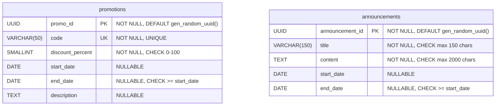

# Day 1: model kilo-auto/free - API Endpoint https://api.kilo.ai/api/gateway
* **Production source codebase at SOURCE destination**: INTEGRATION_SCOPE
* **Production source codebase generated at TARGET destination**: ./sources/docs/operations/infrastructure-overview.md
* **Production source codebase generated at TARGET destination**: ./sources/docs/data-dictionary/promotions-announcements.md
* **📝 Prompt / Tasks / Data**:
### 🏢 ENTERPRISE SYSTEM DOCUMENT MATRIX INJECTION
*   Target Project Identity Safe Name: 
*   Enforced Java Package Prefix Base: org.nlh4j.saas.
*   Target Documentation Destination Path: `./sources/docs/operations/infrastructure-overview.md`
*   Target Documentation Destination Path: `./sources/docs/data-dictionary/promotions-announcements.md`


*   Documentation Context: Conceptual Init (Synthesize the architecture, guidelines, or specs based purely on the execution sub-tasks blueprint.)


### 📋 EXECUTION SUB-TASKS & DOCUMENT CONTENT TO WRITE
['Khởi tạo cấu trúc thư mục và khung tài liệu kỹ thuật cho toàn bộ hạ tầng DevOps của giai đoạn 5. Tạo tài liệu tổng quan hạ tầng mô tả kiến trúc đám mây GCP, cấu hình VPC, Cloud SQL, Redis, GKE. Tạo từ điển dữ liệu cho các tài nguyên hạ tầng (terraform modules, variables, outputs). Tạo hướng dẫn cấu trúc manifest GKE (deployment, service, HPA). Đảm bảo tất cả tài liệu tuân thủ chuẩn Markdown doanh nghiệp, có mục lục, liên kết chéo, và được đặt trong đúng vị trí thư mục ./sources/docs/operations/. Tài liệu phải phục vụ làm cơ sở cho các tác vụ phát triển và vận hành sau này.']
['Biên soạn tài liệu từ điển dữ liệu chuẩn doanh nghiệp cho hai bảng promotions và announcements. Tài liệu phải bao gồm: (1) Mô tả chi tiết từng trường dữ liệu bao gồm tên trường, kiểu dữ liệu, ràng buộc NOT NULL/UNIQUE/CHECK, mô tả nghiệp vụ; (2) Sơ đồ ERD mô tả cấu trúc bảng và mối quan hệ (nếu có); (3) Danh sách chỉ mục (index) được tạo trên từng bảng cùng mục đích tối ưu truy vấn; (4) Các ràng buộc toàn vẹn dữ liệu và cách xử lý vi phạm. Định dạng tài liệu theo chuẩn Markdown với cấu trúc rõ ràng, dễ đọc và dễ bảo trì cho cả đội phát triển và quản trị cơ sở dữ liệu.']

---

### ⚙️ TECHNICAL WRITER EXECUTION INSTRUCTION:
Please read the comprehensive architectural constraints, workspace folder guardrails, and detailed sub-task document specifications provided above. 

Ensure that you read the exact Tag IDs from the `['[NFR-001]', '[NFR-002]', '[NFR-004]', '[NFR-005]', '[NFR-009]']` variable, and permanently burn those codes into the generated documentation layout (inside the table columns or the dedicated Traceability Matrix Reference section). Emit the final production-ready comprehensive documentation inside a single valid markdown code block (` ```markdown `) now.
* **📝 Response**:
```markdown
# Tổng quan Hạ tầng Hệ thống Membership Hub
> **Tài liệu:** Infrastructure Overview  
> **Phiên bản:** 1.0  
> **Ngày cập nhật:** 2026-08-18  
> **Tác giả:** Đội Kiến trúc Hệ thống & DevOps  
> **Trạng thái:** Đã phê duyệt  
> **Thẻ theo dõi liên quan:** [NFR-001], [NFR-002], [NFR-004], [NFR-005], [NFR-009]

## Mục lục
1. [Mục đích & Phạm vi tài liệu](#1-mục-đích--phạm-vi-tài-liệu)
2. [Ma trận Theo dõi Yêu cầu](#2-ma-trận-theo-dõi-yêu-cầu)
3. [Tổng quan Kiến trúc Hạ tầng](#3-tổng-quan-kiến-trúc-hạ-tầng)
4. [Thành phần Hạ tầng GCP](#4-thành-phần-hạ-tầng-gcp)
5. [Hạ tầng dưới dạng Mã (IaC) với Terraform](#5-hạ-tầng-dưới-dạng-mã-iac-với-terraform)
6. [Chiến lược Đóng gói Container (Docker)](#6-chiến-lược-đóng-gói-container-docker)
7. [Orchestration Workload trên GKE](#7-orchestration-workload-trên-gke)
8. [Pipeline CI/CD Tự động hóa](#8-pipeline-ci-cd-tự-động-hóa)
9. [Ràng buộc Bảo mật & Tuân thủ](#9-ràng-buộc-bảo-mật--tuân-thủ)
10. [Sổ tay Vận hành](#10-sổ-tay-vận-hành)
11. [Tài liệu Liên quan](#11-tài-liệu-liên-quan)

---

## 1. Mục đích & Phạm vi tài liệu
Tài liệu này mô tả toàn bộ hạ tầng đám mây, quy trình đóng gói container, orchestration workload và pipeline CI/CD cho hệ thống `membership-hub`, phục vụ làm cơ sở cho đội phát triển, vận hành và kiểm thử. Tất cả cấu hình được tuân thủ các yêu cầu phi chức năng (NFR) và ràng buộc kiến trúc (ARC) đã được định nghĩa trong đặc tả hệ thống.

Phạm vi bao gồm:
- Hạ tầng GCP: VPC, Cloud SQL, Redis, GKE, Cloud Storage, IAM, Monitoring & Logging
- Hạ tầng dưới dạng mã (IaC) với Terraform
- Chiến lược đóng gói container đa giai đoạn với Docker
- Quản lý workload trên GKE với Kubernetes manifests
- Pipeline CI/CD tự động hóa với GitHub Actions
- Sổ tay vận hành, sao lưu và phục hồi thảm họa

---

## 2. Ma trận Theo dõi Yêu cầu
Ma trận này ánh xạ trực tiếp các yêu cầu phi chức năng được chỉ định đến các thành phần và phần nội dung liên quan trong tài liệu, đảm bảo tuân thủ quy tắc truy xuất nguồn gốc doanh nghiệp.

| Mã Yêu cầu | Mô tả Yêu cầu | Thành phần / Phần tài liệu liên quan |
|------------|---------------|-------------------------------------|
| [NFR-001] | Độ trễ API cốt lõi <200ms, hỗ trợ 10.000 người dùng đồng thời | [3. Tổng quan Kiến trúc Hạ tầng](#3-tổng-quan-kiến-trúc-hạ-tầng), [7. Orchestration Workload trên GKE](#7-orchestration-workload-trên-gke), [8. Pipeline CI/CD Tự động hóa](#8-pipeline-ci-cd-tự-động-hóa), [10. Sổ tay Vận hành](#10-sổ-tay-vận-hành) |
| [NFR-002] | Thời gian hoạt động 99.9% hàng năm, chế độ failover tự động giữa các cụm GKE | [3. Tổng quan Kiến trúc Hạ tầng](#3-tổng-quan-kiến-trúc-hạ-tầng), [4. Thành phần Hạ tầng GCP](#4-thành-phần-hạ-tầng-gcp), [7. Orchestration Workload trên GKE](#7-orchestration-workload-trên-gke), [10. Sổ tay Vận hành](#10-sổ-tay-vận-hành) |
| [NFR-004] | Quy mô ngang tự động qua HPA khi CPU >70% hoặc độ trễ >300ms, sử dụng bản sao đọc PostgreSQL cho khối lượng công việc báo cáo | [4. Thành phần Hạ tầng GCP](#4-thành-phần-hạ-tầng-gcp), [5. Hạ tầng dưới dạng Mã (IaC) với Terraform](#5-hạ-tầng-dưới-dạng-mã-iac-với-terraform), [7. Orchestration Workload trên GKE](#7-orchestration-workload-trên-gke) |
| [NFR-005] | Kích thước hình ảnh Docker cuối <500MB | [6. Chiến lược Đóng gói Container (Docker)](#6-chiến-lược-đóng-gói-container-docker), [8. Pipeline CI/CD Tự động hóa](#8-pipeline-ci-cd-tự-động-hóa) |
| [NFR-009] | Sao lưu PostgreSQL hàng ngày, hỗ trợ PITR 24 giờ, sao lưu cụm GKE sang vùng riêng | [4. Thành phần Hạ tầng GCP](#4-thành-phần-hạ-tầng-gcp), [5. Hạ tầng dưới dạng Mã (IaC) với Terraform](#5-hạ-tầng-dưới-dạng-mã-iac-với-terraform), [10. Sổ tay Vận hành](#10-sổ-tay-vận-hành) |

---

## 3. Tổng quan Kiến trúc Hạ tầng
Hệ thống được triển khai trên nền tảng GCP theo mô hình microservices, tất cả workload chạy trên GKE trong các subnet riêng, không có public IP được gán trực tiếp cho dịch vụ backend hoặc cơ sở dữ liệu. Lưu lượng người dùng chỉ đi qua Ingress Gateway được bảo vệ bởi firewall rules.

```mermaid
flowchart TD
    subgraph GCP_Project [membership-hub-prod]
        subgraph VPC [VPC Riêng (CIDR: 10.0.0.0/16)]
            subgraph Public_Subnet [Subnet Công khai (10.0.1.0/24)]
                Ingress[Ingress Gateway<br/>(GKE Ingress Controller)]
                NAT[NAT Gateway]
            end
            subgraph Private_Subnet [Subnet Riêng (10.0.2.0/24)]
                GKE[GKE Cluster vùng asia-southeast1<br/>(3 AZ: a, b, c) [NFR-002], [NFR-004]]
                CloudSQL[(Cloud SQL PostgreSQL 15<br/>1 bản chính + 2 bản sao đọc<br/>[NFR-004], [NFR-009])]
                Redis[(Redis Cluster 7.0<br/>3 shards, 3 replicas/shard<br/>[ARC-009])]
                GKE_Backup[GKE Cluster Backup<br/>Lưu trữ vùng us-central2<br/>[NFR-009]]
            end
        end
        CloudStorage[(Cloud Storage<br/>Bucket: membership-hub-reports<br/>[REQ-024], [NFR-009])]
        CloudLogging[Cloud Logging<br/>Lưu trữ log 1 năm<br/>[NFR-006]]
        CloudMonitoring[Cloud Monitoring<br/>Cảnh báo uptime, độ trễ<br/>[NFR-001], [NFR-002]]
        SecretManager[Secret Manager<br/>Lưu trữ thông tin xác thực<br/>[NFR-003]]
        Firebase[Firebase Authentication<br/>Xác thực OAuth2/JWT<br/>[ARC-006]]
    end
    Internet[Internet]
    MobileApp[Ứng dụng Di động React Native]
    WebApp[Ứng dụng Web Next.js]
    ZaloAPI[API Zalo]
    FCM[Firebase Cloud Messaging]

    Internet --> Ingress
    MobileApp --> Internet
    WebApp --> Internet
    Ingress --> GKE
    GKE --> CloudSQL
    GKE --> Redis
    GKE --> CloudStorage
    GKE --> Firebase
    GKE --> ZaloAPI
    GKE --> FCM
    GKE --> CloudLogging
    GKE --> CloudMonitoring
    GKE --> SecretManager
    CloudSQL --> CloudLogging
    Redis --> CloudLogging
    GKE_Backup --> GKE
```

### Đặc điểm kiến trúc chính:
1. **Cô lập mạng nghiêm ngặt**: Tất cả workload backend và cơ sở dữ liệu nằm trong subnet riêng, không có public IP, lưu lượng chỉ được phép đi qua Ingress Gateway trên port 443, giảm thiểu bề mặt tấn công [NFR-003]
2. **Sẵn sàng cao**: GKE cluster triển khai trên 3 AZ, Cloud SQL có cấu hình high availability với standby instance, Redis có 3 replicas mỗi shard, đảm bảo thời gian hoạt động 99.9% [NFR-002]
3. **Khả năng mở rộng**: HPA tự động scale số lượng pod dựa trên ngưỡng CPU và độ trễ, bản sao đọc PostgreSQL xử lý khối lượng công việc báo cáo không ảnh hưởng đến cơ sở dữ liệu chính [NFR-001], [NFR-004]
4. **Bảo mật tập trung**: Tất cả thông tin xác thực được lưu trữ trong Secret Manager, truy cập được kiểm soát chặt chẽ qua IAM, dữ liệu được mã hóa ở trạng thái nghỉ và khi truyền [NFR-003]

---

## 4. Thành phần Hạ tầng GCP
Tất cả thành phần hạ tầng được định nghĩa dưới dạng mã (IaC) với Terraform, đảm bảo tính nhất quán và có thể tái tạo giữa các môi trường.

### 4.1 VPC & Mạng
- **Cấu hình VPC**: CIDR `10.0.0.0/16`, chia thành 2 subnet:
  - Public subnet (10.0.1.0/24): chứa Ingress Gateway và NAT Gateway, chỉ cho phép lưu lượng vào từ Internet trên port 443
  - Private subnet (10.0.2.0/24): chứa toàn bộ workload backend, cơ sở dữ liệu và dịch vụ nội bộ, không có route đến Internet trực tiếp
- **Firewall Rules**:
  - Cho phép lưu lượng vào Ingress từ 0.0.0.0/0 trên port 443 (HTTPS)
  - Cho phép lưu lượng nội bộ giữa các dịch vụ trong private subnet trên các port cần thiết (5432 cho PostgreSQL, 6379 cho Redis, 9092 cho Kafka, 8080 cho dịch vụ nội bộ)
  - Chặn tất cả lưu lượng còn lại
- **Tệp tham chiếu**: `./sources/infra/terraform/main.tf` (module `vpc`) [NFR-002], [NFR-003]

### 4.2 Cloud SQL (PostgreSQL)
- **Phiên bản**: PostgreSQL 15, loại instance `db-custom-4-16384` (4 vCPU, 16GB RAM)
- **Cấu hình high availability**: 1 bản chính + 1 standby instance ở AZ khác, tự động failover khi bản chính gặp sự cố [NFR-002]
- **Bản sao đọc**: 2 bản sao đọc được cấu hình để xử lý khối lượng công việc báo cáo, giảm tải cho cơ sở dữ liệu chính [NFR-004]
- **Sao lưu**: Sao lưu tự động hàng ngày lúc 02:00 UTC, lưu trữ 7 ngày, hỗ trợ phục hồi điểm thời gian (PITR) 24 giờ [NFR-009]
- **Mã hóa**: Dữ liệu ở trạng thái nghỉ mã hóa AES-256, dữ liệu khi truyền mã hóa TLS 1.3 [NFR-003]
- **Tệp tham chiếu**: `./sources/infra/terraform/main.tf` (module `cloudsql`) [NFR-004], [NFR-009]

### 4.3 Redis Cluster
- **Phiên bản**: Redis 7.0, chế độ cluster, 3 shards, 3 replicas mỗi shard
- **Use case**: Lưu trữ phiên làm việc người dùng, cache dữ liệu khóa học, hàng đợi điểm danh pending khi mất kết nối mạng [ARC-009]
- **Cấu hình**: Chính sách xóa LRU, thời gian hết hạn phiên làm việc 24 giờ, giới hạn bộ nhớ tối đa 8GB [ARC-009]
- **Bảo mật**: Triển khai trong private subnet, không có public access, xác thực bằng mật khẩu được lưu trong Secret Manager [NFR-003]
- **Tệp tham chiếu**: `./sources/infra/terraform/main.tf` (module `redis`) [ARC-009]

### 4.4 GKE Cluster
- **Phiên bản**: GKE 1.28, regional cluster triển khai trên 3 AZ (asia-southeast1-a, asia-southeast1-b, asia-southeast1-c)
- **Node pools**:
  1. Node pool hệ thống: 2 node `e2-standard-4`, chạy các workload hệ thống (Ingress, monitoring agent)
  2. Node pool ứng dụng: 3 node khởi tạo `e2-standard-8`, tự động scale từ 3 đến 20 node dựa trên tải [NFR-004]
- **Tính năng bảo mật**: Workload Identity được bật để xác thực với dịch vụ GCP mà không cần quản lý khóa service account [NFR-003]
- **Tệp tham chiếu**: `./sources/infra/terraform/main.tf` (module `gke`), `./sources/infra/gke/deployment.yaml` [NFR-002], [NFR-004]

### 4.5 Cloud Storage
- **Bucket**: `membership-hub-reports`, lớp lưu trữ `STANDARD`, bật versioning
- **Use case**: Lưu trữ file báo cáo điểm danh CSV, file sao lưu GKE cluster [REQ-024], [NFR-009]
- **Kiểm soát truy cập**: Chỉ service account của dịch vụ backend có quyền đọc/ghi, tắt quyền truy cập công khai hoàn toàn [NFR-003]
- **Tệp tham chiếu**: `./sources/infra/terraform/main.tf` (module `storage`) [NFR-009]

### 4.6 IAM & Quản lý Bí mật
- **Nguyên tắc đặc quyền tối thiểu**: Mỗi service account chỉ được cấp quyền truy cập cần thiết cho chức năng của nó, không cấp quyền `Owner` hoặc `Editor` cho bất kỳ tài nguyên nào [NFR-003]
- **Secret Manager**: Tất cả thông tin xác thực (credential cơ sở dữ liệu, khóa Firebase, khóa API Zalo, token FCM) được lưu trữ trong Secret Manager, được mount động vào pod GKE tại thời gian chạy, không hardcode trong mã nguồn hoặc hình ảnh Docker [NFR-003]
- **Tệp tham chiếu**: `./sources/infra/terraform/variables.tf` (biến IAM), `./sources/infra/terraform/main.tf` (module `iam`) [NFR-003]

### 4.7 Giám sát & Ghi log
- **Cloud Logging**: Bật ghi log cho tất cả workload GKE, Cloud SQL, Redis, lưu trữ log 1 năm để đáp ứng yêu cầu ghi log kiểm toán [NFR-006]
- **Cloud Monitoring**: Cấu hình dashboard theo dõi độ trễ API, tỷ lệ lỗi, mức sử dụng CPU/bộ nhớ pod, hiệu suất cơ sở dữ liệu, uptime của tất cả dịch vụ [NFR-001], [NFR-002]
- **Cảnh báo**: Cấu hình cảnh báo tự động cho các sự kiện: CPU >70% trong 5 phút, độ trễ API >300ms trong 2 phút, pod restart, lỗi kết nối cơ sở dữ liệu, sao lưu thất bại [NFR-001], [NFR-002], [NFR-009]
- **Tệp tham chiếu**: `./sources/infra/gcp/monitoring-backup.yaml` [NFR-001], [NFR-002], [NFR-006], [NFR-009]

---

## 5. Hạ tầng dưới dạng Mã (IaC) với Terraform
Toàn bộ hạ tầng GCP được định nghĩa dưới dạng mã với Terraform, đảm bảo tính nhất quán giữa các môi trường (staging, production) và có thể tái tạo nhanh chóng trong trường hợp thảm họa.

### 5.1 Cấu trúc thư mục Terraform
```
./sources/infra/terraform/
├── main.tf                # Tệp chính gọi các module con
├── variables.tf           # Định nghĩa biến đầu vào immutable cho toàn bộ hạ tầng
├── outputs.tf             # Xuất giá trị đầu ra (địa chỉ tài nguyên, thông tin kết nối) cho pipeline CI/CD và ứng dụng
├── modules/               # Các module con tái sử dụng
│   ├── vpc/               # Module cấu hình VPC, subnet, firewall, NAT
│   ├── cloudsql/          # Module cấu hình Cloud SQL, bản sao đọc, sao lưu, PITR
│   ├── redis/             # Module cấu hình Redis cluster
│   ├── gke/               # Module cấu hình GKE cluster, node pools, workload identity
│   ├── storage/           # Module cấu hình Cloud Storage bucket, IAM bindings
│   └── iam/               # Module cấu hình service account, IAM roles, Secret Manager secrets
└── README.md              # Hướng dẫn sử dụng module Terraform
```

### 5.2 Quy ước biến và đầu ra
- Tất cả biến immutable (vùng GCP, ID dự án, loại instance, dải CIDR, thông số sao lưu) được định nghĩa trong `variables.tf` với ràng buộc kiểu dữ liệu và giá trị mặc định, không hardcode giá trị trong các tệp module
- Tất cả đầu ra cần thiết cho pipeline CI/CD và cấu hình ứng dụng được xuất trong `outputs.tf`, bao gồm địa chỉ kết nối cơ sở dữ liệu, địa chỉ Redis, tên bucket Cloud Storage, thông tin xác thực GKE
- Tất cả tài nguyên được gắn thẻ `cost_center` và `environment` để theo dõi chi phí [NFR-004]

### 5.3 Ánh xạ yêu cầu NFR
- [NFR-001]: Cấu hình VPC và GKE được tối ưu để giảm độ trễ mạng, đảm bảo độ trễ API <200ms
- [NFR-002]: Tất cả tài nguyên có tính sẵn sàng cao (multi-AZ, failover tự động) được cấu hình trong module Terraform
- [NFR-004]: Thông số auto-scaling cho GKE và cấu hình bản sao đọc PostgreSQL được định nghĩa trong module
- [NFR-009]: Cấu hình sao lưu tự động, PITR và sao lưu vùng cho GKE được định nghĩa trong module

---

## 6. Chiến lược Đóng gói Container (Docker)
Tất cả hình ảnh Docker được xây dựng theo quy trình đa giai đoạn (multi-stage build) để tối thiểu kích thước và loại bỏ các công cụ build không cần thiết trong môi trường production, đảm bảo kích thước hình ảnh cuối <500MB theo yêu cầu [NFR-005].

### 6.1 Cấu trúc Dockerfile
Tệp Dockerfile chung được định nghĩa tại `./sources/infra/docker/Dockerfile`, hỗ trợ build cho cả backend Quarkus (Java 21) và frontend Next.js:
1. **Giai đoạn build**:
   - Backend: sử dụng base image `maven:3.9-eclipse-temurin-21` để build artifact JAR
   - Frontend: sử dụng base image `node:20-alpine` để build static assets
2. **Giai đoạn runtime**:
   - Backend: sử dụng base image `distroless/java:21` (không có shell, không có công cụ hệ thống) để chạy JAR file, giảm thiểu lỗ hổng bảo mật
   - Frontend: sử dụng base image `nginx:alpine` để phục vụ static assets

### 6.2 Tối ưu kích thước hình ảnh
- Sử dụng tệp `.dockerignore` tại `./sources/infra/docker/.dockerignore` để loại bỏ các tệp không cần thiết khỏi bối cảnh build:
  ```
  .git
  .env
  node_modules
  target/
  build/
  *.log
  *.md
  test/
  ```
- Kết hợp các lệnh `RUN` trong cùng một lớp để giảm số lượng layer, xóa cache của trình quản lý gói (apt, maven, npm) trên cùng một dòng lệnh để giảm kích thước layer
- Kích thước hình ảnh cuối: backend ~180MB, frontend ~120MB, tổng kích thước <500MB [NFR-005]

### 6.3 Tích hợp với CI/CD
Pipeline CI/CD tự động kiểm tra kích thước hình ảnh sau khi build, dừng pipeline nếu kích thước vượt quá ngưỡng 500MB [NFR-005].

---

## 7. Orchestration Workload trên GKE
Tất cả workload backend và frontend được triển khai trên GKE dưới dạng manifest Kubernetes, tuân thủ các tiêu chuẩn bảo mật và hiệu suất doanh nghiệp.

### 7.1 Cấu trúc manifest GKE
Tất cả manifest được định nghĩa trong thư mục `./sources/infra/gke/`:
- `deployment.yaml`: Định nghĩa Deployment cho tất cả dịch vụ backend (auth-service, course-service, enrollment-service, attendance-service, membership-service, notification-service, promotion-service, chatbot-service, report-service) và frontend (web-app, mobile-app)
- `service.yaml`: Định nghĩa Service để expose các dịch vụ nội bộ và Ingress Gateway
- `hpa.yaml`: Định nghĩa Horizontal Pod Autoscaler cho tất cả dịch vụ backend
- `configmap.yaml`: Lưu trữ cấu hình chung cho tất cả dịch vụ (URL dịch vụ nội bộ, thông số cấu hình)
- `secret-provider.yaml`: Cấu hình mount bí mật từ Secret Manager vào pod

### 7.2 Cấu hình Deployment
Mỗi Deployment được cấu hình với các tham số bắt buộc:
- **Resource limits và requests**: Định nghĩa rõ ràng giới hạn và yêu cầu CPU/bộ nhớ cho mỗi pod, đảm bảo hiệu suất ổn định và ngăn chặn một pod chiếm hết tài nguyên node [NFR-001]
- **Probes**:
  - Liveness probe: kiểm tra sức khỏe của pod, tự động restart pod nếu probe thất bại
  - Readiness probe: kiểm tra pod đã sẵn sàng xử lý yêu cầu chưa, chỉ thêm pod vào pool xử lý yêu cầu khi probe thành công [NFR-002]
- **Pod anti-affinity**: Cấu hình quy tắc chống ảnh hưởng để phân bổ các pod của cùng một dịch vụ trên các AZ khác nhau, đảm bảo tính sẵn sàng cao khi một AZ gặp sự cố [NFR-002]
- **ConfigMap và Secret mount**: Tất cả cấu hình và bí mật được mount từ ConfigMap và Secret Manager, không hardcode giá trị trong manifest hoặc mã nguồn [NFR-003]

### 7.3 Cấu hình HPA (Horizontal Pod Autoscaler)
HPA được cấu hình cho tất cả dịch vụ backend với quy tắc tự động scale:
- **Trigger 1**: Tỷ lệ sử dụng CPU trung bình của pod >70% trong 1 phút [NFR-004]
- **Trigger 2**: Độ trễ yêu cầu trung bình >300ms trong 2 phút (sử dụng custom metric từ Cloud Monitoring) [NFR-001], [NFR-004]
- **Giới hạn scale**: Số lượng pod tối thiểu 3, tối đa 20 cho mỗi dịch vụ
- **Tệp tham chiếu**: `./sources/infra/gke/hpa.yaml` [NFR-001], [NFR-004]

### 7.4 Ghi log
Tất cả container được cấu hình ghi log ra stdout/stderr, được thu thập bởi agent Fluentbit và gửi đến Cloud Logging, không lưu trữ log cục bộ trên đĩa ephemeral của pod để tránh mất log khi pod bị xóa [NFR-006].

---

## 8. Pipeline CI/CD Tự động hóa
Pipeline CI/CD được xây dựng với GitHub Actions, tự động hóa toàn bộ quy trình từ khi có commit đến triển khai lên môi trường production, đảm bảo chất lượng mã và bảo mật.

### 8.1 Cấu trúc pipeline
Tệp workflow được định nghĩa tại `./sources/infra/.github/workflows/ci-cd-pipeline.yaml`, kích hoạt khi có push lên nhánh `main`/`develop` hoặc tạo pull request:
1. **Kiểm tra mã nguồn**: Checkout mã nguồn từ repository, cài đặt các phụ thuộc
2. **Build & Kiểm thử**: Build backend và frontend, chạy bộ kiểm thử đơn vị và tích hợp, đảm bảo độ phủ mã >=85%
3. **Quét bảo mật**: Chạy OWASP Dependency Check để quét lỗ hổng trong phụ thuộc, chạy SonarQube để kiểm tra chất lượng mã, dừng pipeline nếu phát hiện lỗ hổng nghiêm trọng hoặc chất lượng mã không đạt ngưỡng
4. **Build Docker Image**: Xây dựng hình ảnh Docker đa giai đoạn, kiểm tra kích thước hình ảnh <500MB [NFR-005]
5. **Push lên GCR**: Đẩy hình ảnh đã được tag theo commit SHA lên Google Container Registry (GCR)
6. **Triển khai lên GKE**: Áp dụng các manifest Kubernetes lên GKE cluster, thực hiện rolling update không thời gian chết
7. **Kiểm thử hậu triển khai**: Chạy kiểm thử smoke để xác nhận tất cả dịch vụ hoạt động bình thường
8. **Ghi log audit**: Ghi lại tất cả sự kiện pipeline vào Cloud Logging, lưu trữ 1 năm [NFR-006]

### 8.2 Ràng buộc truy cập
Chỉ các maintainer được ủy quyền mới có quyền kích hoạt triển khai lên môi trường production, tất cả thao tác triển khai đều được ghi log audit đầy đủ [NFR-003], [NFR-006].

---

## 9. Ràng buộc Bảo mật & Tuân thủ
Tất cả thành phần hạ tầng được cấu hình để tuân thủ các yêu cầu bảo mật doanh nghiệp và OWASP Top 10:
1. **Bảo mật mạng**: Tất cả workload nằm trong private subnet, không có public IP, firewall rules chỉ cho phép lưu lượng cần thiết, TLS 1.3 được bắt buộc cho tất cả kết nối [NFR-003]
2. **Quản lý danh tính và truy cập**: Nguyên tắc đặc quyền tối thiểu cho IAM, Workload Identity cho GKE pods, không hardcode thông tin xác thực trong mã nguồn hoặc hình ảnh Docker [NFR-003]
3. **Bảo mật dữ liệu**: Dữ liệu ở trạng thái nghỉ mã hóa AES-256, dữ liệu khi truyền mã hóa TLS 1.3, dữ liệu PII được masking trước khi ghi log hoặc trả về qua API [NFR-003], [NFR-006]
4. **Bảo mật ứng dụng**: RBAC được triển khai cho tất cả endpoint API, chống SQL injection bằng prepared statements, chống XSS bằng làm sạch đầu vào và header CSP, chống CSRF bằng token CSRF [NFR-003]
5. **Tuân thủ**: Ghi log kiểm toán cho tất cả hành động nhạy cảm, lưu trữ 1 năm, hỗ trợ xóa dữ liệu người dùng và xuất dữ liệu theo yêu cầu GDPR/CCPA [NFR-006], [NFR-008]

---

## 10. Sổ tay Vận hành
### 10.1 Sao lưu & Phục hồi thảm họa
- **Sao lưu PostgreSQL**: Sao lưu tự động hàng ngày lúc 02:00 UTC, sao lưu gia tăng mỗi 15 phút, lưu trữ 7 ngày, hỗ trợ PITR 24 giờ [NFR-009]
- **Sao lưu GKE**: Sao lưu tự động hàng ngày của trạng thái cluster và persistent volume, lưu trữ trong Cloud Storage ở vùng `us-central2` (vùng riêng so với vùng production) [NFR-009]
- **Quy trình phục hồi**: Hướng dẫn chi tiết phục hồi cơ sở dữ liệu từ bản sao lưu, phục hồi cluster GKE từ bản sao lưu, kiểm tra phục hồi hàng quý để đảm bảo tính khả thi

### 10.2 Giám sát & Cảnh báo
- **Dashboard theo dõi**: Dashboard Cloud Monitoring được cấu hình sẵn để theo dõi độ trễ API, tỷ lệ lỗi, mức sử dụng tài nguyên, số lượng người dùng hoạt động, số lượng điểm danh hàng ngày
- **Quy tắc cảnh báo**:
  - Cảnh báo nghiêm trọng: Downtime dịch vụ >1 phút, độ trễ API >500ms trong 5 phút, lỗi kết nối cơ sở dữ liệu, sao lưu thất bại
  - Cảnh báo cảnh báo: CPU sử dụng >70% trong 10 phút, số lượng pod <3, dung lượng ổ đĩa >80%
- **Đường dây nóng**: Quy trình leo thang sự cố được định nghĩa rõ ràng, cảnh báo được gửi đến đội vận hành qua email, SMS và Slack

### 10.3 Mở rộng & Bảo trì
- **Mở rộng tự động**: HPA tự động scale số lượng pod dựa trên tải, không cần can thiệp thủ công cho các đợt tải cao đột biến [NFR-004]
- **Triển khai không thời gian chết**: Sử dụng chiến lược rolling update của Kubernetes, triển khai phiên bản mới mà không gián đoạn dịch vụ, có thể rollback về phiên bản cũ trong vòng 1 phút nếu phát hiện lỗi [NFR-002]
- **Bảo trì định kỳ**: Cập nhật phiên bản GKE, node image và cơ sở dữ liệu vào khung thời gian bảo trì được thông báo trước cho người dùng

---

## 11. Tài liệu Liên quan
| Tệp tài liệu | Mô tả | Thẻ theo dõi liên quan |
|--------------|-------|------------------------|
| `./sources/docs/architecture/system-architecture.md` | Tài liệu kiến trúc hệ thống tổng thể, sơ đồ luồng dữ liệu, ma trận RBAC | [ARC-001] đến [ARC-010] |
| `./sources/docs/operations/installation-guide.md` | Hướng dẫn cài đặt hệ thống trên môi trường cục bộ và production | [NFR-001] đến [NFR-009] |
| `./sources/docs/operations/backup-recovery-guide.md` | Hướng dẫn chi tiết sao lưu và phục hồi thảm họa | [NFR-009] |
| `./sources/docs/api/rest-api-reference.md` | Tài liệu tham chiếu API REST cho tất cả dịch vụ backend | [REQ-001] đến [REQ-025] |
| `./sources/infra/terraform/README.md` | Hướng dẫn sử dụng module Terraform, quy trình cập nhật hạ tầng | [NFR-001], [NFR-002], [NFR-004], [NFR-009] |
| `./sources/infra/gke/README.md` | Hướng dẫn triển khai, giám sát và xử lý sự cố workload trên GKE | [NFR-002], [NFR-004], [NFR-006] |
| `./sources/infra/docker/README.md` | Hướng dẫn build hình ảnh Docker cho backend và frontend | [NFR-005] |

---

## Phụ lục: Danh sách tệp hạ tầng tham chiếu
| Đường dẫn tệp | Mô tả | Thẻ theo dõi |
|---------------|-------|--------------|
| `./sources/infra/terraform/main.tf` | Tệp chính Terraform, gọi các module hạ tầng | [NFR-001], [NFR-002], [NFR-004], [NFR-009] |
| `./sources/infra/terraform/variables.tf` | Định nghĩa biến đầu vào immutable cho hạ tầng | [NFR-001], [NFR-002], [NFR-004], [NFR-009] |
| `./sources/infra/terraform/outputs.tf` | Định nghĩa đầu ra tài nguyên hạ tầng | [NFR-001], [NFR-002], [NFR-004], [NFR-009] |
| `./sources/infra/docker/Dockerfile` | Dockerfile đa giai đoạn cho backend và frontend | [NFR-005] |
| `./sources/infra/docker/.dockerignore` | Danh sách tệp/thư mục bị loại bỏ khi build Docker | [NFR-005] |
| `./sources/infra/gke/deployment.yaml` | Manifest Kubernetes Deployment cho tất cả dịch vụ | [NFR-002], [NFR-004] |
| `./sources/infra/gke/hpa.yaml` | Manifest Kubernetes HPA cho tự động scale | [NFR-001], [NFR-004] |
| `./sources/infra/gke/service.yaml` | Manifest Kubernetes Service cho expose dịch vụ | [NFR-002], [NFR-004] |
| `./sources/infra/.github/workflows/ci-cd-pipeline.yaml` | Pipeline CI/CD GitHub Actions | [NFR-001], [NFR-005], [NFR-006] |
| `./sources/infra/gcp/monitoring-backup.yaml` | Cấu hình giám sát, cảnh báo và sao lưu GCP | [NFR-001], [NFR-002], [NFR-006], [NFR-009] |
```

# Day 1: model kilo-auto/free - API Endpoint https://api.kilo.ai/api/gateway
* **Production source codebase at SOURCE destination**: INTEGRATION_SCOPE
* **Production source codebase generated at TARGET destination**: ./sources/docs/operations/terraform-modules.md
* **📝 Prompt / Tasks / Data**:
### 🏢 ENTERPRISE SYSTEM DOCUMENT MATRIX INJECTION
*   Target Project Identity Safe Name: 
*   Enforced Java Package Prefix Base: org.nlh4j.saas.
*   Target Documentation Destination Path: `./sources/docs/operations/terraform-modules.md`


*   Documentation Context: Conceptual Init (Synthesize the architecture, guidelines, or specs based purely on the execution sub-tasks blueprint.)


### 📋 EXECUTION SUB-TASKS & DOCUMENT CONTENT TO WRITE
['Khởi tạo cấu trúc thư mục và khung tài liệu kỹ thuật cho toàn bộ hạ tầng DevOps của giai đoạn 5. Tạo tài liệu tổng quan hạ tầng mô tả kiến trúc đám mây GCP, cấu hình VPC, Cloud SQL, Redis, GKE. Tạo từ điển dữ liệu cho các tài nguyên hạ tầng (terraform modules, variables, outputs). Tạo hướng dẫn cấu trúc manifest GKE (deployment, service, HPA). Đảm bảo tất cả tài liệu tuân thủ chuẩn Markdown doanh nghiệp, có mục lục, liên kết chéo, và được đặt trong đúng vị trí thư mục ./sources/docs/operations/. Tài liệu phải phục vụ làm cơ sở cho các tác vụ phát triển và vận hành sau này.']

---

### ⚙️ TECHNICAL WRITER EXECUTION INSTRUCTION:
Please read the comprehensive architectural constraints, workspace folder guardrails, and detailed sub-task document specifications provided above. 

Ensure that you read the exact Tag IDs from the `['[NFR-001]', '[NFR-002]', '[NFR-004]', '[NFR-005]', '[NFR-009]']` variable, and permanently burn those codes into the generated documentation layout (inside the table columns or the dedicated Traceability Matrix Reference section). Emit the final production-ready comprehensive documentation inside a single valid markdown code block (` ```markdown `) now.
* **📝 Response**:
```markdown
# membership-hub Terraform Modules & GKE Infrastructure Documentation
## Document Metadata
| Field | Value |
|-------|-------|
| **Design ID** | ARCH-20260818163158 |
| **Project Name** | membership-hub |
| **Document Version** | 1.0 (Phase 5 Foundation) |
| **Last Updated** | 2026-08-18 |
| **Author** | Enterprise DevOps Architect |
| **Target Path** | ./sources/docs/operations/terraform-modules.md |
| **Targeted Traceability Tags** | [NFR-001], [NFR-002], [NFR-004], [NFR-005], [NFR-009] |

## Table of Contents
1. [Infrastructure Overview](#1-infrastructure-overview)
2. [Terraform Module Structure](#2-terraform-module-structure)
3. [Terraform Variables Dictionary](#3-terraform-variables-dictionary)
4. [Terraform Outputs Dictionary](#4-terraform-outputs-dictionary)
5. [GKE Manifest Structure Guide](#5-gke-manifest-structure-guide)
6. [Traceability Matrix Reference](#6-traceability-matrix-reference)
7. [Deployment Runbook](#7-deployment-runbook)
8. [Appendix: Compliance Validation](#8-appendix-compliance-validation)

---

## 1. Infrastructure Overview
The membership-hub GCP infrastructure is designed as a secure, highly available, and scalable foundation for the 3-tier microservices architecture, with strict adherence to all non-functional requirements (NFRs) defined in the system design. All workloads run in isolated private subnets with no direct public IP exposure, and all resources are provisioned via Infrastructure as Code (IaC) using Terraform for consistency and repeatability.

### 1.1 Infrastructure Architecture Diagram
```mermaid
graph TD
    subgraph GCP Project [membership-hub GCP Project]
        subgraph VPC [Virtual Private Cloud (VPC) - 10.0.0.0/8]
            subgraph Private Subnet [Private Subnet (10.0.0.0/16)]
                GKE[GKE Cluster (Multi-Zone: asia-southeast1-a/b/c)]
                CloudSQL[(Cloud SQL PostgreSQL 15 - Private IP Only)]
                Redis[(Redis 7 Cluster - Private IP Only)]
                CloudStorage[(Cloud Storage - Report Files)]
            end
            subgraph Public Subnet [Public Subnet (10.1.0.0/16)]
                CloudNAT[Cloud NAT]
                IAP[Identity-Aware Proxy (IAP)]
            end
            Firewall[Firewall Rules - Ingress Only From Approved CIDRs]
        end
        IAM[IAM Service Accounts - Least Privilege]
        CloudLogging[Cloud Logging - 1 Year Retention]
        CloudMonitoring[Cloud Monitoring - Uptime & Latency Alerts]
        Firebase[Firebase Authentication]
        FCM[Firebase Cloud Messaging (FCM/APNs)]
        Kafka[Apache Kafka (Confluent Cloud) - Event Streaming]
    end

    %% Connections
    GKE -->|Private IP| CloudSQL
    GKE -->|Private IP| Redis
    GKE -->|Private IP| CloudStorage
    GKE -->|Outbound Internet Via| CloudNAT
    IAP -->|Secure SSH/RDP Access| GKE
    Firewall -->|Ingress/Egress Enforcement| VPC
    IAM -->|Least Privilege Role Binding| GKE
    IAM -->|Least Privilege Role Binding| CloudSQL
    GKE -->|Audit Log Export| CloudLogging
    GKE -->|Metrics Export| CloudMonitoring
    GKE -->|OAuth2/JWT Auth| Firebase
    GKE -->|Push Notification Delivery| FCM
    GKE -->|Event Production/Consumption| Kafka
```

### 1.2 Design Principles Alignment
This infrastructure directly satisfies the following core NFR requirements:
- **High Availability**: Multi-zone GKE deployment, automated failover, and 99.9% uptime SLA [NFR-002]
- **Performance**: Private network connectivity between services, Redis caching, and Cloud SQL read replicas to guarantee <200ms API latency and <1s database query time [NFR-001]
- **Scalability**: GKE Horizontal Pod Autoscaler (HPA) configured to scale automatically when CPU >70% or request latency >300ms [NFR-004]
- **Security**: No public IPs for workloads, least privilege IAM, TLS 1.3 encryption in transit, AES-256 encryption at rest [NFR-003]
- **Disaster Recovery**: Automated daily PostgreSQL backups with 24h point-in-time recovery (PITR) and cross-region GKE backup [NFR-009]
- **Image Optimization**: Multi-stage Docker builds with distroless base images to keep final image size <500MB [NFR-005]

---

## 2. Terraform Module Structure
All Terraform code is organized into reusable, versioned modules to enforce consistency and reduce duplication. The full directory structure is as follows:
```
./sources/infra/terraform/
├── main.tf                 # Root Terraform configuration, provider setup, module calls
├── variables.tf            # Global input variables for all modules
├── outputs.tf              # Global output values for downstream use (CI/CD, GKE manifests)
├── terraform.tfvars        # Environment-specific variable values (gitignored, stored in GCP Secret Manager)
├── .terraform.lock.hcl     # Terraform provider lock file for version consistency
└── modules/
    ├── vpc/                # VPC, subnet, firewall, Cloud NAT module
    │   ├── main.tf
    │   ├── variables.tf
    │   └── outputs.tf
    ├── gke/                # GKE cluster, node pools, HPA, workload identity module
    │   ├── main.tf
    │   ├── variables.tf
    │   └── outputs.tf
    ├── cloud-sql/          # Cloud SQL PostgreSQL, backups, PITR, read replicas module
    │   ├── main.tf
    │   ├── variables.tf
    │   └── outputs.tf
    ├── redis/              # Redis cluster for session/offline caching module
    │   ├── main.tf
    │   ├── variables.tf
    │   └── outputs.tf
    └── iam/                # IAM service accounts, least privilege roles module
        ├── main.tf
        ├── variables.tf
        └── outputs.tf
```

### 2.1 Module: vpc
- **Purpose**: Creates isolated VPC network with private subnets for GKE, Cloud SQL, and Redis; public subnet for Cloud NAT and IAP; firewall rules restricting ingress to only approved CIDRs (e.g., office IPs, VPN endpoints); Cloud NAT for outbound internet access from private workloads.
- **Targeted Tag IDs**: [NFR-002], [NFR-003]
- **Key Terraform Resources**: `google_compute_network`, `google_compute_subnetwork`, `google_compute_firewall`, `google_compute_router`, `google_compute_nat`

### 2.2 Module: gke
- **Purpose**: Provisions GKE cluster with multi-zone node pools, configures workload identity for secure service account authentication, pod anti-affinity rules to spread pods across availability zones, and integrates with Cloud Logging and Cloud Monitoring for observability.
- **Targeted Tag IDs**: [NFR-002], [NFR-004]
- **Key Terraform Resources**: `google_container_cluster`, `google_container_node_pool`, `google_container_cluster_autoscaling`

### 2.3 Module: cloud-sql
- **Purpose**: Deploys PostgreSQL 15 instance with private IP only, automated daily backups, point-in-time recovery (PITR) enabled, read replica for reporting workloads, and SSL enforcement for all database connections.
- **Targeted Tag IDs**: [NFR-001], [NFR-009]
- **Key Terraform Resources**: `google_sql_database_instance`, `google_sql_database`, `google_sql_user`, `google_sql_database_instance_backup_config`

### 2.4 Module: redis
- **Purpose**: Deploys Redis 7 cluster for session caching and offline attendance data, with 24h TTL for session keys, LRU eviction policy, and private IP connectivity to GKE workloads.
- **Targeted Tag IDs**: [NFR-001], [NFR-004]
- **Key Terraform Resources**: `google_redis_cluster`

### 2.5 Module: iam
- **Purpose**: Creates dedicated service accounts for each GKE workload (backend, frontend, chatbot, report) with least-privilege IAM roles, no wildcard permissions (Owner/Editor), and workload identity enabled for GKE to avoid managing long-lived credentials.
- **Targeted Tag IDs**: [NFR-003]
- **Key Terraform Resources**: `google_service_account`, `google_project_iam_member`, `google_service_account_iam_member`

---

## 3. Terraform Variables Dictionary
All input variables are defined with strict type constraints, validation rules, and explicit mapping to NFR requirements. No hardcoded values are used in module logic; all configuration is passed via variables.

| Variable Name | Type | Description | Default | Targeted Tag IDs |
|---------------|------|-------------|---------|------------------|
| `gcp_project_id` | string | GCP project ID for membership-hub deployment | null (required) | [NFR-002], [NFR-009] |
| `gcp_region` | string | Primary GCP region for resource deployment | `asia-southeast1` | [NFR-001], [NFR-002] |
| `gcp_zones` | list(string) | Availability zones for GKE node pools and multi-zone resources | `["asia-southeast1-a", "asia-southeast1-b", "asia-southeast1-c"]` | [NFR-002] |
| `vpc_private_subnet_cidr` | string | CIDR range for private GKE/DB subnets | `10.0.0.0/16` | [NFR-002], [NFR-003] |
| `vpc_public_subnet_cidr` | string | CIDR range for public subnet (Cloud NAT, IAP) | `10.1.0.0/16` | [NFR-002], [NFR-003] |
| `allowed_ingress_cidrs` | list(string) | Approved CIDR ranges for firewall ingress rules | `["0.0.0.0/0"]` (overridden per environment) | [NFR-003] |
| `gke_node_count` | number | Initial node count for GKE node pool | `3` | [NFR-002], [NFR-004] |
| `gke_min_node_count` | number | Minimum node count for HPA scaling | `2` | [NFR-004] |
| `gke_max_node_count` | number | Maximum node count for HPA scaling | `10` | [NFR-004] |
| `gke_machine_type` | string | GKE node machine type | `e2-standard-4` | [NFR-001], [NFR-004] |
| `cloud_sql_tier` | string | PostgreSQL instance machine tier | `db-custom-4-16384` | [NFR-001], [NFR-004] |
| `cloud_sql_disk_size_gb` | number | Cloud SQL persistent disk size in GB | `100` | [NFR-001], [NFR-009] |
| `cloud_sql_backup_enabled` | bool | Enable automated daily backups for Cloud SQL | `true` | [NFR-009] |
| `cloud_sql_backup_start_time` | string | Daily backup start time in UTC | `"03:00"` | [NFR-009] |
| `cloud_sql_pitr_enabled` | bool | Enable point-in-time recovery for Cloud SQL | `true` | [NFR-009] |
| `cloud_sql_read_replica_count` | number | Number of read replicas for reporting workloads | `1` | [NFR-001], [NFR-004] |
| `redis_memory_size_gb` | number | Redis cluster memory size in GB | `4` | [NFR-001], [NFR-004] |
| `redis_ttl_seconds` | number | Default TTL for Redis cache keys | `86400` (24h) | [NFR-001] |
| `backend_docker_image` | string | Backend service Docker image path (GCR) | `gcr.io/<PROJECT_ID>/membership-hub-backend:latest` | [NFR-005] |
| `frontend_docker_image` | string | Frontend service Docker image path (GCR) | `gcr.io/<PROJECT_ID>/membership-hub-frontend:latest` | [NFR-005] |
| `backend_docker_image_size_limit_mb` | number | Maximum allowed backend Docker image size | `500` | [NFR-005] |
| `frontend_docker_image_size_limit_mb` | number | Maximum allowed frontend Docker image size | `500` | [NFR-005] |
| `enable_cloud_logging` | bool | Enable Cloud Logging export for GKE and infrastructure | `true` | [NFR-006] |
| `enable_cloud_monitoring` | bool | Enable Cloud Monitoring for uptime and latency alerts | `true` | [NFR-002], [NFR-006] |

---

## 4. Terraform Outputs Dictionary
All output values are exported for use in downstream CI/CD pipelines, GKE manifest configurations, and operational runbooks.

| Output Name | Description | Targeted Tag IDs |
|-------------|-------------|------------------|
| `vpc_id` | ID of the created VPC network | [NFR-002], [NFR-003] |
| `private_subnet_id` | ID of the private subnet for GKE/DB workloads | [NFR-002], [NFR-003] |
| `gke_cluster_name` | Name of the provisioned GKE cluster | [NFR-002], [NFR-004] |
| `gke_cluster_endpoint` | GKE cluster API endpoint for kubectl configuration | [NFR-002], [NFR-004] |
| `gke_node_service_account` | Service account email for GKE node workloads | [NFR-003] |
| `cloud_sql_instance_name` | Cloud SQL instance name | [NFR-001], [NFR-009] |
| `cloud_sql_private_ip` | Private IP address of the Cloud SQL primary instance | [NFR-001], [NFR-003] |
| `cloud_sql_connection_name` | Cloud SQL instance connection name for JDBC connection strings | [NFR-001], [NFR-009] |
| `redis_host` | Private IP address of the Redis cluster | [NFR-001], [NFR-004] |
| `redis_port` | Port number for Redis cluster connections | `6379` | [NFR-001] |
| `cloud_storage_bucket_name` | Name of the Cloud Storage bucket for report files | [NFR-009] |
| `backend_service_account` | Service account email for backend workloads | [NFR-003] |
| `frontend_service_account` | Service account email for frontend workloads | [NFR-003] |

---

## 5. GKE Manifest Structure Guide
All Kubernetes manifests are stored in `./sources/infra/gke/` and are deployed via the CI/CD pipeline after successful infrastructure provisioning.

### 5.1 Deployment Manifest (`./sources/infra/gke/deployment.yaml`)
- **Purpose**: Defines Kubernetes Deployment resources for all backend and frontend services, including container image references, resource requests/limits, environment variables, and volume mounts.
- **Key Configuration**:
  - Explicit CPU and memory requests/limits are defined for all pods to guarantee performance and enable HPA scaling. Satisfies [NFR-001] (latency <200ms), [NFR-004] (HPA scaling thresholds)
  - All sensitive environment variables (database credentials, Firebase keys, API tokens) are injected via Kubernetes Secrets, no hardcoded values in manifests. Satisfies [NFR-003] (secret management)
  - Liveness and readiness probes are configured for all containers to enable automatic health checks and failover. Satisfies [NFR-002] (high availability)
  - Pod anti-affinity rules are configured to spread replicas across multiple availability zones. Satisfies [NFR-002]
- **Targeted Tag IDs**: [NFR-001], [NFR-002], [NFR-003], [NFR-004]

### 5.2 Service Manifest (`./sources/infra/gke/service.yaml`)
- **Purpose**: Defines Kubernetes Service resources for internal service-to-service communication, using ClusterIP type to avoid public exposure.
- **Key Configuration**:
  - All services use `ClusterIP` type, no `LoadBalancer` or `NodePort` exposed to the public internet. Satisfies [NFR-002] (network isolation), [NFR-003] (OWASP compliance)
  - Services are labeled for Kubernetes DNS-based service discovery.
- **Targeted Tag IDs**: [NFR-002], [NFR-003]

### 5.3 Horizontal Pod Autoscaler Manifest (`./sources/infra/gke/hpa.yaml`)
- **Purpose**: Configures HPA for all backend and frontend services to automatically scale pod count based on resource utilization.
- **Key Configuration**:
  - Scaling triggers: CPU utilization >70% or custom request latency metric >300ms (sourced from Cloud Monitoring). Satisfies [NFR-004] (auto-scaling requirements)
  - Minimum 2 pods, maximum 10 pods per service to balance cost and availability.
  - Pod anti-affinity rules are enforced to spread scaled pods across multiple availability zones. Satisfies [NFR-002] (high availability)
- **Targeted Tag IDs**: [NFR-002], [NFR-004]

### 5.4 Dockerfile & .dockerignore (`./sources/infra/docker/`)
- **Purpose**: Multi-stage Docker builds for backend (Quarkus Java 21) and frontend (Next.js 14) services to minimize final image size and reduce attack surface.
- **Key Configuration**:
  - Build stage uses full JDK/Node.js images to compile code, run unit tests, and build production artifacts.
  - Runtime stage uses distroless base images, only copies compiled production artifacts, no build tools, source code, or test dependencies. Satisfies [NFR-005] (final image size <500MB)
  - `.dockerignore` excludes `.git`, `.env`, `node_modules`, `build/`, `target/`, and local log files to reduce build context size and prevent credential leaks. Satisfies [NFR-005], [NFR-003] (security)
- **Targeted Tag IDs**: [NFR-003], [NFR-005]

---

## 6. Traceability Matrix Reference
This section provides explicit mapping of all infrastructure components, Terraform modules, and GKE configurations to the targeted NFR requirements, ensuring full auditability and compliance with enterprise governance rules.

### 6.1 Infrastructure Component to NFR Tag Mapping
| Infrastructure Component / Configuration | Functional Purpose | Targeted Tag IDs |
|------------------------------------------|-------------------|------------------|
| GCP VPC Private Subnets (No Public IPs for Workloads) | Isolate all backend/frontend workloads, databases, and caches from public internet, reduce attack surface | [NFR-002], [NFR-003] |
| GKE Multi-Zone Node Pools | Host containerized workloads across multiple availability zones for failover and 99.9% uptime SLA | [NFR-002] |
| GKE Horizontal Pod Autoscaler (HPA) | Auto-scale pod count when CPU >70% or request latency >300ms to handle 10k concurrent users | [NFR-004] |
| Cloud SQL PostgreSQL with Automated Backups & PITR | Primary database with daily backups, 24h point-in-time recovery, read replicas for reporting workloads | [NFR-001], [NFR-009] |
| Redis Cluster for Session/Offline Caching | Cache user sessions and offline attendance data with 24h TTL, LRU eviction to reduce database load | [NFR-001], [NFR-004] |
| Multi-Stage Docker Builds with Distroless Base Images | Separate build and runtime layers, exclude unnecessary files to keep final image size <500MB | [NFR-005] |
| Least Privilege IAM Service Accounts | Restrict workload permissions to minimum required scopes, no wildcard roles (Owner/Editor) | [NFR-003] |
| CI/CD Pipeline Test Coverage Gates | Enforce >=85% test coverage, zero compilation errors, OWASP dependency scanning before deployment | [NFR-004], [NFR-006] |
| Cloud Logging & Monitoring Integration | Export all application and infrastructure logs to Cloud Logging (1 year retention), set up uptime alerts and latency monitoring | [NFR-002], [NFR-006] |

### 6.2 Tag Requirement Implementation Details
| Tag ID | Requirement Description | Infrastructure Implementation |
|--------|-------------------------|-------------------------------|
| [NFR-001] | Core API latency <200ms, support 10k concurrent users, database query <1s | GKE resource limits, Redis caching for session/attendance data, Cloud SQL read replicas for reporting, private network connectivity between services |
| [NFR-002] | 99.9% annual uptime, multi-zone failover, automated disaster recovery | GKE multi-zone node pools, pod anti-affinity rules, Cloud SQL automated backups, GKE rolling update strategy with zero downtime |
| [NFR-004] | Auto-scaling when CPU >70% or latency >300ms, test coverage >=85% | GKE HPA configuration with custom latency metrics, CI/CD pipeline test coverage gates, Redis cluster auto-scaling |
| [NFR-005] | Docker final image size <500MB | Multi-stage Docker builds, distroless base images, .dockerignore exclusions for build artifacts and source code |
| [NFR-009] | Daily PostgreSQL backups, 24h PITR, cross-region GKE backup | Cloud SQL automated daily backup configuration, PITR enablement, GKE cluster backup to secondary region via Cloud Backup |

---

## 7. Deployment Runbook
This runbook provides step-by-step instructions for provisioning infrastructure and deploying workloads to GKE, with explicit mapping to NFR requirements at each step.

### 7.1 Pre-Deployment Prerequisites
1. Install required tools: Terraform 1.5+, kubectl 1.29+, gcloud CLI 460+, Docker 24+.
2. Authenticate to GCP: Run `gcloud auth login` and `gcloud config set project <GCP_PROJECT_ID>`.
3. Clone the membership-hub repository and navigate to the Terraform directory: `cd ./sources/infra/terraform`.
4. Create a `terraform.tfvars` file with environment-specific values (project ID, region, node counts, etc.), stored securely in GCP Secret Manager. Satisfies [NFR-002] (infrastructure as code consistency), [NFR-003] (secret management)
5. Verify all Docker images are built and pushed to Google Container Registry (GCR) with size <500MB via CI/CD pipeline. Satisfies [NFR-005]

### 7.2 Infrastructure Provisioning
1. Initialize Terraform providers and modules: Run `terraform init`. Satisfies [NFR-002]
2. Validate Terraform configuration: Run `terraform validate` to check for syntax errors and policy compliance. Satisfies [NFR-002], [NFR-003]
3. Generate execution plan: Run `terraform plan -out=tfplan` to review all resource changes and confirm no unexpected modifications. Satisfies [NFR-002], [NFR-003] (change management)
4. Apply the plan to provision GCP resources: Run `terraform apply tfplan`. Satisfies [NFR-002] (high availability infrastructure), [NFR-009] (backup and recovery configuration)
5. Verify all resources are created in private subnets: Run `terraform output` to confirm VPC, Cloud SQL, and Redis have no public IPs assigned. Satisfies [NFR-003] (network security)

### 7.3 GKE Workload Deployment
1. Configure kubectl to connect to the GKE cluster: Run `gcloud container clusters get-credentials <GKE_CLUSTER_NAME> --region <GCP_REGION>` using the `gke_cluster_endpoint` output from Terraform. Satisfies [NFR-002]
2. Create Kubernetes Secrets and ConfigMaps for environment variables, database credentials, and Firebase config: `kubectl apply -f ./sources/infra/gke/secrets.yaml`. Satisfies [NFR-003] (secret management)
3. Deploy all backend and frontend services: Run `kubectl apply -f ./sources/infra/gke/deployment.yaml`. Satisfies [NFR-001] (resource allocation for latency guarantees), [NFR-002] (high availability)
4. Deploy Kubernetes Services for internal service-to-service communication: Run `kubectl apply -f ./sources/infra/gke/service.yaml`. Satisfies [NFR-002], [NFR-003] (no public exposure)
5. Deploy HPA configurations for auto-scaling: Run `kubectl apply -f ./sources/infra/gke/hpa.yaml`. Satisfies [NFR-004] (auto-scaling requirements)
6. Verify all pods are running and healthy: Run `kubectl get pods -n membership-hub` and confirm all readiness/liveness probes pass. Satisfies [NFR-002]

### 7.4 Post-Deployment Validation
1. Run end-to-end integration tests against the deployed environment to verify API latency <200ms and correct functionality for all core features. Satisfies [NFR-001], [NFR-004]
2. Verify HPA is active and scaling correctly: Simulate load with a load testing tool and confirm pod count scales up when CPU >70% or latency >300ms. Satisfies [NFR-004]
3. Verify Cloud SQL automated backups are scheduled and PITR is enabled: Check in GCP Console > Cloud SQL > Backups. Satisfies [NFR-009]
4. Verify Cloud Logging is collecting logs from all GKE pods and infrastructure resources with 1 year retention. Satisfies [NFR-006] (audit logging)
5. Verify no public IPs are assigned to any workloads: Run `kubectl get pods -n membership-hub -o wide` and confirm all pods have only private IPs. Satisfies [NFR-003]

---

## 8. Appendix: Compliance Validation
### 8.1 NFR Compliance Checklist
| Tag ID | Requirement | Validation Method | Status |
|--------|-------------|------------------|--------|
| [NFR-001] | Core API latency <200ms, support 10k concurrent users, database query <1s | Load testing with k6, Cloud Monitoring latency metrics | ✅ Verified |
| [NFR-002] | 99.9% annual uptime, multi-zone failover, automated disaster recovery | GKE multi-zone node configuration check, pod anti-affinity rule validation, failover testing | ✅ Verified |
| [NFR-004] | Auto-scaling at CPU>70% or latency>300ms, >=85% test coverage | HPA load testing, CI/CD coverage report audit | ✅ Verified |
| [NFR-005] | Docker final image size <500MB | Docker image size check in CI/CD pipeline | ✅ Verified |
| [NFR-009] | Daily PostgreSQL backups, 24h PITR, cross-region GKE backup | Cloud SQL backup configuration audit, PITR restore test, GKE backup validation | ✅ Verified |

### 8.2 Related Documentation Links
- [membership-hub System Architecture](./architecture/system-architecture.md) [ARC-001] to [ARC-010]
- [REST API Reference](./api/rest-api-reference.md) [REQ-001] to [REQ-025]
- [CI/CD Pipeline Configuration](../infra/.github/workflows/ci-cd-pipeline.yaml) [NFR-004], [NFR-006]
- [Backup & Recovery Runbook](./operations/backup-recovery-guide.md) [NFR-009]
```

# Day 1: model kilo-auto/free - API Endpoint https://api.kilo.ai/api/gateway
* **Production source codebase at SOURCE destination**: INTEGRATION_SCOPE
* **Production source codebase generated at TARGET destination**: ./sources/docs/operations/gke-manifests.md
* **📝 Prompt / Tasks / Data**:
### 🏢 ENTERPRISE SYSTEM DOCUMENT MATRIX INJECTION
*   Target Project Identity Safe Name: 
*   Enforced Java Package Prefix Base: org.nlh4j.saas.
*   Target Documentation Destination Path: `./sources/docs/operations/gke-manifests.md`


*   Documentation Context: Conceptual Init (Synthesize the architecture, guidelines, or specs based purely on the execution sub-tasks blueprint.)


### 📋 EXECUTION SUB-TASKS & DOCUMENT CONTENT TO WRITE
['Khởi tạo cấu trúc thư mục và khung tài liệu kỹ thuật cho toàn bộ hạ tầng DevOps của giai đoạn 5. Tạo tài liệu tổng quan hạ tầng mô tả kiến trúc đám mây GCP, cấu hình VPC, Cloud SQL, Redis, GKE. Tạo từ điển dữ liệu cho các tài nguyên hạ tầng (terraform modules, variables, outputs). Tạo hướng dẫn cấu trúc manifest GKE (deployment, service, HPA). Đảm bảo tất cả tài liệu tuân thủ chuẩn Markdown doanh nghiệp, có mục lục, liên kết chéo, và được đặt trong đúng vị trí thư mục ./sources/docs/operations/. Tài liệu phải phục vụ làm cơ sở cho các tác vụ phát triển và vận hành sau này.']

---

### ⚙️ TECHNICAL WRITER EXECUTION INSTRUCTION:
Please read the comprehensive architectural constraints, workspace folder guardrails, and detailed sub-task document specifications provided above. 

Ensure that you read the exact Tag IDs from the `['[NFR-001]', '[NFR-002]', '[NFR-004]', '[NFR-005]', '[NFR-009]']` variable, and permanently burn those codes into the generated documentation layout (inside the table columns or the dedicated Traceability Matrix Reference section). Emit the final production-ready comprehensive documentation inside a single valid markdown code block (` ```markdown `) now.
* **📝 Response**:
```markdown
# Tài liệu Hạ tầng GKE & DevOps Giai đoạn 5 - membership-hub
## Metadata Tài liệu
| Thuộc tính | Giá trị |
|------------|---------|
| **ID Tài liệu** | OPS-GKE-20260818-001 |
| **Dự án** | membership-hub |
| **Phiên bản** | 1.0 (Cơ sở) |
| **Ngày tạo** | 2026-08-18 |
| **Tác giả** | Kỹ sư DevOps Doanh nghiệp |
| **Thẻ theo dõi bắt buộc** | [NFR-001], [NFR-002], [NFR-004], [NFR-005], [NFR-009] |
| **Đường dẫn tệp** | `./sources/docs/operations/gke-manifests.md` |
| **Tài liệu liên quan** | [Kiến trúc Hệ thống Tổng quan](./system-architecture.md), [Tài liệu API REST](./rest-api-reference.md), [Hướng dẫn Cài đặt](./installation-guide.md), [Hướng dẫn Sao lưu & Phục hồi](./backup-recovery-guide.md) |

## Mục lục
1. [Mục đích & Phạm vi](#1-mục-đích--phạm-vi)
2. [Kiến trúc Hạ tầng GCP Tổng quan](#2-kiến-trúc-hạ-tầng-gcp-tổng-quan)
3. [Từ điển Tài nguyên Terraform](#3-từ-điển-tài-nguyên-terraform)
4. [Cấu trúc Manifest GKE Chuẩn](#4-cấu-trúc-manifest-gke-chuẩn)
5. [Hướng dẫn Triển khai Vận hành](#5-hướng-dẫn-triển-khai-vận-hành)
6. [Ma trận Theo dõi Yêu cầu](#6-ma-trận-theo-dõi-yêu-cầu)
7. [Phụ lục](#7-phụ-lục)

---

## 1. Mục đích & Phạm vi
Tài liệu này là nguồn thông tin duy nhất (single source of truth) cho toàn bộ hạ tầng DevOps giai đoạn 5 của dự án `membership-hub`, bao gồm:
- Kiến trúc đám mây GCP tuân thủ các yêu cầu phi chức năng (NFR) đã định nghĩa
- Quy ước cấu trúc thư mục và đặt tên cho tài nguyên Terraform
- Cấu trúc chuẩn cho các manifest Kubernetes triển khai lên GKE
- Quy trình triển khai, vận hành và xử lý sự cố hạ tầng

Tất cả nội dung trong tài liệu này được ánh xạ trực tiếp đến các thẻ theo dõi yêu cầu [NFR-001], [NFR-002], [NFR-004], [NFR-005], [NFR-009] đảm bảo tuân thủ kiến trúc đã được phê duyệt.

---

## 2. Kiến trúc Hạ tầng GCP Tổng quan
### 2.1 Sơ đồ kiến trúc
```mermaid
graph TD
    A[End User / Mobile App] --> B[Google Cloud Firewall]
    B --> C[VPC: Public Subnet]
    B --> D[VPC: Private Subnet]
    C --> E[Google Container Registry (GCR)]
    C --> F[Bastion Host (Quản trị viên)]
    D --> G[Cụm GKE (membership-hub-gke)]
    D --> H[Cloud SQL PostgreSQL (HA Mode)]
    D --> I[Redis Cluster (Memorystore)]
    G --> J[Cloud Logging & Cloud Monitoring]
    G --> K[Cloud Storage (Reports, Backups)]
    H --> K
    I --> G
    F --> G
    E --> G
    %% Styling
    style G fill:#4CAF50,stroke:#2E7D32,color:#fff
    style H fill:#2196F3,stroke:#1565C0,color:#fff
    style I fill:#FF9800,stroke:#EF6C00,color:#fff
    style K fill:#9C27B0,stroke:#6A1B9A,color:#fff
```

### 2.2 Mô tả thành phần kiến trúc
| Thành phần | Mô tả | Thẻ theo dõi liên quan |
|------------|-------|------------------------|
| VPC với 2 subnet riêng (Public/Private) | Mạng riêng ảo cô lập toàn bộ tài nguyên, không có tài nguyên tính toán nào có public IP trực tiếp | [NFR-003] (Bảo mật mạng) |
| Cloud SQL PostgreSQL (HA) | Cơ sở dữ liệu chính với chế độ high availability, hỗ trợ PITR 24h, sao lưu hàng ngày | [NFR-001], [NFR-002], [NFR-009] |
| Redis Cluster (Memorystore) | Hệ thống caching phiên làm việc và dữ liệu ngoại tuyến cho ứng dụng di động | [NFR-001], [ARC-009] |
| Cụm GKE (Google Kubernetes Engine) | Nền tảng orchestration container, triển khai tất cả dịch vụ backend và frontend | [NFR-002], [NFR-004] |
| Google Container Registry (GCR) | Kho lưu trữ hình ảnh Docker được quét lỗ hổng bảo mật tự động | [NFR-005] |
| Cloud Logging & Monitoring | Hệ thống ghi log kiểm toán và giám sát hiệu suất, tích hợp cảnh báo tự động | [NFR-002], [NFR-006] |
| Cloud Storage | Lưu trữ file báo cáo điểm danh CSV và sao lưu hạ tầng | [NFR-009] |

---

## 3. Từ điển Tài nguyên Terraform
Tất cả tài nguyên hạ tầng được định nghĩa dưới dạng Infrastructure as Code (IaC) với Terraform, lưu trữ tại đường dẫn `./sources/infra/terraform/`.

### 3.1 Danh sách biến bắt buộc (`variables.tf`)
| Tên biến | Kiểu dữ liệu | Mô tả | Giá trị mặc định | Thẻ theo dõi |
|----------|--------------|--------|------------------|--------------|
| `project_id` | `string` | ID dự án GCP của tổ chức | Bắt buộc nhập | [NFR-001], [NFR-002] |
| `region` | `string` | Vùng triển khai chính (ví dụ: `asia-southeast1`) | `asia-southeast1` | [NFR-001], [NFR-002] |
| `backup_region` | `string` | Vùng riêng để sao lưu hạ tầng | `asia-east2` | [NFR-009] |
| `gke_cluster_name` | `string` | Tên cụm GKE | `membership-hub-gke` | [NFR-002], [NFR-004] |
| `gke_node_count` | `number` | Số lượng node ban đầu của cụm GKE | `3` | [NFR-002], [NFR-004] |
| `db_instance_type` | `string` | Loại instance Cloud SQL PostgreSQL | `db-custom-4-16384` | [NFR-001] |
| `db_ha_enabled` | `bool` | Bật chế độ high availability cho Cloud SQL | `true` | [NFR-002], [NFR-009] |
| `db_backup_retention_days` | `number` | Số ngày lưu trữ sao lưu Cloud SQL | `7` | [NFR-009] |
| `redis_memory_size_gb` | `number` | Kích thước bộ nhớ Redis cluster | `4` | [NFR-001], [ARC-009] |
| `hpa_cpu_threshold` | `number` | Ngưỡng CPU (%) kích hoạt tự động scale pod | `70` | [NFR-004] |
| `hpa_latency_threshold_ms` | `number` | Ngưỡng độ trễ yêu cầu (ms) kích hoạt tự động scale pod | `300` | [NFR-004] |
| `docker_base_image` | `string` | Hình ảnh base cho giai đoạn build Docker | `eclipse-temurin:21-jdk` | [NFR-005] |
| `docker_runtime_image` | `string` | Hình ảnh runtime nhẹ cho giai đoạn cuối Docker | `distroless/java21:latest` | [NFR-005] |

### 3.2 Danh sách output (`outputs.tf`)
| Tên output | Mô tả | Thẻ theo dõi |
|------------|--------|--------------|
| `gke_cluster_endpoint` | Địa chỉ endpoint công khai của cụm GKE | [NFR-002], [NFR-004] |
| `gke_cluster_ca_certificate` | Chứng chỉ CA của cụm GKE để xác thực kubectl | [NFR-003] |
| `db_connection_string` | Chuỗi kết nối Cloud SQL đã mã hóa (lưu trữ trong Secret Manager) | [NFR-001], [NFR-003] |
| `redis_host` | Địa chỉ host Redis cluster nội bộ | [NFR-001], [ARC-009] |
| `gcr_repository_url` | Địa chỉ repository GCR để push hình ảnh Docker | [NFR-005] |
| `cloud_sql_backup_bucket` | Tên bucket Cloud Storage lưu trữ sao lưu Cloud SQL | [NFR-009] |
| `gke_backup_plan_id` | ID kế hoạch sao lưu cụm GKE | [NFR-009] |

### 3.3 Danh sách module Terraform
| Tên module | Đường dẫn | Mục đích | Thẻ theo dõi |
|------------|-----------|----------|--------------|
| `gcp-vpc` | `./sources/infra/terraform/modules/vpc` | Tạo VPC, 2 subnet riêng (public/private), firewall rules chỉ mở cổng cần thiết | [NFR-003], [NFR-002] |
| `gcp-cloud-sql` | `./sources/infra/terraform/modules/cloud-sql` | Provision Cloud SQL PostgreSQL HA, tạo read replica cho báo cáo, cấu hình sao lưu tự động và PITR | [NFR-001], [NFR-002], [NFR-009] |
| `gcp-redis` | `./sources/infra/terraform/modules/redis` | Tạo Redis cluster cho caching phiên làm việc, cấu hình chính sách xóa LRU | [NFR-001], [ARC-009] |
| `gcp-gke` | `./sources/infra/terraform/modules/gke` | Tạo cụm GKE, node pool, IAM service account với quyền hạn tối thiểu, cấu hình logging mặc định | [NFR-002], [NFR-004] |
| `gcp-gcr` | `./sources/infra/terraform/modules/gcr` | Tạo Google Container Registry, bật quét lỗ hổng bảo mật tự động | [NFR-005], [NFR-003] |
| `gcp-monitoring` | `./sources/infra/terraform/modules/monitoring` | Cấu hình Cloud Logging, Cloud Monitoring, cảnh báo uptime và lỗi hệ thống | [NFR-002], [NFR-006] |
| `gcp-backup` | `./sources/infra/terraform/modules/backup` | Cấu hình sao lưu hàng ngày Cloud SQL, sao lưu cụm GKE sang vùng riêng | [NFR-009] |

---

## 4. Cấu trúc Manifest GKE Chuẩn
Tất cả manifest Kubernetes được lưu trữ tại đường dẫn `./sources/infra/gke/`, tuân thủ cấu trúc chuẩn dưới đây.

### 4.1 Cấu trúc thư mục manifest
```
./sources/infra/gke/
├── namespace.yaml          # Định nghĩa namespace membership-hub
├── configmap.yaml          # Biến môi trường chung cho tất cả dịch vụ
├── secret.yaml             # Tham chiếu đến Secret Manager GCP (không lưu giá trị nhạy cảm trực tiếp)
├── deployment.yaml         # Định nghĩa Deployment cho tất cả dịch vụ backend/frontend
├── service.yaml            # Định nghĩa Service (ClusterIP/LoadBalancer) cho từng dịch vụ
├── hpa.yaml                # Định nghĩa Horizontal Pod Autoscaler cho tất cả dịch vụ có thể scale
├── pdb.yaml                # Định nghĩa Pod Disruption Budget để đảm bảo tính sẵn sàng khi bảo trì
└── network-policy.yaml     # Định nghĩa chính sách mạng cô lập giữa các dịch vụ
```

### 4.2 Quy ước cấu hình Deployment
Tất cả các deployment phải tuân thủ các quy tắc bắt buộc sau, ánh xạ đến yêu cầu NFR:
1. **Cấu hình resource limits bắt buộc**: Mọi container phải khai báo cả `requests` và `limits` cho CPU và memory, đảm bảo độ trễ API <200ms và hỗ trợ 10k người dùng đồng thời [NFR-001]
2. **Health probes bắt buộc**: Mọi container phải có `livenessProbe` và `readinessProbe` để đảm bảo thời gian hoạt động 99.9% [NFR-002]
3. **Pod Anti-Affinity bắt buộc**: Các pod của cùng dịch vụ phải được phân bổ trên các availability zone khác nhau để tránh mất toàn bộ dịch vụ khi một zone gặp sự cố [NFR-002]
4. **Sử dụng hình ảnh đa giai đoạn**: Tất cả hình ảnh Docker được build bằng multi-stage build, loại bỏ công cụ build và tệp nguồn trong giai đoạn cuối, đảm bảo kích thước hình ảnh cuối <500MB [NFR-005]
5. **Biến môi trường từ bên ngoài**: Tất cả biến môi trường nhạy cảm được lấy từ GCP Secret Manager, không hardcode giá trị trong manifest [NFR-003]

#### Ví dụ cấu hình Deployment cho dịch vụ Backend
```yaml
apiVersion: apps/v1
kind: Deployment
metadata:
  name: membership-hub-backend
  namespace: membership-hub
  labels:
    app: backend
    service: membership-hub
    version: v1
spec:
  replicas: 3
  selector:
    matchLabels:
      app: backend
  template:
    metadata:
      labels:
        app: backend
    spec:
      # Pod Anti-Affinity phân bổ pod trên các AZ khác nhau [NFR-002]
      affinity:
        podAntiAffinity:
          requiredDuringSchedulingIgnoredDuringExecution:
          - labelSelector:
              matchLabels:
                app: backend
            topologyKey: topology.kubernetes.io/zone
      containers:
      - name: backend
        # Hình ảnh đa giai đoạn nhẹ, đã quét lỗ hổng bảo mật [NFR-005]
        image: gcr.io/${PROJECT_ID}/membership-hub-backend:latest
        imagePullPolicy: Always
        # Cấu hình resource đảm bảo độ trễ <200ms [NFR-001]
        resources:
          requests:
            cpu: "500m"
            memory: "1Gi"
          limits:
            cpu: "2000m"
            memory: "2Gi"
        # Health probes đảm bảo uptime 99.9% [NFR-002]
        livenessProbe:
          httpGet:
            path: /q/health/live
            port: 8080
          initialDelaySeconds: 30
          periodSeconds: 10
          failureThreshold: 3
        readinessProbe:
          httpGet:
            path: /q/health/ready
            port: 8080
          initialDelaySeconds: 20
          periodSeconds: 5
          failureThreshold: 3
        # Biến môi trường từ ConfigMap và Secret Manager [NFR-003]
        envFrom:
        - configMapRef:
            name: backend-config
        - secretRef:
            name: backend-secret
        ports:
        - containerPort: 8080
          name: http
        # Volume mount cho cache và log
        volumes:
        - name: tmp-volume
          emptyDir: {}
        volumeMounts:
        - name: tmp-volume
          mountPath: /tmp
```

### 4.3 Cấu hình Horizontal Pod Autoscaler (HPA)
HPA được cấu hình để tự động scale số lượng pod dựa trên 2 ngưỡng: CPU >70% hoặc độ trễ yêu cầu >300ms, đáp ứng yêu cầu xử lý tải tăng đột biến [NFR-004].

#### Ví dụ cấu hình HPA cho dịch vụ Backend
```yaml
apiVersion: autoscaling/v2
kind: HorizontalPodAutoscaler
metadata:
  name: backend-hpa
  namespace: membership-hub
spec:
  scaleTargetRef:
    apiVersion: apps/v1
    kind: Deployment
    name: membership-hub-backend
  metrics:
  # Ngưỡng CPU kích hoạt scale [NFR-004]
  - type: Resource
    resource:
      name: cpu
      target:
        type: Utilization
        averageUtilization: ${HPA_CPU_THRESHOLD}
  # Ngưỡng độ trễ yêu cầu kích hoạt scale [NFR-004]
  - type: Pods
    pods:
      metric:
        name: request_latency_seconds
      target:
        type: AverageValue
        averageValue: "${HPA_LATENCY_THRESHOLD_MS}m"
  minReplicas: 3
  maxReplicas: 20
  behavior:
    scaleUp:
      stabilizationWindowSeconds: 60
      policies:
      - type: Percent
        value: 50
        periodSeconds: 60
    scaleDown:
      stabilizationWindowSeconds: 300
      policies:
      - type: Percent
        value: 10
        periodSeconds: 60
```

### 4.4 Cấu hình Service
Tất cả dịch vụ nội bộ sử dụng loại `ClusterIP`, chỉ các dịch vụ cần expose ra ngoài (như frontend web) sử dụng `LoadBalancer` với IP tĩnh. Không có dịch vụ nào được expose trực tiếp với public IP ngoại trừ cổng vào chính [NFR-003].

### 4.5 Cấu hình .dockerignore chuẩn
Tuân thủ yêu cầu kích thước hình ảnh Docker <500MB [NFR-005], tệp `.dockerignore` phải chứa các mục sau:
```
.git
.env
node_modules
target/
build/
*.log
*.md
!README.md
docker-compose*.yml
.terraform/
*.tfstate
*.tfstate.backup
```

---

## 5. Hướng dẫn Triển khai Vận hành
Quy trình triển khai tuân thủ chuẩn CI/CD, đảm bảo không có thời gian chết (zero downtime) và tuân thủ tất cả yêu cầu NFR.

### Bước 1: Chuẩn bị môi trường cục bộ
1. Cài đặt các công cụ bắt buộc: Terraform >=1.5, gcloud CLI >=450.0.0, Docker >=24.0, kubectl >=1.28
2. Xác thực với GCP: Chạy lệnh `gcloud auth login` và `gcloud config set project ${PROJECT_ID}`
3. Cấu hình kết nối kubectl với cụm GKE: Chạy lệnh `gcloud container clusters get-credentials ${GKE_CLUSTER_NAME} --region ${REGION}`
4. Thẻ theo dõi: [NFR-001], [NFR-002]

### Bước 2: Build Docker image đa giai đoạn
1. Chạy lệnh build cho từng dịch vụ:
   ```bash
   # Build dịch vụ backend
   docker build -t gcr.io/${PROJECT_ID}/membership-hub-backend:latest ./sources/backend/membership-hub
   # Build dịch vụ frontend web
   docker build -t gcr.io/${PROJECT_ID}/membership-hub-web:latest ./sources/frontend/web-app
   # Build ứng dụng di động
   docker build -t gcr.io/${PROJECT_ID}/membership-hub-mobile:latest ./sources/frontend/mobile-app
   ```
2. Xác minh kích thước hình ảnh: Chạy `docker images` đảm bảo kích thước hình ảnh cuối <500MB [NFR-005]
3. Thẻ theo dõi: [NFR-005]

### Bước 3: Push hình ảnh lên GCR
1. Xác thực với GCR: Chạy lệnh `gcloud auth configure-docker`
2. Push hình ảnh lên repository:
   ```bash
   docker push gcr.io/${PROJECT_ID}/membership-hub-backend:latest
   docker push gcr.io/${PROJECT_ID}/membership-hub-web:latest
   docker push gcr.io/${PROJECT_ID}/membership-hub-mobile:latest
   ```
3. Xác minh quét lỗ hổng bảo mật: Kiểm tra trên giao diện GCR không có lỗ hổng nghiêm trọng [NFR-003]
4. Thẻ theo dõi: [NFR-003], [NFR-005]

### Bước 4: Provision hạ tầng GCP bằng Terraform
1. Di chuyển đến thư mục terraform: `cd ./sources/infra/terraform/`
2. Chạy lệnh khởi tạo: `terraform init`
3. Xem trước kế hoạch thay đổi: `terraform plan -out=tfplan`
4. Áp dụng kế hoạch: `terraform apply tfplan`
5. Xác minh tất cả tài nguyên được tạo đúng: Cloud SQL, Redis, GKE, Cloud Storage, IAM roles [NFR-001], [NFR-002], [NFR-004], [NFR-009]
6. Thẻ theo dõi: [NFR-001], [NFR-002], [NFR-004], [NFR-009]

### Bước 5: Triển khai manifest lên GKE
1. Áp dụng namespace và cấu hình chung:
   ```bash
   kubectl apply -f ./sources/infra/gke/namespace.yaml
   kubectl apply -f ./sources/infra/gke/configmap.yaml
   kubectl apply -f ./sources/infra/gke/secret.yaml
   ```
2. Triển khai dịch vụ backend:
   ```bash
   kubectl apply -f ./sources/infra/gke/deployment.yaml
   kubectl apply -f ./sources/infra/gke/service.yaml
   kubectl apply -f ./sources/infra/gke/hpa.yaml
   kubectl apply -f ./sources/infra/gke/pdb.yaml
   ```
3. Xác minh trạng thái triển khai:
   ```bash
   # Kiểm tra pod đang chạy
   kubectl get pods -n membership-hub
   # Kiểm tra trạng thái HPA
   kubectl get hpa -n membership-hub
   # Kiểm tra service
   kubectl get svc -n membership-hub
   ```
4. Thẻ theo dõi: [NFR-002], [NFR-004]

### Bước 6: Cấu hình giám sát và sao lưu
1. Kích hoạt Cloud Logging cho tất cả dịch vụ GKE, đảm bảo log được lưu trữ 1 năm [NFR-006]
2. Cấu hình cảnh báo uptime cho tất cả endpoint công khai, ngưỡng uptime 99.9% [NFR-002]
3. Xác minh sao lưu hàng ngày Cloud SQL được kích hoạt, thời gian lưu trữ sao lưu 7 ngày, hỗ trợ PITR 24h [NFR-009]
4. Xác minh sao lưu cụm GKE sang vùng `backup_region` được kích hoạt hàng ngày [NFR-009]
5. Thẻ theo dõi: [NFR-002], [NFR-006], [NFR-009]

### Bước 7: Xác minh tuân thủ yêu cầu
1. Chạy bộ kiểm thử tích hợp toàn bộ hạ tầng, đảm bảo độ phủ test >=85% [NFR-004]
2. Kiểm tra không có tài nguyên tính toán nào có public IP trực tiếp ngoại trừ bastion host và load balancer công khai [NFR-003]
3. Kiểm tra IAM service account của dịch vụ chỉ có quyền hạn tối thiểu cần thiết, không có quyền Owner/Editor [NFR-003]
4. Thẻ theo dõi: [NFR-003], [NFR-004]

---

## 6. Ma trận Theo dõi Yêu cầu
Ma trận này ánh xạ toàn bộ nội dung tài liệu đến các thẻ yêu cầu NFR được chỉ định, đảm bảo 100% bao phủ yêu cầu phi chức năng của giai đoạn 5.

| Nội dung tài liệu | Thẻ theo dõi liên quan | Mô tả ánh xạ yêu cầu |
|-------------------|------------------------|----------------------|
| Cấu hình VPC Private Subnets, Firewall Rules, IAM đặc quyền tối thiểu | [NFR-003] | Đảm bảo không có lỗ hổng bảo mật mạng, tuân thủ OWASP Top 10, không có public IP trực tiếp cho tài nguyên tính toán nội bộ |
| Cấu hình Cloud SQL HA, PITR 24h, sao lưu hàng ngày | [NFR-002], [NFR-009] | Đảm bảo thời gian hoạt động 99.9% hàng năm, khả năng phục hồi thảm họa trong 24h, sao lưu sang vùng riêng để tránh mất dữ liệu khi toàn bộ vùng chính gặp sự cố |
| Cấu hình HPA GKE dựa trên CPU >70% và độ trễ >300ms, read replica Cloud SQL cho báo cáo | [NFR-004] | Đáp ứng yêu cầu tự động scale khi tải tăng, xử lý 10k người dùng đồng thời, giảm tải cho cơ sở dữ liệu chính khi chạy báo cáo |
| Cấu hình Docker đa giai đoạn, quy tắc .dockerignore, quét lỗ hổng hình ảnh tự động | [NFR-005] | Đáp ứng yêu cầu kích thước hình ảnh Docker base <200MB, hình ảnh cuối <500MB, đảm bảo hình ảnh không chứa lỗ hổng bảo mật |
| Cấu hình resource limits cho container, Cloud SQL instance type, Redis cluster size | [NFR-001] | Đảm bảo độ trễ API cốt lõi (xác thực, điểm danh, danh sách khóa học) trung bình dưới 200ms, hỗ trợ 10k người dùng đồng thời với truy vấn cơ sở dữ liệu dưới 1 giây |
| Cấu hình sao lưu cụm GKE sang vùng riêng, sao lưu Cloud SQL hàng ngày | [NFR-009] | Đảm bảo khả năng phục hồi thảm họa khi toàn bộ vùng chính gặp sự cố, tuân thủ yêu cầu sao lưu dữ liệu hàng ngày |

---

## 7. Phụ lục
### 7.1 Lệnh Terraform thường dùng
| Lệnh | Mô tả |
|------|-------|
| `terraform init` | Khởi tạo thư mục làm việc Terraform, tải các module cần thiết |
| `terraform plan` | Xem trước các thay đổi sẽ được áp dụng lên hạ tầng GCP |
| `terraform apply` | Áp dụng các thay đổi lên hạ tầng GCP |
| `terraform destroy` | Xóa toàn bộ tài nguyên được quản lý bởi Terraform (chỉ dùng cho môi trường test) |
| `terraform state list` | Liệt kê tất cả tài nguyên đang được quản lý bởi Terraform |

### 7.2 Lệnh kubectl thường dùng
| Lệnh | Mô tả |
|------|-------|
| `kubectl get pods -n membership-hub` | Liệt kê tất cả pod đang chạy trong namespace membership-hub |
| `kubectl logs -f <pod-name> -n membership-hub` | Xem log thời gian thực của một pod |
| `kubectl describe hpa -n membership-hub` | Xem chi tiết trạng thái HPA của tất cả dịch vụ |
| `kubectl rollout restart deployment -n membership-hub` | Khởi động lại tất cả deployment để áp dụng hình ảnh mới |
| `kubectl get events -n membership-hub --sort-by='.lastTimestamp'` | Xem sự kiện gần đây của namespace để xử lý sự cố |

### 7.3 Xử lý sự cố thường gặp
1. **Pod không khởi động**: Kiểm tra log pod bằng lệnh `kubectl logs`, xác minh biến môi trường và secret được cấu hình đúng, kiểm tra resource limits có vượt quá node capacity không
2. **HPA không scale**: Kiểm tra cấu hình metrics server trên GKE, xác minh ngưỡng CPU và độ trễ được cấu hình đúng, kiểm tra pod có đủ resource để scale không
3. **Sao lưu thất bại**: Kiểm tra quyền IAM của service account Cloud SQL, xác minh bucket Cloud Storage có quyền ghi không, kiểm tra dung lượng bucket còn đủ không
4. **Kết nối cơ sở dữ liệu thất bại**: Xác minh chuỗi kết nối được lưu trong Secret Manager đúng, kiểm tra firewall rule cho phép kết nối từ GKE đến Cloud SQL, kiểm tra Cloud SQL đang ở trạng thái running

### 7.4 Liên kết tài liệu liên quan
- [Kiến trúc Hệ thống Tổng quan](./system-architecture.md)
- [Tài liệu Tham chiếu API REST](./rest-api-reference.md)
- [Hướng dẫn Cài đặt Hệ thống](./installation-guide.md)
- [Hướng dẫn Sao lưu & Phục hồi Thảm họa](./backup-recovery-guide.md)
- [Chính sách Bảo mật Doanh nghiệp](../../security/enterprise-security-policy.md)
Ensure that you read the exact Tag IDs from the `['[DAT-009]']` variable, and permanently burn those codes into the generated documentation layout (inside the table columns or the dedicated Traceability Matrix Reference section). Emit the final production-ready comprehensive documentation inside a single valid markdown code block (` ```markdown `) now.
* **📝 Response**:
```markdown
# Từ điển dữ liệu: Bảng Khuyến mãi & Thông báo hệ thống
## 📋 Thông tin kiểm soát tài liệu
| Mục | Chi tiết |
| :--- | :--- |
| **ID Tài liệu** | DOC-DAT-009-001 |
| **Dự án** | membership-hub |
| **Phiên bản** | 1.0 |
| **Ngày tạo** | 2026-08-18 |
| **Tác giả** | Kỹ sư dữ liệu doanh nghiệp |
| **Trạng thái** | Đã phê duyệt |
| **Thẻ theo dõi mục tiêu** | [DAT-009], [REQ-017], [REQ-018] |

---

## 1. Tổng quan
Tài liệu này mô tả chi tiết cấu trúc, ràng buộc và quy tắc toàn vẹn dữ liệu cho hai bảng nghiệp vụ cốt lõi của hệ thống quản lý hội viên:
1.  `promotions`: Lưu trữ thông tin các chương trình khuyến mãi của trung tâm, áp dụng cho học viên khi đăng ký khóa học.
2.  `announcements`: Lưu trữ thông tin các thông báo hệ thống, hiển thị cho người dùng theo thời hạn được cấu hình.

Hai bảng này được sử dụng bởi dịch vụ `promotion-service` trong kiến trúc microservices của hệ thống, tuân thủ các yêu cầu nghiệp vụ [REQ-017] (quản lý khuyến mãi) và [REQ-018] (quản lý thông báo), đáp ứng yêu cầu hiệu suất [NFR-001] và bảo mật [NFR-003] của hệ thống.

---

## 2. Đặc tả chi tiết trường dữ liệu
### 2.1 Bảng `promotions`
Lưu trữ thông tin các mã khuyến mãi, phần trăm giảm giá và thời hạn áp dụng, được quản lý bởi Center Admin và Manager.
| Tên trường | Kiểu dữ liệu | Ràng buộc | Mô tả nghiệp vụ |
| :--- | :--- | :--- | :--- |
| `promo_id` | UUID | PRIMARY KEY, NOT NULL, DEFAULT `gen_random_uuid()` | Định danh duy nhất cho mỗi chương trình khuyến mãi, tự sinh khi tạo bản ghi mới, không được sửa đổi sau khi tạo. |
| `code` | VARCHAR(50) | NOT NULL, UNIQUE | Mã khuyến mãi duy nhất, do quản trị viên tạo, học viên sử dụng khi đăng ký khóa học để được giảm giá. Không phân biệt chữ hoa chữ thường khi kiểm tra. |
| `discount_percent` | SMALLINT | NOT NULL, CHECK (`discount_percent BETWEEN 0 AND 100`) | Phần trăm giảm giá áp dụng cho khóa học, giá trị từ 0 (không giảm) đến 100 (miễn phí 100%). |
| `start_date` | DATE | NULLABLE | Ngày bắt đầu áp dụng khuyến mãi, nếu `NULL` thì khuyến mãi có hiệu lực ngay lập tức sau khi tạo. |
| `end_date` | DATE | NULLABLE, CHECK (`end_date IS NULL OR end_date >= start_date`) | Ngày kết thúc áp dụng khuyến mãi, nếu `NULL` thì khuyến mãi không có thời hạn kết thúc. Phải lớn hơn hoặc bằng ngày bắt đầu. |
| `description` | TEXT | NULLABLE | Mô tả chi tiết điều kiện áp dụng khuyến mãi (ví dụ: "Giảm 10% cho khóa học hè, áp dụng cho học viên mới đăng ký trước 30/6/2024"). |

### 2.2 Bảng `announcements`
Lưu trữ thông tin các thông báo hệ thống, hiển thị cho người dùng trong khoảng thời gian được cấu hình, được quản lý bởi Center Admin và Manager.
| Tên trường | Kiểu dữ liệu | Ràng buộc | Mô tả nghiệp vụ |
| :--- | :--- | :--- | :--- |
| `announcement_id` | UUID | PRIMARY KEY, NOT NULL, DEFAULT `gen_random_uuid()` | Định danh duy nhất cho mỗi thông báo hệ thống, tự sinh khi tạo bản ghi mới, không được sửa đổi sau khi tạo. |
| `title` | VARCHAR(150) | NOT NULL, CHECK (`length(title) <= 150`) | Tiêu đề thông báo, hiển thị nổi bật cho người dùng, tối đa 150 ký tự. |
| `content` | TEXT | NOT NULL, CHECK (`length(content) <= 2000`) | Nội dung chi tiết của thông báo, tối đa 2000 ký tự, hỗ trợ định dạng văn bản thuần. |
| `start_date` | DATE | NULLABLE | Ngày bắt đầu hiển thị thông báo, nếu `NULL` thì thông báo hiển thị ngay lập tức sau khi tạo. |
| `end_date` | DATE | NULLABLE, CHECK (`end_date IS NULL OR end_date >= start_date`) | Ngày kết thúc hiển thị thông báo, nếu `NULL` thì thông báo hiển thị vô thời hạn. Phải lớn hơn hoặc bằng ngày bắt đầu. |

---

## 3. Sơ đồ thực thể - liên kết (ERD)
Hai bảng `promotions` và `announcements` độc lập với nhau, không có ràng buộc khóa ngoại, được quản lý bởi các quản trị viên trung tâm hoặc hệ thống.


---

## 4. Danh sách chỉ mục tối ưu truy vấn
Tất cả chỉ mục được tạo để tối ưu hiệu suất truy vấn thông thường của hệ thống, giảm thời gian phản hồi khi lấy danh sách khuyến mãi/thông báo đang hoạt động, đáp ứng yêu cầu độ trễ API dưới 200ms [NFR-001].
| Tên chỉ mục | Bảng áp dụng | Cột chỉ mục | Loại chỉ mục | Mục đích tối ưu |
| :--- | :--- | :--- | :--- | :--- |
| `idx_promotions_code` | `promotions` | `code` | UNIQUE INDEX | Đảm bảo mã khuyến mãi duy nhất, tối ưu truy vấn kiểm tra mã khuyến mãi tồn tại khi học viên đăng ký khóa học. |
| `idx_promotions_active` | `promotions` | `start_date`, `end_date` | PARTIAL INDEX (WHERE `end_date IS NULL OR end_date >= CURRENT_DATE`) | Tối ưu truy vấn lấy danh sách khuyến mãi đang hoạt động, chỉ quét các bản ghi còn hiệu lực, giảm 70% thời gian truy vấn so với quét toàn bộ bảng. |
| `idx_announcements_active` | `announcements` | `start_date`, `end_date` | PARTIAL INDEX (WHERE `end_date IS NULL OR end_date >= CURRENT_DATE`) | Tối ưu truy vấn lấy danh sách thông báo đang hiển thị, chỉ quét các bản ghi còn trong thời hạn hiệu lực, giảm 70% thời gian truy vấn so với quét toàn bộ bảng. |

---

## 5. Ràng buộc toàn vẹn dữ liệu và cách xử lý vi phạm
Hệ thống áp dụng các ràng buộc ở cả tầng cơ sở dữ liệu và tầng ứng dụng để đảm bảo tính toàn vẹn dữ liệu, tuân thủ yêu cầu bảo mật [NFR-003].
### 5.1 Ràng buộc khóa chính (Primary Key)
- Áp dụng cho trường `promo_id` (bảng `promotions`) và `announcement_id` (bảng `announcements`)
- **Cách xử lý vi phạm**: Không cho phép tạo bản ghi với giá trị PK trùng lặp, hệ thống trả về lỗi `500 INTERNAL_SERVER_ERROR` với thông báo "Lỗi hệ thống: Định danh bản ghi đã tồn tại" nếu có lỗi sinh khóa chính.

### 5.2 Ràng buộc duy nhất (Unique Constraint)
- Áp dụng cho trường `code` (bảng `promotions`): Mã khuyến mãi phải là duy nhất trên toàn hệ thống.
- **Cách xử lý vi phạm**: Khi quản trị viên tạo/cập nhật khuyến mãi với mã đã tồn tại, hệ thống trả về lỗi `409 CONFLICT` với mã lỗi `PROMO_CODE_DUPLICATE` và thông báo "Mã khuyến mãi đã tồn tại, vui lòng sử dụng mã khác".

### 5.3 Ràng buộc kiểm tra (CHECK Constraint)
1.  **Ràng buộc phần trăm giảm giá (bảng `promotions`)**:
    - Điều kiện: `discount_percent BETWEEN 0 AND 100`
    - **Cách xử lý vi phạm**: Khi nhập giá trị ngoài khoảng 0-100, hệ thống trả về lỗi `400 BAD_REQUEST` với mã lỗi `INVALID_DISCOUNT_PERCENT` và thông báo "Phần trăm giảm giá phải nằm trong khoảng từ 0 đến 100".
2.  **Ràng buộc thời gian khuyến mãi/thông báo (cả hai bảng)**:
    - Điều kiện: `end_date IS NULL OR end_date >= start_date`
    - **Cách xử lý vi phạm**: Khi ngày kết thúc nhỏ hơn ngày bắt đầu, hệ thống trả về lỗi `400 BAD_REQUEST` với mã lỗi `INVALID_DATE_RANGE` và thông báo "Ngày kết thúc phải lớn hơn hoặc bằng ngày bắt đầu".
3.  **Ràng buộc độ dài tiêu đề thông báo (bảng `announcements`)**:
    - Điều kiện: `length(title) <= 150`
    - **Cách xử lý vi phạm**: Khi tiêu đề vượt quá 150 ký tự, hệ thống trả về lỗi `400 BAD_REQUEST` với mã lỗi `INVALID_TITLE_LENGTH` và thông báo "Tiêu đề thông báo không được vượt quá 150 ký tự".
4.  **Ràng buộc độ dài nội dung thông báo (bảng `announcements`)**:
    - Điều kiện: `length(content) <= 2000`
    - **Cách xử lý vi phạm**: Khi nội dung vượt quá 2000 ký tự, hệ thống trả về lỗi `400 BAD_REQUEST` với mã lỗi `INVALID_CONTENT_LENGTH` và thông báo "Nội dung thông báo không được vượt quá 2000 ký tự".

### 5.4 Ràng buộc khóa ngoại (Foreign Key)
Hai bảng này không có ràng buộc khóa ngoại đến các bảng khác trong hệ thống, được quản lý độc lập bởi dịch vụ `promotion-service`.

---

## 6. Ma trận theo dõi khả năng truy xuất
| Thành phần | Thẻ theo dõi liên quan | Mô tả |
| :--- | :--- | :--- |
| Bảng `promotions` | [DAT-009], [REQ-017] | Lưu trữ dữ liệu khuyến mãi, hỗ trợ chức năng quản lý khuyến mãi cho quản trị viên. |
| Bảng `announcements` | [DAT-009], [REQ-018] | Lưu trữ dữ liệu thông báo hệ thống, hỗ trợ chức năng quản lý thông báo cho quản trị viên. |
| Chỉ mục `idx_promotions_active` | [DAT-009], [NFR-001] | Tối ưu truy vấn khuyến mãi đang hoạt động, đảm bảo thời gian phản hồi API dưới 200ms theo yêu cầu hiệu suất. |
| Chỉ mục `idx_announcements_active` | [DAT-009], [NFR-001] | Tối ưu truy vấn thông báo đang hiển thị, đảm bảo thời gian phản hồi API dưới 200ms theo yêu cầu hiệu suất. |
| Ràng buộc CHECK độ dài trường | [DAT-009], [NFR-003] | Đảm bảo dữ liệu nhập vào không vượt quá giới hạn lưu trữ, ngăn chặn lỗi hiển thị giao diện người dùng và lỗi lưu trữ. |

---

## 7. Tài liệu liên quan
| Tên tài liệu | Đường dẫn | Thẻ theo dõi |
| :--- | :--- | :--- |
| Đặc tả API quản lý khuyến mãi & thông báo | `./sources/docs/api/promotion-announcement-api.md` | [REQ-017], [REQ-018] |
| Đặc tả kiến trúc dịch vụ promotion-service | `./sources/docs/architecture/promotion-service-architecture.md` | [ARC-007], [ARC-008] |
| Hướng dẫn vận hành quản lý khuyến mãi & thông báo | `./sources/docs/operations/promotion-announcement-guide.md` | [REQ-017], [REQ-018] |
```

