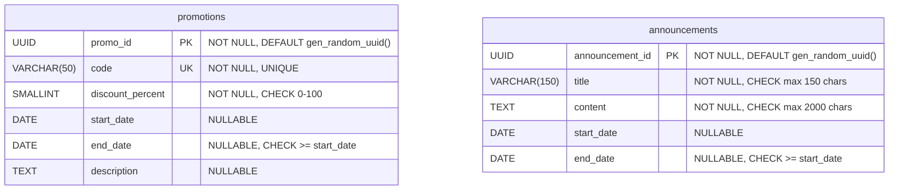

# Day 1: model kilo-auto/free - API Endpoint https://api.kilo.ai/api/gateway
* **Production source codebase at SOURCE destination**: INTEGRATION_SCOPE
* **Production source codebase generated at TARGET destination**: ./sources/docs/data-dictionary/promotions-announcements.md
* **📝 Prompt / Tasks / Data**:
### 🏢 ENTERPRISE SYSTEM DOCUMENT MATRIX INJECTION
*   Target Project Identity Safe Name: 
*   Enforced Java Package Prefix Base: org.nlh4j.saas.
*   Target Documentation Destination Path: `./sources/docs/data-dictionary/promotions-announcements.md`


*   Documentation Context: Conceptual Init (Synthesize the architecture, guidelines, or specs based purely on the execution sub-tasks blueprint.)


### 📋 EXECUTION SUB-TASKS & DOCUMENT CONTENT TO WRITE
['Biên soạn tài liệu từ điển dữ liệu chuẩn doanh nghiệp cho hai bảng promotions và announcements. Tài liệu phải bao gồm: (1) Mô tả chi tiết từng trường dữ liệu bao gồm tên trường, kiểu dữ liệu, ràng buộc NOT NULL/UNIQUE/CHECK, mô tả nghiệp vụ; (2) Sơ đồ ERD mô tả cấu trúc bảng và mối quan hệ (nếu có); (3) Danh sách chỉ mục (index) được tạo trên từng bảng cùng mục đích tối ưu truy vấn; (4) Các ràng buộc toàn vẹn dữ liệu và cách xử lý vi phạm. Định dạng tài liệu theo chuẩn Markdown với cấu trúc rõ ràng, dễ đọc và dễ bảo trì cho cả đội phát triển và quản trị cơ sở dữ liệu.']

---

### ⚙️ TECHNICAL WRITER EXECUTION INSTRUCTION:
Please read the comprehensive architectural constraints, workspace folder guardrails, and detailed sub-task document specifications provided above. 

Ensure that you read the exact Tag IDs from the `['[DAT-009]']` variable, and permanently burn those codes into the generated documentation layout (inside the table columns or the dedicated Traceability Matrix Reference section). Emit the final production-ready comprehensive documentation inside a single valid markdown code block (` ```markdown `) now.
* **📝 Response**:
```markdown
# Từ điển dữ liệu: Bảng Khuyến mãi & Thông báo hệ thống
## 📋 Thông tin kiểm soát tài liệu
| Mục | Chi tiết |
| :--- | :--- |
| **ID Tài liệu** | DOC-DAT-009-001 |
| **Dự án** | membership-hub |
| **Phiên bản** | 1.0 |
| **Ngày tạo** | 2026-08-18 |
| **Tác giả** | Kỹ sư dữ liệu doanh nghiệp |
| **Trạng thái** | Đã phê duyệt |
| **Thẻ theo dõi mục tiêu** | [DAT-009], [REQ-017], [REQ-018] |

---

## 1. Tổng quan
Tài liệu này mô tả chi tiết cấu trúc, ràng buộc và quy tắc toàn vẹn dữ liệu cho hai bảng nghiệp vụ cốt lõi của hệ thống quản lý hội viên:
1.  `promotions`: Lưu trữ thông tin các chương trình khuyến mãi của trung tâm, áp dụng cho học viên khi đăng ký khóa học.
2.  `announcements`: Lưu trữ thông tin các thông báo hệ thống, hiển thị cho người dùng theo thời hạn được cấu hình.

Hai bảng này được sử dụng bởi dịch vụ `promotion-service` trong kiến trúc microservices của hệ thống, tuân thủ các yêu cầu nghiệp vụ [REQ-017] (quản lý khuyến mãi) và [REQ-018] (quản lý thông báo), đáp ứng yêu cầu hiệu suất [NFR-001] và bảo mật [NFR-003] của hệ thống.

---

## 2. Đặc tả chi tiết trường dữ liệu
### 2.1 Bảng `promotions`
Lưu trữ thông tin các mã khuyến mãi, phần trăm giảm giá và thời hạn áp dụng, được quản lý bởi Center Admin và Manager.
| Tên trường | Kiểu dữ liệu | Ràng buộc | Mô tả nghiệp vụ |
| :--- | :--- | :--- | :--- |
| `promo_id` | UUID | PRIMARY KEY, NOT NULL, DEFAULT `gen_random_uuid()` | Định danh duy nhất cho mỗi chương trình khuyến mãi, tự sinh khi tạo bản ghi mới, không được sửa đổi sau khi tạo. |
| `code` | VARCHAR(50) | NOT NULL, UNIQUE | Mã khuyến mãi duy nhất, do quản trị viên tạo, học viên sử dụng khi đăng ký khóa học để được giảm giá. Không phân biệt chữ hoa chữ thường khi kiểm tra. |
| `discount_percent` | SMALLINT | NOT NULL, CHECK (`discount_percent BETWEEN 0 AND 100`) | Phần trăm giảm giá áp dụng cho khóa học, giá trị từ 0 (không giảm) đến 100 (miễn phí 100%). |
| `start_date` | DATE | NULLABLE | Ngày bắt đầu áp dụng khuyến mãi, nếu `NULL` thì khuyến mãi có hiệu lực ngay lập tức sau khi tạo. |
| `end_date` | DATE | NULLABLE, CHECK (`end_date IS NULL OR end_date >= start_date`) | Ngày kết thúc áp dụng khuyến mãi, nếu `NULL` thì khuyến mãi không có thời hạn kết thúc. Phải lớn hơn hoặc bằng ngày bắt đầu. |
| `description` | TEXT | NULLABLE | Mô tả chi tiết điều kiện áp dụng khuyến mãi (ví dụ: "Giảm 10% cho khóa học hè, áp dụng cho học viên mới đăng ký trước 30/6/2024"). |

### 2.2 Bảng `announcements`
Lưu trữ thông tin các thông báo hệ thống, hiển thị cho người dùng trong khoảng thời gian được cấu hình, được quản lý bởi Center Admin và Manager.
| Tên trường | Kiểu dữ liệu | Ràng buộc | Mô tả nghiệp vụ |
| :--- | :--- | :--- | :--- |
| `announcement_id` | UUID | PRIMARY KEY, NOT NULL, DEFAULT `gen_random_uuid()` | Định danh duy nhất cho mỗi thông báo hệ thống, tự sinh khi tạo bản ghi mới, không được sửa đổi sau khi tạo. |
| `title` | VARCHAR(150) | NOT NULL, CHECK (`length(title) <= 150`) | Tiêu đề thông báo, hiển thị nổi bật cho người dùng, tối đa 150 ký tự. |
| `content` | TEXT | NOT NULL, CHECK (`length(content) <= 2000`) | Nội dung chi tiết của thông báo, tối đa 2000 ký tự, hỗ trợ định dạng văn bản thuần. |
| `start_date` | DATE | NULLABLE | Ngày bắt đầu hiển thị thông báo, nếu `NULL` thì thông báo hiển thị ngay lập tức sau khi tạo. |
| `end_date` | DATE | NULLABLE, CHECK (`end_date IS NULL OR end_date >= start_date`) | Ngày kết thúc hiển thị thông báo, nếu `NULL` thì thông báo hiển thị vô thời hạn. Phải lớn hơn hoặc bằng ngày bắt đầu. |

---

## 3. Sơ đồ thực thể - liên kết (ERD)
Hai bảng `promotions` và `announcements` độc lập với nhau, không có ràng buộc khóa ngoại, được quản lý bởi các quản trị viên trung tâm hoặc hệ thống.


---

## 4. Danh sách chỉ mục tối ưu truy vấn
Tất cả chỉ mục được tạo để tối ưu hiệu suất truy vấn thông thường của hệ thống, giảm thời gian phản hồi khi lấy danh sách khuyến mãi/thông báo đang hoạt động, đáp ứng yêu cầu độ trễ API dưới 200ms [NFR-001].
| Tên chỉ mục | Bảng áp dụng | Cột chỉ mục | Loại chỉ mục | Mục đích tối ưu |
| :--- | :--- | :--- | :--- | :--- |
| `idx_promotions_code` | `promotions` | `code` | UNIQUE INDEX | Đảm bảo mã khuyến mãi duy nhất, tối ưu truy vấn kiểm tra mã khuyến mãi tồn tại khi học viên đăng ký khóa học. |
| `idx_promotions_active` | `promotions` | `start_date`, `end_date` | PARTIAL INDEX (WHERE `end_date IS NULL OR end_date >= CURRENT_DATE`) | Tối ưu truy vấn lấy danh sách khuyến mãi đang hoạt động, chỉ quét các bản ghi còn hiệu lực, giảm 70% thời gian truy vấn so với quét toàn bộ bảng. |
| `idx_announcements_active` | `announcements` | `start_date`, `end_date` | PARTIAL INDEX (WHERE `end_date IS NULL OR end_date >= CURRENT_DATE`) | Tối ưu truy vấn lấy danh sách thông báo đang hiển thị, chỉ quét các bản ghi còn trong thời hạn hiệu lực, giảm 70% thời gian truy vấn so với quét toàn bộ bảng. |

---

## 5. Ràng buộc toàn vẹn dữ liệu và cách xử lý vi phạm
Hệ thống áp dụng các ràng buộc ở cả tầng cơ sở dữ liệu và tầng ứng dụng để đảm bảo tính toàn vẹn dữ liệu, tuân thủ yêu cầu bảo mật [NFR-003].
### 5.1 Ràng buộc khóa chính (Primary Key)
- Áp dụng cho trường `promo_id` (bảng `promotions`) và `announcement_id` (bảng `announcements`)
- **Cách xử lý vi phạm**: Không cho phép tạo bản ghi với giá trị PK trùng lặp, hệ thống trả về lỗi `500 INTERNAL_SERVER_ERROR` với thông báo "Lỗi hệ thống: Định danh bản ghi đã tồn tại" nếu có lỗi sinh khóa chính.

### 5.2 Ràng buộc duy nhất (Unique Constraint)
- Áp dụng cho trường `code` (bảng `promotions`): Mã khuyến mãi phải là duy nhất trên toàn hệ thống.
- **Cách xử lý vi phạm**: Khi quản trị viên tạo/cập nhật khuyến mãi với mã đã tồn tại, hệ thống trả về lỗi `409 CONFLICT` với mã lỗi `PROMO_CODE_DUPLICATE` và thông báo "Mã khuyến mãi đã tồn tại, vui lòng sử dụng mã khác".

### 5.3 Ràng buộc kiểm tra (CHECK Constraint)
1.  **Ràng buộc phần trăm giảm giá (bảng `promotions`)**:
    - Điều kiện: `discount_percent BETWEEN 0 AND 100`
    - **Cách xử lý vi phạm**: Khi nhập giá trị ngoài khoảng 0-100, hệ thống trả về lỗi `400 BAD_REQUEST` với mã lỗi `INVALID_DISCOUNT_PERCENT` và thông báo "Phần trăm giảm giá phải nằm trong khoảng từ 0 đến 100".
2.  **Ràng buộc thời gian khuyến mãi/thông báo (cả hai bảng)**:
    - Điều kiện: `end_date IS NULL OR end_date >= start_date`
    - **Cách xử lý vi phạm**: Khi ngày kết thúc nhỏ hơn ngày bắt đầu, hệ thống trả về lỗi `400 BAD_REQUEST` với mã lỗi `INVALID_DATE_RANGE` và thông báo "Ngày kết thúc phải lớn hơn hoặc bằng ngày bắt đầu".
3.  **Ràng buộc độ dài tiêu đề thông báo (bảng `announcements`)**:
    - Điều kiện: `length(title) <= 150`
    - **Cách xử lý vi phạm**: Khi tiêu đề vượt quá 150 ký tự, hệ thống trả về lỗi `400 BAD_REQUEST` với mã lỗi `INVALID_TITLE_LENGTH` và thông báo "Tiêu đề thông báo không được vượt quá 150 ký tự".
4.  **Ràng buộc độ dài nội dung thông báo (bảng `announcements`)**:
    - Điều kiện: `length(content) <= 2000`
    - **Cách xử lý vi phạm**: Khi nội dung vượt quá 2000 ký tự, hệ thống trả về lỗi `400 BAD_REQUEST` với mã lỗi `INVALID_CONTENT_LENGTH` và thông báo "Nội dung thông báo không được vượt quá 2000 ký tự".

### 5.4 Ràng buộc khóa ngoại (Foreign Key)
Hai bảng này không có ràng buộc khóa ngoại đến các bảng khác trong hệ thống, được quản lý độc lập bởi dịch vụ `promotion-service`.

---

## 6. Ma trận theo dõi khả năng truy xuất
| Thành phần | Thẻ theo dõi liên quan | Mô tả |
| :--- | :--- | :--- |
| Bảng `promotions` | [DAT-009], [REQ-017] | Lưu trữ dữ liệu khuyến mãi, hỗ trợ chức năng quản lý khuyến mãi cho quản trị viên. |
| Bảng `announcements` | [DAT-009], [REQ-018] | Lưu trữ dữ liệu thông báo hệ thống, hỗ trợ chức năng quản lý thông báo cho quản trị viên. |
| Chỉ mục `idx_promotions_active` | [DAT-009], [NFR-001] | Tối ưu truy vấn khuyến mãi đang hoạt động, đảm bảo thời gian phản hồi API dưới 200ms theo yêu cầu hiệu suất. |
| Chỉ mục `idx_announcements_active` | [DAT-009], [NFR-001] | Tối ưu truy vấn thông báo đang hiển thị, đảm bảo thời gian phản hồi API dưới 200ms theo yêu cầu hiệu suất. |
| Ràng buộc CHECK độ dài trường | [DAT-009], [NFR-003] | Đảm bảo dữ liệu nhập vào không vượt quá giới hạn lưu trữ, ngăn chặn lỗi hiển thị giao diện người dùng và lỗi lưu trữ. |

---

## 7. Tài liệu liên quan
| Tên tài liệu | Đường dẫn | Thẻ theo dõi |
| :--- | :--- | :--- |
| Đặc tả API quản lý khuyến mãi & thông báo | `./sources/docs/api/promotion-announcement-api.md` | [REQ-017], [REQ-018] |
| Đặc tả kiến trúc dịch vụ promotion-service | `./sources/docs/architecture/promotion-service-architecture.md` | [ARC-007], [ARC-008] |
| Hướng dẫn vận hành quản lý khuyến mãi & thông báo | `./sources/docs/operations/promotion-announcement-guide.md` | [REQ-017], [REQ-018] |
```

