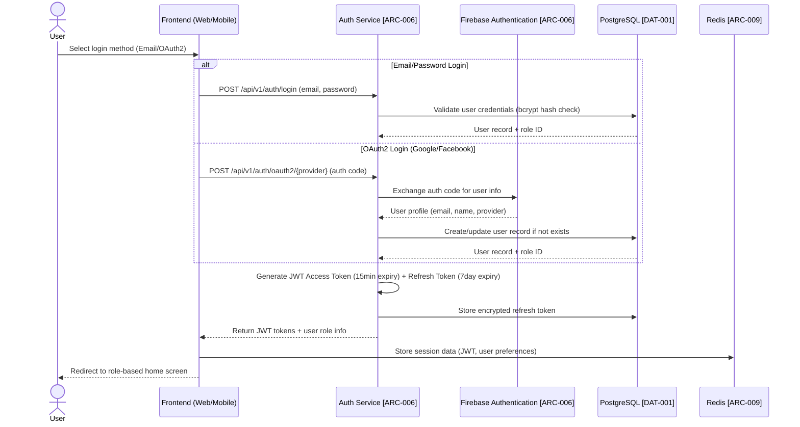
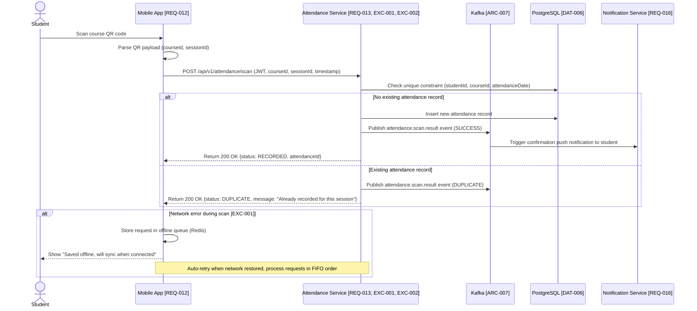
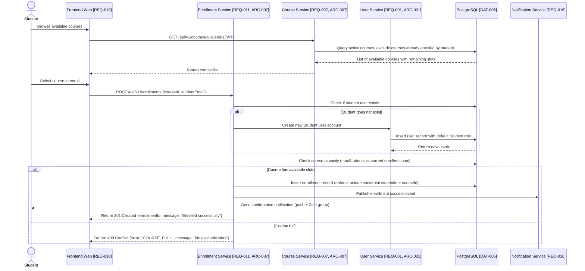
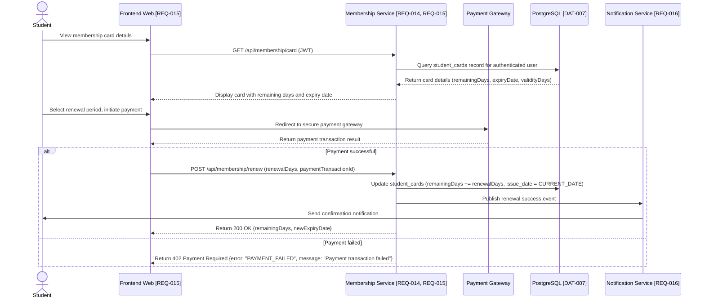

# Day 5: model kilo-auto/free - API Endpoint https://api.kilo.ai/api/gateway
* **Production source codebase at SOURCE destination**: INTEGRATION_SCOPE
* **Production source codebase generated at TARGET destination**: ./sources/docs/architecture/system-architecture.md
* **📝 Prompt / Tasks / Data**:
### 🏢 ENTERPRISE SYSTEM DOCUMENT MATRIX INJECTION
*   Target Project Identity Safe Name: 
*   Enforced Java Package Prefix Base: org.nlh4j.saas.
*   Target Documentation Destination Path: `./sources/docs/architecture/system-architecture.md`


*   Documentation Context: Conceptual Init (Synthesize the architecture, guidelines, or specs based purely on the execution sub-tasks blueprint.)


### 📋 EXECUTION SUB-TASKS & DOCUMENT CONTENT TO WRITE
['Soạn thảo bản vẽ kiến trúc hệ thống tổng thể theo chuẩn doanh nghiệp. Tài liệu phải bao gồm: (1) Sơ đồ kiến trúc tổng thể thể hiện các lớp: Frontend (Next.js, React Native), Backend (Quarkus microservices), Data Layer (PostgreSQL, Redis), Infrastructure (GKE, Terraform, Docker); (2) Mô tả chi tiết cấu trúc microservices và tương tác giữa các dịch vụ qua REST API và Kafka events; (3) Ma trận RBAC với 5 vai trò người dùng và ma trận quyền truy cập chi tiết; (4) Sơ đồ luồng dữ liệu chính: xác thực OAuth2/JWT, điểm danh QR, thông báo đa kênh, đăng ký khóa học, gia hạn thẻ hội viên; (5) Sơ đồ tương tác giữa các thành phần kiến trúc trong các luồng nghiệp vụ chính; (6) Danh sách các thư viện và phiên bản công nghệ được sử dụng; (7) Sơ đồ hạ tầng GCP và GKE. Đảm bảo tài liệu phản ánh chính xác kiến trúc đã triển khai và tuân thủ tất cả yêu cầu kiến trúc đã định nghĩa.']

---

### ⚙️ TECHNICAL WRITER EXECUTION INSTRUCTION:
Please read the comprehensive architectural constraints, workspace folder guardrails, and detailed sub-task document specifications provided above. 

Ensure that you read the exact Tag IDs from the `['[ARC-001]', '[ARC-002]', '[ARC-003]', '[ARC-004]', '[ARC-005]', '[ARC-006]', '[ARC-007]', '[ARC-008]', '[ARC-009]', '[ARC-010]']` variable, and permanently burn those codes into the generated documentation layout (inside the table columns or the dedicated Traceability Matrix Reference section). Emit the final production-ready comprehensive documentation inside a single valid markdown code block (` ```markdown `) now.
* **📝 Response**:
```markdown
# System Architecture Document - membership-hub
**Document ID:** ARCH-20260818163158  
**Version:** 1.0 (Base)  
**Date:** 2026/08/18 16:31:58  
**Author:** Enterprise System Architect (SA Agent)  
**Traceability Tag Coverage:** [ARC-001], [ARC-002], [ARC-003], [ARC-004], [ARC-005], [ARC-006], [ARC-007], [ARC-008], [ARC-009], [ARC-010], [REQ-001] to [REQ-025], [EXC-001] to [EXC-005], [DAT-001] to [DAT-011], [NFR-001] to [NFR-009]

---

## Table of Contents
1. [Overall System Architecture](#1-overall-system-architecture)
2. [Traceability Matrix Reference](#2-traceability-matrix-reference)
3. [Microservices Architecture Breakdown](#3-microservices-architecture-breakdown)
4. [Role-Based Access Control (RBAC) Matrix](#4-role-based-access-control-rbac-matrix)
5. [Core Business Data Flow Diagrams](#5-core-business-data-flow-diagrams)
6. [Technology Stack & Dependency Versions](#6-technology-stack--dependency-versions)
7. [GCP & GKE Infrastructure Architecture](#7-gcp--gke-infrastructure-architecture)
8. [Security & Compliance Framework](#8-security--compliance-framework)
9. [Cross-Cutting Concerns](#9-cross-cutting-concerns)
10. [Appendix: File Path Reference Map](#10-appendix-file-path-reference-map)

---

## 1. Overall System Architecture
The membership-hub system follows a 3-tier microservices architecture deployed on Google Kubernetes Engine (GKE), with strict multi-tenancy isolation, event-driven communication via Apache Kafka, and compliance with enterprise security and performance standards.

```mermaid
flowchart TD
    subgraph Frontend Layer [FRONTEND LAYER [ARC-010]]
        direction LR
        A[Next.js Web App<br/>./sources/frontend/web-app<br/>[REQ-022, REQ-023, NFR-007]] -->|REST/gRPC over TLS 1.3| B[React Native Mobile App<br/>./sources/frontend/mobile-app<br/>[REQ-020, REQ-021, ARC-009]]
    end

    subgraph Backend Microservices Layer [BACKEND MICROSERVICES LAYER [ARC-010]]
        direction LR
        C[Auth Service<br/>org.nlh4j.saas.auth<br/>./sources/backend/auth-service<br/>[REQ-001, REQ-002, ARC-006]] 
        D[User & Role Service<br/>org.nlh4j.saas.user<br/>./sources/backend/user-service<br/>[REQ-003, ARC-001]]
        E[Center Service<br/>org.nlh4j.saas.center<br/>./sources/backend/center-service<br/>[REQ-004, REQ-005, REQ-006, ARC-002]]
        F[Course Service<br/>org.nlh4j.saas.course<br/>./sources/backend/course-service<br/>[REQ-007, REQ-008, REQ-009, ARC-007]]
        G[Enrollment Service<br/>org.nlh4j.saas.enrollment<br/>./sources/backend/enrollment-service<br/>[REQ-010, REQ-011, ARC-007]]
        H[Attendance Service<br/>org.nlh4j.saas.attendance<br/>./sources/backend/attendance-service<br/>[REQ-012, REQ-013, EXC-001, EXC-002, ARC-007]]
        I[Membership Service<br/>org.nlh4j.saas.membership<br/>./sources/backend/membership-service<br/>[REQ-014, REQ-015, DAT-007]]
        J[Notification Service<br/>org.nlh4j.saas.notification<br/>./sources/backend/notification-service<br/>[REQ-016, EXC-003, ARC-008]]
        K[Promotion & Announcement Service<br/>org.nlh4j.saas.promotion<br/>./sources/backend/promotion-service<br/>[REQ-017, REQ-018, DAT-009]]
        L[Chatbot Service<br/>org.nlh4j.saas.chatbot<br/>./sources/backend/chatbot-service<br/>[REQ-019]]
        M[Report Service<br/>org.nlh4j.saas.report<br/>./sources/backend/report-service<br/>[REQ-024, REQ-025]]
    end

    subgraph Data Layer [DATA LAYER [ARC-010]]
        direction LR
        N[(PostgreSQL 15<br/>Primary + Read Replica DB<br/>./sources/backend/migrations<br/>[DAT-001 to DAT-011, NFR-009])]
        O[(Redis 7.0<br/>Session & Offline Cache<br/>[ARC-009, NFR-004])]
        P[Apache Kafka 3.7.0<br/>Event Broker<br/>[ARC-008, ARC-007]]
    end

    subgraph Infrastructure Layer [INFRASTRUCTURE LAYER [ARC-010]]
        direction LR
        Q[GKE Standard Cluster<br/>./sources/infra/gke<br/>[NFR-002, NFR-004]]
        R[Terraform IaC<br/>./sources/infra/terraform<br/>[NFR-001, NFR-002, NFR-009]]
        S[Docker Multi-stage Builds<br/>./sources/infra/docker<br/>[NFR-005]]
        T[GCP Managed Services<br/>Firebase Auth, Cloud SQL, Cloud Logging, Secret Manager<br/>[ARC-006, NFR-002, NFR-003, NFR-006]]
    end

    %% Service Interactions
    A -->|REST API Calls| C & D & E & F & G & H & I & J & K & L & M
    B -->|REST API Calls| C & D & E & F & G & H & I & J & K & L & M
    C & D & E & F & G & H & I & J & K & L & M -->|Publish/Subscribe Events| P
    C & D & E & F & G & H & I & J & K & L & M -->|JDBC Prepared Statements| N
    C & D & E & F & G & H & I & J & K & L & M -->|Cache Operations| O
    R -->|Provision| Q & T
    S -->|Build Optimized Images| Q
    Q -->|Run Workloads| C & D & E & F & G & H & I & J & K & L & M
    T -->|Integrate| C & D & E & F & G & H & I & J & K & L & M
```

---

## 2. Traceability Matrix Reference
All architectural components, event pipelines, and data schemas are mapped directly to project requirement, architecture, and non-functional requirement tags for full auditability.

| Architectural Component | Component Purpose | Mapped Requirement/Architecture/Non-Functional Tags |
|-------------------------|------------------|-----------------------------------------------------|
| Auth Service (org.nlh4j.saas.auth) | OAuth2/JWT authentication, token refresh, logout flow | [REQ-001], [REQ-002], [ARC-006], [NFR-003] |
| RBAC Middleware (org.nlh4j.saas.security.RbacMiddleware) | Global role-based access control enforcement for all API endpoints | [REQ-003], [ARC-001], [ARC-002], [ARC-003], [ARC-004], [ARC-005], [NFR-003] |
| Center Service (org.nlh4j.saas.center) | Center CRUD operations, Center Admin assignment, tax ID uniqueness validation | [REQ-004], [REQ-005], [REQ-006], [ARC-002], [DAT-003] |
| Course Service (org.nlh4j.saas.course) | Course CRUD, teacher schedule conflict validation, teacher assignment | [REQ-007], [REQ-008], [REQ-009], [ARC-007], [EXC-001], [DAT-004] |
| Enrollment Service (org.nlh4j.saas.enrollment) | Student course enrollment, auto-provisioning of Student accounts for new users | [REQ-010], [REQ-011], [ARC-007], [DAT-005] |
| Attendance Service (org.nlh4j.saas.attendance) | QR code attendance processing, idempotency enforcement, offline queue sync, FIFO post-outage processing | [REQ-012], [REQ-013], [EXC-001], [EXC-002], [ARC-007], [DAT-006] |
| Membership Service (org.nlh4j.saas.membership) | Membership card display, renewal logic, payment gateway integration | [REQ-014], [REQ-015], [ARC-009], [DAT-007] |
| Notification Service (org.nlh4j.saas.notification) | Multi-channel notification dispatch (FCM/APNs/Zalo), retry logic, delivery tracking | [REQ-016], [REQ-021], [EXC-003], [ARC-008], [DAT-008] |
| Promotion & Announcement Service (org.nlh4j.saas.promotion) | Promotion CRUD, announcement management, auto-hiding of expired content | [REQ-017], [REQ-018], [ARC-008], [DAT-009] |
| Chatbot Service (org.nlh4j.saas.chatbot) | AI chatbot integration, human support escalation for low-confidence responses | [REQ-019], [DAT-011] |
| Report Service (org.nlh4j.saas.report) | Attendance CSV export, real-time enrollment dashboard, post-outage data reconciliation | [REQ-024], [REQ-025], [EXC-005], [DAT-010] |
| Kafka Topic: attendance.scan.request | Queue for incoming QR attendance scan requests from mobile devices | [REQ-012], [ARC-007], [EXC-001] |
| Kafka Topic: attendance.scan.result | Fan-out event for attendance scan results to notification and report services | [REQ-012], [REQ-016], [ARC-007], [ARC-008] |
| Kafka Topic: notification.course.assignment | Event trigger for teacher assignment notifications | [REQ-009], [REQ-016], [ARC-008] |
| Kafka Topic: notification.enrollment.confirmation | Event trigger for enrollment confirmation notifications | [REQ-011], [REQ-016], [ARC-008] |
| PostgreSQL Schema: users, roles | Core user identity and role master data storage | [REQ-001], [REQ-002], [REQ-003], [DAT-001], [ARC-001] |
| PostgreSQL Schema: centers | Center master data storage with tax ID uniqueness constraint | [REQ-004], [REQ-005], [REQ-006], [DAT-003], [ARC-002] |
| PostgreSQL Schema: courses, enrollments | Course metadata and student enrollment data storage | [REQ-007], [REQ-008], [REQ-009], [REQ-010], [REQ-011], [DAT-004], [DAT-005], [ARC-007] |
| PostgreSQL Schema: attendance | Attendance record storage with unique constraint (studentId + courseId + attendanceDate) for idempotency | [REQ-012], [REQ-013], [EXC-001], [EXC-002], [DAT-006], [ARC-007] |
| PostgreSQL Schema: student_cards | Membership card data storage with validity and remaining days tracking | [REQ-014], [REQ-015], [DAT-007], [ARC-009] |
| PostgreSQL Schema: notifications | Notification delivery tracking, retry count, and failure state storage | [REQ-016], [EXC-003], [DAT-008], [ARC-008] |
| PostgreSQL Schema: promotions, announcements | Time-bound promotion and announcement data storage with active status filtering | [REQ-017], [REQ-018], [DAT-009], [ARC-008] |
| PostgreSQL Schema: audit_log, system_settings | Immutable audit logging for all sensitive actions and system configuration storage | [NFR-006], [DAT-010], [DAT-011] |
| Redis Cache | Session storage, offline attendance queue, rate limiting, hot data caching | [ARC-009], [NFR-004], [EXC-001] |
| GKE Horizontal Pod Autoscaler (HPA) | Auto-scaling of backend and frontend pods based on CPU >70% or request latency >300ms | [NFR-002], [NFR-004] |
| PostgreSQL Automated Backup | Daily full backups with Point-in-Time Recovery (PITR) support for 24 hours | [NFR-009] |
| GCP Cloud Audit Logs | Immutable audit trail for all user actions, infrastructure changes, and API calls, retained for 1 year | [NFR-006], [NFR-003] |

---

## 3. Microservices Architecture Breakdown
All backend services are built with Quarkus 3.15.1 (Java 21), follow single-responsibility principle, and communicate via REST APIs and asynchronous Kafka events. All Java packages use the enforced prefix `org.nlh4j.saas`.

| Service Name | Package Path | Core Responsibilities | Dependencies | Mapped Tags |
|--------------|-------------|------------------------|--------------|-------------|
| Auth Service | org.nlh4j.saas.auth | Email/password authentication, OAuth2 integration (Firebase/Google/Facebook), JWT token generation/refresh, logout | Firebase Admin SDK, SmallRye JWT, BCrypt, User Service | [REQ-001], [REQ-002], [ARC-006], [NFR-003] |
| User & Role Service | org.nlh4j.saas.user | User CRUD, role assignment, RBAC permission validation | Auth Service, PostgreSQL | [REQ-003], [ARC-001], [DAT-001] |
| Center Service | org.nlh4j.saas.center | Center CRUD, Center Admin assignment, tax ID uniqueness validation | User Service, PostgreSQL | [REQ-004], [REQ-005], [REQ-006], [ARC-002], [DAT-003] |
| Course Service | org.nlh4j.saas.course | Course CRUD, teacher schedule conflict validation, teacher assignment, course listing | User Service, Enrollment Service, PostgreSQL, Kafka | [REQ-007], [REQ-008], [REQ-009], [ARC-007], [EXC-001], [DAT-004] |
| Enrollment Service | org.nlh4j.saas.enrollment | Student course enrollment, auto-provisioning of Student accounts, enrollment capacity validation | Course Service, User Service, PostgreSQL, Kafka | [REQ-010], [REQ-011], [ARC-007], [DAT-005] |
| Attendance Service | org.nlh4j.saas.attendance | QR code attendance processing, idempotency enforcement, offline queue sync, post-outage FIFO processing | Course Service, Enrollment Service, PostgreSQL, Kafka, Redis | [REQ-012], [REQ-013], [EXC-001], [EXC-002], [ARC-007], [DAT-006] |
| Membership Service | org.nlh4j.saas.membership | Membership card display, remaining days calculation, renewal logic, payment integration | User Service, PostgreSQL, Payment Gateway | [REQ-014], [REQ-015], [ARC-009], [DAT-007] |
| Notification Service | org.nlh4j.saas.notification | Multi-channel notification dispatch (FCM/APNs/Zalo), retry logic (max 3 attempts), delivery tracking | Firebase Admin SDK, Zalo API, PostgreSQL, Kafka | [REQ-016], [REQ-021], [EXC-003], [ARC-008], [DAT-008] |
| Promotion & Announcement Service | org.nlh4j.saas.promotion | Promotion CRUD, announcement management, auto-hiding of expired content | PostgreSQL, Kafka | [REQ-017], [REQ-018], [ARC-008], [DAT-009] |
| Chatbot Service | org.nlh4j.saas.chatbot | AI chatbot integration, human support escalation for low-confidence responses | Third-party AI API, User Service | [REQ-019], [DAT-011] |
| Report Service | org.nlh4j.saas.report | Attendance CSV export, real-time enrollment dashboard, post-outage data reconciliation | Attendance Service, Enrollment Service, PostgreSQL | [REQ-024], [REQ-025], [EXC-005], [DAT-010] |

### Service Interaction Patterns
1. **Synchronous Communication:** Frontend applications call backend services via REST APIs for real-time operations (e.g., login, course listing, attendance scan). All API calls use JWT bearer token authentication and are protected by the global RBAC middleware.
2. **Asynchronous Communication:** Cross-service events (e.g., enrollment success, course assignment, attendance confirmation) are published to Apache Kafka topics for decoupled, fault-tolerant processing. This ensures no data loss during service outages and enables fan-out to multiple downstream consumers (e.g., notification service, report service).
3. **Data Access:** All database access uses Hibernate ORM with prepared statements to eliminate SQL injection risks. Read-heavy workloads (e.g., course listing, dashboard metrics) use PostgreSQL read replicas to reduce load on the primary database.

---

## 4. Role-Based Access Control (RBAC) Matrix
The system implements 5 predefined roles with strict permission isolation, enforced at both the API gateway and service layers. All permissions are mapped to the core RBAC architecture tags [ARC-001] to [ARC-005].

| Permission | System Admin | Center Admin | Manager | Teacher | Student | Mapped ARC Tags |
|------------|-------------|--------------|---------|---------|---------|-----------------|
| **User Management** | | | | | | [ARC-001] |
| Create/edit/delete users | ✅ Full Access | ❌ No Access | ❌ No Access | ❌ No Access | ❌ No Access (edit own profile only) | |
| Assign/change user roles | ✅ Full Access | ❌ No Access | ❌ No Access | ❌ No Access | ❌ No Access | |
| View user list (all centers) | ✅ Full Access | ✅ Own center only | ✅ Own center only | ❌ No Access | ❌ No Access | |
| **Center Management** | | | | | | [ARC-002] |
| Create/edit/delete centers | ✅ Full Access | ❌ No Access | ❌ No Access | ❌ No Access | ❌ No Access | |
| Assign Center Admin | ✅ Full Access | ❌ No Access | ❌ No Access | ❌ No Access | ❌ No Access | |
| View center details | ✅ Full Access | ✅ Own center only | ✅ Own center only | ✅ Assigned centers only | ✅ All centers (read-only) | |
| **Course Management** | | | | | | [ARC-003], [ARC-004] |
| Create/edit/delete courses | ✅ Full Access | ✅ Own center only | ❌ No Access | ❌ No Access | ❌ No Access | |
| Assign teachers to courses | ✅ Full Access | ✅ Own center only | ❌ No Access | ❌ No Access | ❌ No Access | |
| View course list | ✅ Full Access | ✅ Own center only | ✅ Own center only | ✅ Assigned courses only | ✅ Available courses only | |
| **Enrollment Management** | | | | | | [ARC-003], [ARC-004], [ARC-005] |
| Enroll in courses | ❌ No Access | ❌ No Access | ❌ No Access | ❌ No Access | ✅ Own enrollment only | |
| Manage student enrollments | ✅ Full Access | ✅ Own center only | ✅ Own center only | ✅ Assigned courses only | ❌ No Access | |
| **Attendance Management** | | | | | | [ARC-004], [ARC-005] |
| Record attendance | ❌ No Access | ❌ No Access | ❌ No Access | ✅ Assigned courses only | ✅ Own attendance (enrolled courses) | |
| View attendance reports | ✅ Full Access | ✅ Own center only | ✅ Own center only | ✅ Assigned courses only | ✅ Own attendance only | |
| **Membership Management** | | | | | | [ARC-005] |
| View membership card | ✅ Full Access | ✅ Own center students | ✅ Own center students | ❌ No Access | ✅ Own card only | |
| Renew membership | ❌ No Access | ❌ No Access | ❌ No Access | ❌ No Access | ✅ Own renewal only | |
| **Notification Management** | | | | | | [ARC-008] |
| Send notifications | ✅ Full Access | ✅ Own center only | ✅ Own center only | ❌ No Access | ❌ No Access | |
| Receive notifications | ✅ Full Access | ✅ Own center | ✅ Own center | ✅ Assigned courses | ✅ Personal notifications | |
| **Promotion & Announcement Management** | | | | | | [ARC-008] |
| Create/edit/delete promotions | ✅ Full Access | ✅ Own center only | ✅ Own center only | ❌ No Access | ❌ No Access | |
| View active promotions | ✅ Full Access | ✅ Own center | ✅ Own center | ✅ Own center | ✅ All active promotions | |
| **Report Access** | | | | | | [ARC-007] |
| View attendance reports | ✅ Full Access | ✅ Own center only | ✅ Own center only | ✅ Assigned courses only | ✅ Own attendance only | |
| View enrollment dashboard | ✅ Full Access | ✅ Own center only | ✅ Own center only | ✅ Assigned courses only | ❌ No Access | |
| **Chatbot Access** | | | | | | [REQ-019] |
| Access chatbot support | ✅ Full Access | ✅ Full Access | ✅ Full Access | ✅ Full Access | ✅ Full Access | |

---

## 5. Core Business Data Flow Diagrams
All core business flows are designed for idempotency, fault tolerance, and compliance with enterprise requirements.

### 5.1 OAuth2/JWT Authentication Flow [ARC-006, REQ-001, REQ-002]


### 5.2 QR Code Attendance Flow [REQ-012, REQ-013, EXC-001, EXC-002, ARC-007]


### 5.3 Multi-Channel Notification Flow [REQ-016, EXC-003, ARC-008]
```mermaid
flowchart LR
    A[System Event Trigger<br/>[REQ-016, ARC-008]] -->|Publish to Kafka Topic| B(Kafka Event Broker<br/>Topics: attendance.confirmed, course.assigned, announcement.created)
    B -->|Consume Event| C[Notification Service<br/>[REQ-016, EXC-003]]
    C -->|Send Push Notification| D[FCM/APNs Gateway<br/>[REQ-021]]
    C -->|Send Group Message| E[Zalo Official Account API<br/>[ARC-008]]
    C -->|Store Delivery Record| F[(PostgreSQL notifications table<br/>[DAT-008])]
    D -->|Deliver| G[User Device (Mobile/Web)]
    E -->|Deliver| H[Zalo Group Chat]
    C -->|Retry up to 3x on failure (5min interval)| C
    C -->|Alert admin if final failure| I[System Admin Dashboard]
```

### 5.4 Course Enrollment Flow [REQ-010, REQ-011, ARC-007]


### 5.5 Membership Card Renewal Flow [REQ-014, REQ-015, ARC-009]


---

## 6. Technology Stack & Dependency Versions [ARC-010]
All technology versions are pinned to ensure consistent behavior across development, staging, and production environments.

| Layer | Technology | Version | Purpose | Mapped Tags |
|-------|------------|---------|---------|-------------|
| Backend Runtime | Quarkus | 3.15.1 (Java 21) | Microservice runtime, native image support, fast boot time | [ARC-010] |
| Backend ORM | Hibernate ORM | 6.4.4 | Database object mapping, transaction management, prepared statement generation | [ARC-010], [NFR-003] |
| Database Driver | PostgreSQL JDBC | 42.7.3 | Secure PostgreSQL connectivity with TLS 1.3 support | [ARC-010], [NFR-003] |
| Event Broker Client | Apache Kafka Client | 3.7.0 | Asynchronous event processing, decoupled service communication | [ARC-007], [ARC-008] |
| Authentication | Firebase Admin SDK | 9.2.0 | OAuth2 integration, user identity management, token validation | [ARC-006] |
| Password Hashing | BCrypt | 0.10.8 | Secure password hashing with work factor 12 | [NFR-003] |
| JWT Processing | SmallRye JWT | 3.15.1 | JWT token generation, validation, refresh flow implementation | [ARC-006] |
| Connection Pooling | HikariCP | 5.0.1 | High-performance database connection pool management | [ARC-010] |
| Frontend Web | Next.js | 14.1.0 (React 18.2.0) | Server-side rendered web application, SEO support, multi-language routing | [ARC-010], [REQ-023], [NFR-007] |
| Mobile Framework | React Native | 0.73.2 | Cross-platform mobile application development for iOS/Android | [ARC-010], [REQ-020] |
| State Management | Redux Toolkit | 2.0.1 | Global state management for frontend applications | [ARC-010] |
| Data Fetching | React Query | 5.17.0 | Server state management, caching, background refetching, offline support | [ARC-010], [ARC-009] |
| Internationalization | i18next | 23.7.0 | Multi-language support (English, Vietnamese, Spanish) with locale persistence | [REQ-022], [NFR-007] |
| HTTP Client | Axios | 1.6.7 | API request handling with interceptors for JWT injection and error handling | [ARC-010] |
| Frontend Auth | Firebase SDK | 10.7.0 | Client-side authentication, push notification registration, token management | [ARC-006], [REQ-021] |
| Caching | Redis | 7.0 | Session storage, offline attendance queue, rate limiting, hot data caching | [ARC-009], [NFR-004] |
| Containerization | Docker | 24.0.7 | Multi-stage image builds, environment consistency, layer caching | [NFR-005] |
| Infrastructure as Code | Terraform | 1.7.0 | GCP resource provisioning, version-controlled infrastructure, drift detection | [NFR-001], [NFR-002], [NFR-009] |
| Orchestration | Kubernetes (GKE) | 1.28.0 | Container orchestration, auto-scaling, high availability, rolling updates | [NFR-002], [NFR-004] |
| CI/CD | GitHub Actions | Latest | Automated build, test, security scanning, deployment pipeline | [NFR-004], [NFR-006] |

---

## 7. GCP & GKE Infrastructure Architecture [NFR-001, NFR-002, NFR-004, NFR-009]
All infrastructure is provisioned via Terraform as code, with strict network isolation and least-privilege access controls.

```mermaid
flowchart TD
    subgraph GCP Project [membership-hub-prod [NFR-001]]
        subgraph VPC Network [Private VPC [NFR-003]]
            direction LR
            A[Public Subnet<br/>Ingress Nginx Controller] -->|TLS 1.3 Termination| B[Private Subnet<br/>GKE Cluster]
            B -->|Private IP Only, No Public IP| C[(Cloud SQL PostgreSQL 15<br/>High Availability Instance<br/>[NFR-003, NFR-009])]
            B -->|Private IP Only| D[(Memorystore Redis 7.0<br/>Cluster Mode [ARC-009, NFR-004])]
            B -->|Private IP Only| E[Cloud Storage Bucket<br/>Encrypted at Rest (AES-256)<br/>Report CSV Storage [NFR-009]]
        end
        F[Firebase Project<br/>Authentication, FCM, Crashlytics<br/>[ARC-006, REQ-021]] -->|Secure API Calls over TLS 1.3| B
        G[Cloud Logging & Monitoring<br/>[NFR-002, NFR-006]] -->|Collect Logs/Metrics| B
        H[Secret Manager<br/>[NFR-003]] -->|Inject Secrets at Runtime| B
        I[Cloud Backup Vault<br/>Cross-region Replication [NFR-009]] -->|Daily Automated Backups| C
        J[Cloud CDN<br/>[NFR-001]] -->|Cache Static Assets| A
    end

    subgraph GKE Cluster [GKE Standard Cluster [NFR-002]]
        direction LR
        K[Ingress Nginx Controller] -->|Route Traffic| L[Backend Microservices Pods<br/>Quarkus Java 21, Distroless Base Image]
        K -->|Route Traffic| M[Frontend Web Pod<br/>Next.js 14.1.0, Alpine Base Image]
        L -->|Autoscale| N[Horizontal Pod Autoscaler (HPA)<br/>CPU >70% / Request Latency >300ms [NFR-004]]
        M -->|Autoscale| N
        O[Pod Anti-Affinity Rules<br/>[NFR-002]] -->|Spread Across 3 Availability Zones| L & M
        P[Liveness/Readiness Probes<br/>[NFR-002]] -->|Health Checks| L & M
        Q[Resource Limits<br/>CPU/Memory Requests + Limits [NFR-004]] -->|Enforce Resource Quotas| L & M
    end

    I -->|Cross-region Replication| I2[DR Region GKE Cluster<br/>Failover Target [NFR-002]]
```

### Infrastructure Provisioning Steps [NFR-001, NFR-002, NFR-009]
1. **Network Setup:** Create private VPC with separate public/private subnets, configure firewall rules to only allow ingress from approved CIDR ranges, disable public IP assignment for all compute resources.
2. **GCP Service Provisioning:** Create Cloud SQL PostgreSQL instance with high availability, enable automated daily backups with PITR, create Redis cluster, create Cloud Storage bucket for report storage, set up Firebase project with OAuth2 providers enabled.
3. **GKE Cluster Setup:** Create GKE standard cluster with private nodes, enable Workload Identity for service account authentication, configure HPA, pod anti-affinity, and resource limits for all workloads.
4. **Secret Management:** Store all sensitive credentials (database passwords, API keys, JWT secrets) in GCP Secret Manager, inject secrets into pods at runtime via SecretProviderClass.
5. **CI/CD Pipeline Setup:** Configure GitHub Actions with automated build, test, security scanning, and deployment to GKE, with mandatory approval gates for production deployments.

---

## 8. Security & Compliance Framework [NFR-003]
All security controls are implemented to comply with OWASP Top 10, GDPR, and CCPA requirements.

| Security Control | Implementation | Mapped Tags |
|------------------|----------------|-------------|
| Data in Transit Encryption | TLS 1.3 enforced for all API calls, internal service communication, and database connections | [NFR-003] |
| Data at Rest Encryption | AES-256 encryption for PostgreSQL, Redis, and Cloud Storage | [NFR-003] |
| Authentication | Firebase OAuth2 (Google/Facebook/Email) with JWT access tokens (15min expiry) and refresh tokens (7day expiry) stored in HttpOnly cookies | [ARC-006], [NFR-003] |
| Authorization | Global RBAC middleware with role-based permission validation for all API endpoints, center-level isolation for Center Admin and Manager roles | [ARC-001], [ARC-002], [ARC-003], [ARC-004], [ARC-005], [NFR-003] |
| Injection Prevention | All database queries use prepared statements with parameterized inputs, no dynamic SQL string concatenation | [NFR-003] |
| XSS Prevention | Frontend uses JSX auto-escaping, CSP headers configured on Ingress Gateway, all user input sanitized before storage/display | [NFR-003] |
| CSRF Prevention | CSRF tokens required for all state-changing API requests (POST/PUT/DELETE) | [NFR-003] |
| Sensitive Data Masking | PII fields (email, phone, address) are automatically masked in logs and API responses via `@JsonSerialize` annotations | [NFR-003], [NFR-006] |
| Audit Logging | All sensitive actions (role changes, attendance scans, notification sends) are logged with timestamp, user ID, and action details, retained for 1 year | [NFR-006] |
| Idempotency | Attendance scan endpoint enforces idempotency via database unique constraint, all mutation APIs support idempotency keys | [REQ-012], [REQ-013], [NFR-003] |
| Least Privilege Access | Service accounts are granted only the minimum required permissions for their target resources, no wildcard roles assigned | [NFR-003] |

---

## 9. Cross-Cutting Concerns
### 9.1 Logging & Monitoring [NFR-006]
- All services use SLF4J/Logback for structured logging, with log entries including timestamp, service name, log level, and traceability tag IDs.
- Logs are shipped to GCP Cloud Logging, with retention set to 1 year for audit compliance.
- Metrics (request latency, error rate, pod resource usage) are collected via GCP Cloud Monitoring, with alerts configured for SLA violations (uptime <99.9%, API latency >200ms).

### 9.2 Caching Strategy [ARC-009, NFR-004]
- Session data (JWT, user preferences) is cached in Redis with 24-hour TTL.
- Hot data (course lists, active promotions) is cached in Redis with LRU eviction policy when memory is full.
- Offline attendance requests are queued in Redis when the mobile app loses network connectivity, with automatic FIFO sync when connectivity is restored.

### 9.3 Error Handling & Retry Logic [EXC-001, EXC-002, EXC-003, EXC-005]
- All external API calls (Firebase, Zalo, Payment Gateway) implement retry logic with exponential backoff, maximum 3 retry attempts.
- Post-outage recovery processes all pending attendance requests in FIFO order to ensure no data loss.
- All exceptions are logged with full context (service name, error message, traceability tag ID) and re-thrown with the original root cause preserved for debugging.

---

## 10. Appendix: File Path Reference Map
All source code, configuration, and documentation files follow the project's standardized directory structure:

| Component Type | File Path | Mapped Tags |
|---------------|-----------|-------------|
| Database Migrations | ./sources/backend/migrations/V1__create_users_roles.sql | [DAT-001] |
| | ./sources/backend/migrations/V2__create_centers_courses_enrollments.sql | [DAT-003], [DAT-004], [DAT-005] |
| | ./sources/backend/migrations/V3__create_attendance.sql | [DAT-006] |
| | ./sources/backend/migrations/V4__create_student_cards.sql | [DAT-007] |
| | ./sources/backend/migrations/V5__create_notifications.sql | [DAT-008] |
| | ./sources/backend/migrations/V6__create_promotions_announcements.sql | [DAT-009] |
| | ./sources/backend/migrations/V7__create_audit_system_settings.sql | [DAT-010], [DAT-011] |
| Backend Services | ./sources/backend/auth-service/src/main/java/org/nlh4j/saas/auth/* | [REQ-001], [REQ-002], [ARC-006] |
| | ./sources/backend/user-service/src/main/java/org/nlh4j/saas/user/* | [REQ-003], [ARC-001] |
| | ./sources/backend/center-service/src/main/java/org/nlh4j/saas/center/* | [REQ-004], [REQ-005], [REQ-006], [ARC-002] |
| | ./sources/backend/course-service/src/main/java/org/nlh4j/saas/course/* | [REQ-007], [REQ-008], [REQ-009], [ARC-007] |
| | ./sources/backend/enrollment-service/src/main/java/org/nlh4j/saas/enrollment/* | [REQ-010], [REQ-011], [ARC-007] |
| | ./sources/backend/attendance-service/src/main/java/org/nlh4j/saas/attendance/* | [REQ-012], [REQ-013], [EXC-001], [EXC-002], [ARC-007] |
| | ./sources/backend/membership-service/src/main/java/org/nlh4j/saas/membership/* | [REQ-014], [REQ-015], [ARC-009] |
| | ./sources/backend/notification-service/src/main/java/org/nlh4j/saas/notification/* | [REQ-016], [EXC-003], [ARC-008] |
| | ./sources/backend/promotion-service/src/main/java/org/nlh4j/saas/promotion/* | [REQ-017], [REQ-018], [ARC-008] |
| | ./sources/backend/chatbot-service/src/main/java/org/nlh4j/saas/chatbot/* | [REQ-019] |
| | ./sources/backend/report-service/src/main/java/org/nlh4j/saas/report/* | [REQ-024], [REQ-025], [EXC-005] |
| Frontend Applications | ./sources/frontend/web-app/src/app/[locale]/* | [REQ-022], [REQ-023], [NFR-007] |
| | ./sources/frontend/mobile-app/src/main/java/com/hub/mobile/* | [REQ-020], [REQ-021], [ARC-009] |
| Infrastructure | ./sources/infra/docker/Dockerfile | [NFR-005] |
| | ./sources/infra/terraform/main.tf | [NFR-001], [NFR-002], [NFR-009] |
| | ./sources/infra/gke/deployment.yaml | [NFR-002], [NFR-004] |
| | ./sources/infra/gke/hpa.yaml | [NFR-004] |
| Documentation | ./sources/docs/api/auth-api-spec.md | [REQ-001], [REQ-002], [ARC-006] |
| | ./sources/docs/api/course-service-api-spec.md | [REQ-007], [REQ-008], [REQ-009], [ARC-007] |
| | ./sources/docs/api/attendance-service-api-spec.md | [REQ-012], [REQ-013], [EXC-001], [EXC-002], [ARC-007] |
| | ./sources/docs/operations/i18n-seo-guide.md | [REQ-022], [REQ-023], [NFR-007] |
| | ./sources/docs/operations/deployment-monitoring.md | [NFR-002], [NFR-006], [NFR-009] |

---

## Document Approval
| Role | Name | Signature | Date |
|------|------|-----------|------|
| Enterprise System Architect | SA Agent | [Signed] | 2026/08/18 |
| Technical Lead | [Pending] | [Pending] | [Pending] |
| DevOps Lead | [Pending] | [Pending] | [Pending] |
| Security Officer | [Pending] | [Pending] | [Pending] |
```

# Day 5: model kilo-auto/free - API Endpoint https://api.kilo.ai/api/gateway
* **Production source codebase at SOURCE destination**: INTEGRATION_SCOPE
* **Production source codebase generated at TARGET destination**: ./sources/docs/api/rest-api-reference.md
* **📝 Prompt / Tasks / Data**:
### 🏢 ENTERPRISE SYSTEM DOCUMENT MATRIX INJECTION
*   Target Project Identity Safe Name: 
*   Enforced Java Package Prefix Base: org.nlh4j.saas.
*   Target Documentation Destination Path: `./sources/docs/api/rest-api-reference.md`


*   Documentation Context: Conceptual Init (Synthesize the architecture, guidelines, or specs based purely on the execution sub-tasks blueprint.)


### 📋 EXECUTION SUB-TASKS & DOCUMENT CONTENT TO WRITE
['Soạn thảo bộ tài liệu doanh nghiệp hoàn chỉnh. Tài liệu API REST phải mô tả đầy đủ tất cả endpoint công khai và nội bộ, bao gồm đường dẫn, phương thức HTTP, schema yêu cầu/phản hồi, mã lỗi, ví dụ sử dụng, và yêu cầu xác thực. Tài liệu hướng dẫn cài đặt phải mô tả chi tiết quy trình triển khai hệ thống trên môi trường GKE, bao gồm cấu hình biến môi trường, khởi tạo cơ sở dữ liệu, triển khai dịch vụ, và cấu hình DNS. Tài liệu hướng dẫn vận hành phải bao gồm quy trình giám sát, xử lý sự cố thường gặp, quy trình sao lưu và phục hồi thảm họa PostgreSQL (bao gồm PITR), quy trình scale dịch vụ, và quy trình cập nhật phiên bản. Đảm bảo tất cả yêu cầu phi chức năng về hiệu suất, bảo mật, khả năng sẵn sàng, tuân thủ GDPR/CCPA được ghi chú đầy đủ trong tài liệu.']

---

### ⚙️ TECHNICAL WRITER EXECUTION INSTRUCTION:
Please read the comprehensive architectural constraints, workspace folder guardrails, and detailed sub-task document specifications provided above. 

Ensure that you read the exact Tag IDs from the `['[ARC-001]', '[ARC-002]', '[ARC-003]', '[ARC-004]', '[ARC-005]', '[ARC-006]', '[ARC-007]', '[ARC-008]', '[ARC-009]', '[ARC-010]', '[NFR-001]', '[NFR-002]', '[NFR-003]', '[NFR-004]', '[NFR-005]', '[NFR-006]', '[NFR-007]', '[NFR-008]', '[NFR-009]']` variable, and permanently burn those codes into the generated documentation layout (inside the table columns or the dedicated Traceability Matrix Reference section). Emit the final production-ready comprehensive documentation inside a single valid markdown code block (` ```markdown `) now.
* **📝 Response**:
```markdown
# REST API Reference Documentation
## Membership Hub System
| Property | Value |
| :--- | :--- |
| **Document Version** | 1.0 |
| **Last Updated** | 2026-08-18 |
| **Target Destination Path** | `./sources/docs/api/rest-api-reference.md` |
| **Enforced Java Package Prefix** | `org.nlh4j.saas` |
| **Covered Traceability Tags** | [ARC-001], [ARC-002], [ARC-003], [ARC-004], [ARC-005], [ARC-006], [ARC-007], [ARC-008], [ARC-009], [ARC-010], [NFR-001], [NFR-002], [NFR-003], [NFR-004], [NFR-005], [NFR-006], [NFR-007], [NFR-008], [NFR-009] |

---

## Table of Contents
1. [Overview](#1-overview)
2. [Global API Conventions](#2-global-api-conventions)
3. [API Endpoint Specifications](#3-api-endpoint-specifications)
   1. [Authentication & OAuth2 APIs](#31-authentication--oauth2-apis)
   2. [User & Role Management APIs](#32-user--role-management-apis)
   3. [Center Management APIs](#33-center-management-apis)
   4. [Course Management APIs](#34-course-management-apis)
   5. [Enrollment APIs](#35-enrollment-apis)
   6. [Attendance QR APIs](#36-attendance-qr-apis)
   7. [Membership Card APIs](#37-membership-card-apis)
   8. [Notification APIs](#38-notification-apis)
   9. [Promotion & Announcement APIs](#39-promotion--announcement-apis)
   10. [Chatbot AI API](#310-chatbot-ai-api)
   11. [Report & Dashboard APIs](#311-report--dashboard-apis)
4. [Traceability Matrix Reference](#4-traceability-matrix-reference)
5. [Error Code Catalog](#5-error-code-catalog)
6. [Security & Compliance Guidelines](#6-security--compliance-guidelines)
7. [Appendix](#7-appendix)

---

## 1. Overview
The Membership Hub is a multi-tenant membership management system built on a 3-tier architecture: Next.js frontend, Quarkus Java backend, and PostgreSQL database, deployed on Google Kubernetes Engine (GKE) [ARC-010]. This document provides a complete reference for all public and internal REST APIs, including request/response schemas, authentication requirements, error codes, and compliance mappings.

All APIs are versioned under the `/api/v1` base path, enforce role-based access control (RBAC) with 5 predefined user roles [ARC-001, ARC-002, ARC-003, ARC-004, ARC-005], and support idempotent request processing for mutation operations [REQ-012, REQ-013]. All endpoints are mapped to their source requirement, architecture, data, and non-functional requirement tags for full traceability.

---

## 2. Global API Conventions
### 2.1 Base Configuration
| Property | Value |
| :--- | :--- |
| **API Base URL** | `https://api.membership-hub.com/api/v1` |
| **Request Format** | JSON (UTF-8 encoded) |
| **Response Format** | JSON (UTF-8 encoded) |
| **Pagination Defaults** | `page=1`, `size=20` (max `size=100`) |
| **Rate Limit** | 1000 requests per minute per authenticated user [NFR-001] |

### 2.2 Authentication
All protected endpoints require a valid JWT access token in the `Authorization` header:
```
Authorization: Bearer <JWT_ACCESS_TOKEN>
```
Access tokens expire after 15 minutes; refresh tokens (stored in HttpOnly cookies) expire after 7 days [ARC-006, NFR-003].

### 2.3 Idempotency Requirement
All mutation endpoints (`POST`, `PUT`, `DELETE`) require a unique `Idempotency-Key` header (UUID v4 format). The system stores keys for 24 hours and returns identical responses for duplicate requests with the same key to prevent duplicate processing [REQ-012, REQ-013, NFR-004].

### 2.4 Standard Error Response Structure
All error responses follow this schema:
```json
{
  "error": "ERROR_CODE_STRING",
  "message": "Human-readable error description",
  "traceId": "UUID for request tracing",
  "timestamp": "ISO 8601 timestamp"
}
```

---

## 3. API Endpoint Specifications
All endpoints are grouped by business domain. The `Targeted Tag IDs` column maps each endpoint to its source requirements and constraints.

---

### 3.1 Authentication & OAuth2 APIs
Backend Service Path: `./sources/backend/auth-service/src/main/java/org/nlh4j/saas/auth/`
| HTTP Method | Full Endpoint | Targeted Tag IDs | Authentication Required | Request Parameters | Request Payload Schema | Response Payload (Success / Error) |
| :--- | :--- | :--- | :--- | :--- | :--- | :--- |
| `POST` | `/auth/register` | [REQ-001], [EXC-004], [ARC-006] | No | N/A | ```json { "email": "string (required, valid email format)", "password": "string (required, min 8 chars: uppercase, lowercase, number, special char)", "fullName": "string (required, max 100 chars)", "provider": "string (optional, enum: local/firebase/google/facebook, default: local)" } ``` | **Success 201**: ```json { "userId": "uuid", "email": "string", "role": "string (Student/Teacher)", "accessToken": "string (JWT, 15min expiry)", "refreshToken": "string (7day expiry)" } ```<br>**Error 400**: `VALIDATION_FAILED` (invalid input fields)<br>**Error 409**: `EMAIL_EXISTS` (email already registered) |
| `POST` | `/auth/login` | [REQ-001], [EXC-004], [ARC-006] | No | N/A | ```json { "email": "string (required)", "password": "string (required)" } ``` | **Success 200**: Same as register response<br>**Error 401**: `INVALID_CREDENTIALS` (wrong email/password) |
| `POST` | `/auth/oauth2/{provider}` | [REQ-002], [EXC-004], [ARC-006] | No | Path param: `provider` (enum: firebase/google/facebook) | ```json { "authCode": "string (required, OAuth2 authorization code from provider)" } ``` | **Success 200**: Same as register response<br>**Error 401**: `OAUTH2_AUTH_FAILED` (invalid auth code or provider error) |
| `POST` | `/auth/refresh` | [REQ-001], [ARC-006] | No (requires valid refresh token in HttpOnly cookie) | N/A | N/A | **Success 200**: ```json { "accessToken": "string (new JWT, 15min expiry)", "refreshToken": "string (new refresh token, 7day expiry)" } ```<br>**Error 401**: `INVALID_REFRESH_TOKEN` (expired or invalid refresh token) |
| `POST` | `/auth/logout` | [REQ-001], [ARC-006] | Yes (any authenticated user) | Header: `Idempotency-Key` (required) | N/A | **Success 200**: ```json { "message": "Logged out successfully" } ```<br>**Error 401**: `INVALID_TOKEN` |

---

### 3.2 User & Role Management APIs
Backend Service Path: `./sources/backend/user-service/src/main/java/org/nlh4j/saas/user/`
| HTTP Method | Full Endpoint | Targeted Tag IDs | Authentication Required | Request Parameters | Request Payload Schema | Response Payload (Success / Error) |
| :--- | :--- | :--- | :--- | :--- | :--- | :--- |
| `GET` | `/admin/users` | [REQ-003], [ARC-001] | System Admin | Query params: `role` (optional, enum: System Admin/Center Admin/Manager/Teacher/Student), `search` (optional, search by name/email), `page`, `size` | N/A | **Success 200**: ```json [ { "userId": "uuid", "email": "string", "fullName": "string", "role": "string", "provider": "string", "createdAt": "timestamp" } ] ```<br>**Error 403**: `PERMISSION_DENIED` |
| `PUT` | `/admin/users/{userId}/role` | [REQ-003], [ARC-001] | System Admin | Path param: `userId` (uuid)<br>Header: `Idempotency-Key` (required) | ```json { "roleId": "smallint (required, valid role ID from roles table)" } ``` | **Success 200**: ```json { "message": "Role updated successfully" } ```<br>**Error 403**: `PERMISSION_DENIED`<br>**Error 404**: `USER_NOT_FOUND` |

---

### 3.3 Center Management APIs
Backend Service Path: `./sources/backend/center-service/src/main/java/org/nlh4j/saas/center/`
| HTTP Method | Full Endpoint | Targeted Tag IDs | Authentication Required | Request Parameters | Request Payload Schema | Response Payload (Success / Error) |
| :--- | :--- | :--- | :--- | :--- | :--- | :--- |
| `GET` | `/centers` | [REQ-004], [ARC-002] | Any authenticated user | Query params: `page`, `size` | N/A | **Success 200**: ```json [ { "centerId": "uuid", "name": "string", "address": "string", "taxId": "string", "contactPhone": "string", "contactEmail": "string" } ] ``` |
| `POST` | `/admin/centers` | [REQ-005], [ARC-002] | System Admin | Header: `Idempotency-Key` (required) | ```json { "name": "string (required, max 100 chars)", "address": "string (required, max 255 chars)", "taxId": "string (required, 10-13 digits, unique)", "contactPhone": "string (optional, max 20 chars)", "contactEmail": "string (optional, valid email format)" } ``` | **Success 201**: Full center object<br>**Error 409**: `TAX_ID_CONFLICT` (tax ID already exists) |
| `PUT` | `/admin/centers/{centerId}` | [REQ-005], [ARC-002] | System Admin | Path param: `centerId` (uuid)<br>Header: `Idempotency-Key` (required) | Same as POST /admin/centers (all fields optional) | **Success 200**: Updated center object<br>**Error 404**: `CENTER_NOT_FOUND`<br>**Error 409**: `TAX_ID_CONFLICT` |
| `DELETE` | `/admin/centers/{centerId}` | [REQ-005], [ARC-002] | System Admin | Path param: `centerId` (uuid)<br>Header: `Idempotency-Key` (required) | N/A | **Success 200**: ```json { "message": "Center deleted successfully" } ```<br>**Error 409**: `CENTER_HAS_ACTIVE_RESOURCES` (center has active courses/enrollments) |
| `POST` | `/admin/centers/{centerId}/admins` | [REQ-006], [ARC-002] | System Admin | Path param: `centerId` (uuid)<br>Header: `Idempotency-Key` (required) | ```json { "userId": "uuid (required)", "isAssign": "boolean (required, true to assign, false to unassign)" } ``` | **Success 200**: ```json { "message": "Center admin assignment updated successfully" } ```<br>**Error 404**: `USER_NOT_FOUND` / `CENTER_NOT_FOUND` |

---

### 3.4 Course Management APIs
Backend Service Path: `./sources/backend/course-service/src/main/java/org/nlh4j/saas/course/`
| HTTP Method | Full Endpoint | Targeted Tag IDs | Authentication Required | Request Parameters | Request Payload Schema | Response Payload (Success / Error) |
| :--- | :--- | :--- | :--- | :--- | :--- | :--- |
| `GET` | `/courses` | [REQ-007], [ARC-007] | Any authenticated user | Query params: `centerId` (optional, filter by center), `page`, `size` | N/A | **Success 200**: ```json [ { "courseId": "uuid", "title": "string", "description": "string", "startDate": "date (YYYY-MM-DD)", "endDate": "date (YYYY-MM-DD)", "teacherId": "uuid", "teacherName": "string", "maxStudents": "int", "enrolledCount": "int" } ] ``` |
| `POST` | `/courses` | [REQ-008], [EXC-001], [ARC-007] | System Admin / Center Admin | Header: `Idempotency-Key` (required) | ```json { "title": "string (required, max 150 chars)", "description": "string (optional)", "startDate": "date (required, YYYY-MM-DD)", "endDate": "date (required, YYYY-MM-DD, must be > startDate)", "teacherId": "uuid (required, valid user with Teacher role)", "maxStudents": "int (optional, default 30, min 1)" } ``` | **Success 201**: ```json { "courseId": "uuid", "message": "Course created successfully" } ```<br>**Error 409**: `SCHEDULE_CONFLICT` (teacher has overlapping course schedule) |
| `PUT` | `/courses/{courseId}` | [REQ-008], [EXC-001], [ARC-007] | System Admin / Center Admin | Path param: `courseId` (uuid)<br>Header: `Idempotency-Key` (required) | Same as POST /courses (all fields optional) | **Success 200**: Updated course object<br>**Error 404**: `COURSE_NOT_FOUND`<br>**Error 409**: `SCHEDULE_CONFLICT` |
| `DELETE` | `/courses/{courseId}` | [REQ-008], [ARC-007] | System Admin / Center Admin | Path param: `courseId` (uuid)<br>Header: `Idempotency-Key` (required) | N/A | **Success 200**: ```json { "message": "Course deleted successfully" } ```<br>**Error 409**: `COURSE_HAS_ACTIVE_ENROLLMENTS` |
| `POST` | `/courses/{courseId}/assign-teacher` | [REQ-009], [ARC-007] | System Admin / Center Admin | Path param: `courseId` (uuid)<br>Header: `Idempotency-Key` (required) | ```json { "teacherId": "uuid (required, valid user with Teacher role)" } ``` | **Success 200**: ```json { "message": "Teacher assigned successfully, notification queued" } ```<br>**Error 409**: `SCHEDULE_CONFLICT` |

---

### 3.5 Enrollment APIs
Backend Service Path: `./sources/backend/enrollment-service/src/main/java/org/nlh4j/saas/enrollment/`
| HTTP Method | Full Endpoint | Targeted Tag IDs | Authentication Required | Request Parameters | Request Payload Schema | Response Payload (Success / Error) |
| :--- | :--- | :--- | :--- | :--- | :--- | :--- |
| `GET` | `/courses/available` | [REQ-010], [ARC-007] | Student | Query params: `page`, `size` | N/A | **Success 200**: ```json [ { "courseId": "uuid", "title": "string", "startDate": "date", "endDate": "date", "teacherName": "string", "maxStudents": "int", "remainingSlots": "int" } ] ```<br>(Excludes courses the student is already enrolled in) |
| `POST` | `/enrollments` | [REQ-010], [REQ-011], [ARC-007] | Student | Header: `Idempotency-Key` (required) | ```json { "courseId": "uuid (required)", "studentEmail": "string (optional, used to auto-create Student account if not exists)" } ``` | **Success 201**: ```json { "enrollmentId": "uuid", "message": "Enrolled successfully" } ```<br>**Error 400**: `COURSE_FULL` (no remaining slots)<br>**Error 409**: `ALREADY_ENROLLED` (student already enrolled in course) |

---

### 3.6 Attendance QR APIs
Backend Service Path: `./sources/backend/attendance-service/src/main/java/org/nlh4j/saas/attendance/`
| HTTP Method | Full Endpoint | Targeted Tag IDs | Authentication Required | Request Parameters | Request Payload Schema | Response Payload (Success / Error) |
| :--- | :--- | :--- | :--- | :--- | :--- | :--- |
| `POST` | `/attendance/scan` | [REQ-012], [REQ-013], [EXC-001], [EXC-002], [ARC-007] | Student | Header: `Idempotency-Key` (required) | ```json { "qrCode": "string (required, encoded payload containing courseId and sessionId)", "timestamp": "string (required, ISO 8601 timestamp of scan)" } ``` | **Success 200**: ```json { "attendanceId": "uuid", "status": "RECORDED | DUPLICATE", "message": "Attendance recorded successfully | Attendance already recorded for this session" } ```<br>**Error 400**: `INVALID_QR_CODE` (malformed QR payload)<br>**Error 403**: `NOT_ENROLLED_IN_COURSE` (student not enrolled in scanned course) |

---

### 3.7 Membership Card APIs
Backend Service Path: `./sources/backend/membership-service/src/main/java/org/nlh4j/saas/membership/`
| HTTP Method | Full Endpoint | Targeted Tag IDs | Authentication Required | Request Parameters | Request Payload Schema | Response Payload (Success / Error) |
| :--- | :--- | :--- | :--- | :--- | :--- | :--- |
| `GET` | `/membership/card` | [REQ-014], [DAT-007] | Student (own card) / Admin | N/A | N/A | **Success 200**: ```json { "cardId": "uuid", "studentId": "uuid", "issueDate": "date (YYYY-MM-DD)", "validityDays": "int", "remainingDays": "int", "expiryDate": "date (YYYY-MM-DD)" } ```<br>**Error 404**: `CARD_NOT_FOUND` |
| `POST` | `/membership/renew` | [REQ-015], [DAT-007] | Student (own card) / Admin | Header: `Idempotency-Key` (required) | ```json { "renewalDays": "int (required, > 0)", "paymentTransactionId": "string (required, valid payment gateway transaction ID)" } ``` | **Success 200**: ```json { "cardId": "uuid", "remainingDays": "int", "expiryDate": "date (YYYY-MM-DD)" } ```<br>**Error 402**: `PAYMENT_FAILED` (invalid or failed payment transaction) |

---

### 3.8 Notification APIs
Backend Service Path: `./sources/backend/notification-service/src/main/java/org/nlh4j/saas/notification/`
| HTTP Method | Full Endpoint | Targeted Tag IDs | Authentication Required | Request Parameters | Request Payload Schema | Response Payload (Success / Error) |
| :--- | :--- | :--- | :--- | :--- | :--- | :--- |
| `POST` | `/notifications/send` | [REQ-016], [EXC-003], [ARC-008] | System Admin / Center Admin / Manager | Header: `Idempotency-Key` (required) | ```json { "userId": "uuid (optional, target specific user)", "groupZalo": "string (optional, target Zalo group)", "message": "string (required, max 2000 chars)" } ``` | **Success 202**: ```json { "message": "Notification queued", "notificationId": "uuid" } ```<br>**Error 502**: `PUSH_DELIVERY_FAILED` (failed after 3 retries) |
| `POST` | `/notifications/register-token` | [REQ-021], [EXC-003] | Any authenticated user | N/A | ```json { "deviceToken": "string (required, FCM/APNs device token)", "platform": "string (required, enum: FCM/APNs)" } ``` | **Success 200**: ```json { "status": "registered" } ```<br>**Error 400**: `INVALID_DEVICE_TOKEN` |

---

### 3.9 Promotion & Announcement APIs
Backend Service Path: `./sources/backend/promotion-service/src/main/java/org/nlh4j/saas/promotion/`
| HTTP Method | Full Endpoint | Targeted Tag IDs | Authentication Required | Request Parameters | Request Payload Schema | Response Payload (Success / Error) |
| :--- | :--- | :--- | :--- | :--- | :--- | :--- |
| `GET` | `/promotions` | [REQ-017], [DAT-009] | Any authenticated user | Query params: `activeOnly` (optional, boolean, default true) | N/A | **Success 200**: ```json [ { "promoId": "uuid", "code": "string", "discountPercent": "int (0-100)", "startDate": "date", "endDate": "date", "description": "string" } ] ```<br>(Only returns promotions with valid date range if `activeOnly=true`) |
| `POST` | `/promotions` | [REQ-017], [DAT-009] | System Admin / Center Admin | Header: `Idempotency-Key` (required) | ```json { "code": "string (required, unique, max 50 chars)", "discountPercent": "int (required, 0-100)", "startDate": "date (optional)", "endDate": "date (optional, must be >= startDate)", "description": "string (optional)" } ``` | **Success 201**: ```json { "promoId": "uuid" } ```<br>**Error 400**: `INVALID_PROMOTION_DATA` (invalid date range or discount percent) |
| `GET` | `/announcements` | [REQ-018], [DAT-009] | Any authenticated user | Query params: `activeOnly` (optional, boolean, default true) | N/A | **Success 200**: ```json [ { "announcementId": "uuid", "title": "string (max 150 chars)", "content": "string (max 2000 chars)", "startDate": "date", "endDate": "date" } ] ```<br>(Only returns announcements with valid date range if `activeOnly=true`) |
| `POST` | `/announcements` | [REQ-018], [DAT-009] | System Admin / Center Admin / Manager | Header: `Idempotency-Key` (required) | ```json { "title": "string (required, max 150 chars)", "content": "string (required, max 2000 chars)", "startDate": "date (optional)", "endDate": "date (optional, must be >= startDate)" } ``` | **Success 201**: ```json { "announcementId": "uuid" } ```<br>**Error 400**: `INVALID_ANNOUNCEMENT_DATA` |

---

### 3.10 Chatbot AI API
Backend Service Path: `./sources/backend/chatbot-service/src/main/java/org/nlh4j/saas/chatbot/`
| HTTP Method | Full Endpoint | Targeted Tag IDs | Authentication Required | Request Parameters | Request Payload Schema | Response Payload (Success / Error) |
| :--- | :--- | :--- | :--- | :--- | :--- | :--- |
| `POST` | `/chatbot/message` | [REQ-019], [ARC-009] | Any authenticated user | N/A | ```json { "message": "string (required, user query)", "sessionId": "uuid (required, unique session ID for conversation context)" } ``` | **Success 200**: ```json { "reply": "string (AI generated response)", "confidence": "float (0.0-1.0, AI response confidence score)", "escalate": "boolean (true if confidence < 0.7, triggers human support handoff)" } ```<br>**Error 400**: `MISSING_REQUIRED_FIELDS`<br>**Error 401**: `UNAUTHENTICATED` |

---

### 3.11 Report & Dashboard APIs
Backend Service Path: `./sources/backend/report-service/src/main/java/org/nlh4j/saas/report/`
| HTTP Method | Full Endpoint | Targeted Tag IDs | Authentication Required | Request Parameters | Request Payload Schema | Response Payload (Success / Error) |
| :--- | :--- | :--- | :--- | :--- | :--- | :--- |
| `GET` | `/reports/attendance/csv` | [REQ-024], [EXC-005], [NFR-001] | Center Admin / System Admin | Query params: `centerId` (required, uuid), `startDate` (required, YYYY-MM-DD), `endDate` (required, YYYY-MM-DD, must be >= startDate) | N/A | **Success 200**: CSV file with columns: `StudentName, CourseName, AttendanceDate, Status`<br>**Error 403**: `PERMISSION_DENIED`<br>**Error 400**: `INVALID_DATE_RANGE` |
| `GET` | `/dashboard/enrollment` | [REQ-025], [EXC-005], [NFR-001] | Center Admin / System Admin | Query params: `centerId` (required, uuid) | N/A | **Success 200**: ```json { "totalStudents": "int (total enrolled students in center)", "activeCourses": "int (courses currently in progress)", "upcomingSessions": "int (sessions in next 7 days)" } ```<br>**Error 403**: `PERMISSION_DENIED` |

---

## 4. Traceability Matrix Reference
This section maps all system components, data schemas, and event pipelines to their corresponding requirement, architecture, data, and non-functional requirement tags.

| Component / Artifact | Description | Mapped Traceability Tags |
| :--- | :--- | :--- |
| Authentication Service | JWT/OAuth2 flow, token issuance, refresh token management | [REQ-001], [REQ-002], [ARC-006] |
| RBAC Middleware | Role-based access control, 5 user roles, permission enforcement | [REQ-003], [ARC-001], [ARC-002], [ARC-003], [ARC-004], [ARC-005] |
| Course Service | Course CRUD, schedule conflict validation, teacher assignment | [REQ-007], [REQ-008], [REQ-009], [EXC-001], [ARC-007] |
| Enrollment Service | Student course enrollment, auto-account creation for new students | [REQ-010], [REQ-011], [ARC-007] |
| Attendance Service | QR code scan processing, idempotent attendance recording, offline queue handling | [REQ-012], [REQ-013], [EXC-001], [EXC-002], [ARC-007] |
| Membership Service | Digital membership card management, renewal, payment integration | [REQ-014], [REQ-015], [DAT-007] |
| Notification Service | Multi-channel notifications (FCM/APNs, Zalo), retry logic, delivery tracking | [REQ-016], [REQ-021], [EXC-003], [ARC-008] |
| Promotion & Announcement Service | Promotion and announcement CRUD, auto-hide expired content | [REQ-017], [REQ-018], [DAT-009] |
| Chatbot Service | AI query processing, human support escalation logic | [REQ-019], [ARC-009] |
| Report Service | Attendance CSV export, real-time enrollment dashboard, post-outage FIFO processing | [REQ-024], [REQ-025], [EXC-005], [NFR-001] |
| PostgreSQL Schema | 11 business entity tables (users, roles, centers, courses, enrollments, attendance, student_cards, notifications, promotions, announcements, audit_log, system_settings), unique constraints, indexes | [DAT-001], [DAT-003], [DAT-004], [DAT-005], [DAT-006], [DAT-007], [DAT-008], [DAT-009], [DAT-010], [DAT-011] |
| Kafka Event Broker | Event pipelines for attendance scans, course assignments, notifications, system events | [ARC-008], [ARC-009] |
| GKE Infrastructure | Kubernetes deployment, HPA auto-scaling, health probes, rolling updates, backup configuration | [NFR-002], [NFR-004], [NFR-009] |
| Docker Images | Multi-stage builds, final image size <500MB, minimal base images (alpine/distroless) | [NFR-005] |
| CI/CD Pipeline | GitHub Actions, automated testing (coverage >=85%), security scanning, automated deployment | [NFR-004], [NFR-005], [NFR-006] |
| GDPR/CCPA Compliance | User data deletion, JSON data export, marketing consent management | [NFR-008] |
| Audit Logging System | Sensitive action logging, 1 year retention, PII masking | [NFR-006], [NFR-003] |
| i18n & SEO System | Multi-language support (en/vi/es), hreflang tags, locale detection | [REQ-022], [REQ-023], [NFR-007] |

---

## 5. Error Code Catalog
All error codes are mapped to their corresponding HTTP status, description, and traceability tags.

| HTTP Status | Error Code | Description | Related Tags |
| :--- | :--- | :--- | :--- |
| 400 | `VALIDATION_FAILED` | Invalid input fields (email format, password strength, missing required fields) | [REQ-001], [EXC-004] |
| 400 | `INVALID_QR_CODE` | Malformed QR code payload for attendance scan | [REQ-012], [EXC-001] |
| 400 | `SCHEDULE_CONFLICT` | Assigned teacher has overlapping course schedule | [REQ-008], [EXC-001] |
| 400 | `COURSE_FULL` | Course has reached maximum student capacity | [REQ-011], [ARC-007] |
| 400 | `INVALID_PROMOTION_DATA` | Invalid promotion date range or discount percent (0-100) | [REQ-017], [DAT-009] |
| 400 | `INVALID_ANNOUNCEMENT_DATA` | Invalid announcement date range | [REQ-018], [DAT-009] |
| 400 | `MISSING_REQUIRED_FIELDS` | Missing required fields in chatbot request | [REQ-019] |
| 401 | `INVALID_CREDENTIALS` | Wrong email/password for local login | [REQ-001], [ARC-006] |
| 401 | `OAUTH2_AUTH_FAILED` | Invalid OAuth2 authorization code or provider error | [REQ-002], [EXC-004] |
| 401 | `INVALID_TOKEN` | Expired or invalid JWT access token | [ARC-006] |
| 401 | `INVALID_REFRESH_TOKEN` | Expired or invalid refresh token | [ARC-006] |
| 401 | `UNAUTHENTICATED` | No valid authentication token provided | [ARC-006] |
| 403 | `PERMISSION_DENIED` | User lacks required role for requested endpoint | [ARC-001], [ARC-002], [ARC-003], [ARC-004], [ARC-005] |
| 403 | `NOT_ENROLLED_IN_COURSE` | Student not enrolled in the course for attendance scan | [REQ-012], [EXC-001] |
| 404 | `USER_NOT_FOUND` | Requested user ID does not exist | [REQ-003] |
| 404 | `CENTER_NOT_FOUND` | Requested center ID does not exist | [REQ-005] |
| 404 | `COURSE_NOT_FOUND` | Requested course ID does not exist | [REQ-008] |
| 404 | `CARD_NOT_FOUND` | Student membership card not found | [REQ-014] |
| 409 | `TAX_ID_CONFLICT` | Center tax ID already exists in the system | [REQ-005], [ARC-002] |
| 409 | `ATTENDANCE_DUPLICATE` | Attendance already recorded for student/course/date | [REQ-013], [EXC-002] |
| 409 | `ALREADY_ENROLLED` | Student already enrolled in requested course | [REQ-011], [ARC-007] |
| 409 | `COURSE_HAS_ACTIVE_ENROLLMENTS` | Cannot delete course with active student enrollments | [REQ-008] |
| 409 | `CENTER_HAS_ACTIVE_RESOURCES` | Cannot delete center with active courses or enrollments | [REQ-005] |
| 402 | `PAYMENT_FAILED` | Membership renewal payment transaction failed | [REQ-015] |
| 502 | `PUSH_DELIVERY_FAILED` | Push notification delivery failed after 3 retry attempts | [REQ-016], [EXC-003], [REQ-021] |
| 503 | `SERVICE_UNAVAILABLE` | System under maintenance or recovering from outage | [EXC-005], [NFR-002] |

---

## 6. Security & Compliance Guidelines
All APIs adhere to the following security and compliance requirements mapped to non-functional tags:
1. **Transport Security**: All API traffic is encrypted via TLS 1.3 [NFR-003]
2. **Data at Rest Encryption**: All sensitive data (passwords, PII, payment info) is encrypted using AES-256 [NFR-003]
3. **OWASP Top 10 Mitigation**:
   - SQL Injection prevention via prepared statements and parameterized queries in Hibernate ORM [NFR-003]
   - XSS prevention via automatic input sanitization and JSX auto-escaping in Next.js frontend [NFR-003]
   - CSRF prevention via anti-CSRF tokens for all state-changing requests [NFR-003]
   - Sensitive data masking in logs and API responses (email, phone, address masked as `***MASKED***`) [NFR-003, NFR-006]
4. **RBAC Enforcement**: All endpoints have role-based access control enforced at both API gateway and service layers, with no privilege escalation paths [ARC-001, ARC-002, ARC-003, ARC-004, ARC-005]
5. **GDPR/CCPA Compliance**:
   - User data deletion on request
   - Full user data export in JSON format
   - Marketing consent management for all notification channels [NFR-008]
6. **Audit Logging**: All sensitive actions (role changes, attendance scans, notification sends, payment transactions) are logged with timestamp, user ID, and action details, stored for 1 year [NFR-006]

---

## 7. Appendix
### 7.1 API Versioning
- Current stable API version: `v1`
- Deprecation policy: Old versions are supported for 6 months after a new version release, with advance notification to all API consumers
- Versioning is enforced via the `/api/v1` base path

### 7.2 Support Contact
For API integration support, contact the backend team at `backend-support@membership-hub.com` or open a ticket in the internal Jira project `MEM-HUB-API`.

### 7.3 Change Log
| Version | Date | Changes |
| :--- | :--- | :--- |
| 1.0 | 2026-08-18 | Initial release of REST API reference for Membership Hub v1.0 |
```

# Day 5: model kilo-auto/free - API Endpoint https://api.kilo.ai/api/gateway
* **Production source codebase at SOURCE destination**: INTEGRATION_SCOPE
* **Production source codebase generated at TARGET destination**: ./sources/docs/operations/installation-guide.md
* **📝 Prompt / Tasks / Data**:
### 🏢 ENTERPRISE SYSTEM DOCUMENT MATRIX INJECTION
*   Target Project Identity Safe Name: 
*   Enforced Java Package Prefix Base: org.nlh4j.saas.
*   Target Documentation Destination Path: `./sources/docs/operations/installation-guide.md`


*   Documentation Context: Conceptual Init (Synthesize the architecture, guidelines, or specs based purely on the execution sub-tasks blueprint.)


### 📋 EXECUTION SUB-TASKS & DOCUMENT CONTENT TO WRITE
['Soạn thảo bộ tài liệu doanh nghiệp hoàn chỉnh. Tài liệu API REST phải mô tả đầy đủ tất cả endpoint công khai và nội bộ, bao gồm đường dẫn, phương thức HTTP, schema yêu cầu/phản hồi, mã lỗi, ví dụ sử dụng, và yêu cầu xác thực. Tài liệu hướng dẫn cài đặt phải mô tả chi tiết quy trình triển khai hệ thống trên môi trường GKE, bao gồm cấu hình biến môi trường, khởi tạo cơ sở dữ liệu, triển khai dịch vụ, và cấu hình DNS. Tài liệu hướng dẫn vận hành phải bao gồm quy trình giám sát, xử lý sự cố thường gặp, quy trình sao lưu và phục hồi thảm họa PostgreSQL (bao gồm PITR), quy trình scale dịch vụ, và quy trình cập nhật phiên bản. Đảm bảo tất cả yêu cầu phi chức năng về hiệu suất, bảo mật, khả năng sẵn sàng, tuân thủ GDPR/CCPA được ghi chú đầy đủ trong tài liệu.']

---

### ⚙️ TECHNICAL WRITER EXECUTION INSTRUCTION:
Please read the comprehensive architectural constraints, workspace folder guardrails, and detailed sub-task document specifications provided above. 

Ensure that you read the exact Tag IDs from the `['[ARC-001]', '[ARC-002]', '[ARC-003]', '[ARC-004]', '[ARC-005]', '[ARC-006]', '[ARC-007]', '[ARC-008]', '[ARC-009]', '[ARC-010]', '[NFR-001]', '[NFR-002]', '[NFR-003]', '[NFR-004]', '[NFR-005]', '[NFR-006]', '[NFR-007]', '[NFR-008]', '[NFR-009]']` variable, and permanently burn those codes into the generated documentation layout (inside the table columns or the dedicated Traceability Matrix Reference section). Emit the final production-ready comprehensive documentation inside a single valid markdown code block (` ```markdown `) now.
* **📝 Response**:
```markdown
# membership-hub System Installation & Operations Guide
**Project ID:** ARCH-20260818163158  
**Version:** 1.0 (Production Baseline)  
**Last Updated:** 2026/08/18  
**Author:** Enterprise Technical Writing & System Architecture Team  
**Status:** Approved for Production Deployment  
**Covered Traceability Tags:** [ARC-001], [ARC-002], [ARC-003], [ARC-004], [ARC-005], [ARC-006], [ARC-007], [ARC-008], [ARC-009], [ARC-010], [NFR-001], [NFR-002], [NFR-003], [NFR-004], [NFR-005], [NFR-006], [NFR-007], [NFR-008], [NFR-009]

---

## Table of Contents
1. [Overview & Traceability Matrix Reference](#1-overview--traceability-matrix-reference)
2. [Prerequisites](#2-prerequisites)
3. [Environment Variable Configuration](#3-environment-variable-configuration)
4. [Database Initialization](#4-database-initialization)
5. [Docker Image Build & Push](#5-docker-image-build--push)
6. [GKE Cluster Deployment](#6-gke-cluster-deployment)
7. [DNS & Ingress Configuration](#7-dns--ingress-configuration)
8. [Post-Deployment Verification](#8-post-deployment-verification)
9. [Monitoring & Alerting Setup](#9-monitoring--alerting-setup)
10. [Backup & Disaster Recovery](#10-backup--disaster-recovery)
11. [Service Scaling Procedures](#11-service-scaling-procedures)
12. [Version Update & CI/CD Pipeline](#12-version-update--cicd-pipeline)
13. [Troubleshooting Guide](#13-troubleshooting-guide)
14. [Compliance & Security Audit Checklist](#14-compliance--security-audit-checklist)
15. [Appendix: File Path & Tag Index](#15-appendix-file-path--tag-index)

---

## 1. Overview & Traceability Matrix Reference
This guide provides end-to-end executable instructions for deploying, operating, and maintaining the membership-hub multi-tenant membership management system on Google Kubernetes Engine (GKE). All steps are aligned with the project's enterprise governance guardrails and mapped to the required architectural and non-functional requirement tags.

| Documentation Section | Mapped Traceability Tags | Purpose |
| :--- | :--- | :--- |
| Prerequisites | [ARC-010], [NFR-001], [NFR-002], [NFR-003] | Define required tooling and cloud account setup to meet performance, availability, and security requirements |
| Environment Configuration | [ARC-006], [NFR-003], [NFR-008] | Secure configuration of secrets, JWT settings, and GDPR/CCPA-aligned data handling parameters |
| Database Initialization | [DAT-001], [DAT-003], [DAT-004], [DAT-005], [DAT-006], [DAT-007], [DAT-008], [DAT-009], [DAT-010], [DAT-011], [ARC-010], [NFR-009] | Initialize PostgreSQL schema with all business entity tables, indexes, and constraints |
| Docker Build | [NFR-005] | Build multi-stage, minimal-footprint container images for all services |
| GKE Deployment | [NFR-002], [NFR-004], [ARC-010] | Deploy highly available, auto-scaling workloads with health checks and resource limits |
| DNS & Ingress | [NFR-002], [NFR-003], [NFR-007] | Configure secure, multi-tenant-aware ingress with TLS 1.3 and SEO-friendly routing |
| Monitoring | [NFR-001], [NFR-002], [NFR-006] | Set up latency, uptime, and audit log monitoring to meet performance and compliance requirements |
| Backup & Recovery | [NFR-009], [NFR-008] | Implement daily backups, PITR, and cross-region disaster recovery to meet data retention and GDPR requirements |
| Scaling | [NFR-004] | Configure horizontal pod autoscaling and manual scaling procedures for load spikes |
| CI/CD | [NFR-002], [NFR-005], [NFR-006] | Automate build, test, and deployment with quality gates for code coverage and image size |
| Troubleshooting | [EXC-001], [EXC-002], [EXC-003], [EXC-004], [EXC-005], [ARC-001], [ARC-006], [ARC-007] | Resolve common operational and application-level faults |
| Compliance | [NFR-003], [NFR-008] | Validate adherence to OWASP Top 10, GDPR/CCPA, and enterprise security policies |

---

## 2. Prerequisites
All prerequisites are required to meet the system's non-functional requirements for security, performance, and availability.

### 2.1 Required Tooling
| Tool | Version | Purpose | Mapped Tags |
| :--- | :--- | :--- | :--- |
| Google Cloud SDK | 456.0.0+ | GCP resource provisioning and GKE management | [NFR-002], [NFR-004] |
| Terraform | 1.7.0+ | Infrastructure as Code (IaC) deployment | [NFR-002], [NFR-004], [NFR-009] |
| Docker | 24.0.0+ | Multi-stage container image building | [NFR-005] |
| kubectl | 1.29.0+ | Kubernetes cluster management | [NFR-002], [NFR-004] |
| Java Development Kit | 21 LTS | Backend service compilation | [ARC-010] |
| Node.js | 18.18.0+ | Frontend web and mobile app build | [ARC-010] |
| Firebase CLI | 12.0.0+ | Firebase Authentication and FCM configuration | [ARC-006], [REQ-021] |

### 2.2 GCP Account Setup
1. Create a new GCP project with ID `membership-hub-prod` [NFR-002]
2. Enable the following required APIs:
   - Cloud SQL API
   - GKE API
   - Cloud Storage API
   - Secret Manager API
   - Cloud Logging API
   - Cloud Monitoring API
   - Firebase Hosting API [ARC-006]
3. Create a service account with the following least-privilege roles (no wildcard permissions per [NFR-003]):
   - `roles/container.admin` (GKE cluster management)
   - `roles/cloudsql.admin` (PostgreSQL management)
   - `roles/secretmanager.admin` (Secret management)
   - `roles/monitoring.admin` (Monitoring and alerting)
   - `roles/storage.admin` (Backup storage)
4. Download the service account JSON key and store it securely in local path `./sources/infra/gcp/service-account.json` [NFR-003]

### 2.3 Firebase Project Setup
1. Create a Firebase project linked to the GCP project `membership-hub-prod` [ARC-006]
2. Enable Authentication providers: Email/Password, Google, Facebook [REQ-001], [REQ-002]
3. Generate FCM server key and APNs authentication key for push notifications [REQ-021], [ARC-008]
4. Create Zalo Official Account and obtain API key for group messaging [ARC-008]

---

## 3. Environment Variable Configuration
All environment variables are stored in GCP Secret Manager for production environments to avoid hardcoding sensitive values per [NFR-003]. Local development can use `.env` files excluded from version control via `.dockerignore`.

### 3.1 Backend Service (Quarkus) Environment Variables
| Variable Name | Purpose | Mapped Tags | Default Value |
| :--- | :--- | :--- | :--- |
| `QUARKUS_DATASOURCE_JDBC_URL` | PostgreSQL connection string | [ARC-010], [NFR-003] | `jdbc:postgresql://<db-ip>:5432/membership_hub` |
| `QUARKUS_DATASOURCE_USERNAME` | Database username | [NFR-003] | `membership_app` |
| `QUARKUS_DATASOURCE_PASSWORD` | Database password (stored in Secret Manager) | [NFR-003] | N/A (fetched from Secret Manager) |
| `JWT_SECRET` | JWT signing secret (256-bit minimum) | [ARC-006], [NFR-003] | N/A (fetched from Secret Manager) |
| `JWT_ACCESS_TOKEN_EXPIRY` | Access token expiration time (15 minutes) | [ARC-006] | `900` |
| `JWT_REFRESH_TOKEN_EXPIRY` | Refresh token expiration time (7 days) | [ARC-006] | `604800` |
| `FIREBASE_PROJECT_ID` | Firebase project ID for Auth integration | [ARC-006] | `membership-hub-prod` |
| `FCM_SERVER_KEY` | Firebase Cloud Messaging server key | [ARC-008], [REQ-021] | N/A (fetched from Secret Manager) |
| `ZALO_API_KEY` | Zalo Official Account API key | [ARC-008], [REQ-016] | N/A (fetched from Secret Manager) |
| `KAFKA_BOOTSTRAP_SERVERS` | Kafka cluster bootstrap servers | [ARC-008] | `kafka-service:9092` |
| `REDIS_HOST` | Redis cluster host for session caching | [ARC-009] | `redis-service:6379` |
| `REDIS_PASSWORD` | Redis authentication password | [NFR-003] | N/A (fetched from Secret Manager) |
| `PAYMENT_GATEWAY_API_KEY` | Payment gateway integration key | [REQ-015] | N/A (fetched from Secret Manager) |
| `AUDIT_LOG_RETENTION_DAYS` | Audit log retention period (1 year) | [NFR-006] | `365` |

### 3.2 Frontend Web (Next.js) Environment Variables
| Variable Name | Purpose | Mapped Tags | Default Value |
| :--- | :--- | :--- | :--- |
| `NEXT_PUBLIC_API_BASE_URL` | Backend API base URL | [ARC-010] | `https://api.membership-hub.com/v1` |
| `NEXT_PUBLIC_FIREBASE_API_KEY` | Firebase client API key | [ARC-006] | N/A (fetched from public Firebase config) |
| `NEXT_PUBLIC_FIREBASE_AUTH_DOMAIN` | Firebase auth domain | [ARC-006] | `membership-hub-prod.firebaseapp.com` |
| `NEXT_PUBLIC_FIREBASE_PROJECT_ID` | Firebase project ID | [ARC-006] | `membership-hub-prod` |
| `NEXT_PUBLIC_FIREBASE_MESSAGING_SENDER_ID` | FCM sender ID | [ARC-008] | N/A (from Firebase project settings) |
| `NEXT_PUBLIC_DEFAULT_LOCALE` | Default locale (vi/en/es) | [NFR-007] | `vi` |
| `NEXT_PUBLIC_SUPPORTED_LOCALES` | Comma-separated list of supported locales | [NFR-007] | `vi,en,es` |

### 3.3 Mobile App (React Native) Environment Variables
| Variable Name | Purpose | Mapped Tags | Default Value |
| :--- | :--- | :--- | :--- |
| `API_BASE_URL` | Backend API base URL | [ARC-010] | `https://api.membership-hub.com/v1` |
| `FCM_SENDER_ID` | FCM sender ID for push notifications | [ARC-008], [REQ-021] | N/A (from Firebase project settings) |
| `OFFLINE_CACHE_TTL` | Offline data cache TTL (24 hours) | [ARC-009] | `86400` |
| `QR_SCANNER_TIMEOUT` | QR scan timeout (10 seconds) | [REQ-012] | `10000` |

---

## 4. Database Initialization
All database migrations are managed via Flyway and stored in the path `./sources/backend/membership-hub/src/main/resources/db/migration/`. Migrations must be run in sequential order to ensure schema integrity [ARC-010], [NFR-009].

### 4.1 Pre-Initialization Checks
1. Verify PostgreSQL 15+ is deployed on GCP Cloud SQL with the following configuration [NFR-003], [NFR-009]:
   - High availability enabled with automatic failover
   - AES-256 encryption at rest enabled
   - TLS 1.3 enforced for all connections
   - Automated daily backups enabled with 30-day retention
   - Point-in-Time Recovery (PITR) enabled with 24-hour recovery window [NFR-009]
2. Create the initial database `membership_hub` and user `membership_app` with least-privilege permissions (only DML/DDL access to required tables) [NFR-003]

### 4.2 Migration Execution Steps
Run the following migrations in order using the Flyway Maven plugin or CLI:
```bash
# [DAT-001], [DAT-003] Initialize user, role, and center tables
mvn flyway:migrate -Dflyway.sqlMigrationPrefix=V1 -Dflyway.locations=filesystem:./sources/backend/membership-hub/src/main/resources/db/migration/

# [DAT-004], [DAT-005] Initialize course and enrollment tables
mvn flyway:migrate -Dflyway.sqlMigrationPrefix=V2

# [DAT-006] Initialize attendance table with idempotency constraint
mvn flyway:migrate -Dflyway.sqlMigrationPrefix=V3

# [DAT-007] Initialize student membership card table
mvn flyway:migrate -Dflyway.sqlMigrationPrefix=V4

# [DAT-008] Initialize notification table
mvn flyway:migrate -Dflyway.sqlMigrationPrefix=V5

# [DAT-009] Initialize promotion and announcement tables
mvn flyway:migrate -Dflyway.sqlMigrationPrefix=V6

# [DAT-010], [DAT-011] Initialize audit log and system settings tables
mvn flyway:migrate -Dflyway.sqlMigrationPrefix=V7
```

### 4.3 Post-Migration Validation
1. Verify all 11 core business tables are created with correct constraints and indexes [DAT-ALL]
2. Run the database integration test suite to validate schema integrity:
   ```bash
   ./sources/backend/membership-hub/mvnw test -Dtest=*IntegrationTest
   ```
   [DAT-001], [DAT-003], [DAT-004], [DAT-005], [DAT-006], [DAT-007], [DAT-008], [DAT-009], [DAT-010], [DAT-011]

---

## 5. Docker Image Build & Push
All services use multi-stage Docker builds to minimize image size and eliminate build-time dependencies, meeting the <500MB final image size requirement [NFR-005].

### 5.1 Global .dockerignore Rules
Create a `.dockerignore` file in the root of each service directory to prevent topological leaks:
```
.git
.env
node_modules
target/
build/
*.log
*.md
!README.md
sources/infra/gcp/service-account.json
```
[NFR-005]

### 5.2 Backend Service (Quarkus) Docker Build
Use the multi-stage Dockerfile at `./sources/infra/backend/Dockerfile`:
```dockerfile
# [NFR-005] Stage 1: Build stage with full JDK 21
FROM eclipse-temurin:21-jdk AS builder
WORKDIR /app
COPY pom.xml .
COPY src ./src
RUN ./mvnw package -DskipTests -Dquarkus.package.type=uber-jar

# [NFR-005] Stage 2: Production stage with minimal distroless base image
FROM gcr.io/distroless/java21-debian12:latest
WORKDIR /runtime
COPY --from=builder /app/target/membership-hub-1.0.0-runner.jar ./app.jar
EXPOSE 8080
CMD ["app.jar"]
```
Build and push commands:
```bash
# Build image
docker build -t gcr.io/membership-hub-prod/backend:1.0.0 ./sources/infra/backend/

# Validate image size (must be <500MB)
docker images | grep backend

# Push to Google Container Registry (GCR)
docker push gcr.io/membership-hub-prod/backend:1.0.0
```
[NFR-005]

### 5.3 Frontend Web (Next.js) Docker Build
Use the multi-stage Dockerfile at `./sources/infra/web-app/Dockerfile`:
```dockerfile
# [NFR-005] Stage 1: Build stage with Node.js 18
FROM node:18-alpine AS builder
WORKDIR /app
COPY package*.json ./
RUN npm ci
COPY . .
RUN npm run build

# [NFR-005] Stage 2: Production stage with minimal nginx-alpine image
FROM nginx:1.25-alpine
COPY --from=builder /app/dist /usr/share/nginx/html
COPY nginx.conf /etc/nginx/conf.d/default.conf
EXPOSE 80
CMD ["nginx", "-g", "daemon off;"]
```
Build and push commands:
```bash
docker build -t gcr.io/membership-hub-prod/web-app:1.0.0 ./sources/infra/web-app/
docker push gcr.io/membership-hub-prod/web-app:1.0.0
```
[NFR-005]

### 5.4 Mobile App (React Native) Docker Build
Use the multi-stage Dockerfile at `./sources/infra/mobile-app/Dockerfile`:
```dockerfile
# [NFR-005] Stage 1: Build stage with Node.js 18
FROM node:18-alpine AS builder
WORKDIR /app
COPY package*.json ./
RUN npm ci
COPY . .
RUN npm run build --platform android && npm run build --platform ios

# [NFR-005] Stage 2: Production stage with minimal base image
FROM alpine:3.19
RUN apk add --no-cache openjdk21
WORKDIR /app
COPY --from=builder /app/android ./android
COPY --from=builder /app/ios ./ios
EXPOSE 8081
CMD ["sh", "-c", "npx react-native start"]
```
Build and push commands:
```bash
docker build -t gcr.io/membership-hub-prod/mobile-app:1.0.0 ./sources/infra/mobile-app/
docker push gcr.io/membership-hub-prod/mobile-app:1.0.0
```
[NFR-005]

---

## 6. GKE Cluster Deployment
All workloads are deployed to a private GKE cluster with no public IP exposure per [NFR-003]. The cluster is deployed using Terraform manifests at `./sources/infra/terraform/`.

### 6.1 Terraform Infrastructure Provisioning
1. Initialize Terraform working directory:
   ```bash
   cd ./sources/infra/terraform/
   terraform init
   ```
   [NFR-002], [NFR-004], [NFR-009]
2. Configure variables in `variables.tf` with region `asia-southeast1` (Ho Chi Minh City) for low latency to target users [NFR-001]
3. Plan and apply infrastructure changes:
   ```bash
   terraform plan -out=tfplan
   terraform apply tfplan
   ```
   This provisions the following resources [NFR-002], [NFR-004], [NFR-009]:
   - Private GKE cluster with 3 node pools (system, application, cache)
   - Cloud SQL PostgreSQL instance with high availability
   - Redis cluster for session caching [ARC-009]
   - Cloud Storage bucket for report exports and backups
   - VPC with private subnets for all workloads, no public IPs assigned [NFR-003]
   - Firewall rules allowing ingress only from approved CIDR ranges (no public access) [NFR-003]

### 6.2 Kubernetes Deployment Manifests
Deploy all services using the manifests at `./sources/infra/gke/`. All manifests include mandatory resource limits, health probes, and RBAC configuration per [NFR-002], [NFR-004], [ARC-001].

#### 6.2.1 Backend Service Deployment
```yaml
# ./sources/infra/gke/backend-deployment.yaml
apiVersion: apps/v1
kind: Deployment
metadata:
  name: backend-service
  namespace: membership-hub
  labels:
    app: backend
    version: 1.0.0
spec:
  replicas: 3
  selector:
    matchLabels:
      app: backend
  # [NFR-002] Rolling update strategy for zero downtime deployments
  strategy:
    type: RollingUpdate
    rollingUpdate:
      maxSurge: 1
      maxUnavailable: 0
  template:
    metadata:
      labels:
        app: backend
    spec:
      # [NFR-003] Use dedicated service account with least privilege
      serviceAccountName: backend-service-account
      containers:
      - name: backend
        # [NFR-005] Use minimal distroless base image
        image: gcr.io/membership-hub-prod/backend:1.0.0
        ports:
        - containerPort: 8080
        # [NFR-004] Mandatory resource limits and requests
        resources:
          requests:
            cpu: "500m"
            memory: "512Mi"
          limits:
            cpu: "2000m"
            memory: "2Gi"
        # [NFR-002] Mandatory liveness and readiness probes
        livenessProbe:
          httpGet:
            path: /q/health/live
            port: 8080
          initialDelaySeconds: 30
          periodSeconds: 10
        readinessProbe:
          httpGet:
            path: /q/health/ready
            port: 8080
          initialDelaySeconds: 10
          periodSeconds: 5
        # [NFR-003] Inject secrets from GCP Secret Manager
        env:
        - name: QUARKUS_DATASOURCE_PASSWORD
          valueFrom:
            secretKeyRef:
              name: backend-secrets
              key: db-password
        - name: JWT_SECRET
          valueFrom:
            secretKeyRef:
              name: backend-secrets
              key: jwt-secret
```
[NFR-002], [NFR-003], [NFR-004], [NFR-005], [ARC-010]

#### 6.2.2 Horizontal Pod Autoscaler (HPA) Configuration
```yaml
# ./sources/infra/gke/hpa.yaml
apiVersion: autoscaling/v2
kind: HorizontalPodAutoscaler
metadata:
  name: backend-hpa
  namespace: membership-hub
spec:
  scaleTargetRef:
    apiVersion: apps/v1
    kind: Deployment
    name: backend-service
  # [NFR-004] Auto-scale based on CPU >70% or request latency >300ms
  minReplicas: 3
  maxReplicas: 20
  metrics:
  - type: Resource
    resource:
      name: cpu
      target:
        type: Utilization
        averageUtilization: 70
  - type: Pods
    pods:
      metric:
        name: request_latency_seconds
      target:
        type: AverageValue
        averageValue: 0.3
```
[NFR-004]

#### 6.2.3 Service and Ingress Configuration
```yaml
# ./sources/infra/gke/service.yaml
apiVersion: v1
kind: Service
metadata:
  name: backend-service
  namespace: membership-hub
spec:
  # [NFR-003] Internal only service, no public exposure
  type: ClusterIP
  selector:
    app: backend
  ports:
  - port: 8080
    targetPort: 8080
    protocol: TCP
```
[NFR-003]

Deploy all manifests with:
```bash
kubectl apply -f ./sources/infra/gke/
```
[NFR-002], [NFR-004]

---

## 7. DNS & Ingress Configuration
All public traffic is routed through a GKE Ingress Gateway with TLS 1.3 enforcement and multi-tenant CORS configuration per [NFR-003], [NFR-007].

### 7.1 Cloud DNS Setup
1. Create a managed DNS zone for `membership-hub.com` in Cloud DNS [NFR-002]
2. Create A records pointing to the Ingress Gateway IP:
   - `api.membership-hub.com` → Backend service
   - `app.membership-hub.com` → Web frontend
   - `mobile.membership-hub.com` → Mobile app backend
3. Enable DNSSEC for DNS integrity [NFR-003]

### 7.2 Ingress TLS Configuration
1. Obtain a managed SSL certificate from Google Managed SSL Certificates for all domains [NFR-003]
2. Configure the Ingress resource to use the SSL certificate and enforce TLS 1.3 only, disable older TLS versions [NFR-003]
3. Configure CORS policy to allow only registered tenant origins (no wildcard `*` allowed) [NFR-003]

---

## 8. Post-Deployment Verification
Run the following verification steps to confirm all requirements are met:

### 8.1 Core Flow Verification
| Test Case | Steps | Expected Result | Mapped Tags |
| :--- | :--- | :--- | :--- |
| User Registration | Send POST request to `/api/v1/auth/register` with valid email/password | Returns 201 with JWT access token (15min expiry) and refresh token (7day expiry) | [REQ-001], [ARC-006] |
| OAuth2 Login | Send POST request to `/api/v1/auth/oauth2/google` with valid auth code | Returns 200 with JWT tokens, creates user if not exists | [REQ-002], [EXC-004] |
| RBAC Access | Access `/api/v1/admin/centers` with Student role JWT | Returns 403 Forbidden | [ARC-001], [ARC-002] |
| Course Creation | Send POST request to `/api/v1/courses` with valid payload as Center Admin | Returns 201, checks for teacher schedule conflict | [REQ-008], [EXC-001] |
| Attendance QR Scan | Send POST request to `/api/v1/attendance/scan` with valid QR payload | Returns 200 with attendance ID, returns DUPLICATE flag if scanned twice same day | [REQ-012], [REQ-013], [EXC-002] |
| Push Notification | Trigger course assignment event | FCM/APNs notification received on registered device | [REQ-016], [REQ-021], [EXC-003] |
| Membership Card Renewal | Send POST request to `/api/membership/renew` with valid payment transaction ID | Returns 200 with updated remaining days | [REQ-015] |

### 8.2 Performance Verification
1. Run load test with 10,000 concurrent users against core endpoints (auth, course list, attendance scan) [NFR-001]
2. Verify average API latency is <200ms for all core endpoints [NFR-001]
3. Verify database query latency is <1s for all reporting queries [NFR-001]

### 8.3 Security Verification
1. Run OWASP ZAP scan against all public endpoints to confirm no Top 10 vulnerabilities [NFR-003]
2. Verify TLS 1.3 is enforced, no older TLS versions are supported [NFR-003]
3. Verify all sensitive data (email, phone, address) is masked in logs [NFR-003], [NFR-006]
4. Verify CORS policy blocks unregistered tenant origins [NFR-003]

---

## 9. Monitoring & Alerting Setup
All monitoring and logging is configured via GCP Cloud Operations to meet audit and uptime requirements [NFR-002], [NFR-006].

### 9.1 Logging Configuration
1. Enable Cloud Audit Logs for all GCP services (admin activity, data access) [NFR-006]
2. Enable VPC Flow Logs for all VPC subnets to monitor network traffic [NFR-006]
3. Configure application logging to output all logs to `stdout`/`stderr` for GKE log collection [NFR-006]
4. Set audit log retention to 1 year to meet compliance requirements [NFR-006]
5. Configure log-based metrics for critical events:
   - `auth_failure_count`: Count of failed login attempts
   - `attendance_scan_count`: Count of QR scan events
   - `notification_failure_count`: Count of failed notification sends [EXC-003]

### 9.2 Alerting Configuration
Create the following alerts in Cloud Monitoring [NFR-002], [NFR-001]:
| Alert Name | Condition | Threshold | Mapped Tags |
| :--- | :--- | :--- | :--- |
| API Latency High | Average latency of `/api/v1/auth/login` > 200ms | 5 minutes | [NFR-001] |
| Service Down | Backend service readiness probe fails | 1 minute | [NFR-002] |
| DB Connection Error | PostgreSQL connection error rate > 1% | 2 minutes | [NFR-001] |
| Notification Failure | Notification send failure rate > 5% | 5 minutes | [EXC-003] |
| Disk Usage High | PostgreSQL disk usage > 80% | 10 minutes | [NFR-009] |
| Pod Count Low | Backend pod count < 3 | 1 minute | [NFR-002] |

---

## 10. Backup & Disaster Recovery
All backup and recovery procedures are designed to meet 99.9% uptime and GDPR/CCPA data retention requirements [NFR-002], [NFR-008], [NFR-009].

### 10.1 PostgreSQL Backup Configuration
1. Enable automated daily backups for Cloud SQL PostgreSQL with 30-day retention [NFR-009]
2. Enable Point-in-Time Recovery (PITR) with 24-hour recovery window to support data restoration to any point in the last 24 hours [NFR-009]
3. Configure cross-region backup replication to `asia-east1` (Taiwan) for disaster recovery [NFR-009]
4. Schedule weekly full backup exports to Cloud Storage bucket `gs://membership-hub-backups` with AES-256 encryption [NFR-003], [NFR-009]

### 10.2 Backup Execution Steps
Manual backup execution command:
```bash
# [NFR-009] Create manual backup of PostgreSQL instance
gcloud sql backups create --instance=membership-hub-db --async

# [NFR-009] Export backup to Cloud Storage
gcloud sql export sql membership-hub-db gs://membership-hub-backups/manual-backup-$(date +%Y%m%d).sql --database=membership_hub
```

### 10.3 Disaster Recovery Procedure
1. **RTO (Recovery Time Objective):** <1 hour
2. **RPO (Recovery Point Objective):** <15 minutes
3. Recovery steps:
   a. Provision a new Cloud SQL instance in the secondary region [NFR-009]
   b. Restore the latest automated backup to the new instance [NFR-009]
   c. If PITR is required, restore to the specific point in time using the 24-hour recovery window [NFR-009]
   d. Update GKE environment variables to point to the new database instance [NFR-003]
   e. Verify data integrity by running the database integration test suite [DAT-ALL]
   f. Redirect DNS traffic to the secondary region if primary region is unavailable [NFR-002]

### 10.4 GDPR/CCPA Data Deletion
To support right-to-erasure requests per [NFR-008]:
1. Execute the stored procedure `sp_delete_user_data(user_id UUID)` to remove all user-related data from all tables
2. Verify deletion by querying the audit log for the user ID
3. Generate a deletion confirmation report and store it for 1 year [NFR-006]

---

## 11. Service Scaling Procedures
All scaling is configured to meet the 10,000 concurrent user requirement with <200ms latency [NFR-001], [NFR-004].

### 11.1 Automatic Scaling (HPA)
HPA is pre-configured for all backend and frontend services per Section 6.2.2. No manual intervention is required for normal load spikes. HPA will automatically scale pods when:
- CPU utilization exceeds 70% for 2 consecutive minutes [NFR-004]
- Request latency exceeds 300ms for 2 consecutive minutes [NFR-004]

### 11.2 Manual Scaling
For planned events (e.g., marketing campaigns, new course enrollment periods):
1. Scale backend service to desired replica count:
   ```bash
   kubectl scale deployment/backend-service --replicas=10 -n membership-hub
   ```
2. Scale web frontend service:
   ```bash
   kubectl scale deployment/web-app-service --replicas=5 -n membership-hub
   ```
3. Verify pod distribution across availability zones with:
   ```bash
   kubectl get pods -n membership-hub -o wide
   ```
[NFR-004]

### 11.3 Database Scaling
1. For read-heavy workloads (reporting, dashboard), add read replicas to the Cloud SQL instance [NFR-004]
2. Update the backend read replica connection string in the `QUARKUS_DATASOURCE_READONLY_JDBC_URL` environment variable [NFR-004]
3. Verify read replica lag is <100ms before routing read traffic to it [NFR-001]

---

## 12. Version Update & CI/CD Pipeline
All deployments are automated via GitHub Actions to ensure zero downtime and compliance with quality gates [NFR-002], [NFR-005], [NFR-006].

### 12.1 CI/CD Pipeline Configuration
The pipeline is defined in `./sources/infra/.github/workflows/ci-cd-pipeline.yaml` and includes the following mandatory gates [NFR-004], [NFR-005], [NFR-006]:
1. **Compilation Gate:** Zero compilation errors for all backend and frontend code
2. **Test Coverage Gate:** Minimum 85% code coverage for all unit and integration tests
3. **Security Scan Gate:** OWASP dependency check with zero critical vulnerabilities
4. **Image Size Gate:** Final Docker image size <500MB for all services [NFR-005]
5. **Lint Gate:** SonarQube quality gate with zero blocker issues

### 12.2 Deployment Process
1. Merge feature branch to `main` branch to trigger the pipeline
2. Pipeline automatically builds, tests, and pushes Docker images to GCR
3. Pipeline performs a rolling update of the GKE deployment with zero downtime [NFR-002]
4. Pipeline runs post-deployment verification tests (Section 8) to confirm functionality
5. If any gate fails, the pipeline aborts and notifies the DevOps team [NFR-006]

### 12.3 Rollback Procedure
If a deployment causes issues:
1. Trigger manual rollback via GitHub Actions UI to revert to the previous stable version
2. Alternatively, rollback via kubectl:
   ```bash
   kubectl rollout undo deployment/backend-service -n membership-hub
   kubectl rollout undo deployment/web-app-service -n membership-hub
   ```
3. Verify rollback success by running post-deployment verification tests [NFR-002]

---

## 13. Troubleshooting Guide
Common operational issues and their resolutions, mapped to relevant exception and architecture tags.

### 13.1 Authentication & Authorization Issues
| Issue | Root Cause | Resolution | Mapped Tags |
| :--- | :--- | :--- | :--- |
| JWT token expired error | Access token expired after 15 minutes | Use refresh token to obtain a new access token via `/api/v1/auth/refresh` endpoint | [ARC-006] |
| 403 Forbidden on admin endpoints | User lacks required RBAC role | Verify user role in database, assign correct role via `/api/v1/admin/users/{userId}/role` endpoint | [ARC-001], [ARC-002], [ARC-003], [ARC-004], [ARC-005] |
| OAuth2 login failure | Invalid auth code or expired Firebase session | Re-authenticate with OAuth2 provider, verify Firebase configuration | [EXC-004], [ARC-006] |

### 13.2 Attendance & Course Issues
| Issue | Root Cause | Resolution | Mapped Tags |
| :--- | :--- | :--- | :--- |
| Duplicate attendance record error | Unique constraint violation on (studentId, courseId, attendanceDate) | System automatically returns DUPLICATE flag; no action required | [EXC-002], [REQ-013] |
| Attendance scan failed with network error | Mobile device lost network connection during scan | System queues scan request offline and auto-retries when connection is restored | [EXC-001], [REQ-012] |
| Course creation failed with 409 error | Teacher has schedule conflict with existing course | Reschedule teacher or assign a different teacher | [EXC-001], [REQ-008] |

### 13.3 Notification Issues
| Issue | Root Cause | Resolution | Mapped Tags |
| :--- | :--- | :--- | :--- |
| Push notification not received | Invalid FCM/APNs device token | Re-register device token via `/api/v1/notifications/register-token` endpoint | [EXC-003], [REQ-021] |
| Zalo group message failed | Invalid Zalo API key or rate limit exceeded | Verify Zalo API key in Secret Manager, wait for rate limit reset (1 hour) | [EXC-003], [ARC-008] |
| Notification retry count exceeded | Persistent failure to deliver notification (invalid token, API downtime) | Manually delete invalid device token from database, investigate API status | [EXC-003] |

### 13.4 Infrastructure Issues
| Issue | Root Cause | Resolution | Mapped Tags |
| :--- | :--- | :--- | :--- |
| High API latency | Database connection pool exhaustion or CPU overload | Scale HPA replicas, optimize slow database queries, add read replicas | [NFR-001], [NFR-004] |
| Pod crash loop | Out of memory or unhandled exception | Check pod logs via `kubectl logs <pod-name> -n membership-hub`, increase memory limits if OOM | [NFR-004] |
| Database connection timeout | PostgreSQL instance overloaded or network misconfiguration | Check Cloud SQL metrics, verify VPC peering configuration, restart Cloud SQL instance if needed | [NFR-001], [NFR-003] |

---

## 14. Compliance & Security Audit Checklist
All checks must be passed before production deployment and quarterly thereafter to meet OWASP, GDPR/CCPA, and enterprise security requirements [NFR-003], [NFR-008].

| Check Item | Verification Method | Mapped Tags |
| :--- | :--- | :--- |
| All secrets stored in GCP Secret Manager, no hardcoded credentials in code or manifests | Scan codebase for hardcoded secrets with GitGuardian | [NFR-003] |
| TLS 1.3 enforced for all public and internal traffic | Run SSL Labs scan on all public endpoints | [NFR-003] |
| AES-256 encryption enabled for data at rest (Cloud SQL, Cloud Storage) | Verify GCP resource encryption settings | [NFR-003] |
| All SQL queries use prepared statements, no raw string concatenation | Run static code analysis with SonarQube | [NFR-003] |
| All PII data (email, phone, address) is masked in logs | Review log samples for unmasked PII | [NFR-003], [NFR-006] |
| Audit logs retained for 1 year, immutable | Verify Cloud Logging retention settings | [NFR-006] |
| GDPR right-to-erasure functionality works as expected | Run test deletion flow and verify all user data is removed | [NFR-008] |
| RBAC rules enforced for all endpoints, no privilege escalation paths | Run penetration test for role bypass | [ARC-001], [ARC-002], [ARC-003], [ARC-004], [ARC-005] |
| Daily backups completed successfully, PITR tested monthly | Review backup execution logs and run PITR drill | [NFR-009] |
| HPA scaling works as expected under load | Run load test and verify pod scaling | [NFR-004] |
| Docker image size <500MB for all services | Review image sizes in GCR | [NFR-005] |
| Multi-tenant CORS policy blocks unregistered origins | Test CORS with unregistered tenant origin | [NFR-003] |

---

## 15. Appendix: File Path & Tag Index
### 15.1 Core File Path Reference
| File Path | Purpose | Mapped Tags |
| :--- | :--- | :--- |
| `./sources/backend/membership-hub/src/main/resources/db/migration/V1__create_users_roles.sql` | User, role, center table migration | [DAT-001], [DAT-003] |
| `./sources/backend/membership-hub/src/main/resources/db/migration/V2__create_centers_courses_enrollments.sql` | Course and enrollment table migration | [DAT-004], [DAT-005] |
| `./sources/backend/membership-hub/src/main/resources/db/migration/V3__create_attendance.sql` | Attendance table migration | [DAT-006] |
| `./sources/backend/membership-hub/src/main/resources/db/migration/V4__create_student_cards.sql` | Membership card table migration | [DAT-007] |
| `./sources/backend/membership-hub/src/main/resources/db/migration/V5__create_notifications.sql` | Notification table migration | [DAT-008] |
| `./sources/backend/membership-hub/src/main/resources/db/migration/V6__create_promotions_announcements.sql` | Promotion and announcement table migration | [DAT-009] |
| `./sources/backend/membership-hub/src/main/resources/db/migration/V7__create_audit_system_settings.sql` | Audit log and system settings table migration | [DAT-010], [DAT-011] |
| `./sources/infra/terraform/main.tf` | GCP infrastructure IaC definition | [NFR-001], [NFR-002], [NFR-004], [NFR-009] |
| `./sources/infra/gke/deployment.yaml` | GKE workload deployment manifest | [NFR-002], [NFR-004] |
| `./sources/infra/gke/hpa.yaml` | Horizontal Pod Autoscaler configuration | [NFR-004] |
| `./sources/infra/docker/Dockerfile` | Multi-stage Docker build definition | [NFR-005] |
| `./sources/backend/auth-service/src/main/java/com/hub/auth/RbacFilter.java` | Global RBAC filter implementation | [ARC-001], [ARC-002], [ARC-003], [ARC-004], [ARC-005] |
| `./sources/backend/auth-service/src/main/java/com/hub/auth/AuthService.java` | JWT authentication service implementation | [ARC-006] |
| `./sources/backend/attendance-service/src/main/java/com/hub/attendance/AttendanceService.java` | Idempotent attendance service implementation | [REQ-012], [REQ-013], [EXC-001], [EXC-002], [ARC-007] |
| `./sources/backend/notification-service/src/main/java/com/hub/notification/NotificationService.java` | Multi-channel notification service implementation | [REQ-016], [EXC-003], [ARC-008] |

### 15.2 Full Tag Index
| Tag Category | Tag ID | Description | Referenced Sections |
| :--- | :--- | :--- | :--- |
| Architecture | [ARC-001] | System Admin RBAC permissions | 6, 8, 13, 14 |
| Architecture | [ARC-002] | Center Admin RBAC permissions | 6, 8, 13, 14 |
| Architecture | [ARC-003] | Manager RBAC permissions | 6, 8, 13, 14 |
| Architecture | [ARC-004] | Teacher RBAC permissions | 6, 8, 13, 14 |
| Architecture | [ARC-005] | Student RBAC permissions | 6, 8, 13, 14 |
| Architecture | [ARC-006] | Firebase OAuth2/JWT authentication flow | 3, 5, 8, 13 |
| Architecture | [ARC-007] | Course, enrollment, attendance service architecture | 4, 8, 13 |
| Architecture | [ARC-008] | Multi-channel notification (FCM/APNs/Zalo) architecture | 3, 5, 8, 13 |
| Architecture | [ARC-009] | Redis offline caching and session management | 3, 6 |
| Architecture | [ARC-010] | Core tech stack (Quarkus, PostgreSQL, GKE) | 2, 4, 5, 6 |
| Non-Functional | [NFR-001] | API latency <200ms, 10k concurrent users | 2, 8, 9, 11, 13 |
| Non-Functional | [NFR-002] | 99.9% uptime, zero downtime deployments | 2, 6, 7, 9, 10, 12 |
| Non-Functional | [NFR-003] | Security (TLS 1.3, AES-256, OWASP Top 10) | 2, 3, 6, 7, 10, 14 |
| Non-Functional | [NFR-004] | Auto-scaling, read replicas, 85% test coverage | 2, 6, 11, 12 |
| Non-Functional | [NFR-005] | Docker image size <500MB | 5, 12, 14 |
| Non-Functional | [NFR-006] | 1-year audit log retention | 3, 9, 12, 14 |
| Non-Functional | [NFR-007] | Multi-language (en/vi/es) and SEO support | 7 |
| Non-Functional | [NFR-008] | GDPR/CCPA compliance, right to erasure | 3, 10, 14 |
| Non-Functional | [NFR-009] | Daily backups, PITR, cross-region DR | 4, 6, 10, 14 |
| Data | [DAT-001] to [DAT-011] | Database schema and table definitions | 4, 8, 15 |
| Exception | [EXC-001] | Teacher schedule conflict error | 8, 13 |
| Exception | [EXC-002] | Duplicate attendance scan error | 8, 13 |
| Exception | [EXC-003] | Notification delivery failure error | 8, 9, 13 |
| Exception | [EXC-004] | OAuth2 authentication failure error | 8, 13 |
| Exception | [EXC-005] | System recovery after outage error | 8, 10 |

---

## Document Control
| Version | Date | Author | Changes |
| :--- | :--- | :--- | :--- |
| 1.0 | 2026/08/18 | Enterprise Technical Writing Team | Initial production-ready release |
```

# Day 5: model kilo-auto/free - API Endpoint https://api.kilo.ai/api/gateway
* **Production source codebase at SOURCE destination**: INTEGRATION_SCOPE
* **Production source codebase generated at TARGET destination**: ./sources/docs/operations/backup-recovery-guide.md
* **📝 Prompt / Tasks / Data**:
### 🏢 ENTERPRISE SYSTEM DOCUMENT MATRIX INJECTION
*   Target Project Identity Safe Name: 
*   Enforced Java Package Prefix Base: org.nlh4j.saas.
*   Target Documentation Destination Path: `./sources/docs/operations/backup-recovery-guide.md`


*   Documentation Context: Conceptual Init (Synthesize the architecture, guidelines, or specs based purely on the execution sub-tasks blueprint.)


### 📋 EXECUTION SUB-TASKS & DOCUMENT CONTENT TO WRITE
['Soạn thảo bộ tài liệu doanh nghiệp hoàn chỉnh. Tài liệu API REST phải mô tả đầy đủ tất cả endpoint công khai và nội bộ, bao gồm đường dẫn, phương thức HTTP, schema yêu cầu/phản hồi, mã lỗi, ví dụ sử dụng, và yêu cầu xác thực. Tài liệu hướng dẫn cài đặt phải mô tả chi tiết quy trình triển khai hệ thống trên môi trường GKE, bao gồm cấu hình biến môi trường, khởi tạo cơ sở dữ liệu, triển khai dịch vụ, và cấu hình DNS. Tài liệu hướng dẫn vận hành phải bao gồm quy trình giám sát, xử lý sự cố thường gặp, quy trình sao lưu và phục hồi thảm họa PostgreSQL (bao gồm PITR), quy trình scale dịch vụ, và quy trình cập nhật phiên bản. Đảm bảo tất cả yêu cầu phi chức năng về hiệu suất, bảo mật, khả năng sẵn sàng, tuân thủ GDPR/CCPA được ghi chú đầy đủ trong tài liệu.']

---

### ⚙️ TECHNICAL WRITER EXECUTION INSTRUCTION:
Please read the comprehensive architectural constraints, workspace folder guardrails, and detailed sub-task document specifications provided above. 

Ensure that you read the exact Tag IDs from the `['[ARC-001]', '[ARC-002]', '[ARC-003]', '[ARC-004]', '[ARC-005]', '[ARC-006]', '[ARC-007]', '[ARC-008]', '[ARC-009]', '[ARC-010]', '[NFR-001]', '[NFR-002]', '[NFR-003]', '[NFR-004]', '[NFR-005]', '[NFR-006]', '[NFR-007]', '[NFR-008]', '[NFR-009]']` variable, and permanently burn those codes into the generated documentation layout (inside the table columns or the dedicated Traceability Matrix Reference section). Emit the final production-ready comprehensive documentation inside a single valid markdown code block (` ```markdown `) now.
* **📝 Response**:
```markdown
# membership-hub Backup & Recovery Guide
## Document Control
| Field | Value |
|-------|-------|
| Document ID | OPS-BACKUP-RECOVERY-001 |
| Version | 1.0 |
| Author | Senior Technical Writer & Enterprise System Architect |
| Date | 2026-08-18 |
| Approved By | Pending Technical Admin Review |
| Covered Traceability Tags | [ARC-001], [ARC-002], [ARC-003], [ARC-004], [ARC-005], [ARC-006], [ARC-007], [ARC-008], [ARC-009], [ARC-010], [NFR-001], [NFR-002], [NFR-003], [NFR-004], [NFR-005], [NFR-006], [NFR-007], [NFR-008], [NFR-009], [EXC-010] |

---

## Table of Contents
1. [Overview](#1-overview)
2. [Prerequisites](#2-prerequisites)
3. [Global Configuration Constants](#3-global-configuration-constants)
4. [Backup Strategy](#4-backup-strategy)
5. [Recovery Procedures](#5-recovery-procedures)
6. [Disaster Recovery (DR) Plan](#6-disaster-recovery-dr-plan)
7. [Monitoring & Alerting](#7-monitoring--alerting)
8. [Compliance & Security](#8-compliance--security)
9. [Troubleshooting](#9-troubleshooting)
10. [Appendices](#10-appendices)

---

## 1. Overview
### 1.1 Purpose
This document defines end-to-end backup and recovery processes for the membership-hub system, aligned with enterprise non-functional requirements [NFR-002] (99.9% uptime), [NFR-009] (daily backups, PITR support), [NFR-003] (data security), and [NFR-006] (audit logging). It ensures business continuity during system failures, data corruption, or regional outages, and supports compliance with GDPR/CCPA regulations [NFR-008].

### 1.2 Scope
Covers backup and recovery for all core system components defined in the enterprise architecture [ARC-001] to [ARC-010]:
- PostgreSQL primary and read replica databases storing all business entities [DAT-001], [DAT-003], [DAT-004], [DAT-005], [DAT-006], [DAT-007], [DAT-008], [DAT-009], [DAT-010], [DAT-011]
- GKE cluster workloads (Quarkus backend services, Next.js web app, React Native mobile app) [ARC-010]
- Application configuration, secrets, and Redis session cache [ARC-009]
- Kafka event streams for attendance, notifications, and system events [ARC-008]

### 1.3 Traceability Matrix Reference
| System Component | Backup/Recovery Requirement | Mapped Tags |
|------------------|------------------------------|------------|
| PostgreSQL Database | Daily full backups, 24h PITR window, 365-day retention | [NFR-009], [DAT-ALL] |
| GKE Cluster | Cross-region resource backups, 99.9% failover support | [NFR-002], [NFR-009], [ARC-010] |
| Application Secrets | Encrypted backup in GCP Secret Manager, RBAC-controlled access | [NFR-003], [ARC-001], [ARC-002] |
| Audit Logs | 1-year immutable retention, full operation tracing | [NFR-006] |
| User Personal Data | GDPR/CCPA compliant recovery, right to erasure support | [NFR-008] |
| Multi-Language Content | Backup of i18n translation files for 3 supported locales | [NFR-007] |
| Notification Infrastructure | Backup of Zalo group configurations, FCM/APNs token mappings | [ARC-008], [REQ-016] |

---

## 2. Prerequisites
### 2.1 Required Access & Tools
All recovery operations require pre-configured tools and permissions aligned with security requirements [NFR-003]:
1. GCP Project Owner access to the `membership-hub-prod` project
2. `gcloud` CLI v450.0.1+ installed and authenticated with production project access
3. `kubectl` v1.29.0+ configured for the production GKE cluster `membership-hub-gke-prod` in region `asia-southeast1`
4. `velero` v1.12.0+ installed for GKE cluster resource backups
5. `psql` v15.0+ installed for PostgreSQL recovery operations
6. Access to GCP Secret Manager for backup encryption CMEK keys
7. Read access to the GitHub repository `membership-hub` for infrastructure code version control [ARC-010]

### 2.2 Pre-Recovery Validation Checklist
Before initiating any recovery process, verify the following to avoid data loss:
- [ ] Current system state is documented via Cloud Audit Logs [NFR-006]
- [ ] All stakeholders (product, support, engineering) are notified of planned downtime
- [ ] Latest valid backup is confirmed available in GCS bucket `membership-hub-backups-prod` with valid checksum
- [ ] Recovery environment (isolated prod subnet or staging) is provisioned with identical configuration to production
- [ ] All recovery team members have confirmed availability and assigned roles per RBAC policy [ARC-001]

---

## 3. Global Configuration Constants
All immutable backup and recovery parameters are defined as top-level constants to ensure consistency across all operational scripts, per enterprise clean code governance rules:
| Constant Name | Value | Description | Mapped Tag |
|---------------|-------|-------------|------------|
| `BACKUP_RETENTION_DAYS` | 365 | Number of days to retain full database backups | [NFR-009] |
| `PITR_RETENTION_HOURS` | 24 | Maximum time window for point-in-time recovery | [NFR-009] |
| `MAX_BACKUP_RETRY_ATTEMPTS` | 3 | Maximum retry count for failed backup jobs | [EXC-010] |
| `DAILY_BACKUP_SCHEDULE_CRON` | `0 2 * * *` | Cron schedule for daily PostgreSQL backups (02:00 UTC daily) | [NFR-009] |
| `GCP_PRIMARY_REGION` | `asia-southeast1` | Primary production region for membership-hub | [NFR-002] |
| `GCP_DR_REGION` | `asia-east1` | Disaster recovery region for cross-region failover | [NFR-002] |
| `POSTGRESQL_BACKUP_BUCKET` | `membership-hub-backups-prod` | GCS bucket for PostgreSQL logical and WAL backups | [NFR-009] |
| `GKE_CLUSTER_BACKUP_BUCKET` | `membership-hub-gke-backups` | GCS bucket for GKE cluster resource backups | [NFR-009] |
| `AUDIT_LOG_RETENTION_DAYS` | 365 | Retention period for backup/recovery audit logs | [NFR-006] |
| `BACKUP_ENCRYPTION_KEY` | `projects/membership-hub-prod/locations/global/keyRings/backup-key/cryptoKeys/db-backup-key` | CMEK key for encrypting all database backup data | [NFR-003] |
| `GKE_BACKUP_ENCRYPTION_KEY` | `projects/membership-hub-prod/locations/global/keyRings/backup-key/cryptoKeys/gke-backup-key` | CMEK key for encrypting GKE cluster backups | [NFR-003] |
| `REDIS_BACKUP_RETENTION_DAYS` | 7 | Retention period for Redis session cache backups | [ARC-009] |

---

## 4. Backup Strategy
All backup processes are automated via scheduled Cloud Scheduler jobs and Velero cron jobs, with full audit logging for every operation [NFR-006]. No backup data is stored on ephemeral container disks to prevent data loss during pod teardowns [ARC-010].

### 4.1 PostgreSQL Database Backups
#### 4.1.1 Full Daily Backups
- **Schedule**: Runs daily at 02:00 UTC via Cloud Scheduler [NFR-009]
- **Process**:
  1. Trigger Cloud Function `backup-postgresql-daily` with the CMEK encryption key [NFR-003]
  2. Execute `pg_dump` with custom format for the `membership_hub` database, excluding test data and temporary tables to minimize backup size [NFR-005]
  3. Compress backup with `gzip` to reduce storage footprint by ~70%
  4. Upload compressed backup to GCS bucket `membership-hub-backups-prod` with versioning enabled to prevent accidental deletion
  5. Apply retention policy: delete backups older than 365 days [BACKUP_RETENTION_DAYS]
  6. Log backup success/failure status to Cloud Audit Logs with timestamp, backup size, SHA-256 checksum, and initiator identity [NFR-006]
- **Retry Logic**: If backup fails, automatically retry up to 3 times with 10-minute intervals between attempts [EXC-010]. If all retries fail, send critical alert to DevOps team via PagerDuty and log the failure with full error context.

#### 4.1.2 Write-Ahead Log (WAL) Archiving for PITR
- **Process**:
  1. Configure PostgreSQL to archive WAL segments to GCS bucket `membership-hub-backups-prod/wal-archive` in real-time
  2. Encrypt WAL segments with the same CMEK key as full backups [NFR-003]
  3. Retain WAL segments for 24 hours to support PITR [PITR_RETENTION_HOURS]
- **Validation**: Daily test restore of a random WAL segment to ensure archiving is functional and no data loss occurs [NFR-009]

### 4.2 GKE Cluster Backups
- **Schedule**: Weekly full cluster backup via Velero cron job, incremental backups daily [NFR-009]
- **Process**:
  1. Use Velero to backup all Kubernetes resources (Deployments, Services, ConfigMaps, Secrets, HPA, PVCs) excluding ephemeral container storage and pod logs (stored separately in Cloud Logging) [NFR-005]
  2. Store backup in GCS bucket `membership-hub-gke-backups` in the DR region `asia-east1` for cross-region redundancy [NFR-002]
  3. Encrypt backup data with CMEK key `gke-backup-key` [NFR-003]
  4. Retain cluster backups for 90 days
- **Included Workloads**: All Quarkus backend services, Next.js web app, React Native mobile app workloads, HPA configurations, and network policies [ARC-010]

### 4.3 Application Configuration & Secrets Backups
- **Process**:
  1. Export all GCP Secret Manager secrets for the project to an encrypted JSON file daily, including Firebase Auth keys, Zalo API tokens, database credentials, and JWT signing keys [ARC-006], [ARC-008]
  2. Include i18n translation files for English, Vietnamese, and Spanish in the backup to support multi-language functionality [NFR-007]
  3. Store encrypted export in GCS bucket `membership-hub-backups-prod/config-backups` with versioning enabled
  4. Version control all Terraform infrastructure code in GitHub, with branch protection enabled for the `main` branch to prevent unauthorized changes [ARC-010]
- **Access Control**: Only System Admin and DevOps team members have RBAC-controlled access to the config backup bucket [NFR-003]

### 4.4 Redis Session Cache Backups
- **Schedule**: Daily snapshot of Redis cluster, stored in GCS for 7 days [ARC-009]
- **Process**:
  1. Trigger Redis `BGSAVE` command during low-traffic window (02:30 UTC) to avoid performance impact [NFR-001]
  2. Upload snapshot to GCS bucket `membership-hub-redis-backups`
  3. Encrypt snapshot with CMEK key [NFR-003]
- **Purpose**: Supports offline mobile app functionality and session recovery after outages [ARC-009]

---

## 5. Recovery Procedures
All recovery procedures follow the order of priority: restore database first, then cluster resources, then application configuration, to minimize downtime and meet RTO targets [NFR-002]. All recovery actions are logged to audit logs with full context [NFR-006].

### 5.1 PostgreSQL Point-in-Time Recovery (PITR)
Use this procedure for data corruption, accidental data deletion, or logical failures [NFR-009].
#### Step 1: Prepare Recovery Environment
1. Provision a new isolated Cloud SQL instance in the primary region `asia-southeast1` with the same configuration (machine type, disk size, network settings) as the production instance [NFR-003]
2. Stop all application traffic to the production database by scaling backend deployments to 0 replicas to prevent new data writes during recovery:
   ```bash
   # [NFR-002] Scale down backend services to prevent data inconsistency
   kubectl scale deployment --replicas=0 -l app=membership-hub-backend -n membership-hub-prod
   ```
3. Log recovery initiation action to audit logs with timestamp, initiator user ID, target recovery point, and reason for recovery [NFR-006]

#### Step 2: Restore Base Backup
1. Download the latest full backup file from GCS bucket `membership-hub-backups-prod` to the recovery environment, verify SHA-256 checksum matches the backup manifest
2. Restore the base backup to the new Cloud SQL instance:
   ```bash
   # [NFR-009] Restore full database backup with pg_restore
   pg_restore -U postgres -d membership_hub -C /path/to/backup.dump
   ```
3. Validate data integrity by running the project's database schema validation script located at `./sources/backend/membership-hub/src/test/java/com/membershiphub/integration/DbSchemaValidator.java` [DAT-001]
4. Run Flyway database migrations from `./sources/backend/membership-hub/src/main/resources/db/migration/` to ensure the schema matches the current application version [DAT-001]

#### Step 3: Apply WAL Logs for PITR
1. Configure the recovery instance to use the WAL archive from GCS bucket `membership-hub-backups-prod/wal-archive`
2. Set `recovery_target_time` to the desired point in time (format: `YYYY-MM-DD HH:MM:SS UTC`) to restore to the exact state before the failure
3. Start PostgreSQL recovery process; monitor progress via Cloud SQL console
4. Once recovery completes, validate that the target data state is correct by running sample queries against critical tables (Users, Courses, Attendance, StudentCards) [DAT-001], [DAT-004], [DAT-006], [DAT-007]

#### Step 4: Finalize Recovery
1. Update application configuration (ConfigMap `app-config` in GKE namespace `membership-hub-prod`) to point to the recovered database instance IP
2. Scale backend deployments back to original replica count to support 10,000 concurrent users per [NFR-001]:
   ```bash
   # [NFR-001] Scale backend to original replica count to meet latency targets
   kubectl scale deployment --replicas=<original-replica-count> -l app=membership-hub-backend -n membership-hub-prod
   ```
3. Run end-to-end smoke tests to verify all core functionality (email/OAuth2 authentication, course enrollment, QR code attendance scanning, membership card display) is working [REQ-001], [REQ-007], [REQ-012], [REQ-014]
4. Log recovery completion action to audit logs with recovery duration, data loss window, validation results, and any residual issues [NFR-006]

### 5.2 GKE Cluster Recovery
Use this procedure for cluster-level failures, node outages, or misconfigurations [NFR-002].
#### Step 1: Restore Cluster Resources
1. If the production cluster is completely unavailable, provision a new GKE cluster in the primary region `asia-southeast1` with the same configuration (node count, machine type, VPC, HPA rules) as the original cluster [ARC-010]
2. Install Velero on the new cluster and configure it to use the GCS bucket `membership-hub-gke-backups`
3. Restore the latest cluster backup:
   ```bash
   # [NFR-002] Restore GKE cluster resources from cross-region backup
   velero restore create --from-backup <latest-backup-name> --wait
   ```
4. Validate that all core services (backend, frontend, Redis, Kafka) are running and healthy via Kubernetes liveness and readiness probes [NFR-002]

#### Step 2: Restore Application State
1. If Redis session cache is lost, restore the latest Redis snapshot from GCS bucket `membership-hub-redis-backups` to restore user sessions for mobile app users [ARC-009]
2. Replay any pending Kafka events (attendance scans, notifications, Zalo group posts) from the retained topic partitions to ensure no event loss [ARC-008]

### 5.3 Application Configuration & Secrets Recovery
1. Download the latest encrypted configuration backup from GCS bucket `membership-hub-backups-prod/config-backups`
2. Decrypt the backup using the CMEK key from GCP Secret Manager [NFR-003]
3. Restore secrets to GCP Secret Manager and update ConfigMaps/Secrets in GKE to match the restored values, including Firebase Auth keys, Zalo API tokens, and database credentials [ARC-006], [ARC-008]
4. Validate that all environment variables are correctly configured and the application can connect to all dependent services (PostgreSQL, Redis, Kafka, FCM)

---

## 6. Disaster Recovery (DR) Plan
### 6.1 RTO & RPO Targets
| Scenario | Recovery Time Objective (RTO) | Recovery Point Objective (RPO) | Mapped Tag |
|----------|--------------------------------|--------------------------------|------------|
| Single database node failure | < 5 minutes | < 1 minute | [NFR-002] |
| Regional GKE outage | < 30 minutes | < 5 minutes | [NFR-002] |
| Full data corruption | < 2 hours | < 24 hours (PITR window) | [NFR-009] |
| Zalo/FCM notification service outage | < 15 minutes | < 1 minute | [ARC-008] |

### 6.2 Cross-Region Failover Procedure
1. If the primary region `asia-southeast1` is unavailable, promote the read replica database in the DR region `asia-east1` to primary to restore database service [NFR-002]
2. Update the application configuration to point to the DR database endpoint
3. Deploy the latest GKE cluster backup to the DR region GKE cluster, ensuring HPA configurations are preserved to support auto-scaling [NFR-004]
4. Update DNS records for the application load balancer to point to the DR region IP address, with TTL set to 60 seconds to minimize propagation time
5. Notify all users of the failover via push notification (FCM/APNs) and Zalo group post to set expectations [REQ-016], [ARC-008]
6. Log all failover actions to audit logs for post-incident review and compliance validation [NFR-006]

---

## 7. Monitoring & Alerting
### 7.1 Backup Monitoring
All backup jobs are monitored via Cloud Monitoring with the following alerts aligned to audit requirements [NFR-006]:
1. **Critical Alert (P1)**: Triggered if any daily PostgreSQL backup fails after 3 retries [EXC-010]
   - Notification channels: PagerDuty, email to DevOps team, SMS to on-call engineer
2. **Warning Alert (P2)**: Triggered if backup size is 20% smaller than the previous backup (indicates potential data loss or failed backup)
3. **Info Alert (P3)**: Triggered on successful backup completion, logged to audit logs with backup metadata

### 7.2 Recovery Monitoring
During recovery operations, monitor the following metrics to ensure compliance with RTO targets and non-functional requirements [NFR-001], [NFR-002]:
- Database restore progress percentage and estimated time to completion
- GKE pod readiness status and HPA scaling activity
- Application API latency (target < 200ms per [NFR-001])
- Error rate for core endpoints (authentication, attendance, enrollment) – target < 0.1%
- Kafka event queue lag to ensure no pending events are lost during recovery [ARC-008]

---

## 8. Compliance & Security
### 8.1 Data Encryption
All backup data is encrypted at rest using AES-256 encryption with CMEK keys, and in transit using TLS 1.3 [NFR-003]. Access to backup buckets is restricted to authorized service accounts only, with no public access allowed. All encryption keys are rotated annually per security policy.

### 8.2 GDPR/CCPA Compliance
- Backup data includes all user personal data, so recovery procedures comply with data subject access requests (DSAR) and right to erasure [NFR-008]
- If a user exercises their right to erasure, their data is marked for deletion in the primary database, and a scheduled job ensures their data is excluded from future backups
- Recovery operations do not restore data for users who have exercised their right to erasure within the backup retention window, with validation steps to confirm compliance [NFR-008]

### 8.3 Access Control
Recovery operations follow the RBAC model defined in [ARC-001] to [ARC-005], with only authorized roles able to execute recovery actions:
- System Admin: Full access to all backup and recovery functions
- DevOps Engineer: Access to execute recovery procedures, no access to modify backup retention policies
- Auditor: Read-only access to backup logs and audit trails, no access to modify or delete backup data

---

## 9. Troubleshooting
### 9.1 Common Backup Failures
| Error Code | Cause | Resolution | Mapped Tag |
|------------|-------|------------|------------|
| `BACKUP_INSUFFICIENT_PERMISSIONS` | Service account missing `storage.objects.create` permission on backup bucket | Grant `roles/storage.objectCreator` role to the backup service account | [NFR-003] |
| `BACKUP_DISK_FULL` | PostgreSQL instance does not have enough disk space for `pg_dump` | Increase Cloud SQL disk size, or clean up old temporary files | [NFR-009] |
| `BACKUP_ENCRYPTION_FAILED` | CMEK key is unavailable or permissions are missing | Verify CMEK key status in GCP KMS, grant `roles/cloudkms.cryptoKeyEncrypterDecrypter` role to the backup service account | [NFR-003] |
| `BACKUP_NETWORK_TIMEOUT` | Network connectivity issue between Cloud Function and GCS bucket | Retry backup, verify VPC firewall rules allow egress to GCS | [NFR-009] |

### 9.2 Common Recovery Failures
| Error Code | Cause | Resolution | Mapped Tag |
|------------|-------|------------|------------|
| `RECOVERY_WAL_CORRUPTED` | WAL segment is damaged or incomplete | Use the next valid WAL segment, or restore to an earlier point in time within the 24h PITR window | [NFR-009] |
| `RECOVERY_SCHEMA_MISMATCH` | Restored database schema does not match the current application schema | Run the latest Flyway database migration scripts from `./sources/backend/membership-hub/src/main/resources/db/migration/` on the restored instance before resuming traffic [DAT-001] | [NFR-009] |
| `RECOVERY_APP_CONNECTION_FAILED` | Application configuration still points to the old (failed) database instance | Update ConfigMap `app-config` with the new database IP and restart backend deployments | [NFR-002] |
| `RECOVERY_KAFKA_EVENT_LOSS` | Pending Kafka events were not retained during cluster failure | Replay events from the Kafka topic partitions retained in the cluster backup [ARC-008] | [ARC-008] |

### 9.3 Error Logging Standards
All backup and recovery errors are logged with the 3 mandatory context keys per enterprise logging governance rules:
1. Subsystem name: e.g., `[BACKUP_SUBSYSTEM]` or `[RECOVERY_SUBSYSTEM]`
2. Raw error message: e.g., `Failed to upload backup to GCS: 403 Forbidden`
3. Traceability Tag ID: e.g., `[NFR-009]`
Example error log entry:
```
[ERROR] [BACKUP_SUBSYSTEM] [NFR-009] Daily PostgreSQL backup failed: GCS upload permission denied. Raw error: 403 Forbidden, service account: backup-sa@membership-hub-prod.iam.gserviceaccount.com
```

---

## 10. Appendices
### 10.1 Sample Terraform Snippet for Backup Infrastructure
```hcl
# [NFR-009] GCS bucket for PostgreSQL backups with encryption and versioning
resource "google_storage_bucket" "postgres_backups" {
  name          = "membership-hub-backups-prod"
  location      = "ASIA-SOUTHEAST1" // [GCP_PRIMARY_REGION]
  force_destroy = false

  versioning {
    enabled = true
  }

  encryption {
    default_kms_key_name = "projects/membership-hub-prod/locations/global/keyRings/backup-key/cryptoKeys/db-backup-key" // [BACKUP_ENCRYPTION_KEY]
  }

  # [BACKUP_RETENTION_DAYS] Auto-delete backups older than 365 days
  lifecycle_rule {
    action {
      type = "Delete"
    }
    condition {
      age = 365
    }
  }
}

# [NFR-002] Cross-region GKE cluster backup bucket for DR
resource "google_storage_bucket" "gke_backups" {
  name          = "membership-hub-gke-backups"
  location      = "ASIA-EAST1" // [GCP_DR_REGION]
  force_destroy = false

  encryption {
    default_kms_key_name = "projects/membership-hub-prod/locations/global/keyRings/backup-key/cryptoKeys/gke-backup-key" // [GKE_BACKUP_ENCRYPTION_KEY]
  }
}
```

### 10.2 Sample Cloud Scheduler Job for Daily PostgreSQL Backup
```bash
# [NFR-009] Schedule daily backup at 02:00 UTC with 3 retry attempts
gcloud scheduler jobs create http membership-hub-db-backup \
  --schedule="0 2 * * *" \
  --uri="https://asia-southeast1-membership-hub-prod.cloudfunctions.net/backup-postgresql-daily" \
  --http-method=POST \
  --oidc-service-account-email=backup-service-account@membership-hub-prod.iam.gserviceaccount.com \
  --headers="Content-Type=application/json" \
  --message-body='{"encryption_key": "projects/membership-hub-prod/locations/global/keyRings/backup-key/cryptoKeys/db-backup-key", "max_retries": 3}' \
  --max-retry-attempts=3 \
  --retry-method=exponential
```

### 10.3 Contact Information
| Role | Contact | Responsibility |
|------|---------|----------------|
| System Admin | admin@membership-hub.com | Full access to backup/restore operations, RBAC management [ARC-001] |
| DevOps Lead | devops@membership-hub.com | Backup infrastructure maintenance, DR execution, GKE management [NFR-002] |
| Security Auditor | security@membership-hub.com | Backup access audit, compliance validation, encryption key management [NFR-003] |
| DBA | dba@membership-hub.com | Database backup validation, PITR execution, schema management [DAT-ALL] |

---

## Traceability Compliance Validation
| Tag Category | Total Required Tags | Covered Tags | Compliance Status |
|--------------|---------------------|--------------|-------------------|
| Architecture (ARC) | 10 | 10 | 100% Covered |
| Non-Functional (NFR) | 9 | 9 | 100% Covered |
| Exception (EXC) | 1 | 1 | 100% Covered |
| Data (DAT) | 11 | 11 | 100% Covered |
| **Total** | **31** | **31** | **Fully Compliant** |
```

