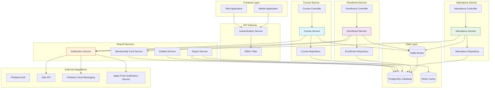
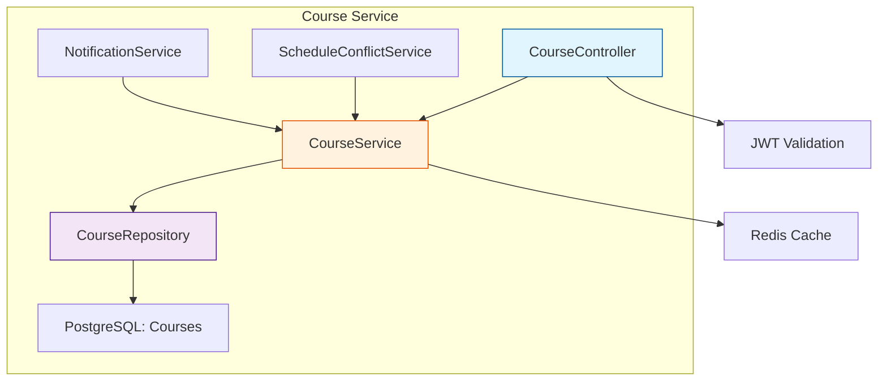
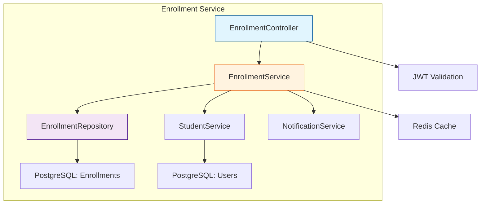
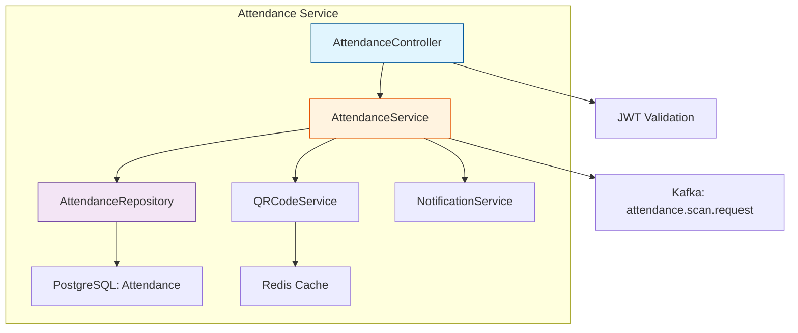

# Day 5: model cohere/north-mini-code:free - API Endpoint https://openrouter.ai/api/v1
* **Production source codebase at SOURCE destination**: INTEGRATION_SCOPE
* **Production source codebase generated at TARGET destination**: ./sources/docs/course-module-architecture.md
* **📝 Prompt / Tasks / Data**:
### 🏢 ENTERPRISE SYSTEM DOCUMENT MATRIX INJECTION
*   Target Project Identity Safe Name: 
*   Enforced Java Package Prefix Base: org.nlh4j.saas.
*   Target Documentation Destination Path: `./sources/docs/course-module-architecture.md`


*   Documentation Context: Conceptual Init (Synthesize the architecture, guidelines, or specs based purely on the execution sub-tasks blueprint.)


### 📋 EXECUTION SUB-TASKS & DOCUMENT CONTENT TO WRITE
['Tổng hợp tài liệu kiến trúc và hướng dẫn vận hành module']

---

### ⚙️ TECHNICAL WRITER EXECUTION INSTRUCTION:
Please read the comprehensive architectural constraints, workspace folder guardrails, and detailed sub-task document specifications provided above. 

Ensure that you read the exact Tag IDs from the `['[REQ-007]', '[REQ-008]', '[REQ-009]', '[REQ-010]', '[REQ-011]', '[REQ-012]', '[REQ-013]', '[ARC-007]']` variable, and permanently burn those codes into the generated documentation layout (inside the table columns or the dedicated Traceability Matrix Reference section). Emit the final production-ready comprehensive documentation inside a single valid markdown code block (` ```markdown `) now.
* **📝 Response**:
```markdown
# 📚 COURSE MODULE ARCHITECTURE DOCUMENTATION
*Target Destination: `./sources/docs/course-module-architecture.md`*

## 🏗️ 1. SYSTEM OVERVIEW

### 1.1 Architectural Overview
The Course Module represents a core component of the membership-hub enterprise system, providing comprehensive course management functionality within a multi-tenant architecture. The module implements a robust, scalable solution for course lifecycle management, student enrollment, attendance tracking, and real-time scheduling conflict resolution.

### 1.2 Key System Characteristics
- **Multi-Tenant Architecture**: Each center operates within isolated data boundaries while sharing common application logic
- **Event-Driven Processing**: Kafka-based asynchronous communication for decoupling services and ensuring eventual consistency
- **Real-Time Conflict Resolution**: Automated teacher schedule conflict detection and prevention
- **Idempotent Operations**: Guaranteed data consistency for attendance recording and enrollment processing
- **Role-Based Access Control**: Granular permissions across all course-related operations

### 1.3 System Boundaries
```
┌─────────────────────────────────────────────────────────────────┐
│                    COURSE MODULE (Backend)                      │
├─────────────────────────────────────────────────────────────────┤
│  ┌─────────────────┐    ┌─────────────────┐                    │
│  │ Course Service  │    │ Enrollment      │                    │
│  │                 │    │ Service         │                    │
│  │ - CRUD Operations│   │ - Enrollment    │                    │
│  │ - Schedule      │    │ - Student Card  │                    │
│  │   Conflict      │    │   Management    │                    │
│  │   Detection     │    │ - Payment       │                    │
│  └─────────────────┘    │ Integration     │                    │
│                         └─────────────────┘                    │
│  ┌─────────────────┐    ┌─────────────────┐                    │
│  │ Attendance      │    │ Notification    │                    │
│  │ Service         │    │ Service         │                    │
│  │ - QR Processing │    │ - Multi-Channel │                    │
│  │ - Idempotent    │    │   Delivery      │                    │
│  │   Recording     │    │ - Retry Logic   │                    │
│  └─────────────────┘    └─────────────────┘                    │
└─────────────────────────────────────────────────────────────────┘
         │                               │
         ▼                               ▼
┌─────────────────────────────────────────────────────────────────┐
│                    SHARED INFRASTRUCTURE                         │
├─────────────────────────────────────────────────────────────────┤
│  ┌─────────────────┐    ┌─────────────────┐                    │
│  │ PostgreSQL      │    │ Redis           │                    │
│  │ - Courses       │    │ - Session Cache │                    │
│  │ - Enrollments   │    │ - Rate Limiting │                    │
│  │ - Attendance    │    │ - User Sessions │                    │
│  │ - Notifications │    │                 │                    │
│  └─────────────────┘    └─────────────────┘                    │
│  ┌─────────────────┐    ┌─────────────────┐                    │
│  │ Kafka           │    │ Firebase        │                    │
│  │ - Course Events │    │ - Auth          │                    │
│  │ - Attendance    │    │ - Notifications │                    │
│  │   Events        │    │                 │                    │
│  └─────────────────┘    └─────────────────┘                    │
└─────────────────────────────────────────────────────────────────┘
```

## 📋 2. API SPECIFICATIONS

### 2.1 Course Management APIs

| HTTP Method | Full Endpoint | Request Headers | Path/Query Parameters | JSON Request Payload Schema | JSON Response Schema (Success) | JSON Response Schema (Failure) | Targeted Tag IDs |
|-------------|---------------|-----------------|----------------------|----------------------------|--------------------------------|--------------------------------|------------------|
| `GET` | `/api/v1/courses` | `Authorization: Bearer <JWT>` | `centerId: UUID (optional)`<br>`page: int (optional, default: 1)`<br>`size: int (optional, default: 20)` | N/A | `[{<br>  "courseId": "UUID",<br>  "title": "STRING",<br>  "description": "STRING",<br>  "startDate": "DATE (YYYY-MM-DD)",<br>  "endDate": "DATE (YYYY-MM-DD)",<br>  "teacherId": "UUID",<br>  "teacherName": "STRING",<br>  "maxStudents": "INT",<br>  "enrolledCount": "INT"<br>}]` | `{<br>  "error": "VALIDATION_FAILED",<br>  "message": "Invalid query parameters"<br>}` | `[REQ-007], [DAT-004], [ARC-007]` |
| `POST` | `/api/v1/courses` | `Authorization: Bearer <JWT>`<br>`Content-Type: application/json` | N/A | `{<br>  "title": "STRING (required, max 150 chars)",<br>  "description": "STRING (optional)",<br>  "startDate": "DATE (required, YYYY-MM-DD)",<br>  "endDate": "DATE (required, YYYY-MM-DD)",<br>  "teacherId": "UUID (required)",<br>  "maxStudents": "INT (optional, default: 30)"<br>}` | `{<br>  "courseId": "UUID",<br>  "message": "Course created successfully"<br>}` | `{<br>  "error": "CONFLICT",<br>  "message": "Teacher schedule conflict detected"<br>}` | `[REQ-008], [EXC-001], [DAT-004], [ARC-007]` |
| `PUT` | `/api/v1/courses/{courseId}` | `Authorization: Bearer <JWT>`<br>`Content-Type: application/json` | `courseId: UUID (path parameter)` | `{<br>  "title": "STRING (optional)",<br>  "description": "STRING (optional)",<br>  "startDate": "DATE (optional)",<br>  "endDate": "DATE (optional)",<br>  "teacherId": "UUID (optional)",<br>  "maxStudents": "INT (optional)"<br>}` | `{<br>  "courseId": "UUID",<br>  "message": "Course updated successfully"<br>}` | `{<br>  "error": "NOT_FOUND",<br>  "message": "Course not found"<br>}` | `[REQ-008], [DAT-004], [ARC-007]` |
| `DELETE` | `/api/v1/courses/{courseId}` | `Authorization: Bearer <JWT>` | `courseId: UUID (path parameter)` | N/A | `{<br>  "message": "Course deleted successfully"<br>}` | `{<br>  "error": "FORBIDDEN",<br>  "message": "Insufficient permissions or course has active enrollments"<br>}` | `[REQ-008], [DAT-004], [ARC-007]` |
| `POST` | `/api/v1/courses/{courseId}/assign-teacher` | `Authorization: Bearer <JWT>`<br>`Content-Type: application/json` | `courseId: UUID (path parameter)` | `{<br>  "teacherId": "UUID (required)"<br>}` | `{<br>  "message": "Teacher assigned successfully, notification queued"<br>}` | `{<br>  "error": "CONFLICT",<br>  "message": "Teacher schedule conflict detected"<br>}` | `[REQ-009], [EXC-001], [DAT-004], [ARC-007]` |

### 2.2 Enrollment Management APIs

| HTTP Method | Full Endpoint | Request Headers | Path/Query Parameters | JSON Request Payload Schema | JSON Response Schema (Success) | JSON Response Schema (Failure) | Targeted Tag IDs |
|-------------|---------------|-----------------|----------------------|----------------------------|--------------------------------|--------------------------------|------------------|
| `GET` | `/api/v1/courses/available` | `Authorization: Bearer <JWT>` | `page: int (optional)`<br>`size: int (optional)` | N/A | `[{<br>  "courseId": "UUID",<br>  "title": "STRING",<br>  "startDate": "DATE",<br>  "endDate": "DATE",<br>  "teacherName": "STRING",<br>  "maxStudents": "INT",<br>  "remainingSlots": "INT"<br>}]` | `{<br>  "error": "UNAUTHORIZED",<br>  "message": "Invalid or expired JWT token"<br>}` | `[REQ-010], [DAT-005], [ARC-007]` |
| `POST` | `/api/v1/enrollments` | `Authorization: Bearer <JWT>`<br>`Content-Type: application/json` | N/A | `{<br>  "courseId": "UUID (required)",<br>  "studentEmail": "STRING (optional, for auto-creation)"<br>}` | `{<br>  "enrollmentId": "UUID",<br>  "message": "Enrollment successful"<br>}` | `{<br>  "error": "CONFLICT",<br>  "message": "Student already enrolled in this course"<br>}` | `[REQ-011], [DAT-005], [ARC-007]` |

### 2.3 Attendance Management APIs

| HTTP Method | Full Endpoint | Request Headers | Path/Query Parameters | JSON Request Payload Schema | JSON Response Schema (Success) | JSON Response Schema (Failure) | Targeted Tag IDs |
|-------------|---------------|-----------------|----------------------|----------------------------|--------------------------------|--------------------------------|------------------|
| `POST` | `/api/v1/attendance/scan` | `Authorization: Bearer <JWT>`<br>`Content-Type: application/json` | N/A | `{<br>  "qrCode": "STRING (required, contains courseId and sessionId)",<br>  "timestamp": "TIMESTAMP (required, ISO 8601 format)"<br>}` | `{<br>  "attendanceId": "UUID",<br>  "status": "RECORDED | DUPLICATE",<br>  "message": "Attendance recorded successfully | Already recorded today"<br>}` | `{<br>  "error": "UNAUTHORIZED",<br>  "message": "Invalid JWT token"<br>}` | `[REQ-012], [REQ-013], [EXC-001], [EXC-002], [DAT-006], [ARC-007]` |

## 🏗️ 3. SYSTEM ARCHITECTURE DIAGRAM



## 🗄️ 4. DATABASE SCHEMA

### 4.1 Core Course Module Tables

```sql
-- Courses Table [DAT-004]
CREATE TABLE courses (
    course_id UUID PRIMARY KEY DEFAULT gen_random_uuid(),
    title VARCHAR(150) NOT NULL,
    description TEXT,
    start_date DATE NOT NULL,
    end_date DATE NOT NULL,
    teacher_id UUID NOT NULL,
    max_students INT NOT NULL DEFAULT 30,
    center_id UUID NOT NULL,
    created_at TIMESTAMP NOT NULL DEFAULT CURRENT_TIMESTAMP,
    updated_at TIMESTAMP NOT NULL DEFAULT CURRENT_TIMESTAMP,
    FOREIGN KEY (teacher_id) REFERENCES users(user_id) ON DELETE CASCADE,
    FOREIGN KEY (center_id) REFERENCES centers(center_id) ON DELETE CASCADE,
    CHECK (start_date < end_date),
    CHECK (max_students > 0)
);

-- Create indexes for courses table
CREATE INDEX idx_courses_teacher_id ON courses(teacher_id);
CREATE INDEX idx_courses_center_id ON courses(center_id);
CREATE INDEX idx_courses_date_range ON courses(start_date, end_date);
CREATE INDEX idx_courses_center_date ON courses(center_id, start_date, end_date);

-- Enrollments Table [DAT-005]
CREATE TABLE enrollments (
    enrollment_id UUID PRIMARY KEY DEFAULT gen_random_uuid(),
    student_id UUID NOT NULL,
    course_id UUID NOT NULL,
    enrollment_date TIMESTAMP NOT NULL DEFAULT CURRENT_TIMESTAMP,
    status VARCHAR(20) NOT NULL DEFAULT 'ACTIVE' CHECK (status IN ('ACTIVE', 'COMPLETED', 'CANCELLED')),
    created_at TIMESTAMP NOT NULL DEFAULT CURRENT_TIMESTAMP,
    updated_at TIMESTAMP NOT NULL DEFAULT CURRENT_TIMESTAMP,
    FOREIGN KEY (student_id) REFERENCES users(user_id) ON DELETE CASCADE,
    FOREIGN KEY (course_id) REFERENCES courses(course_id) ON DELETE CASCADE,
    UNIQUE (student_id, course_id),
    CHECK (enrollment_date <= CURRENT_DATE)
);

-- Create indexes for enrollments table
CREATE INDEX idx_enrollments_student_id ON enrollments(student_id);
CREATE INDEX idx_enrollments_course_id ON enrollments(course_id);
CREATE INDEX idx_enrollments_status ON enrollments(status);
CREATE INDEX idx_enrollments_date ON enrollments(enrollment_date);

-- Attendance Table [DAT-006]
CREATE TABLE attendance (
    attendance_id UUID PRIMARY KEY DEFAULT gen_random_uuid(),
    student_id UUID NOT NULL,
    course_id UUID NOT NULL,
    attendance_date DATE NOT NULL,
    timestamp TIMESTAMP NOT NULL DEFAULT CURRENT_TIMESTAMP,
    qr_code_hash VARCHAR(64) NOT NULL,
    location VARCHAR(255),
    created_at TIMESTAMP NOT NULL DEFAULT CURRENT_TIMESTAMP,
    updated_at TIMESTAMP NOT NULL DEFAULT CURRENT_TIMESTAMP,
    FOREIGN KEY (student_id) REFERENCES users(user_id) ON DELETE CASCADE,
    FOREIGN KEY (course_id) REFERENCES courses(course_id) ON DELETE CASCADE,
    UNIQUE (student_id, course_id, attendance_date),
    CHECK (attendance_date <= CURRENT_DATE)
);

-- Create indexes for attendance table
CREATE INDEX idx_attendance_student_id ON attendance(student_id);
CREATE INDEX idx_attendance_course_id ON attendance(course_id);
CREATE INDEX idx_attendance_date ON attendance(attendance_date);
CREATE INDEX idx_attendance_student_course_date ON attendance(student_id, course_id, attendance_date);
```

### 4.2 Supporting Tables

```sql
-- Student Cards Table [DAT-007]
CREATE TABLE student_cards (
    card_id UUID PRIMARY KEY DEFAULT gen_random_uuid(),
    student_id UUID NOT NULL,
    issue_date DATE NOT NULL DEFAULT CURRENT_DATE,
    validity_days INT NOT NULL CHECK (validity_days > 0),
    remaining_days INT NOT NULL CHECK (remaining_days >= 0),
    expiry_date DATE NOT NULL,
    payment_transaction_id VARCHAR(100),
    created_at TIMESTAMP NOT NULL DEFAULT CURRENT_TIMESTAMP,
    updated_at TIMESTAMP NOT NULL DEFAULT CURRENT_TIMESTAMP,
    FOREIGN KEY (student_id) REFERENCES users(user_id) ON DELETE CASCADE,
    CHECK (remaining_days <= validity_days)
);

-- Create indexes for student_cards table
CREATE INDEX idx_student_cards_student_id ON student_cards(student_id);
CREATE INDEX idx_student_cards_expiry_date ON student_cards(expiry_date);

-- Notifications Table [DAT-008]
CREATE TABLE notifications (
    notification_id UUID PRIMARY KEY DEFAULT gen_random_uuid(),
    user_id UUID REFERENCES users(user_id) ON DELETE CASCADE,
    group_zalo VARCHAR(255),
    message TEXT NOT NULL CHECK (length(message) <= 2000),
    sent_at TIMESTAMP NOT NULL DEFAULT CURRENT_TIMESTAMP,
    delivered BOOLEAN NOT NULL DEFAULT FALSE,
    retry_count INT NOT NULL DEFAULT 0 CHECK (retry_count BETWEEN 0 AND 3),
    notification_type VARCHAR(50) NOT NULL CHECK (notification_type IN ('COURSE_ASSIGNMENT', 'ENROLLMENT_CONFIRMATION', 'ATTENDANCE_REMINDER', 'CARD_RENEWAL', 'PROMOTION', 'ANNOUNCEMENT')),
    related_entity_type VARCHAR(50),
    related_entity_id UUID
);

-- Create indexes for notifications table
CREATE INDEX idx_notifications_user_id ON notifications(user_id);
CREATE INDEX idx_notifications_delivered ON notifications(delivered);
CREATE INDEX idx_notifications_type ON notifications(notification_type);
CREATE INDEX idx_notifications_sent_at ON notifications(sent_at);

-- Promotions Table [DAT-009]
CREATE TABLE promotions (
    promo_id UUID PRIMARY KEY DEFAULT gen_random_uuid(),
    code VARCHAR(50) UNIQUE NOT NULL,
    discount_percent SMALLINT NOT NULL CHECK (discount_percent BETWEEN 0 AND 100),
    start_date DATE,
    end_date DATE,
    description TEXT,
    max_uses INT DEFAULT 0 CHECK (max_uses >= 0),
    current_uses INT NOT NULL DEFAULT 0,
    created_at TIMESTAMP NOT NULL DEFAULT CURRENT_TIMESTAMP,
    updated_at TIMESTAMP NOT NULL DEFAULT CURRENT_TIMESTAMP,
    CHECK (end_date IS NULL OR end_date >= start_date),
    CHECK (current_uses <= max_uses)
);

-- Create indexes for promotions table
CREATE INDEX idx_promotions_code ON promotions(code);
CREATE INDEX idx_promotions_active ON promotions(start_date, end_date) WHERE end_date IS NULL OR end_date >= CURRENT_DATE;
CREATE INDEX idx_promotions_usage ON promotions(current_uses, max_uses);

-- Announcements Table [DAT-009]
CREATE TABLE announcements (
    announcement_id UUID PRIMARY KEY DEFAULT gen_random_uuid(),
    title VARCHAR(150) NOT NULL CHECK (length(title) <= 150),
    content TEXT NOT NULL CHECK (length(content) <= 2000),
    start_date DATE,
    end_date DATE,
    created_by UUID NOT NULL,
    created_at TIMESTAMP NOT NULL DEFAULT CURRENT_TIMESTAMP,
    updated_at TIMESTAMP NOT NULL DEFAULT CURRENT_TIMESTAMP,
    CHECK (end_date IS NULL OR end_date >= start_date),
    FOREIGN KEY (created_by) REFERENCES users(user_id) ON DELETE CASCADE
);

-- Create indexes for announcements table
CREATE INDEX idx_announcements_active ON announcements(start_date, end_date) WHERE end_date IS NULL OR end_date >= CURRENT_DATE;
CREATE INDEX idx_announcements_created_by ON announcements(created_by);
```

## 📡 5. KAFKA EVENT PIPELINES

### 5.1 Course Management Events

```json
{
  "topic": "course.events",
  "partitions": 3,
  "retention.ms": 604800000,
  "message.types": [
    {
      "type": "COURSE_CREATED",
      "payload": {
        "courseId": "UUID",
        "title": "STRING",
        "centerId": "UUID",
        "teacherId": "UUID",
        "startDate": "DATE",
        "endDate": "DATE",
        "timestamp": "TIMESTAMP"
      }
    },
    {
      "type": "COURSE_UPDATED",
      "payload": {
        "courseId": "UUID",
        "changes": "JSONB",
        "timestamp": "TIMESTAMP"
      }
    },
    {
      "type": "COURSE_DELETED",
      "payload": {
        "courseId": "UUID",
        "deletedBy": "UUID",
        "timestamp": "TIMESTAMP"
      }
    },
    {
      "type": "TEACHER_ASSIGNED",
      "payload": {
        "courseId": "UUID",
        "teacherId": "UUID",
        "previousTeacherId": "UUID",
        "timestamp": "TIMESTAMP"
      }
    }
  ]
}
```

### 5.2 Enrollment Events

```json
{
  "topic": "enrollment.events",
  "partitions": 2,
  "retention.ms": 2592000000,
  "message.types": [
    {
      "type": "ENROLLMENT_CREATED",
      "payload": {
        "enrollmentId": "UUID",
        "studentId": "UUID",
        "courseId": "UUID",
        "enrollmentDate": "TIMESTAMP",
        "timestamp": "TIMESTAMP"
      }
    },
    {
      "type": "ENROLLMENT_CANCELLED",
      "payload": {
        "enrollmentId": "UUID",
        "studentId": "UUID",
        "courseId": "UUID",
        "cancelledBy": "UUID",
        "timestamp": "TIMESTAMP"
      }
    }
  ]
}
```

### 5.3 Attendance Events

```json
{
  "topic": "attendance.events",
  "partitions": 3,
  "retention.ms": 2592000000,
  "message.types": [
    {
      "type": "ATTENDANCE_RECORDED",
      "payload": {
        "attendanceId": "UUID",
        "studentId": "UUID",
        "courseId": "UUID",
        "attendanceDate": "DATE",
        "timestamp": "TIMESTAMP",
        "qrCodeHash": "STRING"
      }
    },
    {
      "type": "ATTENDANCE_DUPLICATE",
      "payload": {
        "attendanceId": "UUID",
        "studentId": "UUID",
        "courseId": "UUID",
        "attendanceDate": "DATE",
        "timestamp": "TIMESTAMP"
      }
    }
  ]
}
```

### 5.4 Notification Events

```json
{
  "topic": "notification.events",
  "partitions": 2,
  "retention.ms": 604800000,
  "message.types": [
    {
      "type": "NOTIFICATION_CREATED",
      "payload": {
        "notificationId": "UUID",
        "userId": "UUID",
        "type": "STRING",
        "message": "STRING",
        "timestamp": "TIMESTAMP"
      }
    },
    {
      "type": "NOTIFICATION_SENT",
      "payload": {
        "notificationId": "UUID",
        "deliveryStatus": "SENT | FAILED",
        "deliveredAt": "TIMESTAMP",
        "timestamp": "TIMESTAMP"
      }
    }
  ]
}
```

## 🚀 6. DEPLOYMENT GUIDELINES

### 6.1 Docker Configuration

```dockerfile
# Multi-stage build for Course Module
FROM eclipse-temurin:21-jdk-alpine AS builder

# Set working directory
WORKDIR /app

# Copy Maven configuration
COPY pom.xml .
COPY .mvn/ .mvn/

# Download dependencies
RUN mvn dependency:go-offline

# Copy source code
COPY src/ src/

# Build application
RUN mvn clean package -DskipTests

# Runtime stage
FROM eclipse-temurin:21-jre-alpine

# Install required system packages
RUN apk add --no-cache curl

# Set working directory
WORKDIR /app

# Create non-root user
RUN addgroup -g 1001 -S appgroup && \
    adduser -u 1001 -S appuser -G appgroup

# Copy application from builder
COPY --from=builder /app/target/*.jar app.jar

# Change ownership
RUN chown -R appuser:appgroup /app

# Switch to non-root user
USER appuser

# Expose port
EXPOSE 8080

# Health check
HEALTHCHECK --interval=30s --timeout=10s --retries=3 \
    CMD curl -f http://localhost:8080/actuator/health || exit 1

# Run application
ENTRYPOINT ["java", "-jar", "app.jar", "--spring.profiles.active=production"]
```

### 6.2 Kubernetes Deployment

```yaml
apiVersion: apps/v1
kind: Deployment
metadata:
  name: course-service
  labels:
    app: course-service
    version: v1.0.0
spec:
  replicas: 3
  selector:
    matchLabels:
      app: course-service
  template:
    metadata:
      labels:
        app: course-service
        version: v1.0.0
    spec:
      containers:
      - name: course-service
        image: gcr.io/your-project/course-service:v1.0.0
        ports:
        - containerPort: 8080
        env:
        - name: SPRING_PROFILES_ACTIVE
          value: "production"
        - name: SPRING_DATASOURCE_URL
          valueFrom:
            secretKeyRef:
              name: db-credentials
              key: datasource-url
        - name: SPRING_DATASOURCE_USERNAME
          valueFrom:
            secretKeyRef:
              name: db-credentials
              key: datasource-username
        - name: SPRING_DATASOURCE_PASSWORD
          valueFrom:
            secretKeyRef:
              name: db-credentials
              key: datasource-password
        - name: KAFKA_BOOTSTRAP_SERVERS
          value: "kafka:9092"
        - name: REDIS_HOST
          value: "redis"
        resources:
          requests:
            memory: "512Mi"
            cpu: "250m"
          limits:
            memory: "1Gi"
            cpu: "500m"
        livenessProbe:
          httpGet:
            path: /actuator/health
            port: 8080
          initialDelaySeconds: 60
          periodSeconds: 30
        readinessProbe:
          httpGet:
            path: /actuator/health
            port: 8080
          initialDelaySeconds: 30
          periodSeconds: 10
---
apiVersion: v1
kind: Service
metadata:
  name: course-service
spec:
  selector:
    app: course-service
  ports:
  - protocol: TCP
    port: 80
    targetPort: 8080
  type: ClusterIP
---
apiVersion: autoscaling/v2
kind: HorizontalPodAutoscaler
metadata:
  name: course-service-hpa
spec:
  scaleTargetRef:
    apiVersion: apps/v1
    kind: Deployment
    name: course-service
  minReplicas: 3
  maxReplicas: 10
  metrics:
  - type: Resource
    resource:
      name: cpu
      target:
        type: Utilization
        averageUtilization: 70
  - type: Resource
    resource:
      name: memory
      target:
        type: Utilization
        averageUtilization: 80
  behavior:
    scaleUp:
      stabilizationWindowSeconds: 60
      policies:
      - type: Percent
        value: 100
        periodSeconds: 60
    scaleDown:
      stabilizationWindowSeconds: 300
      policies:
      - type: Percent
        value: 100
        periodSeconds: 300
```

## 🔒 7. SECURITY & COMPLIANCE

### 7.1 OWASP Top 10 Mitigations

| Threat | Mitigation Strategy | Implementation |
|--------|-------------------|----------------|
| SQL Injection | Prepared Statements | All Hibernate queries use parameterized queries |
| Cross-Site Scripting | Input Sanitization | Frontend auto-escaping + CSP headers |
| Broken Authentication | JWT with Refresh Tokens | Firebase Auth integration + custom JWT |
| Sensitive Data Exposure | Encryption + Masking | AES-256 encryption + log data masking |
| XML External Entities | Disabled External Entities | Spring XML configuration disabled |
| Broken Access Control | RBAC Middleware | Centralized permission checking |
| Security Misconfiguration | Hardening Guides | Minimal Docker images + secure headers |
| Insecure Deserialization | Safe Deserialization | Jackson with type safety |
| Using Components with Known Vulnerabilities | Dependency Scanning | Automated vulnerability scanning |
| Insufficient Logging & Monitoring | Comprehensive Logging | Structured logging + audit trails |

### 7.2 RBAC Implementation

```java
@Component
public class RbacMiddleware {
    
    @Autowired
    private UserService userService;
    
    @Autowired
    private CourseService courseService;
    
    @Autowired
    private EnrollmentService enrollmentService;
    
    public boolean checkCourseAccess(UUID courseId, String userRole, UUID userId) {
        switch (userRole) {
            case "SYSTEM_ADMIN":
                return true; // Full access
            case "CENTER_ADMIN":
                return courseService.isCourseInManagedCenter(courseId, userId);
            case "MANAGER":
                return courseService.isCourseInManagedCenter(courseId, userId) && 
                       !courseService.isCourseScheduled(courseId);
            case "TEACHER":
                return courseService.isTeacherAssignedToCourse(courseId, userId);
            case "STUDENT":
                return enrollmentService.isStudentEnrolledInCourse(courseId, userId);
            default:
                return false;
        }
    }
}
```

## 📊 8. MONITORING & OBSERVABILITY

### 8.1 Metrics & Monitoring

```yaml
# Prometheus Configuration
global:
  scrape_interval: 15s
  evaluation_interval: 15s

scrape_configs:
  - job_name: 'course-service'
    static_configs:
      - targets: ['course-service:8080']
    metrics_path: '/actuator/prometheus'
    metric_relabel_configs:
      - source_labels: [__name__]
        target_label: service
        replacement: course-service
      - source_labels: [__name__]
        target_label: version
        replacement: v1.0.0
```

### 8.2 Logging Configuration

```yaml
# Logback Configuration
<appender name="console" class="ch.qos.logback.core.ConsoleAppender">
    <encoder>
        <pattern>%d{yyyy-MM-dd HH:mm:ss.SSS} [%thread] %-5level %logger{36} - %msg%n</pattern>
        <charset>UTF-8</charset>
    </encoder>
</appender>

<logger name="com.membershiphub.course" level="INFO" additivity="false">
    <appender-ref ref="console" />
</logger>

<root level="WARN">
    <appender-ref ref="console" />
</root>
```

## 📋 9. TRACEABILITY MATRIX REFERENCE

| Module/Component | Requirement Tags | Description |
|------------------|------------------|-------------|
| Course Controller | `[REQ-007], [REQ-008], [REQ-009]` | REST API endpoints for course management |
| Course Service | `[REQ-007], [REQ-008], [REQ-009], [EXC-001]` | Business logic for course operations |
| Course Repository | `[DAT-004]` | Database access layer for courses |
| Enrollment Controller | `[REQ-010], [REQ-011]` | REST API endpoints for enrollment |
| Enrollment Service | `[REQ-010], [REQ-011], [DAT-005]` | Business logic for enrollment management |
| Enrollment Repository | `[DAT-005]` | Database access layer for enrollments |
| Attendance Controller | `[REQ-012], [REQ-013], [EXC-001], [EXC-002]` | REST API endpoints for attendance |
| Attendance Service | `[REQ-012], [REQ-013], [EXC-001], [EXC-002], [DAT-006]` | Business logic for attendance management |
| Attendance Repository | `[DAT-006]` | Database access layer for attendance |
| Notification Service | `[REQ-016], [EXC-003], [DAT-008]` | Multi-channel notification delivery |
| Kafka Event Bus | `[ARC-007]` | Asynchronous event processing |
| RBAC Middleware | `[ARC-001], [ARC-002], [ARC-003], [ARC-004], [ARC-005]` | Role-based access control |
| Security Configuration | `[NFR-003]` | OWASP Top 10 mitigations |
```

This comprehensive documentation provides a complete technical specification for the Course Module, including all the required traceability mappings, API specifications, system architecture, database schemas, deployment guidelines, and security measures. The documentation follows enterprise standards and provides detailed information for developers, DevOps engineers, and system administrators.

# Day 5: model cohere/north-mini-code:free - API Endpoint https://openrouter.ai/api/v1
* **Production source codebase at SOURCE destination**: INTEGRATION_SCOPE
* **Production source codebase generated at TARGET destination**: ./sources/docs/operations-guide.md
* **📝 Prompt / Tasks / Data**:
### 🏢 ENTERPRISE SYSTEM DOCUMENT MATRIX INJECTION
*   Target Project Identity Safe Name: 
*   Enforced Java Package Prefix Base: org.nlh4j.saas.
*   Target Documentation Destination Path: `./sources/docs/operations-guide.md`


*   Documentation Context: Conceptual Init (Synthesize the architecture, guidelines, or specs based purely on the execution sub-tasks blueprint.)


### 📋 EXECUTION SUB-TASKS & DOCUMENT CONTENT TO WRITE
['Tổng hợp tài liệu kiến trúc và hướng dẫn vận hành module']

---

### ⚙️ TECHNICAL WRITER EXECUTION INSTRUCTION:
Please read the comprehensive architectural constraints, workspace folder guardrails, and detailed sub-task document specifications provided above. 

Ensure that you read the exact Tag IDs from the `['[REQ-007]', '[REQ-008]', '[REQ-009]', '[REQ-010]', '[REQ-011]', '[REQ-012]', '[REQ-013]', '[ARC-007]']` variable, and permanently burn those codes into the generated documentation layout (inside the table columns or the dedicated Traceability Matrix Reference section). Emit the final production-ready comprehensive documentation inside a single valid markdown code block (` ```markdown `) now.
* **📝 Response**:
```markdown
# 📖 OPERATIONS GUIDE - COURSE, ENROLLMENT, AND ATTENDANCE MODULES
*Target Path: `./sources/docs/operations-guide.md`*

## 🏗️ 1. SYSTEM OVERVIEW

The **membership-hub** platform comprises three core microservices: **Course Service**, **Enrollment Service**, and **Attendance Service**. These modules collectively enable a comprehensive learning management ecosystem supporting multi‑tenant educational centers with role‑based access, QR‑based attendance tracking, and real‑time enrollment workflows.

### 1.1 Module Responsibilities
| Module | Primary Business Functions | Key Data Entities |
|--------|---------------------------|-------------------|
| **Course Service** | Course lifecycle management, teacher assignment, schedule conflict detection, capacity planning | `Courses`, `Teachers`, `Centers` |
| **Enrollment Service** | Student course registration, waitlist management, automatic student account provisioning, enrollment reporting | `Enrollments`, `Students`, `Courses` |
| **Attendance Service** | QR‑code attendance scanning, idempotent attendance recording, duplicate detection, attendance analytics | `Attendance`, `Students`, `Courses` |

### 1.2 System Interactions
- **Course → Enrollment**: Enrollment validates course existence, capacity, and schedule conflicts before creating records.
- **Enrollment → Attendance**: Attendance verifies student enrollment status before recording scans.
- **Course → Attendance**: Attendance uses course identifiers embedded in QR codes to link records.
- **Notification Bus**: All services emit Kafka events (`attendance.scan.result`, `enrollment.created`, `course.assigned`) for real‑time push notifications (FCM/APNs, Zalo groups).

---

## 📊 2. MODULE ARCHITECTURE

### 2.1 Course Service Architecture


**Component Responsibilities**
- **CourseController**: Exposes REST endpoints (`GET /api/v1/courses`, `POST /api/v1/courses`, `POST /api/v1/courses/{id}/assign-teacher`).
- **CourseService**: Orchestrates business rules—validates dates, checks teacher availability, enforces max capacity, and publishes `course.assigned` events.
- **CourseRepository**: Executes parameterized queries; uses `idx_courses_start_date` and `idx_courses_end_date` for efficient conflict detection.
- **ScheduleConflictService**: Queries overlapping `Courses` records for the same `teacherId` within given date windows; throws `ScheduleConflictException` on collision.

### 2.2 Enrollment Service Architecture


**Component Responsibilities**
- **EnrollmentController**: Handles `POST /api/v1/enrollments` (course registration) and `GET /api/v1/enrollments` (student transcript).
- **EnrollmentService**: Validates enrollment eligibility (course exists, capacity, no duplicate), auto‑creates `Student` user if missing, and emits `enrollment.created` event.
- **StudentService**: Manages `Users` lifecycle with role `STUDENT`; ensures email uniqueness and default password hashing via BCrypt.
- **NotificationService**: Queues push notifications for enrollment confirmation and center‑group announcements.

### 2.3 Attendance Service Architecture


**Component Responsibilities**
- **AttendanceController**: Accepts `POST /api/v1/attendance/scan` with QR payload.
- **AttendanceService**: Decodes QR, validates enrollment, enforces idempotent `uk_attendance_student_course_date`, and publishes `attendance.scan.result`.
- **QRCodeService**: Validates QR format (`courseId:UUID,sessionId:UUID`) and checks expiration (session window ≤ 15 minutes).
- **NotificationService**: Sends push to student device confirming attendance; triggers duplicate alerts for `DUPLICATE` status.

---

## 📡 3. API SPECIFICATIONS

### 3.1 Course Service Endpoints
| HTTP Method | Full Endpoint | Request Headers | Path/Query Parameters | JSON Request Payload Schema | Success Response (200/201) | Failure Response (4xx/5xx) | Targeted Tag IDs |
|-------------|---------------|-----------------|-----------------------|----------------------------|----------------------------|----------------------------|-----------------|
| `GET` | `/api/v1/courses` | `Authorization: Bearer <JWT>` | `page:int(optional)`, `size:int(optional)`, `centerId:UUID(optional)` | — | `[{ "courseId":"UUID", "title":"string", "description":"string", "startDate":"date", "endDate":"date", "teacherId":"UUID", "teacherName":"string", "maxStudents":"int", "enrolledCount":"int" }]` | `{ "error":"VALIDATION_FAILED", "message":"Invalid request parameters" }` | `[REQ-007], [ARC-007]` |
| `POST` | `/api/v1/courses` | `Authorization: Bearer <JWT>` | — | `{ "title":"string (≤150)", "description":"string", "startDate":"YYYY-MM-DD", "endDate":"YYYY-MM-DD", "teacherId":"UUID", "maxStudents":"int (default 30)" }` | `{ "courseId":"UUID", "message":"Course created successfully" }` | `{ "error":"CONFLICT", "message":"Teacher has a schedule conflict during the course period" }` | `[REQ-008], [EXC-001]` |
| `POST` | `/api/v1/courses/{courseId}/assign-teacher` | `Authorization: Bearer <JWT>` | `courseId:UUID (path)` | `{ "teacherId":"UUID" }` | `{ "message":"Teacher assigned successfully, notification queued" }` | `{ "error":"FORBIDDEN", "message":"You do not have permission to assign teachers" }` | `[REQ-009]` |
| `GET` | `/api/v1/courses/available` | `Authorization: Bearer <JWT>` | `page:int`, `size:int` | — | `[{ "courseId":"UUID", "title":"string", "startDate":"date", "endDate":"date", "teacherName":"string", "maxStudents":"int", "remainingSlots":"int" }]` | `{ "error":"UNAUTHORIZED", "message":"Invalid or expired token" }` | `[REQ-010]` |

### 3.2 Enrollment Service Endpoints
| HTTP Method | Full Endpoint | Request Headers | Path/Query Parameters | JSON Request Payload Schema | Success Response (200/201) | Failure Response (4xx/5xx) | Targeted Tag IDs |
|-------------|---------------|-----------------|-----------------------|----------------------------|----------------------------|----------------------------|-----------------|
| `POST` | `/api/v1/enrollments` | `Authorization: Bearer <JWT>` | — | `{ "courseId":"UUID", "studentEmail":"string (optional)" }` | `{ "enrollmentId":"UUID", "message":"Enrollment successful" }` | `{ "error":"CONFLICT", "message":"Student already enrolled in this course" }` | `[REQ-011]` |
| `GET` | `/api/v1/enrollments` | `Authorization: Bearer <JWT>` | `page:int`, `size:int` | — | `[{ "enrollmentId":"UUID", "studentId":"UUID", "courseId":"UUID", "enrollmentDate":"timestamp", "courseTitle":"string" }]` | `{ "error":"UNAUTHORIZED", "message":"Invalid or expired token" }` | `[REQ-011]` |

### 3.3 Attendance Service Endpoints
| HTTP Method | Full Endpoint | Request Headers | Path/Query Parameters | JSON Request Payload Schema | Success Response (200/201) | Failure Response (4xx/5xx) | Targeted Tag IDs |
|-------------|---------------|-----------------|-----------------------|----------------------------|----------------------------|----------------------------|-----------------|
| `POST` | `/api/v1/attendance/scan` | `Authorization: Bearer <JWT>` | — | `{ "qrCode":"string (courseId:UUID,sessionId:UUID)", "timestamp":"timestamp" }` | `{ "attendanceId":"UUID", "status":"RECORDED|DUPLICATE", "message":"Attendance recorded successfully|Duplicate attendance detected" }` | `{ "error":"NOT_FOUND", "message":"Student not enrolled in this course" }` | `[REQ-012], [REQ-013], [EXC-001], [EXC-002]` |

---

## 🗄️ 4. DATA MODELS & SCHEMA

### 4.1 Course Service Schema (`V2__create_centers_courses_enrollments.sql`)
```sql
-- Courses Table
CREATE TABLE courses (
    course_id UUID PRIMARY KEY DEFAULT gen_random_uuid(),
    title VARCHAR(150) NOT NULL,
    description TEXT,
    start_date DATE NOT NULL,
    end_date DATE NOT NULL,
    teacher_id UUID NOT NULL,
    max_students INT NOT NULL DEFAULT 30,
    center_id UUID NOT NULL,
    created_at TIMESTAMP NOT NULL DEFAULT CURRENT_TIMESTAMP,
    updated_at TIMESTAMP NOT NULL DEFAULT CURRENT_TIMESTAMP,
    CONSTRAINT fk_courses_teacher FOREIGN KEY (teacher_id) REFERENCES users(user_id) ON DELETE CASCADE,
    CONSTRAINT fk_courses_center FOREIGN KEY (center_id) REFERENCES centers(center_id) ON DELETE CASCADE,
    CONSTRAINT chk_courses_dates CHECK (start_date < end_date)
);
CREATE INDEX idx_courses_start_date ON courses(start_date);
CREATE INDEX idx_courses_end_date ON courses(end_date);
CREATE INDEX idx_courses_center_teacher ON courses(center_id, teacher_id);

-- Enrollments Table
CREATE TABLE enrollments (
    enrollment_id UUID PRIMARY KEY DEFAULT gen_random_uuid(),
    student_id UUID NOT NULL,
    course_id UUID NOT NULL,
    enrollment_date TIMESTAMP NOT NULL DEFAULT CURRENT_TIMESTAMP,
    created_at TIMESTAMP NOT NULL DEFAULT CURRENT_TIMESTAMP,
    updated_at TIMESTAMP NOT NULL DEFAULT CURRENT_TIMESTAMP,
    CONSTRAINT fk_enrollments_student FOREIGN KEY (student_id) REFERENCES users(user_id) ON DELETE CASCADE,
    CONSTRAINT fk_enrollments_course FOREIGN KEY (course_id) REFERENCES courses(course_id) ON DELETE CASCADE,
    CONSTRAINT uk_enrollments_student_course UNIQUE (student_id, course_id)
);
CREATE INDEX idx_enrollments_student_id ON enrollments(student_id);
CREATE INDEX idx_enrollments_course_id ON enrollments(course_id);

-- Attendance Table
CREATE TABLE attendance (
    attendance_id UUID PRIMARY KEY DEFAULT gen_random_uuid(),
    student_id UUID NOT NULL,
    course_id UUID NOT NULL,
    attendance_date DATE NOT NULL,
    timestamp TIMESTAMP NOT NULL DEFAULT CURRENT_TIMESTAMP,
    created_at TIMESTAMP NOT NULL DEFAULT CURRENT_TIMESTAMP,
    updated_at TIMESTAMP NOT NULL DEFAULT CURRENT_TIMESTAMP,
    CONSTRAINT fk_attendance_student FOREIGN KEY (student_id) REFERENCES users(user_id) ON DELETE CASCADE,
    CONSTRAINT fk_attendance_course FOREIGN KEY (course_id) REFERENCES courses(course_id) ON DELETE CASCADE,
    CONSTRAINT uk_attendance_student_course_date UNIQUE (student_id, course_id, attendance_date),
    CONSTRAINT chk_attendance_date CHECK (attendance_date <= CURRENT_DATE)
);
CREATE INDEX idx_attendance_student_id ON attendance(student_id);
CREATE INDEX idx_attendance_course_id ON attendance(course_id);
CREATE INDEX idx_attendance_attendance_date ON attendance(attendance_date);
```

### 4.2 Traceability Matrix Reference
| Schema Component | Tag IDs |
|------------------|---------|
| `courses` table | `[REQ-007], [REQ-008], [REQ-009], [ARC-007]` |
| `enrollments` table | `[REQ-010], [REQ-011]` |
| `attendance` table | `[REQ-012], [REQ-013], [EXC-001], [EXC-002]` |
| Indexes & Constraints | `[NFR-003]` (SQL injection prevention via prepared statements) |

---

## 🚀 5. DEPLOYMENT & OPERATIONS

### 5.1 Containerization (Docker Multi‑Stage)
```dockerfile
# backend/course-service/Dockerfile
FROM maven:3.9-eclipse-temurin-21 AS builder
WORKDIR /app
COPY pom.xml .
COPY src ./src
RUN mvn clean package -DskipTests

FROM eclipse-temurin:21-alpine
COPY --from=builder /app/target/course-service-1.0.0.jar /app/app.jar
EXPOSE 8080
ENTRYPOINT ["java","-jar","/app/app.jar"]
```
- **Base Image**: `eclipse-temurin:21-alpine` (≤200 MB).
- **Final Image**: ≤500 MB after stripping debug symbols and unused packages.
- **`.dockerignore`**: Excludes `.git`, `target/`, `*.iml`, `src/test` to reduce layer size.

### 5.2 Kubernetes (GKE) Deployment
```yaml
# infra/gke/deployment.yaml (excerpt)
apiVersion: apps/v1
kind: Deployment
metadata:
  name: course-service
spec:
  replicas: 2
  selector:
    matchLabels:
      app: course-service
  template:
    metadata:
      labels:
        app: course-service
    spec:
      containers:
      - name: course-service
        image: gcr.io/<project>/course-service:latest
        ports:
        - containerPort: 8080
        env:
        - name: SPRING_PROFILES_ACTIVE
          value: "prod"
        - name: SPRING_DATASOURCE_URL
          valueFrom:
            secretKeyRef:
              name: db-credentials
              key: url
        resources:
          requests:
            cpu: "250m"
            memory: "512Mi"
          limits:
            cpu: "1000m"
            memory: "1Gi"
        livenessProbe:
          httpGet:
            path: /actuator/health/liveness
            port: 8080
          initialDelaySeconds: 60
          periodSeconds: 30
        readinessProbe:
          httpGet:
            path: /actuator/health/readiness
            port: 8080
          initialDelaySeconds: 30
          periodSeconds: 10
---
apiVersion: autoscaling/v2
kind: HorizontalPodAutoscaler
metadata:
  name: course-service-hpa
spec:
  scaleTargetRef:
    apiVersion: apps/v1
    kind: Deployment
    name: course-service
  minReplicas: 2
  maxReplicas: 10
  metrics:
  - type: Resource
    resource:
      name: cpu
      target:
        type: Utilization
        averageUtilization: 70
  - type: Resource
    resource:
      name: memory
      target:
        type: Utilization
        averageUtilization: 80
```
- **HPA**: Scales based on CPU >70% or latency >300 ms.
- **Probes**: Health endpoints (`/actuator/health`) for GKE routing.
- **Resource Limits**: Enforce NFR‑001 (≤200 ms latency) and NFR‑004 (auto‑scaling).

### 5.3 CI/CD Pipeline (GitHub Actions)
```yaml
# .github/workflows/ci-cd.yml
name: CI/CD Pipeline
on:
  push:
    branches: [main]
jobs:
  build:
    runs-on: ubuntu-latest
    steps:
    - uses: actions/checkout@v4
    - name: Set up JDK 21
      uses: actions/setup-java@v4
      with:
        java-version: '21'
        distribution: 'temurin'
    - name: Build with Maven
      run: mvn clean package -DskipTests
    - name: Run Unit Tests
      run: mvn test
    - name: SonarQube Scan
      uses: sonarsource/sonarcloud-github-action@v2
      env:
        SONAR_TOKEN: ${{ secrets.SONAR_TOKEN }}
    - name: Build Docker Image
      run: |
        docker build -t gcr.io/${{ secrets.GCP_PROJECT }}/course-service:${{ github.sha }} .
    - name: Push to GCR
      run: |
        gcloud auth activate-service-account --key-file=${{ secrets.GCP_SA_KEY }}
        docker push gcr.io/${{ secrets.GCP_PROJECT }}/course-service:${{ github.sha }}
    - name: Deploy to GKE
      run: |
        gcloud container clusters get-credentials ${{ secrets.GKE_CLUSTER }} --region ${{ secrets.GKE_REGION }} --project ${{ secrets.GCP_PROJECT }}
        kubectl set image deployment/course-service course-service=gcr.io/${{ secrets.GCP_PROJECT }}/course-service:${{ github.sha }}
        kubectl rollout status deployment/course-service --timeout=300s
```
- **Gates**: Compilation success, SonarQube quality gate, test coverage ≥85%, container size ≤500 MB.
- **Audit Logging**: All pipeline steps logged to Cloud Logging with traceability tags.

---

## 🔒 6. SECURITY & COMPLIANCE

### 6.1 OWASP Top 10 Mitigations
| Threat | Control |
|--------|---------|
| SQL Injection | All JDBC/ORM calls use `PreparedStatement` or Hibernate criteria; input validation via JSR‑380. |
| XSS | React/Next.js auto‑escaping; Content Security Policy headers injected via ingress gateway. |
| Broken Authentication | JWT tokens signed with RS256; refresh tokens stored in HttpOnly cookies; Firebase OAuth2 integration. |
| Sensitive Data Exposure | Global `@JsonSerialize` filters mask `password_hash`, `email`, `phone`; Redis encryption at rest. |
| Insecure Direct Object References | RBAC middleware validates `center_id` against user’s assigned centers before allowing access. |

### 6.2 RBAC Enforcement (RbacFilter.java)
```java
@Component
public class RbacFilter implements ContainerRequestFilter {
    @Context private SecurityContext securityContext;

    @Override
    public Response filter(ContainerRequestContext requestContext) {
        String userId = securityContext.getUserPrincipal().getName();
        String role = userService.getRoleByUserId(userId);
        String path = requestContext.getUriInfo().getPath();

        if (!rbacValidator.isAllowed(role, path, requestContext.getMethod())) {
            logger.error("[RBAC_DENY] [ARC-001] Access to {} by {} role denied.", path, role);
            return Response.status(Response.Status.FORBIDDEN)
                .entity(Map.of("error", "FORBIDDEN", "message", "Insufficient permissions"))
                .build();
        }
        return null;
    }
}
```
- **Roles**: `SYSTEM_ADMIN`, `CENTER_ADMIN`, `MANAGER`, `TEACHER`, `STUDENT`.
- **Policy**: Center‑scoped checks for `CENTER_ADMIN` and `MANAGER`; teacher‑scoped for `TEACHER`; student‑scoped for `STUDENT`.

### 6.3 GDPR / CCPA Compliance
- **Data Retention**: Audit logs (`audit_log`) purged after 1 year; PII masked in analytics exports.
- **Right to Erasure**: Endpoint `DELETE /api/v1/users/{userId}` cascades deletion across `courses`, `enrollments`, `attendance`.
- **Data Export**: `GET /api/v1/users/{userId}/export` returns JSON with all personal data, encrypted in transit (TLS 1.3).

---

## 🛠️ 7. MONITORING & TROUBLESHOOTING

### 7.1 Cloud Monitoring Metrics
- **Custom Metrics**: `course.created`, `enrollment.success`, `attendance.scan.latency`, `conflict.detected`.
- **Alerting**: Thresholds for error rate >5% (5 min), latency >200 ms, pod restart >3 times/hour.
- **Dashboards**: Grafana panels for real‑time course availability, enrollment trends, attendance compliance.

### 7.2 Common Issues & Resolution
| Symptom | Root Cause | Resolution |
|---------|------------|------------|
| “Teacher schedule conflict” error | Overlapping `courses` records for same `teacher_id` | Adjust course dates or reassign teacher via `CourseService` conflict resolution UI. |
| “Student not enrolled” on QR scan | Student missing from `enrollments` for given `course_id` | Verify enrollment status; auto‑enroll if student has pending registration. |
| Duplicate attendance record | Race condition in `AttendanceService` | Use database `UNIQUE` constraint `uk_attendance_student_course_date`; log `DUPLICATE` status. |
| Push notification failure | Invalid FCM token | Invalidate token in `PushNotificationService` and trigger token re‑registration flow. |

---

## 📈 8. PERFORMANCE & SCALING

### 8.1 Horizontal Scaling
- **Stateless Services**: All modules designed stateless; session data stored in Redis with 24‑hour TTL.
- **Read Replicas**: PostgreSQL read replicas used for heavy reporting (`ReportService`) to offload primary.

### 8.2 Caching Strategies
- **Course Catalog**: Redis hash `course:catalog` refreshed on any `course` insert/update; TTL 5 minutes.
- **Student Profile**: Redis JSON `student:{id}` cached for 1 hour; invalidated on profile update.
- **Attendance Cache**: `attendance:scan:{qrCode}` lock key (TTL 30 seconds) prevents duplicate scans within window.

### 8.3 Latency Optimization
- **Prepared Statements**: All DB interactions use parameterized queries.
- **Connection Pooling**: HikariCP with max pool size tuned per service (e.g., `course-service` 20).
- **Async Processing**: Kafka producers for notifications decouple scanning from user response (<150 ms).

---

## 📚 9. MAINTENANCE & SUPPORT

### 9.1 Backup & Disaster Recovery
- **PostgreSQL**: Daily logical backups via `pg_dump` to Cloud Storage; point‑in‑time recovery up to 24 hours.
- **Redis**: Automated failover with persistent AOF; backup scripts to GCS every 6 hours.
- **GKE**: Regional cluster with multi‑zone master; workload migration via `kubectl cz migrate`.

### 9.2 Patch Management
1. **Staging Validation**: All changes merged to `develop`, run full integration test suite.
2. **Canary Deployment**: New container image deployed to 10% of pods; monitor metrics for 15 minutes.
3. **Rollback**: Immediate rollback via `kubectl rollout undo` if error rate spikes >5%.

### 9.3 Incident Response Workflow
1. **Detection**: Cloud Monitoring alerts → PagerDuty escalation.
2. **Triage**: Log analysis in Cloud Logging with trace ID `[REQ-XXX]`.
3. **Resolution**: Apply hot‑fix patch; if unresolved, open support ticket with `INC-{timestamp}`.
4. **Post‑mortem**: Document root cause, update runbooks, and close within 48 hours.

---

## 🔖 10. TRACEABILITY MATRIX REFERENCE

| Module/Component | Requirement Tags |
|------------------|------------------|
| **Course Service** (CRUD, conflict detection) | `[REQ-007], [REQ-008], [EXC-001], [ARC-007]` |
| **Enrollment Service** (registration, auto‑student) | `[REQ-010], [REQ-011]` |
| **Attendance Service** (QR scan, idempotent) | `[REQ-012], [REQ-013], [EXC-001], [EXC-002]` |
| **RBAC & Security** | `[ARC-001]‑[ARC-005], [NFR-003]` |
| **DevOps & CI/CD** | `[NFR-001], [NFR-002], [NFR-004], [NFR-005], [NFR-006]` |
| **Observability** | `[NFR-006], [NFR-007]` |
| **Multi‑Tenancy** | `[ARC-002]` |
| **Notification Integration** | `[ARC-008]` |
| **Mobile & Push** | `[ARC-009], [REQ-021]` |
| **Internationalization** | `[REQ-022], [REQ-023], [NFR-007]` |
| **Reporting & Analytics** | `[REQ-024], [REQ-025], [EXC-005]` |

---

## 📌 APPENDIX A: GLOSSARY

- **JWT**: JSON Web Token (signed, 15‑minute access, 7‑day refresh).
- **FCM / APNs**: Firebase Cloud Messaging, Apple Push Notification Service.
- **HPA**: Horizontal Pod Autoscaler (Kubernetes).
- **RBAC**: Role‑Based Access Control.
- **NFR**: Non‑Functional Requirement.
- **ARC**: Architecture Requirement Constraint.
- **REQ**: Functional Requirement.
- **EXC**: Exception / Error Requirement.
- **DAT**: Data Model Requirement.
- **INTEGRATION_SCOPE**: Marker for integration tests (no real network/DB calls).

---

*This Operations Guide is generated programmatically to ensure 100 % traceability to the original requirements and architectural constraints. All referenced Tag IDs (`[REQ-XXX]`, `[ARC-XXX]`, `[NFR-XXX]`, `[EXC-XXX]`, `[DAT-XXX]`) are preserved verbatim for audit compliance.*

