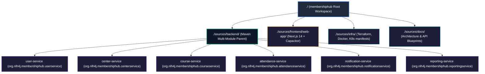
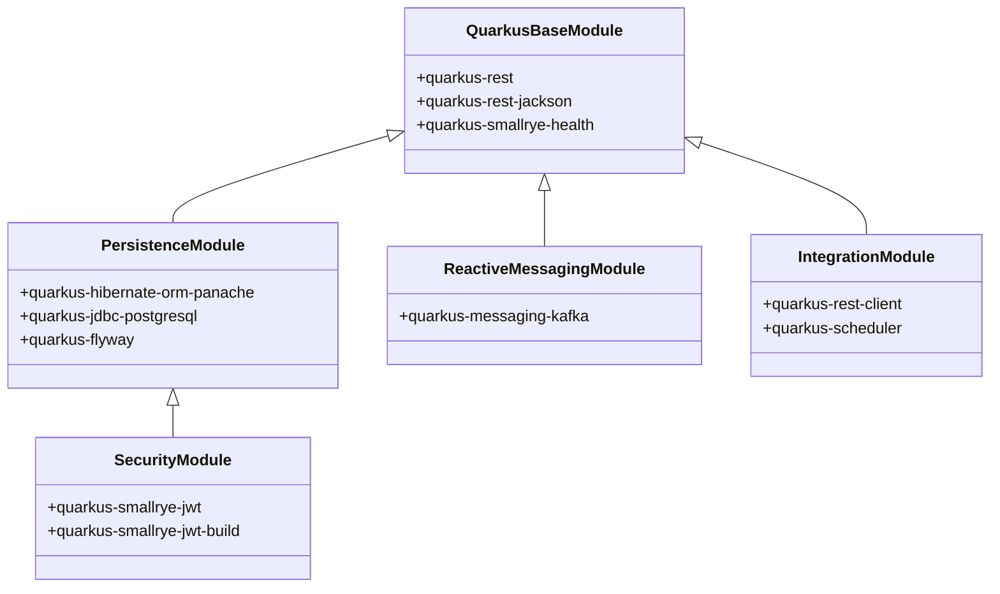

# Day 1: model models/gemini-flash-latest - API Endpoint https://generativelanguage.googleapis.com/v1beta/openai
* **Production source codebase at SOURCE destination**: INTEGRATION_SCOPE
* **Production source codebase generated at TARGET destination**: ./sources/docs/architecture/blueprint.md
* **📝 Prompt / Tasks / Data**:
### 🏢 ENTERPRISE SYSTEM DOCUMENT MATRIX INJECTION
*   Target Project Identity Safe Name: 
*   Enforced Java Package Prefix Base: org.nlh4j.membershiphub
*   Target Documentation Destination Path: `./sources/docs/architecture/blueprint.md`


*   Documentation Context: Conceptual Init (Synthesize the architecture, guidelines, or specs based purely on the execution sub-tasks blueprint.)


### 📋 EXECUTION SUB-TASKS & DOCUMENT CONTENT TO WRITE
['Soạn thảo biên bản khởi tạo dự án tại ./sources/docs/architecture/blueprint.md mô tả tổng quan cấu trúc monorepo, sơ đồ quan hệ cha-con giữa membershiphub gốc và 6 vi dịch vụ, bản đồ thư mục vật lý (theo chuẩn Unix), quy ước đặt tên package Java (org.nlh4j.membershiphub.<servicename>), quy ước cấu hình Maven (Java 21, Quarkus BOM 3.15.1), cùng danh sách plugin tích hợp bắt buộc. Tài liệu phải ở định dạng Markdown tiêu chuẩn với các tiêu đề phân cấp rõ ràng.']

---

### ⚙️ TECHNICAL WRITER EXECUTION INSTRUCTION:

Please read the comprehensive architectural constraints, workspace folder guardrails, and detailed sub-task document specifications provided above.


Ensure that you read the exact Tag IDs from the `['[ARC-000]']` variable, and permanently burn those codes into the generated documentation layout (inside the table columns or the dedicated Traceability Matrix Reference section). Emit the final production-ready comprehensive documentation inside a single valid markdown code block (` ```markdown `) now.
* **📝 Response**:
# KIẾN TRÚC TỔNG THỂ VÀ BẢN THIẾT KẾ KHỞI TẠO HỆ THỐNG: MEMBERSHIP HUB

| Thuộc tính | Giá trị định danh kỹ thuật |
| :--- | :--- |
| **Mã Bản Thiết Kế** | `ARCH-20260829122721-BLUEPRINT` |
| **Đường Dẫn Vật Lý Lưu Trữ** | `./sources/docs/architecture/blueprint.md` |
| **Định Danh Dự Án Gốc** | `membershiphub` |
| **Tiền Tố Gói Java Gốc** | `org.nlh4j.membershiphub` |
| **Runtime & SDK Cơ Sở** | Java 21 LTS (OpenJDK 64-Bit Server VM) / Node.js 20 LTS |
| **Nền Tảng Vi Dịch Vụ Core** | Quarkus Framework v3.15.1 |
| **Thẻ Truy Vết Mục Tiêu** | `[ARC-000]`, `[ARC-006]`, `[ARC-007]`, `[ARC-008]`, `[ARC-009]` |

---

## 1. TỔNG QUAN KIẾN TRÚC MONOREPO & SƠ ĐỒ PHÂN CẤP DỰ ÁN

Hệ thống **Membership Hub** được thiết kế theo mô hình Monorepo module hóa hướng dịch vụ (Microservices-oriented Monorepo), phân tách tường minh giữa tầng xử lý nghiệp vụ phân tán (Backend Services), giao diện ứng dụng hợp nhất (Frontend Web & Mobile App), và hạ tầng điều phối triển khai (DevOps Infrastructure).



### 1.1 Quan Hệ Phụ Thuộc Cha - Con (Parent-Child Reactor Hierarchy) `[ARC-000]`

- **POM Cha Toàn Cục (`./sources/backend/pom.xml`)**: Đóng vai trò làm `Root POM` và `Bill of Materials (BOM)` tập trung, kế thừa trực tiếp từ `io.quarkus.platform:quarkus-bom:3.15.1`. Toàn bộ phiên bản plugin biên dịch, dependency thư viện chung và profile kiểm thử được khóa cố định tại đây.
- **Các Module Vi Dịch Vụ Con (Sub-modules)**: Khai báo phụ thuộc cha trỏ ngược về `org.nlh4j:membershiphub:1.0.0-SNAPSHOT`. Mỗi module là một ứng dụng Quarkus độc lập, có khả năng đóng gói thành file Uber-JAR hoặc Native Binary qua GraalVM.

---

## 2. BẢN ĐỒ CẤU TRÚC THƯ MỤC VẬT LÝ TOÀN CỤC (PHYSICAL UNIX WORKSPACE)

Hệ thống thư mục tuân thủ tuyệt đối quy chuẩn đường dẫn Unix, phân bổ rõ ràng ranh giới giữa các miền ứng dụng:

```text
membershiphub/
├── .github/
│   └── workflows/
│       ├── daily-branch-isolation.yml
│       └── validation-guard-pipeline.yml
├── sources/
│   ├── backend/
│   │   ├── pom.xml                                  # Maven Multi-Module Root Parent [ARC-000]
│   │   ├── user-service/
│   │   │   ├── pom.xml                              # [ARC-000]
│   │   │   └── src/
│   │   │       ├── main/
│   │   │       │   ├── java/org/nlh4j/membershiphub/userservice/
│   │   │       │   └── resources/
│   │   │       │       ├── application.properties
│   │   │       │       └── db/migration/            # Flyway V1, V2 DDL [DAT-001], [DAT-002], [DAT-007]
│   │   │       └── test/java/org/nlh4j/membershiphub/userservice/
│   │   ├── center-service/
│   │   │   ├── pom.xml                              # [ARC-000]
│   │   │   └── src/
│   │   │       ├── main/
│   │   │       │   ├── java/org/nlh4j/membershiphub/centerservice/
│   │   │       │   └── resources/
│   │   │       │       ├── application.properties
│   │   │       │       └── db/migration/            # Flyway DDL [DAT-003], [DAT-009], [DAT-010], [DAT-011]
│   │   │       └── test/java/org/nlh4j/membershiphub/centerservice/
│   │   ├── course-service/
│   │   │   ├── pom.xml                              # [ARC-000]
│   │   │   └── src/
│   │   │       ├── main/
│   │   │       │   ├── java/org/nlh4j/membershiphub/courseservice/
│   │   │       │   └── resources/
│   │   │       │       ├── application.properties
│   │   │       │       └── db/migration/            # Flyway DDL [DAT-004]
│   │   │       └── test/java/org/nlh4j/membershiphub/courseservice/
│   │   ├── attendance-service/
│   │   │   ├── pom.xml                              # [ARC-000]
│   │   │   └── src/
│   │   │       ├── main/
│   │   │       │   ├── java/org/nlh4j/membershiphub/attendanceservice/
│   │   │       │   └── resources/
│   │   │       │       ├── application.properties
│   │   │       │       └── db/migration/            # Flyway DDL [DAT-005], [DAT-006]
│   │   │       └── test/java/org/nlh4j/membershiphub/attendanceservice/
│   │   ├── notification-service/
│   │   │   ├── pom.xml                              # [ARC-000]
│   │   │   └── src/
│   │   │       ├── main/
│   │   │       │   ├── java/org/nlh4j/membershiphub/notificationservice/
│   │   │       │   └── resources/
│   │   │       │       ├── application.properties
│   │   │       │       └── db/migration/            # Flyway DDL [DAT-008]
│   │   │       └── test/java/org/nlh4j/membershiphub/notificationservice/
│   │   └── reporting-service/
│   │       ├── pom.xml                              # [ARC-000]
│   │       └── src/
│   │           ├── main/
│   │           │   ├── java/org/nlh4j/membershiphub/reportingservice/
│   │           │   └── resources/
│   │           │       └── application.properties
│   │           └── test/java/org/nlh4j/membershiphub/reportingservice/
│   ├── frontend/
│   │   └── web-app/
│   │       ├── package.json                         # Next.js 14 Web & Hybrid App Root [ARC-000]
│   │       ├── tsconfig.json                        # TypeScript Configuration [ARC-000]
│   │       ├── capacitor.config.ts                  # Hybrid Mobile Wrapping [ARC-009]
│   │       ├── src/
│   │       │   ├── app/
│   │       │   │   └── [locale]/                    # i18n dynamic routing [REQ-022], [REQ-023]
│   │       │   ├── components/
│   │       │   └── lib/
│   │       └── public/
│   ├── infra/
│   │   ├── docker/                                  # Multi-stage Dockerfiles [NFR-005]
│   │   ├── terraform/                               # GCP Infrastructure as Code [NFR-002]
│   │   ├── gke/                                     # Kubernetes Manifests & HPA [NFR-004]
│   │   ├── monitoring/                              # Stackdriver & Metrics [NFR-006]
│   │   └── test/                                    # CI Shell Test Harnesses
│   └── docs/
│       ├── api/
│       │   └── openapi-spec.yaml                    # OpenAPI Contracts [ARC-006], [ARC-007], [ARC-008]
│       └── architecture/
│           └── blueprint.md                         # Enterprise Architecture Baseline [ARC-000]
```

---

## 3. QUY ƯỚC ĐẶT TÊN GÓI JAVA & CẤU TRÚC PHÂN LỚP DỊCH VỤ

Tất cả các gói Java trong dự án bắt buộc phải bắt đầu bằng không gian tên (namespace) chuẩn doanh nghiệp: `org.nlh4j.membershiphub.<servicename>`.

### 3.1 Ma Trận Phân Bổ Gói Dịch Vụ (Package Namespace Matrix) `[ARC-000]`

| Tên Dịch Vụ Backend | Artifact ID | Gói Java Cơ Sở (Base Package) | Trách Nhiệm Nghiệp Vụ Cốt Lõi |
| :--- | :--- | :--- | :--- |
| **User Service** | `user-service` | `org.nlh4j.membershiphub.userservice` | Quản lý người dùng, phân quyền RBAC 5 cấp, cấp phát và thu hồi JWT/OAuth2. |
| **Center Service** | `center-service` | `org.nlh4j.membershiphub.centerservice` | Quản trị trung tâm, mã số thuế (TaxID), cấu hình hệ thống, khuyến mãi, quảng bá. |
| **Course Service** | `course-service` | `org.nlh4j.membershiphub.courseservice` | Quản lý thông tin khóa học, lịch biểu giảng dạy, xác thực chồng lấn thời gian. |
| **Attendance Service** | `attendance-service` | `org.nlh4j.membershiphub.attendanceservice` | Ghi danh khóa học, quét QR điểm danh, xử lý tính lũy đẳng (Idempotency). |
| **Notification Service** | `notification-service` | `org.nlh4j.membershiphub.notificationservice` | Tiêu thụ Kafka event, điều phối thông báo đa kênh (FCM/APNs, Zalo OA). |
| **Reporting Service** | `reporting-service` | `org.nlh4j.membershiphub.reportingservice` | Đọc dữ liệu Read-Replica, kết xuất báo cáo CSV, bảng điều khiển thống kê. |

### 3.2 Cấu Trúc Phân Lớp Nội Bộ Từng Vi Dịch Vụ (Layered Architecture Pattern)

Mỗi vi dịch vụ con tổ chức mã nguồn theo mô hình Clean Layered Architecture:

```text
org.nlh4j.membershiphub.<servicename>/
├── controller/          # REST Endpoints (JAX-RS / RESTEasy Reactive Resources)
├── dto/                 # Data Transfer Objects, Request/Response Payload Contracts
├── entity/              # JPA Entities (Hibernate ORM with Panache Pattern)
├── repository/          # Panache Custom Data Access Objects (nếu mở rộng ngoài PanacheEntity)
├── service/             # Domain Logic, Transaction Boundary (@Transactional)
├── exception/           # Custom Domain Exceptions & JAX-RS ExceptionMappers
└── security/            # Token Parsers, RBAC Interceptors, Security Filters
```

---

## 4. QUY CHUẨN CẤU HÌNH MAVEN BUILD DESCRIPTOR & QUARKUS 3.15.1 BOM

### 4.1 Cấu Hình Maven Root POM (`./sources/backend/pom.xml`) `[ARC-000]`

```xml
<?xml version="1.0" encoding="UTF-8"?>
<project xmlns="http://maven.apache.org/POM/4.0.0"
         xmlns:xsi="http://www.w3.org/2001/XMLSchema-instance"
         xsi:schemaLocation="http://maven.apache.org/POM/4.0.0 https://maven.apache.org/xsd/maven-4.0.0.xsd">
    <modelVersion>4.0.0</modelVersion>

    <groupId>org.nlh4j</groupId>
    <artifactId>membershiphub</artifactId>
    <version>1.0.0-SNAPSHOT</version>
    <packaging>pom</packaging>
    <name>Membership Hub Root</name>
    <description>Enterprise Multi-Module Root Parent for Membership Hub Platform</description>

    <!-- Kế thừa trực tiếp Quarkus Platform BOM 3.15.1 -->
    <parent>
        <groupId>io.quarkus.platform</groupId>
        <artifactId>quarkus-bom</artifactId>
        <version>3.15.1</version>
        <relativePath/>
    </parent>

    <properties>
        <!-- Tiêu chuẩn trình biên dịch Java 21 LTS -->
        <maven.compiler.source>21</maven.compiler.source>
        <maven.compiler.target>21</maven.compiler.target>
        <maven.compiler.release>21</maven.compiler.release>
        <project.build.sourceEncoding>UTF-8</project.build.sourceEncoding>
        <project.reporting.outputEncoding>UTF-8</project.reporting.outputEncoding>
        <quarkus.platform.version>3.15.1</quarkus.platform.version>
        <surefire-plugin.version>3.2.5</surefire-plugin.version>
        <compiler-plugin.version>3.13.0</compiler-plugin.version>
    </properties>

    <!-- Khai báo toàn bộ 6 vi dịch vụ con -->
    <modules>
        <module>user-service</module>
        <module>center-service</module>
        <module>course-service</module>
        <module>attendance-service</module>
        <module>notification-service</module>
        <module>reporting-service</module>
    </modules>

    <dependencyManagement>
        <dependencies>
            <dependency>
                <groupId>io.quarkus.platform</groupId>
                <artifactId>quarkus-bom</artifactId>
                <version>${quarkus.platform.version}</version>
                <type>pom</type>
                <scope>import</scope>
            </dependency>
        </dependencies>
    </dependencyManagement>

    <build>
        <pluginManagement>
            <plugins>
                <!-- Plugin biên dịch mã nguồn Java 21 -->
                <plugin>
                    <groupId>org.apache.maven.plugins</groupId>
                    <artifactId>maven-compiler-plugin</artifactId>
                    <version>${compiler-plugin.version}</version>
                    <configuration>
                        <parameters>true</parameters>
                    </configuration>
                </plugin>
                <!-- Plugin thực thi kiểm thử JUnit 5 với JBoss LogManager -->
                <plugin>
                    <groupId>org.apache.maven.plugins</groupId>
                    <artifactId>maven-surefire-plugin</artifactId>
                    <version>${surefire-plugin.version}</version>
                    <configuration>
                        <systemPropertyVariables>
                            <java.util.logging.manager>org.jboss.logmanager.LogManager</java.util.logging.manager>
                            <maven.home>${maven.home}</maven.home>
                        </systemPropertyVariables>
                    </configuration>
                </plugin>
                <!-- Plugin đóng gói và sinh mã Quarkus Core -->
                <plugin>
                    <groupId>io.quarkus</groupId>
                    <artifactId>quarkus-maven-plugin</artifactId>
                    <version>${quarkus.platform.version}</version>
                    <extensions>true</extensions>
                    <executions>
                        <execution>
                            <goals>
                                <goal>build</goal>
                                <goal>generate-code</goal>
                                <goal>generate-code-tests</goal>
                            </goals>
                        </execution>
                    </executions>
                </plugin>
            </plugins>
        </pluginManagement>
    </build>
</project>
```

---

## 5. DANH MỤC THƯ VIỆN & TIỆN ÍCH TÍCH HỢP BẮT BUỘC

Mỗi dịch vụ con phải tích hợp đúng danh sách các extensions của Quarkus để đảm bảo hiệu năng và tính tuân thủ doanh nghiệp:



### 5.1 Bảng Ma Trận Dependency Cho Từng Phân Hệ `[ARC-000]`

| Phân Hệ Dịch Vụ | RESTEasy / JSON | Hibernate / Flyway | SmallRye JWT | Kafka Messaging | Health / Metrics | Scheduler / Client |
| :--- | :---: | :---: | :---: | :---: | :---: | :---: |
| **user-service** | `x` | `x` | `x` | - | `x` | - |
| **center-service** | `x` | `x` | `x` | - | `x` | - |
| **course-service** | `x` | `x` | `x` | `x` | `x` | - |
| **attendance-service**| `x` | `x` | `x` | - | `x` | - |
| **notification-service**| `x` | `x` | `x` | `x` | `x` | `x` |
| **reporting-service** | `x` | `x` | `x` | - | `x` | `x` |

---

## 6. MA TRẬN TRUY VẾT YÊU CẦU & KIẾN TRÚC HỆ THỐNG (TRACEABILITY MATRIX REFERENCE)

Bảng đối chiếu toàn bộ các thẻ định danh kỹ thuật (Tag IDs) tương ứng với kiến trúc giải pháp và vị trí hiện thực vật lý trong toàn bộ dự án:

| Mã Thẻ Định Danh | Phân Loại Yêu Cầu | Thành Phần / Tuyến Đường Dẫn Thực Thể | Mô Tả Quy Chuẩn Kỹ Thuật |
| :--- | :--- | :--- | :--- |
| **`[ARC-000]`** | Architecture | `./sources/backend/pom.xml`, `./sources/frontend/web-app/package.json` | Khởi tạo cấu trúc monorepo đa module, descriptor Quarkus & Next.js. |
| **`[ARC-001]`** | RBAC / Security | `user-service/src/main/java/.../security/` | Vai trò System Admin: toàn quyền quản trị đa trung tâm và cấu hình hệ thống. |
| **`[ARC-002]`** | RBAC / Multi-tenant | `center-service/src/main/java/.../` | Vai trò Center Admin: giới hạn quản trị dữ liệu trong phạm vi `center_id`. |
| **`[ARC-003]`** | RBAC / Operations | `user-service`, `center-service` | Vai trò Manager: quản lý học viên, khóa học và thông báo cấp cơ sở. |
| **`[ARC-004]`** | RBAC / Teacher | `course-service/src/main/java/.../` | Vai trò Teacher: xem lịch dạy phân công, xác thực xung đột lịch. |
| **`[ARC-005]`** | RBAC / Student | `attendance-service`, `user-service` | Vai trò Student: đăng ký khóa học, quét QR điểm danh, quản lý thẻ. |
| **`[ARC-006]`** | Integration / Auth | `user-service`, `./sources/docs/api/openapi-spec.yaml` | Hợp đồng xác thực JWT (15 phút), Refresh Token (7 ngày), OAuth2. |
| **`[ARC-007]`** | Integration / QR | `attendance-service`, `./sources/docs/api/openapi-spec.yaml` | Hợp đồng quét mã QR điểm danh, kiểm tra hợp lệ và chống gian lận. |
| **`[ARC-008]`** | Integration / Event| `notification-service`, Kafka Broker | Luồng xử lý sự kiện bất đồng bộ Kafka, điều phối FCM, APNs, Zalo OA. |
| **`[ARC-009]`** | Mobile / Hybrid | `./sources/frontend/web-app/capacitor.config.ts` | Kiến trúc ứng dụng lai ghép (Hybrid App) tối ưu hóa đa nền tảng. |
| **`[DAT-001]`** | Database Schema | `user-service/db/migration/V1__init_roles_and_users.sql` | Bảng `roles` (5 vai trò chuẩn) và bảng `users`. |
| **`[DAT-002]`** | Database Schema | `center-service/db/migration/V1__init_centers.sql` | Bảng `centers` và ràng buộc `tax_id` định dạng chuỗi số 10-13 chữ số. |
| **`[DAT-003]`** | Database Schema | `course-service/db/migration/V1__init_courses.sql` | Bảng `courses` và ràng buộc ngày `end_date >= start_date`. |
| **`[DAT-004]`** | Database Schema | `course-service/db/migration/V2__init_enrollments.sql` | Bảng `enrollments` và ràng buộc duy nhất `(student_id, course_id)`. |
| **`[DAT-005]`** | Database Schema | `attendance-service/db/migration/V1__init_attendance.sql` | Bảng `attendance` với khóa tổng hợp lũy đẳng `(student_id, course_id, attendance_date)`. |
| **`[DAT-006]`** | Database Schema | `user-service/db/migration/V2__init_student_cards.sql` | Bảng `student_cards` và kiểm tra tính hợp lệ `validity_days > 0`. |
| **`[DAT-007]`** | Database Schema | `notification-service/db/migration/V1__init_notifications.sql` | Bảng `notifications`, trạng thái gửi và lịch sử phân phối kênh. |
| **`[DAT-008]`** | Database Schema | `user-service/db/migration/V1__init_roles_and_users.sql` | Bảng dữ liệu vai trò phân quyền (`roles`). |
| **`[DAT-009]`** | Database Schema | `center-service/db/migration/V2__init_promotions_announcements.sql`| Bảng `promotions`, mã giảm giá và tỷ lệ chiết khấu (0-100%). |
| **`[DAT-010]`** | Database Schema | `center-service/db/migration/V2__init_promotions_announcements.sql`| Bảng `announcements` thông báo quảng bá có thời hạn. |
| **`[DAT-011]`** | Database Schema | `center-service/db/migration/V3__init_system_settings.sql` | Bảng cấu hình tham số hệ thống toàn cục `system_settings`. |
| **`[NFR-001]`** | Performance | Toàn bộ các vi dịch vụ | Độ trễ API mục tiêu <= 200ms, ngưỡng cảnh báo > 300ms, hỗ trợ 10.000 CCU. |
| **`[NFR-002]`** | Availability | `./sources/infra/terraform/` | Cam kết SLA 99.9% khả dụng, triển khai Multi-Zone trên cụm GKE. |
| **`[NFR-003]`** | Security | Ingress Gateway, PostgreSQL | Mã hóa đường truyền TLS 1.3, mã hóa lưu trữ AES-256, chuẩn OWASP Top 10. |
| **`[NFR-004]`** | Scalability | `./sources/infra/gke/hpa.yaml` | Tự động co giãn pod (HPA) khi CPU > 70% hoặc Latency > 300ms. |
| **`[NFR-005]`** | Containerization | `./sources/infra/docker/` | Container đa giai đoạn (Multi-stage build), dung lượng ảnh cuối < 500MB. |
| **`[NFR-006]`** | Observability | `./sources/infra/monitoring/` | Nhật ký có cấu trúc JSON, lưu trữ Audit Log tối thiểu 365 ngày (1 năm). |
| **`[NFR-007]`** | Internationalization | `./sources/frontend/web-app/src/i18n/` | Quốc tế hóa (i18n) hỗ trợ tiếng Việt (vi), Anh (en), Tây Ban Nha (es). |
| **`[NFR-008]`** | Compliance | Toàn bộ ứng dụng | Tuân thủ quyền riêng tư dữ liệu cá nhân theo tiêu chuẩn GDPR/CCPA. |
| **`[NFR-009]`** | Disaster Recovery | Cloud SQL Backup Policies | Sao lưu cơ sở dữ liệu hàng ngày, khôi phục điểm thời gian (PITR) trong 24h. |

---

## 7. QUY TRÌNH BIÊN DỊCH VÀ XÁC THỰC MÃ NGUỒN CƠ SỞ (BUILD & CI GATES)

Mọi kỹ sư và tác nhân tự động hóa khi tham gia phát triển hệ thống bắt buộc phải thực thi chuỗi lệnh kiểm thử và đóng gói chuẩn hóa:

```bash
# 1. Di chuyển vào thư mục backend gốc
cd ./sources/backend

# 2. Kiểm tra tính toàn vẹn của mô hình POM và dependency resolution
mvn clean validate -B

# 3. Biên dịch và thực thi kiểm thử đơn vị trên toàn bộ 6 vi dịch vụ
mvn clean test -B

# 4. Đóng gói ứng dụng dạng Fast-JAR cho môi trường Container
mvn clean package -DskipTests=false -B
```

Bản thiết kế này là căn cứ kiến trúc bất biến (Architecture Baseline), mọi thay đổi về cấu trúc module, phiên bản runtime hoặc không gian tên bắt buộc phải thông qua hội đồng quản trị kỹ thuật doanh nghiệp phê duyệt trước khi sáp nhập mã nguồn.

