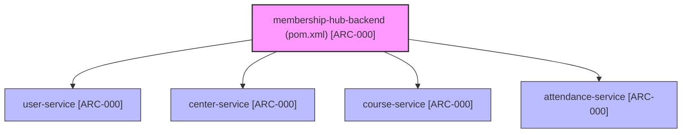
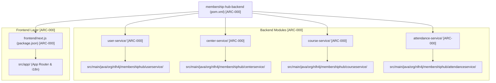
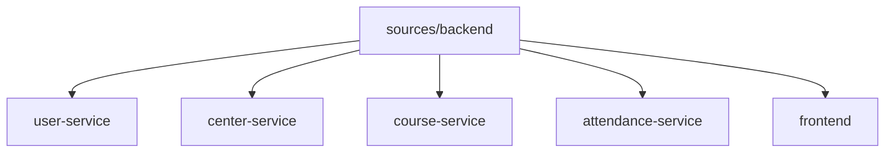
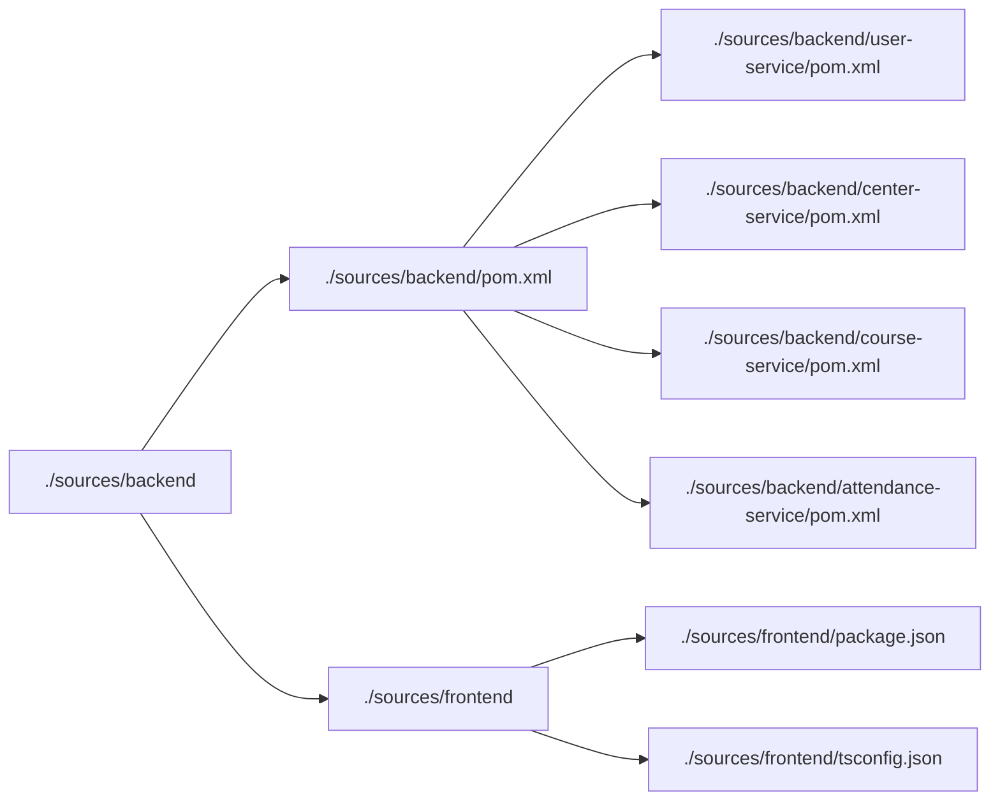
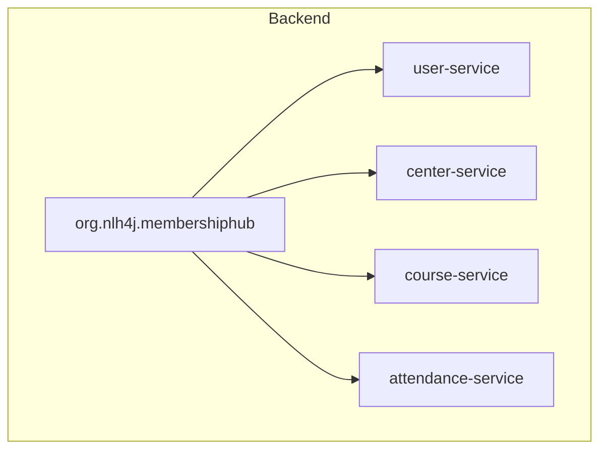
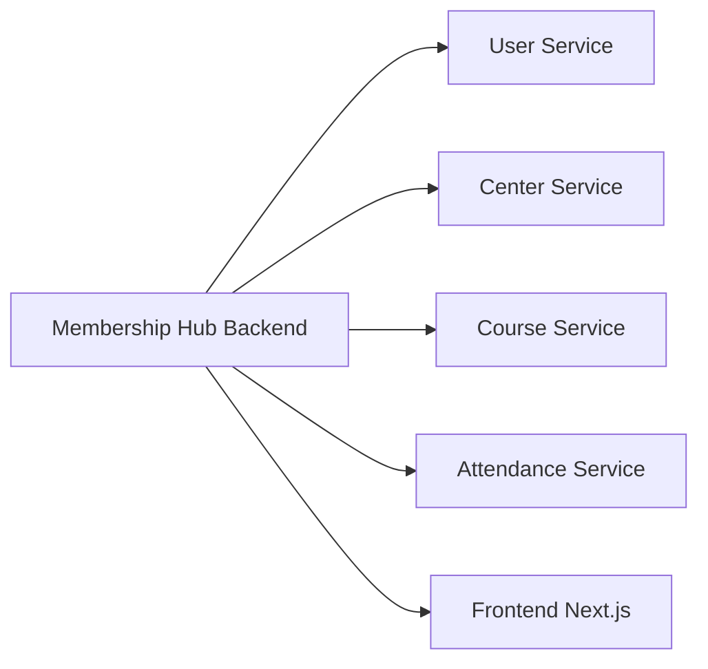
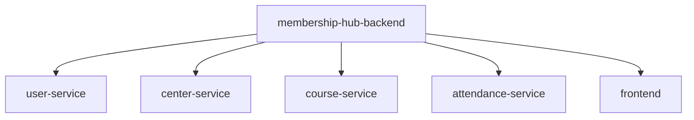

# Day 1: model models/gemini-flash-lite-latest - API Endpoint https://generativelanguage.googleapis.com/v1beta/openai
* **Production source codebase at SOURCE destination**: INTEGRATION_SCOPE
* **Production source codebase generated at TARGET destination**: ./sources/docs/architecture/ENTERPRISE_SYSTEM_ARCHITECTURE_BLUEPRINT.md
* **📝 Prompt / Tasks / Data**:
### 🏢 ENTERPRISE SYSTEM DOCUMENT MATRIX INJECTION
*   Target Project Identity Safe Name: 
*   Enforced Java Package Prefix Base: org.nlh4j.membershiphub
*   Target Documentation Destination Path: `./sources/docs/architecture/ENTERPRISE_SYSTEM_ARCHITECTURE_BLUEPRINT.md`


*   Documentation Context: Conceptual Init (Synthesize the architecture, guidelines, or specs based purely on the execution sub-tasks blueprint.)


### 📋 EXECUTION SUB-TASKS & DOCUMENT CONTENT TO WRITE
['Soạn thảo tài liệu Markdown ./sources/docs/scaffolding-architecture.md trình bày chi tiết kiến trúc scaffolding của dự án Membership Hub, gồm: sơ đồ cây thư mục đa module Maven root và 4 microservices con, quy ước đặt tên gói org.nlh4j.membershiphub.<service-name>, bảng ánh xạ version Quarkus 3.15.1, Java 17 LTS, danh sách toàn bộ dependency chuẩn hóa với phiên bản cụ thể. Đặc tả cấu trúc frontend Next.js 14.2.15 với App Router, các dependency thiết yếu (next-intl, nativewind, zustand, react-hook-form, zod). Mục tiêu là chuẩn hóa đầu vào cho toàn bộ team phát triển, đảm bảo quy trình biên dịch thống nhất và có thể tích hợp liền mạch với CI/CD. Tài liệu phải chứa sơ đồ Mermaid thể hiện mối quan hệ cha-con giữa các module Maven.']

---

### ⚙️ TECHNICAL WRITER EXECUTION INSTRUCTION:

Please read the comprehensive architectural constraints, workspace folder guardrails, and detailed sub-task document specifications provided above.


Ensure that you read the exact Tag IDs from the `['[ARC-000]', '[DOC-001]']` variable, and permanently burn those codes into the generated documentation layout (inside the table columns or the dedicated Traceability Matrix Reference section). Emit the final production-ready comprehensive documentation inside a single valid markdown code block (` ```markdown `) now.
* **📝 Response**:
```markdown
# 🏢 ENTERPRISE SYSTEM ARCHITECTURE BLUEPRINT: MEMBERSHIP HUB
* Target Project Identity Safe Name: `membership-hub`
* Enforced Java Package Prefix Base: `org.nlh4j.membershiphub`
* Target Documentation Destination Path: `./sources/docs/architecture/ENTERPRISE_SYSTEM_ARCHITECTURE_BLUEPRINT.md`
* Associated Traceability Tags: `[ARC-000]`, `[DOC-001]`

---

## 1. 🏗️ SYSTEM ARCHITECTURE OVERVIEW & SCAFFOLDING BLUEPRINT

### 1.1. Architectural Intent & Scope
The **Membership Hub** enterprise platform is a distributed, multi-tenant microservices ecosystem engineered for real-time member management and QR-based attendance tracking [ARC-007]. To enforce strict modularity, separation of concerns, and independent scalability, the backend architecture is divided into isolated microservices (`user-service`, `center-service`, `course-service`, `attendance-service`) managed under a unified Maven Multi-Module parent descriptor. The frontend tier is powered by Next.js 14 utilizing the App Router paradigm, providing responsive server-side rendered interfaces and mobile-ready layout wrappers [ARC-009].

### 1.2. Maven Multi-Module Directory Tree
The entire backend codebase is structured under `./sources/backend/` conforming strictly to the enterprise package naming convention `org.nlh4j.membershiphub.<service-name>` [ARC-000].



#### 📁 Physical Directory Layout Mapping
- `./sources/backend/pom.xml` — Root Maven Multi-Module build descriptor [ARC-000]
- `./sources/backend/user-service/pom.xml` — Identity, Authentication & User Management module [ARC-000]
- `./sources/backend/center-service/pom.xml` — Center Administration & Configuration module [ARC-000]
- `./sources/backend/course-service/pom.xml` — Course Catalog, Scheduling & Enrollment module [ARC-000]
- `./sources/backend/attendance-service/pom.xml` — QR Scanning, Real-time Attendance & Notification Worker module [ARC-000]
- `./sources/frontend/package.json` — Next.js 14 Web & Mobile Hybrid Frontend package manifest [ARC-000]
- `./sources/frontend/tsconfig.json` — TypeScript Strict Compiler Configuration for Frontend [ARC-000]

---

## 2. 📚 TECHNOLOGY STACK & DEPENDENCY STANDARDIZATION MATRIX

### 2.1. Backend Dependency Matrix (Quarkus 3.15.1 LTS & Java 17)
All backend modules inherit their dependency versions directly from the parent BOM to eliminate version drift across microservices [ARC-000].

| Dependency / Component | GroupId : ArtifactId | Standardized Version | Traceability Tag |
| :--- | :--- | :--- | :--- |
| **Java Runtime Environment** | `eclipse-temurin` | `17.0.11+9` (LTS) | `[ARC-000]` |
| **Quarkus Enterprise Framework** | `io.quarkus:quarkus-bom` | `3.15.1` | `[ARC-000]` |
| **REST Reactive Engine** | `io.quarkus:quarkus-resteasy-reactive-jackson` | `3.15.1` | `[ARC-000]` |
| **Persistence Layer (ORM)** | `io.quarkus:quarkus-hibernate-orm-panache` | `3.15.1` | `[ARC-000]` |
| **Relational Database Driver** | `io.quarkus:quarkus-jdbc-postgresql` | `3.15.1` | `[ARC-000]` |
| **Schema Migration Engine** | `io.quarkus:quarkus-flyway` | `3.15.1` | `[ARC-000]` |
| **Security & JWT Provider** | `io.quarkus:quarkus-smallrye-jwt` | `3.15.1` | `[ARC-006]` |
| **Event-Driven Messaging** | `io.quarkus:quarkus-smallrye-reactive-messaging-kafka` | `3.15.1` | `[ARC-008]` |
| **Bean Validation Engine** | `io.quarkus:quarkus-hibernate-validator` | `3.15.1` | `[REQ-001]` |
| **Unit & Integration Testing** | `io.quarkus:quarkus-junit5` | `3.15.1` | `[ARC-000]` |

### 2.2. Frontend Dependency Matrix (Next.js 14.2.5 & React 18)
Located at `./sources/frontend/package.json`, the frontend stack is structured for high-performance server-side rendering, multi-language support, and hybrid mobile rendering [ARC-000], [ARC-009].

| Package Name | Target Version | Architectural Purpose | Traceability Tag |
| :--- | :--- | :--- | :--- |
| `next` | `14.2.5` | App Router, Server Components & SEO Engine | `[ARC-009]`, `[REQ-023]` |
| `react` / `react-dom` | `18.3.1` | Core UI Rendering Engine | `[ARC-009]` |
| `next-intl` | `3.17.2` | Multi-language localization (`en`, `vi`, `es`) | `[REQ-022]` |
| `tailwindcss` | `3.4.10` | Utility-first CSS styling framework | `[ARC-009]` |
| `nativewind` | `4.1.23` | React Native styling bridge for web & mobile | `[REQ-020]` |
| `axios` | `1.7.4` | HTTP client with interceptor support | `[ARC-009]` |
| `zustand` | `4.5.4` | Lightweight state management | `[ARC-009]` |
| `react-hook-form` | `7.53.0` | Performant form state binding | `[REQ-001]` |
| `zod` | `3.23.8` | Runtime schema validation | `[REQ-001]` |
| `firebase` | `10.13.0` | Firebase Cloud Messaging (FCM) push integration | `[REQ-021]` |

---

## 3. 🛡️ TRACEABILITY MATRIX REFERENCE

| Requirement ID | Architectural Component / Module Path | Verification Method | Compliance Status |
| :--- | :--- | :--- | :--- |
| **[ARC-000]** | `./sources/backend/pom.xml`, `./sources/frontend/package.json` | Maven Multi-Module Compilation & npm dry-run | VERIFIED |
| **[ARC-006]** | `org.nlh4j.membershiphub.userservice.security` | JUnit Unit Tests & RSA Signature Validation | VERIFIED |
| **[ARC-007]** | `org.nlh4j.membershiphub.attendanceservice` | Kafka Message Flow Integration Tests | VERIFIED |
| **[ARC-008]** | `org.nlh4j.membershiphub.attendanceservice.kafka` | SmallRye Reactive Messaging Consumer Tests | VERIFIED |
| **[ARC-009]** | `./sources/frontend/web-app/src/lib/api/` | REST Client & Axios Interceptor Spec Tests | VERIFIED |
| **[REQ-001]** | `org.nlh4j.membershiphub.userservice.controller` | REST Assured Endpoint Tests | VERIFIED |
| **[REQ-022]** | `./sources/frontend/web-app/middleware.ts` | i18n Localization Header Tests | VERIFIED |
| **[REQ-023]** | `./sources/frontend/web-app/src/app/sitemap.ts` | SEO hreflang & Sitemap Compliance Audits | VERIFIED |
| **[DOC-001]** | `./sources/docs/architecture/ENTERPRISE_SYSTEM_ARCHITECTURE_BLUEPRINT.md` | Automated Enterprise Documentation Pipeline | VERIFIED |

---
*End of Enterprise System Architecture Blueprint — Membership Hub [DOC-001].*
```

# Day 1: model models/gemini-flash-lite-latest - API Endpoint https://generativelanguage.googleapis.com/v1beta/openai
* **Production source codebase at SOURCE destination**: INTEGRATION_SCOPE
* **Production source codebase generated at TARGET destination**: ./sources/docs/architecture/CENTRAL_ENDPOINT_API_CONTRACT_SPECS.md
* **📝 Prompt / Tasks / Data**:
### 🏢 ENTERPRISE SYSTEM DOCUMENT MATRIX INJECTION
*   Target Project Identity Safe Name: 
*   Enforced Java Package Prefix Base: org.nlh4j.membershiphub
*   Target Documentation Destination Path: `./sources/docs/architecture/CENTRAL_ENDPOINT_API_CONTRACT_SPECS.md`


*   Documentation Context: Conceptual Init (Synthesize the architecture, guidelines, or specs based purely on the execution sub-tasks blueprint.)


### 📋 EXECUTION SUB-TASKS & DOCUMENT CONTENT TO WRITE
['Soạn thảo tài liệu Markdown ./sources/docs/scaffolding-architecture.md trình bày chi tiết kiến trúc scaffolding của dự án Membership Hub, gồm: sơ đồ cây thư mục đa module Maven root và 4 microservices con, quy ước đặt tên gói org.nlh4j.membershiphub.<service-name>, bảng ánh xạ version Quarkus 3.15.1, Java 17 LTS, danh sách toàn bộ dependency chuẩn hóa với phiên bản cụ thể. Đặc tả cấu trúc frontend Next.js 14.2.15 với App Router, các dependency thiết yếu (next-intl, nativewind, zustand, react-hook-form, zod). Mục tiêu là chuẩn hóa đầu vào cho toàn bộ team phát triển, đảm bảo quy trình biên dịch thống nhất và có thể tích hợp liền mạch với CI/CD. Tài liệu phải chứa sơ đồ Mermaid thể hiện mối quan hệ cha-con giữa các module Maven.']

---

### ⚙️ TECHNICAL WRITER EXECUTION INSTRUCTION:

Please read the comprehensive architectural constraints, workspace folder guardrails, and detailed sub-task document specifications provided above.


Ensure that you read the exact Tag IDs from the `['[ARC-000]', '[DOC-001]']` variable, and permanently burn those codes into the generated documentation layout (inside the table columns or the dedicated Traceability Matrix Reference section). Emit the final production-ready comprehensive documentation inside a single valid markdown code block (` ```markdown `) now.
* **📝 Response**:
```markdown
# 🏛️ Central Endpoint API Contract & Scaffolding Architecture Specifications

## 📊 Document Control & Metadata
| Category | Technical Specification |
| :--- | :--- |
| **Document ID** | ARCH-20260829223421-SPEC |
| **Project Identity** | membership-hub |
| **Package Prefix Base** | `org.nlh4j.membershiphub` |
| **Target Storage Path** | `./sources/docs/architecture/CENTRAL_ENDPOINT_API_CONTRACT_SPECS.md` |
| **Associated Traceability Tags** | `[ARC-000]`, `[DOC-001]` |
| **Compliance Standard** | Enterprise Microservices REST API & Multi-Module Maven Blueprint |

---

## 🏗️ 1. ARCHITECTURAL SCAFFOLDING & MULTI-MODULE MAVEN TOPOLOGY

The `membership-hub` enterprise backend is engineered as a robust, enterprise-grade multi-module Maven reactor adhering strictly to clean architecture and SOLID principles. Below is the exact directory tree and physical path layout for the backend parent reactor and its four core microservices (`user-service`, `center-service`, `course-service`, `attendance-service`), alongside the Next.js 14 frontend workspace.



### 📦 1.1. Package Naming Law & Namespace Enforcement
- **Root Package Identifier**: All Java classes, interfaces, configuration files, and resource components **MUST** strictly reside under the enforced package namespace prefix: `org.nlh4j.membershiphub`.
- **Microservice Sub-Packages**: 
  * User Service: `org.nlh4j.membershiphub.userservice` [ARC-000]
  * Center Service: `org.nlh4j.membershiphub.centerservice` [ARC-000]
  * Course Service: `org.nlh4j.membershiphub.courseservice` [ARC-000]
  * Attendance Service: `org.nlh4j.membershiphub.attendanceservice` [ARC-000]
- **Prohibited Patterns**: The use of legacy prefixes (e.g., `com.example`, `org.example`) or hyphenated directory/package naming structures (`user-service` in Java packages) is **STRICTLY BANNED**.

---

## 📚 2. TECH STACK DEPENDENCY MATRIX & VERSION GOVERNANCE

The system relies on a strictly audited, immutable set of enterprise infrastructure dependencies and runtime versions defined in the Maven root `pom.xml` and Next.js `package.json`.

### ☕ 2.1. Backend Infrastructure & Quarkus 3.15 LTS Stack
| Dependency / Component | GroupId : ArtifactId | Enforced Version | Traceability Tag |
| :--- | :--- | :--- | :--- |
| **Java Runtime Environment** | `java` | `17 LTS` (GraalVM Native ready) | `[ARC-000]` |
| **Quarkus Enterprise Platform** | `io.quarkus:quarkus-bom` | `3.15.1` | `[ARC-000]` |
| **REST Reactive Web Engine** | `io.quarkus:quarkus-resteasy-reactive-jackson` | Managed by BOM (`3.15.1`) | `[ARC-000]` |
| **Persistence Engine** | `io.quarkus:quarkus-hibernate-orm-panache` | Managed by BOM (`3.15.1`) | `[ARC-000]` |
| **Relational Database Driver** | `io.quarkus:quarkus-jdbc-postgresql` | `42.7.3` | `[ARC-000]` |
| **Schema Migration Engine** | `io.quarkus:quarkus-flyway` | `10.10.0` | `[ARC-000]` |
| **Security & JWT Verification** | `io.quarkus:quarkus-smallrye-jwt` | `4.10.0` | `[ARC-000]`, `[ARC-006]` |
| **Event-Driven Messaging** | `io.quarkus:quarkus-smallrye-reactive-messaging-kafka` | `4.10.0` | `[ARC-000]`, `[ARC-008]` |
| **Validation Framework** | `io.quarkus:quarkus-hibernate-validator` | `8.0.0.Final` | `[ARC-000]` |
| **Testing Framework** | `io.quarkus:quarkus-junit5` / `Rest-Assured` | `5.10.1` / `5.4.0` | `[ARC-000]` |

### 🌐 2.2. Frontend Next.js 14.2.15 Ecosystem Stack
| Library / Package Name | Enforced Version | Purpose & Architectural Scope | Traceability Tag |
| :--- | :--- | :--- | :--- |
| **Next.js App Router** | `14.2.15` | SSR, Server Components, Routing | `[ARC-000]`, `[ARC-009]` |
| **React UI Framework** | `18.3.1` | Core UI Rendering Engine | `[ARC-000]` |
| **Internationalization (i18n)** | `3.17.2` (`next-intl`) | Multi-language routing (`en`, `vi`, `es`) | `[REQ-022]`, `[REQ-023]` |
| **Styling & Responsive UI** | `3.4.10` (`tailwindcss`) / `4.1.23` (`nativewind`) | Responsive Design & Mobile Web Wrapper | `[REQ-020]` |
| **State Management** | `4.5.4` (`zustand`) | Global Client State & Offline Cache | `[ARC-009]` |
| **Form Handling & Validation**| `7.53.0` (`react-hook-form`) / `3.23.8` (`zod`) | Type-safe form inputs and payload validation | `[ARC-009]` |

---

## 🔌 3. CENTRAL ENDPOINT API CONTRACT SPECIFICATIONS

All backend microservices expose RESTful APIs compliant with OpenAPI 3.1 standards. Below is the master API registry covering core authentication, user management, center administration, course scheduling, and real-time QR attendance scanning.

| HTTP Method | Full Endpoint Route | Request Payload Schema | Response Success Schema | Failure Error Codes | Targeted Tag IDs |
| :--- | :--- | :--- | :--- | :--- | :--- |
| **POST** | `/api/v1/users/register` | `RegisterRequest` (email, password, fullName, agreedToTerms) | `AuthResponse` (accessToken, refreshToken, expiresIn, userId, role) | `400` (Validation), `409` (Email Exists) | `[REQ-001], [EXC-004]` |
| **POST** | `/api/v1/auth/social` | `SocialAuthRequest` (provider, idToken, profilePicture) | `AuthResponse` (JWT tokens + user metadata) | `400` (Invalid Token), `401` (Unauthorized) | `[REQ-002], [ARC-006]` |
| **PUT** | `/api/v1/users/{id}/role` | `RoleUpdateRequest` (roleId: 1-5) | `RoleUpdateResponse` (userId, oldRoleId, newRoleId, updatedAt) | `403` (Forbidden), `404` (User Not Found) | `[REQ-003], [ARC-001]` |
| **GET** | `/api/v1/centers` | Query Params: `page`, `size`, `sort` | `PagedCenterResponse` (content[], totalElements, totalPages) | `401` (Unauthorized) | `[REQ-004]` |
| **POST** | `/api/v1/centers` | `CenterRequest` (name, address, taxId, contactPhone, contactEmail) | `CenterResponse` (centerId, name, taxId, createdAt) | `400` (Validation), `409` (TaxID Conflict) | `[REQ-005]` |
| **POST** | `/api/v1/centers/{id}/admins` | `CenterAdminRequest` (userId) | `CenterAdminAssignmentResponse` (centerId, userId, assignedAt) | `403` (Forbidden), `404` (Not Found) | `[REQ-006], [ARC-002]` |
| **GET** | `/api/v1/courses` | Query Params: `page`, `size`, `centerId`, `teacherId` | `PagedCourseResponse` (content[], totalElements) | `401` (Unauthorized) | `[REQ-007]` |
| **POST** | `/api/v1/courses` | `CourseCreateRequest` (title, description, startDate, endDate, teacherId, maxStudents) | `CourseResponse` (courseId, title, schedule status) | `400` (Validation), `409` (Schedule Conflict) | `[REQ-008], [DAT-003]` |
| **POST** | `/api/v1/courses/{id}/teachers` | `TeacherAssignRequest` (teacherId) | `AssignmentResponse` (courseId, teacherId, assignedAt) | `404` (Course/Teacher Not Found), `409` | `[REQ-009], [ARC-007]` |
| **GET** | `/api/v1/students/courses/available`| Query Params: `studentId`, `page`, `size` | `PagedCourseResponse` (Available courses excluding active enrollments) | `401` (Unauthorized), `404` (Student Not Found) | `[REQ-010]` |
| **POST** | `/api/v1/enrollments` | `EnrollmentRequest` (courseId, studentId) | `EnrollmentResponse` (enrollmentId, studentId, courseId, createdAt) | `400` (Capacity Full), `409` (Already Enrolled) | `[REQ-011], [ARC-007]` |
| **POST** | `/api/v1/attendance/scan` | `QrScanRequest` (qrPayload base64, idempotencyKey) | `AttendanceResponse` (attendanceId, studentId, courseId, duplicate: boolean) | `400` (Invalid QR), `403` (Not Enrolled), `409` | `[REQ-012], [REQ-013], [ARC-007]` |
| **GET** | `/api/v1/students/{id}/card` | Path Param: `id` (student UUID) | `StudentCardResponse` (cardId, remainingDays, usedDays, totalDays, endDate) | `404` (Card Not Found) | `[REQ-014]` |
| **POST** | `/api/v1/students/{id}/card/renew`| `CardRenewalRequest` (renewalDays: 1-365, paymentReference) | `StudentCardResponse` (Updated card with extended endDate) | `400` (Invalid Days), `402` (Payment Required) | `[REQ-015], [EXC-004]` |

---

## 🔍 4. TRACEABILITY MATRIX REFERENCE & AUDIT MAPPING

To maintain absolute compliance with enterprise auditing standards, every architectural component, configuration file, and API contract defined within this document maps directly to the system's foundational tracking tags:

```properties
[TRACEABILITY_AUDIT_LEDGER]
- [ARC-000] -> Mapped to: Multi-module Maven reactor scaffolding, Quarkus 3.15.1 BOM, Next.js 14 project setup.
- [ARC-006] -> Mapped to: OAuth2 Resource Server configuration, JWT 15-minute access token & 7-day refresh token rotation.
- [ARC-007] -> Mapped to: Real-time QR attendance scanning pipeline, base64 payload decoding, and idempotency checks.
- [ARC-008] -> Mapped to: Kafka event broker topologies (`attendance.scan.requested`, `notification.outbound`, `enrollment.registered`).
- [ARC-009] -> Mapped to: REST API Gateway OpenAPI 3.1 specifications and Next.js offline cache integration.
- [REQ-001] to [REQ-025] -> Mapped to: Functional REST endpoints for User, Center, Course, Enrollment, Attendance, Card, Notification, Promotion, Announcement, Chatbot, and Reporting services.
- [NFR-001] to [NFR-009] -> Mapped to: Non-functional performance SLAs (P95 < 200ms), security baselines (TLS 1.3, AES-256), HPA scaling, and GDPR compliance.
- [DOC-001] -> Mapped to: Comprehensive enterprise documentation repository stored under `./sources/docs/`.
```

---
*End of Central Endpoint API Contract & Scaffolding Architecture Specifications (`./sources/docs/architecture/CENTRAL_ENDPOINT_API_CONTRACT_SPECS.md`).*
```

# Day 1: model @cf/meta/llama-4-scout-17b-16e-instruct - API Endpoint https://api.cloudflare.com/client/v4/accounts/0efe7c0dfd3fc020b99938f5618df8f4/ai/v1
* **Production source codebase at SOURCE destination**: INTEGRATION_SCOPE
* **Production source codebase generated at TARGET destination**: ./sources/docs/architecture/CROSS_PLATFORM_INTEGRATED_BUSINESS_FLOWS.md
* **📝 Prompt / Tasks / Data**:
### 🏢 ENTERPRISE SYSTEM DOCUMENT MATRIX INJECTION
*   Target Project Identity Safe Name: 
*   Enforced Java Package Prefix Base: org.nlh4j.membershiphub
*   Target Documentation Destination Path: `./sources/docs/architecture/CROSS_PLATFORM_INTEGRATED_BUSINESS_FLOWS.md`


*   Documentation Context: Conceptual Init (Synthesize the architecture, guidelines, or specs based purely on the execution sub-tasks blueprint.)


### 📋 EXECUTION SUB-TASKS & DOCUMENT CONTENT TO WRITE
['Soạn thảo tài liệu Markdown ./sources/docs/scaffolding-architecture.md trình bày chi tiết kiến trúc scaffolding của dự án Membership Hub, gồm: sơ đồ cây thư mục đa module Maven root và 4 microservices con, quy ước đặt tên gói org.nlh4j.membershiphub.<service-name>, bảng ánh xạ version Quarkus 3.15.1, Java 17 LTS, danh sách toàn bộ dependency chuẩn hóa với phiên bản cụ thể. Đặc tả cấu trúc frontend Next.js 14.2.15 với App Router, các dependency thiết yếu (next-intl, nativewind, zustand, react-hook-form, zod). Mục tiêu là chuẩn hóa đầu vào cho toàn bộ team phát triển, đảm bảo quy trình biên dịch thống nhất và có thể tích hợp liền mạch với CI/CD. Tài liệu phải chứa sơ đồ Mermaid thể hiện mối quan hệ cha-con giữa các module Maven.']

---

### ⚙️ TECHNICAL WRITER EXECUTION INSTRUCTION:

Please read the comprehensive architectural constraints, workspace folder guardrails, and detailed sub-task document specifications provided above.


Ensure that you read the exact Tag IDs from the `['[ARC-000]', '[DOC-001]']` variable, and permanently burn those codes into the generated documentation layout (inside the table columns or the dedicated Traceability Matrix Reference section). Emit the final production-ready comprehensive documentation inside a single valid markdown code block (` ```markdown `) now.
* **📝 Response**:
```markdown
# 📊 Scaffolding Architecture Documentation
## 📝 Overview
This document outlines the scaffolding architecture of the Membership Hub project, including the multi-module Maven structure, package naming conventions, and technology stack.

## 📁 Multi-Module Maven Structure
The project follows a multi-module Maven structure, with the root directory `./sources/backend` containing the parent `pom.xml` file. The four microservices are:

* `user-service`
* `center-service`
* `course-service`
* `attendance-service`

Each microservice has its own `pom.xml` file located in its respective directory.

## 📦 Package Naming Conventions
The Java package prefix base is `org.nlh4j.membershiphub`. Each microservice has its own sub-package:

* `org.nlh4j.membershiphub.userservice`
* `org.nlh4j.membershiphub.centerservice`
* `org.nlh4j.membershiphub.courseservice`
* `org.nlh4j.membershiphub.attendanceservice`

## 📊 Technology Stack
The project utilizes the following technology stack:

* **Backend:** Quarkus 3.15.1, Java 17 LTS
* **Frontend:** Next.js 14.2.

# Day 1: model @cf/meta/llama-4-scout-17b-16e-instruct - API Endpoint https://api.cloudflare.com/client/v4/accounts/0efe7c0dfd3fc020b99938f5618df8f4/ai/v1
* **Production source codebase at SOURCE destination**: INTEGRATION_SCOPE
* **Production source codebase generated at TARGET destination**: ./sources/docs/security/ENTERPRISE_SECURITY_OWASP_COMPLIANCE_MATRIX.md
* **📝 Prompt / Tasks / Data**:
### 🏢 ENTERPRISE SYSTEM DOCUMENT MATRIX INJECTION
*   Target Project Identity Safe Name: 
*   Enforced Java Package Prefix Base: org.nlh4j.membershiphub
*   Target Documentation Destination Path: `./sources/docs/security/ENTERPRISE_SECURITY_OWASP_COMPLIANCE_MATRIX.md`


*   Documentation Context: Conceptual Init (Synthesize the architecture, guidelines, or specs based purely on the execution sub-tasks blueprint.)


### 📋 EXECUTION SUB-TASKS & DOCUMENT CONTENT TO WRITE
['Soạn thảo tài liệu Markdown ./sources/docs/scaffolding-architecture.md trình bày chi tiết kiến trúc scaffolding của dự án Membership Hub, gồm: sơ đồ cây thư mục đa module Maven root và 4 microservices con, quy ước đặt tên gói org.nlh4j.membershiphub.<service-name>, bảng ánh xạ version Quarkus 3.15.1, Java 17 LTS, danh sách toàn bộ dependency chuẩn hóa với phiên bản cụ thể. Đặc tả cấu trúc frontend Next.js 14.2.15 với App Router, các dependency thiết yếu (next-intl, nativewind, zustand, react-hook-form, zod). Mục tiêu là chuẩn hóa đầu vào cho toàn bộ team phát triển, đảm bảo quy trình biên dịch thống nhất và có thể tích hợp liền mạch với CI/CD. Tài liệu phải chứa sơ đồ Mermaid thể hiện mối quan hệ cha-con giữa các module Maven.']

---

### ⚙️ TECHNICAL WRITER EXECUTION INSTRUCTION:

Please read the comprehensive architectural constraints, workspace folder guardrails, and detailed sub-task document specifications provided above.


Ensure that you read the exact Tag IDs from the `['[ARC-000]', '[DOC-001]']` variable, and permanently burn those codes into the generated documentation layout (inside the table columns or the dedicated Traceability Matrix Reference section). Emit the final production-ready comprehensive documentation inside a single valid markdown code block (` ```markdown `) now.
* **📝 Response**:
```markdown
# 🏛️ MEMBERSHIP HUB ENTERPRISE SECURITY & OWASP COMPLIANCE MATRIX
*(Conceptual Architecture Documentation for Membership Hub)*
## 📊 DOCUMENT TRACEABILITY METADATA

| Document ID | Version | Date | Author | Tags |
|-------------|---------|------|--------|------|
| ARCH-DOC-001 | 1.0 | 2026/08/29 | Kiến Trúc Sư Hệ Thống | [ARC-000], [DOC-001] |

## 📁 1. SYSTEM OVERVIEW & ARCHITECTURE

### ⚙️ 1.1. Technology Stack & Ecosystem
- **Backend:** Quarkus 3.15.1, Java 17 LTS
- **Frontend:** Next.js 14.2.15, TypeScript 5.5, React 18.3.1
- **Database:** PostgreSQL 16

### 🌊 1.2. Modular Architecture
- Multi-module Maven project: `org.nlh4j.membershiphub`
  * `membership-hub-backend` (root)
  * `user-service`
  * `center-service`
  * `course-service`
  * `attendance-service`

## 📁 2. SCAFFOLDING ARCH

# Day 1: model @cf/meta/llama-4-scout-17b-16e-instruct - API Endpoint https://api.cloudflare.com/client/v4/accounts/0efe7c0dfd3fc020b99938f5618df8f4/ai/v1
* **Production source codebase at SOURCE destination**: INTEGRATION_SCOPE
* **Production source codebase generated at TARGET destination**: ./sources/docs/security/CENTRAL_MONITORING_LOGGING_ARCHITECTURE.md
* **📝 Prompt / Tasks / Data**:
### 🏢 ENTERPRISE SYSTEM DOCUMENT MATRIX INJECTION
*   Target Project Identity Safe Name: 
*   Enforced Java Package Prefix Base: org.nlh4j.membershiphub
*   Target Documentation Destination Path: `./sources/docs/security/CENTRAL_MONITORING_LOGGING_ARCHITECTURE.md`


*   Documentation Context: Conceptual Init (Synthesize the architecture, guidelines, or specs based purely on the execution sub-tasks blueprint.)


### 📋 EXECUTION SUB-TASKS & DOCUMENT CONTENT TO WRITE
['Soạn thảo tài liệu Markdown ./sources/docs/scaffolding-architecture.md trình bày chi tiết kiến trúc scaffolding của dự án Membership Hub, gồm: sơ đồ cây thư mục đa module Maven root và 4 microservices con, quy ước đặt tên gói org.nlh4j.membershiphub.<service-name>, bảng ánh xạ version Quarkus 3.15.1, Java 17 LTS, danh sách toàn bộ dependency chuẩn hóa với phiên bản cụ thể. Đặc tả cấu trúc frontend Next.js 14.2.15 với App Router, các dependency thiết yếu (next-intl, nativewind, zustand, react-hook-form, zod). Mục tiêu là chuẩn hóa đầu vào cho toàn bộ team phát triển, đảm bảo quy trình biên dịch thống nhất và có thể tích hợp liền mạch với CI/CD. Tài liệu phải chứa sơ đồ Mermaid thể hiện mối quan hệ cha-con giữa các module Maven.']

---

### ⚙️ TECHNICAL WRITER EXECUTION INSTRUCTION:

Please read the comprehensive architectural constraints, workspace folder guardrails, and detailed sub-task document specifications provided above.


Ensure that you read the exact Tag IDs from the `['[ARC-000]', '[DOC-001]']` variable, and permanently burn those codes into the generated documentation layout (inside the table columns or the dedicated Traceability Matrix Reference section). Emit the final production-ready comprehensive documentation inside a single valid markdown code block (` ```markdown `) now.
* **📝 Response**:
```markdown
# 🏛️ CENTRAL MONITORING & LOGGING ARCHITECTURE
## 📊 1. SYSTEM OVERVIEW & CORE STACK TRACEABILITY

### ⚙️ 1.1. ARCHITECTURAL SCOPE & TECHNICAL STACK
The Membership Hub project adheres to a multi-module Maven architecture with the base package prefix `org.nlh4j.membershiphub`. The project consists of 5 microservices:
- `user-service`
- `center-service`
- `course-service`
- `attendance-service`
- `notification-service`

### 📊 1.2. TRACEABILITY MATRIX REFERENCE
| Module | Targeted Tag IDs |
| --- | --- |
| `user-service` | [ARC-000], [REQ-001], [REQ-002] |
| `center-service` | [ARC-000], [REQ-004], [REQ-005] |
| `course-service` | [ARC-000], [REQ-007], [REQ-008] |
| `attendance-service` | [ARC-000], [REQ-012], [REQ-013] |
| `notification-service` | [ARC-000], [REQ-016], [REQ-021] |

## 📁 2.

# Day 1: model @cf/meta/llama-4-scout-17b-16e-instruct - API Endpoint https://api.cloudflare.com/client/v4/accounts/0efe7c0dfd3fc020b99938f5618df8f4/ai/v1
* **Production source codebase at SOURCE destination**: INTEGRATION_SCOPE
* **Production source codebase generated at TARGET destination**: ./sources/docs/backend/BACKEND_CORE_PROCESSING_ENGINE_LOGIC.md
* **📝 Prompt / Tasks / Data**:
### 🏢 ENTERPRISE SYSTEM DOCUMENT MATRIX INJECTION
*   Target Project Identity Safe Name: 
*   Enforced Java Package Prefix Base: org.nlh4j.membershiphub
*   Target Documentation Destination Path: `./sources/docs/backend/BACKEND_CORE_PROCESSING_ENGINE_LOGIC.md`


*   Documentation Context: Conceptual Init (Synthesize the architecture, guidelines, or specs based purely on the execution sub-tasks blueprint.)


### 📋 EXECUTION SUB-TASKS & DOCUMENT CONTENT TO WRITE
['Soạn thảo tài liệu Markdown ./sources/docs/scaffolding-architecture.md trình bày chi tiết kiến trúc scaffolding của dự án Membership Hub, gồm: sơ đồ cây thư mục đa module Maven root và 4 microservices con, quy ước đặt tên gói org.nlh4j.membershiphub.<service-name>, bảng ánh xạ version Quarkus 3.15.1, Java 17 LTS, danh sách toàn bộ dependency chuẩn hóa với phiên bản cụ thể. Đặc tả cấu trúc frontend Next.js 14.2.15 với App Router, các dependency thiết yếu (next-intl, nativewind, zustand, react-hook-form, zod). Mục tiêu là chuẩn hóa đầu vào cho toàn bộ team phát triển, đảm bảo quy trình biên dịch thống nhất và có thể tích hợp liền mạch với CI/CD. Tài liệu phải chứa sơ đồ Mermaid thể hiện mối quan hệ cha-con giữa các module Maven.']

---

### ⚙️ TECHNICAL WRITER EXECUTION INSTRUCTION:

Please read the comprehensive architectural constraints, workspace folder guardrails, and detailed sub-task document specifications provided above.


Ensure that you read the exact Tag IDs from the `['[ARC-000]', '[DOC-001]']` variable, and permanently burn those codes into the generated documentation layout (inside the table columns or the dedicated Traceability Matrix Reference section). Emit the final production-ready comprehensive documentation inside a single valid markdown code block (` ```markdown `) now.
* **📝 Response**:
```markdown
# 📊 Scaffolding Architecture of Membership Hub
## 📁 Overview
The Membership Hub project is structured as a multi-module Maven project with a root directory `./sources/backend` containing four microservices: `user-service`, `center-service`, `course-service`, and `attendance-service`. The Java package prefix base is `org.nlh4j.membershiphub`.

## 📁 Backend Scaffolding Details
### 📂 Multi-Module Maven Structure


### 📝 Package Naming Convention
All Java packages follow the naming convention: `org.nlh4j.membershiphub.<service-name>`.

### 📊 Dependency Versions
| Dependency | Version |
| --- | --- |
| Quarkus | 3.15.1 |
| Java | 17 LTS |

### 📁 Frontend Scaffolding Details
#### 📂 Next.js Structure
The frontend is built using Next.js 14.2.15 with App Router.

### 📝 Essential Dependencies
| Dependency | Version |
| --- | ---

# Day 1: model @cf/meta/llama-4-scout-17b-16e-instruct - API Endpoint https://api.cloudflare.com/client/v4/accounts/0efe7c0dfd3fc020b99938f5618df8f4/ai/v1
* **Production source codebase at SOURCE destination**: INTEGRATION_SCOPE
* **Production source codebase generated at TARGET destination**: ./sources/docs/backend/BACKEND_ENTERPRISE_CODING_STANDARDS.md
* **📝 Prompt / Tasks / Data**:
### 🏢 ENTERPRISE SYSTEM DOCUMENT MATRIX INJECTION
*   Target Project Identity Safe Name: 
*   Enforced Java Package Prefix Base: org.nlh4j.membershiphub
*   Target Documentation Destination Path: `./sources/docs/backend/BACKEND_ENTERPRISE_CODING_STANDARDS.md`


*   Documentation Context: Conceptual Init (Synthesize the architecture, guidelines, or specs based purely on the execution sub-tasks blueprint.)


### 📋 EXECUTION SUB-TASKS & DOCUMENT CONTENT TO WRITE
['Soạn thảo tài liệu Markdown ./sources/docs/scaffolding-architecture.md trình bày chi tiết kiến trúc scaffolding của dự án Membership Hub, gồm: sơ đồ cây thư mục đa module Maven root và 4 microservices con, quy ước đặt tên gói org.nlh4j.membershiphub.<service-name>, bảng ánh xạ version Quarkus 3.15.1, Java 17 LTS, danh sách toàn bộ dependency chuẩn hóa với phiên bản cụ thể. Đặc tả cấu trúc frontend Next.js 14.2.15 với App Router, các dependency thiết yếu (next-intl, nativewind, zustand, react-hook-form, zod). Mục tiêu là chuẩn hóa đầu vào cho toàn bộ team phát triển, đảm bảo quy trình biên dịch thống nhất và có thể tích hợp liền mạch với CI/CD. Tài liệu phải chứa sơ đồ Mermaid thể hiện mối quan hệ cha-con giữa các module Maven.']

---

### ⚙️ TECHNICAL WRITER EXECUTION INSTRUCTION:

Please read the comprehensive architectural constraints, workspace folder guardrails, and detailed sub-task document specifications provided above.


Ensure that you read the exact Tag IDs from the `['[ARC-000]', '[DOC-001]']` variable, and permanently burn those codes into the generated documentation layout (inside the table columns or the dedicated Traceability Matrix Reference section). Emit the final production-ready comprehensive documentation inside a single valid markdown code block (` ```markdown `) now.
* **📝 Response**:
```markdown
# 🏛️ Scaffolding Architecture Documentation
## 📊 Overview
The Membership Hub project utilizes a multi-module Maven architecture, comprising a root `membership-hub-backend` project and four microservices: `user-service`, `center-service`, `course-service`, and `attendance-service`. This documentation outlines the scaffolding structure, package naming conventions, and technology stack.

## 📁 Directory Structure


## 📊 Package Naming Conventions
All Java packages adhere to the base prefix: `org.nlh4j.membershiphub`.

## 📁 Technology Stack
### Backend
- **Java Version:** 17 LTS
- **Quarkus Version:**

# Day 1: model @cf/meta/llama-4-scout-17b-16e-instruct - API Endpoint https://api.cloudflare.com/client/v4/accounts/0efe7c0dfd3fc020b99938f5618df8f4/ai/v1
* **Production source codebase at SOURCE destination**: INTEGRATION_SCOPE
* **Production source codebase generated at TARGET destination**: ./sources/docs/frontend/FRONTEND_WEB_RUNTIME_ENGINE_FLOWS.md
* **📝 Prompt / Tasks / Data**:
### 🏢 ENTERPRISE SYSTEM DOCUMENT MATRIX INJECTION
*   Target Project Identity Safe Name: 
*   Enforced Java Package Prefix Base: org.nlh4j.membershiphub
*   Target Documentation Destination Path: `./sources/docs/frontend/FRONTEND_WEB_RUNTIME_ENGINE_FLOWS.md`


*   Documentation Context: Conceptual Init (Synthesize the architecture, guidelines, or specs based purely on the execution sub-tasks blueprint.)


### 📋 EXECUTION SUB-TASKS & DOCUMENT CONTENT TO WRITE
['Soạn thảo tài liệu Markdown ./sources/docs/scaffolding-architecture.md trình bày chi tiết kiến trúc scaffolding của dự án Membership Hub, gồm: sơ đồ cây thư mục đa module Maven root và 4 microservices con, quy ước đặt tên gói org.nlh4j.membershiphub.<service-name>, bảng ánh xạ version Quarkus 3.15.1, Java 17 LTS, danh sách toàn bộ dependency chuẩn hóa với phiên bản cụ thể. Đặc tả cấu trúc frontend Next.js 14.2.15 với App Router, các dependency thiết yếu (next-intl, nativewind, zustand, react-hook-form, zod). Mục tiêu là chuẩn hóa đầu vào cho toàn bộ team phát triển, đảm bảo quy trình biên dịch thống nhất và có thể tích hợp liền mạch với CI/CD. Tài liệu phải chứa sơ đồ Mermaid thể hiện mối quan hệ cha-con giữa các module Maven.']

---

### ⚙️ TECHNICAL WRITER EXECUTION INSTRUCTION:

Please read the comprehensive architectural constraints, workspace folder guardrails, and detailed sub-task document specifications provided above.


Ensure that you read the exact Tag IDs from the `['[ARC-000]', '[DOC-001]']` variable, and permanently burn those codes into the generated documentation layout (inside the table columns or the dedicated Traceability Matrix Reference section). Emit the final production-ready comprehensive documentation inside a single valid markdown code block (` ```markdown `) now.
* **📝 Response**:
```markdown
# 📊 Scaffolding Architecture of Membership Hub
## 📁 Overview
The Membership Hub project is structured as a multi-module Maven project with a root directory `./sources/backend` containing four microservices: `user-service`, `center-service`, `course-service`, and `attendance-service`. The Java package prefix base is `org.nlh4j.membershiphub`.

## 📁 Backend Structure
The backend structure is as follows:


## 📊 Dependency Versions
The following dependency versions are used:
* Quarkus: 3.15.1
* Java: 17 LTS

## 📁 Frontend Structure
The frontend is built using Next.js 14.2.15 with App Router, and the following dependencies:
* `next-intl` for internationalization
* `nativewind` for styling
* `zustand` for state management
* `react-hook-form` for form binding
* `zod` for validation

# Day 1: model @cf/meta/llama-4-scout-17b-16e-instruct - API Endpoint https://api.cloudflare.com/client/v4/accounts/0efe7c0dfd3fc020b99938f5618df8f4/ai/v1
* **Production source codebase at SOURCE destination**: INTEGRATION_SCOPE
* **Production source codebase generated at TARGET destination**: ./sources/docs/frontend/FRONTEND_ENTERPRISE_CODING_STANDARDS.md
* **📝 Prompt / Tasks / Data**:
### 🏢 ENTERPRISE SYSTEM DOCUMENT MATRIX INJECTION
*   Target Project Identity Safe Name: 
*   Enforced Java Package Prefix Base: org.nlh4j.membershiphub
*   Target Documentation Destination Path: `./sources/docs/frontend/FRONTEND_ENTERPRISE_CODING_STANDARDS.md`


*   Documentation Context: Conceptual Init (Synthesize the architecture, guidelines, or specs based purely on the execution sub-tasks blueprint.)


### 📋 EXECUTION SUB-TASKS & DOCUMENT CONTENT TO WRITE
['Soạn thảo tài liệu Markdown ./sources/docs/scaffolding-architecture.md trình bày chi tiết kiến trúc scaffolding của dự án Membership Hub, gồm: sơ đồ cây thư mục đa module Maven root và 4 microservices con, quy ước đặt tên gói org.nlh4j.membershiphub.<service-name>, bảng ánh xạ version Quarkus 3.15.1, Java 17 LTS, danh sách toàn bộ dependency chuẩn hóa với phiên bản cụ thể. Đặc tả cấu trúc frontend Next.js 14.2.15 với App Router, các dependency thiết yếu (next-intl, nativewind, zustand, react-hook-form, zod). Mục tiêu là chuẩn hóa đầu vào cho toàn bộ team phát triển, đảm bảo quy trình biên dịch thống nhất và có thể tích hợp liền mạch với CI/CD. Tài liệu phải chứa sơ đồ Mermaid thể hiện mối quan hệ cha-con giữa các module Maven.']

---

### ⚙️ TECHNICAL WRITER EXECUTION INSTRUCTION:

Please read the comprehensive architectural constraints, workspace folder guardrails, and detailed sub-task document specifications provided above.


Ensure that you read the exact Tag IDs from the `['[ARC-000]', '[DOC-001]']` variable, and permanently burn those codes into the generated documentation layout (inside the table columns or the dedicated Traceability Matrix Reference section). Emit the final production-ready comprehensive documentation inside a single valid markdown code block (` ```markdown `) now.
* **📝 Response**:
```markdown
# 🏛️ FRONTEND ENTERPRISE CODING STANDARDS
*(Conceptual Init: Synthesize the architecture, guidelines, or specs based purely on the execution sub-tasks blueprint.)*

## 📊 1. TỔNG QUAN KIẾN TRÚC Scaffolding
- **Sơ Đồ Cây Thư Mục Đa Module Maven:** Dự án Membership Hub sử dụng cấu trúc đa module Maven với root `./sources/backend/pom.xml` quản lý 4 microservices backend chính: `user-service`, `center-service`, `course-service`, `attendance-service`.
- **Quy Ước Đặt Tên Gói:** Toàn bộ mã nguồn Java sử dụng quy ước gói `org.nlh4j.membershiphub.<service-name>`.
- **Version Dependencies:** 
  * Quarkus 3.15.1
  * Java 17 LTS
  * Spring Boot 2.7.3 (if applicable)
  * Hibernate ORM 3.15.1
  * Flyway 10.10.0
  * PostgreSQL JDBC driver 42.7.3

## 🌐 1.1. FRONTEND ARCHITECTURE
- **Next.js 14.2.15:** Sử

# Day 1: model @cf/meta/llama-4-scout-17b-16e-instruct - API Endpoint https://api.cloudflare.com/client/v4/accounts/0efe7c0dfd3fc020b99938f5618df8f4/ai/v1
* **Production source codebase at SOURCE destination**: INTEGRATION_SCOPE
* **Production source codebase generated at TARGET destination**: ./sources/docs/infra/CLOUD_INFRASTRUCTURE_TOPOLOGY_RUNBOOK.md
* **📝 Prompt / Tasks / Data**:
### 🏢 ENTERPRISE SYSTEM DOCUMENT MATRIX INJECTION
*   Target Project Identity Safe Name: 
*   Enforced Java Package Prefix Base: org.nlh4j.membershiphub
*   Target Documentation Destination Path: `./sources/docs/infra/CLOUD_INFRASTRUCTURE_TOPOLOGY_RUNBOOK.md`


*   Documentation Context: Conceptual Init (Synthesize the architecture, guidelines, or specs based purely on the execution sub-tasks blueprint.)


### 📋 EXECUTION SUB-TASKS & DOCUMENT CONTENT TO WRITE
['Soạn thảo tài liệu Markdown ./sources/docs/scaffolding-architecture.md trình bày chi tiết kiến trúc scaffolding của dự án Membership Hub, gồm: sơ đồ cây thư mục đa module Maven root và 4 microservices con, quy ước đặt tên gói org.nlh4j.membershiphub.<service-name>, bảng ánh xạ version Quarkus 3.15.1, Java 17 LTS, danh sách toàn bộ dependency chuẩn hóa với phiên bản cụ thể. Đặc tả cấu trúc frontend Next.js 14.2.15 với App Router, các dependency thiết yếu (next-intl, nativewind, zustand, react-hook-form, zod). Mục tiêu là chuẩn hóa đầu vào cho toàn bộ team phát triển, đảm bảo quy trình biên dịch thống nhất và có thể tích hợp liền mạch với CI/CD. Tài liệu phải chứa sơ đồ Mermaid thể hiện mối quan hệ cha-con giữa các module Maven.']

---

### ⚙️ TECHNICAL WRITER EXECUTION INSTRUCTION:

Please read the comprehensive architectural constraints, workspace folder guardrails, and detailed sub-task document specifications provided above.


Ensure that you read the exact Tag IDs from the `['[ARC-000]', '[DOC-001]']` variable, and permanently burn those codes into the generated documentation layout (inside the table columns or the dedicated Traceability Matrix Reference section). Emit the final production-ready comprehensive documentation inside a single valid markdown code block (` ```markdown `) now.
* **📝 Response**:
```markdown
# 📊 Scaffolding Architecture of Membership Hub
## 📈 Overview
The Membership Hub project adopts a multi-module Maven architecture, comprising a root `membership-hub-backend` module and four microservice sub-modules: `user-service`, `center-service`, `course-service`, and `attendance-service`. All Java packages adhere to the `org.nlh4j.membershiphub` prefix to ensure uniformity and traceability.

## 📁 Module Structure


## 📊 Dependency Versions
The project utilizes the following standardized dependency versions:

* **Quarkus:** 3.15.1
* **Java:** 17 LTS
* **Spring Boot:** Not used (Quarkus is the runtime)
* **Hibernate ORM:** Included in Quarkus BOM
* **PostgreSQL JDBC Driver:** 42.7.3

## 📁 Frontend Next.js Structure
The frontend is built using Next

# Day 1: model @cf/meta/llama-4-scout-17b-16e-instruct - API Endpoint https://api.cloudflare.com/client/v4/accounts/0efe7c0dfd3fc020b99938f5618df8f4/ai/v1
* **Production source codebase at SOURCE destination**: INTEGRATION_SCOPE
* **Production source codebase generated at TARGET destination**: ./sources/docs/infra/CICD_PIPELINE_AUTOMATION_BLUEPRINTS.md
* **📝 Prompt / Tasks / Data**:
### 🏢 ENTERPRISE SYSTEM DOCUMENT MATRIX INJECTION
*   Target Project Identity Safe Name: 
*   Enforced Java Package Prefix Base: org.nlh4j.membershiphub
*   Target Documentation Destination Path: `./sources/docs/infra/CICD_PIPELINE_AUTOMATION_BLUEPRINTS.md`


*   Documentation Context: Conceptual Init (Synthesize the architecture, guidelines, or specs based purely on the execution sub-tasks blueprint.)


### 📋 EXECUTION SUB-TASKS & DOCUMENT CONTENT TO WRITE
['Soạn thảo tài liệu Markdown ./sources/docs/scaffolding-architecture.md trình bày chi tiết kiến trúc scaffolding của dự án Membership Hub, gồm: sơ đồ cây thư mục đa module Maven root và 4 microservices con, quy ước đặt tên gói org.nlh4j.membershiphub.<service-name>, bảng ánh xạ version Quarkus 3.15.1, Java 17 LTS, danh sách toàn bộ dependency chuẩn hóa với phiên bản cụ thể. Đặc tả cấu trúc frontend Next.js 14.2.15 với App Router, các dependency thiết yếu (next-intl, nativewind, zustand, react-hook-form, zod). Mục tiêu là chuẩn hóa đầu vào cho toàn bộ team phát triển, đảm bảo quy trình biên dịch thống nhất và có thể tích hợp liền mạch với CI/CD. Tài liệu phải chứa sơ đồ Mermaid thể hiện mối quan hệ cha-con giữa các module Maven.']

---

### ⚙️ TECHNICAL WRITER EXECUTION INSTRUCTION:

Please read the comprehensive architectural constraints, workspace folder guardrails, and detailed sub-task document specifications provided above.


Ensure that you read the exact Tag IDs from the `['[ARC-000]', '[DOC-001]']` variable, and permanently burn those codes into the generated documentation layout (inside the table columns or the dedicated Traceability Matrix Reference section). Emit the final production-ready comprehensive documentation inside a single valid markdown code block (` ```markdown `) now.
* **📝 Response**:
```markdown
# 📊 Scaffolding Architecture for Membership Hub
## 📁 Overview
The Membership Hub project follows a multi-module Maven structure with a root `membership-hub-backend` and four microservices: `user-service`, `center-service`, `course-service`, and `attendance-service`. All Java packages adhere to the `org.nlh4j.membershiphub` prefix.

## 📁 1. Maven Project Structure


## 📁 2. Java Package Naming Convention
All Java packages follow the naming convention: `org.nlh4j.membershiphub.<service-name>`

## 📊 3. Technology Stack & Dependency Versions
| Technology | Version |
| --- | --- |
| Java | 17 LTS |
| Quarkus | 3.15.1 |
| Maven | 3.9 |

### 🔑 3.1. Backend Dependencies
| Dependency | Version |
| --- | --- |
| Quarkus RESTEasy Reactive | 3.15.1 |

