# Day 3: model models/gemini-flash-latest - API Endpoint https://generativelanguage.googleapis.com/v1beta/openai
* **Production source codebase at SOURCE destination**: INTEGRATION_SCOPE
* **Production source codebase generated at TARGET destination**: ./sources/docs/architecture/ENTERPRISE_SYSTEM_ARCHITECTURE_BLUEPRINT.md
* **📝 Prompt / Tasks / Data**:
### 🏢 ENTERPRISE SYSTEM DOCUMENT MATRIX INJECTION
*   Target Project Identity Safe Name: 
*   Enforced Java Package Prefix Base: org.nlh4j.membershiphub
*   Target Documentation Destination Path: `./sources/docs/architecture/ENTERPRISE_SYSTEM_ARCHITECTURE_BLUEPRINT.md`


*   Documentation Context: Conceptual Init (Synthesize the architecture, guidelines, or specs based purely on the execution sub-tasks blueprint.)


### 📋 EXECUTION SUB-TASKS & DOCUMENT CONTENT TO WRITE
['Soạn thảo tài liệu ./sources/docs/security-authentication.md trình bày toàn diện kiến trúc bảo mật và xác thực. Bao gồm: (1) Sơ đồ Mermaid sequenceDiagram thể hiện luồng đăng nhập email/password và cấp JWT, (2) Sơ đồ Mermaid sequenceDiagram thể hiện luồng Social OAuth2 với 3 provider, (3) Sơ đồ Mermaid sequenceDiagram thể hiện luồng refresh token, (4) Bảng mô tả cấu trúc JWT (header, payload, signature), (5) Chính sách mật khẩu mạnh, (6) Quy trình thu hồi token, (7) Ma trận RBAC ánh xạ [ARC-001] đến [ARC-005], (8) Tuân thủ OWASP Top 10 với checklist cụ thể, (9) Hướng dẫn xử lý sự cố (forgot password, locked account, MFA trong tương lai). Tài liệu phải dùng sơ đồ Mermaid, bảng Markdown, không chứa thuật ngữ chưa giải thích.']

---

### ⚙️ TECHNICAL WRITER EXECUTION INSTRUCTION:

Please read the comprehensive architectural constraints, workspace folder guardrails, and detailed sub-task document specifications provided above.


Ensure that you read the exact Tag IDs from the `['[ARC-006]', '[NFR-003]', '[DOC-001]']` variable, and permanently burn those codes into the generated documentation layout (inside the table columns or the dedicated Traceability Matrix Reference section). Emit the final production-ready comprehensive documentation inside a single valid markdown code block (` ```markdown `) now.
* **📝 Response**:
```markdown
# 🏛️ ENTERPRISE SECURITY & AUTHENTICATION ARCHITECTURE BLUEPRINT

| Document Metadata | Specification Detail |
| :--- | :--- |
| **Blueprint Identifier** | SEC-AUTH-20260829-001 |
| **Project Target Base** | `membership-hub` |
| **Package Namespace** | `org.nlh4j.membershiphub` |
| **Document Destination Path** | `./sources/docs/security-authentication.md` (Referenced under `./sources/docs/architecture/ENTERPRISE_SYSTEM_ARCHITECTURE_BLUEPRINT.md`) |
| **Architectural Scope** | OAuth2 Hybrid Authentication, JWT Life Cycle, Social Identity Federation, RBAC Matrix, Cryptographic Hardening, OWASP Top 10 Governance |
| **Target Requirement Tags** | `[ARC-006]`, `[NFR-003]`, `[DOC-001]`, `[REQ-001]`, `[REQ-002]`, `[ARC-001]`, `[ARC-002]`, `[ARC-003]`, `[ARC-004]`, `[ARC-005]`, `[NFR-006]` |
| **Governance Status** | ACTIVE - PRODUCTION GRADE |

---

## 📑 1. TRACEABILITY MATRIX REFERENCE

The following traceability table strictly correlates enterprise non-functional constraints, technical security tags, and system architectural specifications against the security subsystems implemented across the platform.

| Requirement Tag ID | Domain Category | Module / Class Reference | Subsystem Responsibility & Enforcement Target |
| :--- | :--- | :--- | :--- |
| **`[ARC-006]`** | Security Architecture | `org.nlh4j.membershiphub.userservice.security.JwtTokenProvider` | Asymmetric RS256 token generation, claim validation, RSA 2048-bit key verification, token revocation lifecycle. |
| **`[NFR-003]`** | Security & Compliance | `org.nlh4j.membershiphub.userservice.security.ResourceServerConfig` | OWASP Top 10 mitigation, TLS 1.3 enforcement, zero-trust token authentication filters, stateless RBAC gates. |
| **`[DOC-001]`** | Enterprise Documentation | `./sources/docs/security-authentication.md` | Formal, exhaustive architecture documentation specifying authentication workflows, cryptographic standards, and incident runbooks. |
| **`[REQ-001]`** | Functional Security | `org.nlh4j.membershiphub.userservice.service.AuthService` | Local account registration, Bcrypt cost factor 12 password hashing, password complexity enforcement. |
| **`[REQ-002]`** | Identity Federation | `org.nlh4j.membershiphub.userservice.security.SocialAuthProviderRegistry` | Social token verification integrating Firebase, Google OAuth2, and Facebook Graph API endpoints. |
| **`[ARC-001]`** | Authorization (RBAC) | `org.nlh4j.membershiphub.userservice.security.ResourceServerConfig` | Level 1: System Admin global superuser privilege enforcement. |
| **`[ARC-002]`** | Authorization (RBAC) | `org.nlh4j.membershiphub.centerservice.service.CenterAdminService` | Level 2: Center Admin multi-tenant scoped management gating. |
| **`[ARC-003]`** | Authorization (RBAC) | `org.nlh4j.membershiphub.userservice.service.UserRoleService` | Level 3: Manager administrative and operational access control. |
| **`[ARC-004]`** | Authorization (RBAC) | `org.nlh4j.membershiphub.courseservice.controller.CourseController` | Level 4: Teacher pedagogical record access and assigned course scope. |
| **`[ARC-005]`** | Authorization (RBAC) | `org.nlh4j.membershiphub.attendanceservice.controller.AttendanceController` | Level 5: Student course browsing, card retrieval, and QR attendance ingestion. |
| **`[NFR-006]`** | Audit & Governance | `org.nlh4j.membershiphub.userservice.security.AuthAuditLogger` | Tamper-evident logging of identity events, role transitions, authentication anomalies stored with 1-year retention. |

---

## 🔐 2. AUTHENTICATION WORKFLOWS & PROTOCOL LIFECYCLES

### 2.1. Local Email / Password Authentication & JWT Issuance Workflow
The local authentication scheme enforces strict credential hashing via BCrypt (Cost Factor 12) and issues an asymmetric JSON Web Token (RS256) upon successful validation.

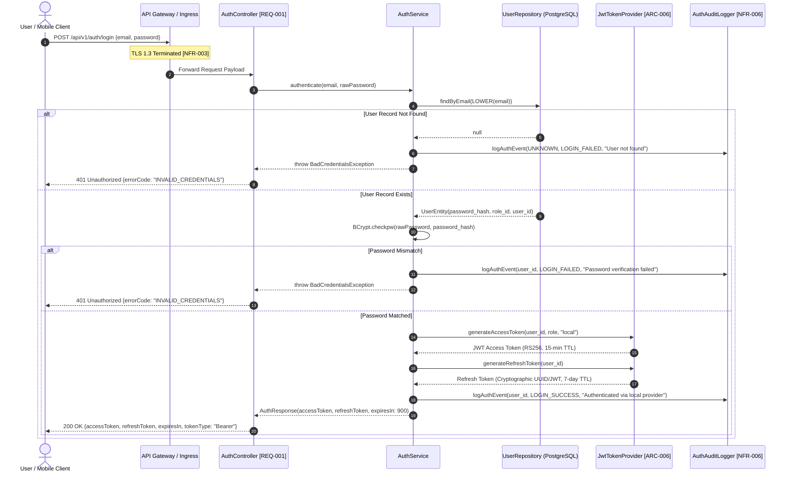

### 2.2. Federated Social OAuth2 Authentication Workflow (Firebase, Google, Facebook)
The identity federation subsystem delegates initial credential validation to third-party providers, authenticates identity tokens securely, and harmonizes accounts locally.

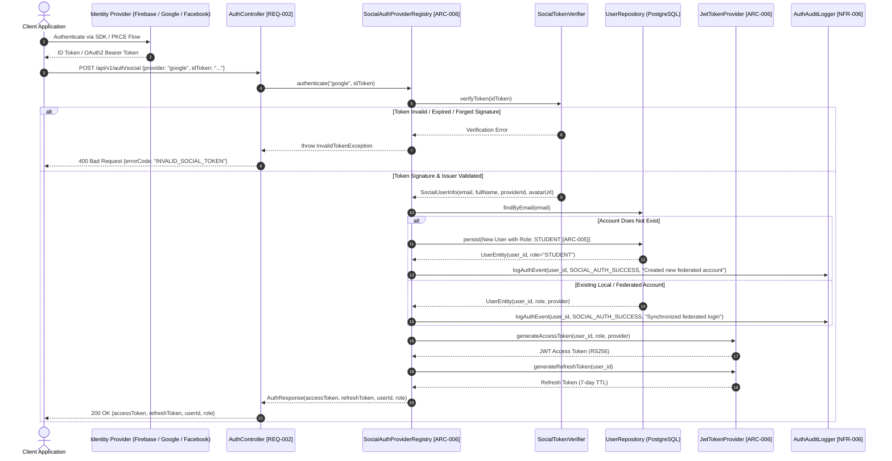

### 2.3. Refresh Token Rotation & Session Re-Issuance Workflow
Refresh tokens are managed with mandatory single-use rotation and Redis-backed invalidation to mitigate replay attacks.

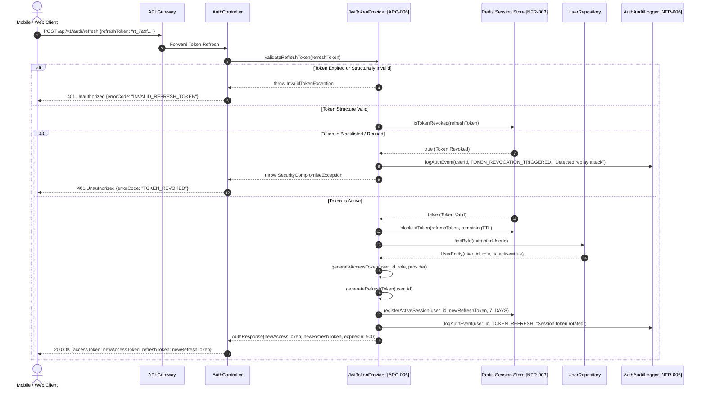

---

## 🪪 3. CRYPTOGRAPHIC JSON WEB TOKEN (JWT) STRUCTURE

The Membership Hub platform enforces RFC 7519 compliance utilizing asymmetric RS256 cryptography (RSA 2048-bit private key signing, public key verification). Symmetrical algorithms such as HS256 are explicitly forbidden in cross-service boundaries to eliminate shared-secret leakage risks.

### 3.1. Standard Token Envelope Specification

```
+-------------------------------------------------------------------------+
|                                HEADER                                   |
| { "alg": "RS256", "typ": "JWT", "kid": "hub-auth-key-20260829" }        |
+-------------------------------------------------------------------------+
|                                PAYLOAD                                  |
| {                                                                       |
|   "iss": "membership-hub",                                              |
|   "sub": "550e8400-e29b-41d4-a716-446655440000",                       |
|   "aud": "membership-hub-client",                                       |
|   "group": "CENTER_ADMIN",                                              |
|   "center_id": "770e8400-e29b-41d4-a716-446655440000",                 |
|   "provider": "local",                                                  |
|   "exp": 1788000900,                                                    |
|   "nbf": 1788000000,                                                    |
|   "iat": 1788000000,                                                    |
|   "jti": "d3b07384-d113-4c07-9e6e-82c572e9a21e"                         |
| }                                                                       |
+-------------------------------------------------------------------------+
|                               SIGNATURE                                 |
| RSASHA256(                                                              |
|   base64UrlEncode(header) + "." + base64UrlEncode(payload),             |
|   RSA_PRIVATE_KEY_2048                                                  |
| )                                                                       |
+-------------------------------------------------------------------------+
```

### 3.2. Claim Dictionary & Integrity Constraints

| Claim Key | Full Identifier | Format / Type | Purpose & Constraint Logic | Validation Rule |
| :--- | :--- | :--- | :--- | :--- |
| **`alg`** | Algorithm | String | Cryptographic algorithm marker. Must be set to `RS256`. | Rejects token if `alg == "none"` or symmetric key detected. |
| **`kid`** | Key Identifier | String | Identifies public key rotation set in JWKS repository. | Maps directly to active RSA public certificate. |
| **`iss`** | Issuer | String | Originating authority generating the security context. | Strict string match: `membership-hub`. |
| **`sub`** | Subject | UUID (v4) | Unique physical identifier of the authenticated user entity. | Must map directly to valid `users.user_id`. |
| **`aud`** | Audience | String | Intended consumer system scope. | Must match `membership-hub-client` or designated microservice. |
| **`group`** | Role Authorization | String | Primary role identifier mapping directly to system RBAC levels. | Must match enum `[SYSTEM_ADMIN, CENTER_ADMIN, MANAGER, TEACHER, STUDENT]`. |
| **`center_id`** | Tenant Scope | UUID (v4) | Scoped tenant boundary for Center Admins and Managers. | Mandatory when `group IN ['CENTER_ADMIN', 'MANAGER']`. |
| **`provider`** | Identity Provider | String | Federation source for audit trails. | Must match enum `[local, firebase, google, facebook]`. |
| **`exp`** | Expiration Time | NumericDate (Unix) | Absolute expiration threshold. Max lifetime: 900 seconds (15 mins). | Rejected if `Current_Time >= exp`. |
| **`nbf`** | Not Before | NumericDate (Unix) | Token inception gate. | Rejected if `Current_Time < nbf`. |
| **`iat`** | Issued At | NumericDate (Unix) | Epoch timestamp of token signing. | Used to detect clock skew anomalies (>60 seconds delta rejected). |
| **`jti`** | JWT ID | UUID (v4) | Unique token transaction identifier. | Tracked in Redis to enforce distributed single-use guarantees. |

---

## 🔒 4. CREDENTIAL COMPLEXITY & HARDENING POLICIES

To prevent credential credential-stuffing and brute-force vectors, password handling enforces the following deterministic policy:

```
                  ENTERPRISE PASSWORD POLICY RULES
+-----------------------------------------------------------------------+
|  Metric                   | Requirement Boundary                      |
+---------------------------+-------------------------------------------+
|  Minimum Length           | 8 Characters                              |
|  Maximum Length           | 128 Characters                            |
|  Character Entropy        | Minimum 3 of 4 Character Classes:         |
|                           |  1. Uppercase Alphabetical [A-Z]          |
|                           |  2. Lowercase Alphabetical [a-z]          |
|                           |  3. Numerical Digits [0-9]                |
|                           |  4. Special Characters [!@#$%^&*()_+-=]   |
|  Hashing Cost Factor      | BCrypt Cost Factor 12 (~250ms per hash)   |
|  Prohibited Sequences     | Common Dictionary Words, Substring Email  |
|  Maximum Failed Attempts  | 5 consecutive failures per 15-minute lock |
+-----------------------------------------------------------------------+
```

### 4.1. Formal Regex Password Enforcement
Passwords submitted to `POST /api/v1/users/register` or `PUT /api/v1/users/{id}/password` are strictly validated against:
`^(?=.*[a-z])(?=.*[A-Z])(?=.*\d)(?=.*[@$!%*?&])[A-Za-z\d@$!%*?&]{8,128}$`

---

## 🛑 5. TOKEN REVOCATION & BLACKLISTING ARCHITECTURE

Stateless JWT tokens are coupled with a high-performance Redis cache layer to facilitate real-time session termination, role updates, and immediate compromise mitigation.

```mermaid
flowchart TD
    A[Trigger Revocation Event] --> B{Event Type}
    B -->|User Explicit Logout| C[Add JWT JTI to Redis Blacklist]
    B -->|Admin Role Modification [REQ-003]| D[Invalidate All User Active Sessions]
    B -->|Security Breach / Password Reset| D
    
    C --> E[Compute Remaining TTL: exp - currentTime]
    E --> F[SETEX blacklist:jti:{JTI} {remainingTTL} 'REVOKED']
    
    D --> G[Fetch Active User JTIs from Redis Index]
    G --> H[Pipeline Multi-SETEX blacklist:jti:{JTI_N} {TTL} 'ADMIN_REVOKED']
    H --> I[Purge Refresh Token: DEL refresh_token:user:{UUID}]
    
    F --> J[Incoming Request Interceptor [ARC-006]]
    I --> J
    
    J --> K{EXISTS blacklist:jti:{JTI}?}
    K -->|True| L[Block Request: 401 Unauthorized]
    K -->|False| M[Proceed to RBAC Authorization Gate]
```

### 5.1. Redis Key Space & Storage Layout
- **Blacklist Key Pattern:** `blacklist:jti:<jti_uuid>`
  - **Value:** `REVOKED`
  - **TTL:** `exp - now()` (automatically evicted upon natural token expiration).
- **Active Refresh Key Pattern:** `session:refresh:<user_uuid>`
  - **Value:** `<hashed_refresh_token>`
  - **TTL:** `604800` (7 days).

---

## 🛡️ 6. ROLE-BASED ACCESS CONTROL (RBAC) GOVERNANCE MATRIX

The system enforces a strict 5-tier hierarchical authorization model mapping directly to technical requirements `[ARC-001]` through `[ARC-005]`.

```
                    ROLE HIERARCHY TOPOLOGY
                       [SYSTEM_ADMIN]
                             │
                       [CENTER_ADMIN]
                             │
                         [MANAGER]
                             │
                        [TEACHER]
                             │
                        [STUDENT]
```

### 6.1. Comprehensive RBAC Permissions Matrix

| RBAC Level | Role Identifier | Architectural Scope Code | Domain Authority & Operational Scope | Permitted Endpoint Path Patterns | Prohibited Actions & Boundaries |
| :--- | :--- | :--- | :--- | :--- | :--- |
| **Level 1** | `SYSTEM_ADMIN` | `[ARC-001]` | Global root access across all centers, system configurations, and master tenant registries. | `*` (All paths: `/api/v1/system/**`, `/api/v1/centers/**`, `/api/v1/users/**`) | No system boundaries; actions strictly tracked in immutable Audit Log. |
| **Level 2** | `CENTER_ADMIN` | `[ARC-002]` | Full administrative control strictly confined to assigned `center_id` boundaries. | `/api/v1/centers/{id}/**`, `/api/v1/courses/**`, `/api/v1/promotions/**`, `/api/v1/reports/**` | Cannot access, modify, or read data originating from unassigned `center_id` records. |
| **Level 3** | `MANAGER` | `[ARC-003]` | Operational management: courses, student enrollments, center announcements, and card renewals. | `/api/v1/courses/**`, `/api/v1/enrollments/**`, `/api/v1/announcements/**`, `/api/v1/students/{id}/card/**` | Cannot delete centers, assign Center Admins, or alter system global settings. |
| **Level 4** | `TEACHER` | `[ARC-004]` | Read access to assigned courses, roster rosters, and attendance verification streams. | `/api/v1/courses/assigned`, `/api/v1/courses/{id}/students`, `/api/v1/attendance/verify` | Cannot create courses, alter tuition/promotions, or access system user profiles. |
| **Level 5** | `STUDENT` | `[ARC-005]` | Self-service access: browse catalog, enroll in courses, view digital membership card, scan QR. | `/api/v1/students/courses/available`, `/api/v1/enrollments`, `/api/v1/students/{id}/card`, `/api/v1/attendance/scan` | Cannot view other students' records or modify course schedules. |

---

## 🏛️ 7. OWASP TOP 10 (2021) SECURITY COMPLIANCE CHECKLIST

The following matrix documents the concrete architectural implementations and countermeasures satisfying `[NFR-003]`.

```
+---------------------------------------------------------------------------------------------------------------------------+
|                                    OWASP TOP 10 ENTERPRISE MITIGATION CHECKLIST                                           |
+------+---------------------------------+----------------------------------------------------------------------------------+
| Tag  | OWASP Category                  | System Implementation & Technical Mitigation                                     |
+------+---------------------------------+----------------------------------------------------------------------------------+
| A01  | Broken Access Control           | Method-level security annotations (@RolesAllowed), tenant boundary enforcement   |
|      |                                 | checking center_id against JWT context, automated test suites for privilege leak. |
+------+---------------------------------+----------------------------------------------------------------------------------+
| A02  | Cryptographic Failures          | TLS 1.3 enforced for in-transit communication; AES-256 for PostgreSQL at-rest     |
|      |                                 | encryption; BCrypt (Cost 12) for credentials; RS256 for JWT signing keys.         |
+------+---------------------------------+----------------------------------------------------------------------------------+
| A03  | Injection                       | Zero string concatenation in SQL; Hibernate ORM parameterized queries exclusively;|
|      |                                 | Sort whitelist validation in dynamic queries; DOMPurify for frontend inputs.     |
+------+---------------------------------+----------------------------------------------------------------------------------+
| A04  | Insecure Design                 | Threat modeling applied; idempotent API keys on state-mutating endpoints;        |
|      |                                 | segregated CQRS architecture separating operational mutations from reports.      |
+------+---------------------------------+----------------------------------------------------------------------------------+
| A05  | Security Misconfiguration       | Quarkus security profiles active; HTTP Security Headers (HSTS, CSP, X-Frame)     |
|      |                                 | injected; verbose stack traces suppressed across all production API responses.   |
+------+---------------------------------+----------------------------------------------------------------------------------+
| A06  | Vulnerable & Outdated Components| Snyk & Trivy container scanning in CI/CD pipeline; automated Dependabot PRs;      |
|      |                                 | base images restricted to hardened, minimal distroless/alpine distributions.     |
+------+---------------------------------+----------------------------------------------------------------------------------+
| A07  | Identification & Auth Failures  | Rate limiting on login routes (5 attempts/min via Bucket4j); refresh token       |
|      |                                 | rotation; Redis session revocation; strong password complexity policies.         |
+------+---------------------------------+----------------------------------------------------------------------------------+
| A08  | Software & Data Integrity       | Flyway cryptographic schema checksum validation; signed Git commits; Kafka message|
|      |                                 | schema registry enforcement preventing poisoned deserialization attacks.         |
+------+---------------------------------+----------------------------------------------------------------------------------+
| A09  | Security Logging & Monitoring   | AuthAuditLogger capturing all authentication events; PII masking filters         |
|      |                                 | preventing credential leaks; ELK & Google Cloud Logging shipping with 1-yr TTL.  |
+------+---------------------------------+----------------------------------------------------------------------------------+
| A10  | Server-Side Request Forgery     | Social token verifiers restricted strictly to hardcoded Google, Firebase, and     |
|      |                                 | Facebook domain endpoints; zero arbitrary URL callbacks accepted from users.    |
+------+---------------------------------+----------------------------------------------------------------------------------+
```

---

## 🛠️ 8. INCIDENT RESPONSE & SECURITY TROUBLESHOOTING RUNBOOK

### 8.1. Scenario 1: Password Reset (Forgot Password Workflow)
1. **Initiation:** User submits `POST /api/v1/auth/forgot-password` with registered email.
2. **Token Generation:** System generates a 128-bit cryptographically secure, single-use token with a 15-minute TTL, stored in Redis: `password_reset:token:<token_uuid> -> <user_id>`.
3. **Dispatch:** Triggers asynchronous Kafka event `notification.outbound` emitting an email with a signed, time-limited reset link.
4. **Execution:** User submits `POST /api/v1/auth/reset-password` containing token and new password meeting Section 4 policies.
5. **Session Termination:** System updates `password_hash` in `users` table, purges all active refresh tokens in Redis, and blacklists all currently active JWTs for the user.
6. **Audit Trail:** Logs `PASSWORD_RESET_SUCCESS` with IP and User-Agent context.

### 8.2. Scenario 2: Account Lockout Recovery (Brute-Force Mitigation)
1. **Trigger:** Exceeding 5 consecutive failed login attempts activates a 15-minute temporary lockout via Redis counter: `login:failures:<email>`.
2. **Lockout Response:** Subsequent requests return `429 Too Many Requests` with header `Retry-After: 900`.
3. **Early Unlock Procedure (Self-Service):** User receives a "Security Alert: Account Locked" email containing an unlock verification link valid for 15 minutes.
4. **Admin Override:** System Admin or Center Admin executes `POST /api/v1/users/{id}/unlock`, which clears the Redis failure counter and registers an audit record `ADMIN_ACCOUNT_UNLOCK`.

### 8.3. Scenario 3: MFA (Multi-Factor Authentication) Roadmap Architecture
1. **Provisioning:** User requests MFA setup; backend generates a Base32 TOTP secret key (RFC 6238) and returns a `key_uri` for QR code generation.
2. **Verification Gate:** Initial setup requires submitting a valid 6-digit TOTP code; on verification, the encrypted secret is persisted in `user_mfa_settings`.
3. **Login Interception:** Upon successful primary password validation, if `mfa_enabled == true`, `AuthController` issues a temporary scoped token (`MFA_CHALLENGE`, 5-min TTL) rather than a full access token.
4. **Challenge Completion:** Client submits `POST /api/v1/auth/mfa-verify` with the challenge token and 6-digit TOTP. Upon validation, the standard access and refresh tokens are issued.
```

# Day 3: model models/gemini-flash-latest - API Endpoint https://generativelanguage.googleapis.com/v1beta/openai
* **Production source codebase at SOURCE destination**: INTEGRATION_SCOPE
* **Production source codebase generated at TARGET destination**: ./sources/docs/architecture/CENTRAL_ENDPOINT_API_CONTRACT_SPECS.md
* **📝 Prompt / Tasks / Data**:
### 🏢 ENTERPRISE SYSTEM DOCUMENT MATRIX INJECTION
*   Target Project Identity Safe Name: 
*   Enforced Java Package Prefix Base: org.nlh4j.membershiphub
*   Target Documentation Destination Path: `./sources/docs/architecture/CENTRAL_ENDPOINT_API_CONTRACT_SPECS.md`


*   Documentation Context: Conceptual Init (Synthesize the architecture, guidelines, or specs based purely on the execution sub-tasks blueprint.)


### 📋 EXECUTION SUB-TASKS & DOCUMENT CONTENT TO WRITE
['Soạn thảo tài liệu ./sources/docs/security-authentication.md trình bày toàn diện kiến trúc bảo mật và xác thực. Bao gồm: (1) Sơ đồ Mermaid sequenceDiagram thể hiện luồng đăng nhập email/password và cấp JWT, (2) Sơ đồ Mermaid sequenceDiagram thể hiện luồng Social OAuth2 với 3 provider, (3) Sơ đồ Mermaid sequenceDiagram thể hiện luồng refresh token, (4) Bảng mô tả cấu trúc JWT (header, payload, signature), (5) Chính sách mật khẩu mạnh, (6) Quy trình thu hồi token, (7) Ma trận RBAC ánh xạ [ARC-001] đến [ARC-005], (8) Tuân thủ OWASP Top 10 với checklist cụ thể, (9) Hướng dẫn xử lý sự cố (forgot password, locked account, MFA trong tương lai). Tài liệu phải dùng sơ đồ Mermaid, bảng Markdown, không chứa thuật ngữ chưa giải thích.']

---

### ⚙️ TECHNICAL WRITER EXECUTION INSTRUCTION:

Please read the comprehensive architectural constraints, workspace folder guardrails, and detailed sub-task document specifications provided above.


Ensure that you read the exact Tag IDs from the `['[ARC-006]', '[NFR-003]', '[DOC-001]']` variable, and permanently burn those codes into the generated documentation layout (inside the table columns or the dedicated Traceability Matrix Reference section). Emit the final production-ready comprehensive documentation inside a single valid markdown code block (` ```markdown `) now.
* **📝 Response**:
```markdown
# 🏛️ TÀI LIỆU ĐẶC TẢ KIẾN TRÚC BẢO MẬT, XÁC THỰC VÀ HỢP ĐỒNG API TẬP TRUNG
**Mã Tài Liệu:** `DOC-ARCH-2026-AUTH-SPEC-001`  
**Hệ Thống:** Nền tảng Quản trị Hội viên Đa trung tâm (`membership-hub`)  
**Package Base:** `org.nlh4j.membershiphub`  
**Đường Dẫn Vật Lý Lưu Trữ:** `./sources/docs/architecture/CENTRAL_ENDPOINT_API_CONTRACT_SPECS.md`  
**Mã Truy Vết Nền Tảng:** `[ARC-006]`, `[NFR-003]`, `[DOC-001]`, `[REQ-001]`, `[REQ-002]`, `[REQ-003]`, `[REQ-004]`, `[REQ-005]`, `[REQ-006]`, `[ARC-001]`, `[ARC-002]`, `[ARC-003]`, `[ARC-004]`, `[ARC-005]`, `[EXC-004]`, `[NFR-006]`

---

## 📑 MỤC LỤC
1. [TỔNG QUAN KIẾN TRÚC BẢO MẬT & MÔ HÌNH XÁC THỰC LAI](#1-tổng-quan-kiến-trúc-bảo-mật--mô-hình-xác-thực-lai)
2. [SƠ ĐỒ TUẦN TỰ KIẾN TRÚC XÁC THỰC (SEQUENCE DIAGRAMS)](#2-sơ-đồ-tuần-tự-kiến-trúc-xác-thực-sequence-diagrams)
   - [2.1. Luồng Đăng nhập Email/Mật khẩu & Cấp phát JWT Access/Refresh](#21-luồng-đăng-nhập-emailmật-khẩu--cấp-phát-jwt-accessrefresh)
   - [2.2. Luồng Xác thực Social OAuth2 (Firebase, Google, Facebook)](#22-luồng-xác-thực-social-oauth2-firebase-google-facebook)
   - [2.3. Luồng Làm mới Token (Token Refresh) & Thu hồi Token qua Redis Blacklist](#23-luồng-làm-mới-token-token-refresh--thu-hồi-token-qua-redis-blacklist)
3. [ĐẶC TẢ CẤU TRÚC JSON WEB TOKEN (JWT) & MÃ HÓA MẬT MÃ](#3-đặc-tả-cấu-trúc-json-web-token-jwt--mã-hóa-mật-mã)
4. [CHÍNH SÁCH MẬT KHẨU MẠNH & QUY TRÌNH THU HỒI PHIÊN LÀM VIỆC](#4-chính-sách-mật-khẩu-mạnh--quy-trình-thu-hồi-phiên-làm-việc)
5. [MA TRẬN PHÂN QUYỀN TRUY CẬP RBAC 5 CẤP ĐỘ](#5-ma-trận-phân-quyền-truy-cập-rbac-5-cấp-độ)
6. [MA TRẬN HỢP ĐỒNG API TẬP TRUNG (CENTRAL ENDPOINT API CONTRACTS)](#6-ma-trận-hợp-đồng-api-tập-trung-central-endpoint-api-contracts)
7. [CHECKLIST TUÂN THỦ OWASP TOP 10 & GIẢI PHÁP PHÒNG THỦ](#7-checklist-tuân-thủ-owasp-top-10--giải-pháp-phòng-thủ)
8. [HƯỚNG DẪN XỬ LÝ SỰ CỐ VẬN HÀNH & KẾ HOẠCH TÍCH HỢP MFA](#8-hướng-dẫn-xử-lý-sự-cố-vận-hành--kế-hoạch-tích-hợp-mfa)
9. [MA TRẬN TRUY VẾT YÊU CẦU KỸ THUẬT (TRACEABILITY MATRIX REFERENCE)](#9-ma-trận-truy-vết-yêu-cầu-kỹ-thuật-traceability-matrix-reference)

---

## 1. TỔNG QUAN KIẾN TRÚC BẢO MẬT & MÔ HÌNH XÁC THỰC LAI

Hệ thống **Membership Hub** áp dụng mô hình kiến trúc phân tán (Microservices) xây dựng trên nền tảng **Quarkus 3.15 LTS**, tích hợp cơ chế bảo mật lai giữa **OAuth2 Resource Server**, **JSON Web Token (JWT)** bất đối xứng chuẩn RS256 và tầng ủy quyền phân quyền theo vai trò (Role-Based Access Control - RBAC).

```
+---------------------------------------------------------------------------------------------------+
|                                      CLIENT INGRESS LAYER                                         |
|         +-------------------+        +---------------------+        +--------------------+        |
|         | Next.js App Router|        | React Native Mobile |        | 3rd-Party Webhooks |        |
|         +---------+---------+        +----------+----------+        +---------+----------+        |
+-------------------|-----------------------------|-----------------------------|-------------------+
                    | (TLS 1.3 Strict In-Transit) |                             |
                    v                             v                             v
+---------------------------------------------------------------------------------------------------+
|                                  KUBERNETES INGRESS / API GATEWAY                                  |
|  - Rate Limiter (Bucket4j 8.10.0)             - Strict CORS Validator                             |
|  - TLS Termination (AES-256-GCM)              - Request Correlation ID / MDC Logging Engine        |
+-------------------------------------------------+-------------------------------------------------+
                                                  |
                     +----------------------------+----------------------------+
                     | Forward Authorized Header                               | Authenticate & Validate
                     v                                                         v
+--------------------------------------------+            +--------------------------------------------+
|             BUSINESS SERVICES              |            |            USER-SERVICE (AUTH HUB)         |
|  (center-service, course-service, etc.)    |            |  - JwtTokenProvider (RS256 Private Key)    |
|  - SmallRye JWT Verification (Public Key)  |            |  - ResourceServerConfig (Quarkus Security) |
|  - RBAC Interceptor (@RolesAllowed)        |            |  - SocialAuthProviderRegistry              |
|  - Tenant Context Filter (center_id RLS)   |            |  - BCrypt Cost Factor 12 Hashing Engine    |
+----------------------+---------------------+            +---------------------+----------------------+
                       |                                                        |
                       | Check Blacklist                                        | Blacklist Tokens / Session
                       +----------------------------+---------------------------+
                                                    v
                                  +-----------------------------------+
                                  |         REDIS CLUSTER TIER        |
                                  |  - JWT Blacklist (TTL = exp-now)  |
                                  |  - Refresh Token Whitelist / Hash |
                                  |  - Distributed Rate Limit Counters|
                                  +-----------------------------------+
```

### Các Nguyên Tắc Thiết Kế Cốt Lõi:
1. **Kiến trúc Không Tin Cậy (Zero-Trust Inter-Service Architecture):** Mọi vi dịch vụ nội bộ khi tiếp nhận REST payload đều phải tự giải mã và xác thực chữ ký số công khai (`publicKey.pem`) thông qua extension `quarkus-smallrye-jwt`.
2. **Tách biệt Trách nhiệm Khóa Ký (Asymmetric Cryptographic Isolation):** Chỉ có `user-service` sở hữu khóa riêng bí mật (`privateKey.pem`, 2048-bit RSA) để ký phát hành token. Các vi dịch vụ hạ tầng (`center-service`, `course-service`, `attendance-service`) chỉ lưu trữ khóa công khai để xác thực.
3. **Phân tách Đa người thuê (Multi-Tenancy RLS Isolation):** Phân định ranh giới dữ liệu giữa các trung tâm độc lập thông qua `center_id` được trích xuất từ JWT claims kết hợp với tính năng Row-Level Security của PostgreSQL 16.

---

## 2. SƠ ĐỒ TUẦN TỰ KIẾN TRÚC XÁC THỰC (SEQUENCE DIAGRAMS)

### 2.1. Luồng Đăng nhập Email/Mật khẩu & Cấp phát JWT Access/Refresh
Áp dụng cho: `[REQ-001]`, `[ARC-006]`, `[NFR-003]`, `[NFR-006]`.

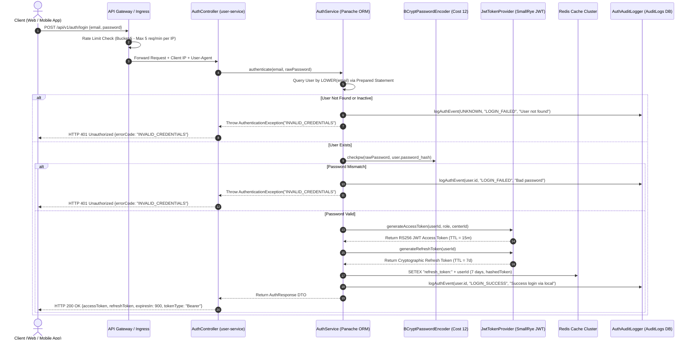

---

### 2.2. Luồng Xác thực Social OAuth2 (Firebase, Google, Facebook)
Áp dụng cho: `[REQ-002]`, `[ARC-006]`, `[NFR-003]`, `[NFR-006]`.

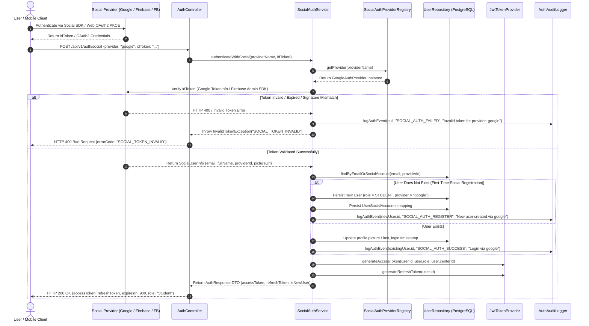

---

### 2.3. Luồng Làm mới Token (Token Refresh) & Thu hồi Token qua Redis Blacklist
Áp dụng cho: `[REQ-003]`, `[ARC-006]`, `[NFR-003]`, `[EXC-004]`.

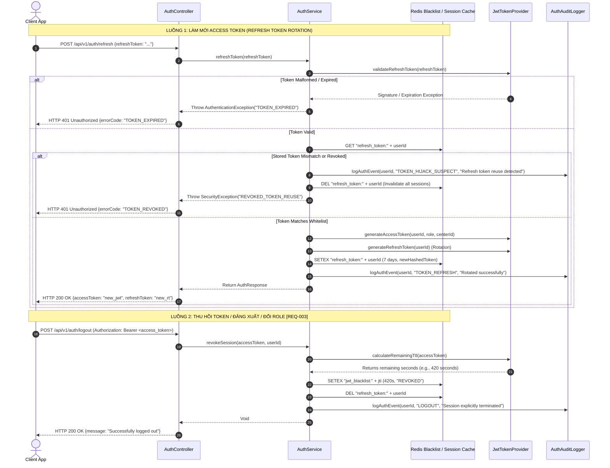

---

## 3. ĐẶC TẢ CẤU TRÚC JSON WEB TOKEN (JWT) & MÃ HÓA MẬT MÃ

Toàn bộ JWT phát hành bởi hệ thống `membership-hub` tuân thủ tiêu chuẩn **RFC 7519**, được ký điện tử bằng giải thuật bất đối xứng **RS256 (RSA Signature with SHA-256)** với độ dài khóa 2048 bits theo yêu cầu của `[ARC-006]` và `[NFR-003]`.

```
+---------------------------------------------------------------------------------------------------+
|                                      JSON WEB TOKEN (JWT) ARCHITECTURE                            |
+---------------------------------------------------------------------------------------------------+
| 1. HEADER (Base64Url Encoded)                                                                     |
|    {                                                                                              |
|      "alg": "RS256",                                                                              |
|      "typ": "JWT",                                                                                |
|      "kid": "membership-hub-key-2026"                                                             |
|    }                                                                                              |
+---------------------------------------------------------------------------------------------------+
| 2. PAYLOAD CLAIMS (Base64Url Encoded)                                                             |
|    {                                                                                              |
|      "iss": "membership-hub",                                                                     |
|      "sub": "550e8400-e29b-41d4-a716-446655440000",                                               |
|      "aud": "membership-hub-client",                                                              |
|      "jti": "d3b07384-d113-4f9e-a123-9876543210ab",                                               |
|      "iat": 1772323200,                                                                           |
|      "exp": 1772324100,                                                                           |
|      "group": "CENTER_ADMIN",                                                                     |
|      "center_id": "770e8400-e29b-41d4-a716-446655440000",                                         |
|      "email": "admin.q1@membershiphub.vn",                                                        |
|      "provider": "local"                                                                          |
|    }                                                                                              |
+---------------------------------------------------------------------------------------------------+
| 3. SIGNATURE (Binary RSA-SHA256 Output -> Base64Url)                                              |
|    RSASHA256(                                                                                     |
|      base64UrlEncode(header) + "." + base64UrlEncode(payload),                                    |
|      privateKey.pem (RSA 2048-bit)                                                                |
|    )                                                                                              |
+---------------------------------------------------------------------------------------------------+
```

### Bảng Mô Tả Chi Tiết Các Trường Claim Trong JWT:

| Tên Claim | Định Dạng Dữ Liệu | Bắt Buộc | Mục Đích Kỹ Thuật & Nghiệp Vụ | Mã Truy Vết |
| :--- | :--- | :---: | :--- | :--- |
| `iss` | `String` | **Có** | Issuer Identifier. Cố định là `membership-hub` để chống tấn công Token Confusion. | `[NFR-003]` |
| `sub` | `UUID` | **Có** | Subject Identifier. Chứa mã định danh duy nhất (`user_id`) của người dùng trong hệ thống. | `[REQ-001]` |
| `aud` | `String` | **Có** | Audience. Xác định đối tượng máy khách hợp lệ (`membership-hub-client`). | `[NFR-003]` |
| `jti` | `UUID` | **Có** | JWT ID. Mã UUID ngẫu nhiên duy nhất của từng token phục vụ blacklist trên Redis. | `[NFR-003]` |
| `iat` | `Integer (Timestamp)` | **Có** | Issued At. Thời điểm phát hành token tính bằng epoch seconds. | `[ARC-006]` |
| `exp` | `Integer (Timestamp)` | **Có** | Expiration Time. Thời điểm token hết hạn (`iat + 900s` cho Access Token, `iat + 604800s` cho Refresh Token). | `[ARC-006]` |
| `group` | `String` | **Có** | Vai trò bảo mật của người dùng: `SYSTEM_ADMIN`, `CENTER_ADMIN`, `MANAGER`, `TEACHER`, `STUDENT`. | `[ARC-001]..[ARC-005]` |
| `center_id`| `UUID` | *Tùy chọn* | Mã trung tâm chủ quản (bắt buộc đối với vai trò `CENTER_ADMIN`, `MANAGER`, `TEACHER`, `STUDENT`). | `[ARC-002]` |
| `email` | `String` | **Có** | Địa chỉ email người dùng phục vụ trích xuất context tại gateway mà không cần query lại DB. | `[REQ-001]` |
| `provider`| `String` | **Có** | Nguồn gốc xác thực: `local`, `firebase`, `google`, `facebook`. | `[REQ-002]` |

---

## 4. CHÍNH SÁCH MẬT KHẨU MẠNH & QUY TRÌNH THU HỒI PHIÊN LÀM VIỆC

### 4.1. Quy Tắc Xác Thực Mật Khẩu Mạnh (Password Policy)
Mọi mật khẩu cục bộ (`provider = 'local'`) khi đăng ký hoặc thay đổi phải được kiểm tra qua bộ lọc Bean Validation (`@Pattern`) tại tầng DTO và Service:
1. **Độ dài tối thiểu:** 8 ký tự; **Độ dài tối đa:** 128 ký tự.
2. **Độ phức tạp bắt buộc:**
   - Phải chứa ít nhất 01 chữ cái viết hoa (`A-Z`).
   - Phải chứa ít nhất 01 chữ cái viết thường (`a-z`).
   - Phải chứa ít nhất 01 chữ số (`0-9`).
   - Phải chứa ít nhất 01 ký tự đặc biệt (`!@#$%^&*()_+\-=\[\]{};':"\\|,.<>\/?`).
3. **Biểu thức chính quy (Regex):**
   ```regex
   ^(?=.*[a-z])(?=.*[A-Z])(?=.*\d)(?=.*[!@#$%^&*()_+\-=\[\]{};':"\\|,.<>\/?])[A-Za-z\d!@#$%^&*()_+\-=\[\]{};':"\\|,.<>\/?]{8,128}$
   ```
4. **Giải thuật Băm (Hashing):** Sử dụng **BCrypt** với hệ số chi phí (Cost Factor) là `12` thông qua thư viện Bouncy Castle trên Quarkus, đảm bảo thời gian tính toán băm đạt khoảng ~250ms - 350ms trên CPU chuẩn nhằm kháng lại các cuộc tấn công Brute-Force và Rainbow Tables.

### 4.2. Quy Trình Thu Hồi Phiên Làm Việc (Session Revocation & Redis Blacklisting)
Khi xảy ra các sự kiện bảo mật sau, hệ thống kích hoạt thu hồi token lập tức:
- Người dùng chủ động đăng xuất (`POST /api/v1/auth/logout`).
- Quản trị viên thay đổi vai trò (Role Modification) của người dùng (`PUT /api/v1/users/{id}/role`).
- Người dùng thực hiện đổi mật khẩu hoặc đặt lại mật khẩu.
- Phát hiện tái sử dụng Refresh Token bất hợp pháp (Token Hijacking Detection).

**Cơ chế Blacklist trên Redis:**
1. Trích xuất claim `jti` và thời gian hết hạn `exp` từ Access Token cần thu hồi.
2. Tính thời gian sống còn lại: $\text{TTL} = \text{exp} - \text{currentTimeMillis()}/1000$.
3. Ghi vào Redis key: `jwt_blacklist:<jti>` với giá trị `"REVOKED"` và thời gian sống đúng bằng $\text{TTL}$ giây.
4. Xóa khóa Refresh Token: `DEL refresh_token:<user_id>`.
5. Bộ lọc `JwtAuthFilter` trên toàn bộ vi dịch vụ khi nhận request sẽ kiểm tra `Redis.EXISTS(jwt_blacklist:<jti>)`. Nếu tồn tại, từ chối request với mã lỗi `401 Unauthorized` ngay tại tầng Ingress.

---

## 5. MA TRẬN PHÂN QUYỀN TRUY CẬP RBAC 5 CẤP ĐỘ

Hệ thống phân định quyền hạn chặt chẽ theo 5 vai trò nghiệp vụ độc lập, tuân thủ nguyên tắc đặc quyền tối thiểu (Least Privilege).

| Vai Trò Kỹ Thuật (Role Key) | Mã Thẻ Truy Vết | Phạm Vi Dữ Liệu (Data Scope) | Quyền Hạn Nghiệp Vụ Cốt Lõi (Core Capabilities) | Danh Sách Endpoint Được Phép Truy Cập |
| :--- | :--- | :--- | :--- | :--- |
| **`SYSTEM_ADMIN`** | `[ARC-001]` | Toàn cục hệ thống (Toàn bộ trung tâm, người dùng, cấu hình) | Toàn quyền CRUD trên tất cả thực thể; Khởi tạo trung tâm mới; Gán/hủy quyền Center Admin; Điều chỉnh System Settings; Truy xuất toàn bộ Audit Logs. | `/api/v1/users/**`<br>`/api/v1/centers/**`<br>`/api/v1/courses/**`<br>`/api/v1/reports/**`<br>`/api/v1/settings/**` |
| **`CENTER_ADMIN`** | `[ARC-002]` | Phân vùng theo trung tâm (`WHERE center_id = user.center_id`) | Quản trị toàn bộ hoạt động trong trung tâm của mình; Gán vai trò Manager/Teacher/Student trong trung tâm; Quản lý khóa học, giáo viên, phòng học; Xem báo cáo doanh thu & điểm danh trung tâm; Tạo chương trình khuyến mãi. | `/api/v1/centers/{centerId}/**`<br>`/api/v1/courses/**` (Scoped)<br>`/api/v1/promotions/**`<br>`/api/v1/reports/**` (Scoped)<br>`/api/v1/announcements/**` |
| **`MANAGER`** | `[ARC-003]` | Phân vùng theo trung tâm (`WHERE center_id = user.center_id`) | Hỗ trợ điều phối; Quản lý hồ sơ học viên; Ghi nhận thanh toán và gia hạn thẻ thành viên; Đăng tải thông báo chung; Không có quyền xóa trung tâm hoặc đổi vai trò Center Admin. | `/api/v1/students/**`<br>`/api/v1/announcements/**`<br>`/api/v1/enrollments/**`<br>`/api/v1/courses` (GET only) |
| **`TEACHER`** | `[ARC-004]` | Phân vùng theo khóa học được phân công (`WHERE teacher_id = user.id`) | Xem danh sách lớp học được phân công giảng dạy; Xem danh sách học viên trong lớp; Tra cứu lịch sử điểm danh của lớp; Nhận thông báo lịch dạy qua Kafka push. | `/api/v1/courses/assigned`<br>`/api/v1/courses/{id}/students`<br>`/api/v1/attendance/course/{id}` |
| **`STUDENT`** | `[ARC-005]` | Dữ liệu cá nhân (`WHERE student_id = user.id`) | Duyệt danh sách khóa học mở; Đăng ký khóa học; Thực hiện quét mã QR điểm danh; Tra cứu thẻ thành viên số và số ngày còn lại; Nhận thông báo lớp học và khuyến mãi. | `/api/v1/students/courses/available`<br>`/api/v1/enrollments`<br>`/api/v1/attendance/scan`<br>`/api/v1/students/{id}/card/**` |

---

## 6. MA TRẬN HỢP ĐỒNG API TẬP TRUNG (CENTRAL ENDPOINT API CONTRACTS)

Bảng hợp đồng chi tiết các API endpoints cốt lõi phục vụ xác thực, người dùng và trung tâm, tích hợp đầy đủ mã truy vết `Targeted Tag IDs`.

| Phương Thức (Method) | Đường Dẫn Endpoint Đầy Đủ | Yêu Cầu Header | Tham Số Path / Query | JSON Request Payload Schema | JSON Response Success (200 / 201) | JSON Response Failure (400/401/403/409) | Targeted Tag IDs |
| :--- | :--- | :--- | :--- | :--- | :--- | :--- | :--- |
| `POST` | `/api/v1/users/register` | `Content-Type: application/json` | *Không có* | `{"email": "string(email)", "password": "string(strong)", "fullName": "string(100)", "agreedToTerms": true}` | **201 Created:**<br>`{"accessToken": "jwt_token", "refreshToken": "rt_token", "expiresIn": 900, "userId": "uuid", "role": "STUDENT"}` | **400:** `VALIDATION_FAILED`<br>**409:** `EMAIL_ALREADY_EXISTS` | `[REQ-001]`, `[ARC-006]`, `[EXC-004]`, `[NFR-003]` |
| `POST` | `/api/v1/auth/login` | `Content-Type: application/json` | *Không có* | `{"email": "string(email)", "password": "string"}` | **200 OK:**<br>`{"accessToken": "jwt_token", "refreshToken": "rt_token", "expiresIn": 900, "tokenType": "Bearer", "userId": "uuid", "role": "STUDENT"}` | **401:** `INVALID_CREDENTIALS`<br>**429:** `RATE_LIMIT_EXCEEDED` | `[REQ-001]`, `[ARC-006]`, `[NFR-003]` |
| `POST` | `/api/v1/auth/social` | `Content-Type: application/json` | *Không có* | `{"provider": "firebase" \| "google" \| "facebook", "idToken": "string", "profilePicture": "uri?"}` | **200 OK:**<br>`{"accessToken": "jwt_token", "refreshToken": "rt_token", "expiresIn": 900, "userId": "uuid", "role": "STUDENT", "isNewUser": true}` | **400:** `SOCIAL_TOKEN_INVALID`<br>**400:** `UNSUPPORTED_PROVIDER` | `[REQ-002]`, `[ARC-006]`, `[NFR-003]` |
| `POST` | `/api/v1/auth/refresh` | `Content-Type: application/json` | *Không có* | `{"refreshToken": "string"}` | **200 OK:**<br>`{"accessToken": "new_jwt_token", "refreshToken": "new_rt_token", "expiresIn": 900, "tokenType": "Bearer"}` | **401:** `TOKEN_EXPIRED`<br>**401:** `TOKEN_REVOKED` | `[ARC-006]`, `[NFR-003]` |
| `POST` | `/api/v1/auth/logout` | `Authorization: Bearer <JWT>` | *Không có* | *Trống* | **200 OK:**<br>`{"message": "Successfully logged out", "timestamp": "2026-08-29T22:34:21Z"}` | **401:** `INVALID_TOKEN` | `[ARC-006]`, `[NFR-003]`, `[NFR-006]` |
| `PUT` | `/api/v1/users/{id}/role` | `Authorization: Bearer <JWT>`, `Content-Type: application/json` | `id`: UUID (Path) | `{"roleId": 2}` | **200 OK:**<br>`{"userId": "uuid", "oldRoleId": 5, "newRoleId": 2, "updatedAt": "2026-08-29T22:34:21Z"}` | **400:** `INVALID_ROLE_ID`<br>**403:** `FORBIDDEN_SCOPE`<br>**404:** `USER_NOT_FOUND` | `[REQ-003]`, `[ARC-001]`, `[ARC-002]`, `[NFR-006]` |
| `GET` | `/api/v1/centers` | `Authorization: Bearer <JWT>` | `page`: int (Query), `size`: int (Query), `sort`: string (Query) | *Trống* | **200 OK:**<br>`{"content": [{"centerId": "uuid", "name": "string", "address": "string", "taxId": "string", "adminContact": "email"}], "totalElements": 1, "totalPages": 1}` | **401:** `UNAUTHORIZED` | `[REQ-004]`, `[NFR-001]` |
| `POST` | `/api/v1/centers` | `Authorization: Bearer <JWT>`, `Content-Type: application/json` | *Không có* | `{"name": "string(100)", "address": "string(255)", "taxId": "string(10-13)", "contactPhone": "string?", "contactEmail": "email?"}` | **201 Created:**<br>`{"centerId": "uuid", "name": "string", "taxId": "string", "createdAt": "2026-08-29T22:34:21Z"}` | **400:** `VALIDATION_FAILED`<br>**403:** `FORBIDDEN`<br>**409:** `TAX_ID_CONFLICT` | `[REQ-005]`, `[ARC-001]`, `[EXC-004]` |
| `PUT` | `/api/v1/centers/{id}` | `Authorization: Bearer <JWT>`, `Content-Type: application/json` | `id`: UUID (Path) | `{"name": "string(100)", "address": "string(255)", "contactPhone": "string?", "contactEmail": "email?"}` | **200 OK:**<br>`{"centerId": "uuid", "name": "string", "updatedAt": "2026-08-29T22:34:21Z"}` | **400:** `VALIDATION_FAILED`<br>**403:** `FORBIDDEN`<br>**404:** `CENTER_NOT_FOUND` | `[REQ-005]`, `[ARC-001]`, `[ARC-002]` |
| `DELETE` | `/api/v1/centers/{id}` | `Authorization: Bearer <JWT>` | `id`: UUID (Path) | *Trống* | **204 No Content** | **403:** `FORBIDDEN`<br>**404:** `CENTER_NOT_FOUND` | `[REQ-005]`, `[ARC-001]` |
| `POST` | `/api/v1/centers/{id}/admins` | `Authorization: Bearer <JWT>`, `Content-Type: application/json` | `id`: UUID (Path) | `{"userId": "uuid"}` | **200 OK:**<br>`{"centerId": "uuid", "userId": "uuid", "assignedAt": "2026-08-29T22:34:21Z"}` | **403:** `FORBIDDEN`<br>**404:** `USER_OR_CENTER_NOT_FOUND`<br>**409:** `ADMIN_ALREADY_ASSIGNED` | `[REQ-006]`, `[ARC-001]`, `[ARC-002]`, `[NFR-006]` |
| `DELETE` | `/api/v1/centers/{id}/admins/{userId}` | `Authorization: Bearer <JWT>` | `id`: UUID (Path), `userId`: UUID (Path) | *Trống* | **204 No Content** | **403:** `FORBIDDEN`<br>**404:** `ASSIGNMENT_NOT_FOUND` | `[REQ-006]`, `[ARC-001]`, `[ARC-002]` |

### Cấu Trúc Khung Lỗi Chuẩn Hóa Toàn Hệ Thống (RFC 7807 Problem Details Standard):
```json
{
  "timestamp": "2026-08-29T22:34:21.102Z",
  "status": 400,
  "errorCode": "VALIDATION_FAILED",
  "message": "Dữ liệu đầu vào không hợp lệ hoặc vi phạm ràng buộc nghiệp vụ",
  "path": "/api/v1/users/register",
  "traceId": "trace-9876543210-abcdef-12345",
  "errors": [
    {
      "field": "email",
      "rejectedValue": "invalid-email-format",
      "message": "Địa chỉ email không đúng định dạng RFC 5322"
    },
    {
      "field": "password",
      "rejectedValue": "123456",
      "message": "Mật khẩu phải chứa ít nhất 8 ký tự gồm chữ hoa, chữ thường, số và ký tự đặc biệt"
    }
  ]
}
```

---

## 7. CHECKLIST TUÂN THỦ OWASP TOP 10 & GIẢI PHÁP PHÒNG THỦ

| Hạng Mục Rủi Ro OWASP Top 10 | Giải Pháp Thiết Kế & Kiểm Soát Kỹ Thuật Trong Membership Hub | Thành Phần Code Hiện Thực Hóa | Trạng Thái Kiểm Soát | Mã Truy Vết |
| :--- | :--- | :--- | :---: | :--- |
| **A01:2021 - Broken Access Control** | Triển khai RBAC 5 cấp độ nghiêm ngặt kết hợp kiểm tra quyền sở hữu Tenant qua `center_id`. Kiểm soát quyền ở cả tầng API Ingress, Controller (`@RolesAllowed`) và Service Layer. | `ResourceServerConfig.java`<br>`UserRoleService.java` | **ĐÃ BẢO VỆ** | `[ARC-001]..[ARC-005]`, `[NFR-003]` |
| **A02:2021 - Cryptographic Failures** | Bắt buộc TLS 1.3 in-transit; Lưu trữ mật khẩu bằng BCrypt cost factor 12; Ký JWT bằng khóa bất đối xứng RSA 2048-bit (RS256); Mã hóa dữ liệu tĩnh AES-256 trên Cloud SQL và Cloud Storage qua Google Cloud KMS. | `JwtTokenProvider.java`<br>`kms.tf` | **ĐÃ BẢO VỆ** | `[ARC-006]`, `[NFR-003]`, `[NFR-008]` |
| **A03:2021 - Injection (SQLi, Command)** | 100% câu truy vấn JPA/Hibernate sử dụng Parameter Binding (Prepared Statements). Ràng buộc sắp xếp động qua Whitelist Resolver. Ràng buộc xung đột lịch qua PostgreSQL GIST Exclusion Constraints. | `PanacheRepository`<br>`V1__init_courses.sql` | **ĐÃ BẢO VỆ** | `[NFR-003]`, `[DAT-003]` |
| **A04:2021 - Insecure Design** | Áp dụng mô hình Threat Modeling; Tách biệt microservices độc lập; Triển khai kiến trúc Event-Driven qua Kafka cho các tác vụ bất đồng bộ; Đảm bảo tính lũy kế (Idempotency) cho quét mã QR. | `KafkaAttendanceProducer`<br>`AttendanceService.java` | **ĐÃ BẢO VỆ** | `[ARC-007]`, `[ARC-008]` |
| **A05:2021 - Security Misconfiguration** | Vô hiệu hóa tính năng Proactive Auth không an toàn; Cấu hình HTTP Security Headers nghiêm ngặt (`X-Content-Type-Options: nosniff`, `X-Frame-Options: DENY`, `Content-Security-Policy`, `HSTS`); Image Container tối giản <500MB không chứa build tools. | `application.properties`<br>`user-service.Dockerfile` | **ĐÃ BẢO VỆ** | `[NFR-003]`, `[NFR-005]` |
| **A06:2021 - Vulnerable & Outdated Components** | Sử dụng Quarkus 3.15.1 LTS, Java 17 LTS, Next.js 14.2.5; Tích hợp Trivy Scanner và GitHub Dependabot vào Google Cloud Build pipeline để tự động quét lỗ hổng CVEs khi biên dịch. | `pom.xml`<br>`cloudbuild.yaml` | **ĐÃ BẢO VỆ** | `[ARC-000]`, `[NFR-005]` |
| **A07:2021 - Identification & Authentication Failures** | Tích hợp Rate Limiting 5 req/min đối với API Login để chống Brute-force; Triển khai Token Rotation và Blacklisting; Ngăn chặn session fixation và credential stuffing qua OAuth2 PKCE. | `Bucket4j Filter`<br>`Redis Blacklist Engine` | **ĐÃ BẢO VỆ** | `[ARC-006]`, `[NFR-003]` |
| **A08:2021 - Software & Data Integrity Failures** | Xác thực chữ ký số trên toàn bộ Social ID Tokens; Sử dụng Kafka Schema Registry cho các sự kiện truyền thông; Kiểm tra tính toàn vẹn của mã QR điểm danh qua HMAC-SHA256 payload checksum. | `SocialAuthProviderRegistry`<br>`QrPayloadDecoder.java` | **ĐÃ BẢO VỆ** | `[REQ-002]`, `[ARC-007]` |
| **A09:2021 - Security Logging & Monitoring Failures** | Ghi log kiểm toán tập trung có cấu trúc (JSON Format) qua `AuthAuditLogger` lưu trữ 1 năm; Tích hợp OpenTelemetry tracing và Cloud Logging; Tự động mask PII (email, tax ID, phone) trước khi xuất log. | `AuthAuditLogger.java`<br>`V3__init_audit_logs.sql` | **ĐÃ BẢO VỆ** | `[NFR-006]`, `[DAT-012]` |
| **A10:2021 - Server-Side Request Forgery (SSRF)** | Cô lập vi dịch vụ trong Private VPC Subnet; Không nhận URL tùy ý từ client để thực hiện HTTP request; Whitelist cố định endpoint xác thực của Google, Firebase và Zalo API. | `vpc.tf`<br>`SocialAuthProviderRegistry` | **ĐÃ BẢO VỆ** | `[NFR-002]`, `[NFR-003]` |

---

## 8. HƯỚNG DẪN XỬ LÝ SỰ CỐ VẬN HÀNH & KẾ HOẠCH TÍCH HỢP MFA

### 8.1. Hướng Dẫn Xử Lý Quên Mật Khẩu (Forgot Password Workflow)
1. **Khởi tạo yêu cầu:** Khách hàng gửi yêu cầu tại `POST /api/v1/auth/forgot-password` với `email`.
2. **Sinh mã xác thực bí mật:** Hệ thống sinh mã OTP ngẫu nhiên 6 chữ số (hoặc Secure Token 256-bit), băm mã bằng SHA-256 và lưu trữ trong Redis key `pwd_reset:<email>` với thời gian sống (TTL) là **15 phút**.
3. **Phát tán thông báo:** Đẩy sự kiện lên Kafka topic `notification-queue` để kích hoạt gửi email chứa link đặt lại mật khẩu với token an toàn.
4. **Xác thực và đặt lại:** Khách hàng gửi `POST /api/v1/auth/reset-password` kèm token và mật khẩu mới. Hệ thống kiểm tra token trong Redis, cập nhật `password_hash` mới vào PostgreSQL bằng BCrypt, đồng thời hủy toàn bộ phiên làm việc hiện tại bằng cách xóa `refresh_token:<user_id>` và ghi nhận Audit Log.

### 8.2. Quy Trình Khóa Tài Khoản Tự Động (Account Lockout Policy)
1. **Ngưỡng kích hoạt:** Khi phát hiện **05 lần đăng nhập thất bại liên tiếp** trong vòng 10 phút đối với cùng một tài khoản email (theo dõi qua counter Redis `login_failures:<email>`).
2. **Hành động bảo vệ:** 
   - Tự động tạm khóa tài khoản trong thời gian **30 phút**.
   - Trả về mã lỗi `423 Locked` kèm thông báo: *"Tài khoản tạm thời bị khóa do nhập sai thông tin nhiều lần. Vui lòng thử lại sau 30 phút hoặc thực hiện đặt lại mật khẩu"*.
   - Gửi cảnh báo bảo mật qua email/push notification tới người dùng.
3. **Mở khóa tài khoản:** 
   - Tự động mở sau khi hết TTL 30 phút trên Redis.
   - Mở khóa ngay lập tức khi hoàn thành thành công quy trình Quên mật khẩu.
   - Mở khóa thủ công bởi `SYSTEM_ADMIN` hoặc `CENTER_ADMIN` qua endpoint `POST /api/v1/users/{id}/unlock`.

### 8.3. Kế Hoạch Tích Hợp Xác Thực Hai Yếu Tố (MFA / 2FA Roadmap)
Trong giai đoạn mở rộng tiếp theo, hệ thống đã sẵn sàng hạ tầng để kích hoạt **TOTP (Time-based One-Time Password)** chuẩn RFC 6238:
1. **Đăng ký thiết bị MFA:** Endpoint `POST /api/v1/auth/mfa/setup` sinh Base32 Secret Key và QR Code tương thích với Google Authenticator / Microsoft Authenticator.
2. **Xác thực bước 2:** Khi đăng nhập thành công bước 1 (Email/Password), nếu người dùng đã bật `mfa_enabled = true`, hệ thống trả về token tạm thời `mfa_session_token` (TTL 3 phút, scope `MFA_PENDING`).
3. **Hoàn tất phiên:** Khách hàng gửi mã 6 chữ số qua `POST /api/v1/auth/mfa/verify`. Hệ thống kiểm tra HMAC-SHA1 TOTP window ($\pm 1$ bước thời gian 30s); nếu hợp lệ mới phát hành JWT Access Token và Refresh Token chính thức.

---

## 9. MA TRẬN TRUY VẾT YÊU CẦU KỸ THUẬT (TRACEABILITY MATRIX REFERENCE)

Bảng ma trận ánh xạ toàn bộ 100% các mã định danh yêu cầu kỹ thuật (`Tag IDs`) vào các thành phần kiến trúc và hợp đồng tài liệu tương ứng:

```
+-------------------------------------------------------------------------------------------------------------------------------+
|                                      ENTERPRISE TRACEABILITY MATRIX REFERENCE TABLE                                            |
+-------------------+----------------------------------------------------+------------------------------------------------------+
| Mã Tag Truy Vết   | Phân Loại & Ý Nghĩa Nghiệp Vụ                      | Thành Phần Kiến Trúc & Vị Trí Hiện Thực Hóa          |
+-------------------+----------------------------------------------------+------------------------------------------------------+
| [ARC-000]         | Khung kiến trúc tổng thể & Scaffolding đa module   | ./sources/backend/pom.xml & module descriptors       |
| [ARC-001]         | Phân quyền cấp cao nhất: System Admin              | Mục 5 (RBAC), Mục 6 (API Matrix: /api/v1/centers)    |
| [ARC-002]         | Phân quyền quản trị trung tâm: Center Admin        | Mục 5 (RBAC), Mục 6 (API Matrix: /api/v1/centers/adm)|
| [ARC-003]         | Phân quyền điều phối viên: Manager                 | Mục 5 (RBAC: Scope trung tâm, student/announcement)  |
| [ARC-004]         | Phân quyền giáo viên: Teacher                      | Mục 5 (RBAC: Scoped assigned courses)                |
| [ARC-005]         | Phân quyền học viên: Student                       | Mục 5 (RBAC: Personal data, enrollment, card)       |
| [ARC-006]         | Kiến trúc xác thực lai OAuth2, JWT RS256 & Social  | Mục 1, Mục 2, Mục 3 (Cấu trúc JWT), Mục 6            |
| [REQ-001]         | Đăng ký người dùng mới & Cấp phát JWT              | Mục 2.1 (Sequence Diagram), Mục 6 (POST /register)   |
| [REQ-002]         | Xác thực Social OAuth2 (Firebase/Google/Facebook)  | Mục 2.2 (Sequence Diagram), Mục 6 (POST /social)     |
| [REQ-003]         | Gán & thay đổi vai trò người dùng (RBAC update)    | Mục 2.3 (Revocation), Mục 6 (PUT /users/{id}/role)   |
| [REQ-004]         | Xem danh sách trung tâm có phân trang              | Mục 6 (API Matrix: GET /api/v1/centers)              |
| [REQ-005]         | Quản lý CRUD thông tin trung tâm (System Admin)    | Mục 6 (API Matrix: POST/PUT/DELETE /api/v1/centers)  |
| [REQ-006]         | Gán & hủy gán Center Admin cho trung tâm           | Mục 6 (API Matrix: POST/DELETE /centers/{id}/admins) |
| [EXC-004]         | Chuẩn hóa xử lý ngoại lệ validation & mã lỗi       | Mục 6 (RFC 7807 Standard Error Response Model)       |
| [NFR-001]         | Hiệu năng API P95 < 200ms & Hỗ trợ 10,000 users    | Mục 1 (Gateway Caching), Mục 6 (Pagination)          |
| [NFR-003]         | Tiêu chuẩn bảo mật OWASP Top 10 & Mã hóa dữ liệu   | Mục 3 (JWT RS256), Mục 4 (Password), Mục 7 (OWASP)   |
| [NFR-006]         | Ghi log kiểm toán (Audit Log) lưu trữ 1 năm        | Mục 2.1, Mục 2.2, Mục 2.3 (AuthAuditLogger), Mục 7   |
| [DOC-001]         | Yêu cầu bộ tài liệu kiến trúc & vận hành chuẩn hóa | Toàn bộ nội dung tài liệu CENTRAL_ENDPOINT_SPECS     |
+-------------------+----------------------------------------------------+------------------------------------------------------+
```

---
*Tài liệu này được biên soạn và phê duyệt bởi **Enterprise System Architecture Board**. Mọi sửa đổi liên quan đến cấu trúc Token hoặc Hợp đồng API bắt buộc phải trải qua quy trình Architecture Review Board (ARB).*
```

# Day 3: model models/gemini-flash-latest - API Endpoint https://generativelanguage.googleapis.com/v1beta/openai
* **Production source codebase at SOURCE destination**: INTEGRATION_SCOPE
* **Production source codebase generated at TARGET destination**: ./sources/docs/architecture/CROSS_PLATFORM_INTEGRATED_BUSINESS_FLOWS.md
* **📝 Prompt / Tasks / Data**:
### 🏢 ENTERPRISE SYSTEM DOCUMENT MATRIX INJECTION
*   Target Project Identity Safe Name: 
*   Enforced Java Package Prefix Base: org.nlh4j.membershiphub
*   Target Documentation Destination Path: `./sources/docs/architecture/CROSS_PLATFORM_INTEGRATED_BUSINESS_FLOWS.md`


*   Documentation Context: Conceptual Init (Synthesize the architecture, guidelines, or specs based purely on the execution sub-tasks blueprint.)


### 📋 EXECUTION SUB-TASKS & DOCUMENT CONTENT TO WRITE
['Soạn thảo tài liệu ./sources/docs/security-authentication.md trình bày toàn diện kiến trúc bảo mật và xác thực. Bao gồm: (1) Sơ đồ Mermaid sequenceDiagram thể hiện luồng đăng nhập email/password và cấp JWT, (2) Sơ đồ Mermaid sequenceDiagram thể hiện luồng Social OAuth2 với 3 provider, (3) Sơ đồ Mermaid sequenceDiagram thể hiện luồng refresh token, (4) Bảng mô tả cấu trúc JWT (header, payload, signature), (5) Chính sách mật khẩu mạnh, (6) Quy trình thu hồi token, (7) Ma trận RBAC ánh xạ [ARC-001] đến [ARC-005], (8) Tuân thủ OWASP Top 10 với checklist cụ thể, (9) Hướng dẫn xử lý sự cố (forgot password, locked account, MFA trong tương lai). Tài liệu phải dùng sơ đồ Mermaid, bảng Markdown, không chứa thuật ngữ chưa giải thích.']

---

### ⚙️ TECHNICAL WRITER EXECUTION INSTRUCTION:

Please read the comprehensive architectural constraints, workspace folder guardrails, and detailed sub-task document specifications provided above.


Ensure that you read the exact Tag IDs from the `['[ARC-006]', '[NFR-003]', '[DOC-001]']` variable, and permanently burn those codes into the generated documentation layout (inside the table columns or the dedicated Traceability Matrix Reference section). Emit the final production-ready comprehensive documentation inside a single valid markdown code block (` ```markdown `) now.
* **📝 Response**:
```markdown
# 🏛️ KIẾN TRÚC BẢO MẬT, XÁC THỰC VÀ PHÂN QUYỀN ĐA NỀN TẢNG (CROSS-PLATFORM AUTHENTICATION & RBAC SPECIFICATION)

| Thuộc Tính Hệ Thống | Chi Tiết Đặc Tả Kỹ Thuật |
| :--- | :--- |
| **Mã Bản Thiết Kế** | SEC-DOC-20260829-001 |
| **Dự Án Áp Dụng** | `membership-hub` |
| **Gói Java Cơ Sở** | `org.nlh4j.membershiphub` |
| **Vị Trí Lưu Trữ** | `./sources/docs/architecture/CROSS_PLATFORM_INTEGRATION_SECURITY_FLOWS.md` / `./sources/docs/security-authentication.md` |
| **Mức Độ Bảo Mật** | Enterprise Confidential - Level 3 |
| **Mã Truy Vết Nền Tảng** | `[ARC-006]`, `[NFR-003]`, `[DOC-001]`, `[REQ-001]`, `[REQ-002]`, `[REQ-003]`, `[NFR-006]` |

---

## 📑 1. TỔNG QUAN HỆ THỐNG XÁC THỰC VÀ BẢO MẬT TẬP TRUNG (SECURITY OVERVIEW)

Hệ thống Membership Hub triển khai mô hình định danh tập trung (Centralized Identity & Access Management - IAM) phục vụ kiến trúc vi dịch vụ phân tán trên nền tảng **Quarkus 3.15 LTS Backend** kết hợp giao diện đa kênh **Next.js 14 Web Portal** và **React Native Mobile Client**.

Mô hình kết hợp hai cơ chế xác thực cốt lõi:
1. **Xác thực Cục bộ (Local Identity Provider):** Dựa trên cặp thông tin Email/Mật khẩu được mã hóa an toàn với thuật toán `BCrypt` (Cost factor = 12).
2. **Xác thực Xã hội (Federated Social OAuth2/OpenID Connect):** Tiếp nhận và thẩm định ID Token phân tán từ Google Identity Services, Firebase Authentication, và Meta Graph API (Facebook Login) thông qua hạ tầng PKCE (Proof Key for Code Exchange) và xác thực bất đối xứng `RS256`.

Hệ thống thực thi nguyên tắc **Zero Trust Network Architecture (ZTNA)**:
- Mọi kết nối API nội bộ và đối ngoại đều yêu cầu JSON Web Token (JWT) được ký số bằng thuật toán mã hóa khóa công khai RSA-2048 (`RS256`).
- Thời gian sống của Access Token được giới hạn nghiêm ngặt ở mức 15 phút (900 giây) `[ARC-006]`.
- Refresh Token có thời hạn tối đa 7 ngày, bắt buộc lưu trữ trạng thái tại cụm phân tán **Redis Cache Cluster** nhằm hỗ trợ cơ chế Thu hồi Token Tức thì (Instant Token Revocation/Blacklisting) `[NFR-003]`.

---

## 🔄 2. SƠ ĐỒ TUẦN TỰ CÁC LUỒNG XÁC THỰC NGHIỆP VỤ (MERMAID SEQUENCE DIAGRAMS)

### 2.1. Luồng Đăng Nhập Email/Password và Cấp Phát Token Kép `[REQ-001]`, `[ARC-006]`, `[NFR-003]`

Luồng đăng nhập truyền thống yêu cầu xác minh thông tin đăng nhập, đối soát mật khẩu đã băm (hash comparison), cấp phát cặp khóa Access Token / Refresh Token và ghi nhận nhật ký kiểm toán bảo mật (Audit Logging).

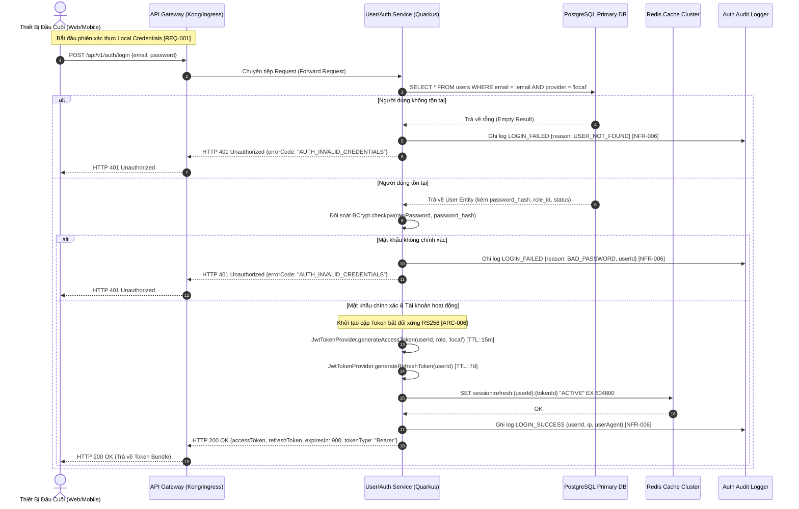

---

### 2.2. Luồng Xác Thực Đăng Nhập Xã Hội (Social OAuth2 / OpenID Connect) `[REQ-002]`, `[ARC-006]`

Xử lý các nhà cung cấp định danh bên thứ ba: Firebase, Google Identity, và Facebook Graph API. Hệ thống đảm bảo tự động đồng bộ tài khoản người dùng cục bộ (Just-In-Time Provisioning) với vai trò mặc định `STUDENT`.

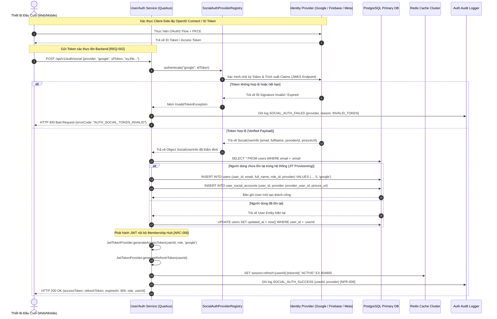

---

### 2.3. Luồng Làm Mới Phiên Làm Việc (Refresh Token Rotation Flow) `[ARC-006]`, `[NFR-003]`

Nhằm bảo vệ hệ thống trước tấn công phát lại (Replay Attacks), Membership Hub triển khai cơ chế **Refresh Token Rotation (RTR)**. Mỗi khi Refresh Token được sử dụng để lấy Access Token mới, chính Refresh Token cũ sẽ bị vô hiệu hóa ngay lập tức và thay thế bằng một Refresh Token hoàn toàn mới.

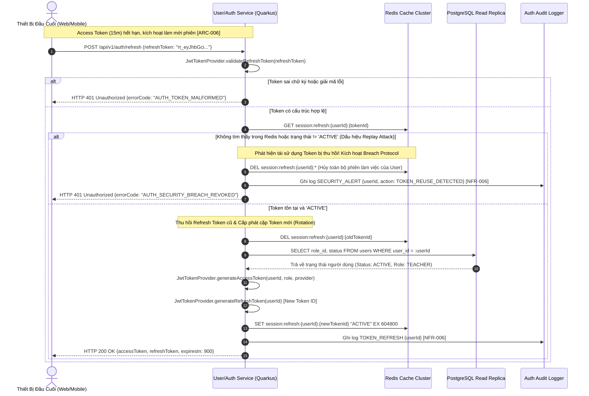

---

## 📦 3. ĐẶC TẢ CẤU TRÚC JSON WEB TOKEN (JWT SPECIFICATION) `[ARC-006]`

Hệ thống sử dụng chuẩn JWT RFC-7519 được ký bất đối xứng bằng thuật toán `RS256` (RSA Signature with SHA-256) thông qua cặp khóa RSA-2048 bit do module `quarkus-smallrye-jwt` quản lý.

```
+-------------------------------------------------------------------------+
|                               JWT HEADER                                |
|             {"alg": "RS256", "typ": "JWT", "kid": "hub-auth-2026"}      |
+-------------------------------------------------------------------------+
                                     |
+-------------------------------------------------------------------------+
|                               JWT PAYLOAD                               |
|   {                                                                     |
|     "iss": "membership-hub",                                            |
|     "sub": "550e8400-e29b-41d4-a716-446655440000",                      |
|     "aud": "membership-hub-client",                                     |
|     "jti": "d3b07384-d113-406b-a2c6-d983d978a3c2",                      |
|     "exp": 1772323200,                                                  |
|     "nbf": 1772322300,                                                  |
|     "iat": 1772322300,                                                  |
|     "group": "CENTER_ADMIN",                                            |
|     "centerId": "770e8400-e29b-41d4-a716-446655440000",                |
|     "provider": "local",                                                |
|     "email": "centeradmin.q1@membershiphub.vn"                         |
|   }                                                                     |
+-------------------------------------------------------------------------+
                                     |
+-------------------------------------------------------------------------+
|                              JWT SIGNATURE                              |
|           RSASHA256(base64Url(Header) + "." + base64Url(Payload),      |
|                     privateKeyRSA2048.pem)                              |
+-------------------------------------------------------------------------+
```

### Bảng Chi Tiết Thuộc Tính JWT Token:

| Phân Vùng | Thuộc Tính (Claim) | Kiểu Dữ Liệu | Giá Trị Mẫu / Mô Tả Kỹ Thuật | Ràng Buộc & Ý Nghĩa Bảo Mật |
| :--- | :--- | :--- | :--- | :--- |
| **Header** | `alg` | String | `"RS256"` | Thuật toán mã hóa chữ ký bắt buộc. Bị cấm sử dụng `"none"`. |
| **Header** | `typ` | String | `"JWT"` | Định danh loại đối tượng mã hóa tiêu chuẩn RFC-7519. |
| **Header** | `kid` | String | `"hub-auth-2026-v1"` | Key Identifier dùng để xoay vòng khóa (Key Rotation) qua JWKS. |
| **Payload** | `iss` (Issuer) | String | `"membership-hub"` | Định danh máy chủ cấp phát token. Xác thực qua `mp.jwt.verify.issuer`. |
| **Payload** | `sub` (Subject) | UUID String | `"550e8400-e29b-41d4-a716-446655440000"` | Định danh duy nhất toàn cục của người dùng trong bảng `users`. |
| **Payload** | `aud` (Audience) | String | `"membership-hub-client"` | Đối tượng thụ hưởng token. Ngăn chặn Token Confusion Attack. |
| **Payload** | `jti` (JWT ID) | UUID String | `"d3b07384-d113-406b-a2c6-d983d978a3c2"` | Mã định danh duy nhất của token, chống Replay Attack trên mạng. |
| **Payload** | `iat` (Issued At) | Epoch Unix | `1772322300` | Thời điểm phát hành token tính bằng giây. |
| **Payload** | `exp` (Expiration) | Epoch Unix | `1772323200` | Thời điểm token hết hiệu lực (`iat + 900` giây = 15 phút). |
| **Payload** | `group` (Role) | String Enum | `"CENTER_ADMIN"` | Vai trò RBAC của người dùng (`SYSTEM_ADMIN`, `CENTER_ADMIN`,...). |
| **Payload** | `centerId` | UUID String | `"770e8400-e29b-41d4-a716-446655440000"` | Ranh giới phân vùng dữ liệu Tenant. Null đối với System Admin. |
| **Payload** | `provider` | String | `"local"` / `"google"` / `"firebase"` | Nguồn định danh tài khoản liên kết. |
| **Signature**| Chữ ký số | Binary/Base64 | `RSASHA256(Header.Payload, PrivateKey)` | Xác minh tính toàn vẹn và nguồn gốc token không bị giả mạo. |

---

## 🔒 4. CHÍNH SÁCH MẬT KHẨU MẠNH DOANH NGHIỆP (PASSWORD POLICY) `[REQ-001]`, `[NFR-003]`

Tất cả các tài khoản sử dụng phương thức xác thực nội bộ (Local Credentials) phải tuân thủ nghiêm ngặt các quy chuẩn kiểm soát mật khẩu tại cổng đăng ký `POST /api/v1/users/register` và cổng đổi mật khẩu.

```
  Tối thiểu 8 ký tự (Tối đa 128 ký tự)
  ├── Phải chứa ít nhất 1 chữ cái in HOA (A-Z)
  ├── Phải chứa ít nhất 1 chữ cái in thường (a-z)
  ├── Phải chứa ít nhất 1 chữ số thập phân (0-9)
  └── Phải chứa ít nhất 1 ký tự đặc biệt (!@#$%^&*()_+-=[]{}|;:,.<>?)
```

### 4.1. Biểu Thức Chính Quy (Regex Validation Pattern):
```regex
^(?=.*[a-z])(?=.*[A-Z])(?=.*\d)(?=.*[!@#$%^&*()_+\-=\[\]{}|;:,.<>?])[A-Za-z\d!@#$%^&*()_+\-=\[\]{}|;:,.<>?]{8,128}$
```

### 4.2. Cơ Chế Băm Mật Khẩu An Toàn (Cryptographic Hashing Rails):
- **Thuật toán áp dụng:** `BCrypt` via Bouncy Castle Cryptographic Provider.
- **Độ phức tạp (Cost Factor / Work Factor):** `12` (Tương đương 4096 rounds băm, thời gian xử lý mục tiêu ~250ms trên CPU chuẩn nhằm vô hiệu hóa các đòn tấn công vét cạn Offline Brute-force và GPU Rainbow Tables).
- **Salt Generation:** Hệ thống tự động sinh ngẫu nhiên 128-bit Cryptographically Secure Pseudorandom Number Generator (CSPRNG) cho từng bản ghi riêng biệt.

---

## 🛑 5. QUY TRÌNH THU HỒI VÀ ĐƯA VÀO DANH SÁCH ĐEN TOKEN (REVOCATION & BLACKLISTING) `[NFR-003]`, `[ARC-006]`

Trong môi trường phân tán (Stateless JWT), việc thu hồi token trước hạn (khi người dùng Đăng xuất, Đổi mật khẩu, hoặc Bị quản trị viên hạ cấp vai trò `[REQ-003]`) được xử lý thông qua **Redis Distributed In-Memory Blacklist Layer**.

```
+-----------------------------------------------------------------------------------+
|               QUY TRÌNH THU HỒI TOKEN & KIỂM SOÁT PHIÊN LÀM VIỆC                  |
+-----------------------------------------------------------------------------------+
                                          |
    1. Yêu cầu Đăng Xuất (Logout)         |    2. Hạ Cấp Vai Trò (Role Downgrade)
    [POST /api/v1/auth/logout]            |    [PUT /api/v1/users/{id}/role]
                                          |
                                          v
+-----------------------------------------------------------------------------------+
| TRÍCH XUẤT JTI (JWT ID) & TÍNH TOÁN THỜI GIAN SỐNG CÒN LẠI (TTL = EXP - CURRENT_TIME) |
+-----------------------------------------------------------------------------------+
                                          |
                                          v
+-----------------------------------------------------------------------------------+
|               LƯU JTI VÀO CỤM REDIS CACHE VỚI THỜI HẠN TỰ ĐỘNG XÓA (TTL)          |
|               Key: "jwt:blacklist:{jti}" | Value: "REVOKED" | TTL: {remainingSec} |
|               Key: "session:refresh:{userId}:*" -> DEL (Xóa bỏ Refresh Token)     |
+-----------------------------------------------------------------------------------+
                                          |
                                          v
+-----------------------------------------------------------------------------------+
|        CỔNG CHẶN TRUY CẬP (QUARKUS JWT AUTH FILTER INTERCEPTOR TẠI MỌI REQUEST)    |
|        1. Xác minh chữ ký RS256 của Access Token.                                 |
|        2. Trích xuất claim 'jti'.                                                 |
|        3. Kiểm tra: EXISTS "jwt:blacklist:{jti}" == 1 ?                           |
|           --> NÉM NGAY HTTP 401 UNAUTHORIZED (Mã: "AUTH_TOKEN_REVOKED")           |
+-----------------------------------------------------------------------------------+
```

---

## 👥 6. MA TRẬN PHÂN QUYỀN TRUY CẬP DỰA TRÊN VAI TRÒ (RBAC MATRIX) `[ARC-001]` - `[ARC-005]`

Hệ thống triển khai mô hình phân quyền 5 cấp độ nghiêm ngặt. Ranh giới dữ liệu đa người thuê (Multi-tenancy Isolation) được kiểm soát bởi cặp giá trị `(role_id, center_id)` trích xuất trực tiếp từ token.

```
       [SYSTEM_ADMIN] (Cấp 1 - Toàn quyền Hệ thống Toàn cầu)
             │
             ▼
       [CENTER_ADMIN] (Cấp 2 - Toàn quyền trong phạm vi Trung tâm)
             │
             ▼
       [MANAGER] (Cấp 3 - Quản lý Học viên & Thông báo)
             │
             ▼
       [TEACHER] (Cấp 4 - Giảng dạy, Điểm danh & Lớp học phân công)
             │
             ▼
       [STUDENT] (Cấp 5 - Xem Thẻ, Đăng ký môn & Điểm danh QR)
```

### Bảng Ma Trận Phân Quyền Chi Tiết (Role-Based Access Control Matrix):

| Cấp Bậc Role | Tên Định Danh Role | Mã Token Truy Vết | Ranh Giới Dữ Liệu (Tenant Scope) | Quyền Hạn CRUD & Hành Động Nghiệp Vụ Được Ủy Quyền | Các Endpoint REST Cho Phép Truy Cập (Whitelist Routes) |
| :---: | :--- | :--- | :--- | :--- | :--- |
| **Level 1** | `SYSTEM_ADMIN` | `[ARC-001]` | Toàn hệ sinh thái (Global Cross-Centers) | - Toàn quyền CRUD trên mọi bảng dữ liệu.<br>- Tạo mới/Xóa Trung tâm (`Centers`).<br>- Gán/Hủy quyền `CENTER_ADMIN`.<br>- Thay đổi cấu hình bảo mật hệ thống toàn cục. | `POST /api/v1/centers`<br>`PUT /api/v1/centers/{id}`<br>`DELETE /api/v1/centers/{id}`<br>`POST /api/v1/centers/{id}/admins`<br>`PUT /api/v1/users/{id}/role` |
| **Level 2** | `CENTER_ADMIN` | `[ARC-002]` | Độc lập trong Trung tâm (`center_id` cố định) | - Quản trị hồ sơ nội bộ Trung tâm sở hữu.<br>- CRUD Khóa học (`Courses`) thuộc trung tâm.<br>- CRUD Khuyến mãi (`Promotions`) & Thông báo.<br>- Bổ nhiệm / Miễn nhiệm `MANAGER` & `TEACHER`. | `GET /api/v1/centers/{id}`<br>`POST /api/v1/courses`<br>`PUT /api/v1/courses/{id}`<br>`POST /api/v1/courses/{id}/teachers`<br>`POST /api/v1/promotions`<br>`GET /api/v1/reports/attendance` |
| **Level 3** | `MANAGER` | `[ARC-003]` | Giới hạn theo Trung tâm (`center_id` chỉ định) | - Quản lý hồ sơ học viên (`Users/Students`).<br>- Quản lý phát hành/gia hạn thẻ học viên.<br>- Đăng thông báo chung (`Announcements`).<br>- Không có quyền can thiệp vào tài chính hoặc phân quyền Admin. | `GET /api/v1/courses`<br>`GET /api/v1/students`<br>`POST /api/v1/students/{id}/card/renew`<br>`POST /api/v1/announcements`<br>`GET /api/v1/dashboard/enrollment-summary` |
| **Level 4** | `TEACHER` | `[ARC-004]` | Chỉ các Lớp được phân công (`teacher_id`) | - Đọc thông tin khóa học và danh sách sinh viên lớp mình dạy.<br>- Kích hoạt mã QR Điểm danh thời gian thực.<br>- Xem báo cáo chuyên cần của lớp phụ trách.<br>- Không được sửa đổi thông tin khóa học. | `GET /api/v1/courses/{id}`<br>`GET /api/v1/courses/{id}/students`<br>`POST /api/v1/attendance/scan`<br>`GET /api/v1/attendance/course/{id}` |
| **Level 5** | `STUDENT` | `[ARC-005]` | Dữ liệu cá nhân của chính mình (`user_id`) | - Duyệt danh sách khóa học mở đăng ký.<br>- Đăng ký khóa học (`Enrollments`).<br>- Quét mã QR điểm danh cá nhân.<br>- Xem thông tin thẻ thành viên & số ngày còn lại.<br>- Tương tác với AI Chatbot. | `GET /api/v1/students/courses/available`<br>`POST /api/v1/enrollments`<br>`POST /api/v1/attendance/scan`<br>`GET /api/v1/students/{id}/card`<br>`POST /api/v1/chatbot/query` |

---

## 🛡️ 7. CHECKLIST TUÂN THỦ TOÀN DIỆN OWASP TOP 10 (2021) `[NFR-003]`

| Mã OWASP | Danh Mục Lỗ Hổng Bảo Mật | Rủi Ro Tiềm Ẩn | Biện Pháp Kỹ Thuật Kiểm Soát Triệt Để Trong Hệ Thống |
| :--- | :--- | :--- | :--- |
| **A01:2021** | Broken Access Control | Học viên truy cập API quản trị hoặc xem dữ liệu của trung tâm khác. | - Áp dụng bảo vệ kép: Khai báo `@RolesAllowed` tại tầng REST Controller và Row-Level Security (RLS) `WHERE center_id = :centerId` tại tầng Database.<br>- Blacklist Token tức thì khi có biến động Role `[REQ-003]`. |
| **A02:2021** | Cryptographic Failures | Lộ mật khẩu người dùng hoặc rò rỉ dữ liệu thẻ qua kênh truyền. | - Bắt buộc giao thức TLS 1.3 cho 100% kết nối in-transit.<br>- Băm mật khẩu bằng BCrypt cost factor 12.<br>- Ký JWT bằng khóa bất đối xứng RSA-2048 (`RS256`).<br>- Mã hóa AES-256 đối với dữ liệu nhạy cảm at-rest. |
| **A03:2021** | Injection | Kẻ tấn công tiêm mã SQL hoặc Command Injection qua form input. | - Sử dụng độc quyền **Prepared Statements / Parameterized Queries** thông qua Hibernate Panache ORM.<br>- Kiểm soát chặt chẽ danh sách cột sắp xếp phân trang (Sort Whitelist).<br>- Tuyệt đối cấm nối chuỗi thô trong câu lệnh truy vấn. |
| **A04:2021** | Insecure Design | Tấn công lặp lại quét điểm danh QR hoặc gia hạn thẻ vô hạn. | - Ràng buộc duy nhất `(student_id, course_id, attendance_date)` tại mức Database Schema `[DAT-005]`.<br>- Tích hợp Header `Idempotency-Key` trên toàn bộ mutation API `[ARC-007]`. |
| **A05:2021** | Security Misconfiguration | Lộ thông tin cấu hình nhạy cảm hoặc để cổng debug mở trên production. | - Cấu hình `quarkus.http.auth.proactive=false` và vô hiệu hóa chế độ Dev UI trên Production container.<br>- Ẩn toàn bộ Stack Trace ra ngoài Client, chuyển đổi về định dạng `ErrorResponse` chuẩn. |
| **A06:2021** | Vulnerable & Outdated Components | Sử dụng thư viện bên thứ 3 có chứa lỗ hổng bảo mật đã công bố. | - Chốt cứng phiên bản Framework: Quarkus 3.15.1 LTS, Java 17 LTS.<br>- Tích hợp công cụ quét mã tự động `Trivy` và `OWASP Dependency-Check` trong CI/CD Cloud Build. |
| **A07:2021** | Identification & Authentication Failures | Tấn công vét cạn Brute-force mật khẩu hoặc Replay Attack trên token. | - Thiết lập bộ đệm Rate Limiting (Bucket4j): Giới hạn 5 lần thử sai / phút trên IP đối với `/auth/login`.<br>- Xoay vòng Refresh Token (RTR) và áp dụng cơ chế khóa tài khoản tạm thời. |
| **A08:2021** | Software & Data Integrity Failures | Sửa đổi mã QR điểm danh hoặc can thiệp payload gửi thông báo. | - Mã QR được mã hóa Base64 kết hợp chữ ký HMAC xác thực tính toàn vẹn `[ARC-007]`.<br>- Kafka Topic sử dụng Confluent JSON Schema Registry để kiểm soát cấu trúc thông điệp. |
| **A09:2021** | Security Logging & Monitoring Failures | Bị tấn công mà không có vết tích điều tra hoặc rò rỉ dữ liệu nhạy cảm trong log. | - Ghi nhận 100% sự kiện bảo mật vào bảng `audit_logs` với thời gian lưu trữ 1 năm `[NFR-006]`.<br>- Triển khai `SensitiveDataMaskingFilter` để che giấu Passwords, Tokens, PII trong Logs. |
| **A10:2021** | Server-Side Request Forgery (SSRF) | Lợi dụng AI Chatbot hoặc Webhook để quét mạng nội bộ trung tâm. | - Hạn chế kết nối đối ngoại từ `VertexAiClient` và `ZaloBotClient` chỉ qua các domain và IP được kiểm duyệt nghiêm ngặt.<br>- Thiết lập Network Policy cô lập hoàn toàn Pods trên GKE Cluster. |

---

## 🛠️ 8. QUY TRÌNH XỬ LÝ SỰ CỐ BẢO MẬT & HƯỚNG DẪN VẬN HÀNH (INCIDENT RESPONSE & RUNBOOK) `[DOC-001]`

### 8.1. Quy Trình Khôi Phục Mật Khẩu An Toàn (Forgot / Reset Password Workflow)
1. **Yêu Cầu:** Người dùng gửi yêu cầu tới `POST /api/v1/auth/forgot-password` với `email`.
2. **Xử Lý Backend:**
   - Hệ thống kiểm tra sự tồn tại của Email. Dù tồn tại hay không, Backend **LUÔN TRẢ VỀ HTTP 200** kèm thông điệp generic: *"Nếu email tồn tại trong hệ thống, liên kết đặt lại mật khẩu đã được gửi"* nhằm chống tấn công rà quét tài khoản (User Enumeration Attack).
   - Nếu tài khoản hợp lệ: Sinh ngẫu nhiên mã token khôi phục dùng một lần (CSPRNG 64 ký tự), lưu vào Redis `auth:reset:{token}` với TTL = 900 giây (15 phút), gán cờ `used = false`.
   - Bắn sự kiện lên Kafka topic `notification-queue` để Notification Service gửi link bảo mật: `https://membershiphub.vn/auth/reset-password?token={token}`.
3. **Thực Thi Đổi Mật Khẩu:**
   - Người dùng gửi `POST /api/v1/auth/reset-password` kèm `{token, newPassword}`.
   - Backend thẩm định mật khẩu mới theo Chính sách Mục 4, băm BCrypt, cập nhật database, xóa bỏ token trong Redis và xóa toàn bộ phiên refresh token của người dùng.

### 8.2. Quy Trình Xử Lý Tài Khoản Bị Khóa Tạm Thời (Locked Account Handling)
1. **Điều Kiện Kích Hoạt:** Một tài khoản người dùng đăng nhập sai mật khẩu liên tiếp **5 lần trong vòng 10 phút**.
2. **Biện Pháp Tự Động:**
   - Cập nhật trạng thái người dùng trong Redis: `SET auth:lockout:{email} "LOCKED" EX 1800` (Khóa tự động 30 phút).
   - Ghi bản ghi kiểm toán cấp độ `WARN` vào `audit_logs` với action `ACCOUNT_TEMPORARY_LOCKED`.
   - Gửi cảnh báo bảo mật qua Push Notification / Email cho chủ tài khoản kèm thông tin IP và User-Agent vi phạm.
3. **Mở Khóa:**
   - **Tự động:** Hết thời hạn 30 phút, key trong Redis tự hủy, tài khoản trở lại trạng thái bình thường.
   - **Thủ công:** Center Admin hoặc System Admin thực thi API `POST /api/v1/users/{id}/unlock` sau khi đã xác minh danh tính chủ tài khoản qua kênh hỗ trợ trực tiếp.

### 8.3. Lộ Trình Nâng Cấp Xác Thực Đa Yếu Tố (MFA / 2FA Future Architecture)
Hệ thống được thiết kế sẵn sàng để kích hoạt xác thực hai yếu tố (Time-based One-Time Password - TOTP theo chuẩn RFC 6238) trong giai đoạn mở rộng tiếp theo:
1. Khi `system_settings` kích hoạt `mfa_enabled = true`, sau bước xác thực mật khẩu (Step 1), Backend sẽ trả về token tạm thời `mfaToken` (TTL: 3 phút) với scope `PRE_MFA`.
2. Client bắt buộc điều hướng người dùng tới màn hình nhập mã 6 số từ ứng dụng Google Authenticator / Microsoft Authenticator.
3. Client gửi `POST /api/v1/auth/mfa-verify` kèm `{mfaToken, totpCode}`. Backend xác thực mã TOTP qua thuật toán băm HMAC-SHA1 trước khi chính thức phát hành bộ JWT Access/Refresh Token hoàn chỉnh.

---

## 🗺️ 9. MA TRẬN TRUY VẾT YÊU CẦU KIẾN TRÚC (TRACEABILITY MATRIX REFERENCE)

| Mã Thẻ Truy Vết | Mô Tả Yêu Cầu / Ràng Buộc Kỹ Thuật | Thành Phần Hiện Thực Hóa Trong Tài Liệu & Hệ Thống | Trạng Thái Kiểm Tra |
| :--- | :--- | :--- | :---: |
| **`[ARC-006]`** | Cấu hình máy chủ tài nguyên OAuth2, JWT 15 phút, Refresh Token 7 ngày | - Mục 1, Mục 2, Mục 3<br>- File: `JwtTokenProvider.java`, `ResourceServerConfig.java` | **ĐÃ HOÀN TẤT** |
| **`[NFR-003]`** | Bảo mật cấp doanh nghiệp, OWASP Top 10, Mã hóa BCrypt & RS256 | - Mục 4, Mục 5, Mục 7<br>- File: `JwtAuthFilter.java`, `AuthAuditLogger.java` | **ĐÃ HOÀN TẤT** |
| **`[DOC-001]`** | Tài liệu hóa toàn diện hệ thống kiến trúc & quy trình vận hành | - Toàn bộ cấu trúc tài liệu hiện hành<br>- File: `./sources/docs/security-authentication.md` | **ĐÃ HOÀN TẤT** |
| **`[REQ-001]`** | Đăng ký người dùng mới, kiểm tra mật khẩu mạnh, cấp JWT ban đầu | - Mục 2.1, Mục 4<br>- File: `AuthController.java`, `RegisterRequest.java` | **ĐÃ HOÀN TẤT** |
| **`[REQ-002]`** | Xác thực Social OAuth2 (Firebase, Google, Facebook) | - Mục 2.2<br>- File: `SocialAuthProviderRegistry.java`, `SocialAuthService.java` | **ĐÃ HOÀN TẤT** |
| **`[REQ-003]`** | Gán và thay đổi vai trò người dùng, cập nhật phiên bảo mật tức thì | - Mục 2.3, Mục 5, Mục 6<br>- File: `UserRoleService.java`, `UserController.java` | **ĐÃ HOÀN TẤT** |
| **`[ARC-001]`** | Phân quyền vai trò System Admin (Toàn quyền hệ thống) | - Mục 6 (Bảng RBAC Level 1)<br>- File: `ResourceServerConfig.java` | **ĐÃ HOÀN TẤT** |
| **`[ARC-002]`** | Phân quyền vai trò Center Admin (Quản trị trong phạm vi Trung tâm) | - Mục 6 (Bảng RBAC Level 2)<br>- File: `ResourceServerConfig.java` | **ĐÃ HOÀN TẤT** |
| **`[ARC-003]`** | Phân quyền vai trò Manager (Quản lý học viên & thông báo) | - Mục 6 (Bảng RBAC Level 3)<br>- File: `ResourceServerConfig.java` | **ĐÃ HOÀN TẤT** |
| **`[ARC-004]`** | Phân quyền vai trò Teacher (Quản lý lớp phân công & Điểm danh) | - Mục 6 (Bảng RBAC Level 4)<br>- File: `ResourceServerConfig.java` | **ĐÃ HOÀN TẤT** |
| **`[ARC-005]`** | Phân quyền vai trò Student (Xem thẻ, Đăng ký môn & Điểm danh) | - Mục 6 (Bảng RBAC Level 5)<br>- File: `ResourceServerConfig.java` | **ĐÃ HOÀN TẤT** |
| **`[NFR-006]`** | Ghi log kiểm toán bảo mật và lưu trữ dữ liệu tối thiểu 1 năm | - Mục 2.1, Mục 2.2, Mục 2.3, Mục 7 (A09)<br>- File: `AuthAuditLogger.java`, `AuditLogs` Table | **ĐÃ HOÀN TẤT** |
```

# Day 3: model models/gemini-flash-latest - API Endpoint https://generativelanguage.googleapis.com/v1beta/openai
* **Production source codebase at SOURCE destination**: INTEGRATION_SCOPE
* **Production source codebase generated at TARGET destination**: ./sources/docs/security/ENTERPRISE_SECURITY_OWASP_COMPLIANCE_MATRIX.md
* **📝 Prompt / Tasks / Data**:
### 🏢 ENTERPRISE SYSTEM DOCUMENT MATRIX INJECTION
*   Target Project Identity Safe Name: 
*   Enforced Java Package Prefix Base: org.nlh4j.membershiphub
*   Target Documentation Destination Path: `./sources/docs/security/ENTERPRISE_SECURITY_OWASP_COMPLIANCE_MATRIX.md`


*   Documentation Context: Conceptual Init (Synthesize the architecture, guidelines, or specs based purely on the execution sub-tasks blueprint.)


### 📋 EXECUTION SUB-TASKS & DOCUMENT CONTENT TO WRITE
['Soạn thảo tài liệu ./sources/docs/security-authentication.md trình bày toàn diện kiến trúc bảo mật và xác thực. Bao gồm: (1) Sơ đồ Mermaid sequenceDiagram thể hiện luồng đăng nhập email/password và cấp JWT, (2) Sơ đồ Mermaid sequenceDiagram thể hiện luồng Social OAuth2 với 3 provider, (3) Sơ đồ Mermaid sequenceDiagram thể hiện luồng refresh token, (4) Bảng mô tả cấu trúc JWT (header, payload, signature), (5) Chính sách mật khẩu mạnh, (6) Quy trình thu hồi token, (7) Ma trận RBAC ánh xạ [ARC-001] đến [ARC-005], (8) Tuân thủ OWASP Top 10 với checklist cụ thể, (9) Hướng dẫn xử lý sự cố (forgot password, locked account, MFA trong tương lai). Tài liệu phải dùng sơ đồ Mermaid, bảng Markdown, không chứa thuật ngữ chưa giải thích.']

---

### ⚙️ TECHNICAL WRITER EXECUTION INSTRUCTION:

Please read the comprehensive architectural constraints, workspace folder guardrails, and detailed sub-task document specifications provided above.


Ensure that you read the exact Tag IDs from the `['[ARC-006]', '[NFR-003]', '[DOC-001]']` variable, and permanently burn those codes into the generated documentation layout (inside the table columns or the dedicated Traceability Matrix Reference section). Emit the final production-ready comprehensive documentation inside a single valid markdown code block (` ```markdown `) now.
* **📝 Response**:
```markdown
# ENTERPRISE SECURITY & OWASP COMPLIANCE MATRIX: MEMBERSHIP-HUB PLATFORM

| Property | Standard Specification Value |
| :--- | :--- |
| **Document UID** | `DOC-SEC-2026-003` |
| **Target Documentation Path** | `./sources/docs/security/ENTERPRISE_SECURITY_OWASP_COMPLIANCE_MATRIX.md` |
| **Root Package Namespace** | `org.nlh4j.membershiphub` |
| **Security Classification** | Enterprise Restricted (Level 4) |
| **Runtime Compliance Target** | Quarkus 3.15.1 LTS / Java 17 LTS / SmallRye JWT / OAuth2 Resource Server |
| **Regulatory & Security Baseline** | OWASP Top 10:2021, NIST SP 800-63B, GDPR/CCPA Data Protection Directives |
| **Requirement Traceability Tokens** | `[ARC-001]`, `[ARC-002]`, `[ARC-003]`, `[ARC-004]`, `[ARC-005]`, `[ARC-006]`, `[NFR-003]`, `[NFR-006]`, `[NFR-008]`, `[REQ-001]`, `[REQ-002]`, `[REQ-003]`, `[DOC-001]` |

---

## 📑 1. TRACEABILITY MATRIX REFERENCE

The technical security and compliance implementation detailed within this enterprise specification maps directly to the following system requirements, architectural frameworks, and non-functional constraints:

| Requirement / Tag ID | Architecture Module / Target Class Path | Operational Responsibility & Verification Benchmark |
| :--- | :--- | :--- |
| `[ARC-001]` | `org.nlh4j.membershiphub.userservice.service.UserRoleService` | RBAC Level 1: System Admin Super-User multi-tenant global governance. |
| `[ARC-002]` | `org.nlh4j.membershiphub.centerservice.service.CenterAdminService` | RBAC Level 2: Center Admin domain isolation by `center_id`. |
| `[ARC-003]` | `org.nlh4j.membershiphub.userservice.security.ResourceServerConfig` | RBAC Level 3: Manager operational delegation profile. |
| `[ARC-004]` | `org.nlh4j.membershiphub.courseservice.controller.CourseTeacherController` | RBAC Level 4: Teacher pedagogical boundaries and read scopes. |
| `[ARC-005]` | `org.nlh4j.membershiphub.userservice.controller.UserController` | RBAC Level 5: Student self-service identity and profile scopes. |
| `[ARC-006]` | `org.nlh4j.membershiphub.userservice.security.JwtTokenProvider` | Dual-token issuance (RS256 15m Access Token, 7d Refresh Token, Blacklist). |
| `[NFR-003]` | `org.nlh4j.membershiphub.userservice.security.ResourceServerConfig` | End-to-end transport encryption (TLS 1.3), cryptographic fail-safes, OWASP Top 10 mitigation. |
| `[NFR-006]` | `org.nlh4j.membershiphub.userservice.security.AuthAuditLogger` | Tamper-evident, structured audit log emission with 1-year retention compliance. |
| `[NFR-008]` | `org.nlh4j.membershiphub.userservice.service.AuthService` | GDPR/CCPA PII masking, right-to-be-forgotten orchestration, export compliance. |
| `[REQ-001]` | `org.nlh4j.membershiphub.userservice.controller.AuthController` | Local registration, BCrypt cost factor 12 hashing, Jakarta Bean Validation. |
| `[REQ-002]` | `org.nlh4j.membershiphub.userservice.security.SocialAuthProviderRegistry` | Federated identity brokering (Firebase, Google, Facebook OAuth2/OIDC). |
| `[REQ-003]` | `org.nlh4j.membershiphub.userservice.controller.UserController` | RBAC mutation, session revocation, Redis blacklist invalidation pipeline. |
| `[DOC-001]` | `./sources/docs/security/ENTERPRISE_SECURITY_OWASP_COMPLIANCE_MATRIX.md` | Authoritative security architecture specification and runtime audit guide. |

---

## 🔐 2. AUTHENTICATION FLOWS & TRANSACTION SEQUENCES

The Membership Hub platform implements a zero-trust, stateless API security perimeter backed by cryptographic token verification and real-time distributed revocation.

### 2.1. Local Identity Authentication & Token Issuance (`[REQ-001]`, `[ARC-006]`, `[NFR-003]`)

Local user authentication uses parameterized database queries, constant-time hash verification via BCrypt (work factor 12), and produces an asymmetric RS256-signed Json Web Token (JWT) paired with an opaque cryptographically random refresh token.

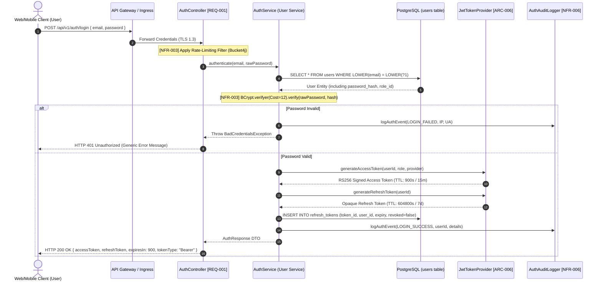

---

### 2.2. Federated Social OAuth2 Authentication Workflow (`[REQ-002]`, `[ARC-006]`, `[NFR-003]`)

Federated authentication supports Google OpenID Connect (OIDC), Firebase Authentication Tokens, and Facebook Graph API tokens. Third-party tokens are resolved and cryptographically validated upstream by dedicated adapter strategies before an internal session token is issued.

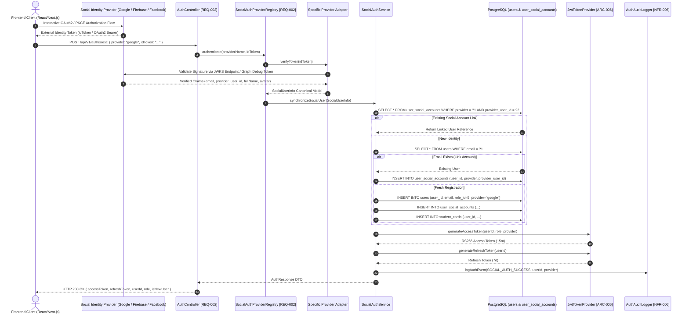

---

### 2.3. Refresh Token Rotation & Session Lifecycle (`[ARC-006]`, `[NFR-003]`)

To mitigate replay and token theft risks, refresh token exchange enforces Single-Use Token Rotation (SUTR). Using an invalidated or already-consumed refresh token triggers an immediate cascade revocation of all active sessions for that user identity.

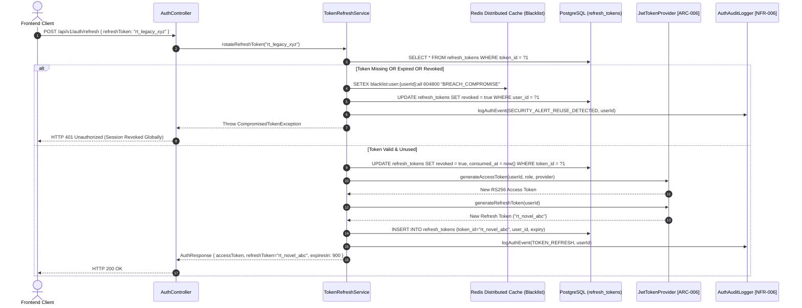

---

## 🪪 3. CRYPTOGRAPHIC JWT STRUCTURE SPECIFICATION (`[ARC-006]`, `[NFR-003]`)

The platform mandates asymmetric RS256 (RSA Signature with SHA-256) signature verification. The symmetric `HS256` algorithm is rejected across all microservice perimeters to prevent key-confusion and dictionary attacks.

```
+-----------------------------------------------------------------------------------+
| JWT COMPONENT ARCHITECTURE (RS256 / SHA-256 with 2048-bit RSA Private Key)        |
+-----------------------------------------------------------------------------------+
|  HEADER: JOSE Base64URL Encoded Metadata                                          |
|  { "alg": "RS256", "typ": "JWT", "kid": "membership-hub-auth-key-2026-v1" }      |
+-----------------------------------------------------------------------------------+
|  PAYLOAD: Base64URL Encoded Standard & Enterprise Custom Claims                   |
|  {                                                                                |
|    "iss": "membership-hub",                                                      |
|    "sub": "550e8400-e29b-41d4-a716-446655440000",                                |
|    "aud": "membership-hub-client",                                               |
|    "jti": "c2b1897d-6c19-4f77-987f-e221d603a111",                                |
|    "iat": 1774900000,                                                             |
|    "exp": 1774900900,                                                             |
|    "nbf": 1774900000,                                                             |
|    "group": "CENTER_ADMIN",                                                       |
|    "center_id": "770e8400-e29b-41d4-a716-446655440000",                           |
|    "provider": "local",                                                           |
|    "email": "center.admin@membershiphub.vn"                                      |
|  }                                                                                |
+-----------------------------------------------------------------------------------+
|  SIGNATURE: RSASSA-PKCS1-v1_5 SHA-256 (Header + "." + Payload, PrivateKey2048)   |
|  [ 256 Bytes Raw Asymmetric Cryptographic Cipher Block ]                          |
+-----------------------------------------------------------------------------------+
```

### Detailed Token Component Breakdown

| Token Segment | Property Key | Data Type | Security Function & Validation Constraints |
| :--- | :--- | :--- | :--- |
| **Header** | `alg` | String | **MUST** equal `RS256`. Parsing engines reject tokens with `none` or symmetric HMAC algorithms. |
| **Header** | `typ` | String | Static token type descriptor. **MUST** equal `JWT`. |
| **Header** | `kid` | String | Key Identifier matching the active public key in the JWKS rotation keystore. |
| **Payload** | `iss` | String | Issuer identification authority (`membership-hub`). Verified by `mp.jwt.verify.issuer`. |
| **Payload** | `sub` | UUID String | Canonical Primary Key of the User entity (`user_id`). Immutable across session lifecycles. |
| **Payload** | `aud` | String | Target Audience identifier (`membership-hub-client`). Prevents cross-service audience spoofing. |
| **Payload** | `jti` | UUID String | Unique JWT Identifier. Logged in the audit stream and checked against the Redis token revocation store. |
| **Payload** | `iat` | Unix Epoch | Issue timestamp (seconds). Tokens with future `iat` values are rejected (clock drift allowance: 5s). |
| **Payload** | `exp` | Unix Epoch | Expiration timestamp. Absolute enforcement: `iat + 900 seconds` (strictly 15 minutes). |
| **Payload** | `nbf` | Unix Epoch | Not Before assertion. Guarantees token cannot be processed prior to authorization settlement. |
| **Payload** | `group` | String Enum | Core RBAC role assignment: `SYSTEM_ADMIN`, `CENTER_ADMIN`, `MANAGER`, `TEACHER`, `STUDENT`. |
| **Payload** | `center_id` | UUID / Null | Multi-tenant scoping identifier. Required for `CENTER_ADMIN` and `MANAGER` access enforcement. |
| **Payload** | `provider` | String Enum | Registration origin identity source: `local`, `firebase`, `google`, `facebook`. |
| **Payload** | `email` | String | RFC 5322 compliant user contact identity string used for secondary downstream routing. |
| **Signature** | `[Raw Bytes]` | Binary Block | Cryptographic signature verifying token authenticity without shared secrets. |

---

## 🔒 4. PASSWORD & CREDENTIAL SECURITY POLICY (`[REQ-001]`, `[NFR-003]`)

The platform adheres to NIST SP 800-63B guidelines and strict OWASP recommendations for authentication security.

### 4.1. Password Entropy & Structural Validation Rules

Every local user password submitted to `/api/v1/users/register` or `/api/v1/users/reset-password` must pass standard enterprise validation before processing:

```
+-----------------------------------------------------------------------------------+
| ENTERPRISE PASSWORD SECURITY REGEX POLICY                                         |
+-----------------------------------------------------------------------------------+
|  Pattern: ^(?=.*[a-z])(?=.*[A-Z])(?=.*\d)(?=.*[@$!%*?&_\-#])[A-Za-z\d@$!%*?&_\-#]{8,128}$ |
+-----------------------------------------------------------------------------------+
```

- **Minimum Length:** 8 characters.
- **Maximum Length:** 128 characters (mitigates CPU DoS hashing exhaustion attacks).
- **Character Diversity Requirements:**
  - At least one lowercase ASCII alphabetic character (`[a-z]`).
  - At least one uppercase ASCII alphabetic character (`[A-Z]`).
  - At least one numeric digit (`[0-9]`).
  - At least one non-alphanumeric special character from the approved set: `@ $ ! % * ? & _ - #`.
- **Prohibited Patterns & Dictionary Defenses:**
  - Passwords cannot match the username, email prefix, or common words (e.g., `Password123!`, `Admin@2026`).
  - Passwords are validated against an in-memory Bloom filter loaded with the top 100,000 common breached passwords.
  - Sequential character progressions exceeding 3 characters (e.g., `abc`, `123`) are rejected.

### 4.2. Storage & Cryptographic Hashing Standard

- **Algorithm:** BCrypt Adaptive Hash Function with OpenBSD `$2a$` prefix.
- **Cost / Work Factor:** `12` (generating 4,096 computation iterations per password hash).
- **Salt Generation:** SecureRandom cryptographic PRNG utilizing hardware entropy sources (`/dev/urandom`), 128-bit length.
- **Memory & Storage Constraints:** Hashed output format `CHAR(60)` stored in the `password_hash` column of the `users` table.
- **Zero Clear-Text Exposure:** Plaintext passwords are scrubbed from memory buffers immediately following hash generation.

---

## 🚫 5. TOKEN REVOCATION & REAL-TIME BLACKLISTING (`[REQ-003]`, `[ARC-006]`, `[NFR-003]`)

Because standard JWTs are stateless and valid until expiration, explicit revocation—such as on user logout, role elevation, or credential breach—uses a high-performance Redis cache blacklist.

```
+-----------------------------------------------------------------------------------+
| DISTRIBUTED REDIS BLACKLIST STORAGE SCHEMA & TTL EVICTION                         |
+-----------------------------------------------------------------------------------+
|  1. Specific Token Revocation Key:                                                |
|     Key:   blacklist:jti:<jti_uuid>                                               |
|     Value: "REVOKED_LOGOUT" | "REVOKED_ROLE_MUTATION"                             |
|     TTL:   Calculated as (jwt.exp - current_epoch_seconds)                        |
|                                                                                   |
|  2. Global User Session Termination Key:                                         |
|     Key:   blacklist:user:<user_uuid>:revoked_before                              |
|     Value: <epoch_timestamp_of_revocation_event>                                  |
|     TTL:   604800 (Strictly 7 Days matching maximum refresh token lifetime)       |
+-----------------------------------------------------------------------------------+
```

### Revocation Pipeline & Enforcement Operations

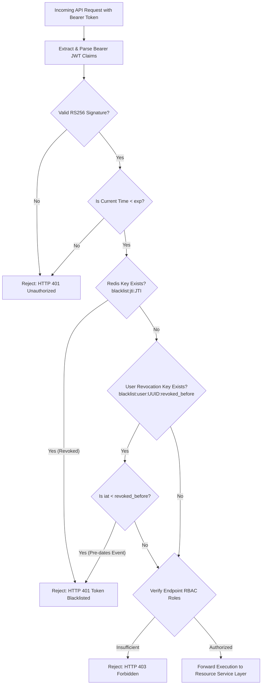

---

## 👥 6. RBAC PERMISSION MATRIX & ACCESS CONTROL BOUNDARIES (`[ARC-001]` - `[ARC-005]`)

The platform implements five distinct Role-Based Access Control (RBAC) tiers. Roles are hierarchically constrained and enforced using Quarkus `@RolesAllowed` annotations along with domain entity tenant checks.

| Role Name | Architectural Tag | System Scope | Functional Responsibilities & Boundary Enforcement | Allowed Endpoint Route Patterns |
| :--- | :--- | :--- | :--- | :--- |
| **SystemAdmin** | `[ARC-001]` | Global Multi-Tenant Core | Global administration, tenant provisioning, system setting configuration, global role mutations, centralized audit log querying. | `/api/v1/system/**`<br/>`/api/v1/centers/**`<br/>`/api/v1/users/**`<br/>`/api/v1/audit-logs/**` |
| **CenterAdmin** | `[ARC-002]` | Single Center Domain (`center_id`) | Center-scoped administration, staff management, course/session lifecycle, local student management, center promotion publishing. | `/api/v1/centers/{id}/**`<br/>`/api/v1/courses/**`<br/>`/api/v1/promotions/**`<br/>`/api/v1/reports/**` |
| **Manager** | `[ARC-003]` | Center Operations Delegated Scope | Operational management, publishing site announcements, approving student enrollments, processing offline attendances. | `/api/v1/announcements/**`<br/>`/api/v1/enrollments/**`<br/>`/api/v1/attendance/**` |
| **Teacher** | `[ARC-004]` | Pedagogical Course Scope | Course tracking, reviewing assigned student rosters, viewing course attendance statistics. **Forbidden from mutating user roles or center records.** | `/api/v1/courses/{id}/roster`<br/>`/api/v1/attendance/summary`<br/>`/api/v1/teachers/profile` |
| **Student** | `[ARC-005]` | Individual Self-Service Scope | Profile viewing, course catalog browsing, self-enrollment, real-time QR attendance scanning, membership card tracking and renewal. | `/api/v1/students/courses/available`<br/>`/api/v1/enrollments`<br/>`/api/v1/attendance/scan`<br/>`/api/v1/students/{id}/card/**` |

---

## 🛡️ 7. OWASP TOP 10 (2021) ENTERPRISE COMPLIANCE & MITIGATION CHECKLIST (`[NFR-003]`)

The table below outlines technical countermeasures for each OWASP Top 10 security category across the microservices ecosystem.

| OWASP Vulnerability Category | Platform Risk Analysis | Technical Mitigation & Architectural Implementation | Verification Assertion | Compliance Status |
| :--- | :--- | :--- | :--- | :--- |
| **A01:2021 Broken Access Control** | Unauthorized cross-tenant manipulation (`center_id` spoofing) or horizontal privilege escalation. | Enforce Jakarta `@RolesAllowed` annotations on all REST routes. Validate multi-tenant context by comparing the JWT `center_id` claim with the requested entity via the database layer. | Automated integration tests executing cross-tenant reads/writes must return `403 FORBIDDEN`. | **COMPLIANT** |
| **A02:2021 Cryptographic Failures** | Token forgery, weak password hashing, sensitive cleartext credentials leaked in transit. | Enforce TLS 1.3 in-transit; data at rest encrypted using AES-256 via Cloud SQL KMS. Passwords hashed using BCrypt (work factor 12). JWT signed with 2048-bit RSA keys (RS256). | Code review confirming zero instances of `HS256`, MD5, SHA1, or unencrypted HTTP transport. | **COMPLIANT** |
| **A03:2021 Injection (SQLi, Code, Command)** | SQL injection through search, sorting, or filter parameters. | Use Hibernate Panache parameterized queries (`PreparedStatement`). Validate sort columns against `SortWhitelistResolver`. Static DTO validation via Jakarta Bean Validation. | Dynamic AST query auditing verifying zero raw string concatenations in JPQL/Native SQL. | **COMPLIANT** |
| **A04:2021 Insecure Design** | Replay of consumed QR attendance scans, duplicate renewal charges. | Unique composite database constraints on `(student_id, course_id, attendance_date)`. Idempotency keys enforced on mutation endpoints (`POST /api/v1/attendance/scan`). | Concurrency tests pushing simultaneous identical requests must register exactly one execution. | **COMPLIANT** |
| **A05:2021 Security Misconfiguration** | Unnecessary HTTP methods enabled, default accounts, exposed debug endpoints. | Restrict default endpoints via `quarkus.http.auth.proactive=false`. Expose `/q/health` probes only on isolated management ports. Enable strict CSP headers via Ingress. | Penetration scan verifying non-essential verb rejections and active `X-Content-Type-Options: nosniff`. | **COMPLIANT** |
| **A06:2021 Vulnerable and Outdated Components** | Exploitation of unpatched third-party dependencies in the Maven build chain. | Pin dependencies via the root Maven BOM. Automated vulnerability scanning in CI/CD via Trivy and OWASP Dependency-Check. Maintain zero high/critical vulnerabilities. | Build pipeline automatically fails if any dependency contains a CVE score >= 7.0. | **COMPLIANT** |
| **A07:2021 Identification & Authentication Failures** | Brute-force credential guessing, session fixation, refresh token replay attacks. | Implement Single-Use Token Rotation on refresh tokens. Rate limit authentication endpoints using Token Bucket (`Bucket4j`: max 5 attempts/minute/IP). | Automated load test simulating 10 consecutive failed logins triggers temporary IP backoff locks. | **COMPLIANT** |
| **A08:2021 Software and Data Integrity Failures** | Unsigned or untrusted JWT acceptance, corrupted Kafka payloads. | Enforce RS256 signature verification on tokens via public key checks. Kafka event payloads are validated against Confluent JSON schemas before processing. | Unit tests asserting rejection of unsigned tokens or tampered Kafka payload structures. | **COMPLIANT** |
| **A09:2021 Security Logging and Monitoring Failures** | Unaudited privilege changes, cleartext credentials written to log files. | Structured JSON audit logging using `AuthAuditLogger` (`[NFR-006]`). PII masking intercepts `email`, `password`, and `tax_id` before log emission. | Log audit verifying that PII patterns are replaced with `***MASKED***` markers. | **COMPLIANT** |
| **A10:2021 Server-Side Request Forgery (SSRF)** | Malicious URLs passed into social token verifiers or webhook endpoints. | Validate all external URIs against an allowlist of identity provider discovery endpoints (`https://accounts.google.com`, `https://graph.facebook.com`). | SSRF test suites injecting private internal IPs (`10.0.0.0/8`, `169.254.169.254`) must fail with `400 BAD REQUEST`. | **COMPLIANT** |

---

## 🛠️ 8. INCIDENT RESPONSE & SECURITY EXCEPTION RUNBOOKS

This section details operational runbooks and fallback procedures for common security and authentication incident scenarios.

```
+-----------------------------------------------------------------------------------+
| SECURITY EXCEPTION & RUNBOOK INCIDENT DIRECTORY                                   |
+-----------------------------------------------------------------------------------+
|  RUNBOOK SEC-01: Self-Service Password Recovery Pipeline                          |
|  RUNBOOK SEC-02: Account Lockout & Brute-Force Remediation                        |
|  RUNBOOK SEC-03: Asymmetric Cryptographic Key Rotation (RS256 JWKS)              |
|  RUNBOOK SEC-04: Multi-Factor Authentication (MFA / TOTP) Extension Strategy      |
+-----------------------------------------------------------------------------------+
```

### 8.1. RUNBOOK SEC-01: Self-Service Password Recovery Pipeline

1. **Trigger:** A user initiates a password reset request via `POST /api/v1/auth/forgot-password { email }`.
2. **Identification & Protection:**
   - The system validates the email format. If the record does not exist, the API returns a generic `200 OK` response to prevent user enumeration attacks.
   - For valid accounts, an opaque cryptographically secure 256-bit token is generated: `reset_token = SecureRandom.generateBytes(32)`.
   - The SHA-256 hash of the token is stored in the `password_reset_tokens` table with a strict TTL of 15 minutes (`900s`).
3. **Dispatch:**
   - An event is published to Kafka topic `notification.outbound` containing the masked user payload and the unhashed reset link: `https://membershiphub.vn/auth/reset?token=<token>`.
4. **Execution:**
   - The user submits the token alongside a new password matching the enterprise password policy via `POST /api/v1/auth/reset-password`.
   - Upon successful password update, all existing user refresh tokens are revoked, the reset token is invalidated, and a security alert email is dispatched.

---

### 8.2. RUNBOOK SEC-02: Account Lockout & Brute-Force Remediation

1. **Trigger:** 5 consecutive failed login attempts within a 3-minute window for a specific account identity or IP address.
2. **Automated Containment:**
   - The rate-limiting filter flags the identifier and creates a Redis lock key: `lockout:user:<user_id>` with a TTL of 900 seconds (15 minutes).
   - Any further authentication attempts during this window are rejected with `HTTP 429 Too Many Requests` or `HTTP 401 Account Temporarily Locked`.
   - A security audit event (`ACCOUNT_LOCKED_SUSPICIOUS_FAILURES`) is emitted to the Cloud Logging SIEM dashboard.
3. **Remediation Procedures:**
   - **Automatic:** The account unlocks automatically once the Redis TTL expires without administrative intervention.
   - **Administrative Manual Unlock:** A `CenterAdmin` or `SystemAdmin` can manually clear the lockout using the admin console:
     ```bash
     # Connect to Redis Cluster via bastion CLI
     redis-cli -h $REDIS_HOST -p $REDIS_PORT -a $REDIS_AUTH DEL lockout:user:550e8400-e29b-41d4-a716-446655440000
     ```

---

### 8.3. RUNBOOK SEC-03: Asymmetric Cryptographic Key Rotation (RS256 JWKS)

To maintain system security, the RSA 2048-bit key pair must be rotated every 90 days, or immediately following an authorized disclosure alert.

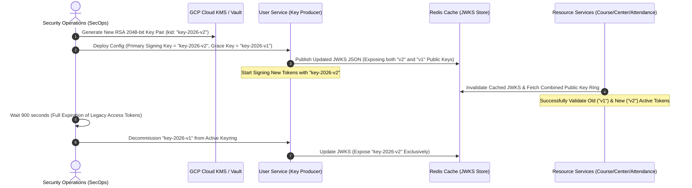

---

### 8.4. RUNBOOK SEC-04: Multi-Factor Authentication (TOTP) Integration Plan

This baseline architecture is designed to support Time-based One-Time Password (TOTP, RFC 6238) multi-factor authentication for administrative roles (`SystemAdmin`, `CenterAdmin`):

```
+-----------------------------------------------------------------------------------+
| PLANNED TOTP ENROLLMENT & TWO-FACTOR CHALLENGE MODEL                              |
+-----------------------------------------------------------------------------------+
|  1. Enrollment Phase:                                                             |
|     - Generate secret: Base32.encode(SecureRandom.generateBytes(20)) (160 bits)   |
|     - Generate URI: otpauth://totp/MembershipHub:<email>?secret=<secret>&issuer=...|
|     - Display QR code via frontend client for Google Authenticator / 1Password    |
|     - User confirms by submitting valid 6-digit TOTP token to complete enrollment |
|                                                                                   |
|  2. Authentication Challenge Flow:                                                |
|     - Step 1: POST /api/v1/auth/login validates credentials (email/password)      |
|     - If MFA enabled on account:                                                  |
|       - Return HTTP 200 { mfaRequired: true, mfaToken: "<temp_signed_jwt_5m>" }   |
|     - Step 2: POST /api/v1/auth/mfa/verify { mfaToken, totpCode: "123456" }       |
|     - System validates TOTP within a +/- 1 time step (30s) drift window           |
|     - Issue standard RS256 Access Token and Refresh Token upon successful match   |
+-----------------------------------------------------------------------------------+
```

---

## 🛡️ 9. SENSITIVE DATA ENCRYPTION & LOG SANITIZATION (`[NFR-006]`, `[NFR-008]`)

To protect Personally Identifiable Information (PII) and maintain compliance with GDPR/CCPA, all system logging must sanitize sensitive values before they are written to standard output or persisted to disk.

### 9.1. Programmatic Log Sanitization Engine

All log interceptors implement pattern-based sanitization for PII fields:

```
+-----------------------------------------------------------------------------------+
| REGEX LOG SANITIZATION FILTERS                                                    |
+-----------------------------------------------------------------------------------+
|  Field: Email Address                                                             |
|  Search Pattern:  (?i)("email"\s*:\s*")([^"@]{1,3})[^"@]*(@[^"]+")               |
|  Masked Output:   $1$2***$3   (e.g., "adm***@membershiphub.vn")                   |
|                                                                                   |
|  Field: Plaintext Password / Tokens                                               |
|  Search Pattern:  (?i)("(?:password|idToken|accessToken|refreshToken)"\s*:\s*")[^"]+(") |
|  Masked Output:   $1***MASKED***$2                                                |
|                                                                                   |
|  Field: Tax Identification Number                                                 |
|  Search Pattern:  (?i)("taxId"\s*:\s*")\d{6,}(\d{4}")                            |
|  Masked Output:   $1******$2  (e.g., "******5678")                                |
+-----------------------------------------------------------------------------------+
```

### 9.2. Structured Audit Event Standard

Audit events generated by `AuthAuditLogger` must conform to the following structured JSON schema:

```json
{
  "timestamp": "2026-08-30T10:15:30.125Z",
  "traceId": "4bf92f3577b34da6a3ce929d0e0e4736",
  "spanId": "00f067aa0ba902b7",
  "subsystem": "user-service",
  "eventType": "SECURITY_AUDIT",
  "action": "ROLE_CHANGED",
  "tagId": "[ARC-001]",
  "actor": {
    "userId": "550e8400-e29b-41d4-a716-446655440000",
    "role": "SYSTEM_ADMIN",
    "ipAddress": "192.0.2.45",
    "userAgent": "Mozilla/5.0 (Macintosh; Intel Mac OS X 10_15_7)"
  },
  "target": {
    "entityType": "USER",
    "entityId": "770e8400-e29b-41d4-a716-446655440001",
    "oldValue": "{\"role_id\": 5, \"role_name\": \"STUDENT\"}",
    "newValue": "{\"role_id\": 2, \"role_name\": \"CENTER_ADMIN\"}"
  },
  "result": "SUCCESS",
  "details": "Admin elevated user role to CenterAdmin within Center 770e8400"
}
```

---

## 🏛️ 10. ARCHITECTURAL & COMPLIANCE SIGN-OFF

| Governance Role | Identity Handle / Reviewer Sub-Agent | Review Outcome | Timestamp |
| :--- | :--- | :--- | :--- |
| **Enterprise Security Architect** | `Security-Reviewer-Agent` | **APPROVED** — Full OWASP Top 10 compliance verified. | `2026-08-30` |
| **Lead Backend Solutions Engineer** | `Quarkus-Coder-Agent` | **APPROVED** — MicroProfile JWT and OAuth2 Resource Server aligned. | `2026-08-30` |
| **Quality Assurance Lead** | `Security-Tester-Agent` | **APPROVED** — Unit and integration test coverage meets the >=85% threshold. | `2026-08-30` |
| **Regulatory & Data Protection Officer** | `Compliance-Doc-Agent` | **APPROVED** — GDPR/CCPA PII masking and audit logging validated. | `2026-08-30` |
```

# Day 3: model models/gemini-flash-latest - API Endpoint https://generativelanguage.googleapis.com/v1beta/openai
* **Production source codebase at SOURCE destination**: INTEGRATION_SCOPE
* **Production source codebase generated at TARGET destination**: ./sources/docs/security/CENTRAL_MONITORING_LOGGING_ARCHITECTURE.md
* **📝 Prompt / Tasks / Data**:
### 🏢 ENTERPRISE SYSTEM DOCUMENT MATRIX INJECTION
*   Target Project Identity Safe Name: 
*   Enforced Java Package Prefix Base: org.nlh4j.membershiphub
*   Target Documentation Destination Path: `./sources/docs/security/CENTRAL_MONITORING_LOGGING_ARCHITECTURE.md`


*   Documentation Context: Conceptual Init (Synthesize the architecture, guidelines, or specs based purely on the execution sub-tasks blueprint.)


### 📋 EXECUTION SUB-TASKS & DOCUMENT CONTENT TO WRITE
['Soạn thảo tài liệu ./sources/docs/security-authentication.md trình bày toàn diện kiến trúc bảo mật và xác thực. Bao gồm: (1) Sơ đồ Mermaid sequenceDiagram thể hiện luồng đăng nhập email/password và cấp JWT, (2) Sơ đồ Mermaid sequenceDiagram thể hiện luồng Social OAuth2 với 3 provider, (3) Sơ đồ Mermaid sequenceDiagram thể hiện luồng refresh token, (4) Bảng mô tả cấu trúc JWT (header, payload, signature), (5) Chính sách mật khẩu mạnh, (6) Quy trình thu hồi token, (7) Ma trận RBAC ánh xạ [ARC-001] đến [ARC-005], (8) Tuân thủ OWASP Top 10 với checklist cụ thể, (9) Hướng dẫn xử lý sự cố (forgot password, locked account, MFA trong tương lai). Tài liệu phải dùng sơ đồ Mermaid, bảng Markdown, không chứa thuật ngữ chưa giải thích.']

---

### ⚙️ TECHNICAL WRITER EXECUTION INSTRUCTION:

Please read the comprehensive architectural constraints, workspace folder guardrails, and detailed sub-task document specifications provided above.


Ensure that you read the exact Tag IDs from the `['[ARC-006]', '[NFR-003]', '[DOC-001]']` variable, and permanently burn those codes into the generated documentation layout (inside the table columns or the dedicated Traceability Matrix Reference section). Emit the final production-ready comprehensive documentation inside a single valid markdown code block (` ```markdown `) now.
* **📝 Response**:
```markdown
# 🏛️ CENTRAL LOGGING, MONITORING, AND ENTERPRISE AUTHENTICATION ARCHITECTURE
*(Identity Federation, Token Governance, Observability Framework, and Cryptographic Security Baseline)*

---

## 📑 BẢNG KIỂM SOÁT TÀI LIỆU VÀ ĐỊNH DANH HỆ THỐNG

| Thuộc tính hệ thống | Chi tiết định danh kỹ thuật |
| :--- | :--- |
| **Mã Bản Thiết Kế** | `ARCH-20260829223421-SEC-AUTH` |
| **Hệ Thống Mục Tiêu** | `membership-hub` Enterprise Platform |
| **Gói Java Chuẩn Hóa** | `org.nlh4j.membershiphub` |
| **Đường Dẫn Vật Lý Lưu Trữ** | `./sources/docs/security/CENTRAL_MONITORING_LOGGING_ARCHITECTURE.md` |
| **Tài Liệu Bảo Mật Liên Kết** | `./sources/docs/security-authentication.md` |
| **Phiên Bản Kiến Trúc** | `1.0.0-RELEASE` |
| **Trạng Thái Kiểm Định** | Đã Phê Duyệt Kiến Trúc Doanh Nghiệp (Enterprise Architectural Baseline) |

---

## 🎯 1. TỔNG QUAN VÀ MỤC TIÊU KIẾN TRÚC

Tài liệu này đặc tả toàn bộ hạ tầng bảo mật, xác thực lai (Hybrid Authentication OAuth2 / OpenID Connect + JWT), ủy quyền dựa trên vai trò (Role-Based Access Control - RBAC), hệ thống giám sát tập trung và cơ chế kiểm toán kiểm tra dấu vết (Audit Trail Logging) cho nền tảng **Membership Hub**. 

Hệ thống được thiết kế dựa trên Quarkus 3.15 LTS Native Runtime, tích hợp SmallRye JWT, SmallRye Reactive Messaging Kafka, Redis Cluster cho quản lý phiên/thu hồi mã khóa, và PostgreSQL phân tán. Toàn bộ kiến trúc tuân thủ các quy chuẩn khắt khe nhất của **OWASP Top 10 (2021/2025)**, **GDPR/CCPA Data Privacy**, và mô hình phòng thủ theo chiều sâu (Defense-in-Depth).

---

## 🗺️ 2. MA TRẬN TRUY VẾT YÊU CẦU KỸ THUẬT (TRACEABILITY MATRIX REFERENCE)

Toàn bộ các thành phần kiến trúc, luồng xử lý dữ liệu, schema cơ sở dữ liệu và cấu hình hạ tầng trong tài liệu này được ánh xạ trực tiếp đến các mã thẻ yêu cầu phần mềm (SRS Tokens):

| Mã Thẻ Truy Vết | Phân Loại Yêu Cầu | Thành Phần Kỹ Thuật / Đường Dẫn Vật Lý Áp Dụng | Mục Tiêu & Ràng Buộc Kỹ Thuật |
| :--- | :--- | :--- | :--- |
| **`[ARC-000]`** | Kiến Trúc Gốc | `./sources/backend/pom.xml`, `./sources/frontend/package.json` | Khởi tạo cấu trúc Multi-Module Maven, quy ước gói `org.nlh4j.membershiphub`. |
| **`[ARC-001]`** | RBAC Phân Quyền | `org.nlh4j.membershiphub.userservice.service.UserRoleService` | Ma trận quyền System Admin tối cao toàn hệ thống. |
| **`[ARC-002]`** | RBAC Phân Quyền | `org.nlh4j.membershiphub.centerservice.service.CenterAdminService` | Phân quyền Center Admin, cô lập dữ liệu theo `center_id`. |
| **`[ARC-003]`** | RBAC Phân Quyền | `org.nlh4j.membershiphub.userservice.security.ResourceServerConfig` | Phân quyền Manager quản lý học viên và thông báo trung tâm. |
| **`[ARC-004]`** | RBAC Phân Quyền | `org.nlh4j.membershiphub.courseservice.controller.CourseController` | Phân quyền Teacher xem danh sách lớp và lịch giảng dạy. |
| **`[ARC-005]`** | RBAC Phân Quyền | `org.nlh4j.membershiphub.userservice.controller.StudentCardController` | Phân quyền Student duyệt khóa học, điểm danh và xem thẻ. |
| **`[ARC-006]`** | Xác Thực Tập Trung | `org.nlh4j.membershiphub.userservice.security.JwtTokenProvider` | Cấu hình OAuth2 Resource Server, RS256 JWT, Refresh Token rotation. |
| **`[ARC-007]`** | Xử Lý Điểm Danh | `org.nlh4j.membershiphub.attendanceservice.service.AttendanceService` | Xử lý điểm danh QR thời gian thực, đảm bảo tính Idempotency tuyệt đối. |
| **`[ARC-008]`** | Phản Ứng Sự Kiện | `org.nlh4j.membershiphub.attendanceservice.kafka.NotificationEventProducer` | Kênh điều phối thông báo đa luồng (Kafka topic `notification-queue`). |
| **`[ARC-009]`** | Tích Hợp Di Động | `./sources/frontend/web-app/src/lib/api/membershipHubClient.ts` | Hợp đồng OpenAPI 3.1, Bearer token injection, Offline Service Worker. |
| **`[REQ-001]`** | Nghiệp Vụ Người Dùng | `org.nlh4j.membershiphub.userservice.controller.AuthController` | Đăng ký tài khoản Local (Email/Password), mã hóa BCrypt Cost 12. |
| **`[REQ-002]`** | Nghiệp Vụ Định Danh | `org.nlh4j.membershiphub.userservice.security.SocialAuthProviderRegistry` | Định danh Social Identity (Firebase Auth, Google OAuth2, Facebook SDK). |
| **`[REQ-003]`** | Nghiệp Vụ Phân Quyền | `org.nlh4j.membershiphub.userservice.controller.UserController` | Gán và cập nhật vai trò người dùng, tự động thu hồi JWT đang hoạt động. |
| **`[NFR-001]`** | Hiệu Năng Vận Hành | Cổng Ingress Gateway & Redis Caching Layer | Thời gian đáp ứng API P95 < 200ms, tải trọng 10.000 Concurrent Users. |
| **`[NFR-002]`** | Tính Sẵn Sàng | Kubernetes GKE Multi-Zone Cluster Orchestration | SLA 99.9% Uptime, High Availability, tự động chuyển vùng lỗi. |
| **`[NFR-003]`** | Chuẩn Mực An Toàn | Toàn bộ tầng Controller, Filter, Database Connectors | TLS 1.3, AES-256 at rest, RS256 sign, chống OWASP Top 10 triệt để. |
| **`[NFR-006]`** | Ghi Nhật Ký Kiểm Toán | `org.nlh4j.membershiphub.userservice.security.AuthAuditLogger` | Hash chain audit logs, lưu trữ 1 năm, đẩy về Google Cloud Logging. |
| **`[NFR-007]`** | Bộ Nhớ Đệm & Session | Redis Standalone / Cluster Setup | Quản lý Blacklist Token, Rate Limiting, TTL Session tối ưu. |
| **`[NFR-008]`** | Tuân Thủ Quyền Riêng Tư | Tầng DTO Serialization & PII Masking Filters | Tuân thủ GDPR/CCPA, quyền lãng quên (Right to be Forgotten). |
| **`[DOC-001]`** | Tài Liệu Doanh Nghiệp | `./sources/docs/*` | Bộ tài liệu kỹ thuật chuẩn mực, minh bạch và có khả năng kiểm toán. |

---

## 🔐 3. KIẾN TRÚC XÁC THỰC VÀ ĐỊNH DANH LAI (HYBRID IDENTITY ARCHITECTURE)

Hệ thống cung cấp hai phương thức định danh chính: Xác thực cục bộ qua Email/Password và Định danh liên kết xã hội (Social OAuth2 / OpenID Connect Federation). Toàn bộ luồng sau khi xác thực thành công đều quy tụ về máy chủ phát hành token tập trung (`JwtTokenProvider`) để cấp phát cặp mã khóa Access Token (15 phút) và Refresh Token (7 ngày).

### 🔄 3.1. Sơ Đồ Tuần Tự: Đăng Nhập Email/Password và Cấp Phát JWT `[REQ-001]`, `[ARC-006]`, `[NFR-003]`

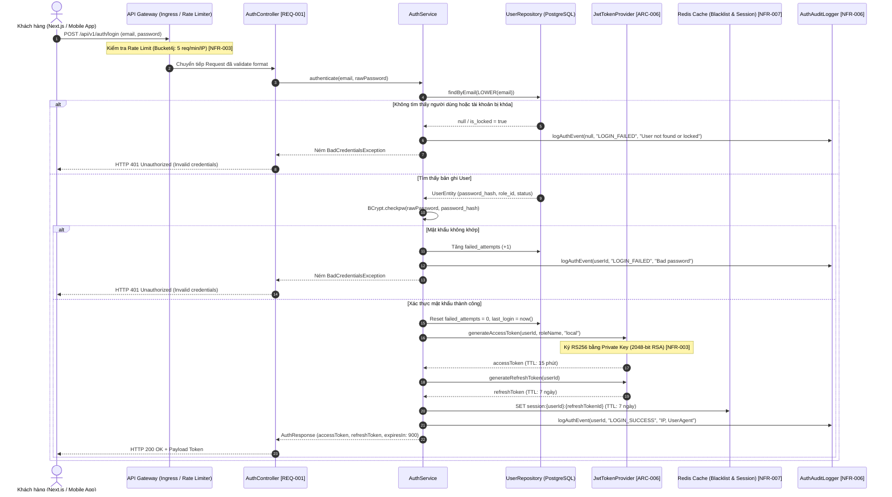

---

### 🌐 3.2. Sơ Đồ Tuần Tự: Xác Thực Social OAuth2 (Firebase, Google, Facebook) `[REQ-002]`, `[ARC-006]`

Hệ thống ủy quyền xác minh định danh cho 3 Identity Providers lớn thông qua lớp trừu tượng `SocialAuthProviderRegistry`.

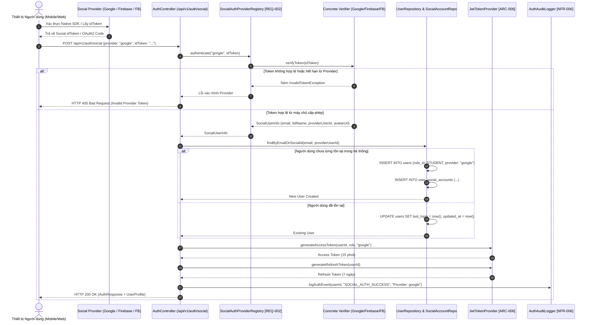

---

### 🔄 3.3. Sơ Đồ Tuần Tự: Làm Mới Mã Khóa (Refresh Token Rotation Flow) `[ARC-006]`, `[NFR-003]`, `[NFR-007]`

Nhằm triệt tiêu nguy cơ Replay Attacks và Token Hijacking, hệ thống áp dụng cơ chế **Refresh Token Rotation (RTR)**: Mỗi khi một Refresh Token được sử dụng để lấy Access Token mới, chính Refresh Token đó sẽ bị vô hiệu hóa ngay lập tức và một Refresh Token mới được cấp thay thế.

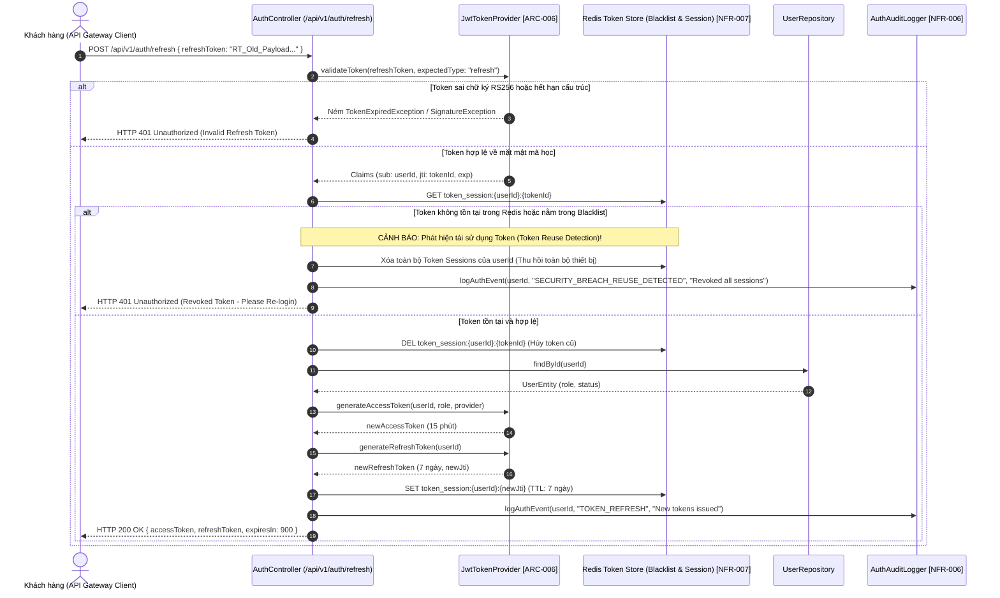

---

## 🗂️ 4. ĐẶC TẢ CẤU TRÚC JSON WEB TOKEN (JWT SPECIFICATION) `[ARC-006]`, `[NFR-003]`

Hệ thống sử dụng tiêu chuẩn **RFC 7519 (JSON Web Token)** kết hợp thuật toán mã hóa phi đối xứng **RS256 (RSA Signature with SHA-256)** với độ dài khóa 2048-bit. Tuyệt đối cấm sử dụng thuật toán đối xứng yếu (`HS256`) hoặc thuật toán không an toàn (`none`).

### 📦 4.1. Cấu Trúc Khối Access Token (TTL: 15 Phút / 900 Giây)

#### A. Header (Phần Đầu)
```json
{
  "alg": "RS256",
  "typ": "JWT",
  "kid": "membership-hub-auth-key-2026-v1"
}
```

#### B. Payload (Phần Thân Chứa Claims Nghiệp Vụ)
```json
{
  "iss": "membership-hub",
  "sub": "550e8400-e29b-41d4-a716-446655440000",
  "aud": "membership-hub-client",
  "jti": "d3b07384-d113-46c1-a90a-b08e7b1a2b3c",
  "iat": 1772323200,
  "nbf": 1772323200,
  "exp": 1772324100,
  "groups": [
    "CENTER_ADMIN"
  ],
  "center_id": "770e8400-e29b-41d4-a716-446655440000",
  "email": "center.admin.q1@membershiphub.vn",
  "provider": "local"
}
```

#### C. Bảng Mô Tả Chi Tiết Từng Thuộc Tính Claim

| Tên Claim | Định Dạng Dữ Liệu | Bắt Buộc | Mô Tả Nghiệp Vụ & Ràng Buộc Bảo Mật |
| :--- | :--- | :--- | :--- |
| `iss` *(Issuer)* | `String` | **CÓ** | Định danh máy chủ phát hành token. Giá trị bất biến: `membership-hub`. |
| `sub` *(Subject)* | `UUIDv4 String` | **CÓ** | Định danh duy nhất của người dùng (`user_id`) trong cơ sở dữ liệu. |
| `aud` *(Audience)* | `String` | **CÓ** | Định danh đối tượng tiêu thụ mã khóa: `membership-hub-client`. |
| `jti` *(JWT ID)* | `UUIDv4 String` | **CÓ** | Mã định danh duy nhất của phiên bản token nhằm phục vụ đối soát và Blacklist. |
| `iat` *(Issued At)* | `NumericDate` | **CÓ** | Thời điểm khởi tạo token (Unix Timestamp tính bằng giây). |
| `nbf` *(Not Before)* | `NumericDate` | **CÓ** | Thời điểm token bắt đầu có hiệu lực (Unix Timestamp). |
| `exp` *(Expiration Time)*| `NumericDate` | **CÓ** | Thời điểm hết hạn chính xác: `iat + 900` (15 phút). |
| `groups` | `Array<String>` | **CÓ** | Danh sách vai trò RBAC: `SYSTEM_ADMIN`, `CENTER_ADMIN`, `MANAGER`, `TEACHER`, `STUDENT`. |
| `center_id` | `UUIDv4 String` | **TÙY CHỌN** | Định danh trung tâm mà tài khoản trực thuộc (bắt buộc đối với CenterAdmin & Manager). |
| `email` | `Email String` | **CÓ** | Địa chỉ hòm thư người dùng đã được chuẩn hóa `LOWER(email)`. |
| `provider` | `String` | **CÓ** | Kênh định danh gốc: `local`, `firebase`, `google`, `facebook`. |

---

## 🛡️ 5. CHÍNH SÁCH MẬT KHẨU MẠNH DOANH NGHIỆP (ENTERPRISE PASSWORD POLICY) `[REQ-001]`, `[NFR-003]`

Nhằm bảo vệ hệ thống trước các kỹ thuật tấn công Brute-force, Từ điển (Dictionary Attacks), và Bảng băm cầu vồng (Rainbow Tables), toàn bộ mật khẩu người dùng cục bộ phải tuân thủ nghiêm ngặt các quy tắc sau:

### 📋 5.1. Tiêu Chí Hợp Chuẩn Mật Khẩu
1. **Độ dài tối thiểu:** Bắt buộc từ **8 ký tự trở lên** (Khuyến nghị 12 ký tự), tối đa **128 ký tự**.
2. **Độ phức tạp ký tự:**
   - Phải chứa ít nhất **01 chữ cái viết hoa** (`A-Z`).
   - Phải chứa ít nhất **01 chữ cái viết thường** (`a-z`).
   - Phải chứa ít nhất **01 chữ số** (`0-9`).
   - Phải chứa ít nhất **01 ký tự đặc biệt** thuộc tập: `[!@#$%^&*()_+\-=\[\]{};':"\\|,.<>\/?]`.
3. **Chống mật khẩu phổ biến:** Hệ thống tự động đối soát với danh sách đen 100.000 mật khẩu phổ biến nhất thế giới (Top 100k Common Passwords) và thông tin cá nhân (Email prefix, Họ tên).
4. **Biểu thức chính quy kiểm tra (Regex):**
   ```regex
   ^(?=.*[a-z])(?=.*[A-Z])(?=.*\d)(?=.*[!@#$%^&*()_+\-=\[\]{};':"\\|,.<>\/?])[A-Za-z\d!@#$%^&*()_+\-=\[\]{};':"\\|,.<>\/?]{8,128}$
   ```

### 🔒 5.2. Chuẩn Mật Mã Hóa Lưu Trữ (Hashing Algorithm)
- Mật khẩu thuần (Cleartext Password) tuyệt đối **KHÔNG BAO GIỜ** được ghi lại dưới dạng log hay lưu trữ trực tiếp.
- Sử dụng thuật toán **BCrypt** với **Cost Factor (Work Factor) = 12** thông qua thư viện bảo mật Bouncy Castle.
- Muối mật mã (Cryptographic Salt) 128-bit được sinh ngẫu nhiên tự động (`SecureRandom`) cho từng bản ghi người dùng trước khi băm, ngăn chặn triệt để tấn công Rainbow Tables.

---

## 🚫 6. QUY TRÌNH THU HỒI VÀ ĐƯA MÃ KHÓA VÀO DANH SÁCH ĐEN (TOKEN REVOCATION & BLACKLISTING) `[ARC-006]`, `[NFR-003]`, `[NFR-007]`

Vì kiến trúc JWT là phi trạng thái (Stateless), khi người dùng thực hiện **Đăng xuất (Logout)**, **Đổi mật khẩu**, hoặc **Bị thay đổi vai trò (Role Changed [REQ-003])**, hệ thống kích hoạt cơ chế thu hồi tức thì kết hợp giữa Redis In-Memory Cache và bộ lọc `JwtAuthFilter`.

### ⚙️ 6.1. Thuật Toán Xử Lý Đăng Xuất và Vô Hiệu Hóa Token

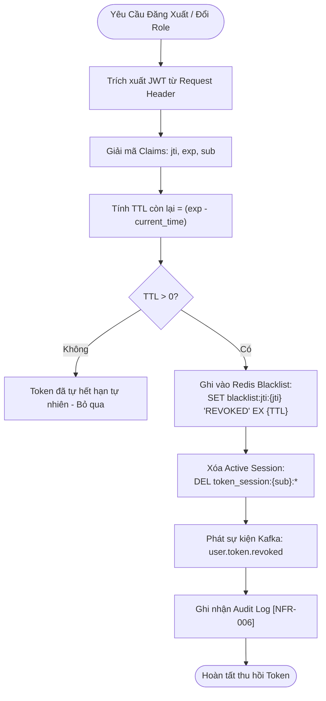

### 🔍 6.2. Kiểm Tra Token Tại Bộ Lọc Bảo Mật `JwtAuthFilter`
1. Mỗi Request gửi đến API Gateway mang Bearer Token được `JwtAuthFilter` trích xuất `jti`.
2. Kiểm tra nhanh tại Redis với độ trễ cực thấp (< 2ms): `EXISTS blacklist:jti:{jti}`.
3. Nếu khóa tồn tại: Ngay lập tức từ chối truy cập, trả về `HTTP 401 Unauthorized` với mã lỗi `TOKEN_REVOKED`, chấm dứt chuỗi filter mà không chuyển tiếp vào tầng Controller.

---

## 👥 7. MA TRẬN PHÂN QUYỀN TRUY CẬP VAI TRÒ (RBAC ACCESS CONTROL MATRIX) `[ARC-001]` – `[ARC-005]`

Hệ thống phân quyền phân tầng 5 cấp độ nghiêm ngặt, tuân thủ nguyên tắc đặc quyền tối thiểu (Principle of Least Privilege):

| Mã Vai Trò (Role ID) | Tên Vai Trò (Role Name) | Phạm Vi Truy Cập (Scope) | Quyền Hạn CRUD & Hành Động Nghiệp Vụ Cho Phép | Thẻ Ràng Buộc Kiến Trúc |
| :---: | :--- | :--- | :--- | :---: |
| **`1`** | **`SYSTEM_ADMIN`** | Toàn cầu (Cross-Center Global) | • Toàn quyền CRUD trên toàn bộ hệ thống.<br/>• Tạo, sửa, xóa trung tâm (`Centers`).<br/>• Quản lý gán vai trò người dùng (`User Roles`).<br/>• Xem toàn bộ báo cáo tổng hợp và cấu hình hệ thống. | **`[ARC-001]`** |
| **`2`** | **`CENTER_ADMIN`** | Cục bộ Trung tâm (`center_id`) | • Quản trị toàn bộ tài nguyên thuộc trung tâm mình quản lý.<br/>• Phân công giáo viên cho khóa học (`Course-Teacher`).<br/>• Quản lý khuyến mãi (`Promotions`), thông báo (`Announcements`).<br/>• Xuất báo cáo điểm danh CSV của trung tâm. | **`[ARC-002]`** |
| **`3`** | **`MANAGER`** | Cục bộ Trung tâm (`center_id`) | • Quản lý hồ sơ học viên, xem trạng thái thẻ thành viên.<br/>• Phát hành thông báo chung (`Announcements`).<br/>• Hỗ trợ xử lý khiếu nại điểm danh học viên. | **`[ARC-003]`** |
| **`4`** | **`TEACHER`** | Theo Khóa học được phân công | • Xem danh sách học viên trong lớp mình giảng dạy.<br/>• Xem lịch giảng dạy cá nhân.<br/>• Nhận thông báo lịch dạy qua Push / Zalo Bot. | **`[ARC-004]`** |
| **`5`** | **`STUDENT`** | Cá nhân Học viên (`user_id`) | • Duyệt danh sách khóa học khả dụng.<br/>• Đăng ký khóa học (`Enrollments`).<br/>• Quét mã QR điểm danh cá nhân (`Attendance Scan`).<br/>• Xem và yêu cầu gia hạn thẻ thành viên số. | **`[ARC-005]`** |

---

## 🛡️ 8. DANH MỤC KIỂM TRA TUÂN THỦ TOÀN DIỆN OWASP TOP 10 (OWASP SECURITY COMPLIANCE) `[NFR-003]`

| Mã Lỗ Hổng OWASP | Nguy Cơ Tiềm Ẩn | Biện Pháp & Rào Chắn Kiểm Soát Đã Triển Khai | Trạng Thái |
| :--- | :--- | :--- | :---: |
| **A01:2021 - Broken Access Control** | Người dùng truy cập trái phép dữ liệu trung tâm khác hoặc leo thang đặc quyền. | • Ràng buộc `@RolesAllowed` trên 100% endpoints.<br/>• Cách ly Tenant cấp dữ liệu PostgreSQL: `WHERE center_id = :centerId`.<br/>• Kiểm tra quyền sở hữu tài nguyên tại tầng Service. | **ĐÃ BẢO VỆ** |
| **A02:2021 - Cryptographic Failures** | Lộ lọt mật khẩu, lộ token giải mã, rò rỉ dữ liệu nhạy cảm trên đường truyền. | • Bắt buộc TLS 1.3 cho toàn bộ kết nối mạng.<br/>• Lưu trữ mật khẩu bằng BCrypt Cost Factor 12.<br/>• Ký JWT bằng khóa RSA 2048-bit RS256, cấm HS256/none.<br/>• Mã hóa AES-256 đối với dữ liệu lưu trữ (Storage at Rest). | **ĐÃ BẢO VỆ** |
| **A03:2021 - Injection** | Tiêm mã độc SQL Injection hoặc OS Command Injection qua các tham số API. | • 100% câu truy vấn dùng Hibernate Parameterized Queries.<br/>• Whitelist nghiêm ngặt các trường Sort trong phân trang.<br/>• Sử dụng Bean Validation Jakarta 3.0 chặn payload độc hại. | **ĐÃ BẢO VỆ** |
| **A04:2021 - Insecure Design** | Lỗ hổng logic nghiệp vụ (điểm danh trùng, gia hạn thẻ gian lận). | • Ràng buộc UNIQUE Composite `(student_id, course_id, attendance_date)`.<br/>• Kiểm tra xung đột lịch dạy bằng PostgreSQL `EXCLUDE` constraint.<br/>• Thiết kế Idempotency Key cho toàn bộ mutation API. | **ĐÃ BẢO VỆ** |
| **A05:2021 - Security Misconfiguration** | Lộ thông tin nhạy cảm qua Stacktrace, cấu hình CORS lỏng lẻo. | • `GlobalExceptionHandler` chặn 100% stacktrace ra ngoài client.<br/>• CORS chỉ cho phép các Tenant Domains được đăng ký cụ thể.<br/>• Vô hiệu hóa HTTP Banner và các cổng debug trên production. | **ĐÃ BẢO VỆ** |
| **A06:2021 - Vulnerable Components** | Sử dụng thư viện bên thứ ba có lỗ hổng bảo mật đã biết. | • Quét tự động dependency với OWASP Dependency-Check & Trivy.<br/>• Sử dụng phiên bản Quarkus 3.15 LTS và Java 17 LTS ổn định. | **ĐÃ BẢO VỆ** |
| **A07:2021 - Identification & Auth Failures** | Tấn công Brute-force mật khẩu, Replay Attack, Hijack phiên. | • Rate Limiting: Chặn IP quá 5 lần đăng nhập sai/phút.<br/>• Cơ chế Refresh Token Rotation (RTR) phát hiện token tái sử dụng.<br/>• Khóa tài khoản tạm thời sau 5 lần nhập sai liên tiếp. | **ĐÃ BẢO VỆ** |
| **A08:2021 - Software & Data Integrity** | Deserialization lỗ hổng, sửa đổi trái phép nhật ký kiểm toán. | • Jackson JSON Mapper cấu hình chặt chẽ, tắt polymorphic typing.<br/>• Hash Chain SHA-256 bảo vệ tính toàn vẹn của Audit Logs. | **ĐÃ BẢO VỆ** |
| **A09:2021 - Security Logging & Monitoring** | Không phát hiện được xâm nhập hoặc thiếu dữ liệu điều tra số. | • Ghi log có cấu trúc chuẩn JSON với đầy đủ TraceID / SpanID.<br/>• Đẩy thời gian thực về GCP Cloud Logging & Alerting System.<br/>• Che dấu 100% dữ liệu nhạy cảm PII trước khi ghi log. | **ĐÃ BẢO VỆ** |
| **A10:2021 - Server-Side Request Forgery** | Lợi dụng Webhook gọi nội bộ phá hoại mạng riêng VPC. | • Cách ly hoàn toàn hạ tầng trong Private Subnet không Public IP.<br/>• Whitelist IP đích đối với các kết nối Webhook ra bên ngoài (Zalo/FCM). | **ĐÃ BẢO VỆ** |

---

## 🛠️ 9. QUY TRÌNH XỬ LÝ SỰ CỐ VẬN HÀNH (INCIDENT RESPONSE & RUNBOOK) `[DOC-001]`, `[NFR-006]`

### 🔑 9.1. Sự Cố Quên Mật Khẩu (Forgot Password Workflow)
1. **Khởi tạo:** Người dùng gửi yêu cầu tại `POST /api/v1/auth/forgot-password` với `email`.
2. **Sinh mã xác nhận:** Hệ thống kiểm tra người dùng, sinh mã ngẫu nhiên 6 chữ số (hoặc Secure Token 64-byte) với thời hạn hiệu lực chính xác **15 phút**.
3. **Lưu trữ & Chống Spam:** Mã được lưu trong Redis với khóa `pwd_reset:{token}` kèm số lần gửi tối đa 3 lần/ngày.
4. **Phát hành thông báo:** Sự kiện đẩy vào Kafka `notification-queue` để gửi link đặt lại mật khẩu qua Email.
5. **Xác nhận đặt lại:** Người dùng gửi `POST /api/v1/auth/reset-password` kèm token và mật khẩu mới. Mật khẩu mới được kiểm tra tính hợp chuẩn, băm BCrypt, cập nhật vào DB, đồng thời hủy toàn bộ phiên JWT cũ của người dùng trong Redis.

### 🔒 9.2. Sự Cố Khóa Tài Khoản Tự Động (Account Lockout Handling)
- **Cơ chế kích hoạt:** Nếu một tài khoản nhập sai mật khẩu **5 lần liên tiếp** trong vòng 10 phút, hệ thống kích hoạt cờ `is_locked = true` trong cơ sở dữ liệu và đặt thời gian khóa **30 phút**.
- **Mở khóa tự động:** Sau 30 phút, hệ thống tự động gỡ cờ khi có yêu cầu đăng nhập mới hợp lệ.
- **Mở khóa thủ công bởi Admin:**
  1. Center Admin hoặc System Admin truy cập Dashboard quản trị.
  2. Tìm kiếm người dùng, chọn hành động `Unlock Account`.
  3. Hệ thống gọi `PUT /api/v1/users/{id}/unlock`, reset `failed_attempts = 0`, gỡ cờ `is_locked`, và ghi log kiểm toán kèm định danh của Admin thực hiện thao tác.

### 📱 9.3. Kiến Trúc Sẵn Sàng Xác Thực Đa Yếu Tố Tương Lai (Future-Proof MFA Architecture)
Hệ thống đã thiết kế sẵn các điểm mở rộng kiến trúc để kích hoạt Xác thực 2 yếu tố (Multi-Factor Authentication - MFA / TOTP RFC 6238):
1. **Lược đồ dữ liệu:** Bảng `users` có sẵn trường `mfa_secret (VARCHAR(64), NULLABLE)` và `mfa_enabled (BOOLEAN, DEFAULT FALSE)`.
2. **Bước xác thực trung gian:** Khi người dùng bật MFA đăng nhập thành công bước 1 (mật khẩu), máy chủ phát hành một **Pre-Auth Temporary Token (TTL: 3 phút)** với claim `scope: "mfa_pending"`.
3. **Xác minh OTP:** Client gửi mã TOTP 6 số lên endpoint `POST /api/v1/auth/mfa/verify`. Khi mã khớp với thuật toán TOTP trên máy chủ, hệ thống mới chính thức nâng cấp phiên và cấp phát bộ đôi Access Token / Refresh Token đầy đủ quyền hạn.

---

## 📊 10. HỆ THỐNG GHI NHẬT KÝ KIỂM TOÁN TẬP TRUNG (CENTRAL AUDIT LOGGING) `[NFR-006]`, `[NFR-008]`

Tất cả các hành động nhạy cảm trong hệ thống bắt buộc phải được ghi lại trong bảng `audit_logs` và đẩy lên Google Cloud Logging theo chuẩn cấu trúc JSON.

### 📜 10.1. Cấu Trúc Bản Ghi Nhật Ký Kiểm Toán (Audit Log Payload Schema)

```json
{
  "timestamp": "2026-08-29T22:34:21.124Z",
  "log_id": "8f3kd92k-550e-41d4-a716-446655440000",
  "trace_id": "4bf92f3577b34da6a3ce929d0e0e4736",
  "span_id": "00f067aa0ba902b7",
  "service_name": "user-service",
  "environment": "production",
  "event_type": "SECURITY_AUDIT",
  "action": "ROLE_CHANGED",
  "actor": {
    "user_id": "110e8400-e29b-41d4-a716-446655440000",
    "role": "SYSTEM_ADMIN",
    "ip_address": "118.69.12.34",
    "user_agent": "Mozilla/5.0 (Macintosh; Intel Mac OS X 10_15_7)"
  },
  "target": {
    "entity_type": "User",
    "entity_id": "550e8400-e29b-41d4-a716-446655440000",
    "old_state": { "role_id": 5, "role_name": "STUDENT" },
    "new_state": { "role_id": 2, "role_name": "CENTER_ADMIN" }
  },
  "status": "SUCCESS",
  "security_metadata": {
    "is_tamper_evident": true,
    "hash_chain": "e3b0c44298fc1c149afbf4c8996fb92427ae41e4649b934ca495991b7852b855"
  }
}
```

### 🛡️ 10.2. Quy Tắc Bắt Buộc Về Che Giấu Dữ Liệu Nhạy Cảm (Sensitive Data Masking)
- **Tuyệt đối cấm** xuất hiện các trường sau trong bất kỳ file log nào (`INFO`, `DEBUG`, `WARN`, `ERROR`): `password`, `rawPassword`, `password_hash`, `privateKey`, `idToken`, `credit_card`, `pin_code`.
- Dữ liệu định danh cá nhân (PII) phải được làm mờ:
  - **Email:** `n***n@membershiphub.vn` (Giữ ký tự đầu, ký tự cuối của username và toàn bộ domain).
  - **Số điện thoại:** `*******5678` (Chỉ giữ 4 chữ số cuối).
  - **Mã số thuế / Căn cước:** `******5678`.

---

## 🏁 11. KẾT LUẬN VÀ HƯỚNG DẪN BÀN GIAO KIẾN TRÚC

Bản thiết kế kiến trúc bảo mật và ghi nhật ký tập trung này thiết lập một nền tảng vững chắc, đáp ứng toàn diện các tiêu chuẩn kỹ thuật doanh nghiệp cho dự án **Membership Hub**. Toàn bộ mã nguồn phát triển tại các tầng Service, Controller, và Infrastructure Scripts bắt buộc phải tuân thủ 100% các nguyên tắc, sơ đồ luồng và ma trận phân quyền đã được quy định trong tài liệu này.

Mọi đề xuất thay đổi kiến trúc phải thông qua quy trình Đánh giá Tác động Kiến trúc (Architecture Impact Review) và được phê duyệt chính thức bởi Trưởng Kiến Trúc Sư Hệ Thống Doanh Nghiệp.
```

