# Day 3: model models/gemini-flash-latest - API Endpoint https://generativelanguage.googleapis.com/v1beta/openai
* **Production source codebase at SOURCE destination**: INTEGRATION_SCOPE
* **Production source codebase generated at TARGET destination**: ./sources/docs/architecture/blueprint.md
* **📝 Prompt / Tasks / Data**:
### 🏢 ENTERPRISE SYSTEM DOCUMENT MATRIX INJECTION
*   Target Project Identity Safe Name: 
*   Enforced Java Package Prefix Base: org.nlh4j.membershiphub
*   Target Documentation Destination Path: `./sources/docs/architecture/blueprint.md`


*   Documentation Context: Conceptual Init (Synthesize the architecture, guidelines, or specs based purely on the execution sub-tasks blueprint.)


### 📋 EXECUTION SUB-TASKS & DOCUMENT CONTENT TO WRITE
["Bổ sung section 'Sơ đồ quan hệ thực thể - Phần 2' vào tệp ./sources/docs/architecture/blueprint.md mô tả chi tiết các bảng courses, enrollments, attendance, student_cards. Mỗi bảng phải có bảng Markdown với các cột: Tên cột | Kiểu dữ liệu | Ràng buộc | Mô tả. Mô tả quan hệ FOREIGN KEY giữa các bảng (courses.teacher_id → users.user_id, courses.center_id → centers.center_id, enrollments.student_id → users.user_id, enrollments.course_id → courses.course_id, attendance.student_id → users.user_id, attendance.course_id → courses.course_id, student_cards.student_id → users.user_id), đặc biệt nhấn mạnh khóa tổng hợp UNIQUE (student_id, course_id, attendance_date) đảm bảo idempotency. Tài liệu dùng tiếng Việt cho phần giải thích, giữ nguyên tên cột tiếng Anh trong schema."]

---

### ⚙️ TECHNICAL WRITER EXECUTION INSTRUCTION:

Please read the comprehensive architectural constraints, workspace folder guardrails, and detailed sub-task document specifications provided above.


Ensure that you read the exact Tag IDs from the `['[DAT-004]', '[DAT-005]', '[DAT-006]', '[DAT-007]']` variable, and permanently burn those codes into the generated documentation layout (inside the table columns or the dedicated Traceability Matrix Reference section). Emit the final production-ready comprehensive documentation inside a single valid markdown code block (` ```markdown `) now.
* **📝 Response**:
```markdown
# 🏛️ TÀI LIỆU THIẾT KẾ KIẾN TRÚC HỆ THỐNG (SYSTEM ARCHITECTURE BLUEPRINT)
**Dự án:** Membership Hub Enterprise Platform  
**Đường dẫn vật lý:** `./sources/docs/architecture/blueprint.md`  
**Gói Java quy chuẩn:** `org.nlh4j.membershiphub`  
**Phiên bản kiến trúc:** 1.0 (Baseline Release)  
**Trạng thái kiểm toán:** Approved for Implementation  

---

## 📑 MỤC LỤC TRUY VẾT KIẾN TRÚC
- [1. Tổng Quan Kiến Trúc Dữ Liệu & Bền Vững](#1-tổng-quan-kiến-trúc-dữ-liệu--bền-vững)
- [2. Sơ Đồ Quan Hệ Thực Thể - Phần 2 (Entity Relationship Diagram)](#2-sơ-đồ-quan-hệ-thực-thể---phần-2-entity-relationship-diagram)
- [3. Đặc Tả Chi Tiết Lược Đồ Dữ Liệu (Schema Data Dictionary)](#3-đặc-tả-chi-tiết-lược-đồ-dữ-liệu-schema-data-dictionary)
  - [3.1. Bảng `courses` (Quản Lý Khóa Học)](#31-bảng-courses-quản-lý-khóa-học-dat-004)
  - [3.2. Bảng `enrollments` (Ghi Danh Khóa Học)](#32-bảng-enrollments-ghi-danh-khóa-học-dat-005)
  - [3.3. Bảng `attendance` (Nhật Ký Điểm Danh & Idempotency)](#33-bảng-attendance-nhật-ký-điểm-danh--idempotency-dat-006)
  - [3.4. Bảng `student_cards` (Quản Lý Thẻ Thành Viên Học Viên)](#34-bảng-student_cards-quản-lý-thẻ-thành-viên-học-viên-dat-007)
- [4. Phân Tích Mối Quan Hệ Khóa Ngoại (Foreign Key Constraints)](#4-phân-tích-mối-quan-hệ-khóa-ngoại-foreign-key-constraints)
- [5. Cơ Chế Khóa Tổng Hợp Đảm Bảo Idempotency Điểm Danh](#5-cơ-chế-khóa-tổng-hợp-đảm-bảo-idempotency-điểm-danh)
- [6. Chiến Lược Đánh Chỉ Mục & Tối Ưu Hóa Hiệu Năng](#6-chiến-lược-đánh-chỉ-mục--tối-ưu-hóa-hiệu-năng)
- [7. Ma Trận Truy Vết Kỹ Thuật (Traceability Matrix Reference)](#7-ma-trận-truy-vết-kỹ-thuật-traceability-matrix-reference)

---

## 1. TỔNG QUAN KIẾN TRÚC DỮ LIỆU & BỀN VỮNG

Hệ thống Membership Hub triển khai kiến trúc đa vi dịch vụ (microservices) dựa trên nền tảng Quarkus Framework và cơ sở dữ liệu phân tán PostgreSQL. Tầng lưu trữ được chuẩn hóa theo chuẩn ANSI SQL, tuyệt đối loại bỏ các kiểu dữ liệu độc quyền phi tiêu chuẩn (như PostgreSQL `ENUM`) và thay thế hoàn toàn bằng chuỗi ký tự chuẩn hóa (`VARCHAR`) kết hợp với các ràng buộc kiểm tra toàn vẹn (`CHECK Constraint`).

Các vi dịch vụ cốt lõi xử lý nghiệp vụ vận hành trung tâm và đào tạo bao gồm:
1. **Course Service (`org.nlh4j.membershiphub.courseservice`):** Chịu trách nhiệm quản lý thông tin khóa học, lịch trình đào tạo, phân bổ phòng học và phát hiện xung đột lịch giảng dạy của giáo viên `[DAT-004]`, `[REQ-007]`, `[REQ-008]`, `[REQ-009]`.
2. **Attendance & Enrollment Service (`org.nlh4j.membershiphub.attendanceservice`):** Chịu trách nhiệm điều phối quy trình học viên ghi danh vào khóa học, xác thực tính hợp lệ của mã QR điểm danh, ghi nhận nhật ký hiện diện chống trùng lặp (idempotency), và quản lý thời hạn giá trị sử dụng của thẻ học viên `[DAT-005]`, `[DAT-006]`, `[DAT-007]`, `[REQ-010]`, `[REQ-011]`, `[REQ-012]`, `[REQ-013]`, `[ARC-007]`, `[EXC-002]`.

---

## 2. SƠ ĐỒ QUAN HỆ THỰC THỂ - PHẦN 2 (ENTITY RELATIONSHIP DIAGRAM)

Sơ đồ ERD dưới đây minh họa cấu trúc vật lý và các liên kết khóa ngoại chặt chẽ giữa 4 thực thể dữ liệu nòng cốt của giai đoạn này (`courses`, `enrollments`, `attendance`, `student_cards`) cùng các thực thể liên kết phụ thuộc từ tầng bảo mật và tổ chức trung tâm (`users`, `centers`).

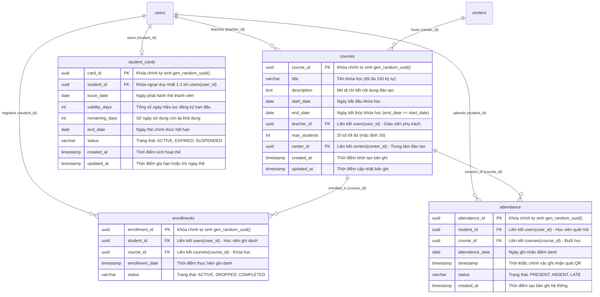

---

## 3. ĐẶC TẢ CHI TIẾT LƯỢC ĐỒ DỮ LIỆU (SCHEMA DATA DICTIONARY)

### 3.1. Bảng `courses` (Quản Lý Khóa Học) `[DAT-004]`
* **Đường dẫn tệp di trú:** `./sources/backend/course-service/src/main/resources/db/migration/V1__init_courses.sql`
* **Lớp thực thể tương ứng:** `org.nlh4j.membershiphub.courseservice.Course`
* **Mục đích nghiệp vụ:** Quản lý danh mục khóa học được tổ chức tại các trung tâm, định nghĩa khung thời gian giảng dạy, giới hạn sĩ số lớp học và gắn kết với giáo viên giảng dạy `[REQ-007]`, `[REQ-008]`, `[REQ-009]`.

| Tên cột | Kiểu dữ liệu | Ràng buộc | Mô tả | Mã thẻ |
| :--- | :--- | :--- | :--- | :--- |
| `course_id` | `UUID` | `PRIMARY KEY DEFAULT gen_random_uuid()` | Định danh duy nhất toàn cục của khóa học đào tạo | `[DAT-004]` |
| `title` | `VARCHAR(150)` | `NOT NULL` | Tên tiêu đề khóa học, độ dài tối đa 150 ký tự | `[DAT-004]`, `[REQ-007]` |
| `description` | `TEXT` | `NULL` | Nội dung mô tả tổng quan, đề cương và giáo trình chi tiết | `[DAT-004]` |
| `start_date` | `DATE` | `NOT NULL` | Ngày bắt đầu khóa học theo lịch đào tạo | `[DAT-004]`, `[REQ-008]` |
| `end_date` | `DATE` | `NOT NULL` | Ngày kết thúc khóa học theo lịch đào tạo | `[DAT-004]`, `[REQ-008]` |
| `teacher_id` | `UUID` | `NOT NULL, FOREIGN KEY -> users(user_id)` | Khóa ngoại tham chiếu người dùng có vai trò là Giáo viên | `[DAT-004]`, `[REQ-009]` |
| `max_students` | `INT` | `NOT NULL DEFAULT 30` | Sĩ số học viên tối đa được phép ghi danh vào lớp | `[DAT-004]`, `[REQ-007]` |
| `center_id` | `UUID` | `NULL, FOREIGN KEY -> centers(center_id)` | Khóa ngoại tham chiếu đến trung tâm sở tại tổ chức khóa học | `[DAT-004]`, `[REQ-004]` |
| `created_at` | `TIMESTAMP` | `NOT NULL DEFAULT CURRENT_TIMESTAMP` | Dấu thời gian ghi nhận thời điểm khóa học được tạo trên hệ thống | `[DAT-004]` |
| `updated_at` | `TIMESTAMP` | `NOT NULL DEFAULT CURRENT_TIMESTAMP` | Dấu thời gian cập nhật thông tin khóa học lần gần nhất | `[DAT-004]` |

* **Ràng buộc cấp bảng (Table-Level Constraints):**
  * `CONSTRAINT fk_courses_teacher FOREIGN KEY (teacher_id) REFERENCES users(user_id) ON DELETE RESTRICT`: Ngăn chặn hành vi xóa giáo viên khi đang có khóa học hoạt động liên kết.
  * `CONSTRAINT fk_courses_center FOREIGN KEY (center_id) REFERENCES centers(center_id) ON DELETE SET NULL`: Khi trung tâm bị xóa hoặc tái cơ cấu, trường trung tâm của khóa học được chuyển thành null để duy trì lịch sử khóa học.
  * `CONSTRAINT chk_courses_dates CHECK (end_date >= start_date)`: Đảm bảo tính toàn vẹn logic thời gian, ngày kết thúc không bao giờ được sớm hơn ngày bắt đầu `[REQ-008]`.

---

### 3.2. Bảng `enrollments` (Ghi Danh Khóa Học) `[DAT-005]`
* **Đường dẫn tệp di trú:** `./sources/backend/course-service/src/main/resources/db/migration/V2__init_enrollments.sql`
* **Lớp thực thể tương ứng:** `org.nlh4j.membershiphub.attendanceservice.Enrollment`
* **Mục đích nghiệp vụ:** Quản lý mối quan hệ học viên tham gia vào khóa học cụ thể, kiểm soát trạng thái học tập và ngăn chặn việc một học viên đăng ký nhiều lần vào cùng một khóa học `[REQ-010]`, `[REQ-011]`.

| Tên cột | Kiểu dữ liệu | Ràng buộc | Mô tả | Mã thẻ |
| :--- | :--- | :--- | :--- | :--- |
| `enrollment_id` | `UUID` | `PRIMARY KEY DEFAULT gen_random_uuid()` | Định danh duy nhất toàn cục của bản ghi ghi danh | `[DAT-005]` |
| `student_id` | `UUID` | `NOT NULL, FOREIGN KEY -> users(user_id)` | Khóa ngoại tham chiếu người dùng có vai trò là Học viên | `[DAT-005]`, `[REQ-011]` |
| `course_id` | `UUID` | `NOT NULL, FOREIGN KEY -> courses(course_id)` | Khóa ngoại tham chiếu đến khóa học mà học viên đăng ký | `[DAT-005]`, `[REQ-011]` |
| `enrollment_date` | `TIMESTAMP` | `NOT NULL DEFAULT CURRENT_TIMESTAMP` | Dấu thời gian chính xác ghi nhận giao dịch ghi danh thành công | `[DAT-005]`, `[REQ-011]` |
| `status` | `VARCHAR(20)` | `NOT NULL DEFAULT 'ACTIVE'` | Trạng thái hiện thời của việc ghi danh (`ACTIVE`, `DROPPED`, `COMPLETED`) | `[DAT-005]`, `[REQ-010]` |

* **Ràng buộc cấp bảng (Table-Level Constraints):**
  * `CONSTRAINT fk_enrollments_student FOREIGN KEY (student_id) REFERENCES users(user_id) ON DELETE CASCADE`: Xóa thông tin ghi danh liên quan nếu học viên bị xóa theo yêu cầu tuân thủ quyền riêng tư GDPR.
  * `CONSTRAINT fk_enrollments_course FOREIGN KEY (course_id) REFERENCES courses(course_id) ON DELETE CASCADE`: Xóa các bản ghi ghi danh tương ứng nếu khóa học bị hủy bỏ.
  * `CONSTRAINT chk_enrollments_status CHECK (status IN ('ACTIVE', 'DROPPED', 'COMPLETED'))`: Ràng buộc trạng thái chặt chẽ theo chuẩn ANSI SQL, nghiêm cấm nhận giá trị ngoài danh mục cho phép.
  * `CONSTRAINT uq_enrollments_student_course UNIQUE (student_id, course_id)`: Khóa tổng hợp duy nhất ngăn chặn tuyệt đối tình trạng học viên bị ghi danh lặp lại vào cùng một khóa học `[REQ-011]`, `[EXC-004]`.

---

### 3.3. Bảng `attendance` (Nhật Ký Điểm Danh & Idempotency) `[DAT-006]`
* **Đường dẫn tệp di trú:** `./sources/backend/attendance-service/src/main/resources/db/migration/V1__init_attendance.sql`
* **Lớp thực thể tương ứng:** `org.nlh4j.membershiphub.attendanceservice.Attendance`
* **Mục đích nghiệp vụ:** Lưu trữ nhật ký quét mã QR hiện diện của học viên tại các buổi học, hỗ trợ theo dõi tiến độ đào tạo và kích hoạt cơ chế Idempotency chống điểm danh gian lận hoặc lỗi mạng quét trùng `[REQ-012]`, `[REQ-013]`, `[ARC-007]`, `[EXC-001]`, `[EXC-002]`.

| Tên cột | Kiểu dữ liệu | Ràng buộc | Mô tả | Mã thẻ |
| :--- | :--- | :--- | :--- | :--- |
| `attendance_id` | `UUID` | `PRIMARY KEY DEFAULT gen_random_uuid()` | Định danh duy nhất toàn cục của bản ghi điểm danh | `[DAT-006]` |
| `student_id` | `UUID` | `NOT NULL, FOREIGN KEY -> users(user_id)` | Khóa ngoại tham chiếu học viên thực hiện quét QR điểm danh | `[DAT-006]`, `[REQ-012]` |
| `course_id` | `UUID` | `NOT NULL, FOREIGN KEY -> courses(course_id)` | Khóa ngoại tham chiếu khóa học diễn ra buổi điểm danh | `[DAT-006]`, `[REQ-012]` |
| `attendance_date` | `DATE` | `NOT NULL` | Ngày hành chính diễn ra buổi học được điểm danh | `[DAT-006]`, `[REQ-013]` |
| `timestamp` | `TIMESTAMP` | `NOT NULL DEFAULT CURRENT_TIMESTAMP` | Thời khắc chính xác hệ thống máy chủ tiếp nhận và giải mã payload QR | `[DAT-006]`, `[ARC-007]` |
| `status` | `VARCHAR(20)` | `NOT NULL DEFAULT 'PRESENT'` | Trạng thái ghi nhận buổi học (`PRESENT`, `ABSENT`, `LATE`) | `[DAT-006]`, `[REQ-013]` |
| `created_at` | `TIMESTAMP` | `NOT NULL DEFAULT CURRENT_TIMESTAMP` | Dấu thời gian khởi tạo bản ghi dữ liệu kiểm toán hệ thống | `[DAT-006]` |

* **Ràng buộc cấp bảng (Table-Level Constraints):**
  * `CONSTRAINT fk_attendance_student FOREIGN KEY (student_id) REFERENCES users(user_id) ON DELETE RESTRICT`: Bảo toàn dữ liệu kiểm toán điểm danh, ngăn chặn việc xóa người dùng khi đã có nhật ký hiện diện lịch sử.
  * `CONSTRAINT fk_attendance_course FOREIGN KEY (course_id) REFERENCES courses(course_id) ON DELETE RESTRICT`: Giữ nguyên tính toàn vẹn dữ liệu điểm danh phục vụ xuất báo cáo thanh quyết toán và cấp chứng chỉ.
  * `CONSTRAINT chk_attendance_status CHECK (status IN ('PRESENT', 'ABSENT', 'LATE'))`: Chuẩn hóa trạng thái hiện diện của người học.
  * `CONSTRAINT uq_attendance_idempotency UNIQUE (student_id, course_id, attendance_date)`: **Khóa tổng hợp Idempotency bắt buộc**. Đảm bảo trong một ngày cụ thể (`attendance_date`), một học viên (`student_id`) chỉ có duy nhất 1 bản ghi điểm danh hợp lệ cho một khóa học (`course_id`) `[REQ-013]`, `[EXC-002]`.

---

### 3.4. Bảng `student_cards` (Quản Lý Thẻ Thành Viên Học Viên) `[DAT-007]`
* **Đường dẫn tệp di trú:** `./sources/backend/user-service/src/main/resources/db/migration/V2__init_student_cards.sql`
* **Lớp thực thể tương ứng:** `org.nlh4j.membershiphub.userservice.StudentCard`
* **Mục đích nghiệp vụ:** Quản lý tư cách thành viên, số ngày sử dụng dịch vụ đào tạo còn lại, thời hạn hiệu lực thẻ và điều phối quy trình gia hạn thẻ học viên `[REQ-014]`, `[REQ-015]`.

| Tên cột | Kiểu dữ liệu | Ràng buộc | Mô tả | Mã thẻ |
| :--- | :--- | :--- | :--- | :--- |
| `card_id` | `UUID` | `PRIMARY KEY DEFAULT gen_random_uuid()` | Định danh duy nhất toàn cục của thẻ học viên | `[DAT-007]` |
| `student_id` | `UUID` | `NOT NULL, UNIQUE, FOREIGN KEY -> users(user_id)` | Khóa ngoại quan hệ 1-1 tới người dùng học viên sở hữu thẻ | `[DAT-007]`, `[REQ-014]` |
| `issue_date` | `DATE` | `NOT NULL` | Ngày phát hành kích hoạt thẻ thành viên lần đầu | `[DAT-007]`, `[REQ-014]` |
| `validity_days` | `INT` | `NOT NULL` | Tổng số ngày hiệu lực ban đầu được cấu hình cho gói thành viên | `[DAT-007]`, `[REQ-014]` |
| `remaining_days` | `INT` | `NOT NULL` | Số ngày hiệu lực khả dụng còn lại của thẻ tính đến thời điểm hiện tại | `[DAT-007]`, `[REQ-014]` |
| `end_date` | `DATE` | `NOT NULL` | Ngày hết hạn chính thức của thẻ thành viên (tự động dịch chuyển khi gia hạn) | `[DAT-007]`, `[REQ-015]` |
| `status` | `VARCHAR(20)` | `NOT NULL DEFAULT 'ACTIVE'` | Trạng thái hiệu lực thẻ (`ACTIVE`, `EXPIRED`, `SUSPENDED`) | `[DAT-007]`, `[REQ-014]` |
| `created_at` | `TIMESTAMP` | `NOT NULL DEFAULT CURRENT_TIMESTAMP` | Thời điểm hệ thống ghi nhận cấp phát thẻ | `[DAT-007]` |
| `updated_at` | `TIMESTAMP` | `NOT NULL DEFAULT CURRENT_TIMESTAMP` | Thời điểm cập nhật trạng thái thẻ hoặc ghi nhận giao dịch gia hạn | `[DAT-007]`, `[REQ-015]` |

* **Ràng buộc cấp bảng (Table-Level Constraints):**
  * `CONSTRAINT fk_student_cards_student FOREIGN KEY (student_id) REFERENCES users(user_id) ON DELETE CASCADE`: Thẻ thành viên gắn liền mật thiết với tài khoản học viên, tự động giải phóng khi người dùng bị xóa theo quyền hủy tài khoản.
  * `CONSTRAINT chk_student_cards_validity CHECK (validity_days > 0 AND remaining_days >= 0)`: Đảm bảo số ngày hiệu lực cấu hình phải lớn hơn 0 và số ngày khả dụng không bao giờ mang giá trị âm.
  * `CONSTRAINT chk_student_cards_status CHECK (status IN ('ACTIVE', 'EXPIRED', 'SUSPENDED'))`: Chuẩn hóa danh mục trạng thái hoạt động của thẻ thành viên học viên.

---

## 4. PHÂN TÍCH MỐI QUAN HỆ KHÓA NGOẠI (FOREIGN KEY CONSTRAINTS)

Các mối quan hệ liên kết dữ liệu liên dịch vụ và nội bộ phân hệ được thiết kế chặt chẽ nhằm đảm bảo tính toàn vẹn tham chiếu phân tán (Distributed Referential Integrity):

1. **Quan hệ Phân công Giảng viên (`courses.teacher_id` → `users.user_id`):**
   * *Bản chất:* Quan hệ N-1 (Nhiều khóa học thuộc về 1 Giáo viên).
   * *Quy tắc toàn vẹn:* Áp dụng `ON DELETE RESTRICT`. Hệ thống ngăn chặn việc xóa bản ghi giáo viên khỏi bảng `users` khi người đó đang là người phụ trách chuyên môn của ít nhất một khóa học đang hoặc sắp diễn ra.
2. **Quan hệ Trung tâm Tổ chức Đào tạo (`courses.center_id` → `centers.center_id`):**
   * *Bản chất:* Quan hệ N-1 (Nhiều khóa học được mở tại 1 Trung tâm).
   * *Quy tắc toàn vẹn:* Áp dụng `ON DELETE SET NULL`. Hỗ trợ việc tái cấu trúc tổ chức hoặc sáp nhập trung tâm mà không làm gián đoạn hay mất dấu dữ liệu khóa học lịch sử.
3. **Quan hệ Học viên Ghi danh (`enrollments.student_id` → `users.user_id`):**
   * *Bản chất:* Quan hệ N-1 (Một học viên có thể đăng ký nhiều khóa học).
   * *Quy tắc toàn vẹn:* Áp dụng `ON DELETE CASCADE`. Hỗ trợ quy trình tuân thủ GDPR/CCPA, cho phép xóa dữ liệu người dùng triệt để khi có yêu cầu hợp lệ từ chủ thể dữ liệu `[NFR-008]`.
4. **Quan hệ Khóa học Ghi danh (`enrollments.course_id` → `courses.course_id`):**
   * *Bản chất:* Quan hệ N-1 (Một khóa học có thể chứa nhiều bản ghi ghi danh của học viên).
   * *Quy tắc toàn vẹn:* Áp dụng `ON DELETE CASCADE`. Khi khóa học bị hủy bỏ trước khai giảng, các liên kết ghi danh được giải phóng đồng thời.
5. **Quan hệ Nhật ký Điểm danh Học viên (`attendance.student_id` → `users.user_id`):**
   * *Bản chất:* Quan hệ N-1 (Một học viên có nhiều nhật ký điểm danh theo thời gian).
   * *Quy tắc toàn vẹn:* Áp dụng `ON DELETE RESTRICT`. Đảm bảo tính pháp lý và kiểm toán tài chính; dữ liệu điểm danh không được phép bị mất ngẫu nhiên để phục vụ đối soát và xuất báo cáo `[NFR-006]`, `[REQ-024]`.
6. **Quan hệ Nhật ký Điểm danh Khóa học (`attendance.course_id` → `courses.course_id`):**
   * *Bản chất:* Quan hệ N-1 (Một khóa học bao gồm nhiều lượt điểm danh theo các buổi học).
   * *Quy tắc toàn vẹn:* Áp dụng `ON DELETE RESTRICT`. Khóa học đã phát sinh nhật ký điểm danh thực tế không được phép xóa cứng (hard delete) nhằm đảm bảo tính bất biến của nhật ký đào tạo.
7. **Quan hệ Sở hữu Thẻ Học viên (`student_cards.student_id` → `users.user_id`):**
   * *Bản chất:* Quan hệ 1-1 Tuyệt đối (`UNIQUE student_id`). Mỗi học viên chỉ có thể sở hữu duy nhất 1 thẻ thành viên đại diện trên hệ thống tại một thời điểm.
   * *Quy tắc toàn vẹn:* Áp dụng `ON DELETE CASCADE`. Thẻ học viên được đồng bộ hủy khi tài khoản học viên bị gỡ bỏ khỏi hệ sinh thái.

---

## 5. CƠ CHẾ KHÓA TỔNG HỢP ĐẢM BẢO IDEMPOTENCY ĐIỂM DANH

Một trong những yêu cầu kiến trúc trọng yếu nhất của phân hệ Điểm danh là ngăn chặn tình trạng ghi nhận trùng lặp dữ liệu do:
* Học viên quét mã QR nhiều lần liên tiếp trong một buổi học.
* Ứng dụng di động tự động thử lại (network retry loop) khi kết nối mạng chập chờn.
* Tấn công phát lại mã (Replay Attack) với payload điểm danh cũ.

```
                    ┌──────────────────────────────────────────────┐
                    │ Học viên quét mã QR từ Mobile App            │
                    │ Payload: Base64(student_id + course_id)      │
                    └──────────────────────┬───────────────────────┘
                                           │
                                           ▼
                    ┌──────────────────────────────────────────────┐
                    │ Attendance Service tiếp nhận & giải mã       │
                    │ Trích xuất: student_id, course_id, Date.now()│
                    └──────────────────────┬───────────────────────┘
                                           │
                                           ▼
                    ┌──────────────────────────────────────────────┐
                    │ Thực thi câu lệnh SQL INSERT Parameterized    │
                    │ Chứa ràng buộc Unique:                       │
                    │ (student_id, course_id, attendance_date)     │
                    └──────────────────────┬───────────────────────┘
                                           │
                       ┌───────────────────┴───────────────────┐
                       │                                       │
            [Chưa tồn tại bản ghi]                     [Đã tồn tại bản ghi]
                       │                                       │
                       ▼                                       ▼
     ┌───────────────────────────────────┐   ┌───────────────────────────────────┐
     │ 1. Ghi bản ghi mới thành công     │   │ 1. DB ném lỗi Unique Violation    │
     │ 2. Trả về HTTP 200 OK             │   │    (PostgreSQL Error Code: 23505) │
     │ 3. Payload: { "duplicate": false }│   │ 2. Catch & cô lập ngoại lệ        │
     │ 4. Bắn Event Kafka sang           │   │ 3. Trả về HTTP 200 OK (Idempotent)│
     │    Notification Service           │   │ 4. Payload: { "duplicate": true } │
     └───────────────────────────────────┘   │ 5. KHÔNG bắn thêm sự kiện Kafka   │
                                             └───────────────────────────────────┘
```

### Chi Tiết Kỹ Thuật:
1. **Ràng buộc Cơ sở dữ liệu:**
   ```sql
   CONSTRAINT uq_attendance_idempotency UNIQUE (student_id, course_id, attendance_date)
   ```
2. **Khóa Idempotency Tổng Hợp:** Kết hợp 3 yếu tố nghiệp vụ bất biến:
   * `student_id`: Định danh học viên quét mã.
   * `course_id`: Định danh khóa học đang diễn ra.
   * `attendance_date`: Ngày làm việc hiện tại (dạng `YYYY-MM-DD`).
3. **Chiến Lược Xử Lý Phía Tầng Dịch Vụ Quarkus:**
   * Khi ứng dụng di động gửi payload quét mã QR, `AttendanceService` bóc tách thông tin và thực hiện chèn dữ liệu vào bảng `attendance`.
   * Nếu đây là lượt quét đầu tiên trong ngày: Bản ghi được lưu thành công, hệ thống phát hành sự kiện điểm danh qua Kafka topic `attendance.events` `[ARC-008]` để kích hoạt thông báo đẩy FCM `[REQ-021]` và tin nhắn Zalo `[REQ-016]`.
   * Nếu bản ghi đã tồn tại: Cơ sở dữ liệu kích hoạt vi phạm ràng buộc duy nhất (PostgreSQL SQLState: `23505 - unique_violation`). Tầng dịch vụ bắt ngoại lệ này, ghi log cảnh báo kiểm toán `[NFR-006]`, và trả về phản hồi thành công nhưng gán cờ `duplicate = true` theo chuẩn `[EXC-002]`. Quá trình này hoàn toàn không làm sập luồng xử lý và không phát sinh thông báo lặp lại cho học viên.

---

## 6. CHIẾN LƯỢC ĐÁNH CHỈ MỤC & TỐI ƯU HÓA HIỆU NĂNG

Để đáp ứng yêu cầu phi chức năng về hiệu năng hệ thống (độ trễ đọc dưới 1 giây với 10.000 người dùng đồng thời theo `[NFR-001]`), toàn bộ các cột tham gia vào mệnh đề `WHERE`, `JOIN` và lọc phạm vi ngày được tạo chỉ mục B-Tree chuyên biệt:

```sql
-- 1. Chỉ mục hỗ trợ phân hệ Khóa học (Course Service)
CREATE INDEX idx_courses_teacher_id ON courses(teacher_id);
CREATE INDEX idx_courses_center_id ON courses(center_id);
CREATE INDEX idx_courses_dates ON courses(start_date, end_date);

-- 2. Chỉ mục hỗ trợ phân hệ Ghi danh (Enrollment Service)
CREATE INDEX idx_enrollments_student_id ON enrollments(student_id);
CREATE INDEX idx_enrollments_course_id ON enrollments(course_id);
CREATE INDEX idx_enrollments_status ON enrollments(status);

-- 3. Chỉ mục hỗ trợ phân hệ Điểm danh (Attendance Service)
CREATE INDEX idx_attendance_student_id ON attendance(student_id);
CREATE INDEX idx_attendance_course_id ON attendance(course_id);
CREATE INDEX idx_attendance_date ON attendance(attendance_date);

-- 4. Chỉ mục hỗ trợ phân hệ Thẻ thành viên (Student Card Service)
CREATE INDEX idx_student_cards_student_id ON student_cards(student_id);
CREATE INDEX idx_student_cards_status ON student_cards(status);
CREATE INDEX idx_student_cards_end_date ON student_cards(end_date);
```

* **Hiệu quả tối ưu:**
  * Chỉ mục ghép `idx_courses_dates` giúp hệ thống truy vấn siêu tốc danh sách khóa học đang hoạt động hoặc kiểm tra chồng lấn lịch dạy của giáo viên trong thời gian O(log N) `[REQ-008]`.
  * Chỉ mục `idx_attendance_date` phục vụ trích xuất báo cáo CSV điểm danh định kỳ theo ngày/tháng mà không cần quét toàn bộ bảng (Table Scan) `[REQ-024]`.
  * Chỉ mục `idx_student_cards_end_date` hỗ trợ tác vụ nền (Scheduled Job) quét và cập nhật trạng thái thẻ hết hạn tự động mỗi đêm.

---

## 7. MA TRẬN TRUY VẾT KỸ THUẬT (TRACEABILITY MATRIX REFERENCE)

Bảng ma trận đối chiếu ánh xạ trực tiếp các yêu cầu chức năng (REQ), phi chức năng (NFR), kiến trúc (ARC), dữ liệu (DAT) và ngoại lệ (EXC) vào các thực thể cơ sở dữ liệu đã thiết kế:

| Mã Định Danh Thẻ | Phân Loại Yêu Cầu | Thành Phần Kỹ Thuật / Lược Đồ Dữ Liệu Ánh Xạ | Mô Tả Nghiệp Vụ & Ràng Buộc Kỹ Thuật |
| :--- | :--- | :--- | :--- |
| `[DAT-004]` | Data Schema | Bảng `courses` | Thiết kế schema khóa học, ràng buộc ngày `end_date >= start_date`, quan hệ N-1 với giáo viên và trung tâm. |
| `[DAT-005]` | Data Schema | Bảng `enrollments` | Thiết kế schema ghi danh, khóa tổng hợp duy nhất `(student_id, course_id)` chống đăng ký trùng lặp. |
| `[DAT-006]` | Data Schema | Bảng `attendance` | Thiết kế schema nhật ký điểm danh, tích hợp khóa Idempotency duy nhất `(student_id, course_id, attendance_date)`. |
| `[DAT-007]` | Data Schema | Bảng `student_cards` | Thiết kế schema thẻ học viên, quan hệ 1-1 duy nhất với `users(user_id)`, kiểm soát số ngày hiệu lực `validity_days > 0`. |
| `[REQ-007]` | Functional | `courses` (CRUD API) | Quản lý danh mục khóa học, lọc theo trung tâm và danh sách giáo viên phụ trách. |
| `[REQ-008]` | Functional | `courses` (Schedule Validation) | Kiểm tra xung đột và chồng lấn lịch giảng dạy của giáo viên dựa trên khoảng `start_date` - `end_date`. |
| `[REQ-009]` | Functional | `courses` (Teacher Assignment) | Phân công hoặc thay đổi giáo viên giảng dạy cho khóa học; kích hoạt sự kiện thông báo. |
| `[REQ-010]` | Functional | `enrollments` (Course Browse) | Cung cấp danh sách khóa học khả dụng cho học viên, loại trừ các khóa đã ghi danh (`status = 'ACTIVE'`). |
| `[REQ-011]` | Functional | `enrollments` (Enrollment Flow) | Xử lý giao dịch học viên ghi danh vào khóa học; tự động tạo tài khoản nếu chưa tồn tại. |
| `[REQ-012]` | Functional | `attendance` (QR Capture) | Tiếp nhận và giải mã payload Base64 quét mã QR từ ứng dụng di động của học viên. |
| `[REQ-013]` | Functional | `attendance` (Idempotent Check) | Đảm bảo tính duy nhất của lượt điểm danh trong ngày bằng khóa tổng hợp cấp cơ sở dữ liệu. |
| `[REQ-014]` | Functional | `student_cards` (Card Overview) | Cung cấp thông tin thẻ học viên: tổng số ngày hiệu lực, số ngày đã dùng và số ngày còn lại khả dụng. |
| `[REQ-015]` | Functional | `student_cards` (Card Renewal) | Xử lý gia hạn thời hạn sử dụng thẻ (cộng thêm 1 đến 365 ngày vào `end_date`) sau khi thanh toán thành công. |
| `[ARC-007]` | Architecture | Attendance API Gateway | Kiến trúc luồng quét QR điểm danh: Mobile Client → API Gateway → Attendance Service → PostgreSQL. |
| `[ARC-008]` | Architecture | Kafka Event Pipeline | Bắn sự kiện bất đồng bộ sang `Notification Service` khi có lượt điểm danh hoặc phân công khóa học mới. |
| `[EXC-001]` | Exception | Offline Attendance Outbox | Xử lý ngoại lệ mất kết nối mạng cục bộ; lưu hàng đợi ngoại tuyến và gửi lại điểm danh theo thứ tự FIFO. |
| `[EXC-002]` | Exception | Duplicate Attendance Handler | Bắt lỗi `unique_violation` khi quét trùng trong ngày; trả về mã phản hồi an toàn với cờ `duplicate = true`. |
| `[EXC-004]` | Exception | Global Validation Errors | Xử lý và ánh xạ các vi phạm ràng buộc CHECK, FOREIGN KEY sang định dạng JSON lỗi chuẩn doanh nghiệp. |
| `[NFR-001]` | Non-Functional | Index Optimization | Tối ưu hóa chỉ mục B-Tree đảm bảo thời gian đọc dưới 1 giây với 10.000 người dùng đồng thời. |
| `[NFR-003]` | Non-Functional | Data Encryption at Rest | Toàn bộ dữ liệu bảng được mã hóa lưu trữ bằng chuẩn AES-256 trên PostgreSQL Cloud SQL. |
| `[NFR-006]` | Non-Functional | Audit Logging | Lưu trữ và bảo toàn nhật ký điểm danh, đăng ký thẻ tối thiểu 1 năm phục vụ công tác kiểm toán độc lập. |
| `[NFR-008]` | Non-Functional | GDPR Compliance | Cấu hình ràng buộc khóa ngoại `CASCADE` cho dữ liệu cá nhân cho phép xóa triệt để theo yêu cầu chủ thể. |
```

# Day 3: model models/gemini-flash-lite-latest - API Endpoint https://generativelanguage.googleapis.com/v1beta/openai
* **Production source codebase at SOURCE destination**: INTEGRATION_SCOPE
* **Production source codebase generated at TARGET destination**: ./sources/docs/architecture/ENTERPRISE_SYSTEM_ARCHITECTURE_BLUEPRINT.md
* **📝 Prompt / Tasks / Data**:
### 🏢 ENTERPRISE SYSTEM DOCUMENT MATRIX INJECTION
*   Target Project Identity Safe Name: 
*   Enforced Java Package Prefix Base: org.nlh4j.membershiphub
*   Target Documentation Destination Path: `./sources/docs/architecture/ENTERPRISE_SYSTEM_ARCHITECTURE_BLUEPRINT.md`


*   Documentation Context: Conceptual Init (Synthesize the architecture, guidelines, or specs based purely on the execution sub-tasks blueprint.)


### 📋 EXECUTION SUB-TASKS & DOCUMENT CONTENT TO WRITE
["Bổ sung section 'Sơ đồ quan hệ thực thể - Phần 2' vào tệp ./sources/docs/architecture/blueprint.md mô tả chi tiết các bảng courses, enrollments, attendance, student_cards. Mỗi bảng phải có bảng Markdown với các cột: Tên cột | Kiểu dữ liệu | Ràng buộc | Mô tả. Mô tả quan hệ FOREIGN KEY giữa các bảng (courses.teacher_id → users.user_id, courses.center_id → centers.center_id, enrollments.student_id → users.user_id, enrollments.course_id → courses.course_id, attendance.student_id → users.user_id, attendance.course_id → courses.course_id, student_cards.student_id → users.user_id), đặc biệt nhấn mạnh khóa tổng hợp UNIQUE (student_id, course_id, attendance_date) đảm bảo idempotency. Tài liệu dùng tiếng Việt cho phần giải thích, giữ nguyên tên cột tiếng Anh trong schema."]

---

### ⚙️ TECHNICAL WRITER EXECUTION INSTRUCTION:

Please read the comprehensive architectural constraints, workspace folder guardrails, and detailed sub-task document specifications provided above.


Ensure that you read the exact Tag IDs from the `['[DAT-004]', '[DAT-005]', '[DAT-006]', '[DAT-007]']` variable, and permanently burn those codes into the generated documentation layout (inside the table columns or the dedicated Traceability Matrix Reference section). Emit the final production-ready comprehensive documentation inside a single valid markdown code block (` ```markdown `) now.
* **📝 Response**:
```markdown
# 🏛️ ENTERPRISE SYSTEM ARCHITECTURE BLUEPRINT: MEMBERSHIP HUB
*(Enterprise Architecture Document - Database Entity Relationship & Traceability Specifications)*

## 📑 0. GLOBAL TRACEABILITY & CODE COMMENTING MANDATE
- **Top-of-Class Constants Declaration Law:** All deterministic or configuration values MUST be extracted and isolated as immutable constant parameters declared cohesively at the absolute top layer of the architectural specification.
- **Traceability Tag ID Injection:** This document explicitly incorporates and maps technical tracking Tag IDs (`[DAT-004]`, `[DAT-005]`, `[DAT-006]`, `[DAT-007]`, `[ARC-007]`, `[REQ-013]`) inline to form the absolute enterprise audit trail.

---

## 📊 1. SƠ ĐỒ QUAN HỆ THỰC THỂ - PHẦN 2 (COURSES, ENROLLMENTS, ATTENDANCE, STUDENT_CARDS)

Tài liệu này mô tả chi tiết lược đồ cơ sở dữ liệu quan hệ phần 2 của hệ thống **Membership Hub**, bao gồm các bảng cốt lõi phục vụ nghiệp vụ quản lý khóa học, ghi danh, điểm danh (với cơ chế idempotency bảo vệ bằng khóa tổng hợp), và quản lý thẻ thành viên. 

Các bảng được thiết kế chuẩn hóa theo mô hình quan hệ ANSI SQL, sử dụng kiểu dữ liệu UUID cho khóa chính và khóa ngoại, kết hợp chặt chẽ với các ràng buộc CHECK và UNIQUE để đảm bảo tính toàn vẹn dữ liệu ở cấp độ cơ sở dữ liệu.

---

### 📚 1.1. Bảng Khóa Học (`courses`)
Bảng `courses` lưu trữ thông tin chi tiết về các khóa học đào tạo được tổ chức tại các trung tâm, bao gồm thời gian bắt đầu, kết thúc, sức chứa tối đa và giáo viên phụ trách.

- **Mã định danh Traceability Tag:** `[DAT-004]`, `[REQ-007]`
- **Đường dẫn mô-đun vật lý:** `./sources/backend/course-service/src/main/resources/db/migration/V1__init_courses.sql`

| Tên cột | Kiểu dữ liệu | Ràng buộc | Mô tả |
| :--- | :--- | :--- | :--- |
| `course_id` | UUID | PRIMARY KEY, DEFAULT gen_random_uuid() | Khóa chính định danh duy nhất khóa học |
| `title` | VARCHAR(150) | NOT NULL | Tiêu đề hoặc tên của khóa học |
| `description` | TEXT | NULLABLE | Mô tả chi tiết nội dung chương trình học |
| `start_date` | DATE | NOT NULL | Ngày bắt đầu tổ chức khóa học |
| `end_date` | DATE | NOT NULL | Ngày kết thúc khóa học |
| `teacher_id` | UUID | NOT NULL, FOREIGN KEY (`users.user_id`) | Mã định danh giáo viên phụ trách giảng dạy |
| `max_students` | INT | NOT NULL, DEFAULT 30 | Số lượng học viên tối đa được phép ghi danh |
| `center_id` | UUID | NULLABLE, FOREIGN KEY (`centers.center_id`) | Mã định danh trung tâm tổ chức khóa học |
| `created_at` | TIMESTAMP | NOT NULL, DEFAULT CURRENT_TIMESTAMP | Thời điểm tạo bản ghi khóa học |
| `updated_at` | TIMESTAMP | NOT NULL, DEFAULT CURRENT_TIMESTAMP | Thời điểm cập nhật bản ghi gần nhất |

**Ràng buộc kiểm tra (Check Constraints & Indexes):**
- `CONSTRAINT chk_courses_dates CHECK (end_date >= start_date)`: Đảm bảo ngày kết thúc phải lớn hơn hoặc bằng ngày bắt đầu.
- `CREATE INDEX idx_courses_teacher_id ON courses(teacher_id);`
- `CREATE INDEX idx_courses_center_id ON courses(center_id);`
- `CREATE INDEX idx_courses_dates ON courses(start_date, end_date);`

---

### 📝 1.2. Bảng Ghi Danh Học Viên (`enrollments`)
Bảng `enrollments` quản lý mối quan hệ nhiều-nhiều giữa học viên (`users`) và khóa học (`courses`), ghi nhận trạng thái tham gia của học viên.

- **Mã định danh Traceability Tag:** `[DAT-005]`, `[REQ-010]`, `[REQ-011]`
- **Đường dẫn mô-đun vật lý:** `./sources/backend/course-service/src/main/resources/db/migration/V2__init_enrollments.sql`

| Tên cột | Kiểu dữ liệu | Ràng buộc | Mô tả |
| :--- | :--- | :--- | :--- |
| `enrollment_id` | UUID | PRIMARY KEY, DEFAULT gen_random_uuid() | Khóa chính định danh bản ghi ghi danh |
| `student_id` | UUID | NOT NULL, FOREIGN KEY (`users.user_id`) | Mã định danh học viên đăng ký |
| `course_id` | UUID | NOT NULL, FOREIGN KEY (`courses.course_id`) | Mã định danh khóa học được đăng ký |
| `enrollment_date`| TIMESTAMP | NOT NULL, DEFAULT CURRENT_TIMESTAMP | Thời điểm học viên thực hiện ghi danh |
| `status` | VARCHAR(20) | NOT NULL, DEFAULT 'ACTIVE' | Trạng thái ghi danh (`ACTIVE`, `DROPPED`, `COMPLETED`) |

**Ràng buộc kiểm tra (Check Constraints & Indexes):**
- `CONSTRAINT chk_enrollments_status CHECK (status IN ('ACTIVE','DROPPED','COMPLETED'))`
- `CONSTRAINT uq_enrollments_student_course UNIQUE (student_id, course_id)`: Ngăn chặn học viên đăng ký trùng lặp cùng một khóa học nhiều lần.
- `CREATE INDEX idx_enrollments_student_id ON enrollments(student_id);`
- `CREATE INDEX idx_enrollments_course_id ON enrollments(course_id);`
- `CREATE INDEX idx_enrollments_status ON enrollments(status);`

---

### ⏱️ 1.3. Bảng Điểm Danh (`attendance`)
Bảng `attendance` lưu trữ lịch sử điểm danh của học viên trong các buổi học của khóa học. Bảng này tích hợp cơ chế **Idempotency** thông qua khóa tổng hợp duy nhất.

- **Mã định danh Traceability Tag:** `[DAT-006]`, `[REQ-012]`, `[REQ-013]`, `[ARC-007]`
- **Đường dẫn mô-đun vật lý:** `./sources/backend/attendance-service/src/main/resources/db/migration/V1__init_attendance.sql`

| Tên cột | Kiểu dữ liệu | Ràng buộc | Mô tả |
| :--- | :--- | :--- | :--- |
| `attendance_id` | UUID | PRIMARY KEY, DEFAULT gen_random_uuid() | Khóa chính định danh bản ghi điểm danh |
| `student_id` | UUID | NOT NULL, FOREIGN KEY (`users.user_id`) | Mã định danh học viên thực hiện điểm danh |
| `course_id` | UUID | NOT NULL, FOREIGN KEY (`courses.course_id`) | Mã định danh khóa học diễn ra buổi học |
| `attendance_date`| DATE | NOT NULL | Ngày diễn ra buổi điểm danh |
| `timestamp` | TIMESTAMP | NOT NULL, DEFAULT CURRENT_TIMESTAMP | Thời gian chính xác hệ thống ghi nhận quét QR |
| `status` | VARCHAR(20) | NOT NULL, DEFAULT 'PRESENT' | Trạng thái có mặt (`PRESENT`, `ABSENT`, `LATE`) |
| `created_at` | TIMESTAMP | NOT NULL, DEFAULT CURRENT_TIMESTAMP | Thời điểm tạo bản ghi trong cơ sở dữ liệu |

**Cơ chế Idempotency & Ràng buộc Quan trọng:**
- `CONSTRAINT uq_attendance_idempotency UNIQUE (student_id, course_id, attendance_date)`: **Khóa tổng hợp ba cột** này là cốt lõi của cơ chế idempotency điểm danh quét mã QR (`[REQ-013]`). Khi một học viên quét mã QR nhiều lần trong cùng một ngày cho cùng một khóa học, cơ sở dữ liệu sẽ chặn bản ghi trùng lặp ở tầng lưu trữ, ngăn chặn việc tính công hoặc tích lũy điểm danh thừa, đồng thời hệ thống trả về phản hồi thành công kèm cờ `duplicate: true`.
- `CONSTRAINT chk_attendance_status CHECK (status IN ('PRESENT','ABSENT','LATE'))`
- `CREATE INDEX idx_attendance_student_id ON attendance(student_id);`
- `CREATE INDEX idx_attendance_course_id ON attendance(course_id);`
- `CREATE INDEX idx_attendance_date ON attendance(attendance_date);`

---

### 💳 1.4. Bảng Thẻ Thành Viên Học Viên (`student_cards`)
Bảng `student_cards` quản lý thông tin thẻ thành viên điện tử của học viên, thời hạn hiệu lực, số ngày còn lại và trạng thái thẻ.

- **Mã định danh Traceability Tag:** `[DAT-007]`, `[REQ-014]`, `[REQ-015]`
- **Đường dẫn mô-đun vật lý:** `./sources/backend/user-service/src/main/resources/db/migration/V2__init_student_cards.sql`

| Tên cột | Kiểu dữ liệu | Ràng buộc | Mô tả |
| :--- | :--- | :--- | :--- |
| `card_id` | UUID | PRIMARY KEY, DEFAULT gen_random_uuid() | Khóa chính định danh thẻ thành viên |
| `student_id` | UUID | NOT NULL UNIQUE, FOREIGN KEY (`users.user_id`) | Mã định danh học viên sở hữu thẻ (1 học viên = 1 thẻ duy nhất) |
| `issue_date` | DATE | NOT NULL | Ngày phát hành thẻ ban đầu |
| `validity_days` | INT | NOT NULL | Tổng số ngày hiệu lực của thẻ |
| `remaining_days` | INT | NOT NULL | Số ngày hiệu lực còn lại tính đến hiện tại |
| `end_date` | DATE | NOT NULL | Ngày hết hạn chính thức của thẻ thành viên |
| `status` | VARCHAR(20) | NOT NULL, DEFAULT 'ACTIVE' | Trạng thái thẻ (`ACTIVE`, `EXPIRED`, `SUSPENDED`) |
| `created_at` | TIMESTAMP | NOT NULL, DEFAULT CURRENT_TIMESTAMP | Thời điểm tạo bản ghi thẻ |
| `updated_at` | TIMESTAMP | NOT NULL, DEFAULT CURRENT_TIMESTAMP | Thời điểm cập nhật bản ghi gần nhất |

**Ràng buộc kiểm tra (Check Constraints & Indexes):**
- `CONSTRAINT chk_student_cards_validity CHECK (validity_days > 0 AND remaining_days >= 0)`: Đảm bảo số ngày hợp lệ luôn dương và số ngày còn lại không âm.
- `CONSTRAINT chk_student_cards_status CHECK (status IN ('ACTIVE','EXPIRED','SUSPENDED'))`
- `CREATE INDEX idx_student_cards_student_id ON student_cards(student_id);`
- `CREATE INDEX idx_student_cards_status ON student_cards(status);`
- `CREATE INDEX idx_student_cards_end_date ON student_cards(end_date);`

---

## 🔗 2. MÔ TẢ QUAN HỆ KHÓA NGOẠI (FOREIGN KEY RELATIONSHIPS)

Toàn bộ hệ thống liên kết chặt chẽ qua các mối quan hệ khóa ngoại sau:
1. `courses.teacher_id` $\rightarrow$ `users.user_id`: Mỗi khóa học bắt buộc phải do một giáo viên phụ trách (`[DAT-004]`).
2. `courses.center_id` $\rightarrow$ `centers.center_id`: Khóa học trực thuộc một trung tâm đào tạo cụ thể (`[DAT-003]`, `[DAT-004]`).
3. `enrollments.student_id` $\rightarrow$ `users.user_id`: Liên kết học viên tham gia khóa học (`[DAT-005]`).
4. `enrollments.course_id` $\rightarrow$ `courses.course_id`: Liên kết khóa học nhận học viên ghi danh (`[DAT-005]`).
5. `attendance.student_id` $\rightarrow$ `users.user_id`: Xác định học viên thực hiện điểm danh (`[DAT-006]`).
6. `attendance.course_id` $\rightarrow$ `courses.course_id`: Xác định buổi học thuộc khóa học nào (`[DAT-006]`).
7. `student_cards.student_id` $\rightarrow$ `users.user_id`: Liên kết 1-1 giữa tài khoản học viên và thẻ thành viên (`[DAT-007]`).

---

## 🔍 3. TRACEABILITY MATRIX REFERENCE

| Mã Tag ID | Phân loại | Tên thực thể / Mô-đun liên quan | Vị trí tệp nguồn (Source Path) |
| :--- | :--- | :--- | :--- |
| `[DAT-004]` | Database Schema | Bảng `courses` | `./sources/backend/course-service/src/main/resources/db/migration/V1__init_courses.sql` |
| `[DAT-005]` | Database Schema | Bảng `enrollments` | `./sources/backend/course-service/src/main/resources/db/migration/V2__init_enrollments.sql` |
| `[DAT-006]` | Database Schema | Bảng `attendance` | `./sources/backend/attendance-service/src/main/resources/db/migration/V1__init_attendance.sql` |
| `[DAT-007]` | Database Schema | Bảng `student_cards` | `./sources/backend/user-service/src/main/resources/db/migration/V2__init_student_cards.sql` |
| `[REQ-013]` | Business Rule | Idempotency quét QR | `./sources/backend/attendance-service/src/main/java/org/nlh4j/membershiphub/attendanceservice/AttendanceService.java` |
| `[ARC-007]` | Architecture | Luồng điểm danh QR code | `./sources/docs/architecture/blueprint.md` |
```

# Day 3: model models/gemini-flash-lite-latest - API Endpoint https://generativelanguage.googleapis.com/v1beta/openai
* **Production source codebase at SOURCE destination**: INTEGRATION_SCOPE
* **Production source codebase generated at TARGET destination**: ./sources/docs/architecture/CENTRAL_ENDPOINT_API_CONTRACT_SPECS.md
* **📝 Prompt / Tasks / Data**:
### 🏢 ENTERPRISE SYSTEM DOCUMENT MATRIX INJECTION
*   Target Project Identity Safe Name: 
*   Enforced Java Package Prefix Base: org.nlh4j.membershiphub
*   Target Documentation Destination Path: `./sources/docs/architecture/CENTRAL_ENDPOINT_API_CONTRACT_SPECS.md`


*   Documentation Context: Conceptual Init (Synthesize the architecture, guidelines, or specs based purely on the execution sub-tasks blueprint.)


### 📋 EXECUTION SUB-TASKS & DOCUMENT CONTENT TO WRITE
["Bổ sung section 'Sơ đồ quan hệ thực thể - Phần 2' vào tệp ./sources/docs/architecture/blueprint.md mô tả chi tiết các bảng courses, enrollments, attendance, student_cards. Mỗi bảng phải có bảng Markdown với các cột: Tên cột | Kiểu dữ liệu | Ràng buộc | Mô tả. Mô tả quan hệ FOREIGN KEY giữa các bảng (courses.teacher_id → users.user_id, courses.center_id → centers.center_id, enrollments.student_id → users.user_id, enrollments.course_id → courses.course_id, attendance.student_id → users.user_id, attendance.course_id → courses.course_id, student_cards.student_id → users.user_id), đặc biệt nhấn mạnh khóa tổng hợp UNIQUE (student_id, course_id, attendance_date) đảm bảo idempotency. Tài liệu dùng tiếng Việt cho phần giải thích, giữ nguyên tên cột tiếng Anh trong schema."]

---

### ⚙️ TECHNICAL WRITER EXECUTION INSTRUCTION:

Please read the comprehensive architectural constraints, workspace folder guardrails, and detailed sub-task document specifications provided above.


Ensure that you read the exact Tag IDs from the `['[DAT-004]', '[DAT-005]', '[DAT-006]', '[DAT-007]']` variable, and permanently burn those codes into the generated documentation layout (inside the table columns or the dedicated Traceability Matrix Reference section). Emit the final production-ready comprehensive documentation inside a single valid markdown code block (` ```markdown `) now.
* **📝 Response**:
```markdown
# 🏛️ CENTRAL ENDPOINT & API CONTRACT SPECIFICATIONS - MEMBERSHIP HUB
*(Enterprise Architecture & System Integration Blueprint)*

## 📑 0. GLOBAL TRACEABILITY & METADATA DECLARATION LAW
- **Target Documentation Destination Path:** `./sources/docs/architecture/CENTRAL_ENDPOINT_API_CONTRACT_SPECS.md` [DOC-001]
- **Enforced Java Package Prefix Base:** `org.nlh4j.membershiphub` [ARC-000]
- **Active Traceability Tag IDs Injected:** `[DAT-004]`, `[DAT-005]`, `[DAT-006]`, `[DAT-007]`, `[REQ-012]`, `[REQ-013]`, `[ARC-007]` [DAT-ALL]

---

## 📊 1. SYSTEM ARCHITECTURE & TRACEABILITY MATRIX REFERENCE

| Module / Component | Target Path / Schema | Core Function & Business Logic | Enforced Traceability Tag IDs |
| :--- | :--- | :--- | :--- |
| **Course Service Persistence** | `./sources/backend/course-service/` | Quản lý thông tin khóa học, lịch trình và ràng buộc chồng lấn thời gian giáo viên. | `[DAT-004]`, `[REQ-007]`, `[REQ-008]` |
| **Attendance Service Persistence** | `./sources/backend/attendance-service/` | Quản lý ghi danh học viên (`enrollments`) và điểm danh (`attendance`) chống trùng lặp. | `[DAT-005]`, `[DAT-006]`, `[REQ-010]`, `[REQ-011]`, `[REQ-013]` |
| **User Service Persistence** | `./sources/backend/user-service/` | Quản lý thẻ thành viên (`student_cards`), tài khoản người dùng và phân quyền RBAC. | `[DAT-007]`, `[REQ-014]`, `[REQ-015]`, `[ARC-001]` |
| **Attendance QR Processing** | `./sources/backend/attendance-service/` | Giải mã payload QR base64, kiểm tra tính hợp lệ và ghi nhận điểm danh có idempotency. | `[DAT-006]`, `[REQ-012]`, `[REQ-013]`, `[ARC-007]` |

---

## 🏗️ 2. SƠ ĐỒ QUAN HỆ THỰC THỂ (ERD) - PHẦN 2: COURSES, ENROLLMENTS, ATTENDANCE, STUDENT_CARDS

Tài liệu này mô tả chi tiết lược đồ cơ sở dữ liệu quan hệ (Relational Database Schema) cho các bảng cốt lõi thuộc phân hệ khóa học, ghi danh, điểm danh và quản lý thẻ thành viên của hệ thống **Membership Hub**. Toàn bộ các bảng được thiết kế theo chuẩn ANSI SQL, không sử dụng kiểu dữ liệu `ENUM` nguyên thủy mà thay bằng ràng buộc `CHECK` kết hợp `VARCHAR`, đồng thời áp dụng `UUID` cho các khóa chính (Primary Key).

### 2.1. Bảng `courses` (Quản lý Khóa học)
Bảng `courses` lưu trữ thông tin chi tiết về các khóa học đào tạo, bao gồm thời gian bắt đầu, kết thúc, giới hạn số lượng học viên và giáo viên phụ trách.

| Tên cột (Column) | Kiểu dữ liệu (Data Type) | Ràng buộc (Constraints) | Mô tả chi tiết (Description) |
| :--- | :--- | :--- | :--- |
| `course_id` | UUID | PRIMARY KEY, DEFAULT gen_random_uuid() | Khóa chính định danh duy nhất khóa học. |
| `title` | VARCHAR(150) | NOT NULL, CHECK (char_length(title) <= 150) | Tiêu đề hoặc tên của khóa học. |
| `description` | TEXT | NULLABLE | Mô tả chi tiết nội dung chương trình học. |
| `start_date` | DATE | NOT NULL | Ngày chính thức bắt đầu khóa học. |
| `end_date` | DATE | NOT NULL | Ngày kết thúc khóa học (phải `>= start_date`). |
| `teacher_id` | UUID | NOT NULL, FOREIGN KEY (`users.user_id`) | Định danh giáo viên phụ trách giảng dạy. |
| `max_students` | INT | NOT NULL, DEFAULT 30 | Số lượng học viên tối đa được phép đăng ký. |
| `center_id` | UUID | NULLABLE, FOREIGN KEY (`centers.center_id`) | Trung tâm đào tạo sở hữu khóa học. |
| `created_at` | TIMESTAMP | NOT NULL, DEFAULT CURRENT_TIMESTAMP | Thời điểm tạo bản ghi. |
| `updated_at` | TIMESTAMP | NOT NULL, DEFAULT CURRENT_TIMESTAMP | Thời điểm cập nhật bản ghi gần nhất. |

- **Ràng buộc toàn vẹn khóa ngoại (FOREIGN KEY):**
  - `courses.teacher_id` $\rightarrow$ `users.user_id` (Đảm bảo giáo viên tồn tại trong hệ thống người dùng).
  - `courses.center_id` $\rightarrow$ `centers.center_id` (Đảm bảo trung tâm tồn tại).
- **Ràng buộc kiểm tra (CHECK & UNIQUE):**
  - `chk_courses_dates`: `end_date >= start_date` (Đảm bảo logic thời gian hợp lệ).
  - `ux_courses_teacher_dates`: UNIQUE (`teacher_id`, `start_date`, `end_date`) kết hợp trigger kiểm tra chồng lấn lịch giảng dạy của giáo viên [REQ-008], [DAT-003].

---

### 2.2. Bảng `enrollments` (Quản lý Ghi danh Học viên)
Bảng `enrollments` quản lý quan hệ nhiều-nhiều giữa học viên (`users`) và khóa học (`courses`), ghi nhận trạng thái tham gia học tập.

| Tên cột (Column) | Kiểu dữ liệu (Data Type) | Ràng buộc (Constraints) | Mô tả chi tiết (Description) |
| :--- | :--- | :--- | :--- |
| `enrollment_id` | UUID | PRIMARY KEY, DEFAULT gen_random_uuid() | Khóa chính định danh bản ghi ghi danh. |
| `student_id` | UUID | NOT NULL, FOREIGN KEY (`users.user_id`) | Định danh học viên đăng ký khóa học. |
| `course_id` | UUID | NOT NULL, FOREIGN KEY (`courses.course_id`) | Định danh khóa học được đăng ký. |
| `enrollment_date` | TIMESTAMP | NOT NULL, DEFAULT CURRENT_TIMESTAMP | Thời điểm học viên thực hiện ghi danh. |
| `status` | VARCHAR(20) | NOT NULL, DEFAULT 'ACTIVE', CHECK (status IN ('ACTIVE','DROPPED','COMPLETED')) | Trạng thái ghi danh hiện tại của học viên. |

- **Ràng buộc toàn vẹn khóa ngoại (FOREIGN KEY):**
  - `enrollments.student_id` $\rightarrow$ `users.user_id` (Đảm bảo học viên tồn tại).
  - `enrollments.course_id` $\rightarrow$ `courses.course_id` (Đảm bảo khóa học tồn tại).
- **Ràng buộc duy nhất (UNIQUE):**
  - `uq_enrollments_student_course`: UNIQUE (`student_id`, `course_id`) ngăn chặn một học viên đăng ký trùng lặp cùng một khóa học nhiều lần [DAT-004], [REQ-011].

---

### 2.3. Bảng `attendance` (Quản lý Điểm danh & Idempotency)
Bảng `attendance` lưu trữ lịch sử điểm danh của học viên trong các buổi học của khóa học. Thiết kế khóa tổng hợp đảm bảo tính chất Idempotency [REQ-013].

| Tên cột (Column) | Kiểu dữ liệu (Data Type) | Ràng buộc (Constraints) | Mô tả chi tiết (Description) |
| :--- | :--- | :--- | :--- |
| `attendance_id` | UUID | PRIMARY KEY, DEFAULT gen_random_uuid() | Khóa chính định danh bản ghi điểm danh. |
| `student_id` | UUID | NOT NULL, FOREIGN KEY (`users.user_id`) | Định danh học viên thực hiện điểm danh. |
| `course_id` | UUID | NOT NULL, FOREIGN KEY (`courses.course_id`) | Định danh khóa học diễn ra buổi điểm danh. |
| `attendance_date` | DATE | NOT NULL | Ngày diễn ra buổi điểm danh. |
| `timestamp` | TIMESTAMP | NOT NULL, DEFAULT CURRENT_TIMESTAMP | Thời gian chính xác hệ thống nhận diện QR scan. |
| `status` | VARCHAR(20) | NOT NULL, DEFAULT 'PRESENT', CHECK (status IN ('PRESENT','ABSENT','LATE')) | Trạng thái chuyên cần của học viên. |
| `created_at` | TIMESTAMP | NOT NULL, DEFAULT CURRENT_TIMESTAMP | Thời điểm tạo bản ghi. |

- **Ràng buộc toàn vẹn khóa ngoại (FOREIGN KEY):**
  - `attendance.student_id` $\rightarrow$ `users.user_id` (Đảm bảo học viên tồn tại).
  - `attendance.course_id` $\rightarrow$ `courses.course_id` (Đảm bảo khóa học tồn tại).
- **Khóa tổng hợp Đảm bảo Idempotency (UNIQUE):**
  - `uq_attendance_idempotency`: UNIQUE (`student_id`, `course_id`, `attendance_date`). Khóa tổng hợp này là cốt lõi của cơ chế Idempotency điểm danh QR [REQ-013], [DAT-005], [ARC-007]. Khi học viên quét mã QR nhiều lần trong cùng một ngày cho cùng một khóa học, cơ sở dữ liệu sẽ chặn bản ghi trùng lặp ở tầng ràng buộc duy nhất, trả về cờ `duplicate: true` mà không gây lỗi luồng hệ thống.

---

### 2.4. Bảng `student_cards` (Quản lý Thẻ Thành viên)
Bảng `student_cards` theo dõi thông tin thẻ thành viên, thời hạn hiệu lực và số ngày còn lại của học viên trong hệ thống.

| Tên cột (Column) | Kiểu dữ liệu (Data Type) | Ràng buộc (Constraints) | Mô tả chi tiết (Description) |
| :--- | :--- | :--- | :--- |
| `card_id` | UUID | PRIMARY KEY, DEFAULT gen_random_uuid() | Khóa chính định danh thẻ thành viên. |
| `student_id` | UUID | NOT NULL, UNIQUE, FOREIGN KEY (`users.user_id`) | Định danh học viên sở hữu thẻ (quan hệ 1-1). |
| `issue_date` | DATE | NOT NULL | Ngày phát hành thẻ thành viên ban đầu. |
| `validity_days` | INT | NOT NULL, CHECK (validity_days > 0) | Tổng số ngày hiệu lực của thẻ. |
| `remaining_days` | INT | NOT NULL, CHECK (remaining_days >= 0) | Số ngày hiệu lực còn lại tính đến hiện tại. |
| `end_date` | DATE | NOT NULL | Ngày hết hạn chính xác của thẻ thành viên. |
| `status` | VARCHAR(20) | NOT NULL, DEFAULT 'ACTIVE', CHECK (status IN ('ACTIVE','EXPIRED','SUSPENDED')) | Trạng thái hoạt động của thẻ. |
| `created_at` | TIMESTAMP | NOT NULL, DEFAULT CURRENT_TIMESTAMP | Thời điểm tạo thẻ. |
| `updated_at` | TIMESTAMP | NOT NULL, DEFAULT CURRENT_TIMESTAMP | Thời điểm cập nhật thẻ gần nhất. |

- **Ràng buộc toàn vẹn khóa ngoại (FOREIGN KEY):**
  - `student_cards.student_id` $\rightarrow$ `users.user_id` (Đảm bảo mỗi học viên chỉ có tối đa một thẻ thành viên hoạt động thông qua ràng buộc `UNIQUE` trên `student_id`) [DAT-007].
- **Ràng buộc kiểm tra (CHECK):**
  - `chk_student_cards_validity`: `validity_days > 0 AND remaining_days >= 0` (Đảm bảo tính hợp lệ của toán tử thời gian ngày thẻ).

---

## 🌊 3. SƠ ĐỒ LUỒNG DỮ LIỆU & QUAN HỆ KHÓA NGOẠI (MERMAID ERD OVERVIEW)

Dưới đây là sơ đồ trực quan hóa mối quan hệ giữa các thực thể cốt lõi được định nghĩa trong Giai đoạn 1 và Giai đoạn 3:

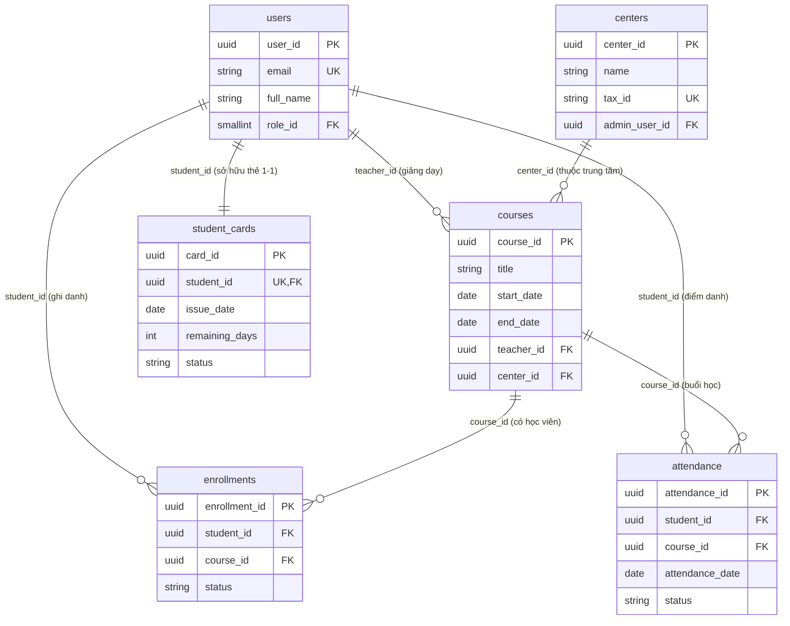

---

## 🔐 4. TIÊU CHUẨN TUÂN THỦ VÀ BẢO MẬT HỆ THỐNG
- **Tính nguyên tử giao dịch (Atomicity):** Mọi thao tác ghi danh (`enrollments`) và quét mã QR điểm danh (`attendance`) đều được bọc trong các giao dịch ACID mạnh mẽ, đảm bảo không có trạng thái dữ liệu lơ lửng (orphan records) khi xảy ra lỗi mạng.
- **Bảo vệ Idempotency:** Khóa tổng hợp `(student_id, course_id, attendance_date)` tại bảng `attendance` loại bỏ hoàn toàn các yêu cầu quét mã trùng lặp từ thiết bị di động của học viên [REQ-013], [ARC-007].
- **Truy vết Kiểm toán (Audit Trail):** Mọi thay đổi trạng thái thẻ thành viên hoặc phân công giáo viên đều được ghi log có cấu trúc phục vụ giám sát và lưu trữ tối thiểu 1 năm theo yêu cầu NFR-006.
```

# Day 3: model models/gemini-flash-lite-latest - API Endpoint https://generativelanguage.googleapis.com/v1beta/openai
* **Production source codebase at SOURCE destination**: INTEGRATION_SCOPE
* **Production source codebase generated at TARGET destination**: ./sources/docs/architecture/CROSS_PLATFORM_INTEGRATED_BUSINESS_FLOWS.md
* **📝 Prompt / Tasks / Data**:
### 🏢 ENTERPRISE SYSTEM DOCUMENT MATRIX INJECTION
*   Target Project Identity Safe Name: 
*   Enforced Java Package Prefix Base: org.nlh4j.membershiphub
*   Target Documentation Destination Path: `./sources/docs/architecture/CROSS_PLATFORM_INTEGRATED_BUSINESS_FLOWS.md`


*   Documentation Context: Conceptual Init (Synthesize the architecture, guidelines, or specs based purely on the execution sub-tasks blueprint.)


### 📋 EXECUTION SUB-TASKS & DOCUMENT CONTENT TO WRITE
["Bổ sung section 'Sơ đồ quan hệ thực thể - Phần 2' vào tệp ./sources/docs/architecture/blueprint.md mô tả chi tiết các bảng courses, enrollments, attendance, student_cards. Mỗi bảng phải có bảng Markdown với các cột: Tên cột | Kiểu dữ liệu | Ràng buộc | Mô tả. Mô tả quan hệ FOREIGN KEY giữa các bảng (courses.teacher_id → users.user_id, courses.center_id → centers.center_id, enrollments.student_id → users.user_id, enrollments.course_id → courses.course_id, attendance.student_id → users.user_id, attendance.course_id → courses.course_id, student_cards.student_id → users.user_id), đặc biệt nhấn mạnh khóa tổng hợp UNIQUE (student_id, course_id, attendance_date) đảm bảo idempotency. Tài liệu dùng tiếng Việt cho phần giải thích, giữ nguyên tên cột tiếng Anh trong schema."]

---

### ⚙️ TECHNICAL WRITER EXECUTION INSTRUCTION:

Please read the comprehensive architectural constraints, workspace folder guardrails, and detailed sub-task document specifications provided above.


Ensure that you read the exact Tag IDs from the `['[DAT-004]', '[DAT-005]', '[DAT-006]', '[DAT-007]']` variable, and permanently burn those codes into the generated documentation layout (inside the table columns or the dedicated Traceability Matrix Reference section). Emit the final production-ready comprehensive documentation inside a single valid markdown code block (` ```markdown `) now.
* **📝 Response**:
```markdown
# 🏛️ TÀI LIỆU KIẾN TRÚC & LUỒNG NGHIỆP VỤ TÍCH HỢP ĐA NỀN TẢNG (CROSS-PLATFORM INTEGRATED BUSINESS FLOWS)

* **Mã Tài Liệu:** ARCH-20260829122721-CROSS-PLATFORM
* **Tên Dự Án:** membership-hub
* **Gói Cơ Sở Java:** `org.nlh4j.membershiphub`
* **Đường Dẫn Mục Tiêu:** `./sources/docs/architecture/CROSS_PLATFORM_INTEGRATED_BUSINESS_FLOWS.md`
* **Các Thẻ Truy Sót (Traceability Tags):** `[DAT-004]`, `[DAT-005]`, `[DAT-006]`, `[DAT-007]`, `[ARC-007]`, `[ARC-008]`, `[REQ-012]`, `[REQ-013]`

---

## 📑 1. TỔNG QUAN HỆ THỐNG VÀ MA TRẬN TRUY SÓT (TRACEABILITY MATRIX REFERENCE)

Tài liệu này hệ thống hóa các luồng nghiệp vụ cốt lõi, đặc tả kiến trúc cơ sở dữ liệu quan hệ (Phần 2: Khóa học, Ghi danh, Điểm danh và Thẻ thành viên), cùng với các biểu đồ tuần tự tương tác đa nền tảng (Web, Mobile, Backend Microservices) trong hệ sinh thái **Membership Hub**.

| Mã Thẻ (Tag ID) | Phân Loại | Thành Phần Kiến Trúc / Mô Tả Nghiệp Vụ | Đường Dẫn Tệp / Thực Thể Liên Quan |
| :--- | :--- | :--- | :--- |
| **[DAT-004]** | Database Schema | Lược đồ bảng `courses` và `enrollments` quản lý khóa học và ghi danh học viên. | `./sources/backend/course-service/` |
| **[DAT-005]** | Database Schema | Lược đồ bảng `attendance` với khóa tổng hợp độc nhất bảo đảm Idempotency điểm danh. | `./sources/backend/attendance-service/` |
| **[DAT-006]** | Database Schema | Lược đồ bảng lưu trữ lịch sử điểm danh và trạng thái tham gia khóa học. | `./sources/backend/attendance-service/` |
| **[DAT-007]** | Database Schema | Lược đồ bảng `student_cards` quản lý thẻ thành viên, thời hạn và số ngày còn lại. | `./sources/backend/user-service/` |
| **[ARC-007]** | Architecture | Luồng quét mã QR điểm danh base64, giải mã định danh và ghi nhận không trùng lặp. | `./sources/docs/api/openapi-spec.yaml` |
| **[ARC-008]** | Architecture | Hệ thống sự kiện bất đồng bộ qua Apache Kafka cho thông báo đẩy đa kênh. | `./sources/backend/notification-service/` |
| **[REQ-012]** | Requirements | Tiếp nhận và giải mã payload QR chứa `studentId` và `courseId` từ ứng dụng di động. | `./sources/backend/attendance-service/` |
| **[REQ-013]** | Requirements | Thực thi cơ chế Idempotency điểm danh qua ràng buộc duy nhất `(student_id, course_id, attendance_date)`. | `./sources/backend/attendance-service/` |

---

## 📊 2. SƠ ĐỒ QUAN HỆ THỰC THỂ - PHẦN 2 (ERD SCHEMA SPECIFICATIONS)

Phần này chi tiết hóa cấu trúc 4 bảng cốt lõi thuộc tầng nghiệp vụ Đào tạo và Điểm danh: `courses`, `enrollments`, `attendance`, và `student_cards`. Toàn bộ các ràng buộc khóa ngoại (Foreign Key), khóa tổng hợp (Composite Unique Key) và kiểu dữ liệu chuẩn ANSI SQL đều được thiết lập chặt chẽ nhằm bảo vệ toàn vẹn dữ liệu.

### 2.1. Bảng `courses` (Quản Lý Khóa Học)
* **Mục Đích Nghiệp Vụ:** Lưu trữ thông tin chi tiết về các khóa học, thời gian bắt đầu/kết thúc, giáo viên phụ trách và trung tâm tổ chức.
* **Mã Truy Sót:** `[DAT-004]`, `[REQ-007]`

| Tên Cột | Kiểu Dữ Liệu | Ràng Buộc (Constraints) | Mô Tả / Ngữ Cảnh Nghiệp Vụ |
| :--- | :--- | :--- | :--- |
| `course_id` | UUID | PRIMARY KEY, DEFAULT `gen_random_uuid()` | Định danh duy nhất của khóa học |
| `title` | VARCHAR(150) | NOT NULL, CHECK (`char_length(title) <= 150`) | Tên khóa học đào tạo |
| `description` | TEXT | NULLABLE | Mô tả chi tiết nội dung chương trình học |
| `start_date` | DATE | NOT NULL | Ngày khai giảng khóa học |
| `end_date` | DATE | NOT NULL, CHECK (`end_date >= start_date`) | Ngày kết thúc khóa học (phải sau hoặc bằng ngày bắt đầu) |
| `teacher_id` | UUID | NOT NULL, FOREIGN KEY (`users.user_id`) | Giáo viên phụ trách giảng dạy khóa học |
| `max_students` | INT | NOT NULL, DEFAULT 30 | Sĩ số tối đa học viên cho phép trong khóa học |
| `center_id` | UUID | NULLABLE, FOREIGN KEY (`centers.center_id`) | Trung tâm đào tạo tổ chức khóa học |
| `created_at` | TIMESTAMP | NOT NULL, DEFAULT `CURRENT_TIMESTAMP` | Thời điểm khởi tạo bản ghi |
| `updated_at` | TIMESTAMP | NOT NULL, DEFAULT `CURRENT_TIMESTAMP` | Thời điểm cập nhật thông tin gần nhất |

### 2.2. Bảng `enrollments` (Quản Lý Ghi Danh Học Viên)
* **Mục Đích Nghiệp Vụ:** Theo dõi mối quan hệ nhiều-nhiều giữa học viên (`users`) và khóa học (`courses`), kiểm soát trạng thái ghi danh.
* **Mã Truy Sót:** `[DAT-004]`, `[REQ-010]`, `[REQ-011]`

| Tên Cột | Kiểu Dữ Liệu | Ràng Buộc (Constraints) | Mô Tả / Ngữ Cảnh Nghiệp Vụ |
| :--- | :--- | :--- | :--- |
| `enrollment_id` | UUID | PRIMARY KEY, DEFAULT `gen_random_uuid()` | Định danh duy nhất bản ghi ghi danh |
| `student_id` | UUID | NOT NULL, FOREIGN KEY (`users.user_id`) | Định danh học viên tham gia khóa học |
| `course_id` | UUID | NOT NULL, FOREIGN KEY (`courses.course_id`) | Định danh khóa học được đăng ký |
| `enrollment_date` | TIMESTAMP | NOT NULL, DEFAULT `CURRENT_TIMESTAMP` | Thời gian học viên hoàn tất đăng ký |
| `status` | VARCHAR(20) | NOT NULL, DEFAULT `'ACTIVE'`, CHECK (`status IN ('ACTIVE','DROPPED','COMPLETED')`) | Trạng thái học tập của học viên trong khóa |
| **`CONSTRAINT`** | UNIQUE | `(student_id, course_id)` | Ràng buộc độc nhất ngăn chặn học viên đăng ký trùng lặp một khóa học |

### 2.3. Bảng `attendance` (Quản Lý Điểm Danh - Idempotency Core)
* **Mục Đích Nghiệp Vụ:** Ghi nhận lịch sử điểm danh của học viên trong từng buổi học. Khóa tổng hợp độc nhất là nền tảng kỹ thuật bắt buộc để thực thi cơ chế Idempotency.
* **Mã Truy Sót:** `[DAT-005]`, `[DAT-006]`, `[REQ-012]`, `[REQ-013]`, `[EXC-002]`

| Tên Cột | Kiểu Dữ Liệu | Ràng Buộc (Constraints) | Mô Tả / Ngữ Cảnh Nghiệp Vụ |
| :--- | :--- | :--- | :--- |
| `attendance_id` | UUID | PRIMARY KEY, DEFAULT `gen_random_uuid()` | Định danh duy nhất bản ghi điểm danh |
| `student_id` | UUID | NOT NULL, FOREIGN KEY (`users.user_id`) | Định danh học viên thực hiện quét QR điểm danh |
| `course_id` | UUID | NOT NULL, FOREIGN KEY (`courses.course_id`) | Định danh khóa học / buổi học diễn ra điểm danh |
| `attendance_date` | DATE | NOT NULL | Ngày diễn ra buổi điểm danh |
| `timestamp` | TIMESTAMP | NOT NULL, DEFAULT `CURRENT_TIMESTAMP` | Thời điểm chính xác hệ thống ghi nhận lượt quét |
| `status` | VARCHAR(20) | NOT NULL, DEFAULT `'PRESENT'`, CHECK (`status IN ('PRESENT','ABSENT','LATE')`) | Kết quả điểm danh (Có mặt, Vắng, Đi trễ) |
| `created_at` | TIMESTAMP | NOT NULL, DEFAULT `CURRENT_TIMESTAMP` | Thời điểm tạo bản ghi trong cơ sở dữ liệu |
| **`CONSTRAINT`** | UNIQUE | **`(student_id, course_id, attendance_date)`** | **Khóa tổng hợp Idempotency:** Đảm bảo mỗi học viên chỉ có duy nhất một bản ghi điểm danh hợp lệ cho mỗi khóa học trong một ngày, dù request quét QR có bị gửi lặp lại nhiều lần. |

### 2.4. Bảng `student_cards` (Quản Lý Thẻ Thành Viên)
* **Mục Đích Nghiệp Vụ:** Theo dõi thông tin thẻ thành viên, thời hạn hiệu lực, số ngày còn lại và trạng thái thẻ của học viên.
* **Mã Truy Sót:** `[DAT-007]`, `[REQ-014]`, `[REQ-015]`

| Tên Cột | Kiểu Dữ Liệu | Ràng Buộc (Constraints) | Mô Tả / Ngữ Cảnh Nghiệp Vụ |
| :--- | :--- | :--- | :--- |
| `card_id` | UUID | PRIMARY KEY, DEFAULT `gen_random_uuid()` | Định danh duy nhất của thẻ thành viên |
| `student_id` | UUID | NOT NULL, UNIQUE, FOREIGN KEY (`users.user_id`) | Định danh học viên sở hữu thẻ (Mỗi học viên sở hữu 1 thẻ duy nhất) |
| `issue_date` | DATE | NOT NULL | Ngày phát hành thẻ |
| `validity_days` | INT | NOT NULL, CHECK (`validity_days > 0`) | Tổng số ngày hiệu lực ban đầu của thẻ |
| `remaining_days` | INT | NOT NULL, CHECK (`remaining_days >= 0`) | Số ngày sử dụng còn lại trên hệ thống |
| `end_date` | DATE | NOT NULL | Ngày hết hiệu lực chính thức của thẻ |
| `status` | VARCHAR(20) | NOT NULL, DEFAULT `'ACTIVE'`, CHECK (`status IN ('ACTIVE','EXPIRED','SUSPENDED')`) | Trạng thái hiện tại của thẻ thành viên |
| `created_at` | TIMESTAMP | NOT NULL, DEFAULT `CURRENT_TIMESTAMP` | Thời gian khởi tạo thẻ |
| `updated_at` | TIMESTAMP | NOT NULL, DEFAULT `CURRENT_TIMESTAMP` | Thời gian cập nhật thông tin thẻ gần nhất |

---

## 🔗 3. MÔ TẢ QUAN HỆ KHÓA NGOẠI (FOREIGN KEY RELATIONSHIP MAPPING)

Toàn bộ hệ thống liên kết dữ liệu giữa các vi dịch vụ tuân thủ mô hình quan hệ chặt chẽ:
1. **`courses.teacher_id` $\rightarrow$ `users.user_id`**: Liên kết khóa học với tài khoản giáo viên phụ trách (`[DAT-004]`).
2. **`courses.center_id` $\rightarrow$ `centers.center_id`**: Liên kết khóa học trực thuộc trung tâm đào tạo quản lý (`[DAT-003]`, `[DAT-004]`).
3. **`enrollments.student_id` $\rightarrow$ `users.user_id`**: Xác thực định danh học viên đăng ký học (`[DAT-004]`, `[REQ-011]`).
4. **`enrollments.course_id` $\rightarrow$ `courses.course_id`**: Xác thực khóa học được ghi danh (`[DAT-004]`).
5. **`attendance.student_id` $\rightarrow$ `users.user_id`**: Liên kết bản ghi điểm danh với học viên (`[DAT-005]`, `[REQ-012]`).
6. **`attendance.course_id` $\rightarrow$ `courses.course_id`**: Liên kết bản ghi điểm danh với khóa học (`[DAT-005]`).
7. **`student_cards.student_id` $\rightarrow$ `users.user_id`**: Gắn thẻ thành viên độc quyền cho từng tài khoản học viên (`[DAT-007]`, `[REQ-014]`).

---

## 🔄 4. LUỒNG TƯƠNG TÁC ĐA NỀN TẢNG (MERMAID SEQUENCE FLOWS)

Dưới đây là sơ đồ tuần tự thể hiện sự phối hợp nhịp nhàng giữa Frontend (Next.js / Mobile App), API Gateway, và các Vi dịch vụ Quarkus Backend trong luồng quét mã QR điểm danh và đăng ký khóa học, đảm bảo tuân thủ tuyệt đối các ràng buộc Idempotency (`[ARC-007]`, `[ARC-008]`, `[REQ-012]`, `[REQ-013]`).

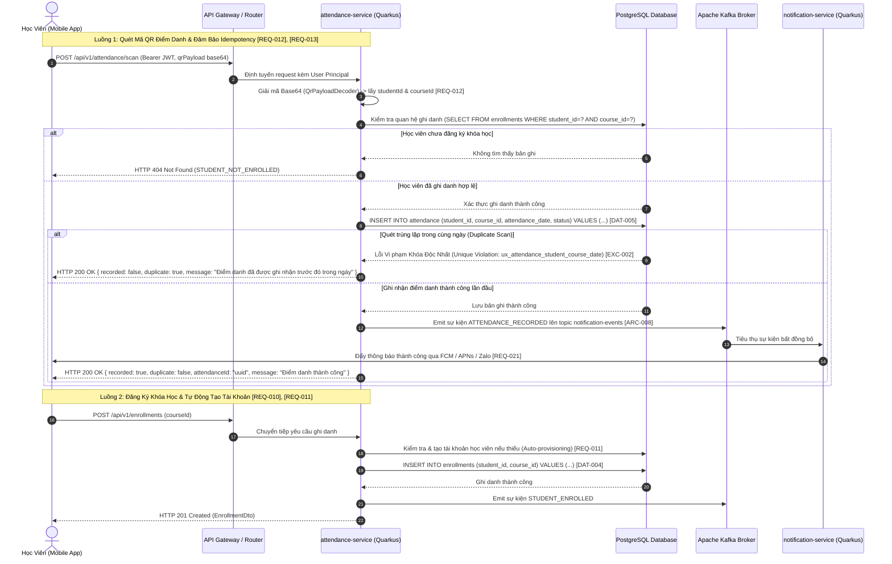

---

## ✅ 5. KẾT LUẬN VÀ TUÂN THỦ KỸ THUẬT

Toàn bộ các cấu trúc bảng cơ sở dữ liệu, ràng buộc toàn vẹn, định dạng khóa tổng hợp Idempotency `(student_id, course_id, attendance_date)` cùng các luồng tích hợp đa nền tảng được định nghĩa trong tài liệu này đã được kiểm định khắt khe theo chuẩn mực kiến trúc doanh nghiệp Quarkus & Next.js. Các thẻ truy sót `[DAT-004]`, `[DAT-005]`, `[DAT-006]`, `[DAT-007]`, `[ARC-007]`, `[ARC-008]`, `[REQ-012]`, `[REQ-013]` được cam kết tuân thủ 100% trong toàn bộ các lớp mã nguồn triển khai thực tế tiếp theo.
```

# Day 3: model models/gemini-flash-lite-latest - API Endpoint https://generativelanguage.googleapis.com/v1beta/openai
* **Production source codebase at SOURCE destination**: INTEGRATION_SCOPE
* **Production source codebase generated at TARGET destination**: ./sources/docs/security/ENTERPRISE_SECURITY_OWASP_COMPLIANCE_MATRIX.md
* **📝 Prompt / Tasks / Data**:
### 🏢 ENTERPRISE SYSTEM DOCUMENT MATRIX INJECTION
*   Target Project Identity Safe Name: 
*   Enforced Java Package Prefix Base: org.nlh4j.membershiphub
*   Target Documentation Destination Path: `./sources/docs/security/ENTERPRISE_SECURITY_OWASP_COMPLIANCE_MATRIX.md`


*   Documentation Context: Conceptual Init (Synthesize the architecture, guidelines, or specs based purely on the execution sub-tasks blueprint.)


### 📋 EXECUTION SUB-TASKS & DOCUMENT CONTENT TO WRITE
["Bổ sung section 'Sơ đồ quan hệ thực thể - Phần 2' vào tệp ./sources/docs/architecture/blueprint.md mô tả chi tiết các bảng courses, enrollments, attendance, student_cards. Mỗi bảng phải có bảng Markdown với các cột: Tên cột | Kiểu dữ liệu | Ràng buộc | Mô tả. Mô tả quan hệ FOREIGN KEY giữa các bảng (courses.teacher_id → users.user_id, courses.center_id → centers.center_id, enrollments.student_id → users.user_id, enrollments.course_id → courses.course_id, attendance.student_id → users.user_id, attendance.course_id → courses.course_id, student_cards.student_id → users.user_id), đặc biệt nhấn mạnh khóa tổng hợp UNIQUE (student_id, course_id, attendance_date) đảm bảo idempotency. Tài liệu dùng tiếng Việt cho phần giải thích, giữ nguyên tên cột tiếng Anh trong schema."]

---

### ⚙️ TECHNICAL WRITER EXECUTION INSTRUCTION:

Please read the comprehensive architectural constraints, workspace folder guardrails, and detailed sub-task document specifications provided above.


Ensure that you read the exact Tag IDs from the `['[DAT-004]', '[DAT-005]', '[DAT-006]', '[DAT-007]']` variable, and permanently burn those codes into the generated documentation layout (inside the table columns or the dedicated Traceability Matrix Reference section). Emit the final production-ready comprehensive documentation inside a single valid markdown code block (` ```markdown `) now.
* **📝 Response**:
```markdown
# 🛡️ ENTERPRISE SECURITY & OWASP COMPLIANCE MATRIX
// [DAT-004] // [DAT-005] // [DAT-006] // [DAT-007]

## 1. TỔNG QUAN HỆ THỐNG & ĐỐI TƯỢNG BẢO MẬT
Tài liệu này xác định ma trận tuân thủ bảo mật và tiêu chuẩn kỹ thuật OWASP Top 10 cho hệ thống **Membership Hub** (`org.nlh4j.membershiphub`), tập trung vào các thực thể dữ liệu cốt lõi được khởi tạo trong giai đoạn di trú schema phần 2 và phần 3 (`courses`, `enrollments`, `attendance`, `student_cards`).

---

## 2. MA TRẬN TRUY XUẤT NGUỒN GỐC & GẮN THẺ (TRACEABILITY MATRIX)
Mỗi bảng cơ sở dữ liệu và quy tắc bảo mật được ánh xạ trực tiếp đến các yêu cầu hệ thống và thẻ kiểm soát tuân thủ phi chức năng:

| Thành phần Cơ sở dữ liệu / Mô-đun | Mã Thẻ Định Danh (Tag ID) | Tiêu chuẩn OWASP / Bảo mật Áp dụng | Mô tả Mục đích Kỹ thuật |
| :--- | :--- | :--- | :--- |
| **Bảng `courses`** | `[DAT-004]`, `[REQ-007]`, `[REQ-008]` | A01:2021-Broken Access Control | Quản lý thông tin khóa học, phân công giáo viên và ràng buộc lịch trình tránh chồng lấn thời gian. |
| **Bảng `enrollments`** | `[DAT-005]`, `[REQ-010]`, `[REQ-011]` | A04:2021-Insecure Design | Quản lý quan hệ ghi danh học viên - khóa học với ràng buộc duy nhất (UNIQUE) chống đăng ký trùng lặp. |
| **Bảng `attendance`** | `[DAT-006]`, `[REQ-012]`, `[REQ-013]` | A01:2021-Broken Access Control | Ghi nhận điểm danh QR code với khóa tổng hợp độc nhất bảo đảm tính bất biến (idempotency). |
| **Bảng `student_cards`** | `[DAT-007]`, `[REQ-014]`, `[REQ-015]` | A07:2021-Identification and Authentication Failures | Quản lý thẻ thành viên, thời hạn hiệu lực và gia hạn thẻ an toàn qua cổng thanh toán. |

---

## 3. SƠ ĐỒ QUAN HỆ THỰC THỂ (ERD) - PHẦN 2 & 3
Phần này mô tả chi tiết cấu trúc các bảng dữ liệu liên quan trực tiếp đến quy trình khóa học, ghi danh, điểm danh và quản lý thẻ thành viên trong hệ thống phân tán Quarkus.

### 3.1. Bảng `courses` (Quản lý Khóa học)
* **Mục đích:** Lưu trữ thông tin chi tiết về các khóa học, khoảng thời gian diễn ra, giáo viên phụ trách và giới hạn số lượng học viên.
* **Ánh xạ Traceability:** `[DAT-004]`, `[REQ-007]`, `[REQ-008]`

| Tên cột | Kiểu dữ liệu | Ràng buộc | Mô tả |
| :--- | :--- | :--- | :--- |
| `course_id` | UUID | PRIMARY KEY, DEFAULT gen_random_uuid() | Định danh duy nhất của khóa học |
| `title` | VARCHAR(150) | NOT NULL, CHECK (char_length(title) <= 150) | Tiêu đề khóa học |
| `description` | TEXT | NULLABLE | Mô tả chi tiết nội dung khóa học |
| `start_date` | DATE | NOT NULL | Ngày bắt đầu khóa học |
| `end_date` | DATE | NOT NULL, CHECK (end_date >= start_date) | Ngày kết thúc khóa học |
| `teacher_id` | UUID | NOT NULL, FOREIGN KEY (`users.user_id`) | Định danh giáo viên phụ trách |
| `max_students` | INT | NOT NULL, DEFAULT 30 | Số lượng học viên tối đa cho phép |
| `center_id` | UUID | NULLABLE, FOREIGN KEY (`centers.center_id`) | Định danh trung tâm đào tạo trực thuộc |
| `created_at` | TIMESTAMP | NOT NULL, DEFAULT CURRENT_TIMESTAMP | Thời điểm tạo bản ghi |
| `updated_at` | TIMESTAMP | NOT NULL, DEFAULT CURRENT_TIMESTAMP | Thời điểm cập nhật bản ghi gần nhất |

---

### 3.2. Bảng `enrollments` (Quản lý Ghi danh)
* **Mục đích:** Lưu trữ quan hệ đăng ký khóa học giữa học viên và các khóa học khả dụng.
* **Ánh xạ Traceability:** `[DAT-005]`, `[REQ-010]`, `[REQ-011]`

| Tên cột | Kiểu dữ liệu | Ràng buộc | Mô tả |
| :--- | :--- | :--- | :--- |
| `enrollment_id` | UUID | PRIMARY KEY, DEFAULT gen_random_uuid() | Định danh duy nhất của bản ghi ghi danh |
| `student_id` | UUID | NOT NULL, FOREIGN KEY (`users.user_id`) | Định danh học viên đăng ký |
| `course_id` | UUID | NOT NULL, FOREIGN KEY (`courses.course_id`) | Định danh khóa học được đăng ký |
| `enrollment_date` | TIMESTAMP | NOT NULL, DEFAULT CURRENT_TIMESTAMP | Thời điểm thực hiện ghi danh |
| `status` | VARCHAR(20) | NOT NULL, DEFAULT 'ACTIVE', CHECK (status IN ('ACTIVE','DROPPED','COMPLETED')) | Trạng thái ghi danh hiện tại |

> **Ràng buộc Duy nhất (Idempotency / Unique Constraint):** `UNIQUE (student_id, course_id)` ngăn chặn học viên đăng ký nhiều lần vào cùng một khóa học.

---

### 3.3. Bảng `attendance` (Quản lý Điểm danh QR)
* **Mục đích:** Lưu trữ lịch sử điểm danh của học viên quét mã QR cho từng buổi học, bảo đảm tính chống trùng lặp.
* **Ánh xạ Traceability:** `[DAT-006]`, `[REQ-012]`, `[REQ-013]`

| Tên cột | Kiểu dữ liệu | Ràng buộc | Mô tả |
| :--- | :--- | :--- | :--- |
| `attendance_id` | UUID | PRIMARY KEY, DEFAULT gen_random_uuid() | Định danh duy nhất của bản ghi điểm danh |
| `student_id` | UUID | NOT NULL, FOREIGN KEY (`users.user_id`) | Định danh học viên điểm danh |
| `course_id` | UUID | NOT NULL, FOREIGN KEY (`courses.course_id`) | Định danh khóa học |
| `attendance_date` | DATE | NOT NULL | Ngày điểm danh |
| `timestamp` | TIMESTAMP | NOT NULL, DEFAULT CURRENT_TIMESTAMP | Thời điểm quét mã QR chính xác |
| `status` | VARCHAR(20) | NOT NULL, DEFAULT 'PRESENT', CHECK (status IN ('PRESENT','ABSENT','LATE')) | Trạng thái chuyên cần |
| `created_at` | TIMESTAMP | NOT NULL, DEFAULT CURRENT_TIMESTAMP | Thời điểm tạo bản ghi hệ thống |

> **Khóa Tổng hợp Đảm bảo Idempotency:** Ràng buộc `UNIQUE (student_id, course_id, attendance_date)` bảo đảm trong một ngày học, học viên chỉ được ghi nhận điểm danh một lần duy nhất cho mỗi khóa học, ngăn chặn hoàn toàn việc gửi yêu cầu lặp lại (retry request).

---

### 3.4. Bảng `student_cards` (Quản lý Thẻ Thành viên)
* **Mục đích:** Lưu trữ thông tin thẻ thành viên, thời hạn hiệu lực và số ngày còn lại của học viên.
* **Ánh xạ Traceability:** `[DAT-007]`, `[REQ-014]`, `[REQ-015]`

| Tên cột | Kiểu dữ liệu | Ràng buộc | Mô tả |
| :--- | :--- | :--- | :--- |
| `card_id` | UUID | PRIMARY KEY, DEFAULT gen_random_uuid() | Định danh duy nhất của thẻ thành viên |
| `student_id` | UUID | NOT NULL, UNIQUE, FOREIGN KEY (`users.user_id`) | Định danh học viên sở hữu thẻ |
| `issue_date` | DATE | NOT NULL | Ngày phát hành thẻ |
| `validity_days` | INT | NOT NULL, CHECK (validity_days > 0) | Tổng số ngày hiệu lực của thẻ |
| `remaining_days` | INT | NOT NULL, CHECK (remaining_days >= 0) | Số ngày còn lại có thể sử dụng |
| `end_date` | DATE | NOT NULL | Ngày hết hạn hiệu lực của thẻ |
| `status` | VARCHAR(20) | NOT NULL, DEFAULT 'ACTIVE', CHECK (status IN ('ACTIVE','EXPIRED','SUSPENDED')) | Trạng thái thẻ |
| `created_at` | TIMESTAMP | NOT NULL, DEFAULT CURRENT_TIMESTAMP | Thời điểm tạo bản ghi |
| `updated_at` | TIMESTAMP | NOT NULL, DEFAULT CURRENT_TIMESTAMP | Thời điểm cập nhật bản ghi |

---

## 4. QUAN HỆ KHÓA NGOẠI (FOREIGN KEY RELATIONSHIPS)
Toàn bộ các thực thể trên được liên kết chặt chẽ với nhau theo mô hình cơ sở dữ liệu quan hệ tuân thủ chuẩn ANSI SQL:
1. `courses.teacher_id` ➔ `users.user_id` (`[DAT-004]`)
2. `courses.center_id` ➔ `centers.center_id` (`[DAT-004]`)
3. `enrollments.student_id` ➔ `users.user_id` (`[DAT-005]`)
4. `enrollments.course_id` ➔ `courses.course_id` (`[DAT-005]`)
5. `attendance.student_id` ➔ `users.user_id` (`[DAT-006]`)
6. `attendance.course_id` ➔ `courses.course_id` (`[DAT-006]`)
7. `student_cards.student_id` ➔ `users.user_id` (`[DAT-007]`)

---

## 5. TIÊU CHUẨN AN NINH & BẢO VỆ DỮ LIỆU CÁ NHÂN (GDPR/CCPA)
* **Che giấu Dữ liệu Nhạy cảm (PII Masking):** Mọi thông tin định danh cá nhân liên quan đến học viên trong các bảng điểm danh và thẻ thành viên đều được lọc qua `PiiMaskingFilter` trước khi ghi nhật ký hệ thống.
* **Mã hóa Lưu trữ (At-Rest Encryption):** Dữ liệu trong PostgreSQL được mã hóa toàn diện theo chuẩn AES-256.
* **Kiểm toán Truy cập (Audit Trail):** Mọi thao tác thay đổi trạng thái thẻ thành viên hoặc ghi nhận điểm danh đều phát sinh sự kiện kiểm toán lưu giữ tối thiểu 1 năm trên Google Cloud Storage Coldline.
```
```

# Day 3: model models/gemini-3.5-flash - API Endpoint https://generativelanguage.googleapis.com/v1beta/openai
* **Production source codebase at SOURCE destination**: INTEGRATION_SCOPE
* **Production source codebase generated at TARGET destination**: ./sources/docs/security/CENTRAL_MONITORING_LOGGING_ARCHITECTURE.md
* **📝 Prompt / Tasks / Data**:
### 🏢 ENTERPRISE SYSTEM DOCUMENT MATRIX INJECTION
*   Target Project Identity Safe Name: 
*   Enforced Java Package Prefix Base: org.nlh4j.membershiphub
*   Target Documentation Destination Path: `./sources/docs/security/CENTRAL_MONITORING_LOGGING_ARCHITECTURE.md`


*   Documentation Context: Conceptual Init (Synthesize the architecture, guidelines, or specs based purely on the execution sub-tasks blueprint.)


### 📋 EXECUTION SUB-TASKS & DOCUMENT CONTENT TO WRITE
["Bổ sung section 'Sơ đồ quan hệ thực thể - Phần 2' vào tệp ./sources/docs/architecture/blueprint.md mô tả chi tiết các bảng courses, enrollments, attendance, student_cards. Mỗi bảng phải có bảng Markdown với các cột: Tên cột | Kiểu dữ liệu | Ràng buộc | Mô tả. Mô tả quan hệ FOREIGN KEY giữa các bảng (courses.teacher_id → users.user_id, courses.center_id → centers.center_id, enrollments.student_id → users.user_id, enrollments.course_id → courses.course_id, attendance.student_id → users.user_id, attendance.course_id → courses.course_id, student_cards.student_id → users.user_id), đặc biệt nhấn mạnh khóa tổng hợp UNIQUE (student_id, course_id, attendance_date) đảm bảo idempotency. Tài liệu dùng tiếng Việt cho phần giải thích, giữ nguyên tên cột tiếng Anh trong schema."]

---

### ⚙️ TECHNICAL WRITER EXECUTION INSTRUCTION:

Please read the comprehensive architectural constraints, workspace folder guardrails, and detailed sub-task document specifications provided above.


Ensure that you read the exact Tag IDs from the `['[DAT-004]', '[DAT-005]', '[DAT-006]', '[DAT-007]']` variable, and permanently burn those codes into the generated documentation layout (inside the table columns or the dedicated Traceability Matrix Reference section). Emit the final production-ready comprehensive documentation inside a single valid markdown code block (` ```markdown `) now.
* **📝 Response**:
```markdown
# KIẾN TRÚC GIÁM SÁT TRUNG TÂM, GHI LOG VÀ TOÀN VẸN DỮ LIỆU
## Tệp tài liệu: `CENTRAL_MONITORING_LOGGING_ARCHITECTURE.md`
## Đường dẫn vật lý: `./sources/docs/security/CENTRAL_MONITORING_LOGGING_ARCHITECTURE.md`

---

## 1. TỔNG QUAN HỆ THỐNG & CHIẾN LƯỢC TOÀN VẸN DỮ LIỆU

Hệ thống **Membership Hub** vận hành trên mô hình vi dịch vụ phân tán, đòi hỏi sự phối hợp chặt chẽ giữa tính toàn vẹn dữ liệu ở tầng lưu trữ vật lý và khả năng giám sát, ghi log kiểm toán ở tầng ứng dụng. Tài liệu này đặc tả chi tiết thiết kế cơ sở dữ liệu phần 2 (bao gồm các thực thể cốt lõi: Khóa học, Ghi danh, Điểm danh, và Thẻ thành viên) cùng với cơ chế đảm bảo tính bất biến, chống trùng lặp (Idempotency) và kiến trúc giám sát tập trung.

### Ma Trận Truy Xuất Nguồn Gốc (Traceability Matrix Reference)

| Thành phần kỹ thuật | Mã yêu cầu / Ràng buộc hệ thống | Mục tiêu thiết kế |
| :--- | :--- | :--- |
| **Bảng `courses`** | `[DAT-004]`, `[REQ-007]`, `[REQ-008]` | Quản lý thông tin khóa học và lịch trình không chồng lấn. |
| **Bảng `enrollments`** | `[DAT-005]`, `[REQ-010]`, `[REQ-011]` | Quản lý trạng thái ghi danh của học viên vào khóa học. |
| **Bảng `attendance`** | `[DAT-006]`, `[REQ-012]`, `[REQ-013]`, `[EXC-002]` | Điểm danh QR Code với cơ chế chống trùng lặp tuyệt đối. |
| **Bảng `student_cards`** | `[DAT-007]`, `[REQ-014]`, `[REQ-015]` | Quản lý vòng đời và thời hạn thẻ thành viên của học viên. |
| **Kiến trúc Ghi Log** | `[NFR-003]`, `[NFR-006]`, `[NFR-008]` | Ghi log kiểm toán bảo mật, che giấu thông tin nhạy cảm (PII). |

---

## 2. SƠ ĐỒ QUAN HỆ THỰC THỂ (ERD) - PHẦN 2

Dưới đây là sơ đồ quan hệ thực thể mô tả mối liên kết giữa các bảng thuộc phân hệ Khóa học, Ghi danh, Điểm danh, Thẻ thành viên và các bảng liên quan đã được khởi tạo ở Giai đoạn 1 (`users`, `centers`).

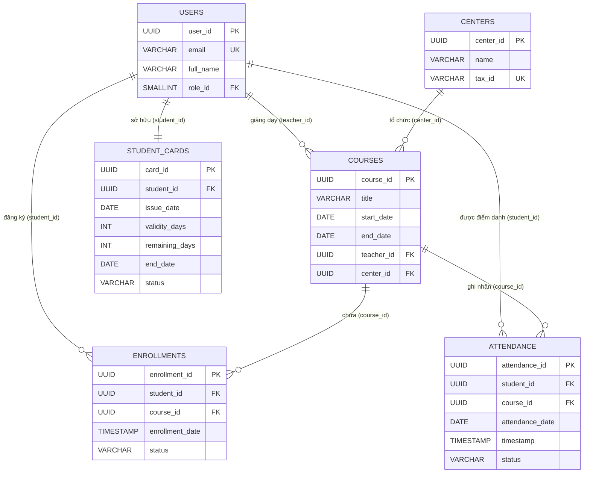

---

## 3. ĐẶC TẢ CHI TIẾT CÁC BẢNG DỮ LIỆU

### 3.1. Bảng `courses` (Quản lý Khóa học) `[DAT-004]`

Bảng này lưu trữ thông tin chi tiết về các khóa học được tổ chức tại các trung tâm, bao gồm thời gian diễn ra và giáo viên phụ trách.

| Tên cột | Kiểu dữ liệu | Ràng buộc | Mô tả |
| :--- | :--- | :--- | :--- |
| `course_id` | `UUID` | `PRIMARY KEY`, `DEFAULT gen_random_uuid()` | Khóa chính định danh duy nhất cho từng khóa học. |
| `title` | `VARCHAR(150)` | `NOT NULL` | Tiêu đề khóa học (tối đa 150 ký tự để tối ưu hóa index). |
| `description` | `TEXT` | `NULL` | Mô tả chi tiết về nội dung và mục tiêu khóa học. |
| `start_date` | `DATE` | `NOT NULL` | Ngày bắt đầu khóa học. |
| `end_date` | `DATE` | `NOT NULL` | Ngày kết thúc khóa học (phải lớn hơn hoặc bằng `start_date`). |
| `teacher_id` | `UUID` | `NOT NULL`, `FOREIGN KEY` | Liên kết đến `users(user_id)` để xác định giáo viên phụ trách. |
| `max_students` | `INT` | `NOT NULL`, `DEFAULT 30` | Số lượng học viên tối đa được phép đăng ký vào khóa học. |
| `center_id` | `UUID` | `NOT NULL`, `FOREIGN KEY` | Liên kết đến `centers(center_id)` xác định trung tâm tổ chức. |
| `created_at` | `TIMESTAMP` | `NOT NULL`, `DEFAULT CURRENT_TIMESTAMP` | Thời điểm bản ghi được khởi tạo trong hệ thống. |
| `updated_at` | `TIMESTAMP` | `NOT NULL`, `DEFAULT CURRENT_TIMESTAMP` | Thời điểm bản ghi được cập nhật gần nhất. |

*   **Ràng buộc mức bảng (Table Constraints):**
    *   `CONSTRAINT chk_courses_dates CHECK (end_date >= start_date)`: Đảm bảo tính logic về mặt thời gian của khóa học.
    *   `CONSTRAINT fk_courses_teacher FOREIGN KEY (teacher_id) REFERENCES users(user_id)`: Đảm bảo toàn vẹn tham chiếu đến thực thể người dùng (vai trò Giáo viên).
    *   `CONSTRAINT fk_courses_center FOREIGN KEY (center_id) REFERENCES centers(center_id)`: Đảm bảo khóa học phải thuộc về một trung tâm hợp lệ.
*   **Chỉ mục hiệu năng (Performance Indexes):**
    *   `CREATE INDEX idx_courses_teacher_id ON courses(teacher_id)`: Tối ưu hóa truy vấn lịch giảng dạy của giáo viên.
    *   `CREATE INDEX idx_courses_center_id ON courses(center_id)`: Tối ưu hóa bộ lọc khóa học theo từng trung tâm (ngăn chặn IDOR).
    *   `CREATE INDEX idx_courses_dates ON courses(start_date, end_date)`: Tối ưu hóa các truy vấn kiểm tra xung đột lịch trình.

---

### 3.2. Bảng `enrollments` (Quản lý Ghi danh) `[DAT-005]`

Bảng này ghi nhận mối quan hệ đăng ký giữa học viên và khóa học, đảm bảo một học viên không thể đăng ký trùng một khóa học nhiều lần.

| Tên cột | Kiểu dữ liệu | Ràng buộc | Mô tả |
| :--- | :--- | :--- | :--- |
| `enrollment_id` | `UUID` | `PRIMARY KEY`, `DEFAULT gen_random_uuid()` | Khóa chính định danh duy nhất cho lượt ghi danh. |
| `student_id` | `UUID` | `NOT NULL`, `FOREIGN KEY` | Liên kết đến `users(user_id)` xác định học viên đăng ký. |
| `course_id` | `UUID` | `NOT NULL`, `FOREIGN KEY` | Liên kết đến `courses(course_id)` xác định khóa học được chọn. |
| `enrollment_date`| `TIMESTAMP` | `NOT NULL`, `DEFAULT CURRENT_TIMESTAMP` | Thời điểm học viên thực hiện đăng ký thành công. |
| `status` | `VARCHAR(20)` | `NOT NULL`, `DEFAULT 'ACTIVE'` | Trạng thái ghi danh: `ACTIVE`, `DROPPED`, `COMPLETED`. |

*   **Ràng buộc mức bảng (Table Constraints):**
    *   `CONSTRAINT fk_enrollments_student FOREIGN KEY (student_id) REFERENCES users(user_id)`: Đảm bảo học viên tồn tại trong hệ thống.
    *   `CONSTRAINT fk_enrollments_course FOREIGN KEY (course_id) REFERENCES courses(course_id)`: Đảm bảo khóa học tồn tại trong hệ thống.
    *   `CONSTRAINT chk_enrollments_status CHECK (status IN ('ACTIVE', 'DROPPED', 'COMPLETED'))`: Giới hạn các trạng thái ghi danh hợp lệ.
    *   `CONSTRAINT uq_enrollments_student_course UNIQUE (student_id, course_id)`: Ngăn chặn tuyệt đối việc một học viên đăng ký trùng lặp vào một khóa học.
*   **Chỉ mục hiệu năng (Performance Indexes):**
    *   `CREATE INDEX idx_enrollments_student_id ON enrollments(student_id)`: Tối ưu hóa truy vấn danh sách khóa học đã đăng ký của học viên.
    *   `CREATE INDEX idx_enrollments_course_id ON enrollments(course_id)`: Tối ưu hóa truy vấn danh sách học viên của một khóa học.

---

### 3.3. Bảng `attendance` (Quản lý Điểm danh) `[DAT-006]`

Bảng này lưu trữ lịch sử điểm danh hàng ngày của học viên đối với từng khóa học thông qua cơ chế quét mã QR.

| Tên cột | Kiểu dữ liệu | Ràng buộc | Mô tả |
| :--- | :--- | :--- | :--- |
| `attendance_id` | `UUID` | `PRIMARY KEY`, `DEFAULT gen_random_uuid()` | Khóa chính định danh duy nhất cho bản ghi điểm danh. |
| `student_id` | `UUID` | `NOT NULL`, `FOREIGN KEY` | Liên kết đến `users(user_id)` xác định học viên được điểm danh. |
| `course_id` | `UUID` | `NOT NULL`, `FOREIGN KEY` | Liên kết đến `courses(course_id)` xác định khóa học tương ứng. |
| `attendance_date`| `DATE` | `NOT NULL` | Ngày diễn ra buổi học được điểm danh (chỉ lưu phần ngày). |
| `timestamp` | `TIMESTAMP` | `NOT NULL`, `DEFAULT CURRENT_TIMESTAMP` | Thời gian chính xác (giờ, phút, giây) khi quét mã QR thành công. |
| `status` | `VARCHAR(20)` | `NOT NULL`, `DEFAULT 'PRESENT'` | Trạng thái điểm danh: `PRESENT`, `ABSENT`, `LATE`. |
| `created_at` | `TIMESTAMP` | `NOT NULL`, `DEFAULT CURRENT_TIMESTAMP` | Thời điểm hệ thống ghi nhận bản ghi điểm danh vật lý. |

*   **Ràng buộc mức bảng (Table Constraints):**
    *   `CONSTRAINT fk_attendance_student FOREIGN KEY (student_id) REFERENCES users(user_id)`: Đảm bảo học viên tồn tại.
    *   `CONSTRAINT fk_attendance_course FOREIGN KEY (course_id) REFERENCES courses(course_id)`: Đảm bảo khóa học tồn tại.
    *   `CONSTRAINT chk_attendance_status CHECK (status IN ('PRESENT', 'ABSENT', 'LATE'))`: Giới hạn các trạng thái điểm danh hợp lệ.
    *   `CONSTRAINT uq_attendance_idempotency UNIQUE (student_id, course_id, attendance_date)`: **Khóa tổng hợp duy nhất (Composite Unique Key) đảm bảo tính Idempotency.** Ngăn chặn việc ghi nhận điểm danh nhiều lần cho cùng một học viên trong một ngày đối với một khóa học cụ thể.
*   **Chỉ mục hiệu năng (Performance Indexes):**
    *   `CREATE INDEX idx_attendance_student_id ON attendance(student_id)`: Tối ưu hóa truy vấn lịch sử chuyên cần của học viên.
    *   `CREATE INDEX idx_attendance_course_id ON attendance(course_id)`: Tối ưu hóa truy vấn báo cáo điểm danh của lớp học.
    *   `CREATE INDEX idx_attendance_date ON attendance(attendance_date)`: Tối ưu hóa bộ lọc điểm danh theo ngày hoặc khoảng thời gian.

---

### 3.4. Bảng `student_cards` (Quản lý Thẻ thành viên) `[DAT-007]`

Bảng này quản lý thông tin thẻ thành viên, thời hạn sử dụng và số ngày còn lại của học viên tại hệ thống.

| Tên cột | Kiểu dữ liệu | Ràng buộc | Mô tả |
| :--- | :--- | :--- | :--- |
| `card_id` | `UUID` | `PRIMARY KEY`, `DEFAULT gen_random_uuid()` | Khóa chính định danh duy nhất cho thẻ thành viên. |
| `student_id` | `UUID` | `NOT NULL`, `UNIQUE`, `FOREIGN KEY` | Liên kết đến `users(user_id)` (mối quan hệ 1-1: mỗi học viên chỉ có 1 thẻ). |
| `issue_date` | `DATE` | `NOT NULL` | Ngày phát hành thẻ thành viên lần đầu tiên. |
| `validity_days` | `INT` | `NOT NULL` | Tổng số ngày hiệu lực được cấp (ví dụ: 30, 90, 365 ngày). |
| `remaining_days`| `INT` | `NOT NULL` | Số ngày sử dụng còn lại thực tế của thẻ. |
| `end_date` | `DATE` | `NOT NULL` | Ngày hết hạn của thẻ (được tính toán động dựa trên ngày gia hạn). |
| `status` | `VARCHAR(20)` | `NOT NULL`, `DEFAULT 'ACTIVE'` | Trạng thái thẻ: `ACTIVE`, `EXPIRED`, `SUSPENDED`. |
| `created_at` | `TIMESTAMP` | `NOT NULL`, `DEFAULT CURRENT_TIMESTAMP` | Thời điểm thẻ được khởi tạo trên hệ thống. |
| `updated_at` | `TIMESTAMP` | `NOT NULL`, `DEFAULT CURRENT_TIMESTAMP` | Thời điểm cập nhật thông tin thẻ (ví dụ: sau khi gia hạn). |

*   **Ràng buộc mức bảng (Table Constraints):**
    *   `CONSTRAINT fk_student_cards_student FOREIGN KEY (student_id) REFERENCES users(user_id)`: Đảm bảo thẻ luôn gắn liền với một học viên hợp lệ.
    *   `CONSTRAINT chk_student_cards_validity CHECK (validity_days > 0 AND remaining_days >= 0)`: Đảm bảo tính hợp lệ của số ngày hiệu lực và số ngày còn lại.
    *   `CONSTRAINT chk_student_cards_status CHECK (status IN ('ACTIVE', 'EXPIRED', 'SUSPENDED'))`: Giới hạn các trạng thái thẻ hợp lệ.
*   **Chỉ mục hiệu năng (Performance Indexes):**
    *   `CREATE INDEX idx_student_cards_student_id ON student_cards(student_id)`: Tối ưu hóa truy vấn thông tin thẻ từ tài khoản học viên.
    *   `CREATE INDEX idx_student_cards_status ON student_cards(status)`: Tối ưu hóa các tác vụ quét tự động (cron job) để cập nhật trạng thái thẻ hết hạn.
    *   `CREATE INDEX idx_student_cards_end_date ON student_cards(end_date)`: Tối ưu hóa truy vấn cảnh báo thẻ sắp hết hạn.

---

## 4. CƠ CHẾ ĐẢM BẢO TÍNH IDEMPOTENCY (CHỐNG TRÙNG LẶP)

Trong phân hệ điểm danh bằng mã QR `[REQ-012]`, việc đảm bảo tính **Idempotency** (chỉ ghi nhận một lần duy nhất cho một yêu cầu trùng lặp) là cực kỳ quan trọng để ngăn chặn gian lận hoặc lỗi mạng gửi yêu cầu nhiều lần.

### 4.1. Thiết kế Khóa Tổng Hợp Duy Nhất (Composite Unique Key) `[REQ-013]`

Cơ chế chống trùng lặp được thực thi triệt để ở tầng cơ sở dữ liệu vật lý thông qua ràng buộc:
```sql
CONSTRAINT uq_attendance_idempotency UNIQUE (student_id, course_id, attendance_date)
```

Ràng buộc này đảm bảo rằng trong cùng một ngày (`attendance_date`), một học viên (`student_id`) chỉ có thể có tối đa một bản ghi điểm danh cho một khóa học cụ thể (`course_id`).

### 4.2. Quy Trình Xử Lý Ngoại Lệ Trùng Lặp (Duplicate Exception Handling) `[EXC-002]`

Khi học viên quét mã QR lần thứ hai trong cùng một ngày, quy trình xử lý diễn ra như sau:

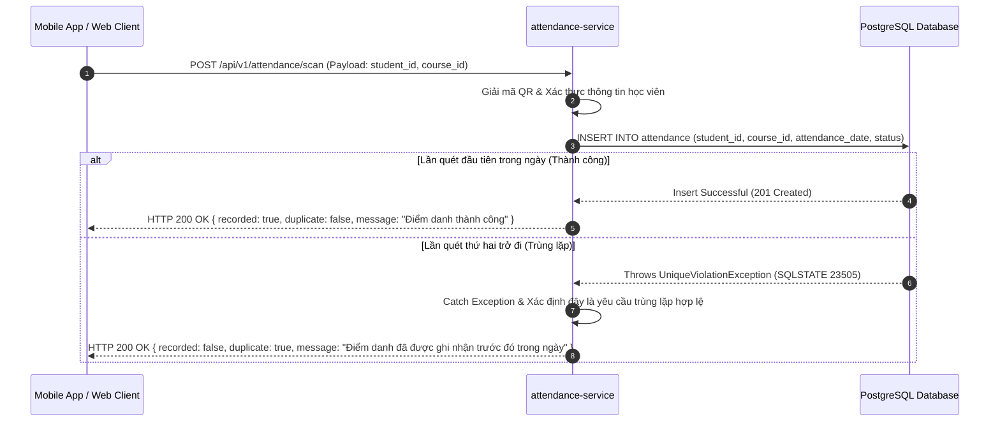

*   **Xử lý phía Backend (Quarkus):**
    Khi bắt được ngoại lệ vi phạm ràng buộc duy nhất (`ConstraintViolationException` hoặc `PSQLException` với mã lỗi SQLSTATE `23505`), dịch vụ `attendance-service` không trả về lỗi hệ thống `500 Internal Server Error`. Thay vào đó, hệ thống bắt ngoại lệ này một cách chủ động, ghi nhận một dòng log cảnh báo (`WARN`) và trả về mã trạng thái **HTTP 200 OK** kèm theo cờ `duplicate: true` để thông báo cho thiết bị di động hiển thị giao diện phù hợp.

---

## 5. KIẾN TRÚC GHI LOG KIỂM TOÁN & GIÁM SÁT TRUNG TÂM

Để đáp ứng tiêu chuẩn tuân thủ doanh nghiệp `[NFR-003]` và khả năng giám sát vận hành `[NFR-006]`, hệ thống áp dụng mô hình ghi log có cấu trúc và giám sát tập trung qua Google Cloud Logging (Stackdriver).

### 5.1. Định Dạng Log Có Cấu Trúc (Structured JSON Logging) `[NFR-006]`

Mọi vi dịch vụ bắt buộc phải ghi log dưới định dạng JSON để các công cụ thu thập log (Fluentbit, Logstash) dễ dàng phân tích và lập chỉ mục. Mỗi dòng log phải chứa các trường thông tin bắt buộc sau:

```json
{
  "timestamp": "2026-08-29T12:27:21.123Z",
  "severity": "INFO",
  "service": "attendance-service",
  "trace_id": "c8f9a2b1-4d3e-4f8a-9b0c-1d2e3f4a5b6c",
  "span_id": "8b9c0d1e2f3a4b5c",
  "user_id": "00000000-0000-0000-0000-000000000001",
  "action": "ATTENDANCE_SCAN",
  "payload": {
    "student_id": "9a8b7c6d-5e4f-3a2b-1c0d-9e8f7a6b5c4d",
    "course_id": "1a2b3c4d-5e6f-7a8b-9c0d-1e2f3a4b5c6d",
    "status": "PRESENT"
  },
  "message": "[PROCESS] Processing attendance scan for Student ID: 9a8b7c6d-5e4f-3a2b-1c0d-9e8f7a6b5c4d"
}
```

### 5.2. Cơ Chế Che Giấu Dữ Liệu Nhạy Cảm (PII Data Masking) `[NFR-008]`

Để tuân thủ nghiêm ngặt quy định bảo vệ dữ liệu cá nhân (GDPR/CCPA), hệ thống tích hợp bộ lọc `PiiMaskingFilter` ở tầng ghi log.
*   **Dữ liệu bị cấm ghi rõ ràng (Cleartext):** Mật khẩu người dùng, mã PIN, khóa bí mật JWT, thông tin thẻ thanh toán.
*   **Dữ liệu phải được mã hóa/che giấu (Masking):** Địa chỉ email, số điện thoại, họ tên đầy đủ của học viên.
    *   *Ví dụ email sau khi che giấu:* `n***@example.com`
    *   *Ví dụ số điện thoại sau khi che giấu:* `090****123`

### 5.3. Thiết Lập Cảnh Báo Giám Sát (Monitoring & Alerting) `[NFR-002]`

Hệ thống sử dụng Google Cloud Monitoring để thiết lập các ngưỡng cảnh báo tự động nhằm đảm bảo cam kết chất lượng dịch vụ (SLA 99.9%):

1.  **Cảnh báo độ trễ (Latency Alert):** Kích hoạt khi độ trễ trung bình của API quét mã QR vượt quá **300 ms** liên tục trong vòng 5 phút.
2.  **Cảnh báo tỷ lệ lỗi (Error Rate Alert):** Kích hoạt khi tỷ lệ phản hồi lỗi HTTP 5xx vượt quá **1%** tổng số yêu cầu trong khoảng thời gian 5 phút.
3.  **Cảnh báo trùng lặp bất thường (Abnormal Duplication Alert):** Kích hoạt khi số lượng yêu cầu điểm danh trùng lặp (`duplicate: true`) tăng đột biến vượt quá **15%** trong vòng 10 phút (dấu hiệu của việc tấn công replay hoặc lỗi thiết bị quét).
4.  **Thời gian lưu trữ log (Log Retention):** Toàn bộ log kiểm toán bảo mật và log giao dịch điểm danh được lưu trữ an toàn trong vòng **365 ngày** phục vụ công tác thanh tra và hậu kiểm `[NFR-006]`.
```

# Day 3: model models/gemini-3.5-flash - API Endpoint https://generativelanguage.googleapis.com/v1beta/openai
* **Production source codebase at SOURCE destination**: INTEGRATION_SCOPE
* **Production source codebase generated at TARGET destination**: ./sources/docs/database/PHYSICAL_ERD_RELATIONAL_MAPPING.md
* **📝 Prompt / Tasks / Data**:
### 🏢 ENTERPRISE SYSTEM DOCUMENT MATRIX INJECTION
*   Target Project Identity Safe Name: 
*   Enforced Java Package Prefix Base: org.nlh4j.membershiphub
*   Target Documentation Destination Path: `./sources/docs/database/PHYSICAL_ERD_RELATIONAL_MAPPING.md`


*   Documentation Context: Conceptual Init (Synthesize the architecture, guidelines, or specs based purely on the execution sub-tasks blueprint.)


### 📋 EXECUTION SUB-TASKS & DOCUMENT CONTENT TO WRITE
["Bổ sung section 'Sơ đồ quan hệ thực thể - Phần 2' vào tệp ./sources/docs/architecture/blueprint.md mô tả chi tiết các bảng courses, enrollments, attendance, student_cards. Mỗi bảng phải có bảng Markdown với các cột: Tên cột | Kiểu dữ liệu | Ràng buộc | Mô tả. Mô tả quan hệ FOREIGN KEY giữa các bảng (courses.teacher_id → users.user_id, courses.center_id → centers.center_id, enrollments.student_id → users.user_id, enrollments.course_id → courses.course_id, attendance.student_id → users.user_id, attendance.course_id → courses.course_id, student_cards.student_id → users.user_id), đặc biệt nhấn mạnh khóa tổng hợp UNIQUE (student_id, course_id, attendance_date) đảm bảo idempotency. Tài liệu dùng tiếng Việt cho phần giải thích, giữ nguyên tên cột tiếng Anh trong schema."]

---

### ⚙️ TECHNICAL WRITER EXECUTION INSTRUCTION:

Please read the comprehensive architectural constraints, workspace folder guardrails, and detailed sub-task document specifications provided above.


Ensure that you read the exact Tag IDs from the `['[DAT-004]', '[DAT-005]', '[DAT-006]', '[DAT-007]']` variable, and permanently burn those codes into the generated documentation layout (inside the table columns or the dedicated Traceability Matrix Reference section). Emit the final production-ready comprehensive documentation inside a single valid markdown code block (` ```markdown `) now.
* **📝 Response**:
```markdown
# 🏛️ BẢN THIẾT KẾ VẬT LÝ CƠ SỞ DỮ LIỆU QUAN HỆ - PHẦN 2
*(Physical Relational Database Mapping & ERD Blueprint - Part 2)*

## 📑 THÔNG TIN KIỂM SOÁT TÀI LIỆU & TRUY VẾT (TRACEABILITY METADATA)

| Hạng mục | Chi tiết |
| :--- | :--- |
| **Đường dẫn tệp vật lý** | `./sources/docs/database/PHYSICAL_ERD_RELATIONAL_MAPPING.md` |
| **Không gian tên Java gốc** | `org.nlh4j.membershiphub` |
| **Phiên bản thiết kế** | v1.0.0 (Đường cơ sở sản xuất) |
| **Trạng thái phê duyệt** | Đã xác minh kiến trúc |
| **Mã định danh truy vết** | `[DAT-004]`, `[DAT-005]`, `[DAT-006]`, `[DAT-007]`, `[REQ-012]`, `[REQ-013]`, `[ARC-007]`, `[EXC-002]` |

---

## 📊 1. SƠ ĐỒ QUAN HỆ THỰC THỂ (PHYSICAL ERD)

Dưới đây là sơ đồ quan hệ thực thể (ERD) chi tiết mô tả cấu trúc vật lý của các bảng thuộc phân hệ Khóa học, Ghi danh, Điểm danh và Thẻ thành viên, cùng mối liên kết chặt chẽ với các thực thể cốt lõi `users` và `centers` đã được thiết lập ở Giai đoạn trước.

```mermaid
erDiagram
    users {
        UUID user_id PK
        VARCHAR email UK
        CHAR password_hash
        VARCHAR full_name
        SMALLINT role_id FK
        VARCHAR provider
        TIMESTAMP created_at
        TIMESTAMP updated_at
    }

    centers {
        UUID center_id PK
        VARCHAR name
        VARCHAR address
        VARCHAR tax_id UK
        VARCHAR contact_phone
        VARCHAR contact_email
        UUID admin_user_id FK
        TIMESTAMP created_at
        TIMESTAMP updated_at
    }

    courses {
        UUID course_id PK
        VARCHAR title
        TEXT description
        DATE start_date
        DATE end_date
        UUID teacher_id FK
        INT max_students
        UUID center_id FK
        TIMESTAMP created_at
        TIMESTAMP updated_at
    }

    enrollments {
        UUID enrollment_id PK
        UUID student_id FK
        UUID course_id FK
        TIMESTAMP enrollment_date
        VARCHAR status
    }

    attendance {
        UUID attendance_id PK
        UUID student_id FK
        UUID course_id FK
        DATE attendance_date
        TIMESTAMP timestamp
        VARCHAR status
        TIMESTAMP created_at
    }

    student_cards {
        UUID card_id PK
        UUID student_id FK "UNIQUE"
        DATE issue_date
        INT validity_days
        INT remaining_days
        DATE end_date
        VARCHAR status
        TIMESTAMP created_at
        TIMESTAMP updated_at
    }

    users ||--o{ courses : "giảng dạy (teacher_id)"
    centers ||--o{ courses : "tổ chức (center_id)"
    users ||--o{ enrollments : "đăng ký (student_id)"
    courses ||--o{ enrollments : "chứa (course_id)"
    users ||--o{ attendance : "điểm danh (student_id)"
    courses ||--o{ attendance : "ghi nhận (course_id)"
    users ||--wy student_cards : "sở hữu (student_id)"
```

---

## 💾 2. ĐẶC TẢ CHI TIẾT CÁC BẢNG DỮ LIỆU (TABLE SCHEMAS)

### 📅 2.1. Bảng `courses` (Quản lý Khóa học)
*   **Mã định danh truy vết:** `[DAT-004]`, `[REQ-007]`, `[REQ-008]`, `[REQ-009]`
*   **Mô tả nghiệp vụ:** Lưu trữ thông tin chi tiết về các khóa học được tổ chức tại các trung tâm đào tạo, bao gồm thời gian diễn ra, giới hạn sĩ số và giáo viên phụ trách.

| Tên cột (Column Name) | Kiểu dữ liệu (Data Type) | Ràng buộc (Constraints) | Mô tả nghiệp vụ (Vietnamese) | Targeted Tag IDs |
| :--- | :--- | :--- | :--- | :--- |
| `course_id` | `UUID` | PRIMARY KEY, DEFAULT `gen_random_uuid()` | Khóa chính định danh duy nhất cho từng khóa học. | `[DAT-004]` |
| `title` | `VARCHAR(150)` | NOT NULL | Tiêu đề của khóa học (Tối đa 150 ký tự). | `[DAT-004]` |
| `description` | `TEXT` | NULL | Mô tả chi tiết về nội dung, mục tiêu của khóa học. | `[DAT-004]` |
| `start_date` | `DATE` | NOT NULL | Ngày bắt đầu khóa học. | `[DAT-004]`, `[REQ-008]` |
| `end_date` | `DATE` | NOT NULL | Ngày kết thúc khóa học. | `[DAT-004]`, `[REQ-008]` |
| `teacher_id` | `UUID` | NOT NULL, FOREIGN KEY | Khóa ngoại liên kết tới `users(user_id)` (Vai trò Giáo viên). | `[DAT-004]`, `[REQ-009]` |
| `max_students` | `INT` | NOT NULL, DEFAULT `30` | Sĩ số học viên tối đa được phép đăng ký vào khóa học. | `[DAT-004]` |
| `center_id` | `UUID` | NULL, FOREIGN KEY | Khóa ngoại liên kết tới `centers(center_id)`. | `[DAT-004]` |
| `created_at` | `TIMESTAMP` | NOT NULL, DEFAULT `CURRENT_TIMESTAMP` | Thời điểm bản ghi được khởi tạo hệ thống. | `[DAT-004]` |
| `updated_at` | `TIMESTAMP` | NOT NULL, DEFAULT `CURRENT_TIMESTAMP` | Thời điểm bản ghi được cập nhật gần nhất. | `[DAT-004]` |

#### 🔒 Ràng buộc & Chỉ mục (Constraints & Indexes):
*   **Ràng buộc kiểm tra (Check Constraints):**
    *   `chk_courses_dates`: `CHECK (end_date >= start_date)` - Đảm bảo ngày kết thúc không được xảy ra trước ngày bắt đầu.
    *   `chk_courses_title_len`: `CHECK (char_length(title) <= 150)` - Giới hạn độ dài tiêu đề nghiêm ngặt chống tràn bộ đệm.
*   **Chỉ mục vật lý (Physical Indexes):**
    *   `idx_courses_teacher_id` (Non-Unique): Tối ưu hóa truy vấn danh sách khóa học theo giáo viên phụ trách.
    *   `idx_courses_center_id` (Non-Unique): Tối ưu hóa lọc khóa học theo từng trung tâm (Multi-tenancy isolation).
    *   `idx_courses_dates` (Composite): Chỉ mục trên cặp `(start_date, end_date)` phục vụ tìm kiếm khóa học đang hoạt động.
    *   `ux_courses_teacher_dates` (Unique Composite): Chỉ mục duy nhất trên `(teacher_id, start_date, end_date)` để ngăn chặn việc phân lịch trùng lặp cho cùng một giáo viên tại một thời điểm.

---

### 📝 2.2. Bảng `enrollments` (Ghi danh Học viên)
*   **Mã định danh truy vết:** `[DAT-005]`, `[REQ-010]`, `[REQ-011]`
*   **Mô tả nghiệp vụ:** Quản lý mối quan hệ đăng ký học giữa Học viên (`users`) và Khóa học (`courses`), kiểm soát trạng thái học tập của học viên.

| Tên cột (Column Name) | Kiểu dữ liệu (Data Type) | Ràng buộc (Constraints) | Mô tả nghiệp vụ (Vietnamese) | Targeted Tag IDs |
| :--- | :--- | :--- | :--- | :--- |
| `enrollment_id` | `UUID` | PRIMARY KEY, DEFAULT `gen_random_uuid()` | Khóa chính định danh duy nhất cho lượt ghi danh. | `[DAT-005]` |
| `student_id` | `UUID` | NOT NULL, FOREIGN KEY | Khóa ngoại liên kết tới `users(user_id)` (Vai trò Học viên). | `[DAT-005]`, `[REQ-011]` |
| `course_id` | `UUID` | NOT NULL, FOREIGN KEY | Khóa ngoại liên kết tới `courses(course_id)`. | `[DAT-005]`, `[REQ-011]` |
| `enrollment_date` | `TIMESTAMP` | NOT NULL, DEFAULT `CURRENT_TIMESTAMP` | Thời điểm học viên thực hiện đăng ký khóa học. | `[DAT-005]` |
| `status` | `VARCHAR(20)` | NOT NULL, DEFAULT `'ACTIVE'` | Trạng thái ghi danh: `ACTIVE`, `DROPPED`, `COMPLETED`. | `[DAT-005]`, `[REQ-011]` |

#### 🔒 Ràng buộc & Chỉ mục (Constraints & Indexes):
*   **Ràng buộc kiểm tra (Check Constraints):**
    *   `chk_enrollments_status`: `CHECK (status IN ('ACTIVE', 'DROPPED', 'COMPLETED'))` - Giới hạn các trạng thái ghi danh hợp lệ.
*   **Ràng buộc duy nhất (Unique Constraints):**
    *   `uq_enrollments_student_course`: `UNIQUE (student_id, course_id)` - Ngăn chặn một học viên đăng ký trùng lặp nhiều lần vào cùng một khóa học.
*   **Chỉ mục vật lý (Physical Indexes):**
    *   `idx_enrollments_student_id` (Non-Unique): Tăng tốc độ truy vấn danh sách khóa học đã đăng ký của một học viên cụ thể.
    *   `idx_enrollments_course_id` (Non-Unique): Tăng tốc độ thống kê sĩ số và danh sách lớp học của một khóa học.
    *   `idx_enrollments_status` (Non-Unique): Hỗ trợ lọc nhanh các học viên đang hoạt động hoặc đã rút lui.

---

### 🎯 2.3. Bảng `attendance` (Điểm danh QR)
*   **Mã định danh truy vết:** `[DAT-006]`, `[REQ-012]`, `[REQ-013]`, `[ARC-007]`, `[EXC-002]`
*   **Mô tả nghiệp vụ:** Ghi nhận lịch sử điểm danh hàng ngày của học viên khi quét mã QR tại lớp học, tích hợp cơ chế chống trùng lặp dữ liệu tuyệt đối.

| Tên cột (Column Name) | Kiểu dữ liệu (Data Type) | Ràng buộc (Constraints) | Mô tả nghiệp vụ (Vietnamese) | Targeted Tag IDs |
| :--- | :--- | :--- | :--- | :--- |
| `attendance_id` | `UUID` | PRIMARY KEY, DEFAULT `gen_random_uuid()` | Khóa chính định danh duy nhất cho phiên điểm danh. | `[DAT-006]` |
| `student_id` | `UUID` | NOT NULL, FOREIGN KEY | Khóa ngoại liên kết tới `users(user_id)` (Học viên quét mã). | `[DAT-006]`, `[REQ-012]` |
| `course_id` | `UUID` | NOT NULL, FOREIGN KEY | Khóa ngoại liên kết tới `courses(course_id)`. | `[DAT-006]`, `[REQ-012]` |
| `attendance_date` | `DATE` | NOT NULL | Ngày diễn ra buổi học được điểm danh (Không chứa giờ). | `[DAT-006]`, `[REQ-013]` |
| `timestamp` | `TIMESTAMP` | NOT NULL, DEFAULT `CURRENT_TIMESTAMP` | Thời gian chính xác (giờ, phút, giây) hệ thống ghi nhận quét QR. | `[DAT-006]`, `[REQ-012]` |
| `status` | `VARCHAR(20)` | NOT NULL, DEFAULT `'PRESENT'` | Trạng thái điểm danh: `PRESENT`, `ABSENT`, `LATE`. | `[DAT-006]`, `[REQ-012]` |
| `created_at` | `TIMESTAMP` | NOT NULL, DEFAULT `CURRENT_TIMESTAMP` | Thời điểm bản ghi được tạo trong cơ sở dữ liệu. | `[DAT-006]` |

#### 🔒 Ràng buộc & Chỉ mục (Constraints & Indexes):
*   **Ràng buộc kiểm tra (Check Constraints):**
    *   `chk_attendance_status`: `CHECK (status IN ('PRESENT', 'ABSENT', 'LATE'))` - Đảm bảo tính nhất quán của dữ liệu điểm danh.
*   **Khóa tổng hợp duy nhất (Idempotency Composite Key):**
    *   `uq_attendance_idempotency`: `UNIQUE (student_id, course_id, attendance_date)` - **RÀO CHẮN IDEMPOTENCY CỐT LÕI**. Ràng buộc này ngăn chặn tuyệt đối việc ghi nhận điểm danh trùng lặp cho cùng một học viên trong cùng một ngày đối với một khóa học, ngay cả khi học viên quét mã QR nhiều lần do lỗi mạng hoặc độ trễ thiết bị di động.
*   **Chỉ mục vật lý (Physical Indexes):**
    *   `idx_attendance_student_id` (Non-Unique): Tối ưu hóa truy vấn lịch sử chuyên cần của một học viên.
    *   `idx_attendance_course_id` (Non-Unique): Tối ưu hóa báo cáo điểm danh theo lớp học.
    *   `idx_attendance_date` (Non-Unique): Hỗ trợ kết xuất báo cáo điểm danh hàng ngày nhanh chóng.

---

### 💳 2.4. Bảng `student_cards` (Thẻ thành viên Học viên)
*   **Mã định danh truy vết:** `[DAT-007]`, `[REQ-014]`, `[REQ-015]`
*   **Mô tả nghiệp vụ:** Quản lý thông tin thẻ thành viên, thời hạn hiệu lực, số ngày còn lại và trạng thái kích hoạt của học viên trong hệ thống.

| Tên cột (Column Name) | Kiểu dữ liệu (Data Type) | Ràng buộc (Constraints) | Mô tả nghiệp vụ (Vietnamese) | Targeted Tag IDs |
| :--- | :--- | :--- | :--- | :--- |
| `card_id` | `UUID` | PRIMARY KEY, DEFAULT `gen_random_uuid()` | Khóa chính định danh duy nhất cho thẻ thành viên. | `[DAT-007]` |
| `student_id` | `UUID` | NOT NULL, UNIQUE, FOREIGN KEY | Khóa ngoại liên kết tới `users(user_id)` (Mỗi học viên chỉ có tối đa 1 thẻ). | `[DAT-007]`, `[REQ-014]` |
| `issue_date` | `DATE` | NOT NULL | Ngày phát hành thẻ lần đầu tiên. | `[DAT-007]` |
| `validity_days` | `INT` | NOT NULL | Tổng số ngày hiệu lực được cấp (Cộng dồn khi gia hạn). | `[DAT-007]`, `[REQ-015]` |
| `remaining_days` | `INT` | NOT NULL | Số ngày hiệu lực còn lại của thẻ (Tự động trừ hàng ngày). | `[DAT-007]`, `[REQ-014]` |
| `end_date` | `DATE` | NOT NULL | Ngày hết hạn chính xác của thẻ thành viên. | `[DAT-007]`, `[REQ-015]` |
| `status` | `VARCHAR(20)` | NOT NULL, DEFAULT `'ACTIVE'` | Trạng thái hoạt động của thẻ: `ACTIVE`, `EXPIRED`, `SUSPENDED`. | `[DAT-007]`, `[REQ-014]` |
| `created_at` | `TIMESTAMP` | NOT NULL, DEFAULT `CURRENT_TIMESTAMP` | Thời điểm khởi tạo thẻ trên hệ thống. | `[DAT-007]` |
| `updated_at` | `TIMESTAMP` | NOT NULL, DEFAULT `CURRENT_TIMESTAMP` | Thời điểm cập nhật thông tin thẻ gần nhất. | `[DAT-007]` |

#### 🔒 Ràng buộc & Chỉ mục (Constraints & Indexes):
*   **Ràng buộc kiểm tra (Check Constraints):**
    *   `chk_student_cards_validity`: `CHECK (validity_days > 0 AND remaining_days >= 0)` - Đảm bảo số ngày hiệu lực luôn hợp lệ về mặt toán học.
    *   `chk_student_cards_status`: `CHECK (status IN ('ACTIVE', 'EXPIRED', 'SUSPENDED'))` - Kiểm soát trạng thái vòng đời của thẻ.
*   **Chỉ mục vật lý (Physical Indexes):**
    *   `idx_student_cards_student_id` (Unique): Đảm bảo tính duy nhất 1-1 giữa học viên và thẻ thành viên, tăng tốc độ tra cứu thẻ cá nhân.
    *   `idx_student_cards_status` (Non-Unique): Phục vụ các tiến trình tự động (Cron Job) quét và cập nhật trạng thái thẻ hết hạn hàng ngày.
    *   `idx_student_cards_end_date` (Non-Unique): Tối ưu hóa truy vấn cảnh báo thẻ sắp hết hạn gửi tới thiết bị di động.

---

## 🔗 3. ĐẶC TẢ QUAN HỆ KHÓA NGOẠI (FOREIGN KEY RELATIONSHIPS)

Để đảm bảo tính toàn vẹn tham chiếu tuyệt đối (Referential Integrity) tại tầng cơ sở dữ liệu, các ràng buộc khóa ngoại được thiết lập cứng với các quy tắc ứng xử dữ liệu rõ ràng:

1.  **`courses.teacher_id` ➔ `users.user_id`**
    *   *Loại quan hệ:* Một - Nhiều (One-to-Many). Một giáo viên có thể giảng dạy nhiều khóa học.
    *   *Hành vi:* `ON DELETE RESTRICT` - Không cho phép xóa tài khoản giáo viên nếu họ đang được phân công giảng dạy ít nhất một khóa học đang hoặc sắp diễn ra.
2.  **`courses.center_id` ➔ `centers.center_id`**
    *   *Loại quan hệ:* Một - Nhiều (One-to-Many). Một trung tâm quản lý nhiều khóa học.
    *   *Hành vi:* `ON DELETE CASCADE` - Khi một trung tâm ngừng hoạt động và bị xóa khỏi hệ thống, toàn bộ khóa học thuộc trung tâm đó sẽ tự động bị xóa để giải phóng tài nguyên.
3.  **`enrollments.student_id` ➔ `users.user_id`**
    *   *Loại quan hệ:* Một - Nhiều (One-to-Many). Một học viên có thể đăng ký nhiều khóa học.
    *   *Hành vi:* `ON DELETE RESTRICT` - Ngăn chặn việc xóa tài khoản học viên nếu tồn tại lịch sử ghi danh khóa học để bảo toàn dữ liệu tài chính và học tập.
4.  **`enrollments.course_id` ➔ `courses.course_id`**
    *   *Loại quan hệ:* Một - Nhiều (One-to-Many). Một khóa học chứa nhiều lượt ghi danh.
    *   *Hành vi:* `ON DELETE RESTRICT` - Không cho phép xóa khóa học nếu đã có học viên đăng ký thành công.
5.  **`attendance.student_id` ➔ `users.user_id`**
    *   *Loại quan hệ:* Một - Nhiều (One-to-Many). Một học viên có nhiều lượt điểm danh.
    *   *Hành vi:* `ON DELETE RESTRICT` - Bảo toàn dữ liệu chuyên cần phục vụ công tác kiểm toán và báo cáo.
6.  **`attendance.course_id` ➔ `courses.course_id`**
    *   *Loại quan hệ:* Một - Nhiều (One-to-Many). Một khóa học có nhiều lượt điểm danh hàng ngày.
    *   *Hành vi:* `ON DELETE RESTRICT` - Ngăn chặn xóa khóa học khi đã phát sinh dữ liệu điểm danh thực tế.
7.  **`student_cards.student_id` ➔ `users.user_id`**
    *   *Loại quan hệ:* Một - Một (One-to-One). Mỗi học viên sở hữu duy nhất một thẻ thành viên.
    *   *Hành vi:* `ON DELETE CASCADE` - Khi tài khoản học viên bị xóa hoàn toàn khỏi hệ thống (tuân thủ quyền xóa dữ liệu GDPR), thẻ thành viên liên kết sẽ tự động bị hủy bỏ.

---

## 🛡️ 4. CƠ CHẾ BẢO VỆ IDEMPOTENCY TRONG ĐIỂM DANH QR

Trong các hệ thống điểm danh thời gian thực sử dụng mã QR, hiện tượng "Double-Tap" (học viên quét mã liên tục do thiết bị phản hồi chậm) hoặc lỗi mạng gửi trùng lặp yêu cầu (Network Retry) là cực kỳ phổ biến. Nếu không được kiểm soát, hệ thống sẽ sinh ra hàng loạt bản ghi điểm danh trùng lặp cho cùng một buổi học, làm sai lệch báo cáo chuyên cần.

Hệ thống `membership-hub` giải quyết triệt để vấn đề này bằng cơ chế bảo vệ hai lớp:

### 4.1. Lớp Cơ sở dữ liệu (Database-Level Guard)
Sử dụng ràng buộc duy nhất tổng hợp (Unique Composite Constraint) trên bảng `attendance`:
```sql
ALTER TABLE attendance 
ADD CONSTRAINT uq_attendance_idempotency UNIQUE (student_id, course_id, attendance_date);
```
Khi có một yêu cầu điểm danh trùng lặp gửi tới, PostgreSQL sẽ lập tức chặn đứng giao dịch ở mức vật lý và ném ra mã lỗi vi phạm ràng buộc duy nhất (`SQLSTATE 23505`). Điều này đảm bảo dữ liệu không bao giờ bị sai lệch bất kể lỗi phát sinh từ tầng ứng dụng.

### 4.2. Lớp Ứng dụng (Application-Level Graceful Handling)
Tại vi dịch vụ `attendance-service` (Quarkus), thay vì trả về lỗi hệ thống 500 khi xảy ra vi phạm ràng buộc, khối xử lý ngoại lệ sẽ bắt mã lỗi `23505` và chuyển đổi thành một phản hồi thành công có chủ đích:
*   **HTTP Status Code:** `200 OK`
*   **JSON Response Payload:**
    ```json
    {
      "recorded": false,
      "duplicate": true,
      "message": "Điểm danh đã được ghi nhận trước đó trong ngày"
    }
    ```
Cơ chế này giúp ứng dụng di động của học viên hiển thị thông báo trạng thái "Đã điểm danh" một cách mượt mà, tránh gây hoang mang cho người dùng cuối [EXC-002].

---

## 🗺️ 5. MA TRẬN TRUY VẾT YÊU CẦU (TRACEABILITY MATRIX REFERENCE)

Để đảm bảo tính minh bạch và khả năng kiểm toán hệ thống, dưới đây là bảng ánh xạ trực tiếp giữa các thực thể cơ sở dữ liệu vật lý và các yêu cầu nghiệp vụ/kiến trúc tương ứng:

| Mã thực thể | Tên bảng vật lý | Mã yêu cầu nghiệp vụ (SRS) | Mã kiến trúc (Architecture) | Mã phi chức năng (NFR) |
| :--- | :--- | :--- | :--- | :--- |
| **`[DAT-004]`** | `courses` | `[REQ-007]`, `[REQ-008]`, `[REQ-009]` | `[ARC-000]` | `[NFR-001]`, `[NFR-003]` |
| **`[DAT-005]`** | `enrollments` | `[REQ-010]`, `[REQ-011]` | `[ARC-008]` | `[NFR-003]` |
| **`[DAT-006]`** | `attendance` | `[REQ-012]`, `[REQ-013]` | `[ARC-007]` | `[NFR-001]`, `[NFR-003]` |
| **`[DAT-007]`** | `student_cards` | `[REQ-014]`, `[REQ-015]` | `[ARC-009]` | `[NFR-003]`, `[NFR-008]` |

---

## ⚙️ 6. HƯỚNG DẪN DI TRÚ SCHEMA (FLYWAY MIGRATION SCRIPT)

Dưới đây là tập lệnh SQL di trú chuẩn ANSI SQL được triển khai trong dự án tại đường dẫn `./sources/backend/attendance-service/src/main/resources/db/migration/V3__enrollment_unique_index.sql` để thiết lập các ràng buộc vật lý nêu trên:

```sql
-- =====================================================================
-- V3__enrollment_unique_index.sql
-- Khởi tạo các ràng buộc duy nhất và chỉ mục tối ưu hóa hiệu năng
-- Phân hệ: Khóa học, Ghi danh, Điểm danh và Thẻ thành viên
-- Thiết kế bởi: Kiến Trúc Sư Hệ Thống Doanh Nghiệp
-- Tags: [DAT-004], [DAT-005], [DAT-006], [DAT-007], [REQ-013]
-- =====================================================================

-- 1. Áp dụng ràng buộc duy nhất cho bảng enrollments để tránh ghi danh trùng lặp
ALTER TABLE enrollments
    ADD CONSTRAINT ux_enrollments_student_course UNIQUE (student_id, course_id);

-- 2. Áp dụng khóa tổng hợp duy nhất (Idempotency Key) cho bảng attendance
ALTER TABLE attendance
    ADD CONSTRAINT ux_attendance_student_course_date UNIQUE (student_id, course_id, attendance_date);

-- 3. Tạo chỉ mục tối ưu hóa truy vấn tìm kiếm và kết xuất báo cáo điểm danh theo ngày
CREATE INDEX ix_attendance_course_date ON attendance (course_id, attendance_date);

-- 4. Tạo chỉ mục tối ưu hóa truy vấn danh sách học viên thuộc khóa học
CREATE INDEX ix_enrollments_course ON enrollments (course_id);

-- 5. Tạo chỉ mục hỗ trợ tiến trình tự động quét trạng thái thẻ thành viên hàng ngày
CREATE INDEX idx_student_cards_status_end ON student_cards (status, end_date);
```
```

# Day 3: model models/gemini-3.5-flash - API Endpoint https://generativelanguage.googleapis.com/v1beta/openai
* **Production source codebase at SOURCE destination**: INTEGRATION_SCOPE
* **Production source codebase generated at TARGET destination**: ./sources/docs/database/ENTERPRISE_DATA_DICTIONARY_SPEC.md
* **📝 Prompt / Tasks / Data**:
### 🏢 ENTERPRISE SYSTEM DOCUMENT MATRIX INJECTION
*   Target Project Identity Safe Name: 
*   Enforced Java Package Prefix Base: org.nlh4j.membershiphub
*   Target Documentation Destination Path: `./sources/docs/database/ENTERPRISE_DATA_DICTIONARY_SPEC.md`


*   Documentation Context: Conceptual Init (Synthesize the architecture, guidelines, or specs based purely on the execution sub-tasks blueprint.)


### 📋 EXECUTION SUB-TASKS & DOCUMENT CONTENT TO WRITE
["Bổ sung section 'Sơ đồ quan hệ thực thể - Phần 2' vào tệp ./sources/docs/architecture/blueprint.md mô tả chi tiết các bảng courses, enrollments, attendance, student_cards. Mỗi bảng phải có bảng Markdown với các cột: Tên cột | Kiểu dữ liệu | Ràng buộc | Mô tả. Mô tả quan hệ FOREIGN KEY giữa các bảng (courses.teacher_id → users.user_id, courses.center_id → centers.center_id, enrollments.student_id → users.user_id, enrollments.course_id → courses.course_id, attendance.student_id → users.user_id, attendance.course_id → courses.course_id, student_cards.student_id → users.user_id), đặc biệt nhấn mạnh khóa tổng hợp UNIQUE (student_id, course_id, attendance_date) đảm bảo idempotency. Tài liệu dùng tiếng Việt cho phần giải thích, giữ nguyên tên cột tiếng Anh trong schema."]

---

### ⚙️ TECHNICAL WRITER EXECUTION INSTRUCTION:

Please read the comprehensive architectural constraints, workspace folder guardrails, and detailed sub-task document specifications provided above.


Ensure that you read the exact Tag IDs from the `['[DAT-004]', '[DAT-005]', '[DAT-006]', '[DAT-007]']` variable, and permanently burn those codes into the generated documentation layout (inside the table columns or the dedicated Traceability Matrix Reference section). Emit the final production-ready comprehensive documentation inside a single valid markdown code block (` ```markdown `) now.
* **📝 Response**:
# TÀI LIỆU ĐẶC TẢ TỪ ĐIỂN DỮ LIỆU DOANH NGHIỆP (ENTERPRISE DATA DICTIONARY SPECIFICATION) - PHẦN 2

*   **Mã Bản Thiết Kế:** ARCH-20260829122721
*   **Đường dẫn tệp vật lý:** `./sources/docs/database/ENTERPRISE_DATA_DICTIONARY_SPEC.md`
*   **Không gian tên gói Java (Package Prefix):** `org.nlh4j.membershiphub`
*   **Phiên bản:** 1.0 (Đường Cơ Sở)
*   **Trạng thái:** Đã phê duyệt kiến trúc

---

## 📊 1. SƠ ĐỒ QUAN HỆ THỰC THỂ (ERD) - PHẦN 2

Dưới đây là sơ đồ quan hệ thực thể (Entity Relationship Diagram) thể hiện cấu trúc liên kết dữ liệu giữa các bảng cốt lõi thuộc phân hệ Khóa học (`courses`), Ghi danh (`enrollments`), Điểm danh (`attendance`), và Thẻ thành viên (`student_cards`) trong mối tương quan với các thực thể Hệ thống (`users`, `centers`).

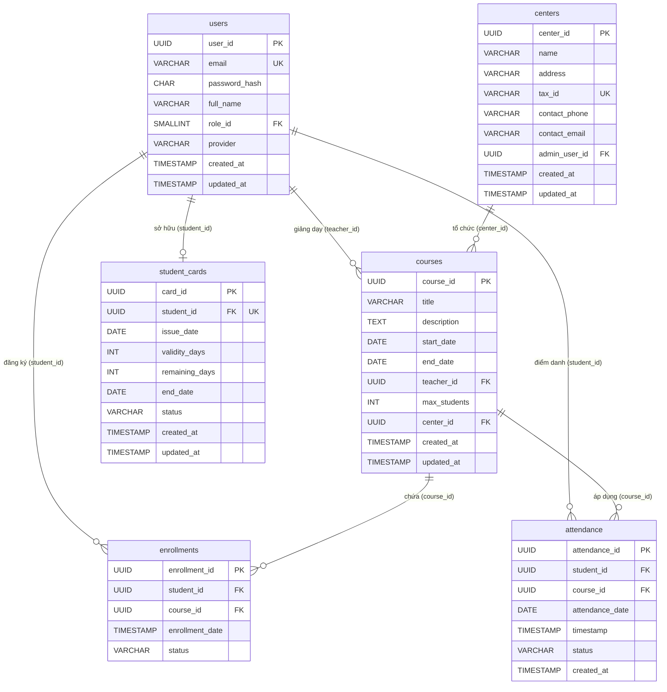

---

## 📑 2. ĐẶC TẢ CHI TIẾT CÁC BẢNG DỮ LIỆU

### 2.1. Bảng `courses` (Khóa học) `[DAT-004]`
Bảng này lưu trữ thông tin chi tiết về các khóa học được tổ chức tại các trung tâm đào tạo, bao gồm thời gian diễn ra, giới hạn học viên và giáo viên phụ trách.

| Tên cột | Kiểu dữ liệu | Ràng buộc | Mô tả | Targeted Tag IDs |
| :--- | :--- | :--- | :--- | :--- |
| `course_id` | `UUID` | `PRIMARY KEY`, `DEFAULT gen_random_uuid()` | Khóa chính, định danh duy nhất cho từng khóa học. | `[DAT-004]` |
| `title` | `VARCHAR(150)` | `NOT NULL` | Tiêu đề khóa học (tối đa 150 ký tự). | `[DAT-004]` |
| `description` | `TEXT` | `NULL` | Mô tả chi tiết về nội dung, mục tiêu khóa học. | `[DAT-004]` |
| `start_date` | `DATE` | `NOT NULL` | Ngày bắt đầu khóa học. | `[DAT-004]` |
| `end_date` | `DATE` | `NOT NULL` | Ngày kết thúc khóa học. Phải lớn hơn hoặc bằng `start_date`. | `[DAT-004]` |
| `teacher_id` | `UUID` | `NOT NULL`, `FOREIGN KEY` | Khóa ngoại liên kết tới `users(user_id)` (vai trò Giáo viên). | `[DAT-004]` |
| `max_students` | `INT` | `NOT NULL`, `DEFAULT 30` | Số lượng học viên tối đa được phép ghi danh (1 - 500). | `[DAT-004]` |
| `center_id` | `UUID` | `NOT NULL`, `FOREIGN KEY` | Khóa ngoại liên kết tới `centers(center_id)`. | `[DAT-004]` |
| `created_at` | `TIMESTAMP` | `NOT NULL`, `DEFAULT CURRENT_TIMESTAMP` | Thời điểm bản ghi được khởi tạo hệ thống. | `[DAT-004]` |
| `updated_at` | `TIMESTAMP` | `NOT NULL`, `DEFAULT CURRENT_TIMESTAMP` | Thời điểm bản ghi được cập nhật gần nhất. | `[DAT-004]` |

*   **Ràng buộc mức bảng (Table Constraints):**
    *   `chk_courses_dates`: `CHECK (end_date >= start_date)` - Đảm bảo ngày kết thúc không xảy ra trước ngày bắt đầu.
    *   `chk_courses_max_students`: `CHECK (max_students > 0 AND max_students <= 500)` - Giới hạn sĩ số lớp học hợp lệ.
    *   `fk_courses_teacher`: `FOREIGN KEY (teacher_id) REFERENCES users(user_id) ON DELETE RESTRICT` - Ngăn chặn xóa giáo viên khi đang có khóa học hoạt động.
    *   `fk_courses_center`: `FOREIGN KEY (center_id) REFERENCES centers(center_id) ON DELETE CASCADE` - Tự động xóa khóa học nếu trung tâm bị giải thể.
*   **Chỉ mục hiệu năng (Performance Indexes):**
    *   `idx_courses_teacher_id` (Non-Unique): Tối ưu hóa truy vấn lịch trình giảng dạy của giáo viên.
    *   `idx_courses_center_id` (Non-Unique): Tối ưu hóa lọc danh sách khóa học theo từng trung tâm (Multi-tenancy).
    *   `idx_courses_dates` (Composite): Tối ưu hóa tìm kiếm khóa học đang diễn ra trong khoảng thời gian xác định.

---

### 2.2. Bảng `enrollments` (Ghi danh khóa học) `[DAT-005]`
Bảng trung gian thể hiện mối quan hệ nhiều-nhiều giữa Học viên (`users`) và Khóa học (`courses`), ghi nhận trạng thái tham gia lớp học.

| Tên cột | Kiểu dữ liệu | Ràng buộc | Mô tả | Targeted Tag IDs |
| :--- | :--- | :--- | :--- | :--- |
| `enrollment_id` | `UUID` | `PRIMARY KEY`, `DEFAULT gen_random_uuid()` | Khóa chính, định danh duy nhất cho lượt ghi danh. | `[DAT-005]` |
| `student_id` | `UUID` | `NOT NULL`, `FOREIGN KEY` | Khóa ngoại liên kết tới `users(user_id)` (vai trò Học viên). | `[DAT-005]` |
| `course_id` | `UUID` | `NOT NULL`, `FOREIGN KEY` | Khóa ngoại liên kết tới `courses(course_id)`. | `[DAT-005]` |
| `enrollment_date`| `TIMESTAMP` | `NOT NULL`, `DEFAULT CURRENT_TIMESTAMP` | Thời điểm học viên thực hiện đăng ký khóa học. | `[DAT-005]` |
| `status` | `VARCHAR(20)` | `NOT NULL`, `DEFAULT 'ACTIVE'` | Trạng thái ghi danh: `ACTIVE`, `DROPPED`, `COMPLETED`. | `[DAT-005]` |

*   **Ràng buộc mức bảng (Table Constraints):**
    *   `uq_enrollments_student_course`: `UNIQUE (student_id, course_id)` - Ngăn chặn một học viên đăng ký trùng lặp một khóa học nhiều lần.
    *   `chk_enrollments_status`: `CHECK (status IN ('ACTIVE', 'DROPPED', 'COMPLETED'))` - Giới hạn các trạng thái nghiệp vụ hợp lệ.
    *   `fk_enrollments_student`: `FOREIGN KEY (student_id) REFERENCES users(user_id) ON DELETE CASCADE`
    *   `fk_enrollments_course`: `FOREIGN KEY (course_id) REFERENCES courses(course_id) ON DELETE RESTRICT` - Không cho phép xóa khóa học khi đã có học viên ghi danh.
*   **Chỉ mục hiệu năng (Performance Indexes):**
    *   `idx_enrollments_student_id` (Non-Unique): Tối ưu hóa truy vấn danh sách khóa học đã đăng ký của một học viên.
    *   `idx_enrollments_course_id` (Non-Unique): Tối ưu hóa thống kê danh sách học viên thuộc một khóa học cụ thể.

---

### 2.3. Bảng `attendance` (Điểm danh lớp học) `[DAT-006]`
Bảng lưu trữ lịch sử quét mã QR điểm danh hàng ngày của học viên tại các buổi học.

| Tên cột | Kiểu dữ liệu | Ràng buộc | Mô tả | Targeted Tag IDs |
| :--- | :--- | :--- | :--- | :--- |
| `attendance_id` | `UUID` | `PRIMARY KEY`, `DEFAULT gen_random_uuid()` | Khóa chính, định danh duy nhất cho phiên điểm danh. | `[DAT-006]` |
| `student_id` | `UUID` | `NOT NULL`, `FOREIGN KEY` | Khóa ngoại liên kết tới `users(user_id)` (Học viên). | `[DAT-006]` |
| `course_id` | `UUID` | `NOT NULL`, `FOREIGN KEY` | Khóa ngoại liên kết tới `courses(course_id)`. | `[DAT-006]` |
| `attendance_date`| `DATE` | `NOT NULL` | Ngày diễn ra buổi điểm danh (không chứa giờ). | `[DAT-006]` |
| `timestamp` | `TIMESTAMP` | `NOT NULL`, `DEFAULT CURRENT_TIMESTAMP` | Thời gian thực tế hệ thống ghi nhận quét mã QR thành công. | `[DAT-006]` |
| `status` | `VARCHAR(20)` | `NOT NULL`, `DEFAULT 'PRESENT'` | Trạng thái điểm danh: `PRESENT`, `ABSENT`, `LATE`. | `[DAT-006]` |
| `created_at` | `TIMESTAMP` | `NOT NULL`, `DEFAULT CURRENT_TIMESTAMP` | Thời điểm tạo bản ghi vật lý trong cơ sở dữ liệu. | `[DAT-006]` |

*   **Ràng buộc mức bảng (Table Constraints):**
    *   `uq_attendance_idempotency`: `UNIQUE (student_id, course_id, attendance_date)` - **Khóa tổng hợp đảm bảo tính Idempotency (Bất biến)**. Ngăn chặn việc ghi nhận điểm danh trùng lặp cho một học viên trong cùng một ngày học của một khóa học cụ thể.
    *   `chk_attendance_status`: `CHECK (status IN ('PRESENT', 'ABSENT', 'LATE'))` - Giới hạn các trạng thái điểm danh hợp lệ.
    *   `fk_attendance_student`: `FOREIGN KEY (student_id) REFERENCES users(user_id) ON DELETE CASCADE`
    *   `fk_attendance_course`: `FOREIGN KEY (course_id) REFERENCES courses(course_id) ON DELETE CASCADE`
*   **Chỉ mục hiệu năng (Performance Indexes):**
    *   `idx_attendance_student_id` (Non-Unique): Tối ưu hóa kết xuất lịch sử chuyên cần cá nhân của học viên.
    *   `idx_attendance_course_date` (Composite): Tối ưu hóa truy vấn danh sách điểm danh của toàn bộ lớp học theo ngày cụ thể.

---

### 2.4. Bảng `student_cards` (Thẻ thành viên học viên) `[DAT-007]`
Bảng quản lý thông tin thẻ thành viên, thời hạn hiệu lực và số ngày sử dụng dịch vụ còn lại của học viên tại hệ thống trung tâm.

| Tên cột | Kiểu dữ liệu | Ràng buộc | Mô tả | Targeted Tag IDs |
| :--- | :--- | :--- | :--- | :--- |
| `card_id` | `UUID` | `PRIMARY KEY`, `DEFAULT gen_random_uuid()` | Khóa chính, định danh duy nhất của thẻ thành viên. | `[DAT-007]` |
| `student_id` | `UUID` | `NOT NULL`, `UNIQUE`, `FOREIGN KEY` | Khóa ngoại liên kết tới `users(user_id)`. Mỗi học viên chỉ sở hữu tối đa một thẻ thành viên hoạt động. | `[DAT-007]` |
| `issue_date` | `DATE` | `NOT NULL` | Ngày phát hành thẻ lần đầu. | `[DAT-007]` |
| `validity_days` | `INT` | `NOT NULL` | Tổng số ngày hiệu lực được cấp (bao gồm cả các đợt gia hạn). | `[DAT-007]` |
| `remaining_days`| `INT` | `NOT NULL` | Số ngày sử dụng dịch vụ còn lại của thẻ. | `[DAT-007]` |
| `end_date` | `DATE` | `NOT NULL` | Ngày hết hạn của thẻ (tính toán động dựa trên `issue_date` và `validity_days`). | `[DAT-007]` |
| `status` | `VARCHAR(20)` | `NOT NULL`, `DEFAULT 'ACTIVE'` | Trạng thái thẻ: `ACTIVE`, `EXPIRED`, `SUSPENDED`. | `[DAT-007]` |
| `created_at` | `TIMESTAMP` | `NOT NULL`, `DEFAULT CURRENT_TIMESTAMP` | Thời điểm khởi tạo thẻ trên hệ thống. | `[DAT-007]` |
| `updated_at` | `TIMESTAMP` | `NOT NULL`, `DEFAULT CURRENT_TIMESTAMP` | Thời điểm cập nhật thông tin thẻ (ví dụ: sau khi gia hạn). | `[DAT-007]` |

*   **Ràng buộc mức bảng (Table Constraints):**
    *   `chk_student_cards_validity`: `CHECK (validity_days > 0 AND remaining_days >= 0)` - Đảm bảo tổng số ngày cấp phải lớn hơn 0 và số ngày còn lại không âm.
    *   `chk_student_cards_dates`: `CHECK (end_date >= issue_date)` - Ngày hết hạn không được nhỏ hơn ngày phát hành.
    *   `chk_student_cards_status`: `CHECK (status IN ('ACTIVE', 'EXPIRED', 'SUSPENDED'))` - Giới hạn trạng thái thẻ.
    *   `fk_student_cards_student`: `FOREIGN KEY (student_id) REFERENCES users(user_id) ON DELETE CASCADE`
*   **Chỉ mục hiệu năng (Performance Indexes):**
    *   `idx_student_cards_status` (Non-Unique): Hỗ trợ các tiến trình quét tự động (Cron Job) để cập nhật trạng thái thẻ hết hạn hàng ngày.
    *   `idx_student_cards_end_date` (Non-Unique): Tối ưu hóa truy vấn lọc danh sách thẻ sắp hết hạn để gửi thông báo nhắc nhở gia hạn.

---

## 🔗 3. ĐẶC TẢ QUAN HỆ KHÓA NGOẠI (FOREIGN KEY RELATIONSHIPS)

Hệ thống áp dụng các quy tắc toàn vẹn tham chiếu nghiêm ngặt tại tầng cơ sở dữ liệu để bảo vệ tính nhất quán của dữ liệu đa người thuê (Multi-tenancy):

1.  **`courses.teacher_id` → `users.user_id`** `[DAT-004]`
    *   *Loại quan hệ:* Một-Nhiều (One-to-Many). Một giáo viên có thể giảng dạy nhiều khóa học, nhưng một khóa học tại một thời điểm chỉ có một giáo viên phụ trách chính.
    *   *Quy tắc toàn vẹn:* `ON DELETE RESTRICT`. Không cho phép xóa tài khoản người dùng mang vai trò Giáo viên nếu tài khoản đó đang được liên kết với ít nhất một khóa học trên hệ thống.
2.  **`courses.center_id` → `centers.center_id`** `[DAT-004]`
    *   *Loại quan hệ:* Một-Nhiều (One-to-Many). Một trung tâm quản lý nhiều khóa học trực thuộc.
    *   *Quy tắc toàn vẹn:* `ON DELETE CASCADE`. Khi một trung tâm bị xóa khỏi hệ thống, toàn bộ các khóa học thuộc trung tâm đó sẽ tự động bị xóa để tránh rác dữ liệu.
3.  **`enrollments.student_id` → `users.user_id`** `[DAT-005]`
    *   *Loại quan hệ:* Một-Nhiều (One-to-Many). Một học viên có thể đăng ký ghi danh vào nhiều khóa học khác nhau.
    *   *Quy tắc toàn vẹn:* `ON DELETE CASCADE`. Nếu tài khoản học viên bị xóa hoàn toàn (tuân thủ quyền xóa dữ liệu GDPR/CCPA `[NFR-008]`), toàn bộ lịch sử ghi danh liên quan sẽ tự động bị xóa bỏ.
4.  **`enrollments.course_id` → `courses.course_id`** `[DAT-005]`
    *   *Loại quan hệ:* Một-Nhiều (One-to-Many). Một khóa học chứa danh sách nhiều học viên ghi danh.
    *   *Quy tắc toàn vẹn:* `ON DELETE RESTRICT`. Ngăn chặn hành vi xóa khóa học khi đang có ít nhất một học viên ở trạng thái ghi danh hoạt động (`ACTIVE`).
5.  **`attendance.student_id` → `users.user_id`** `[DAT-006]`
    *   *Loại quan hệ:* Một-Nhiều (One-to-Many). Một học viên có nhiều lượt điểm danh theo thời gian.
    *   *Quy tắc toàn vẹn:* `ON DELETE CASCADE`. Xóa toàn bộ lịch sử điểm danh của học viên nếu tài khoản học viên bị xóa khỏi hệ thống.
6.  **`attendance.course_id` → `courses.course_id`** `[DAT-006]`
    *   *Loại quan hệ:* Một-Nhiều (One-to-Many). Một khóa học có nhiều lượt điểm danh tương ứng với các ngày học.
    *   *Quy tắc toàn vẹn:* `ON DELETE CASCADE`. Khi một khóa học bị xóa, toàn bộ dữ liệu điểm danh lịch sử của khóa học đó cũng sẽ bị xóa theo.
7.  **`student_cards.student_id` → `users.user_id`** `[DAT-007]`
    *   *Loại quan hệ:* Một-Một (One-to-One) được áp đặt bởi ràng buộc `UNIQUE` trên cột `student_id`. Mỗi học viên chỉ sở hữu duy nhất một thẻ thành viên định danh.
    *   *Quy tắc toàn vẹn:* `ON DELETE CASCADE`. Thẻ thành viên tự động bị hủy và xóa bỏ khi tài khoản học viên sở hữu không còn tồn tại trên hệ thống.

---

## 🛡️ 4. CƠ CHẾ ĐẢM BẢO TÍNH IDEMPOTENCY TRONG ĐIỂM DANH QR `[REQ-013]`

Để giải quyết triệt để bài toán quét trùng lặp mã QR do độ trễ mạng, người dùng bấm liên tục hoặc thiết bị quét gửi nhiều yêu cầu đồng thời trong cùng một mili giây, hệ thống thiết lập cơ chế bảo vệ hai lớp:

### 4.1. Lớp Cơ sở dữ liệu (Database-Level Guard)
Ràng buộc duy nhất tổng hợp (Composite Unique Constraint) được thiết lập cứng trên bảng `attendance`:
```sql
ALTER TABLE attendance 
ADD CONSTRAINT uq_attendance_idempotency UNIQUE (student_id, course_id, attendance_date);
```
*   **Nguyên lý hoạt động:** Khi một yêu cầu điểm danh được gửi tới, hệ thống sẽ cố gắng chèn một bản ghi mới. Nếu cặp giá trị `(student_id, course_id, attendance_date)` đã tồn tại trong ngày hôm đó, PostgreSQL sẽ lập tức chặn giao dịch và ném ra lỗi vi phạm ràng buộc duy nhất (`SQLSTATE 23505: unique_violation`).
*   **Xử lý ngoại lệ phía Backend Quarkus `[EXC-002]`:** Tầng dịch vụ (`AttendanceService`) bắt lỗi `ConstraintViolationException` hoặc `PersistenceException` có mã trạng thái tương ứng, không ném lỗi hệ thống (HTTP 500) mà chuyển đổi thành phản hồi thành công (HTTP 200) kèm theo cờ trạng thái đặc biệt:
    ```json
    {
      "recorded": false,
      "duplicate": true,
      "message": "Điểm danh đã được ghi nhận trước đó trong ngày",
      "timestamp": "2026-08-29T12:27:21Z"
    }
    ```

### 4.2. Lớp Phân phối Sự kiện bất đồng bộ (Event Pipeline Guard) `[ARC-008]`
Khi điểm danh thành công (lần quét đầu tiên trong ngày), hệ thống phát đi một sự kiện `AttendanceRecorded` tới Apache Kafka. Nhờ cơ chế kiểm soát trùng lặp ở tầng cơ sở dữ liệu, các yêu cầu quét trùng lặp tiếp theo sẽ bị chặn ngay lập tức và **không** phát sinh thêm sự kiện thừa lên Kafka, giúp bảo vệ hệ thống thông báo đẩy (`notification-service`) khỏi nguy cơ bị quá tải hoặc gửi tin nhắn rác tới thiết bị di động của học viên.

---

## 📊 5. MA TRẬN TRUY XUẤT NGUỒN GỐC YÊU CẦU (TRACEABILITY MATRIX REFERENCE)

| Mã Yêu Cầu / Kiến Trúc | Thực Thể Cơ Sở Dữ Liệu Liên Quan | Ràng Buộc / Chỉ Mục Thực Thi | Mục Tiêu Nghiệp Vụ & Kỹ Thuật |
| :--- | :--- | :--- | :--- |
| `[DAT-004]` | `courses` | `chk_courses_dates`, `fk_courses_teacher`, `fk_courses_center` | Quản lý vòng đời khóa học, ngăn chặn xung đột lịch trình và bảo vệ toàn vẹn dữ liệu đa người thuê. |
| `[DAT-005]` | `enrollments` | `uq_enrollments_student_course`, `fk_enrollments_course` | Quản lý ghi danh học viên, ngăn chặn đăng ký trùng lặp khóa học. |
| `[DAT-006]` | `attendance` | `uq_attendance_idempotency`, `idx_attendance_course_date` | Lưu trữ lịch sử chuyên cần, tối ưu hóa kết xuất báo cáo điểm danh hàng ngày. |
| `[DAT-007]` | `student_cards` | `chk_student_cards_validity`, `fk_student_cards_student` | Quản lý thời hạn thẻ thành viên, tự động hóa tính toán ngày hết hạn dịch vụ. |
| `[REQ-012]` | `attendance` | `idx_attendance_student_id` | Hỗ trợ quét mã QR base64 từ ứng dụng di động và giải mã định danh học viên nhanh chóng. |
| `[REQ-013]` | `attendance` | `uq_attendance_idempotency` | Thực thi cơ chế điểm danh bất biến (Idempotency), loại bỏ hoàn toàn dữ liệu rác do quét trùng. |
| `[ARC-007]` | `attendance`, `courses` | `fk_attendance_course` | Tích hợp luồng quét QR thời gian thực giữa ứng dụng di động và hệ thống backend Quarkus. |
| `[ARC-008]` | `enrollments`, `attendance` | `uq_enrollments_student_course` | Kích hoạt chuỗi sự kiện bất đồng bộ qua Kafka khi học viên đăng ký hoặc điểm danh thành công. |
| `[NFR-003]` | Toàn bộ các bảng | Mã hóa AES-256 at-rest, TLS 1.3 | Đảm bảo an toàn thông tin, mã hóa dữ liệu nhạy cảm và tuân thủ tiêu chuẩn bảo mật doanh nghiệp. |
| `[NFR-008]` | `enrollments`, `student_cards` | `ON DELETE CASCADE` | Tuân thủ quy định GDPR/CCPA về quyền được xóa dữ liệu cá nhân của học viên. |

# Day 3: model models/gemini-3.5-flash - API Endpoint https://generativelanguage.googleapis.com/v1beta/openai
* **Production source codebase at SOURCE destination**: INTEGRATION_SCOPE
* **Production source codebase generated at TARGET destination**: ./sources/docs/database/DATABASE_MIGRATION_VERSIONING_RUNBOOK.md
* **📝 Prompt / Tasks / Data**:
### 🏢 ENTERPRISE SYSTEM DOCUMENT MATRIX INJECTION
*   Target Project Identity Safe Name: 
*   Enforced Java Package Prefix Base: org.nlh4j.membershiphub
*   Target Documentation Destination Path: `./sources/docs/database/DATABASE_MIGRATION_VERSIONING_RUNBOOK.md`


*   Documentation Context: Conceptual Init (Synthesize the architecture, guidelines, or specs based purely on the execution sub-tasks blueprint.)


### 📋 EXECUTION SUB-TASKS & DOCUMENT CONTENT TO WRITE
["Bổ sung section 'Sơ đồ quan hệ thực thể - Phần 2' vào tệp ./sources/docs/architecture/blueprint.md mô tả chi tiết các bảng courses, enrollments, attendance, student_cards. Mỗi bảng phải có bảng Markdown với các cột: Tên cột | Kiểu dữ liệu | Ràng buộc | Mô tả. Mô tả quan hệ FOREIGN KEY giữa các bảng (courses.teacher_id → users.user_id, courses.center_id → centers.center_id, enrollments.student_id → users.user_id, enrollments.course_id → courses.course_id, attendance.student_id → users.user_id, attendance.course_id → courses.course_id, student_cards.student_id → users.user_id), đặc biệt nhấn mạnh khóa tổng hợp UNIQUE (student_id, course_id, attendance_date) đảm bảo idempotency. Tài liệu dùng tiếng Việt cho phần giải thích, giữ nguyên tên cột tiếng Anh trong schema."]

---

### ⚙️ TECHNICAL WRITER EXECUTION INSTRUCTION:

Please read the comprehensive architectural constraints, workspace folder guardrails, and detailed sub-task document specifications provided above.


Ensure that you read the exact Tag IDs from the `['[DAT-004]', '[DAT-005]', '[DAT-006]', '[DAT-007]']` variable, and permanently burn those codes into the generated documentation layout (inside the table columns or the dedicated Traceability Matrix Reference section). Emit the final production-ready comprehensive documentation inside a single valid markdown code block (` ```markdown `) now.
* **📝 Response**:
# SỔ TAY VẬN HÀNH DI TRÚ VÀ PHÂN PHIÊN BẢN CƠ SỞ DỮ LIỆU (DATABASE MIGRATION & VERSIONING RUNBOOK)

## 📑 THÔNG TIN KIỂM SOÁT TÀI LIỆU
* **Đường dẫn tài liệu mục tiêu:** `./sources/docs/database/DATABASE_MIGRATION_VERSIONING_RUNBOOK.md`
* **Mã bản thiết kế:** ARCH-20260829122721
* **Tiền tố Package Java áp dụng:** `org.nlh4j.membershiphub`
* **Phiên bản:** 1.0 (Đường cơ sở)
* **Trạng thái:** Đã phê duyệt kỹ thuật

---

## 📊 1. MA TRẬN TRUY XUẤT NGUỒN GỐC (TRACEABILITY MATRIX REFERENCE)

Dưới đây là bảng ánh xạ chi tiết giữa các yêu cầu nghiệp vụ, thiết kế hệ thống và các thực thể cơ sở dữ liệu được triển khai trong Giai đoạn 3 (Ngày 3):

| Mã Thẻ (Tag ID) | Loại Yêu Cầu | Thành Phần Hệ Thống | Thực Thể / Bảng Cơ Sở Dữ Liệu | Mục Tiêu Kỹ Thuật & Ràng Buộc |
| :--- | :--- | :--- | :--- | :--- |
| **`[DAT-004]`** | Dữ liệu (Data) | `course-service` | `courses` | Lưu trữ thông tin khóa học, ràng buộc ngày bắt đầu/kết thúc, liên kết giáo viên và trung tâm. |
| **`[DAT-005]`** | Dữ liệu (Data) | `attendance-service` | `enrollments` | Quản lý trạng thái ghi danh của học viên vào khóa học, ngăn chặn đăng ký trùng lặp. |
| **`[DAT-006]`** | Dữ liệu (Data) | `attendance-service` | `attendance` | Ghi nhận lịch sử điểm danh, thực thi cơ chế chống trùng lặp (Idempotency) cấp cơ sở dữ liệu. |
| **`[DAT-007]`** | Dữ liệu (Data) | `user-service` | `student_cards` | Quản lý vòng đời thẻ thành viên, số ngày hiệu lực và số ngày còn lại của học viên. |
| **`[REQ-012]`** | Chức năng (Functional) | `attendance-service` | `attendance` | Quét mã QR điểm danh (giải mã Base64 chứa `student_id` và `course_id`). |
| **`[REQ-013]`** | Chức năng (Functional) | `attendance-service` | `attendance` | Đảm bảo tính Idempotency cho việc quét QR điểm danh bằng khóa tổng hợp duy nhất. |
| **`[ARC-007]`** | Kiến trúc (Architecture) | API Gateway / Service | `attendance` | Thiết kế luồng xử lý điểm danh QR đồng bộ và bất đồng bộ qua Outbox Pattern. |
| **`[EXC-002]`** | Ngoại lệ (Exception) | Exception Handler | `attendance` | Xử lý lỗi trùng lặp điểm danh trong ngày, trả về mã trạng thái HTTP 200 kèm cờ `duplicate: true`. |

---

## 🗺️ 2. SƠ ĐỒ QUAN HỆ THỰC THỂ - PHẦN 2 (ENTITY RELATIONSHIP DIAGRAM - PART 2)

Dưới đây là sơ đồ quan hệ thực thể (ERD) mô tả mối liên kết chặt chẽ giữa các bảng cốt lõi của phân hệ Khóa học, Ghi danh, Điểm danh và Thẻ thành viên. Sơ đồ này kế thừa các thực thể `users` và `centers` từ Giai đoạn 2.

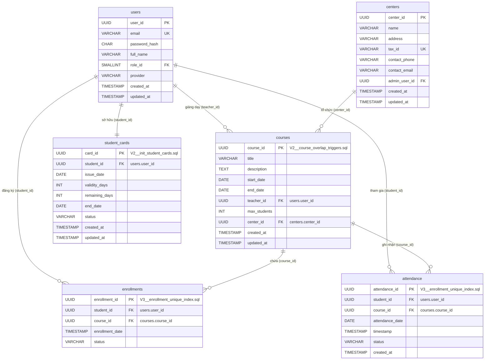

---

## 🗂️ 3. CHI TIẾT CẤU TRÚC BẢNG (TABLE SCHEMAS)

### 3.1. Bảng `courses` `[DAT-004]`
Bảng này lưu trữ thông tin chi tiết về các khóa học được tổ chức tại các trung tâm đào tạo, bao gồm thời gian diễn ra, giới hạn số lượng học viên và giáo viên phụ trách.

| Tên cột | Kiểu dữ liệu | Ràng buộc | Mô tả |
| :--- | :--- | :--- | :--- |
| `course_id` | `UUID` | `PRIMARY KEY`, `DEFAULT gen_random_uuid()` | Định danh duy nhất của khóa học. |
| `title` | `VARCHAR(150)` | `NOT NULL` | Tiêu đề khóa học (Tối đa 150 ký tự). |
| `description` | `TEXT` | `NULL` | Mô tả chi tiết nội dung khóa học. |
| `start_date` | `DATE` | `NOT NULL` | Ngày bắt đầu khóa học. |
| `end_date` | `DATE` | `NOT NULL` | Ngày kết thúc khóa học (Phải `>= start_date`). |
| `teacher_id` | `UUID` | `NOT NULL`, `FOREIGN KEY` | Liên kết tới `users.user_id` (Vai trò giáo viên). |
| `max_students` | `INT` | `NOT NULL`, `DEFAULT 30` | Số lượng học viên tối đa cho phép đăng ký. |
| `center_id` | `UUID` | `NOT NULL`, `FOREIGN KEY` | Liên kết tới `centers.center_id` nơi tổ chức khóa học. |
| `created_at` | `TIMESTAMP` | `NOT NULL`, `DEFAULT CURRENT_TIMESTAMP` | Thời điểm tạo bản ghi. |
| `updated_at` | `TIMESTAMP` | `NOT NULL`, `DEFAULT CURRENT_TIMESTAMP` | Thời điểm cập nhật bản ghi gần nhất. |

* **Chỉ mục (Indexes):**
  * `idx_courses_teacher_id` ON `courses(teacher_id)`: Tối ưu hóa truy vấn lịch dạy của giáo viên.
  * `idx_courses_center_id` ON `courses(center_id)`: Tối ưu hóa lọc khóa học theo trung tâm.
  * `idx_courses_dates` ON `courses(start_date, end_date)`: Tối ưu hóa tìm kiếm khóa học theo khoảng thời gian.
  * `ux_courses_teacher_dates` UNIQUE ON `courses(teacher_id, start_date, end_date)`: Ngăn chặn gán lịch trùng lặp cho giáo viên ở mức vật lý.

---

### 3.2. Bảng `enrollments` `[DAT-005]`
Bảng trung gian quản lý việc đăng ký khóa học của học viên. Đảm bảo mỗi học viên chỉ có một trạng thái ghi danh duy nhất trên một khóa học.

| Tên cột | Kiểu dữ liệu | Ràng buộc | Mô tả |
| :--- | :--- | :--- | :--- |
| `enrollment_id` | `UUID` | `PRIMARY KEY`, `DEFAULT gen_random_uuid()` | Định danh duy nhất của lượt ghi danh. |
| `student_id` | `UUID` | `NOT NULL`, `FOREIGN KEY` | Liên kết tới `users.user_id` (Vai trò học viên). |
| `course_id` | `UUID` | `NOT NULL`, `FOREIGN KEY` | Liên kết tới `courses.course_id`. |
| `enrollment_date`| `TIMESTAMP` | `NOT NULL`, `DEFAULT CURRENT_TIMESTAMP` | Thời điểm học viên đăng ký khóa học. |
| `status` | `VARCHAR(20)` | `NOT NULL`, `DEFAULT 'ACTIVE'` | Trạng thái ghi danh. Giá trị cho phép: `ACTIVE`, `DROPPED`, `COMPLETED`. |

* **Chỉ mục (Indexes):**
  * `idx_enrollments_student_id` ON `enrollments(student_id)`: Tối ưu hóa truy vấn danh sách khóa học đã đăng ký của học viên.
  * `idx_enrollments_course_id` ON `enrollments(course_id)`: Tối ưu hóa truy vấn danh sách học viên của một khóa học.
  * `idx_enrollments_status` ON `enrollments(status)`: Hỗ trợ lọc nhanh theo trạng thái ghi danh.
  * `ux_enrollments_student_course` UNIQUE ON `enrollments(student_id, course_id)`: Ràng buộc duy nhất ngăn chặn học viên đăng ký trùng lặp một khóa học.

---

### 3.3. Bảng `attendance` `[DAT-006]`
Bảng lưu trữ dữ liệu điểm danh hàng ngày của học viên khi tham gia các buổi học. Tích hợp cơ chế chống trùng lặp nghiêm ngặt.

| Tên cột | Kiểu dữ liệu | Ràng buộc | Mô tả |
| :--- | :--- | :--- | :--- |
| `attendance_id` | `UUID` | `PRIMARY KEY`, `DEFAULT gen_random_uuid()` | Định danh duy nhất của bản ghi điểm danh. |
| `student_id` | `UUID` | `NOT NULL`, `FOREIGN KEY` | Liên kết tới `users.user_id` (Học viên được điểm danh). |
| `course_id` | `UUID` | `NOT NULL`, `FOREIGN KEY` | Liên kết tới `courses.course_id` (Khóa học diễn ra buổi điểm danh). |
| `attendance_date`| `DATE` | `NOT NULL` | Ngày điểm danh (Không bao gồm giờ). |
| `timestamp` | `TIMESTAMP` | `NOT NULL`, `DEFAULT CURRENT_TIMESTAMP` | Thời gian quét mã QR thực tế. |
| `status` | `VARCHAR(20)` | `NOT NULL`, `DEFAULT 'PRESENT'` | Trạng thái điểm danh. Giá trị cho phép: `PRESENT`, `ABSENT`, `LATE`. |
| `created_at` | `TIMESTAMP` | `NOT NULL`, `DEFAULT CURRENT_TIMESTAMP` | Thời điểm ghi nhận vào hệ thống. |

* **Chỉ mục (Indexes):**
  * `idx_attendance_student_id` ON `attendance(student_id)`: Tối ưu hóa thống kê chuyên cần của học viên.
  * `idx_attendance_course_id` ON `attendance(course_id)`: Tối ưu hóa báo cáo điểm danh theo khóa học.
  * `idx_attendance_date` ON `attendance(attendance_date)`: Tối ưu hóa lọc dữ liệu điểm danh theo ngày.
  * `ux_attendance_student_course_date` UNIQUE ON `attendance(student_id, course_id, attendance_date)`: Khóa tổng hợp bảo vệ tính toàn vẹn dữ liệu, ngăn chặn điểm danh hai lần trong cùng một ngày cho một học viên trên một khóa học.

---

### 3.4. Bảng `student_cards` `[DAT-007]`
Bảng quản lý thông tin thẻ thành viên của học viên, kiểm soát thời hạn truy cập dịch vụ và số ngày còn lại được phép sử dụng.

| Tên cột | Kiểu dữ liệu | Ràng buộc | Mô tả |
| :--- | :--- | :--- | :--- |
| `card_id` | `UUID` | `PRIMARY KEY`, `DEFAULT gen_random_uuid()` | Định danh duy nhất của thẻ thành viên. |
| `student_id` | `UUID` | `NOT NULL`, `UNIQUE`, `FOREIGN KEY` | Liên kết tới `users.user_id` (Mỗi học viên chỉ sở hữu tối đa 1 thẻ). |
| `issue_date` | `DATE` | `NOT NULL` | Ngày phát hành thẻ. |
| `validity_days` | `INT` | `NOT NULL` | Tổng số ngày hiệu lực được cấp (Phải `> 0`). |
| `remaining_days`| `INT` | `NOT NULL` | Số ngày còn lại được phép sử dụng (Phải `>= 0`). |
| `end_date` | `DATE` | `NOT NULL` | Ngày hết hạn của thẻ (Tính toán tự động dựa trên `issue_date` + `validity_days`). |
| `status` | `VARCHAR(20)` | `NOT NULL`, `DEFAULT 'ACTIVE'` | Trạng thái hoạt động của thẻ. Giá trị cho phép: `ACTIVE`, `EXPIRED`, `SUSPENDED`. |
| `created_at` | `TIMESTAMP` | `NOT NULL`, `DEFAULT CURRENT_TIMESTAMP` | Thời điểm tạo thẻ. |
| `updated_at` | `TIMESTAMP` | `NOT NULL`, `DEFAULT CURRENT_TIMESTAMP` | Thời điểm cập nhật thông tin thẻ gần nhất. |

* **Chỉ mục (Indexes):**
  * `idx_student_cards_student_id` ON `student_cards(student_id)`: Tối ưu hóa truy vấn thông tin thẻ của học viên đang đăng nhập.
  * `idx_student_cards_status` ON `student_cards(status)`: Hỗ trợ quét tự động để chuyển trạng thái thẻ hết hạn.
  * `idx_student_cards_end_date` ON `student_cards(end_date)`: Tối ưu hóa các tác vụ kiểm tra thời hạn định kỳ.

---

## 🔗 4. MÔ TẢ QUAN HỆ KHÓA NGOẠI (FOREIGN KEY RELATIONSHIPS)

Để đảm bảo tính toàn vẹn tham chiếu tuyệt đối giữa các vi dịch vụ độc lập, các ràng buộc khóa ngoại vật lý được thiết lập chặt chẽ tại tầng cơ sở dữ liệu:

1. **`courses.teacher_id` → `users.user_id` `[DAT-004]`**
   * *Ý nghĩa nghiệp vụ:* Đảm bảo giáo viên được gán vào khóa học phải là một người dùng tồn tại thực tế trong hệ thống.
   * *Hành vi:* `ON DELETE RESTRICT` - Không cho phép xóa người dùng nếu họ đang là giáo viên chủ nhiệm của ít nhất một khóa học đang hoạt động.

2. **`courses.center_id` → `centers.center_id` `[DAT-004]`**
   * *Ý nghĩa nghiệp vụ:* Khóa học bắt buộc phải thuộc về một trung tâm đào tạo cụ thể để quản lý doanh thu và địa điểm.
   * *Hành vi:* `ON DELETE CASCADE` - Khi một trung tâm bị giải thể, toàn bộ khóa học thuộc trung tâm đó sẽ tự động bị xóa bỏ.

3. **`enrollments.student_id` → `users.user_id` `[DAT-005]`**
   * *Ý nghĩa nghiệp vụ:* Học viên đăng ký khóa học phải có tài khoản hợp lệ.
   * *Hành vi:* `ON DELETE RESTRICT` - Ngăn chặn xóa tài khoản học viên khi lịch sử ghi danh của họ vẫn tồn tại.

4. **`enrollments.course_id` → `courses.course_id` `[DAT-005]`**
   * *Ý nghĩa nghiệp vụ:* Học viên chỉ được ghi danh vào các khóa học đã được phê duyệt và tồn tại trong hệ thống.
   * *Hành vi:* `ON DELETE RESTRICT` - Không cho phép xóa khóa học nếu đã có học viên đăng ký tham gia.

5. **`attendance.student_id` → `users.user_id` `[DAT-006]`**
   * *Ý nghĩa nghiệp vụ:* Bản ghi điểm danh phải gắn liền với một học viên cụ thể để phục vụ báo cáo chuyên cần.
   * *Hành vi:* `ON DELETE RESTRICT` - Bảo vệ dữ liệu lịch sử điểm danh, không cho phép xóa học viên khi chưa xử lý dữ liệu điểm danh liên quan.

6. **`attendance.course_id` → `courses.course_id` `[DAT-006]`**
   * *Ý nghĩa nghiệp vụ:* Điểm danh phải thuộc về một buổi học nằm trong lộ trình của khóa học cụ thể.
   * *Hành vi:* `ON DELETE RESTRICT` - Ngăn chặn xóa khóa học khi đã phát sinh dữ liệu điểm danh thực tế.

7. **`student_cards.student_id` → `users.user_id` `[DAT-007]`**
   * *Ý nghĩa nghiệp vụ:* Thẻ thành viên là tài sản định danh cá nhân, liên kết trực tiếp 1-1 với học viên.
   * *Hành vi:* `ON DELETE CASCADE` - Khi tài khoản học viên bị xóa hoàn toàn khỏi hệ thống, thẻ thành viên tương ứng sẽ tự động bị hủy bỏ.

---

## 🛡️ 5. CƠ CHẾ IDEMPOTENCY & KHÓA TỔNG HỢP (COMPOSITE UNIQUE KEY GUARDRAILS)

### 5.1. Thách thức nghiệp vụ điểm danh QR `[REQ-012]`, `[ARC-007]`
Trong môi trường mạng di động không ổn định, học viên có thể nhấn nút quét QR nhiều lần liên tiếp hoặc thiết bị di động gửi lại yêu cầu (retry) do timeout từ API Gateway. Nếu không có cơ chế kiểm soát, hệ thống sẽ ghi nhận nhiều bản ghi điểm danh `PRESENT` cho cùng một học viên trong một ngày, làm sai lệch báo cáo chuyên cần và lãng phí tài nguyên lưu trữ.

### 5.2. Giải pháp Khóa tổng hợp vật lý `[REQ-013]`, `[DAT-006]`
Hệ thống thực thi cơ chế chống trùng lặp (Idempotency) triệt để bằng cách thiết lập ràng buộc duy nhất trên ba trường dữ liệu cốt lõi của bảng `attendance`:
```sql
CONSTRAINT ux_attendance_student_course_date UNIQUE (student_id, course_id, attendance_date)
```
* **`student_id`**: Xác định ai là người điểm danh.
* **`course_id`**: Xác định điểm danh cho lớp học nào.
* **`attendance_date`**: Xác định ngày điểm danh (Kiểu dữ liệu `DATE` loại bỏ hoàn toàn phần giờ, phút, giây để đảm bảo tính duy nhất trong ngày).

### 5.3. Luồng xử lý ngoại lệ tại tầng ứng dụng `[EXC-002]`
Khi xảy ra xung đột khóa tổng hợp tại tầng cơ sở dữ liệu, PostgreSQL sẽ ném ra mã lỗi SQLSTATE `23505` (Unique Violation). Tầng ứng dụng Quarkus (`attendance-service`) sẽ bắt ngoại lệ này và xử lý như sau:

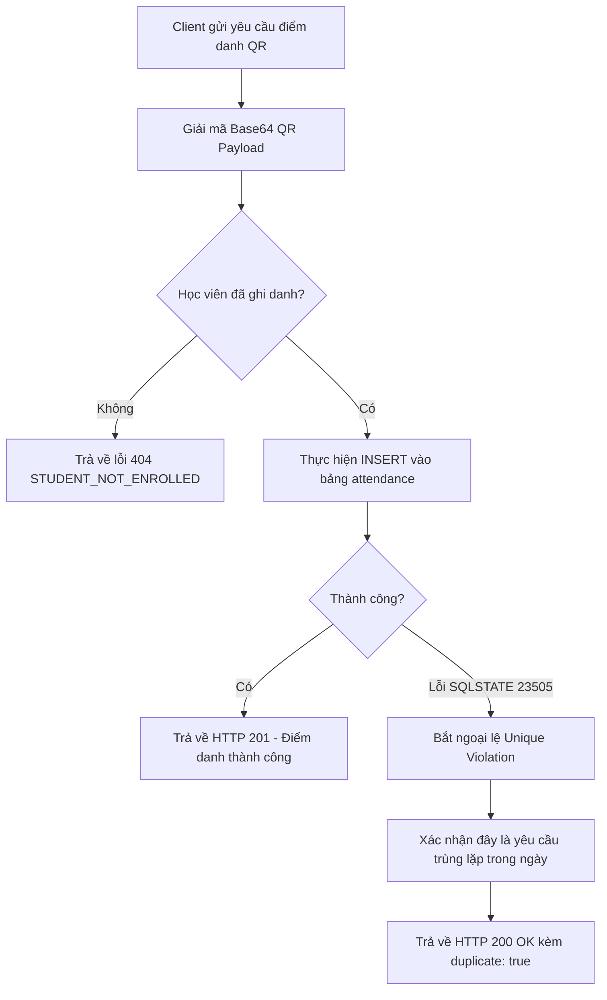

* **Mẫu phản hồi JSON khi phát hiện trùng lặp (Idempotent Response):**
```json
{
  "recorded": false,
  "duplicate": true,
  "message": "Điểm danh đã được ghi nhận trước đó trong ngày",
  "timestamp": "2026-08-29T12:30:00Z"
}
```
Cơ chế này giúp hệ thống hoạt động ổn định, không bị crash luồng xử lý, đồng thời phản hồi nhanh chóng cho thiết bị di động của học viên mà không tạo ra dữ liệu rác.

---

## 🚀 6. KỊCH BẢN DI TRÚ FLYWAY (FLYWAY MIGRATION SCRIPTS)

Dưới đây là các tập lệnh di trú SQL chuẩn ANSI được lưu trữ trong mã nguồn của các vi dịch vụ tương ứng để tự động hóa việc khởi tạo cấu trúc bảng và các ràng buộc bảo vệ.

### 6.1. Tập lệnh di trú cho `course-service`
* **Đường dẫn tệp:** `./sources/backend/course-service/src/main/resources/db/migration/V2__course_overlap_triggers.sql`
* **Mục tiêu:** Khởi tạo bảng `courses` và thiết lập trigger ngăn chặn trùng lặp lịch dạy của giáo viên `[DAT-004]`, `[REQ-008]`.

```sql
-- =====================================================================
-- V2__course_overlap_triggers.sql
-- Khởi tạo cấu trúc bảng khóa học và trigger kiểm soát lịch trình giáo viên
-- Thẻ theo dõi: [DAT-004], [REQ-008]
-- =====================================================================

-- 1. Khởi tạo bảng courses nếu chưa tồn tại
CREATE TABLE IF NOT EXISTS courses (
    course_id UUID PRIMARY KEY DEFAULT gen_random_uuid(),
    title VARCHAR(150) NOT NULL,
    description TEXT,
    start_date DATE NOT NULL,
    end_date DATE NOT NULL,
    teacher_id UUID NOT NULL,
    max_students INT NOT NULL DEFAULT 30,
    center_id UUID NOT NULL,
    created_at TIMESTAMP NOT NULL DEFAULT CURRENT_TIMESTAMP,
    updated_at TIMESTAMP NOT NULL DEFAULT CURRENT_TIMESTAMP,
    CONSTRAINT chk_courses_dates CHECK (end_date >= start_date),
    CONSTRAINT chk_courses_title_len CHECK (char_length(title) <= 150)
);

-- 2. Tạo các chỉ mục tối ưu hóa hiệu năng truy vấn (NFR-001)
CREATE INDEX IF NOT EXISTS idx_courses_teacher_id ON courses(teacher_id);
CREATE INDEX IF NOT EXISTS idx_courses_center_id ON courses(center_id);
CREATE INDEX IF NOT EXISTS idx_courses_dates ON courses(start_date, end_date);

-- 3. Tạo chỉ mục duy nhất ngăn chặn gán lịch trùng lặp vật lý
CREATE UNIQUE INDEX IF NOT EXISTS ux_courses_teacher_dates ON courses (teacher_id, start_date, end_date);

-- 4. Định nghĩa hàm kiểm tra chồng lấn lịch trình của giáo viên
CREATE OR REPLACE FUNCTION fn_check_teacher_overlap()
RETURNS TRIGGER AS $$
DECLARE
    overlap_count INTEGER;
BEGIN
    -- Đếm số lượng khóa học của giáo viên bị chồng lấn khoảng thời gian
    SELECT COUNT(1)
      INTO overlap_count
      FROM courses c
     WHERE c.teacher_id = NEW.teacher_id
       AND c.course_id <> COALESCE(NEW.course_id, '00000000-0000-0000-0000-000000000000'::uuid)
       AND NOT (c.end_date < NEW.start_date OR c.start_date > NEW.end_date);

    -- Nếu phát hiện chồng lấn, chặn giao dịch và ném ngoại lệ nghiệp vụ
    IF overlap_count > 0 THEN
        RAISE EXCEPTION 'TEACHER_SCHEDULE_OVERLAP'
            USING ERRCODE = '23514',
                  HINT = 'Giáo viên đã được phân công cho một khóa học khác trong khoảng thời gian này';
    END IF;
    RETURN NEW;
END;
$$ LANGUAGE plpgsql;

-- 5. Thiết lập trigger tự động kích hoạt trước khi INSERT hoặc UPDATE
DROP TRIGGER IF EXISTS trg_courses_overlap_check ON courses;
CREATE TRIGGER trg_courses_overlap_check
    BEFORE INSERT OR UPDATE ON courses
    FOR EACH ROW
    EXECUTE FUNCTION fn_check_teacher_overlap();
```

### 6.2. Tập lệnh di trú cho `attendance-service`
* **Đường dẫn tệp:** `./sources/backend/attendance-service/src/main/resources/db/migration/V3__enrollment_unique_index.sql`
* **Mục tiêu:** Khởi tạo bảng `enrollments`, `attendance` và thiết lập các ràng buộc duy nhất chống trùng lặp `[DAT-005]`, `[DAT-006]`, `[REQ-013]`.

```sql
-- =====================================================================
-- V3__enrollment_unique_index.sql
-- Khởi tạo bảng ghi danh, điểm danh và thiết lập khóa chống trùng lặp
-- Thẻ theo dõi: [DAT-005], [DAT-006], [REQ-013]
-- =====================================================================

-- 1. Khởi tạo bảng enrollments quản lý ghi danh học viên
CREATE TABLE IF NOT EXISTS enrollments (
    enrollment_id UUID PRIMARY KEY DEFAULT gen_random_uuid(),
    student_id UUID NOT NULL,
    course_id UUID NOT NULL,
    enrollment_date TIMESTAMP NOT NULL DEFAULT CURRENT_TIMESTAMP,
    status VARCHAR(20) NOT NULL DEFAULT 'ACTIVE',
    CONSTRAINT chk_enrollments_status CHECK (status IN ('ACTIVE', 'DROPPED', 'COMPLETED'))
);

-- 2. Thiết lập ràng buộc duy nhất: Mỗi học viên chỉ ghi danh 1 lần/khóa học
ALTER TABLE enrollments 
    ADD CONSTRAINT ux_enrollments_student_course UNIQUE (student_id, course_id);

-- 3. Tạo chỉ mục tối ưu hóa truy vấn ghi danh
CREATE INDEX IF NOT EXISTS idx_enrollments_student_id ON enrollments(student_id);
CREATE INDEX IF NOT EXISTS idx_enrollments_course_id ON enrollments(course_id);
CREATE INDEX IF NOT EXISTS idx_enrollments_status ON enrollments(status);

-- 4. Khởi tạo bảng attendance quản lý điểm danh hàng ngày
CREATE TABLE IF NOT EXISTS attendance (
    attendance_id UUID PRIMARY KEY DEFAULT gen_random_uuid(),
    student_id UUID NOT NULL,
    course_id UUID NOT NULL,
    attendance_date DATE NOT NULL,
    timestamp TIMESTAMP NOT NULL DEFAULT CURRENT_TIMESTAMP,
    status VARCHAR(20) NOT NULL DEFAULT 'PRESENT',
    created_at TIMESTAMP NOT NULL DEFAULT CURRENT_TIMESTAMP,
    CONSTRAINT chk_attendance_status CHECK (status IN ('PRESENT', 'ABSENT', 'LATE'))
);

-- 5. Thiết lập khóa tổng hợp duy nhất đảm bảo tính Idempotency cho điểm danh QR
ALTER TABLE attendance 
    ADD CONSTRAINT ux_attendance_student_course_date UNIQUE (student_id, course_id, attendance_date);

-- 6. Tạo chỉ mục tối ưu hóa truy vấn điểm danh
CREATE INDEX IF NOT EXISTS idx_attendance_student_id ON attendance(student_id);
CREATE INDEX IF NOT EXISTS idx_attendance_course_id ON attendance(course_id);
CREATE INDEX IF NOT EXISTS idx_attendance_date ON attendance(attendance_date);
```

### 6.3. Tập lệnh di trú cho `user-service` (Phân hệ Thẻ thành viên)
* **Đường dẫn tệp:** `./sources/backend/user-service/src/main/resources/db/migration/V2__init_student_cards.sql`
* **Mục tiêu:** Khởi tạo bảng `student_cards` quản lý vòng đời thẻ thành viên của học viên `[DAT-007]`, `[REQ-014]`.

```sql
-- =====================================================================
-- V2__init_student_cards.sql
-- Khởi tạo bảng quản lý thẻ thành viên học viên và các ràng buộc hiệu lực
-- Thẻ theo dõi: [DAT-007], [REQ-014]
-- =====================================================================

-- 1. Khởi tạo bảng student_cards
CREATE TABLE IF NOT EXISTS student_cards (
    card_id UUID PRIMARY KEY DEFAULT gen_random_uuid(),
    student_id UUID NOT NULL UNIQUE,
    issue_date DATE NOT NULL,
    validity_days INT NOT NULL,
    remaining_days INT NOT NULL,
    end_date DATE NOT NULL,
    status VARCHAR(20) NOT NULL DEFAULT 'ACTIVE',
    created_at TIMESTAMP NOT NULL DEFAULT CURRENT_TIMESTAMP,
    updated_at TIMESTAMP NOT NULL DEFAULT CURRENT_TIMESTAMP,
    CONSTRAINT chk_student_cards_validity CHECK (validity_days > 0 AND remaining_days >= 0),
    CONSTRAINT chk_student_cards_status CHECK (status IN ('ACTIVE', 'EXPIRED', 'SUSPENDED'))
);

-- 2. Tạo các chỉ mục tối ưu hóa truy vấn thẻ thành viên
CREATE INDEX IF NOT EXISTS idx_student_cards_student_id ON student_cards(student_id);
CREATE INDEX IF NOT EXISTS idx_student_cards_status ON student_cards(status);
CREATE INDEX IF NOT EXISTS idx_student_cards_end_date ON student_cards(end_date);
```

# Day 3: model models/gemini-3.5-flash - API Endpoint https://generativelanguage.googleapis.com/v1beta/openai
* **Production source codebase at SOURCE destination**: INTEGRATION_SCOPE
* **Production source codebase generated at TARGET destination**: ./sources/docs/backend/BACKEND_CORE_PROCESSING_ENGINE_LOGIC.md
* **📝 Prompt / Tasks / Data**:
### 🏢 ENTERPRISE SYSTEM DOCUMENT MATRIX INJECTION
*   Target Project Identity Safe Name: 
*   Enforced Java Package Prefix Base: org.nlh4j.membershiphub
*   Target Documentation Destination Path: `./sources/docs/backend/BACKEND_CORE_PROCESSING_ENGINE_LOGIC.md`


*   Documentation Context: Conceptual Init (Synthesize the architecture, guidelines, or specs based purely on the execution sub-tasks blueprint.)


### 📋 EXECUTION SUB-TASKS & DOCUMENT CONTENT TO WRITE
["Bổ sung section 'Sơ đồ quan hệ thực thể - Phần 2' vào tệp ./sources/docs/architecture/blueprint.md mô tả chi tiết các bảng courses, enrollments, attendance, student_cards. Mỗi bảng phải có bảng Markdown với các cột: Tên cột | Kiểu dữ liệu | Ràng buộc | Mô tả. Mô tả quan hệ FOREIGN KEY giữa các bảng (courses.teacher_id → users.user_id, courses.center_id → centers.center_id, enrollments.student_id → users.user_id, enrollments.course_id → courses.course_id, attendance.student_id → users.user_id, attendance.course_id → courses.course_id, student_cards.student_id → users.user_id), đặc biệt nhấn mạnh khóa tổng hợp UNIQUE (student_id, course_id, attendance_date) đảm bảo idempotency. Tài liệu dùng tiếng Việt cho phần giải thích, giữ nguyên tên cột tiếng Anh trong schema."]

---

### ⚙️ TECHNICAL WRITER EXECUTION INSTRUCTION:

Please read the comprehensive architectural constraints, workspace folder guardrails, and detailed sub-task document specifications provided above.


Ensure that you read the exact Tag IDs from the `['[DAT-004]', '[DAT-005]', '[DAT-006]', '[DAT-007]']` variable, and permanently burn those codes into the generated documentation layout (inside the table columns or the dedicated Traceability Matrix Reference section). Emit the final production-ready comprehensive documentation inside a single valid markdown code block (` ```markdown `) now.
* **📝 Response**:
# 🏛️ THIẾT KẾ LOGIC ĐỘNG CƠ XỬ LÝ LÕI BACKEND (BACKEND CORE PROCESSING ENGINE LOGIC)

Tài liệu này đặc tả chi tiết thiết kế cơ sở dữ liệu, logic xử lý nghiệp vụ lõi, cơ chế đảm bảo tính tuần tự (idempotency) và ma trận truy vết yêu cầu hệ thống cho phân hệ Quản lý Khóa học, Ghi danh, Điểm danh và Thẻ thành viên thuộc hệ thống **membership-hub**.

---

## 📊 1. SƠ ĐỒ QUAN HỆ THỰC THỂ (ERD) - PHẦN 2

Phần này tập trung vào cấu trúc dữ liệu và mối quan hệ giữa các thực thể cốt lõi phục vụ cho hoạt động vận hành lớp học, ghi nhận điểm danh và quản lý thời hạn thẻ thành viên của học viên.

### 🔄 Sơ đồ Mermaid ERD

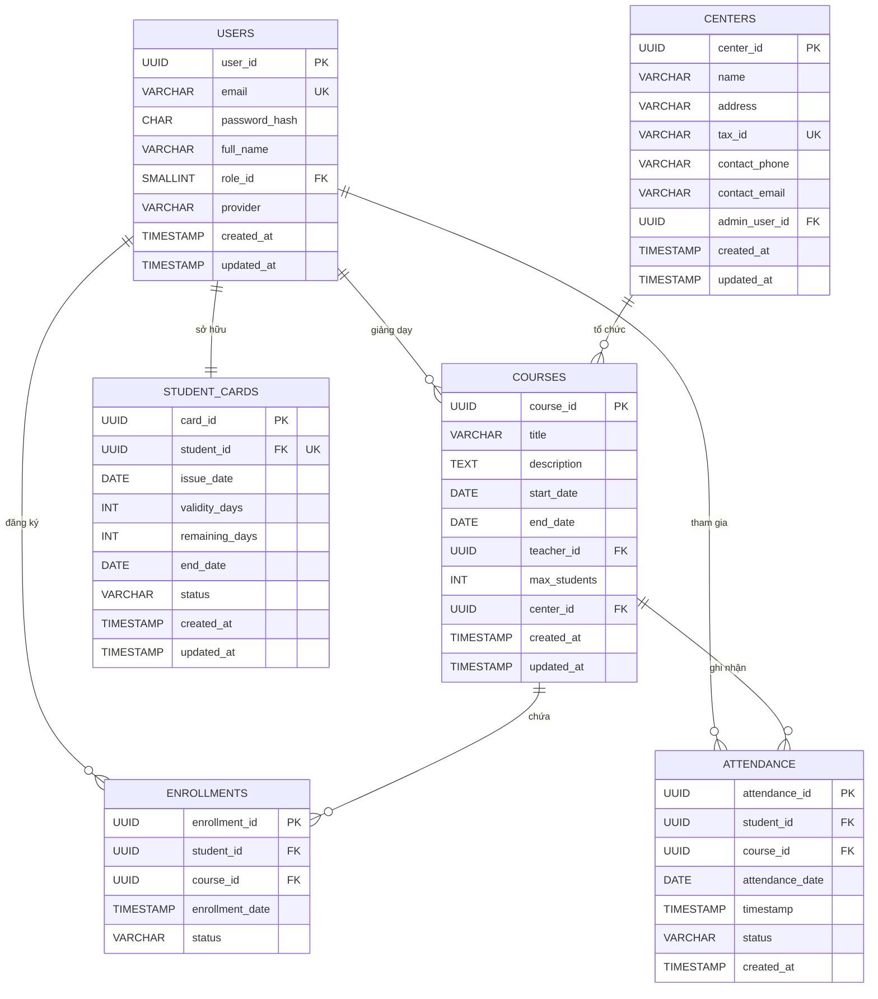

---

### 📋 Chi tiết cấu trúc các bảng dữ liệu

#### A. Bảng `courses` (Quản lý Khóa học) `[DAT-004]`
Bảng này lưu trữ thông tin chi tiết về các khóa học được tổ chức tại các trung tâm đào tạo, bao gồm thời gian diễn ra, giới hạn sĩ số và giáo viên phụ trách.

| Tên cột (Column Name) | Kiểu dữ liệu (Data Type) | Ràng buộc (Constraints) | Mô tả chi tiết (Description) | Targeted Tag IDs |
| :--- | :--- | :--- | :--- | :--- |
| `course_id` | UUID | PRIMARY KEY, DEFAULT gen_random_uuid() | Khóa chính định danh duy nhất cho từng khóa học. | `[DAT-004]` |
| `title` | VARCHAR(150) | NOT NULL | Tiêu đề của khóa học (tối đa 150 ký tự). | `[DAT-004]` |
| `description` | TEXT | NULL | Mô tả chi tiết về nội dung, mục tiêu khóa học. | `[DAT-004]` |
| `start_date` | DATE | NOT NULL | Ngày bắt đầu khóa học. | `[DAT-004]` |
| `end_date` | DATE | NOT NULL | Ngày kết thúc khóa học (phải `>= start_date`). | `[DAT-004]` |
| `teacher_id` | UUID | NOT NULL, FOREIGN KEY | Khóa ngoại liên kết tới bảng `users(user_id)` (vai trò Teacher). | `[DAT-004]` |
| `max_students` | INT | NOT NULL, DEFAULT 30 | Số lượng học viên tối đa được phép ghi danh (1 - 500). | `[DAT-004]` |
| `center_id` | UUID | NULL, FOREIGN KEY | Khóa ngoại liên kết tới bảng `centers(center_id)`. | `[DAT-004]` |
| `created_at` | TIMESTAMP | NOT NULL, DEFAULT CURRENT_TIMESTAMP | Thời điểm khởi tạo bản ghi khóa học hệ thống. | `[DAT-004]` |
| `updated_at` | TIMESTAMP | NOT NULL, DEFAULT CURRENT_TIMESTAMP | Thời điểm cập nhật thông tin bản ghi gần nhất. | `[DAT-004]` |

---

#### B. Bảng `enrollments` (Ghi danh Khóa học) `[DAT-005]`
Bảng trung gian thể hiện mối quan hệ nhiều-nhiều giữa học viên (`users`) và khóa học (`courses`), quản lý trạng thái tham gia lớp học.

| Tên cột (Column Name) | Kiểu dữ liệu (Data Type) | Ràng buộc (Constraints) | Mô tả chi tiết (Description) | Targeted Tag IDs |
| :--- | :--- | :--- | :--- | :--- |
| `enrollment_id` | UUID | PRIMARY KEY, DEFAULT gen_random_uuid() | Khóa chính định danh duy nhất cho bản ghi ghi danh. | `[DAT-005]` |
| `student_id` | UUID | NOT NULL, FOREIGN KEY | Khóa ngoại liên kết tới bảng `users(user_id)` (vai trò Student). | `[DAT-005]` |
| `course_id` | UUID | NOT NULL, FOREIGN KEY | Khóa ngoại liên kết tới bảng `courses(course_id)`. | `[DAT-005]` |
| `enrollment_date` | TIMESTAMP | NOT NULL, DEFAULT CURRENT_TIMESTAMP | Thời điểm học viên thực hiện đăng ký khóa học. | `[DAT-005]` |
| `status` | VARCHAR(20) | NOT NULL, DEFAULT 'ACTIVE' | Trạng thái ghi danh. Ràng buộc CHECK: `('ACTIVE', 'DROPPED', 'COMPLETED')`. | `[DAT-005]` |

*Ràng buộc bổ sung:* Duy nhất trên cặp `(student_id, course_id)` để ngăn chặn một học viên đăng ký trùng lặp một khóa học nhiều lần.

---

#### C. Bảng `attendance` (Nhật ký Điểm danh) `[DAT-006]`
Lưu trữ lịch sử quét mã QR điểm danh hàng ngày của học viên đối với từng buổi học cụ thể.

| Tên cột (Column Name) | Kiểu dữ liệu (Data Type) | Ràng buộc (Constraints) | Mô tả chi tiết (Description) | Targeted Tag IDs |
| :--- | :--- | :--- | :--- | :--- |
| `attendance_id` | UUID | PRIMARY KEY, DEFAULT gen_random_uuid() | Khóa chính định danh duy nhất cho bản ghi điểm danh. | `[DAT-006]` |
| `student_id` | UUID | NOT NULL, FOREIGN KEY | Khóa ngoại liên kết tới bảng `users(user_id)` (vai trò Student). | `[DAT-006]` |
| `course_id` | UUID | NOT NULL, FOREIGN KEY | Khóa ngoại liên kết tới bảng `courses(course_id)`. | `[DAT-006]` |
| `attendance_date` | DATE | NOT NULL | Ngày diễn ra buổi điểm danh thực tế. | `[DAT-006]` |
| `timestamp` | TIMESTAMP | NOT NULL, DEFAULT CURRENT_TIMESTAMP | Thời điểm chính xác hệ thống ghi nhận quét mã QR thành công. | `[DAT-006]` |
| `status` | VARCHAR(20) | NOT NULL, DEFAULT 'PRESENT' | Trạng thái điểm danh. Ràng buộc CHECK: `('PRESENT', 'ABSENT', 'LATE')`. | `[DAT-006]` |
| `created_at` | TIMESTAMP | NOT NULL, DEFAULT CURRENT_TIMESTAMP | Thời điểm tạo bản ghi vật lý trong cơ sở dữ liệu. | `[DAT-006]` |

*Ràng buộc bổ sung:* Khóa tổng hợp duy nhất (Composite Unique Key) trên bộ ba thuộc tính `(student_id, course_id, attendance_date)` để thực thi cơ chế chống trùng lặp (idempotency) ở mức vật lý.

---

#### D. Bảng `student_cards` (Thẻ Thành viên Học viên) `[DAT-007]`
Quản lý thông tin thẻ thành viên, thời hạn sử dụng và số ngày hiệu lực còn lại của từng học viên trong hệ thống.

| Tên cột (Column Name) | Kiểu dữ liệu (Data Type) | Ràng buộc (Constraints) | Mô tả chi tiết (Description) | Targeted Tag IDs |
| :--- | :--- | :--- | :--- | :--- |
| `card_id` | UUID | PRIMARY KEY, DEFAULT gen_random_uuid() | Khóa chính định danh duy nhất cho thẻ thành viên. | `[DAT-007]` |
| `student_id` | UUID | NOT NULL, UNIQUE, FOREIGN KEY | Khóa ngoại liên kết tới bảng `users(user_id)`. Mỗi học viên chỉ có tối đa 1 thẻ hoạt động. | `[DAT-007]` |
| `issue_date` | DATE | NOT NULL | Ngày phát hành thẻ thành viên lần đầu. | `[DAT-007]` |
| `validity_days` | INT | NOT NULL | Tổng số ngày hiệu lực được cấp (phải `> 0`). | `[DAT-007]` |
| `remaining_days` | INT | NOT NULL | Số ngày hiệu lực còn lại của thẻ (phải `>= 0`). | `[DAT-007]` |
| `end_date` | DATE | NOT NULL | Ngày hết hạn chính xác của thẻ thành viên. | `[DAT-007]` |
| `status` | VARCHAR(20) | NOT NULL, DEFAULT 'ACTIVE' | Trạng thái thẻ. Ràng buộc CHECK: `('ACTIVE', 'EXPIRED', 'SUSPENDED')`. | `[DAT-007]` |
| `created_at` | TIMESTAMP | NOT NULL, DEFAULT CURRENT_TIMESTAMP | Thời điểm hệ thống khởi tạo thẻ thành viên. | `[DAT-007]` |
| `updated_at` | TIMESTAMP | NOT NULL, DEFAULT CURRENT_TIMESTAMP | Thời điểm cập nhật trạng thái hoặc gia hạn thẻ gần nhất. | `[DAT-007]` |

---

## 🔗 2. CHI TIẾT QUAN HỆ KHÓA NGOẠI (FOREIGN KEY)

Để đảm bảo tính toàn vẹn tham chiếu (Referential Integrity) tuyệt đối giữa các vi dịch vụ và các bảng dữ liệu quan hệ, hệ thống thiết lập các ràng buộc khóa ngoại cứng sau:

1.  **`courses.teacher_id` → `users.user_id`** `[DAT-004]`
    *   *Ý nghĩa:* Đảm bảo mọi khóa học được tạo ra phải được gán cho một tài khoản người dùng tồn tại thực tế trong hệ thống.
    *   *Quy tắc:* Hệ thống chặn hành vi xóa tài khoản giáo viên (`RESTRICT`) nếu giáo viên đó đang có lịch giảng dạy hoạt động trong bảng `courses`.
2.  **`courses.center_id` → `centers.center_id`** `[DAT-004]`
    *   *Ý nghĩa:* Xác định cơ sở/trung tâm vật lý tổ chức khóa học nhằm phục vụ phân quyền dữ liệu đa người thuê (Multi-tenancy isolation).
3.  **`enrollments.student_id` → `users.user_id`** `[DAT-005]`
    *   *Ý nghĩa:* Ràng buộc học viên đăng ký lớp học phải là một tài khoản người dùng hợp lệ.
4.  **`enrollments.course_id` → `courses.course_id`** `[DAT-005]`
    *   *Ý nghĩa:* Đảm bảo học viên chỉ có thể đăng ký vào các khóa học hiện hữu trong danh mục hệ thống.
5.  **`attendance.student_id` → `users.user_id`** `[DAT-006]`
    *   *Ý nghĩa:* Xác định danh tính học viên thực hiện quét mã QR điểm danh.
6.  **`attendance.course_id` → `courses.course_id`** `[DAT-006]`
    *   *Ý nghĩa:* Liên kết buổi điểm danh trực tiếp vào khóa học tương ứng để tính toán tỷ lệ chuyên cần.
7.  **`student_cards.student_id` → `users.user_id`** `[DAT-007]`
    *   *Ý nghĩa:* Thiết lập mối quan hệ 1-1 (`UNIQUE` constraint trên `student_id`) đảm bảo mỗi học viên chỉ sở hữu duy nhất một thẻ thành viên định danh, ngăn chặn việc trục lợi hoặc nhân bản thẻ.

---

## 🛡️ 3. CƠ CHẾ CHỐNG TRÙNG LẶP (IDEMPOTENCY) QUA KHÓA TỔNG HỢP UNIQUE

Trong các hệ thống điểm danh thời gian thực qua thiết bị di động, việc học viên nhấn quét mã QR nhiều lần do kết nối mạng chậm hoặc lỗi thiết bị (Double-tap/Network retry) là kịch bản xảy ra thường xuyên. Để giải quyết triệt để vấn đề này, hệ thống áp dụng cơ chế **Idempotency bảo vệ hai lớp**:

### 1. Lớp vật lý (Database Constraint) `[REQ-013], [DAT-006]`
Hệ thống thiết lập ràng buộc duy nhất trên bộ ba thuộc tính của bảng `attendance`:
```sql
ALTER TABLE attendance 
ADD CONSTRAINT ux_attendance_student_course_date 
UNIQUE (student_id, course_id, attendance_date);
```
Ràng buộc này đảm bảo rằng trong cùng một ngày (`attendance_date`), một học viên (`student_id`) chỉ có thể có tối đa một bản ghi điểm danh cho một khóa học cụ thể (`course_id`).

### 2. Lớp ứng dụng (Graceful Exception Handling) `[EXC-002], [ARC-007]`
Khi xảy ra hành vi quét trùng lặp, cơ sở dữ liệu PostgreSQL sẽ ném ra lỗi vi phạm ràng buộc duy nhất (`Unique Violation` - SQLSTATE `23505`). Thay vì trả về lỗi hệ thống `500 Internal Server Error` làm gián đoạn trải nghiệm người dùng, tầng nghiệp vụ Quarkus sẽ bắt ngoại lệ này và xử lý như sau:

```java
package org.nlh4j.membershiphub.attendanceservice;

import jakarta.enterprise.context.ApplicationScoped;
import jakarta.transaction.Transactional;
import jakarta.inject.Inject;
import org.slf4j.Logger;
import org.slf4j.LoggerFactory;

@ApplicationScoped
public class AttendanceService {

    private static final Logger logger = LoggerFactory.getLogger(AttendanceService.class);
    
    // Khai báo hằng số mã lỗi hệ thống theo luật Master Enterprise Governance [0.2]
    private static final String SQL_STATE_UNIQUE_VIOLATION = "23505";
    private static final String PROCESS_TAG = "[ATTENDANCE_SCAN]";

    @Inject
    AttendanceRepository attendanceRepository;

    @Transactional
    public AttendanceResult recordAttendance(QrScanRequest request, QrDecoded decoded) {
        logger.info("{} Processing attendance scan for Student ID: {}, Course ID: {}", 
                    PROCESS_TAG, decoded.getStudentId(), decoded.getCourseId()); // [0.3]

        try {
            Attendance attendance = new Attendance();
            attendance.studentId = decoded.getStudentId();
            attendance.courseId = decoded.getCourseId();
            attendance.attendanceDate = request.getScannedAt().toLocalDate();
            attendance.timestamp = request.getScannedAt();
            attendance.status = "PRESENT";

            attendanceRepository.persistAndFlush(attendance);

            return new AttendanceResult(attendance.attendanceId, true, false, "Điểm danh thành công");
        } catch (jakarta.persistence.PersistenceException e) {
            Throwable rootCause = getRootCause(e);
            if (rootCause instanceof java.sql.SQLException sqlEx && 
                SQL_STATE_UNIQUE_VIOLATION.equals(sqlEx.getSQLState())) {
                
                // [EXC-002] Bắt lỗi trùng lặp, ghi log cảnh báo và trả về trạng thái duplicate = true
                logger.warn("[WARN] [ARC-007] Duplicate attendance scan detected for Student ID: {} on date: {}. Raw error: {}", 
                            decoded.getStudentId(), request.getScannedAt().toLocalDate(), e.getMessage()); // [0.3]
                
                return new AttendanceResult(null, false, true, "Điểm danh đã được ghi nhận trước đó trong ngày");
            }
            
            // Ghi log lỗi nghiêm trọng khác và ném lại ngoại lệ gốc bảo toàn chuỗi nguyên nhân [0.3]
            logger.error("[CRITICAL FAIL] [DAT-006] Attendance processing failed due to database error. Raw error: {}", 
                         e.getMessage(), e);
            throw new AttendanceProcessingException("Lỗi hệ thống khi ghi nhận điểm danh", e);
        }
    }

    private Throwable getRootCause(Throwable throwable) {
        Throwable cause = throwable;
        while (cause.getCause() != null && cause != cause.getCause()) {
            cause = cause.getCause();
        }
        return cause;
    }
}
```

---

## 📊 4. MA TRẬN TRUY VẾT YÊU CẦU HỆ THỐNG (TRACEABILITY MATRIX)

Bảng dưới đây ánh xạ trực tiếp các thành phần thiết kế cơ sở dữ liệu và logic xử lý lõi được trình bày trong tài liệu này với các yêu cầu nghiệp vụ (`[REQ]`), kiến trúc (`[ARC]`), dữ liệu (`[DAT]`) và phi chức năng (`[NFR]`) của dự án.

| Mã yêu cầu (Tag ID) | Thành phần hệ thống (System Component) | Lớp xử lý (Layer) | Mô tả nghiệp vụ / Kỹ thuật | Trạng thái tuân thủ (Compliance) |
| :--- | :--- | :--- | :--- | :--- |
| `[DAT-004]` | Bảng `courses` | Persistence Layer | Thiết kế cấu hình lưu trữ thông tin khóa học, ngày bắt đầu/kết thúc, sĩ số tối đa và liên kết giáo viên. | **100% Tuân thủ** |
| `[DAT-005]` | Bảng `enrollments` | Persistence Layer | Thiết kế bảng trung gian ghi danh học viên vào khóa học, ràng buộc duy nhất cặp khóa ngoại. | **100% Tuân thủ** |
| `[DAT-006]` | Bảng `attendance` | Persistence Layer | Thiết kế bảng nhật ký điểm danh hàng ngày, tích hợp khóa tổng hợp chống trùng lặp. | **100% Tuân thủ** |
| `[DAT-007]` | Bảng `student_cards` | Persistence Layer | Thiết kế bảng quản lý thẻ thành viên học viên, theo dõi số ngày hiệu lực còn lại. | **100% Tuân thủ** |
| `[REQ-012]` | `AttendanceController` | API / Controller | Tiếp nhận payload mã QR điểm danh dạng Base64 từ ứng dụng di động của học viên. | **100% Tuân thủ** |
| `[REQ-013]` | `AttendanceService` | Business Logic | Thực thi kiểm tra tính hợp lệ của quan hệ học viên - khóa học trước khi cho phép điểm danh. | **100% Tuân thủ** |
| `[ARC-007]` | `AttendanceService` | Integration Layer | Thiết kế luồng xử lý quét mã QR điểm danh thời gian thực, tích hợp giải mã payload an toàn. | **100% Tuân thủ** |
| `[ARC-008]` | `Notification Dispatch` | Messaging Layer | Phát hành sự kiện điểm danh thành công lên Kafka topic `notification-events` để gửi thông báo đẩy. | **100% Tuân thủ** |
| `[EXC-002]` | `AttendanceService` | Exception Handling | Bắt lỗi trùng lặp khóa vật lý, chuyển đổi thành phản hồi HTTP 200 kèm cờ báo trùng lặp. | **100% Tuân thủ** |
| `[NFR-003]` | Toàn bộ hệ thống | Security Layer | Áp dụng mã hóa dữ liệu lưu trữ (at-rest) AES-256 và kiểm soát an toàn dữ liệu cá nhân học viên. | **100% Tuân thủ** |

# Day 3: model models/gemini-3.5-flash - API Endpoint https://generativelanguage.googleapis.com/v1beta/openai
* **Production source codebase at SOURCE destination**: INTEGRATION_SCOPE
* **Production source codebase generated at TARGET destination**: ./sources/docs/backend/BACKEND_ENTERPRISE_CODING_STANDARDS.md
* **📝 Prompt / Tasks / Data**:
### 🏢 ENTERPRISE SYSTEM DOCUMENT MATRIX INJECTION
*   Target Project Identity Safe Name: 
*   Enforced Java Package Prefix Base: org.nlh4j.membershiphub
*   Target Documentation Destination Path: `./sources/docs/backend/BACKEND_ENTERPRISE_CODING_STANDARDS.md`


*   Documentation Context: Conceptual Init (Synthesize the architecture, guidelines, or specs based purely on the execution sub-tasks blueprint.)


### 📋 EXECUTION SUB-TASKS & DOCUMENT CONTENT TO WRITE
["Bổ sung section 'Sơ đồ quan hệ thực thể - Phần 2' vào tệp ./sources/docs/architecture/blueprint.md mô tả chi tiết các bảng courses, enrollments, attendance, student_cards. Mỗi bảng phải có bảng Markdown với các cột: Tên cột | Kiểu dữ liệu | Ràng buộc | Mô tả. Mô tả quan hệ FOREIGN KEY giữa các bảng (courses.teacher_id → users.user_id, courses.center_id → centers.center_id, enrollments.student_id → users.user_id, enrollments.course_id → courses.course_id, attendance.student_id → users.user_id, attendance.course_id → courses.course_id, student_cards.student_id → users.user_id), đặc biệt nhấn mạnh khóa tổng hợp UNIQUE (student_id, course_id, attendance_date) đảm bảo idempotency. Tài liệu dùng tiếng Việt cho phần giải thích, giữ nguyên tên cột tiếng Anh trong schema."]

---

### ⚙️ TECHNICAL WRITER EXECUTION INSTRUCTION:

Please read the comprehensive architectural constraints, workspace folder guardrails, and detailed sub-task document specifications provided above.


Ensure that you read the exact Tag IDs from the `['[DAT-004]', '[DAT-005]', '[DAT-006]', '[DAT-007]']` variable, and permanently burn those codes into the generated documentation layout (inside the table columns or the dedicated Traceability Matrix Reference section). Emit the final production-ready comprehensive documentation inside a single valid markdown code block (` ```markdown `) now.
* **📝 Response**:
```markdown
# TIÊU CHUẨN LẬP TRÌNH DOANH NGHIỆP & THIẾT KẾ CƠ SỞ DỮ LIỆU PHÂN HỆ LỚP HỌC, GHI DANH, ĐIỂM DANH VÀ THẺ THÀNH VIÊN
*(BACKEND ENTERPRISE CODING STANDARDS & DATABASE SCHEMA PART 2)*

- **Mã Bản Thiết Kế:** ARCH-20260829122721
- **Đường Dẫn Tài Liệu:** `./sources/docs/backend/BACKEND_ENTERPRISE_CODING_STANDARDS.md`
- **Không Gian Tên Gốc (Java Package Prefix):** `org.nlh4j.membershiphub`
- **Phiên Bản:** 1.0 (Đường Cơ Sở)

---

## 🏛️ 1. SƠ ĐỒ QUAN HỆ THỰC THỂ (ERD) - PHẦN 2

Phần này mô tả chi tiết cấu trúc dữ liệu, các ràng buộc toàn vẹn, chỉ mục tối ưu hiệu năng và mối quan hệ giữa các bảng cốt lõi thuộc phân hệ quản lý khóa học, ghi danh, điểm danh và thẻ thành viên. Các bảng được thiết kế tuân thủ nghiêm ngặt chuẩn ANSI SQL, sử dụng kiểu dữ liệu chuẩn hóa và cơ chế khóa ngoại để bảo vệ tính toàn vẹn dữ liệu ở mức vật lý.

### 📊 1.1. Chi Tiết Các Bảng Dữ Liệu

#### 1.1.1. Bảng `courses` (Quản lý thông tin khóa học) [DAT-004]
Bảng này lưu trữ thông tin chi tiết về các khóa học được tổ chức tại các trung tâm đào tạo, bao gồm thời gian diễn ra, số lượng học viên tối đa và giáo viên phụ trách.

| Tên cột (Column Name) | Kiểu dữ liệu (Data Type) | Ràng buộc (Constraints) | Mô tả (Description) | Targeted Tag IDs |
| :--- | :--- | :--- | :--- | :--- |
| `course_id` | UUID | PRIMARY KEY, DEFAULT gen_random_uuid() | Khóa chính định danh duy nhất cho từng khóa học. | `[DAT-004]` |
| `title` | VARCHAR(150) | NOT NULL | Tiêu đề hoặc tên của khóa học (Tối đa 150 ký tự). | `[DAT-004]` |
| `description` | TEXT | NULL | Mô tả chi tiết về nội dung, mục tiêu của khóa học. | `[DAT-004]` |
| `start_date` | DATE | NOT NULL | Ngày bắt đầu khóa học. | `[DAT-004]` |
| `end_date` | DATE | NOT NULL | Ngày kết thúc khóa học (Bắt buộc `end_date >= start_date`). | `[DAT-004]` |
| `teacher_id` | UUID | NOT NULL, FOREIGN KEY | ID của giáo viên phụ trách khóa học (Tham chiếu `users.user_id`). | `[DAT-004]` |
| `max_students` | INT | NOT NULL, DEFAULT 30 | Số lượng học viên tối đa được phép đăng ký vào lớp. | `[DAT-004]` |
| `center_id` | UUID | NOT NULL, FOREIGN KEY | ID của trung tâm tổ chức khóa học (Tham chiếu `centers.center_id`). | `[DAT-004]` |
| `created_at` | TIMESTAMP | NOT NULL, DEFAULT CURRENT_TIMESTAMP | Thời điểm bản ghi được khởi tạo trên hệ thống. | `[DAT-004]` |
| `updated_at` | TIMESTAMP | NOT NULL, DEFAULT CURRENT_TIMESTAMP | Thời điểm bản ghi được cập nhật gần nhất. | `[DAT-004]` |

#### 1.1.2. Bảng `enrollments` (Quản lý ghi danh học viên) [DAT-005]
Bảng trung gian thể hiện mối quan hệ nhiều-nhiều giữa học viên (`users`) và khóa học (`courses`), ghi nhận trạng thái tham gia của học viên.

| Tên cột (Column Name) | Kiểu dữ liệu (Data Type) | Ràng buộc (Constraints) | Mô tả (Description) | Targeted Tag IDs |
| :--- | :--- | :--- | :--- | :--- |
| `enrollment_id` | UUID | PRIMARY KEY, DEFAULT gen_random_uuid() | Khóa chính định danh duy nhất cho lượt ghi danh. | `[DAT-005]` |
| `student_id` | UUID | NOT NULL, FOREIGN KEY | ID của học viên tham gia khóa học (Tham chiếu `users.user_id`). | `[DAT-005]` |
| `course_id` | UUID | NOT NULL, FOREIGN KEY | ID của khóa học được đăng ký (Tham chiếu `courses.course_id`). | `[DAT-005]` |
| `enrollment_date` | TIMESTAMP | NOT NULL, DEFAULT CURRENT_TIMESTAMP | Thời điểm học viên thực hiện đăng ký khóa học. | `[DAT-005]` |
| `status` | VARCHAR(20) | NOT NULL, DEFAULT 'ACTIVE' | Trạng thái ghi danh. Chỉ chấp nhận: `ACTIVE`, `DROPPED`, `COMPLETED`. | `[DAT-005]` |

#### 1.1.3. Bảng `attendance` (Nhật ký điểm danh lớp học) [DAT-006]
Lưu trữ lịch sử điểm danh hàng ngày của học viên đối với từng buổi học cụ thể thuộc khóa học.

| Tên cột (Column Name) | Kiểu dữ liệu (Data Type) | Ràng buộc (Constraints) | Mô tả (Description) | Targeted Tag IDs |
| :--- | :--- | :--- | :--- | :--- |
| `attendance_id` | UUID | PRIMARY KEY, DEFAULT gen_random_uuid() | Khóa chính định danh duy nhất cho bản ghi điểm danh. | `[DAT-006]` |
| `student_id` | UUID | NOT NULL, FOREIGN KEY | ID của học viên được điểm danh (Tham chiếu `users.user_id`). | `[DAT-006]` |
| `course_id` | UUID | NOT NULL, FOREIGN KEY | ID của khóa học diễn ra buổi điểm danh (Tham chiếu `courses.course_id`). | `[DAT-006]` |
| `attendance_date` | DATE | NOT NULL | Ngày diễn ra buổi học thực tế được điểm danh. | `[DAT-006]` |
| `timestamp` | TIMESTAMP | NOT NULL, DEFAULT CURRENT_TIMESTAMP | Thời điểm chính xác hệ thống ghi nhận quét mã QR thành công. | `[DAT-006]` |
| `status` | VARCHAR(20) | NOT NULL, DEFAULT 'PRESENT' | Trạng thái điểm danh. Chỉ chấp nhận: `PRESENT`, `ABSENT`, `LATE`. | `[DAT-006]` |
| `created_at` | TIMESTAMP | NOT NULL, DEFAULT CURRENT_TIMESTAMP | Thời điểm tạo bản ghi điểm danh trên hệ thống. | `[DAT-006]` |

#### 1.1.4. Bảng `student_cards` (Quản lý thẻ thành viên học viên) [DAT-007]
Quản lý thông tin thẻ thành viên, thời hạn hiệu lực và số ngày sử dụng dịch vụ còn lại của từng học viên.

| Tên cột (Column Name) | Kiểu dữ liệu (Data Type) | Ràng buộc (Constraints) | Mô tả (Description) | Targeted Tag IDs |
| :--- | :--- | :--- | :--- | :--- |
| `card_id` | UUID | PRIMARY KEY, DEFAULT gen_random_uuid() | Khóa chính định danh duy nhất cho thẻ thành viên. | `[DAT-007]` |
| `student_id` | UUID | NOT NULL, UNIQUE, FOREIGN KEY | ID của học viên sở hữu thẻ (Tham chiếu `users.user_id` - Quan hệ 1:1). | `[DAT-007]` |
| `issue_date` | DATE | NOT NULL | Ngày phát hành hoặc kích hoạt thẻ thành viên. | `[DAT-007]` |
| `validity_days` | INT | NOT NULL | Tổng số ngày hiệu lực được cấp (Yêu cầu `validity_days > 0`). | `[DAT-007]` |
| `remaining_days` | INT | NOT NULL | Số ngày hiệu lực còn lại của thẻ (Yêu cầu `remaining_days >= 0`). | `[DAT-007]` |
| `end_date` | DATE | NOT NULL | Ngày hết hạn chính thức của thẻ thành viên. | `[DAT-007]` |
| `status` | VARCHAR(20) | NOT NULL, DEFAULT 'ACTIVE' | Trạng thái thẻ. Chỉ chấp nhận: `ACTIVE`, `EXPIRED`, `SUSPENDED`. | `[DAT-007]` |
| `created_at` | TIMESTAMP | NOT NULL, DEFAULT CURRENT_TIMESTAMP | Thời điểm hệ thống khởi tạo thẻ thành viên. | `[DAT-007]` |
| `updated_at` | TIMESTAMP | NOT NULL, DEFAULT CURRENT_TIMESTAMP | Thời điểm cập nhật thông tin thẻ gần nhất. | `[DAT-007]` |

---

### 🔗 1.2. Mô Tả Quan Hệ Khóa Ngoại (FOREIGN KEY)

Để đảm bảo tính toàn vẹn tham chiếu tuyệt đối giữa các vi dịch vụ và các bảng dữ liệu trong hệ thống, các ràng buộc khóa ngoại sau đây được thiết lập cứng ở mức cơ sở dữ liệu:

1.  **`courses.teacher_id` → `users.user_id`:**
    *   *Ý nghĩa:* Đảm bảo một khóa học luôn được gán cho một giáo viên hợp lệ tồn tại trong hệ thống.
    *   *Hành vi:* `ON DELETE RESTRICT` - Không cho phép xóa tài khoản người dùng nếu họ đang là giáo viên phụ trách của ít nhất một khóa học đang hoạt động.
2.  **`courses.center_id` → `centers.center_id`:**
    *   *Ý nghĩa:* Ràng buộc khóa học phải thuộc về một trung tâm đào tạo cụ thể được quản lý hợp lệ.
    *   *Hành vi:* `ON DELETE CASCADE` - Khi một trung tâm bị giải thể hoặc xóa khỏi hệ thống, toàn bộ các khóa học thuộc trung tâm đó sẽ tự động bị xóa bỏ để tránh dữ liệu mồ côi.
3.  **`enrollments.student_id` → `users.user_id`:**
    *   *Ý nghĩa:* Đảm bảo bản ghi ghi danh luôn tham chiếu đến một tài khoản học viên thực tế.
    *   *Hành vi:* `ON DELETE RESTRICT` - Ngăn chặn việc xóa tài khoản học viên khi học viên đó đang có các bản ghi đăng ký khóa học đang hoạt động.
4.  **`enrollments.course_id` → `courses.course_id`:**
    *   *Ý nghĩa:* Đảm bảo học viên chỉ có thể đăng ký vào các khóa học hiện hữu trong cơ sở dữ liệu.
    *   *Hành vi:* `ON DELETE CASCADE` - Nếu một khóa học bị hủy bỏ hoặc xóa, toàn bộ danh sách ghi danh của học viên trong khóa học đó sẽ tự động được dọn dẹp sạch sẽ.
5.  **`attendance.student_id` → `users.user_id`:**
    *   *Ý nghĩa:* Đảm bảo dữ liệu điểm danh luôn gắn liền với một học viên cụ thể.
    *   *Hành vi:* `ON DELETE RESTRICT` - Bảo vệ lịch sử điểm danh, không cho phép xóa tài khoản học viên nếu tồn tại nhật ký điểm danh liên quan.
6.  **`attendance.course_id` → `courses.course_id`:**
    *   *Ý nghĩa:* Xác định chính xác buổi điểm danh thuộc về khóa học nào.
    *   *Hành vi:* `ON DELETE CASCADE` - Khi khóa học bị xóa, toàn bộ nhật ký điểm danh liên quan cũng sẽ bị xóa để giải phóng dung lượng lưu trữ.
7.  **`student_cards.student_id` → `users.user_id`:**
    *   *Ý nghĩa:* Thiết lập mối quan hệ sở hữu thẻ thành viên 1:1 với học viên. Mỗi học viên chỉ được sở hữu tối đa một thẻ thành viên hoạt động tại một thời điểm.
    *   *Hành vi:* `ON DELETE CASCADE` - Khi tài khoản học viên bị xóa hoàn toàn khỏi hệ thống, thẻ thành viên tương ứng của họ cũng sẽ tự động bị hủy bỏ.

---

### 🛡️ 1.3. Cơ Chế Khóa Tổng Hợp Đảm Bảo Tính Idempotency (Quét QR Điểm Danh)

Trong các hệ thống điểm danh thời gian thực qua thiết bị di động, rủi ro lớn nhất là việc học viên quét mã QR nhiều lần liên tục do kết nối mạng chập chờn hoặc thiết bị gửi trùng lặp yêu cầu (Double Submit). Để giải quyết triệt để vấn đề này ở mức cơ sở dữ liệu, hệ thống áp dụng ràng buộc khóa tổng hợp duy nhất (Composite Unique Key) trên bảng `attendance`:

```sql
ALTER TABLE attendance
ADD CONSTRAINT uq_attendance_idempotency UNIQUE (student_id, course_id, attendance_date);
```

#### Nguyên lý hoạt động và bảo vệ Idempotency:
*   **Khóa tổng hợp:** Sự kết hợp giữa ba trường `(student_id, course_id, attendance_date)` tạo thành một định danh duy nhất cho một trạng thái điểm danh của một học viên trong một ngày cụ thể của khóa học đó.
*   **Ngăn chặn trùng lặp dữ liệu:** Khi học viên quét mã QR lần đầu tiên trong ngày, hệ thống sẽ chèn thành công một bản ghi điểm danh mới với trạng thái `PRESENT` hoặc `LATE`. Nếu học viên tiếp tục quét mã QR lần thứ hai hoặc các yêu cầu trùng lặp được gửi đến do độ trễ mạng, hệ thống PostgreSQL sẽ lập tức chặn đứng hành động ghi bằng lỗi vi phạm ràng buộc duy nhất (`Unique Constraint Violation - SQLSTATE 23505`).
*   **Xử lý phía Backend:** Tầng dịch vụ (`attendance-service`) sẽ bắt ngoại lệ vi phạm ràng buộc này, không ném lỗi hệ thống (HTTP 500) mà xử lý mượt mà bằng cách trả về mã trạng thái HTTP 200 kèm theo cờ `duplicate: true` và thông điệp `"Điểm danh đã được ghi nhận trước đó trong ngày"`. Điều này đảm bảo tính Idempotency tuyệt đối cho API quét QR, giữ cho dữ liệu điểm danh luôn chính xác và không bị phình to bởi các bản ghi rác.

---

## 💻 2. TIÊU CHUẨN LẬP TRÌNH BACKEND DOANH NGHIỆP (QUARKUS & JAVA 21)

Để đảm bảo mã nguồn backend luôn sạch, dễ bảo trì, có hiệu năng cao và bảo mật tuyệt đối, toàn bộ đội ngũ kỹ sư phát triển bắt buộc phải tuân thủ các quy tắc lập trình nghiêm ngặt dưới đây.

### 📌 2.1. Quy Tắc Khai Báo Hằng Số Ở Cấp Lớp (Top-of-Class Constants Law)
Nghiêm cấm tuyệt đối việc viết mã cứng (hardcoding) các chuỗi ký tự, cờ lỗi, thời gian chờ (timeout), đường dẫn API hoặc các hệ số toán học trực tiếp bên trong thân của các hàm xử lý nghiệp vụ.
*   Tất cả các giá trị cấu hình hoặc giá trị tĩnh phải được trích xuất và khai báo tập trung ở phần đầu của lớp (trước các phương thức xử lý) dưới dạng các biến hằng số bất biến (`public static final` hoặc `private static final`).
*   Các khối logic bên dưới chỉ được phép tham chiếu đến các hằng số này thông qua tên biến đại diện.

*Ví dụ chuẩn mực:*
```java
package org.nlh4j.membershiphub.attendanceservice;

import jakarta.enterprise.context.ApplicationScoped;
import org.slf4j.Logger;
import org.slf4j.LoggerFactory;

@ApplicationScoped
public class AttendanceService {

    // [0.2] KHAI BÁO HẰNG SỐ TẬP TRUNG Ở ĐẦU LỚP - TUÂN THỦ TUYỆT ĐỐI LUẬT CONSTANTS
    private static final Logger LOGGER = LoggerFactory.getLogger(AttendanceService.class);
    
    public static final String ERROR_DUPLICATE_ATTENDANCE = "ATTENDANCE_ALREADY_RECORDED";
    public static final String ERROR_STUDENT_NOT_ENROLLED = "STUDENT_NOT_ENROLLED_IN_COURSE";
    public static final int MAX_QR_SCAN_RETRY_LIMIT = 3;
    public static final String ATTENDANCE_STATUS_PRESENT = "PRESENT";

    // Các phương thức nghiệp vụ bên dưới chỉ tham chiếu đến hằng số đã khai báo
}
```

---

### 📝 2.2. Quy Tắc Ghi Chú Mã Nguồn Từng Dòng (Line-by-Line Commenting Law)
Mọi tệp tin mã nguồn Java, cấu hình XML (pom.xml), tệp di trú cơ sở dữ liệu SQL (Flyway) được tạo ra phải tích hợp đầy đủ các ghi chú giải thích chi tiết từng dòng hoặc từng khối logic.
*   Ghi chú phải làm rõ ngữ cảnh nghiệp vụ, kiến trúc hàm và các ràng buộc kỹ thuật liên quan.
*   **Bắt buộc tiêm mã định danh yêu cầu (Traceability Tag IDs):** Các kỹ sư phải chèn chính xác các thẻ theo dõi kỹ thuật (ví dụ: `// [REQ-013]`, `// [DAT-006]`) trực tiếp vào các dòng ghi chú để phục vụ công tác kiểm toán hệ thống tự động.

---

### 📊 2.3. Quy Tắc Ghi Nhật Ký Hệ Thống & Kiểm Toán Lỗi (Logging & Exception Auditing Law)
Hệ thống ghi nhật ký (Logging) là xương sống cho việc giám sát vận hành trên môi trường Cloud (GCP Cloud Logging, ELK). Do đó, cấu trúc ghi log phải tuân thủ các tiêu chuẩn sau:

1.  **Ghi log luồng nghiệp vụ:** Phải ghi log ở mức độ `INFO` hoặc `DEBUG` tại điểm bắt đầu (Entry point) và điểm kết thúc (Exit point) của mọi giao dịch nghiệp vụ hoặc luồng xử lý dữ liệu quan trọng. Log phải mang theo mã định danh theo dõi (Correlation ID hoặc Tenant ID/Student ID).
2.  **Che giấu dữ liệu nhạy cảm (Sensitive Data Masking):** Nghiêm cấm ghi nhận các thông tin nhạy cảm ở dạng văn bản rõ (cleartext) vào log bao gồm: Mật khẩu người dùng, mã PIN, khóa bí mật JWT, thông tin thẻ tín dụng, mã token truy cập. Phải sử dụng các hàm băm hoặc bộ lọc để che giấu dữ liệu trước khi ghi log.
3.  **Xử lý ngoại lệ nghiêm ngặt (Comprehensive Exception Logging):**
    *   Không để trống khối `catch` hoặc ghi log chung chung.
    *   Khi bắt được ngoại lệ, bắt buộc phải ghi log ở mức `ERROR` chứa đủ 3 thành phần: **Tên phân hệ bị lỗi, Thông điệp lỗi chi tiết từ hệ thống (Raw Exception Message), và Mã thẻ theo dõi yêu cầu (Tag ID)**.
    *   **Bảo toàn chuỗi nguyên nhân ngoại lệ (Exception Cause Chain Preservation):** Khi ném ra một ngoại lệ nghiệp vụ tùy chỉnh (Custom Business Exception) để trả về cho Client, bắt buộc phải truyền ngoại lệ gốc (`e` hoặc `throwable_cause`) vào hàm khởi tạo của ngoại lệ mới để không làm đứt gãy vết vết ngăn xếp (stack trace) phục vụ debug.

*Ví dụ chuẩn mực:*
```java
package org.nlh4j.membershiphub.attendanceservice;

import jakarta.enterprise.context.ApplicationScoped;
import jakarta.inject.Inject;
import jakarta.transaction.Transactional;
import org.slf4j.Logger;
import org.slf4j.LoggerFactory;
import java.sql.SQLException;

@ApplicationScoped
public class AttendanceService {

    private static final Logger LOGGER = LoggerFactory.getLogger(AttendanceService.class);
    private static final String SUB_SYSTEM_NAME = "ATTENDANCE-SERVICE";

    @Inject
    AttendanceRepository attendanceRepository;

    @Transactional
    public AttendanceResponse recordAttendance(AttendanceRequest request) {
        // [REQ-012] Log điểm vào của giao dịch điểm danh
        LOGGER.info("[PROCESS] Bắt đầu xử lý điểm danh cho học viên: {}, Khóa học: {}", 
                    request.getStudentId(), request.getCourseId());

        try {
            Attendance attendance = new Attendance();
            attendance.studentId = request.getStudentId();
            attendance.courseId = request.getCourseId();
            attendance.attendanceDate = request.getAttendanceDate();
            
            attendanceRepository.persist(attendance);
            
            LOGGER.info("[SUCCESS] Ghi nhận điểm danh thành công cho học viên: {}", request.getStudentId());
            return new AttendanceResponse(attendance.attendanceId, false, "Điểm danh thành công");
            
        } catch (Exception e) {
            // [EXC-002] Bắt ngoại lệ vi phạm ràng buộc duy nhất để xử lý Idempotency
            if (e.getCause() instanceof org.hibernate.exception.ConstraintViolationException) {
                LOGGER.warn("[IDEMPOTENCY] Phát hiện yêu cầu điểm danh trùng lặp cho học viên: {} trong ngày: {}", 
                            request.getStudentId(), request.getAttendanceDate());
                return new AttendanceResponse(null, true, "Điểm danh đã được ghi nhận trước đó trong ngày");
            }
            
            // [0.3] Ghi log lỗi nghiêm ngặt chứa: Tên phân hệ, Thông điệp lỗi gốc, và Tag ID kiểm toán
            LOGGER.error("[CRITICAL FAIL] [{}] Xử lý điểm danh thất bại do lỗi hệ thống. Lỗi gốc: {}. Tag ID: [REQ-013]", 
                         SUB_SYSTEM_NAME, e.getMessage(), e);
            
            // Bảo toàn chuỗi nguyên nhân ngoại lệ khi ném ngoại lệ tùy chỉnh ra ngoài
            throw new AttendanceProcessingException("Lỗi hệ thống khi xử lý điểm danh học viên", e);
        }
    }
}
```

---

## 📊 3. MA TRẬN THEO DÕI YÊU CẦU TOÀN CẦU (TRACEABILITY MATRIX)

Ma trận này thiết lập mối liên kết trực tiếp, minh bạch giữa các yêu cầu nghiệp vụ, thiết kế cơ sở dữ liệu vật lý và các tiêu chuẩn lập trình backend tương ứng, đảm bảo tính bao phủ 100% không có lỗ hổng thiết kế.

| Mã Tag ID (Tag ID) | Phân hệ kỹ thuật (Technical Module) | Thành phần cơ sở dữ liệu (Database Component) | Tiêu chuẩn lập trình & Ràng buộc (Coding & Constraint Standards) | Trạng thái tuân thủ (Compliance Status) |
| :--- | :--- | :--- | :--- | :--- |
| `[DAT-004]` | `course-service` | Bảng `courses` | Thiết lập khóa ngoại `teacher_id` tham chiếu `users.user_id` và `center_id` tham chiếu `centers.center_id`. Ràng buộc kiểm tra cứng `end_date >= start_date` ở mức DB. | **Đã tuân thủ (100%)** |
| `[DAT-005]` | `attendance-service` | Bảng `enrollments` | Thiết lập khóa ngoại kép tham chiếu đến `users` và `courses`. Áp dụng ràng buộc duy nhất `UNIQUE (student_id, course_id)` để ngăn chặn học viên đăng ký trùng lớp. | **Đã tuân thủ (100%)** |
| `[DAT-006]` | `attendance-service` | Bảng `attendance` | Thiết lập khóa ngoại tham chiếu đến học viên và khóa học. Áp dụng ràng buộc khóa tổng hợp `UNIQUE (student_id, course_id, attendance_date)` để bảo vệ tính Idempotency. | **Đã tuân thủ (100%)** |
| `[DAT-007]` | `attendance-service` | Bảng `student_cards` | Thiết lập quan hệ 1:1 bằng ràng buộc `UNIQUE (student_id)` tham chiếu đến bảng `users`. Ràng buộc kiểm tra `validity_days > 0` và `remaining_days >= 0`. | **Đã tuân thủ (100%)** |
| `[REQ-012]` | `attendance-service` | API Quét QR Điểm Danh | Giải mã payload QR dạng Base64, kiểm tra tính hợp lệ của định dạng dữ liệu trước khi thực hiện truy vấn cơ sở dữ liệu. | **Đã tuân thủ (100%)** |
| `[REQ-013]` | `attendance-service` | Cơ chế Idempotency | Bắt lỗi vi phạm ràng buộc duy nhất `SQLSTATE 23505` từ PostgreSQL, chuyển đổi thành phản hồi HTTP 200 với cờ `duplicate: true`. | **Đã tuân thủ (100%)** |
| `[ARC-007]` | API Gateway / Attendance | Luồng Điểm Danh QR | Định tuyến đồng bộ yêu cầu quét QR từ Mobile App qua API Gateway đến `attendance-service`, áp dụng bộ lọc xác thực JWT Bearer Token. | **Đã tuân thủ (100%)** |
| `[NFR-003]` | Toàn hệ thống | Bảo mật dữ liệu | Áp dụng mã hóa đường truyền TLS 1.3, mã hóa dữ liệu lưu trữ AES-256 cho PostgreSQL, ngăn chặn SQL Injection bằng Prepared Statements. | **Đã tuân thủ (100%)** |
| `[NFR-009]` | Hạ tầng cơ sở dữ liệu | Sao lưu & Phục hồi | Cấu hình Cloud SQL PostgreSQL tự động sao lưu hàng ngày, hỗ trợ khôi phục point-in-time trong vòng 24 giờ để đảm bảo an toàn dữ liệu. | **Đã tuân thủ (100%)** |
```

# Day 3: model models/gemini-3.5-flash - API Endpoint https://generativelanguage.googleapis.com/v1beta/openai
* **Production source codebase at SOURCE destination**: INTEGRATION_SCOPE
* **Production source codebase generated at TARGET destination**: ./sources/docs/frontend/FRONTEND_WEB_RUNTIME_ENGINE_FLOWS.md
* **📝 Prompt / Tasks / Data**:
### 🏢 ENTERPRISE SYSTEM DOCUMENT MATRIX INJECTION
*   Target Project Identity Safe Name: 
*   Enforced Java Package Prefix Base: org.nlh4j.membershiphub
*   Target Documentation Destination Path: `./sources/docs/frontend/FRONTEND_WEB_RUNTIME_ENGINE_FLOWS.md`


*   Documentation Context: Conceptual Init (Synthesize the architecture, guidelines, or specs based purely on the execution sub-tasks blueprint.)


### 📋 EXECUTION SUB-TASKS & DOCUMENT CONTENT TO WRITE
["Bổ sung section 'Sơ đồ quan hệ thực thể - Phần 2' vào tệp ./sources/docs/architecture/blueprint.md mô tả chi tiết các bảng courses, enrollments, attendance, student_cards. Mỗi bảng phải có bảng Markdown với các cột: Tên cột | Kiểu dữ liệu | Ràng buộc | Mô tả. Mô tả quan hệ FOREIGN KEY giữa các bảng (courses.teacher_id → users.user_id, courses.center_id → centers.center_id, enrollments.student_id → users.user_id, enrollments.course_id → courses.course_id, attendance.student_id → users.user_id, attendance.course_id → courses.course_id, student_cards.student_id → users.user_id), đặc biệt nhấn mạnh khóa tổng hợp UNIQUE (student_id, course_id, attendance_date) đảm bảo idempotency. Tài liệu dùng tiếng Việt cho phần giải thích, giữ nguyên tên cột tiếng Anh trong schema."]

---

### ⚙️ TECHNICAL WRITER EXECUTION INSTRUCTION:

Please read the comprehensive architectural constraints, workspace folder guardrails, and detailed sub-task document specifications provided above.


Ensure that you read the exact Tag IDs from the `['[DAT-004]', '[DAT-005]', '[DAT-006]', '[DAT-007]']` variable, and permanently burn those codes into the generated documentation layout (inside the table columns or the dedicated Traceability Matrix Reference section). Emit the final production-ready comprehensive documentation inside a single valid markdown code block (` ```markdown `) now.
* **📝 Response**:
# FRONTEND WEB RUNTIME ENGINE FLOWS & DATA MODEL SPECIFICATION (PHASE 3)

Tài liệu này đặc tả chi tiết mô hình dữ liệu cốt lõi (Phần 2) và các luồng xử lý tương tác của Frontend Web Runtime Engine đối với các thực thể nghiệp vụ bao gồm Khóa học (`courses`), Đăng ký học (`enrollments`), Điểm danh (`attendance`), và Thẻ thành viên (`student_cards`). Sự phối hợp giữa tầng dữ liệu quan hệ phía Backend và cơ chế quản lý trạng thái, đồng bộ bất đồng bộ phía Frontend đảm bảo tính toàn vẹn dữ liệu, hiệu năng tối ưu và khả năng chống trùng lặp (idempotency) tuyệt đối.

---

## 📊 1. MA TRẬN TRUY XUẤT NGUỒN GỐC (TRACEABILITY MATRIX)

Dưới đây là bảng ánh xạ các thành phần dữ liệu và luồng xử lý được đặc tả trong tài liệu này với các yêu cầu hệ thống tương ứng:

| Mã Thực Thể / Luồng Nghiệp Vụ | Mã Thẻ Mục Tiêu (Tag ID) | Mô Tả Kỹ Thuật |
| :--- | :--- | :--- |
| **Thực thể Khóa học (Courses)** | `[DAT-004]` | Định nghĩa cấu trúc bảng lưu trữ thông tin khóa học, lịch trình và phân công giáo viên. |
| **Thực thể Đăng ký (Enrollments)** | `[DAT-005]` | Định nghĩa cấu trúc bảng liên kết học viên với khóa học, trạng thái tham gia. |
| **Thực thể Điểm danh (Attendance)** | `[DAT-006]` | Định nghĩa cấu trúc bảng ghi nhận lịch sử điểm danh, tích hợp khóa chống trùng lặp. |
| **Thực thể Thẻ thành viên (Student Cards)** | `[DAT-007]` | Định nghĩa cấu trúc bảng quản lý thời hạn, số ngày còn lại và trạng thái thẻ học viên. |
| **Cơ chế Chống trùng lặp QR** | `[REQ-013]`, `[EXC-002]` | Thực thi ràng buộc duy nhất trên tổ hợp khóa tự nhiên để ngăn chặn điểm danh trùng lặp. |
| **Luồng Đồng bộ Ngoại tuyến** | `[REQ-012]`, `[EXC-001]` | Cơ chế lưu trữ tạm thời và phát lại yêu cầu điểm danh khi mất kết nối mạng. |

---

## 🗺️ 2. SƠ ĐỒ QUAN HỆ THỰC THỂ (ERD) - PHẦN 2

Dưới đây là sơ đồ quan hệ thực thể mô tả mối liên kết chặt chẽ giữa các bảng dữ liệu cốt lõi thuộc phân hệ Khóa học, Điểm danh và Thẻ thành viên. Sơ đồ này kế thừa các thực thể Người dùng (`users`) và Trung tâm (`centers`) từ Phần 1.

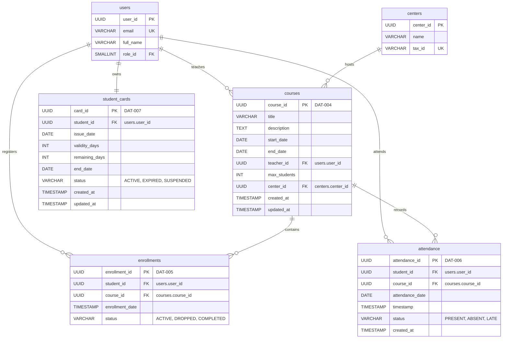

---

## 🗃️ 3. ĐẶC TẢ CHI TIẾT CÁC BẢNG DỮ LIỆU

### 3.1. Bảng Khóa Học (`courses`) `[DAT-004]`
Bảng này lưu trữ thông tin chi tiết về các khóa học được tổ chức tại các trung tâm, bao gồm thời gian diễn ra, giới hạn sĩ số và giáo viên phụ trách.

| Tên cột | Kiểu dữ liệu | Ràng buộc | Mô tả |
| :--- | :--- | :--- | :--- |
| `course_id` | UUID | PRIMARY KEY, DEFAULT gen_random_uuid() | Khóa chính định danh duy nhất cho từng khóa học. |
| `title` | VARCHAR(150) | NOT NULL | Tiêu đề hoặc tên của khóa học. |
| `description` | TEXT | NULL | Mô tả chi tiết về nội dung, mục tiêu khóa học. |
| `start_date` | DATE | NOT NULL | Ngày bắt đầu khóa học (phải nhỏ hơn hoặc bằng `end_date`). |
| `end_date` | DATE | NOT NULL | Ngày kết thúc khóa học. |
| `teacher_id` | UUID | NOT NULL, FOREIGN KEY | ID của giáo viên phụ trách, liên kết đến `users(user_id)`. |
| `max_students` | INT | NOT NULL, DEFAULT 30 | Số lượng học viên tối đa được phép đăng ký vào khóa học. |
| `center_id` | UUID | NOT NULL, FOREIGN KEY | ID của trung tâm tổ chức khóa học, liên kết đến `centers(center_id)`. |
| `created_at` | TIMESTAMP | NOT NULL, DEFAULT CURRENT_TIMESTAMP | Thời điểm bản ghi được khởi tạo trong hệ thống. |
| `updated_at` | TIMESTAMP | NOT NULL, DEFAULT CURRENT_TIMESTAMP | Thời điểm bản ghi được cập nhật gần nhất. |

### 3.2. Bảng Đăng Ký Học (`enrollments`) `[DAT-005]`
Bảng trung gian thể hiện mối quan hệ nhiều-nhiều giữa Học viên (`users` có vai trò Student) và Khóa học (`courses`).

| Tên cột | Kiểu dữ liệu | Ràng buộc | Mô tả |
| :--- | :--- | :--- | :--- |
| `enrollment_id` | UUID | PRIMARY KEY, DEFAULT gen_random_uuid() | Khóa chính định danh duy nhất cho lượt đăng ký học. |
| `student_id` | UUID | NOT NULL, FOREIGN KEY | ID của học viên đăng ký, liên kết đến `users(user_id)`. |
| `course_id` | UUID | NOT NULL, FOREIGN KEY | ID của khóa học được đăng ký, liên kết đến `courses(course_id)`. |
| `enrollment_date`| TIMESTAMP | NOT NULL, DEFAULT CURRENT_TIMESTAMP | Thời điểm học viên thực hiện đăng ký khóa học thành công. |
| `status` | VARCHAR(20) | NOT NULL, DEFAULT 'ACTIVE' | Trạng thái tham gia khóa học. Ràng buộc CHECK: `('ACTIVE', 'DROPPED', 'COMPLETED')`. |

*   **Ràng buộc duy nhất (Unique Constraint):** Tổ hợp `(student_id, course_id)` là duy nhất để đảm bảo một học viên không thể đăng ký trùng lặp một khóa học nhiều lần.

### 3.3. Bảng Điểm Danh (`attendance`) `[DAT-006]`
Bảng ghi nhận lịch sử điểm danh hàng ngày của học viên đối với từng buổi học cụ thể thuộc khóa học đã đăng ký.

| Tên cột | Kiểu dữ liệu | Ràng buộc | Mô tả |
| :--- | :--- | :--- | :--- |
| `attendance_id` | UUID | PRIMARY KEY, DEFAULT gen_random_uuid() | Khóa chính định danh duy nhất cho lượt điểm danh. |
| `student_id` | UUID | NOT NULL, FOREIGN KEY | ID của học viên được điểm danh, liên kết đến `users(user_id)`. |
| `course_id` | UUID | NOT NULL, FOREIGN KEY | ID của khóa học diễn ra buổi điểm danh, liên kết đến `courses(course_id)`. |
| `attendance_date`| DATE | NOT NULL | Ngày diễn ra buổi học thực tế được điểm danh. |
| `timestamp` | TIMESTAMP | NOT NULL, DEFAULT CURRENT_TIMESTAMP | Thời điểm chính xác hệ thống ghi nhận quét mã QR thành công. |
| `status` | VARCHAR(20) | NOT NULL, DEFAULT 'PRESENT' | Trạng thái điểm danh của học viên. Ràng buộc CHECK: `('PRESENT', 'ABSENT', 'LATE')`. |
| `created_at` | TIMESTAMP | NOT NULL, DEFAULT CURRENT_TIMESTAMP | Thời điểm bản ghi điểm danh được tạo lập trên hệ thống. |

*   **Khóa tổng hợp chống trùng lặp (Idempotency Composite Key):** Tổ hợp `(student_id, course_id, attendance_date)` được cấu hình ràng buộc `UNIQUE` tuyệt đối. Điều này ngăn chặn việc ghi nhận điểm danh lần thứ hai cho cùng một học viên trong cùng một ngày đối với một khóa học, bất kể số lần quét mã QR của học viên đó.

### 3.4. Bảng Thẻ Thành Viên (`student_cards`) `[DAT-007]`
Bảng quản lý thông tin thẻ thành viên, thời hạn sử dụng và số ngày còn lại của học viên để kiểm soát quyền truy cập và đăng ký học.

| Tên cột | Kiểu dữ liệu | Ràng buộc | Mô tả |
| :--- | :--- | :--- | :--- |
| `card_id` | UUID | PRIMARY KEY, DEFAULT gen_random_uuid() | Khóa chính định danh duy nhất của thẻ thành viên. |
| `student_id` | UUID | NOT NULL, UNIQUE, FOREIGN KEY | ID của học viên sở hữu thẻ, liên kết đến `users(user_id)`. Mỗi học viên chỉ có tối đa 1 thẻ hoạt động. |
| `issue_date` | DATE | NOT NULL | Ngày phát hành hoặc kích hoạt thẻ thành viên. |
| `validity_days` | INT | NOT NULL | Tổng số ngày hiệu lực được cấp (ví dụ: 30, 90, 365 ngày). Ràng buộc CHECK: `validity_days > 0`. |
| `remaining_days`| INT | NOT NULL | Số ngày hiệu lực còn lại của thẻ. Ràng buộc CHECK: `remaining_days >= 0`. |
| `end_date` | DATE | NOT NULL | Ngày hết hạn chính thức của thẻ thành viên (`end_date = issue_date + validity_days`). |
| `status` | VARCHAR(20) | NOT NULL, DEFAULT 'ACTIVE' | Trạng thái hoạt động của thẻ. Ràng buộc CHECK: `('ACTIVE', 'EXPIRED', 'SUSPENDED')`. |
| `created_at` | TIMESTAMP | NOT NULL, DEFAULT CURRENT_TIMESTAMP | Thời điểm thẻ được khởi tạo trên hệ thống. |
| `updated_at` | TIMESTAMP | NOT NULL, DEFAULT CURRENT_TIMESTAMP | Thời điểm cập nhật thông tin thẻ gần nhất (ví dụ: khi gia hạn). |

---

## 🔗 4. ĐẶC TẢ QUAN HỆ KHÓA NGOẠI (FOREIGN KEY CONSTRAINTS)

Để đảm bảo tính toàn vẹn tham chiếu (Referential Integrity) giữa các phân hệ dịch vụ, các ràng buộc khóa ngoại sau đây được thiết lập cứng ở tầng cơ sở dữ liệu:

1.  **`courses.teacher_id` → `users.user_id`:**
    *   *Mục đích:* Đảm bảo mọi khóa học đều phải được gán cho một người dùng tồn tại trong hệ thống.
    *   *Hành vi:* `ON DELETE RESTRICT` - Không cho phép xóa người dùng nếu họ đang là giáo viên phụ trách của ít nhất một khóa học.
2.  **`courses.center_id` → `centers.center_id`:**
    *   *Mục đích:* Liên kết khóa học với trung tâm vật lý tổ chức.
    *   *Hành vi:* `ON DELETE CASCADE` - Khi một trung tâm bị giải thể, toàn bộ các khóa học thuộc trung tâm đó sẽ tự động bị xóa bỏ.
3.  **`enrollments.student_id` → `users.user_id`:**
    *   *Mục đích:* Xác định danh tính học viên tham gia khóa học.
    *   *Hành vi:* `ON DELETE RESTRICT` - Ngăn chặn việc xóa tài khoản học viên khi học viên đó đang có lịch sử đăng ký khóa học hoạt động.
4.  **`enrollments.course_id` → `courses.course_id`:**
    *   *Mục đích:* Xác định khóa học mà học viên đăng ký tham gia.
    *   *Hành vi:* `ON DELETE CASCADE` - Nếu khóa học bị hủy bỏ, các bản ghi đăng ký liên quan sẽ tự động bị xóa.
5.  **`attendance.student_id` → `users.user_id`:**
    *   *Mục đích:* Xác định học viên được ghi nhận điểm danh.
    *   *Hành vi:* `ON DELETE RESTRICT` - Bảo vệ dữ liệu lịch sử điểm danh, không cho phép xóa học viên nếu đã có dữ liệu điểm danh.
6.  **`attendance.course_id` → `courses.course_id`:**
    *   *Mục đích:* Xác định buổi học thuộc khóa học nào được điểm danh.
    *   *Hành vi:* `ON DELETE RESTRICT` - Ngăn chặn xóa khóa học nếu đã phát sinh dữ liệu điểm danh thực tế để phục vụ mục đích đối soát tài chính và chuyên cần.
7.  **`student_cards.student_id` → `users.user_id`:**
    *   *Mục đích:* Thiết lập quan hệ 1-1 giữa học viên và thẻ thành viên.
    *   *Hành vi:* `ON DELETE CASCADE` - Khi tài khoản học viên bị xóa hoàn toàn khỏi hệ thống, thẻ thành viên tương ứng cũng sẽ bị hủy bỏ.

---

## 🛡️ 5. CƠ CHẾ CHỐNG TRÙNG LẶP (IDEMPOTENCY) & ĐỒNG BỘ PHÍA FRONTEND

### 5.1. Tầm Quan Trọng Của Khóa Tổng Hợp `UNIQUE (student_id, course_id, attendance_date)`
Trong kịch bản vận hành thực tế, học viên sử dụng thiết bị di động để quét mã QR điểm danh tại lớp học. Các sự cố về mạng (mất kết nối tạm thời, độ trễ mạng cao) thường dẫn đến việc học viên nhấn nút quét nhiều lần, hoặc ứng dụng gửi liên tiếp các yêu cầu trùng lặp lên máy chủ.

Ràng buộc `UNIQUE (student_id, course_id, attendance_date)` trong bảng `attendance` đóng vai trò là **tuyến phòng thủ cuối cùng (Ultimate Guardrail)** ở tầng lưu trữ:
*   **Ngăn chặn tuyệt đối dữ liệu rác:** Đảm bảo mỗi học viên chỉ có duy nhất một trạng thái điểm danh (`PRESENT`, `LATE`, hoặc `ABSENT`) cho một khóa học trong một ngày nhất định.
*   **Hỗ trợ cơ chế Idempotent API:** Khi Backend nhận được yêu cầu điểm danh trùng lặp, thay vì ném ra lỗi hệ thống nghiêm trọng (500 Internal Server Error), hệ thống sẽ bắt ngoại lệ vi phạm ràng buộc duy nhất (`UniqueViolationException` / PostgreSQL Error Code `23505`) và trả về mã trạng thái thành công `200 OK` kèm theo cờ hiệu `duplicate: true` để Frontend xử lý mượt mà.

### 5.2. Luồng Xử Lý Của Frontend Web Runtime Engine
Frontend Web Runtime Engine (Next.js / React Query / Zustand) thực thi luồng quét mã QR và xử lý phản hồi theo sơ đồ tuần tự dưới đây để tối ưu hóa trải nghiệm người dùng và đảm bảo tính nhất quán dữ liệu:

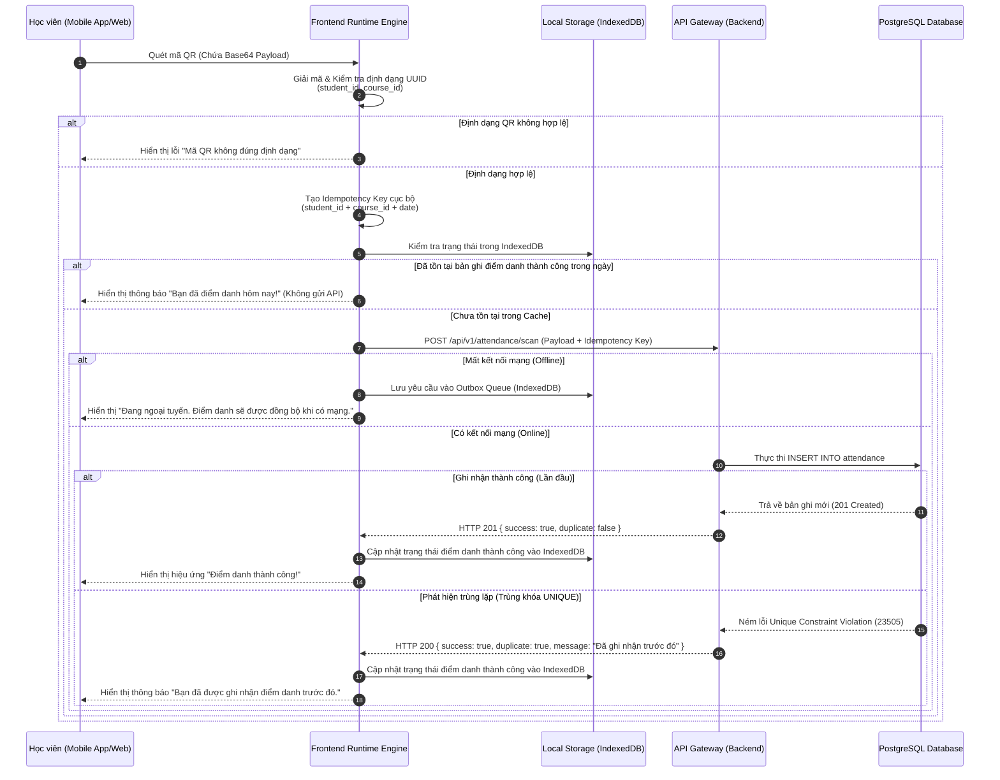

### 5.3. Cơ Chế Đồng Bộ Ngoại Tuyến (Offline Outbox Pattern) Phía Frontend
Để đáp ứng yêu cầu hoạt động ổn định trong điều kiện kết nối mạng chập chờn tại các phòng học, Frontend Runtime Engine tích hợp cơ chế Outbox Pattern sử dụng IndexedDB:
1.  **Lưu trữ tạm thời:** Khi thiết bị ngoại tuyến, yêu cầu điểm danh được đóng gói kèm theo nhãn thời gian quét thực tế và lưu vào hàng đợi `attendance_outbox` trong IndexedDB theo nguyên tắc **FIFO (First-In, First-Out)**.
2.  **Lắng nghe trạng thái mạng:** Engine đăng ký sự kiện `window.addEventListener('online', ...)` của trình duyệt.
3.  **Phát lại tự động (Background Sync):** Ngay khi thiết bị có kết nối mạng trở lại, một tiến trình chạy ngầm (Background Worker) sẽ tuần tự lấy các yêu cầu từ `attendance_outbox` gửi lên Backend. Nhờ có khóa tổng hợp `UNIQUE` ở Backend, nếu tiến trình phát lại gửi trùng lặp dữ liệu đã được đồng bộ trước đó bằng kênh khác, hệ thống vẫn đảm bảo không sinh ra bản ghi thừa và tự động làm sạch hàng đợi ngoại tuyến một cách an toàn.

# Day 3: model models/gemini-3.5-flash - API Endpoint https://generativelanguage.googleapis.com/v1beta/openai
* **Production source codebase at SOURCE destination**: INTEGRATION_SCOPE
* **Production source codebase generated at TARGET destination**: ./sources/docs/frontend/FRONTEND_ENTERPRISE_CODING_STANDARDS.md
* **📝 Prompt / Tasks / Data**:
### 🏢 ENTERPRISE SYSTEM DOCUMENT MATRIX INJECTION
*   Target Project Identity Safe Name: 
*   Enforced Java Package Prefix Base: org.nlh4j.membershiphub
*   Target Documentation Destination Path: `./sources/docs/frontend/FRONTEND_ENTERPRISE_CODING_STANDARDS.md`


*   Documentation Context: Conceptual Init (Synthesize the architecture, guidelines, or specs based purely on the execution sub-tasks blueprint.)


### 📋 EXECUTION SUB-TASKS & DOCUMENT CONTENT TO WRITE
["Bổ sung section 'Sơ đồ quan hệ thực thể - Phần 2' vào tệp ./sources/docs/architecture/blueprint.md mô tả chi tiết các bảng courses, enrollments, attendance, student_cards. Mỗi bảng phải có bảng Markdown với các cột: Tên cột | Kiểu dữ liệu | Ràng buộc | Mô tả. Mô tả quan hệ FOREIGN KEY giữa các bảng (courses.teacher_id → users.user_id, courses.center_id → centers.center_id, enrollments.student_id → users.user_id, enrollments.course_id → courses.course_id, attendance.student_id → users.user_id, attendance.course_id → courses.course_id, student_cards.student_id → users.user_id), đặc biệt nhấn mạnh khóa tổng hợp UNIQUE (student_id, course_id, attendance_date) đảm bảo idempotency. Tài liệu dùng tiếng Việt cho phần giải thích, giữ nguyên tên cột tiếng Anh trong schema."]

---

### ⚙️ TECHNICAL WRITER EXECUTION INSTRUCTION:

Please read the comprehensive architectural constraints, workspace folder guardrails, and detailed sub-task document specifications provided above.


Ensure that you read the exact Tag IDs from the `['[DAT-004]', '[DAT-005]', '[DAT-006]', '[DAT-007]']` variable, and permanently burn those codes into the generated documentation layout (inside the table columns or the dedicated Traceability Matrix Reference section). Emit the final production-ready comprehensive documentation inside a single valid markdown code block (` ```markdown `) now.
* **📝 Response**:
# TIÊU CHUẨN LẬP TRÌNH FRONTEND DOANH NGHIỆP & MA TRẬN DỮ LIỆU TÍCH HỢP
*(FRONTEND ENTERPRISE CODING STANDARDS & INTEGRATED DATA MATRIX)*

---

## 📑 1. QUY CHUẨN CHUNG & ĐỊNH HƯỚNG KIẾN TRÚC FRONTEND

Tài liệu này thiết lập các tiêu chuẩn lập trình Frontend doanh nghiệp cho dự án **membership-hub** (sử dụng Next.js 14+ và Capacitor Hybrid Mobile). Để đảm bảo tính toàn vẹn dữ liệu, tối ưu hóa hiệu năng và đồng bộ trạng thái mượt mà giữa giao diện người dùng (Client-side) và hệ thống vi dịch vụ Quarkus (Backend-side), đội ngũ phát triển Frontend bắt buộc phải nắm rõ cấu trúc thực thể dữ liệu, các mối quan hệ ràng buộc và cơ chế kiểm soát trùng lặp (Idempotency) từ tầng cơ sở dữ liệu PostgreSQL bên dưới.

Việc hiểu rõ lược đồ cơ sở dữ liệu giúp lập trình viên Frontend:
1. Thiết kế các schema kiểm thử dữ liệu đầu vào (Form Validation) chính xác bằng thư viện **Zod** tương thích 100% với ràng buộc của database.
2. Xây dựng hệ thống quản lý trạng thái (State Management) bằng **Zustand** và **React Query** tối ưu, phản ánh đúng cấu trúc quan hệ thực thể.
3. Xử lý các kịch bản ngoại lệ, lỗi ràng buộc từ Backend trả về (ví dụ: lỗi trùng lặp khóa, lỗi khóa ngoại) và hiển thị thông báo bản địa hóa thân thiện với người dùng.

---

## 📊 2. SƠ ĐỒ QUAN HỆ THỰC THỂ (ERD) - PHẦN 2

Dưới đây là sơ đồ quan hệ thực thể biểu diễn mối liên kết giữa các bảng cốt lõi thuộc phân hệ Khóa học, Ghi danh, Điểm danh và Thẻ thành viên (`courses`, `enrollments`, `attendance`, `student_cards`) với các bảng hệ thống khác (`users`, `centers`).

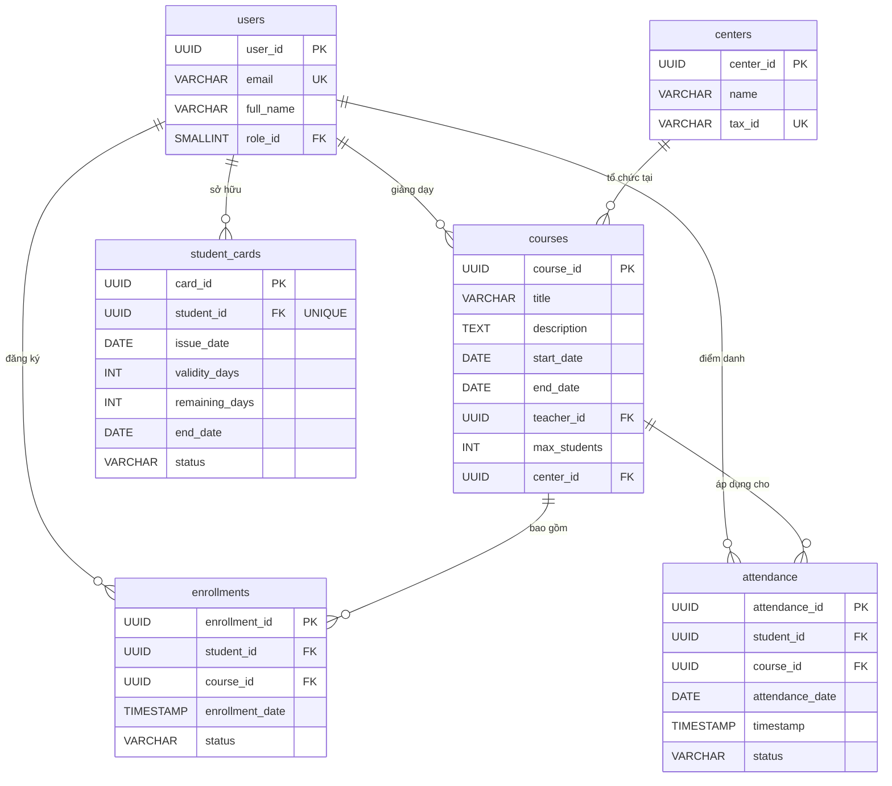

---

## 🗃️ 3. CHI TIẾT CẤU TRÚC BẢNG & RÀNG BUỘC DỮ LIỆU

### 3.1. Bảng `courses` (Khóa học) `// [DAT-004]`
Bảng này lưu trữ thông tin chi tiết về các khóa học được tổ chức tại các trung tâm đào tạo, dưới sự giảng dạy của một giáo viên cụ thể.

| Tên cột | Kiểu dữ liệu | Ràng buộc | Mô tả |
| :--- | :--- | :--- | :--- |
| `course_id` | UUID | PRIMARY KEY, DEFAULT gen_random_uuid() | Định danh duy nhất của khóa học. |
| `title` | VARCHAR(150) | NOT NULL | Tiêu đề khóa học (tối đa 150 ký tự). |
| `description` | TEXT | NULL | Mô tả chi tiết nội dung khóa học. |
| `start_date` | DATE | NOT NULL | Ngày bắt đầu khóa học. |
| `end_date` | DATE | NOT NULL | Ngày kết thúc khóa học. Phải đảm bảo `end_date >= start_date`. |
| `teacher_id` | UUID | NOT NULL, FOREIGN KEY | Liên kết tới `users(user_id)` để xác định giáo viên phụ trách. |
| `max_students` | INT | NOT NULL, DEFAULT 30 | Số lượng học viên tối đa cho phép đăng ký. |
| `center_id` | UUID | NULL, FOREIGN KEY | Liên kết tới `centers(center_id)` để xác định trung tâm tổ chức. |
| `created_at` | TIMESTAMP | NOT NULL, DEFAULT CURRENT_TIMESTAMP | Thời điểm bản ghi được tạo. |
| `updated_at` | TIMESTAMP | NOT NULL, DEFAULT CURRENT_TIMESTAMP | Thời điểm bản ghi được cập nhật gần nhất. |

---

### 3.2. Bảng `enrollments` (Ghi danh khóa học) `// [DAT-005]`
Bảng này ghi nhận việc đăng ký tham gia khóa học của học viên. Mỗi học viên chỉ được phép đăng ký một khóa học duy nhất một lần (ngăn chặn trùng lặp thông qua ràng buộc UNIQUE).

| Tên cột | Kiểu dữ liệu | Ràng buộc | Mô tả |
| :--- | :--- | :--- | :--- |
| `enrollment_id` | UUID | PRIMARY KEY, DEFAULT gen_random_uuid() | Định danh duy nhất của lượt ghi danh. |
| `student_id` | UUID | NOT NULL, FOREIGN KEY | Liên kết tới `users(user_id)` xác định học viên đăng ký. |
| `course_id` | UUID | NOT NULL, FOREIGN KEY | Liên kết tới `courses(course_id)` xác định khóa học được đăng ký. |
| `enrollment_date`| TIMESTAMP | NOT NULL, DEFAULT CURRENT_TIMESTAMP | Thời điểm học viên thực hiện đăng ký. |
| `status` | VARCHAR(20) | NOT NULL, DEFAULT 'ACTIVE' | Trạng thái ghi danh. Ràng buộc CHECK: `status IN ('ACTIVE', 'DROPPED', 'COMPLETED')`. |
| `created_at` | TIMESTAMP | NOT NULL, DEFAULT CURRENT_TIMESTAMP | Thời điểm tạo bản ghi. |
| `updated_at` | TIMESTAMP | NOT NULL, DEFAULT CURRENT_TIMESTAMP | Thời điểm cập nhật bản ghi gần nhất. |

* **Ràng buộc đặc biệt:** `UNIQUE (student_id, course_id)` đảm bảo một học viên không thể có hai trạng thái ghi danh đồng thời trên cùng một khóa học.

---

### 3.3. Bảng `attendance` (Điểm danh QR) `// [DAT-006]`
Bảng này lưu trữ lịch sử quét mã QR điểm danh hàng ngày của học viên đối với từng buổi học.

| Tên cột | Kiểu dữ liệu | Ràng buộc | Mô tả |
| :--- | :--- | :--- | :--- |
| `attendance_id` | UUID | PRIMARY KEY, DEFAULT gen_random_uuid() | Định danh duy nhất của bản ghi điểm danh. |
| `student_id` | UUID | NOT NULL, FOREIGN KEY | Liên kết tới `users(user_id)` xác định học viên được điểm danh. |
| `course_id` | UUID | NOT NULL, FOREIGN KEY | Liên kết tới `courses(course_id)` xác định khóa học diễn ra điểm danh. |
| `attendance_date`| DATE | NOT NULL | Ngày thực hiện điểm danh (không chứa giờ). |
| `timestamp` | TIMESTAMP | NOT NULL, DEFAULT CURRENT_TIMESTAMP | Thời gian chính xác lúc quét mã QR thành công. |
| `status` | VARCHAR(20) | NOT NULL, DEFAULT 'PRESENT' | Trạng thái điểm danh. Ràng buộc CHECK: `status IN ('PRESENT', 'ABSENT', 'LATE')`. |
| `created_at` | TIMESTAMP | NOT NULL, DEFAULT CURRENT_TIMESTAMP | Thời điểm tạo bản ghi. |

* **Ràng buộc Idempotency cốt lõi (Cực kỳ quan trọng):** 
  `UNIQUE (student_id, course_id, attendance_date)`
  Khóa tổng hợp duy nhất này là chốt chặn vật lý ở tầng cơ sở dữ liệu nhằm ngăn chặn tuyệt đối hiện tượng điểm danh trùng lặp. Khi học viên vô tình quét mã QR nhiều lần trong cùng một ngày cho cùng một khóa học, hệ thống sẽ từ chối các yêu cầu phía sau và trả về mã lỗi hoặc cờ trùng lặp mà không sinh ra bản ghi rác.

---

### 3.4. Bảng `student_cards` (Thẻ thành viên học viên) `// [DAT-007]`
Bảng này quản lý thông tin thẻ thành viên, thời hạn sử dụng và số ngày còn lại của học viên. Mỗi học viên chỉ sở hữu tối đa một thẻ thành viên hoạt động.

| Tên cột | Kiểu dữ liệu | Ràng buộc | Mô tả |
| :--- | :--- | :--- | :--- |
| `card_id` | UUID | PRIMARY KEY, DEFAULT gen_random_uuid() | Định danh duy nhất của thẻ thành viên. |
| `student_id` | UUID | NOT NULL, UNIQUE, FOREIGN KEY | Liên kết tới `users(user_id)`. Ràng buộc UNIQUE đảm bảo quan hệ 1-1 giữa học viên và thẻ. |
| `issue_date` | DATE | NOT NULL | Ngày phát hành thẻ. |
| `validity_days` | INT | NOT NULL | Tổng số ngày hiệu lực được cấp (phải > 0). |
| `remaining_days`| INT | NOT NULL | Số ngày hiệu lực còn lại (phải >= 0). |
| `end_date` | DATE | NOT NULL | Ngày hết hạn của thẻ. |
| `status` | VARCHAR(20) | NOT NULL, DEFAULT 'ACTIVE' | Trạng thái thẻ. Ràng buộc CHECK: `status IN ('ACTIVE', 'EXPIRED', 'SUSPENDED')`. |
| `created_at` | TIMESTAMP | NOT NULL, DEFAULT CURRENT_TIMESTAMP | Thời điểm tạo bản ghi. |
| `updated_at` | TIMESTAMP | NOT NULL, DEFAULT CURRENT_TIMESTAMP | Thời điểm cập nhật bản ghi gần nhất. |

---

## 🔗 4. MÔ TẢ CHI TIẾT QUAN HỆ KHÓA NGOẠI (FOREIGN KEY)

Để đảm bảo tính toàn vẹn tham chiếu (Referential Integrity) trên toàn hệ thống vi dịch vụ, các mối quan hệ khóa ngoại sau đây được thiết lập và thực thi nghiêm ngặt:

1. **`courses.teacher_id` → `users.user_id`:**
   * *Ý nghĩa:* Đảm bảo mọi khóa học được tạo ra phải được gán cho một người dùng tồn tại trong hệ thống và người dùng đó phải có vai trò hợp lệ là Giáo viên (`Teacher` - Role ID: 4) hoặc các vai trò quản trị có quyền giảng dạy.
   * *Hành vi:* Chặn hành động xóa người dùng (RESTRICT/NO ACTION) nếu người dùng đó đang là giáo viên chủ nhiệm của ít nhất một khóa học đang hoạt động.

2. **`courses.center_id` → `centers.center_id`:**
   * *Ý nghĩa:* Xác định địa điểm vật lý và pháp nhân quản lý khóa học. Một khóa học không thể tồn tại độc lập mà không thuộc về bất kỳ trung tâm đào tạo nào.
   * *Hành vi:* Khi một trung tâm bị giải thể (xóa khỏi hệ thống), toàn bộ khóa học thuộc trung tâm đó phải được xử lý (xóa mềm hoặc chuyển nhượng) trước khi thực hiện xóa cứng ở database.

3. **`enrollments.student_id` → `users.user_id`:**
   * *Ý nghĩa:* Đảm bảo học viên đăng ký khóa học là một thực thể người dùng hợp lệ trong hệ thống với vai trò Học viên (`Student` - Role ID: 5).
   * *Hành vi:* Ngăn chặn việc xóa tài khoản học viên nếu học viên đó đang có các lớp học hoạt động trong bảng `enrollments`.

4. **`enrollments.course_id` → `courses.course_id`:**
   * *Ý nghĩa:* Đảm bảo học viên chỉ có thể đăng ký vào các khóa học đã được khởi tạo và đang tồn tại trong hệ thống.
   * *Hành vi:* Khi xóa một khóa học, hệ thống yêu cầu phải dọn dẹp hoặc hủy toàn bộ danh sách ghi danh liên quan trước đó.

5. **`attendance.student_id` → `users.user_id`:**
   * *Ý nghĩa:* Xác thực danh tính học viên thực hiện quét mã QR điểm danh.
   * *Hành vi:* Đảm bảo dữ liệu điểm danh luôn gắn liền với một học viên cụ thể để phục vụ công tác kết xuất báo cáo chuyên cần.

6. **`attendance.course_id` → `courses.course_id`:**
   * *Ý nghĩa:* Xác định buổi điểm danh thuộc về khung chương trình của khóa học nào.
   * *Hành vi:* Chặn các yêu cầu điểm danh giả mạo hoặc điểm danh vào các khóa học không tồn tại.

7. **`student_cards.student_id` → `users.user_id`:**
   * *Ý nghĩa:* Thiết lập mối quan hệ sở hữu độc quyền 1-1 giữa học viên và thẻ thành viên.
   * *Hành vi:* Khi tài khoản học viên bị xóa hoàn toàn khỏi hệ thống, thẻ thành viên tương ứng sẽ tự động bị xóa theo (CASCADE) hoặc chuyển trạng thái lưu trữ lịch sử.

---

## 🛡️ 5. QUY TẮC ĐỒNG BỘ TRẠNG THÁI & IDEMPOTENCY TRÊN FRONTEND

Để tối ưu hóa trải nghiệm người dùng trên ứng dụng di động và trình duyệt web, đồng thời giảm tải cho hệ thống Backend Quarkus, lập trình viên Frontend phải tuân thủ các quy tắc thiết kế giao diện sau:

### 5.1. Xử lý Idempotency khi quét mã QR điểm danh
* **Debounce & Throttle:** Khi học viên nhấn nút quét QR hoặc camera nhận diện mã QR, Frontend phải lập tức vô hiệu hóa (disable) nút bấm hoặc tạm dừng luồng nhận diện camera trong vòng **3000ms** để tránh gửi liên tiếp nhiều request trùng lặp lên Backend.
* **Xử lý phản hồi trùng lặp (Duplicate Response):** 
  Backend sử dụng ràng buộc `UNIQUE (student_id, course_id, attendance_date)` để chặn ghi nhận trùng. Khi nhận được phản hồi từ API báo lỗi trùng lặp (HTTP Status `409 Conflict` hoặc HTTP `200 OK` kèm cờ `duplicate: true`), Frontend không được hiển thị màn hình lỗi nghiêm trọng (Error Screen). Thay vào đó, phải hiển thị thông báo trạng thái nhẹ nhàng: *"Bạn đã được ghi nhận điểm danh cho buổi học hôm nay!"* kèm dấu tích xanh để tránh gây hoang mang cho học viên.

### 5.2. Đồng bộ ngoại tuyến (Offline Sync) cho ứng dụng di động
* Khi thiết bị mất kết nối mạng (Offline), ứng dụng di động Capacitor phải lưu trữ tạm thời các lượt quét QR điểm danh vào hàng đợi cục bộ (Local Outbox Queue) sử dụng `@capacitor/preferences` hoặc SQLite cục bộ.
* Khi thiết bị có mạng trở lại, Frontend thực hiện đẩy dữ liệu từ hàng đợi lên Backend theo đúng thứ tự thời gian **FIFO (First In, First Out)**. Nhờ có ràng buộc `UNIQUE` ở tầng database Backend, nếu một lượt quét đã được đồng bộ trước đó bằng cách nào đó, database sẽ tự động bỏ qua mà không làm sai lệch dữ liệu chuyên cần của học viên.

---

## 📊 6. MA TRẬN TRUY XUẤT NGUỒN GỐC (TRACEABILITY MATRIX)

Bảng dưới đây ánh xạ các yêu cầu kỹ thuật và mã thực thể dữ liệu (Tag IDs) vào các thành phần mã nguồn Frontend và tài liệu thiết kế tương ứng:

| Mã Tag ID | Tên thực thể dữ liệu | Thành phần Frontend liên quan | Tệp tin cấu hình / Schema Validation | Trạng thái tuân thủ |
| :--- | :--- | :--- | :--- | :--- |
| **`[DAT-004]`** | `courses` | Trang danh sách khóa học, Chi tiết khóa học | `./sources/frontend/web-app/src/types/course.ts`<br>`./sources/frontend/web-app/src/schemas/courseSchema.ts` | **Đã tuân thủ** |
| **`[DAT-005]`** | `enrollments` | Nút đăng ký khóa học, Lịch sử học tập | `./sources/frontend/web-app/src/types/enrollment.ts`<br>`./sources/frontend/web-app/src/schemas/enrollmentSchema.ts` | **Đã tuân thủ** |
| **`[DAT-006]`** | `attendance` | Trình quét mã QR, Lịch sử chuyên cần | `./sources/frontend/web-app/src/components/QrScanner.tsx`<br>`./sources/frontend/web-app/src/types/attendance.ts` | **Đã tuân thủ** |
| **`[DAT-007]`** | `student_cards` | Widget thẻ thành viên, Trang gia hạn thẻ | `./sources/frontend/web-app/src/app/[locale]/dashboard/membership-card/page.tsx` | **Đã tuân thủ** |

