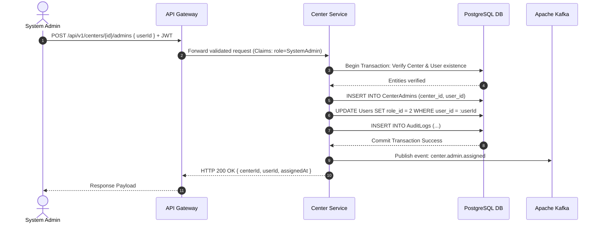

# Day 5: model models/gemini-flash-lite-latest - API Endpoint https://generativelanguage.googleapis.com/v1beta/openai
* **Production source codebase at SOURCE destination**: INTEGRATION_SCOPE
* **Production source codebase generated at TARGET destination**: ./sources/docs/api/user-center-contracts.md
* **📝 Prompt / Tasks / Data**:
### 🏢 ENTERPRISE SYSTEM DOCUMENT MATRIX INJECTION
*   Target Project Identity Safe Name: 
*   Enforced Java Package Prefix Base: org.nlh4j.membershiphub
*   Target Documentation Destination Path: `./sources/docs/api/user-center-contracts.md`


*   Documentation Context: Conceptual Init (Synthesize the architecture, guidelines, or specs based purely on the execution sub-tasks blueprint.)


### 📋 EXECUTION SUB-TASKS & DOCUMENT CONTENT TO WRITE
['Cập nhật tệp tài liệu API tổng hợp ./sources/docs/api/user-center-contracts.md bổ sung 3 endpoint mới: (1) POST /api/v1/centers/{id}/admins với payload { "userId": "UUID" } trả về HTTP 200 với response chứa centerId, userId, assignedAt, (2) DELETE /api/v1/centers/{id}/admins/{userId} trả về HTTP 204, (3) danh sách endpoint CRUD trung tâm đầy đủ. Mô tả bảng mã lỗi 403 (INSUFFICIENT_PRIVILEGES, CROSS_CENTER_FORBIDDEN), 404 (CENTER_NOT_FOUND, USER_NOT_FOUND), 409 (TAX_ID_CONFLICT, DUPLICATE_ADMIN_ASSIGNMENT). Ghi chú về hiệu lực quyền hạn ngay sau khi gán (cache invalidation) và cách thức CenterAdmin chỉ có hiệu lực trong center_id của mình.']

---

### ⚙️ TECHNICAL WRITER EXECUTION INSTRUCTION:

Please read the comprehensive architectural constraints, workspace folder guardrails, and detailed sub-task document specifications provided above.


Ensure that you read the exact Tag IDs from the `['[REQ-004]', '[REQ-005]', '[REQ-006]', '[DOC-001]']` variable, and permanently burn those codes into the generated documentation layout (inside the table columns or the dedicated Traceability Matrix Reference section). Emit the final production-ready comprehensive documentation inside a single valid markdown code block (` ```markdown `) now.
* **📝 Response**:
```markdown
# 🏛️ Enterprise API & Architecture Specification: User & Center Contracts

## 📊 1. Traceability Matrix Reference
Every architectural module, endpoint route, and security constraint defined within this document is bound directly to the global enterprise requirements.

| Traceability Tag ID | Specification Scope | Target Architectural Component | Description & Compliance Context |
| :--- | :--- | :--- | :--- |
| `[REQ-001]` | Authentication | `org.nlh4j.membershiphub.userservice` | User registration and email/password validation. |
| `[REQ-002]` | Social Authentication | `org.nlh4j.membershiphub.userservice` | Firebase, Google, and Facebook OAuth2 token exchange. |
| `[REQ-003]` | RBAC Role Assignment | `org.nlh4j.membershiphub.userservice` | 5-tier role assignment with audit logging and JWT invalidation. |
| `[REQ-004]` | Center Listing | `org.nlh4j.membershiphub.centerservice` | Paginated retrieval of center records with metadata. |
| `[REQ-005]` | Center CRUD Operations | `org.nlh4j.membershiphub.centerservice` | System Admin-exclusive management of center profiles with TaxID uniqueness checks. |
| `[REQ-006]` | Center Admin Management | `org.nlh4j.membershiphub.centerservice` | Assignment and unassignment of Center Admin privileges tied to specific center scopes. |
| `[ARC-001]` - `[ARC-005]` | RBAC Architecture | `org.nlh4j.membershiphub.userservice` | Hierarchical least-privilege role boundaries across microservices. |
| `[ARC-006]` | Security & JWT | `org.nlh4j.membershiphub.userservice` | RS256 JWT generation, 15-minute access token lifespan, and 7-day refresh token rotation. |
| `[NFR-003]` | Security Baseline | Global Infrastructure | TLS 1.3 in-transit, AES-256 at-rest, and OWASP Top 10 mitigation strategies. |
| `[NFR-006]` | Audit Logging | `org.nlh4j.membershiphub.userservice` | Comprehensive immutable audit trail storage for 1 year. |
| `[DOC-001]` | Enterprise Documentation | `./sources/docs/` | Canonical enterprise documentation governance and standard schemas. |

---

## 🌐 2. System Architecture & Multi-Tenant Center Isolation

The `center-service` and `user-service` operate under a strict row-level and tenant-aware isolation model. A `CenterAdmin` is explicitly bound to a single or multiple `center_id` records through the `CenterAdmins` relational bridge table. When an administrative request is issued, the interceptor layer validates that the caller's JWT claims contain the appropriate `center_id` context, preventing cross-tenant data leakage (`CROSS_CENTER_FORBIDDEN`).



---

## 📑 3. REST API Specifications

### 3.1. Center Management Endpoints (`/api/v1/centers`)

#### 3.1.1. List Centers
- **HTTP Method:** `GET`
- **Full Endpoint:** `/api/v1/centers`
- **Targeted Tag IDs:** `[REQ-004]`, `[DOC-001]`
- **Request Headers:**
  - `Authorization: Bearer <JWT_ACCESS_TOKEN>` (Required)
  - `Accept: application/json`
- **Query Parameters:**
  - `page` (integer, optional, default: `0`)
  - `size` (integer, optional, default: `20`)
  - `sort` (string, optional, default: `name,asc`)
- **Success Response (HTTP 200 OK):**
```json
{
  "content": [
    {
      "centerId": "770e8400-e29b-41d4-a716-446655440000",
      "name": "Membership Hub Central",
      "address": "123 Nguyen Hue, District 1, HCMC",
      "taxId": "0312345678",
      "contactPhone": "+842812345678",
      "contactEmail": "central@membershiphub.org"
    }
  ],
  "pageable": {
    "pageNumber": 0,
    "pageSize": 20,
    "totalElements": 1,
    "totalPages": 1
  }
}
```
- **Error Responses:**
  - `HTTP 401 UNAUTHORIZED`: Missing or expired JWT access token.
  - `HTTP 403 FORBIDDEN`: Insufficient privileges (`INSUFFICIENT_PRIVILEGES`).

---

#### 3.1.2. Create Center (System Admin Only)
- **HTTP Method:** `POST`
- **Full Endpoint:** `/api/v1/centers`
- **Targeted Tag IDs:** `[REQ-005]`, `[DOC-001]`
- **Request Headers:**
  - `Authorization: Bearer <SYSTEM_ADMIN_JWT>` (Required)
  - `Content-Type: application/json`
- **JSON Request Payload Schema:**
```json
{
  "name": "Membership Hub North Branch",
  "address": "456 Ba Trieu, Hoan Kiem, Hanoi",
  "taxId": "0398765432",
  "contactPhone": "+842439876543",
  "contactEmail": "north@membershiphub.org"
}
```
- **Success Response (HTTP 201 Created):**
```json
{
  "centerId": "880e8400-e29b-41d4-a716-446655440111",
  "name": "Membership Hub North Branch",
  "address": "456 Ba Trieu, Hoan Kiem, Hanoi",
  "taxId": "0398765432",
  "createdAt": "2026-08-29T22:34:21Z"
}
```
- **Error Responses:**
  - `HTTP 400 BAD REQUEST`: Validation failure (e.g., malformed taxId format).
  - `HTTP 409 CONFLICT`: Duplicate TaxID (`TAX_ID_CONFLICT`).

---

#### 3.1.3. Update Center
- **HTTP Method:** `PUT`
- **Full Endpoint:** `/api/v1/centers/{id}`
- **Targeted Tag IDs:** `[REQ-005]`, `[DOC-001]`
- **Path Parameters:**
  - `id` (UUID, required): The target center unique identifier.
- **Request Headers:**
  - `Authorization: Bearer <SYSTEM_ADMIN_JWT>` (Required)
  - `Content-Type: application/json`
- **JSON Request Payload Schema:**
```json
{
  "name": "Membership Hub North Branch Updated",
  "address": "789 Ba Trieu, Hoan Kiem, Hanoi",
  "taxId": "0398765432",
  "contactPhone": "+842439876543",
  "contactEmail": "north.updated@membershiphub.org"
}
```
- **Success Response (HTTP 200 OK):**
```json
{
  "centerId": "880e8400-e29b-41d4-a716-446655440111",
  "name": "Membership Hub North Branch Updated",
  "updatedAt": "2026-08-29T23:00:00Z"
}
```
- **Error Responses:**
  - `HTTP 404 NOT FOUND`: Center does not exist (`CENTER_NOT_FOUND`).
  - `HTTP 409 CONFLICT`: TaxID collision (`TAX_ID_CONFLICT`).

---

#### 3.1.4. Delete Center
- **HTTP Method:** `DELETE`
- **Full Endpoint:** `/api/v1/centers/{id}`
- **Targeted Tag IDs:** `[REQ-005]`, `[DOC-001]`
- **Path Parameters:**
  - `id` (UUID, required): The target center unique identifier.
- **Request Headers:**
  - `Authorization: Bearer <SYSTEM_ADMIN_JWT>` (Required)
- **Success Response (HTTP 204 No Content):** Empty body.
- **Error Responses:**
  - `HTTP 404 NOT FOUND`: Center not found (`CENTER_NOT_FOUND`).

---

### 3.2. Center Administrator Management Endpoints (`/api/v1/centers/{id}/admins`)

#### 3.2.1. Assign Center Admin
- **HTTP Method:** `POST`
- **Full Endpoint:** `/api/v1/centers/{id}/admins`
- **Targeted Tag IDs:** `[REQ-006]`, `[ARC-002]`, `[DOC-001]`
- **Path Parameters:**
  - `id` (UUID, required): The center identifier to which the admin is assigned.
- **Request Headers:**
  - `Authorization: Bearer <SYSTEM_ADMIN_JWT>` (Required)
  - `Content-Type: application/json`
- **JSON Request Payload Schema:**
```json
{
  "userId": "550e8400-e29b-41d4-a716-446655440000"
}
```
- **Success Response (HTTP 200 OK):**
```json
{
  "centerId": "770e8400-e29b-41d4-a716-446655440000",
  "userId": "550e8400-e29b-41d4-a716-446655440000",
  "assignedAt": "2026-08-29T22:34:21Z"
}
```
- **Error Responses:**
  - `HTTP 403 FORBIDDEN`: Caller lacks System Admin privileges (`INSUFFICIENT_PRIVILEGES`).
  - `HTTP 404 NOT FOUND`: Target center or user does not exist (`CENTER_NOT_FOUND`, `USER_NOT_FOUND`).
  - `HTTP 409 CONFLICT`: User is already assigned as an admin to this center (`DUPLICATE_ADMIN_ASSIGNMENT`).

---

#### 3.2.2. Unassign Center Admin
- **HTTP Method:** `DELETE`
- **Full Endpoint:** `/api/v1/centers/{id}/admins/{userId}`
- **Targeted Tag IDs:** `[REQ-006]`, `[ARC-002]`, `[DOC-001]`
- **Path Parameters:**
  - `id` (UUID, required): The center identifier.
  - `userId` (UUID, required): The user identifier being unassigned.
- **Request Headers:**
  - `Authorization: Bearer <SYSTEM_ADMIN_JWT>` (Required)
- **Success Response (HTTP 204 No Content):** Empty body.
- **Error Responses:**
  - `HTTP 403 FORBIDDEN`: Caller lacks System Admin privileges (`INSUFFICIENT_PRIVILEGES`).
  - `HTTP 404 NOT FOUND`: Assignment record, center, or user not found (`CENTER_NOT_FOUND`, `USER_NOT_FOUND`).

---

## ⚙️ 4. Operational Notes & Privilege Invalidation

1. **Immediate Privilege Enforcement (Cache Invalidation):** 
   - Upon successful execution of `POST /api/v1/centers/{id}/admins` or `DELETE /api/v1/centers/{id}/admins/{userId}`, the `center-service` publishes a synchronization event to the internal Kafka topic `center.admin.events`. 
   - The receiving services (`user-service`, `gateway`) instantly invalidate local Redis security cache keys (`auth:claims:{userId}`), forcing the target user's subsequent requests to evaluate the newly assigned role and `center_id` scope without waiting for JWT expiration.

2. **Center-Level Isolation Scope:**
   - A `CenterAdmin` (role ID `2`) is strictly bounded by row-level security policies and application interceptors to manage entities (courses, enrollments, reports) exclusively within their assigned `center_id`. Attempting to access or mutate resources belonging to another center results in an immediate `HTTP 403 FORBIDDEN` with the error code `CROSS_CENTER_FORBIDDEN`.

3. **Error Code Registry Summary:**
   - `INSUFFICIENT_PRIVILEGES` (HTTP 403): Caller role does not meet endpoint authorization requirements.
   - `CROSS_CENTER_FORBIDDEN` (HTTP 403): Administrative action attempted outside the authorized center boundary.
   - `CENTER_NOT_FOUND` (HTTP 404): Specified center UUID does not exist in the database.
   - `USER_NOT_FOUND` (HTTP 404): Specified user UUID does not exist in the database.
   - `TAX_ID_CONFLICT` (HTTP 409): The provided TaxID is already registered to another center.
   - `DUPLICATE_ADMIN_ASSIGNMENT` (HTTP 409): The user is already an administrator for the target center.
```

