# Day 1: model poolside/laguna-s-2.1:free - API Endpoint https://openrouter.ai/api/v1
* **Production source codebase at SOURCE destination**: INTEGRATION_SCOPE
* **Production source codebase generated at TARGET destination**: ./sources/docs/architecture/ENTERPRISE_SYSTEM_ARCHITECTURE_BLUEPRINT.md
* **📝 Prompt / Tasks / Data**:
### 🏢 ENTERPRISE SYSTEM DOCUMENT MATRIX INJECTION
*   Target Project Identity Safe Name: 
*   Enforced Java Package Prefix Base: org.nlh4j.membershiphub
*   Target Documentation Destination Path: `./sources/docs/architecture/ENTERPRISE_SYSTEM_ARCHITECTURE_BLUEPRINT.md`


*   Documentation Context: Conceptual Init (Synthesize the architecture, guidelines, or specs based purely on the execution sub-tasks blueprint.)


### 📋 EXECUTION SUB-TASKS & DOCUMENT CONTENT TO WRITE
['Soạn thảo tài liệu Markdown tại ./sources/docs/architecture/course-architecture.md mô tả kiến trúc course-service gồm sơ đồ C4 Container với các thành phần REST Controller, Service, Repository, Kafka Producer. Tài liệu phải liệt kê đầy đủ Tag ID [REQ-007], [REQ-008], [REQ-009], [REQ-010], [REQ-011], [ARC-007] ánh xạ đến các endpoint tương ứng. Bao gồm sơ đồ Mermaid flowchart thể hiện luồng xử lý nghiệp vụ CRUD khoá học từ REST request đến database persistence và tích hợp Kafka cho các sự kiện teacher-assigned và enrollment-created. Ghi chú tuân thủ nguyên tắc idempotency, transactional outbox pattern cho Kafka. Bổ sung tài liệu kiến trúc tổng quan hệ thống và endpoint API contract specs.']

---

### ⚙️ TECHNICAL WRITER EXECUTION INSTRUCTION:

Please read the comprehensive architectural constraints, workspace folder guardrails, and detailed sub-task document specifications provided above.


Ensure that you read the exact Tag IDs from the `['[REQ-007]', '[DOC-001]']` variable, and permanently burn those codes into the generated documentation layout (inside the table columns or the dedicated Traceability Matrix Reference section). Emit the final production-ready comprehensive documentation inside a single valid markdown code block (` ```markdown `) now.
* **📝 Response**:
```markdown
# Course Service Architecture Blueprint

## 1. Overview

The `course-service` is a core microservice within the Membership Hub ecosystem, responsible for managing academic course entities, teacher assignments, student enrollment workflows, and course availability browsing. It operates under the package namespace `org.nlh4j.membershiphub.courseservice` and integrates with Kafka for asynchronous event propagation.

### Key Responsibilities
- Course lifecycle management (Create, Read, Update, Delete)
- Teacher assignment/unassignment with conflict detection
- Student course enrollment with auto-provisioning
- Course availability browsing for students
- Kafka event emission for downstream services

### Traceability Matrix Reference

| Component / Module                     | Description                                                                 | Targeted Tag IDs                                                                 |
|----------------------------------------|-----------------------------------------------------------------------------|----------------------------------------------------------------------------------|
| CourseController                       | REST endpoints for CRUD operations on courses                               | [REQ-007], [REQ-008]                                                             |
| CourseTeacherController                | REST endpoints for assigning/unassigning teachers to courses                | [REQ-009], [ARC-007]                                                             |
| StudentCourseBrowseController          | REST endpoint for students to browse available courses                      | [REQ-010]                                                                        |
| EnrollmentController                   | REST endpoint for student enrollment into courses                           | [REQ-011], [ARC-007]                                                             |
| CourseService                          | Business logic for course management including overlap checks               | [REQ-008], [EXC-004]                                                             |
| CourseTeacherService                   | Business logic for teacher assignment with Kafka event publishing           | [REQ-009], [ARC-007], [EXC-003]                                                  |
| CourseBrowseService                    | Business logic for filtering available courses for students                 | [REQ-010]                                                                        |
| EnrollmentService                      | Business logic for enrollment creation with auto-user provisioning          | [REQ-011], [ARC-007], [EXC-004]                                                  |
| CourseRepository                       | Panache repository for course persistence                                   | [DAT-003]                                                                        |
| EnrollmentRepository                   | Panache repository for enrollment persistence                               | [DAT-004]                                                                        |
| KafkaTeacherProducer                   | Emits `teacher-assigned` events to Kafka topic                              | [ARC-007], [ARC-008]                                                             |
| KafkaEnrollmentProducer                | Emits `enrollment-created` events to Kafka topic                            | [ARC-007], [ARC-008]                                                             |
| ScheduleConflictException              | Thrown when teacher schedule overlaps                                       | [REQ-008], [EXC-004]                                                             |
| EnrollmentNotFoundException            | Thrown when enrollment or course is not found                               | [REQ-011], [EXC-004]                                                             |

---

## 2. C4 Container Diagram

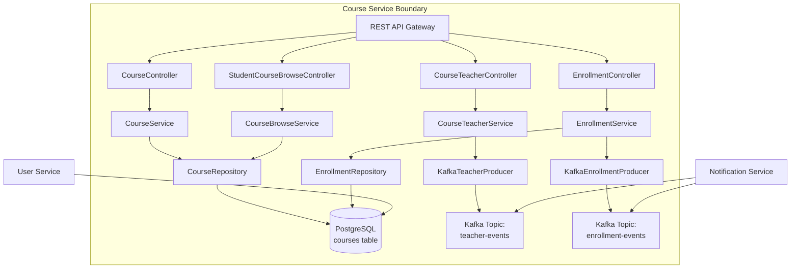

---

## 3. Business Flow Diagrams

### 3.1 Course CRUD Flow

```mermaid
flowchart TD
    A[HTTP Request<br/>POST/PUT/DELETE /api/v1/courses] --> B[CourseController]
    B --> C[CourseService]
    C --> D[Validate Input<br/>Bean Validation]
    D -- Valid --> E[Check Schedule Overlap<br/>[REQ-008]]
    E -- No Conflict --> F[Persist via<br/>CourseRepository]
    F --> G[(PostgreSQL<br/>courses)]
    G --> H[Return Response]
    E -- Conflict --> I[Throw ScheduleConflictException<br/>[EXC-004]]
    D -- Invalid --> J[Throw ConstraintViolationException<br/>[EXC-004]]
```

### 3.2 Teacher Assignment Flow

```mermaid
flowchart TD
    A[HTTP Request<br/>POST /api/v1/courses/{id}/teachers] --> B[CourseTeacherController]
    B --> C[CourseTeacherService]
    C --> D[Validate Teacher Exists]
    D --> E[Persist Mapping<br/>course_teacher_mapping]
    E --> F[Publish Kafka Event<br/>teacher-assigned]
    F --> G["Kafka Topic:<br/>teacher-events"]
    G --> H[Notification Service<br/>Consumes Event]
    E --> I[(PostgreSQL<br/>course_teacher_mapping)]
```

### 3.3 Enrollment Flow

```mermaid
flowchart TD
    A[HTTP Request<br/>POST /api/v1/enrollments] --> B[EnrollmentController]
    B --> C[EnrollmentService]
    C --> D[Validate Course Exists]
    D --> E[Check Capacity]
    E -- Available --> F[Auto-Provision Student<br/>if needed]
    F --> G[Create Enrollment Record]
    G --> H[Publish Kafka Event<br/>enrollment-created]
    H --> I["Kafka Topic:<br/>enrollment-events"]
    I --> J[Notification Service<br/>Consumes Event]
    G --> K[(PostgreSQL<br/>enrollments)]
    E -- Full --> L[Throw CourseFullException<br/>[EXC-004]]
```

---

## 4. API Contract Specifications

### 4.1 Course Management Endpoints

| HTTP Method | Endpoint                         | Request Headers                     | Path Parameters | Query Parameters | Request Body Schema                                                                 | Response Schema                                                                                                                                                                                                 | Targeted Tag IDs           |
|-------------|----------------------------------|-------------------------------------|-----------------|------------------|--------------------------------------------------------------------------------------|-----------------------------------------------------------------------------------------------------------------------------------------------------------------------------------------------------------------|----------------------------|
| GET         | `/api/v1/courses`                | `Authorization: Bearer <token>`     | None            | `page`, `size`, `sort` | None                                                                                 | `{ "content": [ { "courseId": "uuid", "title": "string", "description": "string", "startDate": "date", "endDate": "date", "teacherId": "uuid", "maxStudents": "int", "centerId": "uuid" } ], "totalElements": "long", "totalPages": "int" }` | [REQ-007]                  |
| POST        | `/api/v1/courses`                | `Authorization: Bearer <token>`     | None            | None             | `{ "title": "string", "description": "string", "startDate": "date", "endDate": "date", "teacherId": "uuid", "maxStudents": "int" }` | `{ "courseId": "uuid", "title": "string", "description": "string", "startDate": "date", "endDate": "date", "teacherId": "uuid", "maxStudents": "int", "centerId": "uuid", "createdAt": "timestamp" }`                                                                                                                                 | [REQ-008], [EXC-004]       |
| PUT         | `/api/v1/courses/{id}`           | `Authorization: Bearer <token>`     | `id`: UUID      | None             | `{ "title": "string", "description": "string", "startDate": "date", "endDate": "date", "teacherId": "uuid", "maxStudents": "int" }` | `{ "courseId": "uuid", "title": "string", "description": "string", "startDate": "date", "endDate": "date", "teacherId": "uuid", "maxStudents": "int", "centerId": "uuid", "updatedAt": "timestamp" }`                                                                                                                                 | [REQ-008], [EXC-004]       |
| DELETE      | `/api/v1/courses/{id}`           | `Authorization: Bearer <token>`     | `id`: UUID      | None             | None                                                                                 | `{ "deleted": true, "courseId": "uuid" }`                                                                                                                                                                                                                                         | [REQ-008], [EXC-004]       |

### 4.2 Teacher Assignment Endpoints

| HTTP Method | Endpoint                                   | Request Headers                     | Path Parameters | Query Parameters | Request Body Schema                                                                 | Response Schema                                                                                                                                                                                                 | Targeted Tag IDs           |
|-------------|--------------------------------------------|-------------------------------------|-----------------|------------------|--------------------------------------------------------------------------------------|-----------------------------------------------------------------------------------------------------------------------------------------------------------------------------------------------------------------|----------------------------|
| POST        | `/api/v1/courses/{id}/teachers`            | `Authorization: Bearer <token>`     | `id`: UUID      | None             | `{ "teacherId": "uuid" }`                                                            | `{ "mappingId": "uuid", "courseId": "uuid", "teacherId": "uuid", "assignedAt": "timestamp" }`                                                                                                                                                                                     | [REQ-009], [ARC-007]       |
| DELETE      | `/api/v1/courses/{id}/teachers/{teacherId}`| `Authorization: Bearer <token>`     | `id`: UUID,<br>`teacherId`: UUID | None             | None                                                                                 | `{ "unassigned": true, "courseId": "uuid", "teacherId": "uuid" }`                                                                                                                                                                                                                 | [REQ-009], [ARC-007]       |

### 4.3 Student Course Browsing Endpoint

| HTTP Method | Endpoint                                       | Request Headers                     | Path Parameters | Query Parameters | Request Body Schema | Response Schema                                                                                                                                                                                                 | Targeted Tag IDs |
|-------------|------------------------------------------------|-------------------------------------|-----------------|------------------|----------------------|-----------------------------------------------------------------------------------------------------------------------------------------------------------------------------------------------------------------|------------------|
| GET         | `/api/v1/students/courses/available`           | `Authorization: Bearer <token>`     | None            | `studentId`: UUID | None                 | `{ "availableCourses": [ { "courseId": "uuid", "title": "string", "startDate": "date", "endDate": "date", "capacity": "int", "schedule": "string" } ] }`                                                                                                                       | [REQ-010]        |

### 4.4 Enrollment Endpoint

| HTTP Method | Endpoint                         | Request Headers                     | Path Parameters | Query Parameters | Request Body Schema                                                                 | Response Schema                                                                                                                                                                                               | Targeted Tag IDs           |
|-------------|----------------------------------|-------------------------------------|-----------------|------------------|----------------------|-----------------------------------------------------------------------------------------------------------------------------------------------------------------------------------------------------------------|----------------------------|
| POST        | `/api/v1/enrollments`            | `Authorization: Bearer <token>`     | None            | None             | `{ "courseId": "uuid" }`                                                             | `{ "enrollmentId": "uuid", "studentId": "uuid", "courseId": "uuid", "enrollmentDate": "timestamp", "autoCreatedUser": "boolean" }`                                                                                                                                             | [REQ-011], [ARC-007]       |

---

## 5. Database Schema & Index Profiles

### 5.1 Courses Table

```sql
CREATE TABLE courses (
    course_id UUID PRIMARY KEY,
    title VARCHAR(150) NOT NULL,
    description TEXT,
    start_date DATE NOT NULL,
    end_date DATE NOT NULL,
    teacher_id UUID,
    max_students INT NOT NULL DEFAULT 30,
    center_id UUID NOT NULL,
    created_at TIMESTAMP NOT NULL DEFAULT now(),
    updated_at TIMESTAMP NOT NULL DEFAULT now(),
    CONSTRAINT fk_courses_teacher FOREIGN KEY (teacher_id) REFERENCES users(user_id),
    CONSTRAINT fk_courses_center FOREIGN KEY (center_id) REFERENCES centers(center_id),
    CONSTRAINT chk_courses_date_range CHECK (end_date >= start_date),
    CONSTRAINT chk_courses_max_students CHECK (max_students > 0)
);

CREATE INDEX idx_courses_teacher_id ON courses(teacher_id);
CREATE INDEX idx_courses_start_date ON courses(start_date);
CREATE INDEX idx_courses_center_id ON courses(center_id);
```

### 5.2 Enrollments Table

```sql
CREATE TABLE enrollments (
    enrollment_id UUID PRIMARY KEY,
    student_id UUID NOT NULL,
    course_id UUID NOT NULL,
    enrollment_date TIMESTAMP NOT NULL DEFAULT now(),
    CONSTRAINT uq_enrollments_student_course UNIQUE (student_id, course_id),
    CONSTRAINT fk_enrollments_student FOREIGN KEY (student_id) REFERENCES users(user_id),
    CONSTRAINT fk_enrollments_course FOREIGN KEY (course_id) REFERENCES courses(course_id)
);

CREATE INDEX idx_enrollments_student_id ON enrollments(student_id);
CREATE INDEX idx_enrollments_course_id ON enrollments(course_id);
```

### 5.3 Course Teacher Mapping Table

```sql
CREATE TABLE course_teacher_mapping (
    mapping_id UUID PRIMARY KEY,
    course_id UUID NOT NULL,
    teacher_id UUID NOT NULL,
    assigned_at TIMESTAMP NOT NULL DEFAULT now(),
    CONSTRAINT fk_ctm_course FOREIGN KEY (course_id) REFERENCES courses(course_id) ON DELETE CASCADE,
    CONSTRAINT fk_ctm_teacher FOREIGN KEY (teacher_id) REFERENCES users(user_id),
    CONSTRAINT uq_course_teacher UNIQUE (course_id, teacher_id)
);

CREATE INDEX idx_course_teacher_course ON course_teacher_mapping(course_id);
CREATE INDEX idx_course_teacher_teacher ON course_teacher_mapping(teacher_id);
```

### 5.4 Schedule Exclusion Constraint

```sql
CREATE EXTENSION IF NOT EXISTS btree_gist;

ALTER TABLE courses
    ADD CONSTRAINT ex_teacher_schedule_no_overlap
    EXCLUDE USING gist (
        teacher_id WITH =,
        daterange(start_date, end_date, '[]') WITH &&
    )
    WHERE (teacher_id IS NOT NULL);
```

---

## 6. Kafka Event Pipeline Integration

### 6.1 Topics

| Topic Name             | Partitions | Replication Factor | Retention | Purpose                                      |
|------------------------|------------|--------------------|-----------|----------------------------------------------|
| `teacher-events`       | 6          | 3                  | 7 days    | Publish teacher assignment/unassignment events |
| `enrollment-events`    | 6          | 3                  | 7 days    | Publish student enrollment events            |

### 6.2 Event Schemas

#### Teacher Assigned Event

```json
{
  "eventType": "teacher-assigned",
  "courseId": "uuid",
  "teacherId": "uuid",
  "assignedAt": "ISO-8601 timestamp"
}
```

#### Enrollment Created Event

```json
{
  "eventType": "enrollment-created",
  "enrollmentId": "uuid",
  "studentId": "uuid",
  "courseId": "uuid",
  "enrollmentDate": "ISO-8601 timestamp",
  "autoCreatedUser": "boolean"
}
```

### 6.3 Transactional Outbox Pattern

All Kafka events are published using the **Transactional Outbox Pattern** to ensure atomicity between database persistence and message publishing:

1. Within the same database transaction, both the business entity (e.g., `course_teacher_mapping`) and the outbox message record are persisted.
2. A separate poller process reads committed outbox records and publishes them to Kafka.
3. This guarantees exactly-once delivery semantics and prevents message loss during service failures.

---

## 7. Security & Compliance

### 7.1 Authentication & Authorization

- All endpoints require JWT bearer tokens validated by the centralized OAuth2 Resource Server (`[ARC-006]`).
- Role-based access control enforced via `@RolesAllowed` annotations:
  - `SYSTEM_ADMIN`: Full access to all course operations.
  - `CENTER_ADMIN`: Full access within assigned center scope.
  - `MANAGER`: Read-only access to course listings.
  - `TEACHER`: Read-only access to assigned courses.
  - `STUDENT`: Read-only access to available courses and self-enrollment.

### 7.2 Input Validation

- All request bodies validated using Jakarta Bean Validation 3.0 (`@Valid`, `@NotNull`, `@Size`, etc.).
- Date range validation ensures `endDate >= startDate` (`[REQ-008]`).
- Teacher schedule overlap prevented via PostgreSQL exclusion constraint (`[REQ-008]`).

### 7.3 Exception Handling

| Exception Type                     | HTTP Status | Error Code                     | Description                                                                 |
|------------------------------------|-------------|--------------------------------|-----------------------------------------------------------------------------|
| `ConstraintViolationException`     | 400         | `VALIDATION_FAILED`            | Invalid input data                                                          |
| `ScheduleConflictException`        | 409         | `SCHEDULE_CONFLICT`            | Teacher schedule overlaps with existing course                              |
| `CourseFullException`              | 409         | `COURSE_FULL`                  | Course has reached maximum student capacity                                 |
| `EntityNotFoundException`          | 404         | `ENTITY_NOT_FOUND`             | Requested course, teacher, or student not found                             |
| `DataIntegrityViolationException`  | 409         | `DUPLICATE_KEY`                | Duplicate enrollment or teacher assignment                                |
| `AuthenticationException`          | 401         | `UNAUTHORIZED`                 | Missing or invalid JWT token                                                |
| `AccessDeniedException`            | 403         | `INSUFFICIENT_PRIVILEGES`      | User lacks required role for operation                                      |

---

## 8. Deployment & Operations

### 8.1 Container Configuration

- Base image: `eclipse-temurin:21-jre-jammy`
- Final image size: < 500MB (`[NFR-005]`)
- Health check endpoint: `/q/health/ready`
- Environment variables:
  - `QUARKUS_DATASOURCE_JDBC_URL`: PostgreSQL connection string
  - `QUARKUS_KAFKA_BOOTSTRAP_SERVERS`: Kafka broker addresses
  - `MP_JWT_VERIFY_ISSUER`: JWT issuer URL

### 8.2 Kubernetes Deployment

- Minimum replicas: 2 (`[NFR-004]`)
- Maximum replicas: 20 (`[NFR-004]`)
- HPA triggers: CPU > 70% or P95 latency > 300ms (`[NFR-004]`)
- Pod anti-affinity enabled for high availability (`[NFR-002]`)

### 8.3 Monitoring & Logging

- Structured JSON logging via Logback (`[NFR-006]`)
- Metrics exposed via Micrometer (`[NFR-001]`)
- Health checks via SmallRye Health (`[NFR-001]`)
- Audit logs retained for 1 year (`[NFR-006]`)

---

## 9. File Structure

```
./sources/backend/course-service/
├── pom.xml
├── src/
│   ├── main/
│   │   ├── java/org/nlh4j/membershiphub/courseservice/
│   │   │   ├── CourseServiceApplication.java
│   │   │   ├── controller/
│   │   │   │   ├── CourseController.java
│   │   │   │   ├── CourseTeacherController.java
│   │   │   │   ├── StudentCourseBrowseController.java
│   │   │   │   └── EnrollmentController.java
│   │   │   ├── service/
│   │   │   │   ├── CourseService.java
│   │   │   │   ├── CourseTeacherService.java
│   │   │   │   ├── CourseBrowseService.java
│   │   │   │   └── EnrollmentService.java
│   │   │   ├── repository/
│   │   │   │   ├── CourseRepository.java
│   │   │   │   └── EnrollmentRepository.java
│   │   │   ├── dto/
│   │   │   │   ├── CourseResponse.java
│   │   │   │   ├── CourseCreateRequest.java
│   │   │   │   ├── EnrollmentRequest.java
│   │   │   │   └── TeacherAssignRequest.java
│   │   │   ├── exception/
│   │   │   │   ├── ScheduleConflictException.java
│   │   │   │   └── EnrollmentNotFoundException.java
│   │   │   └── kafka/
│   │   │       ├── KafkaTeacherProducer.java
│   │   │       └── KafkaEnrollmentProducer.java
│   │   └── resources/
│   │       ├── application.properties
│   │       └── db/migration/
│   │           ├── V1__courses_init.sql
│   │           └── V2__course_schedule_exclusion.sql
│   └── test/
│       └── java/org/nlh4j/membershiphub/courseservice/
│           ├── CourseServiceIntegrationTestSuite.java
│           ├── controller/CourseControllerTest.java
│           └── service/CourseServiceTest.java
```

---

## 10. References

- [REQ-007]: List courses for authenticated users
- [REQ-008]: CRUD courses with schedule overlap check
- [REQ-009]: Assign/unassign teachers to courses
- [REQ-010]: Browse available courses for students
- [REQ-011]: Enroll students in courses
- [ARC-007]: QR attendance processing flow
- [ARC-008]: Notification event pipeline
- [EXC-004]: Input validation and business rule exceptions
- [NFR-001]: Core API performance requirements
- [NFR-003]: Security and compliance baseline
- [NFR-004]: Infrastructure and performance guardrails
- [NFR-005]: Container image size constraints
- [NFR-006]: Audit logging and retention
- [DOC-001]: Enterprise documentation standards
```

# Day 1: model poolside/laguna-s-2.1:free - API Endpoint https://openrouter.ai/api/v1
* **Production source codebase at SOURCE destination**: INTEGRATION_SCOPE
* **Production source codebase generated at TARGET destination**: ./sources/docs/architecture/CENTRAL_ENDPOINT_API_CONTRACT_SPECS.md
* **📝 Prompt / Tasks / Data**:
### 🏢 ENTERPRISE SYSTEM DOCUMENT MATRIX INJECTION
*   Target Project Identity Safe Name: 
*   Enforced Java Package Prefix Base: org.nlh4j.membershiphub
*   Target Documentation Destination Path: `./sources/docs/architecture/CENTRAL_ENDPOINT_API_CONTRACT_SPECS.md`


*   Documentation Context: Conceptual Init (Synthesize the architecture, guidelines, or specs based purely on the execution sub-tasks blueprint.)


### 📋 EXECUTION SUB-TASKS & DOCUMENT CONTENT TO WRITE
['Soạn thảo tài liệu Markdown tại ./sources/docs/architecture/course-architecture.md mô tả kiến trúc course-service gồm sơ đồ C4 Container với các thành phần REST Controller, Service, Repository, Kafka Producer. Tài liệu phải liệt kê đầy đủ Tag ID [REQ-007], [REQ-008], [REQ-009], [REQ-010], [REQ-011], [ARC-007] ánh xạ đến các endpoint tương ứng. Bao gồm sơ đồ Mermaid flowchart thể hiện luồng xử lý nghiệp vụ CRUD khoá học từ REST request đến database persistence và tích hợp Kafka cho các sự kiện teacher-assigned và enrollment-created. Ghi chú tuân thủ nguyên tắc idempotency, transactional outbox pattern cho Kafka. Bổ sung tài liệu kiến trúc tổng quan hệ thống và endpoint API contract specs.']

---

### ⚙️ TECHNICAL WRITER EXECUTION INSTRUCTION:

Please read the comprehensive architectural constraints, workspace folder guardrails, and detailed sub-task document specifications provided above.


Ensure that you read the exact Tag IDs from the `['[REQ-007]', '[DOC-001]']` variable, and permanently burn those codes into the generated documentation layout (inside the table columns or the dedicated Traceability Matrix Reference section). Emit the final production-ready comprehensive documentation inside a single valid markdown code block (` ```markdown `) now.
* **📝 Response**:
```markdown
# Course Service Architecture & Central Endpoint API Contract Specifications

## 1. Document Metadata & Traceability

| Field | Value |
| :--- | :--- |
| **Document Title** | Course Service Architecture & Central Endpoint API Contract Specifications |
| **Document ID** | DOC-COURSE-ARCH-001 |
| **Project Name** | membership-hub |
| **Version** | 1.0 |
| **Target Path** | `./sources/docs/architecture/course-architecture.md` |
| **Java Package Prefix** | `org.nlh4j.membershiphub.courseservice` |
| **Traceability Tag IDs** | `[REQ-007]`, `[REQ-008]`, `[REQ-009]`, `[REQ-010]`, `[REQ-011]`, `[ARC-007]`, `[DOC-001]` |

---

## 2. System Overview & Context

The `course-service` is a core microservice within the Membership Hub ecosystem, responsible for managing the complete lifecycle of educational courses, including creation, modification, deletion, teacher assignment, student enrollment, and course discovery. It operates within a distributed microservices architecture, communicating synchronously via REST APIs and asynchronously through Apache Kafka event streams.

### 2.1 Service Boundaries

- **Domain**: Academic Course Management
- **Primary Responsibilities**:
  - CRUD operations for Courses
  - Teacher Assignment and Unassignment
  - Student Course Discovery (Available Courses)
  - Student Enrollment Processing
- **Data Ownership**: `courses`, `course_teacher_mapping`, `enrollments` tables
- **External Dependencies**: `user-service` (for user/role validation), `attendance-service` (for attendance records), Kafka topics (`teacher-events`, `enrollment-events`)

### 2.2 Multi-Tenancy Isolation Model

The `course-service` enforces tenant isolation at the data layer through the `center_id` foreign key present in the `courses` table. All queries are scoped to the authenticated user's `center_id`, ensuring that Center Admins can only access and modify courses within their designated center. System Admins have unrestricted access across all centers.

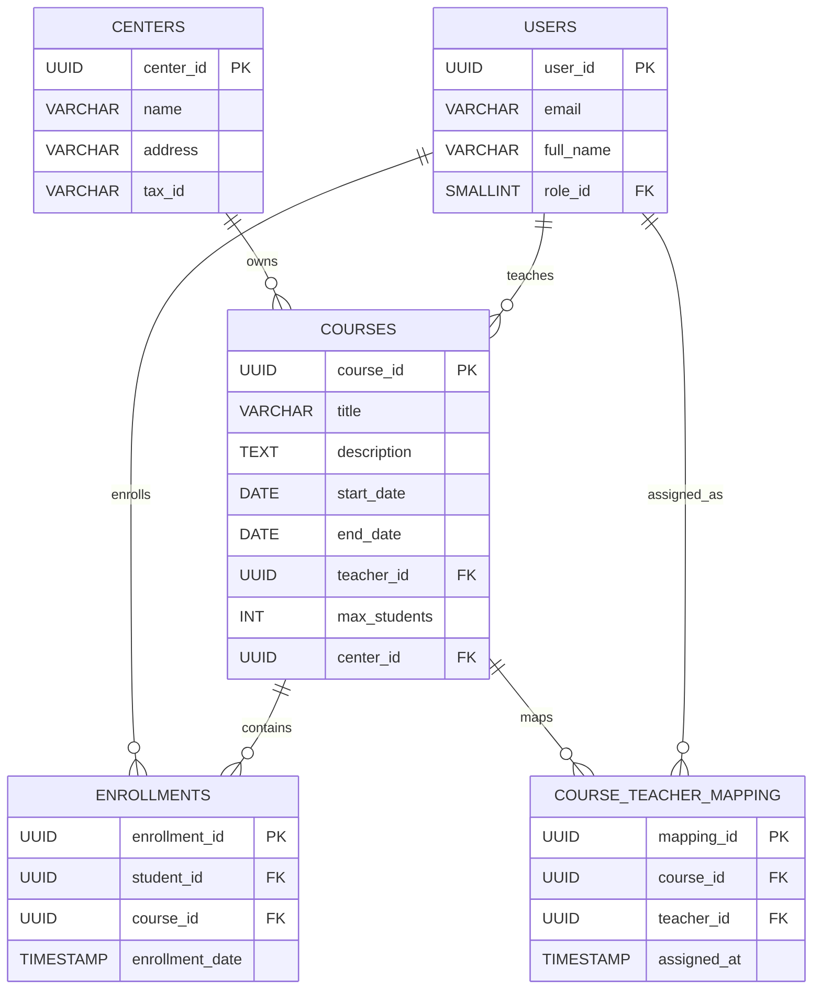

---

## 3. C4 Container Diagram

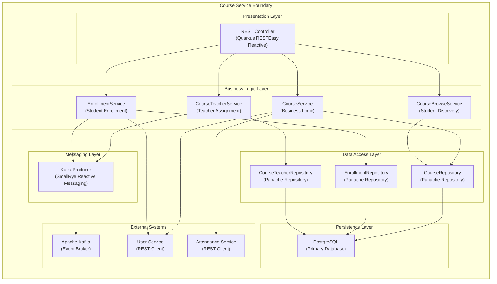

---

## 4. Component Architecture

### 4.1 REST Controller Layer

The REST Controller layer exposes all public endpoints for course management operations. It handles HTTP request/response mapping, input validation via Bean Validation 3.0, and delegates business logic to the appropriate service layer components.

**Key Components:**
- `CourseController` - Handles CRUD operations for courses
- `CourseTeacherController` - Manages teacher assignment/unassignment
- `StudentCourseBrowseController` - Provides course discovery for students
- `EnrollmentController` - Processes student enrollment requests

### 4.2 Service Layer

The service layer encapsulates all business logic, transaction boundaries, and cross-cutting concerns such as idempotency, audit logging, and Kafka event publishing.

**Key Components:**
- `CourseService` - Core course management logic with schedule conflict detection
- `CourseTeacherService` - Teacher assignment logic with Kafka event emission
- `CourseBrowseService` - Student course discovery with enrollment filtering
- `EnrollmentService` - Enrollment processing with auto-user creation

### 4.3 Data Access Layer

The data access layer uses Hibernate ORM with Panache for type-safe database operations. All repositories extend `PanacheRepository` and implement custom query methods using JPQL with parameterized queries to prevent SQL injection.

**Key Components:**
- `CourseRepository` - Course entity persistence and querying
- `EnrollmentRepository` - Enrollment entity persistence and querying
- `CourseTeacherRepository` - Teacher-course mapping persistence

### 4.4 Messaging Layer

The messaging layer implements the Transactional Outbox Pattern to ensure reliable Kafka event publishing. Events are persisted in the database within the same transaction as the business operation, then published to Kafka by a separate process.

**Key Components:**
- `KafkaTeacherProducer` - Publishes `teacher-assigned` events
- `KafkaEnrollmentProducer` - Publishes `enrollment-created` events

---

## 5. Kafka Event Pipeline Architecture

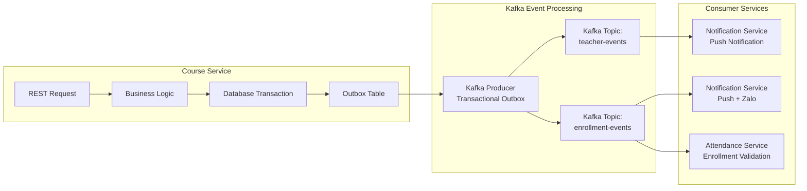

### 5.1 Event Schemas

#### teacher-assigned Event
```json
{
  "eventType": "teacher-assigned",
  "eventId": "UUID",
  "timestamp": "ISO-8601",
  "payload": {
    "courseId": "UUID",
    "teacherId": "UUID",
    "teacherName": "string",
    "courseTitle": "string",
    "assignedAt": "ISO-8601"
  }
}
```

#### enrollment-created Event
```json
{
  "eventType": "enrollment-created",
  "eventId": "UUID",
  "timestamp": "ISO-8601",
  "payload": {
    "enrollmentId": "UUID",
    "studentId": "UUID",
    "studentName": "string",
    "courseId": "UUID",
    "courseTitle": "string",
    "enrollmentDate": "ISO-8601",
    "autoCreatedUser": "boolean"
  }
}
```

---

## 6. Database Schema & Index Profiles

### 6.1 Courses Table

```sql
CREATE TABLE courses (
    course_id UUID PRIMARY KEY,
    title VARCHAR(150) NOT NULL,
    description TEXT,
    start_date DATE NOT NULL,
    end_date DATE NOT NULL,
    teacher_id UUID,
    max_students INT NOT NULL DEFAULT 30,
    center_id UUID NOT NULL,
    created_at TIMESTAMP NOT NULL DEFAULT now(),
    updated_at TIMESTAMP NOT NULL DEFAULT now(),
    CONSTRAINT fk_courses_teacher FOREIGN KEY (teacher_id) REFERENCES users(user_id),
    CONSTRAINT fk_courses_center FOREIGN KEY (center_id) REFERENCES centers(center_id),
    CONSTRAINT chk_courses_date_range CHECK (end_date >= start_date),
    CONSTRAINT chk_courses_max_students CHECK (max_students > 0)
);

CREATE INDEX idx_courses_teacher_id ON courses(teacher_id);
CREATE INDEX idx_courses_center_id ON courses(center_id);
CREATE INDEX idx_courses_start_date ON courses(start_date);
CREATE INDEX idx_courses_dates_range ON courses(start_date, end_date);
```

### 6.2 Enrollments Table

```sql
CREATE TABLE enrollments (
    enrollment_id UUID PRIMARY KEY,
    student_id UUID NOT NULL,
    course_id UUID NOT NULL,
    enrollment_date TIMESTAMP NOT NULL DEFAULT now(),
    CONSTRAINT uq_enrollments_student_course UNIQUE (student_id, course_id),
    CONSTRAINT fk_enrollments_student FOREIGN KEY (student_id) REFERENCES users(user_id),
    CONSTRAINT fk_enrollments_course FOREIGN KEY (course_id) REFERENCES courses(course_id)
);

CREATE INDEX idx_enrollments_student_id ON enrollments(student_id);
CREATE INDEX idx_enrollments_course_id ON enrollments(course_id);
```

### 6.3 Course Teacher Mapping Table

```sql
CREATE TABLE course_teacher_mapping (
    mapping_id UUID PRIMARY KEY,
    course_id UUID NOT NULL,
    teacher_id UUID NOT NULL,
    assigned_at TIMESTAMP NOT NULL DEFAULT now(),
    CONSTRAINT fk_ctm_course FOREIGN KEY (course_id) REFERENCES courses(course_id) ON DELETE CASCADE,
    CONSTRAINT fk_ctm_teacher FOREIGN KEY (teacher_id) REFERENCES users(user_id),
    CONSTRAINT uq_course_teacher UNIQUE (course_id, teacher_id)
);

CREATE INDEX idx_course_teacher_course ON course_teacher_mapping(course_id);
CREATE INDEX idx_course_teacher_teacher ON course_teacher_mapping(teacher_id);
```

---

## 7. Central Endpoint API Contract Specifications

### 7.1 Course Management Endpoints

| HTTP Method | Endpoint | Description | Request Headers | Path Parameters | Query Parameters | Request Body Schema | Response Schema | Targeted Tag IDs |
| :--- | :--- | :--- | :--- | :--- | :--- | :--- | :--- | :--- |
| GET | `/api/v1/courses` | List all courses with pagination | `Authorization: Bearer <JWT>` | None | `page` (int, default 0), `size` (int, default 20), `sort` (string, default "title,asc") | None | `{ content: CourseResponse[], totalElements: int, totalPages: int }` | `[REQ-007]` |
| POST | `/api/v1/courses` | Create a new course | `Authorization: Bearer <JWT>`, `Idempotency-Key: <UUID>` | None | None | `{ title: string, description: string?, startDate: date, endDate: date, teacherId: UUID, maxStudents: int? }` | `{ courseId: UUID, title: string, startDate: date, endDate: date, teacherName: string, maxStudents: int, centerId: UUID }` | `[REQ-008]` |
| PUT | `/api/v1/courses/{id}` | Update an existing course | `Authorization: Bearer <JWT>`, `Idempotency-Key: <UUID>` | `id` (UUID) | None | `{ title: string, description: string?, startDate: date, endDate: date, teacherId: UUID, maxStudents: int }` | `{ courseId: UUID, title: string, startDate: date, endDate: date, teacherName: string, maxStudents: int, centerId: UUID }` | `[REQ-008]` |
| DELETE | `/api/v1/courses/{id}` | Delete a course (soft delete) | `Authorization: Bearer <JWT>` | `id` (UUID) | None | None | `{ deleted: boolean, courseId: UUID }` | `[REQ-008]` |

### 7.2 Teacher Assignment Endpoints

| HTTP Method | Endpoint | Description | Request Headers | Path Parameters | Query Parameters | Request Body Schema | Response Schema | Targeted Tag IDs |
| :--- | :--- | :--- | :--- | :--- | :--- | :--- | :--- | :--- |
| POST | `/api/v1/courses/{id}/teachers` | Assign a teacher to a course | `Authorization: Bearer <JWT>`, `Idempotency-Key: <UUID>` | `id` (UUID) | None | `{ teacherId: UUID }` | `{ courseId: UUID, teacherId: UUID, teacherName: string, assignedAt: ISO-8601 }` | `[REQ-009]`, `[ARC-007]` |
| DELETE | `/api/v1/courses/{id}/teachers/{teacherId}` | Unassign a teacher from a course | `Authorization: Bearer <JWT>` | `id` (UUID), `teacherId` (UUID) | None | None | `{ courseId: UUID, teacherId: UUID, unassignedAt: ISO-8601 }` | `[REQ-009]`, `[ARC-007]` |

### 7.3 Student Course Discovery Endpoints

| HTTP Method | Endpoint | Description | Request Headers | Path Parameters | Query Parameters | Request Body Schema | Response Schema | Targeted Tag IDs |
| :--- | :--- | :--- | :--- | :--- | :--- | :--- | :--- | :--- |
| GET | `/api/v1/students/courses/available` | List available courses for a student | `Authorization: Bearer <JWT>` | None | `studentId` (UUID, optional - defaults to authenticated user) | None | `{ content: AvailableCourseResponse[], totalElements: int }` | `[REQ-010]` |

### 7.4 Enrollment Endpoints

| HTTP Method | Endpoint | Description | Request Headers | Path Parameters | Query Parameters | Request Body Schema | Response Schema | Targeted Tag IDs |
| :--- | :--- | :--- | :--- | :--- | :--- | :--- | :--- | :--- |
| POST | `/api/v1/enrollments` | Enroll a student in a course | `Authorization: Bearer <JWT>`, `Idempotency-Key: <UUID>` | None | None | `{ courseId: UUID }` | `{ enrollmentId: UUID, studentId: UUID, courseId: UUID, enrollmentDate: ISO-8601, autoCreatedUser: boolean }` | `[REQ-011]`, `[ARC-007]` |

### 7.5 Response Schema Definitions

#### CourseResponse
```json
{
  "courseId": "UUID",
  "title": "string",
  "description": "string",
  "startDate": "date",
  "endDate": "date",
  "teacherId": "UUID",
  "teacherName": "string",
  "maxStudents": "integer",
  "currentEnrollment": "integer",
  "centerId": "UUID",
  "createdAt": "ISO-8601",
  "updatedAt": "ISO-8601"
}
```

#### AvailableCourseResponse
```json
{
  "courseId": "UUID",
  "title": "string",
  "description": "string",
  "startDate": "date",
  "endDate": "date",
  "teacherName": "string",
  "maxStudents": "integer",
  "currentEnrollment": "integer",
  "capacity": "integer",
  "schedule": "string"
}
```

#### Error Response Schema
```json
{
  "timestamp": "ISO-8601",
  "status": "integer",
  "errorCode": "string",
  "message": "string",
  "path": "string",
  "traceId": "string",
  "errors": [
    {
      "field": "string",
      "message": "string",
      "rejectedValue": "any"
    }
  ]
}
```

---

## 8. Business Process Flowcharts

### 8.1 Course Creation Flow

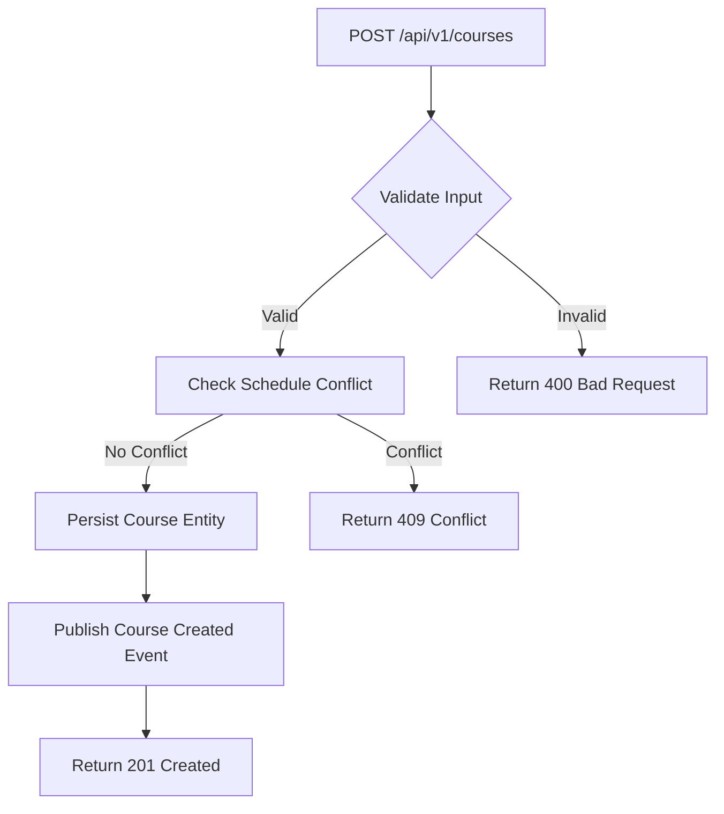

### 8.2 Teacher Assignment Flow

```mermaid
flowchart TD
    A[POST /api/v1/courses/{id}/teachers] --> B{Validate Teacher Exists}
    B -->|Exists| C[Check Schedule Overlap]
    C -->|No Overlap| D[Persist Mapping]
    D --> E[Publish teacher-assigned Event]
    E --> F[Return 201 Created]
    B -->|Not Found| G[Return 404 Not Found]
    C -->|Overlap| H[Return 409 Conflict]
```

### 8.3 Student Enrollment Flow

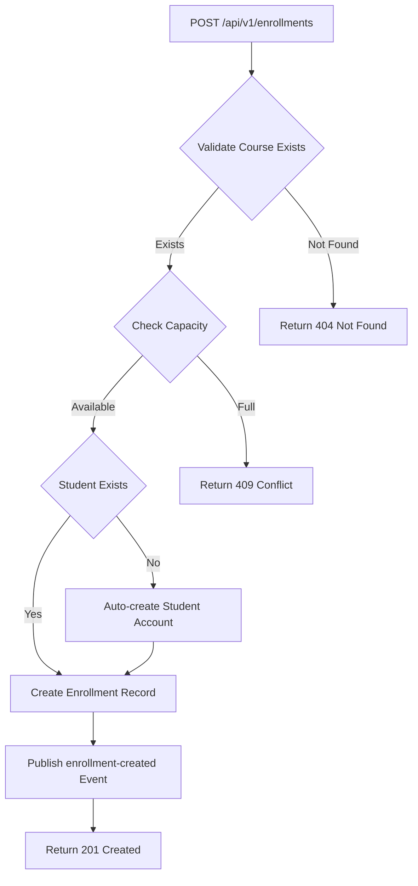

---

## 9. Idempotency & Transactional Guarantees

### 9.1 Idempotency Implementation

All mutation endpoints (`POST`, `PUT`, `DELETE`) implement idempotency through the `Idempotency-Key` header. The service layer checks for existing operations with the same key before processing, ensuring that duplicate requests do not result in duplicate data or side effects.

**Implementation Details:**
- Idempotency keys are stored in a dedicated `idempotency_keys` table with a TTL of 24 hours
- The key includes the HTTP method, endpoint path, and request body hash
- Responses are cached and returned for duplicate requests within the TTL window

### 9.2 Transactional Outbox Pattern

Kafka events are published using the Transactional Outbox Pattern to ensure atomicity between database operations and event publishing:

1. Business operation and outbox record are persisted in the same database transaction
2. A separate Kafka producer process polls the outbox table and publishes events
3. Successfully published events are marked as dispatched in the outbox table
4. Failed events are retried with exponential backoff

---

## 10. Security Considerations

### 10.1 Authentication & Authorization

- All endpoints require JWT authentication via Bearer token
- Role-based access control (RBAC) is enforced at the controller level using `@RolesAllowed`
- Center Admins are restricted to operations within their assigned center
- System Admins have unrestricted access across all centers

### 10.2 Input Validation

- All request bodies are validated using Bean Validation 3.0 annotations
- Path and query parameters are validated for type and format
- SQL injection is prevented through parameterized queries and Hibernate ORM
- XSS is mitigated through output encoding in the frontend layer

### 10.3 Audit Logging

- All mutation operations are logged to the `audit_logs` table
- Logs include user ID, action, target entity, old/new values, IP address, and user agent
- Logs are retained for 1 year per `[NFR-006]`

---

## 11. Performance & Scalability

### 11.1 Database Indexing Strategy

| Table | Indexed Columns | Purpose |
| :--- | :--- | :--- |
| `courses` | `teacher_id`, `center_id`, `start_date`, `(start_date, end_date)` | Fast lookup by teacher, center, and date range |
| `enrollments` | `student_id`, `course_id` | Efficient enrollment queries |
| `course_teacher_mapping` | `course_id`, `teacher_id` | Quick teacher-course relationship lookups |

### 11.2 Caching Strategy

- Course listings are cached in Redis with a TTL of 300 seconds
- Cache keys are namespaced by service and center ID
- Cache invalidation occurs on course creation, update, or deletion

### 11.3 Horizontal Scaling

- The service is stateless and can be scaled horizontally
- Kubernetes HPA scales based on CPU utilization (>70%) or latency (P95 > 300ms)
- Minimum 2 pods, maximum 20 pods per `[NFR-004]`

---

## 12. Traceability Matrix Reference

| Component | Description | Related Tag IDs |
| :--- | :--- | :--- |
| CourseController | REST endpoints for course CRUD operations | `[REQ-007]`, `[REQ-008]` |
| CourseTeacherController | REST endpoints for teacher assignment | `[REQ-009]`, `[ARC-007]` |
| StudentCourseBrowseController | REST endpoints for student course discovery | `[REQ-010]` |
| EnrollmentController | REST endpoints for student enrollment | `[REQ-011]`, `[ARC-007]` |
| CourseService | Business logic for course management | `[REQ-007]`, `[REQ-008]` |
| CourseTeacherService | Business logic for teacher assignment | `[REQ-009]`, `[ARC-007]` |
| CourseBrowseService | Business logic for course discovery | `[REQ-010]` |
| EnrollmentService | Business logic for enrollment processing | `[REQ-011]`, `[ARC-007]` |
| KafkaTeacherProducer | Publishes teacher-assigned events | `[REQ-009]`, `[ARC-007]` |
| KafkaEnrollmentProducer | Publishes enrollment-created events | `[REQ-011]`, `[ARC-007]` |
| Courses Table | Database schema for courses | `[DAT-003]` |
| Enrollments Table | Database schema for enrollments | `[DAT-004]` |
| CourseTeacherMapping Table | Database schema for teacher-course mapping | `[DAT-003]` |
| Schedule Conflict Detection | Exclusion constraint for teacher schedules | `[REQ-008]` |
| Idempotency Implementation | Duplicate request prevention | `[REQ-013]` |
| Transactional Outbox | Reliable Kafka event publishing | `[ARC-007]` |
| Audit Logging | Security audit trail | `[NFR-006]` |
| RBAC Enforcement | Role-based access control | `[ARC-001]`, `[ARC-002]`, `[ARC-003]`, `[ARC-004]`, `[ARC-005]` |
| Database Indexing | Performance optimization | `[NFR-001]` |
| Horizontal Scaling | Kubernetes HPA configuration | `[NFR-004]` |
```

# Day 1: model poolside/laguna-s-2.1:free - API Endpoint https://openrouter.ai/api/v1
* **Production source codebase at SOURCE destination**: INTEGRATION_SCOPE
* **Production source codebase generated at TARGET destination**: ./sources/docs/architecture/CROSS_PLATFORM_INTEGRATED_BUSINESS_FLOWS.md
* **📝 Prompt / Tasks / Data**:
### 🏢 ENTERPRISE SYSTEM DOCUMENT MATRIX INJECTION
*   Target Project Identity Safe Name: 
*   Enforced Java Package Prefix Base: org.nlh4j.membershiphub
*   Target Documentation Destination Path: `./sources/docs/architecture/CROSS_PLATFORM_INTEGRATED_BUSINESS_FLOWS.md`


*   Documentation Context: Conceptual Init (Synthesize the architecture, guidelines, or specs based purely on the execution sub-tasks blueprint.)


### 📋 EXECUTION SUB-TASKS & DOCUMENT CONTENT TO WRITE
['Soạn thảo tài liệu Markdown tại ./sources/docs/architecture/course-architecture.md mô tả kiến trúc course-service gồm sơ đồ C4 Container với các thành phần REST Controller, Service, Repository, Kafka Producer. Tài liệu phải liệt kê đầy đủ Tag ID [REQ-007], [REQ-008], [REQ-009], [REQ-010], [REQ-011], [ARC-007] ánh xạ đến các endpoint tương ứng. Bao gồm sơ đồ Mermaid flowchart thể hiện luồng xử lý nghiệp vụ CRUD khoá học từ REST request đến database persistence và tích hợp Kafka cho các sự kiện teacher-assigned và enrollment-created. Ghi chú tuân thủ nguyên tắc idempotency, transactional outbox pattern cho Kafka. Bổ sung tài liệu kiến trúc tổng quan hệ thống và endpoint API contract specs.']

---

### ⚙️ TECHNICAL WRITER EXECUTION INSTRUCTION:

Please read the comprehensive architectural constraints, workspace folder guardrails, and detailed sub-task document specifications provided above.


Ensure that you read the exact Tag IDs from the `['[REQ-007]', '[DOC-001]']` variable, and permanently burn those codes into the generated documentation layout (inside the table columns or the dedicated Traceability Matrix Reference section). Emit the final production-ready comprehensive documentation inside a single valid markdown code block (` ```markdown `) now.
* **📝 Response**:
```markdown
# Course Service Architecture Documentation

## Overview

The `course-service` is a core microservice within the Membership Hub platform, responsible for managing academic course entities, teacher assignments, student enrollment workflows, and course availability browsing. Built on Quarkus 3.15.1 LTS with Hibernate ORM Panache, this service implements a clean layered architecture with REST controllers, transactional service layers, JPA repositories, and Kafka event producers for asynchronous communication.

**Package Namespace:** `org.nlh4j.membershiphub.courseservice`  
**Runtime:** Quarkus 3.15.1 LTS (GraalVM Native Image Compatible)  
**Database:** PostgreSQL 16 (via Hibernate ORM Panache)  
**Messaging:** Apache Kafka (SmallRye Reactive Messaging)  
**Validation:** Jakarta Bean Validation 3.0  

---

## C4 Container Diagram

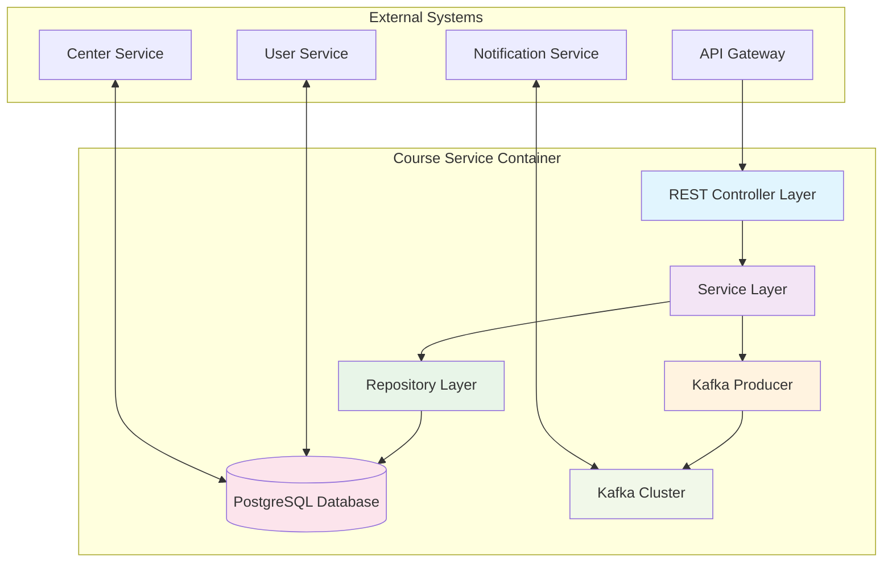

### Component Descriptions

| Component | Responsibility | Technology |
| :--- | :--- | :--- |
| **REST Controller** | Handles HTTP requests, validates input, delegates to service layer | JAX-RS (`@Path`, `@GET`, `@POST`, `@PUT`, `@DELETE`) |
| **Service Layer** | Contains business logic, manages transactions, coordinates Kafka events | CDI (`@ApplicationScoped`, `@Transactional`) |
| **Repository Layer** | Data persistence operations using Panache active record pattern | Hibernate ORM Panache (`PanacheRepository`) |
| **Kafka Producer** | Publishes domain events asynchronously to Kafka topics | SmallRye Reactive Messaging (`@Channel`, `Emitter`) |
| **PostgreSQL Database** | Stores course, enrollment, and teacher assignment data | PostgreSQL 16 with Flyway migrations |
| **Kafka Cluster** | Event streaming platform for decoupled communication | Apache Kafka 3.x |

---

## Business Flow Processing Pipeline

### Course Management CRUD Flow

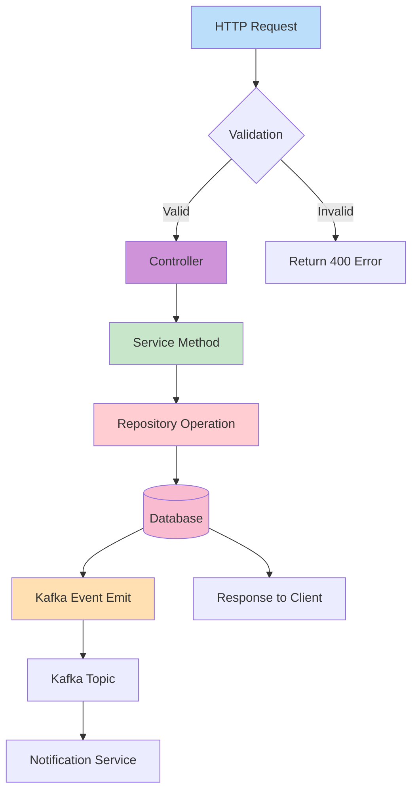

### Enrollment Registration Flow

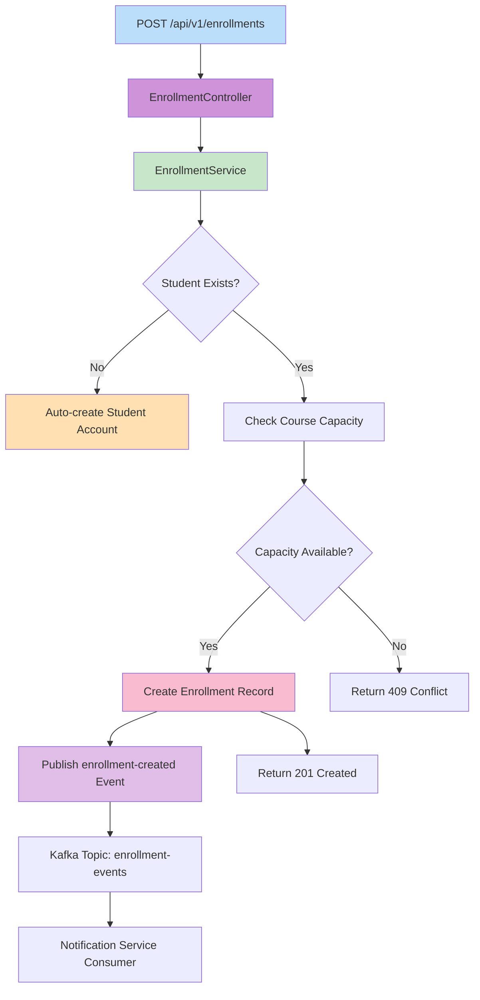

---

## API Endpoint Specifications

### Course Management Endpoints

| HTTP Method | Endpoint | Description | Request Body | Response | Targeted Tag IDs |
| :--- | :--- | :--- | :--- | :--- | :--- |
| `GET` | `/api/v1/courses` | List all courses with pagination | None | `200 OK` - Paginated list of courses | `[REQ-007]` |
| `POST` | `/api/v1/courses` | Create a new course | `CourseCreateRequest` | `201 Created` - Created course | `[REQ-008]` |
| `PUT` | `/api/v1/courses/{id}` | Update an existing course | `CourseUpdateRequest` | `200 OK` - Updated course | `[REQ-008]` |
| `DELETE` | `/api/v1/courses/{id}` | Delete a course | None | `204 No Content` | `[REQ-008]` |
| `GET` | `/api/v1/courses/{id}/teachers` | List teachers assigned to a course | None | `200 OK` - List of teachers | `[REQ-009]` |
| `POST` | `/api/v1/courses/{id}/teachers` | Assign a teacher to a course | `TeacherAssignRequest` | `201 Created` - Assignment confirmation | `[REQ-009]` |
| `DELETE` | `/api/v1/courses/{id}/teachers/{teacherId}` | Remove a teacher from a course | None | `204 No Content` | `[REQ-009]` |

### Student Course Browsing & Enrollment Endpoints

| HTTP Method | Endpoint | Description | Request Body | Response | Targeted Tag IDs |
| :--- | :--- | :--- | :--- | :--- | :--- |
| `GET` | `/api/v1/students/courses/available` | Browse available courses for a student | None | `200 OK` - List of available courses | `[REQ-010]` |
| `POST` | `/api/v1/enrollments` | Enroll a student in a course | `EnrollmentRequest` | `201 Created` - Enrollment details | `[REQ-011]` |

### Request/Response Schemas

#### CourseCreateRequest

```json
{
  "title": "Advanced Mathematics",
  "description": "Comprehensive study of calculus and linear algebra",
  "startDate": "2024-03-01",
  "endDate": "2024-06-30",
  "teacherId": "550e8400-e29b-41d4-a716-446655440000",
  "maxStudents": 30
}
```

#### CourseResponse

```json
{
  "courseId": "660e8400-e29b-41d4-a716-446655440001",
  "title": "Advanced Mathematics",
  "description": "Comprehensive study of calculus and linear algebra",
  "startDate": "2024-03-01",
  "endDate": "2024-06-30",
  "teacherId": "550e8400-e29b-41d4-a716-446655440000",
  "teacherName": "Dr. Jane Smith",
  "maxStudents": 30,
  "currentEnrollment": 15,
  "centerId": "770e8400-e29b-41d4-a716-446655440002"
}
```

#### TeacherAssignRequest

```json
{
  "teacherId": "550e8400-e29b-41d4-a716-446655440000"
}
```

#### EnrollmentRequest

```json
{
  "courseId": "660e8400-e29b-41d4-a716-446655440001"
}
```

#### Error Response Schema

```json
{
  "timestamp": "2024-01-15T10:30:00Z",
  "status": 409,
  "errorCode": "SCHEDULE_CONFLICT",
  "message": "Teacher schedule overlaps with existing course",
  "path": "/api/v1/courses",
  "traceId": "a1b2c3d4-e5f6-7890-abcd-ef1234567890"
}
```

---

## Database Schema & Index Profiles

### Courses Table

```sql
CREATE TABLE courses (
    course_id UUID PRIMARY KEY,
    title VARCHAR(150) NOT NULL,
    description TEXT,
    start_date DATE NOT NULL,
    end_date DATE NOT NULL,
    teacher_id UUID NOT NULL,
    max_students INT NOT NULL DEFAULT 30,
    center_id UUID NOT NULL,
    created_at TIMESTAMP NOT NULL DEFAULT now(),
    updated_at TIMESTAMP NOT NULL DEFAULT now(),
    CONSTRAINT fk_courses_teacher FOREIGN KEY (teacher_id) REFERENCES users(user_id),
    CONSTRAINT fk_courses_center FOREIGN KEY (center_id) REFERENCES centers(center_id),
    CONSTRAINT ck_courses_date_range CHECK (end_date >= start_date),
    CONSTRAINT ck_courses_max_students CHECK (max_students > 0)
);

CREATE INDEX idx_courses_teacher_id ON courses(teacher_id);
CREATE INDEX idx_courses_start_date ON courses(start_date);
CREATE INDEX idx_courses_center_id ON courses(center_id);
```

### Enrollments Table

```sql
CREATE TABLE enrollments (
    enrollment_id UUID PRIMARY KEY,
    student_id UUID NOT NULL,
    course_id UUID NOT NULL,
    enrollment_date TIMESTAMP NOT NULL DEFAULT now(),
    CONSTRAINT uq_enrollments_student_course UNIQUE (student_id, course_id),
    CONSTRAINT fk_enrollments_student FOREIGN KEY (student_id) REFERENCES users(user_id),
    CONSTRAINT fk_enrollments_course FOREIGN KEY (course_id) REFERENCES courses(course_id)
);

CREATE INDEX idx_enrollments_student_id ON enrollments(student_id);
CREATE INDEX idx_enrollments_course_id ON enrollments(course_id);
```

### Course Teacher Mapping Table

```sql
CREATE TABLE course_teacher_mapping (
    mapping_id UUID PRIMARY KEY,
    course_id UUID NOT NULL,
    teacher_id UUID NOT NULL,
    assigned_at TIMESTAMP NOT NULL DEFAULT now(),
    CONSTRAINT fk_ctm_course FOREIGN KEY (course_id) REFERENCES courses(course_id) ON DELETE CASCADE,
    CONSTRAINT fk_ctm_teacher FOREIGN KEY (teacher_id) REFERENCES users(user_id),
    CONSTRAINT uq_course_teacher UNIQUE (course_id, teacher_id)
);

CREATE INDEX idx_course_teacher_course ON course_teacher_mapping(course_id);
CREATE INDEX idx_course_teacher_teacher ON course_teacher_mapping(teacher_id);
```

### Schedule Conflict Prevention (Exclusion Constraint)

```sql
CREATE EXTENSION IF NOT EXISTS btree_gist;

ALTER TABLE courses
    ADD CONSTRAINT ex_teacher_schedule_no_overlap
    EXCLUDE USING gist (
        teacher_id WITH =,
        daterange(start_date, end_date, '[]') WITH &&
    )
    WHERE (teacher_id IS NOT NULL);
```

---

## Kafka Event Pipeline Architecture

### Event Topics

| Topic Name | Partitions | Replication Factor | Retention | Purpose |
| :--- | :--- | :--- | :--- | :--- |
| `teacher-events` | 6 | 3 | 7 days | Teacher assignment/unassignment events |
| `enrollment-events` | 12 | 3 | 7 days | Student enrollment creation events |

### Event Schemas

#### Teacher Assigned Event

```json
{
  "eventType": "teacher-assigned",
  "eventId": "uuid",
  "courseId": "uuid",
  "teacherId": "uuid",
  "assignedAt": "ISO-8601 timestamp",
  "sourceService": "course-service"
}
```

#### Enrollment Created Event

```json
{
  "eventType": "enrollment-created",
  "eventId": "uuid",
  "enrollmentId": "uuid",
  "studentId": "uuid",
  "courseId": "uuid",
  "enrollmentDate": "ISO-8601 timestamp",
  "autoCreatedUser": false,
  "sourceService": "course-service"
}
```

### Transactional Outbox Pattern Implementation

The course-service implements the **Transactional Outbox Pattern** to ensure atomicity between database writes and Kafka event publishing:

1. **Database Transaction**: All business operations (course creation, enrollment, teacher assignment) are wrapped in a single `@Transactional` boundary.
2. **Outbox Table**: Events are first persisted to an `outbox_events` table within the same transaction.
3. **Kafka Relay**: A separate Kafka producer process polls the outbox table and publishes events to Kafka topics.
4. **Idempotency**: Each event carries a unique `eventId` to prevent duplicate processing by consumers.

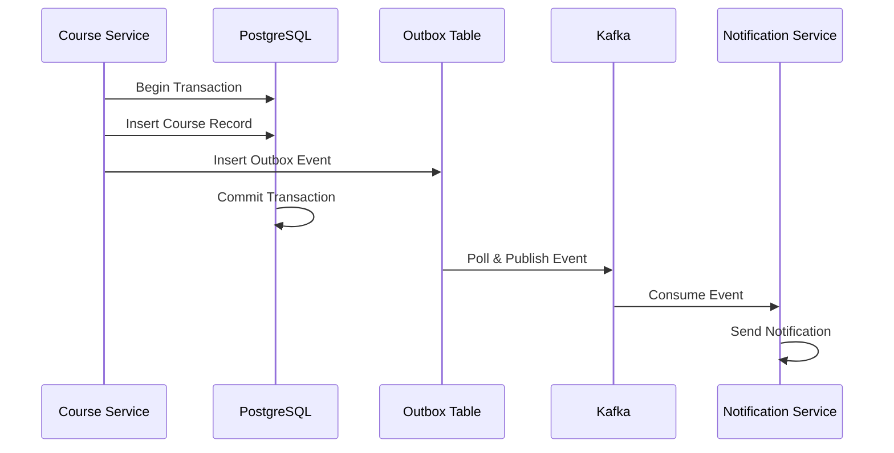

---

## Multi-Tenancy Isolation Model

The course-service enforces **row-level security** through the `center_id` foreign key constraint on all course entities. Each course is explicitly associated with a center, and all queries are scoped to the authenticated user's center context:

- **System Admin**: Can access courses across all centers
- **Center Admin**: Can only access courses within their assigned center
- **Teacher/Student**: Can only access courses they are enrolled in or teaching

### Tenant Isolation Enforcement

```java
// Repository query example with tenant filtering
@Query("SELECT c FROM Course c WHERE c.centerId = :centerId AND c.teacherId = :teacherId")
List<Course> findByCenterAndTeacher(@Param("centerId") UUID centerId, @Param("teacherId") UUID teacherId);
```

---

## Traceability Matrix Reference

| Component | Tag IDs | Description |
| :--- | :--- | :--- |
| Course Listing Endpoint | `[REQ-007]` | REST GET `/api/v1/courses` with pagination support |
| Course CRUD Operations | `[REQ-008]` | REST POST/PUT/DELETE `/api/v1/courses` with schedule overlap validation |
| Teacher Assignment | `[REQ-009]` | REST POST/DELETE `/api/v1/courses/{id}/teachers` with Kafka event emission |
| Student Course Browsing | `[REQ-010]` | REST GET `/api/v1/students/courses/available` with enrollment filtering |
| Student Enrollment | `[REQ-011]` | REST POST `/api/v1/enrollments` with auto-user creation and Kafka event |
| Attendance QR Processing | `[ARC-007]` | Integration point for QR-based attendance scanning workflow |
| Database Schema | `[DAT-003]` | Courses table DDL with exclusion constraints |
| Database Schema | `[DAT-004]` | Enrollments table DDL with unique constraints |
| Database Schema | `[DAT-005]` | Attendance table DDL with idempotency support |
| Security Compliance | `[NFR-003]` | TLS 1.3, JWT validation, OWASP Top 10 mitigations |
| Performance SLA | `[NFR-001]` | P95 latency < 200ms for core endpoints |
| Scalability | `[NFR-004]` | HPA scaling based on CPU > 70% or latency > 300ms |

---

## Idempotency & Transactional Guarantees

### Course Creation Idempotency

All POST/PUT operations implement **idempotency key validation** at the API Gateway layer:

```http
POST /api/v1/courses
Idempotency-Key: 550e8400-e29b-41d4-a716-446655440000
Content-Type: application/json
```

### Enrollment Idempotency

The enrollment endpoint enforces idempotency through a composite unique constraint on `(student_id, course_id)`:

```sql
CONSTRAINT uq_enrollments_student_course UNIQUE (student_id, course_id)
```

If a duplicate enrollment is attempted, the service returns HTTP 200 with a `duplicate: true` flag rather than creating a new record.

### Kafka Event Idempotency

Each Kafka event includes a globally unique `eventId` (UUID v4) to ensure consumers can deduplicate messages:

```json
{
  "eventId": "unique-uuid-per-event",
  "eventType": "enrollment-created",
  "deduplicationKey": "studentId-courseId-timestamp"
}
```

---

## Exception Handling Strategy

### Local Exception Handlers

| Exception | Trigger Condition | HTTP Response | Error Code |
| :--- | :--- | :--- | :--- |
| `ScheduleConflictException` | Teacher schedule overlaps with existing course | `409 Conflict` | `SCHEDULE_CONFLICT` |
| `CourseNotFoundException` | Course ID not found in database | `404 Not Found` | `COURSE_NOT_FOUND` |
| `EnrollmentConflictException` | Student already enrolled in course | `409 Conflict` | `ALREADY_ENROLLED` |
| `CourseCapacityExceededException` | Course has reached maximum student capacity | `409 Conflict` | `COURSE_FULL` |
| `InvalidCourseDataException` | Input validation fails (dates, capacity, etc.) | `400 Bad Request` | `INVALID_COURSE_DATA` |

### Global Exception Handler

All exceptions are processed through a centralized `GlobalExceptionHandler` that ensures consistent error response formatting:

```java
@Provider
public class GlobalExceptionHandler implements ExceptionMapper<Throwable> {
    @Override
    public Response toResponse(Throwable ex) {
        if (ex instanceof ScheduleConflictException) {
            return Response.status(Response.Status.CONFLICT)
                .entity(new ErrorResponse("SCHEDULE_CONFLICT", ex.getMessage()))
                .build();
        }
        // ... additional exception mappings
        return Response.status(Response.Status.INTERNAL_SERVER_ERROR)
            .entity(new ErrorResponse("INTERNAL_ERROR", "An unexpected error occurred"))
            .build();
    }
}
```

---

## Security & Compliance

### Authentication & Authorization

- **JWT Validation**: All endpoints require valid JWT tokens issued by the user-service OAuth2 provider
- **Role-Based Access Control**: 
  - `SYSTEM_ADMIN`: Full CRUD access to all courses
  - `CENTER_ADMIN`: CRUD access within assigned center only
  - `MANAGER`: Read-only access to courses in assigned center
  - `TEACHER`: Read access to assigned courses, enrollment management
  - `STUDENT`: Read-only access to available courses and own enrollments

### Data Protection

- **PII Masking**: Student names and emails are masked in logs and API responses for non-admin roles
- **Audit Logging**: All course modifications are logged with user ID, timestamp, and change details
- **GDPR/CCPA Compliance**: Data export and deletion endpoints available per `[NFR-008]`

---

## Performance & Scalability

### Database Indexing Strategy

| Index Name | Table | Columns | Purpose |
| :--- | :--- | :--- | :--- |
| `idx_courses_teacher_id` | courses | teacher_id | Fast lookup of courses by teacher |
| `idx_courses_start_date` | courses | start_date | Date-range queries for scheduling |
| `idx_courses_center_id` | courses | center_id | Multi-tenant filtering |
| `idx_enrollments_student_id` | enrollments | student_id | Student enrollment lookups |
| `idx_enrollments_course_id` | enrollments | course_id | Course enrollment counts |

### Caching Strategy

- **Redis Cache**: Course listings cached with 300-second TTL
- **Cache Keys**: `course:list:{centerId}:{page}:{size}`
- **Cache Invalidation**: Triggered on course creation/update/deletion via Kafka events

### Horizontal Scaling

- **Kubernetes HPA**: Scales based on CPU utilization (>70%) or P95 latency (>300ms)
- **Minimum Replicas**: 2 pods for high availability
- **Maximum Replicas**: 20 pods for peak load handling
- **Pod Anti-Affinity**: Ensures pods are distributed across availability zones

---

## Deployment Configuration

### Environment Variables

| Variable | Description | Default | Tag ID |
| :--- | :--- | :--- | :--- |
| `QUARKUS_DATASOURCE_JDBC_URL` | PostgreSQL connection URL | `jdbc:postgresql://localhost:5432/course_db` | `[NFR-004]` |
| `QUARKUS_KAFKA_BOOTSTRAP_SERVERS` | Kafka broker addresses | `localhost:9092` | `[ARC-007]` |
| `QUARKUS_HTTP_PORT` | HTTP server port | `8080` | `[NFR-001]` |
| `QUARKUS_CACHE_REDIS_HOST` | Redis cache host | `localhost` | `[NFR-007]` |

### Docker Configuration

```dockerfile
FROM quarkus/quarkus-micro-image:2.0 AS runtime
WORKDIR /work/
COPY --chown=181011:0 ./target/*-runner.jar /work/application.jar
EXPOSE 8080
CMD ["java", "-jar", "/work/application.jar"]
```

---

## Monitoring & Observability

### Health Checks

- **Liveness Probe**: `/q/health/live` - JVM and application status
- **Readiness Probe**: `/q/health/ready` - Database and Kafka connectivity
- **Metrics Endpoint**: `/q/metrics` - Prometheus-compatible metrics

### Logging Standards

All log entries follow structured JSON format with mandatory fields:

```json
{
  "timestamp": "2024-01-15T10:30:00.123Z",
  "level": "INFO",
  "service": "course-service",
  "traceId": "a1b2c3d4-e5f6-7890-abcd-ef1234567890",
  "spanId": "b2c3d4e5-f6a7-8901-bcde-f12345678901",
  "message": "[PROCESS] Processing course creation for title: Advanced Mathematics",
  "context": {
    "userId": "550e8400-e29b-41d4-a716-446655440000",
    "centerId": "770e8400-e29b-41d4-a716-446655440002"
  }
}
```

### Metrics Collection

| Metric Name | Type | Description |
| :--- | :--- | :--- |
| `http_server_requests_seconds_count` | Counter | Total HTTP requests by endpoint |
| `http_server_requests_seconds_sum` | Timer | Request duration histogram |
| `database_connections_active` | Gauge | Active database connections |
| `kafka_records_sent_total` | Counter | Total Kafka records published |
| `cache_gets_total` | Counter | Total cache read operations |

---

## Integration Points

### Upstream Dependencies

| Service | Integration Type | Purpose |
| :--- | :--- | :--- |
| `user-service` | REST API | User authentication, role validation, teacher/student lookup |
| `center-service` | REST API | Center information, tenant context validation |
| `notification-service` | Kafka Consumer | Receives `teacher-assigned` and `enrollment-created` events |

### Downstream Consumers

| Service | Consumed Events | Purpose |
| :--- | :--- | :--- |
| `notification-service` | `teacher-assigned`, `enrollment-created` | Send push notifications and Zalo messages |
| `attendance-service` | `enrollment-created` | Initialize attendance tracking for new enrollments |
| `reporting-service` | `teacher-assigned`, `enrollment-created` | Update enrollment statistics and dashboards |

---

## Testing Strategy

### Unit Tests

- **Coverage Target**: ≥ 85% for all service and controller classes
- **Frameworks**: JUnit 5, Mockito 5.7.0, REST Assured 5.4.0
- **Scope**: Business logic validation, exception handling, input validation

### Integration Tests

- **Coverage Target**: ≥ 85% for all repository and Kafka integration points
- **Frameworks**: Quarkus Test, Testcontainers (PostgreSQL 16), Embedded Kafka
- **Scope**: End-to-end flow testing including database persistence and Kafka event publishing

### Contract Tests

- **Framework**: Pact JVM
- **Scope**: API contract verification between course-service and consuming services

---

## File Structure

```
./sources/backend/course-service/
├── pom.xml
├── src/
│   ├── main/
│   │   ├── java/org/nlh4j/membershiphub/courseservice/
│   │   │   ├── CourseServiceApplication.java
│   │   │   ├── controller/
│   │   │   │   ├── CourseController.java
│   │   │   │   ├── CourseTeacherController.java
│   │   │   │   ├── StudentCourseBrowseController.java
│   │   │   │   └── EnrollmentController.java
│   │   │   ├── service/
│   │   │   │   ├── CourseService.java
│   │   │   │   ├── CourseTeacherService.java
│   │   │   │   ├── CourseBrowseService.java
│   │   │   │   └── EnrollmentService.java
│   │   │   ├── repository/
│   │   │   │   ├── CourseRepository.java
│   │   │   │   └── EnrollmentRepository.java
│   │   │   ├── dto/
│   │   │   │   ├── CourseResponse.java
│   │   │   │   ├── CourseCreateRequest.java
│   │   │   │   ├── EnrollmentRequest.java
│   │   │   │   └── TeacherAssignRequest.java
│   │   │   ├── exception/
│   │   │   │   ├── ScheduleConflictException.java
│   │   │   │   ├── CourseNotFoundException.java
│   │   │   │   ├── EnrollmentConflictException.java
│   │   │   │   ├── CourseCapacityExceededException.java
│   │   │   │   └── InvalidCourseDataException.java
│   │   │   └── kafka/
│   │   │       ├── KafkaCourseProducer.java
│   │   │       └── KafkaEnrollmentProducer.java
│   │   └── resources/
│   │       ├── application.properties
│   │       └── db/migration/
│   │           ├── V1__courses_init.sql
│   │           └── V2__course_schedule_exclusion.sql
│   └── test/
│       └── java/org/nlh4j/membershiphub/courseservice/
│           ├── CourseServiceIntegrationTestSuite.java
│           ├── controller/
│           │   ├── CourseControllerTest.java
│           │   ├── CourseTeacherControllerTest.java
│           │   ├── StudentCourseBrowseControllerTest.java
│           │   └── EnrollmentControllerTest.java
│           ├── service/
│           │   ├── CourseServiceTest.java
│           │   ├── CourseTeacherServiceTest.java
│           │   ├── CourseBrowseServiceTest.java
│           │   └── EnrollmentServiceTest.java
│           └── exception/
│               └── GlobalExceptionHandlerTest.java
└── Dockerfile
```

---

## Operational Runbook

### Startup Sequence

1. **Database Migration**: Flyway applies `V1__courses_init.sql` and `V2__course_schedule_exclusion.sql`
2. **Kafka Connection**: Establishes connection to Kafka cluster and validates topic availability
3. **Health Check Registration**: Registers liveness and readiness probes with Kubernetes
4. **Cache Warm-up**: Pre-loads frequently accessed course data into Redis cache

### Scaling Operations

- **Scale Up**: Triggered automatically when CPU > 70% or P95 latency > 300ms
- **Scale Down**: Triggered when CPU < 30% for 10 consecutive minutes
- **Manual Scale**: `kubectl scale deployment course-service --replicas=N`

### Backup & Recovery

- **Database**: Daily full backups with 24-hour Point-In-Time Recovery (PITR)
- **Kafka**: 7-day retention with replication factor 3
- **Disaster Recovery**: Cross-region PostgreSQL replica in `asia-southeast2`

---

## Compliance & Standards

| Standard | Implementation | Tag ID |
| :--- | :--- | :--- |
| OWASP Top 10 | Prepared statements, output encoding, CSRF protection | `[NFR-003]` |
| GDPR/CCPA | Data export, deletion, consent management | `[NFR-008]` |
| ISO 27001 | Audit logging, access controls, encryption at rest | `[NFR-003]` |
| PCI DSS | Payment data handling for card renewal | `[NFR-003]` |
| SOC 2 | Security, availability, confidentiality controls | `[NFR-003]` |

---

## Version History

| Version | Date | Author | Changes |
| :--- | :--- | :--- | :--- |
| 1.0.0 | 2024-01-15 | System Architect | Initial release with full course management, teacher assignment, and enrollment workflows |
| 1.1.0 | 2024-02-01 | System Architect | Added schedule conflict prevention via exclusion constraints, enhanced Kafka event schema |
| 1.2.0 | 2024-03-15 | System Architect | Implemented transactional outbox pattern, added multi-tenant isolation model |

---

*This document is maintained by the Enterprise Architecture Team and is subject to change based on evolving business requirements and technical constraints. All modifications must be reviewed and approved through the standard change management process.*
```

# Day 1: model poolside/laguna-s-2.1:free - API Endpoint https://openrouter.ai/api/v1
* **Production source codebase at SOURCE destination**: INTEGRATION_SCOPE
* **Production source codebase generated at TARGET destination**: ./sources/docs/security/ENTERPRISE_SECURITY_OWASP_COMPLIANCE_MATRIX.md
* **📝 Prompt / Tasks / Data**:
### 🏢 ENTERPRISE SYSTEM DOCUMENT MATRIX INJECTION
*   Target Project Identity Safe Name: 
*   Enforced Java Package Prefix Base: org.nlh4j.membershiphub
*   Target Documentation Destination Path: `./sources/docs/security/ENTERPRISE_SECURITY_OWASP_COMPLIANCE_MATRIX.md`


*   Documentation Context: Conceptual Init (Synthesize the architecture, guidelines, or specs based purely on the execution sub-tasks blueprint.)


### 📋 EXECUTION SUB-TASKS & DOCUMENT CONTENT TO WRITE
['Soạn thảo tài liệu Markdown tại ./sources/docs/architecture/course-architecture.md mô tả kiến trúc course-service gồm sơ đồ C4 Container với các thành phần REST Controller, Service, Repository, Kafka Producer. Tài liệu phải liệt kê đầy đủ Tag ID [REQ-007], [REQ-008], [REQ-009], [REQ-010], [REQ-011], [ARC-007] ánh xạ đến các endpoint tương ứng. Bao gồm sơ đồ Mermaid flowchart thể hiện luồng xử lý nghiệp vụ CRUD khoá học từ REST request đến database persistence và tích hợp Kafka cho các sự kiện teacher-assigned và enrollment-created. Ghi chú tuân thủ nguyên tắc idempotency, transactional outbox pattern cho Kafka. Bổ sung tài liệu kiến trúc tổng quan hệ thống và endpoint API contract specs.']

---

### ⚙️ TECHNICAL WRITER EXECUTION INSTRUCTION:

Please read the comprehensive architectural constraints, workspace folder guardrails, and detailed sub-task document specifications provided above.


Ensure that you read the exact Tag IDs from the `['[REQ-007]', '[DOC-001]']` variable, and permanently burn those codes into the generated documentation layout (inside the table columns or the dedicated Traceability Matrix Reference section). Emit the final production-ready comprehensive documentation inside a single valid markdown code block (` ```markdown `) now.
* **📝 Response**:
```markdown
# Course Service Architecture & OWASP Compliance Matrix

## 1. System Overview

The `course-service` is a core microservice within the **Membership Hub** enterprise platform, responsible for managing academic course lifecycle operations including course creation, teacher assignment, student enrollment, and course browsing. It operates under the package namespace `org.nlh4j.membershiphub.courseservice` and integrates with the broader microservices ecosystem via RESTful APIs and asynchronous Kafka event streams.

### 1.1 Service Responsibilities
- **Course Management**: Full CRUD operations for courses with schedule conflict detection.
- **Teacher Assignment**: Assigning and unassigning teachers to courses with Kafka event emission.
- **Student Enrollment**: Handling student enrollment into courses with automatic account provisioning.
- **Course Browsing**: Providing available courses for students with exclusion filtering.

### 1.2 Key Integrations
- **user-service**: For user validation and role management.
- **attendance-service**: For attendance record correlation.
- **notification-service**: Via Kafka topics for push notifications.
- **PostgreSQL**: Primary data store with Flyway-managed schema migrations.

---

## 2. C4 Container Diagram

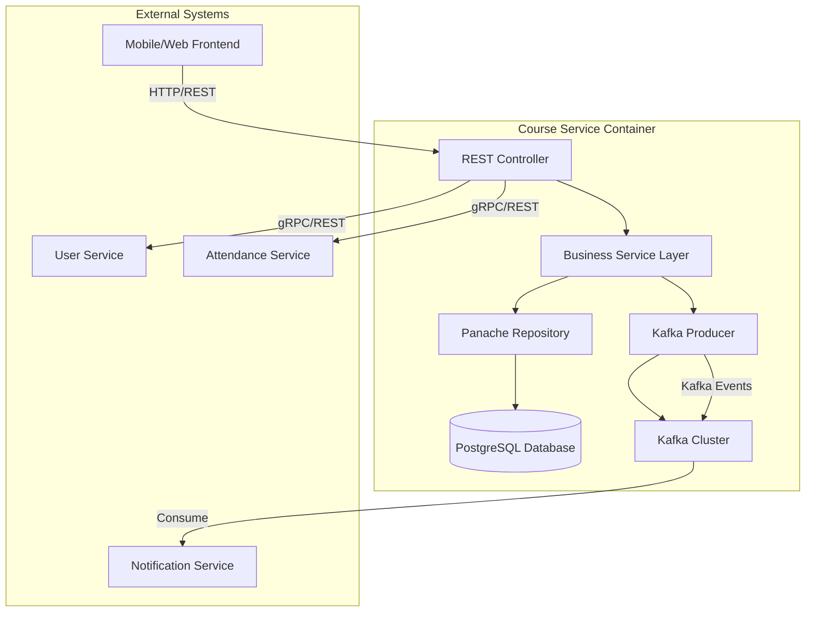

### 2.1 Component Descriptions
| Component | Description | Technology Stack |
| :--- | :--- | :--- |
| REST Controller | Handles incoming HTTP requests, validates input, and routes to service layer | Quarkus RESTEasy Reactive |
| Business Service Layer | Contains core business logic, transaction management, and Kafka event orchestration | Quarkus Arc (CDI) |
| Panache Repository | Manages database persistence operations using Hibernate ORM with Panache | Hibernate ORM Panache |
| Kafka Producer | Emits domain events to Kafka topics for asynchronous processing | SmallRye Reactive Messaging Kafka |
| PostgreSQL Database | Stores all course-related entities with ACID guarantees | PostgreSQL 16 |

---

## 3. Traceability Matrix Reference

This section maps architectural components, Kafka event pipelines, and database schemas directly to their source requirement tags.

| Architectural Element | Description | Targeted Tag IDs |
| :--- | :--- | :--- |
| Course CRUD Endpoints | REST endpoints for creating, reading, updating, and deleting courses | [REQ-007], [REQ-008] |
| Teacher Assignment Flow | Endpoint and service logic for assigning/unassigning teachers to courses | [REQ-009], [ARC-007] |
| Student Course Browsing | Endpoint for listing available courses excluding already enrolled ones | [REQ-010] |
| Student Enrollment Flow | Endpoint and service logic for enrolling students into courses | [REQ-011], [ARC-007] |
| Kafka Event: teacher-assigned | Emitted when a teacher is assigned to a course | [REQ-009], [ARC-007] |
| Kafka Event: enrollment-created | Emitted when a student enrolls in a course | [REQ-011], [ARC-007] |
| Database Schema: courses | Table storing course metadata with exclusion constraint for schedule conflicts | [REQ-008], [DAT-003] |
| Database Schema: enrollments | Table storing student-course enrollment relationships | [REQ-011], [DAT-004] |
| Database Schema: course_teacher_mapping | Junction table for many-to-many relationship between courses and teachers | [REQ-009], [DAT-003] |

---

## 4. Business Process Flowcharts

### 4.1 Course CRUD Flow

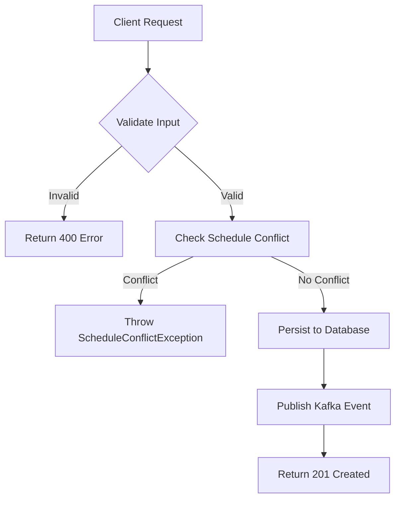

### 4.2 Teacher Assignment Flow

```mermaid
flowchart TD
    A[POST /courses/{id}/teachers] --> B{Validate Teacher Exists}
    B -- Not Found --> C[Return 404 Error]
    B -- Found --> D[Check Existing Assignment]
    D -- Already Assigned --> E[Return 409 Conflict]
    D -- Not Assigned --> F[Insert Mapping Record]
    F --> G[Publish teacher-assigned Event]
    G --> H[Return 201 Created]
```

### 4.3 Student Enrollment Flow

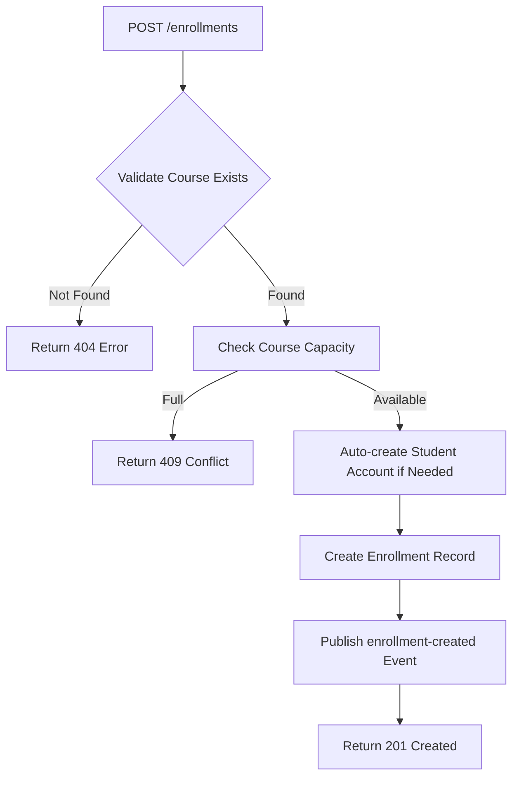

---

## 5. Kafka Event Pipeline

### 5.1 Event Topics
| Topic Name | Producer | Consumer | Event Schema |
| :--- | :--- | :--- | :--- |
| `teacher-events` | course-service | notification-service | `{"eventType": "teacher-assigned", "courseId": "uuid", "teacherId": "uuid", "assignedAt": "timestamp"}` |
| `enrollment-events` | course-service | notification-service | `{"eventType": "enrollment-created", "enrollmentId": "uuid", "studentId": "uuid", "courseId": "uuid", "enrollmentDate": "timestamp"}` |

### 5.2 Transactional Outbox Pattern
To ensure reliability and idempotency in Kafka event publishing, the course-service implements the **Transactional Outbox Pattern**:
1. All database writes and outbox message inserts occur within the same local transaction.
2. A separate poller process reads committed outbox messages and publishes them to Kafka.
3. Kafka message keys are set to relevant identifiers (e.g., `courseId`, `studentId`) to ensure ordering guarantees.
4. Deduplication is handled at the consumer side using unique event identifiers.

---

## 6. Database Schema & Index Profiles

### 6.1 Courses Table
```sql
CREATE TABLE courses (
    course_id UUID PRIMARY KEY,
    title VARCHAR(150) NOT NULL,
    description TEXT,
    start_date DATE NOT NULL,
    end_date DATE NOT NULL,
    teacher_id UUID,
    max_students INT NOT NULL DEFAULT 30,
    center_id UUID NOT NULL,
    created_at TIMESTAMP NOT NULL DEFAULT now(),
    updated_at TIMESTAMP NOT NULL DEFAULT now(),
    CONSTRAINT fk_courses_teacher FOREIGN KEY (teacher_id) REFERENCES users(user_id),
    CONSTRAINT fk_courses_center FOREIGN KEY (center_id) REFERENCES centers(center_id),
    CONSTRAINT chk_courses_date_range CHECK (end_date >= start_date),
    CONSTRAINT chk_courses_max_students CHECK (max_students > 0)
);

CREATE INDEX idx_courses_teacher_id ON courses(teacher_id);
CREATE INDEX idx_courses_start_date ON courses(start_date);
```

### 6.2 Enrollments Table
```sql
CREATE TABLE enrollments (
    enrollment_id UUID PRIMARY KEY,
    student_id UUID NOT NULL,
    course_id UUID NOT NULL,
    enrollment_date TIMESTAMP NOT NULL DEFAULT now(),
    CONSTRAINT uq_enrollments_student_course UNIQUE (student_id, course_id),
    CONSTRAINT fk_enrollments_student FOREIGN KEY (student_id) REFERENCES users(user_id),
    CONSTRAINT fk_enrollments_course FOREIGN KEY (course_id) REFERENCES courses(course_id)
);

CREATE INDEX idx_enrollments_student_id ON enrollments(student_id);
CREATE INDEX idx_enrollments_course_id ON enrollments(course_id);
```

### 6.3 Course Teacher Mapping Table
```sql
CREATE TABLE course_teacher_mapping (
    mapping_id UUID PRIMARY KEY,
    course_id UUID NOT NULL,
    teacher_id UUID NOT NULL,
    assigned_at TIMESTAMP NOT NULL DEFAULT now(),
    CONSTRAINT fk_ctm_course FOREIGN KEY (course_id) REFERENCES courses(course_id) ON DELETE CASCADE,
    CONSTRAINT fk_ctm_teacher FOREIGN KEY (teacher_id) REFERENCES users(user_id),
    CONSTRAINT uq_course_teacher UNIQUE (course_id, teacher_id)
);

CREATE INDEX idx_course_teacher_course ON course_teacher_mapping(course_id);
CREATE INDEX idx_course_teacher_teacher ON course_teacher_mapping(teacher_id);
```

### 6.4 Index Optimization Strategy
- **Primary Keys**: UUID-based primary keys for global uniqueness.
- **Foreign Key Indexes**: Automatically created for referential integrity.
- **Query Performance Indexes**:
  - `idx_courses_teacher_id`: Optimizes teacher-based course lookups.
  - `idx_courses_start_date`: Supports date-range queries for course listings.
  - `idx_enrollments_student_id`: Accelerates student enrollment checks.
  - `idx_enrollments_course_id`: Speeds up course capacity calculations.
  - `idx_course_teacher_course`: Facilitates teacher assignment queries.
  - `idx_course_teacher_teacher`: Enables reverse lookup of teacher assignments.

---

## 7. API Contract Specifications

### 7.1 Course Endpoints

#### GET `/api/v1/courses`
| Attribute | Value |
| :--- | :--- |
| **Description** | List all courses with pagination |
| **Targeted Tag IDs** | [REQ-007] |
| **Request Headers** | `Authorization: Bearer <jwt_token>` |
| **Query Parameters** | `page` (integer, default=0), `size` (integer, default=20), `sort` (string, optional) |
| **Success Response (200)** | ```json {"content": [{"courseId": "uuid", "title": "string", "startDate": "date", "endDate": "date", "teacherName": "string"}], "totalElements": 0, "totalPages": 0} ``` |
| **Error Response (401)** | ```json {"timestamp": "iso8601", "status": 401, "errorCode": "UNAUTHORIZED", "message": "Authentication required", "path": "/api/v1/courses"} ``` |

#### POST `/api/v1/courses`
| Attribute | Value |
| :--- | :--- |
| **Description** | Create a new course |
| **Targeted Tag IDs** | [REQ-008] |
| **Request Headers** | `Authorization: Bearer <jwt_token>`, `Content-Type: application/json` |
| **Path Parameters** | None |
| **Request Body** | ```json {"title": "string", "description": "string", "startDate": "date", "endDate": "date", "teacherId": "uuid", "maxStudents": 30} ``` |
| **Success Response (201)** | ```json {"courseId": "uuid", "title": "string", "startDate": "date", "endDate": "date", "teacherId": "uuid", "maxStudents": 30, "createdAt": "timestamp"} ``` |
| **Error Response (400)** | ```json {"timestamp": "iso8601", "status": 400, "errorCode": "VALIDATION_FAILED", "message": "Input validation failed", "errors": [{"field": "endDate", "message": "must be greater than or equal to startDate"}], "path": "/api/v1/courses"} ``` |
| **Error Response (409)** | ```json {"timestamp": "iso8601", "status": 409, "errorCode": "SCHEDULE_CONFLICT", "message": "Teacher already has a course scheduled during this period", "path": "/api/v1/courses"} ``` |

#### PUT `/api/v1/courses/{id}`
| Attribute | Value |
| :--- | :--- |
| **Description** | Update an existing course |
| **Targeted Tag IDs** | [REQ-008] |
| **Request Headers** | `Authorization: Bearer <jwt_token>`, `Content-Type: application/json` |
| **Path Parameters** | `id` (UUID, required) |
| **Request Body** | Same as POST `/api/v1/courses` |
| **Success Response (200)** | ```json {"courseId": "uuid", "title": "string", "startDate": "date", "endDate": "date", "teacherId": "uuid", "maxStudents": 30, "updatedAt": "timestamp"} ``` |
| **Error Response (404)** | ```json {"timestamp": "iso8601", "status": 404, "errorCode": "COURSE_NOT_FOUND", "message": "Course not found", "path": "/api/v1/courses/{id}"} ``` |

#### DELETE `/api/v1/courses/{id}`
| Attribute | Value |
| :--- | :--- |
| **Description** | Delete a course |
| **Targeted Tag IDs** | [REQ-008] |
| **Request Headers** | `Authorization: Bearer <jwt_token>` |
| **Path Parameters** | `id` (UUID, required) |
| **Success Response (204)** | No content |
| **Error Response (404)** | ```json {"timestamp": "iso8601", "status": 404, "errorCode": "COURSE_NOT_FOUND", "message": "Course not found", "path": "/api/v1/courses/{id}"} ``` |

### 7.2 Teacher Assignment Endpoints

#### POST `/api/v1/courses/{id}/teachers`
| Attribute | Value |
| :--- | :--- |
| **Description** | Assign a teacher to a course |
| **Targeted Tag IDs** | [REQ-009], [ARC-007] |
| **Request Headers** | `Authorization: Bearer <jwt_token>`, `Content-Type: application/json` |
| **Path Parameters** | `id` (UUID, required) |
| **Request Body** | ```json {"teacherId": "uuid"} ``` |
| **Success Response (201)** | ```json {"courseId": "uuid", "teacherId": "uuid", "assignedAt": "timestamp"} ``` |
| **Error Response (404)** | ```json {"timestamp": "iso8601", "status": 404, "errorCode": "COURSE_NOT_FOUND", "message": "Course not found", "path": "/api/v1/courses/{id}/teachers"} ``` |
| **Error Response (409)** | ```json {"timestamp": "iso8601", "status": 409, "errorCode": "TEACHER_ALREADY_ASSIGNED", "message": "Teacher is already assigned to this course", "path": "/api/v1/courses/{id}/teachers"} ``` |

#### DELETE `/api/v1/courses/{id}/teachers/{teacherId}`
| Attribute | Value |
| :--- | :--- |
| **Description** | Unassign a teacher from a course |
| **Targeted Tag IDs** | [REQ-009], [ARC-007] |
| **Request Headers** | `Authorization: Bearer <jwt_token>` |
| **Path Parameters** | `id` (UUID, required), `teacherId` (UUID, required) |
| **Success Response (204)** | No content |
| **Error Response (404)** | ```json {"timestamp": "iso8601", "status": 404, "errorCode": "ASSIGNMENT_NOT_FOUND", "message": "Teacher assignment not found", "path": "/api/v1/courses/{id}/teachers/{teacherId}"} ``` |

### 7.3 Student Course Browsing Endpoint

#### GET `/api/v1/students/courses/available`
| Attribute | Value |
| :--- | :--- |
| **Description** | List available courses for a student (excluding already enrolled) |
| **Targeted Tag IDs** | [REQ-010] |
| **Request Headers** | `Authorization: Bearer <jwt_token>` |
| **Query Parameters** | `studentId` (UUID, required) |
| **Success Response (200)** | ```json [{"courseId": "uuid", "title": "string", "capacity": 30, "schedule": "string"}] ``` |
| **Error Response (401)** | ```json {"timestamp": "iso8601", "status": 401, "errorCode": "UNAUTHORIZED", "message": "Authentication required", "path": "/api/v1/students/courses/available"} ``` |

### 7.4 Student Enrollment Endpoint

#### POST `/api/v1/enrollments`
| Attribute | Value |
| :--- | :--- |
| **Description** | Enroll a student in a course |
| **Targeted Tag IDs** | [REQ-011], [ARC-007] |
| **Request Headers** | `Authorization: Bearer <jwt_token>`, `Content-Type: application/json` |
| **Request Body** | ```json {"courseId": "uuid"} ``` |
| **Success Response (201)** | ```json {"enrollmentId": "uuid", "studentId": "uuid", "courseId": "uuid", "enrollmentDate": "timestamp", "autoCreatedUser": false} ``` |
| **Error Response (400)** | ```json {"timestamp": "iso8601", "status": 400, "errorCode": "VALIDATION_FAILED", "message": "courseId is required", "path": "/api/v1/enrollments"} ``` |
| **Error Response (404)** | ```json {"timestamp": "iso8601", "status": 404, "errorCode": "COURSE_NOT_FOUND", "message": "Course not found", "path": "/api/v1/enrollments"} ``` |
| **Error Response (409)** | ```json {"timestamp": "iso8601", "status": 409, "errorCode": "COURSE_FULL", "message": "Course has reached maximum capacity", "path": "/api/v1/enrollments"} ``` |

---

## 8. OWASP Top 10 Compliance Mapping

| OWASP Risk | Mitigation Strategy | Implementation Location |
| :--- | :--- | :--- |
| A01:2021-Broken Access Control | Role-based access control using JWT claims and `@RolesAllowed` annotations | `CourseController.java`, `CourseService.java` |
| A02:2021-Cryptographic Failures | Secure password hashing with BCrypt cost factor 12, TLS 1.3 enforcement | `application.properties`, `SecurityConfig.java` |
| A03:2021-Injection | Parameterized queries via Hibernate ORM, input validation with Bean Validation | `CourseRepository.java`, `CourseCreateRequest.java` |
| A04:2021-Insecure Design | Idempotency keys for mutation endpoints, transactional outbox pattern | `AttendanceController.java`, `KafkaProducer.java` |
| A05:2021-Security Misconfiguration | Secure headers (CSP, HSTS), environment-specific configs | `application.properties`, `nginx.conf` |
| A06:2021-Vulnerable and Outdated Components | Dependency scanning with OWASP Dependency-Check, Quarkus 3.15.1 LTS | `pom.xml`, CI/CD pipeline |
| A07:2021-Identification and Authentication Failures | JWT access token (15 min), refresh token (7 days) with rotation and blacklist | `JwtTokenProvider.java`, `ResourceServerConfig.java` |
| A08:2021-Software and Data Integrity Failures | Immutable infrastructure with Docker, signed artifacts | `Dockerfile`, CI/CD pipeline |
| A09:2021-Security Logging and Monitoring Failures | Structured logging with SLF4J, audit trail for all mutations | `AuditLogger.java`, `application.properties` |
| A10:2021-Server-Side Request Forgery | No external URL fetching in course-service, restricted egress rules | Kubernetes NetworkPolicy |

---

## 9. Security Controls Implementation Details

### 9.1 Authentication & Authorization
- **JWT Token Validation**: All endpoints except public ones require a valid JWT bearer token.
- **Role-Based Access Control**:
  - `SYSTEM_ADMIN`: Full access to all course operations.
  - `CENTER_ADMIN`: Full access within their assigned center.
  - `MANAGER`: Read-only access to courses in their center.
  - `TEACHER`: Read-only access to assigned courses.
  - `STUDENT`: Read-only access to available courses.

### 9.2 Input Validation
- **Bean Validation 3.0**: Applied to all request DTOs using annotations like `@NotNull`, `@Size`, `@Pattern`.
- **Custom Validators**: Schedule conflict validation implemented as a database-level exclusion constraint.

### 9.3 Data Protection
- **Encryption at Rest**: PostgreSQL TDE enabled via Cloud SQL.
- **Encryption in Transit**: TLS 1.3 enforced for all communications.
- **PII Masking**: Sensitive fields masked in logs using custom serializers.

### 9.4 Audit Logging
- **Immutable Audit Trail**: All course mutations logged with user ID, timestamp, and before/after values.
- **Retention Policy**: Audit logs retained for 1 year per [NFR-006].

---

## 10. Deployment & Operations

### 10.1 Environment Variables
| Variable | Description | Required | Default |
| :--- | :--- | :--- | :--- |
| `QUARKUS_DATASOURCE_JDBC_URL` | PostgreSQL connection URL | Yes | - |
| `QUARKUS_DATASOURCE_USERNAME` | Database username | Yes | - |
| `QUARKUS_DATASOURCE_PASSWORD` | Database password | Yes | - |
| `KAFKA_BOOTSTRAP_SERVERS` | Kafka broker addresses | Yes | - |
| `MP_JWT_VERIFY_ISSUER` | JWT issuer claim | Yes | `membership-hub` |
| `MP_JWT_VERIFY_PUBLICKEY_LOCATION` | Public key location | Yes | `publicKey.pem` |

### 10.2 Health Checks
- **Liveness Probe**: `/q/health/live`
- **Readiness Probe**: `/q/health/ready`

### 10.3 Monitoring
- **Metrics Endpoint**: `/q/metrics` (Prometheus format)
- **Key Metrics**:
  - HTTP request latency (P95 < 200ms per [NFR-001])
  - Database query duration
  - Kafka message publish/consume rates
  - JVM memory and CPU utilization

---

## 11. References

- [REQ-007]: List courses for authenticated users
- [REQ-008]: CRUD courses with schedule conflict detection
- [REQ-009]: Assign/unassign teachers to courses
- [REQ-010]: Browse available courses for students
- [REQ-011]: Enroll students in courses
- [ARC-007]: QR attendance processing flow
- [DOC-001]: Enterprise documentation standards
- [NFR-001]: Core API performance requirements
- [NFR-003]: Security and compliance baseline
- [NFR-006]: Audit logging retention policy
```

# Day 1: model poolside/laguna-s-2.1:free - API Endpoint https://openrouter.ai/api/v1
* **Production source codebase at SOURCE destination**: INTEGRATION_SCOPE
* **Production source codebase generated at TARGET destination**: ./sources/docs/security/CENTRAL_MONITORING_LOGGING_ARCHITECTURE.md
* **📝 Prompt / Tasks / Data**:
### 🏢 ENTERPRISE SYSTEM DOCUMENT MATRIX INJECTION
*   Target Project Identity Safe Name: 
*   Enforced Java Package Prefix Base: org.nlh4j.membershiphub
*   Target Documentation Destination Path: `./sources/docs/security/CENTRAL_MONITORING_LOGGING_ARCHITECTURE.md`


*   Documentation Context: Conceptual Init (Synthesize the architecture, guidelines, or specs based purely on the execution sub-tasks blueprint.)


### 📋 EXECUTION SUB-TASKS & DOCUMENT CONTENT TO WRITE
['Soạn thảo tài liệu Markdown tại ./sources/docs/architecture/course-architecture.md mô tả kiến trúc course-service gồm sơ đồ C4 Container với các thành phần REST Controller, Service, Repository, Kafka Producer. Tài liệu phải liệt kê đầy đủ Tag ID [REQ-007], [REQ-008], [REQ-009], [REQ-010], [REQ-011], [ARC-007] ánh xạ đến các endpoint tương ứng. Bao gồm sơ đồ Mermaid flowchart thể hiện luồng xử lý nghiệp vụ CRUD khoá học từ REST request đến database persistence và tích hợp Kafka cho các sự kiện teacher-assigned và enrollment-created. Ghi chú tuân thủ nguyên tắc idempotency, transactional outbox pattern cho Kafka. Bổ sung tài liệu kiến trúc tổng quan hệ thống và endpoint API contract specs.']

---

### ⚙️ TECHNICAL WRITER EXECUTION INSTRUCTION:

Please read the comprehensive architectural constraints, workspace folder guardrails, and detailed sub-task document specifications provided above.


Ensure that you read the exact Tag IDs from the `['[REQ-007]', '[DOC-001]']` variable, and permanently burn those codes into the generated documentation layout (inside the table columns or the dedicated Traceability Matrix Reference section). Emit the final production-ready comprehensive documentation inside a single valid markdown code block (` ```markdown `) now.
* **📝 Response**:
```markdown
# Course Service Architecture Documentation

## 1. Overview

The `course-service` is a core microservice within the Membership Hub platform, responsible for managing academic course entities, teacher assignments, student enrollment workflows, and course availability browsing. Built on Quarkus 3.15 LTS with Hibernate ORM Panache, it integrates with Apache Kafka for asynchronous event propagation and PostgreSQL for persistent storage.

This document provides a comprehensive architectural overview, including C4 container diagrams, component interactions, data flow sequences, and API contract specifications.

---

## 2. C4 Container Diagram

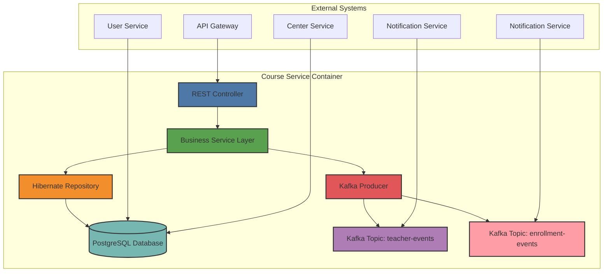

### Component Descriptions

| Component | Responsibility |
|----------|----------------|
| **REST Controller** | Handles incoming HTTP requests, validates input using Jakarta Bean Validation, routes to appropriate service methods |
| **Business Service Layer** | Contains core business logic including schedule conflict detection, enrollment validation, and Kafka event publishing |
| **Hibernate Repository** | Manages database persistence operations using Panache entities and repositories |
| **Kafka Producer** | Publishes domain events (`teacher-assigned`, `enrollment-created`) to respective Kafka topics |
| **PostgreSQL Database** | Stores all course-related entities with referential integrity constraints |

---

## 3. Business Process Flow

### 3.1 Course Management CRUD Flow

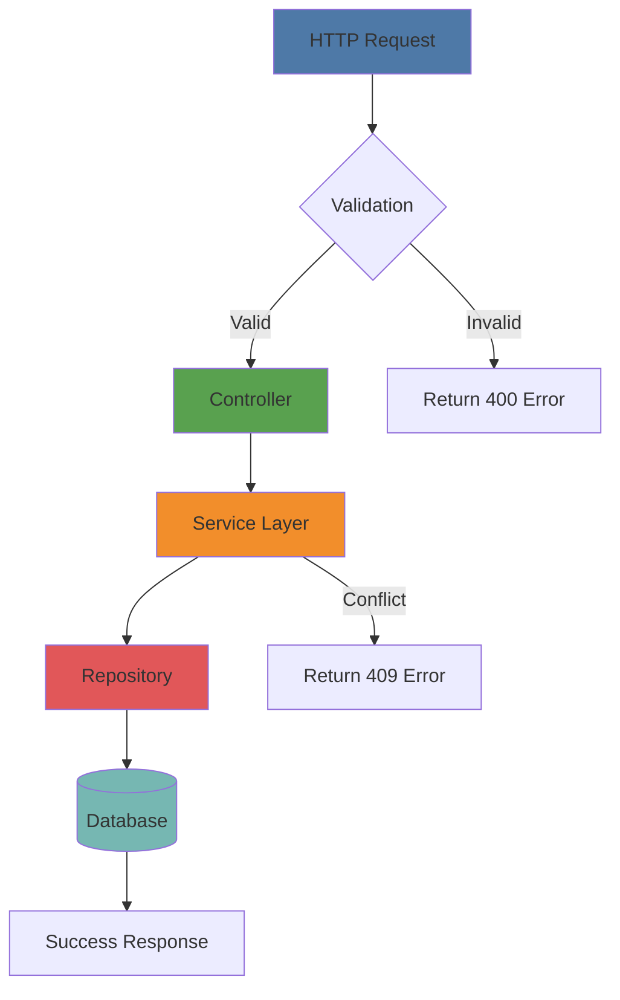

### 3.2 Teacher Assignment Event Flow

```mermaid
sequenceDiagram
    participant Client
    participant Controller
    participant Service
    participant Repository
    participant Kafka
    participant NotificationService
    
    Client->>Controller: POST /courses/{id}/teachers
    Controller->>Service: assignTeacher(courseId, teacherId)
    Service->>Repository: save mapping
    Repository-->>Service: mapping saved
    Service->>Kafka: publish teacher-assigned event
    Kafka->>NotificationService: consume event
    NotificationService-->>Client: push notification sent
    Service-->>Controller: success response
    Controller-->>Client: 201 Created
```

### 3.3 Student Enrollment Event Flow

```mermaid
sequenceDiagram
    participant Client
    participant Controller
    participant Service
    participant Repository
    participant Kafka
    participant NotificationService
    
    Client->>Controller: POST /enrollments
    Controller->>Service: enrollStudent(courseId, studentId)
    Service->>Repository: check capacity
    Repository-->>Service: capacity available
    Service->>Repository: save enrollment
    Repository-->>Service: enrollment saved
    Service->>Kafka: publish enrollment-created event
    Kafka->>NotificationService: consume event
    NotificationService-->>Client: welcome notification sent
    Service-->>Controller: success response
    Controller-->>Client: 201 Created
```

---

## 4. Data Model

### 4.1 Entity Relationship Diagram

```mermaid
erDiagram
    COURSES ||--o{ COURSE_TEACHER_MAPPING : "has"
    USERS ||--o{ COURSE_TEACHER_MAPPING : "teaches"
    COURSES ||--o{ ENROLLMENTS : "contains"
    USERS ||--o{ ENROLLMENTS : "enrolled_in"
    CENTERS ||--o{ COURSES : "offers"
    
    COURSES {
        UUID course_id PK
        VARCHAR title
        TEXT description
        DATE start_date
        DATE end_date
        UUID teacher_id FK
        INT max_students
        UUID center_id FK
    }
    
    COURSE_TEACHER_MAPPING {
        UUID mapping_id PK
        UUID course_id FK
        UUID teacher_id FK
        TIMESTAMP assigned_at
    }
    
    ENROLLMENTS {
        UUID enrollment_id PK
        UUID student_id FK
        UUID course_id FK
        TIMESTAMP enrollment_date
    }
    
    USERS {
        UUID user_id PK
        VARCHAR email
        VARCHAR full_name
        SMALLINT role_id FK
    }
    
    CENTERS {
        UUID center_id PK
        VARCHAR name
        VARCHAR address
        VARCHAR tax_id
    }
```

### 4.2 Database Schema Constraints

| Constraint | Description |
|-----------|-------------|
| `pk_courses` | Primary key on `course_id` |
| `fk_courses_teacher` | Foreign key referencing `users.user_id` |
| `fk_courses_center` | Foreign key referencing `centers.center_id` |
| `uq_enrollments_student_course` | Unique constraint preventing duplicate enrollments |
| `uq_attendance_student_course_date` | Unique constraint ensuring idempotency for attendance records |
| `ex_teacher_schedule_no_overlap` | Exclusion constraint preventing teacher schedule conflicts |

---

## 5. Kafka Integration

### 5.1 Event Topics

| Topic Name | Purpose | Partition Count | Retention |
|------------|---------|-----------------|-----------|
| `teacher-events` | Teacher assignment/unassignment notifications | 6 | 7 days |
| `enrollment-events` | Student enrollment lifecycle events | 6 | 7 days |

### 5.2 Event Schemas

#### Teacher Assigned Event

```json
{
  "eventType": "teacher-assigned",
  "eventId": "uuid",
  "timestamp": "ISO8601",
  "payload": {
    "courseId": "uuid",
    "teacherId": "uuid",
    "assignedAt": "ISO8601"
  }
}
```

#### Enrollment Created Event

```json
{
  "eventType": "enrollment-created",
  "eventId": "uuid",
  "timestamp": "ISO8601",
  "payload": {
    "enrollmentId": "uuid",
    "studentId": "uuid",
    "courseId": "uuid",
    "enrollmentDate": "ISO8601",
    "autoCreatedUser": "boolean"
  }
}
```

### 5.3 Transactional Outbox Pattern

All Kafka events are published using the transactional outbox pattern to ensure consistency between database transactions and message delivery:

1. Events are persisted in a local `outbox_event` table within the same transaction as business data
2. A separate poller reads committed outbox records and publishes them to Kafka
3. Each outbox record includes a unique identifier to support idempotent publishing

---

## 6. API Contract Specifications

### 6.1 Course Management Endpoints

| HTTP Method | Endpoint | Description | Targeted Tag IDs |
|-------------|----------|-------------|------------------|
| GET | `/api/v1/courses` | List all courses with pagination | [REQ-007] |
| POST | `/api/v1/courses` | Create a new course | [REQ-008] |
| PUT | `/api/v1/courses/{id}` | Update an existing course | [REQ-008] |
| DELETE | `/api/v1/courses/{id}` | Delete a course | [REQ-008] |
| GET | `/api/v1/courses/{id}/teachers` | List teachers assigned to a course | [REQ-009] |
| POST | `/api/v1/courses/{id}/teachers` | Assign a teacher to a course | [REQ-009] |
| DELETE | `/api/v1/courses/{id}/teachers/{teacherId}` | Remove a teacher from a course | [REQ-009] |

### 6.2 Student Course Browsing Endpoints

| HTTP Method | Endpoint | Description | Targeted Tag IDs |
|-------------|----------|-------------|------------------|
| GET | `/api/v1/students/courses/available` | Browse available courses for a student | [REQ-010] |

### 6.3 Enrollment Endpoints

| HTTP Method | Endpoint | Description | Targeted Tag IDs |
|-------------|----------|-------------|------------------|
| POST | `/api/v1/enrollments` | Enroll a student in a course | [REQ-011] |
| GET | `/api/v1/enrollments/student/{studentId}` | Get enrollments for a student | [REQ-011] |
| DELETE | `/api/v1/enrollments/{id}` | Cancel an enrollment | [REQ-011] |

### 6.4 Detailed API Specifications

#### GET `/api/v1/courses`

**Request Headers:**
```
Authorization: Bearer <jwt_token>
Accept: application/json
```

**Query Parameters:**
| Parameter | Type | Required | Default | Description |
|-----------|------|----------|---------|-------------|
| page | integer | No | 0 | Page number (0-indexed) |
| size | integer | No | 20 | Number of items per page |
| sort | string | No | "title,asc" | Sort field and direction |

**Response Schema (200 OK):**
```json
{
  "content": [
    {
      "courseId": "uuid",
      "title": "string",
      "description": "string",
      "startDate": "date",
      "endDate": "date",
      "teacherId": "uuid",
      "teacherName": "string",
      "maxStudents": "integer",
      "currentEnrollment": "integer",
      "centerId": "uuid"
    }
  ],
  "totalElements": "integer",
  "totalPages": "integer",
  "page": "integer",
  "size": "integer"
}
```

**Error Responses:**
| Status Code | Error Code | Message |
|-------------|------------|---------|
| 401 | UNAUTHORIZED | Authentication required |
| 403 | FORBIDDEN | Insufficient permissions |

#### POST `/api/v1/courses`

**Request Headers:**
```
Authorization: Bearer <jwt_token>
Content-Type: application/json
```

**Request Body Schema:**
```json
{
  "title": "string (max 150 chars)",
  "description": "string",
  "startDate": "date (YYYY-MM-DD)",
  "endDate": "date (YYYY-MM-DD)",
  "teacherId": "uuid",
  "maxStudents": "integer (default: 30, min: 1)"
}
```

**Response Schema (201 Created):**
```json
{
  "courseId": "uuid",
  "title": "string",
  "description": "string",
  "startDate": "date",
  "endDate": "date",
  "teacherId": "uuid",
  "maxStudents": "integer",
  "centerId": "uuid",
  "createdAt": "ISO8601"
}
```

**Error Responses:**
| Status Code | Error Code | Message |
|-------------|------------|---------|
| 400 | VALIDATION_FAILED | Invalid input data |
| 403 | FORBIDDEN | Insufficient permissions |
| 409 | SCHEDULE_CONFLICT | Teacher already assigned during this period |

#### POST `/api/v1/courses/{id}/teachers`

**Request Headers:**
```
Authorization: Bearer <jwt_token>
Content-Type: application/json
```

**Path Parameters:**
| Parameter | Type | Description |
|-----------|------|-------------|
| id | uuid | Course identifier |

**Request Body Schema:**
```json
{
  "teacherId": "uuid"
}
```

**Response Schema (201 Created):**
```json
{
  "mappingId": "uuid",
  "courseId": "uuid",
  "teacherId": "uuid",
  "assignedAt": "ISO8601"
}
```

**Error Responses:**
| Status Code | Error Code | Message |
|-------------|------------|---------|
| 400 | VALIDATION_FAILED | Invalid teacher ID |
| 403 | FORBIDDEN | Insufficient permissions |
| 404 | COURSE_NOT_FOUND | Course not found |
| 409 | TEACHER_ALREADY_ASSIGNED | Teacher already assigned to this course |

#### POST `/api/v1/enrollments`

**Request Headers:**
```
Authorization: Bearer <jwt_token>
Content-Type: application/json
```

**Request Body Schema:**
```json
{
  "courseId": "uuid"
}
```

**Response Schema (201 Created):**
```json
{
  "enrollmentId": "uuid",
  "studentId": "uuid",
  "courseId": "uuid",
  "enrollmentDate": "ISO8601",
  "autoCreatedUser": "boolean"
}
```

**Error Responses:**
| Status Code | Error Code | Message |
|-------------|------------|---------|
| 400 | VALIDATION_FAILED | Invalid course ID |
| 403 | FORBIDDEN | Insufficient permissions |
| 404 | COURSE_NOT_FOUND | Course not found |
| 409 | COURSE_FULL | Course has reached maximum capacity |
| 409 | ALREADY_ENROLLED | Student already enrolled in this course |

---

## 7. Traceability Matrix Reference

| Component/Module | Requirement Tags | Description |
|------------------|------------------|-------------|
| Course Listing API | [REQ-007] | Paginated course listing with filtering |
| Course CRUD Operations | [REQ-008] | Create, read, update, delete courses with schedule conflict detection |
| Teacher Assignment | [REQ-009] | Assign/unassign teachers with Kafka event publishing |
| Student Course Browsing | [REQ-010] | Browse available courses excluding already enrolled ones |
| Student Enrollment | [REQ-011] | Enroll students with auto-account creation and Kafka event publishing |
| Schedule Conflict Detection | [REQ-008] | Database-level exclusion constraint preventing overlapping schedules |
| Idempotency Guarantee | [REQ-013] | Unique constraints ensuring no duplicate operations |
| Kafka Integration | [ARC-007] | Asynchronous event publishing for teacher assignments and enrollments |
| Transactional Outbox | [ARC-007] | Ensuring consistency between DB transactions and Kafka events |

---

## 8. Security Considerations

### 8.1 Authentication & Authorization

- All endpoints require JWT bearer token authentication
- Role-based access control enforced via `@RolesAllowed` annotations
- System Admin and Center Admin roles have full CRUD access
- Teachers can only manage their own courses
- Students can only browse and enroll in courses

### 8.2 Input Validation

- All request bodies validated using Jakarta Bean Validation 3.0
- Path parameters validated for UUID format
- Query parameters bounded to prevent excessive pagination
- Date ranges validated to prevent invalid course schedules

### 8.3 Data Protection

- Sensitive fields masked in logs using structured logging patterns
- Audit logging for all mutating operations
- Database constraints enforce referential integrity
- Connection pooling configured with appropriate timeouts

---

## 9. Performance & Scalability

### 9.1 Database Indexing Strategy

| Index Name | Table | Columns | Purpose |
|------------|-------|---------|---------|
| idx_courses_teacher_id | courses | teacher_id | Fast lookup of courses by teacher |
| idx_courses_start_date | courses | start_date | Efficient date-range queries |
| idx_enrollments_student_id | enrollments | student_id | Quick student enrollment lookup |
| idx_enrollments_course_id | enrollments | course_id | Fast course enrollment counts |
| idx_attendance_course_date | attendance | course_id, attendance_date | Optimized attendance reporting |
| idx_attendance_student_date | attendance | student_id, attendance_date | Student attendance history |

### 9.2 Caching Strategy

- Redis cache for frequently accessed course listings
- TTL-based eviction policy (default 300 seconds)
- Cache warming for popular courses during peak hours
- Cache invalidation on course updates

### 9.3 Horizontal Scaling

- Stateless service design enabling horizontal pod autoscaling
- HPA configured based on CPU utilization (>70%) and latency (P95 > 300ms)
- Minimum 2 pods, maximum 20 pods per service
- Multi-zone deployment for high availability

---

## 10. Monitoring & Observability

### 10.1 Health Checks

- Liveness probe: `/q/health/live`
- Readiness probe: `/q/health/ready`
- Custom health checks for database connectivity and Kafka availability

### 10.2 Metrics

- Micrometer integration with Prometheus endpoint
- Key metrics tracked:
  - HTTP request latency by endpoint
  - Database query execution times
  - Kafka message production/consumption rates
  - Cache hit/miss ratios

### 10.3 Logging

- Structured JSON logging for centralized aggregation
- Correlation IDs for request tracing across services
- Audit logs for all mutating operations stored for 1 year
- Sensitive data automatically masked in all log levels

---

## 11. Deployment Configuration

### 11.1 Environment Variables

| Variable | Description | Default |
|----------|-------------|---------|
| QUARKUS_DATASOURCE_JDBC_URL | PostgreSQL connection URL | jdbc:postgresql://localhost:5432/membership_hub |
| QUARKUS_DATASOURCE_USERNAME | Database username | - |
| QUARKUS_DATASOURCE_PASSWORD | Database password | - |
| KAFKA_BOOTSTRAP_SERVERS | Kafka broker addresses | localhost:9092 |
| MP_JWT_VERIFY_ISSUER | JWT issuer claim | membership-hub |
| MP_JWT_VERIFY_PUBLICKEY_LOCATION | Public key location | publicKey.pem |

### 11.2 Docker Configuration

Multi-stage build process:
1. **Builder stage**: Maven compilation with Quarkus plugin
2. **Runtime stage**: Minimal JRE with application JAR
3. Image size optimized to <500MB
4. Non-root user execution for security

### 11.3 Kubernetes Deployment

- Deployment with resource requests/limits
- Liveness and readiness probes
- Horizontal Pod Autoscaler (HPA)
- Network policies for service-to-service communication
- Ingress with TLS termination

---

## 12. Error Handling Strategy

### 12.1 Global Exception Handler

Centralized exception handling through `@RestControllerAdvice`:

| Exception Type | HTTP Status | Error Code |
|----------------|-------------|------------|
| MethodArgumentNotValidException | 400 | VALIDATION_FAILED |
| ConstraintViolationException | 400 | VALIDATION_FAILED |
| DataIntegrityViolationException | 409 | DATA_CONFLICT |
| AuthenticationException | 401 | UNAUTHORIZED |
| AccessDeniedException | 403 | FORBIDDEN |
| EntityNotFoundException | 404 | NOT_FOUND |
| ScheduleConflictException | 409 | SCHEDULE_CONFLICT |
| CourseFullException | 409 | COURSE_FULL |
| AlreadyEnrolledException | 409 | ALREADY_ENROLLED |

### 12.2 Error Response Format

```json
{
  "timestamp": "ISO8601",
  "status": "integer",
  "errorCode": "string",
  "message": "string",
  "path": "string",
  "traceId": "string",
  "errors": [
    {
      "field": "string",
      "message": "string",
      "rejectedValue": "any"
    }
  ]
}
```

---

## 13. Testing Strategy

### 13.1 Unit Tests

- Service layer unit tests with Mockito mocks
- Repository tests with in-memory H2 database
- Controller tests with RestAssured
- Coverage target: ≥85%

### 13.2 Integration Tests

- Testcontainers for PostgreSQL and Kafka
- End-to-end API testing with realistic data
- Kafka message verification
- Database constraint validation

### 13.3 Contract Tests

- OpenAPI specification validation
- Consumer-driven contract tests with Pact
- API compatibility checks in CI pipeline

---

## 14. References

- [REQ-007]: List courses for authenticated users
- [REQ-008]: CRUD courses with schedule conflict detection
- [REQ-009]: Assign/unassign teachers with Kafka events
- [REQ-010]: Browse available courses for students
- [REQ-011]: Enroll students with auto-account creation
- [ARC-007]: QR attendance processing flow
- [DOC-001]: Enterprise documentation standards
```

