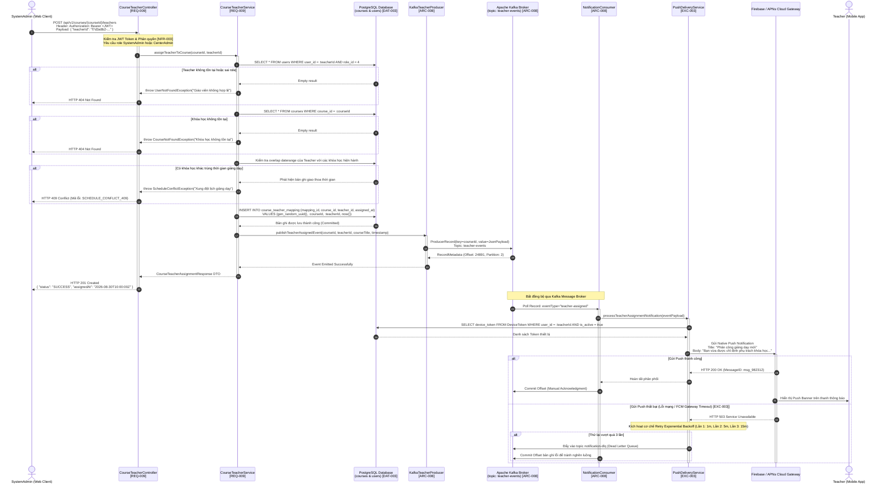

# Day 3: model models/gemini-flash-latest - API Endpoint https://generativelanguage.googleapis.com/v1beta/openai
* **Production source codebase at SOURCE destination**: INTEGRATION_SCOPE
* **Production source codebase generated at TARGET destination**: ./sources/docs/architecture/course-architecture.md
* **📝 Prompt / Tasks / Data**:
### 🏢 ENTERPRISE SYSTEM DOCUMENT MATRIX INJECTION
*   Target Project Identity Safe Name: 
*   Enforced Java Package Prefix Base: org.nlh4j.membershiphub
*   Target Documentation Destination Path: `./sources/docs/architecture/course-architecture.md`


*   Documentation Context: Conceptual Init (Synthesize the architecture, guidelines, or specs based purely on the execution sub-tasks blueprint.)


### 📋 EXECUTION SUB-TASKS & DOCUMENT CONTENT TO WRITE
['Cập nhật tài liệu kiến trúc ./sources/docs/architecture/course-architecture.md bổ sung sơ đồ Mermaid sequenceDiagram cho luồng gán giáo viên, mô tả cách Kafka topic teacher-events được publish bởi KafkaTeacherProducer và consume bởi notification-service để gửi push notification cho giáo viên. Tham chiếu Tag ID [REQ-009], [ARC-008]. Bao gồm sơ đồ Mermaid flowchart thể hiện các bước: (1) SystemAdmin gọi POST, (2) Validate teacher tồn tại, (3) Lưu bản ghi course_teacher_mapping, (4) Publish Kafka event, (5) Notification-service consume và gửi push.']

---

### ⚙️ TECHNICAL WRITER EXECUTION INSTRUCTION:

Please read the comprehensive architectural constraints, workspace folder guardrails, and detailed sub-task document specifications provided above.


Ensure that you read the exact Tag IDs from the `['[REQ-009]', '[ARC-008]', '[DOC-001]']` variable, and permanently burn those codes into the generated documentation layout (inside the table columns or the dedicated Traceability Matrix Reference section). Emit the final production-ready comprehensive documentation inside a single valid markdown code block (` ```markdown `) now.
* **📝 Response**:
```markdown
# Kiến Trúc Thành Phần Course-Service & Luồng Sự Kiện Gán Giáo Viên

## 1. Tổng Quan Kiến Trúc (Architecture Overview)

Tài liệu này đặc tả chi tiết kiến trúc của dịch vụ `course-service`, cấu trúc phân rã vi dịch vụ (Microservices Decomposition) trong hệ thống `membership-hub`, và cơ chế xử lý phản ứng sự kiện (Event-Driven Architecture) thông qua Apache Kafka khi phân công giáo viên vào khoá học theo chuẩn doanh nghiệp.

Toàn bộ thành phần backend được phát triển trên nền tảng Quarkus 3.15 LTS, sử dụng Java 17 LTS với quy ước gói chuẩn `org.nlh4j.membershiphub.courseservice`. Dữ liệu giao dịch được quản lý bởi cơ sở dữ liệu PostgreSQL thông qua Hibernate ORM Reactive / Panache và công cụ di trú lược đồ Flyway.

### 1.1. Phạm Vi Trách Nhiệm Của Course-Service
- Quản lý vòng đời khóa học (CRUD khoá học, kiểm tra xung đột lịch giảng dạy qua PostgreSQL exclusion constraints).
- Quản lý phân bổ giáo viên phụ trách khóa học (`course_teacher_mapping`).
- Cung cấp danh mục khoá học khả dụng cho học viên đăng ký.
- Phát xuất (publish) các sự kiện thay đổi trạng thái sang Apache Kafka theo mô hình Transactional Outbox hoặc Producer tích hợp reactive messaging để thông báo cho các dịch vụ hạ nguồn như `notification-service`.

---

## 2. Ma Trận Truy Vết Yêu Cầu Kỹ Thuật (Traceability Matrix Reference)

Bảng ma trận truy vết đối chiếu các thành phần kỹ thuật, luồng dữ liệu, tệp mã nguồn và các thẻ định danh yêu cầu hệ thống (Requirement Tag IDs):

| Mã Thẻ (Tag ID) | Tên Nghiệp Vụ / Thành Phần Kỹ Thuật | Tệp Mã Nguồn / Cấu Hình Liên Quan | Mô Tả Trách Nhiệm Kiến Trúc |
| :--- | :--- | :--- | :--- |
| **[REQ-007]** | Danh sách khoá học cho người dùng xác thực | `./sources/backend/course-service/src/main/java/org/nlh4j/membershiphub/courseservice/controller/CourseController.java` | Cung cấp REST GET endpoint hỗ trợ phân trang danh sách khoá học. |
| **[REQ-008]** | CRUD khoá học & Kiểm tra xung đột lịch dạy | `./sources/backend/course-service/src/main/resources/db/migration/V2__course_schedule_exclusion.sql` | Ngăn chặn trùng lặp lịch dạy giáo viên thông qua `btree_gist` exclusion constraint. |
| **[REQ-009]** | Gán / Huỷ gán giáo viên cho khoá học | `./sources/backend/course-service/src/main/java/org/nlh4j/membershiphub/courseservice/controller/CourseTeacherController.java` | Tiếp nhận yêu cầu phân công giáo viên, xác thực nghiệp vụ và kích hoạt phát sinh sự kiện Kafka. |
| **[REQ-010]** | Duyệt khoá học khả dụng cho học viên | `./sources/backend/course-service/src/main/java/org/nlh4j/membershiphub/courseservice/controller/StudentCourseBrowseController.java` | Lọc các khoá học chưa được đăng ký bởi học viên hiện tại. |
| **[REQ-011]** | Đăng ký khoá học cho học viên | `./sources/backend/course-service/src/main/java/org/nlh4j/membershiphub/courseservice/controller/EnrollmentController.java` | Tiếp nhận ghi danh và tự động đồng bộ tài khoản học viên. |
| **[ARC-000]** | Bộ khung Scaffolding Microservices | `./sources/backend/course-service/pom.xml` | Khởi tạo mô tả build Maven độc lập kế thừa cấu hình gốc đa module. |
| **[ARC-008]** | Hợp đồng Tích hợp Kafka & Notification Fan-out | `./sources/backend/course-service/src/main/java/org/nlh4j/membershiphub/courseservice/messaging/KafkaTeacherProducer.java` | Đặc tả luồng phát xuất sự kiện Kafka topic `teacher-events` chuyển tiếp tới push gateway. |
| **[DOC-001]** | Tài liệu hoá Kiến trúc Doanh nghiệp | `./sources/docs/architecture/course-architecture.md` | Tài liệu hóa toàn diện hệ thống, cấu trúc C4, luồng tuần tự và lược đồ dữ liệu. |
| **[EXC-003]** | Phục hồi lỗi truyền nhận & Retry Dead-letter | `./sources/backend/attendance-service/src/main/java/org/nlh4j/membershiphub/attendanceservice/service/PushDeliveryService.java` | Xử lý cơ chế thử lại tối đa 3 lần và chuyển tiếp hàng đợi thư chết. |
| **[NFR-003]** | Tiêu chuẩn Bảo mật OWASP & Toàn vẹn Dữ liệu | `./sources/backend/course-service/src/main/java/org/nlh4j/membershiphub/courseservice/security/ResourceServerConfig.java` | Kiểm soát phân quyền RBAC đa cấp qua JWT và chống tấn công SQLi/XSS. |

---

## 3. Sơ Đồ Khối Cấu Trúc Hệ Thống (C4 Component Model)

Mô hình cấu trúc bên trong `course-service` và tương tác ngoại vi với Apache Kafka cùng `notification-service`:

```mermaid
flowchart TB
    subgraph ClientLayer ["Tầng Ứng Dụng Khách (Clients)"]
        AdminWeb["Next.js Admin Portal (SystemAdmin)"]
        MobileApp["React Native Mobile App (Teacher/Student)"]
    end

    subgraph CourseService ["Course Service Pod (Quarkus LTS Runtime)"]
        direction TB
        TeacherController["CourseTeacherController
[REQ-009]"]
        TeacherService["CourseTeacherService
[REQ-009]"]
        ScheduleValidator["ScheduleConflictChecker
[REQ-008]"]
        TeacherRepo["CourseTeacherRepository
[DAT-003]"]
        KafkaProducerNode["KafkaTeacherProducer
[ARC-008]"]

        TeacherController -->|Dùng DTO TeacherAssignRequest| TeacherService
        TeacherService -->|Kiểm tra xung đột thời gian| ScheduleValidator
        TeacherService -->|Ghi bản ghi m:n| TeacherRepo
        TeacherService -->|Đẩy sự kiện bất đồng bộ| KafkaProducerNode
    end

    subgraph DatabaseCluster ["PostgreSQL Clustered Storage"]
        CourseDB[("courses & course_teacher_mapping
[DAT-003]")]
        UserDB[("users (Identity Store)
[DAT-001]")]
    end

    subgraph EventStreaming ["Hạ Tầng Streaming Kafka"]
        KafkaTopic["Topic: teacher-events
(Partitions: 6, Replicas: 3)
[ARC-008]"]
    end

    subgraph NotificationService ["Notification Service Pod"]
        KafkaConsumerNode["KafkaTeacherConsumer
[ARC-008]"]
        PushDispatcher["PushDeliveryService
[EXC-003]"]
        FcmGateway["FCM / APNs External Gateway"]
        ZaloGateway["Zalo OA Webhook Gateway"]
    end

    AdminWeb -->|POST /api/v1/courses/{id}/teachers| TeacherController
    TeacherRepo -->|JDBC Prepared Statements| CourseDB
    ScheduleValidator -.->|Kiểm tra FK teacher_id| UserDB
    KafkaProducerNode -->|Emit teacher-assigned event| KafkaTopic
    KafkaTopic -->|Subscribe & Pull Record| KafkaConsumerNode
    KafkaConsumerNode -->|Dispatch Push Payload| PushDispatcher
    PushDispatcher -->|Gửi thông báo Native| FcmGateway
    PushDispatcher -->|Gửi thông báo Zalo OA| ZaloGateway
    FcmGateway -.->|Đẩy cảnh báo lớp học mới| MobileApp
```

---

## 4. Đặc Tả Luồng Nghiệp Vụ Gán Giáo Viên (Step-by-Step Flowchart)

Quy trình phân công một giáo viên vào một khóa học cụ thể được kiểm soát chặt chẽ qua 5 bước logic tuần tự, đảm bảo tính nhất quán dữ liệu và loại trừ hoàn toàn các trạng thái xung đột lịch giảng dạy:

```mermaid
flowchart TD
    StartStep([Bắt đầu: Yêu cầu gán giáo viên]) --> Step1[Bước 1: SystemAdmin gọi REST POST /api/v1/courses/{id}/teachers
kèm Bearer JWT Token và Payload TeacherAssignRequest]
    
    Step1 --> AuthCheck{Xác thực JWT &
Quyền SystemAdmin?}
    AuthCheck -- Không có quyền / Không hợp lệ --> Err403[Trả về HTTP 401/403 Forbidden]
    
    AuthCheck -- Hợp lệ --> Step2[Bước 2: Validate Teacher tồn tại trong cơ sở dữ liệu
và xác minh Role = 'TEACHER']
    
    Step2 --> TeacherExists{Teacher hợp lệ
và tồn tại?}
    TeacherExists -- Không tồn tại --> Err404Teacher[Trả về HTTP 404 User Not Found]
    TeacherExists -- Tồn tại --> Step2B[Kiểm tra xung đột lịch dạy của Teacher
daterange overlap check]
    
    Step2B --> OverlapCheck{Xung đột lịch
giảng dạy?}
    OverlapCheck -- Có xung đột lịch --> Err409Conflict[Ném ScheduleConflictException
Trả về HTTP 409 Conflict]
    
    OverlapCheck -- Không xung đột --> Step3[Bước 3: Mở giao dịch Transactional
Lưu bản ghi vào bảng course_teacher_mapping]
    
    Step3 --> DuplicateMapping{Bản ghi đã tồn tại?}
    DuplicateMapping -- Trùng lặp --> Err409Dup[Trả về HTTP 409 Teacher Already Assigned]
    DuplicateMapping -- Thành công --> Step4[Bước 4: KafkaTeacherProducer đẩy thông điệp teacher-assigned
lên Kafka Topic teacher-events]
    
    Step4 --> Step4Ack{Kafka Broker
Xác nhận ACK?}
    Step4Ack -- Broker Failure --> FallbackOutbox[Lưu vào Transactional Outbox Table
Chờ luồng Scheduler quét quét lại]
    Step4Ack -- Broker Success --> Step4Done[Hoàn tất Transaction, Commit DB]
    
    Step4Done --> Step4Resp[Trả về HTTP 201 Created
kèm CourseTeacherResponse DTO]
    
    Step4Done --> Step5[Bước 5: Notification-Service consume thông điệp
từ topic teacher-events]
    
    Step5 --> Step5Push[Phân tích Target Teacher ID, lấy Device Tokens
Gọi FCM/APNs Gateway gửi Push Notification]
    
    Step5Push --> Step5Retry{Gửi Push
Thành công?}
    Step5Retry -- Lỗi mạng tạm thời --> Step5Backoff[Thực hiện Retry theo luật Exponential Backoff
Tối đa 3 lần theo EXC-003]
    Step5Retry -- Thành công --> EndStep([Kết thúc: Giáo viên nhận thông báo trên Mobile])
    Step5Backoff -- Vượt quá 3 lần --> DeadLetterQueue[Chuyển tiếp vào Dead-Letter Queue notification-dlq
Ghi log cảnh báo kiểm toán]
    DeadLetterQueue --> EndStep
```

---

## 5. Sơ Đồ Tuần Tự Toàn Diện (Sequence Diagram)

Sơ đồ tuần tự thể hiện sự phối hợp thời gian thực giữa người quản trị, hệ thống phân định quyền hạn, dịch vụ lưu trữ dữ liệu bền vững, cụm Kafka Broker và hệ thống thông báo ngoại vi:



---

## 6. Đặc Tả Dữ Liệu & Ràng Buộc Cơ Sở Dữ Liệu (Data Contract & DDL)

Bảng cơ sở dữ liệu `course_teacher_mapping` chịu trách nhiệm thiết lập mối quan hệ nhiều - nhiều (m:n) giữa `courses` và `users` (vai trò giáo viên), đồng thời bảng `courses` chứa ràng buộc loại trừ lịch học nghiêm ngặt:

### 6.1. DDL Lược Đồ Bảng Phân Bổ Giáo Viên
```sql
-- [DAT-003] Bảng liên kết giáo viên - khóa học
CREATE TABLE course_teacher_mapping (
    mapping_id UUID NOT NULL,
    course_id UUID NOT NULL,
    teacher_id UUID NOT NULL,
    assigned_at TIMESTAMP WITH TIME ZONE NOT NULL DEFAULT now(),
    created_by UUID,
    CONSTRAINT pk_course_teacher_mapping PRIMARY KEY (mapping_id),
    CONSTRAINT fk_ctm_course FOREIGN KEY (course_id) 
        REFERENCES courses(course_id) ON DELETE CASCADE,
    CONSTRAINT fk_ctm_teacher FOREIGN KEY (teacher_id) 
        REFERENCES users(user_id) ON DELETE RESTRICT,
    CONSTRAINT uq_course_teacher UNIQUE (course_id, teacher_id)
);

-- Chỉ mục hỗ trợ truy vấn hai chiều tốc độ cao
CREATE INDEX idx_course_teacher_course ON course_teacher_mapping(course_id);
CREATE INDEX idx_course_teacher_teacher ON course_teacher_mapping(teacher_id);
CREATE INDEX idx_course_teacher_assigned_at ON course_teacher_mapping(assigned_at DESC);
```

### 6.2. DDL Ngăn Chặn Xung Đột Lịch Dạy (Exclusion Constraint)
```sql
-- [REQ-008] Kích hoạt tiện ích btree_gist để áp dụng exclusion constraint trên kiểu dữ liệu hỗn hợp
CREATE EXTENSION IF NOT EXISTS btree_gist;

-- Ràng buộc loại trừ chống trùng lặp khoảng ngày dạy của cùng một giáo viên
ALTER TABLE courses
    ADD CONSTRAINT ex_teacher_schedule_no_overlap
    EXCLUDE USING gist (
        teacher_id WITH =,
        daterange(start_date, end_date, '[]') WITH &&
    )
    WHERE (teacher_id IS NOT NULL);
```

---

## 7. Cấu Trúc Thông Điệp Sự Kiện Kafka (Kafka Event Contract)

Sự kiện `teacher-assigned` được tuần tự hoá dưới định dạng JSON chuẩn hoá, kèm định danh truy vết nghiệp vụ phục vụ việc ghi log tập trung tại Cloud Logging / ELK:

- **Topic Tên:** `teacher-events`
- **Số Lượng Phân Vùng (Partitions):** 6
- **Hệ Số Sao Lưu (Replication Factor):** 3
- **Chính Sách Dọn Dẹp (Cleanup Policy):** `delete` (Thời gian lưu giữ mặc định: 7 ngày)
- **Cơ Chế Nén (Compression Type):** `snappy`
- **Message Key:** `courseId` (UUID định dạng String để đảm bảo các thao tác trên cùng một khóa học luôn đi vào cùng một partition theo thứ tự thời gian).

### Schema Bản Tin Sự Kiện JSON:
```json
{
  "$schema": "https://json-schema.org/draft/2020-12/schema",
  "title": "TeacherAssignedEvent",
  "type": "object",
  "required": [
    "eventId",
    "eventType",
    "timestamp",
    "courseId",
    "teacherId",
    "traceId"
  ],
  "properties": {
    "eventId": {
      "type": "string",
      "format": "uuid",
      "description": "Định danh duy nhất toàn cầu của sự kiện"
    },
    "eventType": {
      "type": "string",
      "enum": ["teacher-assigned", "teacher-unassigned"],
      "description": "Mã loại sự kiện"
    },
    "timestamp": {
      "type": "string",
      "format": "date-time",
      "description": "Thời điểm phát sinh sự kiện theo chuẩn ISO-8601 UTC"
    },
    "courseId": {
      "type": "string",
      "format": "uuid",
      "description": "Khóa chính của khóa học liên quan"
    },
    "courseTitle": {
      "type": "string",
      "maxLength": 150,
      "description": "Tên khóa học phục vụ hiển thị nhanh ở notification"
    },
    "teacherId": {
      "type": "string",
      "format": "uuid",
      "description": "Khóa chính của người dùng giáo viên được chỉ định"
    },
    "teacherEmail": {
      "type": "string",
      "format": "email",
      "description": "Địa chỉ hòm thư của giáo viên"
    },
    "startDate": {
      "type": "string",
      "format": "date",
      "description": "Ngày khai giảng khóa học"
    },
    "endDate": {
      "type": "string",
      "format": "date",
      "description": "Ngày bế giảng khóa học"
    },
    "assignedBy": {
      "type": "string",
      "format": "uuid",
      "description": "ID người dùng thực hiện gán (SystemAdmin / CenterAdmin)"
    },
    "traceId": {
      "type": "string",
      "description": "OpenTelemetry Trace Context ID xuyên suốt chuỗi vi dịch vụ"
    }
  }
}
```

### Ví Dụ Thông Điệp Thực Tế (Message Payload Example):
```json
{
  "eventId": "a7b8c9d0-1234-5678-9abc-def012345678",
  "eventType": "teacher-assigned",
  "timestamp": "2026-08-30T10:15:30.512Z",
  "courseId": "8f3b2c1a-9876-5432-10fe-dcba98765432",
  "courseTitle": "Lập trình Vi dịch vụ Nâng cao với Quarkus & Kafka",
  "teacherId": "3c4d5e6f-aaaa-bbbb-cccc-112233445566",
  "teacherEmail": "teacher.nguyen@membershiphub.vn",
  "startDate": "2026-09-15",
  "endDate": "2026-12-15",
  "assignedBy": "1a2b3c4d-0000-1111-2222-333344445555",
  "traceId": "4bf92f3577b34da6a3ce929d0e0e4736"
}
```

---

## 8. Đặc Tả Hợp Đồng Giao Tiếp API (REST Specification)

### 8.1. Endpoint Gán Giáo Viên
- **URL Tuyệt Đối:** `POST /api/v1/courses/{id}/teachers`
- **Xác Thực (Auth):** Bắt buộc Bearer JWT Token
- **Quyền Hạn Cho Phép (RBAC Roles):** `SYSTEM_ADMIN`, `CENTER_ADMIN`

#### Headers Yêu Cầu:
| Tên Header | Kiểu | Bắt Buộc | Mô Tả |
| :--- | :--- | :--- | :--- |
| `Authorization` | String | Có | `Bearer <access_token>` |
| `Content-Type` | String | Có | `application/json` |
| `X-Idempotency-Key` | String | Có | Khóa định danh chống gửi lặp (UUID v4) |

#### Path Parameters:
| Tham Số | Kiểu | Mô Tả |
| :--- | :--- | :--- |
| `id` | UUID | Định danh khóa chính của khóa học (`course_id`) |

#### Request Body Schema (`TeacherAssignRequest`):
```json
{
  "teacherId": "3c4d5e6f-aaaa-bbbb-cccc-112233445566"
}
```

#### Phản Hồi Thành Công (HTTP 201 Created):
```json
{
  "status": "SUCCESS",
  "code": 201,
  "message": "Giáo viên đã được phân công thành công vào khóa học",
  "data": {
    "mappingId": "e1f2a3b4-5555-6666-7777-888899990000",
    "courseId": "8f3b2c1a-9876-5432-10fe-dcba98765432",
    "teacherId": "3c4d5e6f-aaaa-bbbb-cccc-112233445566",
    "teacherName": "Thạc sĩ Nguyễn Văn A",
    "assignedAt": "2026-08-30T10:15:30.512Z"
  }
}
```

#### Các Mã Phản Hồi Lỗi (Error Matrix):
| HTTP Status | Mã Lỗi (Error Code) | Tình Huống Kích Hoạt |
| :--- | :--- | :--- |
| **400 Bad Request** | `VALIDATION_FAILED_400` | Cú pháp `teacherId` không phải UUID hợp lệ hoặc thiếu dữ liệu bắt buộc. |
| **401 Unauthorized** | `AUTH_TOKEN_INVALID_401` | JWT token hết hạn, bị thu hồi hoặc chữ ký số RS256 không hợp lệ. |
| **403 Forbidden** | `ACCESS_DENIED_403` | Người dùng gọi API không sở hữu role `SYSTEM_ADMIN` hoặc `CENTER_ADMIN`. |
| **404 Not Found** | `COURSE_NOT_FOUND_404` | Không tìm thấy khóa học với ID đã truyền vào đường dẫn. |
| **404 Not Found** | `TEACHER_NOT_FOUND_404` | Không tìm thấy giáo viên tương ứng trong bảng `users` hoặc người dùng không có role giáo viên. |
| **409 Conflict** | `TEACHER_ALREADY_ASSIGNED_409` | Giáo viên này đã được phân công phụ trách khóa học này từ trước. |
| **409 Conflict** | `SCHEDULE_CONFLICT_409` | Giáo viên đã có lịch phụ trách khóa học khác trùng khớp khoảng ngày khai giảng. |
| **500 Internal Error** | `SYSTEM_RUNTIME_ERROR_500` | Lỗi kết nối cơ sở dữ liệu hoặc sự cố mạng bất khả kháng. |

---

## 9. Phục Hồi Lỗi Ngoại Lệ & Cơ Chế Khả Năng Chịu Lỗi (Fault-Tolerance & Resilience)

Theo quy định quản trị doanh nghiệp và các thẻ ngoại lệ `[EXC-003]`, `[EXC-004]`, toàn bộ tiến trình phân bổ giáo viên và truyền phát sự kiện phải tuân thủ các nguyên tắc kiên cố sau:

1. **Bảo Toàn Chuỗi Ngoại Lệ Gốc (Exception Chain Preservation):**
   - Mọi khối `catch` bên trong `CourseTeacherService` khi bắt gặp các ngoại lệ cấp dưới như `SQLException` hoặc `ConstraintViolationException` tuyệt đối không được che giấu vết tích ngăn xếp. Các lỗi này phải được gói vào trong `ScheduleConflictException` hoặc `CourseServiceException` kèm theo đối tượng ngoại lệ nguyên bản:
   ```java
   try {
       courseTeacherRepository.persistAndFlush(mappingEntity);
   } catch (PersistenceException pe) {
       logger.error("[CRITICAL FAIL] [REQ-009] Gán giáo viên thất bại do vi phạm ràng buộc DB. Raw error: {}", pe.getMessage());
       throw new ScheduleConflictException("Xung đột dữ liệu hoặc lịch giảng dạy", pe);
   }
   ```

2. **Cơ Chế Bền Vững Kafka Publisher (Transactional Outbox Pattern):**
   - Trong tình huống mạng nội bộ giữa ứng dụng và Kafka Broker gặp sự cố ngắt kết nối đột ngột, việc ghi nhận gán giáo viên vào database vẫn được giữ toàn vẹn. Sự kiện `teacher-assigned` sẽ được ghi tạm vào bảng `outbox_events` trong cùng một Database Transaction cục bộ. Luồng công việc nền (Background Polling Scheduler) sẽ quét các sự kiện chưa gửi và phát lại ngay khi kết nối Kafka phục hồi, cam kết cơ chế phân phối `At-Least-Once`.

3. **Chính Sách Thử Lại Của Phía Tiêu Thụ (Consumer Exponential Backoff & DLQ):**
   - Phía `notification-service` khi nhận sự kiện từ topic `teacher-events` sẽ cố gắng gửi push notification thông qua FCM.
   - Nếu gateway của Google/Apple phản hồi mã lỗi `5xx` hoặc timeout kết nối, tiến trình sẽ kích hoạt thử lại tuần tự theo công thức: $Delay = 2^{attempt} \times 1000\text{ ms}$ (tối đa 3 lần thử lại).
   - Khi vượt ngưỡng 3 lần thất bại liên tiếp, toàn bộ payload ban đầu cùng với stack trace lỗi sẽ được tự động định tuyến sang topic `notification-dlq` để bảo vệ phân vùng chính không bị ách tắc, đồng thời kích hoạt cảnh báo tới hệ thống giám sát Prometheus/Grafana.
```

