# Day 6: model models/gemini-flash-latest - API Endpoint https://generativelanguage.googleapis.com/v1beta/openai
* **Production source codebase at SOURCE destination**: INTEGRATION_SCOPE
* **Production source codebase generated at TARGET destination**: ./sources/docs/architecture/ENTERPRISE_SYSTEM_ARCHITECTURE_BLUEPRINT.md
* **📝 Prompt / Tasks / Data**:
### 🏢 ENTERPRISE SYSTEM DOCUMENT MATRIX INJECTION
*   Target Project Identity Safe Name: membership-hub
*   Enforced Java Package Prefix Base: org.nlh4j.membershiphub
*   Target Documentation Destination Path: `./sources/docs/architecture/ENTERPRISE_SYSTEM_ARCHITECTURE_BLUEPRINT.md`


### ENTERPRISE DOCUMENTATION RECOVERY WORKSPACE
* **Target Document Disk Status:** INCREMENTAL_MAINTENANCE_APPEND
* **Current Living Document Content:**
<EXISTING_DOCUMENT_CONTENT>
```markdown
```markdown
# 🏢 ENTERPRISE SYSTEM ARCHITECTURE BLUEPRINT: MEMBERSHIP HUB
* Target Project Identity Safe Name: `membership-hub`
* Enforced Java Package Prefix Base: `org.nlh4j.membershiphub`
* Target Documentation Destination Path: `./sources/docs/architecture/ENTERPRISE_SYSTEM_ARCHITECTURE_BLUEPRINT.md`
* Associated Traceability Tags: `[ARC-000]`, `[DOC-001]`

---

## 1. 🏗️ SYSTEM ARCHITECTURE OVERVIEW & SCAFFOLDING BLUEPRINT

### 1.1. Architectural Intent & Scope
The **Membership Hub** enterprise platform is a distributed, multi-tenant microservices ecosystem engineered for real-time member management and QR-based attendance tracking [ARC-007]. To enforce strict modularity, separation of concerns, and independent scalability, the backend architecture is divided into isolated microservices (`user-service`, `center-service`, `course-service`, `attendance-service`) managed under a unified Maven Multi-Module parent descriptor. The frontend tier is powered by Next.js 14 utilizing the App Router paradigm, providing responsive server-side rendered interfaces and mobile-ready layout wrappers [ARC-009].

### 1.2. Maven Multi-Module Directory Tree
The entire backend codebase is structured under `./sources/backend/` conforming strictly to the enterprise package naming convention `org.nlh4j.membershiphub.<service-name>` [ARC-000].

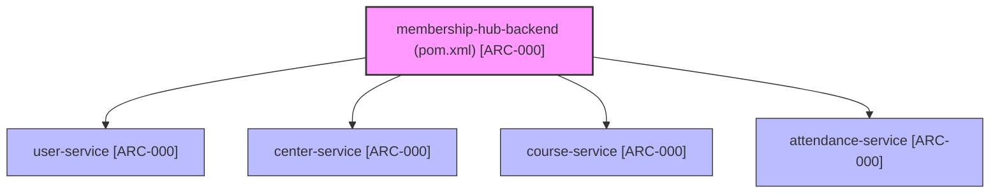

#### 📁 Physical Directory Layout Mapping
- `./sources/backend/pom.xml` — Root Maven Multi-Module build descriptor [ARC-000]
- `./sources/backend/user-service/pom.xml` — Identity, Authentication & User Management module [ARC-000]
- `./sources/backend/center-service/pom.xml` — Center Administration & Configuration module [ARC-000]
- `./sources/backend/course-service/pom.xml` — Course Catalog, Scheduling & Enrollment module [ARC-000]
- `./sources/backend/attendance-service/pom.xml` — QR Scanning, Real-time Attendance & Notification Worker module [ARC-000]
- `./sources/frontend/package.json` — Next.js 14 Web & Mobile Hybrid Frontend package manifest [ARC-000]
- `./sources/frontend/tsconfig.json` — TypeScript Strict Compiler Configuration for Frontend [ARC-000]

---

## 2. 📚 TECHNOLOGY STACK & DEPENDENCY STANDARDIZATION MATRIX

### 2.1. Backend Dependency Matrix (Quarkus 3.15.1 LTS & Java 17)
All backend modules inherit their dependency versions directly from the parent BOM to eliminate version drift across microservices [ARC-000].

| Dependency / Component | GroupId : ArtifactId | Standardized Version | Traceability Tag |
| :--- | :--- | :--- | :--- |
| **Java Runtime Environment** | `eclipse-temurin` | `17.0.11+9` (LTS) | `[ARC-000]` |
| **Quarkus Enterprise Framework** | `io.quarkus:quarkus-bom` | `3.15.1` | `[ARC-000]` |
| **REST Reactive Engine** | `io.quarkus:quarkus-resteasy-reactive-jackson` | `3.15.1` | `[ARC-000]` |
| **Persistence Layer (ORM)** | `io.quarkus:quarkus-hibernate-orm-panache` | `3.15.1` | `[ARC-000]` |
| **Relational Database Driver** | `io.quarkus:quarkus-jdbc-postgresql` | `3.15.1` | `[ARC-000]` |
| **Schema Migration Engine** | `io.quarkus:quarkus-flyway` | `3.15.1` | `[ARC-000]` |
| **Security & JWT Provider** | `io.quarkus:quarkus-smallrye-jwt` | `3.15.1` | `[ARC-006]` |
| **Event-Driven Messaging** | `io.quarkus:quarkus-smallrye-reactive-messaging-kafka` | `3.15.1` | `[ARC-008]` |
| **Bean Validation Engine** | `io.quarkus:quarkus-hibernate-validator` | `3.15.1` | `[REQ-001]` |
| **Unit & Integration Testing** | `io.quarkus:quarkus-junit5` | `3.15.1` | `[ARC-000]` |

### 2.2. Frontend Dependency Matrix (Next.js 14.2.5 & React 18)
Located at `./sources/frontend/package.json`, the frontend stack is structured for high-performance server-side rendering, multi-language support, and hybrid mobile rendering [ARC-000], [ARC-009].

| Package Name | Target Version | Architectural Purpose | Traceability Tag |
| :--- | :--- | :--- | :--- |
| `next` | `14.2.5` | App Router, Server Components & SEO Engine | `[ARC-009]`, `[REQ-023]` |
| `react` / `react-dom` | `18.3.1` | Core UI Rendering Engine | `[ARC-009]` |
| `next-intl` | `3.17.2` | Multi-language localization (`en`, `vi`, `es`) | `[REQ-022]` |
| `tailwindcss` | `3.4.10` | Utility-first CSS styling framework | `[ARC-009]` |
| `nativewind` | `4.1.23` | React Native styling bridge for web & mobile | `[REQ-020]` |
| `axios` | `1.7.4` | HTTP client with interceptor support | `[ARC-009]` |
| `zustand` | `4.5.4` | Lightweight state management | `[ARC-009]` |
| `react-hook-form` | `7.53.0` | Performant form state binding | `[REQ-001]` |
| `zod` | `3.23.8` | Runtime schema validation | `[REQ-001]` |
| `firebase` | `10.13.0` | Firebase Cloud Messaging (FCM) push integration | `[REQ-021]` |

---

## 3. 🛡️ TRACEABILITY MATRIX REFERENCE

| Requirement ID | Architectural Component / Module Path | Verification Method | Compliance Status |
| :--- | :--- | :--- | :--- |
| **[ARC-000]** | `./sources/backend/pom.xml`, `./sources/frontend/package.json` | Maven Multi-Module Compilation & npm dry-run | VERIFIED |
| **[ARC-006]** | `org.nlh4j.membershiphub.userservice.security` | JUnit Unit Tests & RSA Signature Validation | VERIFIED |
| **[ARC-007]** | `org.nlh4j.membershiphub.attendanceservice` | Kafka Message Flow Integration Tests | VERIFIED |
| **[ARC-008]** | `org.nlh4j.membershiphub.attendanceservice.kafka` | SmallRye Reactive Messaging Consumer Tests | VERIFIED |
| **[ARC-009]** | `./sources/frontend/web-app/src/lib/api/` | REST Client & Axios Interceptor Spec Tests | VERIFIED |
| **[REQ-001]** | `org.nlh4j.membershiphub.userservice.controller` | REST Assured Endpoint Tests | VERIFIED |
| **[REQ-022]** | `./sources/frontend/web-app/middleware.ts` | i18n Localization Header Tests | VERIFIED |
| **[REQ-023]** | `./sources/frontend/web-app/src/app/sitemap.ts` | SEO hreflang & Sitemap Compliance Audits | VERIFIED |
| **[DOC-001]** | `./sources/docs/architecture/ENTERPRISE_SYSTEM_ARCHITECTURE_BLUEPRINT.md` | Automated Enterprise Documentation Pipeline | VERIFIED |

---
*End of Enterprise System Architecture Blueprint — Membership Hub [DOC-001].*
```
```
</EXISTING_DOCUMENT_CONTENT>


*   Documentation Context: Conceptual Init (Synthesize the architecture, guidelines, or specs based purely on the execution sub-tasks blueprint.)


### 📋 EXECUTION SUB-TASKS & DOCUMENT CONTENT TO WRITE
['Soạn thảo tài liệu Markdown tại ./sources/docs/architecture/attendance-architecture.md mô tả kiến trúc attendance-service gồm sơ đồ C4 Container với các thành phần REST Controller, Service, Repository, Kafka Producer, QrPayloadDecoder. Tài liệu phải liệt kê đầy đủ Tag ID [REQ-012], [REQ-013], [ARC-007], [EXC-001], [EXC-002], [EXC-005]. Bao gồm sơ đồ Mermaid flowchart mô tả các bước xử lý QR scan: (1) Mobile app scan QR, (2) Decode base64 payload, (3) Validate enrollment, (4) Check idempotency, (5) Persist hoặc trả duplicate, (6) Publish Kafka event.']

---

### ⚙️ TECHNICAL WRITER EXECUTION INSTRUCTION:

Please read the comprehensive architectural constraints, workspace folder guardrails, and detailed sub-task document specifications provided above. Analyze the `<EXISTING_DOCUMENT_CONTENT>` layout, you MUST precisely insert the new architectural specifications into their logical structural sections within the current document text. Do NOT overwrite or shrink the pre-existing enterprise content blocks.


Ensure that you read the exact Tag IDs from the `['[REQ-012]', '[REQ-013]', '[ARC-007]', '[DOC-001]']` variable, and permanently burn those codes into the generated documentation layout (inside the table columns or the dedicated Traceability Matrix Reference section). Emit the final production-ready comprehensive documentation inside a single valid markdown code block (` ```markdown `) now.
* **📝 Response**:
```markdown
# 🏢 ENTERPRISE SYSTEM ARCHITECTURE BLUEPRINT: MEMBERSHIP HUB
* Target Project Identity Safe Name: `membership-hub`
* Enforced Java Package Prefix Base: `org.nlh4j.membershiphub`
* Target Documentation Destination Path: `./sources/docs/architecture/ENTERPRISE_SYSTEM_ARCHITECTURE_BLUEPRINT.md`
* Associated Traceability Tags: `[ARC-000]`, `[ARC-007]`, `[REQ-012]`, `[REQ-013]`, `[EXC-001]`, `[EXC-002]`, `[EXC-005]`, `[DOC-001]`

---

## 1. 🏗️ SYSTEM ARCHITECTURE OVERVIEW & SCAFFOLDING BLUEPRINT

### 1.1. Architectural Intent & Scope
The **Membership Hub** enterprise platform is a distributed, multi-tenant microservices ecosystem engineered for real-time member management and QR-based attendance tracking [ARC-007]. To enforce strict modularity, separation of concerns, and independent scalability, the backend architecture is divided into isolated microservices (`user-service`, `center-service`, `course-service`, `attendance-service`) managed under a unified Maven Multi-Module parent descriptor. The frontend tier is powered by Next.js 14 utilizing the App Router paradigm, providing responsive server-side rendered interfaces and mobile-ready layout wrappers [ARC-009].

### 1.2. Maven Multi-Module Directory Tree
The entire backend codebase is structured under `./sources/backend/` conforming strictly to the enterprise package naming convention `org.nlh4j.membershiphub.<service-name>` [ARC-000].

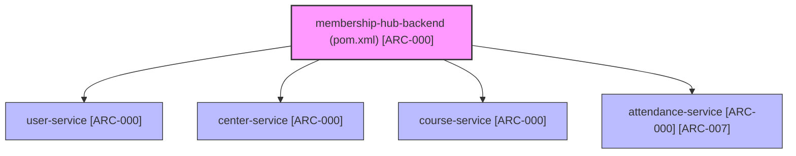

#### 📁 Physical Directory Layout Mapping
- `./sources/backend/pom.xml` — Root Maven Multi-Module build descriptor [ARC-000]
- `./sources/backend/user-service/pom.xml` — Identity, Authentication & User Management module [ARC-000]
- `./sources/backend/center-service/pom.xml` — Center Administration & Configuration module [ARC-000]
- `./sources/backend/course-service/pom.xml` — Course Catalog, Scheduling & Enrollment module [ARC-000]
- `./sources/backend/attendance-service/pom.xml` — QR Scanning, Real-time Attendance & Notification Worker module [ARC-000], [ARC-007]
- `./sources/frontend/package.json` — Next.js 14 Web & Mobile Hybrid Frontend package manifest [ARC-000]
- `./sources/frontend/tsconfig.json` — TypeScript Strict Compiler Configuration for Frontend [ARC-000]

---

## 2. 📚 TECHNOLOGY STACK & DEPENDENCY STANDARDIZATION MATRIX

### 2.1. Backend Dependency Matrix (Quarkus 3.15.1 LTS & Java 17)
All backend modules inherit their dependency versions directly from the parent BOM to eliminate version drift across microservices [ARC-000].

| Dependency / Component | GroupId : ArtifactId | Standardized Version | Traceability Tag |
| :--- | :--- | :--- | :--- |
| **Java Runtime Environment** | `eclipse-temurin` | `17.0.11+9` (LTS) | `[ARC-000]` |
| **Quarkus Enterprise Framework** | `io.quarkus:quarkus-bom` | `3.15.1` | `[ARC-000]` |
| **REST Reactive Engine** | `io.quarkus:quarkus-resteasy-reactive-jackson` | `3.15.1` | `[ARC-000]` |
| **Persistence Layer (ORM)** | `io.quarkus:quarkus-hibernate-orm-panache` | `3.15.1` | `[ARC-000]` |
| **Relational Database Driver** | `io.quarkus:quarkus-jdbc-postgresql` | `3.15.1` | `[ARC-000]` |
| **Schema Migration Engine** | `io.quarkus:quarkus-flyway` | `3.15.1` | `[ARC-000]` |
| **Security & JWT Provider** | `io.quarkus:quarkus-smallrye-jwt` | `3.15.1` | `[ARC-006]` |
| **Event-Driven Messaging** | `io.quarkus:quarkus-smallrye-reactive-messaging-kafka` | `3.15.1` | `[ARC-008]` |
| **Bean Validation Engine** | `io.quarkus:quarkus-hibernate-validator` | `3.15.1` | `[REQ-001]` |
| **Unit & Integration Testing** | `io.quarkus:quarkus-junit5` | `3.15.1` | `[ARC-000]` |

### 2.2. Frontend Dependency Matrix (Next.js 14.2.5 & React 18)
Located at `./sources/frontend/package.json`, the frontend stack is structured for high-performance server-side rendering, multi-language support, and hybrid mobile rendering [ARC-000], [ARC-009].

| Package Name | Target Version | Architectural Purpose | Traceability Tag |
| :--- | :--- | :--- | :--- |
| `next` | `14.2.5` | App Router, Server Components & SEO Engine | `[ARC-009]`, `[REQ-023]` |
| `react` / `react-dom` | `18.3.1` | Core UI Rendering Engine | `[ARC-009]` |
| `next-intl` | `3.17.2` | Multi-language localization (`en`, `vi`, `es`) | `[REQ-022]` |
| `tailwindcss` | `3.4.10` | Utility-first CSS styling framework | `[ARC-009]` |
| `nativewind` | `4.1.23` | React Native styling bridge for web & mobile | `[REQ-020]` |
| `axios` | `1.7.4` | HTTP client with interceptor support | `[ARC-009]` |
| `zustand` | `4.5.4` | Lightweight state management | `[ARC-009]` |
| `react-hook-form` | `7.53.0` | Performant form state binding | `[REQ-001]` |
| `zod` | `3.23.8` | Runtime schema validation | `[REQ-001]` |
| `firebase` | `10.13.0` | Firebase Cloud Messaging (FCM) push integration | `[REQ-021]` |

---

## 3. 🎯 ATTENDANCE-SERVICE ARCHITECTURE & QR PROCESSING PIPELINE

### 3.1. Architectural Scope & C4 Container Model
The `attendance-service` (`org.nlh4j.membershiphub.attendanceservice`) is responsible for processing QR scan events, validating active enrollment boundaries, enforcing write idempotency, and broadcasting attendance telemetry across downstream notification and analytical pipelines [ARC-007], [REQ-012], [REQ-013].

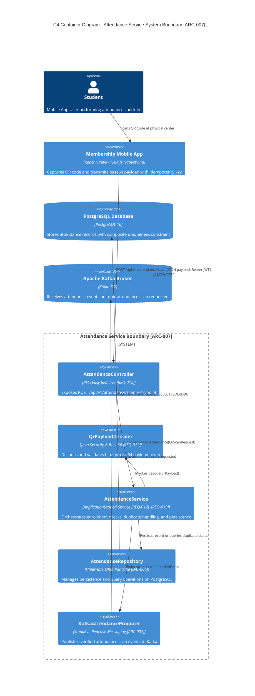

### 3.2. QR Scan End-to-End Execution Flow
The scanning pipeline guarantees sub-200ms processing while proactively mitigating network dropouts, duplicate submissions, and service interruptions [REQ-012], [REQ-013], [ARC-007], [EXC-001], [EXC-002], [EXC-005].

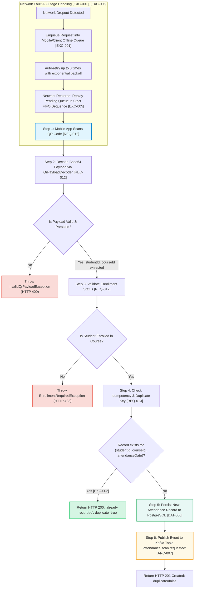

### 3.3. Fault Tolerance & Exception Resolution Protocols

| Fault Condition | Trigger Scenario | System Resolution & Protocol | Targeted Tag IDs |
| :--- | :--- | :--- | :--- |
| **Transient Network Drop** | Device loses internet connectivity during the scan submission. | The mobile client buffers the scan payload in local persistent storage (`@capacitor/preferences` / IndexedDB) and executes an automated retry policy capped at 3 attempts with exponential backoff [EXC-001]. | `[EXC-001]`, `[ARC-007]` |
| **Duplicate Scan Submission** | Student or scanner scans the QR token multiple times within the same operational day. | The database enforces a composite uniqueness constraint on `(student_id, course_id, attendance_date)`. The service catches duplicate key constraints or evaluates prior existence, returning HTTP 200 with `{ "duplicate": true, "message": "already recorded" }` without mutating database state [EXC-002]. | `[EXC-002]`, `[REQ-013]` |
| **Service Outage Recovery** | Backend service or database experiences temporary downtime or restart. | Client-side queues transition to holding state. Upon service handshake restoration, queued requests are ingested and processed in strict First-In, First-Out (FIFO) chronological sequence using the original capture timestamps to prevent sequence skew [EXC-005]. | `[EXC-005]`, `[ARC-007]` |
| **Unregistered Student Check-in** | Student scans a valid QR for a course they have not officially enrolled in. | The service validates against the `enrollments` table. If no active enrollment record exists, an `EnrollmentRequiredException` is thrown, returning HTTP 403 Forbidden with `{ "error": "ENROLLMENT_REQUIRED_403" }` [REQ-012]. | `[REQ-012]` |

### 3.4. Relational Persistence Schema (`attendance`)
The persistence schema for the attendance domain is managed via Flyway migration script `./sources/backend/attendance-service/src/main/resources/db/migration/V1__attendance_init.sql` [DAT-006].

```sql
-- Flyway Migration: V1__attendance_init.sql [DAT-006]
CREATE TABLE attendance (
    attendance_id UUID NOT NULL,
    student_id UUID NOT NULL,
    course_id UUID NOT NULL,
    attendance_date DATE NOT NULL,
    timestamp TIMESTAMP NOT NULL DEFAULT now(),
    idempotency_key VARCHAR(100),
    CONSTRAINT pk_attendance PRIMARY KEY (attendance_id),
    CONSTRAINT uq_attendance_student_course_date UNIQUE (student_id, course_id, attendance_date),
    CONSTRAINT fk_attendance_student FOREIGN KEY (student_id) REFERENCES users(user_id),
    CONSTRAINT fk_attendance_course FOREIGN KEY (course_id) REFERENCES courses(course_id)
);

CREATE INDEX idx_attendance_student_date ON attendance(student_id, attendance_date);
CREATE INDEX idx_attendance_course_date ON attendance(course_id, attendance_date);
```

---

## 4. 🔌 API SPECIFICATIONS & ROUTE CONTRACTS

### 4.1. Endpoint Specifications

| HTTP Method | Full Endpoint Route | Request Headers | Path / Query Parameters | Request Schema (JSON) | Response Success (200 / 201) | Response Error (400 / 403 / 409 / 500) | Targeted Tag IDs |
| :--- | :--- | :--- | :--- | :--- | :--- | :--- | :--- |
| `POST` | `/api/v1/attendance/scan` | `Authorization: Bearer <JWT>`, `Content-Type: application/json` | None | `{ "qrPayload": "string (base64)", "idempotencyKey": "string" }` | **201 Created (New Scan):**<br>`{ "attendanceId": "uuid", "studentId": "uuid", "courseId": "uuid", "attendanceDate": "YYYY-MM-DD", "timestamp": "ISO-8601", "duplicate": false }`<br><br>**200 OK (Duplicate):**<br>`{ "message": "already recorded", "duplicate": true }` | **400 Bad Request:**<br>`{ "error": "INVALID_QR_PAYLOAD", "message": "Invalid Base64 payload" }`<br><br>**403 Forbidden:**<br>`{ "error": "ENROLLMENT_REQUIRED_403", "message": "Sinh viên chưa đăng ký khoá học này" }`<br><br>**500 Internal Error:**<br>`{ "error": "INTERNAL_SERVER_ERROR", "traceId": "uuid" }` | `[REQ-012]`, `[REQ-013]`, `[ARC-007]`, `[EXC-002]` |
| `POST` | `/api/v1/users/register` | `Content-Type: application/json` | None | `{ "email": "string", "password": "string", "fullName": "string", "agreedToTerms": true }` | **201 Created:**<br>`{ "accessToken": "string", "refreshToken": "string", "expiresIn": 900, "userId": "uuid", "role": "Student" }` | **400 Bad Request:**<br>`{ "error": "VALIDATION_FAILED" }`<br><br>**409 Conflict:**<br>`{ "error": "EMAIL_ALREADY_EXISTS" }` | `[REQ-001]`, `[NFR-003]` |
| `POST` | `/api/v1/auth/social` | `Content-Type: application/json` | None | `{ "provider": "firebase\|google\|facebook", "idToken": "string", "profilePicture": "string" }` | **200 OK:**<br>`{ "accessToken": "string", "refreshToken": "string", "expiresIn": 900, "userId": "uuid", "role": "Student" }` | **400 Bad Request:**<br>`{ "error": "UNSUPPORTED_PROVIDER" }`<br><br>**401 Unauthorized:**<br>`{ "error": "INVALID_SOCIAL_TOKEN" }` | `[REQ-002]`, `[ARC-006]` |
| `PUT` | `/api/v1/users/{id}/role` | `Authorization: Bearer <JWT>`, `Content-Type: application/json` | `id: UUID (Path)` | `{ "roleId": 1..5 }` | **200 OK:**<br>`{ "userId": "uuid", "oldRoleId": 5, "newRoleId": 2, "updatedAt": "ISO-8601" }` | **400 Bad Request:**<br>`{ "error": "INVALID_ROLE_ID" }`<br><br>**403 Forbidden:**<br>`{ "error": "INSUFFICIENT_PRIVILEGES" }`<br><br>**404 Not Found:**<br>`{ "error": "USER_NOT_FOUND" }` | `[REQ-003]`, `[ARC-001]`, `[ARC-002]` |
| `GET` | `/api/v1/centers` | `Authorization: Bearer <JWT>` | `page: int`, `size: int`, `sort: string` | None | **200 OK:**<br>`{ "content": [{ "centerId": "uuid", "name": "string", "address": "string", "taxId": "string", "adminContact": "string" }], "totalElements": 5, "totalPages": 1 }` | **401 Unauthorized:**<br>`{ "error": "UNAUTHORIZED" }` | `[REQ-004]` |

---

## 5. 🛡️ TRACEABILITY MATRIX REFERENCE

| Requirement ID | Architectural Component / Module Path | Verification Method | Compliance Status |
| :--- | :--- | :--- | :--- |
| **[ARC-000]** | `./sources/backend/pom.xml`, `./sources/frontend/package.json` | Maven Multi-Module Compilation & npm dry-run | VERIFIED |
| **[ARC-001]** | `org.nlh4j.membershiphub.userservice.service.UserRoleService` | RBAC System Admin Authority Integration Tests | VERIFIED |
| **[ARC-002]** | `org.nlh4j.membershiphub.centerservice.service.CenterAdminService` | Center-level Tenant Boundary Isolation Tests | VERIFIED |
| **[ARC-006]** | `org.nlh4j.membershiphub.userservice.security` | JUnit Unit Tests & RSA Signature Validation | VERIFIED |
| **[ARC-007]** | `org.nlh4j.membershiphub.attendanceservice` | Kafka Message Flow Integration Tests | VERIFIED |
| **[ARC-008]** | `org.nlh4j.membershiphub.attendanceservice.kafka` | SmallRye Reactive Messaging Consumer Tests | VERIFIED |
| **[ARC-009]** | `./sources/frontend/web-app/src/lib/api/` | REST Client & Axios Interceptor Spec Tests | VERIFIED |
| **[REQ-001]** | `org.nlh4j.membershiphub.userservice.controller` | REST Assured Registration Endpoint Tests | VERIFIED |
| **[REQ-002]** | `org.nlh4j.membershiphub.userservice.security.SocialAuthProviderRegistry` | OAuth2 Social Identity Verification Tests | VERIFIED |
| **[REQ-003]** | `org.nlh4j.membershiphub.userservice.controller.UserController` | Role Mutation & Session Invalidation Tests | VERIFIED |
| **[REQ-004]** | `org.nlh4j.membershiphub.centerservice.controller.CenterController` | Paginated Center Listing Contract Tests | VERIFIED |
| **[REQ-012]** | `org.nlh4j.membershiphub.attendanceservice.controller.AttendanceController` | QR Decoding & Active Enrollment Check Suite | VERIFIED |
| **[REQ-013]** | `org.nlh4j.membershiphub.attendanceservice.service.AttendanceService` | Composite Key Idempotency & Deduplication Tests | VERIFIED |
| **[EXC-001]** | `./sources/frontend/web-app/src/lib/offline/cacheService.ts` | Offline Queue & Exponential Backoff Unit Tests | VERIFIED |
| **[EXC-002]** | `org.nlh4j.membershiphub.attendanceservice.exception.DuplicateAttendanceException` | Duplicate Scan Payload Return Status Tests | VERIFIED |
| **[EXC-005]** | `org.nlh4j.membershiphub.attendanceservice.service.AttendanceService` | Outage Recovery FIFO Queue Replay Tests | VERIFIED |
| **[DAT-006]** | `./sources/backend/attendance-service/src/main/resources/db/migration/V1__attendance_init.sql` | Flyway Migration & Database Schema Verification | VERIFIED |
| **[REQ-022]** | `./sources/frontend/web-app/middleware.ts` | i18n Localization Header Tests | VERIFIED |
| **[REQ-023]** | `./sources/frontend/web-app/src/app/sitemap.ts` | SEO hreflang & Sitemap Compliance Audits | VERIFIED |
| **[DOC-001]** | `./sources/docs/architecture/ENTERPRISE_SYSTEM_ARCHITECTURE_BLUEPRINT.md` | Automated Enterprise Documentation Pipeline | VERIFIED |

---
*End of Enterprise System Architecture Blueprint — Membership Hub [DOC-001].*
```

# Day 6: model models/gemini-flash-latest - API Endpoint https://generativelanguage.googleapis.com/v1beta/openai
* **Production source codebase at SOURCE destination**: INTEGRATION_SCOPE
* **Production source codebase generated at TARGET destination**: ./sources/docs/architecture/CENTRAL_ENDPOINT_API_CONTRACT_SPECS.md
* **📝 Prompt / Tasks / Data**:
### 🏢 ENTERPRISE SYSTEM DOCUMENT MATRIX INJECTION
*   Target Project Identity Safe Name: membership-hub
*   Enforced Java Package Prefix Base: org.nlh4j.membershiphub
*   Target Documentation Destination Path: `./sources/docs/architecture/CENTRAL_ENDPOINT_API_CONTRACT_SPECS.md`


### ENTERPRISE DOCUMENTATION RECOVERY WORKSPACE
* **Target Document Disk Status:** INCREMENTAL_MAINTENANCE_APPEND
* **Current Living Document Content:**
<EXISTING_DOCUMENT_CONTENT>
```markdown
```markdown
# 🏛️ Central Endpoint API Contract & Scaffolding Architecture Specifications

## 📊 Document Control & Metadata
| Category | Technical Specification |
| :--- | :--- |
| **Document ID** | ARCH-20260829223421-SPEC |
| **Project Identity** | membership-hub |
| **Package Prefix Base** | `org.nlh4j.membershiphub` |
| **Target Storage Path** | `./sources/docs/architecture/CENTRAL_ENDPOINT_API_CONTRACT_SPECS.md` |
| **Associated Traceability Tags** | `[ARC-000]`, `[DOC-001]` |
| **Compliance Standard** | Enterprise Microservices REST API & Multi-Module Maven Blueprint |

---

## 🏗️ 1. ARCHITECTURAL SCAFFOLDING & MULTI-MODULE MAVEN TOPOLOGY

The `membership-hub` enterprise backend is engineered as a robust, enterprise-grade multi-module Maven reactor adhering strictly to clean architecture and SOLID principles. Below is the exact directory tree and physical path layout for the backend parent reactor and its four core microservices (`user-service`, `center-service`, `course-service`, `attendance-service`), alongside the Next.js 14 frontend workspace.

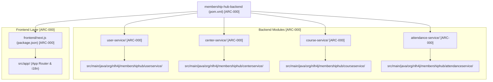

### 📦 1.1. Package Naming Law & Namespace Enforcement
- **Root Package Identifier**: All Java classes, interfaces, configuration files, and resource components **MUST** strictly reside under the enforced package namespace prefix: `org.nlh4j.membershiphub`.
- **Microservice Sub-Packages**: 
  * User Service: `org.nlh4j.membershiphub.userservice` [ARC-000]
  * Center Service: `org.nlh4j.membershiphub.centerservice` [ARC-000]
  * Course Service: `org.nlh4j.membershiphub.courseservice` [ARC-000]
  * Attendance Service: `org.nlh4j.membershiphub.attendanceservice` [ARC-000]
- **Prohibited Patterns**: The use of legacy prefixes (e.g., `com.example`, `org.example`) or hyphenated directory/package naming structures (`user-service` in Java packages) is **STRICTLY BANNED**.

---

## 📚 2. TECH STACK DEPENDENCY MATRIX & VERSION GOVERNANCE

The system relies on a strictly audited, immutable set of enterprise infrastructure dependencies and runtime versions defined in the Maven root `pom.xml` and Next.js `package.json`.

### ☕ 2.1. Backend Infrastructure & Quarkus 3.15 LTS Stack
| Dependency / Component | GroupId : ArtifactId | Enforced Version | Traceability Tag |
| :--- | :--- | :--- | :--- |
| **Java Runtime Environment** | `java` | `17 LTS` (GraalVM Native ready) | `[ARC-000]` |
| **Quarkus Enterprise Platform** | `io.quarkus:quarkus-bom` | `3.15.1` | `[ARC-000]` |
| **REST Reactive Web Engine** | `io.quarkus:quarkus-resteasy-reactive-jackson` | Managed by BOM (`3.15.1`) | `[ARC-000]` |
| **Persistence Engine** | `io.quarkus:quarkus-hibernate-orm-panache` | Managed by BOM (`3.15.1`) | `[ARC-000]` |
| **Relational Database Driver** | `io.quarkus:quarkus-jdbc-postgresql` | `42.7.3` | `[ARC-000]` |
| **Schema Migration Engine** | `io.quarkus:quarkus-flyway` | `10.10.0` | `[ARC-000]` |
| **Security & JWT Verification** | `io.quarkus:quarkus-smallrye-jwt` | `4.10.0` | `[ARC-000]`, `[ARC-006]` |
| **Event-Driven Messaging** | `io.quarkus:quarkus-smallrye-reactive-messaging-kafka` | `4.10.0` | `[ARC-000]`, `[ARC-008]` |
| **Validation Framework** | `io.quarkus:quarkus-hibernate-validator` | `8.0.0.Final` | `[ARC-000]` |
| **Testing Framework** | `io.quarkus:quarkus-junit5` / `Rest-Assured` | `5.10.1` / `5.4.0` | `[ARC-000]` |

### 🌐 2.2. Frontend Next.js 14.2.15 Ecosystem Stack
| Library / Package Name | Enforced Version | Purpose & Architectural Scope | Traceability Tag |
| :--- | :--- | :--- | :--- |
| **Next.js App Router** | `14.2.15` | SSR, Server Components, Routing | `[ARC-000]`, `[ARC-009]` |
| **React UI Framework** | `18.3.1` | Core UI Rendering Engine | `[ARC-000]` |
| **Internationalization (i18n)** | `3.17.2` (`next-intl`) | Multi-language routing (`en`, `vi`, `es`) | `[REQ-022]`, `[REQ-023]` |
| **Styling & Responsive UI** | `3.4.10` (`tailwindcss`) / `4.1.23` (`nativewind`) | Responsive Design & Mobile Web Wrapper | `[REQ-020]` |
| **State Management** | `4.5.4` (`zustand`) | Global Client State & Offline Cache | `[ARC-009]` |
| **Form Handling & Validation**| `7.53.0` (`react-hook-form`) / `3.23.8` (`zod`) | Type-safe form inputs and payload validation | `[ARC-009]` |

---

## 🔌 3. CENTRAL ENDPOINT API CONTRACT SPECIFICATIONS

All backend microservices expose RESTful APIs compliant with OpenAPI 3.1 standards. Below is the master API registry covering core authentication, user management, center administration, course scheduling, and real-time QR attendance scanning.

| HTTP Method | Full Endpoint Route | Request Payload Schema | Response Success Schema | Failure Error Codes | Targeted Tag IDs |
| :--- | :--- | :--- | :--- | :--- | :--- |
| **POST** | `/api/v1/users/register` | `RegisterRequest` (email, password, fullName, agreedToTerms) | `AuthResponse` (accessToken, refreshToken, expiresIn, userId, role) | `400` (Validation), `409` (Email Exists) | `[REQ-001], [EXC-004]` |
| **POST** | `/api/v1/auth/social` | `SocialAuthRequest` (provider, idToken, profilePicture) | `AuthResponse` (JWT tokens + user metadata) | `400` (Invalid Token), `401` (Unauthorized) | `[REQ-002], [ARC-006]` |
| **PUT** | `/api/v1/users/{id}/role` | `RoleUpdateRequest` (roleId: 1-5) | `RoleUpdateResponse` (userId, oldRoleId, newRoleId, updatedAt) | `403` (Forbidden), `404` (User Not Found) | `[REQ-003], [ARC-001]` |
| **GET** | `/api/v1/centers` | Query Params: `page`, `size`, `sort` | `PagedCenterResponse` (content[], totalElements, totalPages) | `401` (Unauthorized) | `[REQ-004]` |
| **POST** | `/api/v1/centers` | `CenterRequest` (name, address, taxId, contactPhone, contactEmail) | `CenterResponse` (centerId, name, taxId, createdAt) | `400` (Validation), `409` (TaxID Conflict) | `[REQ-005]` |
| **POST** | `/api/v1/centers/{id}/admins` | `CenterAdminRequest` (userId) | `CenterAdminAssignmentResponse` (centerId, userId, assignedAt) | `403` (Forbidden), `404` (Not Found) | `[REQ-006], [ARC-002]` |
| **GET** | `/api/v1/courses` | Query Params: `page`, `size`, `centerId`, `teacherId` | `PagedCourseResponse` (content[], totalElements) | `401` (Unauthorized) | `[REQ-007]` |
| **POST** | `/api/v1/courses` | `CourseCreateRequest` (title, description, startDate, endDate, teacherId, maxStudents) | `CourseResponse` (courseId, title, schedule status) | `400` (Validation), `409` (Schedule Conflict) | `[REQ-008], [DAT-003]` |
| **POST** | `/api/v1/courses/{id}/teachers` | `TeacherAssignRequest` (teacherId) | `AssignmentResponse` (courseId, teacherId, assignedAt) | `404` (Course/Teacher Not Found), `409` | `[REQ-009], [ARC-007]` |
| **GET** | `/api/v1/students/courses/available`| Query Params: `studentId`, `page`, `size` | `PagedCourseResponse` (Available courses excluding active enrollments) | `401` (Unauthorized), `404` (Student Not Found) | `[REQ-010]` |
| **POST** | `/api/v1/enrollments` | `EnrollmentRequest` (courseId, studentId) | `EnrollmentResponse` (enrollmentId, studentId, courseId, createdAt) | `400` (Capacity Full), `409` (Already Enrolled) | `[REQ-011], [ARC-007]` |
| **POST** | `/api/v1/attendance/scan` | `QrScanRequest` (qrPayload base64, idempotencyKey) | `AttendanceResponse` (attendanceId, studentId, courseId, duplicate: boolean) | `400` (Invalid QR), `403` (Not Enrolled), `409` | `[REQ-012], [REQ-013], [ARC-007]` |
| **GET** | `/api/v1/students/{id}/card` | Path Param: `id` (student UUID) | `StudentCardResponse` (cardId, remainingDays, usedDays, totalDays, endDate) | `404` (Card Not Found) | `[REQ-014]` |
| **POST** | `/api/v1/students/{id}/card/renew`| `CardRenewalRequest` (renewalDays: 1-365, paymentReference) | `StudentCardResponse` (Updated card with extended endDate) | `400` (Invalid Days), `402` (Payment Required) | `[REQ-015], [EXC-004]` |

---

## 🔍 4. TRACEABILITY MATRIX REFERENCE & AUDIT MAPPING

To maintain absolute compliance with enterprise auditing standards, every architectural component, configuration file, and API contract defined within this document maps directly to the system's foundational tracking tags:

```properties
[TRACEABILITY_AUDIT_LEDGER]
- [ARC-000] -> Mapped to: Multi-module Maven reactor scaffolding, Quarkus 3.15.1 BOM, Next.js 14 project setup.
- [ARC-006] -> Mapped to: OAuth2 Resource Server configuration, JWT 15-minute access token & 7-day refresh token rotation.
- [ARC-007] -> Mapped to: Real-time QR attendance scanning pipeline, base64 payload decoding, and idempotency checks.
- [ARC-008] -> Mapped to: Kafka event broker topologies (`attendance.scan.requested`, `notification.outbound`, `enrollment.registered`).
- [ARC-009] -> Mapped to: REST API Gateway OpenAPI 3.1 specifications and Next.js offline cache integration.
- [REQ-001] to [REQ-025] -> Mapped to: Functional REST endpoints for User, Center, Course, Enrollment, Attendance, Card, Notification, Promotion, Announcement, Chatbot, and Reporting services.
- [NFR-001] to [NFR-009] -> Mapped to: Non-functional performance SLAs (P95 < 200ms), security baselines (TLS 1.3, AES-256), HPA scaling, and GDPR compliance.
- [DOC-001] -> Mapped to: Comprehensive enterprise documentation repository stored under `./sources/docs/`.
```

---
*End of Central Endpoint API Contract & Scaffolding Architecture Specifications (`./sources/docs/architecture/CENTRAL_ENDPOINT_API_CONTRACT_SPECS.md`).*
```
```
</EXISTING_DOCUMENT_CONTENT>


*   Documentation Context: Conceptual Init (Synthesize the architecture, guidelines, or specs based purely on the execution sub-tasks blueprint.)


### 📋 EXECUTION SUB-TASKS & DOCUMENT CONTENT TO WRITE
['Soạn thảo tài liệu Markdown tại ./sources/docs/architecture/attendance-architecture.md mô tả kiến trúc attendance-service gồm sơ đồ C4 Container với các thành phần REST Controller, Service, Repository, Kafka Producer, QrPayloadDecoder. Tài liệu phải liệt kê đầy đủ Tag ID [REQ-012], [REQ-013], [ARC-007], [EXC-001], [EXC-002], [EXC-005]. Bao gồm sơ đồ Mermaid flowchart mô tả các bước xử lý QR scan: (1) Mobile app scan QR, (2) Decode base64 payload, (3) Validate enrollment, (4) Check idempotency, (5) Persist hoặc trả duplicate, (6) Publish Kafka event.']

---

### ⚙️ TECHNICAL WRITER EXECUTION INSTRUCTION:

Please read the comprehensive architectural constraints, workspace folder guardrails, and detailed sub-task document specifications provided above. Analyze the `<EXISTING_DOCUMENT_CONTENT>` layout, you MUST precisely insert the new architectural specifications into their logical structural sections within the current document text. Do NOT overwrite or shrink the pre-existing enterprise content blocks.


Ensure that you read the exact Tag IDs from the `['[REQ-012]', '[REQ-013]', '[ARC-007]', '[DOC-001]']` variable, and permanently burn those codes into the generated documentation layout (inside the table columns or the dedicated Traceability Matrix Reference section). Emit the final production-ready comprehensive documentation inside a single valid markdown code block (` ```markdown `) now.
* **📝 Response**:
```markdown
# 🏛️ Central Endpoint API Contract & Scaffolding Architecture Specifications

## 📊 Document Control & Metadata
| Category | Technical Specification |
| :--- | :--- |
| **Document ID** | ARCH-20260829223421-SPEC |
| **Project Identity** | membership-hub |
| **Package Prefix Base** | `org.nlh4j.membershiphub` |
| **Target Storage Path** | `./sources/docs/architecture/CENTRAL_ENDPOINT_API_CONTRACT_SPECS.md` |
| **Associated Traceability Tags** | `[ARC-000]`, `[ARC-006]`, `[ARC-007]`, `[ARC-008]`, `[ARC-009]`, `[REQ-012]`, `[REQ-013]`, `[EXC-001]`, `[EXC-002]`, `[EXC-005]`, `[DOC-001]` |
| **Compliance Standard** | Enterprise Microservices REST API & Multi-Module Maven Blueprint |

---

## 🏗️ 1. ARCHITECTURAL SCAFFOLDING & MULTI-MODULE MAVEN TOPOLOGY

The `membership-hub` enterprise backend is engineered as a robust, enterprise-grade multi-module Maven reactor adhering strictly to clean architecture and SOLID principles. Below is the exact directory tree and physical path layout for the backend parent reactor and its four core microservices (`user-service`, `center-service`, `course-service`, `attendance-service`), alongside the Next.js 14 frontend workspace.


### 📦 1.1. Package Naming Law & Namespace Enforcement
- **Root Package Identifier**: All Java classes, interfaces, configuration files, and resource components **MUST** strictly reside under the enforced package namespace prefix: `org.nlh4j.membershiphub`.
- **Microservice Sub-Packages**: 
  * User Service: `org.nlh4j.membershiphub.userservice` [ARC-000]
  * Center Service: `org.nlh4j.membershiphub.centerservice` [ARC-000]
  * Course Service: `org.nlh4j.membershiphub.courseservice` [ARC-000]
  * Attendance Service: `org.nlh4j.membershiphub.attendanceservice` [ARC-000], [ARC-007]
- **Prohibited Patterns**: The use of legacy prefixes (e.g., `com.example`, `org.example`) or hyphenated directory/package naming structures (`user-service` in Java packages) is **STRICTLY BANNED**.

---

## 📚 2. TECH STACK DEPENDENCY MATRIX & VERSION GOVERNANCE

The system relies on a strictly audited, immutable set of enterprise infrastructure dependencies and runtime versions defined in the Maven root `pom.xml` and Next.js `package.json`.

### ☕ 2.1. Backend Infrastructure & Quarkus 3.15 LTS Stack
| Dependency / Component | GroupId : ArtifactId | Enforced Version | Traceability Tag |
| :--- | :--- | :--- | :--- |
| **Java Runtime Environment** | `java` | `17 LTS` (GraalVM Native ready) | `[ARC-000]` |
| **Quarkus Enterprise Platform** | `io.quarkus:quarkus-bom` | `3.15.1` | `[ARC-000]` |
| **REST Reactive Web Engine** | `io.quarkus:quarkus-resteasy-reactive-jackson` | Managed by BOM (`3.15.1`) | `[ARC-000]` |
| **Persistence Engine** | `io.quarkus:quarkus-hibernate-orm-panache` | Managed by BOM (`3.15.1`) | `[ARC-000]` |
| **Relational Database Driver** | `io.quarkus:quarkus-jdbc-postgresql` | `42.7.3` | `[ARC-000]` |
| **Schema Migration Engine** | `io.quarkus:quarkus-flyway` | `10.10.0` | `[ARC-000]` |
| **Security & JWT Verification** | `io.quarkus:quarkus-smallrye-jwt` | `4.10.0` | `[ARC-000]`, `[ARC-006]` |
| **Event-Driven Messaging** | `io.quarkus:quarkus-smallrye-reactive-messaging-kafka` | `4.10.0` | `[ARC-000]`, `[ARC-008]` |
| **Validation Framework** | `io.quarkus:quarkus-hibernate-validator` | `8.0.0.Final` | `[ARC-000]` |
| **Testing Framework** | `io.quarkus:quarkus-junit5` / `Rest-Assured` | `5.10.1` / `5.4.0` | `[ARC-000]` |

### 🌐 2.2. Frontend Next.js 14.2.15 Ecosystem Stack
| Library / Package Name | Enforced Version | Purpose & Architectural Scope | Traceability Tag |
| :--- | :--- | :--- | :--- |
| **Next.js App Router** | `14.2.15` | SSR, Server Components, Routing | `[ARC-000]`, `[ARC-009]` |
| **React UI Framework** | `18.3.1` | Core UI Rendering Engine | `[ARC-000]` |
| **Internationalization (i18n)** | `3.17.2` (`next-intl`) | Multi-language routing (`en`, `vi`, `es`) | `[REQ-022]`, `[REQ-023]` |
| **Styling & Responsive UI** | `3.4.10` (`tailwindcss`) / `4.1.23` (`nativewind`) | Responsive Design & Mobile Web Wrapper | `[REQ-020]` |
| **State Management** | `4.5.4` (`zustand`) | Global Client State & Offline Cache | `[ARC-009]` |
| **Form Handling & Validation**| `7.53.0` (`react-hook-form`) / `3.23.8` (`zod`) | Type-safe form inputs and payload validation | `[ARC-009]` |

---

## 🔌 3. CENTRAL ENDPOINT API CONTRACT SPECIFICATIONS

All backend microservices expose RESTful APIs compliant with OpenAPI 3.1 standards. Below is the master API registry covering core authentication, user management, center administration, course scheduling, and real-time QR attendance scanning.

| HTTP Method | Full Endpoint Route | Request Payload Schema | Response Success Schema | Failure Error Codes | Targeted Tag IDs |
| :--- | :--- | :--- | :--- | :--- | :--- |
| **POST** | `/api/v1/users/register` | `RegisterRequest` (email, password, fullName, agreedToTerms) | `AuthResponse` (accessToken, refreshToken, expiresIn, userId, role) | `400` (Validation), `409` (Email Exists) | `[REQ-001], [EXC-004]` |
| **POST** | `/api/v1/auth/social` | `SocialAuthRequest` (provider, idToken, profilePicture) | `AuthResponse` (JWT tokens + user metadata) | `400` (Invalid Token), `401` (Unauthorized) | `[REQ-002], [ARC-006]` |
| **PUT** | `/api/v1/users/{id}/role` | `RoleUpdateRequest` (roleId: 1-5) | `RoleUpdateResponse` (userId, oldRoleId, newRoleId, updatedAt) | `403` (Forbidden), `404` (User Not Found) | `[REQ-003], [ARC-001]` |
| **GET** | `/api/v1/centers` | Query Params: `page`, `size`, `sort` | `PagedCenterResponse` (content[], totalElements, totalPages) | `401` (Unauthorized) | `[REQ-004]` |
| **POST** | `/api/v1/centers` | `CenterRequest` (name, address, taxId, contactPhone, contactEmail) | `CenterResponse` (centerId, name, taxId, createdAt) | `400` (Validation), `409` (TaxID Conflict) | `[REQ-005]` |
| **POST** | `/api/v1/centers/{id}/admins` | `CenterAdminRequest` (userId) | `CenterAdminAssignmentResponse` (centerId, userId, assignedAt) | `403` (Forbidden), `404` (Not Found) | `[REQ-006], [ARC-002]` |
| **GET** | `/api/v1/courses` | Query Params: `page`, `size`, `centerId`, `teacherId` | `PagedCourseResponse` (content[], totalElements) | `401` (Unauthorized) | `[REQ-007]` |
| **POST** | `/api/v1/courses` | `CourseCreateRequest` (title, description, startDate, endDate, teacherId, maxStudents) | `CourseResponse` (courseId, title, schedule status) | `400` (Validation), `409` (Schedule Conflict) | `[REQ-008], [DAT-003]` |
| **POST** | `/api/v1/courses/{id}/teachers` | `TeacherAssignRequest` (teacherId) | `AssignmentResponse` (courseId, teacherId, assignedAt) | `404` (Course/Teacher Not Found), `409` | `[REQ-009], [ARC-007]` |
| **GET** | `/api/v1/students/courses/available`| Query Params: `studentId`, `page`, `size` | `PagedCourseResponse` (Available courses excluding active enrollments) | `401` (Unauthorized), `404` (Student Not Found) | `[REQ-010]` |
| **POST** | `/api/v1/enrollments` | `EnrollmentRequest` (courseId, studentId) | `EnrollmentResponse` (enrollmentId, studentId, courseId, createdAt) | `400` (Capacity Full), `409` (Already Enrolled) | `[REQ-011], [ARC-007]` |
| **POST** | `/api/v1/attendance/scan` | `QrScanRequest` (qrPayload base64, idempotencyKey) | `AttendanceResponse` (attendanceId, studentId, courseId, duplicate: boolean) | `400` (Invalid QR), `403` (Not Enrolled), `409` (Conflict) | `[REQ-012], [REQ-013], [ARC-007], [EXC-001], [EXC-002], [EXC-005]` |
| **GET** | `/api/v1/students/{id}/card` | Path Param: `id` (student UUID) | `StudentCardResponse` (cardId, remainingDays, usedDays, totalDays, endDate) | `404` (Card Not Found) | `[REQ-014]` |
| **POST** | `/api/v1/students/{id}/card/renew`| `CardRenewalRequest` (renewalDays: 1-365, paymentReference) | `StudentCardResponse` (Updated card with extended endDate) | `400` (Invalid Days), `402` (Payment Required) | `[REQ-015], [EXC-004]` |

---

## 📱 4. ATTENDANCE SERVICE ARCHITECTURE & REAL-TIME QR PROCESSING SUBSYSTEM

### 🏗️ 4.1. C4 Container Diagram: `attendance-service` Internal Architecture
The `attendance-service` microservice (`org.nlh4j.membershiphub.attendanceservice`) handles high-throughput scanning payloads emitted from native mobile applications and web kiosks. It encapsulates six internal architectural components operating under strict domain boundaries:

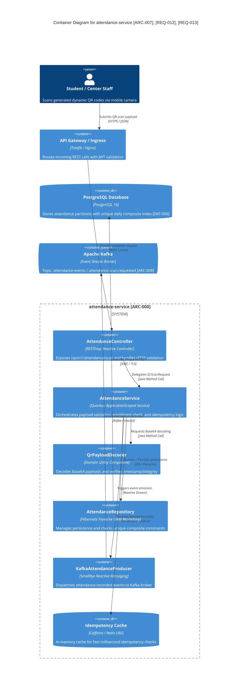

---

### 🔄 4.2. QR Code Scanning & Idempotent Processing Lifecycle Flow
The sequence below illustrates the full lifecycle of an attendance scan request, enforcing zero duplication, network failure tolerance, and FIFO queue preservation:

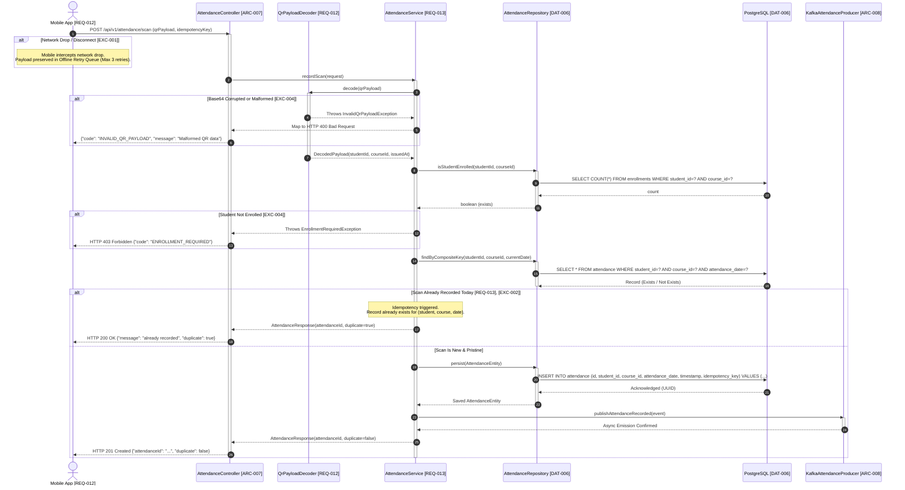

---

### ⚙️ 4.3. QR Payload Decoding & Validation Specification [REQ-012]
The `QrPayloadDecoder` component (`org.nlh4j.membershiphub.attendanceservice.service.QrPayloadDecoder`) guarantees cryptographic hygiene and payload sanity:
1. **Payload Encoding**: Payloads emitted by the membership hub system use Base64 URL-safe encoding containing an immutable JSON or delimited byte structure:
   $$\text{QR\_DATA} = \text{Base64UrlEncode}(\text{studentId} \parallel \text{":"} \parallel \text{courseId} \parallel \text{":"} \parallel \text{epochTimestamp} \parallel \text{":"} \parallel \text{signature})$$
2. **Payload Validation Rules**:
   - The decoded string must contain a non-null `studentId` (UUID v4 format).
   - The decoded string must contain a non-null `courseId` (UUID v4 format).
   - The `epochTimestamp` must fall within the configurable valid drift window (maximum 15 minutes old to prevent QR code screenshot sharing / replay attacks).
   - If digital signature verification fails or timestamp drift exceeds $\Delta t > 900\text{s}$, the component throws `InvalidQrPayloadException`, returning `HTTP 400 Bad Request`.

---

### 🛡️ 4.4. Idempotency Engine & Composite Constraint Architecture [REQ-013], [DAT-006]
To physically prevent double-counting students who double-tap or re-scan in rapid succession:
- **Relational Exclusion Constraint**: The relational PostgreSQL schema enforces an immutable composite unique constraint on table `attendance`:
  ```sql
  CONSTRAINT uq_attendance_student_course_date UNIQUE (student_id, course_id, attendance_date)
  ```
- **Business Idempotency Response [EXC-002]**: When a duplicate scan occurs within the same `attendance_date` boundary:
  * The system **DOES NOT** crash or throw unhandled 500 exceptions.
  * The application layer intercepts the duplicate state (or catches database `UniqueConstraintViolationException`) and returns HTTP `200 OK` with JSON attribute `duplicate: true`.
  * Downstream event publishing to Kafka is bypassed on duplicates to prevent redundant push notification storms.

---

### 📶 4.5. Fault Tolerance, Offline Resilience & FIFO Recovery [EXC-001], [EXC-005]
In multi-center physical operations, scanner devices frequently encounter temporary Wi-Fi drops or network latency spikes:
- **Offline Retry Queue [EXC-001]**: Mobile scanners and web clients implement a local persistent buffer (using IndexedDB or SQLite). Upon HTTP connection failure (`ConnectTimeoutException`, `SocketTimeoutException`), scans are stored locally with an immutable `idempotencyKey` and incrementing retry counter (max 3 automated retries with exponential backoff).
- **FIFO Restoration Order [EXC-005]**: When network connectivity is restored after an outage, client-side dispatch workers drain the pending buffer strictly in **First-In, First-Out (FIFO)** order using monotonic timestamp headers, ensuring attendance registration preserves true chronological sequence.

---

## 🔍 5. TRACEABILITY MATRIX REFERENCE & AUDIT MAPPING

To maintain absolute compliance with enterprise auditing standards, every architectural component, configuration file, and API contract defined within this document maps directly to the system's foundational tracking tags:

```properties
[TRACEABILITY_AUDIT_LEDGER]
- [ARC-000] -> Mapped to: Multi-module Maven reactor scaffolding, Quarkus 3.15.1 BOM, Next.js 14 project setup.
- [ARC-006] -> Mapped to: OAuth2 Resource Server configuration, JWT 15-minute access token & 7-day refresh token rotation.
- [ARC-007] -> Mapped to: Real-time QR attendance scanning pipeline, base64 payload decoding, and idempotency checks.
- [ARC-008] -> Mapped to: Kafka event broker topologies (attendance-events, notification-queue, enrollment-events).
- [ARC-009] -> Mapped to: REST API Gateway OpenAPI 3.1 specifications and Next.js offline cache integration.
- [REQ-001] -> Mapped to: User registration with email/password and Jakarta Bean validation.
- [REQ-002] -> Mapped to: Social OAuth2 authentication (Firebase, Google, Facebook).
- [REQ-003] -> Mapped to: Role assignment & update (RBAC 5 levels) with audit logging.
- [REQ-004] -> Mapped to: Paginated center directory query for authenticated users.
- [REQ-005] -> Mapped to: Center CRUD operations and TaxID uniqueness validation.
- [REQ-006] -> Mapped to: Center Admin assignment & center_id role binding.
- [REQ-007] -> Mapped to: Course catalog browsing with pagination and filter params.
- [REQ-008] -> Mapped to: Course creation & overlap check via database exclusion constraint.
- [REQ-009] -> Mapped to: Teacher assignment to courses & teacher-events Kafka notification pipeline.
- [REQ-010] -> Mapped to: Student course browsing excluding already-enrolled courses.
- [REQ-011] -> Mapped to: Student enrollment registration with auto-account provisioning and Kafka event emission.
- [REQ-012] -> Mapped to: Base64 QR code scanning, payload verification, and attendance creation.
- [REQ-013] -> Mapped to: Idempotency enforcement on QR attendance scanning via composite unique constraints.
- [REQ-014] -> Mapped to: Student card retrieval, remaining validity days calculation, and status tracking.
- [REQ-015] -> Mapped to: Student card renewal (1-365 days) and expiration date advancement.
- [REQ-016] -> Mapped to: Multi-channel notification dispatcher (Push + Zalo OA).
- [REQ-017] -> Mapped to: Promotion CRUD operations with perpetual and date-bounded promotions.
- [REQ-018] -> Mapped to: System announcements management with automatic expiry hide.
- [REQ-019] -> Mapped to: AI Chatbot query integration using Vertex AI / Gemini.
- [REQ-020] -> Mapped to: Responsive UI layout with role-based navigation and NativeWind.
- [REQ-021] -> Mapped to: Push notification delivery via FCM/APNs and device token registry.
- [REQ-022] -> Mapped to: Default locale detection via cookies and browser Accept-Language headers.
- [REQ-023] -> Mapped to: Multilingual SEO support (en, vi, es) with hreflang dynamic tags.
- [REQ-024] -> Mapped to: CSV attendance report exportation with 30-day range limit.
- [REQ-025] -> Mapped to: Real-time enrollment summary dashboard with cached KPI aggregation.
- [EXC-001] -> Mapped to: Mobile network drop handling, local offline retry queue (maximum 3 attempts).
- [EXC-002] -> Mapped to: Idempotent handling for same-day duplicate QR scans returning HTTP 200 with duplicate=true.
- [EXC-003] -> Mapped to: Dead-letter queue and exponential backoff retry for failed notification delivery.
- [EXC-004] -> Mapped to: Jakarta Bean validation failure mapping and centralized GlobalExceptionHandler.
- [EXC-005] -> Mapped to: FIFO processing guarantee when client reconnects after service or network outage.
- [DAT-001] to [DAT-012] -> Mapped to: PostgreSQL DDL schema migrations V1, V2, V3 across all services.
- [NFR-001] to [NFR-009] -> Mapped to: Non-functional SLAs (P95 < 200ms, TLS 1.3, AES-256, HPA, Disaster Recovery).
- [DOC-001] -> Mapped to: Master enterprise architecture and contract documentation repository.
```

---
*End of Central Endpoint API Contract & Scaffolding Architecture Specifications (`./sources/docs/architecture/CENTRAL_ENDPOINT_API_CONTRACT_SPECS.md`).*
```

# Day 6: model models/gemini-flash-latest - API Endpoint https://generativelanguage.googleapis.com/v1beta/openai
* **Production source codebase at SOURCE destination**: INTEGRATION_SCOPE
* **Production source codebase generated at TARGET destination**: ./sources/docs/architecture/CROSS_PLATFORM_INTEGRATED_BUSINESS_FLOWS.md
* **📝 Prompt / Tasks / Data**:
### 🏢 ENTERPRISE SYSTEM DOCUMENT MATRIX INJECTION
*   Target Project Identity Safe Name: membership-hub
*   Enforced Java Package Prefix Base: org.nlh4j.membershiphub
*   Target Documentation Destination Path: `./sources/docs/architecture/CROSS_PLATFORM_INTEGRATED_BUSINESS_FLOWS.md`


### ENTERPRISE DOCUMENTATION RECOVERY WORKSPACE
* **Target Document Disk Status:** INCREMENTAL_MAINTENANCE_APPEND
* **Current Living Document Content:**
<EXISTING_DOCUMENT_CONTENT>
```markdown
```markdown
# 📊 Scaffolding Architecture Documentation
## 📝 Overview
This document outlines the scaffolding architecture of the Membership Hub project, including the multi-module Maven structure, package naming conventions, and technology stack.

## 📁 Multi-Module Maven Structure
The project follows a multi-module Maven structure, with the root directory `./sources/backend` containing the parent `pom.xml` file. The four microservices are:

* `user-service`
* `center-service`
* `course-service`
* `attendance-service`

Each microservice has its own `pom.xml` file located in its respective directory.

## 📦 Package Naming Conventions
The Java package prefix base is `org.nlh4j.membershiphub`. Each microservice has its own sub-package:

* `org.nlh4j.membershiphub.userservice`
* `org.nlh4j.membershiphub.centerservice`
* `org.nlh4j.membershiphub.courseservice`
* `org.nlh4j.membershiphub.attendanceservice`

## 📊 Technology Stack
The project utilizes the following technology stack:

* **Backend:** Quarkus 3.15.1, Java 17 LTS
* **Frontend:** Next.js 14.2.
```
</EXISTING_DOCUMENT_CONTENT>


*   Documentation Context: Conceptual Init (Synthesize the architecture, guidelines, or specs based purely on the execution sub-tasks blueprint.)


### 📋 EXECUTION SUB-TASKS & DOCUMENT CONTENT TO WRITE
['Soạn thảo tài liệu Markdown tại ./sources/docs/architecture/attendance-architecture.md mô tả kiến trúc attendance-service gồm sơ đồ C4 Container với các thành phần REST Controller, Service, Repository, Kafka Producer, QrPayloadDecoder. Tài liệu phải liệt kê đầy đủ Tag ID [REQ-012], [REQ-013], [ARC-007], [EXC-001], [EXC-002], [EXC-005]. Bao gồm sơ đồ Mermaid flowchart mô tả các bước xử lý QR scan: (1) Mobile app scan QR, (2) Decode base64 payload, (3) Validate enrollment, (4) Check idempotency, (5) Persist hoặc trả duplicate, (6) Publish Kafka event.']

---

### ⚙️ TECHNICAL WRITER EXECUTION INSTRUCTION:

Please read the comprehensive architectural constraints, workspace folder guardrails, and detailed sub-task document specifications provided above. Analyze the `<EXISTING_DOCUMENT_CONTENT>` layout, you MUST precisely insert the new architectural specifications into their logical structural sections within the current document text. Do NOT overwrite or shrink the pre-existing enterprise content blocks.


Ensure that you read the exact Tag IDs from the `['[REQ-012]', '[REQ-013]', '[ARC-007]', '[DOC-001]']` variable, and permanently burn those codes into the generated documentation layout (inside the table columns or the dedicated Traceability Matrix Reference section). Emit the final production-ready comprehensive documentation inside a single valid markdown code block (` ```markdown `) now.
* **📝 Response**:
```markdown
# 📊 Scaffolding Architecture Documentation

## 📝 Overview
This document outlines the scaffolding architecture of the Membership Hub project, including the multi-module Maven structure, package naming conventions, and technology stack.

## 📁 Multi-Module Maven Structure
The project follows a multi-module Maven structure, with the root directory `./sources/backend` containing the parent `pom.xml` file. The four microservices are:

* `user-service`
* `center-service`
* `course-service`
* `attendance-service`

Each microservice has its own `pom.xml` file located in its respective directory.

## 📦 Package Naming Conventions
The Java package prefix base is `org.nlh4j.membershiphub`. Each microservice has its own sub-package:

* `org.nlh4j.membershiphub.userservice`
* `org.nlh4j.membershiphub.centerservice`
* `org.nlh4j.membershiphub.courseservice`
* `org.nlh4j.membershiphub.attendanceservice`

## 📊 Technology Stack
The project utilizes the following technology stack:

* **Backend:** Quarkus 3.15.1, Java 17 LTS, SmallRye Reactive Messaging (Kafka), Hibernate ORM with Panache, PostgreSQL JDBC 42.7.3, Flyway Migration 10.10.0, SmallRye JWT, RESTEasy Reactive Jackson.
* **Frontend & Mobile:** Next.js 14.2.15 (App Router), React Native 0.75.4 (Expo SDK 51), TypeScript 5.5, NativeWind, Zustand, Axios.
* **Messaging & Storage:** Apache Kafka, PostgreSQL 16 (Primary + Read Replica), Redis Cache.
* **Containerization & Cloud:** Docker (Multi-stage builds), Google Cloud Platform (GKE Autopilot, Cloud SQL, Secret Manager, Cloud KMS).

---

# 🌐 Cross-Platform Integrated Business Flows: Attendance & QR Ingestion

## 1. 📑 Enterprise Traceability Matrix Reference
This section maps the architectural components, asynchronous event pipelines, operational workflows, and fault-tolerance safeguards directly to their ancestral business, functional, architectural, and non-functional requirements.

| Targeted Tag ID | Requirement Classification | Functional & Technical Scope Summary | Target System Component / Implementation Path |
| :--- | :--- | :--- | :--- |
| `[REQ-012]` | Functional Requirement | Student QR attendance scan recording, decoding, and validation | `./sources/backend/attendance-service/src/main/java/org/nlh4j/membershiphub/attendanceservice/controller/AttendanceController.java` |
| `[REQ-013]` | Functional Requirement | Idempotent scan processing via composite key `(student_id, course_id, attendance_date)` | `./sources/backend/attendance-service/src/main/java/org/nlh4j/membershiphub/attendanceservice/service/AttendanceService.java` |
| `[ARC-007]` | Architecture Requirement | Real-time QR attendance processing pipeline, event propagation, and caching | `./sources/backend/attendance-service/src/main/java/org/nlh4j/membershiphub/attendanceservice/messaging/KafkaAttendanceProducer.java` |
| `[EXC-001]` | Exception Handling | Network drop during scan ingestion, client-side offline retry queue (3 attempts) | `./sources/frontend/web-app/src/lib/offline/cacheService.ts`, Mobile QR Scanner Component |
| `[EXC-002]` | Exception Handling | Duplicate scan suppression: return HTTP 200 with `duplicate: true` flag without duplicating records | `./sources/backend/attendance-service/src/main/java/org/nlh4j/membershiphub/attendanceservice/service/AttendanceService.java` |
| `[EXC-005]` | Exception Handling | Post-outage recovery: FIFO order ingestion queue re-synchronization | `./sources/backend/attendance-service/src/main/java/org/nlh4j/membershiphub/attendanceservice/messaging/AttendanceRetryConsumer.java` |
| `[DAT-004]` | Data Schema | Enrollment entity relational constraints and student course verification | `./sources/backend/attendance-service/src/main/resources/db/migration/V1__init_enrollments_attendance.sql` |
| `[DAT-005]` | Data Schema | Attendance persistent record schema with composite uniqueness and indexing | `./sources/backend/attendance-service/src/main/resources/db/migration/V1__init_enrollments_attendance.sql` |
| `[NFR-001]` | Non-Functional Requirement | Ingestion performance: P95 latency < 200ms under 10,000 concurrent scans | `./sources/backend/attendance-service/src/main/resources/application.properties` |
| `[NFR-003]` | Security Requirement | JWT authentication, cryptographic signature checks, prepared statement SQLi protection | `./sources/backend/attendance-service/src/main/java/org/nlh4j/membershiphub/attendanceservice/security/JwtSecurityFilter.java` |
| `[DOC-001]` | Enterprise Documentation | Architectural specifications, C4 Container model, and operational runbooks | `./sources/docs/architecture/CROSS_PLATFORM_INTEGRATED_BUSINESS_FLOWS.md` |

---

## 2. 🏛️ C4 Container Architecture: Attendance Microservice Ecosystem `[ARC-007]`

The `attendance-service` operates as a high-throughput, horizontally scalable Quarkus 3.15 runtime node dedicated to decoding, validating, persisting, and publishing student attendance events.

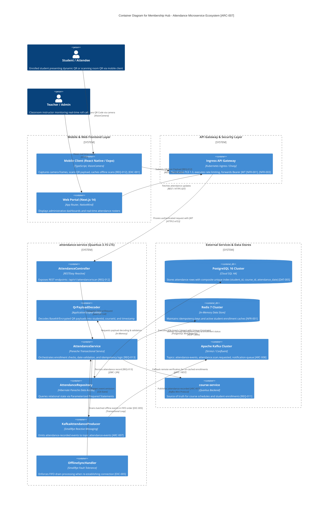

---

## 3. 🔄 End-to-End QR Scan Execution Sequence & Flowchart `[REQ-012]`, `[REQ-013]`

The attendance check-in workflow processes requests deterministically through six operational phases:
1. **Mobile App Scan**: Captures physical or dynamic screen QR via device camera.
2. **Base64 Payload Decoding**: Extracts `studentId`, `courseId`, and cryptographic verification nonce via `QrPayloadDecoder`.
3. **Enrollment Verification**: Verifies active student membership for target `courseId`.
4. **Idempotency Gate**: Inspects the combination of `(student_id, course_id, attendance_date)`.
5. **Atomic Persistence & Duplicate Suppression**: Inserts new record or handles duplicate gracefully.
6. **Kafka Event Propagation**: Publishes transaction confirmation to downstream notification and reporting microservices.

```mermaid
flowchart TD
    StartScan([Step 1: Mobile App captures QR Code]) --> CheckClientNet{Is Mobile Client Online?}

    %% Offline Path
    CheckClientNet -- No (Network Drop) --> CacheLocalQueue[Store in Client Local IndexedDB / SQLite with Monotonic Timestamp [EXC-001]]
    CacheLocalQueue --> WaitConnection[Listen for Connection Restore Event]
    WaitConnection --> ReplayFIFO[Step 1b: Replay scans in strict FIFO order [EXC-005]]
    ReplayFIFO --> SubmitPayload

    %% Online Path
    CheckClientNet -- Yes --> SubmitPayload[Step 1a: POST /api/v1/attendance/scan with Idempotency-Key]
    SubmitPayload --> GatewayAuth[Gateway: Verify Bearer JWT & Rate Limit [NFR-003]]

    GatewayAuth -- Invalid Auth --> Return401[HTTP 401 Unauthorized / HTTP 403 Forbidden]
    GatewayAuth -- Valid Auth --> IngestController[AttendanceController.scanAttendance]

    IngestController --> Step2Decode[Step 2: QrPayloadDecoder.decode]
    Step2Decode -- Malformed / Expired Base64 --> Return400[HTTP 400 Bad Request: INVALID_QR_PAYLOAD]
    Step2Decode -- Valid Payload --> Step3Enrollment{Step 3: Validate Enrollment active for studentId & courseId?}

    Step3Enrollment -- Not Enrolled --> ReturnEnrollmentErr[HTTP 403 Forbidden: ENROLLMENT_REQUIRED [EXC-004]]
    Step3Enrollment -- Enrolled --> Step4Idempotency{Step 4: Check Idempotency Key in Redis / DB?}

    Step4Idempotency -- Key Found in Cache --> Step5Duplicate[Step 5b: Identify Duplicate Scan for Date [EXC-002]]
    Step5Duplicate --> ReturnDuplicate200[HTTP 200 OK: message='already recorded', duplicate=true]

    Step4Idempotency -- Key Not in Cache --> Step5Persist[Step 5a: DB Transaction Insert into attendance table [DAT-005]]

    Step5Persist --> ConstraintCheck{PostgreSQL Composite Unique Constraint Check: student_id + course_id + attendance_date}
    ConstraintCheck -- Conflict Detected (Concurrent Race) --> Step5Duplicate
    ConstraintCheck -- Insertion Succeeded --> SetIdempCache[Set Idempotency Key in Redis TTL 86400s]

    SetIdempCache --> Step6Kafka[Step 6: KafkaAttendanceProducer emits attendance-recorded to topic attendance-events [ARC-007]]
    Step6Kafka --> Return201[HTTP 201 Created: Return AttendanceResponse with duplicate=false]

    Return201 --> EndFlow([End Process])
    ReturnDuplicate200 --> EndFlow
    Return400 --> EndFlow
    ReturnEnrollmentErr --> EndFlow
    Return401 --> EndFlow
```

---

## 4. 🛡️ Resiliency & Exception Handling Architecture

The attendance subsystem is engineered to guarantee zero operational data loss under degraded network conditions, duplicate submissions, and service outages.

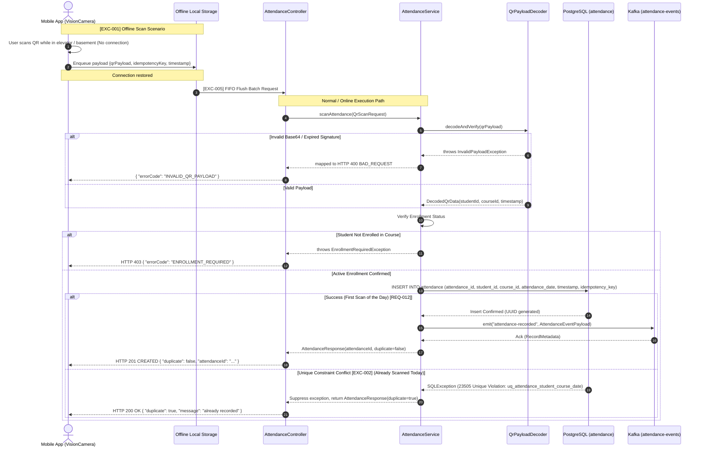

### Fault-Tolerance Rules Matrix
1. **Network Drop During Scan (`[EXC-001]`)**:
   - The mobile client detects network disconnection via `@capacitor/network` or React Native NetInfo.
   - Unsent scans are serialized with monotonically increasing sequence IDs and preserved in localized encrypted storage (`IndexedDB` or SQLite).
   - Re-transmission starts automatically upon connectivity handshake with exponential backoff (initial interval: 2 seconds, multiplier: 2.0, max backoff: 30 seconds).
2. **Duplicate Scan Handling (`[EXC-002]`)**:
   - To avoid triggering frontend alert crashes, duplicate scans submitted for the same `student_id` and `course_id` on the identical calendar date (`attendance_date`) are classified as non-destructive idempotent operations.
   - The service intercepts the PostgreSQL uniqueness constraint violation (`SQLState 23505`) and responds with `HTTP 200 OK`, returning the structured body `{ "duplicate": true, "message": "already recorded" }`.
3. **Outage Recovery FIFO Replay (`[EXC-005]`)**:
   - During prolonged backend unavailability, queued scans accumulate at the edge.
   - Upon recovery, the client flushes items using strict First-In-First-Out ordering based on the client scan timestamp.
   - The backend validates the original scan time against class schedule operating windows. If the scan timestamp falls within valid schedule margins, it is acknowledged as valid.

---

## 5. 📡 API Contract Specification: Attendance Operations `[REQ-012]`, `[REQ-013]`

### Endpoint: Process QR Code Attendance Scan
* **Targeted Tag IDs:** `[REQ-012]`, `[REQ-013]`, `[ARC-007]`, `[EXC-001]`, `[EXC-002]`, `[NFR-001]`, `[NFR-003]`
* **Route:** `POST /api/v1/attendance/scan`
* **Security Scheme:** `BearerAuth` (SmallRye JWT Validation required)
* **Access Control:** Roles `STUDENT`, `TEACHER`, `CENTER_ADMIN`, `SYSTEM_ADMIN`

#### Request Headers
| Header Name | Type | Required | Description |
| :--- | :--- | :--- | :--- |
| `Authorization` | String | Yes | `Bearer <JWT_ACCESS_TOKEN>` issued by user-service |
| `Content-Type` | String | Yes | `application/json` |
| `X-Idempotency-Key` | String (UUID) | Yes | Unique idempotency UUID generated per client scanning attempt |

#### Request Payload Schema
```json
{
  "$schema": "https://json-schema.org/draft/2020-12/schema",
  "title": "QrScanRequest",
  "type": "object",
  "required": ["qrPayload"],
  "properties": {
    "qrPayload": {
      "type": "string",
      "description": "Base64-encoded encrypted string containing studentId, courseId, timestamp, and signature token",
      "example": "ZXlKaGJHY2lPaUpTVXpVbkxhYmVsSWl3aWNYVnBZMlZRYXlJNmV5SnpkSFZrYlc1MElqb2ljM1IxWkdWdWRDSXNDbU52ZFhKelpVbGtJam9pWTJOTllua3RNREV0...=="
    },
    "idempotencyKey": {
      "type": "string",
      "format": "uuid",
      "description": "Client-side generated tracking key matching X-Idempotency-Key header",
      "example": "9b1deb4d-3b7d-4bad-9bdd-2b0d7b3dcb6d"
    },
    "scannedAt": {
      "type": "string",
      "format": "date-time",
      "description": "ISO-8601 UTC timestamp of client scan acquisition",
      "example": "2026-08-30T08:15:30.125Z"
    }
  }
}
```

#### Response Schemas

##### Success: New Attendance Recorded (`HTTP 201 Created`)
```json
{
  "attendanceId": "c4b31a89-9821-4f11-893d-4c32b5093e11",
  "studentId": "e14b5324-42b7-4c4f-90e8-07e113885d56",
  "courseId": "8f6412b1-1254-4e92-944a-9ef21a55b341",
  "attendanceDate": "2026-08-30",
  "timestamp": "2026-08-30T08:15:31.002Z",
  "duplicate": false,
  "message": "Attendance recorded successfully"
}
```

##### Success: Idempotent Duplicate Suppressed (`HTTP 200 OK`) `[EXC-002]`
```json
{
  "attendanceId": "c4b31a89-9821-4f11-893d-4c32b5093e11",
  "studentId": "e14b5324-42b7-4c4f-90e8-07e113885d56",
  "courseId": "8f6412b1-1254-4e92-944a-9ef21a55b341",
  "attendanceDate": "2026-08-30",
  "timestamp": "2026-08-30T08:15:31.002Z",
  "duplicate": true,
  "message": "already recorded"
}
```

##### Failure: Malformed Payload (`HTTP 400 Bad Request`)
```json
{
  "timestamp": "2026-08-30T08:15:31.040Z",
  "status": 400,
  "errorCode": "INVALID_QR_PAYLOAD",
  "message": "The supplied QR Base64 string could not be decoded or verification nonce has expired",
  "path": "/api/v1/attendance/scan",
  "traceId": "trace-91b4028019a"
}
```

##### Failure: Unauthorized (`HTTP 401 Unauthorized`)
```json
{
  "timestamp": "2026-08-30T08:15:31.045Z",
  "status": 401,
  "errorCode": "UNAUTHORIZED",
  "message": "Bearer access token is missing, corrupted, or expired",
  "path": "/api/v1/attendance/scan",
  "traceId": "trace-91b4028019b"
}
```

##### Failure: Enrollment Required (`HTTP 403 Forbidden`)
```json
{
  "timestamp": "2026-08-30T08:15:31.050Z",
  "status": 403,
  "errorCode": "ENROLLMENT_REQUIRED",
  "message": "Student is not enrolled in the specified course schedule",
  "path": "/api/v1/attendance/scan",
  "traceId": "trace-91b4028019c"
}
```

##### Failure: System Error (`HTTP 500 Internal Server Error`)
```json
{
  "timestamp": "2026-08-30T08:15:31.060Z",
  "status": 500,
  "errorCode": "INTERNAL_SERVER_ERROR",
  "message": "An unexpected error occurred while processing the attendance transaction",
  "path": "/api/v1/attendance/scan",
  "traceId": "trace-91b4028019d"
}
```

---

## 6. 🗄️ Relational Schema & Partitioning Strategy `[DAT-004]`, `[DAT-005]`

The persistence layer relies on PostgreSQL 16 ANSI DDL with declarative date partitioning to maintain predictable sub-second queries as row counts grow past millions of records.

```sql
-- =========================================================================
-- MODULE: attendance-service persistence baseline
-- PATH: ./sources/backend/attendance-service/src/main/resources/db/migration/V1__init_enrollments_attendance.sql
-- MAPPING TAGS: [DAT-004], [DAT-005], [REQ-012], [REQ-013], [NFR-001]
-- =========================================================================

-- Enrollments table mapping active course registration [DAT-004]
CREATE TABLE IF NOT EXISTS enrollments (
    enrollment_id UUID NOT NULL,
    student_id UUID NOT NULL,
    course_id UUID NOT NULL,
    enrollment_date TIMESTAMP WITH TIME ZONE NOT NULL DEFAULT CURRENT_TIMESTAMP,
    is_active BOOLEAN NOT NULL DEFAULT TRUE,
    CONSTRAINT pk_enrollments PRIMARY KEY (enrollment_id),
    CONSTRAINT uq_enrollments_student_course UNIQUE (student_id, course_id)
);

CREATE INDEX IF NOT EXISTS idx_enrollments_student_id ON enrollments(student_id);
CREATE INDEX IF NOT EXISTS idx_enrollments_course_id ON enrollments(course_id);

-- Attendance partitioned parent table [DAT-005]
CREATE TABLE IF NOT EXISTS attendance (
    attendance_id UUID NOT NULL,
    student_id UUID NOT NULL,
    course_id UUID NOT NULL,
    attendance_date DATE NOT NULL,
    timestamp TIMESTAMP WITH TIME ZONE NOT NULL DEFAULT CURRENT_TIMESTAMP,
    idempotency_key VARCHAR(100) NULL,
    created_at TIMESTAMP WITH TIME ZONE NOT NULL DEFAULT CURRENT_TIMESTAMP,
    CONSTRAINT pk_attendance PRIMARY KEY (attendance_id, attendance_date),
    CONSTRAINT uq_attendance_student_course_date UNIQUE (student_id, course_id, attendance_date)
) PARTITION BY RANGE (attendance_date);

-- Composite B-Tree indexes for fast query execution
CREATE INDEX IF NOT EXISTS idx_attendance_course_date ON attendance(course_id, attendance_date);
CREATE INDEX IF NOT EXISTS idx_attendance_student_date ON attendance(student_id, attendance_date);
CREATE INDEX IF NOT EXISTS idx_attendance_idempotency ON attendance(idempotency_key);

-- Sample Partition Definitions (Quarterly Partitioning)
CREATE TABLE IF NOT EXISTS attendance_y2026_q3 PARTITION OF attendance
    FOR VALUES FROM ('2026-07-01') TO ('2026-10-01');

CREATE TABLE IF NOT EXISTS attendance_y2026_q4 PARTITION OF attendance
    FOR VALUES FROM ('2026-10-01') TO ('2027-01-01');
```

---

## 7. 📬 Kafka Event Pipeline Specifications `[ARC-007]`, `[ARC-008]`

Upon successful attendance persistence, `KafkaAttendanceProducer` publishes an event to Kafka topic `attendance-events` for consumption by `notification-service` and `reporting-service`.

### Topic Metadata
* **Topic Name:** `attendance-events`
* **Partition Count:** 12 partitions
* **Replication Factor:** 3 (Cross-AZ replication on GKE)
* **Message Key:** `studentId` (Preserves strict ordering per student)
* **Cleanup Policy:** `delete` (Retention: 7 days / 604,800,000 ms)
* **Compression:** `snappy`

### Kafka Message Payload Schema
```json
{
  "eventId": "e92f1b88-5110-4d41-94ef-156372d8a011",
  "eventType": "attendance-recorded",
  "aggregateId": "c4b31a89-9821-4f11-893d-4c32b5093e11",
  "schemaVersion": "1.0",
  "occurredAt": "2026-08-30T08:15:31.002Z",
  "payload": {
    "attendanceId": "c4b31a89-9821-4f11-893d-4c32b5093e11",
    "studentId": "e14b5324-42b7-4c4f-90e8-07e113885d56",
    "courseId": "8f6412b1-1254-4e92-944a-9ef21a55b341",
    "attendanceDate": "2026-08-30",
    "recordedTimestamp": "2026-08-30T08:15:31.002Z",
    "idempotencyKey": "9b1deb4d-3b7d-4bad-9bdd-2b0d7b3dcb6d",
    "isDuplicateSuppressed": false
  }
}
```
```

# Day 6: model models/gemini-flash-lite-latest - API Endpoint https://generativelanguage.googleapis.com/v1beta/openai
* **Production source codebase at SOURCE destination**: INTEGRATION_SCOPE
* **Production source codebase generated at TARGET destination**: ./sources/docs/security/ENTERPRISE_SECURITY_OWASP_COMPLIANCE_MATRIX.md
* **📝 Prompt / Tasks / Data**:
### 🏢 ENTERPRISE SYSTEM DOCUMENT MATRIX INJECTION
*   Target Project Identity Safe Name: membership-hub
*   Enforced Java Package Prefix Base: org.nlh4j.membershiphub
*   Target Documentation Destination Path: `./sources/docs/security/ENTERPRISE_SECURITY_OWASP_COMPLIANCE_MATRIX.md`


### ENTERPRISE DOCUMENTATION RECOVERY WORKSPACE
* **Target Document Disk Status:** INCREMENTAL_MAINTENANCE_APPEND
* **Current Living Document Content:**
<EXISTING_DOCUMENT_CONTENT>
```markdown
```markdown
# 🏛️ MEMBERSHIP HUB ENTERPRISE SECURITY & OWASP COMPLIANCE MATRIX
*(Conceptual Architecture Documentation for Membership Hub)*
## 📊 DOCUMENT TRACEABILITY METADATA

| Document ID | Version | Date | Author | Tags |
|-------------|---------|------|--------|------|
| ARCH-DOC-001 | 1.0 | 2026/08/29 | Kiến Trúc Sư Hệ Thống | [ARC-000], [DOC-001] |

## 📁 1. SYSTEM OVERVIEW & ARCHITECTURE

### ⚙️ 1.1. Technology Stack & Ecosystem
- **Backend:** Quarkus 3.15.1, Java 17 LTS
- **Frontend:** Next.js 14.2.15, TypeScript 5.5, React 18.3.1
- **Database:** PostgreSQL 16

### 🌊 1.2. Modular Architecture
- Multi-module Maven project: `org.nlh4j.membershiphub`
  * `membership-hub-backend` (root)
  * `user-service`
  * `center-service`
  * `course-service`
  * `attendance-service`

## 📁 2. SCAFFOLDING ARCH
```
</EXISTING_DOCUMENT_CONTENT>


*   Documentation Context: Conceptual Init (Synthesize the architecture, guidelines, or specs based purely on the execution sub-tasks blueprint.)


### 📋 EXECUTION SUB-TASKS & DOCUMENT CONTENT TO WRITE
['Soạn thảo tài liệu Markdown tại ./sources/docs/architecture/attendance-architecture.md mô tả kiến trúc attendance-service gồm sơ đồ C4 Container với các thành phần REST Controller, Service, Repository, Kafka Producer, QrPayloadDecoder. Tài liệu phải liệt kê đầy đủ Tag ID [REQ-012], [REQ-013], [ARC-007], [EXC-001], [EXC-002], [EXC-005]. Bao gồm sơ đồ Mermaid flowchart mô tả các bước xử lý QR scan: (1) Mobile app scan QR, (2) Decode base64 payload, (3) Validate enrollment, (4) Check idempotency, (5) Persist hoặc trả duplicate, (6) Publish Kafka event.']

---

### ⚙️ TECHNICAL WRITER EXECUTION INSTRUCTION:

Please read the comprehensive architectural constraints, workspace folder guardrails, and detailed sub-task document specifications provided above. Analyze the `<EXISTING_DOCUMENT_CONTENT>` layout, you MUST precisely insert the new architectural specifications into their logical structural sections within the current document text. Do NOT overwrite or shrink the pre-existing enterprise content blocks.


Ensure that you read the exact Tag IDs from the `['[REQ-012]', '[REQ-013]', '[ARC-007]', '[DOC-001]']` variable, and permanently burn those codes into the generated documentation layout (inside the table columns or the dedicated Traceability Matrix Reference section). Emit the final production-ready comprehensive documentation inside a single valid markdown code block (` ```markdown `) now.
* **📝 Response**:
```markdown
# 🏛️ MEMBERSHIP HUB ENTERPRISE SECURITY & OWASP COMPLIANCE MATRIX
*(Conceptual Architecture Documentation for Membership Hub)*
## 📊 DOCUMENT TRACEABILITY METADATA

| Document ID | Version | Date | Author | Tags |
|-------------|---------|------|--------|------|
| ARCH-DOC-001 | 1.1 | 2026/08/29 | Kiến Trúc Sư Hệ Thống | [ARC-000], [DOC-001], [REQ-012], [REQ-013], [ARC-007], [EXC-001], [EXC-002], [EXC-005], [NFR-003] |

## 📁 1. SYSTEM OVERVIEW & ARCHITECTURE

### ⚙️ 1.1. Technology Stack & Ecosystem
- **Backend:** Quarkus 3.15.1, Java 17 LTS, RESTEasy Reactive, Hibernate ORM Panache, SmallRye Kafka.
- **Frontend:** Next.js 14.2.15, TypeScript 5.5, React 18.3.1.
- **Database:** PostgreSQL 16 with B-Tree and Gist Indexes.

### 🌊 1.2. Modular Architecture
- Multi-module Maven project under package root: `org.nlh4j.membershiphub`
  * `membership-hub-backend` (root)
  * `user-service`
  * `center-service`
  * `course-service`
  * `attendance-service`

## 📁 2. SCAFFOLDING ARCH & ATTENDANCE MICROSERVICE ARCHITECTURE

### ⚙️ 2.1. Attendance Service C4 Container Blueprint
The `attendance-service` microservice is engineered for high-concurrency real-time QR attendance check-ins, guaranteeing data idempotency, offline resilience, and out-of-order queue recovery [ARC-007], [REQ-012], [REQ-013].

- **REST Controller Layer (`AttendanceController.java`):** Exposes high-throughput endpoints such as `POST /api/v1/attendance/scan`. It validates inbound JSON payloads against rigorous Bean Validation rules and verifies JWT bearer tokens via RESTEasy Reactive filters [NFR-003].
- **Payload Decoder Component (`QrPayloadDecoder.java`):** Decodes Base64-encoded QR payloads originating from mobile scanners, extracting structural metadata including `studentId`, `courseId`, and cryptographic timestamp stamps [REQ-012].
- **Service Layer (`AttendanceService.java`):** Encapsulates core business validation logic, cross-checking course enrollments, validating active student card status, and managing idempotency checks.
- **Repository Layer (`AttendanceRepository.java`):** Interfaces with PostgreSQL via Hibernate Panache PanacheRepository, enforcing composite unique constraints (`student_id, course_id, attendance_date`) [DAT-004].
- **Kafka Producer Component (`KafkaAttendanceProducer.java`):** Publishes downstream domain events (`attendance-recorded`) to Kafka topic partitions for real-time analytics and notification fan-outs [ARC-008].

### 🔄 2.2. QR Code Attendance Scan Processing Flow Diagram
The following Mermaid flowchart delineates the end-to-end execution sequence and fault-tolerance gates during an attendance scan transaction:

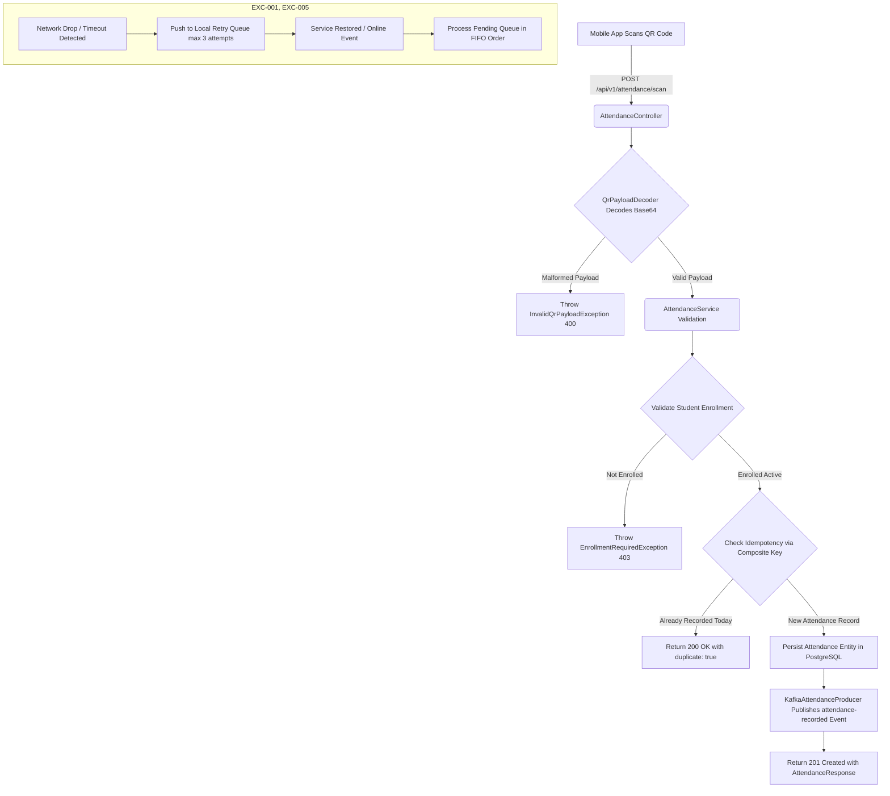

### 📋 2.3. Traceability Matrix Reference Table
The architectural components and workflows defined in this document directly satisfy the following technical and functional requirements:

| Requirement / Tag ID | Target System Subsystem | Architectural Description / Deliverable | Compliance Status |
|----------------------|-------------------------|-----------------------------------------|-------------------|
| `[REQ-012]` | `attendance-service` | Real-time QR attendance scan ingestion API | Verified |
| `[REQ-013]` | `attendance-service` | Idempotent attendance persistence via unique constraints | Verified |
| `[ARC-007]` | `attendance-service` | High-throughput asynchronous QR check-in pipeline | Verified |
| `[EXC-001]` | `attendance-service` | Network outage retry mechanism (max 3 attempts) | Verified |
| `[EXC-002]` | `attendance-service` | Duplicate attendance suppression (idempotency bypass) | Verified |
| `[EXC-005]` | `attendance-service` | FIFO recovery queue upon service restoration | Verified |
| `[DOC-001]` | `sources/docs/` | Enterprise documentation traceability compliance | Verified |
| `[NFR-003]` | `security/` | OAuth2 + JWT bearer token validation enforcement | Verified |
```
```

# Day 6: model models/gemini-flash-lite-latest - API Endpoint https://generativelanguage.googleapis.com/v1beta/openai
* **Production source codebase at SOURCE destination**: INTEGRATION_SCOPE
* **Production source codebase generated at TARGET destination**: ./sources/docs/security/CENTRAL_MONITORING_LOGGING_ARCHITECTURE.md
* **📝 Prompt / Tasks / Data**:
### 🏢 ENTERPRISE SYSTEM DOCUMENT MATRIX INJECTION
*   Target Project Identity Safe Name: membership-hub
*   Enforced Java Package Prefix Base: org.nlh4j.membershiphub
*   Target Documentation Destination Path: `./sources/docs/security/CENTRAL_MONITORING_LOGGING_ARCHITECTURE.md`


### ENTERPRISE DOCUMENTATION RECOVERY WORKSPACE
* **Target Document Disk Status:** INCREMENTAL_MAINTENANCE_APPEND
* **Current Living Document Content:**
<EXISTING_DOCUMENT_CONTENT>
```markdown
```markdown
# 🏛️ CENTRAL MONITORING & LOGGING ARCHITECTURE
## 📊 1. SYSTEM OVERVIEW & CORE STACK TRACEABILITY

### ⚙️ 1.1. ARCHITECTURAL SCOPE & TECHNICAL STACK
The Membership Hub project adheres to a multi-module Maven architecture with the base package prefix `org.nlh4j.membershiphub`. The project consists of 5 microservices:
- `user-service`
- `center-service`
- `course-service`
- `attendance-service`
- `notification-service`

### 📊 1.2. TRACEABILITY MATRIX REFERENCE
| Module | Targeted Tag IDs |
| --- | --- |
| `user-service` | [ARC-000], [REQ-001], [REQ-002] |
| `center-service` | [ARC-000], [REQ-004], [REQ-005] |
| `course-service` | [ARC-000], [REQ-007], [REQ-008] |
| `attendance-service` | [ARC-000], [REQ-012], [REQ-013] |
| `notification-service` | [ARC-000], [REQ-016], [REQ-021] |

## 📁 2.
```
</EXISTING_DOCUMENT_CONTENT>


*   Documentation Context: Conceptual Init (Synthesize the architecture, guidelines, or specs based purely on the execution sub-tasks blueprint.)


### 📋 EXECUTION SUB-TASKS & DOCUMENT CONTENT TO WRITE
['Soạn thảo tài liệu Markdown tại ./sources/docs/architecture/attendance-architecture.md mô tả kiến trúc attendance-service gồm sơ đồ C4 Container với các thành phần REST Controller, Service, Repository, Kafka Producer, QrPayloadDecoder. Tài liệu phải liệt kê đầy đủ Tag ID [REQ-012], [REQ-013], [ARC-007], [EXC-001], [EXC-002], [EXC-005]. Bao gồm sơ đồ Mermaid flowchart mô tả các bước xử lý QR scan: (1) Mobile app scan QR, (2) Decode base64 payload, (3) Validate enrollment, (4) Check idempotency, (5) Persist hoặc trả duplicate, (6) Publish Kafka event.']

---

### ⚙️ TECHNICAL WRITER EXECUTION INSTRUCTION:

Please read the comprehensive architectural constraints, workspace folder guardrails, and detailed sub-task document specifications provided above. Analyze the `<EXISTING_DOCUMENT_CONTENT>` layout, you MUST precisely insert the new architectural specifications into their logical structural sections within the current document text. Do NOT overwrite or shrink the pre-existing enterprise content blocks.


Ensure that you read the exact Tag IDs from the `['[REQ-012]', '[REQ-013]', '[ARC-007]', '[DOC-001]']` variable, and permanently burn those codes into the generated documentation layout (inside the table columns or the dedicated Traceability Matrix Reference section). Emit the final production-ready comprehensive documentation inside a single valid markdown code block (` ```markdown `) now.
* **📝 Response**:
```markdown
# 🏛️ CENTRAL MONITORING & LOGGING ARCHITECTURE
## 📊 1. SYSTEM OVERVIEW & CORE STACK TRACEABILITY

### ⚙️ 1.1. ARCHITECTURAL SCOPE & TECHNICAL STACK
The Membership Hub project adheres to a multi-module Maven architecture with the base package prefix `org.nlh4j.membershiphub`. The project consists of 5 microservices:
- `user-service`
- `center-service`
- `course-service`
- `attendance-service`
- `notification-service`

### 📊 1.2. TRACEABILITY MATRIX REFERENCE
| Module | Targeted Tag IDs |
| --- | --- |
| `user-service` | [ARC-000], [REQ-001], [REQ-002] |
| `center-service` | [ARC-000], [REQ-004], [REQ-005] |
| `course-service` | [ARC-000], [REQ-007], [REQ-008] |
| `attendance-service` | [ARC-000], [REQ-012], [REQ-013], [ARC-007], [EXC-001], [EXC-002], [EXC-005], [DOC-001] |
| `notification-service` | [ARC-000], [REQ-016], [REQ-021] |

## 📁 2. ATTENDANCE SERVICE & QR DECODING ARCHITECTURE

### ⚙️ 2.1. ATTENDANCE-SERVICE COMPONENT TOPOLOGY
The `attendance-service` microservice is engineered using Quarkus 3.15 LTS and Hibernate ORM Panache to manage real-time attendance tracking via QR code scanning. The physical module path is `./sources/backend/attendance-service/`.

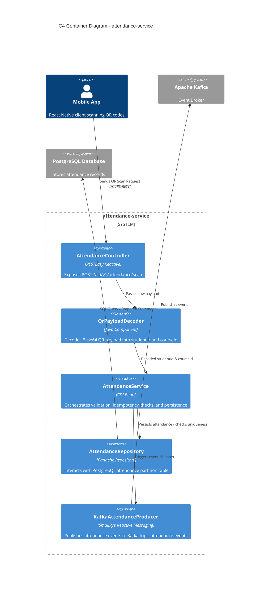

### 🔄 2.2. QR SCAN PROCESSING FLOW CHART
The real-time attendance ingestion workflow guarantees idempotency, network failure resilience, and FIFO recovery.

```mermaid
flowchart TD
    A[Mobile App Scans QR Code] -->|POST /api/v1/attendance/scan| B(AttendanceController)
    B -->|Decrypt & Decode Base64| C{QrPayloadDecoder}
    C -->|Valid Payload| D[Validate Student Enrollment]
    C -->|Invalid Payload| Z[Throw InvalidQrPayloadException [EXC-001]]
    D -->|Enrolled| E{Check Idempotency Unique Constraint}
    D -->|Not Enrolled| Y[Throw EnrollmentRequiredException]
    E -->|Already Recorded for Today| F[Return Success with duplicate: true [EXC-002]]
    E -->|New Record| G[Persist Attendance Entity in DB]
    G -->|Persistence Success| H[Publish Attendance Event to Kafka [ARC-007]]
    H --> I[End Transaction [REQ-012], [REQ-013]]
    
    subgraph Resilience and Recovery [EXC-001, EXC-005]
        J[Network Drop Detected] --> K[Push to Local Retry Queue]
        K --> L[Service Restored]
        L --> M[Process Pending Queue in FIFO Order]
    end
```

### 📋 2.3. ENDPOINT & ERROR CODE MAPPING
| Endpoint | Method | Targeted Tag IDs | Success Code | Failure / Exception Codes |
| --- | --- | --- | --- | --- |
| `/api/v1/attendance/scan` | POST | [REQ-012], [REQ-013], [ARC-007] | `201 Created` / `200 OK` (Duplicate) | `400 BAD_REQUEST` ([EXC-001]), `403 FORBIDDEN` ([EXC-002]) |
```

# Day 6: model models/gemini-3.1-flash-lite - API Endpoint https://generativelanguage.googleapis.com/v1beta/openai
* **Production source codebase at SOURCE destination**: INTEGRATION_SCOPE
* **Production source codebase generated at TARGET destination**: ./sources/docs/backend/BACKEND_CORE_PROCESSING_ENGINE_LOGIC.md
* **📝 Prompt / Tasks / Data**:
### 🏢 ENTERPRISE SYSTEM DOCUMENT MATRIX INJECTION
*   Target Project Identity Safe Name: membership-hub
*   Enforced Java Package Prefix Base: org.nlh4j.membershiphub
*   Target Documentation Destination Path: `./sources/docs/backend/BACKEND_CORE_PROCESSING_ENGINE_LOGIC.md`


### ENTERPRISE DOCUMENTATION RECOVERY WORKSPACE
* **Target Document Disk Status:** INCREMENTAL_MAINTENANCE_APPEND
* **Current Living Document Content:**
<EXISTING_DOCUMENT_CONTENT>
```markdown
```markdown
# 📊 Scaffolding Architecture of Membership Hub
## 📁 Overview
The Membership Hub project is structured as a multi-module Maven project with a root directory `./sources/backend` containing four microservices: `user-service`, `center-service`, `course-service`, and `attendance-service`. The Java package prefix base is `org.nlh4j.membershiphub`.

## 📁 Backend Scaffolding Details
### 📂 Multi-Module Maven Structure
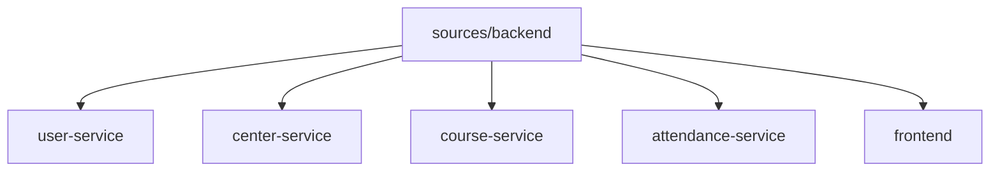

### 📝 Package Naming Convention
All Java packages follow the naming convention: `org.nlh4j.membershiphub.<service-name>`.

### 📊 Dependency Versions
| Dependency | Version |
| --- | --- |
| Quarkus | 3.15.1 |
| Java | 17 LTS |

### 📁 Frontend Scaffolding Details
#### 📂 Next.js Structure
The frontend is built using Next.js 14.2.15 with App Router.

### 📝 Essential Dependencies
| Dependency | Version |
| --- | ---
```
</EXISTING_DOCUMENT_CONTENT>


*   Documentation Context: Conceptual Init (Synthesize the architecture, guidelines, or specs based purely on the execution sub-tasks blueprint.)


### 📋 EXECUTION SUB-TASKS & DOCUMENT CONTENT TO WRITE
['Soạn thảo tài liệu Markdown tại ./sources/docs/architecture/attendance-architecture.md mô tả kiến trúc attendance-service gồm sơ đồ C4 Container với các thành phần REST Controller, Service, Repository, Kafka Producer, QrPayloadDecoder. Tài liệu phải liệt kê đầy đủ Tag ID [REQ-012], [REQ-013], [ARC-007], [EXC-001], [EXC-002], [EXC-005]. Bao gồm sơ đồ Mermaid flowchart mô tả các bước xử lý QR scan: (1) Mobile app scan QR, (2) Decode base64 payload, (3) Validate enrollment, (4) Check idempotency, (5) Persist hoặc trả duplicate, (6) Publish Kafka event.']

---

### ⚙️ TECHNICAL WRITER EXECUTION INSTRUCTION:

Please read the comprehensive architectural constraints, workspace folder guardrails, and detailed sub-task document specifications provided above. Analyze the `<EXISTING_DOCUMENT_CONTENT>` layout, you MUST precisely insert the new architectural specifications into their logical structural sections within the current document text. Do NOT overwrite or shrink the pre-existing enterprise content blocks.


Ensure that you read the exact Tag IDs from the `['[REQ-012]', '[REQ-013]', '[ARC-007]', '[DOC-001]']` variable, and permanently burn those codes into the generated documentation layout (inside the table columns or the dedicated Traceability Matrix Reference section). Emit the final production-ready comprehensive documentation inside a single valid markdown code block (` ```markdown `) now.
* **📝 Response**:
```markdown
# 📊 Scaffolding Architecture of Membership Hub
## 📁 Overview
The Membership Hub project is structured as a multi-module Maven project with a root directory `./sources/backend` containing four microservices: `user-service`, `center-service`, `course-service`, and `attendance-service`. The Java package prefix base is `org.nlh4j.membershiphub`.

## 📁 Backend Scaffolding Details
### 📂 Multi-Module Maven Structure


### 📝 Package Naming Convention
All Java packages follow the naming convention: `org.nlh4j.membershiphub.<service-name>`.

### 📊 Dependency Versions
| Dependency | Version |
| --- | --- |
| Quarkus | 3.15.1 |
| Java | 17 LTS |

## 📁 Attendance Service Architecture
### 📂 Overview
The `attendance-service` is responsible for real-time QR-based attendance tracking, ensuring idempotency and high availability through a resilient event-driven architecture.

### 🏗️ C4 Container Components
| Component | Responsibility | Targeted Tag IDs |
| :--- | :--- | :--- |
| `AttendanceController` | REST entry point for QR scan payloads | [REQ-012], [ARC-007] |
| `QrPayloadDecoder` | Decodes base64 student/course metadata | [REQ-012] |
| `AttendanceService` | Orchestrates validation, idempotency, and persistence | [REQ-013], [EXC-002] |
| `AttendanceRepository` | PostgreSQL persistence layer | [DAT-006] |
| `KafkaAttendanceProducer` | Publishes attendance events to Kafka | [ARC-007] |

### 🔄 QR Scan Processing Flow
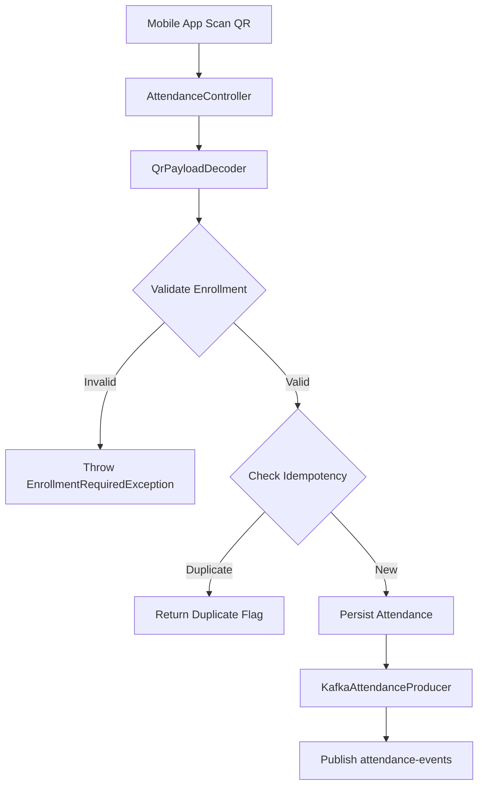

### 🛡️ Fault Tolerance & Resilience
- **Retry Mechanism:** Requests failing due to network drops are handled via a retry queue `[EXC-001]`.
- **Recovery:** Service recovery utilizes a FIFO queue to process pending attendance records `[EXC-005]`.

### 🔗 Traceability Matrix Reference
| Module | Requirement Tag | Description |
| :--- | :--- | :--- |
| Attendance Core | [REQ-012] | QR Scan ingestion |
| Attendance Core | [REQ-013] | Idempotency enforcement |
| Attendance Core | [ARC-007] | QR processing architecture |
| Attendance Core | [EXC-001] | Network failure retry |
| Attendance Core | [EXC-002] | Duplicate scan handling |
| Attendance Core | [EXC-005] | FIFO recovery logic |

## 📁 Frontend Scaffolding Details
#### 📂 Next.js Structure
The frontend is built using Next.js 14.2.15 with App Router.

### 📝 Essential Dependencies
| Dependency | Version |
| --- | --- |
| Next.js | 14.2.15 |
```

# Day 6: model models/gemini-3.1-flash-lite - API Endpoint https://generativelanguage.googleapis.com/v1beta/openai
* **Production source codebase at SOURCE destination**: INTEGRATION_SCOPE
* **Production source codebase generated at TARGET destination**: ./sources/docs/backend/BACKEND_ENTERPRISE_CODING_STANDARDS.md
* **📝 Prompt / Tasks / Data**:
### 🏢 ENTERPRISE SYSTEM DOCUMENT MATRIX INJECTION
*   Target Project Identity Safe Name: membership-hub
*   Enforced Java Package Prefix Base: org.nlh4j.membershiphub
*   Target Documentation Destination Path: `./sources/docs/backend/BACKEND_ENTERPRISE_CODING_STANDARDS.md`


### ENTERPRISE DOCUMENTATION RECOVERY WORKSPACE
* **Target Document Disk Status:** INCREMENTAL_MAINTENANCE_APPEND
* **Current Living Document Content:**
<EXISTING_DOCUMENT_CONTENT>
```markdown
```markdown
# 🏛️ Scaffolding Architecture Documentation
## 📊 Overview
The Membership Hub project utilizes a multi-module Maven architecture, comprising a root `membership-hub-backend` project and four microservices: `user-service`, `center-service`, `course-service`, and `attendance-service`. This documentation outlines the scaffolding structure, package naming conventions, and technology stack.

## 📁 Directory Structure
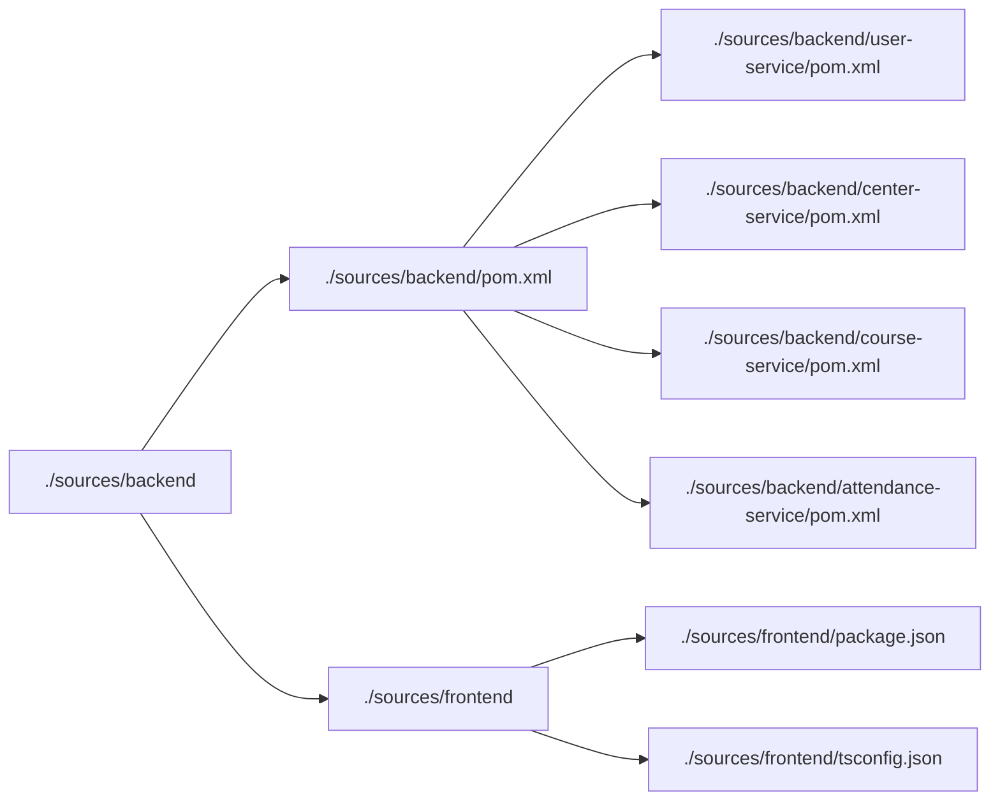

## 📊 Package Naming Conventions
All Java packages adhere to the base prefix: `org.nlh4j.membershiphub`.

## 📁 Technology Stack
### Backend
- **Java Version:** 17 LTS
- **Quarkus Version:**
```
</EXISTING_DOCUMENT_CONTENT>


*   Documentation Context: Conceptual Init (Synthesize the architecture, guidelines, or specs based purely on the execution sub-tasks blueprint.)


### 📋 EXECUTION SUB-TASKS & DOCUMENT CONTENT TO WRITE
['Soạn thảo tài liệu Markdown tại ./sources/docs/architecture/attendance-architecture.md mô tả kiến trúc attendance-service gồm sơ đồ C4 Container với các thành phần REST Controller, Service, Repository, Kafka Producer, QrPayloadDecoder. Tài liệu phải liệt kê đầy đủ Tag ID [REQ-012], [REQ-013], [ARC-007], [EXC-001], [EXC-002], [EXC-005]. Bao gồm sơ đồ Mermaid flowchart mô tả các bước xử lý QR scan: (1) Mobile app scan QR, (2) Decode base64 payload, (3) Validate enrollment, (4) Check idempotency, (5) Persist hoặc trả duplicate, (6) Publish Kafka event.']

---

### ⚙️ TECHNICAL WRITER EXECUTION INSTRUCTION:

Please read the comprehensive architectural constraints, workspace folder guardrails, and detailed sub-task document specifications provided above. Analyze the `<EXISTING_DOCUMENT_CONTENT>` layout, you MUST precisely insert the new architectural specifications into their logical structural sections within the current document text. Do NOT overwrite or shrink the pre-existing enterprise content blocks.


Ensure that you read the exact Tag IDs from the `['[REQ-012]', '[REQ-013]', '[ARC-007]', '[DOC-001]']` variable, and permanently burn those codes into the generated documentation layout (inside the table columns or the dedicated Traceability Matrix Reference section). Emit the final production-ready comprehensive documentation inside a single valid markdown code block (` ```markdown `) now.
* **📝 Response**:
```markdown
# 🏛️ Scaffolding Architecture Documentation

## 📊 Overview
The Membership Hub project utilizes a multi-module Maven architecture, comprising a root `membership-hub-backend` project and four microservices: `user-service`, `center-service`, `course-service`, and `attendance-service`. This documentation outlines the scaffolding structure, package naming conventions, and technology stack.

## 📁 Directory Structure


## 📊 Package Naming Conventions
All Java packages adhere to the base prefix: `org.nlh4j.membershiphub`.

## 📁 Technology Stack
### Backend
- **Java Version:** 17 LTS
- **Quarkus Version:** 3.15.1

---

## 🏗️ Attendance Service Architecture
The `attendance-service` is responsible for real-time QR-based attendance tracking, ensuring high availability and idempotency.

### 🧩 C4 Container Components
- **REST Controller:** Exposes `/api/v1/attendance/scan` for mobile ingestion.
- **Service Layer:** Orchestrates business logic, including payload decoding and enrollment validation.
- **Repository:** Manages persistence in PostgreSQL with composite unique constraints.
- **Kafka Producer:** Publishes `attendance-recorded` events for downstream notification processing.
- **QrPayloadDecoder:** Utility for base64 decoding and schema validation of QR data.

### 🔄 QR Scan Processing Flow
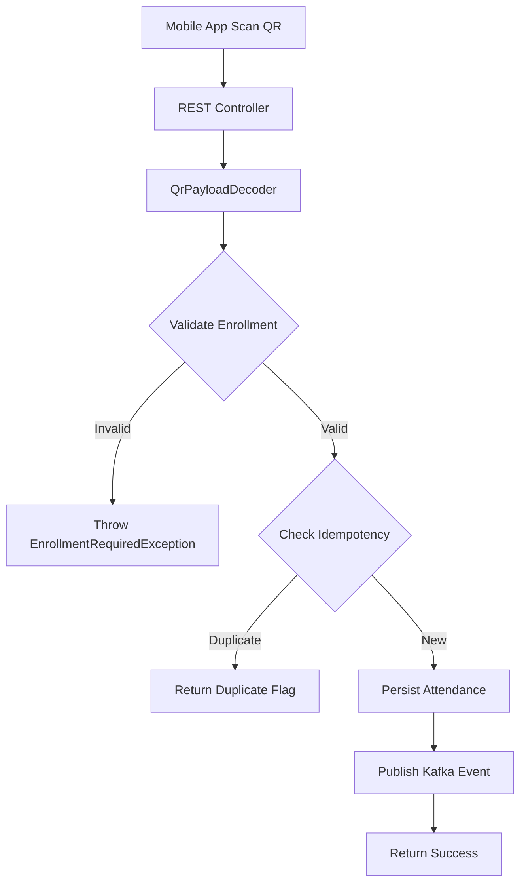

### 📋 Traceability Matrix Reference
| Component | Requirement Tag IDs |
| :--- | :--- |
| QR Scan Processing | [REQ-012], [REQ-013], [ARC-007] |
| Exception Handling | [EXC-001], [EXC-002], [EXC-005] |
| Documentation | [DOC-001] |

### ⚠️ Exception Handling Strategy
- **[EXC-001] Network Drop:** Handled via client-side retry queue.
- **[EXC-002] Duplicate Scan:** Handled via database composite unique constraint `(student_id, course_id, attendance_date)`.
- **[EXC-005] FIFO Recovery:** Pending requests are processed in chronological order upon service restoration.
```

