# YÊU CẦU PHẦN MỀM CHÍNH THỨC: membership-hub

## 📊 ĐIỀU KHIỂN TÀI LIỆU

| Mục | Chi tiết |
| :--- | :--- |
| **ID Yêu cầu phần mềm** | SRS-20260913143847 |
| **Tên dự án** | membership-hub |
| **Phiên bản** | 1.0 (Cơ sở) |
| **Ngày giờ** | 2026/09/13 14:38:47 |
| **Tác giả** | Trình phân tích nghiệp vụ cấp cao (BA) / Chiến lược sản phẩm (BA Agent) |
| **Phê duyệt** | Đang chờ xem xét của Ban quản trị Kỹ thuật |

## 1. TỔNG QUAN DỰ ÁN & KIẾN TRÚC TOÀN CẦU

### 1.1 Mục tiêu sản phẩm & Giá trị cốt lõi

- Cung cấp nền tảng thống nhất để quản lý thành viên đa trung tâm.
- Kích hoạt theo dõi tham dự thời gian thực thông qua quét mã QR.
- Cung cấp thẻ thành viên kỹ thuật số với tính năng đếm ngày hiệu lực.
- Hỗ trợ giao tiếp đa kênh (web, mobile, nhóm Zalo).
- Giá trị cốt lõi: độ tin cậy, khả năng mở rộng, bảo mật, thân thiện với người dùng, hỗ trợ đa ngôn ngữ.

### 1.2 Người dùng mục tiêu

- Quản trị viên hệ thống (siêu người dùng toàn cầu)
- Quản trị viên trung tâm (quản lý cấp trung tâm)
- Quản lý (phụ quản trị viên, quyền hạn hạn chế)
- Giáo viên (xem lịch trình khóa học chỉ đọc)
- Học viên (duyệt khóa học, đăng ký, xem thẻ thành viên)
- Người dùng ứng dụng di động (các vai trò tương tự, giao diện phản hồi)

### 1.3 Ma trận RBAC toàn cầu

- [ARC-001] Quản trị viên hệ thống: toàn quyền trên toàn bộ trung tâm.
- [ARC-002] Quản trị viên trung tâm: toàn quyền trong trung tâm của mình, không thể ảnh hưởng đến các trung tâm khác.
- [ARC-003] Quản lý: có thể tạo thông báo, quản lý học viên, chỉ định học viên hiện có cho các khóa học, xem danh sách khóa học, không thể chỉnh sửa khóa học hoặc chỉ định giáo viên.
- [ARC-004] Giáo viên: xem các khóa học của mình, danh sách học viên, lịch trình; chỉ đọc.
- [ARC-005] Học viên: duyệt các khóa học, đăng ký các khóa học mới, xem thẻ thành viên của mình (số ngày còn lại), gia hạn ngày thẻ.

### 1.4 Kiến trúc & Lưu lượng dữ liệu (luồng chính)

- [ARC-006] Lưu lượng xác thực: hỗ trợ email/mật khẩu, Firebase, Google, Facebook qua OAuth2; cấp token JWT với thời gian hết hạn 15 phút và token làm mới.
- [ARC-007] Lưu lượng xử lý QR tham dự: ứng dụng di động quét QR, gửi ID học viên và dấu thời gian đến backend; dịch vụ xác thực và ghi lại tham dự một cách idempotent.
- [ARC-008] Lưu lượng giao tiếp thông báo: hệ thống kích hoạt thông báo đẩy đến ứng dụng di động và đăng bài lên nhóm Zalo được chỉ định cho các thông báo, chỉ định khóa học và cảnh báo tham dự.
- [ARC-009] Lưu lượng tích hợp backend ứng dụng di động: frontend Next.js tiêu thụ REST APIs; xác thực qua token bearer; hỗ trợ bộ nhớ đệm ngoại tuyến cho kết nối hạn chế.

## 2. CÁC MÔ-ĐUN CHỨC NĂNG NÂNG CAO (LẶP LẠI CHO MỖI MÔ-ĐUN/HÌNH MẶT ĐƯỢC PHÁT HIỆN TRONG ĐẦU VÀO THÔ)

### 2.1 Quản lý người dùng

#### 2.1.1 Đăng ký người dùng

- **[REQ-001]** Đăng ký người dùng: Là một người dùng tiềm năng, tôi muốn đăng ký bằng email và mật khẩu (hoặc nhà cung cấp xã hội) để có thể có tài khoản trong hệ thống.
  - **Tiêu chí chấp nhận**:
    - Cho một người dùng cung cấp một email duy nhất, một mật khẩu mạnh và đồng ý với các điều khoản, Khi họ gửi biểu mẫu đăng ký, Hệ thống sẽ xác thực đầu vào, tạo một bản ghi người dùng mới với vai trò ‘Học viên’ (hoặc ‘Giáo viên’ nếu được mời), và trả về một phản hồi thành công với một mã thông báo JWT. *[REQ-001]*
  - **Dữ liệu đầu vào & Xác thực trường**:
    - Email: bắt buộc, tối đa 255 ký tự, phải chứa một dấu ‘@’ và một phần miền (ví dụ: user@example.com). Phải là duy nhất.
    - Mật khẩu: bắt buộc, tối thiểu 8 ký tự, ít nhất một chữ hoa, một chữ thường, một chữ số, một ký tự đặc biệt.
    - Điều khoản: ô chọn bắt buộc.

#### 2.1.2 Xác thực xã hội

- **[REQ-002]** Xác thực xã hội: Là một người dùng, tôi muốn đăng nhập/đăng ký bằng Firebase, Google hoặc Facebook OAuth để có thể tận dụng các thông tin đăng nhập hiện có.
  - **Tiêu chí chấp nhận**:
    - Cho một người dùng chọn một nhà cung cấp xã hội, Khi họ xác thực thông qua cửa sổ bật lên của nhà cung cấp, Hệ thống nhận một mã OAuth2, trao đổi nó để lấy thông tin người dùng, tạo hoặc cập nhật bản ghi người dùng cục bộ và cấp một mã thông báo JWT. *[REQ-002]*
  - **Dữ liệu đầu vào & Xác thực trường**: mã thông báo nhà cung cấp, hình ảnh hồ sơ tùy chọn.

#### 2.1.3 Gán vai trò người dùng

- **[REQ-003]** Gán vai trò người dùng: Là một quản trị viên, tôi muốn gán hoặc thay đổi vai trò của một người dùng (Quản trị viên hệ thống, Quản trị viên trung tâm, Quản lý, Giáo viên, Học viên) để đảm bảo rằng các quyền hạn được áp dụng đúng cách.
  - **Tiêu chí chấp nhận**:
    - Cho một quản trị viên chọn một người dùng và một vai trò mới, Khi việc gán được xác nhận, Cột vai trò của người dùng sẽ được cập nhật và các quyền hạn phù hợp sẽ được áp dụng ngay lập tức. *[REQ-003]*
  - **Dữ liệu đầu vào & Xác thực trường**: danh sách thả vai trò, bản ghi nhật ký kiểm toán bắt buộc.

### 2.2 Quản lý trung tâm

#### 2.2.1 Xem danh sách trung tâm

- **[REQ-004]** Xem danh sách trung tâm: Là bất kỳ người dùng đã xác thực nào, tôi muốn xem danh sách tất cả các trung tâm với địa chỉ, mã số thuế và liên hệ quản trị viên để có thể xác định các trung tâm liên quan.
  - **Tiêu chí chấp nhận**:
    - Cho một người dùng điều hướng đến trang Trung tâm, Khi yêu cầu hoàn tất, Một bảng trung tâm (Tên, Địa chỉ, Mã số thuế, Liên hệ quản trị viên) sẽ được hiển thị. *[REQ-004]*
  - **Dữ liệu đầu vào & Xác thực trường**: Không có (chỉ đọc).

#### 2.2.2 Tạo/Chỉnh sửa/Xóa trung tâm

- **[REQ-005]** Tạo/Chỉnh sửa/Xóa trung tâm: Là một Quản trị viên hệ thống, tôi muốn thêm, chỉnh sửa hoặc xóa một bản ghi trung tâm để thông tin trung tâm luôn được cập nhật.
  - **Tiêu chí chấp nhận**:
    - Cho một Quản trị viên hệ thống cung cấp tên trung tâm, địa chỉ, mã số thuế, điện thoại và email liên hệ chính, Khi hành động lưu được thực hiện, Trung tâm sẽ được lưu và xuất hiện trong danh sách; nếu có mã số thuế trùng lặp tồn tại, thao tác sẽ thất bại với một lỗi xung đột. *[REQ-005]*
  - **Dữ liệu đầu vào & Xác thực trường**:
    - Tên: bắt buộc, tối đa 100 ký tự.
    - Địa chỉ: bắt buộc, tối đa 255 ký tự.
    - Mã số thuế: bắt buộc, số, 10-13 chữ số, duy nhất.
    - Điện thoại liên hệ: tùy chọn, có thể bao gồm +, chữ số, khoảng trắng, dấu gạch ngang, dấu ngoặc.
    - Email liên hệ: tùy chọn, phải có định dạng email hợp lệ.

#### 2.2.3 Gán quản trị viên trung tâm

- **[REQ-006]** Gán quản trị viên trung tâm: Là một Quản trị viên hệ thống, tôi muốn gán hoặc hủy gán một người dùng làm Quản trị viên trung tâm cho một trung tâm cụ thể để ủy quyền quản lý.
  - **Tiêu chí chấp nhận**:
    - Cho một Quản trị viên hệ thống chọn một người dùng và một trung tâm, Khi hành động gán được xác nhận, Vai trò của người dùng sẽ được đặt thành ‘Quản trị viên trung tâm’ và ID trung tâm sẽ được ghi lại; hủy gán sẽ đảo ngược thao tác này. *[REQ-006]*
  - **Dữ liệu đầu vào & Xác thực trường**: ID người dùng, ID trung tâm.

### 2.3 Quản lý khóa học

#### 2.3.1 Xem danh sách khóa học

- **[REQ-007]** Xem danh sách khóa học: Là bất kỳ người dùng đã xác thực nào, tôi muốn xem tất cả các khóa học với lịch trình và giáo viên được chỉ định để có thể duyệt các khóa học.
  - **Tiêu chí chấp nhận**:
    - Cho một người dùng truy cập trang Khóa học, Khi yêu cầu hoàn tất, Một lưới hiển thị ID khóa học, Tiêu đề, Ngày bắt đầu, Ngày kết thúc, Tên giáo viên. *[REQ-007]*
  - **Dữ liệu đầu vào & Xác thực trường**: Không có.

#### 2.3.2 Tạo/Chỉnh sửa/Xóa khóa học (Tránh xung đột)

- **[REQ-008]** Tạo/Chỉnh sửa/Xóa khóa học (Tránh xung đột): Là một Quản trị viên hệ thống hoặc Quản trị viên trung tâm, tôi muốn quản lý các khóa học (thêm, chỉnh sửa, xóa) trong khi đảm bảo không có lịch trình trùng lặp cho cùng một giáo viên hoặc địa điểm.
  - **Tiêu chí chấp nhận**:
    - Cho một quản trị viên cung cấp Tiêu đề khóa học, Ngày bắt đầu, Ngày kết thúc, ID giáo viên, Khi hành động lưu được kích hoạt, Hệ thống sẽ xác thực rằng giáo viên chưa được chỉ định cho một khóa học khác trong các ngày giao nhau; nếu có xung đột, một lỗi sẽ được trả về; nếu không, khóa học sẽ được lưu. *[REQ-008]*
  - **Dữ liệu đầu vào & Xác thực trường**:
    - Tiêu đề: bắt buộc, tối đa 150 ký tự.
    - Ngày bắt đầu/Ngày kết thúc: bắt buộc, Ngày kết thúc >= Ngày bắt đầu.
    - ID giáo viên: bắt buộc, khóa ngoại.
    - Logic kiểm tra trùng lặp được thực hiện ở cấp độ DB/trigger.

#### 2.3.3 Chỉ định giáo viên cho khóa học

- **[REQ-009]** Chỉ định giáo viên cho khóa học: Là một Quản trị viên hệ thống, tôi muốn chỉ định hoặc hủy chỉ định giáo viên cho các khóa học để cập nhật trách nhiệm giảng dạy.
  - **Tiêu chí chấp nhận**:
    - Cho một quản trị viên chọn một khóa học và một giáo viên, Khi hành động chỉ định được thực hiện, Bản ghi ánh xạ khóa học-giáo viên sẽ được tạo và một thông báo sẽ được đưa vào hàng đợi cho ứng dụng di động của giáo viên; hủy chỉ định sẽ xóa bản ghi này. *[REQ-009]*
  - **Dữ liệu đầu vào & Xác thực trường**: ID khóa học, ID giáo viên (phải tồn tại).

### 2.4 Đăng ký học viên & Đăng ký

#### 2.4.1 Duyệt khóa học

- **[REQ-010]** Duyệt khóa học: Là một Học viên, tôi muốn duyệt các khóa học có sẵn (loại trừ các khóa học đã đăng ký) để có thể chọn các khóa học để tham gia.
  - **Tiêu chí chấp nhận**:
    - Cho một Học viên đăng nhập và điều hướng đến trang Duyệt Khóa học, Khi yêu cầu hoàn tất, Một danh sách các khóa học với dung lượng và lịch trình sẽ được hiển thị, loại trừ các khóa học mà học viên đã có bản ghi đăng ký. *[REQ-010]*
  - **Dữ liệu đầu vào & Xác thực trường**: Không có.

#### 2.4.2 Đăng ký khóa học của học viên

- **[REQ-011]** Đăng ký khóa học của học viên: Là một Học viên, tôi muốn đăng ký cho một khóa học (hiện có hoặc mới), tự động tạo tài khoản Học viên nếu thiếu và chỉ định học viên cho khóa học.
  - **Tiêu chí chấp nhận**:
    - Cho một Học viên chọn một khóa học và gửi đăng ký, Khi backend xử lý yêu cầu, Một bản ghi đăng ký mới sẽ được tạo; nếu học viên không có tài khoản cục bộ, một tài khoản mới sẽ được tạo với vai trò ‘Học viên’; một thông báo sẽ được đưa vào hàng đợi cho ứng dụng di động của học viên và nhóm Zalo của trung tâm. *[REQ-011]*
  - **Dữ liệu đầu vào & Xác thực trường**:
    - ID khóa học: bắt buộc, phải là khóa học đang hoạt động.
    - ID học viên: được lấy từ mã thông báo xác thực (hoặc được tạo tự động).

### 2.5 Tham dự & Quét QR

#### 2.5.1 Ghi nhận tham dự QR

- **[REQ-012]** Ghi nhận tham dự QR: Là một Học viên (qua ứng dụng di động), tôi muốn quét mã QR khi bắt đầu lớp học để ghi lại tham dự cho ngày hiện tại.
  - **Tiêu chí chấp nhận**:
    - Cho một Học viên mở máy quét, quét một mã QR khóa học hợp lệ và xác nhận tham dự, Khi API nhận payload, Hệ thống sẽ xác thực mối quan hệ học viên-khóa học, tạo một Bản ghi Tham dự với dấu thời gian và trả về một phản hồi thành công; các lần quét trùng lặp trong cùng một ngày sẽ bị bỏ qua. *[REQ-012]*
  - **Dữ liệu đầu vào & Xác thực trường**:
    - Payload QR: chuỗi base64 chứa ID học viên và ID khóa học.
    - Xác thực: học viên phải được đăng ký trong khóa học cho ngày đó.

#### 2.5.2 Idempotency tham dự

- **[REQ-013]** Idempotency tham dự: Dịch vụ tham dự phải đảm bảo rằng nhiều lần quét từ cùng một học viên cho cùng một khóa học trong cùng một ngày sẽ tạo ra một bản ghi tham dự duy nhất.
  - **Tiêu chí chấp nhận**:
    - Cho một học viên quét một QR hai lần trong vòng một phút, Khi dịch vụ xử lý cả hai yêu cầu, Chỉ một hàng tham dự sẽ được tạo; các yêu cầu tiếp theo sẽ trả về một thành công với một cờ ‘đã ghi lại’. *[REQ-013]*
  - **Dữ liệu đầu vào & Xác thực trường**: Khóa hợp thành duy nhất (ID học viên, ID khóa học, Ngày).

### 2.6 Quản lý thẻ học viên

#### 2.6.1 Hiển thị hiệu lực thẻ

- **[REQ-014]** Hiển thị hiệu lực thẻ: Là một Học viên, tôi muốn xem thẻ thành viên của mình hiển thị số ngày hiệu lực còn lại để biết khi nào cần gia hạn.
  - **Tiêu chí chấp nhận**:
    - Cho một Học viên mở trang Thẻ, Khi yêu cầu tải, Giao diện sẽ hiển thị tổng số ngày hiệu lực, ngày đã sử dụng và ngày còn lại; dữ liệu được lấy từ thực thể StudentCard. *[REQ-014]*
  - **Dữ liệu đầu vào & Xác thực trường**: Không có (chỉ đọc).

#### 2.6.2 Gia hạn thẻ

- **[REQ-015]** Gia hạn thẻ: Là một Học viên, tôi muốn gia hạn hiệu lực thẻ thành viên bằng cách thanh toán phí, cập nhật ngày kết thúc.
  - **Tiêu chí chấp nhận**:
    - Cho một Học viên chọn một kỳ hạn gia hạn (ví dụ: 30 ngày), xác nhận thanh toán, Khi dịch vụ thanh toán xác nhận thành công, Ngày kết thúc của StudentCard sẽ được gia hạn thêm số ngày đã chọn và một thông báo xác nhận sẽ được gửi. *[REQ-015]*
  - **Dữ liệu đầu vào & Xác thực trường**:
    - Ngày gia hạn: số nguyên, 1-365.
    - Tích hợp cổng thanh toán yêu cầu (ngoài phạm vi).

### 2.7 Thông báo & Giao tiếp

#### 2.7.1 Kích hoạt thông báo

- **[REQ-016]** Kích hoạt thông báo: Khi một quản trị viên tạo thông báo, chỉ định giáo viên cho một khóa học hoặc đăng ký học viên, hệ thống phải tạo một thông báo đến ứng dụng di động của học viên và đăng một tin nhắn lên nhóm Zalo được chỉ định.
  - **Tiêu chí chấp nhận**:
    - Cho một quản trị viên thực hiện một hành động yêu cầu thông báo, Khi hành động được lưu, Một Bản ghi Thông báo sẽ được tạo, một payload thông báo đẩy sẽ được đưa vào hàng đợi cho ứng dụng di động và một tin nhắn văn bản sẽ được gửi đến nhóm chat Zalo. *[REQ-016]*
  - **Dữ liệu đầu vào & Xác thực trường**: Đối tượng mục tiêu (học viên, giáo viên, nhóm), nội dung tin nhắn, phương tiện tùy chọn.

### 2.8 Quản lý khuyến mãi & Thông báo

#### 2.8.1 Quản lý khuyến mãi

- **[REQ-017]** Quản lý khuyến mãi: Là một Quản trị viên trung tâm hoặc Quản lý, tôi muốn tạo, chỉnh sửa hoặc xóa các khuyến mãi (giảm giá, ưu đãi) với ngày bắt đầu/ngày kết thúc để học viên có thể thấy các ưu đãi áp dụng.
  - **Tiêu chí chấp nhận**:
    - Cho một quản trị viên cung cấp Tên khuyến mãi, mô tả, điều kiện, ngày bắt đầu, ngày kết thúc, Khi lưu, Khuyến mãi sẽ xuất hiện trong danh sách hiển thị cho học viên; nếu ngày kết thúc bị bỏ trống, khuyến mãi sẽ được xem là dài hạn. *[REQ-017]*
  - **Dữ liệu đầu vào & Xác thực trường**:
    - Tên: bắt buộc, tối đa 100 ký tự.
    - Ngày bắt đầu/Ngày kết thúc: tùy chọn, định dạng ngày YYYY-MM-DD.
    - Mô tả: tối đa 500 ký tự.

#### 2.8.2 Quản lý thông báo

- **[REQ-018]** Quản lý thông báo: Là một Quản trị viên trung tâm hoặc Quản lý, tôi muốn tạo, chỉnh sửa hoặc xóa các thông báo với ngày hết hạn tùy chọn để phát sóng đến tất cả người dùng.
  - **Tiêu chí chấp nhận**:
    - Cho một quản trị viên nhập Tiêu đề thông báo, nội dung, ngày hết hạn tùy chọn, Khi lưu, Thông báo sẽ được hiển thị trên toàn trang web; nếu ngày hết hạn được đặt, nó sẽ tự động biến mất sau ngày đó. *[REQ-018]*
  - **Dữ liệu đầu vào & Xác thực trường**:
    - Tiêu đề: bắt buộc, tối đa 150 ký tự.
    - Nội dung: bắt buộc, tối đa 2000 ký tự.

### 2.9 Tích hợp Chatbot Dịch vụ Khách hàng AI

#### 2.9.1 Tích hợp Chatbot AI

- **[REQ-019]** Tích hợp Chatbot AI: Là bất kỳ người dùng nào, tôi muốn tương tác với một chatbot AI có thể trả lời các truy vấn phổ biến về các khóa học, giáo viên, trung tâm và trạng thái tài khoản.
  - **Tiêu chí chấp nhận**:
    - Cho một người dùng mở tiện ích chat, Khi họ đặt một câu hỏi, AI sẽ trả về một câu trả lời liên quan hoặc thăng cấp đến hỗ trợ người dùng nếu độ tin cậy thấp. *[REQ-019]*
  - **Dữ liệu đầu vào & Xác thực trường**: Văn bản đầu vào, thời gian chờ phiên.

### 2.10 Tính năng cốt lõi Ứng dụng di động

#### 2.10.1 Giao diện người dùng cụ thể cho vai trò

- **[REQ-020]** Giao diện người dùng cụ thể cho vai trò: Là một người dùng di động, tôi muốn một giao diện phản hồi tương thích với chức năng web cho vai trò được chỉ định của tôi (Học viên, Giáo viên, Quản trị viên, v.v.).
  - **Tiêu chí chấp nhận**:
    - Cho một người dùng đăng nhập trên Android hoặc iOS, Khi ứng dụng tải, Menu điều hướng và màn hình phù hợp sẽ được hiển thị dựa trên vai trò của người dùng. *[REQ-020]*
  - **Dữ liệu đầu vào & Xác thực trường**: Không có.

#### 2.10.2 Thông báo đẩy di động

- **[REQ-021]** Thông báo đẩy di động: Là một người dùng đã đăng ký, tôi muốn nhận thông báo đẩy trên thiết bị di động của mình cho các xác nhận tham dự, thông báo mới và tin nhắn nhắc nhở.
  - **Tiêu chí chấp nhận**:
    - Cho một sự kiện backend kích hoạt một thông báo đẩy, Khi mã thông báo thiết bị được đăng ký, Thông báo sẽ được giao qua Firebase Cloud Messaging (FCM) hoặc APNs. *[REQ-021]*
  - **Dữ liệu đầu vào & Xác thực trường**: Mã thông báo thiết bị, Nền tảng (iOS/Android).

### 2.11 Bản địa hóa & SEO

#### 2.11.1 Phát hiện ngôn ngữ mặc định

- **[REQ-022]** Phát hiện ngôn ngữ mặc định: Là một khách truy cập, tôi muốn hệ thống sử dụng tùy chọn ngôn ngữ đã chọn trước đó của tôi, trở về cài đặt trình duyệt, để có trải nghiệm cá nhân hóa.
  - **Tiêu chí chấp nhận**:
    - Cho một người dùng truy cập trang web, Khi hệ thống đánh giá ngôn ngữ, Nó sẽ chọn ngôn ngữ đã lưu nếu có; nếu không, nó sẽ sử dụng tiêu đề Accept-Language; giao diện sẽ được cập nhật phù hợp. *[REQ-022]*
  - **Dữ liệu đầu vào & Xác thực trường**: Không có.

#### 2.11.2 SEO đa ngôn ngữ

- **[REQ-023]** SEO đa ngôn ngữ: Nền tảng phải hỗ trợ SEO cho ít nhất tiếng Anh, tiếng Việt và tiếng Tây Ban Nha; mỗi trang phải bao gồm các thẻ meta và thuộc tính hreflang cụ thể theo ngôn ngữ.
  - **Tiêu chí chấp nhận**:
    - Cho một trang được yêu cầu với một ngôn ngữ cụ thể, Khi trang được hiển thị, HTML sẽ bao gồm một thẻ <html lang='en'> và các liên kết hreflang trỏ đến các phiên bản ngôn ngữ thay thế. *[REQ-023]*
  - **Dữ liệu đầu vào & Xác thực trường**: Mã ngôn ngữ (en, vi, es).

### 2.12 Báo cáo & Phân tích

#### 2.12.1 Tạo báo cáo tham dự

- **[REQ-024]** Tạo báo cáo tham dự: Là một quản trị viên, tôi muốn tạo báo cáo tham dự hàng ngày cho một trung tâm (CSV) hiển thị trạng thái tham dự của từng học viên.
  - **Tiêu chí chấp nhận**:
    - Cho một quản trị viên chọn một trung tâm và khoảng thời gian, Khi báo cáo được yêu cầu, Một tệp CSV sẽ được tạo với các cột: Tên học viên, Tên khóa học, Ngày tham dự, Trạng thái. *[REQ-024]*
  - **Dữ liệu đầu vào & Xác thực trường**:
    - Khoảng thời gian: bắt đầu ≤ kết thúc, tối đa 30 ngày.

#### 2.12.2 Bảng tổng quan đăng ký

- **[REQ-025]** Bảng tổng quan đăng ký: Là một Quản trị viên trung tâm, tôi muốn một bảng tổng quan thời gian thực tóm tắt tổng số học viên, các khóa học hoạt động và các buổi học sắp tới.
  - **Tiêu chí chấp nhận**:
    - Cho một quản trị viên mở bảng tổng quan, Khi dữ liệu làm mới, Các thẻ hiển thị tổng số học viên, các khóa học hoạt động, các buổi học sắp tới (7 ngày tới). *[REQ-025]*
  - **Dữ liệu đầu vào & Xác thực trường**: Khoảng thời gian làm mới có thể cấu hình (mặc định 15 phút).

## 3. LUỒNG EXCEPTION & TRƯỜNG HỢP BIÊN

- **[EXC-001]** Mất kết nối mạng & Kết nối trong quá trình quét QR:
  - Nếu một học viên quét một QR nhưng mạng không có sẵn, Khi ứng dụng thử lại yêu cầu sau khi kết nối lại, Tham dự sẽ được ghi lại một khi dịch vụ có thể truy cập được.
- **[EXC-002]** Gửi tham dự trùng lặp:
  - Nếu cùng một học viên quét cùng một QR khóa học nhiều lần trong cùng một ngày, Khi hệ thống phát hiện trùng lặp, Nó sẽ trả về một phản hồi thành công chỉ ra ‘đã ghi lại’ và không tạo thêm hàng.
- **[EXC-003]** Giao tiếp thông báo thất bại:
  - Khi một thông báo đẩy không thể được giao (ví dụ: mã thông báo thiết bị không hợp lệ), Hệ thống sẽ ghi lại sự cố và lên lịch thử lại tối đa ba lần trước khi đánh dấu là thất bại.
- **[EXC-004]** Xác thực đầu vào không hợp lệ (ví dụ: email không đúng định dạng, trường bắt buộc bị thiếu):
  - Nếu xác thực thất bại khi gửi biểu mẫu, Khi lỗi được trả về cho người dùng, Một tin nhắn rõ ràng liệt kê từng trường không hợp lệ và nhắc người dùng sửa đổi.
- **[EXC-005]** Khôi phục hệ thống sau sự cố:
  - Nếu dịch vụ trở nên không khả dụng, Khi nó khôi phục, Bất kỳ các lần quét tham dự đang chờ xử lý nào cũng được xử lý theo thứ tự FIFO và người dùng sẽ nhận được thông báo về các sự kiện đã khôi phục.

## 4. YÊU CẦU KHÔNG CHỨC NĂNG

- **[NFR-001]** Chỉ số hiệu suất:
  - Các phản hồi API cốt lõi (xác thực, ghi nhận tham dự, danh sách khóa học) phải hoàn thành trong 200 ms độ trễ trung bình.
  - Các truy vấn cơ sở dữ liệu phải được lập chỉ mục để hỗ trợ đọc dưới một giây cho đến 10 000 người dùng đồng thời.
- **[NFR-002]** Khả dụng:
  - Mục tiêu 99.9 % thời gian hoạt động hàng năm; SLA bao gồm chuyển đổi tự động qua các cụm GKE.
- **[NFR-003]** Bảo mật:
  - Tất cả dữ liệu trong quá trình truyền phải sử dụng TLS 1.3; mã hóa tại nghỉ với AES-256.
  - Mã thông báo truy cập JWT hết hạn sau 15 phút; mã thông báo làm mới có thời gian hết hạn 7 ngày.
  - Triển khai các biện pháp phòng ngừa hàng đầu của OWASP (tiêm SQL, XSS, CSRF).
- **[NFR-004]** Khả năng mở rộng & Khả dụng:
  - Mở rộng ngang các dịch vụ Quarkus qua Kubernetes HPA dựa trên CPU > 70 % hoặc độ trễ yêu cầu > 300 ms.
  - PostgreSQL bản sao đọc cho các công việc báo cáo.
- **[NFR-005]** Kích thước hình ảnh Docker:
  - Kích thước hình ảnh cơ sở < 200 MB; hình ảnh cuối cùng < 500 MB.
- **[NFR-006]** Nhật ký & Kiểm toán:
  - Tất cả các hành động của người dùng (thay đổi vai trò, bản ghi tham dự, thông báo) phải được ghi lại với dấu thời gian, ID người dùng và chi tiết hành động; nhật ký được giữ trong 1 năm.
- **[NFR-007]** Hỗ trợ đa ngôn ngữ:
  - Các chuỗi UI phải được tách; hỗ trợ tiếng Anh, tiếng Việt, tiếng Tây Ban Nha; chuyển đổi ngôn ngữ không tải lại trang nơi có thể.
- **[NFR-008]** Tuân thủ GDPR/CCPA:
  - Xóa dữ liệu cá nhân theo yêu cầu của người dùng; xuất dữ liệu dưới dạng JSON; quản lý đồng ý cho các giao tiếp tiếp thị.
- **[NFR-009]** Sao lưu & Khôi phục thảm họa:
  - Sao lưu toàn bộ PostgreSQL hàng ngày; khôi phục điểm trong thời gian lên đến 24 giờ; sao lưu cụm GKE đến vùng khác.

## 5. TỪ ĐIỂN DỮ LIỆU SỞ ĐỒNG

| Thực thể | Trường | Kiểu dữ liệu | Ràng buộc | Mô tả |
|--------|-------|-----------|-------------|-------------|
| Users | user_id | UUID | PK, not null | Định danh duy nhất |
| | email | VARCHAR(255) | not null, unique | Định danh đăng nhập chính |
| | password_hash | CHAR(60) | not null | Mã hóa bcrypt |
| | full_name | VARCHAR(100) | not null | Tên đầy đủ |
| | role_id | SMALLINT | FK → Roles.role_id | Vai trò được chỉ định |
| | provider | ENUM('local','firebase','google','facebook') | default 'local' | Nhà cung cấp xác thực |
| | created_at | TIMESTAMP | not null, default now() | Tạo tài khoản |
| | updated_at | TIMESTAMP | not null, default now() | Cập nhật cuối cùng |
| Centers | center_id | UUID | PK, not null | Định danh duy nhất |
| | name | VARCHAR(100) | not null | Tên trung tâm |
| | address | VARCHAR(255) | not null | Địa chỉ vật lý |
| | tax_id | VARCHAR(20) | unique, not null | Mã số thuế |
| | contact_phone | VARCHAR(20) | optional | Điện thoại liên hệ |
| | contact_email | VARCHAR(100) | optional | Email liên hệ |
| Courses | course_id | UUID | PK, not null | Định danh duy nhất |
| | title | VARCHAR(150) | not null | Tên khóa học |
| | description | TEXT | optional | Mô tả chi tiết |
| | start_date | DATE | not null | Ngày bắt đầu khóa học |
| | end_date | DATE | not null | Ngày kết thúc khóa học |
| | teacher_id | UUID | FK → Users.user_id | Giáo viên được chỉ định |
| | max_students | INT | default 30 | Sức chứa |
| Enrollments | enrollment_id | UUID | PK, not null | Định danh duy nhất |
| | student_id | UUID | FK → Users.user_id | Học viên đã đăng ký |
| | course_id | UUID | FK → Courses.course_id | Khóa học |
| | enrollment_date | TIMESTAMP | default now() | Ngày đăng ký |
| Attendance | attendance_id | UUID | PK, not null | Định danh duy nhất |
| | student_id | UUID | FK → Users.user_id | Học viên có mặt |
| | course_id | UUID | FK → Courses.course_id | Khóa học tham dự |
| | attendance_date | DATE | not null | Ngày tham dự |
| | timestamp | TIMESTAMP | default now() | Thời gian ghi nhận chính xác |
| StudentCards | card_id | UUID | PK, not null | Định danh duy nhất |
| | student_id | UUID | FK → Users.user_id | Chủ sở hữu |
| | issue_date | DATE | not null | Ngày phát hành thẻ |
| | validity_days | INT | not null | Tổng số ngày hiệu lực |
| | remaining_days | INT | computed | Số ngày còn lại đến hết hạn |
| Notifications | notification_id | UUID | PK, not null | Định danh duy nhất |
| | user_id | UUID | FK → Users.user_id (optional) | Người dùng mục tiêu |
| | group_zalo | VARCHAR(50) | optional | Nhóm Zalo mục tiêu |
| | message | TEXT | not null | Nội dung thông báo |
| | sent_at | TIMESTAMP | default now() | Ngày gửi |
| | delivered | BOOLEAN | default false | Trạng thái giao hàng |
| Roles | role_id | SMALLINT | PK | Định danh vai trò |
| | name | VARCHAR(30) | unique, not null | Tên vai trò |
| | description | VARCHAR(200) | optional | Mô tả vai trò |
| Promotions | promo_id | UUID | PK, not null | Định danh duy nhất |
| | code | VARCHAR(30) | unique | Mã giảm giá |
| | discount_percent | SMALLINT | not null | Phần trăm giảm giá |
| | start_date | DATE | optional | Ngày bắt đầu khuyến mãi |
| | end_date | DATE | optional | Ngày kết thúc khuyến mãi |
| | description | TEXT | optional | Chi tiết khuyến mãi |
| Announcements | announcement_id | UUID | PK, not null | Định danh duy nhất |
| | title | VARCHAR(150) | not null | Tiêu đề |
| | content | TEXT | not null | Nội dung |
| | start_date | DATE | optional | Ngày bắt đầu hiệu lực |
| | end_date | DATE | optional | Ngày kết thúc hiệu lực |
| SystemSettings | setting_key | VARCHAR(50) | PK | Khóa cấu hình |
| | setting_value | TEXT | not null | Giá trị cấu hình |
| | description | VARCHAR(200) | optional | Ý nghĩa của cài đặt |

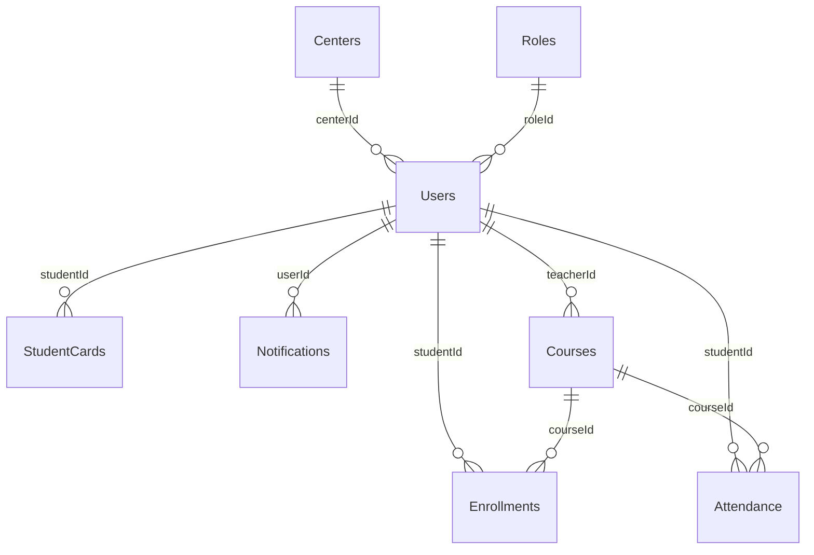

### 5.1 Chi tiết thực thể

#### 5.1.1 Users

| Trường | Kiểu dữ liệu | Ràng buộc | Mô tả |
|-------|-----------|-------------|-------------|
| user_id | uuid | PK, not null | Định danh duy nhất |
| email | varchar | not null, unique | Định danh đăng nhập chính |
| password_hash | char | not null | Mã hóa bcrypt |
| full_name | varchar | not null | Tên đầy đủ |
| role_id | smallint | FK → Roles.role_id | Vai trò được chỉ định |
| provider | enum | default 'local' | Nhà cung cấp xác thực |
| created_at | timestamp | not null, default now() | Tạo tài khoản |
| updated_at | timestamp | not null, default now() | Cập nhật cuối cùng |

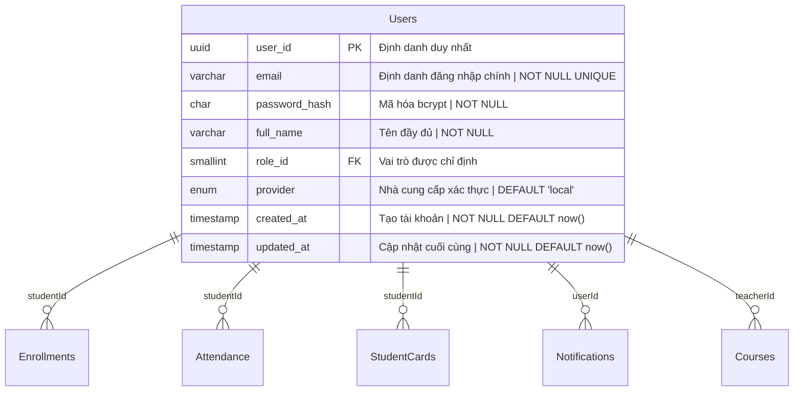

#### 5.1.2 Centers

| Trường | Kiểu dữ liệu | Ràng buộc | Mô tả |
|-------|-----------|-------------|-------------|
| center_id | uuid | PK, not null | Định danh duy nhất |
| name | varchar | not null | Tên trung tâm |
| address | varchar | not null | Địa chỉ vật lý |
| tax_id | varchar | unique, not null | Mã số thuế |
| contact_phone | varchar | optional | Điện thoại liên hệ |
| contact_email | varchar | optional | Email liên hệ |

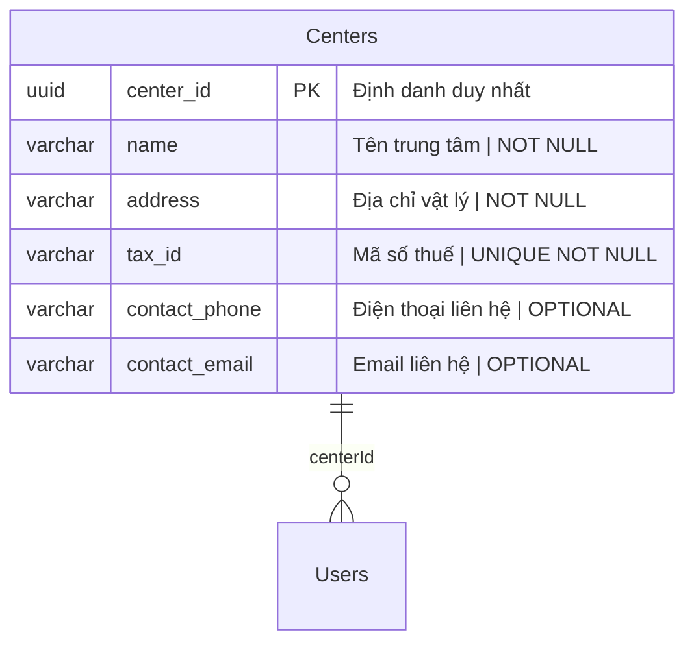

#### 5.1.3 Courses

| Trường | Kiểu dữ liệu | Ràng buộc | Mô tả |
|-------|-----------|-------------|-------------|
| course_id | uuid | PK, not null | Định danh duy nhất |
| title | varchar | not null | Tên khóa học |
| description | text | optional | Mô tả chi tiết |
| start_date | date | not null | Ngày bắt đầu khóa học |
| end_date | date | not null | Ngày kết thúc khóa học |
| teacher_id | uuid | FK → Users.user_id | Giáo viên được chỉ định |
| max_students | int | default 30 | Sức chứa |

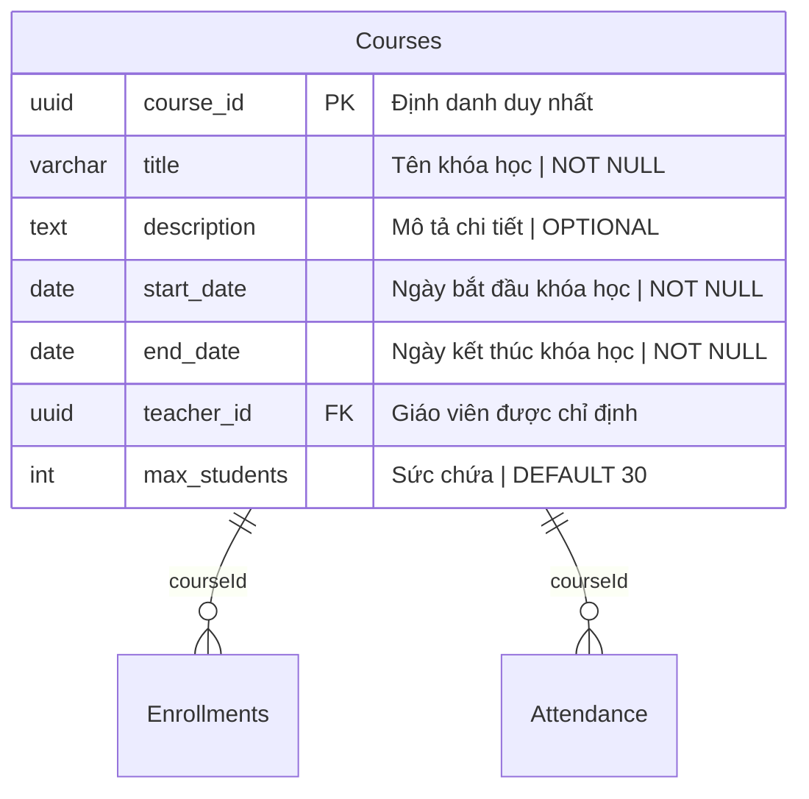

#### 5.1.4 Enrollments

| Trường | Kiểu dữ liệu | Ràng buộc | Mô tả |
|-------|-----------|-------------|-------------|
| enrollment_id | uuid | PK, not null | Định danh duy nhất |
| student_id | uuid | FK → Users.user_id | Học viên đã đăng ký |
| course_id | uuid | FK → Courses.course_id | Khóa học |
| enrollment_date | timestamp | default now() | Ngày đăng ký |

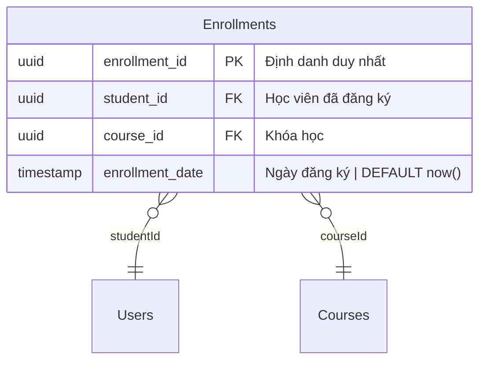

#### 5.1.5 Attendance

| Trường | Kiểu dữ liệu | Ràng buộc | Mô tả |
|-------|-----------|-------------|-------------|
| attendance_id | uuid | PK, not null | Định danh duy nhất |
| student_id | uuid | FK → Users.user_id | Học viên có mặt |
| course_id | uuid | FK → Courses.course_id | Khóa học tham dự |
| attendance_date | date | not null | Ngày tham dự |
| timestamp | timestamp | default now() | Thời gian ghi nhận chính xác |

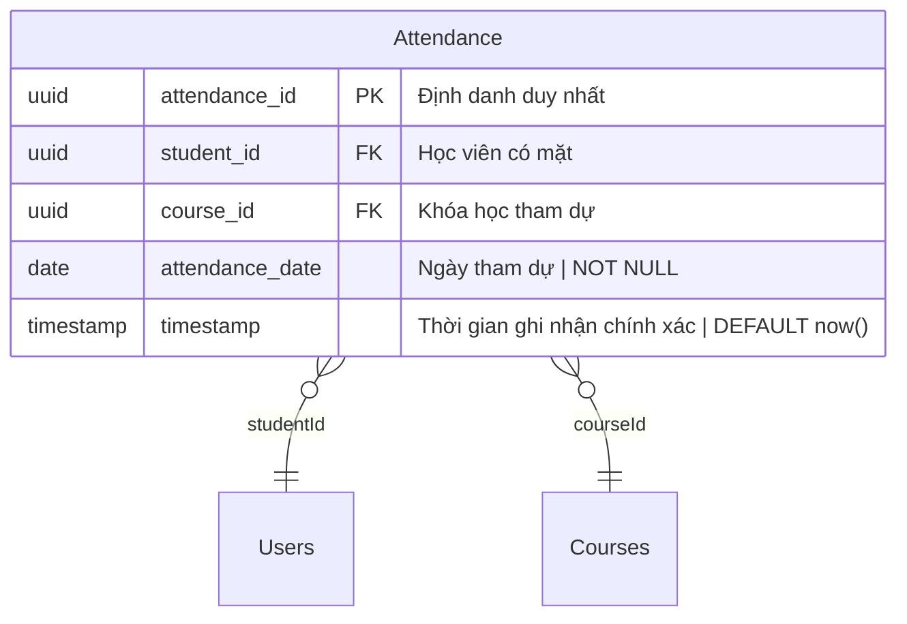

#### 5.1.6 StudentCards

| Trường | Kiểu dữ liệu | Ràng buộc | Mô tả |
|-------|-----------|-------------|-------------|
| card_id | uuid | PK, not null | Định danh duy nhất |
| student_id | uuid | FK → Users.user_id | Chủ sở hữu |
| issue_date | date | not null | Ngày phát hành thẻ |
| validity_days | int | not null | Tổng số ngày hiệu lực |
| remaining_days | int | computed | Số ngày còn lại đến hết hạn |

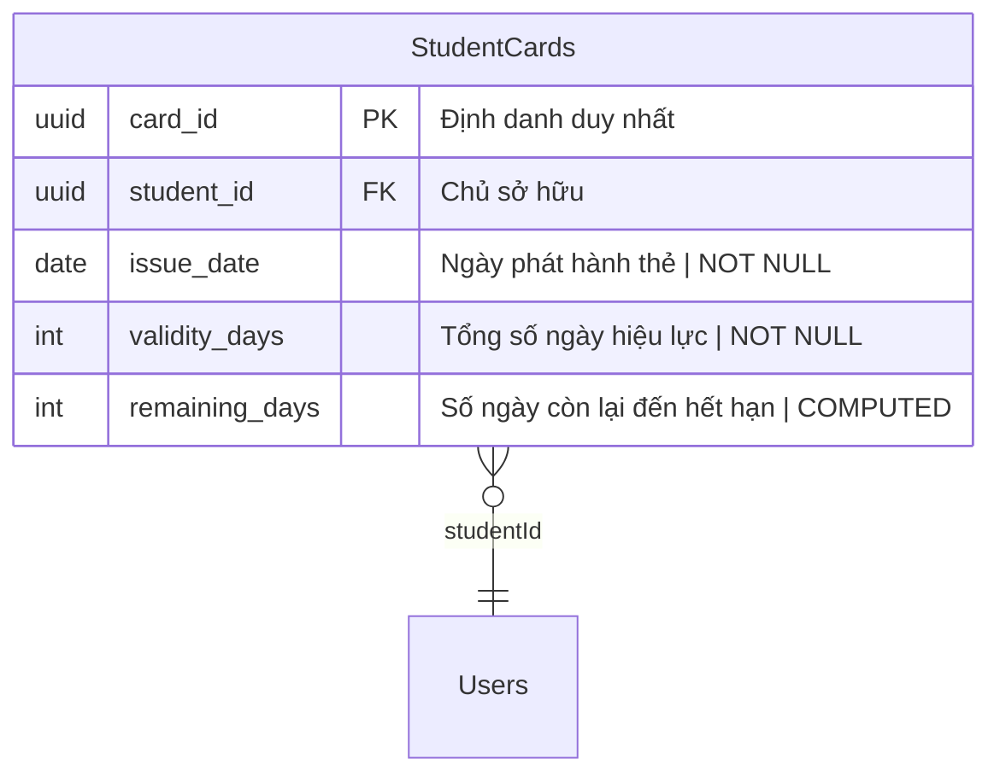

#### 5.1.7 Notifications

| Trường | Kiểu dữ liệu | Ràng buộc | Mô tả |
|-------|-----------|-------------|-------------|
| notification_id | uuid | PK, not null | Định danh duy nhất |
| user_id | uuid | FK → Users.user_id (optional) | Người dùng mục tiêu |
| group_zalo | varchar | optional | Nhóm Zalo mục tiêu |
| message | text | not null | Nội dung thông báo |
| sent_at | timestamp | default now() | Ngày gửi |
| delivered | boolean | default false | Trạng thái giao hàng |

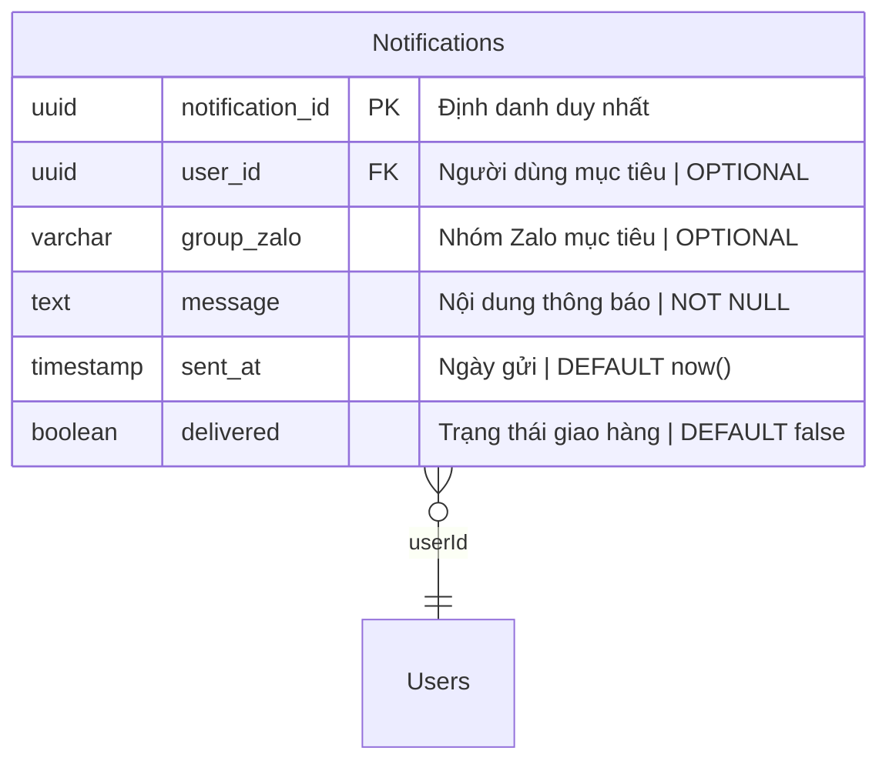

#### 5.1.8 Roles

| Trường | Kiểu dữ liệu | Ràng buộc | Mô tả |
|-------|-----------|-------------|-------------|
| role_id | smallint | PK | Định danh vai trò |
| name | varchar | unique, not null | Tên vai trò |
| description | varchar | optional | Mô tả vai trò |

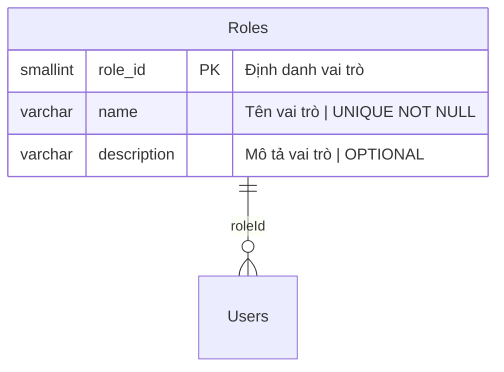

#### 5.1.9 Promotions

| Trường | Kiểu dữ liệu | Ràng buộc | Mô tả |
|-------|-----------|-------------|-------------|
| promo_id | uuid | PK, not null | Định danh duy nhất |
| code | varchar | unique | Mã giảm giá |
| discount_percent | smallint | not null | Phần trăm giảm giá |
| start_date | date | optional | Ngày bắt đầu khuyến mãi |
| end_date | date | optional | Ngày kết thúc khuyến mãi |
| description | text | optional | Chi tiết khuyến mãi |

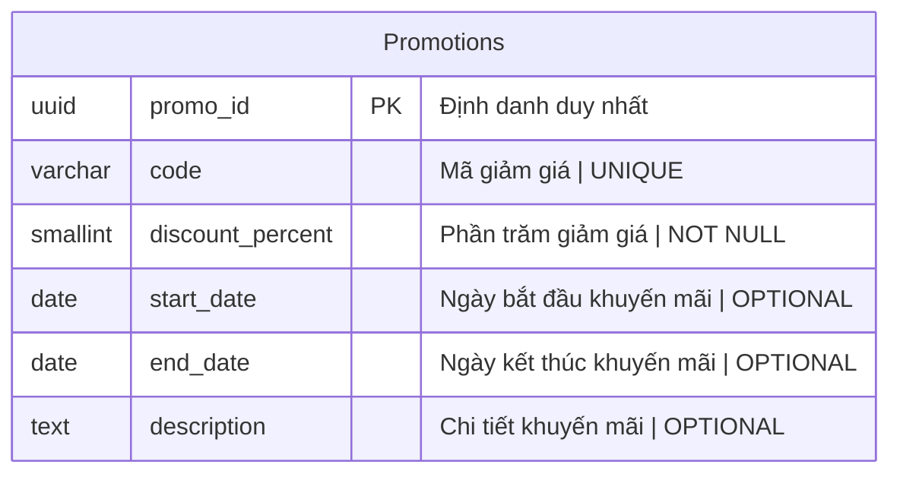

#### 5.1.10 Announcements

| Trường | Kiểu dữ liệu | Ràng buộc | Mô tả |
|-------|-----------|-------------|-------------|
| announcement_id | uuid | PK, not null | Định danh duy nhất |
| title | varchar | not null | Tiêu đề |
| content | text | not null | Nội dung |
| start_date | date | optional | Ngày bắt đầu hiệu lực |
| end_date | date | optional | Ngày kết thúc hiệu lực |

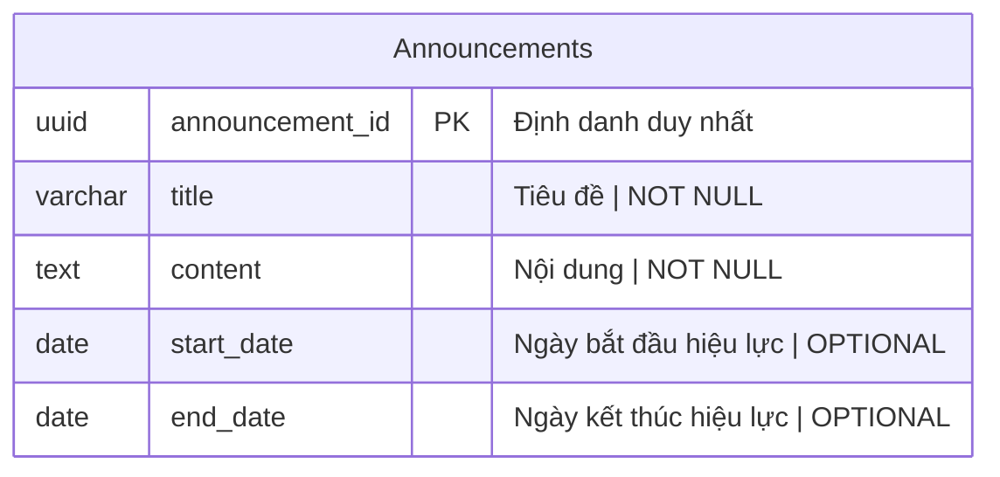

#### 5.1.11 SystemSettings

| Trường | Kiểu dữ liệu | Ràng buộc | Mô tả |
|-------|-----------|-------------|-------------|
| setting_key | varchar | PK | Khóa cấu hình |
| setting_value | text | not null | Giá trị cấu hình |
| description | varchar | optional | Ý nghĩa của cài đặt |

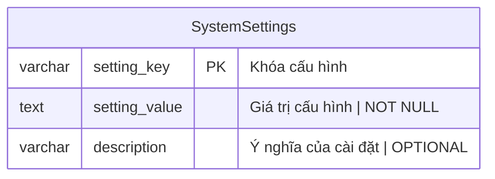