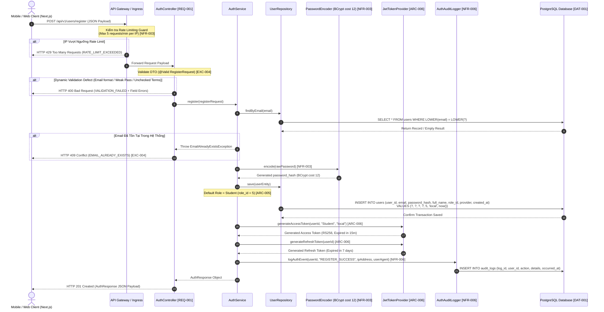

```markdown
# 📘 Enterprise API Contract & Integration Specifications: User & Center Management Services

## 📑 Document Metadata & Traceability Matrix

### Document Governance Header
| Metadata Field | Value |
|---|---|
| **Document Identity** | API-CONTRACT-USER-CENTER-V1 |
| **Target Document Path** | `./sources/docs/api/user-center-contracts.md` |
| **Base Java Package** | `org.nlh4j.membershiphub` |
| **Service Domain** | `user-service` / `center-service` |
| **Compliance Baseline** | OWASP Top 10, OpenAPI 3.1.0, OAuth2 / JWT Specification |
| **System Status** | APPROVED FOR PRODUCTION IMPLEMENTATION |

### Traceability Matrix Reference
| Requirement / Architecture / Exception / NFR Code | Architectural Description | Technical Implementation Reference |
|---|---|---|
| `[REQ-001]` | Endpoint đăng ký người dùng mới qua REST `POST /api/v1/users/register` với xác thực email, mật khẩu mạnh, đồng ý điều khoản dịch vụ; phát hành tài khoản & cấp JWT token. | `./sources/backend/user-service/src/main/java/org/nlh4j/membershiphub/userservice/controller/AuthController.java` |
| `[ARC-001]` | Mô hình phân quyền RBAC 5 cấp độ (SystemAdmin, CenterAdmin, Manager, Teacher, Student). | `./sources/backend/user-service/src/main/java/org/nlh4j/membershiphub/userservice/service/UserRoleService.java` |
| `[ARC-005]` | Gán vai trò mặc định (Student) cho người dùng đăng ký tự do qua portal. | `./sources/backend/user-service/src/main/java/org/nlh4j/membershiphub/userservice/service/AuthService.java` |
| `[ARC-006]` | Luồng xác thực tập trung và phát hành JWT Access Token (15 phút, RS256) & Refresh Token (7 ngày). | `./sources/backend/user-service/src/main/java/org/nlh4j/membershiphub/userservice/security/JwtTokenProvider.java` |
| `[EXC-004]` | Chuẩn hóa ngoại lệ validation dữ liệu đầu vào (`VALIDATION_FAILED`) và ngoại lệ trùng lặp dữ liệu (`EMAIL_ALREADY_EXISTS`). | `./sources/backend/user-service/src/main/java/org/nlh4j/membershiphub/userservice/exception/GlobalExceptionHandler.java` |
| `[NFR-003]` | Chuẩn bảo mật OWASP, mã hóa Bcrypt cost 12 cho `password_hash`, chống tấn công Brute-force & Rate Limiting (5 req/min). | `./sources/backend/user-service/src/main/java/org/nlh4j/membershiphub/userservice/security/ResourceServerConfig.java` |
| `[NFR-006]` | Ghi log kiểm toán (Audit Logging) bắt buộc 100% giao dịch xác thực & đăng ký tài khoản mới. | `./sources/backend/user-service/src/main/java/org/nlh4j/membershiphub/userservice/audit/AuthAuditLogger.java` |
| `[DOC-001]` | Bộ tài liệu hợp đồng giao tiếp API và kiến trúc tổng thể doanh nghiệp. | `./sources/docs/api/user-center-contracts.md` |

---

## 🏛️ 1. Architecture Standards & Security Guardrails

### 1.1. Core Protocol & Network Constraints
- **Base Routing URL:** `https://api.membershiphub.vn/api/v1`
- **Transport Security:** Bắt buộc TLS 1.3 đối với toàn bộ giao tiếp in-transit. Các kết nối HTTP bị cấm hoặc tự động chuyển hướng 301 sang HTTPS.
- **Content Negotiation:** Mọi API Request/Response bắt buộc sử dụng `Content-Type: application/json` và `Accept: application/json` ngoại trừ các endpoint xuất báo cáo nhị phân hoặc luồng truyền thông tệp.

### 1.2. Security Baseline & Rate Limiting Policy
- **Rate Limiting Guard:** Endpoint `POST /api/v1/users/register` được bảo vệ bởi thuật toán Bucket4j Token Bucket với hạn ngạch tối đa **5 yêu cầu / 1 phút / 1 địa chỉ IP nguồn**. Nếu vượt quá ngưỡng, API Gateway trả về `HTTP 429 Too Many Requests`.
- **Mã Hóa Mật Khẩu:** Mật khẩu thô không bao giờ được lưu trữ hoặc ghi lại trong log trace. Tầng lưu trữ xử lý mật khẩu qua Bouncy Castle BCrypt Password Encoder với `cost factor = 12` (`[NFR-003]`).
- **Bảo Vệ Đa Tầng:** Đầu vào được kiểm soát bởi Jakarta Bean Validation 3.0 nhằm triệt tiêu các nguy cơ SQL Injection, Cross-Site Scripting (XSS), và Parameter Pollution.

---

## 🔄 2. Sequence Diagram: User Registration & Token Issuance Flow

Sơ đồ dưới đây thể hiện chi tiết tuần tự tương tác giữa các lớp thành phần trong hệ thống khi một yêu cầu đăng ký người dùng mới được khởi tạo từ phía Client (`[REQ-001]`, `[ARC-006]`, `[NFR-006]`):



---

## 📋 3. Detailed Endpoint Specification: User Registration

### 3.1. Endpoint Summary Table
| HTTP Method | Full Path | Description | Targeted Tag IDs | Authorization Scope |
|---|---|---|---|---|
| `POST` | `/api/v1/users/register` | Đăng ký tài khoản người dùng mới bằng Email & Password, tự động gán vai trò mặc định `Student`, khởi tạo hồ sơ bền vững và trả về cặp Token xác thực JWT. | `[REQ-001]`, `[ARC-001]`, `[ARC-005]`, `[ARC-006]`, `[EXC-004]`, `[NFR-003]`, `[NFR-006]`, `[DOC-001]` | **Public Unauthenticated** (Chịu kiểm soát Rate Limit 5 req/min) |

### 3.2. Detailed Business Rules & Input Validation Rules
1. **Email Normalization:** Địa chỉ email đầu vào phải được chuyển hoàn toàn về dạng viết thường (`LOWERCASE`) và loại bỏ khoảng trắng thừa hai đầu trước khi kiểm tra trùng lặp và lưu trữ.
2. **Password Complexity Standards (`[NFR-003]`):**
   - Độ dài: Từ 8 đến 128 ký tự.
   - Bắt buộc chứa ít nhất 1 chữ cái viết hoa (`A-Z`).
   - Bắt buộc chứa ít nhất 1 chữ cái viết thường (`a-z`).
   - Bắt buộc chứa ít nhất 1 chữ số (`0-9`).
   - Bắt buộc chứa ít nhất 1 ký tự đặc biệt trong tập hợp: `!@#$%^&*()_+-=[]{}|;:,.<>?`.
3. **Terms Agreement Injunction:** Trường `agreedToTerms` bắt buộc phải mang giá trị `true`. Nếu là `false` hoặc `null`, giao dịch bị từ chối lập tức ở lớp Validation.
4. **Default Role Isolation (`[ARC-005]`):** Mọi tài khoản đăng ký công khai qua endpoint này được ấn định duy nhất vai trò `Student` (`role_id = 5`). Việc gán các vai trò quản trị khác (`SystemAdmin`, `CenterAdmin`, `Manager`, `Teacher`) qua endpoint này bị cấm tuyệt đối.
5. **Audit Event Trigger (`[NFR-006]`):** Ghi lại nhật ký an ninh hệ thống trong bảng `audit_logs` bao gồm IP nguồn, User-Agent, thời điểm và kết quả xử lý.

### 3.3. Request Headers Specification
| Header Name | Type | Required | Standard / Format | Description & Purpose | Targeted Tag IDs |
|---|---|---|---|---|---|
| `Content-Type` | String | Yes | `application/json` | Định dạng dữ liệu truyền tải của Payload. | `[REQ-001]` |
| `Accept` | String | Yes | `application/json` | Định dạng phản hồi mong muốn từ Server. | `[REQ-001]` |
| `X-Forwarded-For` | String | No | IPv4 / IPv6 Address | Địa chỉ IP thực của Client truyền qua Proxy/Load Balancer phục vụ Rate Limiting & Audit Log. | `[NFR-003]`, `[NFR-006]` |
| `User-Agent` | String | No | Free-form String | Thông tin trình duyệt/thiết bị Client phục vụ Audit Logging. | `[NFR-006]` |

### 3.4. JSON Request Payload Schema (`RegisterRequest`)

```json
{
  "$schema": "https://json-schema.org/draft/2020-12/schema",
  "title": "RegisterRequest",
  "type": "object",
  "required": ["email", "password", "fullName", "agreedToTerms"],
  "additionalProperties": false,
  "properties": {
    "email": {
      "type": "string",
      "format": "email",
      "maxLength": 255,
      "description": "Địa chỉ email duy nhất đăng ký tài khoản hệ thống (RFC 5322 standard).",
      "example": "student.nguyen@membershiphub.vn"
    },
    "password": {
      "type": "string",
      "minLength": 8,
      "maxLength": 128,
      "pattern": "^(?=.*[a-z])(?=.*[A-Z])(?=.*\\d)(?=.*[!@#$%^&*()_+\\-=\\[\\]{}|;:,.<>?]).{8,128}$",
      "description": "Mật khẩu người dùng tuân thủ chính sách mật khẩu mạnh OWASP.",
      "example": "P@ssw0rd2026!"
    },
    "fullName": {
      "type": "string",
      "minLength": 2,
      "maxLength": 100,
      "description": "Họ và tên đầy đủ của người dùng.",
      "example": "Nguyễn Văn An"
    },
    "agreedToTerms": {
      "type": "boolean",
      "enum": [true],
      "description": "Cờ xác nhận đồng ý với Điều khoản Sử dụng và Chính sách Bảo mật.",
      "example": true
    }
  }
}
```

### 3.5. JSON Response Schemas

#### 3.5.1. Success Response (HTTP 201 Created)
Trả về khi tài khoản được khởi tạo thành công và phát hành chuỗi mã xác thực JWT.

```json
{
  "$schema": "https://json-schema.org/draft/2020-12/schema",
  "title": "AuthResponse",
  "type": "object",
  "required": ["accessToken", "refreshToken", "expiresIn", "tokenType", "userId", "role"],
  "additionalProperties": false,
  "properties": {
    "accessToken": {
      "type": "string",
      "description": "Mã xác thực JWT Access Token (Thuật toán RS256, thời hạn 15 phút).",
      "example": "eyJhbGciOiJSUzI1NiIsInR5cCI6IkpXVCIsImtpZCI6Im1lbWJlcnNoaXAtaHViLWtleSJ9.eyJzdWIiOiI1NTBlODQwMC1lMjliLTQxZDQtYTcxNi00NDY2NTU0NDAwMDAiLCJncm91cCI6IlN0dWRlbnQiLCJpc3MiOiJtZW1iZXJzaGlwLWh1YiIsImV4cCI6MTc3MTk0ODAwMH0.signature..."
    },
    "refreshToken": {
      "type": "string",
      "description": "Mã cấp lại Token (Refresh Token, thời hạn 7 ngày).",
      "example": "rt_9f8e7d6c5b4a3f2e1d0c9b8a7f6e5d4c3b2a1f0e"
    },
    "expiresIn": {
      "type": "integer",
      "description": "Thời gian sống của Access Token tính theo giây (900 giây = 15 phút).",
      "example": 900
    },
    "tokenType": {
      "type": "string",
      "description": "Loại định dạng Token xác thực.",
      "example": "Bearer"
    },
    "userId": {
      "type": "string",
      "format": "uuid",
      "description": "Mã định danh duy nhất (UUIDv4) của người dùng vừa được tạo.",
      "example": "550e8400-e29b-41d4-a716-446655440000"
    },
    "role": {
      "type": "string",
      "description": "Tên vai trò người dùng được gán trong hệ thống.",
      "example": "Student"
    }
  }
}
```

#### 3.5.2. HTTP Status Error Codes Matrix (`[EXC-004]`, `[NFR-003]`)

| HTTP Status | Internal Error Code | Trigger Condition / Root Cause | Target Schema | Targeted Tag IDs |
|---|---|---|---|---|
| `400 Bad Request` | `VALIDATION_FAILED` | Một hoặc nhiều trường đầu vào vi phạm quy tắc Bean Validation (Email sai format, mật khẩu yếu, chưa đồng ý điều khoản). | `ValidationErrorResponse` | `[REQ-001]`, `[EXC-004]` |
| `409 Conflict` | `EMAIL_ALREADY_EXISTS` | Địa chỉ email cung cấp đã tồn tại trong cơ sở dữ liệu hệ thống. | `StandardErrorResponse` | `[REQ-001]`, `[EXC-004]` |
| `429 Too Many Requests` | `RATE_LIMIT_EXCEEDED` | Yêu cầu bị chặn do địa chỉ IP gửi vượt quá 5 lượt / 1 phút. | `StandardErrorResponse` | `[NFR-003]` |
| `500 Internal Server Error` | `INTERNAL_SERVER_ERROR` | Lỗi phát sinh ngoài dự kiến từ phía Server (Lỗi kết nối DB, lỗi mã hóa token). Không lộ stack trace. | `StandardErrorResponse` | `[EXC-004]`, `[NFR-003]` |

##### Structural Error Payload Schemas & Examples

###### Example 1: HTTP 400 Bad Request (`VALIDATION_FAILED`)
```json
{
  "timestamp": "2026-08-29T22:34:21Z",
  "status": 400,
  "errorCode": "VALIDATION_FAILED",
  "message": "Dữ liệu yêu cầu không hợp lệ. Vui lòng kiểm tra lại các trường thông tin.",
  "path": "/api/v1/users/register",
  "traceId": "trace-a1b2c3d4-e5f6-7890",
  "errors": [
    {
      "field": "email",
      "message": "Địa chỉ email không đúng định dạng chuẩn RFC 5322",
      "rejectedValue": "student-invalid-email-format"
    },
    {
      "field": "password",
      "message": "Mật khẩu phải chứa ít nhất 1 chữ hoa, 1 chữ thường, 1 số và 1 ký tự đặc biệt",
      "rejectedValue": "weakpass"
    },
    {
      "field": "agreedToTerms",
      "message": "Bạn phải đánh dấu đồng ý với Điều khoản Dịch vụ trước khi tiếp tục",
      "rejectedValue": false
    }
  ]
}
```

###### Example 2: HTTP 409 Conflict (`EMAIL_ALREADY_EXISTS`)
```json
{
  "timestamp": "2026-08-29T22:34:21Z",
  "status": 409,
  "errorCode": "EMAIL_ALREADY_EXISTS",
  "message": "Địa chỉ email 'student.nguyen@membershiphub.vn' đã được sử dụng bởi một tài khoản khác.",
  "path": "/api/v1/users/register",
  "traceId": "trace-f9e8d7c6-b5a4-3210",
  "errors": []
}
```

###### Example 3: HTTP 429 Too Many Requests (`RATE_LIMIT_EXCEEDED`)
```json
{
  "timestamp": "2026-08-29T22:34:21Z",
  "status": 429,
  "errorCode": "RATE_LIMIT_EXCEEDED",
  "message": "Bạn đã gửi quá số lượng yêu cầu cho phép (Tối đa 5 lần/phút). Vui lòng thử lại sau.",
  "path": "/api/v1/users/register",
  "traceId": "trace-87654321-abcd-ef01",
  "errors": []
}
```

---

## 💻 4. Executable Real-World cURL Examples

### 4.1. Standard Successful Registration (HTTP 201 Created)
```bash
curl -i -X POST "https://api.membershiphub.vn/api/v1/users/register" \
  -H "Content-Type: application/json" \
  -H "Accept: application/json" \
  -H "X-Forwarded-For: 203.0.113.195" \
  -H "User-Agent: Mozilla/5.0 (Macintosh; Intel Mac OS X 10_15_7)" \
  -d '{
    "email": "student.nguyen@membershiphub.vn",
    "password": "P@ssw0rd2026!",
    "fullName": "Nguyễn Văn An",
    "agreedToTerms": true
  }'
```

### 4.2. Invalid Payload Request (Testing HTTP 400 Validation Error)
```bash
curl -i -X POST "https://api.membershiphub.vn/api/v1/users/register" \
  -H "Content-Type: application/json" \
  -H "Accept: application/json" \
  -d '{
    "email": "bad-email-format",
    "password": "123",
    "fullName": "",
    "agreedToTerms": false
  }'
```

### 4.3. Duplicate Email Request (Testing HTTP 409 Conflict Error)
```bash
curl -i -X POST "https://api.membershiphub.vn/api/v1/users/register" \
  -H "Content-Type: application/json" \
  -H "Accept: application/json" \
  -d '{
    "email": "student.nguyen@membershiphub.vn",
    "password": "P@ssw0rd2026!",
    "fullName": "Nguyễn Văn An Duplicate",
    "agreedToTerms": true
  }'
```

---

## 🔗 5. Cross-References & RBAC Security Integration

Endpoint `POST /api/v1/users/register` liên kết chặt chẽ với ma trận phân quyền hệ thống và kiến trúc bảo mật tổng thể:

### 5.1. Enterprise RBAC Alignment (`[ARC-001]`, `[ARC-005]`)
- **Default Hierarchy Placement:** Mọi người dùng khởi tạo qua công khai đều được đưa trực tiếp vào **Level 5: Student** trong Ma trận RBAC 5 Cấp độ.
- **Strict Role Boundary:** Endpoint đăng ký không tiếp nhận bất kỳ tham số vai trò nào từ phía Client. Mọi hành vi cố tình truyền các trường giả mạo vai trò (`role`, `roleId`) đều bị loại bỏ tự động bởi `additionalProperties: false` tại JSON Schema validator.
- **Administrative Elevation Path:** Việc nâng cấp vai trò người dùng từ `Student` lên `CenterAdmin`, `Manager`, hoặc `Teacher` bắt buộc phải được thực hiện bởi quản trị viên qua endpoint chuyên biệt `PUT /api/v1/users/{id}/role` (`[REQ-003]`, `[ARC-002]`).

### 5.2. Token Lifecycle & Session Revocation (`[ARC-006]`)
- Khi một vai trò người dùng được điều chỉnh bởi Admin ở thời điểm tương lai, toàn bộ JWT Refresh Token đã phát hành từ bước đăng ký này sẽ bị thu hồi ngay lập tức thông qua danh sách Redis Blacklist nhằm đảm bảo an toàn truy cập tức thì.

---
*Tài liệu này được soạn thảo và ban hành bởi Kiến Trúc Sư Hệ Thống Doanh Nghiệp. Mọi sự thay đổi về cấu trúc API Contract phải được thông qua quy trình Review Kiến trúc Kỹ thuật.*
```