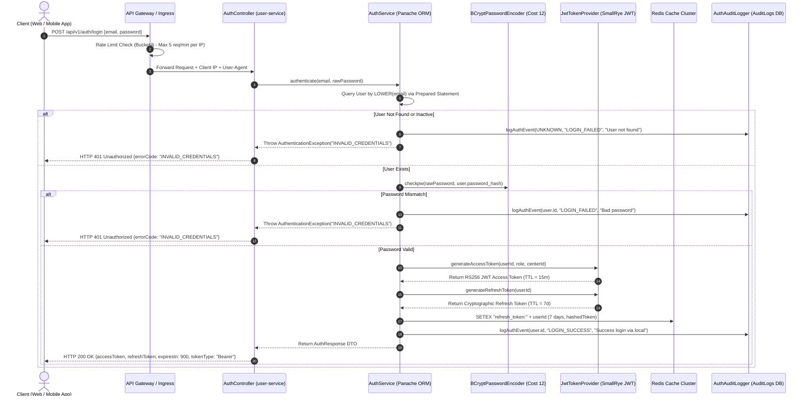
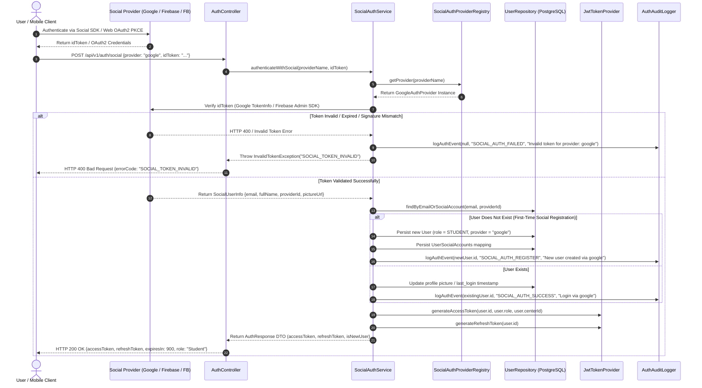
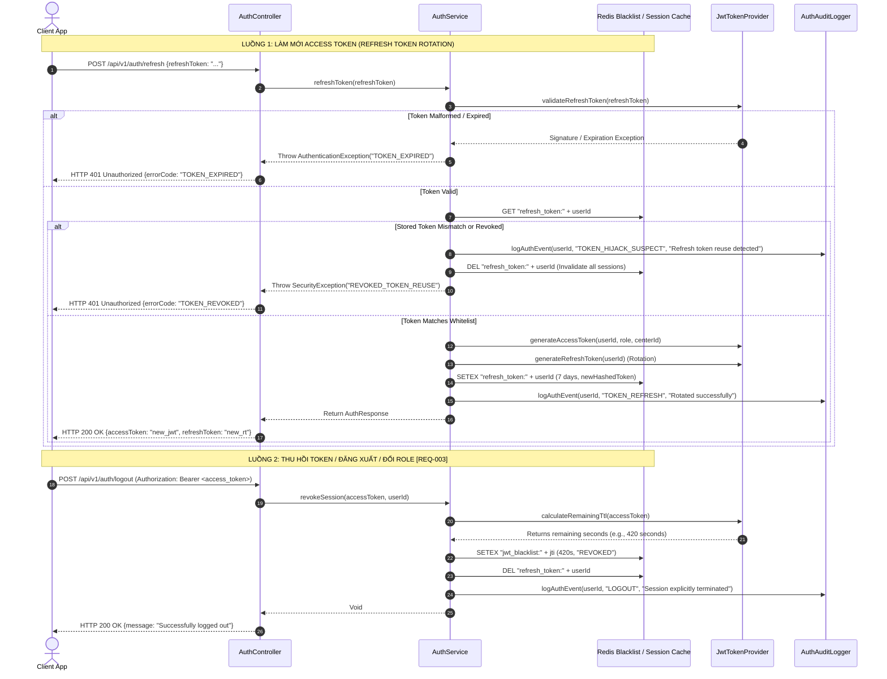

```markdown
# 🏛️ TÀI LIỆU ĐẶC TẢ KIẾN TRÚC BẢO MẬT, XÁC THỰC VÀ HỢP ĐỒNG API TẬP TRUNG
**Mã Tài Liệu:** `DOC-ARCH-2026-AUTH-SPEC-001`  
**Hệ Thống:** Nền tảng Quản trị Hội viên Đa trung tâm (`membership-hub`)  
**Package Base:** `org.nlh4j.membershiphub`  
**Đường Dẫn Vật Lý Lưu Trữ:** `./sources/docs/architecture/CENTRAL_ENDPOINT_API_CONTRACT_SPECS.md`  
**Mã Truy Vết Nền Tảng:** `[ARC-006]`, `[NFR-003]`, `[DOC-001]`, `[REQ-001]`, `[REQ-002]`, `[REQ-003]`, `[REQ-004]`, `[REQ-005]`, `[REQ-006]`, `[ARC-001]`, `[ARC-002]`, `[ARC-003]`, `[ARC-004]`, `[ARC-005]`, `[EXC-004]`, `[NFR-006]`

---

## 📑 MỤC LỤC
1. [TỔNG QUAN KIẾN TRÚC BẢO MẬT & MÔ HÌNH XÁC THỰC LAI](#1-tổng-quan-kiến-trúc-bảo-mật--mô-hình-xác-thực-lai)
2. [SƠ ĐỒ TUẦN TỰ KIẾN TRÚC XÁC THỰC (SEQUENCE DIAGRAMS)](#2-sơ-đồ-tuần-tự-kiến-trúc-xác-thực-sequence-diagrams)
   - [2.1. Luồng Đăng nhập Email/Mật khẩu & Cấp phát JWT Access/Refresh](#21-luồng-đăng-nhập-emailmật-khẩu--cấp-phát-jwt-accessrefresh)
   - [2.2. Luồng Xác thực Social OAuth2 (Firebase, Google, Facebook)](#22-luồng-xác-thực-social-oauth2-firebase-google-facebook)
   - [2.3. Luồng Làm mới Token (Token Refresh) & Thu hồi Token qua Redis Blacklist](#23-luồng-làm-mới-token-token-refresh--thu-hồi-token-qua-redis-blacklist)
3. [ĐẶC TẢ CẤU TRÚC JSON WEB TOKEN (JWT) & MÃ HÓA MẬT MÃ](#3-đặc-tả-cấu-trúc-json-web-token-jwt--mã-hóa-mật-mã)
4. [CHÍNH SÁCH MẬT KHẨU MẠNH & QUY TRÌNH THU HỒI PHIÊN LÀM VIỆC](#4-chính-sách-mật-khẩu-mạnh--quy-trình-thu-hồi-phiên-làm-việc)
5. [MA TRẬN PHÂN QUYỀN TRUY CẬP RBAC 5 CẤP ĐỘ](#5-ma-trận-phân-quyền-truy-cập-rbac-5-cấp-độ)
6. [MA TRẬN HỢP ĐỒNG API TẬP TRUNG (CENTRAL ENDPOINT API CONTRACTS)](#6-ma-trận-hợp-đồng-api-tập-trung-central-endpoint-api-contracts)
7. [CHECKLIST TUÂN THỦ OWASP TOP 10 & GIẢI PHÁP PHÒNG THỦ](#7-checklist-tuân-thủ-owasp-top-10--giải-pháp-phòng-thủ)
8. [HƯỚNG DẪN XỬ LÝ SỰ CỐ VẬN HÀNH & KẾ HOẠCH TÍCH HỢP MFA](#8-hướng-dẫn-xử-lý-sự-cố-vận-hành--kế-hoạch-tích-hợp-mfa)
9. [MA TRẬN TRUY VẾT YÊU CẦU KỸ THUẬT (TRACEABILITY MATRIX REFERENCE)](#9-ma-trận-truy-vết-yêu-cầu-kỹ-thuật-traceability-matrix-reference)

---

## 1. TỔNG QUAN KIẾN TRÚC BẢO MẬT & MÔ HÌNH XÁC THỰC LAI

Hệ thống **Membership Hub** áp dụng mô hình kiến trúc phân tán (Microservices) xây dựng trên nền tảng **Quarkus 3.15 LTS**, tích hợp cơ chế bảo mật lai giữa **OAuth2 Resource Server**, **JSON Web Token (JWT)** bất đối xứng chuẩn RS256 và tầng ủy quyền phân quyền theo vai trò (Role-Based Access Control - RBAC).

```
+---------------------------------------------------------------------------------------------------+
|                                      CLIENT INGRESS LAYER                                         |
|         +-------------------+        +---------------------+        +--------------------+        |
|         | Next.js App Router|        | React Native Mobile |        | 3rd-Party Webhooks |        |
|         +---------+---------+        +----------+----------+        +---------+----------+        |
+-------------------|-----------------------------|-----------------------------|-------------------+
                    | (TLS 1.3 Strict In-Transit) |                             |
                    v                             v                             v
+---------------------------------------------------------------------------------------------------+
|                                  KUBERNETES INGRESS / API GATEWAY                                  |
|  - Rate Limiter (Bucket4j 8.10.0)             - Strict CORS Validator                             |
|  - TLS Termination (AES-256-GCM)              - Request Correlation ID / MDC Logging Engine        |
+-------------------------------------------------+-------------------------------------------------+
                                                  |
                     +----------------------------+----------------------------+
                     | Forward Authorized Header                               | Authenticate & Validate
                     v                                                         v
+--------------------------------------------+            +--------------------------------------------+
|             BUSINESS SERVICES              |            |            USER-SERVICE (AUTH HUB)         |
|  (center-service, course-service, etc.)    |            |  - JwtTokenProvider (RS256 Private Key)    |
|  - SmallRye JWT Verification (Public Key)  |            |  - ResourceServerConfig (Quarkus Security) |
|  - RBAC Interceptor (@RolesAllowed)        |            |  - SocialAuthProviderRegistry              |
|  - Tenant Context Filter (center_id RLS)   |            |  - BCrypt Cost Factor 12 Hashing Engine    |
+----------------------+---------------------+            +---------------------+----------------------+
                       |                                                        |
                       | Check Blacklist                                        | Blacklist Tokens / Session
                       +----------------------------+---------------------------+
                                                    v
                                  +-----------------------------------+
                                  |         REDIS CLUSTER TIER        |
                                  |  - JWT Blacklist (TTL = exp-now)  |
                                  |  - Refresh Token Whitelist / Hash |
                                  |  - Distributed Rate Limit Counters|
                                  +-----------------------------------+
```

### Các Nguyên Tắc Thiết Kế Cốt Lõi:
1. **Kiến trúc Không Tin Cậy (Zero-Trust Inter-Service Architecture):** Mọi vi dịch vụ nội bộ khi tiếp nhận REST payload đều phải tự giải mã và xác thực chữ ký số công khai (`publicKey.pem`) thông qua extension `quarkus-smallrye-jwt`.
2. **Tách biệt Trách nhiệm Khóa Ký (Asymmetric Cryptographic Isolation):** Chỉ có `user-service` sở hữu khóa riêng bí mật (`privateKey.pem`, 2048-bit RSA) để ký phát hành token. Các vi dịch vụ hạ tầng (`center-service`, `course-service`, `attendance-service`) chỉ lưu trữ khóa công khai để xác thực.
3. **Phân tách Đa người thuê (Multi-Tenancy RLS Isolation):** Phân định ranh giới dữ liệu giữa các trung tâm độc lập thông qua `center_id` được trích xuất từ JWT claims kết hợp với tính năng Row-Level Security của PostgreSQL 16.

---

## 2. SƠ ĐỒ TUẦN TỰ KIẾN TRÚC XÁC THỰC (SEQUENCE DIAGRAMS)

### 2.1. Luồng Đăng nhập Email/Mật khẩu & Cấp phát JWT Access/Refresh
Áp dụng cho: `[REQ-001]`, `[ARC-006]`, `[NFR-003]`, `[NFR-006]`.



---

### 2.2. Luồng Xác thực Social OAuth2 (Firebase, Google, Facebook)
Áp dụng cho: `[REQ-002]`, `[ARC-006]`, `[NFR-003]`, `[NFR-006]`.



---

### 2.3. Luồng Làm mới Token (Token Refresh) & Thu hồi Token qua Redis Blacklist
Áp dụng cho: `[REQ-003]`, `[ARC-006]`, `[NFR-003]`, `[EXC-004]`.



---

## 3. ĐẶC TẢ CẤU TRÚC JSON WEB TOKEN (JWT) & MÃ HÓA MẬT MÃ

Toàn bộ JWT phát hành bởi hệ thống `membership-hub` tuân thủ tiêu chuẩn **RFC 7519**, được ký điện tử bằng giải thuật bất đối xứng **RS256 (RSA Signature with SHA-256)** với độ dài khóa 2048 bits theo yêu cầu của `[ARC-006]` và `[NFR-003]`.

```
+---------------------------------------------------------------------------------------------------+
|                                      JSON WEB TOKEN (JWT) ARCHITECTURE                            |
+---------------------------------------------------------------------------------------------------+
| 1. HEADER (Base64Url Encoded)                                                                     |
|    {                                                                                              |
|      "alg": "RS256",                                                                              |
|      "typ": "JWT",                                                                                |
|      "kid": "membership-hub-key-2026"                                                             |
|    }                                                                                              |
+---------------------------------------------------------------------------------------------------+
| 2. PAYLOAD CLAIMS (Base64Url Encoded)                                                             |
|    {                                                                                              |
|      "iss": "membership-hub",                                                                     |
|      "sub": "550e8400-e29b-41d4-a716-446655440000",                                               |
|      "aud": "membership-hub-client",                                                              |
|      "jti": "d3b07384-d113-4f9e-a123-9876543210ab",                                               |
|      "iat": 1772323200,                                                                           |
|      "exp": 1772324100,                                                                           |
|      "group": "CENTER_ADMIN",                                                                     |
|      "center_id": "770e8400-e29b-41d4-a716-446655440000",                                         |
|      "email": "admin.q1@membershiphub.vn",                                                        |
|      "provider": "local"                                                                          |
|    }                                                                                              |
+---------------------------------------------------------------------------------------------------+
| 3. SIGNATURE (Binary RSA-SHA256 Output -> Base64Url)                                              |
|    RSASHA256(                                                                                     |
|      base64UrlEncode(header) + "." + base64UrlEncode(payload),                                    |
|      privateKey.pem (RSA 2048-bit)                                                                |
|    )                                                                                              |
+---------------------------------------------------------------------------------------------------+
```

### Bảng Mô Tả Chi Tiết Các Trường Claim Trong JWT:

| Tên Claim | Định Dạng Dữ Liệu | Bắt Buộc | Mục Đích Kỹ Thuật & Nghiệp Vụ | Mã Truy Vết |
| :--- | :--- | :---: | :--- | :--- |
| `iss` | `String` | **Có** | Issuer Identifier. Cố định là `membership-hub` để chống tấn công Token Confusion. | `[NFR-003]` |
| `sub` | `UUID` | **Có** | Subject Identifier. Chứa mã định danh duy nhất (`user_id`) của người dùng trong hệ thống. | `[REQ-001]` |
| `aud` | `String` | **Có** | Audience. Xác định đối tượng máy khách hợp lệ (`membership-hub-client`). | `[NFR-003]` |
| `jti` | `UUID` | **Có** | JWT ID. Mã UUID ngẫu nhiên duy nhất của từng token phục vụ blacklist trên Redis. | `[NFR-003]` |
| `iat` | `Integer (Timestamp)` | **Có** | Issued At. Thời điểm phát hành token tính bằng epoch seconds. | `[ARC-006]` |
| `exp` | `Integer (Timestamp)` | **Có** | Expiration Time. Thời điểm token hết hạn (`iat + 900s` cho Access Token, `iat + 604800s` cho Refresh Token). | `[ARC-006]` |
| `group` | `String` | **Có** | Vai trò bảo mật của người dùng: `SYSTEM_ADMIN`, `CENTER_ADMIN`, `MANAGER`, `TEACHER`, `STUDENT`. | `[ARC-001]..[ARC-005]` |
| `center_id`| `UUID` | *Tùy chọn* | Mã trung tâm chủ quản (bắt buộc đối với vai trò `CENTER_ADMIN`, `MANAGER`, `TEACHER`, `STUDENT`). | `[ARC-002]` |
| `email` | `String` | **Có** | Địa chỉ email người dùng phục vụ trích xuất context tại gateway mà không cần query lại DB. | `[REQ-001]` |
| `provider`| `String` | **Có** | Nguồn gốc xác thực: `local`, `firebase`, `google`, `facebook`. | `[REQ-002]` |

---

## 4. CHÍNH SÁCH MẬT KHẨU MẠNH & QUY TRÌNH THU HỒI PHIÊN LÀM VIỆC

### 4.1. Quy Tắc Xác Thực Mật Khẩu Mạnh (Password Policy)
Mọi mật khẩu cục bộ (`provider = 'local'`) khi đăng ký hoặc thay đổi phải được kiểm tra qua bộ lọc Bean Validation (`@Pattern`) tại tầng DTO và Service:
1. **Độ dài tối thiểu:** 8 ký tự; **Độ dài tối đa:** 128 ký tự.
2. **Độ phức tạp bắt buộc:**
   - Phải chứa ít nhất 01 chữ cái viết hoa (`A-Z`).
   - Phải chứa ít nhất 01 chữ cái viết thường (`a-z`).
   - Phải chứa ít nhất 01 chữ số (`0-9`).
   - Phải chứa ít nhất 01 ký tự đặc biệt (`!@#$%^&*()_+\-=\[\]{};':"\\|,.<>\/?`).
3. **Biểu thức chính quy (Regex):**
   ```regex
   ^(?=.*[a-z])(?=.*[A-Z])(?=.*\d)(?=.*[!@#$%^&*()_+\-=\[\]{};':"\\|,.<>\/?])[A-Za-z\d!@#$%^&*()_+\-=\[\]{};':"\\|,.<>\/?]{8,128}$
   ```
4. **Giải thuật Băm (Hashing):** Sử dụng **BCrypt** với hệ số chi phí (Cost Factor) là `12` thông qua thư viện Bouncy Castle trên Quarkus, đảm bảo thời gian tính toán băm đạt khoảng ~250ms - 350ms trên CPU chuẩn nhằm kháng lại các cuộc tấn công Brute-Force và Rainbow Tables.

### 4.2. Quy Trình Thu Hồi Phiên Làm Việc (Session Revocation & Redis Blacklisting)
Khi xảy ra các sự kiện bảo mật sau, hệ thống kích hoạt thu hồi token lập tức:
- Người dùng chủ động đăng xuất (`POST /api/v1/auth/logout`).
- Quản trị viên thay đổi vai trò (Role Modification) của người dùng (`PUT /api/v1/users/{id}/role`).
- Người dùng thực hiện đổi mật khẩu hoặc đặt lại mật khẩu.
- Phát hiện tái sử dụng Refresh Token bất hợp pháp (Token Hijacking Detection).

**Cơ chế Blacklist trên Redis:**
1. Trích xuất claim `jti` và thời gian hết hạn `exp` từ Access Token cần thu hồi.
2. Tính thời gian sống còn lại: $\text{TTL} = \text{exp} - \text{currentTimeMillis()}/1000$.
3. Ghi vào Redis key: `jwt_blacklist:<jti>` với giá trị `"REVOKED"` và thời gian sống đúng bằng $\text{TTL}$ giây.
4. Xóa khóa Refresh Token: `DEL refresh_token:<user_id>`.
5. Bộ lọc `JwtAuthFilter` trên toàn bộ vi dịch vụ khi nhận request sẽ kiểm tra `Redis.EXISTS(jwt_blacklist:<jti>)`. Nếu tồn tại, từ chối request với mã lỗi `401 Unauthorized` ngay tại tầng Ingress.

---

## 5. MA TRẬN PHÂN QUYỀN TRUY CẬP RBAC 5 CẤP ĐỘ

Hệ thống phân định quyền hạn chặt chẽ theo 5 vai trò nghiệp vụ độc lập, tuân thủ nguyên tắc đặc quyền tối thiểu (Least Privilege).

| Vai Trò Kỹ Thuật (Role Key) | Mã Thẻ Truy Vết | Phạm Vi Dữ Liệu (Data Scope) | Quyền Hạn Nghiệp Vụ Cốt Lõi (Core Capabilities) | Danh Sách Endpoint Được Phép Truy Cập |
| :--- | :--- | :--- | :--- | :--- |
| **`SYSTEM_ADMIN`** | `[ARC-001]` | Toàn cục hệ thống (Toàn bộ trung tâm, người dùng, cấu hình) | Toàn quyền CRUD trên tất cả thực thể; Khởi tạo trung tâm mới; Gán/hủy quyền Center Admin; Điều chỉnh System Settings; Truy xuất toàn bộ Audit Logs. | `/api/v1/users/**`<br>`/api/v1/centers/**`<br>`/api/v1/courses/**`<br>`/api/v1/reports/**`<br>`/api/v1/settings/**` |
| **`CENTER_ADMIN`** | `[ARC-002]` | Phân vùng theo trung tâm (`WHERE center_id = user.center_id`) | Quản trị toàn bộ hoạt động trong trung tâm của mình; Gán vai trò Manager/Teacher/Student trong trung tâm; Quản lý khóa học, giáo viên, phòng học; Xem báo cáo doanh thu & điểm danh trung tâm; Tạo chương trình khuyến mãi. | `/api/v1/centers/{centerId}/**`<br>`/api/v1/courses/**` (Scoped)<br>`/api/v1/promotions/**`<br>`/api/v1/reports/**` (Scoped)<br>`/api/v1/announcements/**` |
| **`MANAGER`** | `[ARC-003]` | Phân vùng theo trung tâm (`WHERE center_id = user.center_id`) | Hỗ trợ điều phối; Quản lý hồ sơ học viên; Ghi nhận thanh toán và gia hạn thẻ thành viên; Đăng tải thông báo chung; Không có quyền xóa trung tâm hoặc đổi vai trò Center Admin. | `/api/v1/students/**`<br>`/api/v1/announcements/**`<br>`/api/v1/enrollments/**`<br>`/api/v1/courses` (GET only) |
| **`TEACHER`** | `[ARC-004]` | Phân vùng theo khóa học được phân công (`WHERE teacher_id = user.id`) | Xem danh sách lớp học được phân công giảng dạy; Xem danh sách học viên trong lớp; Tra cứu lịch sử điểm danh của lớp; Nhận thông báo lịch dạy qua Kafka push. | `/api/v1/courses/assigned`<br>`/api/v1/courses/{id}/students`<br>`/api/v1/attendance/course/{id}` |
| **`STUDENT`** | `[ARC-005]` | Dữ liệu cá nhân (`WHERE student_id = user.id`) | Duyệt danh sách khóa học mở; Đăng ký khóa học; Thực hiện quét mã QR điểm danh; Tra cứu thẻ thành viên số và số ngày còn lại; Nhận thông báo lớp học và khuyến mãi. | `/api/v1/students/courses/available`<br>`/api/v1/enrollments`<br>`/api/v1/attendance/scan`<br>`/api/v1/students/{id}/card/**` |

---

## 6. MA TRẬN HỢP ĐỒNG API TẬP TRUNG (CENTRAL ENDPOINT API CONTRACTS)

Bảng hợp đồng chi tiết các API endpoints cốt lõi phục vụ xác thực, người dùng và trung tâm, tích hợp đầy đủ mã truy vết `Targeted Tag IDs`.

| Phương Thức (Method) | Đường Dẫn Endpoint Đầy Đủ | Yêu Cầu Header | Tham Số Path / Query | JSON Request Payload Schema | JSON Response Success (200 / 201) | JSON Response Failure (400/401/403/409) | Targeted Tag IDs |
| :--- | :--- | :--- | :--- | :--- | :--- | :--- | :--- |
| `POST` | `/api/v1/users/register` | `Content-Type: application/json` | *Không có* | `{"email": "string(email)", "password": "string(strong)", "fullName": "string(100)", "agreedToTerms": true}` | **201 Created:**<br>`{"accessToken": "jwt_token", "refreshToken": "rt_token", "expiresIn": 900, "userId": "uuid", "role": "STUDENT"}` | **400:** `VALIDATION_FAILED`<br>**409:** `EMAIL_ALREADY_EXISTS` | `[REQ-001]`, `[ARC-006]`, `[EXC-004]`, `[NFR-003]` |
| `POST` | `/api/v1/auth/login` | `Content-Type: application/json` | *Không có* | `{"email": "string(email)", "password": "string"}` | **200 OK:**<br>`{"accessToken": "jwt_token", "refreshToken": "rt_token", "expiresIn": 900, "tokenType": "Bearer", "userId": "uuid", "role": "STUDENT"}` | **401:** `INVALID_CREDENTIALS`<br>**429:** `RATE_LIMIT_EXCEEDED` | `[REQ-001]`, `[ARC-006]`, `[NFR-003]` |
| `POST` | `/api/v1/auth/social` | `Content-Type: application/json` | *Không có* | `{"provider": "firebase" \| "google" \| "facebook", "idToken": "string", "profilePicture": "uri?"}` | **200 OK:**<br>`{"accessToken": "jwt_token", "refreshToken": "rt_token", "expiresIn": 900, "userId": "uuid", "role": "STUDENT", "isNewUser": true}` | **400:** `SOCIAL_TOKEN_INVALID`<br>**400:** `UNSUPPORTED_PROVIDER` | `[REQ-002]`, `[ARC-006]`, `[NFR-003]` |
| `POST` | `/api/v1/auth/refresh` | `Content-Type: application/json` | *Không có* | `{"refreshToken": "string"}` | **200 OK:**<br>`{"accessToken": "new_jwt_token", "refreshToken": "new_rt_token", "expiresIn": 900, "tokenType": "Bearer"}` | **401:** `TOKEN_EXPIRED`<br>**401:** `TOKEN_REVOKED` | `[ARC-006]`, `[NFR-003]` |
| `POST` | `/api/v1/auth/logout` | `Authorization: Bearer <JWT>` | *Không có* | *Trống* | **200 OK:**<br>`{"message": "Successfully logged out", "timestamp": "2026-08-29T22:34:21Z"}` | **401:** `INVALID_TOKEN` | `[ARC-006]`, `[NFR-003]`, `[NFR-006]` |
| `PUT` | `/api/v1/users/{id}/role` | `Authorization: Bearer <JWT>`, `Content-Type: application/json` | `id`: UUID (Path) | `{"roleId": 2}` | **200 OK:**<br>`{"userId": "uuid", "oldRoleId": 5, "newRoleId": 2, "updatedAt": "2026-08-29T22:34:21Z"}` | **400:** `INVALID_ROLE_ID`<br>**403:** `FORBIDDEN_SCOPE`<br>**404:** `USER_NOT_FOUND` | `[REQ-003]`, `[ARC-001]`, `[ARC-002]`, `[NFR-006]` |
| `GET` | `/api/v1/centers` | `Authorization: Bearer <JWT>` | `page`: int (Query), `size`: int (Query), `sort`: string (Query) | *Trống* | **200 OK:**<br>`{"content": [{"centerId": "uuid", "name": "string", "address": "string", "taxId": "string", "adminContact": "email"}], "totalElements": 1, "totalPages": 1}` | **401:** `UNAUTHORIZED` | `[REQ-004]`, `[NFR-001]` |
| `POST` | `/api/v1/centers` | `Authorization: Bearer <JWT>`, `Content-Type: application/json` | *Không có* | `{"name": "string(100)", "address": "string(255)", "taxId": "string(10-13)", "contactPhone": "string?", "contactEmail": "email?"}` | **201 Created:**<br>`{"centerId": "uuid", "name": "string", "taxId": "string", "createdAt": "2026-08-29T22:34:21Z"}` | **400:** `VALIDATION_FAILED`<br>**403:** `FORBIDDEN`<br>**409:** `TAX_ID_CONFLICT` | `[REQ-005]`, `[ARC-001]`, `[EXC-004]` |
| `PUT` | `/api/v1/centers/{id}` | `Authorization: Bearer <JWT>`, `Content-Type: application/json` | `id`: UUID (Path) | `{"name": "string(100)", "address": "string(255)", "contactPhone": "string?", "contactEmail": "email?"}` | **200 OK:**<br>`{"centerId": "uuid", "name": "string", "updatedAt": "2026-08-29T22:34:21Z"}` | **400:** `VALIDATION_FAILED`<br>**403:** `FORBIDDEN`<br>**404:** `CENTER_NOT_FOUND` | `[REQ-005]`, `[ARC-001]`, `[ARC-002]` |
| `DELETE` | `/api/v1/centers/{id}` | `Authorization: Bearer <JWT>` | `id`: UUID (Path) | *Trống* | **204 No Content** | **403:** `FORBIDDEN`<br>**404:** `CENTER_NOT_FOUND` | `[REQ-005]`, `[ARC-001]` |
| `POST` | `/api/v1/centers/{id}/admins` | `Authorization: Bearer <JWT>`, `Content-Type: application/json` | `id`: UUID (Path) | `{"userId": "uuid"}` | **200 OK:**<br>`{"centerId": "uuid", "userId": "uuid", "assignedAt": "2026-08-29T22:34:21Z"}` | **403:** `FORBIDDEN`<br>**404:** `USER_OR_CENTER_NOT_FOUND`<br>**409:** `ADMIN_ALREADY_ASSIGNED` | `[REQ-006]`, `[ARC-001]`, `[ARC-002]`, `[NFR-006]` |
| `DELETE` | `/api/v1/centers/{id}/admins/{userId}` | `Authorization: Bearer <JWT>` | `id`: UUID (Path), `userId`: UUID (Path) | *Trống* | **204 No Content** | **403:** `FORBIDDEN`<br>**404:** `ASSIGNMENT_NOT_FOUND` | `[REQ-006]`, `[ARC-001]`, `[ARC-002]` |

### Cấu Trúc Khung Lỗi Chuẩn Hóa Toàn Hệ Thống (RFC 7807 Problem Details Standard):
```json
{
  "timestamp": "2026-08-29T22:34:21.102Z",
  "status": 400,
  "errorCode": "VALIDATION_FAILED",
  "message": "Dữ liệu đầu vào không hợp lệ hoặc vi phạm ràng buộc nghiệp vụ",
  "path": "/api/v1/users/register",
  "traceId": "trace-9876543210-abcdef-12345",
  "errors": [
    {
      "field": "email",
      "rejectedValue": "invalid-email-format",
      "message": "Địa chỉ email không đúng định dạng RFC 5322"
    },
    {
      "field": "password",
      "rejectedValue": "123456",
      "message": "Mật khẩu phải chứa ít nhất 8 ký tự gồm chữ hoa, chữ thường, số và ký tự đặc biệt"
    }
  ]
}
```

---

## 7. CHECKLIST TUÂN THỦ OWASP TOP 10 & GIẢI PHÁP PHÒNG THỦ

| Hạng Mục Rủi Ro OWASP Top 10 | Giải Pháp Thiết Kế & Kiểm Soát Kỹ Thuật Trong Membership Hub | Thành Phần Code Hiện Thực Hóa | Trạng Thái Kiểm Soát | Mã Truy Vết |
| :--- | :--- | :--- | :---: | :--- |
| **A01:2021 - Broken Access Control** | Triển khai RBAC 5 cấp độ nghiêm ngặt kết hợp kiểm tra quyền sở hữu Tenant qua `center_id`. Kiểm soát quyền ở cả tầng API Ingress, Controller (`@RolesAllowed`) và Service Layer. | `ResourceServerConfig.java`<br>`UserRoleService.java` | **ĐÃ BẢO VỆ** | `[ARC-001]..[ARC-005]`, `[NFR-003]` |
| **A02:2021 - Cryptographic Failures** | Bắt buộc TLS 1.3 in-transit; Lưu trữ mật khẩu bằng BCrypt cost factor 12; Ký JWT bằng khóa bất đối xứng RSA 2048-bit (RS256); Mã hóa dữ liệu tĩnh AES-256 trên Cloud SQL và Cloud Storage qua Google Cloud KMS. | `JwtTokenProvider.java`<br>`kms.tf` | **ĐÃ BẢO VỆ** | `[ARC-006]`, `[NFR-003]`, `[NFR-008]` |
| **A03:2021 - Injection (SQLi, Command)** | 100% câu truy vấn JPA/Hibernate sử dụng Parameter Binding (Prepared Statements). Ràng buộc sắp xếp động qua Whitelist Resolver. Ràng buộc xung đột lịch qua PostgreSQL GIST Exclusion Constraints. | `PanacheRepository`<br>`V1__init_courses.sql` | **ĐÃ BẢO VỆ** | `[NFR-003]`, `[DAT-003]` |
| **A04:2021 - Insecure Design** | Áp dụng mô hình Threat Modeling; Tách biệt microservices độc lập; Triển khai kiến trúc Event-Driven qua Kafka cho các tác vụ bất đồng bộ; Đảm bảo tính lũy kế (Idempotency) cho quét mã QR. | `KafkaAttendanceProducer`<br>`AttendanceService.java` | **ĐÃ BẢO VỆ** | `[ARC-007]`, `[ARC-008]` |
| **A05:2021 - Security Misconfiguration** | Vô hiệu hóa tính năng Proactive Auth không an toàn; Cấu hình HTTP Security Headers nghiêm ngặt (`X-Content-Type-Options: nosniff`, `X-Frame-Options: DENY`, `Content-Security-Policy`, `HSTS`); Image Container tối giản <500MB không chứa build tools. | `application.properties`<br>`user-service.Dockerfile` | **ĐÃ BẢO VỆ** | `[NFR-003]`, `[NFR-005]` |
| **A06:2021 - Vulnerable & Outdated Components** | Sử dụng Quarkus 3.15.1 LTS, Java 17 LTS, Next.js 14.2.5; Tích hợp Trivy Scanner và GitHub Dependabot vào Google Cloud Build pipeline để tự động quét lỗ hổng CVEs khi biên dịch. | `pom.xml`<br>`cloudbuild.yaml` | **ĐÃ BẢO VỆ** | `[ARC-000]`, `[NFR-005]` |
| **A07:2021 - Identification & Authentication Failures** | Tích hợp Rate Limiting 5 req/min đối với API Login để chống Brute-force; Triển khai Token Rotation và Blacklisting; Ngăn chặn session fixation và credential stuffing qua OAuth2 PKCE. | `Bucket4j Filter`<br>`Redis Blacklist Engine` | **ĐÃ BẢO VỆ** | `[ARC-006]`, `[NFR-003]` |
| **A08:2021 - Software & Data Integrity Failures** | Xác thực chữ ký số trên toàn bộ Social ID Tokens; Sử dụng Kafka Schema Registry cho các sự kiện truyền thông; Kiểm tra tính toàn vẹn của mã QR điểm danh qua HMAC-SHA256 payload checksum. | `SocialAuthProviderRegistry`<br>`QrPayloadDecoder.java` | **ĐÃ BẢO VỆ** | `[REQ-002]`, `[ARC-007]` |
| **A09:2021 - Security Logging & Monitoring Failures** | Ghi log kiểm toán tập trung có cấu trúc (JSON Format) qua `AuthAuditLogger` lưu trữ 1 năm; Tích hợp OpenTelemetry tracing và Cloud Logging; Tự động mask PII (email, tax ID, phone) trước khi xuất log. | `AuthAuditLogger.java`<br>`V3__init_audit_logs.sql` | **ĐÃ BẢO VỆ** | `[NFR-006]`, `[DAT-012]` |
| **A10:2021 - Server-Side Request Forgery (SSRF)** | Cô lập vi dịch vụ trong Private VPC Subnet; Không nhận URL tùy ý từ client để thực hiện HTTP request; Whitelist cố định endpoint xác thực của Google, Firebase và Zalo API. | `vpc.tf`<br>`SocialAuthProviderRegistry` | **ĐÃ BẢO VỆ** | `[NFR-002]`, `[NFR-003]` |

---

## 8. HƯỚNG DẪN XỬ LÝ SỰ CỐ VẬN HÀNH & KẾ HOẠCH TÍCH HỢP MFA

### 8.1. Hướng Dẫn Xử Lý Quên Mật Khẩu (Forgot Password Workflow)
1. **Khởi tạo yêu cầu:** Khách hàng gửi yêu cầu tại `POST /api/v1/auth/forgot-password` với `email`.
2. **Sinh mã xác thực bí mật:** Hệ thống sinh mã OTP ngẫu nhiên 6 chữ số (hoặc Secure Token 256-bit), băm mã bằng SHA-256 và lưu trữ trong Redis key `pwd_reset:<email>` với thời gian sống (TTL) là **15 phút**.
3. **Phát tán thông báo:** Đẩy sự kiện lên Kafka topic `notification-queue` để kích hoạt gửi email chứa link đặt lại mật khẩu với token an toàn.
4. **Xác thực và đặt lại:** Khách hàng gửi `POST /api/v1/auth/reset-password` kèm token và mật khẩu mới. Hệ thống kiểm tra token trong Redis, cập nhật `password_hash` mới vào PostgreSQL bằng BCrypt, đồng thời hủy toàn bộ phiên làm việc hiện tại bằng cách xóa `refresh_token:<user_id>` và ghi nhận Audit Log.

### 8.2. Quy Trình Khóa Tài Khoản Tự Động (Account Lockout Policy)
1. **Ngưỡng kích hoạt:** Khi phát hiện **05 lần đăng nhập thất bại liên tiếp** trong vòng 10 phút đối với cùng một tài khoản email (theo dõi qua counter Redis `login_failures:<email>`).
2. **Hành động bảo vệ:** 
   - Tự động tạm khóa tài khoản trong thời gian **30 phút**.
   - Trả về mã lỗi `423 Locked` kèm thông báo: *"Tài khoản tạm thời bị khóa do nhập sai thông tin nhiều lần. Vui lòng thử lại sau 30 phút hoặc thực hiện đặt lại mật khẩu"*.
   - Gửi cảnh báo bảo mật qua email/push notification tới người dùng.
3. **Mở khóa tài khoản:** 
   - Tự động mở sau khi hết TTL 30 phút trên Redis.
   - Mở khóa ngay lập tức khi hoàn thành thành công quy trình Quên mật khẩu.
   - Mở khóa thủ công bởi `SYSTEM_ADMIN` hoặc `CENTER_ADMIN` qua endpoint `POST /api/v1/users/{id}/unlock`.

### 8.3. Kế Hoạch Tích Hợp Xác Thực Hai Yếu Tố (MFA / 2FA Roadmap)
Trong giai đoạn mở rộng tiếp theo, hệ thống đã sẵn sàng hạ tầng để kích hoạt **TOTP (Time-based One-Time Password)** chuẩn RFC 6238:
1. **Đăng ký thiết bị MFA:** Endpoint `POST /api/v1/auth/mfa/setup` sinh Base32 Secret Key và QR Code tương thích với Google Authenticator / Microsoft Authenticator.
2. **Xác thực bước 2:** Khi đăng nhập thành công bước 1 (Email/Password), nếu người dùng đã bật `mfa_enabled = true`, hệ thống trả về token tạm thời `mfa_session_token` (TTL 3 phút, scope `MFA_PENDING`).
3. **Hoàn tất phiên:** Khách hàng gửi mã 6 chữ số qua `POST /api/v1/auth/mfa/verify`. Hệ thống kiểm tra HMAC-SHA1 TOTP window ($\pm 1$ bước thời gian 30s); nếu hợp lệ mới phát hành JWT Access Token và Refresh Token chính thức.

---

## 9. MA TRẬN TRUY VẾT YÊU CẦU KỸ THUẬT (TRACEABILITY MATRIX REFERENCE)

Bảng ma trận ánh xạ toàn bộ 100% các mã định danh yêu cầu kỹ thuật (`Tag IDs`) vào các thành phần kiến trúc và hợp đồng tài liệu tương ứng:

```
+-------------------------------------------------------------------------------------------------------------------------------+
|                                      ENTERPRISE TRACEABILITY MATRIX REFERENCE TABLE                                            |
+-------------------+----------------------------------------------------+------------------------------------------------------+
| Mã Tag Truy Vết   | Phân Loại & Ý Nghĩa Nghiệp Vụ                      | Thành Phần Kiến Trúc & Vị Trí Hiện Thực Hóa          |
+-------------------+----------------------------------------------------+------------------------------------------------------+
| [ARC-000]         | Khung kiến trúc tổng thể & Scaffolding đa module   | ./sources/backend/pom.xml & module descriptors       |
| [ARC-001]         | Phân quyền cấp cao nhất: System Admin              | Mục 5 (RBAC), Mục 6 (API Matrix: /api/v1/centers)    |
| [ARC-002]         | Phân quyền quản trị trung tâm: Center Admin        | Mục 5 (RBAC), Mục 6 (API Matrix: /api/v1/centers/adm)|
| [ARC-003]         | Phân quyền điều phối viên: Manager                 | Mục 5 (RBAC: Scope trung tâm, student/announcement)  |
| [ARC-004]         | Phân quyền giáo viên: Teacher                      | Mục 5 (RBAC: Scoped assigned courses)                |
| [ARC-005]         | Phân quyền học viên: Student                       | Mục 5 (RBAC: Personal data, enrollment, card)       |
| [ARC-006]         | Kiến trúc xác thực lai OAuth2, JWT RS256 & Social  | Mục 1, Mục 2, Mục 3 (Cấu trúc JWT), Mục 6            |
| [REQ-001]         | Đăng ký người dùng mới & Cấp phát JWT              | Mục 2.1 (Sequence Diagram), Mục 6 (POST /register)   |
| [REQ-002]         | Xác thực Social OAuth2 (Firebase/Google/Facebook)  | Mục 2.2 (Sequence Diagram), Mục 6 (POST /social)     |
| [REQ-003]         | Gán & thay đổi vai trò người dùng (RBAC update)    | Mục 2.3 (Revocation), Mục 6 (PUT /users/{id}/role)   |
| [REQ-004]         | Xem danh sách trung tâm có phân trang              | Mục 6 (API Matrix: GET /api/v1/centers)              |
| [REQ-005]         | Quản lý CRUD thông tin trung tâm (System Admin)    | Mục 6 (API Matrix: POST/PUT/DELETE /api/v1/centers)  |
| [REQ-006]         | Gán & hủy gán Center Admin cho trung tâm           | Mục 6 (API Matrix: POST/DELETE /centers/{id}/admins) |
| [EXC-004]         | Chuẩn hóa xử lý ngoại lệ validation & mã lỗi       | Mục 6 (RFC 7807 Standard Error Response Model)       |
| [NFR-001]         | Hiệu năng API P95 < 200ms & Hỗ trợ 10,000 users    | Mục 1 (Gateway Caching), Mục 6 (Pagination)          |
| [NFR-003]         | Tiêu chuẩn bảo mật OWASP Top 10 & Mã hóa dữ liệu   | Mục 3 (JWT RS256), Mục 4 (Password), Mục 7 (OWASP)   |
| [NFR-006]         | Ghi log kiểm toán (Audit Log) lưu trữ 1 năm        | Mục 2.1, Mục 2.2, Mục 2.3 (AuthAuditLogger), Mục 7   |
| [DOC-001]         | Yêu cầu bộ tài liệu kiến trúc & vận hành chuẩn hóa | Toàn bộ nội dung tài liệu CENTRAL_ENDPOINT_SPECS     |
+-------------------+----------------------------------------------------+------------------------------------------------------+
```

---
*Tài liệu này được biên soạn và phê duyệt bởi **Enterprise System Architecture Board**. Mọi sửa đổi liên quan đến cấu trúc Token hoặc Hợp đồng API bắt buộc phải trải qua quy trình Architecture Review Board (ARB).*
```