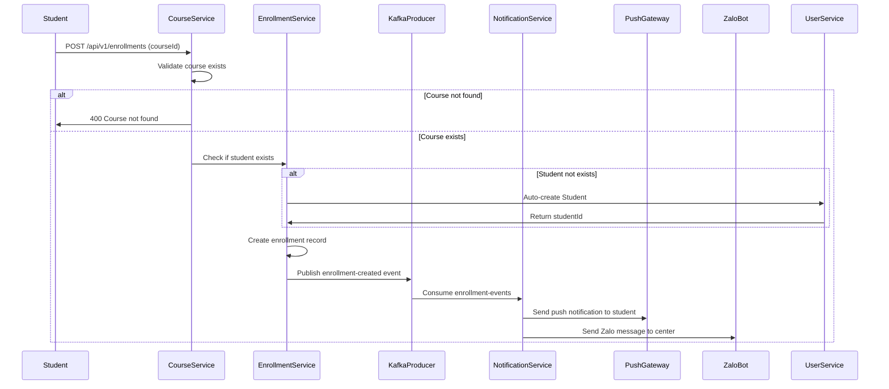
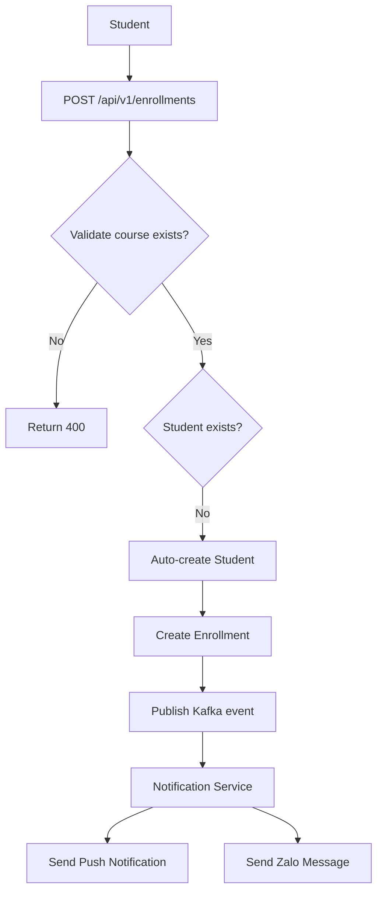

```markdown
# Course Service Architecture

## Enrollment Flow Sequence Diagram



## Enrollment Flow Overview (Flowchart)



## Traceability Matrix Reference

| Architectural Component | Description | Targeted Tag IDs |
|------------------------|-------------|------------------|
| Enrollment Flow Sequence Diagram | End-to-end enrollment processing with auto-creation and notification dispatch | [REQ-011], [ARC-008] |
| Enrollment Flow Overview (Flowchart) | High-level visual of enrollment steps and downstream notifications | [REQ-011], [ARC-008] |
| Course Service Architecture Documentation | Overall architecture documentation for course-service | [DOC-001] |

## Additional Notes
- All components reside under the Java package `org.nlh4j.membershiphub.courseservice`.
- Kafka topic `enrollment-events` is produced by `org.nlh4j.membershiphub.courseservice.kafka.EnrollmentEventProducer`.
- Notification service consumes from `org.nlh4j.membershiphub.attendanceservice.kafka.NotificationEventConsumer`.
```