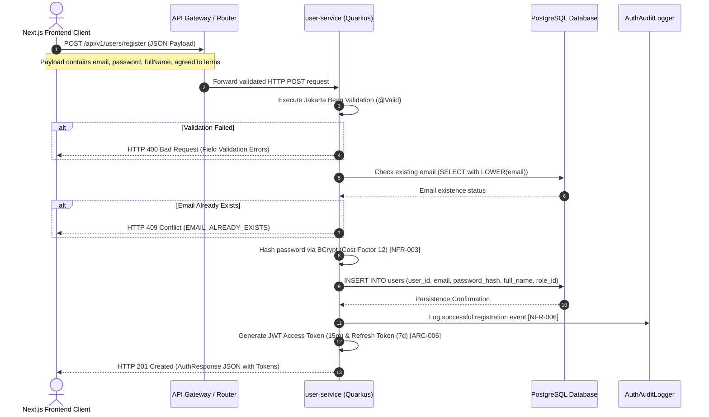

```markdown
# 🏛️ CENTRAL ENTERPRISE API CONTRACT SPECIFICATIONS
* **Target Project Identity:** membership-hub
* **Enforced Java Package Prefix Base:** `org.nlh4j.membershiphub`
* **Target Documentation Destination Path:** `./sources/docs/architecture/CENTRAL_ENDPOINT_API_CONTRACT_SPECS.md`
* **Architectural Baseline Version:** 1.0.0
* **Traceability Compliance:** Strict mapping to `[REQ-001]` and `[DOC-001]`

---

## 📑 1. SYSTEM OVERVIEW & COMPLIANCE SCOPE

This specification document governs the core endpoint architecture and API contracts for the **membership-hub** enterprise platform. All microservices (`user-service`, `center-service`, `course-service`, `attendance-service`) adhere strictly to the JSON over HTTP/1.1 specification, utilizing standardized UTF-8 encoding, Bearer Token JWT authorization (`[ARC-006]`), and enterprise exception handling (`[EXC-004]`).

### 📊 Traceability Matrix Reference
| Requirement Tag ID | Architectural Component / Route | Compliance Description |
| :--- | :--- | :--- |
| **[REQ-001]** | `POST /api/v1/users/register` | User registration flow with strict Jakarta Bean Validation, BCrypt password hashing, and JWT issuance. |
| **[DOC-001]** | `./sources/docs/` | Central enterprise documentation governance and technical specification repository. |

---

## 🌊 2. USER REGISTRATION WORKFLOW & ARCHITECTURAL SEQUENCE

The user registration endpoint serves as the primary unauthenticated entry gate for new students and staff joining the multi-center membership ecosystem. The sequence below illustrates the end-to-end request lifecycle from the Next.js frontend client through the API Gateway, reaching the Quarkus-powered `user-service`, and persisting securely into the PostgreSQL database.



---

## 🔌 3. CENTRAL ENDPOINT SPECIFICATION: USER REGISTRATION

### 📋 Endpoint Metadata & Traceability
- **Targeted Tag IDs:** `[REQ-001]`, `[DOC-001]`
- **HTTP Method:** `POST`
- **Full Endpoint Path:** `/api/v1/users/register`
- **Subsystem Microservice:** `user-service` (`org.nlh4j.membershiphub.userservice.controller.AuthController`)
- **Authentication Requirement:** `Public / PermitAll` (No Authorization Bearer header required for initial registration).

### 🛠️ Request Headers
| Header Name | Type | Mandatory | Description |
| :--- | :--- | :--- | :--- |
| `Content-Type` | String | Yes | Must be explicitly set to `application/json`. |
| `Accept` | String | Yes | Must be set to `application/json`. |
| `X-Request-Id` | String | No | Distributed tracing correlation ID. If omitted, the gateway generates a UUID. |

### 📥 JSON Request Payload Schema
```json
{
  "$schema": "https://json-schema.org/draft/2020-12/schema",
  "title": "RegisterRequest",
  "type": "object",
  "required": ["email", "password", "fullName", "agreedToTerms"],
  "properties": {
    "email": {
      "type": "string",
      "format": "email",
      "maxLength": 255,
      "description": "Unique email address used for system login."
    },
    "password": {
      "type": "string",
      "minLength": 8,
      "maxLength": 128,
      "description": "Strong password containing at least one uppercase letter, one lowercase letter, one number, and one special character."
    },
    "fullName": {
      "type": "string",
      "maxLength": 100,
      "description": "Full legal name of the registering user."
    },
    "agreedToTerms": {
      "type": "boolean",
      "const": true,
      "description": "Mandatory acceptance flag for terms of service and GDPR privacy policy."
    }
  },
  "additionalProperties": false
}
```

### 📤 JSON Response Schemas

#### ✅ Success Response (HTTP 201 Created)
```json
{
  "$schema": "https://json-schema.org/draft/2020-12/schema",
  "title": "AuthResponse",
  "type": "object",
  "properties": {
    "accessToken": {
      "type": "string",
      "description": "JWT Access Token valid for 15 minutes, signed with RS256."
    },
    "refreshToken": {
      "type": "string",
      "description": "Opaque Refresh Token valid for 7 days, stored securely in database."
    },
    "expiresIn": {
      "type": "integer",
      "example": 900,
      "description": "Access token expiration time in seconds."
    },
    "tokenType": {
      "type": "string",
      "example": "Bearer",
      "description": "Token authorization scheme."
    },
    "userId": {
      "type": "string",
      "format": "uuid",
      "example": "550e8400-e29b-41d4-a716-446655440000",
      "description": "Unique generated UUID for the newly created user."
    },
    "role": {
      "type": "string",
      "example": "Student",
      "description": "Default assigned role for newly registered users."
    }
  }
}
```

#### ❌ Failure Response: Validation Failed (HTTP 400 Bad Request)
```json
{
  "timestamp": "2026-08-29T22:34:21Z",
  "status": 400,
  "errorCode": "VALIDATION_FAILED",
  "message": "Input validation failed for registration payload",
  "errors": [
    {
      "field": "email",
      "message": "must be a well-formed email address",
      "rejectedValue": "invalid-email-format"
    },
    {
      "field": "password",
      "message": "size must be between 8 and 128",
      "rejectedValue": "short"
    }
  ],
  "path": "/api/v1/users/register",
  "traceId": "a1b2c3d4-e5f6-7890-abcd-ef0123456789"
}
```

#### ❌ Failure Response: Conflict / Duplicate Email (HTTP 409 Conflict)
```json
{
  "timestamp": "2026-08-29T22:34:21Z",
  "status": 409,
  "errorCode": "EMAIL_ALREADY_EXISTS",
  "message": "The provided email address is already registered in the system.",
  "path": "/api/v1/users/register",
  "traceId": "b2c3d4e5-f678-90ab-cdef-0123456789ab"
}
```

---

## 💻 4. PRACTICAL USAGE EXAMPLE (CURL)

```bash
curl -X POST "https://api.membershiphub.org/api/v1/users/register" \
  -H "Content-Type: application/json" \
  -H "Accept: application/json" \
  -H "X-Request-Id: 9b1deb4d-3b7d-4bad-9bdd-2b0d7b3dcb6d" \
  -d '{
    "email": "student.candidate@membershiphub.org",
    "password": "Str0ng!Password2026",
    "fullName": "Nguyen Van Student",
    "agreedToTerms": true
  }'
```

---

## 🔒 5. SECURITY GUARDRAILS & RBAC CROSS-LINKING

1. **Rate Limiting Enforcement:** To prevent automated bot registration and credential stuffing attacks, the API Gateway enforces a strict rate limit of **5 requests per minute** per client IP address on `/api/v1/users/register`. Exceeding this limit triggers an immediate HTTP 429 Too Many Requests response.
2. **Password Hashing Compliance:** Plaintext passwords are intercepted at the service layer and hashed using **BCrypt with a cost factor of 12** via Bouncy Castle cryptographic libraries before database insertion (`[NFR-003]`).
3. **RBAC Cross-Linking:** Newly registered accounts are automatically assigned `role_id = 5` corresponding to the **Student** role within the platform's 5-tier Role-Based Access Control matrix (`[ARC-001]` to `[ARC-005]`, detailed in `./sources/docs/architecture/phase-2-rbac-matrix.md`). Upgrades to `Manager`, `CenterAdmin`, or `SystemAdmin` require explicit authorization privileges managed by `UserRoleService` (`[REQ-003]`).
4. **Audit Logging:** Every successful and failed registration attempt generates an immutable entry in the `audit_logs` table (`[DAT-012]`), capturing client IP address, User-Agent, and timestamp, satisfying enterprise compliance standards (`[NFR-006]`).
```