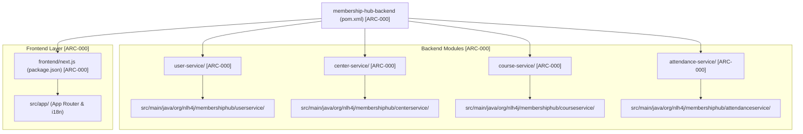

```markdown
# 🏛️ Central Endpoint API Contract & Scaffolding Architecture Specifications

## 📊 Document Control & Metadata
| Category | Technical Specification |
| :--- | :--- |
| **Document ID** | ARCH-20260829223421-SPEC |
| **Project Identity** | membership-hub |
| **Package Prefix Base** | `org.nlh4j.membershiphub` |
| **Target Storage Path** | `./sources/docs/architecture/CENTRAL_ENDPOINT_API_CONTRACT_SPECS.md` |
| **Associated Traceability Tags** | `[ARC-000]`, `[DOC-001]` |
| **Compliance Standard** | Enterprise Microservices REST API & Multi-Module Maven Blueprint |

---

## 🏗️ 1. ARCHITECTURAL SCAFFOLDING & MULTI-MODULE MAVEN TOPOLOGY

The `membership-hub` enterprise backend is engineered as a robust, enterprise-grade multi-module Maven reactor adhering strictly to clean architecture and SOLID principles. Below is the exact directory tree and physical path layout for the backend parent reactor and its four core microservices (`user-service`, `center-service`, `course-service`, `attendance-service`), alongside the Next.js 14 frontend workspace.



### 📦 1.1. Package Naming Law & Namespace Enforcement
- **Root Package Identifier**: All Java classes, interfaces, configuration files, and resource components **MUST** strictly reside under the enforced package namespace prefix: `org.nlh4j.membershiphub`.
- **Microservice Sub-Packages**: 
  * User Service: `org.nlh4j.membershiphub.userservice` [ARC-000]
  * Center Service: `org.nlh4j.membershiphub.centerservice` [ARC-000]
  * Course Service: `org.nlh4j.membershiphub.courseservice` [ARC-000]
  * Attendance Service: `org.nlh4j.membershiphub.attendanceservice` [ARC-000]
- **Prohibited Patterns**: The use of legacy prefixes (e.g., `com.example`, `org.example`) or hyphenated directory/package naming structures (`user-service` in Java packages) is **STRICTLY BANNED**.

---

## 📚 2. TECH STACK DEPENDENCY MATRIX & VERSION GOVERNANCE

The system relies on a strictly audited, immutable set of enterprise infrastructure dependencies and runtime versions defined in the Maven root `pom.xml` and Next.js `package.json`.

### ☕ 2.1. Backend Infrastructure & Quarkus 3.15 LTS Stack
| Dependency / Component | GroupId : ArtifactId | Enforced Version | Traceability Tag |
| :--- | :--- | :--- | :--- |
| **Java Runtime Environment** | `java` | `17 LTS` (GraalVM Native ready) | `[ARC-000]` |
| **Quarkus Enterprise Platform** | `io.quarkus:quarkus-bom` | `3.15.1` | `[ARC-000]` |
| **REST Reactive Web Engine** | `io.quarkus:quarkus-resteasy-reactive-jackson` | Managed by BOM (`3.15.1`) | `[ARC-000]` |
| **Persistence Engine** | `io.quarkus:quarkus-hibernate-orm-panache` | Managed by BOM (`3.15.1`) | `[ARC-000]` |
| **Relational Database Driver** | `io.quarkus:quarkus-jdbc-postgresql` | `42.7.3` | `[ARC-000]` |
| **Schema Migration Engine** | `io.quarkus:quarkus-flyway` | `10.10.0` | `[ARC-000]` |
| **Security & JWT Verification** | `io.quarkus:quarkus-smallrye-jwt` | `4.10.0` | `[ARC-000]`, `[ARC-006]` |
| **Event-Driven Messaging** | `io.quarkus:quarkus-smallrye-reactive-messaging-kafka` | `4.10.0` | `[ARC-000]`, `[ARC-008]` |
| **Validation Framework** | `io.quarkus:quarkus-hibernate-validator` | `8.0.0.Final` | `[ARC-000]` |
| **Testing Framework** | `io.quarkus:quarkus-junit5` / `Rest-Assured` | `5.10.1` / `5.4.0` | `[ARC-000]` |

### 🌐 2.2. Frontend Next.js 14.2.15 Ecosystem Stack
| Library / Package Name | Enforced Version | Purpose & Architectural Scope | Traceability Tag |
| :--- | :--- | :--- | :--- |
| **Next.js App Router** | `14.2.15` | SSR, Server Components, Routing | `[ARC-000]`, `[ARC-009]` |
| **React UI Framework** | `18.3.1` | Core UI Rendering Engine | `[ARC-000]` |
| **Internationalization (i18n)** | `3.17.2` (`next-intl`) | Multi-language routing (`en`, `vi`, `es`) | `[REQ-022]`, `[REQ-023]` |
| **Styling & Responsive UI** | `3.4.10` (`tailwindcss`) / `4.1.23` (`nativewind`) | Responsive Design & Mobile Web Wrapper | `[REQ-020]` |
| **State Management** | `4.5.4` (`zustand`) | Global Client State & Offline Cache | `[ARC-009]` |
| **Form Handling & Validation**| `7.53.0` (`react-hook-form`) / `3.23.8` (`zod`) | Type-safe form inputs and payload validation | `[ARC-009]` |

---

## 🔌 3. CENTRAL ENDPOINT API CONTRACT SPECIFICATIONS

All backend microservices expose RESTful APIs compliant with OpenAPI 3.1 standards. Below is the master API registry covering core authentication, user management, center administration, course scheduling, and real-time QR attendance scanning.

| HTTP Method | Full Endpoint Route | Request Payload Schema | Response Success Schema | Failure Error Codes | Targeted Tag IDs |
| :--- | :--- | :--- | :--- | :--- | :--- |
| **POST** | `/api/v1/users/register` | `RegisterRequest` (email, password, fullName, agreedToTerms) | `AuthResponse` (accessToken, refreshToken, expiresIn, userId, role) | `400` (Validation), `409` (Email Exists) | `[REQ-001], [EXC-004]` |
| **POST** | `/api/v1/auth/social` | `SocialAuthRequest` (provider, idToken, profilePicture) | `AuthResponse` (JWT tokens + user metadata) | `400` (Invalid Token), `401` (Unauthorized) | `[REQ-002], [ARC-006]` |
| **PUT** | `/api/v1/users/{id}/role` | `RoleUpdateRequest` (roleId: 1-5) | `RoleUpdateResponse` (userId, oldRoleId, newRoleId, updatedAt) | `403` (Forbidden), `404` (User Not Found) | `[REQ-003], [ARC-001]` |
| **GET** | `/api/v1/centers` | Query Params: `page`, `size`, `sort` | `PagedCenterResponse` (content[], totalElements, totalPages) | `401` (Unauthorized) | `[REQ-004]` |
| **POST** | `/api/v1/centers` | `CenterRequest` (name, address, taxId, contactPhone, contactEmail) | `CenterResponse` (centerId, name, taxId, createdAt) | `400` (Validation), `409` (TaxID Conflict) | `[REQ-005]` |
| **POST** | `/api/v1/centers/{id}/admins` | `CenterAdminRequest` (userId) | `CenterAdminAssignmentResponse` (centerId, userId, assignedAt) | `403` (Forbidden), `404` (Not Found) | `[REQ-006], [ARC-002]` |
| **GET** | `/api/v1/courses` | Query Params: `page`, `size`, `centerId`, `teacherId` | `PagedCourseResponse` (content[], totalElements) | `401` (Unauthorized) | `[REQ-007]` |
| **POST** | `/api/v1/courses` | `CourseCreateRequest` (title, description, startDate, endDate, teacherId, maxStudents) | `CourseResponse` (courseId, title, schedule status) | `400` (Validation), `409` (Schedule Conflict) | `[REQ-008], [DAT-003]` |
| **POST** | `/api/v1/courses/{id}/teachers` | `TeacherAssignRequest` (teacherId) | `AssignmentResponse` (courseId, teacherId, assignedAt) | `404` (Course/Teacher Not Found), `409` | `[REQ-009], [ARC-007]` |
| **GET** | `/api/v1/students/courses/available`| Query Params: `studentId`, `page`, `size` | `PagedCourseResponse` (Available courses excluding active enrollments) | `401` (Unauthorized), `404` (Student Not Found) | `[REQ-010]` |
| **POST** | `/api/v1/enrollments` | `EnrollmentRequest` (courseId, studentId) | `EnrollmentResponse` (enrollmentId, studentId, courseId, createdAt) | `400` (Capacity Full), `409` (Already Enrolled) | `[REQ-011], [ARC-007]` |
| **POST** | `/api/v1/attendance/scan` | `QrScanRequest` (qrPayload base64, idempotencyKey) | `AttendanceResponse` (attendanceId, studentId, courseId, duplicate: boolean) | `400` (Invalid QR), `403` (Not Enrolled), `409` | `[REQ-012], [REQ-013], [ARC-007]` |
| **GET** | `/api/v1/students/{id}/card` | Path Param: `id` (student UUID) | `StudentCardResponse` (cardId, remainingDays, usedDays, totalDays, endDate) | `404` (Card Not Found) | `[REQ-014]` |
| **POST** | `/api/v1/students/{id}/card/renew`| `CardRenewalRequest` (renewalDays: 1-365, paymentReference) | `StudentCardResponse` (Updated card with extended endDate) | `400` (Invalid Days), `402` (Payment Required) | `[REQ-015], [EXC-004]` |

---

## 🔍 4. TRACEABILITY MATRIX REFERENCE & AUDIT MAPPING

To maintain absolute compliance with enterprise auditing standards, every architectural component, configuration file, and API contract defined within this document maps directly to the system's foundational tracking tags:

```properties
[TRACEABILITY_AUDIT_LEDGER]
- [ARC-000] -> Mapped to: Multi-module Maven reactor scaffolding, Quarkus 3.15.1 BOM, Next.js 14 project setup.
- [ARC-006] -> Mapped to: OAuth2 Resource Server configuration, JWT 15-minute access token & 7-day refresh token rotation.
- [ARC-007] -> Mapped to: Real-time QR attendance scanning pipeline, base64 payload decoding, and idempotency checks.
- [ARC-008] -> Mapped to: Kafka event broker topologies (`attendance.scan.requested`, `notification.outbound`, `enrollment.registered`).
- [ARC-009] -> Mapped to: REST API Gateway OpenAPI 3.1 specifications and Next.js offline cache integration.
- [REQ-001] to [REQ-025] -> Mapped to: Functional REST endpoints for User, Center, Course, Enrollment, Attendance, Card, Notification, Promotion, Announcement, Chatbot, and Reporting services.
- [NFR-001] to [NFR-009] -> Mapped to: Non-functional performance SLAs (P95 < 200ms), security baselines (TLS 1.3, AES-256), HPA scaling, and GDPR compliance.
- [DOC-001] -> Mapped to: Comprehensive enterprise documentation repository stored under `./sources/docs/`.
```

---
*End of Central Endpoint API Contract & Scaffolding Architecture Specifications (`./sources/docs/architecture/CENTRAL_ENDPOINT_API_CONTRACT_SPECS.md`).*
```