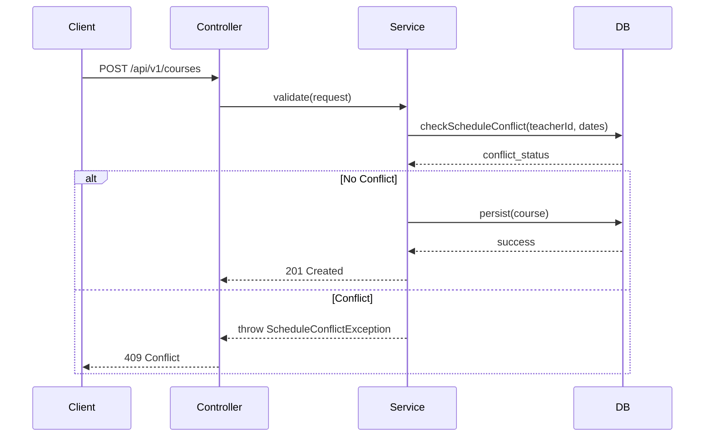

```markdown
# CENTRAL ENDPOINT API CONTRACT SPECIFICATIONS: COURSE SERVICE

## 1. DOCUMENTATION TRACEABILITY MATRIX REFERENCE
| Architectural Module | Requirement Tag ID | Description |
| :--- | :--- | :--- |
| Course CRUD Operations | [REQ-007] | Retrieval of course listings and details |
| Course Creation & Validation | [REQ-008] | Creation logic with schedule conflict checks |
| Documentation Standard | [DOC-001] | Enterprise documentation compliance |

---

## 2. COURSE SERVICE API SPECIFICATIONS (OpenAPI 3.1)

### 2.1. Endpoint: Create New Course
**Description:** Creates a new course record with automatic schedule conflict validation.

| Attribute | Specification |
| :--- | :--- |
| **HTTP Method** | `POST` |
| **Endpoint** | `/api/v1/courses` |
| **Security** | Bearer Token (JWT) |
| **Targeted Tag IDs** | [REQ-008] |

**Request Payload (CourseCreateRequest):**
```json
{
  "title": "String (max 150)",
  "description": "String",
  "startDate": "YYYY-MM-DD",
  "endDate": "YYYY-MM-DD",
  "teacherId": "UUID",
  "centerId": "UUID",
  "maxStudents": "Integer (default 30)"
}
```

**Response Shapes:**
- **201 Created:** Returns the created `CourseResponse` object.
- **400 Bad Request:** Validation failed (e.g., invalid date format).
- **403 Forbidden:** Insufficient privileges (Requires `CENTER_ADMIN` or `SYSTEM_ADMIN`).
- **409 Conflict:** Schedule conflict detected for the assigned teacher.

**Example cURL:**
```bash
curl -X POST http://api.membershiphub.org/api/v1/courses \
  -H "Authorization: Bearer <JWT_TOKEN>" \
  -H "Content-Type: application/json" \
  -d '{"title": "Advanced Java", "startDate": "2024-09-01", "endDate": "2024-12-01", "teacherId": "550e8400-e29b-41d4-a716-446655440000", "centerId": "770e8400-e29b-41d4-a716-446655440001"}'
```

---

### 2.2. Endpoint: List Courses
**Description:** Retrieves a paginated list of courses available within the authorized center.

| Attribute | Specification |
| :--- | :--- |
| **HTTP Method** | `GET` |
| **Endpoint** | `/api/v1/courses` |
| **Security** | Bearer Token (JWT) |
| **Targeted Tag IDs** | [REQ-007] |

**Query Parameters:**
- `page`: Integer (default 0)
- `size`: Integer (default 20)

**Response Shape (CourseResponse):**
```json
{
  "courseId": "UUID",
  "title": "String",
  "startDate": "YYYY-MM-DD",
  "endDate": "YYYY-MM-DD",
  "teacherName": "String"
}
```

**Example cURL:**
```bash
curl -X GET "http://api.membershiphub.org/api/v1/courses?page=0&size=20" \
  -H "Authorization: Bearer <JWT_TOKEN>"
```

---

## 3. ARCHITECTURAL PERSISTENCE & CRUD FLOW

### 3.1. Persistence Logic
The `course-service` utilizes Hibernate ORM with Panache. The persistence layer enforces data integrity via:
1. **Exclusion Constraints:** PostgreSQL `EXCLUDE USING gist` constraints are applied to the `courses` table to prevent overlapping schedules for the same `teacher_id` within the `[start_date, end_date]` range.
2. **Transactional Integrity:** All CRUD operations are wrapped in `@Transactional` boundaries.
3. **Validation:** Jakarta Bean Validation (JSR 380) is applied to all DTOs before reaching the service layer.

### 3.2. CRUD Flow Diagram


## 4. DEPLOYMENT & RUNTIME CONFIGURATION
- **Package Prefix:** `org.nlh4j.membershiphub.courseservice`
- **Environment Variables:**
  - `QUARKUS_DATASOURCE_JDBC_URL`: JDBC connection string for PostgreSQL.
  - `MP_JWT_VERIFY_ISSUER`: Token issuer validation.
- **Health Checks:** Available at `/q/health/live` and `/q/health/ready`.
```
```