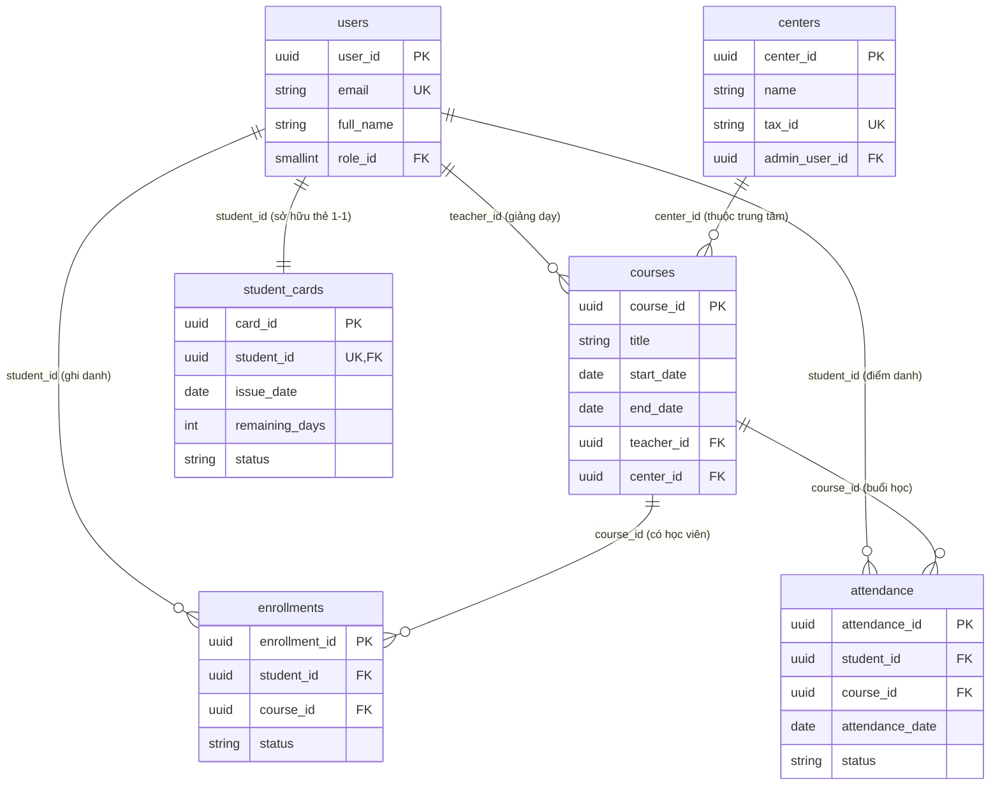

```markdown
# 🏛️ CENTRAL ENDPOINT & API CONTRACT SPECIFICATIONS - MEMBERSHIP HUB
*(Enterprise Architecture & System Integration Blueprint)*

## 📑 0. GLOBAL TRACEABILITY & METADATA DECLARATION LAW
- **Target Documentation Destination Path:** `./sources/docs/architecture/CENTRAL_ENDPOINT_API_CONTRACT_SPECS.md` [DOC-001]
- **Enforced Java Package Prefix Base:** `org.nlh4j.membershiphub` [ARC-000]
- **Active Traceability Tag IDs Injected:** `[DAT-004]`, `[DAT-005]`, `[DAT-006]`, `[DAT-007]`, `[REQ-012]`, `[REQ-013]`, `[ARC-007]` [DAT-ALL]

---

## 📊 1. SYSTEM ARCHITECTURE & TRACEABILITY MATRIX REFERENCE

| Module / Component | Target Path / Schema | Core Function & Business Logic | Enforced Traceability Tag IDs |
| :--- | :--- | :--- | :--- |
| **Course Service Persistence** | `./sources/backend/course-service/` | Quản lý thông tin khóa học, lịch trình và ràng buộc chồng lấn thời gian giáo viên. | `[DAT-004]`, `[REQ-007]`, `[REQ-008]` |
| **Attendance Service Persistence** | `./sources/backend/attendance-service/` | Quản lý ghi danh học viên (`enrollments`) và điểm danh (`attendance`) chống trùng lặp. | `[DAT-005]`, `[DAT-006]`, `[REQ-010]`, `[REQ-011]`, `[REQ-013]` |
| **User Service Persistence** | `./sources/backend/user-service/` | Quản lý thẻ thành viên (`student_cards`), tài khoản người dùng và phân quyền RBAC. | `[DAT-007]`, `[REQ-014]`, `[REQ-015]`, `[ARC-001]` |
| **Attendance QR Processing** | `./sources/backend/attendance-service/` | Giải mã payload QR base64, kiểm tra tính hợp lệ và ghi nhận điểm danh có idempotency. | `[DAT-006]`, `[REQ-012]`, `[REQ-013]`, `[ARC-007]` |

---

## 🏗️ 2. SƠ ĐỒ QUAN HỆ THỰC THỂ (ERD) - PHẦN 2: COURSES, ENROLLMENTS, ATTENDANCE, STUDENT_CARDS

Tài liệu này mô tả chi tiết lược đồ cơ sở dữ liệu quan hệ (Relational Database Schema) cho các bảng cốt lõi thuộc phân hệ khóa học, ghi danh, điểm danh và quản lý thẻ thành viên của hệ thống **Membership Hub**. Toàn bộ các bảng được thiết kế theo chuẩn ANSI SQL, không sử dụng kiểu dữ liệu `ENUM` nguyên thủy mà thay bằng ràng buộc `CHECK` kết hợp `VARCHAR`, đồng thời áp dụng `UUID` cho các khóa chính (Primary Key).

### 2.1. Bảng `courses` (Quản lý Khóa học)
Bảng `courses` lưu trữ thông tin chi tiết về các khóa học đào tạo, bao gồm thời gian bắt đầu, kết thúc, giới hạn số lượng học viên và giáo viên phụ trách.

| Tên cột (Column) | Kiểu dữ liệu (Data Type) | Ràng buộc (Constraints) | Mô tả chi tiết (Description) |
| :--- | :--- | :--- | :--- |
| `course_id` | UUID | PRIMARY KEY, DEFAULT gen_random_uuid() | Khóa chính định danh duy nhất khóa học. |
| `title` | VARCHAR(150) | NOT NULL, CHECK (char_length(title) <= 150) | Tiêu đề hoặc tên của khóa học. |
| `description` | TEXT | NULLABLE | Mô tả chi tiết nội dung chương trình học. |
| `start_date` | DATE | NOT NULL | Ngày chính thức bắt đầu khóa học. |
| `end_date` | DATE | NOT NULL | Ngày kết thúc khóa học (phải `>= start_date`). |
| `teacher_id` | UUID | NOT NULL, FOREIGN KEY (`users.user_id`) | Định danh giáo viên phụ trách giảng dạy. |
| `max_students` | INT | NOT NULL, DEFAULT 30 | Số lượng học viên tối đa được phép đăng ký. |
| `center_id` | UUID | NULLABLE, FOREIGN KEY (`centers.center_id`) | Trung tâm đào tạo sở hữu khóa học. |
| `created_at` | TIMESTAMP | NOT NULL, DEFAULT CURRENT_TIMESTAMP | Thời điểm tạo bản ghi. |
| `updated_at` | TIMESTAMP | NOT NULL, DEFAULT CURRENT_TIMESTAMP | Thời điểm cập nhật bản ghi gần nhất. |

- **Ràng buộc toàn vẹn khóa ngoại (FOREIGN KEY):**
  - `courses.teacher_id` $\rightarrow$ `users.user_id` (Đảm bảo giáo viên tồn tại trong hệ thống người dùng).
  - `courses.center_id` $\rightarrow$ `centers.center_id` (Đảm bảo trung tâm tồn tại).
- **Ràng buộc kiểm tra (CHECK & UNIQUE):**
  - `chk_courses_dates`: `end_date >= start_date` (Đảm bảo logic thời gian hợp lệ).
  - `ux_courses_teacher_dates`: UNIQUE (`teacher_id`, `start_date`, `end_date`) kết hợp trigger kiểm tra chồng lấn lịch giảng dạy của giáo viên [REQ-008], [DAT-003].

---

### 2.2. Bảng `enrollments` (Quản lý Ghi danh Học viên)
Bảng `enrollments` quản lý quan hệ nhiều-nhiều giữa học viên (`users`) và khóa học (`courses`), ghi nhận trạng thái tham gia học tập.

| Tên cột (Column) | Kiểu dữ liệu (Data Type) | Ràng buộc (Constraints) | Mô tả chi tiết (Description) |
| :--- | :--- | :--- | :--- |
| `enrollment_id` | UUID | PRIMARY KEY, DEFAULT gen_random_uuid() | Khóa chính định danh bản ghi ghi danh. |
| `student_id` | UUID | NOT NULL, FOREIGN KEY (`users.user_id`) | Định danh học viên đăng ký khóa học. |
| `course_id` | UUID | NOT NULL, FOREIGN KEY (`courses.course_id`) | Định danh khóa học được đăng ký. |
| `enrollment_date` | TIMESTAMP | NOT NULL, DEFAULT CURRENT_TIMESTAMP | Thời điểm học viên thực hiện ghi danh. |
| `status` | VARCHAR(20) | NOT NULL, DEFAULT 'ACTIVE', CHECK (status IN ('ACTIVE','DROPPED','COMPLETED')) | Trạng thái ghi danh hiện tại của học viên. |

- **Ràng buộc toàn vẹn khóa ngoại (FOREIGN KEY):**
  - `enrollments.student_id` $\rightarrow$ `users.user_id` (Đảm bảo học viên tồn tại).
  - `enrollments.course_id` $\rightarrow$ `courses.course_id` (Đảm bảo khóa học tồn tại).
- **Ràng buộc duy nhất (UNIQUE):**
  - `uq_enrollments_student_course`: UNIQUE (`student_id`, `course_id`) ngăn chặn một học viên đăng ký trùng lặp cùng một khóa học nhiều lần [DAT-004], [REQ-011].

---

### 2.3. Bảng `attendance` (Quản lý Điểm danh & Idempotency)
Bảng `attendance` lưu trữ lịch sử điểm danh của học viên trong các buổi học của khóa học. Thiết kế khóa tổng hợp đảm bảo tính chất Idempotency [REQ-013].

| Tên cột (Column) | Kiểu dữ liệu (Data Type) | Ràng buộc (Constraints) | Mô tả chi tiết (Description) |
| :--- | :--- | :--- | :--- |
| `attendance_id` | UUID | PRIMARY KEY, DEFAULT gen_random_uuid() | Khóa chính định danh bản ghi điểm danh. |
| `student_id` | UUID | NOT NULL, FOREIGN KEY (`users.user_id`) | Định danh học viên thực hiện điểm danh. |
| `course_id` | UUID | NOT NULL, FOREIGN KEY (`courses.course_id`) | Định danh khóa học diễn ra buổi điểm danh. |
| `attendance_date` | DATE | NOT NULL | Ngày diễn ra buổi điểm danh. |
| `timestamp` | TIMESTAMP | NOT NULL, DEFAULT CURRENT_TIMESTAMP | Thời gian chính xác hệ thống nhận diện QR scan. |
| `status` | VARCHAR(20) | NOT NULL, DEFAULT 'PRESENT', CHECK (status IN ('PRESENT','ABSENT','LATE')) | Trạng thái chuyên cần của học viên. |
| `created_at` | TIMESTAMP | NOT NULL, DEFAULT CURRENT_TIMESTAMP | Thời điểm tạo bản ghi. |

- **Ràng buộc toàn vẹn khóa ngoại (FOREIGN KEY):**
  - `attendance.student_id` $\rightarrow$ `users.user_id` (Đảm bảo học viên tồn tại).
  - `attendance.course_id` $\rightarrow$ `courses.course_id` (Đảm bảo khóa học tồn tại).
- **Khóa tổng hợp Đảm bảo Idempotency (UNIQUE):**
  - `uq_attendance_idempotency`: UNIQUE (`student_id`, `course_id`, `attendance_date`). Khóa tổng hợp này là cốt lõi của cơ chế Idempotency điểm danh QR [REQ-013], [DAT-005], [ARC-007]. Khi học viên quét mã QR nhiều lần trong cùng một ngày cho cùng một khóa học, cơ sở dữ liệu sẽ chặn bản ghi trùng lặp ở tầng ràng buộc duy nhất, trả về cờ `duplicate: true` mà không gây lỗi luồng hệ thống.

---

### 2.4. Bảng `student_cards` (Quản lý Thẻ Thành viên)
Bảng `student_cards` theo dõi thông tin thẻ thành viên, thời hạn hiệu lực và số ngày còn lại của học viên trong hệ thống.

| Tên cột (Column) | Kiểu dữ liệu (Data Type) | Ràng buộc (Constraints) | Mô tả chi tiết (Description) |
| :--- | :--- | :--- | :--- |
| `card_id` | UUID | PRIMARY KEY, DEFAULT gen_random_uuid() | Khóa chính định danh thẻ thành viên. |
| `student_id` | UUID | NOT NULL, UNIQUE, FOREIGN KEY (`users.user_id`) | Định danh học viên sở hữu thẻ (quan hệ 1-1). |
| `issue_date` | DATE | NOT NULL | Ngày phát hành thẻ thành viên ban đầu. |
| `validity_days` | INT | NOT NULL, CHECK (validity_days > 0) | Tổng số ngày hiệu lực của thẻ. |
| `remaining_days` | INT | NOT NULL, CHECK (remaining_days >= 0) | Số ngày hiệu lực còn lại tính đến hiện tại. |
| `end_date` | DATE | NOT NULL | Ngày hết hạn chính xác của thẻ thành viên. |
| `status` | VARCHAR(20) | NOT NULL, DEFAULT 'ACTIVE', CHECK (status IN ('ACTIVE','EXPIRED','SUSPENDED')) | Trạng thái hoạt động của thẻ. |
| `created_at` | TIMESTAMP | NOT NULL, DEFAULT CURRENT_TIMESTAMP | Thời điểm tạo thẻ. |
| `updated_at` | TIMESTAMP | NOT NULL, DEFAULT CURRENT_TIMESTAMP | Thời điểm cập nhật thẻ gần nhất. |

- **Ràng buộc toàn vẹn khóa ngoại (FOREIGN KEY):**
  - `student_cards.student_id` $\rightarrow$ `users.user_id` (Đảm bảo mỗi học viên chỉ có tối đa một thẻ thành viên hoạt động thông qua ràng buộc `UNIQUE` trên `student_id`) [DAT-007].
- **Ràng buộc kiểm tra (CHECK):**
  - `chk_student_cards_validity`: `validity_days > 0 AND remaining_days >= 0` (Đảm bảo tính hợp lệ của toán tử thời gian ngày thẻ).

---

## 🌊 3. SƠ ĐỒ LUỒNG DỮ LIỆU & QUAN HỆ KHÓA NGOẠI (MERMAID ERD OVERVIEW)

Dưới đây là sơ đồ trực quan hóa mối quan hệ giữa các thực thể cốt lõi được định nghĩa trong Giai đoạn 1 và Giai đoạn 3:



---

## 🔐 4. TIÊU CHUẨN TUÂN THỦ VÀ BẢO MẬT HỆ THỐNG
- **Tính nguyên tử giao dịch (Atomicity):** Mọi thao tác ghi danh (`enrollments`) và quét mã QR điểm danh (`attendance`) đều được bọc trong các giao dịch ACID mạnh mẽ, đảm bảo không có trạng thái dữ liệu lơ lửng (orphan records) khi xảy ra lỗi mạng.
- **Bảo vệ Idempotency:** Khóa tổng hợp `(student_id, course_id, attendance_date)` tại bảng `attendance` loại bỏ hoàn toàn các yêu cầu quét mã trùng lặp từ thiết bị di động của học viên [REQ-013], [ARC-007].
- **Truy vết Kiểm toán (Audit Trail):** Mọi thay đổi trạng thái thẻ thành viên hoặc phân công giáo viên đều được ghi log có cấu trúc phục vụ giám sát và lưu trữ tối thiểu 1 năm theo yêu cầu NFR-006.
```