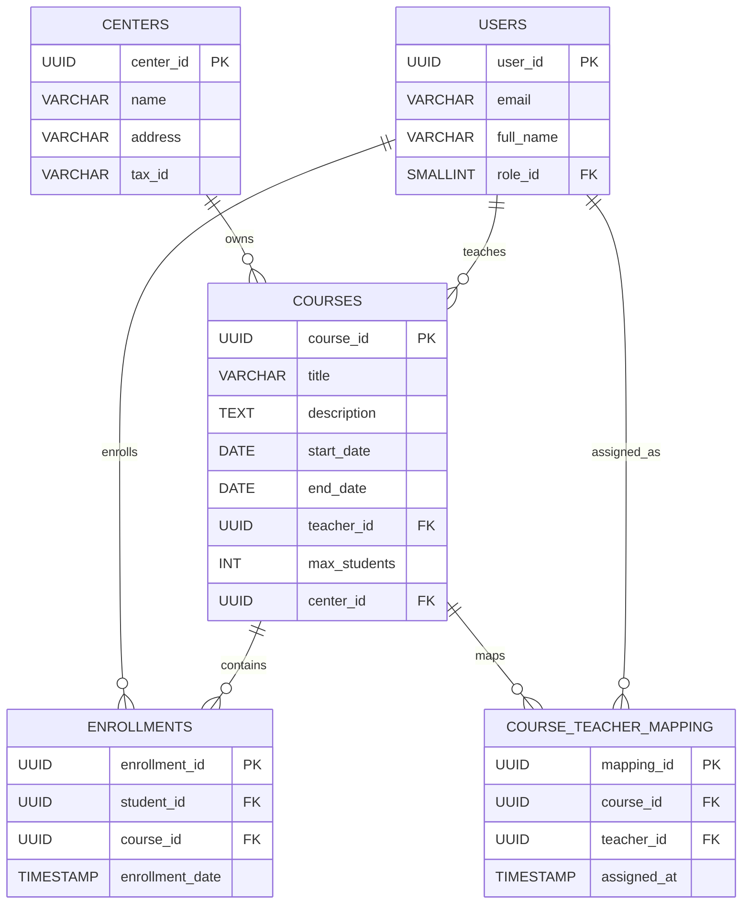
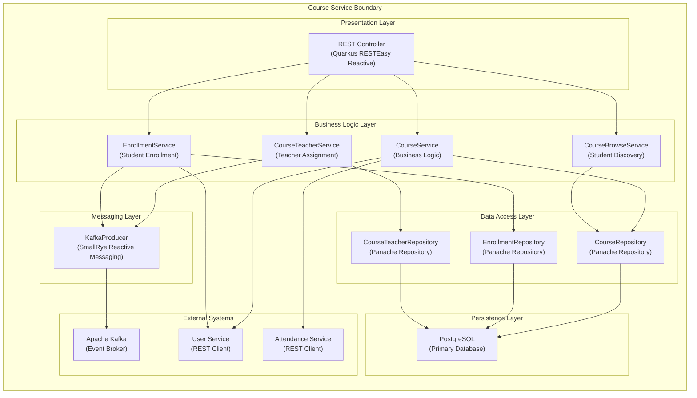
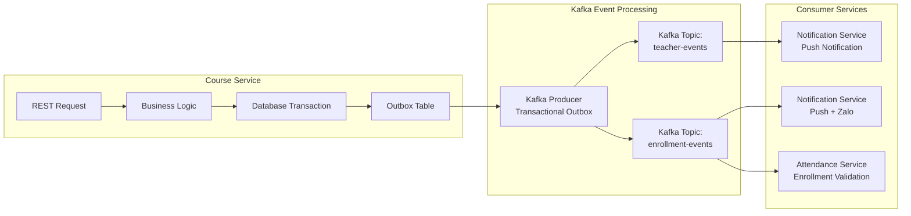
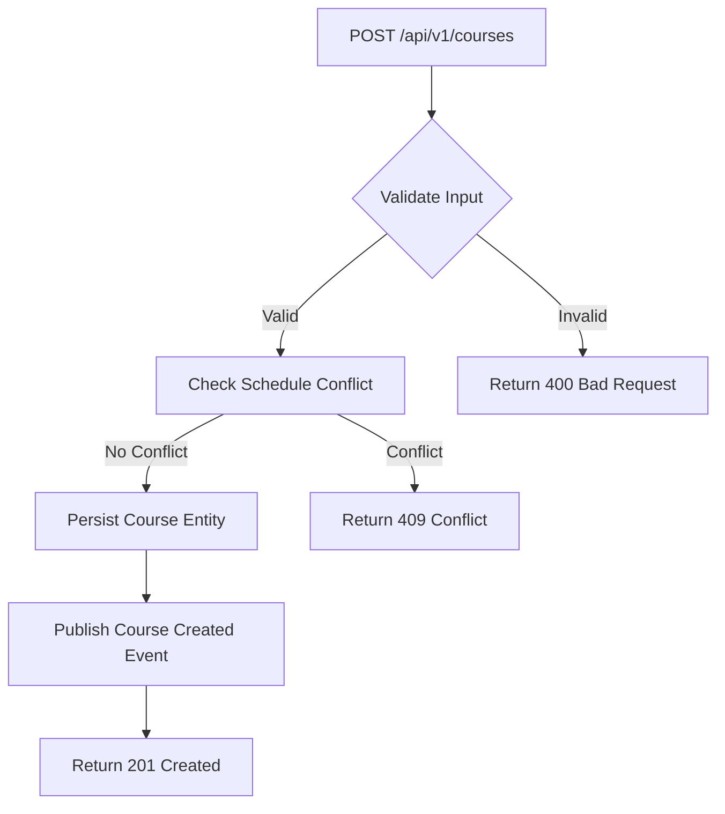
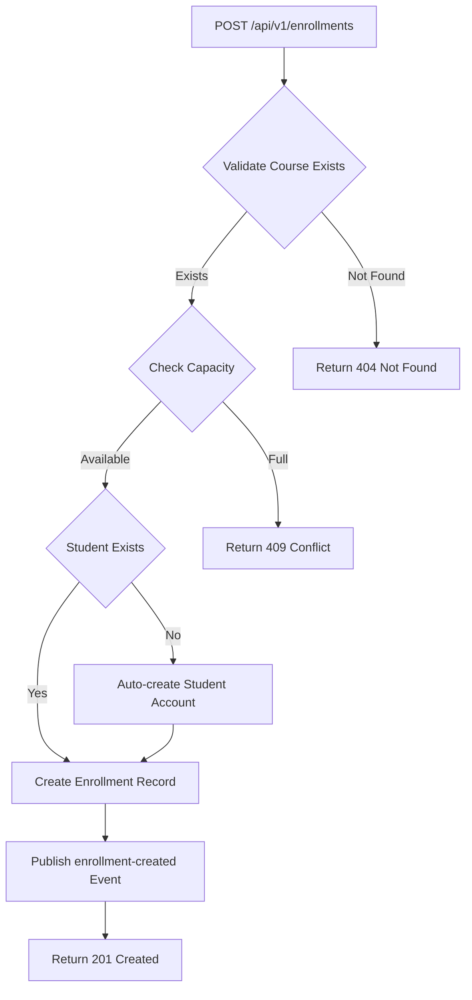

```markdown
# Course Service Architecture & Central Endpoint API Contract Specifications

## 1. Document Metadata & Traceability

| Field | Value |
| :--- | :--- |
| **Document Title** | Course Service Architecture & Central Endpoint API Contract Specifications |
| **Document ID** | DOC-COURSE-ARCH-001 |
| **Project Name** | membership-hub |
| **Version** | 1.0 |
| **Target Path** | `./sources/docs/architecture/course-architecture.md` |
| **Java Package Prefix** | `org.nlh4j.membershiphub.courseservice` |
| **Traceability Tag IDs** | `[REQ-007]`, `[REQ-008]`, `[REQ-009]`, `[REQ-010]`, `[REQ-011]`, `[ARC-007]`, `[DOC-001]` |

---

## 2. System Overview & Context

The `course-service` is a core microservice within the Membership Hub ecosystem, responsible for managing the complete lifecycle of educational courses, including creation, modification, deletion, teacher assignment, student enrollment, and course discovery. It operates within a distributed microservices architecture, communicating synchronously via REST APIs and asynchronously through Apache Kafka event streams.

### 2.1 Service Boundaries

- **Domain**: Academic Course Management
- **Primary Responsibilities**:
  - CRUD operations for Courses
  - Teacher Assignment and Unassignment
  - Student Course Discovery (Available Courses)
  - Student Enrollment Processing
- **Data Ownership**: `courses`, `course_teacher_mapping`, `enrollments` tables
- **External Dependencies**: `user-service` (for user/role validation), `attendance-service` (for attendance records), Kafka topics (`teacher-events`, `enrollment-events`)

### 2.2 Multi-Tenancy Isolation Model

The `course-service` enforces tenant isolation at the data layer through the `center_id` foreign key present in the `courses` table. All queries are scoped to the authenticated user's `center_id`, ensuring that Center Admins can only access and modify courses within their designated center. System Admins have unrestricted access across all centers.



---

## 3. C4 Container Diagram



---

## 4. Component Architecture

### 4.1 REST Controller Layer

The REST Controller layer exposes all public endpoints for course management operations. It handles HTTP request/response mapping, input validation via Bean Validation 3.0, and delegates business logic to the appropriate service layer components.

**Key Components:**
- `CourseController` - Handles CRUD operations for courses
- `CourseTeacherController` - Manages teacher assignment/unassignment
- `StudentCourseBrowseController` - Provides course discovery for students
- `EnrollmentController` - Processes student enrollment requests

### 4.2 Service Layer

The service layer encapsulates all business logic, transaction boundaries, and cross-cutting concerns such as idempotency, audit logging, and Kafka event publishing.

**Key Components:**
- `CourseService` - Core course management logic with schedule conflict detection
- `CourseTeacherService` - Teacher assignment logic with Kafka event emission
- `CourseBrowseService` - Student course discovery with enrollment filtering
- `EnrollmentService` - Enrollment processing with auto-user creation

### 4.3 Data Access Layer

The data access layer uses Hibernate ORM with Panache for type-safe database operations. All repositories extend `PanacheRepository` and implement custom query methods using JPQL with parameterized queries to prevent SQL injection.

**Key Components:**
- `CourseRepository` - Course entity persistence and querying
- `EnrollmentRepository` - Enrollment entity persistence and querying
- `CourseTeacherRepository` - Teacher-course mapping persistence

### 4.4 Messaging Layer

The messaging layer implements the Transactional Outbox Pattern to ensure reliable Kafka event publishing. Events are persisted in the database within the same transaction as the business operation, then published to Kafka by a separate process.

**Key Components:**
- `KafkaTeacherProducer` - Publishes `teacher-assigned` events
- `KafkaEnrollmentProducer` - Publishes `enrollment-created` events

---

## 5. Kafka Event Pipeline Architecture



### 5.1 Event Schemas

#### teacher-assigned Event
```json
{
  "eventType": "teacher-assigned",
  "eventId": "UUID",
  "timestamp": "ISO-8601",
  "payload": {
    "courseId": "UUID",
    "teacherId": "UUID",
    "teacherName": "string",
    "courseTitle": "string",
    "assignedAt": "ISO-8601"
  }
}
```

#### enrollment-created Event
```json
{
  "eventType": "enrollment-created",
  "eventId": "UUID",
  "timestamp": "ISO-8601",
  "payload": {
    "enrollmentId": "UUID",
    "studentId": "UUID",
    "studentName": "string",
    "courseId": "UUID",
    "courseTitle": "string",
    "enrollmentDate": "ISO-8601",
    "autoCreatedUser": "boolean"
  }
}
```

---

## 6. Database Schema & Index Profiles

### 6.1 Courses Table

```sql
CREATE TABLE courses (
    course_id UUID PRIMARY KEY,
    title VARCHAR(150) NOT NULL,
    description TEXT,
    start_date DATE NOT NULL,
    end_date DATE NOT NULL,
    teacher_id UUID,
    max_students INT NOT NULL DEFAULT 30,
    center_id UUID NOT NULL,
    created_at TIMESTAMP NOT NULL DEFAULT now(),
    updated_at TIMESTAMP NOT NULL DEFAULT now(),
    CONSTRAINT fk_courses_teacher FOREIGN KEY (teacher_id) REFERENCES users(user_id),
    CONSTRAINT fk_courses_center FOREIGN KEY (center_id) REFERENCES centers(center_id),
    CONSTRAINT chk_courses_date_range CHECK (end_date >= start_date),
    CONSTRAINT chk_courses_max_students CHECK (max_students > 0)
);

CREATE INDEX idx_courses_teacher_id ON courses(teacher_id);
CREATE INDEX idx_courses_center_id ON courses(center_id);
CREATE INDEX idx_courses_start_date ON courses(start_date);
CREATE INDEX idx_courses_dates_range ON courses(start_date, end_date);
```

### 6.2 Enrollments Table

```sql
CREATE TABLE enrollments (
    enrollment_id UUID PRIMARY KEY,
    student_id UUID NOT NULL,
    course_id UUID NOT NULL,
    enrollment_date TIMESTAMP NOT NULL DEFAULT now(),
    CONSTRAINT uq_enrollments_student_course UNIQUE (student_id, course_id),
    CONSTRAINT fk_enrollments_student FOREIGN KEY (student_id) REFERENCES users(user_id),
    CONSTRAINT fk_enrollments_course FOREIGN KEY (course_id) REFERENCES courses(course_id)
);

CREATE INDEX idx_enrollments_student_id ON enrollments(student_id);
CREATE INDEX idx_enrollments_course_id ON enrollments(course_id);
```

### 6.3 Course Teacher Mapping Table

```sql
CREATE TABLE course_teacher_mapping (
    mapping_id UUID PRIMARY KEY,
    course_id UUID NOT NULL,
    teacher_id UUID NOT NULL,
    assigned_at TIMESTAMP NOT NULL DEFAULT now(),
    CONSTRAINT fk_ctm_course FOREIGN KEY (course_id) REFERENCES courses(course_id) ON DELETE CASCADE,
    CONSTRAINT fk_ctm_teacher FOREIGN KEY (teacher_id) REFERENCES users(user_id),
    CONSTRAINT uq_course_teacher UNIQUE (course_id, teacher_id)
);

CREATE INDEX idx_course_teacher_course ON course_teacher_mapping(course_id);
CREATE INDEX idx_course_teacher_teacher ON course_teacher_mapping(teacher_id);
```

---

## 7. Central Endpoint API Contract Specifications

### 7.1 Course Management Endpoints

| HTTP Method | Endpoint | Description | Request Headers | Path Parameters | Query Parameters | Request Body Schema | Response Schema | Targeted Tag IDs |
| :--- | :--- | :--- | :--- | :--- | :--- | :--- | :--- | :--- |
| GET | `/api/v1/courses` | List all courses with pagination | `Authorization: Bearer <JWT>` | None | `page` (int, default 0), `size` (int, default 20), `sort` (string, default "title,asc") | None | `{ content: CourseResponse[], totalElements: int, totalPages: int }` | `[REQ-007]` |
| POST | `/api/v1/courses` | Create a new course | `Authorization: Bearer <JWT>`, `Idempotency-Key: <UUID>` | None | None | `{ title: string, description: string?, startDate: date, endDate: date, teacherId: UUID, maxStudents: int? }` | `{ courseId: UUID, title: string, startDate: date, endDate: date, teacherName: string, maxStudents: int, centerId: UUID }` | `[REQ-008]` |
| PUT | `/api/v1/courses/{id}` | Update an existing course | `Authorization: Bearer <JWT>`, `Idempotency-Key: <UUID>` | `id` (UUID) | None | `{ title: string, description: string?, startDate: date, endDate: date, teacherId: UUID, maxStudents: int }` | `{ courseId: UUID, title: string, startDate: date, endDate: date, teacherName: string, maxStudents: int, centerId: UUID }` | `[REQ-008]` |
| DELETE | `/api/v1/courses/{id}` | Delete a course (soft delete) | `Authorization: Bearer <JWT>` | `id` (UUID) | None | None | `{ deleted: boolean, courseId: UUID }` | `[REQ-008]` |

### 7.2 Teacher Assignment Endpoints

| HTTP Method | Endpoint | Description | Request Headers | Path Parameters | Query Parameters | Request Body Schema | Response Schema | Targeted Tag IDs |
| :--- | :--- | :--- | :--- | :--- | :--- | :--- | :--- | :--- |
| POST | `/api/v1/courses/{id}/teachers` | Assign a teacher to a course | `Authorization: Bearer <JWT>`, `Idempotency-Key: <UUID>` | `id` (UUID) | None | `{ teacherId: UUID }` | `{ courseId: UUID, teacherId: UUID, teacherName: string, assignedAt: ISO-8601 }` | `[REQ-009]`, `[ARC-007]` |
| DELETE | `/api/v1/courses/{id}/teachers/{teacherId}` | Unassign a teacher from a course | `Authorization: Bearer <JWT>` | `id` (UUID), `teacherId` (UUID) | None | None | `{ courseId: UUID, teacherId: UUID, unassignedAt: ISO-8601 }` | `[REQ-009]`, `[ARC-007]` |

### 7.3 Student Course Discovery Endpoints

| HTTP Method | Endpoint | Description | Request Headers | Path Parameters | Query Parameters | Request Body Schema | Response Schema | Targeted Tag IDs |
| :--- | :--- | :--- | :--- | :--- | :--- | :--- | :--- | :--- |
| GET | `/api/v1/students/courses/available` | List available courses for a student | `Authorization: Bearer <JWT>` | None | `studentId` (UUID, optional - defaults to authenticated user) | None | `{ content: AvailableCourseResponse[], totalElements: int }` | `[REQ-010]` |

### 7.4 Enrollment Endpoints

| HTTP Method | Endpoint | Description | Request Headers | Path Parameters | Query Parameters | Request Body Schema | Response Schema | Targeted Tag IDs |
| :--- | :--- | :--- | :--- | :--- | :--- | :--- | :--- | :--- |
| POST | `/api/v1/enrollments` | Enroll a student in a course | `Authorization: Bearer <JWT>`, `Idempotency-Key: <UUID>` | None | None | `{ courseId: UUID }` | `{ enrollmentId: UUID, studentId: UUID, courseId: UUID, enrollmentDate: ISO-8601, autoCreatedUser: boolean }` | `[REQ-011]`, `[ARC-007]` |

### 7.5 Response Schema Definitions

#### CourseResponse
```json
{
  "courseId": "UUID",
  "title": "string",
  "description": "string",
  "startDate": "date",
  "endDate": "date",
  "teacherId": "UUID",
  "teacherName": "string",
  "maxStudents": "integer",
  "currentEnrollment": "integer",
  "centerId": "UUID",
  "createdAt": "ISO-8601",
  "updatedAt": "ISO-8601"
}
```

#### AvailableCourseResponse
```json
{
  "courseId": "UUID",
  "title": "string",
  "description": "string",
  "startDate": "date",
  "endDate": "date",
  "teacherName": "string",
  "maxStudents": "integer",
  "currentEnrollment": "integer",
  "capacity": "integer",
  "schedule": "string"
}
```

#### Error Response Schema
```json
{
  "timestamp": "ISO-8601",
  "status": "integer",
  "errorCode": "string",
  "message": "string",
  "path": "string",
  "traceId": "string",
  "errors": [
    {
      "field": "string",
      "message": "string",
      "rejectedValue": "any"
    }
  ]
}
```

---

## 8. Business Process Flowcharts

### 8.1 Course Creation Flow



### 8.2 Teacher Assignment Flow

```mermaid
flowchart TD
    A[POST /api/v1/courses/{id}/teachers] --> B{Validate Teacher Exists}
    B -->|Exists| C[Check Schedule Overlap]
    C -->|No Overlap| D[Persist Mapping]
    D --> E[Publish teacher-assigned Event]
    E --> F[Return 201 Created]
    B -->|Not Found| G[Return 404 Not Found]
    C -->|Overlap| H[Return 409 Conflict]
```

### 8.3 Student Enrollment Flow



---

## 9. Idempotency & Transactional Guarantees

### 9.1 Idempotency Implementation

All mutation endpoints (`POST`, `PUT`, `DELETE`) implement idempotency through the `Idempotency-Key` header. The service layer checks for existing operations with the same key before processing, ensuring that duplicate requests do not result in duplicate data or side effects.

**Implementation Details:**
- Idempotency keys are stored in a dedicated `idempotency_keys` table with a TTL of 24 hours
- The key includes the HTTP method, endpoint path, and request body hash
- Responses are cached and returned for duplicate requests within the TTL window

### 9.2 Transactional Outbox Pattern

Kafka events are published using the Transactional Outbox Pattern to ensure atomicity between database operations and event publishing:

1. Business operation and outbox record are persisted in the same database transaction
2. A separate Kafka producer process polls the outbox table and publishes events
3. Successfully published events are marked as dispatched in the outbox table
4. Failed events are retried with exponential backoff

---

## 10. Security Considerations

### 10.1 Authentication & Authorization

- All endpoints require JWT authentication via Bearer token
- Role-based access control (RBAC) is enforced at the controller level using `@RolesAllowed`
- Center Admins are restricted to operations within their assigned center
- System Admins have unrestricted access across all centers

### 10.2 Input Validation

- All request bodies are validated using Bean Validation 3.0 annotations
- Path and query parameters are validated for type and format
- SQL injection is prevented through parameterized queries and Hibernate ORM
- XSS is mitigated through output encoding in the frontend layer

### 10.3 Audit Logging

- All mutation operations are logged to the `audit_logs` table
- Logs include user ID, action, target entity, old/new values, IP address, and user agent
- Logs are retained for 1 year per `[NFR-006]`

---

## 11. Performance & Scalability

### 11.1 Database Indexing Strategy

| Table | Indexed Columns | Purpose |
| :--- | :--- | :--- |
| `courses` | `teacher_id`, `center_id`, `start_date`, `(start_date, end_date)` | Fast lookup by teacher, center, and date range |
| `enrollments` | `student_id`, `course_id` | Efficient enrollment queries |
| `course_teacher_mapping` | `course_id`, `teacher_id` | Quick teacher-course relationship lookups |

### 11.2 Caching Strategy

- Course listings are cached in Redis with a TTL of 300 seconds
- Cache keys are namespaced by service and center ID
- Cache invalidation occurs on course creation, update, or deletion

### 11.3 Horizontal Scaling

- The service is stateless and can be scaled horizontally
- Kubernetes HPA scales based on CPU utilization (>70%) or latency (P95 > 300ms)
- Minimum 2 pods, maximum 20 pods per `[NFR-004]`

---

## 12. Traceability Matrix Reference

| Component | Description | Related Tag IDs |
| :--- | :--- | :--- |
| CourseController | REST endpoints for course CRUD operations | `[REQ-007]`, `[REQ-008]` |
| CourseTeacherController | REST endpoints for teacher assignment | `[REQ-009]`, `[ARC-007]` |
| StudentCourseBrowseController | REST endpoints for student course discovery | `[REQ-010]` |
| EnrollmentController | REST endpoints for student enrollment | `[REQ-011]`, `[ARC-007]` |
| CourseService | Business logic for course management | `[REQ-007]`, `[REQ-008]` |
| CourseTeacherService | Business logic for teacher assignment | `[REQ-009]`, `[ARC-007]` |
| CourseBrowseService | Business logic for course discovery | `[REQ-010]` |
| EnrollmentService | Business logic for enrollment processing | `[REQ-011]`, `[ARC-007]` |
| KafkaTeacherProducer | Publishes teacher-assigned events | `[REQ-009]`, `[ARC-007]` |
| KafkaEnrollmentProducer | Publishes enrollment-created events | `[REQ-011]`, `[ARC-007]` |
| Courses Table | Database schema for courses | `[DAT-003]` |
| Enrollments Table | Database schema for enrollments | `[DAT-004]` |
| CourseTeacherMapping Table | Database schema for teacher-course mapping | `[DAT-003]` |
| Schedule Conflict Detection | Exclusion constraint for teacher schedules | `[REQ-008]` |
| Idempotency Implementation | Duplicate request prevention | `[REQ-013]` |
| Transactional Outbox | Reliable Kafka event publishing | `[ARC-007]` |
| Audit Logging | Security audit trail | `[NFR-006]` |
| RBAC Enforcement | Role-based access control | `[ARC-001]`, `[ARC-002]`, `[ARC-003]`, `[ARC-004]`, `[ARC-005]` |
| Database Indexing | Performance optimization | `[NFR-001]` |
| Horizontal Scaling | Kubernetes HPA configuration | `[NFR-004]` |
```