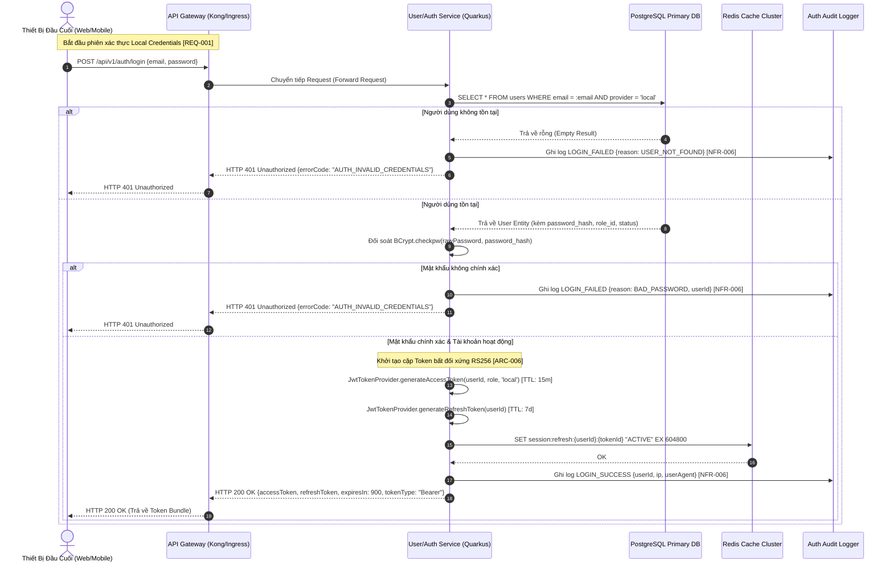
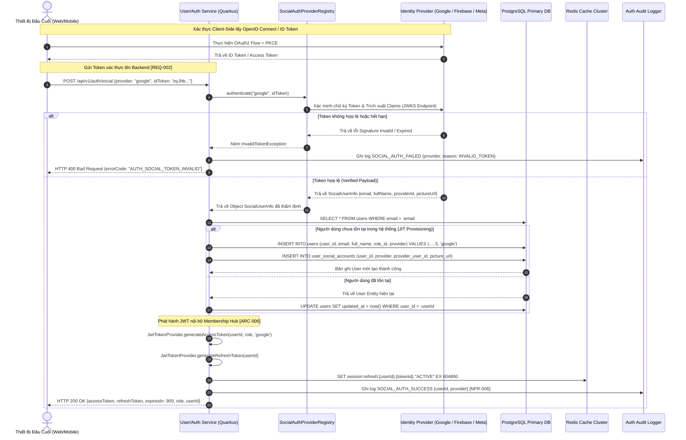
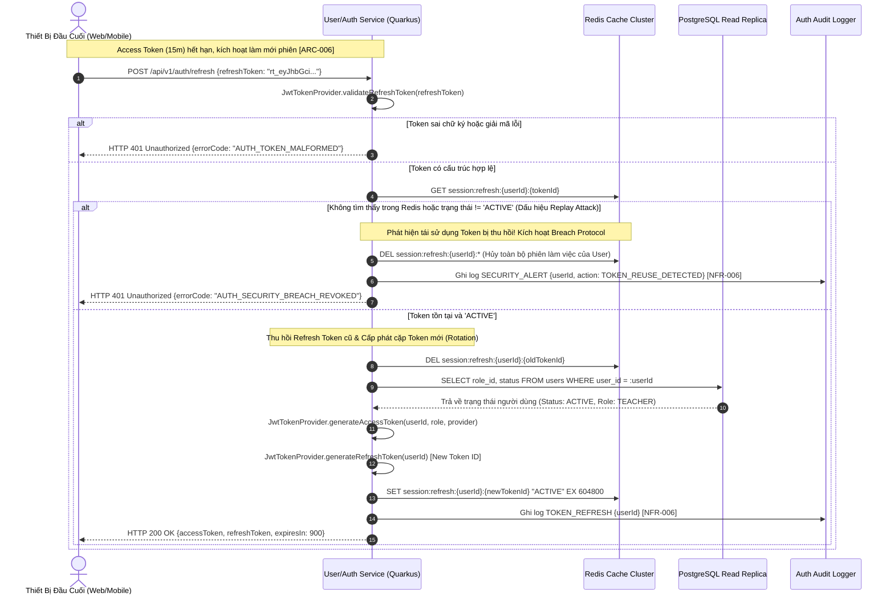

```markdown
# 🏛️ KIẾN TRÚC BẢO MẬT, XÁC THỰC VÀ PHÂN QUYỀN ĐA NỀN TẢNG (CROSS-PLATFORM AUTHENTICATION & RBAC SPECIFICATION)

| Thuộc Tính Hệ Thống | Chi Tiết Đặc Tả Kỹ Thuật |
| :--- | :--- |
| **Mã Bản Thiết Kế** | SEC-DOC-20260829-001 |
| **Dự Án Áp Dụng** | `membership-hub` |
| **Gói Java Cơ Sở** | `org.nlh4j.membershiphub` |
| **Vị Trí Lưu Trữ** | `./sources/docs/architecture/CROSS_PLATFORM_INTEGRATION_SECURITY_FLOWS.md` / `./sources/docs/security-authentication.md` |
| **Mức Độ Bảo Mật** | Enterprise Confidential - Level 3 |
| **Mã Truy Vết Nền Tảng** | `[ARC-006]`, `[NFR-003]`, `[DOC-001]`, `[REQ-001]`, `[REQ-002]`, `[REQ-003]`, `[NFR-006]` |

---

## 📑 1. TỔNG QUAN HỆ THỐNG XÁC THỰC VÀ BẢO MẬT TẬP TRUNG (SECURITY OVERVIEW)

Hệ thống Membership Hub triển khai mô hình định danh tập trung (Centralized Identity & Access Management - IAM) phục vụ kiến trúc vi dịch vụ phân tán trên nền tảng **Quarkus 3.15 LTS Backend** kết hợp giao diện đa kênh **Next.js 14 Web Portal** và **React Native Mobile Client**.

Mô hình kết hợp hai cơ chế xác thực cốt lõi:
1. **Xác thực Cục bộ (Local Identity Provider):** Dựa trên cặp thông tin Email/Mật khẩu được mã hóa an toàn với thuật toán `BCrypt` (Cost factor = 12).
2. **Xác thực Xã hội (Federated Social OAuth2/OpenID Connect):** Tiếp nhận và thẩm định ID Token phân tán từ Google Identity Services, Firebase Authentication, và Meta Graph API (Facebook Login) thông qua hạ tầng PKCE (Proof Key for Code Exchange) và xác thực bất đối xứng `RS256`.

Hệ thống thực thi nguyên tắc **Zero Trust Network Architecture (ZTNA)**:
- Mọi kết nối API nội bộ và đối ngoại đều yêu cầu JSON Web Token (JWT) được ký số bằng thuật toán mã hóa khóa công khai RSA-2048 (`RS256`).
- Thời gian sống của Access Token được giới hạn nghiêm ngặt ở mức 15 phút (900 giây) `[ARC-006]`.
- Refresh Token có thời hạn tối đa 7 ngày, bắt buộc lưu trữ trạng thái tại cụm phân tán **Redis Cache Cluster** nhằm hỗ trợ cơ chế Thu hồi Token Tức thì (Instant Token Revocation/Blacklisting) `[NFR-003]`.

---

## 🔄 2. SƠ ĐỒ TUẦN TỰ CÁC LUỒNG XÁC THỰC NGHIỆP VỤ (MERMAID SEQUENCE DIAGRAMS)

### 2.1. Luồng Đăng Nhập Email/Password và Cấp Phát Token Kép `[REQ-001]`, `[ARC-006]`, `[NFR-003]`

Luồng đăng nhập truyền thống yêu cầu xác minh thông tin đăng nhập, đối soát mật khẩu đã băm (hash comparison), cấp phát cặp khóa Access Token / Refresh Token và ghi nhận nhật ký kiểm toán bảo mật (Audit Logging).



---

### 2.2. Luồng Xác Thực Đăng Nhập Xã Hội (Social OAuth2 / OpenID Connect) `[REQ-002]`, `[ARC-006]`

Xử lý các nhà cung cấp định danh bên thứ ba: Firebase, Google Identity, và Facebook Graph API. Hệ thống đảm bảo tự động đồng bộ tài khoản người dùng cục bộ (Just-In-Time Provisioning) với vai trò mặc định `STUDENT`.



---

### 2.3. Luồng Làm Mới Phiên Làm Việc (Refresh Token Rotation Flow) `[ARC-006]`, `[NFR-003]`

Nhằm bảo vệ hệ thống trước tấn công phát lại (Replay Attacks), Membership Hub triển khai cơ chế **Refresh Token Rotation (RTR)**. Mỗi khi Refresh Token được sử dụng để lấy Access Token mới, chính Refresh Token cũ sẽ bị vô hiệu hóa ngay lập tức và thay thế bằng một Refresh Token hoàn toàn mới.



---

## 📦 3. ĐẶC TẢ CẤU TRÚC JSON WEB TOKEN (JWT SPECIFICATION) `[ARC-006]`

Hệ thống sử dụng chuẩn JWT RFC-7519 được ký bất đối xứng bằng thuật toán `RS256` (RSA Signature with SHA-256) thông qua cặp khóa RSA-2048 bit do module `quarkus-smallrye-jwt` quản lý.

```
+-------------------------------------------------------------------------+
|                               JWT HEADER                                |
|             {"alg": "RS256", "typ": "JWT", "kid": "hub-auth-2026"}      |
+-------------------------------------------------------------------------+
                                     |
+-------------------------------------------------------------------------+
|                               JWT PAYLOAD                               |
|   {                                                                     |
|     "iss": "membership-hub",                                            |
|     "sub": "550e8400-e29b-41d4-a716-446655440000",                      |
|     "aud": "membership-hub-client",                                     |
|     "jti": "d3b07384-d113-406b-a2c6-d983d978a3c2",                      |
|     "exp": 1772323200,                                                  |
|     "nbf": 1772322300,                                                  |
|     "iat": 1772322300,                                                  |
|     "group": "CENTER_ADMIN",                                            |
|     "centerId": "770e8400-e29b-41d4-a716-446655440000",                |
|     "provider": "local",                                                |
|     "email": "centeradmin.q1@membershiphub.vn"                         |
|   }                                                                     |
+-------------------------------------------------------------------------+
                                     |
+-------------------------------------------------------------------------+
|                              JWT SIGNATURE                              |
|           RSASHA256(base64Url(Header) + "." + base64Url(Payload),      |
|                     privateKeyRSA2048.pem)                              |
+-------------------------------------------------------------------------+
```

### Bảng Chi Tiết Thuộc Tính JWT Token:

| Phân Vùng | Thuộc Tính (Claim) | Kiểu Dữ Liệu | Giá Trị Mẫu / Mô Tả Kỹ Thuật | Ràng Buộc & Ý Nghĩa Bảo Mật |
| :--- | :--- | :--- | :--- | :--- |
| **Header** | `alg` | String | `"RS256"` | Thuật toán mã hóa chữ ký bắt buộc. Bị cấm sử dụng `"none"`. |
| **Header** | `typ` | String | `"JWT"` | Định danh loại đối tượng mã hóa tiêu chuẩn RFC-7519. |
| **Header** | `kid` | String | `"hub-auth-2026-v1"` | Key Identifier dùng để xoay vòng khóa (Key Rotation) qua JWKS. |
| **Payload** | `iss` (Issuer) | String | `"membership-hub"` | Định danh máy chủ cấp phát token. Xác thực qua `mp.jwt.verify.issuer`. |
| **Payload** | `sub` (Subject) | UUID String | `"550e8400-e29b-41d4-a716-446655440000"` | Định danh duy nhất toàn cục của người dùng trong bảng `users`. |
| **Payload** | `aud` (Audience) | String | `"membership-hub-client"` | Đối tượng thụ hưởng token. Ngăn chặn Token Confusion Attack. |
| **Payload** | `jti` (JWT ID) | UUID String | `"d3b07384-d113-406b-a2c6-d983d978a3c2"` | Mã định danh duy nhất của token, chống Replay Attack trên mạng. |
| **Payload** | `iat` (Issued At) | Epoch Unix | `1772322300` | Thời điểm phát hành token tính bằng giây. |
| **Payload** | `exp` (Expiration) | Epoch Unix | `1772323200` | Thời điểm token hết hiệu lực (`iat + 900` giây = 15 phút). |
| **Payload** | `group` (Role) | String Enum | `"CENTER_ADMIN"` | Vai trò RBAC của người dùng (`SYSTEM_ADMIN`, `CENTER_ADMIN`,...). |
| **Payload** | `centerId` | UUID String | `"770e8400-e29b-41d4-a716-446655440000"` | Ranh giới phân vùng dữ liệu Tenant. Null đối với System Admin. |
| **Payload** | `provider` | String | `"local"` / `"google"` / `"firebase"` | Nguồn định danh tài khoản liên kết. |
| **Signature**| Chữ ký số | Binary/Base64 | `RSASHA256(Header.Payload, PrivateKey)` | Xác minh tính toàn vẹn và nguồn gốc token không bị giả mạo. |

---

## 🔒 4. CHÍNH SÁCH MẬT KHẨU MẠNH DOANH NGHIỆP (PASSWORD POLICY) `[REQ-001]`, `[NFR-003]`

Tất cả các tài khoản sử dụng phương thức xác thực nội bộ (Local Credentials) phải tuân thủ nghiêm ngặt các quy chuẩn kiểm soát mật khẩu tại cổng đăng ký `POST /api/v1/users/register` và cổng đổi mật khẩu.

```
  Tối thiểu 8 ký tự (Tối đa 128 ký tự)
  ├── Phải chứa ít nhất 1 chữ cái in HOA (A-Z)
  ├── Phải chứa ít nhất 1 chữ cái in thường (a-z)
  ├── Phải chứa ít nhất 1 chữ số thập phân (0-9)
  └── Phải chứa ít nhất 1 ký tự đặc biệt (!@#$%^&*()_+-=[]{}|;:,.<>?)
```

### 4.1. Biểu Thức Chính Quy (Regex Validation Pattern):
```regex
^(?=.*[a-z])(?=.*[A-Z])(?=.*\d)(?=.*[!@#$%^&*()_+\-=\[\]{}|;:,.<>?])[A-Za-z\d!@#$%^&*()_+\-=\[\]{}|;:,.<>?]{8,128}$
```

### 4.2. Cơ Chế Băm Mật Khẩu An Toàn (Cryptographic Hashing Rails):
- **Thuật toán áp dụng:** `BCrypt` via Bouncy Castle Cryptographic Provider.
- **Độ phức tạp (Cost Factor / Work Factor):** `12` (Tương đương 4096 rounds băm, thời gian xử lý mục tiêu ~250ms trên CPU chuẩn nhằm vô hiệu hóa các đòn tấn công vét cạn Offline Brute-force và GPU Rainbow Tables).
- **Salt Generation:** Hệ thống tự động sinh ngẫu nhiên 128-bit Cryptographically Secure Pseudorandom Number Generator (CSPRNG) cho từng bản ghi riêng biệt.

---

## 🛑 5. QUY TRÌNH THU HỒI VÀ ĐƯA VÀO DANH SÁCH ĐEN TOKEN (REVOCATION & BLACKLISTING) `[NFR-003]`, `[ARC-006]`

Trong môi trường phân tán (Stateless JWT), việc thu hồi token trước hạn (khi người dùng Đăng xuất, Đổi mật khẩu, hoặc Bị quản trị viên hạ cấp vai trò `[REQ-003]`) được xử lý thông qua **Redis Distributed In-Memory Blacklist Layer**.

```
+-----------------------------------------------------------------------------------+
|               QUY TRÌNH THU HỒI TOKEN & KIỂM SOÁT PHIÊN LÀM VIỆC                  |
+-----------------------------------------------------------------------------------+
                                          |
    1. Yêu cầu Đăng Xuất (Logout)         |    2. Hạ Cấp Vai Trò (Role Downgrade)
    [POST /api/v1/auth/logout]            |    [PUT /api/v1/users/{id}/role]
                                          |
                                          v
+-----------------------------------------------------------------------------------+
| TRÍCH XUẤT JTI (JWT ID) & TÍNH TOÁN THỜI GIAN SỐNG CÒN LẠI (TTL = EXP - CURRENT_TIME) |
+-----------------------------------------------------------------------------------+
                                          |
                                          v
+-----------------------------------------------------------------------------------+
|               LƯU JTI VÀO CỤM REDIS CACHE VỚI THỜI HẠN TỰ ĐỘNG XÓA (TTL)          |
|               Key: "jwt:blacklist:{jti}" | Value: "REVOKED" | TTL: {remainingSec} |
|               Key: "session:refresh:{userId}:*" -> DEL (Xóa bỏ Refresh Token)     |
+-----------------------------------------------------------------------------------+
                                          |
                                          v
+-----------------------------------------------------------------------------------+
|        CỔNG CHẶN TRUY CẬP (QUARKUS JWT AUTH FILTER INTERCEPTOR TẠI MỌI REQUEST)    |
|        1. Xác minh chữ ký RS256 của Access Token.                                 |
|        2. Trích xuất claim 'jti'.                                                 |
|        3. Kiểm tra: EXISTS "jwt:blacklist:{jti}" == 1 ?                           |
|           --> NÉM NGAY HTTP 401 UNAUTHORIZED (Mã: "AUTH_TOKEN_REVOKED")           |
+-----------------------------------------------------------------------------------+
```

---

## 👥 6. MA TRẬN PHÂN QUYỀN TRUY CẬP DỰA TRÊN VAI TRÒ (RBAC MATRIX) `[ARC-001]` - `[ARC-005]`

Hệ thống triển khai mô hình phân quyền 5 cấp độ nghiêm ngặt. Ranh giới dữ liệu đa người thuê (Multi-tenancy Isolation) được kiểm soát bởi cặp giá trị `(role_id, center_id)` trích xuất trực tiếp từ token.

```
       [SYSTEM_ADMIN] (Cấp 1 - Toàn quyền Hệ thống Toàn cầu)
             │
             ▼
       [CENTER_ADMIN] (Cấp 2 - Toàn quyền trong phạm vi Trung tâm)
             │
             ▼
       [MANAGER] (Cấp 3 - Quản lý Học viên & Thông báo)
             │
             ▼
       [TEACHER] (Cấp 4 - Giảng dạy, Điểm danh & Lớp học phân công)
             │
             ▼
       [STUDENT] (Cấp 5 - Xem Thẻ, Đăng ký môn & Điểm danh QR)
```

### Bảng Ma Trận Phân Quyền Chi Tiết (Role-Based Access Control Matrix):

| Cấp Bậc Role | Tên Định Danh Role | Mã Token Truy Vết | Ranh Giới Dữ Liệu (Tenant Scope) | Quyền Hạn CRUD & Hành Động Nghiệp Vụ Được Ủy Quyền | Các Endpoint REST Cho Phép Truy Cập (Whitelist Routes) |
| :---: | :--- | :--- | :--- | :--- | :--- |
| **Level 1** | `SYSTEM_ADMIN` | `[ARC-001]` | Toàn hệ sinh thái (Global Cross-Centers) | - Toàn quyền CRUD trên mọi bảng dữ liệu.<br>- Tạo mới/Xóa Trung tâm (`Centers`).<br>- Gán/Hủy quyền `CENTER_ADMIN`.<br>- Thay đổi cấu hình bảo mật hệ thống toàn cục. | `POST /api/v1/centers`<br>`PUT /api/v1/centers/{id}`<br>`DELETE /api/v1/centers/{id}`<br>`POST /api/v1/centers/{id}/admins`<br>`PUT /api/v1/users/{id}/role` |
| **Level 2** | `CENTER_ADMIN` | `[ARC-002]` | Độc lập trong Trung tâm (`center_id` cố định) | - Quản trị hồ sơ nội bộ Trung tâm sở hữu.<br>- CRUD Khóa học (`Courses`) thuộc trung tâm.<br>- CRUD Khuyến mãi (`Promotions`) & Thông báo.<br>- Bổ nhiệm / Miễn nhiệm `MANAGER` & `TEACHER`. | `GET /api/v1/centers/{id}`<br>`POST /api/v1/courses`<br>`PUT /api/v1/courses/{id}`<br>`POST /api/v1/courses/{id}/teachers`<br>`POST /api/v1/promotions`<br>`GET /api/v1/reports/attendance` |
| **Level 3** | `MANAGER` | `[ARC-003]` | Giới hạn theo Trung tâm (`center_id` chỉ định) | - Quản lý hồ sơ học viên (`Users/Students`).<br>- Quản lý phát hành/gia hạn thẻ học viên.<br>- Đăng thông báo chung (`Announcements`).<br>- Không có quyền can thiệp vào tài chính hoặc phân quyền Admin. | `GET /api/v1/courses`<br>`GET /api/v1/students`<br>`POST /api/v1/students/{id}/card/renew`<br>`POST /api/v1/announcements`<br>`GET /api/v1/dashboard/enrollment-summary` |
| **Level 4** | `TEACHER` | `[ARC-004]` | Chỉ các Lớp được phân công (`teacher_id`) | - Đọc thông tin khóa học và danh sách sinh viên lớp mình dạy.<br>- Kích hoạt mã QR Điểm danh thời gian thực.<br>- Xem báo cáo chuyên cần của lớp phụ trách.<br>- Không được sửa đổi thông tin khóa học. | `GET /api/v1/courses/{id}`<br>`GET /api/v1/courses/{id}/students`<br>`POST /api/v1/attendance/scan`<br>`GET /api/v1/attendance/course/{id}` |
| **Level 5** | `STUDENT` | `[ARC-005]` | Dữ liệu cá nhân của chính mình (`user_id`) | - Duyệt danh sách khóa học mở đăng ký.<br>- Đăng ký khóa học (`Enrollments`).<br>- Quét mã QR điểm danh cá nhân.<br>- Xem thông tin thẻ thành viên & số ngày còn lại.<br>- Tương tác với AI Chatbot. | `GET /api/v1/students/courses/available`<br>`POST /api/v1/enrollments`<br>`POST /api/v1/attendance/scan`<br>`GET /api/v1/students/{id}/card`<br>`POST /api/v1/chatbot/query` |

---

## 🛡️ 7. CHECKLIST TUÂN THỦ TOÀN DIỆN OWASP TOP 10 (2021) `[NFR-003]`

| Mã OWASP | Danh Mục Lỗ Hổng Bảo Mật | Rủi Ro Tiềm Ẩn | Biện Pháp Kỹ Thuật Kiểm Soát Triệt Để Trong Hệ Thống |
| :--- | :--- | :--- | :--- |
| **A01:2021** | Broken Access Control | Học viên truy cập API quản trị hoặc xem dữ liệu của trung tâm khác. | - Áp dụng bảo vệ kép: Khai báo `@RolesAllowed` tại tầng REST Controller và Row-Level Security (RLS) `WHERE center_id = :centerId` tại tầng Database.<br>- Blacklist Token tức thì khi có biến động Role `[REQ-003]`. |
| **A02:2021** | Cryptographic Failures | Lộ mật khẩu người dùng hoặc rò rỉ dữ liệu thẻ qua kênh truyền. | - Bắt buộc giao thức TLS 1.3 cho 100% kết nối in-transit.<br>- Băm mật khẩu bằng BCrypt cost factor 12.<br>- Ký JWT bằng khóa bất đối xứng RSA-2048 (`RS256`).<br>- Mã hóa AES-256 đối với dữ liệu nhạy cảm at-rest. |
| **A03:2021** | Injection | Kẻ tấn công tiêm mã SQL hoặc Command Injection qua form input. | - Sử dụng độc quyền **Prepared Statements / Parameterized Queries** thông qua Hibernate Panache ORM.<br>- Kiểm soát chặt chẽ danh sách cột sắp xếp phân trang (Sort Whitelist).<br>- Tuyệt đối cấm nối chuỗi thô trong câu lệnh truy vấn. |
| **A04:2021** | Insecure Design | Tấn công lặp lại quét điểm danh QR hoặc gia hạn thẻ vô hạn. | - Ràng buộc duy nhất `(student_id, course_id, attendance_date)` tại mức Database Schema `[DAT-005]`.<br>- Tích hợp Header `Idempotency-Key` trên toàn bộ mutation API `[ARC-007]`. |
| **A05:2021** | Security Misconfiguration | Lộ thông tin cấu hình nhạy cảm hoặc để cổng debug mở trên production. | - Cấu hình `quarkus.http.auth.proactive=false` và vô hiệu hóa chế độ Dev UI trên Production container.<br>- Ẩn toàn bộ Stack Trace ra ngoài Client, chuyển đổi về định dạng `ErrorResponse` chuẩn. |
| **A06:2021** | Vulnerable & Outdated Components | Sử dụng thư viện bên thứ 3 có chứa lỗ hổng bảo mật đã công bố. | - Chốt cứng phiên bản Framework: Quarkus 3.15.1 LTS, Java 17 LTS.<br>- Tích hợp công cụ quét mã tự động `Trivy` và `OWASP Dependency-Check` trong CI/CD Cloud Build. |
| **A07:2021** | Identification & Authentication Failures | Tấn công vét cạn Brute-force mật khẩu hoặc Replay Attack trên token. | - Thiết lập bộ đệm Rate Limiting (Bucket4j): Giới hạn 5 lần thử sai / phút trên IP đối với `/auth/login`.<br>- Xoay vòng Refresh Token (RTR) và áp dụng cơ chế khóa tài khoản tạm thời. |
| **A08:2021** | Software & Data Integrity Failures | Sửa đổi mã QR điểm danh hoặc can thiệp payload gửi thông báo. | - Mã QR được mã hóa Base64 kết hợp chữ ký HMAC xác thực tính toàn vẹn `[ARC-007]`.<br>- Kafka Topic sử dụng Confluent JSON Schema Registry để kiểm soát cấu trúc thông điệp. |
| **A09:2021** | Security Logging & Monitoring Failures | Bị tấn công mà không có vết tích điều tra hoặc rò rỉ dữ liệu nhạy cảm trong log. | - Ghi nhận 100% sự kiện bảo mật vào bảng `audit_logs` với thời gian lưu trữ 1 năm `[NFR-006]`.<br>- Triển khai `SensitiveDataMaskingFilter` để che giấu Passwords, Tokens, PII trong Logs. |
| **A10:2021** | Server-Side Request Forgery (SSRF) | Lợi dụng AI Chatbot hoặc Webhook để quét mạng nội bộ trung tâm. | - Hạn chế kết nối đối ngoại từ `VertexAiClient` và `ZaloBotClient` chỉ qua các domain và IP được kiểm duyệt nghiêm ngặt.<br>- Thiết lập Network Policy cô lập hoàn toàn Pods trên GKE Cluster. |

---

## 🛠️ 8. QUY TRÌNH XỬ LÝ SỰ CỐ BẢO MẬT & HƯỚNG DẪN VẬN HÀNH (INCIDENT RESPONSE & RUNBOOK) `[DOC-001]`

### 8.1. Quy Trình Khôi Phục Mật Khẩu An Toàn (Forgot / Reset Password Workflow)
1. **Yêu Cầu:** Người dùng gửi yêu cầu tới `POST /api/v1/auth/forgot-password` với `email`.
2. **Xử Lý Backend:**
   - Hệ thống kiểm tra sự tồn tại của Email. Dù tồn tại hay không, Backend **LUÔN TRẢ VỀ HTTP 200** kèm thông điệp generic: *"Nếu email tồn tại trong hệ thống, liên kết đặt lại mật khẩu đã được gửi"* nhằm chống tấn công rà quét tài khoản (User Enumeration Attack).
   - Nếu tài khoản hợp lệ: Sinh ngẫu nhiên mã token khôi phục dùng một lần (CSPRNG 64 ký tự), lưu vào Redis `auth:reset:{token}` với TTL = 900 giây (15 phút), gán cờ `used = false`.
   - Bắn sự kiện lên Kafka topic `notification-queue` để Notification Service gửi link bảo mật: `https://membershiphub.vn/auth/reset-password?token={token}`.
3. **Thực Thi Đổi Mật Khẩu:**
   - Người dùng gửi `POST /api/v1/auth/reset-password` kèm `{token, newPassword}`.
   - Backend thẩm định mật khẩu mới theo Chính sách Mục 4, băm BCrypt, cập nhật database, xóa bỏ token trong Redis và xóa toàn bộ phiên refresh token của người dùng.

### 8.2. Quy Trình Xử Lý Tài Khoản Bị Khóa Tạm Thời (Locked Account Handling)
1. **Điều Kiện Kích Hoạt:** Một tài khoản người dùng đăng nhập sai mật khẩu liên tiếp **5 lần trong vòng 10 phút**.
2. **Biện Pháp Tự Động:**
   - Cập nhật trạng thái người dùng trong Redis: `SET auth:lockout:{email} "LOCKED" EX 1800` (Khóa tự động 30 phút).
   - Ghi bản ghi kiểm toán cấp độ `WARN` vào `audit_logs` với action `ACCOUNT_TEMPORARY_LOCKED`.
   - Gửi cảnh báo bảo mật qua Push Notification / Email cho chủ tài khoản kèm thông tin IP và User-Agent vi phạm.
3. **Mở Khóa:**
   - **Tự động:** Hết thời hạn 30 phút, key trong Redis tự hủy, tài khoản trở lại trạng thái bình thường.
   - **Thủ công:** Center Admin hoặc System Admin thực thi API `POST /api/v1/users/{id}/unlock` sau khi đã xác minh danh tính chủ tài khoản qua kênh hỗ trợ trực tiếp.

### 8.3. Lộ Trình Nâng Cấp Xác Thực Đa Yếu Tố (MFA / 2FA Future Architecture)
Hệ thống được thiết kế sẵn sàng để kích hoạt xác thực hai yếu tố (Time-based One-Time Password - TOTP theo chuẩn RFC 6238) trong giai đoạn mở rộng tiếp theo:
1. Khi `system_settings` kích hoạt `mfa_enabled = true`, sau bước xác thực mật khẩu (Step 1), Backend sẽ trả về token tạm thời `mfaToken` (TTL: 3 phút) với scope `PRE_MFA`.
2. Client bắt buộc điều hướng người dùng tới màn hình nhập mã 6 số từ ứng dụng Google Authenticator / Microsoft Authenticator.
3. Client gửi `POST /api/v1/auth/mfa-verify` kèm `{mfaToken, totpCode}`. Backend xác thực mã TOTP qua thuật toán băm HMAC-SHA1 trước khi chính thức phát hành bộ JWT Access/Refresh Token hoàn chỉnh.

---

## 🗺️ 9. MA TRẬN TRUY VẾT YÊU CẦU KIẾN TRÚC (TRACEABILITY MATRIX REFERENCE)

| Mã Thẻ Truy Vết | Mô Tả Yêu Cầu / Ràng Buộc Kỹ Thuật | Thành Phần Hiện Thực Hóa Trong Tài Liệu & Hệ Thống | Trạng Thái Kiểm Tra |
| :--- | :--- | :--- | :---: |
| **`[ARC-006]`** | Cấu hình máy chủ tài nguyên OAuth2, JWT 15 phút, Refresh Token 7 ngày | - Mục 1, Mục 2, Mục 3<br>- File: `JwtTokenProvider.java`, `ResourceServerConfig.java` | **ĐÃ HOÀN TẤT** |
| **`[NFR-003]`** | Bảo mật cấp doanh nghiệp, OWASP Top 10, Mã hóa BCrypt & RS256 | - Mục 4, Mục 5, Mục 7<br>- File: `JwtAuthFilter.java`, `AuthAuditLogger.java` | **ĐÃ HOÀN TẤT** |
| **`[DOC-001]`** | Tài liệu hóa toàn diện hệ thống kiến trúc & quy trình vận hành | - Toàn bộ cấu trúc tài liệu hiện hành<br>- File: `./sources/docs/security-authentication.md` | **ĐÃ HOÀN TẤT** |
| **`[REQ-001]`** | Đăng ký người dùng mới, kiểm tra mật khẩu mạnh, cấp JWT ban đầu | - Mục 2.1, Mục 4<br>- File: `AuthController.java`, `RegisterRequest.java` | **ĐÃ HOÀN TẤT** |
| **`[REQ-002]`** | Xác thực Social OAuth2 (Firebase, Google, Facebook) | - Mục 2.2<br>- File: `SocialAuthProviderRegistry.java`, `SocialAuthService.java` | **ĐÃ HOÀN TẤT** |
| **`[REQ-003]`** | Gán và thay đổi vai trò người dùng, cập nhật phiên bảo mật tức thì | - Mục 2.3, Mục 5, Mục 6<br>- File: `UserRoleService.java`, `UserController.java` | **ĐÃ HOÀN TẤT** |
| **`[ARC-001]`** | Phân quyền vai trò System Admin (Toàn quyền hệ thống) | - Mục 6 (Bảng RBAC Level 1)<br>- File: `ResourceServerConfig.java` | **ĐÃ HOÀN TẤT** |
| **`[ARC-002]`** | Phân quyền vai trò Center Admin (Quản trị trong phạm vi Trung tâm) | - Mục 6 (Bảng RBAC Level 2)<br>- File: `ResourceServerConfig.java` | **ĐÃ HOÀN TẤT** |
| **`[ARC-003]`** | Phân quyền vai trò Manager (Quản lý học viên & thông báo) | - Mục 6 (Bảng RBAC Level 3)<br>- File: `ResourceServerConfig.java` | **ĐÃ HOÀN TẤT** |
| **`[ARC-004]`** | Phân quyền vai trò Teacher (Quản lý lớp phân công & Điểm danh) | - Mục 6 (Bảng RBAC Level 4)<br>- File: `ResourceServerConfig.java` | **ĐÃ HOÀN TẤT** |
| **`[ARC-005]`** | Phân quyền vai trò Student (Xem thẻ, Đăng ký môn & Điểm danh) | - Mục 6 (Bảng RBAC Level 5)<br>- File: `ResourceServerConfig.java` | **ĐÃ HOÀN TẤT** |
| **`[NFR-006]`** | Ghi log kiểm toán bảo mật và lưu trữ dữ liệu tối thiểu 1 năm | - Mục 2.1, Mục 2.2, Mục 2.3, Mục 7 (A09)<br>- File: `AuthAuditLogger.java`, `AuditLogs` Table | **ĐÃ HOÀN TẤT** |
```