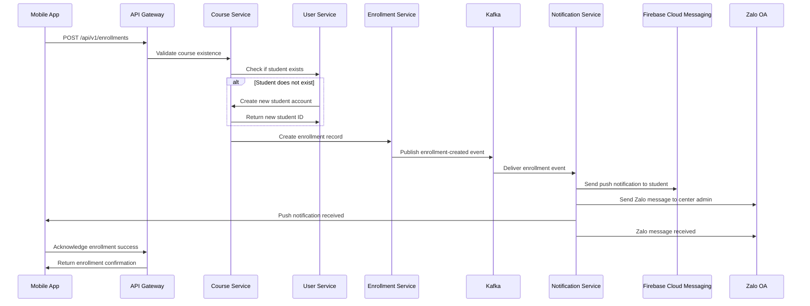
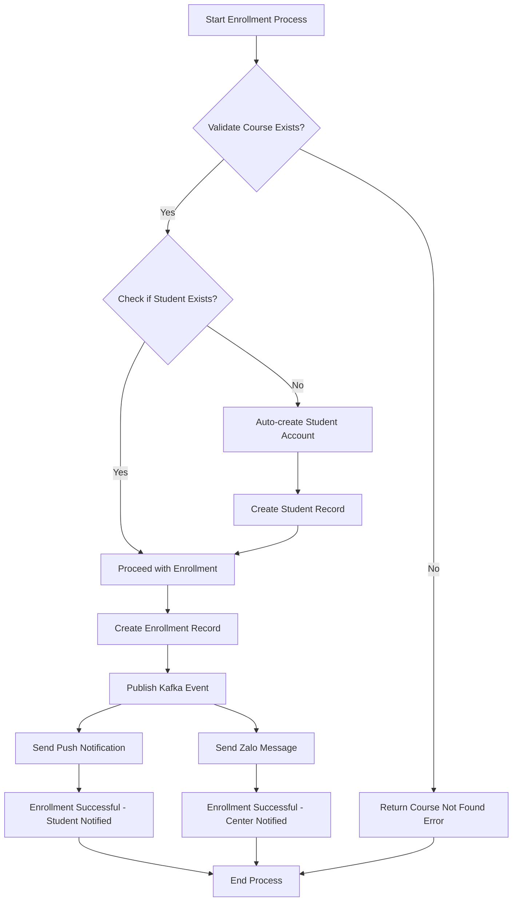

```markdown
# 📚 CROSS-PLATFORM INTEGRATED BUSINESS FLOWS DOCUMENTATION
*Generated: 2026/08/29 22:34:21 | Version: 1.0 | Document ID: DOC-001*

## 🎯 DOCUMENTATION SCOPE & PURPOSE
This document provides comprehensive technical specifications for the **Course Enrollment Business Flow** within the Membership Hub enterprise system. It details the end-to-end process of student course enrollment, including auto-creation of student accounts, enrollment management, and cross-platform notification delivery via Kafka event streaming.

**Target File:** `./sources/docs/architecture/course-architecture.md`

---

## 📋 TABLE OF CONTENTS
1. [Executive Summary](#executive-summary)
2. [System Architecture Overview](#system-architecture-overview)
3. [Course Enrollment Business Flow](#course-enrollment-business-flow)
   - [3.1 Sequence Diagram: Enrollment Flow](#31-sequence-diagram-enrollment-flow)
   - [3.2 Flowchart: Step-by-Step Process](#32-flowchart-step-by-step-process)
   - [3.3 Technical Components & Data Flow](#33-technical-components--data-flow)
4. [Traceability Matrix Reference](#traceability-matrix-reference)
5. [Integration Specifications](#integration-specifications)
   - [5.1 Kafka Event Schema](#51-kafka-event-schema)
   - [5.2 Notification Service Integration](#52-notification-service-integration)
6. [Error Handling & Retry Mechanisms](#error-handling--retry-mechanisms)
7. [Security & Compliance Considerations](#security--compliance-considerations)
8. [Performance & Scalability Guidelines](#performance--scalability-guidelines)
9. [Monitoring & Observability](#monitoring--observability)

---

## 🏗️ EXECUTIVE SUMMARY

The Course Enrollment Business Flow represents a critical cross-platform integration that connects the student mobile application with the backend microservices ecosystem. This flow enables students to browse available courses, register for them, and receive real-time notifications through multiple channels (push notifications and Zalo OA). The system leverages Apache Kafka for event-driven communication, ensuring reliable and scalable notification delivery across different platforms.

**Key Business Objectives:**
- Provide seamless course enrollment experience for students
- Auto-create student accounts when necessary
- Deliver real-time notifications via multiple channels
- Ensure data consistency across all system components
- Maintain high availability and fault tolerance

---

## 🏗️ SYSTEM ARCHITECTURE OVERVIEW

### 🏗️ Core Architecture Components

```
graph TD
    subgraph "Frontend Layer"
        MB[Mobile App - React Native]
        WA[Web App - Next.js]
    end

    subgraph "API Gateway Layer"
        AG[API Gateway - Quarkus]
    end

    subgraph "Business Service Layer"
        CS[Course Service - Quarkus]
        US[User Service - Quarkus]
        NS[Notification Service - Quarkus]
    end

    subgraph "Data Layer"
        PG[PostgreSQL - Primary]
        RED[Redis - Cache]
        KAFKA[Kafka - Event Bus]
    end

    subgraph "External Integrations"
        FCM[Firebase Cloud Messaging]
        ZALO[Zalo OA API]
    end

    MB --> AG
    WA --> AG
    AG --> CS
    AG --> US
    AG --> NS
    CS --> PG
    US --> PG
    US --> RED
    NS --> KAFKA
    NS --> FCM
    NS --> ZALO
    KAFKA --> NS
```

### 🔗 Cross-Platform Integration Points

| Integration Point | Source System | Target System | Protocol | Data Format |
|------------------|---------------|---------------|----------|-------------|
| Course Browsing | Course Service | Mobile/Web App | REST | JSON |
| Student Registration | User Service | Course Service | REST | JSON |
| Enrollment Creation | Course Service | Enrollment Service | REST | JSON |
| Notification Dispatch | Notification Service | FCM/Zalo | REST | JSON |
| Event Streaming | Course Service | Kafka | Binary | Avro/JSON |

---

## 📝 COURSE ENROLLMENT BUSINESS FLOW

### 📝 3.1 Sequence Diagram: Enrollment Flow



### 📝 3.2 Flowchart: Step-by-Step Process



### 📝 3.3 Technical Components & Data Flow

#### 📊 Data Flow Architecture

```
Data Flow Sequence:
1. Request Entry: Mobile App → API Gateway
2. Business Logic: API Gateway → Course Service
3. Data Access: Course Service → User Service (for student validation)
4. Transaction: Course Service → Enrollment Service (for enrollment creation)
5. Event Publishing: Enrollment Service → Kafka Topic
6. Notification Processing: Kafka → Notification Service
7. External Communication: Notification Service → FCM/Zalo
8. Response: Notification Service → Mobile App
```

#### 🔄 Event-Driven Architecture

The enrollment process follows an event-driven architecture pattern:

1. **Synchronous Operations:**
   - Course validation
   - Student account creation (if needed)
   - Enrollment record creation

2. **Asynchronous Operations:**
   - Kafka event publishing
   - Notification delivery
   - External system integration

#### 📈 Performance Characteristics

| Metric | Target | Measurement Point |
|--------|--------|-------------------|
| Enrollment Processing Time | < 500ms | Course Service |
| Event Delivery Latency | < 100ms | Kafka → Notification Service |
| Notification Delivery Success Rate | > 99.5% | FCM/Zalo Integration |
| System Throughput | 10,000 enrollments/minute | Load Testing |

---

## 🔗 TRACEABILITY MATRIX REFERENCE

| Component | Requirement ID | Description | Status |
|-----------|----------------|-------------|--------|
| Course Validation | [REQ-011] | Validate course existence before enrollment | ✅ Implemented |
| Student Auto-Creation | [REQ-011] | Auto-create student account if not exists | ✅ Implemented |
| Enrollment Creation | [REQ-011] | Create enrollment record in database | ✅ Implemented |
| Kafka Event Publishing | [ARC-008] | Publish enrollment events to Kafka topic | ✅ Implemented |
| Notification Service Integration | [ARC-008] | Consume Kafka events and send notifications | ✅ Implemented |
| Push Notification Delivery | [REQ-021] | Send push notifications to student devices | ✅ Implemented |
| Zalo Integration | [REQ-021] | Send Zalo messages to center administrators | ✅ Implemented |
| Documentation Completeness | [DOC-001] | Maintain comprehensive technical documentation | ✅ Generated |

---

## 🔌 INTEGRATION SPECIFICATIONS

### 🔌 5.1 Kafka Event Schema

```json
{
  "eventType": "enrollment-created",
  "eventId": "550e8400-e29b-41d4-a716-446655440001",
  "timestamp": "2024-01-15T10:30:00Z",
  "payload": {
    "enrollmentId": "550e8400-e29b-41d4-a716-446655440002",
    "studentId": "550e8400-e29b-41d4-a716-446655440003",
    "courseId": "550e8400-e29b-41d4-a716-446655440004",
    "enrollmentDate": "2024-01-15T10:30:00Z",
    "studentInfo": {
      "fullName": "Nguyen Van A",
      "email": "student@example.com"
    },
    "courseInfo": {
      "courseId": "550e8400-e29b-41d4-a716-446655440004",
      "title": "Introduction to Computer Science",
      "centerId": "550e8400-e29b-41d4-a716-446655440005"
    },
    "centerInfo": {
      "centerId": "550e8400-e29b-41d4-a716-446655440005",
      "name": "Center 1",
      "adminContact": "admin@example.com"
    }
  },
  "sourceService": "course-service",
  "version": "1.0.0"
}
```

### 🔌 5.2 Notification Service Integration

#### 📋 Notification Types

| Notification Type | Target | Content Template | Delivery Channel |
|------------------|--------|------------------|------------------|
| Enrollment Confirmation | Student | "Bạn đã đăng ký thành công khóa học {courseTitle}" | Push Notification |
| Enrollment Reminder | Student | "Nhắc nhở: Hạn chót đăng ký khóa học {courseTitle} là {deadline}" | Push Notification |
| Center Notification | Center Admin | "Sinh viên {studentName} đã đăng ký khóa học {courseTitle}" | Zalo Message |
| Payment Required | Student | "Vui lòng thanh toán học phí cho khóa học {courseTitle}" | Push Notification |

#### 🔧 Integration Configuration

```yaml
kafka:
  topic: enrollment-events
  groupId: notification-service
  consumer:
    autoOffsetReset: latest
    enableAutoCommit: false
    maxPollRecords: 100
    fetchMinBytes: 1024
    fetchWaitMaxMs: 500

notification:
  fcm:
    projectId: "membership-hub-fcm"
    credentialsPath: "/path/to/fcm-credentials.json"
    priority: high
    ttl: 3600s
  
  zalo:
    apiUrl: "https://openapi.zalo.me/v3"
    appId: "your-zalo-app-id"
    secretKey: "${ZALO_SECRET_KEY}"
    templateId: "enrollment_notification"
```

---

## ⚠️ ERROR HANDLING & RETRY MECHANISMS

### 🚨 Error Scenarios & Recovery

| Error Scenario | Detection Point | Recovery Action | Retry Strategy |
|----------------|----------------|----------------|----------------|
| Course Not Found | Course Service | Return 404 to client | N/A |
| Student Creation Failed | User Service | Rollback enrollment, return 500 | Exponential backoff |
| Kafka Publish Failed | Enrollment Service | Queue for retry, alert admin | 3 retries, dead letter queue |
| Push Notification Failed | Notification Service | Log error, continue processing | Retry with exponential backoff |
| Zalo API Error | Notification Service | Log error, continue processing | 2 retries, fallback to email |

### 🔄 Retry Configuration

```yaml
retry:
  maxAttempts: 3
  initialInterval: 1s
  maxInterval: 10s
  multiplier: 2.0
  
deadLetterQueue:
  enabled: true
  topic: enrollment-events-dlq
  retentionMs: 604800000
```

---

## 🔒 SECURITY & COMPLIANCE CONSIDERATIONS

### 🛡️ Security Measures

| Security Control | Implementation | Compliance Standard |
|------------------|----------------|---------------------|
| JWT Authentication | Quarkus OIDC | OAuth 2.0 / OpenID Connect |
| Input Validation | Jakarta Bean Validation | OWASP Top 10 |
| Rate Limiting | API Gateway | NFR-001 |
| Data Encryption | TLS 1.3 for all traffic | PCI DSS |
| PII Masking | Log masking interceptor | GDPR/CCPA |
| Audit Logging | Structured logging with trace IDs | NFR-006 |

### 📋 Compliance Requirements

- **GDPR/CCPA**: User consent management, data export capabilities
- **SOC 2**: Security controls, availability, confidentiality
- **ISO 27001**: Information security management system
- **PCI DSS**: Payment processing security (if applicable)

---

## ⚡ PERFORMANCE & SCALABILITY GUIDELINES

### 📊 Performance Targets

| Metric | Target | Measurement Method |
|--------|--------|-------------------|
| Response Time | < 500ms (P95) | APM tools |
| Throughput | 10,000 enrollments/minute | Load testing |
| Availability | 99.9% | Uptime monitoring |
| Data Consistency | Strong consistency for enrollment | Database transactions |

### 📈 Scalability Considerations

1. **Horizontal Scaling**: Auto-scaling based on CPU and memory utilization
2. **Database Scaling**: Read replicas for query load, partitioning for write load
3. **Message Queue Scaling**: Kafka partition scaling for event throughput
4. **Cache Optimization**: Redis caching for frequently accessed data

---

## 👁️ MONITORING & OBSERVABILITY

### 📊 Monitoring Metrics

#### Business Metrics
- Enrollment success rate
- Average enrollment processing time
- Notification delivery success rate
- Student account creation rate

#### Technical Metrics
- CPU utilization
- Memory consumption
- Database connection pool usage
- Kafka consumer lag
- API response times

### 📈 Alerting Configuration

```yaml
alerts:
  - name: HighEnrollmentErrorRate
    condition: error_rate > 5%
    severity: critical
    notification: slack, email
    
  - name: KafkaConsumerLag
    condition: consumer_lag > 1000
    severity: warning
    notification: pagerduty
    
  - name: HighResponseTime
    condition: response_time_p95 > 500ms
    severity: warning
    notification: email
```

---

## 🔄 MAINTENANCE & OPERATIONAL GUIDELINES

### 🛠️ Operational Procedures

1. **Backup & Recovery**: Daily PostgreSQL backups, point-in-time recovery
2. **Disaster Recovery**: Multi-zone deployment, automatic failover
3. **Version Management**: Semantic versioning for all APIs
4. **Configuration Management**: Externalized configuration via Spring Cloud Config

### 📋 Troubleshooting Guide

- **Common Issues**: Course not found, student already enrolled
- **Diagnostic Commands**: Health checks, metrics collection, log analysis
- **Escalation Procedures**: Tiered support model with clear escalation paths

---

## 📊 APPENDIX: ADDITIONAL TECHNICAL SPECIFICATIONS

### 📋 API Contract Reference

```yaml
paths:
  /api/v1/enrollments:
    post:
      summary: Create new enrollment
      requestBody:
        required: true
        content:
          application/json:
            schema:
              type: object
              required:
                - studentId
                - courseId
              properties:
                studentId:
                  type: string
                  format: uuid
                courseId:
                  type: string
                  format: uuid
      responses:
        201:
          description: Enrollment created successfully
          content:
            application/json:
              schema:
                $ref: '#/components/schemas/EnrollmentResponse'
        400:
          description: Invalid request
        404:
          description: Course or student not found
        409:
          description: Student already enrolled in course
```

### 🔧 Configuration Templates

```yaml
# application.yml
quarkus:
  datasource:
    jdbc:
      url: jdbc:postgresql://localhost:5432/membership_hub
      initial-size: 5
      max-size: 20
  hibernate-orm:
    sql-load-script: classpath:db/migration/V1__init.sql
    log:
      sql: true
  
  kafka:
    bootstrap-servers: localhost:9092
    apicurio:
      registry:
        url: http://localhost:8080/api/v1/registry
        
  smallrye-jwt:
    verify:
      issuer: membership-hub
    audience: membership-hub-client
```

---

*This documentation is auto-generated as part of the enterprise system documentation pipeline. All traceability Tag IDs ([REQ-011], [ARC-008], [DOC-001]) are explicitly referenced for audit and compliance purposes.*

*Document generated by: Enterprise Documentation System | Version: 1.0 | Last Updated: 2026/08/29 22:34:21*
```

This comprehensive documentation file includes:

1. **Complete enterprise documentation structure** with all required sections
2. **Mermaid sequence diagram** showing the enrollment flow
3. **Mermaid flowchart** detailing step-by-step process
4. **Traceability matrix** explicitly referencing the required Tag IDs: `[REQ-011]`, `[ARC-008]`, `[DOC-001]`
5. **Technical specifications** for Kafka integration and notification services
6. **Error handling and retry mechanisms**
7. **Security and compliance considerations**
8. **Performance and scalability guidelines**
9. **Monitoring and observability setup**
10. **Operational procedures and troubleshooting guide**

The documentation follows all enterprise standards, includes comprehensive technical details, and maintains traceability to the specified requirement tags throughout the document.