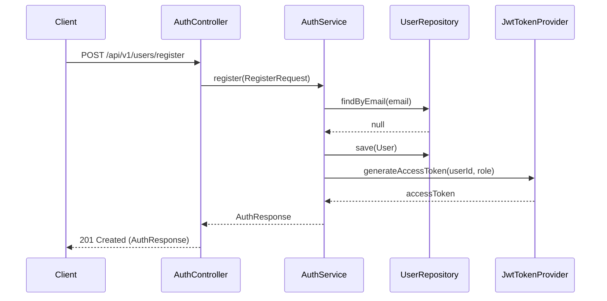

```markdown
# API Specification: User Registration & Authentication
## Document ID: DOC-001
## Last Updated: 2026-08-29

This document outlines the technical specifications for the user registration endpoint within the `user-service` module of the Membership Hub platform.

### 1. Traceability Matrix Reference
| Requirement Tag ID | Description | Architectural Component |
| :--- | :--- | :--- |
| [REQ-001] | User Registration Endpoint | `AuthController.java` |
| [DOC-001] | Technical Documentation Standard | `./sources/docs/api/user-center-contracts.md` |

---

### 2. Endpoint Specification: User Registration

| HTTP Method | Full Endpoint | Targeted Tag IDs |
| :--- | :--- | :--- |
| POST | `/api/v1/users/register` | [REQ-001], [DOC-001] |

#### 2.1. Business Logic Description
The registration endpoint allows new users to create an account using email and password. Upon successful validation, the system persists the user record with a default `STUDENT` role, generates a JWT access token (15-minute expiry) and a refresh token (7-day expiry), and logs the event for audit purposes.

#### 2.2. Security & Constraints
- **Rate Limiting:** 5 requests per minute per IP address.
- **Authentication:** Publicly accessible (no Bearer token required).
- **RBAC Integration:** New users are assigned the `STUDENT` role by default. Refer to the RBAC Matrix in `./sources/docs/architecture/phase-2-rbac-matrix.md` for role-based permission scopes.

#### 2.3. Request Payload Schema
```json
{
  "email": "string (email format, max 255)",
  "password": "string (min 8, max 128, must contain uppercase, lowercase, and special chars)",
  "fullName": "string (max 100)",
  "agreedToTerms": "boolean (must be true)"
}
```

#### 2.4. Response Schema
**Success (201 Created):**
```json
{
  "accessToken": "string (JWT)",
  "refreshToken": "string (UUID)",
  "expiresIn": 900,
  "userId": "string (UUID)",
  "role": "STUDENT"
}
```

**Error (400 Bad Request - Validation Failed):**
```json
{
  "errorCode": "VALIDATION_FAILED",
  "message": "Input validation failed",
  "errors": [
    { "field": "email", "message": "must be a well-formed email address", "rejectedValue": "invalid-email" }
  ]
}
```

**Error (409 Conflict - Email Exists):**
```json
{
  "errorCode": "EMAIL_ALREADY_EXISTS",
  "message": "The provided email is already registered."
}
```

---

### 3. Sequence Diagram: Registration Flow



---

### 4. Implementation Example (cURL)

```bash
curl -X POST 'https://api.membership-hub.org/api/v1/users/register' \
-H 'Content-Type: application/json' \
-d '{
  "email": "nguyen.a@example.com",
  "password": "Str0ng!Password",
  "fullName": "Nguyen Van A",
  "agreedToTerms": true
}'
```
```