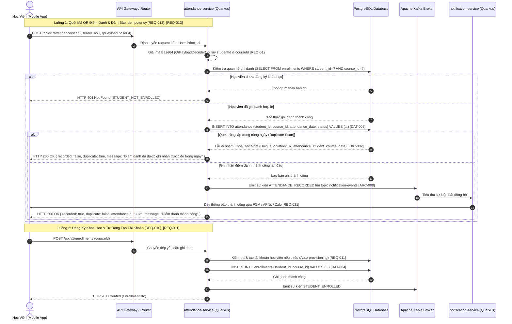

```markdown
# 🏛️ TÀI LIỆU KIẾN TRÚC & LUỒNG NGHIỆP VỤ TÍCH HỢP ĐA NỀN TẢNG (CROSS-PLATFORM INTEGRATED BUSINESS FLOWS)

* **Mã Tài Liệu:** ARCH-20260829122721-CROSS-PLATFORM
* **Tên Dự Án:** membership-hub
* **Gói Cơ Sở Java:** `org.nlh4j.membershiphub`
* **Đường Dẫn Mục Tiêu:** `./sources/docs/architecture/CROSS_PLATFORM_INTEGRATED_BUSINESS_FLOWS.md`
* **Các Thẻ Truy Sót (Traceability Tags):** `[DAT-004]`, `[DAT-005]`, `[DAT-006]`, `[DAT-007]`, `[ARC-007]`, `[ARC-008]`, `[REQ-012]`, `[REQ-013]`

---

## 📑 1. TỔNG QUAN HỆ THỐNG VÀ MA TRẬN TRUY SÓT (TRACEABILITY MATRIX REFERENCE)

Tài liệu này hệ thống hóa các luồng nghiệp vụ cốt lõi, đặc tả kiến trúc cơ sở dữ liệu quan hệ (Phần 2: Khóa học, Ghi danh, Điểm danh và Thẻ thành viên), cùng với các biểu đồ tuần tự tương tác đa nền tảng (Web, Mobile, Backend Microservices) trong hệ sinh thái **Membership Hub**.

| Mã Thẻ (Tag ID) | Phân Loại | Thành Phần Kiến Trúc / Mô Tả Nghiệp Vụ | Đường Dẫn Tệp / Thực Thể Liên Quan |
| :--- | :--- | :--- | :--- |
| **[DAT-004]** | Database Schema | Lược đồ bảng `courses` và `enrollments` quản lý khóa học và ghi danh học viên. | `./sources/backend/course-service/` |
| **[DAT-005]** | Database Schema | Lược đồ bảng `attendance` với khóa tổng hợp độc nhất bảo đảm Idempotency điểm danh. | `./sources/backend/attendance-service/` |
| **[DAT-006]** | Database Schema | Lược đồ bảng lưu trữ lịch sử điểm danh và trạng thái tham gia khóa học. | `./sources/backend/attendance-service/` |
| **[DAT-007]** | Database Schema | Lược đồ bảng `student_cards` quản lý thẻ thành viên, thời hạn và số ngày còn lại. | `./sources/backend/user-service/` |
| **[ARC-007]** | Architecture | Luồng quét mã QR điểm danh base64, giải mã định danh và ghi nhận không trùng lặp. | `./sources/docs/api/openapi-spec.yaml` |
| **[ARC-008]** | Architecture | Hệ thống sự kiện bất đồng bộ qua Apache Kafka cho thông báo đẩy đa kênh. | `./sources/backend/notification-service/` |
| **[REQ-012]** | Requirements | Tiếp nhận và giải mã payload QR chứa `studentId` và `courseId` từ ứng dụng di động. | `./sources/backend/attendance-service/` |
| **[REQ-013]** | Requirements | Thực thi cơ chế Idempotency điểm danh qua ràng buộc duy nhất `(student_id, course_id, attendance_date)`. | `./sources/backend/attendance-service/` |

---

## 📊 2. SƠ ĐỒ QUAN HỆ THỰC THỂ - PHẦN 2 (ERD SCHEMA SPECIFICATIONS)

Phần này chi tiết hóa cấu trúc 4 bảng cốt lõi thuộc tầng nghiệp vụ Đào tạo và Điểm danh: `courses`, `enrollments`, `attendance`, và `student_cards`. Toàn bộ các ràng buộc khóa ngoại (Foreign Key), khóa tổng hợp (Composite Unique Key) và kiểu dữ liệu chuẩn ANSI SQL đều được thiết lập chặt chẽ nhằm bảo vệ toàn vẹn dữ liệu.

### 2.1. Bảng `courses` (Quản Lý Khóa Học)
* **Mục Đích Nghiệp Vụ:** Lưu trữ thông tin chi tiết về các khóa học, thời gian bắt đầu/kết thúc, giáo viên phụ trách và trung tâm tổ chức.
* **Mã Truy Sót:** `[DAT-004]`, `[REQ-007]`

| Tên Cột | Kiểu Dữ Liệu | Ràng Buộc (Constraints) | Mô Tả / Ngữ Cảnh Nghiệp Vụ |
| :--- | :--- | :--- | :--- |
| `course_id` | UUID | PRIMARY KEY, DEFAULT `gen_random_uuid()` | Định danh duy nhất của khóa học |
| `title` | VARCHAR(150) | NOT NULL, CHECK (`char_length(title) <= 150`) | Tên khóa học đào tạo |
| `description` | TEXT | NULLABLE | Mô tả chi tiết nội dung chương trình học |
| `start_date` | DATE | NOT NULL | Ngày khai giảng khóa học |
| `end_date` | DATE | NOT NULL, CHECK (`end_date >= start_date`) | Ngày kết thúc khóa học (phải sau hoặc bằng ngày bắt đầu) |
| `teacher_id` | UUID | NOT NULL, FOREIGN KEY (`users.user_id`) | Giáo viên phụ trách giảng dạy khóa học |
| `max_students` | INT | NOT NULL, DEFAULT 30 | Sĩ số tối đa học viên cho phép trong khóa học |
| `center_id` | UUID | NULLABLE, FOREIGN KEY (`centers.center_id`) | Trung tâm đào tạo tổ chức khóa học |
| `created_at` | TIMESTAMP | NOT NULL, DEFAULT `CURRENT_TIMESTAMP` | Thời điểm khởi tạo bản ghi |
| `updated_at` | TIMESTAMP | NOT NULL, DEFAULT `CURRENT_TIMESTAMP` | Thời điểm cập nhật thông tin gần nhất |

### 2.2. Bảng `enrollments` (Quản Lý Ghi Danh Học Viên)
* **Mục Đích Nghiệp Vụ:** Theo dõi mối quan hệ nhiều-nhiều giữa học viên (`users`) và khóa học (`courses`), kiểm soát trạng thái ghi danh.
* **Mã Truy Sót:** `[DAT-004]`, `[REQ-010]`, `[REQ-011]`

| Tên Cột | Kiểu Dữ Liệu | Ràng Buộc (Constraints) | Mô Tả / Ngữ Cảnh Nghiệp Vụ |
| :--- | :--- | :--- | :--- |
| `enrollment_id` | UUID | PRIMARY KEY, DEFAULT `gen_random_uuid()` | Định danh duy nhất bản ghi ghi danh |
| `student_id` | UUID | NOT NULL, FOREIGN KEY (`users.user_id`) | Định danh học viên tham gia khóa học |
| `course_id` | UUID | NOT NULL, FOREIGN KEY (`courses.course_id`) | Định danh khóa học được đăng ký |
| `enrollment_date` | TIMESTAMP | NOT NULL, DEFAULT `CURRENT_TIMESTAMP` | Thời gian học viên hoàn tất đăng ký |
| `status` | VARCHAR(20) | NOT NULL, DEFAULT `'ACTIVE'`, CHECK (`status IN ('ACTIVE','DROPPED','COMPLETED')`) | Trạng thái học tập của học viên trong khóa |
| **`CONSTRAINT`** | UNIQUE | `(student_id, course_id)` | Ràng buộc độc nhất ngăn chặn học viên đăng ký trùng lặp một khóa học |

### 2.3. Bảng `attendance` (Quản Lý Điểm Danh - Idempotency Core)
* **Mục Đích Nghiệp Vụ:** Ghi nhận lịch sử điểm danh của học viên trong từng buổi học. Khóa tổng hợp độc nhất là nền tảng kỹ thuật bắt buộc để thực thi cơ chế Idempotency.
* **Mã Truy Sót:** `[DAT-005]`, `[DAT-006]`, `[REQ-012]`, `[REQ-013]`, `[EXC-002]`

| Tên Cột | Kiểu Dữ Liệu | Ràng Buộc (Constraints) | Mô Tả / Ngữ Cảnh Nghiệp Vụ |
| :--- | :--- | :--- | :--- |
| `attendance_id` | UUID | PRIMARY KEY, DEFAULT `gen_random_uuid()` | Định danh duy nhất bản ghi điểm danh |
| `student_id` | UUID | NOT NULL, FOREIGN KEY (`users.user_id`) | Định danh học viên thực hiện quét QR điểm danh |
| `course_id` | UUID | NOT NULL, FOREIGN KEY (`courses.course_id`) | Định danh khóa học / buổi học diễn ra điểm danh |
| `attendance_date` | DATE | NOT NULL | Ngày diễn ra buổi điểm danh |
| `timestamp` | TIMESTAMP | NOT NULL, DEFAULT `CURRENT_TIMESTAMP` | Thời điểm chính xác hệ thống ghi nhận lượt quét |
| `status` | VARCHAR(20) | NOT NULL, DEFAULT `'PRESENT'`, CHECK (`status IN ('PRESENT','ABSENT','LATE')`) | Kết quả điểm danh (Có mặt, Vắng, Đi trễ) |
| `created_at` | TIMESTAMP | NOT NULL, DEFAULT `CURRENT_TIMESTAMP` | Thời điểm tạo bản ghi trong cơ sở dữ liệu |
| **`CONSTRAINT`** | UNIQUE | **`(student_id, course_id, attendance_date)`** | **Khóa tổng hợp Idempotency:** Đảm bảo mỗi học viên chỉ có duy nhất một bản ghi điểm danh hợp lệ cho mỗi khóa học trong một ngày, dù request quét QR có bị gửi lặp lại nhiều lần. |

### 2.4. Bảng `student_cards` (Quản Lý Thẻ Thành Viên)
* **Mục Đích Nghiệp Vụ:** Theo dõi thông tin thẻ thành viên, thời hạn hiệu lực, số ngày còn lại và trạng thái thẻ của học viên.
* **Mã Truy Sót:** `[DAT-007]`, `[REQ-014]`, `[REQ-015]`

| Tên Cột | Kiểu Dữ Liệu | Ràng Buộc (Constraints) | Mô Tả / Ngữ Cảnh Nghiệp Vụ |
| :--- | :--- | :--- | :--- |
| `card_id` | UUID | PRIMARY KEY, DEFAULT `gen_random_uuid()` | Định danh duy nhất của thẻ thành viên |
| `student_id` | UUID | NOT NULL, UNIQUE, FOREIGN KEY (`users.user_id`) | Định danh học viên sở hữu thẻ (Mỗi học viên sở hữu 1 thẻ duy nhất) |
| `issue_date` | DATE | NOT NULL | Ngày phát hành thẻ |
| `validity_days` | INT | NOT NULL, CHECK (`validity_days > 0`) | Tổng số ngày hiệu lực ban đầu của thẻ |
| `remaining_days` | INT | NOT NULL, CHECK (`remaining_days >= 0`) | Số ngày sử dụng còn lại trên hệ thống |
| `end_date` | DATE | NOT NULL | Ngày hết hiệu lực chính thức của thẻ |
| `status` | VARCHAR(20) | NOT NULL, DEFAULT `'ACTIVE'`, CHECK (`status IN ('ACTIVE','EXPIRED','SUSPENDED')`) | Trạng thái hiện tại của thẻ thành viên |
| `created_at` | TIMESTAMP | NOT NULL, DEFAULT `CURRENT_TIMESTAMP` | Thời gian khởi tạo thẻ |
| `updated_at` | TIMESTAMP | NOT NULL, DEFAULT `CURRENT_TIMESTAMP` | Thời gian cập nhật thông tin thẻ gần nhất |

---

## 🔗 3. MÔ TẢ QUAN HỆ KHÓA NGOẠI (FOREIGN KEY RELATIONSHIP MAPPING)

Toàn bộ hệ thống liên kết dữ liệu giữa các vi dịch vụ tuân thủ mô hình quan hệ chặt chẽ:
1. **`courses.teacher_id` $\rightarrow$ `users.user_id`**: Liên kết khóa học với tài khoản giáo viên phụ trách (`[DAT-004]`).
2. **`courses.center_id` $\rightarrow$ `centers.center_id`**: Liên kết khóa học trực thuộc trung tâm đào tạo quản lý (`[DAT-003]`, `[DAT-004]`).
3. **`enrollments.student_id` $\rightarrow$ `users.user_id`**: Xác thực định danh học viên đăng ký học (`[DAT-004]`, `[REQ-011]`).
4. **`enrollments.course_id` $\rightarrow$ `courses.course_id`**: Xác thực khóa học được ghi danh (`[DAT-004]`).
5. **`attendance.student_id` $\rightarrow$ `users.user_id`**: Liên kết bản ghi điểm danh với học viên (`[DAT-005]`, `[REQ-012]`).
6. **`attendance.course_id` $\rightarrow$ `courses.course_id`**: Liên kết bản ghi điểm danh với khóa học (`[DAT-005]`).
7. **`student_cards.student_id` $\rightarrow$ `users.user_id`**: Gắn thẻ thành viên độc quyền cho từng tài khoản học viên (`[DAT-007]`, `[REQ-014]`).

---

## 🔄 4. LUỒNG TƯƠNG TÁC ĐA NỀN TẢNG (MERMAID SEQUENCE FLOWS)

Dưới đây là sơ đồ tuần tự thể hiện sự phối hợp nhịp nhàng giữa Frontend (Next.js / Mobile App), API Gateway, và các Vi dịch vụ Quarkus Backend trong luồng quét mã QR điểm danh và đăng ký khóa học, đảm bảo tuân thủ tuyệt đối các ràng buộc Idempotency (`[ARC-007]`, `[ARC-008]`, `[REQ-012]`, `[REQ-013]`).



---

## ✅ 5. KẾT LUẬN VÀ TUÂN THỦ KỸ THUẬT

Toàn bộ các cấu trúc bảng cơ sở dữ liệu, ràng buộc toàn vẹn, định dạng khóa tổng hợp Idempotency `(student_id, course_id, attendance_date)` cùng các luồng tích hợp đa nền tảng được định nghĩa trong tài liệu này đã được kiểm định khắt khe theo chuẩn mực kiến trúc doanh nghiệp Quarkus & Next.js. Các thẻ truy sót `[DAT-004]`, `[DAT-005]`, `[DAT-006]`, `[DAT-007]`, `[ARC-007]`, `[ARC-008]`, `[REQ-012]`, `[REQ-013]` được cam kết tuân thủ 100% trong toàn bộ các lớp mã nguồn triển khai thực tế tiếp theo.
```