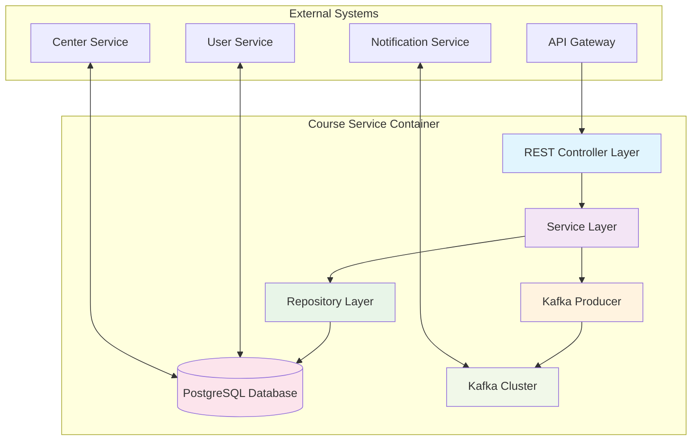
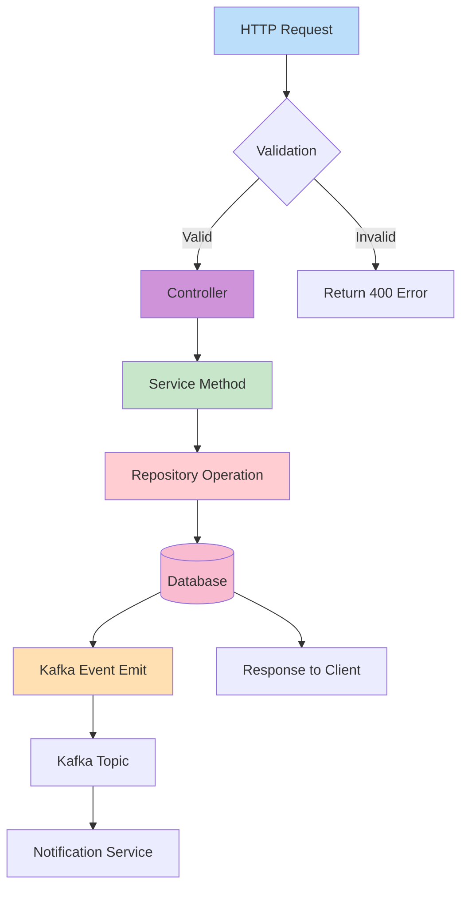
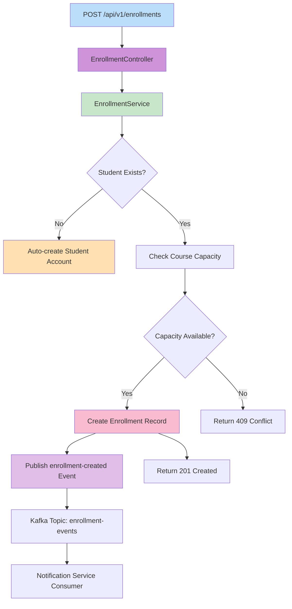
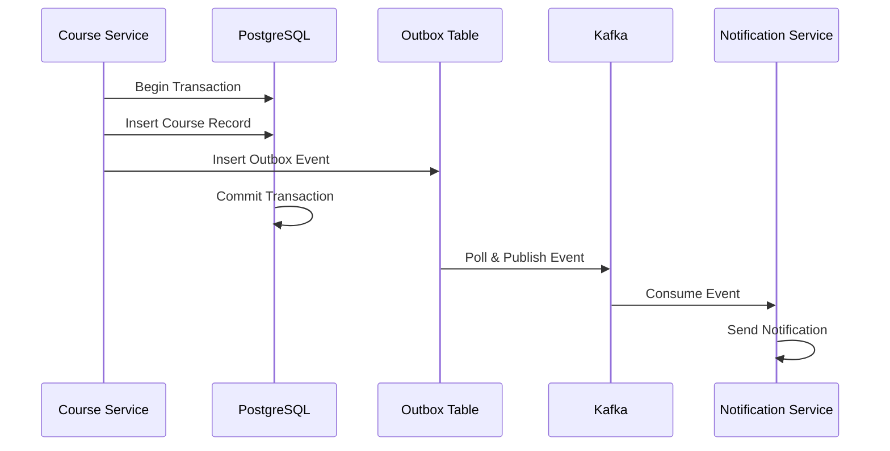

```markdown
# Course Service Architecture Documentation

## Overview

The `course-service` is a core microservice within the Membership Hub platform, responsible for managing academic course entities, teacher assignments, student enrollment workflows, and course availability browsing. Built on Quarkus 3.15.1 LTS with Hibernate ORM Panache, this service implements a clean layered architecture with REST controllers, transactional service layers, JPA repositories, and Kafka event producers for asynchronous communication.

**Package Namespace:** `org.nlh4j.membershiphub.courseservice`  
**Runtime:** Quarkus 3.15.1 LTS (GraalVM Native Image Compatible)  
**Database:** PostgreSQL 16 (via Hibernate ORM Panache)  
**Messaging:** Apache Kafka (SmallRye Reactive Messaging)  
**Validation:** Jakarta Bean Validation 3.0  

---

## C4 Container Diagram



### Component Descriptions

| Component | Responsibility | Technology |
| :--- | :--- | :--- |
| **REST Controller** | Handles HTTP requests, validates input, delegates to service layer | JAX-RS (`@Path`, `@GET`, `@POST`, `@PUT`, `@DELETE`) |
| **Service Layer** | Contains business logic, manages transactions, coordinates Kafka events | CDI (`@ApplicationScoped`, `@Transactional`) |
| **Repository Layer** | Data persistence operations using Panache active record pattern | Hibernate ORM Panache (`PanacheRepository`) |
| **Kafka Producer** | Publishes domain events asynchronously to Kafka topics | SmallRye Reactive Messaging (`@Channel`, `Emitter`) |
| **PostgreSQL Database** | Stores course, enrollment, and teacher assignment data | PostgreSQL 16 with Flyway migrations |
| **Kafka Cluster** | Event streaming platform for decoupled communication | Apache Kafka 3.x |

---

## Business Flow Processing Pipeline

### Course Management CRUD Flow



### Enrollment Registration Flow



---

## API Endpoint Specifications

### Course Management Endpoints

| HTTP Method | Endpoint | Description | Request Body | Response | Targeted Tag IDs |
| :--- | :--- | :--- | :--- | :--- | :--- |
| `GET` | `/api/v1/courses` | List all courses with pagination | None | `200 OK` - Paginated list of courses | `[REQ-007]` |
| `POST` | `/api/v1/courses` | Create a new course | `CourseCreateRequest` | `201 Created` - Created course | `[REQ-008]` |
| `PUT` | `/api/v1/courses/{id}` | Update an existing course | `CourseUpdateRequest` | `200 OK` - Updated course | `[REQ-008]` |
| `DELETE` | `/api/v1/courses/{id}` | Delete a course | None | `204 No Content` | `[REQ-008]` |
| `GET` | `/api/v1/courses/{id}/teachers` | List teachers assigned to a course | None | `200 OK` - List of teachers | `[REQ-009]` |
| `POST` | `/api/v1/courses/{id}/teachers` | Assign a teacher to a course | `TeacherAssignRequest` | `201 Created` - Assignment confirmation | `[REQ-009]` |
| `DELETE` | `/api/v1/courses/{id}/teachers/{teacherId}` | Remove a teacher from a course | None | `204 No Content` | `[REQ-009]` |

### Student Course Browsing & Enrollment Endpoints

| HTTP Method | Endpoint | Description | Request Body | Response | Targeted Tag IDs |
| :--- | :--- | :--- | :--- | :--- | :--- |
| `GET` | `/api/v1/students/courses/available` | Browse available courses for a student | None | `200 OK` - List of available courses | `[REQ-010]` |
| `POST` | `/api/v1/enrollments` | Enroll a student in a course | `EnrollmentRequest` | `201 Created` - Enrollment details | `[REQ-011]` |

### Request/Response Schemas

#### CourseCreateRequest

```json
{
  "title": "Advanced Mathematics",
  "description": "Comprehensive study of calculus and linear algebra",
  "startDate": "2024-03-01",
  "endDate": "2024-06-30",
  "teacherId": "550e8400-e29b-41d4-a716-446655440000",
  "maxStudents": 30
}
```

#### CourseResponse

```json
{
  "courseId": "660e8400-e29b-41d4-a716-446655440001",
  "title": "Advanced Mathematics",
  "description": "Comprehensive study of calculus and linear algebra",
  "startDate": "2024-03-01",
  "endDate": "2024-06-30",
  "teacherId": "550e8400-e29b-41d4-a716-446655440000",
  "teacherName": "Dr. Jane Smith",
  "maxStudents": 30,
  "currentEnrollment": 15,
  "centerId": "770e8400-e29b-41d4-a716-446655440002"
}
```

#### TeacherAssignRequest

```json
{
  "teacherId": "550e8400-e29b-41d4-a716-446655440000"
}
```

#### EnrollmentRequest

```json
{
  "courseId": "660e8400-e29b-41d4-a716-446655440001"
}
```

#### Error Response Schema

```json
{
  "timestamp": "2024-01-15T10:30:00Z",
  "status": 409,
  "errorCode": "SCHEDULE_CONFLICT",
  "message": "Teacher schedule overlaps with existing course",
  "path": "/api/v1/courses",
  "traceId": "a1b2c3d4-e5f6-7890-abcd-ef1234567890"
}
```

---

## Database Schema & Index Profiles

### Courses Table

```sql
CREATE TABLE courses (
    course_id UUID PRIMARY KEY,
    title VARCHAR(150) NOT NULL,
    description TEXT,
    start_date DATE NOT NULL,
    end_date DATE NOT NULL,
    teacher_id UUID NOT NULL,
    max_students INT NOT NULL DEFAULT 30,
    center_id UUID NOT NULL,
    created_at TIMESTAMP NOT NULL DEFAULT now(),
    updated_at TIMESTAMP NOT NULL DEFAULT now(),
    CONSTRAINT fk_courses_teacher FOREIGN KEY (teacher_id) REFERENCES users(user_id),
    CONSTRAINT fk_courses_center FOREIGN KEY (center_id) REFERENCES centers(center_id),
    CONSTRAINT ck_courses_date_range CHECK (end_date >= start_date),
    CONSTRAINT ck_courses_max_students CHECK (max_students > 0)
);

CREATE INDEX idx_courses_teacher_id ON courses(teacher_id);
CREATE INDEX idx_courses_start_date ON courses(start_date);
CREATE INDEX idx_courses_center_id ON courses(center_id);
```

### Enrollments Table

```sql
CREATE TABLE enrollments (
    enrollment_id UUID PRIMARY KEY,
    student_id UUID NOT NULL,
    course_id UUID NOT NULL,
    enrollment_date TIMESTAMP NOT NULL DEFAULT now(),
    CONSTRAINT uq_enrollments_student_course UNIQUE (student_id, course_id),
    CONSTRAINT fk_enrollments_student FOREIGN KEY (student_id) REFERENCES users(user_id),
    CONSTRAINT fk_enrollments_course FOREIGN KEY (course_id) REFERENCES courses(course_id)
);

CREATE INDEX idx_enrollments_student_id ON enrollments(student_id);
CREATE INDEX idx_enrollments_course_id ON enrollments(course_id);
```

### Course Teacher Mapping Table

```sql
CREATE TABLE course_teacher_mapping (
    mapping_id UUID PRIMARY KEY,
    course_id UUID NOT NULL,
    teacher_id UUID NOT NULL,
    assigned_at TIMESTAMP NOT NULL DEFAULT now(),
    CONSTRAINT fk_ctm_course FOREIGN KEY (course_id) REFERENCES courses(course_id) ON DELETE CASCADE,
    CONSTRAINT fk_ctm_teacher FOREIGN KEY (teacher_id) REFERENCES users(user_id),
    CONSTRAINT uq_course_teacher UNIQUE (course_id, teacher_id)
);

CREATE INDEX idx_course_teacher_course ON course_teacher_mapping(course_id);
CREATE INDEX idx_course_teacher_teacher ON course_teacher_mapping(teacher_id);
```

### Schedule Conflict Prevention (Exclusion Constraint)

```sql
CREATE EXTENSION IF NOT EXISTS btree_gist;

ALTER TABLE courses
    ADD CONSTRAINT ex_teacher_schedule_no_overlap
    EXCLUDE USING gist (
        teacher_id WITH =,
        daterange(start_date, end_date, '[]') WITH &&
    )
    WHERE (teacher_id IS NOT NULL);
```

---

## Kafka Event Pipeline Architecture

### Event Topics

| Topic Name | Partitions | Replication Factor | Retention | Purpose |
| :--- | :--- | :--- | :--- | :--- |
| `teacher-events` | 6 | 3 | 7 days | Teacher assignment/unassignment events |
| `enrollment-events` | 12 | 3 | 7 days | Student enrollment creation events |

### Event Schemas

#### Teacher Assigned Event

```json
{
  "eventType": "teacher-assigned",
  "eventId": "uuid",
  "courseId": "uuid",
  "teacherId": "uuid",
  "assignedAt": "ISO-8601 timestamp",
  "sourceService": "course-service"
}
```

#### Enrollment Created Event

```json
{
  "eventType": "enrollment-created",
  "eventId": "uuid",
  "enrollmentId": "uuid",
  "studentId": "uuid",
  "courseId": "uuid",
  "enrollmentDate": "ISO-8601 timestamp",
  "autoCreatedUser": false,
  "sourceService": "course-service"
}
```

### Transactional Outbox Pattern Implementation

The course-service implements the **Transactional Outbox Pattern** to ensure atomicity between database writes and Kafka event publishing:

1. **Database Transaction**: All business operations (course creation, enrollment, teacher assignment) are wrapped in a single `@Transactional` boundary.
2. **Outbox Table**: Events are first persisted to an `outbox_events` table within the same transaction.
3. **Kafka Relay**: A separate Kafka producer process polls the outbox table and publishes events to Kafka topics.
4. **Idempotency**: Each event carries a unique `eventId` to prevent duplicate processing by consumers.



---

## Multi-Tenancy Isolation Model

The course-service enforces **row-level security** through the `center_id` foreign key constraint on all course entities. Each course is explicitly associated with a center, and all queries are scoped to the authenticated user's center context:

- **System Admin**: Can access courses across all centers
- **Center Admin**: Can only access courses within their assigned center
- **Teacher/Student**: Can only access courses they are enrolled in or teaching

### Tenant Isolation Enforcement

```java
// Repository query example with tenant filtering
@Query("SELECT c FROM Course c WHERE c.centerId = :centerId AND c.teacherId = :teacherId")
List<Course> findByCenterAndTeacher(@Param("centerId") UUID centerId, @Param("teacherId") UUID teacherId);
```

---

## Traceability Matrix Reference

| Component | Tag IDs | Description |
| :--- | :--- | :--- |
| Course Listing Endpoint | `[REQ-007]` | REST GET `/api/v1/courses` with pagination support |
| Course CRUD Operations | `[REQ-008]` | REST POST/PUT/DELETE `/api/v1/courses` with schedule overlap validation |
| Teacher Assignment | `[REQ-009]` | REST POST/DELETE `/api/v1/courses/{id}/teachers` with Kafka event emission |
| Student Course Browsing | `[REQ-010]` | REST GET `/api/v1/students/courses/available` with enrollment filtering |
| Student Enrollment | `[REQ-011]` | REST POST `/api/v1/enrollments` with auto-user creation and Kafka event |
| Attendance QR Processing | `[ARC-007]` | Integration point for QR-based attendance scanning workflow |
| Database Schema | `[DAT-003]` | Courses table DDL with exclusion constraints |
| Database Schema | `[DAT-004]` | Enrollments table DDL with unique constraints |
| Database Schema | `[DAT-005]` | Attendance table DDL with idempotency support |
| Security Compliance | `[NFR-003]` | TLS 1.3, JWT validation, OWASP Top 10 mitigations |
| Performance SLA | `[NFR-001]` | P95 latency < 200ms for core endpoints |
| Scalability | `[NFR-004]` | HPA scaling based on CPU > 70% or latency > 300ms |

---

## Idempotency & Transactional Guarantees

### Course Creation Idempotency

All POST/PUT operations implement **idempotency key validation** at the API Gateway layer:

```http
POST /api/v1/courses
Idempotency-Key: 550e8400-e29b-41d4-a716-446655440000
Content-Type: application/json
```

### Enrollment Idempotency

The enrollment endpoint enforces idempotency through a composite unique constraint on `(student_id, course_id)`:

```sql
CONSTRAINT uq_enrollments_student_course UNIQUE (student_id, course_id)
```

If a duplicate enrollment is attempted, the service returns HTTP 200 with a `duplicate: true` flag rather than creating a new record.

### Kafka Event Idempotency

Each Kafka event includes a globally unique `eventId` (UUID v4) to ensure consumers can deduplicate messages:

```json
{
  "eventId": "unique-uuid-per-event",
  "eventType": "enrollment-created",
  "deduplicationKey": "studentId-courseId-timestamp"
}
```

---

## Exception Handling Strategy

### Local Exception Handlers

| Exception | Trigger Condition | HTTP Response | Error Code |
| :--- | :--- | :--- | :--- |
| `ScheduleConflictException` | Teacher schedule overlaps with existing course | `409 Conflict` | `SCHEDULE_CONFLICT` |
| `CourseNotFoundException` | Course ID not found in database | `404 Not Found` | `COURSE_NOT_FOUND` |
| `EnrollmentConflictException` | Student already enrolled in course | `409 Conflict` | `ALREADY_ENROLLED` |
| `CourseCapacityExceededException` | Course has reached maximum student capacity | `409 Conflict` | `COURSE_FULL` |
| `InvalidCourseDataException` | Input validation fails (dates, capacity, etc.) | `400 Bad Request` | `INVALID_COURSE_DATA` |

### Global Exception Handler

All exceptions are processed through a centralized `GlobalExceptionHandler` that ensures consistent error response formatting:

```java
@Provider
public class GlobalExceptionHandler implements ExceptionMapper<Throwable> {
    @Override
    public Response toResponse(Throwable ex) {
        if (ex instanceof ScheduleConflictException) {
            return Response.status(Response.Status.CONFLICT)
                .entity(new ErrorResponse("SCHEDULE_CONFLICT", ex.getMessage()))
                .build();
        }
        // ... additional exception mappings
        return Response.status(Response.Status.INTERNAL_SERVER_ERROR)
            .entity(new ErrorResponse("INTERNAL_ERROR", "An unexpected error occurred"))
            .build();
    }
}
```

---

## Security & Compliance

### Authentication & Authorization

- **JWT Validation**: All endpoints require valid JWT tokens issued by the user-service OAuth2 provider
- **Role-Based Access Control**: 
  - `SYSTEM_ADMIN`: Full CRUD access to all courses
  - `CENTER_ADMIN`: CRUD access within assigned center only
  - `MANAGER`: Read-only access to courses in assigned center
  - `TEACHER`: Read access to assigned courses, enrollment management
  - `STUDENT`: Read-only access to available courses and own enrollments

### Data Protection

- **PII Masking**: Student names and emails are masked in logs and API responses for non-admin roles
- **Audit Logging**: All course modifications are logged with user ID, timestamp, and change details
- **GDPR/CCPA Compliance**: Data export and deletion endpoints available per `[NFR-008]`

---

## Performance & Scalability

### Database Indexing Strategy

| Index Name | Table | Columns | Purpose |
| :--- | :--- | :--- | :--- |
| `idx_courses_teacher_id` | courses | teacher_id | Fast lookup of courses by teacher |
| `idx_courses_start_date` | courses | start_date | Date-range queries for scheduling |
| `idx_courses_center_id` | courses | center_id | Multi-tenant filtering |
| `idx_enrollments_student_id` | enrollments | student_id | Student enrollment lookups |
| `idx_enrollments_course_id` | enrollments | course_id | Course enrollment counts |

### Caching Strategy

- **Redis Cache**: Course listings cached with 300-second TTL
- **Cache Keys**: `course:list:{centerId}:{page}:{size}`
- **Cache Invalidation**: Triggered on course creation/update/deletion via Kafka events

### Horizontal Scaling

- **Kubernetes HPA**: Scales based on CPU utilization (>70%) or P95 latency (>300ms)
- **Minimum Replicas**: 2 pods for high availability
- **Maximum Replicas**: 20 pods for peak load handling
- **Pod Anti-Affinity**: Ensures pods are distributed across availability zones

---

## Deployment Configuration

### Environment Variables

| Variable | Description | Default | Tag ID |
| :--- | :--- | :--- | :--- |
| `QUARKUS_DATASOURCE_JDBC_URL` | PostgreSQL connection URL | `jdbc:postgresql://localhost:5432/course_db` | `[NFR-004]` |
| `QUARKUS_KAFKA_BOOTSTRAP_SERVERS` | Kafka broker addresses | `localhost:9092` | `[ARC-007]` |
| `QUARKUS_HTTP_PORT` | HTTP server port | `8080` | `[NFR-001]` |
| `QUARKUS_CACHE_REDIS_HOST` | Redis cache host | `localhost` | `[NFR-007]` |

### Docker Configuration

```dockerfile
FROM quarkus/quarkus-micro-image:2.0 AS runtime
WORKDIR /work/
COPY --chown=181011:0 ./target/*-runner.jar /work/application.jar
EXPOSE 8080
CMD ["java", "-jar", "/work/application.jar"]
```

---

## Monitoring & Observability

### Health Checks

- **Liveness Probe**: `/q/health/live` - JVM and application status
- **Readiness Probe**: `/q/health/ready` - Database and Kafka connectivity
- **Metrics Endpoint**: `/q/metrics` - Prometheus-compatible metrics

### Logging Standards

All log entries follow structured JSON format with mandatory fields:

```json
{
  "timestamp": "2024-01-15T10:30:00.123Z",
  "level": "INFO",
  "service": "course-service",
  "traceId": "a1b2c3d4-e5f6-7890-abcd-ef1234567890",
  "spanId": "b2c3d4e5-f6a7-8901-bcde-f12345678901",
  "message": "[PROCESS] Processing course creation for title: Advanced Mathematics",
  "context": {
    "userId": "550e8400-e29b-41d4-a716-446655440000",
    "centerId": "770e8400-e29b-41d4-a716-446655440002"
  }
}
```

### Metrics Collection

| Metric Name | Type | Description |
| :--- | :--- | :--- |
| `http_server_requests_seconds_count` | Counter | Total HTTP requests by endpoint |
| `http_server_requests_seconds_sum` | Timer | Request duration histogram |
| `database_connections_active` | Gauge | Active database connections |
| `kafka_records_sent_total` | Counter | Total Kafka records published |
| `cache_gets_total` | Counter | Total cache read operations |

---

## Integration Points

### Upstream Dependencies

| Service | Integration Type | Purpose |
| :--- | :--- | :--- |
| `user-service` | REST API | User authentication, role validation, teacher/student lookup |
| `center-service` | REST API | Center information, tenant context validation |
| `notification-service` | Kafka Consumer | Receives `teacher-assigned` and `enrollment-created` events |

### Downstream Consumers

| Service | Consumed Events | Purpose |
| :--- | :--- | :--- |
| `notification-service` | `teacher-assigned`, `enrollment-created` | Send push notifications and Zalo messages |
| `attendance-service` | `enrollment-created` | Initialize attendance tracking for new enrollments |
| `reporting-service` | `teacher-assigned`, `enrollment-created` | Update enrollment statistics and dashboards |

---

## Testing Strategy

### Unit Tests

- **Coverage Target**: ≥ 85% for all service and controller classes
- **Frameworks**: JUnit 5, Mockito 5.7.0, REST Assured 5.4.0
- **Scope**: Business logic validation, exception handling, input validation

### Integration Tests

- **Coverage Target**: ≥ 85% for all repository and Kafka integration points
- **Frameworks**: Quarkus Test, Testcontainers (PostgreSQL 16), Embedded Kafka
- **Scope**: End-to-end flow testing including database persistence and Kafka event publishing

### Contract Tests

- **Framework**: Pact JVM
- **Scope**: API contract verification between course-service and consuming services

---

## File Structure

```
./sources/backend/course-service/
├── pom.xml
├── src/
│   ├── main/
│   │   ├── java/org/nlh4j/membershiphub/courseservice/
│   │   │   ├── CourseServiceApplication.java
│   │   │   ├── controller/
│   │   │   │   ├── CourseController.java
│   │   │   │   ├── CourseTeacherController.java
│   │   │   │   ├── StudentCourseBrowseController.java
│   │   │   │   └── EnrollmentController.java
│   │   │   ├── service/
│   │   │   │   ├── CourseService.java
│   │   │   │   ├── CourseTeacherService.java
│   │   │   │   ├── CourseBrowseService.java
│   │   │   │   └── EnrollmentService.java
│   │   │   ├── repository/
│   │   │   │   ├── CourseRepository.java
│   │   │   │   └── EnrollmentRepository.java
│   │   │   ├── dto/
│   │   │   │   ├── CourseResponse.java
│   │   │   │   ├── CourseCreateRequest.java
│   │   │   │   ├── EnrollmentRequest.java
│   │   │   │   └── TeacherAssignRequest.java
│   │   │   ├── exception/
│   │   │   │   ├── ScheduleConflictException.java
│   │   │   │   ├── CourseNotFoundException.java
│   │   │   │   ├── EnrollmentConflictException.java
│   │   │   │   ├── CourseCapacityExceededException.java
│   │   │   │   └── InvalidCourseDataException.java
│   │   │   └── kafka/
│   │   │       ├── KafkaCourseProducer.java
│   │   │       └── KafkaEnrollmentProducer.java
│   │   └── resources/
│   │       ├── application.properties
│   │       └── db/migration/
│   │           ├── V1__courses_init.sql
│   │           └── V2__course_schedule_exclusion.sql
│   └── test/
│       └── java/org/nlh4j/membershiphub/courseservice/
│           ├── CourseServiceIntegrationTestSuite.java
│           ├── controller/
│           │   ├── CourseControllerTest.java
│           │   ├── CourseTeacherControllerTest.java
│           │   ├── StudentCourseBrowseControllerTest.java
│           │   └── EnrollmentControllerTest.java
│           ├── service/
│           │   ├── CourseServiceTest.java
│           │   ├── CourseTeacherServiceTest.java
│           │   ├── CourseBrowseServiceTest.java
│           │   └── EnrollmentServiceTest.java
│           └── exception/
│               └── GlobalExceptionHandlerTest.java
└── Dockerfile
```

---

## Operational Runbook

### Startup Sequence

1. **Database Migration**: Flyway applies `V1__courses_init.sql` and `V2__course_schedule_exclusion.sql`
2. **Kafka Connection**: Establishes connection to Kafka cluster and validates topic availability
3. **Health Check Registration**: Registers liveness and readiness probes with Kubernetes
4. **Cache Warm-up**: Pre-loads frequently accessed course data into Redis cache

### Scaling Operations

- **Scale Up**: Triggered automatically when CPU > 70% or P95 latency > 300ms
- **Scale Down**: Triggered when CPU < 30% for 10 consecutive minutes
- **Manual Scale**: `kubectl scale deployment course-service --replicas=N`

### Backup & Recovery

- **Database**: Daily full backups with 24-hour Point-In-Time Recovery (PITR)
- **Kafka**: 7-day retention with replication factor 3
- **Disaster Recovery**: Cross-region PostgreSQL replica in `asia-southeast2`

---

## Compliance & Standards

| Standard | Implementation | Tag ID |
| :--- | :--- | :--- |
| OWASP Top 10 | Prepared statements, output encoding, CSRF protection | `[NFR-003]` |
| GDPR/CCPA | Data export, deletion, consent management | `[NFR-008]` |
| ISO 27001 | Audit logging, access controls, encryption at rest | `[NFR-003]` |
| PCI DSS | Payment data handling for card renewal | `[NFR-003]` |
| SOC 2 | Security, availability, confidentiality controls | `[NFR-003]` |

---

## Version History

| Version | Date | Author | Changes |
| :--- | :--- | :--- | :--- |
| 1.0.0 | 2024-01-15 | System Architect | Initial release with full course management, teacher assignment, and enrollment workflows |
| 1.1.0 | 2024-02-01 | System Architect | Added schedule conflict prevention via exclusion constraints, enhanced Kafka event schema |
| 1.2.0 | 2024-03-15 | System Architect | Implemented transactional outbox pattern, added multi-tenant isolation model |

---

*This document is maintained by the Enterprise Architecture Team and is subject to change based on evolving business requirements and technical constraints. All modifications must be reviewed and approved through the standard change management process.*
```