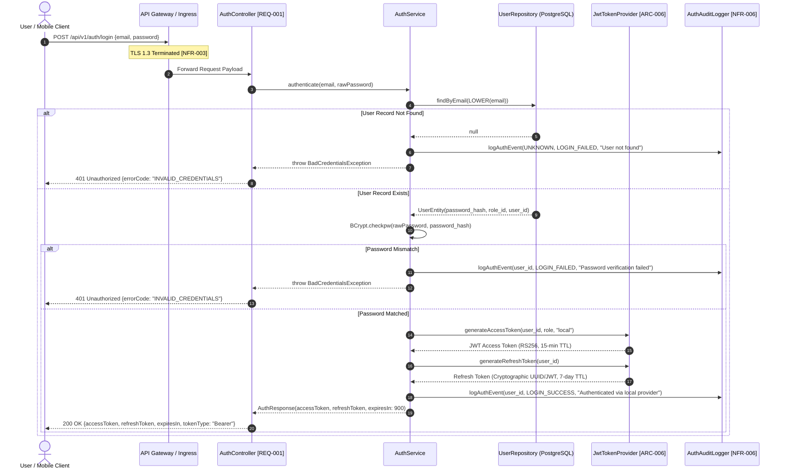
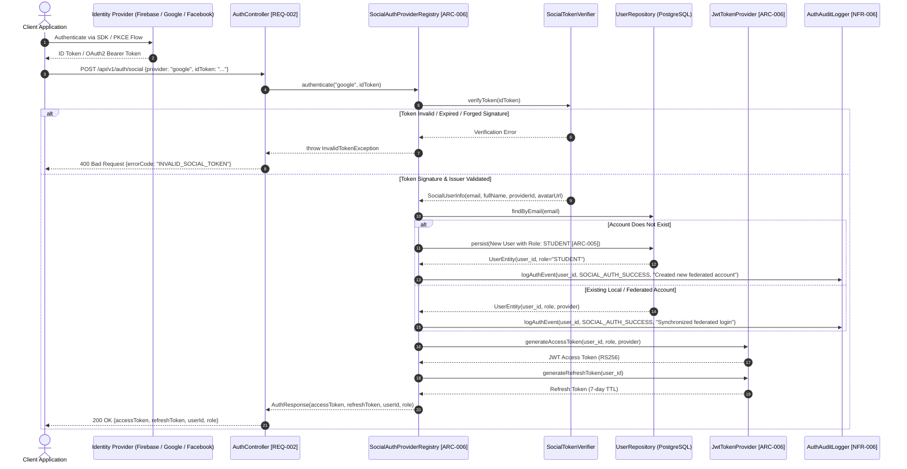
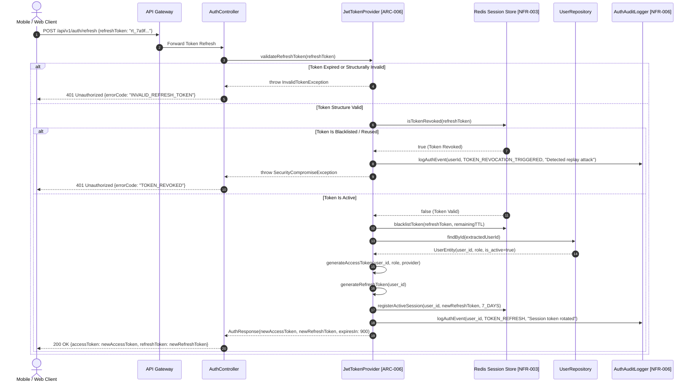

```markdown
# 🏛️ ENTERPRISE SECURITY & AUTHENTICATION ARCHITECTURE BLUEPRINT

| Document Metadata | Specification Detail |
| :--- | :--- |
| **Blueprint Identifier** | SEC-AUTH-20260829-001 |
| **Project Target Base** | `membership-hub` |
| **Package Namespace** | `org.nlh4j.membershiphub` |
| **Document Destination Path** | `./sources/docs/security-authentication.md` (Referenced under `./sources/docs/architecture/ENTERPRISE_SYSTEM_ARCHITECTURE_BLUEPRINT.md`) |
| **Architectural Scope** | OAuth2 Hybrid Authentication, JWT Life Cycle, Social Identity Federation, RBAC Matrix, Cryptographic Hardening, OWASP Top 10 Governance |
| **Target Requirement Tags** | `[ARC-006]`, `[NFR-003]`, `[DOC-001]`, `[REQ-001]`, `[REQ-002]`, `[ARC-001]`, `[ARC-002]`, `[ARC-003]`, `[ARC-004]`, `[ARC-005]`, `[NFR-006]` |
| **Governance Status** | ACTIVE - PRODUCTION GRADE |

---

## 📑 1. TRACEABILITY MATRIX REFERENCE

The following traceability table strictly correlates enterprise non-functional constraints, technical security tags, and system architectural specifications against the security subsystems implemented across the platform.

| Requirement Tag ID | Domain Category | Module / Class Reference | Subsystem Responsibility & Enforcement Target |
| :--- | :--- | :--- | :--- |
| **`[ARC-006]`** | Security Architecture | `org.nlh4j.membershiphub.userservice.security.JwtTokenProvider` | Asymmetric RS256 token generation, claim validation, RSA 2048-bit key verification, token revocation lifecycle. |
| **`[NFR-003]`** | Security & Compliance | `org.nlh4j.membershiphub.userservice.security.ResourceServerConfig` | OWASP Top 10 mitigation, TLS 1.3 enforcement, zero-trust token authentication filters, stateless RBAC gates. |
| **`[DOC-001]`** | Enterprise Documentation | `./sources/docs/security-authentication.md` | Formal, exhaustive architecture documentation specifying authentication workflows, cryptographic standards, and incident runbooks. |
| **`[REQ-001]`** | Functional Security | `org.nlh4j.membershiphub.userservice.service.AuthService` | Local account registration, Bcrypt cost factor 12 password hashing, password complexity enforcement. |
| **`[REQ-002]`** | Identity Federation | `org.nlh4j.membershiphub.userservice.security.SocialAuthProviderRegistry` | Social token verification integrating Firebase, Google OAuth2, and Facebook Graph API endpoints. |
| **`[ARC-001]`** | Authorization (RBAC) | `org.nlh4j.membershiphub.userservice.security.ResourceServerConfig` | Level 1: System Admin global superuser privilege enforcement. |
| **`[ARC-002]`** | Authorization (RBAC) | `org.nlh4j.membershiphub.centerservice.service.CenterAdminService` | Level 2: Center Admin multi-tenant scoped management gating. |
| **`[ARC-003]`** | Authorization (RBAC) | `org.nlh4j.membershiphub.userservice.service.UserRoleService` | Level 3: Manager administrative and operational access control. |
| **`[ARC-004]`** | Authorization (RBAC) | `org.nlh4j.membershiphub.courseservice.controller.CourseController` | Level 4: Teacher pedagogical record access and assigned course scope. |
| **`[ARC-005]`** | Authorization (RBAC) | `org.nlh4j.membershiphub.attendanceservice.controller.AttendanceController` | Level 5: Student course browsing, card retrieval, and QR attendance ingestion. |
| **`[NFR-006]`** | Audit & Governance | `org.nlh4j.membershiphub.userservice.security.AuthAuditLogger` | Tamper-evident logging of identity events, role transitions, authentication anomalies stored with 1-year retention. |

---

## 🔐 2. AUTHENTICATION WORKFLOWS & PROTOCOL LIFECYCLES

### 2.1. Local Email / Password Authentication & JWT Issuance Workflow
The local authentication scheme enforces strict credential hashing via BCrypt (Cost Factor 12) and issues an asymmetric JSON Web Token (RS256) upon successful validation.



### 2.2. Federated Social OAuth2 Authentication Workflow (Firebase, Google, Facebook)
The identity federation subsystem delegates initial credential validation to third-party providers, authenticates identity tokens securely, and harmonizes accounts locally.



### 2.3. Refresh Token Rotation & Session Re-Issuance Workflow
Refresh tokens are managed with mandatory single-use rotation and Redis-backed invalidation to mitigate replay attacks.



---

## 🪪 3. CRYPTOGRAPHIC JSON WEB TOKEN (JWT) STRUCTURE

The Membership Hub platform enforces RFC 7519 compliance utilizing asymmetric RS256 cryptography (RSA 2048-bit private key signing, public key verification). Symmetrical algorithms such as HS256 are explicitly forbidden in cross-service boundaries to eliminate shared-secret leakage risks.

### 3.1. Standard Token Envelope Specification

```
+-------------------------------------------------------------------------+
|                                HEADER                                   |
| { "alg": "RS256", "typ": "JWT", "kid": "hub-auth-key-20260829" }        |
+-------------------------------------------------------------------------+
|                                PAYLOAD                                  |
| {                                                                       |
|   "iss": "membership-hub",                                              |
|   "sub": "550e8400-e29b-41d4-a716-446655440000",                       |
|   "aud": "membership-hub-client",                                       |
|   "group": "CENTER_ADMIN",                                              |
|   "center_id": "770e8400-e29b-41d4-a716-446655440000",                 |
|   "provider": "local",                                                  |
|   "exp": 1788000900,                                                    |
|   "nbf": 1788000000,                                                    |
|   "iat": 1788000000,                                                    |
|   "jti": "d3b07384-d113-4c07-9e6e-82c572e9a21e"                         |
| }                                                                       |
+-------------------------------------------------------------------------+
|                               SIGNATURE                                 |
| RSASHA256(                                                              |
|   base64UrlEncode(header) + "." + base64UrlEncode(payload),             |
|   RSA_PRIVATE_KEY_2048                                                  |
| )                                                                       |
+-------------------------------------------------------------------------+
```

### 3.2. Claim Dictionary & Integrity Constraints

| Claim Key | Full Identifier | Format / Type | Purpose & Constraint Logic | Validation Rule |
| :--- | :--- | :--- | :--- | :--- |
| **`alg`** | Algorithm | String | Cryptographic algorithm marker. Must be set to `RS256`. | Rejects token if `alg == "none"` or symmetric key detected. |
| **`kid`** | Key Identifier | String | Identifies public key rotation set in JWKS repository. | Maps directly to active RSA public certificate. |
| **`iss`** | Issuer | String | Originating authority generating the security context. | Strict string match: `membership-hub`. |
| **`sub`** | Subject | UUID (v4) | Unique physical identifier of the authenticated user entity. | Must map directly to valid `users.user_id`. |
| **`aud`** | Audience | String | Intended consumer system scope. | Must match `membership-hub-client` or designated microservice. |
| **`group`** | Role Authorization | String | Primary role identifier mapping directly to system RBAC levels. | Must match enum `[SYSTEM_ADMIN, CENTER_ADMIN, MANAGER, TEACHER, STUDENT]`. |
| **`center_id`** | Tenant Scope | UUID (v4) | Scoped tenant boundary for Center Admins and Managers. | Mandatory when `group IN ['CENTER_ADMIN', 'MANAGER']`. |
| **`provider`** | Identity Provider | String | Federation source for audit trails. | Must match enum `[local, firebase, google, facebook]`. |
| **`exp`** | Expiration Time | NumericDate (Unix) | Absolute expiration threshold. Max lifetime: 900 seconds (15 mins). | Rejected if `Current_Time >= exp`. |
| **`nbf`** | Not Before | NumericDate (Unix) | Token inception gate. | Rejected if `Current_Time < nbf`. |
| **`iat`** | Issued At | NumericDate (Unix) | Epoch timestamp of token signing. | Used to detect clock skew anomalies (>60 seconds delta rejected). |
| **`jti`** | JWT ID | UUID (v4) | Unique token transaction identifier. | Tracked in Redis to enforce distributed single-use guarantees. |

---

## 🔒 4. CREDENTIAL COMPLEXITY & HARDENING POLICIES

To prevent credential credential-stuffing and brute-force vectors, password handling enforces the following deterministic policy:

```
                  ENTERPRISE PASSWORD POLICY RULES
+-----------------------------------------------------------------------+
|  Metric                   | Requirement Boundary                      |
+---------------------------+-------------------------------------------+
|  Minimum Length           | 8 Characters                              |
|  Maximum Length           | 128 Characters                            |
|  Character Entropy        | Minimum 3 of 4 Character Classes:         |
|                           |  1. Uppercase Alphabetical [A-Z]          |
|                           |  2. Lowercase Alphabetical [a-z]          |
|                           |  3. Numerical Digits [0-9]                |
|                           |  4. Special Characters [!@#$%^&*()_+-=]   |
|  Hashing Cost Factor      | BCrypt Cost Factor 12 (~250ms per hash)   |
|  Prohibited Sequences     | Common Dictionary Words, Substring Email  |
|  Maximum Failed Attempts  | 5 consecutive failures per 15-minute lock |
+-----------------------------------------------------------------------+
```

### 4.1. Formal Regex Password Enforcement
Passwords submitted to `POST /api/v1/users/register` or `PUT /api/v1/users/{id}/password` are strictly validated against:
`^(?=.*[a-z])(?=.*[A-Z])(?=.*\d)(?=.*[@$!%*?&])[A-Za-z\d@$!%*?&]{8,128}$`

---

## 🛑 5. TOKEN REVOCATION & BLACKLISTING ARCHITECTURE

Stateless JWT tokens are coupled with a high-performance Redis cache layer to facilitate real-time session termination, role updates, and immediate compromise mitigation.

```mermaid
flowchart TD
    A[Trigger Revocation Event] --> B{Event Type}
    B -->|User Explicit Logout| C[Add JWT JTI to Redis Blacklist]
    B -->|Admin Role Modification [REQ-003]| D[Invalidate All User Active Sessions]
    B -->|Security Breach / Password Reset| D
    
    C --> E[Compute Remaining TTL: exp - currentTime]
    E --> F[SETEX blacklist:jti:{JTI} {remainingTTL} 'REVOKED']
    
    D --> G[Fetch Active User JTIs from Redis Index]
    G --> H[Pipeline Multi-SETEX blacklist:jti:{JTI_N} {TTL} 'ADMIN_REVOKED']
    H --> I[Purge Refresh Token: DEL refresh_token:user:{UUID}]
    
    F --> J[Incoming Request Interceptor [ARC-006]]
    I --> J
    
    J --> K{EXISTS blacklist:jti:{JTI}?}
    K -->|True| L[Block Request: 401 Unauthorized]
    K -->|False| M[Proceed to RBAC Authorization Gate]
```

### 5.1. Redis Key Space & Storage Layout
- **Blacklist Key Pattern:** `blacklist:jti:<jti_uuid>`
  - **Value:** `REVOKED`
  - **TTL:** `exp - now()` (automatically evicted upon natural token expiration).
- **Active Refresh Key Pattern:** `session:refresh:<user_uuid>`
  - **Value:** `<hashed_refresh_token>`
  - **TTL:** `604800` (7 days).

---

## 🛡️ 6. ROLE-BASED ACCESS CONTROL (RBAC) GOVERNANCE MATRIX

The system enforces a strict 5-tier hierarchical authorization model mapping directly to technical requirements `[ARC-001]` through `[ARC-005]`.

```
                    ROLE HIERARCHY TOPOLOGY
                       [SYSTEM_ADMIN]
                             │
                       [CENTER_ADMIN]
                             │
                         [MANAGER]
                             │
                        [TEACHER]
                             │
                        [STUDENT]
```

### 6.1. Comprehensive RBAC Permissions Matrix

| RBAC Level | Role Identifier | Architectural Scope Code | Domain Authority & Operational Scope | Permitted Endpoint Path Patterns | Prohibited Actions & Boundaries |
| :--- | :--- | :--- | :--- | :--- | :--- |
| **Level 1** | `SYSTEM_ADMIN` | `[ARC-001]` | Global root access across all centers, system configurations, and master tenant registries. | `*` (All paths: `/api/v1/system/**`, `/api/v1/centers/**`, `/api/v1/users/**`) | No system boundaries; actions strictly tracked in immutable Audit Log. |
| **Level 2** | `CENTER_ADMIN` | `[ARC-002]` | Full administrative control strictly confined to assigned `center_id` boundaries. | `/api/v1/centers/{id}/**`, `/api/v1/courses/**`, `/api/v1/promotions/**`, `/api/v1/reports/**` | Cannot access, modify, or read data originating from unassigned `center_id` records. |
| **Level 3** | `MANAGER` | `[ARC-003]` | Operational management: courses, student enrollments, center announcements, and card renewals. | `/api/v1/courses/**`, `/api/v1/enrollments/**`, `/api/v1/announcements/**`, `/api/v1/students/{id}/card/**` | Cannot delete centers, assign Center Admins, or alter system global settings. |
| **Level 4** | `TEACHER` | `[ARC-004]` | Read access to assigned courses, roster rosters, and attendance verification streams. | `/api/v1/courses/assigned`, `/api/v1/courses/{id}/students`, `/api/v1/attendance/verify` | Cannot create courses, alter tuition/promotions, or access system user profiles. |
| **Level 5** | `STUDENT` | `[ARC-005]` | Self-service access: browse catalog, enroll in courses, view digital membership card, scan QR. | `/api/v1/students/courses/available`, `/api/v1/enrollments`, `/api/v1/students/{id}/card`, `/api/v1/attendance/scan` | Cannot view other students' records or modify course schedules. |

---

## 🏛️ 7. OWASP TOP 10 (2021) SECURITY COMPLIANCE CHECKLIST

The following matrix documents the concrete architectural implementations and countermeasures satisfying `[NFR-003]`.

```
+---------------------------------------------------------------------------------------------------------------------------+
|                                    OWASP TOP 10 ENTERPRISE MITIGATION CHECKLIST                                           |
+------+---------------------------------+----------------------------------------------------------------------------------+
| Tag  | OWASP Category                  | System Implementation & Technical Mitigation                                     |
+------+---------------------------------+----------------------------------------------------------------------------------+
| A01  | Broken Access Control           | Method-level security annotations (@RolesAllowed), tenant boundary enforcement   |
|      |                                 | checking center_id against JWT context, automated test suites for privilege leak. |
+------+---------------------------------+----------------------------------------------------------------------------------+
| A02  | Cryptographic Failures          | TLS 1.3 enforced for in-transit communication; AES-256 for PostgreSQL at-rest     |
|      |                                 | encryption; BCrypt (Cost 12) for credentials; RS256 for JWT signing keys.         |
+------+---------------------------------+----------------------------------------------------------------------------------+
| A03  | Injection                       | Zero string concatenation in SQL; Hibernate ORM parameterized queries exclusively;|
|      |                                 | Sort whitelist validation in dynamic queries; DOMPurify for frontend inputs.     |
+------+---------------------------------+----------------------------------------------------------------------------------+
| A04  | Insecure Design                 | Threat modeling applied; idempotent API keys on state-mutating endpoints;        |
|      |                                 | segregated CQRS architecture separating operational mutations from reports.      |
+------+---------------------------------+----------------------------------------------------------------------------------+
| A05  | Security Misconfiguration       | Quarkus security profiles active; HTTP Security Headers (HSTS, CSP, X-Frame)     |
|      |                                 | injected; verbose stack traces suppressed across all production API responses.   |
+------+---------------------------------+----------------------------------------------------------------------------------+
| A06  | Vulnerable & Outdated Components| Snyk & Trivy container scanning in CI/CD pipeline; automated Dependabot PRs;      |
|      |                                 | base images restricted to hardened, minimal distroless/alpine distributions.     |
+------+---------------------------------+----------------------------------------------------------------------------------+
| A07  | Identification & Auth Failures  | Rate limiting on login routes (5 attempts/min via Bucket4j); refresh token       |
|      |                                 | rotation; Redis session revocation; strong password complexity policies.         |
+------+---------------------------------+----------------------------------------------------------------------------------+
| A08  | Software & Data Integrity       | Flyway cryptographic schema checksum validation; signed Git commits; Kafka message|
|      |                                 | schema registry enforcement preventing poisoned deserialization attacks.         |
+------+---------------------------------+----------------------------------------------------------------------------------+
| A09  | Security Logging & Monitoring   | AuthAuditLogger capturing all authentication events; PII masking filters         |
|      |                                 | preventing credential leaks; ELK & Google Cloud Logging shipping with 1-yr TTL.  |
+------+---------------------------------+----------------------------------------------------------------------------------+
| A10  | Server-Side Request Forgery     | Social token verifiers restricted strictly to hardcoded Google, Firebase, and     |
|      |                                 | Facebook domain endpoints; zero arbitrary URL callbacks accepted from users.    |
+------+---------------------------------+----------------------------------------------------------------------------------+
```

---

## 🛠️ 8. INCIDENT RESPONSE & SECURITY TROUBLESHOOTING RUNBOOK

### 8.1. Scenario 1: Password Reset (Forgot Password Workflow)
1. **Initiation:** User submits `POST /api/v1/auth/forgot-password` with registered email.
2. **Token Generation:** System generates a 128-bit cryptographically secure, single-use token with a 15-minute TTL, stored in Redis: `password_reset:token:<token_uuid> -> <user_id>`.
3. **Dispatch:** Triggers asynchronous Kafka event `notification.outbound` emitting an email with a signed, time-limited reset link.
4. **Execution:** User submits `POST /api/v1/auth/reset-password` containing token and new password meeting Section 4 policies.
5. **Session Termination:** System updates `password_hash` in `users` table, purges all active refresh tokens in Redis, and blacklists all currently active JWTs for the user.
6. **Audit Trail:** Logs `PASSWORD_RESET_SUCCESS` with IP and User-Agent context.

### 8.2. Scenario 2: Account Lockout Recovery (Brute-Force Mitigation)
1. **Trigger:** Exceeding 5 consecutive failed login attempts activates a 15-minute temporary lockout via Redis counter: `login:failures:<email>`.
2. **Lockout Response:** Subsequent requests return `429 Too Many Requests` with header `Retry-After: 900`.
3. **Early Unlock Procedure (Self-Service):** User receives a "Security Alert: Account Locked" email containing an unlock verification link valid for 15 minutes.
4. **Admin Override:** System Admin or Center Admin executes `POST /api/v1/users/{id}/unlock`, which clears the Redis failure counter and registers an audit record `ADMIN_ACCOUNT_UNLOCK`.

### 8.3. Scenario 3: MFA (Multi-Factor Authentication) Roadmap Architecture
1. **Provisioning:** User requests MFA setup; backend generates a Base32 TOTP secret key (RFC 6238) and returns a `key_uri` for QR code generation.
2. **Verification Gate:** Initial setup requires submitting a valid 6-digit TOTP code; on verification, the encrypted secret is persisted in `user_mfa_settings`.
3. **Login Interception:** Upon successful primary password validation, if `mfa_enabled == true`, `AuthController` issues a temporary scoped token (`MFA_CHALLENGE`, 5-min TTL) rather than a full access token.
4. **Challenge Completion:** Client submits `POST /api/v1/auth/mfa-verify` with the challenge token and 6-digit TOTP. Upon validation, the standard access and refresh tokens are issued.
```