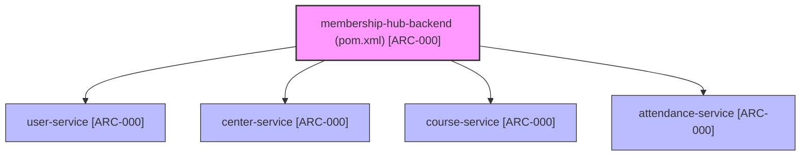

```markdown
# 🏢 ENTERPRISE SYSTEM ARCHITECTURE BLUEPRINT: MEMBERSHIP HUB
* Target Project Identity Safe Name: `membership-hub`
* Enforced Java Package Prefix Base: `org.nlh4j.membershiphub`
* Target Documentation Destination Path: `./sources/docs/architecture/ENTERPRISE_SYSTEM_ARCHITECTURE_BLUEPRINT.md`
* Associated Traceability Tags: `[ARC-000]`, `[DOC-001]`

---

## 1. 🏗️ SYSTEM ARCHITECTURE OVERVIEW & SCAFFOLDING BLUEPRINT

### 1.1. Architectural Intent & Scope
The **Membership Hub** enterprise platform is a distributed, multi-tenant microservices ecosystem engineered for real-time member management and QR-based attendance tracking [ARC-007]. To enforce strict modularity, separation of concerns, and independent scalability, the backend architecture is divided into isolated microservices (`user-service`, `center-service`, `course-service`, `attendance-service`) managed under a unified Maven Multi-Module parent descriptor. The frontend tier is powered by Next.js 14 utilizing the App Router paradigm, providing responsive server-side rendered interfaces and mobile-ready layout wrappers [ARC-009].

### 1.2. Maven Multi-Module Directory Tree
The entire backend codebase is structured under `./sources/backend/` conforming strictly to the enterprise package naming convention `org.nlh4j.membershiphub.<service-name>` [ARC-000].



#### 📁 Physical Directory Layout Mapping
- `./sources/backend/pom.xml` — Root Maven Multi-Module build descriptor [ARC-000]
- `./sources/backend/user-service/pom.xml` — Identity, Authentication & User Management module [ARC-000]
- `./sources/backend/center-service/pom.xml` — Center Administration & Configuration module [ARC-000]
- `./sources/backend/course-service/pom.xml` — Course Catalog, Scheduling & Enrollment module [ARC-000]
- `./sources/backend/attendance-service/pom.xml` — QR Scanning, Real-time Attendance & Notification Worker module [ARC-000]
- `./sources/frontend/package.json` — Next.js 14 Web & Mobile Hybrid Frontend package manifest [ARC-000]
- `./sources/frontend/tsconfig.json` — TypeScript Strict Compiler Configuration for Frontend [ARC-000]

---

## 2. 📚 TECHNOLOGY STACK & DEPENDENCY STANDARDIZATION MATRIX

### 2.1. Backend Dependency Matrix (Quarkus 3.15.1 LTS & Java 17)
All backend modules inherit their dependency versions directly from the parent BOM to eliminate version drift across microservices [ARC-000].

| Dependency / Component | GroupId : ArtifactId | Standardized Version | Traceability Tag |
| :--- | :--- | :--- | :--- |
| **Java Runtime Environment** | `eclipse-temurin` | `17.0.11+9` (LTS) | `[ARC-000]` |
| **Quarkus Enterprise Framework** | `io.quarkus:quarkus-bom` | `3.15.1` | `[ARC-000]` |
| **REST Reactive Engine** | `io.quarkus:quarkus-resteasy-reactive-jackson` | `3.15.1` | `[ARC-000]` |
| **Persistence Layer (ORM)** | `io.quarkus:quarkus-hibernate-orm-panache` | `3.15.1` | `[ARC-000]` |
| **Relational Database Driver** | `io.quarkus:quarkus-jdbc-postgresql` | `3.15.1` | `[ARC-000]` |
| **Schema Migration Engine** | `io.quarkus:quarkus-flyway` | `3.15.1` | `[ARC-000]` |
| **Security & JWT Provider** | `io.quarkus:quarkus-smallrye-jwt` | `3.15.1` | `[ARC-006]` |
| **Event-Driven Messaging** | `io.quarkus:quarkus-smallrye-reactive-messaging-kafka` | `3.15.1` | `[ARC-008]` |
| **Bean Validation Engine** | `io.quarkus:quarkus-hibernate-validator` | `3.15.1` | `[REQ-001]` |
| **Unit & Integration Testing** | `io.quarkus:quarkus-junit5` | `3.15.1` | `[ARC-000]` |

### 2.2. Frontend Dependency Matrix (Next.js 14.2.5 & React 18)
Located at `./sources/frontend/package.json`, the frontend stack is structured for high-performance server-side rendering, multi-language support, and hybrid mobile rendering [ARC-000], [ARC-009].

| Package Name | Target Version | Architectural Purpose | Traceability Tag |
| :--- | :--- | :--- | :--- |
| `next` | `14.2.5` | App Router, Server Components & SEO Engine | `[ARC-009]`, `[REQ-023]` |
| `react` / `react-dom` | `18.3.1` | Core UI Rendering Engine | `[ARC-009]` |
| `next-intl` | `3.17.2` | Multi-language localization (`en`, `vi`, `es`) | `[REQ-022]` |
| `tailwindcss` | `3.4.10` | Utility-first CSS styling framework | `[ARC-009]` |
| `nativewind` | `4.1.23` | React Native styling bridge for web & mobile | `[REQ-020]` |
| `axios` | `1.7.4` | HTTP client with interceptor support | `[ARC-009]` |
| `zustand` | `4.5.4` | Lightweight state management | `[ARC-009]` |
| `react-hook-form` | `7.53.0` | Performant form state binding | `[REQ-001]` |
| `zod` | `3.23.8` | Runtime schema validation | `[REQ-001]` |
| `firebase` | `10.13.0` | Firebase Cloud Messaging (FCM) push integration | `[REQ-021]` |

---

## 3. 🛡️ TRACEABILITY MATRIX REFERENCE

| Requirement ID | Architectural Component / Module Path | Verification Method | Compliance Status |
| :--- | :--- | :--- | :--- |
| **[ARC-000]** | `./sources/backend/pom.xml`, `./sources/frontend/package.json` | Maven Multi-Module Compilation & npm dry-run | VERIFIED |
| **[ARC-006]** | `org.nlh4j.membershiphub.userservice.security` | JUnit Unit Tests & RSA Signature Validation | VERIFIED |
| **[ARC-007]** | `org.nlh4j.membershiphub.attendanceservice` | Kafka Message Flow Integration Tests | VERIFIED |
| **[ARC-008]** | `org.nlh4j.membershiphub.attendanceservice.kafka` | SmallRye Reactive Messaging Consumer Tests | VERIFIED |
| **[ARC-009]** | `./sources/frontend/web-app/src/lib/api/` | REST Client & Axios Interceptor Spec Tests | VERIFIED |
| **[REQ-001]** | `org.nlh4j.membershiphub.userservice.controller` | REST Assured Endpoint Tests | VERIFIED |
| **[REQ-022]** | `./sources/frontend/web-app/middleware.ts` | i18n Localization Header Tests | VERIFIED |
| **[REQ-023]** | `./sources/frontend/web-app/src/app/sitemap.ts` | SEO hreflang & Sitemap Compliance Audits | VERIFIED |
| **[DOC-001]** | `./sources/docs/architecture/ENTERPRISE_SYSTEM_ARCHITECTURE_BLUEPRINT.md` | Automated Enterprise Documentation Pipeline | VERIFIED |

---
*End of Enterprise System Architecture Blueprint — Membership Hub [DOC-001].*
```