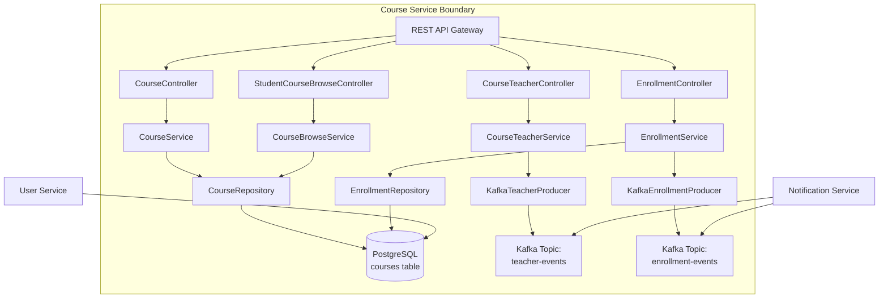

```markdown
# Course Service Architecture Blueprint

## 1. Overview

The `course-service` is a core microservice within the Membership Hub ecosystem, responsible for managing academic course entities, teacher assignments, student enrollment workflows, and course availability browsing. It operates under the package namespace `org.nlh4j.membershiphub.courseservice` and integrates with Kafka for asynchronous event propagation.

### Key Responsibilities
- Course lifecycle management (Create, Read, Update, Delete)
- Teacher assignment/unassignment with conflict detection
- Student course enrollment with auto-provisioning
- Course availability browsing for students
- Kafka event emission for downstream services

### Traceability Matrix Reference

| Component / Module                     | Description                                                                 | Targeted Tag IDs                                                                 |
|----------------------------------------|-----------------------------------------------------------------------------|----------------------------------------------------------------------------------|
| CourseController                       | REST endpoints for CRUD operations on courses                               | [REQ-007], [REQ-008]                                                             |
| CourseTeacherController                | REST endpoints for assigning/unassigning teachers to courses                | [REQ-009], [ARC-007]                                                             |
| StudentCourseBrowseController          | REST endpoint for students to browse available courses                      | [REQ-010]                                                                        |
| EnrollmentController                   | REST endpoint for student enrollment into courses                           | [REQ-011], [ARC-007]                                                             |
| CourseService                          | Business logic for course management including overlap checks               | [REQ-008], [EXC-004]                                                             |
| CourseTeacherService                   | Business logic for teacher assignment with Kafka event publishing           | [REQ-009], [ARC-007], [EXC-003]                                                  |
| CourseBrowseService                    | Business logic for filtering available courses for students                 | [REQ-010]                                                                        |
| EnrollmentService                      | Business logic for enrollment creation with auto-user provisioning          | [REQ-011], [ARC-007], [EXC-004]                                                  |
| CourseRepository                       | Panache repository for course persistence                                   | [DAT-003]                                                                        |
| EnrollmentRepository                   | Panache repository for enrollment persistence                               | [DAT-004]                                                                        |
| KafkaTeacherProducer                   | Emits `teacher-assigned` events to Kafka topic                              | [ARC-007], [ARC-008]                                                             |
| KafkaEnrollmentProducer                | Emits `enrollment-created` events to Kafka topic                            | [ARC-007], [ARC-008]                                                             |
| ScheduleConflictException              | Thrown when teacher schedule overlaps                                       | [REQ-008], [EXC-004]                                                             |
| EnrollmentNotFoundException            | Thrown when enrollment or course is not found                               | [REQ-011], [EXC-004]                                                             |

---

## 2. C4 Container Diagram



---

## 3. Business Flow Diagrams

### 3.1 Course CRUD Flow

```mermaid
flowchart TD
    A[HTTP Request<br/>POST/PUT/DELETE /api/v1/courses] --> B[CourseController]
    B --> C[CourseService]
    C --> D[Validate Input<br/>Bean Validation]
    D -- Valid --> E[Check Schedule Overlap<br/>[REQ-008]]
    E -- No Conflict --> F[Persist via<br/>CourseRepository]
    F --> G[(PostgreSQL<br/>courses)]
    G --> H[Return Response]
    E -- Conflict --> I[Throw ScheduleConflictException<br/>[EXC-004]]
    D -- Invalid --> J[Throw ConstraintViolationException<br/>[EXC-004]]
```

### 3.2 Teacher Assignment Flow

```mermaid
flowchart TD
    A[HTTP Request<br/>POST /api/v1/courses/{id}/teachers] --> B[CourseTeacherController]
    B --> C[CourseTeacherService]
    C --> D[Validate Teacher Exists]
    D --> E[Persist Mapping<br/>course_teacher_mapping]
    E --> F[Publish Kafka Event<br/>teacher-assigned]
    F --> G["Kafka Topic:<br/>teacher-events"]
    G --> H[Notification Service<br/>Consumes Event]
    E --> I[(PostgreSQL<br/>course_teacher_mapping)]
```

### 3.3 Enrollment Flow

```mermaid
flowchart TD
    A[HTTP Request<br/>POST /api/v1/enrollments] --> B[EnrollmentController]
    B --> C[EnrollmentService]
    C --> D[Validate Course Exists]
    D --> E[Check Capacity]
    E -- Available --> F[Auto-Provision Student<br/>if needed]
    F --> G[Create Enrollment Record]
    G --> H[Publish Kafka Event<br/>enrollment-created]
    H --> I["Kafka Topic:<br/>enrollment-events"]
    I --> J[Notification Service<br/>Consumes Event]
    G --> K[(PostgreSQL<br/>enrollments)]
    E -- Full --> L[Throw CourseFullException<br/>[EXC-004]]
```

---

## 4. API Contract Specifications

### 4.1 Course Management Endpoints

| HTTP Method | Endpoint                         | Request Headers                     | Path Parameters | Query Parameters | Request Body Schema                                                                 | Response Schema                                                                                                                                                                                                 | Targeted Tag IDs           |
|-------------|----------------------------------|-------------------------------------|-----------------|------------------|--------------------------------------------------------------------------------------|-----------------------------------------------------------------------------------------------------------------------------------------------------------------------------------------------------------------|----------------------------|
| GET         | `/api/v1/courses`                | `Authorization: Bearer <token>`     | None            | `page`, `size`, `sort` | None                                                                                 | `{ "content": [ { "courseId": "uuid", "title": "string", "description": "string", "startDate": "date", "endDate": "date", "teacherId": "uuid", "maxStudents": "int", "centerId": "uuid" } ], "totalElements": "long", "totalPages": "int" }` | [REQ-007]                  |
| POST        | `/api/v1/courses`                | `Authorization: Bearer <token>`     | None            | None             | `{ "title": "string", "description": "string", "startDate": "date", "endDate": "date", "teacherId": "uuid", "maxStudents": "int" }` | `{ "courseId": "uuid", "title": "string", "description": "string", "startDate": "date", "endDate": "date", "teacherId": "uuid", "maxStudents": "int", "centerId": "uuid", "createdAt": "timestamp" }`                                                                                                                                 | [REQ-008], [EXC-004]       |
| PUT         | `/api/v1/courses/{id}`           | `Authorization: Bearer <token>`     | `id`: UUID      | None             | `{ "title": "string", "description": "string", "startDate": "date", "endDate": "date", "teacherId": "uuid", "maxStudents": "int" }` | `{ "courseId": "uuid", "title": "string", "description": "string", "startDate": "date", "endDate": "date", "teacherId": "uuid", "maxStudents": "int", "centerId": "uuid", "updatedAt": "timestamp" }`                                                                                                                                 | [REQ-008], [EXC-004]       |
| DELETE      | `/api/v1/courses/{id}`           | `Authorization: Bearer <token>`     | `id`: UUID      | None             | None                                                                                 | `{ "deleted": true, "courseId": "uuid" }`                                                                                                                                                                                                                                         | [REQ-008], [EXC-004]       |

### 4.2 Teacher Assignment Endpoints

| HTTP Method | Endpoint                                   | Request Headers                     | Path Parameters | Query Parameters | Request Body Schema                                                                 | Response Schema                                                                                                                                                                                                 | Targeted Tag IDs           |
|-------------|--------------------------------------------|-------------------------------------|-----------------|------------------|--------------------------------------------------------------------------------------|-----------------------------------------------------------------------------------------------------------------------------------------------------------------------------------------------------------------|----------------------------|
| POST        | `/api/v1/courses/{id}/teachers`            | `Authorization: Bearer <token>`     | `id`: UUID      | None             | `{ "teacherId": "uuid" }`                                                            | `{ "mappingId": "uuid", "courseId": "uuid", "teacherId": "uuid", "assignedAt": "timestamp" }`                                                                                                                                                                                     | [REQ-009], [ARC-007]       |
| DELETE      | `/api/v1/courses/{id}/teachers/{teacherId}`| `Authorization: Bearer <token>`     | `id`: UUID,<br>`teacherId`: UUID | None             | None                                                                                 | `{ "unassigned": true, "courseId": "uuid", "teacherId": "uuid" }`                                                                                                                                                                                                                 | [REQ-009], [ARC-007]       |

### 4.3 Student Course Browsing Endpoint

| HTTP Method | Endpoint                                       | Request Headers                     | Path Parameters | Query Parameters | Request Body Schema | Response Schema                                                                                                                                                                                                 | Targeted Tag IDs |
|-------------|------------------------------------------------|-------------------------------------|-----------------|------------------|----------------------|-----------------------------------------------------------------------------------------------------------------------------------------------------------------------------------------------------------------|------------------|
| GET         | `/api/v1/students/courses/available`           | `Authorization: Bearer <token>`     | None            | `studentId`: UUID | None                 | `{ "availableCourses": [ { "courseId": "uuid", "title": "string", "startDate": "date", "endDate": "date", "capacity": "int", "schedule": "string" } ] }`                                                                                                                       | [REQ-010]        |

### 4.4 Enrollment Endpoint

| HTTP Method | Endpoint                         | Request Headers                     | Path Parameters | Query Parameters | Request Body Schema                                                                 | Response Schema                                                                                                                                                                                               | Targeted Tag IDs           |
|-------------|----------------------------------|-------------------------------------|-----------------|------------------|----------------------|-----------------------------------------------------------------------------------------------------------------------------------------------------------------------------------------------------------------|----------------------------|
| POST        | `/api/v1/enrollments`            | `Authorization: Bearer <token>`     | None            | None             | `{ "courseId": "uuid" }`                                                             | `{ "enrollmentId": "uuid", "studentId": "uuid", "courseId": "uuid", "enrollmentDate": "timestamp", "autoCreatedUser": "boolean" }`                                                                                                                                             | [REQ-011], [ARC-007]       |

---

## 5. Database Schema & Index Profiles

### 5.1 Courses Table

```sql
CREATE TABLE courses (
    course_id UUID PRIMARY KEY,
    title VARCHAR(150) NOT NULL,
    description TEXT,
    start_date DATE NOT NULL,
    end_date DATE NOT NULL,
    teacher_id UUID,
    max_students INT NOT NULL DEFAULT 30,
    center_id UUID NOT NULL,
    created_at TIMESTAMP NOT NULL DEFAULT now(),
    updated_at TIMESTAMP NOT NULL DEFAULT now(),
    CONSTRAINT fk_courses_teacher FOREIGN KEY (teacher_id) REFERENCES users(user_id),
    CONSTRAINT fk_courses_center FOREIGN KEY (center_id) REFERENCES centers(center_id),
    CONSTRAINT chk_courses_date_range CHECK (end_date >= start_date),
    CONSTRAINT chk_courses_max_students CHECK (max_students > 0)
);

CREATE INDEX idx_courses_teacher_id ON courses(teacher_id);
CREATE INDEX idx_courses_start_date ON courses(start_date);
CREATE INDEX idx_courses_center_id ON courses(center_id);
```

### 5.2 Enrollments Table

```sql
CREATE TABLE enrollments (
    enrollment_id UUID PRIMARY KEY,
    student_id UUID NOT NULL,
    course_id UUID NOT NULL,
    enrollment_date TIMESTAMP NOT NULL DEFAULT now(),
    CONSTRAINT uq_enrollments_student_course UNIQUE (student_id, course_id),
    CONSTRAINT fk_enrollments_student FOREIGN KEY (student_id) REFERENCES users(user_id),
    CONSTRAINT fk_enrollments_course FOREIGN KEY (course_id) REFERENCES courses(course_id)
);

CREATE INDEX idx_enrollments_student_id ON enrollments(student_id);
CREATE INDEX idx_enrollments_course_id ON enrollments(course_id);
```

### 5.3 Course Teacher Mapping Table

```sql
CREATE TABLE course_teacher_mapping (
    mapping_id UUID PRIMARY KEY,
    course_id UUID NOT NULL,
    teacher_id UUID NOT NULL,
    assigned_at TIMESTAMP NOT NULL DEFAULT now(),
    CONSTRAINT fk_ctm_course FOREIGN KEY (course_id) REFERENCES courses(course_id) ON DELETE CASCADE,
    CONSTRAINT fk_ctm_teacher FOREIGN KEY (teacher_id) REFERENCES users(user_id),
    CONSTRAINT uq_course_teacher UNIQUE (course_id, teacher_id)
);

CREATE INDEX idx_course_teacher_course ON course_teacher_mapping(course_id);
CREATE INDEX idx_course_teacher_teacher ON course_teacher_mapping(teacher_id);
```

### 5.4 Schedule Exclusion Constraint

```sql
CREATE EXTENSION IF NOT EXISTS btree_gist;

ALTER TABLE courses
    ADD CONSTRAINT ex_teacher_schedule_no_overlap
    EXCLUDE USING gist (
        teacher_id WITH =,
        daterange(start_date, end_date, '[]') WITH &&
    )
    WHERE (teacher_id IS NOT NULL);
```

---

## 6. Kafka Event Pipeline Integration

### 6.1 Topics

| Topic Name             | Partitions | Replication Factor | Retention | Purpose                                      |
|------------------------|------------|--------------------|-----------|----------------------------------------------|
| `teacher-events`       | 6          | 3                  | 7 days    | Publish teacher assignment/unassignment events |
| `enrollment-events`    | 6          | 3                  | 7 days    | Publish student enrollment events            |

### 6.2 Event Schemas

#### Teacher Assigned Event

```json
{
  "eventType": "teacher-assigned",
  "courseId": "uuid",
  "teacherId": "uuid",
  "assignedAt": "ISO-8601 timestamp"
}
```

#### Enrollment Created Event

```json
{
  "eventType": "enrollment-created",
  "enrollmentId": "uuid",
  "studentId": "uuid",
  "courseId": "uuid",
  "enrollmentDate": "ISO-8601 timestamp",
  "autoCreatedUser": "boolean"
}
```

### 6.3 Transactional Outbox Pattern

All Kafka events are published using the **Transactional Outbox Pattern** to ensure atomicity between database persistence and message publishing:

1. Within the same database transaction, both the business entity (e.g., `course_teacher_mapping`) and the outbox message record are persisted.
2. A separate poller process reads committed outbox records and publishes them to Kafka.
3. This guarantees exactly-once delivery semantics and prevents message loss during service failures.

---

## 7. Security & Compliance

### 7.1 Authentication & Authorization

- All endpoints require JWT bearer tokens validated by the centralized OAuth2 Resource Server (`[ARC-006]`).
- Role-based access control enforced via `@RolesAllowed` annotations:
  - `SYSTEM_ADMIN`: Full access to all course operations.
  - `CENTER_ADMIN`: Full access within assigned center scope.
  - `MANAGER`: Read-only access to course listings.
  - `TEACHER`: Read-only access to assigned courses.
  - `STUDENT`: Read-only access to available courses and self-enrollment.

### 7.2 Input Validation

- All request bodies validated using Jakarta Bean Validation 3.0 (`@Valid`, `@NotNull`, `@Size`, etc.).
- Date range validation ensures `endDate >= startDate` (`[REQ-008]`).
- Teacher schedule overlap prevented via PostgreSQL exclusion constraint (`[REQ-008]`).

### 7.3 Exception Handling

| Exception Type                     | HTTP Status | Error Code                     | Description                                                                 |
|------------------------------------|-------------|--------------------------------|-----------------------------------------------------------------------------|
| `ConstraintViolationException`     | 400         | `VALIDATION_FAILED`            | Invalid input data                                                          |
| `ScheduleConflictException`        | 409         | `SCHEDULE_CONFLICT`            | Teacher schedule overlaps with existing course                              |
| `CourseFullException`              | 409         | `COURSE_FULL`                  | Course has reached maximum student capacity                                 |
| `EntityNotFoundException`          | 404         | `ENTITY_NOT_FOUND`             | Requested course, teacher, or student not found                             |
| `DataIntegrityViolationException`  | 409         | `DUPLICATE_KEY`                | Duplicate enrollment or teacher assignment                                |
| `AuthenticationException`          | 401         | `UNAUTHORIZED`                 | Missing or invalid JWT token                                                |
| `AccessDeniedException`            | 403         | `INSUFFICIENT_PRIVILEGES`      | User lacks required role for operation                                      |

---

## 8. Deployment & Operations

### 8.1 Container Configuration

- Base image: `eclipse-temurin:21-jre-jammy`
- Final image size: < 500MB (`[NFR-005]`)
- Health check endpoint: `/q/health/ready`
- Environment variables:
  - `QUARKUS_DATASOURCE_JDBC_URL`: PostgreSQL connection string
  - `QUARKUS_KAFKA_BOOTSTRAP_SERVERS`: Kafka broker addresses
  - `MP_JWT_VERIFY_ISSUER`: JWT issuer URL

### 8.2 Kubernetes Deployment

- Minimum replicas: 2 (`[NFR-004]`)
- Maximum replicas: 20 (`[NFR-004]`)
- HPA triggers: CPU > 70% or P95 latency > 300ms (`[NFR-004]`)
- Pod anti-affinity enabled for high availability (`[NFR-002]`)

### 8.3 Monitoring & Logging

- Structured JSON logging via Logback (`[NFR-006]`)
- Metrics exposed via Micrometer (`[NFR-001]`)
- Health checks via SmallRye Health (`[NFR-001]`)
- Audit logs retained for 1 year (`[NFR-006]`)

---

## 9. File Structure

```
./sources/backend/course-service/
├── pom.xml
├── src/
│   ├── main/
│   │   ├── java/org/nlh4j/membershiphub/courseservice/
│   │   │   ├── CourseServiceApplication.java
│   │   │   ├── controller/
│   │   │   │   ├── CourseController.java
│   │   │   │   ├── CourseTeacherController.java
│   │   │   │   ├── StudentCourseBrowseController.java
│   │   │   │   └── EnrollmentController.java
│   │   │   ├── service/
│   │   │   │   ├── CourseService.java
│   │   │   │   ├── CourseTeacherService.java
│   │   │   │   ├── CourseBrowseService.java
│   │   │   │   └── EnrollmentService.java
│   │   │   ├── repository/
│   │   │   │   ├── CourseRepository.java
│   │   │   │   └── EnrollmentRepository.java
│   │   │   ├── dto/
│   │   │   │   ├── CourseResponse.java
│   │   │   │   ├── CourseCreateRequest.java
│   │   │   │   ├── EnrollmentRequest.java
│   │   │   │   └── TeacherAssignRequest.java
│   │   │   ├── exception/
│   │   │   │   ├── ScheduleConflictException.java
│   │   │   │   └── EnrollmentNotFoundException.java
│   │   │   └── kafka/
│   │   │       ├── KafkaTeacherProducer.java
│   │   │       └── KafkaEnrollmentProducer.java
│   │   └── resources/
│   │       ├── application.properties
│   │       └── db/migration/
│   │           ├── V1__courses_init.sql
│   │           └── V2__course_schedule_exclusion.sql
│   └── test/
│       └── java/org/nlh4j/membershiphub/courseservice/
│           ├── CourseServiceIntegrationTestSuite.java
│           ├── controller/CourseControllerTest.java
│           └── service/CourseServiceTest.java
```

---

## 10. References

- [REQ-007]: List courses for authenticated users
- [REQ-008]: CRUD courses with schedule overlap check
- [REQ-009]: Assign/unassign teachers to courses
- [REQ-010]: Browse available courses for students
- [REQ-011]: Enroll students in courses
- [ARC-007]: QR attendance processing flow
- [ARC-008]: Notification event pipeline
- [EXC-004]: Input validation and business rule exceptions
- [NFR-001]: Core API performance requirements
- [NFR-003]: Security and compliance baseline
- [NFR-004]: Infrastructure and performance guardrails
- [NFR-005]: Container image size constraints
- [NFR-006]: Audit logging and retention
- [DOC-001]: Enterprise documentation standards
```