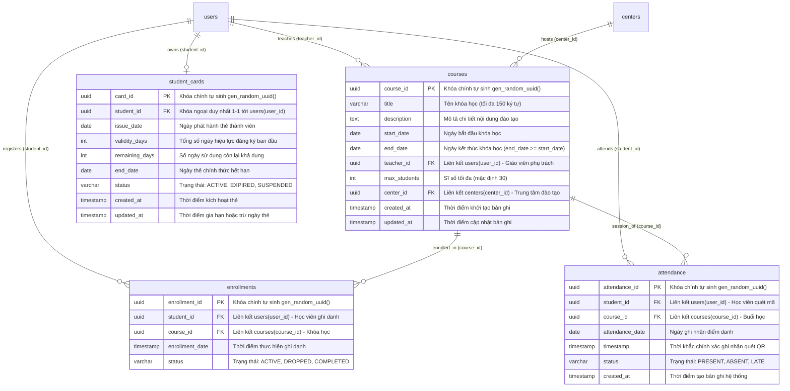

```markdown
# 🏛️ TÀI LIỆU THIẾT KẾ KIẾN TRÚC HỆ THỐNG (SYSTEM ARCHITECTURE BLUEPRINT)
**Dự án:** Membership Hub Enterprise Platform  
**Đường dẫn vật lý:** `./sources/docs/architecture/blueprint.md`  
**Gói Java quy chuẩn:** `org.nlh4j.membershiphub`  
**Phiên bản kiến trúc:** 1.0 (Baseline Release)  
**Trạng thái kiểm toán:** Approved for Implementation  

---

## 📑 MỤC LỤC TRUY VẾT KIẾN TRÚC
- [1. Tổng Quan Kiến Trúc Dữ Liệu & Bền Vững](#1-tổng-quan-kiến-trúc-dữ-liệu--bền-vững)
- [2. Sơ Đồ Quan Hệ Thực Thể - Phần 2 (Entity Relationship Diagram)](#2-sơ-đồ-quan-hệ-thực-thể---phần-2-entity-relationship-diagram)
- [3. Đặc Tả Chi Tiết Lược Đồ Dữ Liệu (Schema Data Dictionary)](#3-đặc-tả-chi-tiết-lược-đồ-dữ-liệu-schema-data-dictionary)
  - [3.1. Bảng `courses` (Quản Lý Khóa Học)](#31-bảng-courses-quản-lý-khóa-học-dat-004)
  - [3.2. Bảng `enrollments` (Ghi Danh Khóa Học)](#32-bảng-enrollments-ghi-danh-khóa-học-dat-005)
  - [3.3. Bảng `attendance` (Nhật Ký Điểm Danh & Idempotency)](#33-bảng-attendance-nhật-ký-điểm-danh--idempotency-dat-006)
  - [3.4. Bảng `student_cards` (Quản Lý Thẻ Thành Viên Học Viên)](#34-bảng-student_cards-quản-lý-thẻ-thành-viên-học-viên-dat-007)
- [4. Phân Tích Mối Quan Hệ Khóa Ngoại (Foreign Key Constraints)](#4-phân-tích-mối-quan-hệ-khóa-ngoại-foreign-key-constraints)
- [5. Cơ Chế Khóa Tổng Hợp Đảm Bảo Idempotency Điểm Danh](#5-cơ-chế-khóa-tổng-hợp-đảm-bảo-idempotency-điểm-danh)
- [6. Chiến Lược Đánh Chỉ Mục & Tối Ưu Hóa Hiệu Năng](#6-chiến-lược-đánh-chỉ-mục--tối-ưu-hóa-hiệu-năng)
- [7. Ma Trận Truy Vết Kỹ Thuật (Traceability Matrix Reference)](#7-ma-trận-truy-vết-kỹ-thuật-traceability-matrix-reference)

---

## 1. TỔNG QUAN KIẾN TRÚC DỮ LIỆU & BỀN VỮNG

Hệ thống Membership Hub triển khai kiến trúc đa vi dịch vụ (microservices) dựa trên nền tảng Quarkus Framework và cơ sở dữ liệu phân tán PostgreSQL. Tầng lưu trữ được chuẩn hóa theo chuẩn ANSI SQL, tuyệt đối loại bỏ các kiểu dữ liệu độc quyền phi tiêu chuẩn (như PostgreSQL `ENUM`) và thay thế hoàn toàn bằng chuỗi ký tự chuẩn hóa (`VARCHAR`) kết hợp với các ràng buộc kiểm tra toàn vẹn (`CHECK Constraint`).

Các vi dịch vụ cốt lõi xử lý nghiệp vụ vận hành trung tâm và đào tạo bao gồm:
1. **Course Service (`org.nlh4j.membershiphub.courseservice`):** Chịu trách nhiệm quản lý thông tin khóa học, lịch trình đào tạo, phân bổ phòng học và phát hiện xung đột lịch giảng dạy của giáo viên `[DAT-004]`, `[REQ-007]`, `[REQ-008]`, `[REQ-009]`.
2. **Attendance & Enrollment Service (`org.nlh4j.membershiphub.attendanceservice`):** Chịu trách nhiệm điều phối quy trình học viên ghi danh vào khóa học, xác thực tính hợp lệ của mã QR điểm danh, ghi nhận nhật ký hiện diện chống trùng lặp (idempotency), và quản lý thời hạn giá trị sử dụng của thẻ học viên `[DAT-005]`, `[DAT-006]`, `[DAT-007]`, `[REQ-010]`, `[REQ-011]`, `[REQ-012]`, `[REQ-013]`, `[ARC-007]`, `[EXC-002]`.

---

## 2. SƠ ĐỒ QUAN HỆ THỰC THỂ - PHẦN 2 (ENTITY RELATIONSHIP DIAGRAM)

Sơ đồ ERD dưới đây minh họa cấu trúc vật lý và các liên kết khóa ngoại chặt chẽ giữa 4 thực thể dữ liệu nòng cốt của giai đoạn này (`courses`, `enrollments`, `attendance`, `student_cards`) cùng các thực thể liên kết phụ thuộc từ tầng bảo mật và tổ chức trung tâm (`users`, `centers`).



---

## 3. ĐẶC TẢ CHI TIẾT LƯỢC ĐỒ DỮ LIỆU (SCHEMA DATA DICTIONARY)

### 3.1. Bảng `courses` (Quản Lý Khóa Học) `[DAT-004]`
* **Đường dẫn tệp di trú:** `./sources/backend/course-service/src/main/resources/db/migration/V1__init_courses.sql`
* **Lớp thực thể tương ứng:** `org.nlh4j.membershiphub.courseservice.Course`
* **Mục đích nghiệp vụ:** Quản lý danh mục khóa học được tổ chức tại các trung tâm, định nghĩa khung thời gian giảng dạy, giới hạn sĩ số lớp học và gắn kết với giáo viên giảng dạy `[REQ-007]`, `[REQ-008]`, `[REQ-009]`.

| Tên cột | Kiểu dữ liệu | Ràng buộc | Mô tả | Mã thẻ |
| :--- | :--- | :--- | :--- | :--- |
| `course_id` | `UUID` | `PRIMARY KEY DEFAULT gen_random_uuid()` | Định danh duy nhất toàn cục của khóa học đào tạo | `[DAT-004]` |
| `title` | `VARCHAR(150)` | `NOT NULL` | Tên tiêu đề khóa học, độ dài tối đa 150 ký tự | `[DAT-004]`, `[REQ-007]` |
| `description` | `TEXT` | `NULL` | Nội dung mô tả tổng quan, đề cương và giáo trình chi tiết | `[DAT-004]` |
| `start_date` | `DATE` | `NOT NULL` | Ngày bắt đầu khóa học theo lịch đào tạo | `[DAT-004]`, `[REQ-008]` |
| `end_date` | `DATE` | `NOT NULL` | Ngày kết thúc khóa học theo lịch đào tạo | `[DAT-004]`, `[REQ-008]` |
| `teacher_id` | `UUID` | `NOT NULL, FOREIGN KEY -> users(user_id)` | Khóa ngoại tham chiếu người dùng có vai trò là Giáo viên | `[DAT-004]`, `[REQ-009]` |
| `max_students` | `INT` | `NOT NULL DEFAULT 30` | Sĩ số học viên tối đa được phép ghi danh vào lớp | `[DAT-004]`, `[REQ-007]` |
| `center_id` | `UUID` | `NULL, FOREIGN KEY -> centers(center_id)` | Khóa ngoại tham chiếu đến trung tâm sở tại tổ chức khóa học | `[DAT-004]`, `[REQ-004]` |
| `created_at` | `TIMESTAMP` | `NOT NULL DEFAULT CURRENT_TIMESTAMP` | Dấu thời gian ghi nhận thời điểm khóa học được tạo trên hệ thống | `[DAT-004]` |
| `updated_at` | `TIMESTAMP` | `NOT NULL DEFAULT CURRENT_TIMESTAMP` | Dấu thời gian cập nhật thông tin khóa học lần gần nhất | `[DAT-004]` |

* **Ràng buộc cấp bảng (Table-Level Constraints):**
  * `CONSTRAINT fk_courses_teacher FOREIGN KEY (teacher_id) REFERENCES users(user_id) ON DELETE RESTRICT`: Ngăn chặn hành vi xóa giáo viên khi đang có khóa học hoạt động liên kết.
  * `CONSTRAINT fk_courses_center FOREIGN KEY (center_id) REFERENCES centers(center_id) ON DELETE SET NULL`: Khi trung tâm bị xóa hoặc tái cơ cấu, trường trung tâm của khóa học được chuyển thành null để duy trì lịch sử khóa học.
  * `CONSTRAINT chk_courses_dates CHECK (end_date >= start_date)`: Đảm bảo tính toàn vẹn logic thời gian, ngày kết thúc không bao giờ được sớm hơn ngày bắt đầu `[REQ-008]`.

---

### 3.2. Bảng `enrollments` (Ghi Danh Khóa Học) `[DAT-005]`
* **Đường dẫn tệp di trú:** `./sources/backend/course-service/src/main/resources/db/migration/V2__init_enrollments.sql`
* **Lớp thực thể tương ứng:** `org.nlh4j.membershiphub.attendanceservice.Enrollment`
* **Mục đích nghiệp vụ:** Quản lý mối quan hệ học viên tham gia vào khóa học cụ thể, kiểm soát trạng thái học tập và ngăn chặn việc một học viên đăng ký nhiều lần vào cùng một khóa học `[REQ-010]`, `[REQ-011]`.

| Tên cột | Kiểu dữ liệu | Ràng buộc | Mô tả | Mã thẻ |
| :--- | :--- | :--- | :--- | :--- |
| `enrollment_id` | `UUID` | `PRIMARY KEY DEFAULT gen_random_uuid()` | Định danh duy nhất toàn cục của bản ghi ghi danh | `[DAT-005]` |
| `student_id` | `UUID` | `NOT NULL, FOREIGN KEY -> users(user_id)` | Khóa ngoại tham chiếu người dùng có vai trò là Học viên | `[DAT-005]`, `[REQ-011]` |
| `course_id` | `UUID` | `NOT NULL, FOREIGN KEY -> courses(course_id)` | Khóa ngoại tham chiếu đến khóa học mà học viên đăng ký | `[DAT-005]`, `[REQ-011]` |
| `enrollment_date` | `TIMESTAMP` | `NOT NULL DEFAULT CURRENT_TIMESTAMP` | Dấu thời gian chính xác ghi nhận giao dịch ghi danh thành công | `[DAT-005]`, `[REQ-011]` |
| `status` | `VARCHAR(20)` | `NOT NULL DEFAULT 'ACTIVE'` | Trạng thái hiện thời của việc ghi danh (`ACTIVE`, `DROPPED`, `COMPLETED`) | `[DAT-005]`, `[REQ-010]` |

* **Ràng buộc cấp bảng (Table-Level Constraints):**
  * `CONSTRAINT fk_enrollments_student FOREIGN KEY (student_id) REFERENCES users(user_id) ON DELETE CASCADE`: Xóa thông tin ghi danh liên quan nếu học viên bị xóa theo yêu cầu tuân thủ quyền riêng tư GDPR.
  * `CONSTRAINT fk_enrollments_course FOREIGN KEY (course_id) REFERENCES courses(course_id) ON DELETE CASCADE`: Xóa các bản ghi ghi danh tương ứng nếu khóa học bị hủy bỏ.
  * `CONSTRAINT chk_enrollments_status CHECK (status IN ('ACTIVE', 'DROPPED', 'COMPLETED'))`: Ràng buộc trạng thái chặt chẽ theo chuẩn ANSI SQL, nghiêm cấm nhận giá trị ngoài danh mục cho phép.
  * `CONSTRAINT uq_enrollments_student_course UNIQUE (student_id, course_id)`: Khóa tổng hợp duy nhất ngăn chặn tuyệt đối tình trạng học viên bị ghi danh lặp lại vào cùng một khóa học `[REQ-011]`, `[EXC-004]`.

---

### 3.3. Bảng `attendance` (Nhật Ký Điểm Danh & Idempotency) `[DAT-006]`
* **Đường dẫn tệp di trú:** `./sources/backend/attendance-service/src/main/resources/db/migration/V1__init_attendance.sql`
* **Lớp thực thể tương ứng:** `org.nlh4j.membershiphub.attendanceservice.Attendance`
* **Mục đích nghiệp vụ:** Lưu trữ nhật ký quét mã QR hiện diện của học viên tại các buổi học, hỗ trợ theo dõi tiến độ đào tạo và kích hoạt cơ chế Idempotency chống điểm danh gian lận hoặc lỗi mạng quét trùng `[REQ-012]`, `[REQ-013]`, `[ARC-007]`, `[EXC-001]`, `[EXC-002]`.

| Tên cột | Kiểu dữ liệu | Ràng buộc | Mô tả | Mã thẻ |
| :--- | :--- | :--- | :--- | :--- |
| `attendance_id` | `UUID` | `PRIMARY KEY DEFAULT gen_random_uuid()` | Định danh duy nhất toàn cục của bản ghi điểm danh | `[DAT-006]` |
| `student_id` | `UUID` | `NOT NULL, FOREIGN KEY -> users(user_id)` | Khóa ngoại tham chiếu học viên thực hiện quét QR điểm danh | `[DAT-006]`, `[REQ-012]` |
| `course_id` | `UUID` | `NOT NULL, FOREIGN KEY -> courses(course_id)` | Khóa ngoại tham chiếu khóa học diễn ra buổi điểm danh | `[DAT-006]`, `[REQ-012]` |
| `attendance_date` | `DATE` | `NOT NULL` | Ngày hành chính diễn ra buổi học được điểm danh | `[DAT-006]`, `[REQ-013]` |
| `timestamp` | `TIMESTAMP` | `NOT NULL DEFAULT CURRENT_TIMESTAMP` | Thời khắc chính xác hệ thống máy chủ tiếp nhận và giải mã payload QR | `[DAT-006]`, `[ARC-007]` |
| `status` | `VARCHAR(20)` | `NOT NULL DEFAULT 'PRESENT'` | Trạng thái ghi nhận buổi học (`PRESENT`, `ABSENT`, `LATE`) | `[DAT-006]`, `[REQ-013]` |
| `created_at` | `TIMESTAMP` | `NOT NULL DEFAULT CURRENT_TIMESTAMP` | Dấu thời gian khởi tạo bản ghi dữ liệu kiểm toán hệ thống | `[DAT-006]` |

* **Ràng buộc cấp bảng (Table-Level Constraints):**
  * `CONSTRAINT fk_attendance_student FOREIGN KEY (student_id) REFERENCES users(user_id) ON DELETE RESTRICT`: Bảo toàn dữ liệu kiểm toán điểm danh, ngăn chặn việc xóa người dùng khi đã có nhật ký hiện diện lịch sử.
  * `CONSTRAINT fk_attendance_course FOREIGN KEY (course_id) REFERENCES courses(course_id) ON DELETE RESTRICT`: Giữ nguyên tính toàn vẹn dữ liệu điểm danh phục vụ xuất báo cáo thanh quyết toán và cấp chứng chỉ.
  * `CONSTRAINT chk_attendance_status CHECK (status IN ('PRESENT', 'ABSENT', 'LATE'))`: Chuẩn hóa trạng thái hiện diện của người học.
  * `CONSTRAINT uq_attendance_idempotency UNIQUE (student_id, course_id, attendance_date)`: **Khóa tổng hợp Idempotency bắt buộc**. Đảm bảo trong một ngày cụ thể (`attendance_date`), một học viên (`student_id`) chỉ có duy nhất 1 bản ghi điểm danh hợp lệ cho một khóa học (`course_id`) `[REQ-013]`, `[EXC-002]`.

---

### 3.4. Bảng `student_cards` (Quản Lý Thẻ Thành Viên Học Viên) `[DAT-007]`
* **Đường dẫn tệp di trú:** `./sources/backend/user-service/src/main/resources/db/migration/V2__init_student_cards.sql`
* **Lớp thực thể tương ứng:** `org.nlh4j.membershiphub.userservice.StudentCard`
* **Mục đích nghiệp vụ:** Quản lý tư cách thành viên, số ngày sử dụng dịch vụ đào tạo còn lại, thời hạn hiệu lực thẻ và điều phối quy trình gia hạn thẻ học viên `[REQ-014]`, `[REQ-015]`.

| Tên cột | Kiểu dữ liệu | Ràng buộc | Mô tả | Mã thẻ |
| :--- | :--- | :--- | :--- | :--- |
| `card_id` | `UUID` | `PRIMARY KEY DEFAULT gen_random_uuid()` | Định danh duy nhất toàn cục của thẻ học viên | `[DAT-007]` |
| `student_id` | `UUID` | `NOT NULL, UNIQUE, FOREIGN KEY -> users(user_id)` | Khóa ngoại quan hệ 1-1 tới người dùng học viên sở hữu thẻ | `[DAT-007]`, `[REQ-014]` |
| `issue_date` | `DATE` | `NOT NULL` | Ngày phát hành kích hoạt thẻ thành viên lần đầu | `[DAT-007]`, `[REQ-014]` |
| `validity_days` | `INT` | `NOT NULL` | Tổng số ngày hiệu lực ban đầu được cấu hình cho gói thành viên | `[DAT-007]`, `[REQ-014]` |
| `remaining_days` | `INT` | `NOT NULL` | Số ngày hiệu lực khả dụng còn lại của thẻ tính đến thời điểm hiện tại | `[DAT-007]`, `[REQ-014]` |
| `end_date` | `DATE` | `NOT NULL` | Ngày hết hạn chính thức của thẻ thành viên (tự động dịch chuyển khi gia hạn) | `[DAT-007]`, `[REQ-015]` |
| `status` | `VARCHAR(20)` | `NOT NULL DEFAULT 'ACTIVE'` | Trạng thái hiệu lực thẻ (`ACTIVE`, `EXPIRED`, `SUSPENDED`) | `[DAT-007]`, `[REQ-014]` |
| `created_at` | `TIMESTAMP` | `NOT NULL DEFAULT CURRENT_TIMESTAMP` | Thời điểm hệ thống ghi nhận cấp phát thẻ | `[DAT-007]` |
| `updated_at` | `TIMESTAMP` | `NOT NULL DEFAULT CURRENT_TIMESTAMP` | Thời điểm cập nhật trạng thái thẻ hoặc ghi nhận giao dịch gia hạn | `[DAT-007]`, `[REQ-015]` |

* **Ràng buộc cấp bảng (Table-Level Constraints):**
  * `CONSTRAINT fk_student_cards_student FOREIGN KEY (student_id) REFERENCES users(user_id) ON DELETE CASCADE`: Thẻ thành viên gắn liền mật thiết với tài khoản học viên, tự động giải phóng khi người dùng bị xóa theo quyền hủy tài khoản.
  * `CONSTRAINT chk_student_cards_validity CHECK (validity_days > 0 AND remaining_days >= 0)`: Đảm bảo số ngày hiệu lực cấu hình phải lớn hơn 0 và số ngày khả dụng không bao giờ mang giá trị âm.
  * `CONSTRAINT chk_student_cards_status CHECK (status IN ('ACTIVE', 'EXPIRED', 'SUSPENDED'))`: Chuẩn hóa danh mục trạng thái hoạt động của thẻ thành viên học viên.

---

## 4. PHÂN TÍCH MỐI QUAN HỆ KHÓA NGOẠI (FOREIGN KEY CONSTRAINTS)

Các mối quan hệ liên kết dữ liệu liên dịch vụ và nội bộ phân hệ được thiết kế chặt chẽ nhằm đảm bảo tính toàn vẹn tham chiếu phân tán (Distributed Referential Integrity):

1. **Quan hệ Phân công Giảng viên (`courses.teacher_id` → `users.user_id`):**
   * *Bản chất:* Quan hệ N-1 (Nhiều khóa học thuộc về 1 Giáo viên).
   * *Quy tắc toàn vẹn:* Áp dụng `ON DELETE RESTRICT`. Hệ thống ngăn chặn việc xóa bản ghi giáo viên khỏi bảng `users` khi người đó đang là người phụ trách chuyên môn của ít nhất một khóa học đang hoặc sắp diễn ra.
2. **Quan hệ Trung tâm Tổ chức Đào tạo (`courses.center_id` → `centers.center_id`):**
   * *Bản chất:* Quan hệ N-1 (Nhiều khóa học được mở tại 1 Trung tâm).
   * *Quy tắc toàn vẹn:* Áp dụng `ON DELETE SET NULL`. Hỗ trợ việc tái cấu trúc tổ chức hoặc sáp nhập trung tâm mà không làm gián đoạn hay mất dấu dữ liệu khóa học lịch sử.
3. **Quan hệ Học viên Ghi danh (`enrollments.student_id` → `users.user_id`):**
   * *Bản chất:* Quan hệ N-1 (Một học viên có thể đăng ký nhiều khóa học).
   * *Quy tắc toàn vẹn:* Áp dụng `ON DELETE CASCADE`. Hỗ trợ quy trình tuân thủ GDPR/CCPA, cho phép xóa dữ liệu người dùng triệt để khi có yêu cầu hợp lệ từ chủ thể dữ liệu `[NFR-008]`.
4. **Quan hệ Khóa học Ghi danh (`enrollments.course_id` → `courses.course_id`):**
   * *Bản chất:* Quan hệ N-1 (Một khóa học có thể chứa nhiều bản ghi ghi danh của học viên).
   * *Quy tắc toàn vẹn:* Áp dụng `ON DELETE CASCADE`. Khi khóa học bị hủy bỏ trước khai giảng, các liên kết ghi danh được giải phóng đồng thời.
5. **Quan hệ Nhật ký Điểm danh Học viên (`attendance.student_id` → `users.user_id`):**
   * *Bản chất:* Quan hệ N-1 (Một học viên có nhiều nhật ký điểm danh theo thời gian).
   * *Quy tắc toàn vẹn:* Áp dụng `ON DELETE RESTRICT`. Đảm bảo tính pháp lý và kiểm toán tài chính; dữ liệu điểm danh không được phép bị mất ngẫu nhiên để phục vụ đối soát và xuất báo cáo `[NFR-006]`, `[REQ-024]`.
6. **Quan hệ Nhật ký Điểm danh Khóa học (`attendance.course_id` → `courses.course_id`):**
   * *Bản chất:* Quan hệ N-1 (Một khóa học bao gồm nhiều lượt điểm danh theo các buổi học).
   * *Quy tắc toàn vẹn:* Áp dụng `ON DELETE RESTRICT`. Khóa học đã phát sinh nhật ký điểm danh thực tế không được phép xóa cứng (hard delete) nhằm đảm bảo tính bất biến của nhật ký đào tạo.
7. **Quan hệ Sở hữu Thẻ Học viên (`student_cards.student_id` → `users.user_id`):**
   * *Bản chất:* Quan hệ 1-1 Tuyệt đối (`UNIQUE student_id`). Mỗi học viên chỉ có thể sở hữu duy nhất 1 thẻ thành viên đại diện trên hệ thống tại một thời điểm.
   * *Quy tắc toàn vẹn:* Áp dụng `ON DELETE CASCADE`. Thẻ học viên được đồng bộ hủy khi tài khoản học viên bị gỡ bỏ khỏi hệ sinh thái.

---

## 5. CƠ CHẾ KHÓA TỔNG HỢP ĐẢM BẢO IDEMPOTENCY ĐIỂM DANH

Một trong những yêu cầu kiến trúc trọng yếu nhất của phân hệ Điểm danh là ngăn chặn tình trạng ghi nhận trùng lặp dữ liệu do:
* Học viên quét mã QR nhiều lần liên tiếp trong một buổi học.
* Ứng dụng di động tự động thử lại (network retry loop) khi kết nối mạng chập chờn.
* Tấn công phát lại mã (Replay Attack) với payload điểm danh cũ.

```
                    ┌──────────────────────────────────────────────┐
                    │ Học viên quét mã QR từ Mobile App            │
                    │ Payload: Base64(student_id + course_id)      │
                    └──────────────────────┬───────────────────────┘
                                           │
                                           ▼
                    ┌──────────────────────────────────────────────┐
                    │ Attendance Service tiếp nhận & giải mã       │
                    │ Trích xuất: student_id, course_id, Date.now()│
                    └──────────────────────┬───────────────────────┘
                                           │
                                           ▼
                    ┌──────────────────────────────────────────────┐
                    │ Thực thi câu lệnh SQL INSERT Parameterized    │
                    │ Chứa ràng buộc Unique:                       │
                    │ (student_id, course_id, attendance_date)     │
                    └──────────────────────┬───────────────────────┘
                                           │
                       ┌───────────────────┴───────────────────┐
                       │                                       │
            [Chưa tồn tại bản ghi]                     [Đã tồn tại bản ghi]
                       │                                       │
                       ▼                                       ▼
     ┌───────────────────────────────────┐   ┌───────────────────────────────────┐
     │ 1. Ghi bản ghi mới thành công     │   │ 1. DB ném lỗi Unique Violation    │
     │ 2. Trả về HTTP 200 OK             │   │    (PostgreSQL Error Code: 23505) │
     │ 3. Payload: { "duplicate": false }│   │ 2. Catch & cô lập ngoại lệ        │
     │ 4. Bắn Event Kafka sang           │   │ 3. Trả về HTTP 200 OK (Idempotent)│
     │    Notification Service           │   │ 4. Payload: { "duplicate": true } │
     └───────────────────────────────────┘   │ 5. KHÔNG bắn thêm sự kiện Kafka   │
                                             └───────────────────────────────────┘
```

### Chi Tiết Kỹ Thuật:
1. **Ràng buộc Cơ sở dữ liệu:**
   ```sql
   CONSTRAINT uq_attendance_idempotency UNIQUE (student_id, course_id, attendance_date)
   ```
2. **Khóa Idempotency Tổng Hợp:** Kết hợp 3 yếu tố nghiệp vụ bất biến:
   * `student_id`: Định danh học viên quét mã.
   * `course_id`: Định danh khóa học đang diễn ra.
   * `attendance_date`: Ngày làm việc hiện tại (dạng `YYYY-MM-DD`).
3. **Chiến Lược Xử Lý Phía Tầng Dịch Vụ Quarkus:**
   * Khi ứng dụng di động gửi payload quét mã QR, `AttendanceService` bóc tách thông tin và thực hiện chèn dữ liệu vào bảng `attendance`.
   * Nếu đây là lượt quét đầu tiên trong ngày: Bản ghi được lưu thành công, hệ thống phát hành sự kiện điểm danh qua Kafka topic `attendance.events` `[ARC-008]` để kích hoạt thông báo đẩy FCM `[REQ-021]` và tin nhắn Zalo `[REQ-016]`.
   * Nếu bản ghi đã tồn tại: Cơ sở dữ liệu kích hoạt vi phạm ràng buộc duy nhất (PostgreSQL SQLState: `23505 - unique_violation`). Tầng dịch vụ bắt ngoại lệ này, ghi log cảnh báo kiểm toán `[NFR-006]`, và trả về phản hồi thành công nhưng gán cờ `duplicate = true` theo chuẩn `[EXC-002]`. Quá trình này hoàn toàn không làm sập luồng xử lý và không phát sinh thông báo lặp lại cho học viên.

---

## 6. CHIẾN LƯỢC ĐÁNH CHỈ MỤC & TỐI ƯU HÓA HIỆU NĂNG

Để đáp ứng yêu cầu phi chức năng về hiệu năng hệ thống (độ trễ đọc dưới 1 giây với 10.000 người dùng đồng thời theo `[NFR-001]`), toàn bộ các cột tham gia vào mệnh đề `WHERE`, `JOIN` và lọc phạm vi ngày được tạo chỉ mục B-Tree chuyên biệt:

```sql
-- 1. Chỉ mục hỗ trợ phân hệ Khóa học (Course Service)
CREATE INDEX idx_courses_teacher_id ON courses(teacher_id);
CREATE INDEX idx_courses_center_id ON courses(center_id);
CREATE INDEX idx_courses_dates ON courses(start_date, end_date);

-- 2. Chỉ mục hỗ trợ phân hệ Ghi danh (Enrollment Service)
CREATE INDEX idx_enrollments_student_id ON enrollments(student_id);
CREATE INDEX idx_enrollments_course_id ON enrollments(course_id);
CREATE INDEX idx_enrollments_status ON enrollments(status);

-- 3. Chỉ mục hỗ trợ phân hệ Điểm danh (Attendance Service)
CREATE INDEX idx_attendance_student_id ON attendance(student_id);
CREATE INDEX idx_attendance_course_id ON attendance(course_id);
CREATE INDEX idx_attendance_date ON attendance(attendance_date);

-- 4. Chỉ mục hỗ trợ phân hệ Thẻ thành viên (Student Card Service)
CREATE INDEX idx_student_cards_student_id ON student_cards(student_id);
CREATE INDEX idx_student_cards_status ON student_cards(status);
CREATE INDEX idx_student_cards_end_date ON student_cards(end_date);
```

* **Hiệu quả tối ưu:**
  * Chỉ mục ghép `idx_courses_dates` giúp hệ thống truy vấn siêu tốc danh sách khóa học đang hoạt động hoặc kiểm tra chồng lấn lịch dạy của giáo viên trong thời gian O(log N) `[REQ-008]`.
  * Chỉ mục `idx_attendance_date` phục vụ trích xuất báo cáo CSV điểm danh định kỳ theo ngày/tháng mà không cần quét toàn bộ bảng (Table Scan) `[REQ-024]`.
  * Chỉ mục `idx_student_cards_end_date` hỗ trợ tác vụ nền (Scheduled Job) quét và cập nhật trạng thái thẻ hết hạn tự động mỗi đêm.

---

## 7. MA TRẬN TRUY VẾT KỸ THUẬT (TRACEABILITY MATRIX REFERENCE)

Bảng ma trận đối chiếu ánh xạ trực tiếp các yêu cầu chức năng (REQ), phi chức năng (NFR), kiến trúc (ARC), dữ liệu (DAT) và ngoại lệ (EXC) vào các thực thể cơ sở dữ liệu đã thiết kế:

| Mã Định Danh Thẻ | Phân Loại Yêu Cầu | Thành Phần Kỹ Thuật / Lược Đồ Dữ Liệu Ánh Xạ | Mô Tả Nghiệp Vụ & Ràng Buộc Kỹ Thuật |
| :--- | :--- | :--- | :--- |
| `[DAT-004]` | Data Schema | Bảng `courses` | Thiết kế schema khóa học, ràng buộc ngày `end_date >= start_date`, quan hệ N-1 với giáo viên và trung tâm. |
| `[DAT-005]` | Data Schema | Bảng `enrollments` | Thiết kế schema ghi danh, khóa tổng hợp duy nhất `(student_id, course_id)` chống đăng ký trùng lặp. |
| `[DAT-006]` | Data Schema | Bảng `attendance` | Thiết kế schema nhật ký điểm danh, tích hợp khóa Idempotency duy nhất `(student_id, course_id, attendance_date)`. |
| `[DAT-007]` | Data Schema | Bảng `student_cards` | Thiết kế schema thẻ học viên, quan hệ 1-1 duy nhất với `users(user_id)`, kiểm soát số ngày hiệu lực `validity_days > 0`. |
| `[REQ-007]` | Functional | `courses` (CRUD API) | Quản lý danh mục khóa học, lọc theo trung tâm và danh sách giáo viên phụ trách. |
| `[REQ-008]` | Functional | `courses` (Schedule Validation) | Kiểm tra xung đột và chồng lấn lịch giảng dạy của giáo viên dựa trên khoảng `start_date` - `end_date`. |
| `[REQ-009]` | Functional | `courses` (Teacher Assignment) | Phân công hoặc thay đổi giáo viên giảng dạy cho khóa học; kích hoạt sự kiện thông báo. |
| `[REQ-010]` | Functional | `enrollments` (Course Browse) | Cung cấp danh sách khóa học khả dụng cho học viên, loại trừ các khóa đã ghi danh (`status = 'ACTIVE'`). |
| `[REQ-011]` | Functional | `enrollments` (Enrollment Flow) | Xử lý giao dịch học viên ghi danh vào khóa học; tự động tạo tài khoản nếu chưa tồn tại. |
| `[REQ-012]` | Functional | `attendance` (QR Capture) | Tiếp nhận và giải mã payload Base64 quét mã QR từ ứng dụng di động của học viên. |
| `[REQ-013]` | Functional | `attendance` (Idempotent Check) | Đảm bảo tính duy nhất của lượt điểm danh trong ngày bằng khóa tổng hợp cấp cơ sở dữ liệu. |
| `[REQ-014]` | Functional | `student_cards` (Card Overview) | Cung cấp thông tin thẻ học viên: tổng số ngày hiệu lực, số ngày đã dùng và số ngày còn lại khả dụng. |
| `[REQ-015]` | Functional | `student_cards` (Card Renewal) | Xử lý gia hạn thời hạn sử dụng thẻ (cộng thêm 1 đến 365 ngày vào `end_date`) sau khi thanh toán thành công. |
| `[ARC-007]` | Architecture | Attendance API Gateway | Kiến trúc luồng quét QR điểm danh: Mobile Client → API Gateway → Attendance Service → PostgreSQL. |
| `[ARC-008]` | Architecture | Kafka Event Pipeline | Bắn sự kiện bất đồng bộ sang `Notification Service` khi có lượt điểm danh hoặc phân công khóa học mới. |
| `[EXC-001]` | Exception | Offline Attendance Outbox | Xử lý ngoại lệ mất kết nối mạng cục bộ; lưu hàng đợi ngoại tuyến và gửi lại điểm danh theo thứ tự FIFO. |
| `[EXC-002]` | Exception | Duplicate Attendance Handler | Bắt lỗi `unique_violation` khi quét trùng trong ngày; trả về mã phản hồi an toàn với cờ `duplicate = true`. |
| `[EXC-004]` | Exception | Global Validation Errors | Xử lý và ánh xạ các vi phạm ràng buộc CHECK, FOREIGN KEY sang định dạng JSON lỗi chuẩn doanh nghiệp. |
| `[NFR-001]` | Non-Functional | Index Optimization | Tối ưu hóa chỉ mục B-Tree đảm bảo thời gian đọc dưới 1 giây với 10.000 người dùng đồng thời. |
| `[NFR-003]` | Non-Functional | Data Encryption at Rest | Toàn bộ dữ liệu bảng được mã hóa lưu trữ bằng chuẩn AES-256 trên PostgreSQL Cloud SQL. |
| `[NFR-006]` | Non-Functional | Audit Logging | Lưu trữ và bảo toàn nhật ký điểm danh, đăng ký thẻ tối thiểu 1 năm phục vụ công tác kiểm toán độc lập. |
| `[NFR-008]` | Non-Functional | GDPR Compliance | Cấu hình ràng buộc khóa ngoại `CASCADE` cho dữ liệu cá nhân cho phép xóa triệt để theo yêu cầu chủ thể. |
```