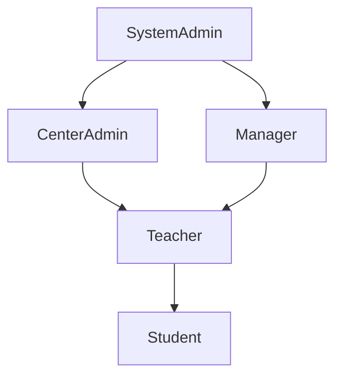

```markdown
# Phase 2 RBAC Matrix Documentation

<!-- [ARC-001] [ARC-002] [ARC-003] [ARC-004] [ARC-005] [DOC-001] -->

## RBAC Matrix

| Role | Scope | CRUD Permissions | Special Permissions | Allowed Endpoints |
|------|-------|------------------|---------------------|-------------------|
| **SystemAdmin** | Toàn bộ hệ thống (global) | Tất cả CRUD trên Users, Centers, Courses, Enrollments, Attendance, StudentCards, Notifications, Promotions, Announcements, SystemSettings, AuditLogs | Gán/huỷ gán CenterAdmin, thay đổi role, truy cập audit log, quản lý settings, super‑user | `GET /api/v1/users/*` (200), `POST /api/v1/users/register` (201), `PUT /api/v1/users/{id}/role` (200), `GET /api/v1/centers` (200), `POST /api/v1/centers` (201), `PUT /api/v1/centers/{id}` (200), `DELETE /api/v1/centers/{id}` (204), `GET /api/v1/courses` (200), `POST /api/v1/courses` (201), `PUT /api/v1/courses/{id}` (200), `DELETE /api/v1/courses/{id}` (204), `GET /api/v1/enrollments` (200), `POST /api/v1/enrollments` (201), `PUT /api/v1/enrollments/{id}` (200), `DELETE /api/v1/enrollments/{id}` (204), `GET /api/v1/attendance/*` (200), `POST /api/v1/attendance/scan` (201), `GET /api/v1/students/{id}/card` (200), `POST /api/v1/students/{id}/card/renew` (200), `GET /api/v1/notifications/dispatch` (202), `POST /api/v1/notifications/dispatch` (202), `GET /api/v1/promotions` (200), `POST /api/v1/promotions` (201), `PUT /api/v1/promotions/{id}` (200), `DELETE /api/v1/promotions/{id}` (204), `GET /api/v1/announcements` (200), `POST /api/v1/announcements` (201), `PUT /api/v1/announcements/{id}` (200), `DELETE /api/v1/announcements/{id}` (204), `GET /api/v1/reports/attendance` (200), `GET /api/v1/dashboard/enrollment-summary` (200) |
| **CenterAdmin** | Chỉ các trung tâm được gán (`center_id`) | CRUD trên Centers (riêng trung tâm của mình), Users (chỉ user thuộc center), Courses (thuộc center), Enrollments, Attendance, StudentCards, Notifications, Promotions, Announcements (trong phạm vi center) | Không thể gán/huỷ gán CenterAdmin cho trung tâm khác, chỉ có thể gán role Teacher/Student cho user thuộc center | `GET /api/v1/centers/{id}` (200), `PUT /api/v1/centers/{id}` (200), `DELETE /api/v1/centers/{id}` (204), `GET /api/v1/users?centerId={id}` (200), `PUT /api/v1/users/{id}/role` (200) nếu role trong center, `GET /api/v1/courses?centerId={id}` (200), `POST /api/v1/courses` (201) (center được chỉ định), `PUT /api/v1/courses/{id}` (200), `DELETE /api/v1/courses/{id}` (204), `GET /api/v1/enrollments?course.centerId={id}` (200), `POST /api/v1/enrollments` (201), `GET /api/v1/attendance?course.centerId={id}` (200), `POST /api/v1/attendance/scan` (201), `GET /api/v1/students/{id}/card` (200), `POST /api/v1/students/{id}/card/renew` (200), `GET /api/v1/notifications/dispatch` (202), `POST /api/v1/notifications/dispatch` (202), `GET /api/v1/promotions?centerId={id}` (200), `POST /api/v1/promotions` (201), `PUT /api/v1/promotions/{id}` (200), `DELETE /api/v1/promotions/{id}` (204), `GET /api/v1/announcements?centerId={id}` (200), `POST /api/v1/announcements` (201), `PUT /api/v1/announcements/{id}` (200), `DELETE /api/v1/announcements/{id}` (204) |
| **Manager** | Một trung tâm cụ thể (assigned center) | CRUD trên Courses, Enrollments, Attendance, StudentCards, Notifications, Promotions, Announcements (trong phạm vi center) | Không thể tạo/xóa Centers, không thể gán/huỷ gán CenterAdmin, chỉ có thể quản lý khóa học và sinh viên trong center | `GET /api/v1/courses?centerId={id}` (200), `POST /api/v1/courses` (201), `PUT /api/v1/courses/{id}` (200), `DELETE /api/v1/courses/{id}` (204), `GET /api/v1/enrollments?course.centerId={id}` (200), `POST /api/v1/enrollments` (201), `GET /api/v1/attendance?course.centerId={id}` (200), `POST /api/v1/attendance/scan` (201), `GET /api/v1/students/{id}/card` (200), `POST /api/v1/students/{id}/card/renew` (200), `GET /api/v1/notifications/dispatch` (202), `POST /api/v1/notifications/dispatch` (202), `GET /api/v1/promotions?centerId={id}` (200), `POST /api/v1/promotions` (201), `PUT /api/v1/promotions/{id}` (200), `DELETE /api/v1/promotions/{id}` (204), `GET /api/v1/announcements?centerId={id}` (200), `POST /api/v1/announcements` (201), `PUT /api/v1/announcements/{id}` (200), `DELETE /api/v1/announcements/{id}` (204) |
| **Teacher** | Một khóa học cụ thể (assigned course) | CRUD trên Courses (chỉ course được gán), Enrollments (chỉ enrollment trong course), Attendance (chỉ điểm danh cho course) | Không thể tạo/xóa khóa học, không thể gán/huỷ gán giáo viên, chỉ có thể xem và ghi nhận điểm danh cho khóa học được giao | `GET /api/v1/courses/{id}` (200) (course được gán), `PUT /api/v1/courses/{id}` (200) (chỉ cập nhật thông tin cơ bản), `GET /api/v1/enrollments?courseId={id}` (200), `POST /api/v1/enrollments` (201) (nếu được phép), `GET /api/v1/attendance?courseId={id}` (200), `POST /api/v1/attendance/scan` (201) (chỉ cho học viên trong course) |
| **Student** | Toàn bộ hệ thống (read‑only + mutation cho chính mình) | CRUD trên Students (profile), Enrollments (đăng ký khóa học), Attendance (xem lịch sử điểm danh), StudentCards (xem/thêm), Notifications (đọc/gửi), Promotions (áp dụng), Announcements (đọc) | Không thể tạo/xóa khóa học, không thể gán/huỷ gán CenterAdmin, chỉ có thể thao tác trên dữ liệu cá nhân và đăng ký khóa học | `GET /api/v1/users/{id}` (200) (profile), `PUT /api/v1/users/{id}` (200) (profile update), `GET /api/v1/students/courses/available` (200), `POST /api/v1/enrollments` (201), `GET /api/v1/attendance` (200) (lịch sử), `GET /api/v1/students/{id}/card` (200), `POST /api/v1/students/{id}/card/renew` (200), `GET /api/v1/notifications/dispatch` (202), `POST /api/v1/notifications/dispatch` (202), `GET /api/v1/promotions` (200), `POST /api/v1/promotions` (201) (áp dụng), `GET /api/v1/announcements` (200) |

## Role Inheritance Flowchart



## Traceability Matrix Reference

| Document Section | Referenced Tag IDs |
|------------------|--------------------|
| RBAC Matrix Table | [ARC-001], [ARC-002], [ARC-003], [ARC-004], [ARC-005] |
| Role Inheritance Flowchart | [ARC-001], [ARC-002], [ARC-003], [ARC-004], [ARC-005] |
| Overall Document | [DOC-001] |

<!-- End of Phase 2 RBAC Matrix Documentation -->
```