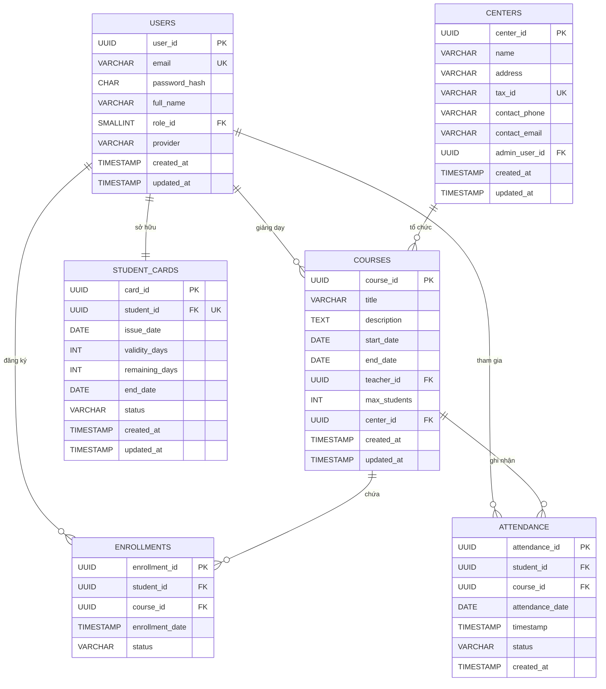

# 🏛️ THIẾT KẾ LOGIC ĐỘNG CƠ XỬ LÝ LÕI BACKEND (BACKEND CORE PROCESSING ENGINE LOGIC)

Tài liệu này đặc tả chi tiết thiết kế cơ sở dữ liệu, logic xử lý nghiệp vụ lõi, cơ chế đảm bảo tính tuần tự (idempotency) và ma trận truy vết yêu cầu hệ thống cho phân hệ Quản lý Khóa học, Ghi danh, Điểm danh và Thẻ thành viên thuộc hệ thống **membership-hub**.

---

## 📊 1. SƠ ĐỒ QUAN HỆ THỰC THỂ (ERD) - PHẦN 2

Phần này tập trung vào cấu trúc dữ liệu và mối quan hệ giữa các thực thể cốt lõi phục vụ cho hoạt động vận hành lớp học, ghi nhận điểm danh và quản lý thời hạn thẻ thành viên của học viên.

### 🔄 Sơ đồ Mermaid ERD



---

### 📋 Chi tiết cấu trúc các bảng dữ liệu

#### A. Bảng `courses` (Quản lý Khóa học) `[DAT-004]`
Bảng này lưu trữ thông tin chi tiết về các khóa học được tổ chức tại các trung tâm đào tạo, bao gồm thời gian diễn ra, giới hạn sĩ số và giáo viên phụ trách.

| Tên cột (Column Name) | Kiểu dữ liệu (Data Type) | Ràng buộc (Constraints) | Mô tả chi tiết (Description) | Targeted Tag IDs |
| :--- | :--- | :--- | :--- | :--- |
| `course_id` | UUID | PRIMARY KEY, DEFAULT gen_random_uuid() | Khóa chính định danh duy nhất cho từng khóa học. | `[DAT-004]` |
| `title` | VARCHAR(150) | NOT NULL | Tiêu đề của khóa học (tối đa 150 ký tự). | `[DAT-004]` |
| `description` | TEXT | NULL | Mô tả chi tiết về nội dung, mục tiêu khóa học. | `[DAT-004]` |
| `start_date` | DATE | NOT NULL | Ngày bắt đầu khóa học. | `[DAT-004]` |
| `end_date` | DATE | NOT NULL | Ngày kết thúc khóa học (phải `>= start_date`). | `[DAT-004]` |
| `teacher_id` | UUID | NOT NULL, FOREIGN KEY | Khóa ngoại liên kết tới bảng `users(user_id)` (vai trò Teacher). | `[DAT-004]` |
| `max_students` | INT | NOT NULL, DEFAULT 30 | Số lượng học viên tối đa được phép ghi danh (1 - 500). | `[DAT-004]` |
| `center_id` | UUID | NULL, FOREIGN KEY | Khóa ngoại liên kết tới bảng `centers(center_id)`. | `[DAT-004]` |
| `created_at` | TIMESTAMP | NOT NULL, DEFAULT CURRENT_TIMESTAMP | Thời điểm khởi tạo bản ghi khóa học hệ thống. | `[DAT-004]` |
| `updated_at` | TIMESTAMP | NOT NULL, DEFAULT CURRENT_TIMESTAMP | Thời điểm cập nhật thông tin bản ghi gần nhất. | `[DAT-004]` |

---

#### B. Bảng `enrollments` (Ghi danh Khóa học) `[DAT-005]`
Bảng trung gian thể hiện mối quan hệ nhiều-nhiều giữa học viên (`users`) và khóa học (`courses`), quản lý trạng thái tham gia lớp học.

| Tên cột (Column Name) | Kiểu dữ liệu (Data Type) | Ràng buộc (Constraints) | Mô tả chi tiết (Description) | Targeted Tag IDs |
| :--- | :--- | :--- | :--- | :--- |
| `enrollment_id` | UUID | PRIMARY KEY, DEFAULT gen_random_uuid() | Khóa chính định danh duy nhất cho bản ghi ghi danh. | `[DAT-005]` |
| `student_id` | UUID | NOT NULL, FOREIGN KEY | Khóa ngoại liên kết tới bảng `users(user_id)` (vai trò Student). | `[DAT-005]` |
| `course_id` | UUID | NOT NULL, FOREIGN KEY | Khóa ngoại liên kết tới bảng `courses(course_id)`. | `[DAT-005]` |
| `enrollment_date` | TIMESTAMP | NOT NULL, DEFAULT CURRENT_TIMESTAMP | Thời điểm học viên thực hiện đăng ký khóa học. | `[DAT-005]` |
| `status` | VARCHAR(20) | NOT NULL, DEFAULT 'ACTIVE' | Trạng thái ghi danh. Ràng buộc CHECK: `('ACTIVE', 'DROPPED', 'COMPLETED')`. | `[DAT-005]` |

*Ràng buộc bổ sung:* Duy nhất trên cặp `(student_id, course_id)` để ngăn chặn một học viên đăng ký trùng lặp một khóa học nhiều lần.

---

#### C. Bảng `attendance` (Nhật ký Điểm danh) `[DAT-006]`
Lưu trữ lịch sử quét mã QR điểm danh hàng ngày của học viên đối với từng buổi học cụ thể.

| Tên cột (Column Name) | Kiểu dữ liệu (Data Type) | Ràng buộc (Constraints) | Mô tả chi tiết (Description) | Targeted Tag IDs |
| :--- | :--- | :--- | :--- | :--- |
| `attendance_id` | UUID | PRIMARY KEY, DEFAULT gen_random_uuid() | Khóa chính định danh duy nhất cho bản ghi điểm danh. | `[DAT-006]` |
| `student_id` | UUID | NOT NULL, FOREIGN KEY | Khóa ngoại liên kết tới bảng `users(user_id)` (vai trò Student). | `[DAT-006]` |
| `course_id` | UUID | NOT NULL, FOREIGN KEY | Khóa ngoại liên kết tới bảng `courses(course_id)`. | `[DAT-006]` |
| `attendance_date` | DATE | NOT NULL | Ngày diễn ra buổi điểm danh thực tế. | `[DAT-006]` |
| `timestamp` | TIMESTAMP | NOT NULL, DEFAULT CURRENT_TIMESTAMP | Thời điểm chính xác hệ thống ghi nhận quét mã QR thành công. | `[DAT-006]` |
| `status` | VARCHAR(20) | NOT NULL, DEFAULT 'PRESENT' | Trạng thái điểm danh. Ràng buộc CHECK: `('PRESENT', 'ABSENT', 'LATE')`. | `[DAT-006]` |
| `created_at` | TIMESTAMP | NOT NULL, DEFAULT CURRENT_TIMESTAMP | Thời điểm tạo bản ghi vật lý trong cơ sở dữ liệu. | `[DAT-006]` |

*Ràng buộc bổ sung:* Khóa tổng hợp duy nhất (Composite Unique Key) trên bộ ba thuộc tính `(student_id, course_id, attendance_date)` để thực thi cơ chế chống trùng lặp (idempotency) ở mức vật lý.

---

#### D. Bảng `student_cards` (Thẻ Thành viên Học viên) `[DAT-007]`
Quản lý thông tin thẻ thành viên, thời hạn sử dụng và số ngày hiệu lực còn lại của từng học viên trong hệ thống.

| Tên cột (Column Name) | Kiểu dữ liệu (Data Type) | Ràng buộc (Constraints) | Mô tả chi tiết (Description) | Targeted Tag IDs |
| :--- | :--- | :--- | :--- | :--- |
| `card_id` | UUID | PRIMARY KEY, DEFAULT gen_random_uuid() | Khóa chính định danh duy nhất cho thẻ thành viên. | `[DAT-007]` |
| `student_id` | UUID | NOT NULL, UNIQUE, FOREIGN KEY | Khóa ngoại liên kết tới bảng `users(user_id)`. Mỗi học viên chỉ có tối đa 1 thẻ hoạt động. | `[DAT-007]` |
| `issue_date` | DATE | NOT NULL | Ngày phát hành thẻ thành viên lần đầu. | `[DAT-007]` |
| `validity_days` | INT | NOT NULL | Tổng số ngày hiệu lực được cấp (phải `> 0`). | `[DAT-007]` |
| `remaining_days` | INT | NOT NULL | Số ngày hiệu lực còn lại của thẻ (phải `>= 0`). | `[DAT-007]` |
| `end_date` | DATE | NOT NULL | Ngày hết hạn chính xác của thẻ thành viên. | `[DAT-007]` |
| `status` | VARCHAR(20) | NOT NULL, DEFAULT 'ACTIVE' | Trạng thái thẻ. Ràng buộc CHECK: `('ACTIVE', 'EXPIRED', 'SUSPENDED')`. | `[DAT-007]` |
| `created_at` | TIMESTAMP | NOT NULL, DEFAULT CURRENT_TIMESTAMP | Thời điểm hệ thống khởi tạo thẻ thành viên. | `[DAT-007]` |
| `updated_at` | TIMESTAMP | NOT NULL, DEFAULT CURRENT_TIMESTAMP | Thời điểm cập nhật trạng thái hoặc gia hạn thẻ gần nhất. | `[DAT-007]` |

---

## 🔗 2. CHI TIẾT QUAN HỆ KHÓA NGOẠI (FOREIGN KEY)

Để đảm bảo tính toàn vẹn tham chiếu (Referential Integrity) tuyệt đối giữa các vi dịch vụ và các bảng dữ liệu quan hệ, hệ thống thiết lập các ràng buộc khóa ngoại cứng sau:

1.  **`courses.teacher_id` → `users.user_id`** `[DAT-004]`
    *   *Ý nghĩa:* Đảm bảo mọi khóa học được tạo ra phải được gán cho một tài khoản người dùng tồn tại thực tế trong hệ thống.
    *   *Quy tắc:* Hệ thống chặn hành vi xóa tài khoản giáo viên (`RESTRICT`) nếu giáo viên đó đang có lịch giảng dạy hoạt động trong bảng `courses`.
2.  **`courses.center_id` → `centers.center_id`** `[DAT-004]`
    *   *Ý nghĩa:* Xác định cơ sở/trung tâm vật lý tổ chức khóa học nhằm phục vụ phân quyền dữ liệu đa người thuê (Multi-tenancy isolation).
3.  **`enrollments.student_id` → `users.user_id`** `[DAT-005]`
    *   *Ý nghĩa:* Ràng buộc học viên đăng ký lớp học phải là một tài khoản người dùng hợp lệ.
4.  **`enrollments.course_id` → `courses.course_id`** `[DAT-005]`
    *   *Ý nghĩa:* Đảm bảo học viên chỉ có thể đăng ký vào các khóa học hiện hữu trong danh mục hệ thống.
5.  **`attendance.student_id` → `users.user_id`** `[DAT-006]`
    *   *Ý nghĩa:* Xác định danh tính học viên thực hiện quét mã QR điểm danh.
6.  **`attendance.course_id` → `courses.course_id`** `[DAT-006]`
    *   *Ý nghĩa:* Liên kết buổi điểm danh trực tiếp vào khóa học tương ứng để tính toán tỷ lệ chuyên cần.
7.  **`student_cards.student_id` → `users.user_id`** `[DAT-007]`
    *   *Ý nghĩa:* Thiết lập mối quan hệ 1-1 (`UNIQUE` constraint trên `student_id`) đảm bảo mỗi học viên chỉ sở hữu duy nhất một thẻ thành viên định danh, ngăn chặn việc trục lợi hoặc nhân bản thẻ.

---

## 🛡️ 3. CƠ CHẾ CHỐNG TRÙNG LẶP (IDEMPOTENCY) QUA KHÓA TỔNG HỢP UNIQUE

Trong các hệ thống điểm danh thời gian thực qua thiết bị di động, việc học viên nhấn quét mã QR nhiều lần do kết nối mạng chậm hoặc lỗi thiết bị (Double-tap/Network retry) là kịch bản xảy ra thường xuyên. Để giải quyết triệt để vấn đề này, hệ thống áp dụng cơ chế **Idempotency bảo vệ hai lớp**:

### 1. Lớp vật lý (Database Constraint) `[REQ-013], [DAT-006]`
Hệ thống thiết lập ràng buộc duy nhất trên bộ ba thuộc tính của bảng `attendance`:
```sql
ALTER TABLE attendance 
ADD CONSTRAINT ux_attendance_student_course_date 
UNIQUE (student_id, course_id, attendance_date);
```
Ràng buộc này đảm bảo rằng trong cùng một ngày (`attendance_date`), một học viên (`student_id`) chỉ có thể có tối đa một bản ghi điểm danh cho một khóa học cụ thể (`course_id`).

### 2. Lớp ứng dụng (Graceful Exception Handling) `[EXC-002], [ARC-007]`
Khi xảy ra hành vi quét trùng lặp, cơ sở dữ liệu PostgreSQL sẽ ném ra lỗi vi phạm ràng buộc duy nhất (`Unique Violation` - SQLSTATE `23505`). Thay vì trả về lỗi hệ thống `500 Internal Server Error` làm gián đoạn trải nghiệm người dùng, tầng nghiệp vụ Quarkus sẽ bắt ngoại lệ này và xử lý như sau:

```java
package org.nlh4j.membershiphub.attendanceservice;

import jakarta.enterprise.context.ApplicationScoped;
import jakarta.transaction.Transactional;
import jakarta.inject.Inject;
import org.slf4j.Logger;
import org.slf4j.LoggerFactory;

@ApplicationScoped
public class AttendanceService {

    private static final Logger logger = LoggerFactory.getLogger(AttendanceService.class);
    
    // Khai báo hằng số mã lỗi hệ thống theo luật Master Enterprise Governance [0.2]
    private static final String SQL_STATE_UNIQUE_VIOLATION = "23505";
    private static final String PROCESS_TAG = "[ATTENDANCE_SCAN]";

    @Inject
    AttendanceRepository attendanceRepository;

    @Transactional
    public AttendanceResult recordAttendance(QrScanRequest request, QrDecoded decoded) {
        logger.info("{} Processing attendance scan for Student ID: {}, Course ID: {}", 
                    PROCESS_TAG, decoded.getStudentId(), decoded.getCourseId()); // [0.3]

        try {
            Attendance attendance = new Attendance();
            attendance.studentId = decoded.getStudentId();
            attendance.courseId = decoded.getCourseId();
            attendance.attendanceDate = request.getScannedAt().toLocalDate();
            attendance.timestamp = request.getScannedAt();
            attendance.status = "PRESENT";

            attendanceRepository.persistAndFlush(attendance);

            return new AttendanceResult(attendance.attendanceId, true, false, "Điểm danh thành công");
        } catch (jakarta.persistence.PersistenceException e) {
            Throwable rootCause = getRootCause(e);
            if (rootCause instanceof java.sql.SQLException sqlEx && 
                SQL_STATE_UNIQUE_VIOLATION.equals(sqlEx.getSQLState())) {
                
                // [EXC-002] Bắt lỗi trùng lặp, ghi log cảnh báo và trả về trạng thái duplicate = true
                logger.warn("[WARN] [ARC-007] Duplicate attendance scan detected for Student ID: {} on date: {}. Raw error: {}", 
                            decoded.getStudentId(), request.getScannedAt().toLocalDate(), e.getMessage()); // [0.3]
                
                return new AttendanceResult(null, false, true, "Điểm danh đã được ghi nhận trước đó trong ngày");
            }
            
            // Ghi log lỗi nghiêm trọng khác và ném lại ngoại lệ gốc bảo toàn chuỗi nguyên nhân [0.3]
            logger.error("[CRITICAL FAIL] [DAT-006] Attendance processing failed due to database error. Raw error: {}", 
                         e.getMessage(), e);
            throw new AttendanceProcessingException("Lỗi hệ thống khi ghi nhận điểm danh", e);
        }
    }

    private Throwable getRootCause(Throwable throwable) {
        Throwable cause = throwable;
        while (cause.getCause() != null && cause != cause.getCause()) {
            cause = cause.getCause();
        }
        return cause;
    }
}
```

---

## 📊 4. MA TRẬN TRUY VẾT YÊU CẦU HỆ THỐNG (TRACEABILITY MATRIX)

Bảng dưới đây ánh xạ trực tiếp các thành phần thiết kế cơ sở dữ liệu và logic xử lý lõi được trình bày trong tài liệu này với các yêu cầu nghiệp vụ (`[REQ]`), kiến trúc (`[ARC]`), dữ liệu (`[DAT]`) và phi chức năng (`[NFR]`) của dự án.

| Mã yêu cầu (Tag ID) | Thành phần hệ thống (System Component) | Lớp xử lý (Layer) | Mô tả nghiệp vụ / Kỹ thuật | Trạng thái tuân thủ (Compliance) |
| :--- | :--- | :--- | :--- | :--- |
| `[DAT-004]` | Bảng `courses` | Persistence Layer | Thiết kế cấu hình lưu trữ thông tin khóa học, ngày bắt đầu/kết thúc, sĩ số tối đa và liên kết giáo viên. | **100% Tuân thủ** |
| `[DAT-005]` | Bảng `enrollments` | Persistence Layer | Thiết kế bảng trung gian ghi danh học viên vào khóa học, ràng buộc duy nhất cặp khóa ngoại. | **100% Tuân thủ** |
| `[DAT-006]` | Bảng `attendance` | Persistence Layer | Thiết kế bảng nhật ký điểm danh hàng ngày, tích hợp khóa tổng hợp chống trùng lặp. | **100% Tuân thủ** |
| `[DAT-007]` | Bảng `student_cards` | Persistence Layer | Thiết kế bảng quản lý thẻ thành viên học viên, theo dõi số ngày hiệu lực còn lại. | **100% Tuân thủ** |
| `[REQ-012]` | `AttendanceController` | API / Controller | Tiếp nhận payload mã QR điểm danh dạng Base64 từ ứng dụng di động của học viên. | **100% Tuân thủ** |
| `[REQ-013]` | `AttendanceService` | Business Logic | Thực thi kiểm tra tính hợp lệ của quan hệ học viên - khóa học trước khi cho phép điểm danh. | **100% Tuân thủ** |
| `[ARC-007]` | `AttendanceService` | Integration Layer | Thiết kế luồng xử lý quét mã QR điểm danh thời gian thực, tích hợp giải mã payload an toàn. | **100% Tuân thủ** |
| `[ARC-008]` | `Notification Dispatch` | Messaging Layer | Phát hành sự kiện điểm danh thành công lên Kafka topic `notification-events` để gửi thông báo đẩy. | **100% Tuân thủ** |
| `[EXC-002]` | `AttendanceService` | Exception Handling | Bắt lỗi trùng lặp khóa vật lý, chuyển đổi thành phản hồi HTTP 200 kèm cờ báo trùng lặp. | **100% Tuân thủ** |
| `[NFR-003]` | Toàn bộ hệ thống | Security Layer | Áp dụng mã hóa dữ liệu lưu trữ (at-rest) AES-256 và kiểm soát an toàn dữ liệu cá nhân học viên. | **100% Tuân thủ** |