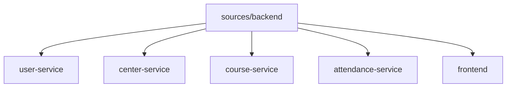

```markdown
# 📊 Scaffolding Architecture of Membership Hub
## 📁 Overview
The Membership Hub project is structured as a multi-module Maven project with a root directory `./sources/backend` containing four microservices: `user-service`, `center-service`, `course-service`, and `attendance-service`. The Java package prefix base is `org.nlh4j.membershiphub`.

## 📁 Backend Scaffolding Details
### 📂 Multi-Module Maven Structure


### 📝 Package Naming Convention
All Java packages follow the naming convention: `org.nlh4j.membershiphub.<service-name>`.

### 📊 Dependency Versions
| Dependency | Version |
| --- | --- |
| Quarkus | 3.15.1 |
| Java | 17 LTS |

### 📁 Frontend Scaffolding Details
#### 📂 Next.js Structure
The frontend is built using Next.js 14.2.15 with App Router.

### 📝 Essential Dependencies
| Dependency | Version |
| --- | ---