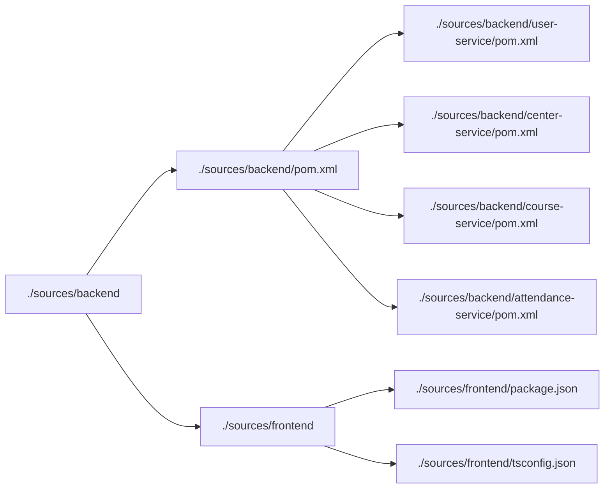

```markdown
# 🏛️ Scaffolding Architecture Documentation
## 📊 Overview
The Membership Hub project utilizes a multi-module Maven architecture, comprising a root `membership-hub-backend` project and four microservices: `user-service`, `center-service`, `course-service`, and `attendance-service`. This documentation outlines the scaffolding structure, package naming conventions, and technology stack.

## 📁 Directory Structure


## 📊 Package Naming Conventions
All Java packages adhere to the base prefix: `org.nlh4j.membershiphub`.

## 📁 Technology Stack
### Backend
- **Java Version:** 17 LTS
- **Quarkus Version:**