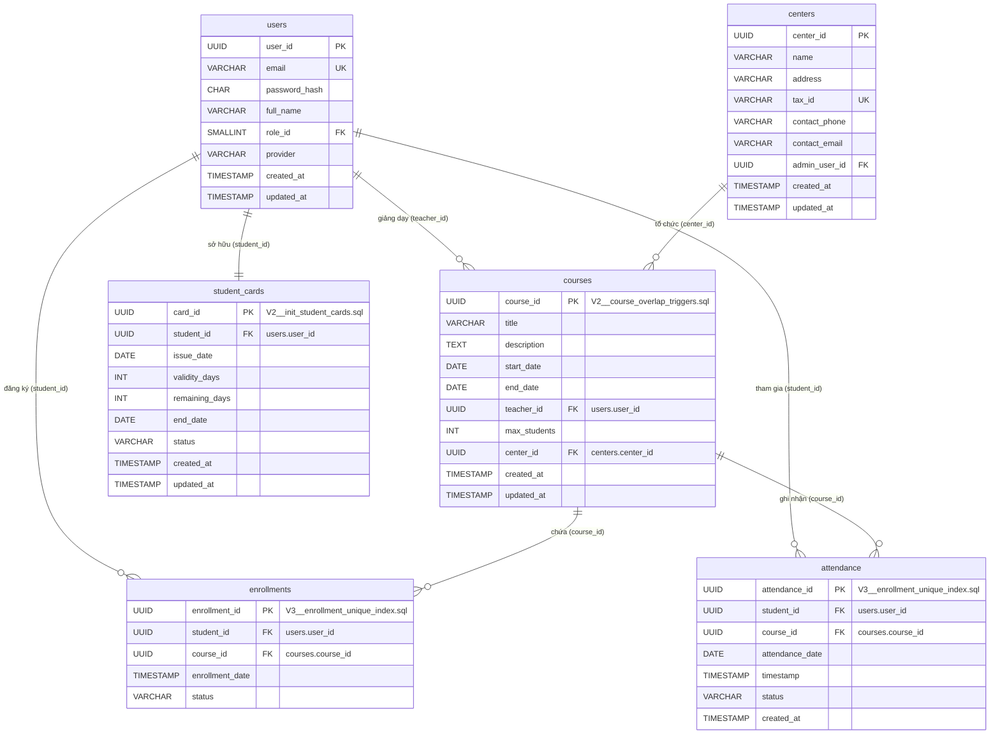
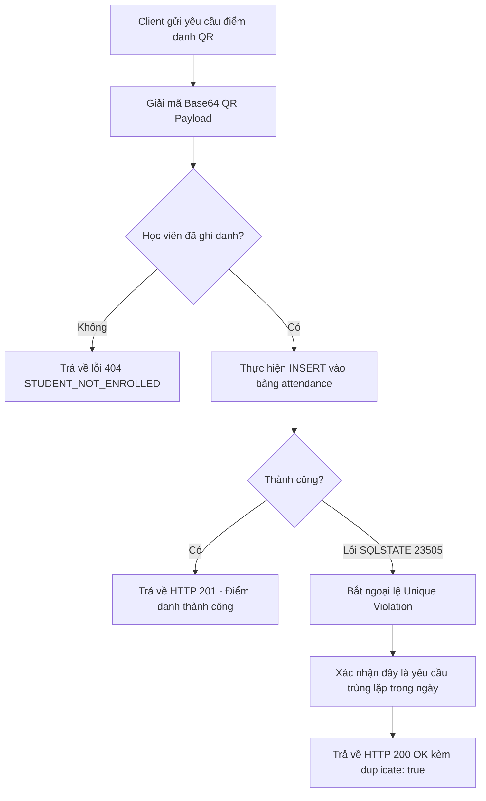

# SỔ TAY VẬN HÀNH DI TRÚ VÀ PHÂN PHIÊN BẢN CƠ SỞ DỮ LIỆU (DATABASE MIGRATION & VERSIONING RUNBOOK)

## 📑 THÔNG TIN KIỂM SOÁT TÀI LIỆU
* **Đường dẫn tài liệu mục tiêu:** `./sources/docs/database/DATABASE_MIGRATION_VERSIONING_RUNBOOK.md`
* **Mã bản thiết kế:** ARCH-20260829122721
* **Tiền tố Package Java áp dụng:** `org.nlh4j.membershiphub`
* **Phiên bản:** 1.0 (Đường cơ sở)
* **Trạng thái:** Đã phê duyệt kỹ thuật

---

## 📊 1. MA TRẬN TRUY XUẤT NGUỒN GỐC (TRACEABILITY MATRIX REFERENCE)

Dưới đây là bảng ánh xạ chi tiết giữa các yêu cầu nghiệp vụ, thiết kế hệ thống và các thực thể cơ sở dữ liệu được triển khai trong Giai đoạn 3 (Ngày 3):

| Mã Thẻ (Tag ID) | Loại Yêu Cầu | Thành Phần Hệ Thống | Thực Thể / Bảng Cơ Sở Dữ Liệu | Mục Tiêu Kỹ Thuật & Ràng Buộc |
| :--- | :--- | :--- | :--- | :--- |
| **`[DAT-004]`** | Dữ liệu (Data) | `course-service` | `courses` | Lưu trữ thông tin khóa học, ràng buộc ngày bắt đầu/kết thúc, liên kết giáo viên và trung tâm. |
| **`[DAT-005]`** | Dữ liệu (Data) | `attendance-service` | `enrollments` | Quản lý trạng thái ghi danh của học viên vào khóa học, ngăn chặn đăng ký trùng lặp. |
| **`[DAT-006]`** | Dữ liệu (Data) | `attendance-service` | `attendance` | Ghi nhận lịch sử điểm danh, thực thi cơ chế chống trùng lặp (Idempotency) cấp cơ sở dữ liệu. |
| **`[DAT-007]`** | Dữ liệu (Data) | `user-service` | `student_cards` | Quản lý vòng đời thẻ thành viên, số ngày hiệu lực và số ngày còn lại của học viên. |
| **`[REQ-012]`** | Chức năng (Functional) | `attendance-service` | `attendance` | Quét mã QR điểm danh (giải mã Base64 chứa `student_id` và `course_id`). |
| **`[REQ-013]`** | Chức năng (Functional) | `attendance-service` | `attendance` | Đảm bảo tính Idempotency cho việc quét QR điểm danh bằng khóa tổng hợp duy nhất. |
| **`[ARC-007]`** | Kiến trúc (Architecture) | API Gateway / Service | `attendance` | Thiết kế luồng xử lý điểm danh QR đồng bộ và bất đồng bộ qua Outbox Pattern. |
| **`[EXC-002]`** | Ngoại lệ (Exception) | Exception Handler | `attendance` | Xử lý lỗi trùng lặp điểm danh trong ngày, trả về mã trạng thái HTTP 200 kèm cờ `duplicate: true`. |

---

## 🗺️ 2. SƠ ĐỒ QUAN HỆ THỰC THỂ - PHẦN 2 (ENTITY RELATIONSHIP DIAGRAM - PART 2)

Dưới đây là sơ đồ quan hệ thực thể (ERD) mô tả mối liên kết chặt chẽ giữa các bảng cốt lõi của phân hệ Khóa học, Ghi danh, Điểm danh và Thẻ thành viên. Sơ đồ này kế thừa các thực thể `users` và `centers` từ Giai đoạn 2.



---

## 🗂️ 3. CHI TIẾT CẤU TRÚC BẢNG (TABLE SCHEMAS)

### 3.1. Bảng `courses` `[DAT-004]`
Bảng này lưu trữ thông tin chi tiết về các khóa học được tổ chức tại các trung tâm đào tạo, bao gồm thời gian diễn ra, giới hạn số lượng học viên và giáo viên phụ trách.

| Tên cột | Kiểu dữ liệu | Ràng buộc | Mô tả |
| :--- | :--- | :--- | :--- |
| `course_id` | `UUID` | `PRIMARY KEY`, `DEFAULT gen_random_uuid()` | Định danh duy nhất của khóa học. |
| `title` | `VARCHAR(150)` | `NOT NULL` | Tiêu đề khóa học (Tối đa 150 ký tự). |
| `description` | `TEXT` | `NULL` | Mô tả chi tiết nội dung khóa học. |
| `start_date` | `DATE` | `NOT NULL` | Ngày bắt đầu khóa học. |
| `end_date` | `DATE` | `NOT NULL` | Ngày kết thúc khóa học (Phải `>= start_date`). |
| `teacher_id` | `UUID` | `NOT NULL`, `FOREIGN KEY` | Liên kết tới `users.user_id` (Vai trò giáo viên). |
| `max_students` | `INT` | `NOT NULL`, `DEFAULT 30` | Số lượng học viên tối đa cho phép đăng ký. |
| `center_id` | `UUID` | `NOT NULL`, `FOREIGN KEY` | Liên kết tới `centers.center_id` nơi tổ chức khóa học. |
| `created_at` | `TIMESTAMP` | `NOT NULL`, `DEFAULT CURRENT_TIMESTAMP` | Thời điểm tạo bản ghi. |
| `updated_at` | `TIMESTAMP` | `NOT NULL`, `DEFAULT CURRENT_TIMESTAMP` | Thời điểm cập nhật bản ghi gần nhất. |

* **Chỉ mục (Indexes):**
  * `idx_courses_teacher_id` ON `courses(teacher_id)`: Tối ưu hóa truy vấn lịch dạy của giáo viên.
  * `idx_courses_center_id` ON `courses(center_id)`: Tối ưu hóa lọc khóa học theo trung tâm.
  * `idx_courses_dates` ON `courses(start_date, end_date)`: Tối ưu hóa tìm kiếm khóa học theo khoảng thời gian.
  * `ux_courses_teacher_dates` UNIQUE ON `courses(teacher_id, start_date, end_date)`: Ngăn chặn gán lịch trùng lặp cho giáo viên ở mức vật lý.

---

### 3.2. Bảng `enrollments` `[DAT-005]`
Bảng trung gian quản lý việc đăng ký khóa học của học viên. Đảm bảo mỗi học viên chỉ có một trạng thái ghi danh duy nhất trên một khóa học.

| Tên cột | Kiểu dữ liệu | Ràng buộc | Mô tả |
| :--- | :--- | :--- | :--- |
| `enrollment_id` | `UUID` | `PRIMARY KEY`, `DEFAULT gen_random_uuid()` | Định danh duy nhất của lượt ghi danh. |
| `student_id` | `UUID` | `NOT NULL`, `FOREIGN KEY` | Liên kết tới `users.user_id` (Vai trò học viên). |
| `course_id` | `UUID` | `NOT NULL`, `FOREIGN KEY` | Liên kết tới `courses.course_id`. |
| `enrollment_date`| `TIMESTAMP` | `NOT NULL`, `DEFAULT CURRENT_TIMESTAMP` | Thời điểm học viên đăng ký khóa học. |
| `status` | `VARCHAR(20)` | `NOT NULL`, `DEFAULT 'ACTIVE'` | Trạng thái ghi danh. Giá trị cho phép: `ACTIVE`, `DROPPED`, `COMPLETED`. |

* **Chỉ mục (Indexes):**
  * `idx_enrollments_student_id` ON `enrollments(student_id)`: Tối ưu hóa truy vấn danh sách khóa học đã đăng ký của học viên.
  * `idx_enrollments_course_id` ON `enrollments(course_id)`: Tối ưu hóa truy vấn danh sách học viên của một khóa học.
  * `idx_enrollments_status` ON `enrollments(status)`: Hỗ trợ lọc nhanh theo trạng thái ghi danh.
  * `ux_enrollments_student_course` UNIQUE ON `enrollments(student_id, course_id)`: Ràng buộc duy nhất ngăn chặn học viên đăng ký trùng lặp một khóa học.

---

### 3.3. Bảng `attendance` `[DAT-006]`
Bảng lưu trữ dữ liệu điểm danh hàng ngày của học viên khi tham gia các buổi học. Tích hợp cơ chế chống trùng lặp nghiêm ngặt.

| Tên cột | Kiểu dữ liệu | Ràng buộc | Mô tả |
| :--- | :--- | :--- | :--- |
| `attendance_id` | `UUID` | `PRIMARY KEY`, `DEFAULT gen_random_uuid()` | Định danh duy nhất của bản ghi điểm danh. |
| `student_id` | `UUID` | `NOT NULL`, `FOREIGN KEY` | Liên kết tới `users.user_id` (Học viên được điểm danh). |
| `course_id` | `UUID` | `NOT NULL`, `FOREIGN KEY` | Liên kết tới `courses.course_id` (Khóa học diễn ra buổi điểm danh). |
| `attendance_date`| `DATE` | `NOT NULL` | Ngày điểm danh (Không bao gồm giờ). |
| `timestamp` | `TIMESTAMP` | `NOT NULL`, `DEFAULT CURRENT_TIMESTAMP` | Thời gian quét mã QR thực tế. |
| `status` | `VARCHAR(20)` | `NOT NULL`, `DEFAULT 'PRESENT'` | Trạng thái điểm danh. Giá trị cho phép: `PRESENT`, `ABSENT`, `LATE`. |
| `created_at` | `TIMESTAMP` | `NOT NULL`, `DEFAULT CURRENT_TIMESTAMP` | Thời điểm ghi nhận vào hệ thống. |

* **Chỉ mục (Indexes):**
  * `idx_attendance_student_id` ON `attendance(student_id)`: Tối ưu hóa thống kê chuyên cần của học viên.
  * `idx_attendance_course_id` ON `attendance(course_id)`: Tối ưu hóa báo cáo điểm danh theo khóa học.
  * `idx_attendance_date` ON `attendance(attendance_date)`: Tối ưu hóa lọc dữ liệu điểm danh theo ngày.
  * `ux_attendance_student_course_date` UNIQUE ON `attendance(student_id, course_id, attendance_date)`: Khóa tổng hợp bảo vệ tính toàn vẹn dữ liệu, ngăn chặn điểm danh hai lần trong cùng một ngày cho một học viên trên một khóa học.

---

### 3.4. Bảng `student_cards` `[DAT-007]`
Bảng quản lý thông tin thẻ thành viên của học viên, kiểm soát thời hạn truy cập dịch vụ và số ngày còn lại được phép sử dụng.

| Tên cột | Kiểu dữ liệu | Ràng buộc | Mô tả |
| :--- | :--- | :--- | :--- |
| `card_id` | `UUID` | `PRIMARY KEY`, `DEFAULT gen_random_uuid()` | Định danh duy nhất của thẻ thành viên. |
| `student_id` | `UUID` | `NOT NULL`, `UNIQUE`, `FOREIGN KEY` | Liên kết tới `users.user_id` (Mỗi học viên chỉ sở hữu tối đa 1 thẻ). |
| `issue_date` | `DATE` | `NOT NULL` | Ngày phát hành thẻ. |
| `validity_days` | `INT` | `NOT NULL` | Tổng số ngày hiệu lực được cấp (Phải `> 0`). |
| `remaining_days`| `INT` | `NOT NULL` | Số ngày còn lại được phép sử dụng (Phải `>= 0`). |
| `end_date` | `DATE` | `NOT NULL` | Ngày hết hạn của thẻ (Tính toán tự động dựa trên `issue_date` + `validity_days`). |
| `status` | `VARCHAR(20)` | `NOT NULL`, `DEFAULT 'ACTIVE'` | Trạng thái hoạt động của thẻ. Giá trị cho phép: `ACTIVE`, `EXPIRED`, `SUSPENDED`. |
| `created_at` | `TIMESTAMP` | `NOT NULL`, `DEFAULT CURRENT_TIMESTAMP` | Thời điểm tạo thẻ. |
| `updated_at` | `TIMESTAMP` | `NOT NULL`, `DEFAULT CURRENT_TIMESTAMP` | Thời điểm cập nhật thông tin thẻ gần nhất. |

* **Chỉ mục (Indexes):**
  * `idx_student_cards_student_id` ON `student_cards(student_id)`: Tối ưu hóa truy vấn thông tin thẻ của học viên đang đăng nhập.
  * `idx_student_cards_status` ON `student_cards(status)`: Hỗ trợ quét tự động để chuyển trạng thái thẻ hết hạn.
  * `idx_student_cards_end_date` ON `student_cards(end_date)`: Tối ưu hóa các tác vụ kiểm tra thời hạn định kỳ.

---

## 🔗 4. MÔ TẢ QUAN HỆ KHÓA NGOẠI (FOREIGN KEY RELATIONSHIPS)

Để đảm bảo tính toàn vẹn tham chiếu tuyệt đối giữa các vi dịch vụ độc lập, các ràng buộc khóa ngoại vật lý được thiết lập chặt chẽ tại tầng cơ sở dữ liệu:

1. **`courses.teacher_id` → `users.user_id` `[DAT-004]`**
   * *Ý nghĩa nghiệp vụ:* Đảm bảo giáo viên được gán vào khóa học phải là một người dùng tồn tại thực tế trong hệ thống.
   * *Hành vi:* `ON DELETE RESTRICT` - Không cho phép xóa người dùng nếu họ đang là giáo viên chủ nhiệm của ít nhất một khóa học đang hoạt động.

2. **`courses.center_id` → `centers.center_id` `[DAT-004]`**
   * *Ý nghĩa nghiệp vụ:* Khóa học bắt buộc phải thuộc về một trung tâm đào tạo cụ thể để quản lý doanh thu và địa điểm.
   * *Hành vi:* `ON DELETE CASCADE` - Khi một trung tâm bị giải thể, toàn bộ khóa học thuộc trung tâm đó sẽ tự động bị xóa bỏ.

3. **`enrollments.student_id` → `users.user_id` `[DAT-005]`**
   * *Ý nghĩa nghiệp vụ:* Học viên đăng ký khóa học phải có tài khoản hợp lệ.
   * *Hành vi:* `ON DELETE RESTRICT` - Ngăn chặn xóa tài khoản học viên khi lịch sử ghi danh của họ vẫn tồn tại.

4. **`enrollments.course_id` → `courses.course_id` `[DAT-005]`**
   * *Ý nghĩa nghiệp vụ:* Học viên chỉ được ghi danh vào các khóa học đã được phê duyệt và tồn tại trong hệ thống.
   * *Hành vi:* `ON DELETE RESTRICT` - Không cho phép xóa khóa học nếu đã có học viên đăng ký tham gia.

5. **`attendance.student_id` → `users.user_id` `[DAT-006]`**
   * *Ý nghĩa nghiệp vụ:* Bản ghi điểm danh phải gắn liền với một học viên cụ thể để phục vụ báo cáo chuyên cần.
   * *Hành vi:* `ON DELETE RESTRICT` - Bảo vệ dữ liệu lịch sử điểm danh, không cho phép xóa học viên khi chưa xử lý dữ liệu điểm danh liên quan.

6. **`attendance.course_id` → `courses.course_id` `[DAT-006]`**
   * *Ý nghĩa nghiệp vụ:* Điểm danh phải thuộc về một buổi học nằm trong lộ trình của khóa học cụ thể.
   * *Hành vi:* `ON DELETE RESTRICT` - Ngăn chặn xóa khóa học khi đã phát sinh dữ liệu điểm danh thực tế.

7. **`student_cards.student_id` → `users.user_id` `[DAT-007]`**
   * *Ý nghĩa nghiệp vụ:* Thẻ thành viên là tài sản định danh cá nhân, liên kết trực tiếp 1-1 với học viên.
   * *Hành vi:* `ON DELETE CASCADE` - Khi tài khoản học viên bị xóa hoàn toàn khỏi hệ thống, thẻ thành viên tương ứng sẽ tự động bị hủy bỏ.

---

## 🛡️ 5. CƠ CHẾ IDEMPOTENCY & KHÓA TỔNG HỢP (COMPOSITE UNIQUE KEY GUARDRAILS)

### 5.1. Thách thức nghiệp vụ điểm danh QR `[REQ-012]`, `[ARC-007]`
Trong môi trường mạng di động không ổn định, học viên có thể nhấn nút quét QR nhiều lần liên tiếp hoặc thiết bị di động gửi lại yêu cầu (retry) do timeout từ API Gateway. Nếu không có cơ chế kiểm soát, hệ thống sẽ ghi nhận nhiều bản ghi điểm danh `PRESENT` cho cùng một học viên trong một ngày, làm sai lệch báo cáo chuyên cần và lãng phí tài nguyên lưu trữ.

### 5.2. Giải pháp Khóa tổng hợp vật lý `[REQ-013]`, `[DAT-006]`
Hệ thống thực thi cơ chế chống trùng lặp (Idempotency) triệt để bằng cách thiết lập ràng buộc duy nhất trên ba trường dữ liệu cốt lõi của bảng `attendance`:
```sql
CONSTRAINT ux_attendance_student_course_date UNIQUE (student_id, course_id, attendance_date)
```
* **`student_id`**: Xác định ai là người điểm danh.
* **`course_id`**: Xác định điểm danh cho lớp học nào.
* **`attendance_date`**: Xác định ngày điểm danh (Kiểu dữ liệu `DATE` loại bỏ hoàn toàn phần giờ, phút, giây để đảm bảo tính duy nhất trong ngày).

### 5.3. Luồng xử lý ngoại lệ tại tầng ứng dụng `[EXC-002]`
Khi xảy ra xung đột khóa tổng hợp tại tầng cơ sở dữ liệu, PostgreSQL sẽ ném ra mã lỗi SQLSTATE `23505` (Unique Violation). Tầng ứng dụng Quarkus (`attendance-service`) sẽ bắt ngoại lệ này và xử lý như sau:



* **Mẫu phản hồi JSON khi phát hiện trùng lặp (Idempotent Response):**
```json
{
  "recorded": false,
  "duplicate": true,
  "message": "Điểm danh đã được ghi nhận trước đó trong ngày",
  "timestamp": "2026-08-29T12:30:00Z"
}
```
Cơ chế này giúp hệ thống hoạt động ổn định, không bị crash luồng xử lý, đồng thời phản hồi nhanh chóng cho thiết bị di động của học viên mà không tạo ra dữ liệu rác.

---

## 🚀 6. KỊCH BẢN DI TRÚ FLYWAY (FLYWAY MIGRATION SCRIPTS)

Dưới đây là các tập lệnh di trú SQL chuẩn ANSI được lưu trữ trong mã nguồn của các vi dịch vụ tương ứng để tự động hóa việc khởi tạo cấu trúc bảng và các ràng buộc bảo vệ.

### 6.1. Tập lệnh di trú cho `course-service`
* **Đường dẫn tệp:** `./sources/backend/course-service/src/main/resources/db/migration/V2__course_overlap_triggers.sql`
* **Mục tiêu:** Khởi tạo bảng `courses` và thiết lập trigger ngăn chặn trùng lặp lịch dạy của giáo viên `[DAT-004]`, `[REQ-008]`.

```sql
-- =====================================================================
-- V2__course_overlap_triggers.sql
-- Khởi tạo cấu trúc bảng khóa học và trigger kiểm soát lịch trình giáo viên
-- Thẻ theo dõi: [DAT-004], [REQ-008]
-- =====================================================================

-- 1. Khởi tạo bảng courses nếu chưa tồn tại
CREATE TABLE IF NOT EXISTS courses (
    course_id UUID PRIMARY KEY DEFAULT gen_random_uuid(),
    title VARCHAR(150) NOT NULL,
    description TEXT,
    start_date DATE NOT NULL,
    end_date DATE NOT NULL,
    teacher_id UUID NOT NULL,
    max_students INT NOT NULL DEFAULT 30,
    center_id UUID NOT NULL,
    created_at TIMESTAMP NOT NULL DEFAULT CURRENT_TIMESTAMP,
    updated_at TIMESTAMP NOT NULL DEFAULT CURRENT_TIMESTAMP,
    CONSTRAINT chk_courses_dates CHECK (end_date >= start_date),
    CONSTRAINT chk_courses_title_len CHECK (char_length(title) <= 150)
);

-- 2. Tạo các chỉ mục tối ưu hóa hiệu năng truy vấn (NFR-001)
CREATE INDEX IF NOT EXISTS idx_courses_teacher_id ON courses(teacher_id);
CREATE INDEX IF NOT EXISTS idx_courses_center_id ON courses(center_id);
CREATE INDEX IF NOT EXISTS idx_courses_dates ON courses(start_date, end_date);

-- 3. Tạo chỉ mục duy nhất ngăn chặn gán lịch trùng lặp vật lý
CREATE UNIQUE INDEX IF NOT EXISTS ux_courses_teacher_dates ON courses (teacher_id, start_date, end_date);

-- 4. Định nghĩa hàm kiểm tra chồng lấn lịch trình của giáo viên
CREATE OR REPLACE FUNCTION fn_check_teacher_overlap()
RETURNS TRIGGER AS $$
DECLARE
    overlap_count INTEGER;
BEGIN
    -- Đếm số lượng khóa học của giáo viên bị chồng lấn khoảng thời gian
    SELECT COUNT(1)
      INTO overlap_count
      FROM courses c
     WHERE c.teacher_id = NEW.teacher_id
       AND c.course_id <> COALESCE(NEW.course_id, '00000000-0000-0000-0000-000000000000'::uuid)
       AND NOT (c.end_date < NEW.start_date OR c.start_date > NEW.end_date);

    -- Nếu phát hiện chồng lấn, chặn giao dịch và ném ngoại lệ nghiệp vụ
    IF overlap_count > 0 THEN
        RAISE EXCEPTION 'TEACHER_SCHEDULE_OVERLAP'
            USING ERRCODE = '23514',
                  HINT = 'Giáo viên đã được phân công cho một khóa học khác trong khoảng thời gian này';
    END IF;
    RETURN NEW;
END;
$$ LANGUAGE plpgsql;

-- 5. Thiết lập trigger tự động kích hoạt trước khi INSERT hoặc UPDATE
DROP TRIGGER IF EXISTS trg_courses_overlap_check ON courses;
CREATE TRIGGER trg_courses_overlap_check
    BEFORE INSERT OR UPDATE ON courses
    FOR EACH ROW
    EXECUTE FUNCTION fn_check_teacher_overlap();
```

### 6.2. Tập lệnh di trú cho `attendance-service`
* **Đường dẫn tệp:** `./sources/backend/attendance-service/src/main/resources/db/migration/V3__enrollment_unique_index.sql`
* **Mục tiêu:** Khởi tạo bảng `enrollments`, `attendance` và thiết lập các ràng buộc duy nhất chống trùng lặp `[DAT-005]`, `[DAT-006]`, `[REQ-013]`.

```sql
-- =====================================================================
-- V3__enrollment_unique_index.sql
-- Khởi tạo bảng ghi danh, điểm danh và thiết lập khóa chống trùng lặp
-- Thẻ theo dõi: [DAT-005], [DAT-006], [REQ-013]
-- =====================================================================

-- 1. Khởi tạo bảng enrollments quản lý ghi danh học viên
CREATE TABLE IF NOT EXISTS enrollments (
    enrollment_id UUID PRIMARY KEY DEFAULT gen_random_uuid(),
    student_id UUID NOT NULL,
    course_id UUID NOT NULL,
    enrollment_date TIMESTAMP NOT NULL DEFAULT CURRENT_TIMESTAMP,
    status VARCHAR(20) NOT NULL DEFAULT 'ACTIVE',
    CONSTRAINT chk_enrollments_status CHECK (status IN ('ACTIVE', 'DROPPED', 'COMPLETED'))
);

-- 2. Thiết lập ràng buộc duy nhất: Mỗi học viên chỉ ghi danh 1 lần/khóa học
ALTER TABLE enrollments 
    ADD CONSTRAINT ux_enrollments_student_course UNIQUE (student_id, course_id);

-- 3. Tạo chỉ mục tối ưu hóa truy vấn ghi danh
CREATE INDEX IF NOT EXISTS idx_enrollments_student_id ON enrollments(student_id);
CREATE INDEX IF NOT EXISTS idx_enrollments_course_id ON enrollments(course_id);
CREATE INDEX IF NOT EXISTS idx_enrollments_status ON enrollments(status);

-- 4. Khởi tạo bảng attendance quản lý điểm danh hàng ngày
CREATE TABLE IF NOT EXISTS attendance (
    attendance_id UUID PRIMARY KEY DEFAULT gen_random_uuid(),
    student_id UUID NOT NULL,
    course_id UUID NOT NULL,
    attendance_date DATE NOT NULL,
    timestamp TIMESTAMP NOT NULL DEFAULT CURRENT_TIMESTAMP,
    status VARCHAR(20) NOT NULL DEFAULT 'PRESENT',
    created_at TIMESTAMP NOT NULL DEFAULT CURRENT_TIMESTAMP,
    CONSTRAINT chk_attendance_status CHECK (status IN ('PRESENT', 'ABSENT', 'LATE'))
);

-- 5. Thiết lập khóa tổng hợp duy nhất đảm bảo tính Idempotency cho điểm danh QR
ALTER TABLE attendance 
    ADD CONSTRAINT ux_attendance_student_course_date UNIQUE (student_id, course_id, attendance_date);

-- 6. Tạo chỉ mục tối ưu hóa truy vấn điểm danh
CREATE INDEX IF NOT EXISTS idx_attendance_student_id ON attendance(student_id);
CREATE INDEX IF NOT EXISTS idx_attendance_course_id ON attendance(course_id);
CREATE INDEX IF NOT EXISTS idx_attendance_date ON attendance(attendance_date);
```

### 6.3. Tập lệnh di trú cho `user-service` (Phân hệ Thẻ thành viên)
* **Đường dẫn tệp:** `./sources/backend/user-service/src/main/resources/db/migration/V2__init_student_cards.sql`
* **Mục tiêu:** Khởi tạo bảng `student_cards` quản lý vòng đời thẻ thành viên của học viên `[DAT-007]`, `[REQ-014]`.

```sql
-- =====================================================================
-- V2__init_student_cards.sql
-- Khởi tạo bảng quản lý thẻ thành viên học viên và các ràng buộc hiệu lực
-- Thẻ theo dõi: [DAT-007], [REQ-014]
-- =====================================================================

-- 1. Khởi tạo bảng student_cards
CREATE TABLE IF NOT EXISTS student_cards (
    card_id UUID PRIMARY KEY DEFAULT gen_random_uuid(),
    student_id UUID NOT NULL UNIQUE,
    issue_date DATE NOT NULL,
    validity_days INT NOT NULL,
    remaining_days INT NOT NULL,
    end_date DATE NOT NULL,
    status VARCHAR(20) NOT NULL DEFAULT 'ACTIVE',
    created_at TIMESTAMP NOT NULL DEFAULT CURRENT_TIMESTAMP,
    updated_at TIMESTAMP NOT NULL DEFAULT CURRENT_TIMESTAMP,
    CONSTRAINT chk_student_cards_validity CHECK (validity_days > 0 AND remaining_days >= 0),
    CONSTRAINT chk_student_cards_status CHECK (status IN ('ACTIVE', 'EXPIRED', 'SUSPENDED'))
);

-- 2. Tạo các chỉ mục tối ưu hóa truy vấn thẻ thành viên
CREATE INDEX IF NOT EXISTS idx_student_cards_student_id ON student_cards(student_id);
CREATE INDEX IF NOT EXISTS idx_student_cards_status ON student_cards(status);
CREATE INDEX IF NOT EXISTS idx_student_cards_end_date ON student_cards(end_date);
```