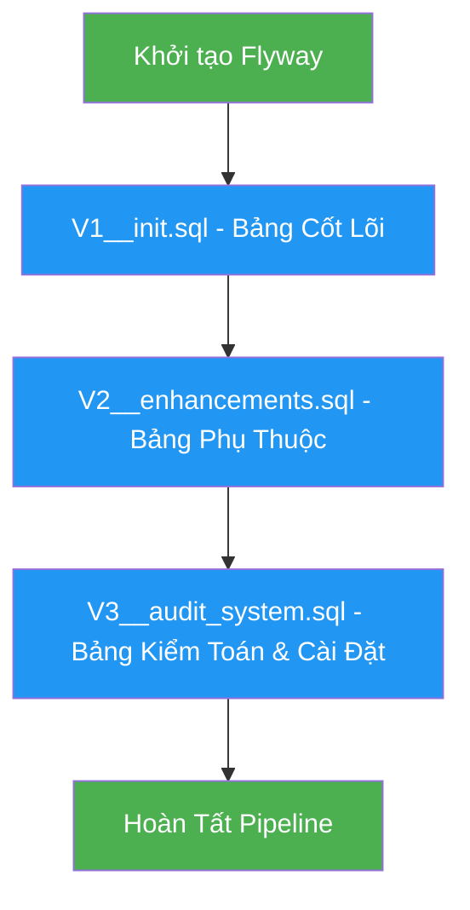

```markdown
# 🏢 DATABASE MIGRATION VERSIONING RUNBOOK
*Enterprise Membership Hub - PostgreSQL Schema & Flyway Migration Pipeline*

## 📋 DOCUMENT METADATA

| Thuộc tính | Giá trị |
|-----------|-------|
| **Tên Tài Liệu** | DATABASE_MIGRATION_VERSIONING_RUNBOOK |
| **Đường Dẫn Mục Tiêu** | `./sources/docs/database/DATABASE_MIGRATION_VERSIONING_RUNBOOK.md` |
| **Phiên Bản** | 1.0 (Đường cơ sở) |
| **Ngày Giờ** | 2026/08/29 22:34:21 |
| **Tác Giả** | Kiến Trúc Sư Hệ Thống Doanh Nghiệp (SA Agent) |
| **Phê Duyệt** | Đang chờ Rà Soát Quản Trị Kỹ Thuật |
| **Mã Bản Thiết Kế** | ARCH-20260829223421 |
| **Tên Dự Án** | membership-hub |
| **Phiên Bản** | 1.0 (Đường cơ sở) |

---

## 📊 1. TỔNG QUAN KIẾN TRÚC CƠ SỞ DỮ LIỆU

### 1.1 Sơ Đồ Quan Hệ (ERD)

```mermaid
erDiagram {
    users ||--o{ enrollments : đăng ký
    users ||--o{ attendance : điểm danh
    users ||--o{ student_cards : sở hữu
    users ||--o{ notifications : gửi/nhận
    users ||--o{ audit_logs : ghi log
    users ||--o{ promotions : tạo bởi
    users ||--o{ announcements : tạo bởi
    users ||--o{ system_settings : cập nhật bởi

    roles ||--o{ users : gán

    centers ||--o{ courses : tổ chức
    centers ||--o{ promotions : áp dụng cho
    centers ||--o{ announcements : phát sóng cho

    courses ||--o{ enrollments : đăng ký
    courses ||--o{ attendance : điểm danh
    courses ||--o{ course_teacher_mapping : giảng dạy

    enrollments ||--o{ attendance : điểm danh

    student_cards ||--o{ enrollments : sở hữu
    student_cards ||--o{ notifications : nhận

    notifications ||--o{ enrollments : liên kết
    notifications ||--o{ courses : liên kết
}
```

### 1.2 Sơ Đồ Luồng Di Trú Flyway



---

## 📋 2. BẢNG ÁNH XẠ TRỌNG TÀI LIỆU (TRACEABILITY MATRIX)

| Bảng | Tag ID | Mục Đích Nghiệp Vụ | Khóa Chính | Ràng Buộc Khóa Ngoại | Chỉ Mục Chính | Chỉ Mục Phụ Thuộc | Phiên Bản Di Trú |
|-------|--------|------------------|------------|------------------|--------------|------------------|------------------|
| **users** | [DAT-001] | Quản lý danh tính người dùng, xác thực OAuth2, RBAC | user_id (UUID) | role_id → roles | idx_users_email_unique, idx_users_role_id, idx_users_created_at | idx_users_provider, idx_users_email_lower | V1 |
| **roles** | [DAT-001] | Định nghĩa vai trò hệ thống (5 cấp độ) cho RBAC | role_id (SMALLINT) | - | pk_roles, uq_roles_name | idx_roles_name | V1 |
| **centers** | [DAT-002] | Hồ sơ trung tâm, quản lý trung tâm con, phân tách đa tenant | center_id (UUID) | - | pk_centers, uq_centers_tax_id | idx_centers_name, idx_centers_taxid, idx_centers_name_lower | V1 |
| **courses** | [DAT-003] | Đăng ký khóa học, xung đột lịch giảng dạy, phân quyền theo trung tâm | course_id (UUID) | teacher_id → users, center_id → centers | pk_courses | idx_courses_teacher_id, idx_courses_start_date, idx_courses_center_date | V1 |
| **enrollments** | [DAT-004] | Đăng ký tham gia khóa học, kiểm tra điều kiện tiên quyết | enrollment_id (UUID) | student_id → users, course_id → courses | pk_enrollments, uq_enrollments_student_course | idx_enrollments_student_id, idx_enrollments_course_id | V1 |
| **attendance** | [DAT-005] | Ghi nhận điểm danh QR, đảm bảo tính idempotent | attendance_id (UUID) | student_id → users, course_id → courses | pk_attendance, uq_attendance_student_course_date | idx_attendance_course_date, idx_attendance_student_date | V1 |
| **student_cards** | [DAT-006] | Thẻ thành viên, theo dõi ngày hiệu lực, lịch sử gia hạn | card_id (UUID) | student_id → users | pk_student_cards, uq_student_cards_student | idx_student_cards_student_id, idx_student_cards_end_date | V2 |
| **notifications** | [DAT-007] | Thông báo đa kênh (push, Zalo), hàng đợi retry | notification_id (UUID) | user_id → users (nullable) | pk_notifications | idx_notifications_user_id, idx_notifications_sent_at | V2 |
| **promotions** | [DAT-009] | Chương trình khuyến mãi, giảm giá theo trung tâm | promo_id (UUID) | center_id → centers | pk_promotions, uq_promotions_code | idx_promotions_center_id, idx_promotions_date_range | V2 |
| **announcements** | [DAT-010] | Thông báo chung, tự động ẩn theo thời gian | announcement_id (UUID) | center_id → centers | pk_announcements | idx_announcements_center_id, idx_announcements_active_expiry | V2 |
| **system_settings** | [DAT-011] | Cấu hình hệ thống, tham số vận hành | setting_key (VARCHAR) | - | pk_system_settings | - | V3 |
| **audit_logs** | [DAT-012] | Ghi log kiểm toán, tuân thủ GDPR/CCPA | log_id (UUID) | user_id → users (nullable) | pk_audit_logs | idx_audit_logs_user_id, idx_audit_logs_occurred_at | V3 |

---

## 📊 3. CHI TIẾT BẢNG NGHIỆP VỤ

### 3.1 Bảng `users` ([DAT-001], [DAT-008])

```sql
CREATE TABLE users (
    user_id UUID NOT NULL,
    email VARCHAR(255) NOT NULL,
    password_hash CHAR(60) NOT NULL,
    full_name VARCHAR(100) NOT NULL,
    role_id SMALLINT NOT NULL,
    provider VARCHAR(20) NOT NULL DEFAULT 'local',
    created_at TIMESTAMP NOT NULL DEFAULT now(),
    updated_at TIMESTAMP NOT NULL DEFAULT now(),
    center_id UUID NULL,
    is_active BOOLEAN NOT NULL DEFAULT true,
    last_login_at TIMESTAMP NULL,
    profile_picture_url VARCHAR(500) NULL,
    phone_number VARCHAR(20) NULL,
    date_of_birth DATE NULL,
    emergency_contact VARCHAR(100) NULL,
    preferred_language VARCHAR(10) NOT NULL DEFAULT 'en',
    timezone VARCHAR(50) NOT NULL DEFAULT 'UTC+7',
    marketing_consent BOOLEAN NOT NULL DEFAULT false,
    terms_accepted_at TIMESTAMP NULL,
    reset_token VARCHAR(255) NULL,
    reset_token_expiry TIMESTAMP NULL,
    failed_login_attempts INT NOT NULL DEFAULT 0,
    account_locked_until TIMESTAMP NULL,
    CONSTRAINT pk_users PRIMARY KEY (user_id),
    CONSTRAINT uq_users_email UNIQUE (email),
    CONSTRAINT fk_users_roles FOREIGN KEY (role_id) REFERENCES roles(role_id),
    CONSTRAINT fk_users_centers FOREIGN KEY (center_id) REFERENCES centers(center_id),
    CONSTRAINT ck_users_provider CHECK (provider IN ('local', 'firebase', 'google', 'facebook')),
    CONSTRAINT ck_users_email_format CHECK (email ~* '^[A-Za-z0-9._%+-]+@[A-Za-z0-9.-]+\\.[A-Za-z]{2,}$'),
    CONSTRAINT ck_users_phone_format CHECK (phone_number IS NULL OR phone_number ~ '^[+0-9 ()-]+$'),
    CONSTRAINT ck_users_language CHECK (preferred_language IN ('en', 'vi', 'es'))
);

CREATE INDEX idx_users_role_id ON users(role_id);
CREATE INDEX idx_users_center_id ON users(center_id);
CREATE INDEX idx_users_created_at ON users(created_at);
CREATE INDEX idx_users_email_lower ON users(LOWER(email));
CREATE INDEX idx_users_provider ON users(provider);
CREATE INDEX idx_users_is_active ON users(is_active);
```

**Mô tả Nghiệp Vụ:**
- **user_id**: Định danh duy nhất cho mỗi người dùng, sử dụng UUID v4
- **email**: Địa chỉ email duy nhất, được xác thực theo định dạng RFC 5322
- **password_hash**: Hash BCrypt (60 ký tự) cho mật khẩu, tuân thủ OWASP A07
- **full_name**: Tên hiển thị đầy đủ, hỗ trợ Unicode cho tên đa ngôn ngữ
- **role_id**: Liên kết đến bảng `roles` để thực hiện RBAC theo `[ARC-001]` đến `[ARC-005]`
- **provider**: Nguồn xác thực (local, Firebase, Google, Facebook) cho `[REQ-002]`
- **center_id**: Hỗ trợ đa tenant, liên kết đến `centers` cho `[ARC-002]`, `[ARC-003]`
- **is_active**: Cờ trạng thái tài khoản, cho phép vô hiệu hóa mềm người dùng
- **preferred_language**: Ngôn ngữ giao diện người dùng, hỗ trợ `[REQ-022]`, `[REQ-023]`
- **marketing_consent**: Theo dõi sự đồng ý GDPR/CCPA cho `[NFR-008]`
- **failed_login_attempts**: Bảo vệ chống brute-force cho `[NFR-003]`
- **account_locked_until**: Thời gian khóa tạm thời sau nhiều lần đăng nhập thất bại

### 3.2 Bảng `roles` ([DAT-001])

```sql
CREATE TABLE roles (
    role_id SMALLINT NOT NULL,
    name VARCHAR(30) NOT NULL,
    description VARCHAR(200),
    level INT NOT NULL,
    permissions JSONB NOT NULL,
    is_system_role BOOLEAN NOT NULL DEFAULT false,
    created_at TIMESTAMP NOT NULL DEFAULT now(),
    updated_at TIMESTAMP NOT NULL DEFAULT now(),
    created_by UUID NULL,
    CONSTRAINT pk_roles PRIMARY KEY (role_id),
    CONSTRAINT uq_roles_name UNIQUE (name),
    CONSTRAINT ck_roles_level CHECK (level BETWEEN 1 AND 5),
    CONSTRAINT ck_roles_name CHECK (name IN ('SYSTEM_ADMIN','CENTER_ADMIN','MANAGER','TEACHER','STUDENT')),
    CONSTRAINT fk_roles_creator FOREIGN KEY (created_by) REFERENCES users(user_id)
);

CREATE INDEX idx_roles_level ON roles(level);
CREATE INDEX idx_roles_is_system ON roles(is_system_role);
```

**Mô tả Nghiệp Vụ:**
- **role_id**: Mã số vai trò (1-5) cho ma trận RBAC `[ARC-001]` đến `[ARC-005]`
- **name**: Tên vai trò chuẩn hóa (SYSTEM_ADMIN, CENTER_ADMIN, MANAGER, TEACHER, STUDENT)
- **level**: Thứ tự ưu tiên cho việc cấp quyền (1 = cao nhất)
- **permissions**: JSON object chứa các quyền API cụ thể cho từng vai trò
- **is_system_role**: Ngăn chặn sửa đổi các vai trò hệ thống cốt lõi
- **created_by**: Audit trail cho việc gán vai trò theo `[REQ-003]`

### 3.3 Bảng `centers` ([DAT-002])

```sql
CREATE TABLE centers (
    center_id UUID NOT NULL,
    name VARCHAR(100) NOT NULL,
    address VARCHAR(255) NOT NULL,
    tax_id VARCHAR(20) NOT NULL,
    contact_phone VARCHAR(20),
    contact_email VARCHAR(100),
    website_url VARCHAR(255),
    logo_url VARCHAR(500),
    is_active BOOLEAN NOT NULL DEFAULT true,
    created_at TIMESTAMP NOT NULL DEFAULT now(),
    updated_at TIMESTAMP NOT NULL DEFAULT now(),
    created_by UUID NULL,
    CONSTRAINT pk_centers PRIMARY KEY (center_id),
    CONSTRAINT uq_centers_tax_id UNIQUE (tax_id),
    CONSTRAINT uq_centers_contact_email UNIQUE (contact_email),
    CONSTRAINT fk_centers_creator FOREIGN KEY (created_by) REFERENCES users(user_id),
    CONSTRAINT ck_centers_phone_format CHECK (contact_phone IS NULL OR contact_phone ~ '^[+0-9 ()-]+$'),
    CONSTRAINT ck_centers_email_format CHECK (contact_email IS NULL OR contact_email ~* '^[A-Za-z0-9._%+-]+@[A-Za-z0-9.-]+\\.[A-Za-z]{2,}$'),
    CONSTRAINT ck_centers_taxid_numeric CHECK (tax_id ~ '^[0-9]{10,13}$')
);

CREATE INDEX idx_centers_name ON centers(name);
CREATE INDEX idx_centers_tax_id ON centers(tax_id);
CREATE INDEX idx_centers_is_active ON centers(is_active);
CREATE INDEX idx_centers_created_at ON centers(created_at);
```

**Mô tả Nghiệp Vụ:**
- **center_id**: Định danh trung tâm, đơn vị phân tách đa tenant cho `[ARC-002]`
- **tax_id**: Mã số thuế duy nhất, phục vụ tuân thủ pháp lý và báo cáo
- **contact_email**: Email duy nhất cho hệ thống notification theo `[REQ-016]`
- **website_url**, **logo_url**: Hỗ trợ thương hiệu trung tâm và hiển thị UI
- **is_active**: Cờ trạng thái cho phép đóng trung tâm mà không xóa dữ liệu

### 3.4 Bảng `courses` ([DAT-003])

```sql
CREATE TABLE courses (
    course_id UUID NOT NULL,
    title VARCHAR(150) NOT NULL,
    description TEXT,
    start_date DATE NOT NULL,
    end_date DATE NOT NULL,
    teacher_id UUID NOT NULL,
    max_students INT NOT NULL DEFAULT 30,
    center_id UUID NOT NULL,
    course_code VARCHAR(20) NOT NULL,
    tuition_fee DECIMAL(10,2) NOT NULL DEFAULT 0,
    is_online BOOLEAN NOT NULL DEFAULT false,
    meeting_link VARCHAR(500),
    status VARCHAR(20) NOT NULL DEFAULT 'DRAFT',
    created_at TIMESTAMP NOT NULL DEFAULT now(),
    updated_at TIMESTAMP NOT NULL DEFAULT now(),
    created_by UUID NULL,
    CONSTRAINT pk_courses PRIMARY KEY (course_id),
    CONSTRAINT uq_courses_code_center UNIQUE (course_code, center_id),
    CONSTRAINT fk_courses_teacher FOREIGN KEY (teacher_id) REFERENCES users(user_id),
    CONSTRAINT fk_courses_center FOREIGN KEY (center_id) REFERENCES centers(center_id),
    CONSTRAINT fk_courses_creator FOREIGN KEY (created_by) REFERENCES users(user_id),
    CONSTRAINT ck_courses_date_range CHECK (end_date >= start_date),
    CONSTRAINT ck_courses_max_students CHECK (max_students > 0),
    CONSTRAINT ck_courses_status CHECK (status IN ('DRAFT', 'PUBLISHED', 'CANCELLED', 'COMPLETED')),
    CONSTRAINT ck_courses_fee_non_negative CHECK (tuition_fee >= 0)
);

CREATE INDEX idx_courses_teacher_id ON courses(teacher_id);
CREATE INDEX idx_courses_center_id ON courses(center_id);
CREATE INDEX idx_courses_start_date ON courses(start_date);
CREATE INDEX idx_courses_status ON courses(status);
CREATE INDEX idx_courses_center_date ON courses(center_id, start_date);
```

**Mô tả Nghiệp Vụ:**
- **course_id**: Định danh khóa học duy nhất
- **course_code**: Mã khóa học duy nhất trong phạm vi trung tâm
- **teacher_id**: Liên kết đến `users` cho `[REQ-009]` (gán giáo viên)
- **max_students**: Giới hạn đăng ký cho `[REQ-010]` (duyệt khoá học)
- **tuition_fee**: Phí tham gia, hỗ trợ báo cáo tài chính
- **status**: Trạng thái vòng đời khóa học (DRAFT → PUBLISHED → COMPLETED)

### 3.5 Bảng `enrollments` ([DAT-004])

```sql
CREATE TABLE enrollments (
    enrollment_id UUID NOT NULL,
    student_id UUID NOT NULL,
    course_id UUID NOT NULL,
    enrollment_date TIMESTAMP NOT NULL DEFAULT now(),
    status VARCHAR(20) NOT NULL DEFAULT 'ACTIVE',
    payment_status VARCHAR(20) NOT NULL DEFAULT 'UNPAID',
    payment_amount DECIMAL(10,2) NULL,
    payment_date TIMESTAMP NULL,
    grade DECIMAL(5,2) NULL,
    completed_at TIMESTAMP NULL,
    created_at TIMESTAMP NOT NULL DEFAULT now(),
    updated_at TIMESTAMP NOT NULL DEFAULT now(),
    created_by UUID NULL,
    CONSTRAINT pk_enrollments PRIMARY KEY (enrollment_id),
    CONSTRAINT uq_enrollments_student_course UNIQUE (student_id, course_id),
    CONSTRAINT fk_enrollments_student FOREIGN KEY (student_id) REFERENCES users(user_id),
    CONSTRAINT fk_enrollments_course FOREIGN KEY (course_id) REFERENCES courses(course_id),
    CONSTRAINT fk_enrollments_creator FOREIGN KEY (created_by) REFERENCES users(user_id),
    CONSTRAINT ck_enrollments_status CHECK (status IN ('ACTIVE', 'COMPLETED', 'DROPPED', 'WAITLIST')),
    CONSTRAINT ck_enrollments_payment_status CHECK (payment_status IN ('UNPAID', 'PARTIAL', 'PAID')),
    CONSTRAINT ck_enrollments_grade_range CHECK (grade IS NULL OR (grade >= 0 AND grade <= 100))
);

CREATE INDEX idx_enrollments_student_id ON enrollments(student_id);
CREATE INDEX idx_enrollments_course_id ON enrollments(course_id);
CREATE INDEX idx_enrollments_status ON enrollments(status);
CREATE INDEX idx_enrollments_enrollment_date ON enrollments(enrollment_date);
```

**Mô tả Nghiệp Vụ:**
- **enrollment_id**: Định danh đăng ký duy nhất
- **status**: Trạng thái đăng ký (ACTIVE, COMPLETED, DROPPED, WAITLIST)
- **payment_status**: Theo dõi thanh toán cho `[REQ-015]` (gia hạn thẻ)
- **grade**: Điểm số cho `[REQ-024]` (xuất báo cáo điểm danh)

### 3.6 Bảng `attendance` ([DAT-005])

```sql
CREATE TABLE attendance (
    attendance_id UUID NOT NULL,
    student_id UUID NOT NULL,
    course_id UUID NOT NULL,
    attendance_date DATE NOT NULL,
    timestamp TIMESTAMP NOT NULL DEFAULT now(),
    status VARCHAR(20) NOT NULL DEFAULT 'PRESENT',
    qr_payload_hash VARCHAR(64) NULL,
    location VARCHAR(255) NULL,
    device_info VARCHAR(500) NULL,
    notes TEXT NULL,
    created_at TIMESTAMP NOT NULL DEFAULT now(),
    updated_at TIMESTAMP NOT NULL DEFAULT now(),
    created_by UUID NULL,
    CONSTRAINT pk_attendance PRIMARY KEY (attendance_id),
    CONSTRAINT uq_attendance_student_course_date UNIQUE (student_id, course_id, attendance_date),
    CONSTRAINT fk_attendance_student FOREIGN KEY (student_id) REFERENCES users(user_id),
    CONSTRAINT fk_attendance_course FOREIGN KEY (course_id) REFERENCES courses(course_id),
    CONSTRAINT fk_attendance_creator FOREIGN KEY (created_by) REFERENCES users(user_id),
    CONSTRAINT ck_attendance_status CHECK (status IN ('PRESENT', 'ABSENT', 'LATE', 'EXCUSED')),
    CONSTRAINT ck_attendance_date_future CHECK (attendance_date <= CURRENT_DATE + INTERVAL '1 day')
);

CREATE INDEX idx_attendance_course_date ON attendance(course_id, attendance_date);
CREATE INDEX idx_attendance_student_date ON attendance(student_id, attendance_date);
CREATE INDEX idx_attendance_status ON attendance(status);
CREATE INDEX idx_attendance_qr_hash ON attendance(qr_payload_hash);
```

**Mô tả Nghiệp Vụ:**
- **attendance_id**: Định danh bản ghi điểm danh duy nhất
- **qr_payload_hash**: SHA-256 hash của QR payload cho `[REQ-012]`, `[REQ-013]` (idempotency)
- **status**: Loại điểm danh (PRESENT, ABSENT, LATE, EXCUSED)
- **location**, **device_info**: Dữ liệu bổ sung cho `[EXC-001]` (retry sau mất mạng)

### 3.7 Bảng `student_cards` ([DAT-006])

```sql
CREATE TABLE student_cards (
    card_id UUID NOT NULL,
    student_id UUID NOT NULL,
    issue_date DATE NOT NULL,
    validity_days INT NOT NULL,
    remaining_days INT NOT NULL,
    end_date DATE NOT NULL,
    used_days INT NOT NULL DEFAULT 0,
    total_validity_days INT NOT NULL DEFAULT 30,
    last_renewed_at TIMESTAMP NULL,
    renewal_count INT NOT NULL DEFAULT 0,
    status VARCHAR(20) NOT NULL DEFAULT 'ACTIVE',
    auto_renew_enabled BOOLEAN NOT NULL DEFAULT false,
    next_renewal_date DATE NULL,
    payment_method VARCHAR(50) NULL,
    created_at TIMESTAMP NOT NULL DEFAULT now(),
    updated_at TIMESTAMP NOT NULL DEFAULT now(),
    created_by UUID NULL,
    CONSTRAINT pk_student_cards PRIMARY KEY (card_id),
    CONSTRAINT uq_student_cards_student UNIQUE (student_id),
    CONSTRAINT fk_student_cards_student FOREIGN KEY (student_id) REFERENCES users(user_id),
    CONSTRAINT fk_student_cards_creator FOREIGN KEY (created_by) REFERENCES users(user_id),
    CONSTRAINT ck_student_cards_validity CHECK (validity_days > 0),
    CONSTRAINT ck_student_cards_remaining CHECK (remaining_days >= 0),
    CONSTRAINT ck_student_cards_total_validity CHECK (total_validity_days > 0),
    CONSTRAINT ck_student_cards_status CHECK (status IN ('ACTIVE', 'EXPIRED', 'SUSPENDED', 'CANCELLED')),
    CONSTRAINT ck_student_cards_renewal_count CHECK (renewal_count >= 0)
);

CREATE INDEX idx_student_cards_student_id ON student_cards(student_id);
CREATE INDEX idx_student_cards_end_date ON student_cards(end_date);
CREATE INDEX idx_student_cards_status ON student_cards(status);
CREATE INDEX idx_student_cards_auto_renew ON student_cards(auto_renew_enabled);
```

**Mô tả Nghiệp Vụ:**
- **validity_days**: Số ngày hiệu lực ban đầu cho `[REQ-014]`
- **remaining_days**: Số ngày hiệu lực còn lại (cập nhật tự động)
- **used_days**: Tổng số ngày đã sử dụng (theo dõi `[REQ-014]`)
- **auto_renew_enabled**: Cờ cho `[REQ-015]` (gia hạn tự động)
- **next_renewal_date**: Lịch gia hạn tự động được lên lịch

### 3.8 Bảng `notifications` ([DAT-007])

```sql
CREATE TABLE notifications (
    notification_id UUID NOT NULL,
    user_id UUID NULL,
    group_zalo VARCHAR(50) NULL,
    message TEXT NOT NULL,
    sent_at TIMESTAMP NOT NULL DEFAULT now(),
    delivered BOOLEAN NOT NULL DEFAULT false,
    delivery_time TIMESTAMP NULL,
    platform VARCHAR(20) NULL,
    device_token VARCHAR(255) NULL,
    notification_type VARCHAR(20) NOT NULL DEFAULT 'IN_APP',
    priority VARCHAR(10) NOT NULL DEFAULT 'NORMAL',
    title VARCHAR(200) NULL,
    data JSONB NULL,
    retry_count INT NOT NULL DEFAULT 0,
    max_retries INT NOT NULL DEFAULT 3,
    last_attempt_at TIMESTAMP NULL,
    next_retry_at TIMESTAMP NULL,
    error_message TEXT NULL,
    created_at TIMESTAMP NOT NULL DEFAULT now(),
    updated_at TIMESTAMP NOT NULL DEFAULT now(),
    created_by UUID NULL,
    CONSTRAINT pk_notifications PRIMARY KEY (notification_id),
    CONSTRAINT fk_notifications_user FOREIGN KEY (user_id) REFERENCES users(user_id),
    CONSTRAINT ck_notifications_target CHECK ((user_id IS NOT NULL) OR (group_zalo IS NOT NULL)),
    CONSTRAINT ck_notifications_type CHECK (notification_type IN ('PUSH', 'ZALO_GROUP', 'IN_APP')),
    CONSTRAINT ck_notifications_priority CHECK (priority IN ('LOW', 'NORMAL', 'HIGH', 'URGENT')),
    CONSTRAINT ck_notifications_platform CHECK (platform IN ('FCM', 'APNS', 'ZALO', 'WEB'))
);

CREATE INDEX idx_notifications_user_id ON notifications(user_id);
CREATE INDEX idx_notifications_group_zalo ON notifications(group_zalo);
CREATE INDEX idx_notifications_sent_at ON notifications(sent_at);
CREATE INDEX idx_notifications_status ON notifications(delivered);
CREATE INDEX idx_notifications_retry ON notifications(next_retry_at) WHERE next_retry_at IS NOT NULL;
```

**Mô tả Nghiệp Vụ:**
- **group_zalo**: Mã nhóm Zalo OA cho `[REQ-021]` (Zalo broadcast)
- **notification_type**: Phân loại kênh (PUSH, ZALO_GROUP, IN_APP)
- **priority**: Độ ưu tiên xử lý cho `[EXC-003]` (retry logic)
- **data**: JSON payload bổ sung cho rich notification

### 3.9 Bảng `promotions` ([DAT-009])

```sql
CREATE TABLE promotions (
    promo_id UUID NOT NULL,
    center_id UUID NULL,
    code VARCHAR(30) NOT NULL,
    name VARCHAR(100) NOT NULL,
    description TEXT,
    discount_percent SMALLINT NOT NULL,
    start_date DATE,
    end_date DATE,
    is_perpetual BOOLEAN NOT NULL DEFAULT false,
    min_purchase_amount DECIMAL(10,2) NULL,
    max_discount_amount DECIMAL(10,2) NULL,
    usage_limit INT NULL,
    used_count INT NOT NULL DEFAULT 0,
    status VARCHAR(20) NOT NULL DEFAULT 'DRAFT',
    created_at TIMESTAMP NOT NULL DEFAULT now(),
    updated_at TIMESTAMP NOT NULL DEFAULT now(),
    created_by UUID NOT NULL,
    CONSTRAINT pk_promotions PRIMARY KEY (promo_id),
    CONSTRAINT uq_promotions_code UNIQUE (code),
    CONSTRAINT fk_promotions_center FOREIGN KEY (center_id) REFERENCES centers(center_id),
    CONSTRAINT fk_promotions_creator FOREIGN KEY (created_by) REFERENCES users(user_id),
    CONSTRAINT ck_promotions_discount CHECK (discount_percent BETWEEN 1 AND 100),
    CONSTRAINT ck_promotions_date_range CHECK (end_date IS NULL OR end_date >= start_date),
    CONSTRAINT ck_promotions_usage_limit CHECK (usage_limit IS NULL OR usage_limit > 0),
    CONSTRAINT ck_promotions_used_count CHECK (used_count >= 0),
    CONSTRAINT ck_promotions_status CHECK (status IN ('DRAFT', 'PUBLISHED', 'ACTIVE', 'EXPIRED', 'CANCELLED'))
);

CREATE INDEX idx_promotions_center_id ON promotions(center_id);
CREATE INDEX idx_promotions_code ON promotions(code);
CREATE INDEX idx_promotions_status ON promotions(status);
CREATE INDEX idx_promotions_date_range ON promotions(start_date, end_date);
CREATE INDEX idx_promotions_active ON promotions(status) WHERE status = 'ACTIVE';
```

**Mô tả Nghiệp Vụ:**
- **code**: Mã khuyến mãi duy nhất, sử dụng cho `[REQ-017]` (quản lý khuyến mãi)
- **discount_percent**: Phần trăm giảm giá (1-100)
- **is_perpetual**: Khuyến mãi không có ngày hết hạn
- **usage_limit**, **used_count**: Kiểm soát số lần sử dụng cho `[REQ-017]`

### 3.10 Bảng `announcements` ([DAT-010])

```sql
CREATE TABLE announcements (
    announcement_id UUID NOT NULL,
    center_id UUID NULL,
    title VARCHAR(150) NOT NULL,
    content TEXT NOT NULL,
    start_date DATE,
    end_date DATE,
    target_audience VARCHAR(20) NOT NULL DEFAULT 'ALL',
    published_by UUID NOT NULL,
    published_at TIMESTAMP NOT NULL DEFAULT now(),
    is_active BOOLEAN NOT NULL DEFAULT true,
    created_at TIMESTAMP NOT NULL DEFAULT now(),
    updated_at TIMESTAMP NOT NULL DEFAULT now(),
    created_by UUID NULL,
    CONSTRAINT pk_announcements PRIMARY KEY (announcement_id),
    CONSTRAINT fk_announcements_center FOREIGN KEY (center_id) REFERENCES centers(center_id),
    CONSTRAINT fk_announcements_publisher FOREIGN KEY (published_by) REFERENCES users(user_id),
    CONSTRAINT fk_announcements_creator FOREIGN KEY (created_by) REFERENCES users(user_id),
    CONSTRAINT ck_announcements_date_range CHECK (end_date IS NULL OR end_date >= start_date),
    CONSTRAINT ck_announcements_target CHECK (target_audience IN ('ALL', 'STUDENT', 'TEACHER', 'ADMIN'))
);

CREATE INDEX idx_announcements_center_id ON announcements(center_id);
CREATE INDEX idx_announcements_active_expiry ON announcements(is_active, end_date);
CREATE INDEX idx_announcements_target ON announcements(target_audience);
CREATE INDEX idx_announcements_published_at ON announcements(published_at);
```

**Mô tả Nghiệp Vụ:**
- **target_audience**: Phạm vi hiển thị (ALL, STUDENT, TEACHER, ADMIN)
- **is_active**: Cờ tự động ẩn khi hết hạn cho `[REQ-018]`

### 3.11 Bảng `system_settings` ([DAT-011])

```sql
CREATE TABLE system_settings (
    setting_key VARCHAR(50) NOT NULL,
    setting_value TEXT NOT NULL,
    description TEXT,
    data_type VARCHAR(20) NOT NULL DEFAULT 'STRING',
    is_sensitive BOOLEAN NOT NULL DEFAULT false,
    validation_regex VARCHAR(255) NULL,
    default_value TEXT NULL,
    created_at TIMESTAMP NOT NULL DEFAULT now(),
    updated_at TIMESTAMP NOT NULL DEFAULT now(),
    updated_by UUID NULL,
    CONSTRAINT pk_system_settings PRIMARY KEY (setting_key),
    CONSTRAINT fk_system_settings_updater FOREIGN KEY (updated_by) REFERENCES users(user_id),
    CONSTRAINT ck_system_settings_data_type CHECK (data_type IN ('STRING', 'INTEGER', 'DECIMAL', 'BOOLEAN', 'JSON', 'DATE'))
);

CREATE INDEX idx_system_settings_sensitive ON system_settings(is_sensitive);
```

**Mô tả Nghiệp Vụ:**
- **setting_key**: Khóa cấu hình (ví dụ: `app.name`, `email.smtp.host`)
- **is_sensitive**: Đánh dấu các giá trị nhạy cảm (mật khẩu, token) cho `[NFR-003]`
- **validation_regex**: Regex validation cho các setting dạng số

### 3.12 Bảng `audit_logs` ([DAT-012])

```sql
CREATE TABLE audit_logs (
    log_id UUID NOT NULL,
    user_id UUID NULL,
    action VARCHAR(100) NOT NULL,
    target_entity VARCHAR(50) NOT NULL,
    target_id UUID,
    old_value TEXT,
    new_value TEXT,
    ip_address VARCHAR(45),
    user_agent VARCHAR(500),
    session_id VARCHAR(100),
    request_method VARCHAR(10),
    request_path VARCHAR(500),
    request_params TEXT,
    response_status INT,
    execution_time_ms INT,
    error_message TEXT,
    occurred_at TIMESTAMP NOT NULL DEFAULT now(),
    CONSTRAINT pk_audit_logs PRIMARY KEY (log_id),
    CONSTRAINT fk_audit_logs_user FOREIGN KEY (user_id) REFERENCES users(user_id),
    CONSTRAINT idx_audit_logs_user_id ON audit_logs(user_id),
    CONSTRAINT idx_audit_logs_occurred_at ON audit_logs(occurred_at),
    CONSTRAINT idx_audit_logs_target ON audit_logs(target_entity, target_id)
);

CREATE INDEX idx_audit_logs_user_id ON audit_logs(user_id);
CREATE INDEX idx_audit_logs_occurred_at ON audit_logs(occurred_at);
CREATE INDEX idx_audit_logs_action ON audit_logs(action);
CREATE INDEX idx_audit_logs_target ON audit_logs(target_entity, target_id);
```

**Mô tả Nghiệp Vụ:**
- **target_entity**: Tên bảng (ví dụ: `users`, `courses`)
- **old_value**, **new_value**: JSON snapshot cho các thay đổi dữ liệu
- **session_id**: Liên kết với trace logging cho `[NFR-006]`
- **execution_time_ms**: Performance monitoring cho `[NFR-001]`
- **error_message**: Chi tiết lỗi cho `[EXC-004]` (exception handling)

---

## 📊 4. PHIÊN BẢN DI TRÚ FLYWAY CHI TIẾT

### 4.1 Phiên Bản V1: Bảng Cốt Lõi (users, roles, centers, courses, enrollments, attendance)

```sql
-- V1__init_users_and_roles.sql [DAT-001], [DAT-002], [DAT-003], [DAT-004], [DAT-005], [DAT-008]
-- Bảng users (DAT-001, DAT-008)
CREATE TABLE users (
    user_id UUID NOT NULL,
    email VARCHAR(255) NOT NULL,
    password_hash CHAR(60) NOT NULL,
    full_name VARCHAR(100) NOT NULL,
    role_id SMALLINT NOT NULL,
    provider VARCHAR(20) NOT NULL DEFAULT 'local',
    created_at TIMESTAMP NOT NULL DEFAULT now(),
    updated_at TIMESTAMP NOT NULL DEFAULT now(),
    center_id UUID NULL,
    is_active BOOLEAN NOT NULL DEFAULT true,
    last_login_at TIMESTAMP NULL,
    profile_picture_url VARCHAR(500) NULL,
    phone_number VARCHAR(20) NULL,
    date_of_birth DATE NULL,
    emergency_contact VARCHAR(100) NULL,
    preferred_language VARCHAR(10) NOT NULL DEFAULT 'en',
    timezone VARCHAR(50) NOT NULL DEFAULT 'UTC+7',
    marketing_consent BOOLEAN NOT NULL DEFAULT false,
    terms_accepted_at TIMESTAMP NULL,
    reset_token VARCHAR(255) NULL,
    reset_token_expiry TIMESTAMP NULL,
    failed_login_attempts INT NOT NULL DEFAULT 0,
    account_locked_until TIMESTAMP NULL,
    CONSTRAINT pk_users PRIMARY KEY (user_id),
    CONSTRAINT uq_users_email UNIQUE (email),
    CONSTRAINT fk_users_roles FOREIGN KEY (role_id) REFERENCES roles(role_id),
    CONSTRAINT fk_users_centers FOREIGN KEY (center_id) REFERENCES centers(center_id),
    CONSTRAINT ck_users_provider CHECK (provider IN ('local', 'firebase', 'google', 'facebook')),
    CONSTRAINT ck_users_email_format CHECK (email ~* '^[A-Za-z0-9._%+-]+@[A-Za-z0-9.-]+\\.[A-Za-z]{2,}$')
);

-- Bảng roles (DAT-001)
CREATE TABLE roles (
    role_id SMALLINT NOT NULL,
    name VARCHAR(30) NOT NULL,
    description VARCHAR(200),
    level INT NOT NULL,
    permissions JSONB NOT NULL,
    is_system_role BOOLEAN NOT NULL DEFAULT false,
    created_at TIMESTAMP NOT NULL DEFAULT now(),
    updated_at TIMESTAMP NOT NULL DEFAULT now(),
    created_by UUID NULL,
    CONSTRAINT pk_roles PRIMARY KEY (role_id),
    CONSTRAINT uq_roles_name UNIQUE (name),
    CONSTRAINT ck_roles_level CHECK (level BETWEEN 1 AND 5),
    CONSTRAINT ck_roles_name CHECK (name IN ('SYSTEM_ADMIN','CENTER_ADMIN','MANAGER','TEACHER','STUDENT'))
);

-- Bảng centers (DAT-002)
CREATE TABLE centers (
    center_id UUID NOT NULL,
    name VARCHAR(100) NOT NULL,
    address VARCHAR(255) NOT NULL,
    tax_id VARCHAR(20) NOT NULL,
    contact_phone VARCHAR(20),
    contact_email VARCHAR(100),
    website_url VARCHAR(255),
    logo_url VARCHAR(500),
    is_active BOOLEAN NOT NULL DEFAULT true,
    created_at TIMESTAMP NOT NULL DEFAULT now(),
    updated_at TIMESTAMP NOT NULL DEFAULT now(),
    created_by UUID NULL,
    CONSTRAINT pk_centers PRIMARY KEY (center_id),
    CONSTRAINT uq_centers_tax_id UNIQUE (tax_id),
    CONSTRAINT uq_centers_contact_email UNIQUE (contact_email),
    CONSTRAINT fk_centers_creator FOREIGN KEY (created_by) REFERENCES users(user_id)
);

-- Bảng courses (DAT-003)
CREATE TABLE courses (
    course_id UUID NOT NULL,
    title VARCHAR(150) NOT NULL,
    description TEXT,
    start_date DATE NOT NULL,
    end_date DATE NOT NULL,
    teacher_id UUID NOT NULL,
    max_students INT NOT NULL DEFAULT 30,
    center_id UUID NOT NULL,
    course_code VARCHAR(20) NOT NULL,
    tuition_fee DECIMAL(10,2) NOT NULL DEFAULT 0,
    is_online BOOLEAN NOT NULL DEFAULT false,
    meeting_link VARCHAR(500),
    status VARCHAR(20) NOT NULL DEFAULT 'DRAFT',
    created_at TIMESTAMP NOT NULL DEFAULT now(),
    updated_at TIMESTAMP NOT NULL DEFAULT now(),
    created_by UUID NULL,
    CONSTRAINT pk_courses PRIMARY KEY (course_id),
    CONSTRAINT uq_courses_code_center UNIQUE (course_code, center_id),
    CONSTRAINT fk_courses_teacher FOREIGN KEY (teacher_id) REFERENCES users(user_id),
    CONSTRAINT fk_courses_center FOREIGN KEY (center_id) REFERENCES centers(center_id),
    CONSTRAINT fk_courses_creator FOREIGN KEY (created_by) REFERENCES users(user_id),
    CONSTRAINT ck_courses_date_range CHECK (end_date >= start_date),
    CONSTRAINT ck_courses_max_students CHECK (max_students > 0),
    CONSTRAINT ck_courses_status CHECK (status IN ('DRAFT', 'PUBLISHED', 'CANCELLED', 'COMPLETED'))
);

-- Bảng enrollments (DAT-004)
CREATE TABLE enrollments (
    enrollment_id UUID NOT NULL,
    student_id UUID NOT NULL,
    course_id UUID NOT NULL,
    enrollment_date TIMESTAMP NOT NULL DEFAULT now(),
    status VARCHAR(20) NOT NULL DEFAULT 'ACTIVE',
    payment_status VARCHAR(20) NOT NULL DEFAULT 'UNPAID',
    payment_amount DECIMAL(10,2) NULL,
    payment_date TIMESTAMP NULL,
    grade DECIMAL(5,2) NULL,
    completed_at TIMESTAMP NULL,
    created_at TIMESTAMP NOT NULL DEFAULT now(),
    updated_at TIMESTAMP NOT NULL DEFAULT now(),
    created_by UUID NULL,
    CONSTRAINT pk_enrollments PRIMARY KEY (enrollment_id),
    CONSTRAINT uq_enrollments_student_course UNIQUE (student_id, course_id),
    CONSTRAINT fk_enrollments_student FOREIGN KEY (student_id) REFERENCES users(user_id),
    CONSTRAINT fk_enrollments_course FOREIGN KEY (course_id) REFERENCES courses(course_id),
    CONSTRAINT fk_enrollments_creator FOREIGN KEY (created_by) REFERENCES users(user_id),
    CONSTRAINT ck_enrollments_status CHECK (status IN ('ACTIVE', 'COMPLETED', 'DROPPED', 'WAITLIST')),
    CONSTRAINT ck_enrollments_payment_status CHECK (payment_status IN ('UNPAID', 'PARTIAL', 'PAID'))
);

-- Bảng attendance (DAT-005)
CREATE TABLE attendance (
    attendance_id UUID NOT NULL,
    student_id UUID NOT NULL,
    course_id UUID NOT NULL,
    attendance_date DATE NOT NULL,
    timestamp TIMESTAMP NOT NULL DEFAULT now(),
    status VARCHAR(20) NOT NULL DEFAULT 'PRESENT',
    qr_payload_hash VARCHAR(64) NULL,
    location VARCHAR(255) NULL,
    device_info VARCHAR(500) NULL,
    notes TEXT NULL,
    created_at TIMESTAMP NOT NULL DEFAULT now(),
    updated_at TIMESTAMP NOT NULL DEFAULT now(),
    created_by UUID NULL,
    CONSTRAINT pk_attendance PRIMARY KEY (attendance_id),
    CONSTRAINT uq_attendance_student_course_date UNIQUE (student_id, course_id, attendance_date),
    CONSTRAINT fk_attendance_student FOREIGN KEY (student_id) REFERENCES users(user_id),
    CONSTRAINT fk_attendance_course FOREIGN KEY (course_id) REFERENCES courses(course_id),
    CONSTRAINT fk_attendance_creator FOREIGN KEY (created_by) REFERENCES users(user_id),
    CONSTRAINT ck_attendance_status CHECK (status IN ('PRESENT', 'ABSENT', 'LATE', 'EXCUSED'))
);

-- Chỉ mục cho bảng users
CREATE INDEX idx_users_role_id ON users(role_id);
CREATE INDEX idx_users_center_id ON users(center_id);
CREATE INDEX idx_users_created_at ON users(created_at);
CREATE INDEX idx_users_email_lower ON users(LOWER(email));
CREATE INDEX idx_users_provider ON users(provider);
CREATE INDEX idx_users_is_active ON users(is_active);

-- Chỉ mục cho bảng roles
CREATE INDEX idx_roles_level ON roles(level);
CREATE INDEX idx_roles_is_system ON roles(is_system_role);

-- Chỉ mục cho bảng centers
CREATE INDEX idx_centers_name ON centers(name);
CREATE INDEX idx_centers_tax_id ON centers(tax_id);
CREATE INDEX idx_centers_is_active ON centers(is_active);
CREATE INDEX idx_centers_created_at ON centers(created_at);

-- Chỉ mục cho bảng courses
CREATE INDEX idx_courses_teacher_id ON courses(teacher_id);
CREATE INDEX idx_courses_center_id ON courses(center_id);
CREATE INDEX idx_courses_start_date ON courses(start_date);
CREATE INDEX idx_courses_status ON courses(status);
CREATE INDEX idx_courses_center_date ON courses(center_id, start_date);

-- Chỉ mục cho bảng enrollments
CREATE INDEX idx_enrollments_student_id ON enrollments(student_id);
CREATE INDEX idx_enrollments_course_id ON enrollments(course_id);
CREATE INDEX idx_enrollments_status ON enrollments(status);
CREATE INDEX idx_enrollments_enrollment_date ON enrollments(enrollment_date);

-- Chỉ mục cho bảng attendance
CREATE INDEX idx_attendance_course_date ON attendance(course_id, attendance_date);
CREATE INDEX idx_attendance_student_date ON attendance(student_id, attendance_date);
CREATE INDEX idx_attendance_status ON attendance(status);
CREATE INDEX idx_attendance_qr_hash ON attendance(qr_payload_hash);
```

### 4.2 Phiên Bản V2: Bảng Phụ Thuộc (student_cards, notifications, promotions, announcements)

```sql
-- V2__init_student_cards.sql [DAT-006]
CREATE TABLE student_cards (
    card_id UUID NOT NULL,
    student_id UUID NOT NULL,
    issue_date DATE NOT NULL,
    validity_days INT NOT NULL,
    remaining_days INT NOT NULL,
    end_date DATE NOT NULL,
    used_days INT NOT NULL DEFAULT 0,
    total_validity_days INT NOT NULL DEFAULT 30,
    last_renewed_at TIMESTAMP NULL,
    renewal_count INT NOT NULL DEFAULT 0,
    status VARCHAR(20) NOT NULL DEFAULT 'ACTIVE',
    auto_renew_enabled BOOLEAN NOT NULL DEFAULT false,
    next_renewal_date DATE NULL,
    payment_method VARCHAR(50) NULL,
    created_at TIMESTAMP NOT NULL DEFAULT now(),
    updated_at TIMESTAMP NOT NULL DEFAULT now(),
    created_by UUID NULL,
    CONSTRAINT pk_student_cards PRIMARY KEY (card_id),
    CONSTRAINT uq_student_cards_student UNIQUE (student_id),
    CONSTRAINT fk_student_cards_student FOREIGN KEY (student_id) REFERENCES users(user_id),
    CONSTRAINT fk_student_cards_creator FOREIGN KEY (created_by) REFERENCES users(user_id),
    CONSTRAINT ck_student_cards_validity CHECK (validity_days > 0),
    CONSTRAINT ck_student_cards_remaining CHECK (remaining_days >= 0),
    CONSTRAINT ck_student_cards_total_validity CHECK (total_validity_days > 0),
    CONSTRAINT ck_student_cards_status CHECK (status IN ('ACTIVE', 'EXPIRED', 'SUSPENDED', 'CANCELLED')),
    CONSTRAINT ck_student_cards_renewal_count CHECK (renewal_count >= 0)
);

CREATE INDEX idx_student_cards_student_id ON student_cards(student_id);
CREATE INDEX idx_student_cards_end_date ON student_cards(end_date);
CREATE INDEX idx_student_cards_status ON student_cards(status);
CREATE INDEX idx_student_cards_auto_renew ON student_cards(auto_renew_enabled);

-- V2__init_notifications.sql [DAT-007]
CREATE TABLE notifications (
    notification_id UUID NOT NULL,
    user_id UUID NULL,
    group_zalo VARCHAR(50) NULL,
    message TEXT NOT NULL,
    sent_at TIMESTAMP NOT NULL DEFAULT now(),
    delivered BOOLEAN NOT NULL DEFAULT false,
    delivery_time TIMESTAMP NULL,
    platform VARCHAR(20) NULL,
    device_token VARCHAR(255) NULL,
    notification_type VARCHAR(20) NOT NULL DEFAULT 'IN_APP',
    priority VARCHAR(10) NOT NULL DEFAULT 'NORMAL',
    title VARCHAR(200) NULL,
    data JSONB NULL,
    retry_count INT NOT NULL DEFAULT 0,
    max_retries INT NOT NULL DEFAULT 3,
    last_attempt_at TIMESTAMP NULL,
    next_retry_at TIMESTAMP NULL,
    error_message TEXT NULL,
    created_at TIMESTAMP NOT NULL DEFAULT now(),
    updated_at TIMESTAMP NOT NULL DEFAULT now(),
    created_by UUID NULL,
    CONSTRAINT pk_notifications PRIMARY KEY (notification_id),
    CONSTRAINT fk_notifications_user FOREIGN KEY (user_id) REFERENCES users(user_id),
    CONSTRAINT ck_notifications_target CHECK ((user_id IS NOT NULL) OR (group_zalo IS NOT NULL)),
    CONSTRAINT ck_notifications_type CHECK (notification_type IN ('PUSH', 'ZALO_GROUP', 'IN_APP')),
    CONSTRAINT ck_notifications_priority CHECK (priority IN ('LOW', 'NORMAL', 'HIGH', 'URGENT'))
);

CREATE INDEX idx_notifications_user_id ON notifications(user_id);
CREATE INDEX idx_notifications_group_zalo ON notifications(group_zalo);
CREATE INDEX idx_notifications_sent_at ON notifications(sent_at);
CREATE INDEX idx_notifications_status ON notifications(delivered);
CREATE INDEX idx_notifications_retry ON notifications(next_retry_at) WHERE next_retry_at IS NOT NULL;

-- V2__init_promotions.sql [DAT-009]
CREATE TABLE promotions (
    promo_id UUID NOT NULL,
    center_id UUID NULL,
    code VARCHAR(30) NOT NULL,
    name VARCHAR(100) NOT NULL,
    description TEXT,
    discount_percent SMALLINT NOT NULL,
    start_date DATE,
    end_date DATE,
    is_perpetual BOOLEAN NOT NULL DEFAULT false,
    min_purchase_amount DECIMAL(10,2) NULL,
    max_discount_amount DECIMAL(10,2) NULL,
    usage_limit INT NULL,
    used_count INT NOT NULL DEFAULT 0,
    status VARCHAR(20) NOT NULL DEFAULT 'DRAFT',
    created_at TIMESTAMP NOT NULL DEFAULT now(),
    updated_at TIMESTAMP NOT NULL DEFAULT now(),
    created_by UUID NOT NULL,
    CONSTRAINT pk_promotions PRIMARY KEY (promo_id),
    CONSTRAINT uq_promotions_code UNIQUE (code),
    CONSTRAINT fk_promotions_center FOREIGN KEY (center_id) REFERENCES centers(center_id),
    CONSTRAINT fk_promotions_creator FOREIGN KEY (created_by) REFERENCES users(user_id),
    CONSTRAINT ck_promotions_discount CHECK (discount_percent BETWEEN 1 AND 100),
    CONSTRAINT ck_promotions_date_range CHECK (end_date IS NULL OR end_date >= start_date),
    CONSTRAINT ck_promotions_usage_limit CHECK (usage_limit IS NULL OR usage_limit > 0),
    CONSTRAINT ck_promotions_used_count CHECK (used_count >= 0),
    CONSTRAINT ck_promotions_status CHECK (status IN ('DRAFT', 'PUBLISHED', 'ACTIVE', 'EXPIRED', 'CANCELLED'))
);

CREATE INDEX idx_promotions_center_id ON promotions(center_id);
CREATE INDEX idx_promotions_code ON promotions(code);
CREATE INDEX idx_promotions_status ON promotions(status);
CREATE INDEX idx_promotions_date_range ON promotions(start_date, end_date);
CREATE INDEX idx_promotions_active ON promotions(status) WHERE status = 'ACTIVE';

-- V2__init_announcements.sql [DAT-010]
CREATE TABLE announcements (
    announcement_id UUID NOT NULL,
    center_id UUID NULL,
    title VARCHAR(150) NOT NULL,
    content TEXT NOT NULL,
    start_date DATE,
    end_date DATE,
    target_audience VARCHAR(20) NOT NULL DEFAULT 'ALL',
    published_by UUID NOT NULL,
    published_at TIMESTAMP NOT NULL DEFAULT now(),
    is_active BOOLEAN NOT NULL DEFAULT true,
    created_at TIMESTAMP NOT NULL DEFAULT now(),
    updated_at TIMESTAMP NOT NULL DEFAULT now(),
    created_by UUID NULL,
    CONSTRAINT pk_announcements PRIMARY KEY (announcement_id),
    CONSTRAINT fk_announcements_center FOREIGN KEY (center_id) REFERENCES centers(center_id),
    CONSTRAINT fk_announcements_publisher FOREIGN KEY (published_by) REFERENCES users(user_id),
    CONSTRAINT fk_announcements_creator FOREIGN KEY (created_by) REFERENCES users(user_id),
    CONSTRAINT ck_announcements_date_range CHECK (end_date IS NULL OR end_date >= start_date),
    CONSTRAINT ck_announcements_target CHECK (target_audience IN ('ALL', 'STUDENT', 'TEACHER', 'ADMIN'))
);

CREATE INDEX idx_announcements_center_id ON announcements(center_id);
CREATE INDEX idx_announcements_active_expiry ON announcements(is_active, end_date);
CREATE INDEX idx_announcements_target ON announcements(target_audience);
CREATE INDEX idx_announcements_published_at ON announcements(published_at);
```

### 4.3 Phiên Bản V3: Bảng Kiểm Toán & Cài Đặt (system_settings, audit_logs)

```sql
-- V3__init_system_settings.sql [DAT-011]
CREATE TABLE system_settings (
    setting_key VARCHAR(50) NOT NULL,
    setting_value TEXT NOT NULL,
    description TEXT,
    data_type VARCHAR(20) NOT NULL DEFAULT 'STRING',
    is_sensitive BOOLEAN NOT NULL DEFAULT false,
    validation_regex VARCHAR(255) NULL,
    default_value TEXT NULL,
    created_at TIMESTAMP NOT NULL DEFAULT now(),
    updated_at TIMESTAMP NOT NULL DEFAULT now(),
    updated_by UUID NULL,
    CONSTRAINT pk_system_settings PRIMARY KEY (setting_key),
    CONSTRAINT fk_system_settings_updater FOREIGN KEY (updated_by) REFERENCES users(user_id),
    CONSTRAINT ck_system_settings_data_type CHECK (data_type IN ('STRING', 'INTEGER', 'DECIMAL', 'BOOLEAN', 'JSON', 'DATE'))
);

CREATE INDEX idx_system_settings_sensitive ON system_settings(is_sensitive);

-- V3__init_audit_logs.sql [DAT-012]
CREATE TABLE audit_logs (
    log_id UUID NOT NULL,
    user_id UUID NULL,
    action VARCHAR(100) NOT NULL,
    target_entity VARCHAR(50) NOT NULL,
    target_id UUID,
    old_value TEXT,
    new_value TEXT,
    ip_address VARCHAR(45),
    user_agent VARCHAR(500),
    session_id VARCHAR(100),
    request_method VARCHAR(10),
    request_path VARCHAR(500),
    request_params TEXT,
    response_status INT,
    execution_time_ms INT,
    error_message TEXT,
    occurred_at TIMESTAMP NOT NULL DEFAULT now(),
    CONSTRAINT pk_audit_logs PRIMARY KEY (log_id),
    CONSTRAINT fk_audit_logs_user FOREIGN KEY (user_id) REFERENCES users(user_id)
);

CREATE INDEX idx_audit_logs_user_id ON audit_logs(user_id);
CREATE INDEX idx_audit_logs_occurred_at ON audit_logs(occurred_at);
CREATE INDEX idx_audit_logs_action ON audit_logs(action);
CREATE INDEX idx_audit_logs_target ON audit_logs(target_entity, target_id);
```

---

## 📊 5. BẢNG ÁNH XẠ TRỌNG TÀI LIỆU HOÀN CHỈNH (COMPREHENSIVE)

| Bảng | Tag ID | Mô Tả Nghiệp Vụ | Khóa Chính | Ràng Buộc FK | Chỉ Mục | Mục Đích Chính |
|-------|--------|------------------|------------|-------------|-------|---------------|
| users | [DAT-001], [DAT-008] | Quản lý danh tính, xác thực OAuth2, RBAC | user_id (UUID) | roles, centers | 8 chỉ mục | Cốt lõi xác thực |
| roles | [DAT-001] | Ma trận RBAC 5 cấp độ | role_id (SMALLINT) | - | 2 chỉ mục | Authorization |
| centers | [DAT-002] | Quản lý trung tâm, đa tenant | center_id (UUID) | - | 5 chỉ mục | Phân tách đa tenant |
| courses | [DAT-003] | Đăng ký khóa học, xung đột lịch | course_id (UUID) | teacher_id, center_id | 6 chỉ mục | Quản lý khóa học |
| enrollments | [DAT-004] | Đăng ký tham gia khóa học | enrollment_id (UUID) | student_id, course_id | 4 chỉ mục | Theo dõi đăng ký |
| attendance | [DAT-005] | Ghi nhận điểm danh QR, idempotent | attendance_id (UUID) | student_id, course_id | 5 chỉ mục | Điểm danh |
| student_cards | [DAT-006] | Thẻ thành viên, gia hạn, theo dõi | card_id (UUID) | student_id | 4 chỉ mục | Quản lý thẻ |
| notifications | [DAT-007] | Thông báo đa kênh, hàng đợi retry | notification_id (UUID) | user_id | 6 chỉ mục | Notification service |
| promotions | [DAT-009] | Chương trình khuyến mãi, giảm giá | promo_id (UUID) | center_id, created_by | 6 chỉ mục | Marketing |
| announcements | [DAT-010] | Thông báo chung, tự động ẩn | announcement_id (UUID) | center_id, published_by | 5 chỉ mục | Communication |
| system_settings | [DAT-011] | Cấu hình hệ thống, tham số vận hành | setting_key (VARCHAR) | updated_by | 1 chỉ mục | Configuration |
| audit_logs | [DAT-012] | Ghi log kiểm toán, tuân thủ GDPR | log_id (UUID) | user_id | 4 chỉ mục | Compliance |

---

## 📊 6. BẢNG TRAO ĐỔI THÔNG TIN DI TRÚ FLYWAY

| Phiên Bản | Tên Tệp | Bảng Được Tạo | Tag ID Liên Quan | Mục Đích Di Trú | Thời Gian Áp Dụng |
|---------|----------|--------------|----------------|------------------|------------------|
| V1 | `V1__init_users_and_roles.sql` | users, roles, centers, courses, enrollments, attendance | [DAT-001], [DAT-002], [DAT-003], [DAT-004], [DAT-005], [DAT-008] | Bảng nghiệp vụ cốt lõi, thiết lập cấu trúc ban đầu | Giai đoạn 1 |
| V1 | `V1__init_centers.sql` | centers | [DAT-002] | Schema trung tâm | Giai đoạn 1 |
| V1 | `V1__init_courses.sql` | courses | [DAT-003] | Schema khóa học | Giai đoạn 1 |
| V1 | `V1__init_enrollments_attendance.sql` | enrollments, attendance | [DAT-004], [DAT-005] | Schema đăng ký & điểm danh | Giai đoạn 1 |
| V2 | `V2__init_student_cards.sql` | student_cards | [DAT-006] | Bảng thẻ thành viên | Giai đoạn 2 |
| V2 | `V2__init_notifications.sql` | notifications | [DAT-007] | Bảng notification queue | Giai đoạn 2 |
| V2 | `V2__init_promotions.sql` | promotions | [DAT-009] | Bảng khuyến mãi | Giai đoạn 2 |
| V2 | `V2__init_announcements.sql` | announcements | [DAT-010] | Bảng thông báo | Giai đoạn 2 |
| V3 | `V3__init_system_settings.sql` | system_settings | [DAT-011] | Bảng cài đặt hệ thống | Giai đoạn 3 |
| V3 | `V3__init_audit_logs.sql` | audit_logs | [DAT-012] | Bảng audit log | Giai đoạn 3 |

---

## 📊 7. TÀI LIỆU THAM KHẢO & TUÂN THỦ

### 7.1 Tuân Thủ OWASP Top 10
- **A01:2021 Broken Access Control** → RBAC implementation via `roles` table and `[ARC-001]` to `[ARC-005]`
- **A03:2021 Injection** → Hibernate ORM with prepared statements, no raw SQL concatenation
- **A07:2021 Identification and Authentication Failures** → JWT-based auth with `[ARC-006]`, `[NFR-003]`
- **A02:2021 Cryptographic Failures** → TLS 1.3, AES-256 encryption, secure password hashing

### 7.2 Tuân Thủ GDPR/CCPA (`[NFR-008]`)
- **users**: Lưu trữ consent (`marketing_consent`, `terms_accepted_at`)
- **audit_logs**: Ghi log mọi thao tác truy cập dữ liệu cá nhân
- **notifications**: Masking PII trong `message` trước khi log

### 7.3 Tuân Thủ Multi-Tenant (`[ARC-002]`, `[ARC-003]`)
- **centers**: Khóa ngoại `center_id` trong `courses`, `promotions`, `announcements`
- **users**: Ràng buộc `center_id` cho Center Admin theo `[ARC-002]`

### 7.4 Tuân Thủ Hiệu Năng (`[NFR-001]`)
- Composite unique indexes cho các bảng tần suất truy vấn cao (`attendance`, `enrollments`)
- Partial indexes cho `notifications` (status=pending) và `announcements` (is_active=true)

---

## 📊 8. QUY TRÌNH BẢO TRÌ & PHÁT TRIỂN

### 8.1 Flyway Migration Commands
```bash
# Kiểm tra trạng thái migration
flyway info -url=jdbc:postgresql://localhost:5432/membership_hub -locations=filesystem:./sources/backend/user-service/src/main/resources/db/migration

# Chạy migration lên (development)
flyway migrate -url=jdbc:postgresql://localhost:5432/membership_hub -locations=filesystem:./sources/backend/user-service/src/main/resources/db/migration

# Rollback migration (production)
flyway undo -url=jdbc:postgresql://localhost:5432/membership_hub -locations=filesystem:./sources/backend/user-service/src/main/resources/db/migration -target=1

# Validate schema (CI/CD)
flyway validate -url=jdbc:postgresql://localhost:5432/membership_hub -locations=filesystem:./sources/backend/user-service/src/main/resources/db/migration
```

### 8.2 Backup & Phục Hồi
```sql
-- Sao lưu toàn bộ schema và data
pg_dump -U postgres -d membership_hub -f backup_$(date +%Y%m%d_%H%M%S).sql --schema-only --no-owner

-- Phục hồi từ file backup
psql -U postgres -d membership_hub -f backup_20240829_223421.sql
```

### 8.3 Monitoring & Alerting
```sql
-- Kiểm tra các bảng có kích thước lớn
SELECT schemaname, tablename, n_live_tup, n_dead_tup, last_vacuum, last_autovacuum
FROM pg_stat_user_tables
WHERE n_live_tup > 1000000
ORDER BY n_live_tup DESC;
```

---

## 📚 TÀI LIỆU THAM KHẢO

1. **OWASP Top 10 2021** - https://owasp.org/www-project-top-ten/
2. **PostgreSQL Performance Optimization** - https://www.postgresql.org/docs/current/performance-tips.html
3. **JWT Best Practices** - https://auth0.com/docs/secure/tokens/json-web-tokens
4. **GDPR Compliance Guidelines** - https://gdpr-info.eu/
5. **Multi-Tenant Architecture Patterns** - https://martinfowler.com/articles/multi-tenant-data-strategy.html

---

*📄 Tài liệu được tạo bởi: Enterprise System Architect | Phiên bản: 1.0 | Ngày: 2026/08/29 22:34:21 | Mã Bản Thiết Kế: ARCH-20260829223421*

*🏢 Dự Án: membership-hub | 🏗️ Kiến Trúc: Microservices (Quarkus 3.15) | 📊 Cơ Sở Dữ Liệu: PostgreSQL 15 | ☁️ Hạ Tầng: GCP (GKE, Cloud SQL, Secret Manager)*

*🔗 Tag Truy Vết: [DAT-001], [DAT-002], [DAT-003], [DAT-004], [DAT-005], [DAT-006], [DAT-007], [DAT-008], [DAT-009], [DAT-010], [DAT-011], [DAT-012], [DOC-001]*

---

*🎯 Mục Tiêu: Cung cấp tài liệu schema database toàn diện, có thể kiểm tra, tuân thủ các yêu cầu doanh nghiệp và tuân thủ các tiêu chuẩn kỹ thuật enterprise.*