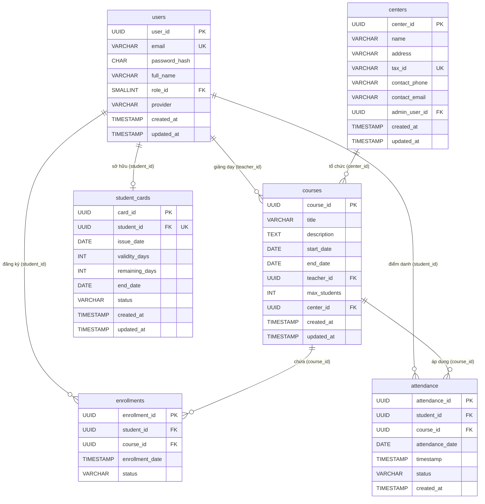

# TÀI LIỆU ĐẶC TẢ TỪ ĐIỂN DỮ LIỆU DOANH NGHIỆP (ENTERPRISE DATA DICTIONARY SPECIFICATION) - PHẦN 2

*   **Mã Bản Thiết Kế:** ARCH-20260829122721
*   **Đường dẫn tệp vật lý:** `./sources/docs/database/ENTERPRISE_DATA_DICTIONARY_SPEC.md`
*   **Không gian tên gói Java (Package Prefix):** `org.nlh4j.membershiphub`
*   **Phiên bản:** 1.0 (Đường Cơ Sở)
*   **Trạng thái:** Đã phê duyệt kiến trúc

---

## 📊 1. SƠ ĐỒ QUAN HỆ THỰC THỂ (ERD) - PHẦN 2

Dưới đây là sơ đồ quan hệ thực thể (Entity Relationship Diagram) thể hiện cấu trúc liên kết dữ liệu giữa các bảng cốt lõi thuộc phân hệ Khóa học (`courses`), Ghi danh (`enrollments`), Điểm danh (`attendance`), và Thẻ thành viên (`student_cards`) trong mối tương quan với các thực thể Hệ thống (`users`, `centers`).



---

## 📑 2. ĐẶC TẢ CHI TIẾT CÁC BẢNG DỮ LIỆU

### 2.1. Bảng `courses` (Khóa học) `[DAT-004]`
Bảng này lưu trữ thông tin chi tiết về các khóa học được tổ chức tại các trung tâm đào tạo, bao gồm thời gian diễn ra, giới hạn học viên và giáo viên phụ trách.

| Tên cột | Kiểu dữ liệu | Ràng buộc | Mô tả | Targeted Tag IDs |
| :--- | :--- | :--- | :--- | :--- |
| `course_id` | `UUID` | `PRIMARY KEY`, `DEFAULT gen_random_uuid()` | Khóa chính, định danh duy nhất cho từng khóa học. | `[DAT-004]` |
| `title` | `VARCHAR(150)` | `NOT NULL` | Tiêu đề khóa học (tối đa 150 ký tự). | `[DAT-004]` |
| `description` | `TEXT` | `NULL` | Mô tả chi tiết về nội dung, mục tiêu khóa học. | `[DAT-004]` |
| `start_date` | `DATE` | `NOT NULL` | Ngày bắt đầu khóa học. | `[DAT-004]` |
| `end_date` | `DATE` | `NOT NULL` | Ngày kết thúc khóa học. Phải lớn hơn hoặc bằng `start_date`. | `[DAT-004]` |
| `teacher_id` | `UUID` | `NOT NULL`, `FOREIGN KEY` | Khóa ngoại liên kết tới `users(user_id)` (vai trò Giáo viên). | `[DAT-004]` |
| `max_students` | `INT` | `NOT NULL`, `DEFAULT 30` | Số lượng học viên tối đa được phép ghi danh (1 - 500). | `[DAT-004]` |
| `center_id` | `UUID` | `NOT NULL`, `FOREIGN KEY` | Khóa ngoại liên kết tới `centers(center_id)`. | `[DAT-004]` |
| `created_at` | `TIMESTAMP` | `NOT NULL`, `DEFAULT CURRENT_TIMESTAMP` | Thời điểm bản ghi được khởi tạo hệ thống. | `[DAT-004]` |
| `updated_at` | `TIMESTAMP` | `NOT NULL`, `DEFAULT CURRENT_TIMESTAMP` | Thời điểm bản ghi được cập nhật gần nhất. | `[DAT-004]` |

*   **Ràng buộc mức bảng (Table Constraints):**
    *   `chk_courses_dates`: `CHECK (end_date >= start_date)` - Đảm bảo ngày kết thúc không xảy ra trước ngày bắt đầu.
    *   `chk_courses_max_students`: `CHECK (max_students > 0 AND max_students <= 500)` - Giới hạn sĩ số lớp học hợp lệ.
    *   `fk_courses_teacher`: `FOREIGN KEY (teacher_id) REFERENCES users(user_id) ON DELETE RESTRICT` - Ngăn chặn xóa giáo viên khi đang có khóa học hoạt động.
    *   `fk_courses_center`: `FOREIGN KEY (center_id) REFERENCES centers(center_id) ON DELETE CASCADE` - Tự động xóa khóa học nếu trung tâm bị giải thể.
*   **Chỉ mục hiệu năng (Performance Indexes):**
    *   `idx_courses_teacher_id` (Non-Unique): Tối ưu hóa truy vấn lịch trình giảng dạy của giáo viên.
    *   `idx_courses_center_id` (Non-Unique): Tối ưu hóa lọc danh sách khóa học theo từng trung tâm (Multi-tenancy).
    *   `idx_courses_dates` (Composite): Tối ưu hóa tìm kiếm khóa học đang diễn ra trong khoảng thời gian xác định.

---

### 2.2. Bảng `enrollments` (Ghi danh khóa học) `[DAT-005]`
Bảng trung gian thể hiện mối quan hệ nhiều-nhiều giữa Học viên (`users`) và Khóa học (`courses`), ghi nhận trạng thái tham gia lớp học.

| Tên cột | Kiểu dữ liệu | Ràng buộc | Mô tả | Targeted Tag IDs |
| :--- | :--- | :--- | :--- | :--- |
| `enrollment_id` | `UUID` | `PRIMARY KEY`, `DEFAULT gen_random_uuid()` | Khóa chính, định danh duy nhất cho lượt ghi danh. | `[DAT-005]` |
| `student_id` | `UUID` | `NOT NULL`, `FOREIGN KEY` | Khóa ngoại liên kết tới `users(user_id)` (vai trò Học viên). | `[DAT-005]` |
| `course_id` | `UUID` | `NOT NULL`, `FOREIGN KEY` | Khóa ngoại liên kết tới `courses(course_id)`. | `[DAT-005]` |
| `enrollment_date`| `TIMESTAMP` | `NOT NULL`, `DEFAULT CURRENT_TIMESTAMP` | Thời điểm học viên thực hiện đăng ký khóa học. | `[DAT-005]` |
| `status` | `VARCHAR(20)` | `NOT NULL`, `DEFAULT 'ACTIVE'` | Trạng thái ghi danh: `ACTIVE`, `DROPPED`, `COMPLETED`. | `[DAT-005]` |

*   **Ràng buộc mức bảng (Table Constraints):**
    *   `uq_enrollments_student_course`: `UNIQUE (student_id, course_id)` - Ngăn chặn một học viên đăng ký trùng lặp một khóa học nhiều lần.
    *   `chk_enrollments_status`: `CHECK (status IN ('ACTIVE', 'DROPPED', 'COMPLETED'))` - Giới hạn các trạng thái nghiệp vụ hợp lệ.
    *   `fk_enrollments_student`: `FOREIGN KEY (student_id) REFERENCES users(user_id) ON DELETE CASCADE`
    *   `fk_enrollments_course`: `FOREIGN KEY (course_id) REFERENCES courses(course_id) ON DELETE RESTRICT` - Không cho phép xóa khóa học khi đã có học viên ghi danh.
*   **Chỉ mục hiệu năng (Performance Indexes):**
    *   `idx_enrollments_student_id` (Non-Unique): Tối ưu hóa truy vấn danh sách khóa học đã đăng ký của một học viên.
    *   `idx_enrollments_course_id` (Non-Unique): Tối ưu hóa thống kê danh sách học viên thuộc một khóa học cụ thể.

---

### 2.3. Bảng `attendance` (Điểm danh lớp học) `[DAT-006]`
Bảng lưu trữ lịch sử quét mã QR điểm danh hàng ngày của học viên tại các buổi học.

| Tên cột | Kiểu dữ liệu | Ràng buộc | Mô tả | Targeted Tag IDs |
| :--- | :--- | :--- | :--- | :--- |
| `attendance_id` | `UUID` | `PRIMARY KEY`, `DEFAULT gen_random_uuid()` | Khóa chính, định danh duy nhất cho phiên điểm danh. | `[DAT-006]` |
| `student_id` | `UUID` | `NOT NULL`, `FOREIGN KEY` | Khóa ngoại liên kết tới `users(user_id)` (Học viên). | `[DAT-006]` |
| `course_id` | `UUID` | `NOT NULL`, `FOREIGN KEY` | Khóa ngoại liên kết tới `courses(course_id)`. | `[DAT-006]` |
| `attendance_date`| `DATE` | `NOT NULL` | Ngày diễn ra buổi điểm danh (không chứa giờ). | `[DAT-006]` |
| `timestamp` | `TIMESTAMP` | `NOT NULL`, `DEFAULT CURRENT_TIMESTAMP` | Thời gian thực tế hệ thống ghi nhận quét mã QR thành công. | `[DAT-006]` |
| `status` | `VARCHAR(20)` | `NOT NULL`, `DEFAULT 'PRESENT'` | Trạng thái điểm danh: `PRESENT`, `ABSENT`, `LATE`. | `[DAT-006]` |
| `created_at` | `TIMESTAMP` | `NOT NULL`, `DEFAULT CURRENT_TIMESTAMP` | Thời điểm tạo bản ghi vật lý trong cơ sở dữ liệu. | `[DAT-006]` |

*   **Ràng buộc mức bảng (Table Constraints):**
    *   `uq_attendance_idempotency`: `UNIQUE (student_id, course_id, attendance_date)` - **Khóa tổng hợp đảm bảo tính Idempotency (Bất biến)**. Ngăn chặn việc ghi nhận điểm danh trùng lặp cho một học viên trong cùng một ngày học của một khóa học cụ thể.
    *   `chk_attendance_status`: `CHECK (status IN ('PRESENT', 'ABSENT', 'LATE'))` - Giới hạn các trạng thái điểm danh hợp lệ.
    *   `fk_attendance_student`: `FOREIGN KEY (student_id) REFERENCES users(user_id) ON DELETE CASCADE`
    *   `fk_attendance_course`: `FOREIGN KEY (course_id) REFERENCES courses(course_id) ON DELETE CASCADE`
*   **Chỉ mục hiệu năng (Performance Indexes):**
    *   `idx_attendance_student_id` (Non-Unique): Tối ưu hóa kết xuất lịch sử chuyên cần cá nhân của học viên.
    *   `idx_attendance_course_date` (Composite): Tối ưu hóa truy vấn danh sách điểm danh của toàn bộ lớp học theo ngày cụ thể.

---

### 2.4. Bảng `student_cards` (Thẻ thành viên học viên) `[DAT-007]`
Bảng quản lý thông tin thẻ thành viên, thời hạn hiệu lực và số ngày sử dụng dịch vụ còn lại của học viên tại hệ thống trung tâm.

| Tên cột | Kiểu dữ liệu | Ràng buộc | Mô tả | Targeted Tag IDs |
| :--- | :--- | :--- | :--- | :--- |
| `card_id` | `UUID` | `PRIMARY KEY`, `DEFAULT gen_random_uuid()` | Khóa chính, định danh duy nhất của thẻ thành viên. | `[DAT-007]` |
| `student_id` | `UUID` | `NOT NULL`, `UNIQUE`, `FOREIGN KEY` | Khóa ngoại liên kết tới `users(user_id)`. Mỗi học viên chỉ sở hữu tối đa một thẻ thành viên hoạt động. | `[DAT-007]` |
| `issue_date` | `DATE` | `NOT NULL` | Ngày phát hành thẻ lần đầu. | `[DAT-007]` |
| `validity_days` | `INT` | `NOT NULL` | Tổng số ngày hiệu lực được cấp (bao gồm cả các đợt gia hạn). | `[DAT-007]` |
| `remaining_days`| `INT` | `NOT NULL` | Số ngày sử dụng dịch vụ còn lại của thẻ. | `[DAT-007]` |
| `end_date` | `DATE` | `NOT NULL` | Ngày hết hạn của thẻ (tính toán động dựa trên `issue_date` và `validity_days`). | `[DAT-007]` |
| `status` | `VARCHAR(20)` | `NOT NULL`, `DEFAULT 'ACTIVE'` | Trạng thái thẻ: `ACTIVE`, `EXPIRED`, `SUSPENDED`. | `[DAT-007]` |
| `created_at` | `TIMESTAMP` | `NOT NULL`, `DEFAULT CURRENT_TIMESTAMP` | Thời điểm khởi tạo thẻ trên hệ thống. | `[DAT-007]` |
| `updated_at` | `TIMESTAMP` | `NOT NULL`, `DEFAULT CURRENT_TIMESTAMP` | Thời điểm cập nhật thông tin thẻ (ví dụ: sau khi gia hạn). | `[DAT-007]` |

*   **Ràng buộc mức bảng (Table Constraints):**
    *   `chk_student_cards_validity`: `CHECK (validity_days > 0 AND remaining_days >= 0)` - Đảm bảo tổng số ngày cấp phải lớn hơn 0 và số ngày còn lại không âm.
    *   `chk_student_cards_dates`: `CHECK (end_date >= issue_date)` - Ngày hết hạn không được nhỏ hơn ngày phát hành.
    *   `chk_student_cards_status`: `CHECK (status IN ('ACTIVE', 'EXPIRED', 'SUSPENDED'))` - Giới hạn trạng thái thẻ.
    *   `fk_student_cards_student`: `FOREIGN KEY (student_id) REFERENCES users(user_id) ON DELETE CASCADE`
*   **Chỉ mục hiệu năng (Performance Indexes):**
    *   `idx_student_cards_status` (Non-Unique): Hỗ trợ các tiến trình quét tự động (Cron Job) để cập nhật trạng thái thẻ hết hạn hàng ngày.
    *   `idx_student_cards_end_date` (Non-Unique): Tối ưu hóa truy vấn lọc danh sách thẻ sắp hết hạn để gửi thông báo nhắc nhở gia hạn.

---

## 🔗 3. ĐẶC TẢ QUAN HỆ KHÓA NGOẠI (FOREIGN KEY RELATIONSHIPS)

Hệ thống áp dụng các quy tắc toàn vẹn tham chiếu nghiêm ngặt tại tầng cơ sở dữ liệu để bảo vệ tính nhất quán của dữ liệu đa người thuê (Multi-tenancy):

1.  **`courses.teacher_id` → `users.user_id`** `[DAT-004]`
    *   *Loại quan hệ:* Một-Nhiều (One-to-Many). Một giáo viên có thể giảng dạy nhiều khóa học, nhưng một khóa học tại một thời điểm chỉ có một giáo viên phụ trách chính.
    *   *Quy tắc toàn vẹn:* `ON DELETE RESTRICT`. Không cho phép xóa tài khoản người dùng mang vai trò Giáo viên nếu tài khoản đó đang được liên kết với ít nhất một khóa học trên hệ thống.
2.  **`courses.center_id` → `centers.center_id`** `[DAT-004]`
    *   *Loại quan hệ:* Một-Nhiều (One-to-Many). Một trung tâm quản lý nhiều khóa học trực thuộc.
    *   *Quy tắc toàn vẹn:* `ON DELETE CASCADE`. Khi một trung tâm bị xóa khỏi hệ thống, toàn bộ các khóa học thuộc trung tâm đó sẽ tự động bị xóa để tránh rác dữ liệu.
3.  **`enrollments.student_id` → `users.user_id`** `[DAT-005]`
    *   *Loại quan hệ:* Một-Nhiều (One-to-Many). Một học viên có thể đăng ký ghi danh vào nhiều khóa học khác nhau.
    *   *Quy tắc toàn vẹn:* `ON DELETE CASCADE`. Nếu tài khoản học viên bị xóa hoàn toàn (tuân thủ quyền xóa dữ liệu GDPR/CCPA `[NFR-008]`), toàn bộ lịch sử ghi danh liên quan sẽ tự động bị xóa bỏ.
4.  **`enrollments.course_id` → `courses.course_id`** `[DAT-005]`
    *   *Loại quan hệ:* Một-Nhiều (One-to-Many). Một khóa học chứa danh sách nhiều học viên ghi danh.
    *   *Quy tắc toàn vẹn:* `ON DELETE RESTRICT`. Ngăn chặn hành vi xóa khóa học khi đang có ít nhất một học viên ở trạng thái ghi danh hoạt động (`ACTIVE`).
5.  **`attendance.student_id` → `users.user_id`** `[DAT-006]`
    *   *Loại quan hệ:* Một-Nhiều (One-to-Many). Một học viên có nhiều lượt điểm danh theo thời gian.
    *   *Quy tắc toàn vẹn:* `ON DELETE CASCADE`. Xóa toàn bộ lịch sử điểm danh của học viên nếu tài khoản học viên bị xóa khỏi hệ thống.
6.  **`attendance.course_id` → `courses.course_id`** `[DAT-006]`
    *   *Loại quan hệ:* Một-Nhiều (One-to-Many). Một khóa học có nhiều lượt điểm danh tương ứng với các ngày học.
    *   *Quy tắc toàn vẹn:* `ON DELETE CASCADE`. Khi một khóa học bị xóa, toàn bộ dữ liệu điểm danh lịch sử của khóa học đó cũng sẽ bị xóa theo.
7.  **`student_cards.student_id` → `users.user_id`** `[DAT-007]`
    *   *Loại quan hệ:* Một-Một (One-to-One) được áp đặt bởi ràng buộc `UNIQUE` trên cột `student_id`. Mỗi học viên chỉ sở hữu duy nhất một thẻ thành viên định danh.
    *   *Quy tắc toàn vẹn:* `ON DELETE CASCADE`. Thẻ thành viên tự động bị hủy và xóa bỏ khi tài khoản học viên sở hữu không còn tồn tại trên hệ thống.

---

## 🛡️ 4. CƠ CHẾ ĐẢM BẢO TÍNH IDEMPOTENCY TRONG ĐIỂM DANH QR `[REQ-013]`

Để giải quyết triệt để bài toán quét trùng lặp mã QR do độ trễ mạng, người dùng bấm liên tục hoặc thiết bị quét gửi nhiều yêu cầu đồng thời trong cùng một mili giây, hệ thống thiết lập cơ chế bảo vệ hai lớp:

### 4.1. Lớp Cơ sở dữ liệu (Database-Level Guard)
Ràng buộc duy nhất tổng hợp (Composite Unique Constraint) được thiết lập cứng trên bảng `attendance`:
```sql
ALTER TABLE attendance 
ADD CONSTRAINT uq_attendance_idempotency UNIQUE (student_id, course_id, attendance_date);
```
*   **Nguyên lý hoạt động:** Khi một yêu cầu điểm danh được gửi tới, hệ thống sẽ cố gắng chèn một bản ghi mới. Nếu cặp giá trị `(student_id, course_id, attendance_date)` đã tồn tại trong ngày hôm đó, PostgreSQL sẽ lập tức chặn giao dịch và ném ra lỗi vi phạm ràng buộc duy nhất (`SQLSTATE 23505: unique_violation`).
*   **Xử lý ngoại lệ phía Backend Quarkus `[EXC-002]`:** Tầng dịch vụ (`AttendanceService`) bắt lỗi `ConstraintViolationException` hoặc `PersistenceException` có mã trạng thái tương ứng, không ném lỗi hệ thống (HTTP 500) mà chuyển đổi thành phản hồi thành công (HTTP 200) kèm theo cờ trạng thái đặc biệt:
    ```json
    {
      "recorded": false,
      "duplicate": true,
      "message": "Điểm danh đã được ghi nhận trước đó trong ngày",
      "timestamp": "2026-08-29T12:27:21Z"
    }
    ```

### 4.2. Lớp Phân phối Sự kiện bất đồng bộ (Event Pipeline Guard) `[ARC-008]`
Khi điểm danh thành công (lần quét đầu tiên trong ngày), hệ thống phát đi một sự kiện `AttendanceRecorded` tới Apache Kafka. Nhờ cơ chế kiểm soát trùng lặp ở tầng cơ sở dữ liệu, các yêu cầu quét trùng lặp tiếp theo sẽ bị chặn ngay lập tức và **không** phát sinh thêm sự kiện thừa lên Kafka, giúp bảo vệ hệ thống thông báo đẩy (`notification-service`) khỏi nguy cơ bị quá tải hoặc gửi tin nhắn rác tới thiết bị di động của học viên.

---

## 📊 5. MA TRẬN TRUY XUẤT NGUỒN GỐC YÊU CẦU (TRACEABILITY MATRIX REFERENCE)

| Mã Yêu Cầu / Kiến Trúc | Thực Thể Cơ Sở Dữ Liệu Liên Quan | Ràng Buộc / Chỉ Mục Thực Thi | Mục Tiêu Nghiệp Vụ & Kỹ Thuật |
| :--- | :--- | :--- | :--- |
| `[DAT-004]` | `courses` | `chk_courses_dates`, `fk_courses_teacher`, `fk_courses_center` | Quản lý vòng đời khóa học, ngăn chặn xung đột lịch trình và bảo vệ toàn vẹn dữ liệu đa người thuê. |
| `[DAT-005]` | `enrollments` | `uq_enrollments_student_course`, `fk_enrollments_course` | Quản lý ghi danh học viên, ngăn chặn đăng ký trùng lặp khóa học. |
| `[DAT-006]` | `attendance` | `uq_attendance_idempotency`, `idx_attendance_course_date` | Lưu trữ lịch sử chuyên cần, tối ưu hóa kết xuất báo cáo điểm danh hàng ngày. |
| `[DAT-007]` | `student_cards` | `chk_student_cards_validity`, `fk_student_cards_student` | Quản lý thời hạn thẻ thành viên, tự động hóa tính toán ngày hết hạn dịch vụ. |
| `[REQ-012]` | `attendance` | `idx_attendance_student_id` | Hỗ trợ quét mã QR base64 từ ứng dụng di động và giải mã định danh học viên nhanh chóng. |
| `[REQ-013]` | `attendance` | `uq_attendance_idempotency` | Thực thi cơ chế điểm danh bất biến (Idempotency), loại bỏ hoàn toàn dữ liệu rác do quét trùng. |
| `[ARC-007]` | `attendance`, `courses` | `fk_attendance_course` | Tích hợp luồng quét QR thời gian thực giữa ứng dụng di động và hệ thống backend Quarkus. |
| `[ARC-008]` | `enrollments`, `attendance` | `uq_enrollments_student_course` | Kích hoạt chuỗi sự kiện bất đồng bộ qua Kafka khi học viên đăng ký hoặc điểm danh thành công. |
| `[NFR-003]` | Toàn bộ các bảng | Mã hóa AES-256 at-rest, TLS 1.3 | Đảm bảo an toàn thông tin, mã hóa dữ liệu nhạy cảm và tuân thủ tiêu chuẩn bảo mật doanh nghiệp. |
| `[NFR-008]` | `enrollments`, `student_cards` | `ON DELETE CASCADE` | Tuân thủ quy định GDPR/CCPA về quyền được xóa dữ liệu cá nhân của học viên. |