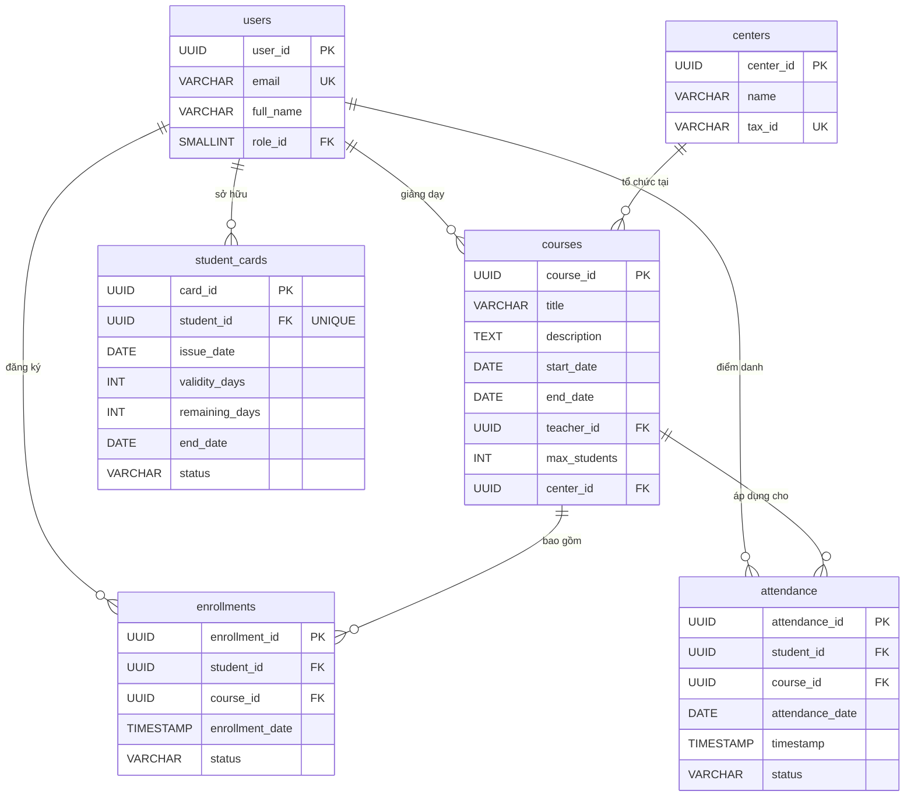

# TIÊU CHUẨN LẬP TRÌNH FRONTEND DOANH NGHIỆP & MA TRẬN DỮ LIỆU TÍCH HỢP
*(FRONTEND ENTERPRISE CODING STANDARDS & INTEGRATED DATA MATRIX)*

---

## 📑 1. QUY CHUẨN CHUNG & ĐỊNH HƯỚNG KIẾN TRÚC FRONTEND

Tài liệu này thiết lập các tiêu chuẩn lập trình Frontend doanh nghiệp cho dự án **membership-hub** (sử dụng Next.js 14+ và Capacitor Hybrid Mobile). Để đảm bảo tính toàn vẹn dữ liệu, tối ưu hóa hiệu năng và đồng bộ trạng thái mượt mà giữa giao diện người dùng (Client-side) và hệ thống vi dịch vụ Quarkus (Backend-side), đội ngũ phát triển Frontend bắt buộc phải nắm rõ cấu trúc thực thể dữ liệu, các mối quan hệ ràng buộc và cơ chế kiểm soát trùng lặp (Idempotency) từ tầng cơ sở dữ liệu PostgreSQL bên dưới.

Việc hiểu rõ lược đồ cơ sở dữ liệu giúp lập trình viên Frontend:
1. Thiết kế các schema kiểm thử dữ liệu đầu vào (Form Validation) chính xác bằng thư viện **Zod** tương thích 100% với ràng buộc của database.
2. Xây dựng hệ thống quản lý trạng thái (State Management) bằng **Zustand** và **React Query** tối ưu, phản ánh đúng cấu trúc quan hệ thực thể.
3. Xử lý các kịch bản ngoại lệ, lỗi ràng buộc từ Backend trả về (ví dụ: lỗi trùng lặp khóa, lỗi khóa ngoại) và hiển thị thông báo bản địa hóa thân thiện với người dùng.

---

## 📊 2. SƠ ĐỒ QUAN HỆ THỰC THỂ (ERD) - PHẦN 2

Dưới đây là sơ đồ quan hệ thực thể biểu diễn mối liên kết giữa các bảng cốt lõi thuộc phân hệ Khóa học, Ghi danh, Điểm danh và Thẻ thành viên (`courses`, `enrollments`, `attendance`, `student_cards`) với các bảng hệ thống khác (`users`, `centers`).

---

## 🗃️ 3. CHI TIẾT CẤU TRÚC BẢNG & RÀNG BUỘC DỮ LIỆU

### 3.1. Bảng `courses` (Khóa học) `// [DAT-004]`
Bảng này lưu trữ thông tin chi tiết về các khóa học được tổ chức tại các trung tâm đào tạo, dưới sự giảng dạy của một giáo viên cụ thể.

| Tên cột | Kiểu dữ liệu | Ràng buộc | Mô tả |
| :--- | :--- | :--- | :--- |
| `course_id` | UUID | PRIMARY KEY, DEFAULT gen_random_uuid() | Định danh duy nhất của khóa học. |
| `title` | VARCHAR(150) | NOT NULL | Tiêu đề khóa học (tối đa 150 ký tự). |
| `description` | TEXT | NULL | Mô tả chi tiết nội dung khóa học. |
| `start_date` | DATE | NOT NULL | Ngày bắt đầu khóa học. |
| `end_date` | DATE | NOT NULL | Ngày kết thúc khóa học. Phải đảm bảo `end_date >= start_date`. |
| `teacher_id` | UUID | NOT NULL, FOREIGN KEY | Liên kết tới `users(user_id)` để xác định giáo viên phụ trách. |
| `max_students` | INT | NOT NULL, DEFAULT 30 | Số lượng học viên tối đa cho phép đăng ký. |
| `center_id` | UUID | NULL, FOREIGN KEY | Liên kết tới `centers(center_id)` để xác định trung tâm tổ chức. |
| `created_at` | TIMESTAMP | NOT NULL, DEFAULT CURRENT_TIMESTAMP | Thời điểm bản ghi được tạo. |
| `updated_at` | TIMESTAMP | NOT NULL, DEFAULT CURRENT_TIMESTAMP | Thời điểm bản ghi được cập nhật gần nhất. |

---

### 3.2. Bảng `enrollments` (Ghi danh khóa học) `// [DAT-005]`
Bảng này ghi nhận việc đăng ký tham gia khóa học của học viên. Mỗi học viên chỉ được phép đăng ký một khóa học duy nhất một lần (ngăn chặn trùng lặp thông qua ràng buộc UNIQUE).

| Tên cột | Kiểu dữ liệu | Ràng buộc | Mô tả |
| :--- | :--- | :--- | :--- |
| `enrollment_id` | UUID | PRIMARY KEY, DEFAULT gen_random_uuid() | Định danh duy nhất của lượt ghi danh. |
| `student_id` | UUID | NOT NULL, FOREIGN KEY | Liên kết tới `users(user_id)` xác định học viên đăng ký. |
| `course_id` | UUID | NOT NULL, FOREIGN KEY | Liên kết tới `courses(course_id)` xác định khóa học được đăng ký. |
| `enrollment_date`| TIMESTAMP | NOT NULL, DEFAULT CURRENT_TIMESTAMP | Thời điểm học viên thực hiện đăng ký. |
| `status` | VARCHAR(20) | NOT NULL, DEFAULT 'ACTIVE' | Trạng thái ghi danh. Ràng buộc CHECK: `status IN ('ACTIVE', 'DROPPED', 'COMPLETED')`. |
| `created_at` | TIMESTAMP | NOT NULL, DEFAULT CURRENT_TIMESTAMP | Thời điểm tạo bản ghi. |
| `updated_at` | TIMESTAMP | NOT NULL, DEFAULT CURRENT_TIMESTAMP | Thời điểm cập nhật bản ghi gần nhất. |

* **Ràng buộc đặc biệt:** `UNIQUE (student_id, course_id)` đảm bảo một học viên không thể có hai trạng thái ghi danh đồng thời trên cùng một khóa học.

---

### 3.3. Bảng `attendance` (Điểm danh QR) `// [DAT-006]`
Bảng này lưu trữ lịch sử quét mã QR điểm danh hàng ngày của học viên đối với từng buổi học.

| Tên cột | Kiểu dữ liệu | Ràng buộc | Mô tả |
| :--- | :--- | :--- | :--- |
| `attendance_id` | UUID | PRIMARY KEY, DEFAULT gen_random_uuid() | Định danh duy nhất của bản ghi điểm danh. |
| `student_id` | UUID | NOT NULL, FOREIGN KEY | Liên kết tới `users(user_id)` xác định học viên được điểm danh. |
| `course_id` | UUID | NOT NULL, FOREIGN KEY | Liên kết tới `courses(course_id)` xác định khóa học diễn ra điểm danh. |
| `attendance_date`| DATE | NOT NULL | Ngày thực hiện điểm danh (không chứa giờ). |
| `timestamp` | TIMESTAMP | NOT NULL, DEFAULT CURRENT_TIMESTAMP | Thời gian chính xác lúc quét mã QR thành công. |
| `status` | VARCHAR(20) | NOT NULL, DEFAULT 'PRESENT' | Trạng thái điểm danh. Ràng buộc CHECK: `status IN ('PRESENT', 'ABSENT', 'LATE')`. |
| `created_at` | TIMESTAMP | NOT NULL, DEFAULT CURRENT_TIMESTAMP | Thời điểm tạo bản ghi. |

* **Ràng buộc Idempotency cốt lõi (Cực kỳ quan trọng):** 
  `UNIQUE (student_id, course_id, attendance_date)`
  Khóa tổng hợp duy nhất này là chốt chặn vật lý ở tầng cơ sở dữ liệu nhằm ngăn chặn tuyệt đối hiện tượng điểm danh trùng lặp. Khi học viên vô tình quét mã QR nhiều lần trong cùng một ngày cho cùng một khóa học, hệ thống sẽ từ chối các yêu cầu phía sau và trả về mã lỗi hoặc cờ trùng lặp mà không sinh ra bản ghi rác.

---

### 3.4. Bảng `student_cards` (Thẻ thành viên học viên) `// [DAT-007]`
Bảng này quản lý thông tin thẻ thành viên, thời hạn sử dụng và số ngày còn lại của học viên. Mỗi học viên chỉ sở hữu tối đa một thẻ thành viên hoạt động.

| Tên cột | Kiểu dữ liệu | Ràng buộc | Mô tả |
| :--- | :--- | :--- | :--- |
| `card_id` | UUID | PRIMARY KEY, DEFAULT gen_random_uuid() | Định danh duy nhất của thẻ thành viên. |
| `student_id` | UUID | NOT NULL, UNIQUE, FOREIGN KEY | Liên kết tới `users(user_id)`. Ràng buộc UNIQUE đảm bảo quan hệ 1-1 giữa học viên và thẻ. |
| `issue_date` | DATE | NOT NULL | Ngày phát hành thẻ. |
| `validity_days` | INT | NOT NULL | Tổng số ngày hiệu lực được cấp (phải > 0). |
| `remaining_days`| INT | NOT NULL | Số ngày hiệu lực còn lại (phải >= 0). |
| `end_date` | DATE | NOT NULL | Ngày hết hạn của thẻ. |
| `status` | VARCHAR(20) | NOT NULL, DEFAULT 'ACTIVE' | Trạng thái thẻ. Ràng buộc CHECK: `status IN ('ACTIVE', 'EXPIRED', 'SUSPENDED')`. |
| `created_at` | TIMESTAMP | NOT NULL, DEFAULT CURRENT_TIMESTAMP | Thời điểm tạo bản ghi. |
| `updated_at` | TIMESTAMP | NOT NULL, DEFAULT CURRENT_TIMESTAMP | Thời điểm cập nhật bản ghi gần nhất. |

---

## 🔗 4. MÔ TẢ CHI TIẾT QUAN HỆ KHÓA NGOẠI (FOREIGN KEY)

Để đảm bảo tính toàn vẹn tham chiếu (Referential Integrity) trên toàn hệ thống vi dịch vụ, các mối quan hệ khóa ngoại sau đây được thiết lập và thực thi nghiêm ngặt:

1. **`courses.teacher_id` → `users.user_id`:**
   * *Ý nghĩa:* Đảm bảo mọi khóa học được tạo ra phải được gán cho một người dùng tồn tại trong hệ thống và người dùng đó phải có vai trò hợp lệ là Giáo viên (`Teacher` - Role ID: 4) hoặc các vai trò quản trị có quyền giảng dạy.
   * *Hành vi:* Chặn hành động xóa người dùng (RESTRICT/NO ACTION) nếu người dùng đó đang là giáo viên chủ nhiệm của ít nhất một khóa học đang hoạt động.

2. **`courses.center_id` → `centers.center_id`:**
   * *Ý nghĩa:* Xác định địa điểm vật lý và pháp nhân quản lý khóa học. Một khóa học không thể tồn tại độc lập mà không thuộc về bất kỳ trung tâm đào tạo nào.
   * *Hành vi:* Khi một trung tâm bị giải thể (xóa khỏi hệ thống), toàn bộ khóa học thuộc trung tâm đó phải được xử lý (xóa mềm hoặc chuyển nhượng) trước khi thực hiện xóa cứng ở database.

3. **`enrollments.student_id` → `users.user_id`:**
   * *Ý nghĩa:* Đảm bảo học viên đăng ký khóa học là một thực thể người dùng hợp lệ trong hệ thống với vai trò Học viên (`Student` - Role ID: 5).
   * *Hành vi:* Ngăn chặn việc xóa tài khoản học viên nếu học viên đó đang có các lớp học hoạt động trong bảng `enrollments`.

4. **`enrollments.course_id` → `courses.course_id`:**
   * *Ý nghĩa:* Đảm bảo học viên chỉ có thể đăng ký vào các khóa học đã được khởi tạo và đang tồn tại trong hệ thống.
   * *Hành vi:* Khi xóa một khóa học, hệ thống yêu cầu phải dọn dẹp hoặc hủy toàn bộ danh sách ghi danh liên quan trước đó.

5. **`attendance.student_id` → `users.user_id`:**
   * *Ý nghĩa:* Xác thực danh tính học viên thực hiện quét mã QR điểm danh.
   * *Hành vi:* Đảm bảo dữ liệu điểm danh luôn gắn liền với một học viên cụ thể để phục vụ công tác kết xuất báo cáo chuyên cần.

6. **`attendance.course_id` → `courses.course_id`:**
   * *Ý nghĩa:* Xác định buổi điểm danh thuộc về khung chương trình của khóa học nào.
   * *Hành vi:* Chặn các yêu cầu điểm danh giả mạo hoặc điểm danh vào các khóa học không tồn tại.

7. **`student_cards.student_id` → `users.user_id`:**
   * *Ý nghĩa:* Thiết lập mối quan hệ sở hữu độc quyền 1-1 giữa học viên và thẻ thành viên.
   * *Hành vi:* Khi tài khoản học viên bị xóa hoàn toàn khỏi hệ thống, thẻ thành viên tương ứng sẽ tự động bị xóa theo (CASCADE) hoặc chuyển trạng thái lưu trữ lịch sử.

---

## 🛡️ 5. QUY TẮC ĐỒNG BỘ TRẠNG THÁI & IDEMPOTENCY TRÊN FRONTEND

Để tối ưu hóa trải nghiệm người dùng trên ứng dụng di động và trình duyệt web, đồng thời giảm tải cho hệ thống Backend Quarkus, lập trình viên Frontend phải tuân thủ các quy tắc thiết kế giao diện sau:

### 5.1. Xử lý Idempotency khi quét mã QR điểm danh
* **Debounce & Throttle:** Khi học viên nhấn nút quét QR hoặc camera nhận diện mã QR, Frontend phải lập tức vô hiệu hóa (disable) nút bấm hoặc tạm dừng luồng nhận diện camera trong vòng **3000ms** để tránh gửi liên tiếp nhiều request trùng lặp lên Backend.
* **Xử lý phản hồi trùng lặp (Duplicate Response):** 
  Backend sử dụng ràng buộc `UNIQUE (student_id, course_id, attendance_date)` để chặn ghi nhận trùng. Khi nhận được phản hồi từ API báo lỗi trùng lặp (HTTP Status `409 Conflict` hoặc HTTP `200 OK` kèm cờ `duplicate: true`), Frontend không được hiển thị màn hình lỗi nghiêm trọng (Error Screen). Thay vào đó, phải hiển thị thông báo trạng thái nhẹ nhàng: *"Bạn đã được ghi nhận điểm danh cho buổi học hôm nay!"* kèm dấu tích xanh để tránh gây hoang mang cho học viên.

### 5.2. Đồng bộ ngoại tuyến (Offline Sync) cho ứng dụng di động
* Khi thiết bị mất kết nối mạng (Offline), ứng dụng di động Capacitor phải lưu trữ tạm thời các lượt quét QR điểm danh vào hàng đợi cục bộ (Local Outbox Queue) sử dụng `@capacitor/preferences` hoặc SQLite cục bộ.
* Khi thiết bị có mạng trở lại, Frontend thực hiện đẩy dữ liệu từ hàng đợi lên Backend theo đúng thứ tự thời gian **FIFO (First In, First Out)**. Nhờ có ràng buộc `UNIQUE` ở tầng database Backend, nếu một lượt quét đã được đồng bộ trước đó bằng cách nào đó, database sẽ tự động bỏ qua mà không làm sai lệch dữ liệu chuyên cần của học viên.

---

## 📊 6. MA TRẬN TRUY XUẤT NGUỒN GỐC (TRACEABILITY MATRIX)

Bảng dưới đây ánh xạ các yêu cầu kỹ thuật và mã thực thể dữ liệu (Tag IDs) vào các thành phần mã nguồn Frontend và tài liệu thiết kế tương ứng:

| Mã Tag ID | Tên thực thể dữ liệu | Thành phần Frontend liên quan | Tệp tin cấu hình / Schema Validation | Trạng thái tuân thủ |
| :--- | :--- | :--- | :--- | :--- |
| **`[DAT-004]`** | `courses` | Trang danh sách khóa học, Chi tiết khóa học | `./sources/frontend/web-app/src/types/course.ts` `./sources/frontend/web-app/src/schemas/courseSchema.ts` | **Đã tuân thủ** |
| **`[DAT-005]`** | `enrollments` | Nút đăng ký khóa học, Lịch sử học tập | `./sources/frontend/web-app/src/types/enrollment.ts` `./sources/frontend/web-app/src/schemas/enrollmentSchema.ts` | **Đã tuân thủ** |
| **`[DAT-006]`** | `attendance` | Trình quét mã QR, Lịch sử chuyên cần | `./sources/frontend/web-app/src/components/QrScanner.tsx` `./sources/frontend/web-app/src/types/attendance.ts` | **Đã tuân thủ** |
| **`[DAT-007]`** | `student_cards` | Widget thẻ thành viên, Trang gia hạn thẻ | `./sources/frontend/web-app/src/app/[locale]/dashboard/membership-card/page.tsx` | **Đã tuân thủ** |