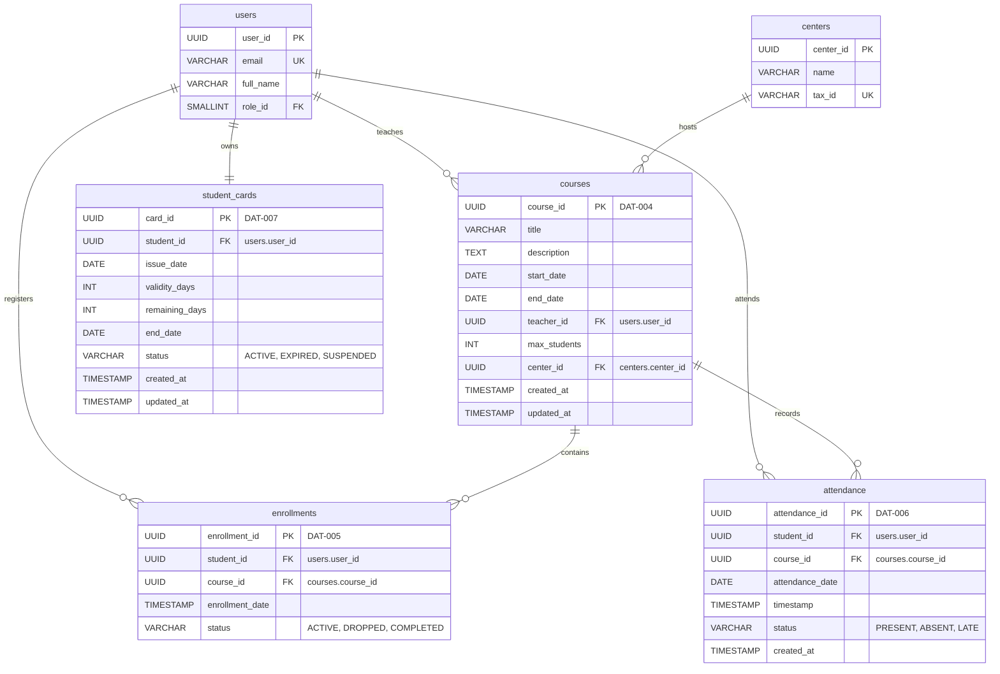
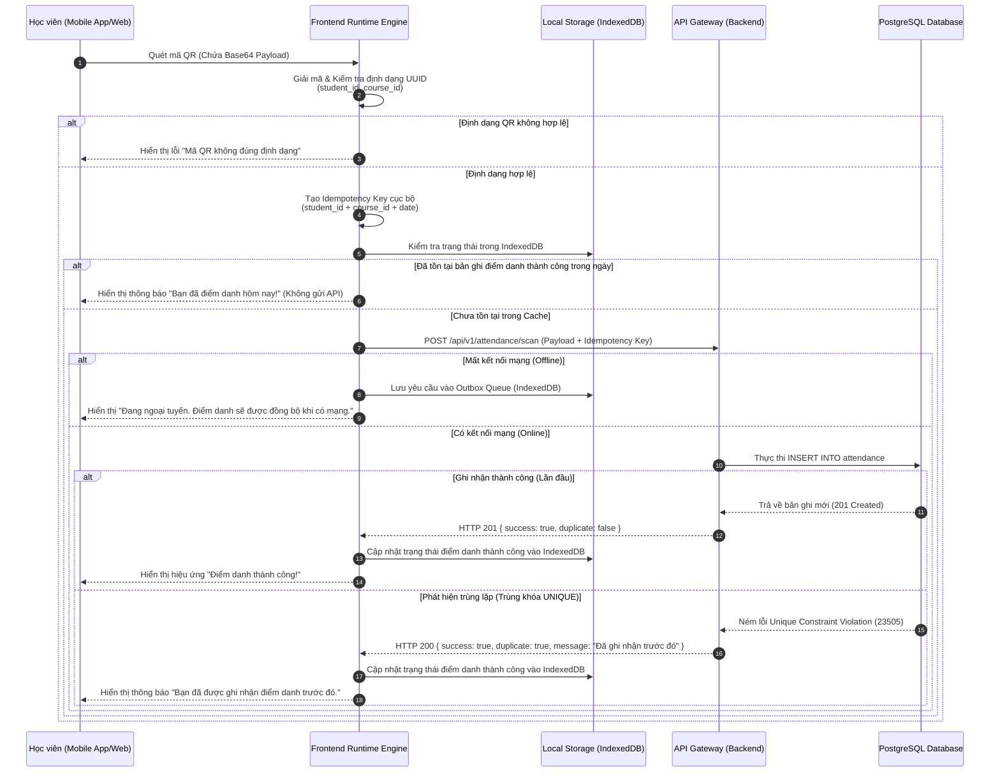

# FRONTEND WEB RUNTIME ENGINE FLOWS & DATA MODEL SPECIFICATION (PHASE 3)

Tài liệu này đặc tả chi tiết mô hình dữ liệu cốt lõi (Phần 2) và các luồng xử lý tương tác của Frontend Web Runtime Engine đối với các thực thể nghiệp vụ bao gồm Khóa học (`courses`), Đăng ký học (`enrollments`), Điểm danh (`attendance`), và Thẻ thành viên (`student_cards`). Sự phối hợp giữa tầng dữ liệu quan hệ phía Backend và cơ chế quản lý trạng thái, đồng bộ bất đồng bộ phía Frontend đảm bảo tính toàn vẹn dữ liệu, hiệu năng tối ưu và khả năng chống trùng lặp (idempotency) tuyệt đối.

---

## 📊 1. MA TRẬN TRUY XUẤT NGUỒN GỐC (TRACEABILITY MATRIX)

Dưới đây là bảng ánh xạ các thành phần dữ liệu và luồng xử lý được đặc tả trong tài liệu này với các yêu cầu hệ thống tương ứng:

| Mã Thực Thể / Luồng Nghiệp Vụ | Mã Thẻ Mục Tiêu (Tag ID) | Mô Tả Kỹ Thuật |
| :--- | :--- | :--- |
| **Thực thể Khóa học (Courses)** | `[DAT-004]` | Định nghĩa cấu trúc bảng lưu trữ thông tin khóa học, lịch trình và phân công giáo viên. |
| **Thực thể Đăng ký (Enrollments)** | `[DAT-005]` | Định nghĩa cấu trúc bảng liên kết học viên với khóa học, trạng thái tham gia. |
| **Thực thể Điểm danh (Attendance)** | `[DAT-006]` | Định nghĩa cấu trúc bảng ghi nhận lịch sử điểm danh, tích hợp khóa chống trùng lặp. |
| **Thực thể Thẻ thành viên (Student Cards)** | `[DAT-007]` | Định nghĩa cấu trúc bảng quản lý thời hạn, số ngày còn lại và trạng thái thẻ học viên. |
| **Cơ chế Chống trùng lặp QR** | `[REQ-013]`, `[EXC-002]` | Thực thi ràng buộc duy nhất trên tổ hợp khóa tự nhiên để ngăn chặn điểm danh trùng lặp. |
| **Luồng Đồng bộ Ngoại tuyến** | `[REQ-012]`, `[EXC-001]` | Cơ chế lưu trữ tạm thời và phát lại yêu cầu điểm danh khi mất kết nối mạng. |

---

## 🗺️ 2. SƠ ĐỒ QUAN HỆ THỰC THỂ (ERD) - PHẦN 2

Dưới đây là sơ đồ quan hệ thực thể mô tả mối liên kết chặt chẽ giữa các bảng dữ liệu cốt lõi thuộc phân hệ Khóa học, Điểm danh và Thẻ thành viên. Sơ đồ này kế thừa các thực thể Người dùng (`users`) và Trung tâm (`centers`) từ Phần 1.

---

## 🗃️ 3. ĐẶC TẢ CHI TIẾT CÁC BẢNG DỮ LIỆU

### 3.1. Bảng Khóa Học (`courses`) `[DAT-004]`
Bảng này lưu trữ thông tin chi tiết về các khóa học được tổ chức tại các trung tâm, bao gồm thời gian diễn ra, giới hạn sĩ số và giáo viên phụ trách.

| Tên cột | Kiểu dữ liệu | Ràng buộc | Mô tả |
| :--- | :--- | :--- | :--- |
| `course_id` | UUID | PRIMARY KEY, DEFAULT gen_random_uuid() | Khóa chính định danh duy nhất cho từng khóa học. |
| `title` | VARCHAR(150) | NOT NULL | Tiêu đề hoặc tên của khóa học. |
| `description` | TEXT | NULL | Mô tả chi tiết về nội dung, mục tiêu khóa học. |
| `start_date` | DATE | NOT NULL | Ngày bắt đầu khóa học (phải nhỏ hơn hoặc bằng `end_date`). |
| `end_date` | DATE | NOT NULL | Ngày kết thúc khóa học. |
| `teacher_id` | UUID | NOT NULL, FOREIGN KEY | ID của giáo viên phụ trách, liên kết đến `users(user_id)`. |
| `max_students` | INT | NOT NULL, DEFAULT 30 | Số lượng học viên tối đa được phép đăng ký vào khóa học. |
| `center_id` | UUID | NOT NULL, FOREIGN KEY | ID của trung tâm tổ chức khóa học, liên kết đến `centers(center_id)`. |
| `created_at` | TIMESTAMP | NOT NULL, DEFAULT CURRENT_TIMESTAMP | Thời điểm bản ghi được khởi tạo trong hệ thống. |
| `updated_at` | TIMESTAMP | NOT NULL, DEFAULT CURRENT_TIMESTAMP | Thời điểm bản ghi được cập nhật gần nhất. |

### 3.2. Bảng Đăng Ký Học (`enrollments`) `[DAT-005]`
Bảng trung gian thể hiện mối quan hệ nhiều-nhiều giữa Học viên (`users` có vai trò Student) và Khóa học (`courses`).

| Tên cột | Kiểu dữ liệu | Ràng buộc | Mô tả |
| :--- | :--- | :--- | :--- |
| `enrollment_id` | UUID | PRIMARY KEY, DEFAULT gen_random_uuid() | Khóa chính định danh duy nhất cho lượt đăng ký học. |
| `student_id` | UUID | NOT NULL, FOREIGN KEY | ID của học viên đăng ký, liên kết đến `users(user_id)`. |
| `course_id` | UUID | NOT NULL, FOREIGN KEY | ID của khóa học được đăng ký, liên kết đến `courses(course_id)`. |
| `enrollment_date`| TIMESTAMP | NOT NULL, DEFAULT CURRENT_TIMESTAMP | Thời điểm học viên thực hiện đăng ký khóa học thành công. |
| `status` | VARCHAR(20) | NOT NULL, DEFAULT 'ACTIVE' | Trạng thái tham gia khóa học. Ràng buộc CHECK: `('ACTIVE', 'DROPPED', 'COMPLETED')`. |

*   **Ràng buộc duy nhất (Unique Constraint):** Tổ hợp `(student_id, course_id)` là duy nhất để đảm bảo một học viên không thể đăng ký trùng lặp một khóa học nhiều lần.

### 3.3. Bảng Điểm Danh (`attendance`) `[DAT-006]`
Bảng ghi nhận lịch sử điểm danh hàng ngày của học viên đối với từng buổi học cụ thể thuộc khóa học đã đăng ký.

| Tên cột | Kiểu dữ liệu | Ràng buộc | Mô tả |
| :--- | :--- | :--- | :--- |
| `attendance_id` | UUID | PRIMARY KEY, DEFAULT gen_random_uuid() | Khóa chính định danh duy nhất cho lượt điểm danh. |
| `student_id` | UUID | NOT NULL, FOREIGN KEY | ID của học viên được điểm danh, liên kết đến `users(user_id)`. |
| `course_id` | UUID | NOT NULL, FOREIGN KEY | ID của khóa học diễn ra buổi điểm danh, liên kết đến `courses(course_id)`. |
| `attendance_date`| DATE | NOT NULL | Ngày diễn ra buổi học thực tế được điểm danh. |
| `timestamp` | TIMESTAMP | NOT NULL, DEFAULT CURRENT_TIMESTAMP | Thời điểm chính xác hệ thống ghi nhận quét mã QR thành công. |
| `status` | VARCHAR(20) | NOT NULL, DEFAULT 'PRESENT' | Trạng thái điểm danh của học viên. Ràng buộc CHECK: `('PRESENT', 'ABSENT', 'LATE')`. |
| `created_at` | TIMESTAMP | NOT NULL, DEFAULT CURRENT_TIMESTAMP | Thời điểm bản ghi điểm danh được tạo lập trên hệ thống. |

*   **Khóa tổng hợp chống trùng lặp (Idempotency Composite Key):** Tổ hợp `(student_id, course_id, attendance_date)` được cấu hình ràng buộc `UNIQUE` tuyệt đối. Điều này ngăn chặn việc ghi nhận điểm danh lần thứ hai cho cùng một học viên trong cùng một ngày đối với một khóa học, bất kể số lần quét mã QR của học viên đó.

### 3.4. Bảng Thẻ Thành Viên (`student_cards`) `[DAT-007]`
Bảng quản lý thông tin thẻ thành viên, thời hạn sử dụng và số ngày còn lại của học viên để kiểm soát quyền truy cập và đăng ký học.

| Tên cột | Kiểu dữ liệu | Ràng buộc | Mô tả |
| :--- | :--- | :--- | :--- |
| `card_id` | UUID | PRIMARY KEY, DEFAULT gen_random_uuid() | Khóa chính định danh duy nhất của thẻ thành viên. |
| `student_id` | UUID | NOT NULL, UNIQUE, FOREIGN KEY | ID của học viên sở hữu thẻ, liên kết đến `users(user_id)`. Mỗi học viên chỉ có tối đa 1 thẻ hoạt động. |
| `issue_date` | DATE | NOT NULL | Ngày phát hành hoặc kích hoạt thẻ thành viên. |
| `validity_days` | INT | NOT NULL | Tổng số ngày hiệu lực được cấp (ví dụ: 30, 90, 365 ngày). Ràng buộc CHECK: `validity_days > 0`. |
| `remaining_days`| INT | NOT NULL | Số ngày hiệu lực còn lại của thẻ. Ràng buộc CHECK: `remaining_days >= 0`. |
| `end_date` | DATE | NOT NULL | Ngày hết hạn chính thức của thẻ thành viên (`end_date = issue_date + validity_days`). |
| `status` | VARCHAR(20) | NOT NULL, DEFAULT 'ACTIVE' | Trạng thái hoạt động của thẻ. Ràng buộc CHECK: `('ACTIVE', 'EXPIRED', 'SUSPENDED')`. |
| `created_at` | TIMESTAMP | NOT NULL, DEFAULT CURRENT_TIMESTAMP | Thời điểm thẻ được khởi tạo trên hệ thống. |
| `updated_at` | TIMESTAMP | NOT NULL, DEFAULT CURRENT_TIMESTAMP | Thời điểm cập nhật thông tin thẻ gần nhất (ví dụ: khi gia hạn). |

---

## 🔗 4. ĐẶC TẢ QUAN HỆ KHÓA NGOẠI (FOREIGN KEY CONSTRAINTS)

Để đảm bảo tính toàn vẹn tham chiếu (Referential Integrity) giữa các phân hệ dịch vụ, các ràng buộc khóa ngoại sau đây được thiết lập cứng ở tầng cơ sở dữ liệu:

1.  **`courses.teacher_id` → `users.user_id`:**
    *   *Mục đích:* Đảm bảo mọi khóa học đều phải được gán cho một người dùng tồn tại trong hệ thống.
    *   *Hành vi:* `ON DELETE RESTRICT` - Không cho phép xóa người dùng nếu họ đang là giáo viên phụ trách của ít nhất một khóa học.
2.  **`courses.center_id` → `centers.center_id`:**
    *   *Mục đích:* Liên kết khóa học với trung tâm vật lý tổ chức.
    *   *Hành vi:* `ON DELETE CASCADE` - Khi một trung tâm bị giải thể, toàn bộ các khóa học thuộc trung tâm đó sẽ tự động bị xóa bỏ.
3.  **`enrollments.student_id` → `users.user_id`:**
    *   *Mục đích:* Xác định danh tính học viên tham gia khóa học.
    *   *Hành vi:* `ON DELETE RESTRICT` - Ngăn chặn việc xóa tài khoản học viên khi học viên đó đang có lịch sử đăng ký khóa học hoạt động.
4.  **`enrollments.course_id` → `courses.course_id`:**
    *   *Mục đích:* Xác định khóa học mà học viên đăng ký tham gia.
    *   *Hành vi:* `ON DELETE CASCADE` - Nếu khóa học bị hủy bỏ, các bản ghi đăng ký liên quan sẽ tự động bị xóa.
5.  **`attendance.student_id` → `users.user_id`:**
    *   *Mục đích:* Xác định học viên được ghi nhận điểm danh.
    *   *Hành vi:* `ON DELETE RESTRICT` - Bảo vệ dữ liệu lịch sử điểm danh, không cho phép xóa học viên nếu đã có dữ liệu điểm danh.
6.  **`attendance.course_id` → `courses.course_id`:**
    *   *Mục đích:* Xác định buổi học thuộc khóa học nào được điểm danh.
    *   *Hành vi:* `ON DELETE RESTRICT` - Ngăn chặn xóa khóa học nếu đã phát sinh dữ liệu điểm danh thực tế để phục vụ mục đích đối soát tài chính và chuyên cần.
7.  **`student_cards.student_id` → `users.user_id`:**
    *   *Mục đích:* Thiết lập quan hệ 1-1 giữa học viên và thẻ thành viên.
    *   *Hành vi:* `ON DELETE CASCADE` - Khi tài khoản học viên bị xóa hoàn toàn khỏi hệ thống, thẻ thành viên tương ứng cũng sẽ bị hủy bỏ.

---

## 🛡️ 5. CƠ CHẾ CHỐNG TRÙNG LẶP (IDEMPOTENCY) & ĐỒNG BỘ PHÍA FRONTEND

### 5.1. Tầm Quan Trọng Của Khóa Tổng Hợp `UNIQUE (student_id, course_id, attendance_date)`
Trong kịch bản vận hành thực tế, học viên sử dụng thiết bị di động để quét mã QR điểm danh tại lớp học. Các sự cố về mạng (mất kết nối tạm thời, độ trễ mạng cao) thường dẫn đến việc học viên nhấn nút quét nhiều lần, hoặc ứng dụng gửi liên tiếp các yêu cầu trùng lặp lên máy chủ.

Ràng buộc `UNIQUE (student_id, course_id, attendance_date)` trong bảng `attendance` đóng vai trò là **tuyến phòng thủ cuối cùng (Ultimate Guardrail)** ở tầng lưu trữ:
*   **Ngăn chặn tuyệt đối dữ liệu rác:** Đảm bảo mỗi học viên chỉ có duy nhất một trạng thái điểm danh (`PRESENT`, `LATE`, hoặc `ABSENT`) cho một khóa học trong một ngày nhất định.
*   **Hỗ trợ cơ chế Idempotent API:** Khi Backend nhận được yêu cầu điểm danh trùng lặp, thay vì ném ra lỗi hệ thống nghiêm trọng (500 Internal Server Error), hệ thống sẽ bắt ngoại lệ vi phạm ràng buộc duy nhất (`UniqueViolationException` / PostgreSQL Error Code `23505`) và trả về mã trạng thái thành công `200 OK` kèm theo cờ hiệu `duplicate: true` để Frontend xử lý mượt mà.

### 5.2. Luồng Xử Lý Của Frontend Web Runtime Engine
Frontend Web Runtime Engine (Next.js / React Query / Zustand) thực thi luồng quét mã QR và xử lý phản hồi theo sơ đồ tuần tự dưới đây để tối ưu hóa trải nghiệm người dùng và đảm bảo tính nhất quán dữ liệu:

### 5.3. Cơ Chế Đồng Bộ Ngoại Tuyến (Offline Outbox Pattern) Phía Frontend
Để đáp ứng yêu cầu hoạt động ổn định trong điều kiện kết nối mạng chập chờn tại các phòng học, Frontend Runtime Engine tích hợp cơ chế Outbox Pattern sử dụng IndexedDB:
1.  **Lưu trữ tạm thời:** Khi thiết bị ngoại tuyến, yêu cầu điểm danh được đóng gói kèm theo nhãn thời gian quét thực tế và lưu vào hàng đợi `attendance_outbox` trong IndexedDB theo nguyên tắc **FIFO (First-In, First-Out)**.
2.  **Lắng nghe trạng thái mạng:** Engine đăng ký sự kiện `window.addEventListener('online', ...)` của trình duyệt.
3.  **Phát lại tự động (Background Sync):** Ngay khi thiết bị có kết nối mạng trở lại, một tiến trình chạy ngầm (Background Worker) sẽ tuần tự lấy các yêu cầu từ `attendance_outbox` gửi lên Backend. Nhờ có khóa tổng hợp `UNIQUE` ở Backend, nếu tiến trình phát lại gửi trùng lặp dữ liệu đã được đồng bộ trước đó bằng kênh khác, hệ thống vẫn đảm bảo không sinh ra bản ghi thừa và tự động làm sạch hàng đợi ngoại tuyến một cách an toàn.