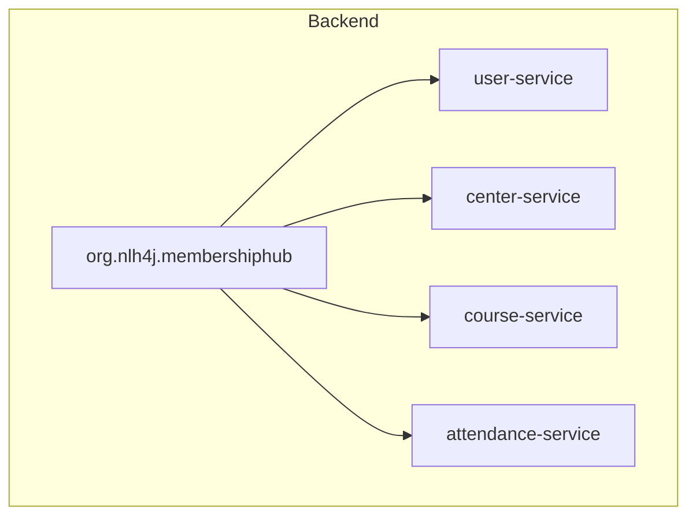

```markdown
# 📊 Scaffolding Architecture of Membership Hub
## 📁 Overview
The Membership Hub project is structured as a multi-module Maven project with a root directory `./sources/backend` containing four microservices: `user-service`, `center-service`, `course-service`, and `attendance-service`. The Java package prefix base is `org.nlh4j.membershiphub`.

## 📁 Backend Structure
The backend structure is as follows:


## 📊 Dependency Versions
The following dependency versions are used:
* Quarkus: 3.15.1
* Java: 17 LTS

## 📁 Frontend Structure
The frontend is built using Next.js 14.2.15 with App Router, and the following dependencies:
* `next-intl` for internationalization
* `nativewind` for styling
* `zustand` for state management
* `react-hook-form` for form binding
* `zod` for validation