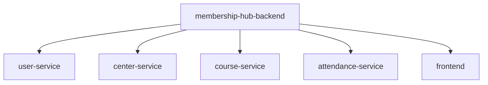

```markdown
# 📊 Scaffolding Architecture for Membership Hub
## 📁 Overview
The Membership Hub project follows a multi-module Maven structure with a root `membership-hub-backend` and four microservices: `user-service`, `center-service`, `course-service`, and `attendance-service`. All Java packages adhere to the `org.nlh4j.membershiphub` prefix.

## 📁 1. Maven Project Structure


## 📁 2. Java Package Naming Convention
All Java packages follow the naming convention: `org.nlh4j.membershiphub.<service-name>`

## 📊 3. Technology Stack & Dependency Versions
| Technology | Version |
| --- | --- |
| Java | 17 LTS |
| Quarkus | 3.15.1 |
| Maven | 3.9 |

### 🔑 3.1. Backend Dependencies
| Dependency | Version |
| --- | --- |
| Quarkus RESTEasy Reactive | 3.15.1 |