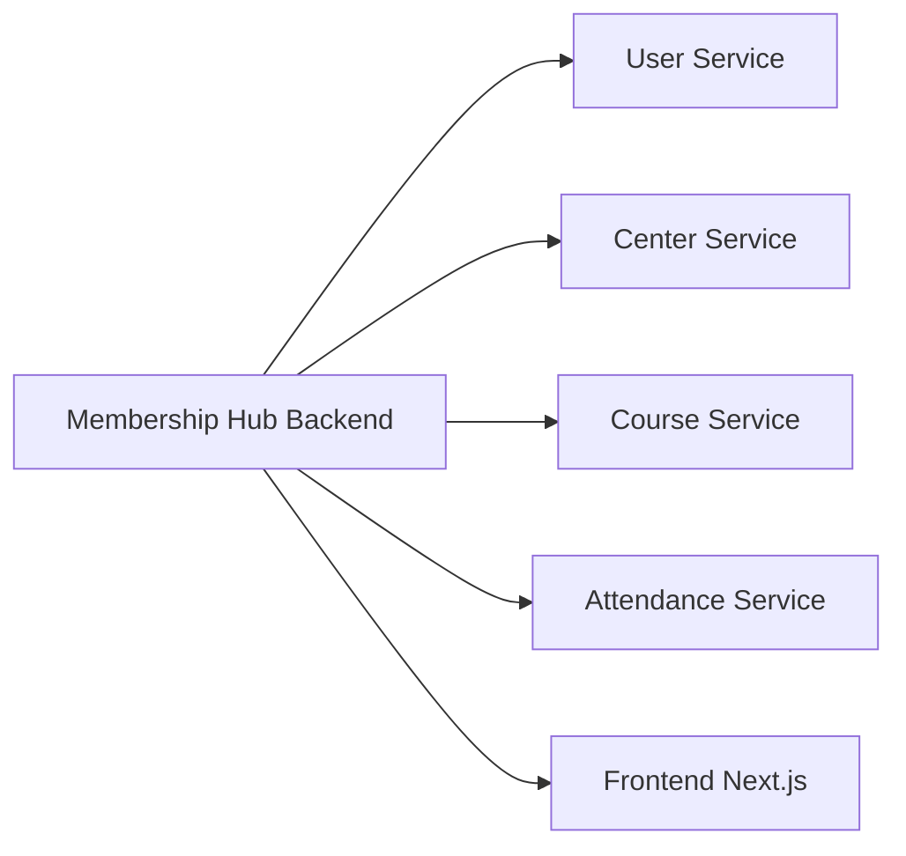

```markdown
# 📊 Scaffolding Architecture of Membership Hub
## 📈 Overview
The Membership Hub project adopts a multi-module Maven architecture, comprising a root `membership-hub-backend` module and four microservice sub-modules: `user-service`, `center-service`, `course-service`, and `attendance-service`. All Java packages adhere to the `org.nlh4j.membershiphub` prefix to ensure uniformity and traceability.

## 📁 Module Structure


## 📊 Dependency Versions
The project utilizes the following standardized dependency versions:

* **Quarkus:** 3.15.1
* **Java:** 17 LTS
* **Spring Boot:** Not used (Quarkus is the runtime)
* **Hibernate ORM:** Included in Quarkus BOM
* **PostgreSQL JDBC Driver:** 42.7.3

## 📁 Frontend Next.js Structure
The frontend is built using Next