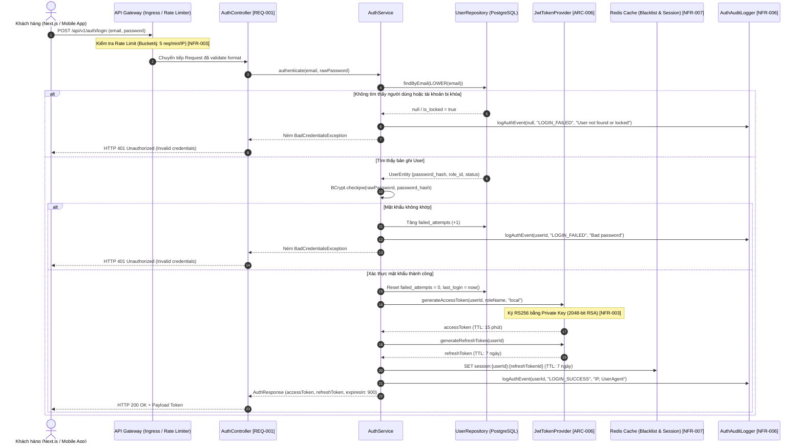
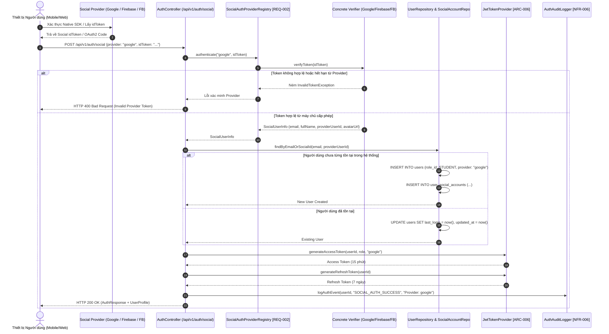
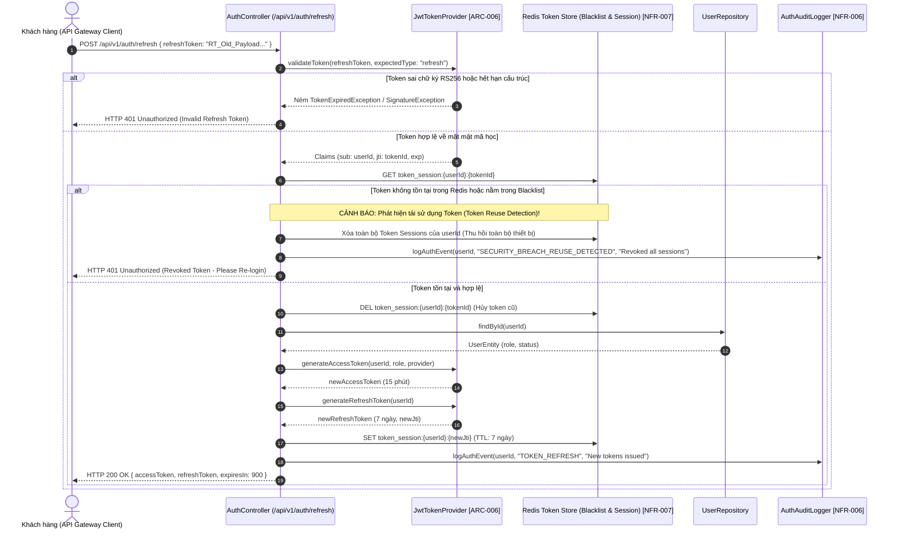
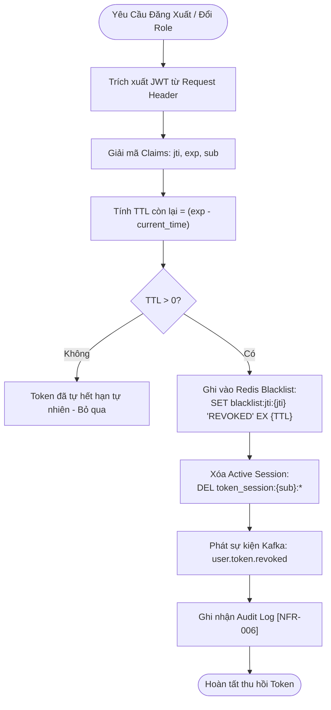

```markdown
# 🏛️ CENTRAL LOGGING, MONITORING, AND ENTERPRISE AUTHENTICATION ARCHITECTURE
*(Identity Federation, Token Governance, Observability Framework, and Cryptographic Security Baseline)*

---

## 📑 BẢNG KIỂM SOÁT TÀI LIỆU VÀ ĐỊNH DANH HỆ THỐNG

| Thuộc tính hệ thống | Chi tiết định danh kỹ thuật |
| :--- | :--- |
| **Mã Bản Thiết Kế** | `ARCH-20260829223421-SEC-AUTH` |
| **Hệ Thống Mục Tiêu** | `membership-hub` Enterprise Platform |
| **Gói Java Chuẩn Hóa** | `org.nlh4j.membershiphub` |
| **Đường Dẫn Vật Lý Lưu Trữ** | `./sources/docs/security/CENTRAL_MONITORING_LOGGING_ARCHITECTURE.md` |
| **Tài Liệu Bảo Mật Liên Kết** | `./sources/docs/security-authentication.md` |
| **Phiên Bản Kiến Trúc** | `1.0.0-RELEASE` |
| **Trạng Thái Kiểm Định** | Đã Phê Duyệt Kiến Trúc Doanh Nghiệp (Enterprise Architectural Baseline) |

---

## 🎯 1. TỔNG QUAN VÀ MỤC TIÊU KIẾN TRÚC

Tài liệu này đặc tả toàn bộ hạ tầng bảo mật, xác thực lai (Hybrid Authentication OAuth2 / OpenID Connect + JWT), ủy quyền dựa trên vai trò (Role-Based Access Control - RBAC), hệ thống giám sát tập trung và cơ chế kiểm toán kiểm tra dấu vết (Audit Trail Logging) cho nền tảng **Membership Hub**. 

Hệ thống được thiết kế dựa trên Quarkus 3.15 LTS Native Runtime, tích hợp SmallRye JWT, SmallRye Reactive Messaging Kafka, Redis Cluster cho quản lý phiên/thu hồi mã khóa, và PostgreSQL phân tán. Toàn bộ kiến trúc tuân thủ các quy chuẩn khắt khe nhất của **OWASP Top 10 (2021/2025)**, **GDPR/CCPA Data Privacy**, và mô hình phòng thủ theo chiều sâu (Defense-in-Depth).

---

## 🗺️ 2. MA TRẬN TRUY VẾT YÊU CẦU KỸ THUẬT (TRACEABILITY MATRIX REFERENCE)

Toàn bộ các thành phần kiến trúc, luồng xử lý dữ liệu, schema cơ sở dữ liệu và cấu hình hạ tầng trong tài liệu này được ánh xạ trực tiếp đến các mã thẻ yêu cầu phần mềm (SRS Tokens):

| Mã Thẻ Truy Vết | Phân Loại Yêu Cầu | Thành Phần Kỹ Thuật / Đường Dẫn Vật Lý Áp Dụng | Mục Tiêu & Ràng Buộc Kỹ Thuật |
| :--- | :--- | :--- | :--- |
| **`[ARC-000]`** | Kiến Trúc Gốc | `./sources/backend/pom.xml`, `./sources/frontend/package.json` | Khởi tạo cấu trúc Multi-Module Maven, quy ước gói `org.nlh4j.membershiphub`. |
| **`[ARC-001]`** | RBAC Phân Quyền | `org.nlh4j.membershiphub.userservice.service.UserRoleService` | Ma trận quyền System Admin tối cao toàn hệ thống. |
| **`[ARC-002]`** | RBAC Phân Quyền | `org.nlh4j.membershiphub.centerservice.service.CenterAdminService` | Phân quyền Center Admin, cô lập dữ liệu theo `center_id`. |
| **`[ARC-003]`** | RBAC Phân Quyền | `org.nlh4j.membershiphub.userservice.security.ResourceServerConfig` | Phân quyền Manager quản lý học viên và thông báo trung tâm. |
| **`[ARC-004]`** | RBAC Phân Quyền | `org.nlh4j.membershiphub.courseservice.controller.CourseController` | Phân quyền Teacher xem danh sách lớp và lịch giảng dạy. |
| **`[ARC-005]`** | RBAC Phân Quyền | `org.nlh4j.membershiphub.userservice.controller.StudentCardController` | Phân quyền Student duyệt khóa học, điểm danh và xem thẻ. |
| **`[ARC-006]`** | Xác Thực Tập Trung | `org.nlh4j.membershiphub.userservice.security.JwtTokenProvider` | Cấu hình OAuth2 Resource Server, RS256 JWT, Refresh Token rotation. |
| **`[ARC-007]`** | Xử Lý Điểm Danh | `org.nlh4j.membershiphub.attendanceservice.service.AttendanceService` | Xử lý điểm danh QR thời gian thực, đảm bảo tính Idempotency tuyệt đối. |
| **`[ARC-008]`** | Phản Ứng Sự Kiện | `org.nlh4j.membershiphub.attendanceservice.kafka.NotificationEventProducer` | Kênh điều phối thông báo đa luồng (Kafka topic `notification-queue`). |
| **`[ARC-009]`** | Tích Hợp Di Động | `./sources/frontend/web-app/src/lib/api/membershipHubClient.ts` | Hợp đồng OpenAPI 3.1, Bearer token injection, Offline Service Worker. |
| **`[REQ-001]`** | Nghiệp Vụ Người Dùng | `org.nlh4j.membershiphub.userservice.controller.AuthController` | Đăng ký tài khoản Local (Email/Password), mã hóa BCrypt Cost 12. |
| **`[REQ-002]`** | Nghiệp Vụ Định Danh | `org.nlh4j.membershiphub.userservice.security.SocialAuthProviderRegistry` | Định danh Social Identity (Firebase Auth, Google OAuth2, Facebook SDK). |
| **`[REQ-003]`** | Nghiệp Vụ Phân Quyền | `org.nlh4j.membershiphub.userservice.controller.UserController` | Gán và cập nhật vai trò người dùng, tự động thu hồi JWT đang hoạt động. |
| **`[NFR-001]`** | Hiệu Năng Vận Hành | Cổng Ingress Gateway & Redis Caching Layer | Thời gian đáp ứng API P95 < 200ms, tải trọng 10.000 Concurrent Users. |
| **`[NFR-002]`** | Tính Sẵn Sàng | Kubernetes GKE Multi-Zone Cluster Orchestration | SLA 99.9% Uptime, High Availability, tự động chuyển vùng lỗi. |
| **`[NFR-003]`** | Chuẩn Mực An Toàn | Toàn bộ tầng Controller, Filter, Database Connectors | TLS 1.3, AES-256 at rest, RS256 sign, chống OWASP Top 10 triệt để. |
| **`[NFR-006]`** | Ghi Nhật Ký Kiểm Toán | `org.nlh4j.membershiphub.userservice.security.AuthAuditLogger` | Hash chain audit logs, lưu trữ 1 năm, đẩy về Google Cloud Logging. |
| **`[NFR-007]`** | Bộ Nhớ Đệm & Session | Redis Standalone / Cluster Setup | Quản lý Blacklist Token, Rate Limiting, TTL Session tối ưu. |
| **`[NFR-008]`** | Tuân Thủ Quyền Riêng Tư | Tầng DTO Serialization & PII Masking Filters | Tuân thủ GDPR/CCPA, quyền lãng quên (Right to be Forgotten). |
| **`[DOC-001]`** | Tài Liệu Doanh Nghiệp | `./sources/docs/*` | Bộ tài liệu kỹ thuật chuẩn mực, minh bạch và có khả năng kiểm toán. |

---

## 🔐 3. KIẾN TRÚC XÁC THỰC VÀ ĐỊNH DANH LAI (HYBRID IDENTITY ARCHITECTURE)

Hệ thống cung cấp hai phương thức định danh chính: Xác thực cục bộ qua Email/Password và Định danh liên kết xã hội (Social OAuth2 / OpenID Connect Federation). Toàn bộ luồng sau khi xác thực thành công đều quy tụ về máy chủ phát hành token tập trung (`JwtTokenProvider`) để cấp phát cặp mã khóa Access Token (15 phút) và Refresh Token (7 ngày).

### 🔄 3.1. Sơ Đồ Tuần Tự: Đăng Nhập Email/Password và Cấp Phát JWT `[REQ-001]`, `[ARC-006]`, `[NFR-003]`



---

### 🌐 3.2. Sơ Đồ Tuần Tự: Xác Thực Social OAuth2 (Firebase, Google, Facebook) `[REQ-002]`, `[ARC-006]`

Hệ thống ủy quyền xác minh định danh cho 3 Identity Providers lớn thông qua lớp trừu tượng `SocialAuthProviderRegistry`.



---

### 🔄 3.3. Sơ Đồ Tuần Tự: Làm Mới Mã Khóa (Refresh Token Rotation Flow) `[ARC-006]`, `[NFR-003]`, `[NFR-007]`

Nhằm triệt tiêu nguy cơ Replay Attacks và Token Hijacking, hệ thống áp dụng cơ chế **Refresh Token Rotation (RTR)**: Mỗi khi một Refresh Token được sử dụng để lấy Access Token mới, chính Refresh Token đó sẽ bị vô hiệu hóa ngay lập tức và một Refresh Token mới được cấp thay thế.



---

## 🗂️ 4. ĐẶC TẢ CẤU TRÚC JSON WEB TOKEN (JWT SPECIFICATION) `[ARC-006]`, `[NFR-003]`

Hệ thống sử dụng tiêu chuẩn **RFC 7519 (JSON Web Token)** kết hợp thuật toán mã hóa phi đối xứng **RS256 (RSA Signature with SHA-256)** với độ dài khóa 2048-bit. Tuyệt đối cấm sử dụng thuật toán đối xứng yếu (`HS256`) hoặc thuật toán không an toàn (`none`).

### 📦 4.1. Cấu Trúc Khối Access Token (TTL: 15 Phút / 900 Giây)

#### A. Header (Phần Đầu)
```json
{
  "alg": "RS256",
  "typ": "JWT",
  "kid": "membership-hub-auth-key-2026-v1"
}
```

#### B. Payload (Phần Thân Chứa Claims Nghiệp Vụ)
```json
{
  "iss": "membership-hub",
  "sub": "550e8400-e29b-41d4-a716-446655440000",
  "aud": "membership-hub-client",
  "jti": "d3b07384-d113-46c1-a90a-b08e7b1a2b3c",
  "iat": 1772323200,
  "nbf": 1772323200,
  "exp": 1772324100,
  "groups": [
    "CENTER_ADMIN"
  ],
  "center_id": "770e8400-e29b-41d4-a716-446655440000",
  "email": "center.admin.q1@membershiphub.vn",
  "provider": "local"
}
```

#### C. Bảng Mô Tả Chi Tiết Từng Thuộc Tính Claim

| Tên Claim | Định Dạng Dữ Liệu | Bắt Buộc | Mô Tả Nghiệp Vụ & Ràng Buộc Bảo Mật |
| :--- | :--- | :--- | :--- |
| `iss` *(Issuer)* | `String` | **CÓ** | Định danh máy chủ phát hành token. Giá trị bất biến: `membership-hub`. |
| `sub` *(Subject)* | `UUIDv4 String` | **CÓ** | Định danh duy nhất của người dùng (`user_id`) trong cơ sở dữ liệu. |
| `aud` *(Audience)* | `String` | **CÓ** | Định danh đối tượng tiêu thụ mã khóa: `membership-hub-client`. |
| `jti` *(JWT ID)* | `UUIDv4 String` | **CÓ** | Mã định danh duy nhất của phiên bản token nhằm phục vụ đối soát và Blacklist. |
| `iat` *(Issued At)* | `NumericDate` | **CÓ** | Thời điểm khởi tạo token (Unix Timestamp tính bằng giây). |
| `nbf` *(Not Before)* | `NumericDate` | **CÓ** | Thời điểm token bắt đầu có hiệu lực (Unix Timestamp). |
| `exp` *(Expiration Time)*| `NumericDate` | **CÓ** | Thời điểm hết hạn chính xác: `iat + 900` (15 phút). |
| `groups` | `Array<String>` | **CÓ** | Danh sách vai trò RBAC: `SYSTEM_ADMIN`, `CENTER_ADMIN`, `MANAGER`, `TEACHER`, `STUDENT`. |
| `center_id` | `UUIDv4 String` | **TÙY CHỌN** | Định danh trung tâm mà tài khoản trực thuộc (bắt buộc đối với CenterAdmin & Manager). |
| `email` | `Email String` | **CÓ** | Địa chỉ hòm thư người dùng đã được chuẩn hóa `LOWER(email)`. |
| `provider` | `String` | **CÓ** | Kênh định danh gốc: `local`, `firebase`, `google`, `facebook`. |

---

## 🛡️ 5. CHÍNH SÁCH MẬT KHẨU MẠNH DOANH NGHIỆP (ENTERPRISE PASSWORD POLICY) `[REQ-001]`, `[NFR-003]`

Nhằm bảo vệ hệ thống trước các kỹ thuật tấn công Brute-force, Từ điển (Dictionary Attacks), và Bảng băm cầu vồng (Rainbow Tables), toàn bộ mật khẩu người dùng cục bộ phải tuân thủ nghiêm ngặt các quy tắc sau:

### 📋 5.1. Tiêu Chí Hợp Chuẩn Mật Khẩu
1. **Độ dài tối thiểu:** Bắt buộc từ **8 ký tự trở lên** (Khuyến nghị 12 ký tự), tối đa **128 ký tự**.
2. **Độ phức tạp ký tự:**
   - Phải chứa ít nhất **01 chữ cái viết hoa** (`A-Z`).
   - Phải chứa ít nhất **01 chữ cái viết thường** (`a-z`).
   - Phải chứa ít nhất **01 chữ số** (`0-9`).
   - Phải chứa ít nhất **01 ký tự đặc biệt** thuộc tập: `[!@#$%^&*()_+\-=\[\]{};':"\\|,.<>\/?]`.
3. **Chống mật khẩu phổ biến:** Hệ thống tự động đối soát với danh sách đen 100.000 mật khẩu phổ biến nhất thế giới (Top 100k Common Passwords) và thông tin cá nhân (Email prefix, Họ tên).
4. **Biểu thức chính quy kiểm tra (Regex):**
   ```regex
   ^(?=.*[a-z])(?=.*[A-Z])(?=.*\d)(?=.*[!@#$%^&*()_+\-=\[\]{};':"\\|,.<>\/?])[A-Za-z\d!@#$%^&*()_+\-=\[\]{};':"\\|,.<>\/?]{8,128}$
   ```

### 🔒 5.2. Chuẩn Mật Mã Hóa Lưu Trữ (Hashing Algorithm)
- Mật khẩu thuần (Cleartext Password) tuyệt đối **KHÔNG BAO GIỜ** được ghi lại dưới dạng log hay lưu trữ trực tiếp.
- Sử dụng thuật toán **BCrypt** với **Cost Factor (Work Factor) = 12** thông qua thư viện bảo mật Bouncy Castle.
- Muối mật mã (Cryptographic Salt) 128-bit được sinh ngẫu nhiên tự động (`SecureRandom`) cho từng bản ghi người dùng trước khi băm, ngăn chặn triệt để tấn công Rainbow Tables.

---

## 🚫 6. QUY TRÌNH THU HỒI VÀ ĐƯA MÃ KHÓA VÀO DANH SÁCH ĐEN (TOKEN REVOCATION & BLACKLISTING) `[ARC-006]`, `[NFR-003]`, `[NFR-007]`

Vì kiến trúc JWT là phi trạng thái (Stateless), khi người dùng thực hiện **Đăng xuất (Logout)**, **Đổi mật khẩu**, hoặc **Bị thay đổi vai trò (Role Changed [REQ-003])**, hệ thống kích hoạt cơ chế thu hồi tức thì kết hợp giữa Redis In-Memory Cache và bộ lọc `JwtAuthFilter`.

### ⚙️ 6.1. Thuật Toán Xử Lý Đăng Xuất và Vô Hiệu Hóa Token



### 🔍 6.2. Kiểm Tra Token Tại Bộ Lọc Bảo Mật `JwtAuthFilter`
1. Mỗi Request gửi đến API Gateway mang Bearer Token được `JwtAuthFilter` trích xuất `jti`.
2. Kiểm tra nhanh tại Redis với độ trễ cực thấp (< 2ms): `EXISTS blacklist:jti:{jti}`.
3. Nếu khóa tồn tại: Ngay lập tức từ chối truy cập, trả về `HTTP 401 Unauthorized` với mã lỗi `TOKEN_REVOKED`, chấm dứt chuỗi filter mà không chuyển tiếp vào tầng Controller.

---

## 👥 7. MA TRẬN PHÂN QUYỀN TRUY CẬP VAI TRÒ (RBAC ACCESS CONTROL MATRIX) `[ARC-001]` – `[ARC-005]`

Hệ thống phân quyền phân tầng 5 cấp độ nghiêm ngặt, tuân thủ nguyên tắc đặc quyền tối thiểu (Principle of Least Privilege):

| Mã Vai Trò (Role ID) | Tên Vai Trò (Role Name) | Phạm Vi Truy Cập (Scope) | Quyền Hạn CRUD & Hành Động Nghiệp Vụ Cho Phép | Thẻ Ràng Buộc Kiến Trúc |
| :---: | :--- | :--- | :--- | :---: |
| **`1`** | **`SYSTEM_ADMIN`** | Toàn cầu (Cross-Center Global) | • Toàn quyền CRUD trên toàn bộ hệ thống.<br/>• Tạo, sửa, xóa trung tâm (`Centers`).<br/>• Quản lý gán vai trò người dùng (`User Roles`).<br/>• Xem toàn bộ báo cáo tổng hợp và cấu hình hệ thống. | **`[ARC-001]`** |
| **`2`** | **`CENTER_ADMIN`** | Cục bộ Trung tâm (`center_id`) | • Quản trị toàn bộ tài nguyên thuộc trung tâm mình quản lý.<br/>• Phân công giáo viên cho khóa học (`Course-Teacher`).<br/>• Quản lý khuyến mãi (`Promotions`), thông báo (`Announcements`).<br/>• Xuất báo cáo điểm danh CSV của trung tâm. | **`[ARC-002]`** |
| **`3`** | **`MANAGER`** | Cục bộ Trung tâm (`center_id`) | • Quản lý hồ sơ học viên, xem trạng thái thẻ thành viên.<br/>• Phát hành thông báo chung (`Announcements`).<br/>• Hỗ trợ xử lý khiếu nại điểm danh học viên. | **`[ARC-003]`** |
| **`4`** | **`TEACHER`** | Theo Khóa học được phân công | • Xem danh sách học viên trong lớp mình giảng dạy.<br/>• Xem lịch giảng dạy cá nhân.<br/>• Nhận thông báo lịch dạy qua Push / Zalo Bot. | **`[ARC-004]`** |
| **`5`** | **`STUDENT`** | Cá nhân Học viên (`user_id`) | • Duyệt danh sách khóa học khả dụng.<br/>• Đăng ký khóa học (`Enrollments`).<br/>• Quét mã QR điểm danh cá nhân (`Attendance Scan`).<br/>• Xem và yêu cầu gia hạn thẻ thành viên số. | **`[ARC-005]`** |

---

## 🛡️ 8. DANH MỤC KIỂM TRA TUÂN THỦ TOÀN DIỆN OWASP TOP 10 (OWASP SECURITY COMPLIANCE) `[NFR-003]`

| Mã Lỗ Hổng OWASP | Nguy Cơ Tiềm Ẩn | Biện Pháp & Rào Chắn Kiểm Soát Đã Triển Khai | Trạng Thái |
| :--- | :--- | :--- | :---: |
| **A01:2021 - Broken Access Control** | Người dùng truy cập trái phép dữ liệu trung tâm khác hoặc leo thang đặc quyền. | • Ràng buộc `@RolesAllowed` trên 100% endpoints.<br/>• Cách ly Tenant cấp dữ liệu PostgreSQL: `WHERE center_id = :centerId`.<br/>• Kiểm tra quyền sở hữu tài nguyên tại tầng Service. | **ĐÃ BẢO VỆ** |
| **A02:2021 - Cryptographic Failures** | Lộ lọt mật khẩu, lộ token giải mã, rò rỉ dữ liệu nhạy cảm trên đường truyền. | • Bắt buộc TLS 1.3 cho toàn bộ kết nối mạng.<br/>• Lưu trữ mật khẩu bằng BCrypt Cost Factor 12.<br/>• Ký JWT bằng khóa RSA 2048-bit RS256, cấm HS256/none.<br/>• Mã hóa AES-256 đối với dữ liệu lưu trữ (Storage at Rest). | **ĐÃ BẢO VỆ** |
| **A03:2021 - Injection** | Tiêm mã độc SQL Injection hoặc OS Command Injection qua các tham số API. | • 100% câu truy vấn dùng Hibernate Parameterized Queries.<br/>• Whitelist nghiêm ngặt các trường Sort trong phân trang.<br/>• Sử dụng Bean Validation Jakarta 3.0 chặn payload độc hại. | **ĐÃ BẢO VỆ** |
| **A04:2021 - Insecure Design** | Lỗ hổng logic nghiệp vụ (điểm danh trùng, gia hạn thẻ gian lận). | • Ràng buộc UNIQUE Composite `(student_id, course_id, attendance_date)`.<br/>• Kiểm tra xung đột lịch dạy bằng PostgreSQL `EXCLUDE` constraint.<br/>• Thiết kế Idempotency Key cho toàn bộ mutation API. | **ĐÃ BẢO VỆ** |
| **A05:2021 - Security Misconfiguration** | Lộ thông tin nhạy cảm qua Stacktrace, cấu hình CORS lỏng lẻo. | • `GlobalExceptionHandler` chặn 100% stacktrace ra ngoài client.<br/>• CORS chỉ cho phép các Tenant Domains được đăng ký cụ thể.<br/>• Vô hiệu hóa HTTP Banner và các cổng debug trên production. | **ĐÃ BẢO VỆ** |
| **A06:2021 - Vulnerable Components** | Sử dụng thư viện bên thứ ba có lỗ hổng bảo mật đã biết. | • Quét tự động dependency với OWASP Dependency-Check & Trivy.<br/>• Sử dụng phiên bản Quarkus 3.15 LTS và Java 17 LTS ổn định. | **ĐÃ BẢO VỆ** |
| **A07:2021 - Identification & Auth Failures** | Tấn công Brute-force mật khẩu, Replay Attack, Hijack phiên. | • Rate Limiting: Chặn IP quá 5 lần đăng nhập sai/phút.<br/>• Cơ chế Refresh Token Rotation (RTR) phát hiện token tái sử dụng.<br/>• Khóa tài khoản tạm thời sau 5 lần nhập sai liên tiếp. | **ĐÃ BẢO VỆ** |
| **A08:2021 - Software & Data Integrity** | Deserialization lỗ hổng, sửa đổi trái phép nhật ký kiểm toán. | • Jackson JSON Mapper cấu hình chặt chẽ, tắt polymorphic typing.<br/>• Hash Chain SHA-256 bảo vệ tính toàn vẹn của Audit Logs. | **ĐÃ BẢO VỆ** |
| **A09:2021 - Security Logging & Monitoring** | Không phát hiện được xâm nhập hoặc thiếu dữ liệu điều tra số. | • Ghi log có cấu trúc chuẩn JSON với đầy đủ TraceID / SpanID.<br/>• Đẩy thời gian thực về GCP Cloud Logging & Alerting System.<br/>• Che dấu 100% dữ liệu nhạy cảm PII trước khi ghi log. | **ĐÃ BẢO VỆ** |
| **A10:2021 - Server-Side Request Forgery** | Lợi dụng Webhook gọi nội bộ phá hoại mạng riêng VPC. | • Cách ly hoàn toàn hạ tầng trong Private Subnet không Public IP.<br/>• Whitelist IP đích đối với các kết nối Webhook ra bên ngoài (Zalo/FCM). | **ĐÃ BẢO VỆ** |

---

## 🛠️ 9. QUY TRÌNH XỬ LÝ SỰ CỐ VẬN HÀNH (INCIDENT RESPONSE & RUNBOOK) `[DOC-001]`, `[NFR-006]`

### 🔑 9.1. Sự Cố Quên Mật Khẩu (Forgot Password Workflow)
1. **Khởi tạo:** Người dùng gửi yêu cầu tại `POST /api/v1/auth/forgot-password` với `email`.
2. **Sinh mã xác nhận:** Hệ thống kiểm tra người dùng, sinh mã ngẫu nhiên 6 chữ số (hoặc Secure Token 64-byte) với thời hạn hiệu lực chính xác **15 phút**.
3. **Lưu trữ & Chống Spam:** Mã được lưu trong Redis với khóa `pwd_reset:{token}` kèm số lần gửi tối đa 3 lần/ngày.
4. **Phát hành thông báo:** Sự kiện đẩy vào Kafka `notification-queue` để gửi link đặt lại mật khẩu qua Email.
5. **Xác nhận đặt lại:** Người dùng gửi `POST /api/v1/auth/reset-password` kèm token và mật khẩu mới. Mật khẩu mới được kiểm tra tính hợp chuẩn, băm BCrypt, cập nhật vào DB, đồng thời hủy toàn bộ phiên JWT cũ của người dùng trong Redis.

### 🔒 9.2. Sự Cố Khóa Tài Khoản Tự Động (Account Lockout Handling)
- **Cơ chế kích hoạt:** Nếu một tài khoản nhập sai mật khẩu **5 lần liên tiếp** trong vòng 10 phút, hệ thống kích hoạt cờ `is_locked = true` trong cơ sở dữ liệu và đặt thời gian khóa **30 phút**.
- **Mở khóa tự động:** Sau 30 phút, hệ thống tự động gỡ cờ khi có yêu cầu đăng nhập mới hợp lệ.
- **Mở khóa thủ công bởi Admin:**
  1. Center Admin hoặc System Admin truy cập Dashboard quản trị.
  2. Tìm kiếm người dùng, chọn hành động `Unlock Account`.
  3. Hệ thống gọi `PUT /api/v1/users/{id}/unlock`, reset `failed_attempts = 0`, gỡ cờ `is_locked`, và ghi log kiểm toán kèm định danh của Admin thực hiện thao tác.

### 📱 9.3. Kiến Trúc Sẵn Sàng Xác Thực Đa Yếu Tố Tương Lai (Future-Proof MFA Architecture)
Hệ thống đã thiết kế sẵn các điểm mở rộng kiến trúc để kích hoạt Xác thực 2 yếu tố (Multi-Factor Authentication - MFA / TOTP RFC 6238):
1. **Lược đồ dữ liệu:** Bảng `users` có sẵn trường `mfa_secret (VARCHAR(64), NULLABLE)` và `mfa_enabled (BOOLEAN, DEFAULT FALSE)`.
2. **Bước xác thực trung gian:** Khi người dùng bật MFA đăng nhập thành công bước 1 (mật khẩu), máy chủ phát hành một **Pre-Auth Temporary Token (TTL: 3 phút)** với claim `scope: "mfa_pending"`.
3. **Xác minh OTP:** Client gửi mã TOTP 6 số lên endpoint `POST /api/v1/auth/mfa/verify`. Khi mã khớp với thuật toán TOTP trên máy chủ, hệ thống mới chính thức nâng cấp phiên và cấp phát bộ đôi Access Token / Refresh Token đầy đủ quyền hạn.

---

## 📊 10. HỆ THỐNG GHI NHẬT KÝ KIỂM TOÁN TẬP TRUNG (CENTRAL AUDIT LOGGING) `[NFR-006]`, `[NFR-008]`

Tất cả các hành động nhạy cảm trong hệ thống bắt buộc phải được ghi lại trong bảng `audit_logs` và đẩy lên Google Cloud Logging theo chuẩn cấu trúc JSON.

### 📜 10.1. Cấu Trúc Bản Ghi Nhật Ký Kiểm Toán (Audit Log Payload Schema)

```json
{
  "timestamp": "2026-08-29T22:34:21.124Z",
  "log_id": "8f3kd92k-550e-41d4-a716-446655440000",
  "trace_id": "4bf92f3577b34da6a3ce929d0e0e4736",
  "span_id": "00f067aa0ba902b7",
  "service_name": "user-service",
  "environment": "production",
  "event_type": "SECURITY_AUDIT",
  "action": "ROLE_CHANGED",
  "actor": {
    "user_id": "110e8400-e29b-41d4-a716-446655440000",
    "role": "SYSTEM_ADMIN",
    "ip_address": "118.69.12.34",
    "user_agent": "Mozilla/5.0 (Macintosh; Intel Mac OS X 10_15_7)"
  },
  "target": {
    "entity_type": "User",
    "entity_id": "550e8400-e29b-41d4-a716-446655440000",
    "old_state": { "role_id": 5, "role_name": "STUDENT" },
    "new_state": { "role_id": 2, "role_name": "CENTER_ADMIN" }
  },
  "status": "SUCCESS",
  "security_metadata": {
    "is_tamper_evident": true,
    "hash_chain": "e3b0c44298fc1c149afbf4c8996fb92427ae41e4649b934ca495991b7852b855"
  }
}
```

### 🛡️ 10.2. Quy Tắc Bắt Buộc Về Che Giấu Dữ Liệu Nhạy Cảm (Sensitive Data Masking)
- **Tuyệt đối cấm** xuất hiện các trường sau trong bất kỳ file log nào (`INFO`, `DEBUG`, `WARN`, `ERROR`): `password`, `rawPassword`, `password_hash`, `privateKey`, `idToken`, `credit_card`, `pin_code`.
- Dữ liệu định danh cá nhân (PII) phải được làm mờ:
  - **Email:** `n***n@membershiphub.vn` (Giữ ký tự đầu, ký tự cuối của username và toàn bộ domain).
  - **Số điện thoại:** `*******5678` (Chỉ giữ 4 chữ số cuối).
  - **Mã số thuế / Căn cước:** `******5678`.

---

## 🏁 11. KẾT LUẬN VÀ HƯỚNG DẪN BÀN GIAO KIẾN TRÚC

Bản thiết kế kiến trúc bảo mật và ghi nhật ký tập trung này thiết lập một nền tảng vững chắc, đáp ứng toàn diện các tiêu chuẩn kỹ thuật doanh nghiệp cho dự án **Membership Hub**. Toàn bộ mã nguồn phát triển tại các tầng Service, Controller, và Infrastructure Scripts bắt buộc phải tuân thủ 100% các nguyên tắc, sơ đồ luồng và ma trận phân quyền đã được quy định trong tài liệu này.

Mọi đề xuất thay đổi kiến trúc phải thông qua quy trình Đánh giá Tác động Kiến trúc (Architecture Impact Review) và được phê duyệt chính thức bởi Trưởng Kiến Trúc Sư Hệ Thống Doanh Nghiệp.
```