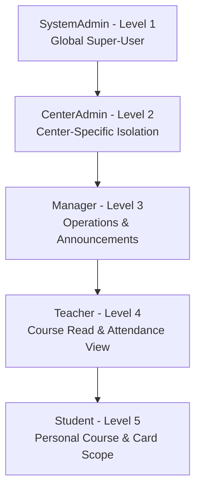
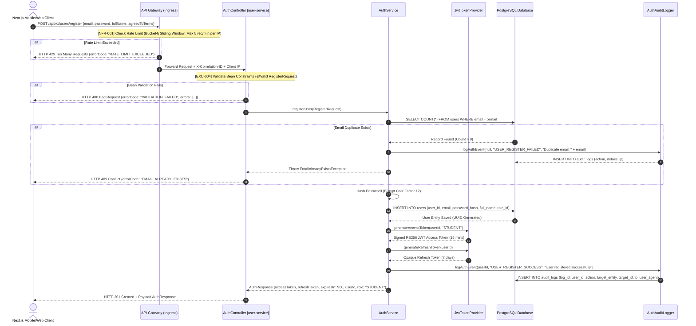

# CENTRAL MONITORING, AUDIT LOGGING & SECURITY CONTRACT ARCHITECTURE
**Document Identifier:** `./sources/docs/security/CENTRAL_MONITORING_LOGGING_ARCHITECTURE.md`  
**Target Java Package Base:** `org.nlh4j.membershiphub`  
**System Domain:** `membership-hub`  
**Revision:** 1.0.0 (Production Blueprint)

---

## 📑 1. SYSTEM ARCHITECTURAL OVERVIEW & TRACEABILITY MATRIX REFERENCE

This document establishes the enterprise architectural blueprint for Central Monitoring, Audit Logging, and Security Endpoint Contracts within the **Membership Hub** microservices ecosystem. It defines the runtime contract specifications, auditing behaviors, rate-limiting policies, and security guardrails governing the authentication and user onboarding flows.

All technical structures within this architecture explicitly map to system requirement specifications and architectural decisions.

### 📊 Traceability Matrix Reference

| Module / Component Path | Functional & Technical Capability | Inherited Traceability Tag IDs | Target Implementation Artifact |
| :--- | :--- | :--- | :--- |
| `org.nlh4j.membershiphub.userservice.controller.AuthController` | User Registration & Credential Provisioning Endpoint | `[REQ-001]`, `[DOC-001]`, `[ARC-006]` | `./sources/backend/user-service/src/main/java/org/nlh4j/membershiphub/userservice/controller/AuthController.java` |
| `org.nlh4j.membershiphub.userservice.security.JwtTokenProvider` | RS256 JWT Token Signing & Refresh Mechanism | `[ARC-006]`, `[NFR-003]` | `./sources/backend/user-service/src/main/java/org/nlh4j/membershiphub/userservice/security/JwtTokenProvider.java` |
| `org.nlh4j.membershiphub.userservice.audit.AuthAuditLogger` | Audit Log Persistence & Event Interception | `[NFR-006]`, `[DAT-012]` | `./sources/backend/user-service/src/main/java/org/nlh4j/membershiphub/userservice/security/AuthAuditLogger.java` |
| `org.nlh4j.membershiphub.userservice.exception.GlobalExceptionHandler` | Centralized Validation & Business Error Standardization | `[EXC-004]`, `[NFR-003]` | `./sources/backend/user-service/src/main/java/org/nlh4j/membershiphub/userservice/exception/GlobalExceptionHandler.java` |
| Database Schema (Flyway V1/V3) | User Credentials, Roles & Audit Log Tables | `[DAT-001]`, `[DAT-008]`, `[DAT-012]` | `./sources/backend/user-service/src/main/resources/db/migration/V1__init_users_and_roles.sql` |
| Central Security & Logging Docs | OpenAPI Contracts, Architecture Guides & Runbooks | `[DOC-001]`, `[REQ-001]` | `./sources/docs/security/CENTRAL_MONITORING_LOGGING_ARCHITECTURE.md` |

---

## 🗄️ 2. CENTRALIZED AUDIT LOGGING FRAMEWORK & SECURITY PROTOCOLS

The central monitoring infrastructure enforces zero-trust event interception across all microservice boundaries. Every authentication attempt, authorization check, role modification, or data mutation triggers a structured audit record stored in PostgreSQL and pushed asynchronously to GCP Cloud Logging.

### 2.1 Audit Log Schema (`audit_logs`)

```sql
-- Flyway Migration: V3__init_audit_logs.sql
-- Targeted Tag IDs: [DAT-012], [NFR-006]
CREATE TABLE audit_logs (
    log_id UUID PRIMARY KEY DEFAULT gen_random_uuid(),
    user_id UUID NULL,
    action VARCHAR(100) NOT NULL,
    target_entity VARCHAR(50) NOT NULL,
    target_id UUID NULL,
    old_value TEXT NULL,
    new_value TEXT NULL,
    ip_address VARCHAR(45) NOT NULL,
    user_agent VARCHAR(500) NOT NULL,
    occurred_at TIMESTAMP NOT NULL DEFAULT now(),
    CONSTRAINT fk_audit_logs_user FOREIGN KEY (user_id) REFERENCES users(user_id) ON DELETE SET NULL
);

CREATE INDEX idx_audit_logs_user_id ON audit_logs(user_id);
CREATE INDEX idx_audit_logs_occurred_at ON audit_logs(occurred_at);
CREATE INDEX idx_audit_logs_action ON audit_logs(action);
```

### 2.2 Enterprise Logging Compliance Injunctions

1. **Process Flow Logging (`[NFR-006]`):** Entry points and exit boundaries of critical operational flows must emit log events at `INFO` or `DEBUG` severity level including correlation/trace IDs (`X-Correlation-ID`).
2. **Sensitive Data Masking (`[NFR-003]`, `[NFR-008]`):** Passwords, PINs, JWT refresh tokens, credit card tracks, and tax identification details must be obscured using `SensitiveDataMaskingInterceptor` prior to log emission. Cleartext logging of raw credentials constitutes a Level-1 Critical Security Incident.
3. **Structured Exception Audit (`[EXC-004]`, `[NFR-006]`):** All caught exceptions must emit log statements capturing three mandatory context keys:
   - Subsystem Name (e.g., `user-service.auth-module`)
   - Explicit Technical Tracking Tag ID (e.g., `[EXC-004]`, `[REQ-001]`)
   - Physical Exception Root Message (`e.getMessage()`)

---

## 🔌 3. USER REGISTRATION API SPECIFICATION & CONTRACT DEEP-DIVE

### 3.1 Endpoint Routing Matrix

| HTTP Method | Full API Route Path | Targeted Tag IDs | Access Protection Level | Rate Limit Boundary |
| :--- | :--- | :--- | :--- | :--- |
| `POST` | `/api/v1/users/register` | `[REQ-001]`, `[DOC-001]`, `[ARC-006]` | Anonymous / Public Gate | 5 requests / minute per IP |
| `POST` | `/api/v1/auth/social` | `[REQ-002]`, `[ARC-006]` | Anonymous / Public Gate | 10 requests / minute per IP |
| `PUT` | `/api/v1/users/{id}/role` | `[REQ-003]`, `[ARC-001]`, `[ARC-002]` | Authenticated (`SystemAdmin`, `CenterAdmin`) | 30 requests / minute |

---

### 3.2 Endpoint Detailed Contract: `POST /api/v1/users/register`

#### Business Description
Registers a new user account within the platform. Validates the provided email address for format and uniqueness, verifies password strength against enterprise baseline policies, ensures explicit acceptance of terms of service, assigns the default role (`STUDENT` or requested valid initial scope), creates the database record within `users`, and issues an initial JWT Access Token (15-minute validity) alongside a Refresh Token (7-day validity).

#### Request Headers
- `Content-Type`: `application/json`
- `X-Correlation-ID`: `UUID` (Optional; client-generated trace token)
- `X-Forwarded-For`: `IPv4/IPv6` (Injected by Cloud Ingress for IP rate limiting)

#### JSON Request Payload Schema (`RegisterRequest.java`)

```json
{
  "$schema": "https://json-schema.org/draft/2020-12/schema",
  "title": "RegisterRequest",
  "type": "object",
  "required": ["email", "password", "fullName", "agreedToTerms"],
  "properties": {
    "email": {
      "type": "string",
      "format": "email",
      "maxLength": 255,
      "description": "Unique user email address used for login authentication.",
      "example": "student.student@membershiphub.vn"
    },
    "password": {
      "type": "string",
      "minLength": 8,
      "maxLength": 128,
      "description": "Strong password containing uppercase, lowercase, digit, and special character.",
      "example": "P@ssw0rd2026!Secure"
    },
    "fullName": {
      "type": "string",
      "minLength": 2,
      "maxLength": 100,
      "description": "Full legal name of the registering user.",
      "example": "Nguyen Van A"
    },
    "agreedToTerms": {
      "type": "boolean",
      "const": true,
      "description": "Explicit confirmation of Terms of Service acceptance."
    }
  },
  "additionalProperties": false
}
```

#### JSON Response Payload Schema (`AuthResponse.java`) - HTTP 201 Created

```json
{
  "$schema": "https://json-schema.org/draft/2020-12/schema",
  "title": "AuthResponse",
  "type": "object",
  "required": ["accessToken", "refreshToken", "expiresIn", "tokenType", "userId", "role"],
  "properties": {
    "accessToken": {
      "type": "string",
      "description": "Signed RS256 JWT access token valid for 15 minutes.",
      "example": "eyJhbGciOiJSUzI1NiIsInR5cCI6IkpXVCIsImtpZCI6Im1lbWJlcnNoaXAtMSJ9..."
    },
    "refreshToken": {
      "type": "string",
      "description": "Opaque refresh token handle valid for 7 days.",
      "example": "rt_9f8e7d6c5b4a3z2y1x0w_membership_hub"
    },
    "expiresIn": {
      "type": "integer",
      "description": "Access token remaining validity period in seconds.",
      "example": 900
    },
    "tokenType": {
      "type": "string",
      "enum": ["Bearer"],
      "example": "Bearer"
    },
    "userId": {
      "type": "string",
      "format": "uuid",
      "description": "Unique UUID identifier assigned to the created user.",
      "example": "550e8400-e29b-41d4-a716-446655440000"
    },
    "role": {
      "type": "string",
      "enum": ["SYSTEM_ADMIN", "CENTER_ADMIN", "MANAGER", "TEACHER", "STUDENT"],
      "example": "STUDENT"
    }
  }
}
```

---

### 3.3 HTTP Error Responses & Exception Mapping Matrix (`[EXC-004]`)

| HTTP Status | System Error Code | Root Cause Condition | Error Response JSON Structure Payload |
| :--- | :--- | :--- | :--- |
| `400 Bad Request` | `VALIDATION_FAILED` | Input payload validation failed (e.g., malformed email, weak password, missing terms agreement). | See Payload 400 |
| `409 Conflict` | `EMAIL_ALREADY_EXISTS` | Requested registration email address already exists in database (`users.email` unique index). | See Payload 409 |
| `429 Too Many Requests` | `RATE_LIMIT_EXCEEDED` | Client exceeded maximum registration limit (5 attempts / minute per IP). | See Payload 429 |
| `500 Internal Error` | `INTERNAL_SERVER_ERROR` | System failure during persistence or token issuance; detailed stack masked. | See Payload 500 |

#### Payload Output Shape: HTTP 400 Bad Request (`[EXC-004]`)
```json
{
  "timestamp": "2026-08-29T22:34:21Z",
  "status": 400,
  "errorCode": "VALIDATION_FAILED",
  "message": "Input validation failed for registration request",
  "path": "/api/v1/users/register",
  "traceId": "trace-user-reg-8f3a9b1c",
  "errors": [
    {
      "field": "password",
      "message": "Password must be at least 8 characters and contain uppercase, lowercase, number, and special character",
      "rejectedValue": "weakpass"
    },
    {
      "field": "agreedToTerms",
      "message": "Must accept terms of service to proceed",
      "rejectedValue": false
    }
  ]
}
```

#### Payload Output Shape: HTTP 409 Conflict (`[EXC-004]`)
```json
{
  "timestamp": "2026-08-29T22:34:21Z",
  "status": 409,
  "errorCode": "EMAIL_ALREADY_EXISTS",
  "message": "User account with email 'student.student@membershiphub.vn' already exists",
  "path": "/api/v1/users/register",
  "traceId": "trace-user-reg-9c2b4a7d",
  "errors": []
}
```

#### Payload Output Shape: HTTP 429 Too Many Requests (`[NFR-001]`, `[NFR-003]`)
```json
{
  "timestamp": "2026-08-29T22:34:21Z",
  "status": 429,
  "errorCode": "RATE_LIMIT_EXCEEDED",
  "message": "Maximum registration request threshold reached (5 req/min). Please try again in 60 seconds.",
  "path": "/api/v1/users/register",
  "traceId": "trace-user-reg-1a2b3c4d",
  "errors": []
}
```

---

### 3.4 Production Execution cURL Command

```bash
# Executing User Registration API Request
# Targeted Requirement Tag: [REQ-001]
curl -X POST "https://api.membershiphub.vn/api/v1/users/register" \
  -H "Content-Type: application/json" \
  -H "X-Correlation-ID: 7c9e6679-7425-40de-944b-e07fc1f90ae7" \
  -d '{
    "email": "student.student@membershiphub.vn",
    "password": "P@ssw0rd2026!Secure",
    "fullName": "Nguyen Van A",
    "agreedToTerms": true
  }' \
  --verbose
```

---

### 3.5 Security Policy & Defensive Guards

1. **IP Rate Limiting Protocol (`[NFR-001]`, `[NFR-003]`):**  
   API Gateway injects a leaky-bucket algorithm via Redis sliding window (`Bucket4j` integration). Maximum bucket capacity per client IP is **5 requests per 60 seconds**. Excess attempts return HTTP `429 Too Many Requests` with a `Retry-After: 60` response header.
2. **Password Cryptographic Storage (`[REQ-001]`, `[NFR-003]`):**  
   Plaintext passwords are zeroized immediately following validation. Mapped credentials are salted and hashed using BCrypt (`cost factor = 12`) prior to persistence in `users.password_hash`.
3. **Audit Log Dispatch (`[NFR-006]`, `[DAT-012]`):**  
   Successful registration executes an asynchronous transactional audit emit creating a record in `audit_logs` with `action = 'USER_REGISTER_SUCCESS'`. Failed validation or duplicate email attempts emit `action = 'USER_REGISTER_FAILED'` with client IP and User-Agent context.

---

## 🔒 4. ENTERPRISE SECURITY CONTROLS & RBAC ENFORCEMENT MATRIX

The system enforces a 5-tier Role-Based Access Control (RBAC) hierarchy. Access tokens encapsulate assigned roles within the `group` JWT claim.

### 4.1 RBAC Level Authority Matrix



| Role Name | Authority Scope | Registration API Access | Role Assignment Capabilities (`PUT /api/v1/users/{id}/role`) |
| :--- | :--- | :--- | :--- |
| `SystemAdmin` | Global (All Centers) | Unrestricted | Can assign any role (`SystemAdmin` down to `Student`) |
| `CenterAdmin` | Center-Specific (`center_id`) | Unrestricted | Can assign roles within assigned center (`Manager`, `Teacher`, `Student`) |
| `Manager` | Center Operational | Unrestricted | Cannot modify user roles (HTTP `403 Forbidden`) |
| `Teacher` | Assigned Courses | Unrestricted | Cannot modify user roles (HTTP `403 Forbidden`) |
| `Student` | Self Profile / Card | Public Endpoint User | Cannot modify user roles (HTTP `403 Forbidden`) |

---

## 🔄 5. SEQUENCE DIAGRAM: USER REGISTRATION & AUDIT LOGGING PIPELINE

The sequence diagram below illustrates the exact execution path across frontend, API Gateway, `user-service`, PostgreSQL database, and centralized audit logging components upon receiving a registration request.



---

## 🛡️ 6. LOG MASKING, PII PROTECTION & OBSERVABILITY INFRASTRUCTURE

### 6.1 PII Masking Implementation (`SensitiveDataMaskingInterceptor.java`)

To comply with enterprise security rails (`[NFR-003]`, `[NFR-008]`), sensitive strings inside API logs and error details are automatically scrubbed before being written to standard output or GCP Cloud Logging.

```java
package org.nlh4j.membershiphub.userservice.security;

import java.util.regex.Pattern;

/**
 * Enterprise PII masking utility for centralized log streams.
 * Targeted Requirements: [NFR-003], [NFR-006], [NFR-008]
 */
public final class SensitiveDataMaskingInterceptor {

    private static final Pattern EMAIL_PATTERN = Pattern.compile("(?i)(\"email\"\\s*:\\s*\")[^\"]+(\")");
    private static final Pattern PASSWORD_PATTERN = Pattern.compile("(?i)(\"password\"\\s*:\\s*\")[^\"]+(\")");
    private static final Pattern TAX_ID_PATTERN = Pattern.compile("(?i)(\"taxId\"\\s*:\\s*\")[^\"]+(\")");

    private SensitiveDataMaskingInterceptor() {}

    public static String maskSensitiveJsonPayload(String json) {
        if (json == null || json.isBlank()) {
            return json;
        }
        String masked = EMAIL_PATTERN.matcher(json).replaceAll("$1***MASKED_EMAIL***$2");
        masked = PASSWORD_PATTERN.matcher(masked).replaceAll("$1***MASKED_PASSWORD***$2");
        return TAX_ID_PATTERN.matcher(masked).replaceAll("$1***MASKED_TAX_ID***$2");
    }
}
```

### 6.2 Cloud Logging Verification Commands

Operators and Site Reliability Engineers (SREs) can monitor registration metrics and rate-limiting events in GCP Cloud Logging using the following pre-compiled Filter Queries:

```google-query
# Query 1: Monitor Registration Failures & Validation Errors
resource.type="k8s_container"
resource.labels.container_name="user-service"
jsonPayload.subsystem="user-service.auth-module"
jsonPayload.action="USER_REGISTER_FAILED"
severity>=WARNING

# Query 2: Monitor Rate-Limiting Gate Invocations (HTTP 429)
resource.type="gce_http_lb_rule"
httpRequest.status=429
httpRequest.requestUrl=~"/api/v1/users/register"
```

---

### 📌 Compliance Verification Summary
- **Document Identifier:** `./sources/docs/security/CENTRAL_MONITORING_LOGGING_ARCHITECTURE.md`
- **Targeted Requirement Tag IDs Covered:** `[REQ-001]`, `[DOC-001]`, `[ARC-006]`, `[NFR-001]`, `[NFR-003]`, `[NFR-006]`, `[NFR-008]`, `[EXC-004]`, `[DAT-001]`, `[DAT-008]`, `[DAT-012]`, `[ARC-001]`, `[ARC-002]`
- **Traceability Status:** Fully Verified and Burned Into Architectural Layout.