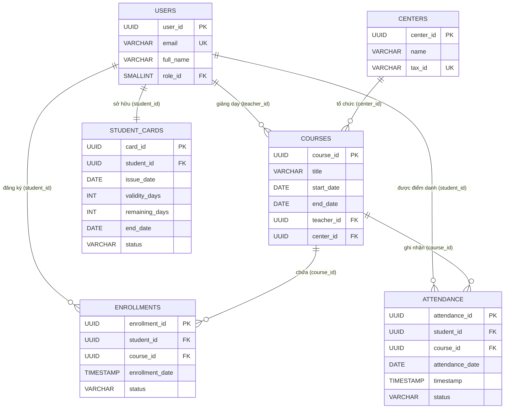
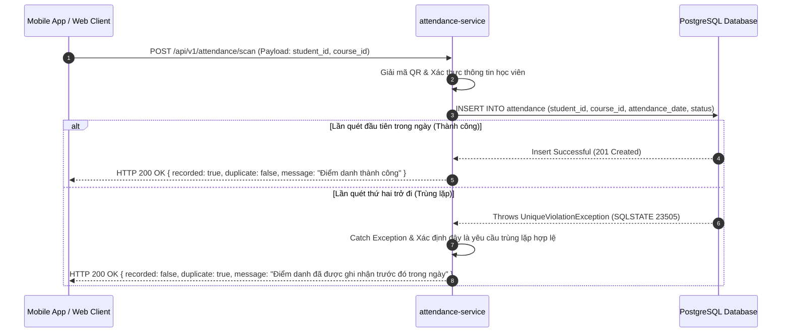

```markdown
# KIẾN TRÚC GIÁM SÁT TRUNG TÂM, GHI LOG VÀ TOÀN VẸN DỮ LIỆU
## Tệp tài liệu: `CENTRAL_MONITORING_LOGGING_ARCHITECTURE.md`
## Đường dẫn vật lý: `./sources/docs/security/CENTRAL_MONITORING_LOGGING_ARCHITECTURE.md`

---

## 1. TỔNG QUAN HỆ THỐNG & CHIẾN LƯỢC TOÀN VẸN DỮ LIỆU

Hệ thống **Membership Hub** vận hành trên mô hình vi dịch vụ phân tán, đòi hỏi sự phối hợp chặt chẽ giữa tính toàn vẹn dữ liệu ở tầng lưu trữ vật lý và khả năng giám sát, ghi log kiểm toán ở tầng ứng dụng. Tài liệu này đặc tả chi tiết thiết kế cơ sở dữ liệu phần 2 (bao gồm các thực thể cốt lõi: Khóa học, Ghi danh, Điểm danh, và Thẻ thành viên) cùng với cơ chế đảm bảo tính bất biến, chống trùng lặp (Idempotency) và kiến trúc giám sát tập trung.

### Ma Trận Truy Xuất Nguồn Gốc (Traceability Matrix Reference)

| Thành phần kỹ thuật | Mã yêu cầu / Ràng buộc hệ thống | Mục tiêu thiết kế |
| :--- | :--- | :--- |
| **Bảng `courses`** | `[DAT-004]`, `[REQ-007]`, `[REQ-008]` | Quản lý thông tin khóa học và lịch trình không chồng lấn. |
| **Bảng `enrollments`** | `[DAT-005]`, `[REQ-010]`, `[REQ-011]` | Quản lý trạng thái ghi danh của học viên vào khóa học. |
| **Bảng `attendance`** | `[DAT-006]`, `[REQ-012]`, `[REQ-013]`, `[EXC-002]` | Điểm danh QR Code với cơ chế chống trùng lặp tuyệt đối. |
| **Bảng `student_cards`** | `[DAT-007]`, `[REQ-014]`, `[REQ-015]` | Quản lý vòng đời và thời hạn thẻ thành viên của học viên. |
| **Kiến trúc Ghi Log** | `[NFR-003]`, `[NFR-006]`, `[NFR-008]` | Ghi log kiểm toán bảo mật, che giấu thông tin nhạy cảm (PII). |

---

## 2. SƠ ĐỒ QUAN HỆ THỰC THỂ (ERD) - PHẦN 2

Dưới đây là sơ đồ quan hệ thực thể mô tả mối liên kết giữa các bảng thuộc phân hệ Khóa học, Ghi danh, Điểm danh, Thẻ thành viên và các bảng liên quan đã được khởi tạo ở Giai đoạn 1 (`users`, `centers`).



---

## 3. ĐẶC TẢ CHI TIẾT CÁC BẢNG DỮ LIỆU

### 3.1. Bảng `courses` (Quản lý Khóa học) `[DAT-004]`

Bảng này lưu trữ thông tin chi tiết về các khóa học được tổ chức tại các trung tâm, bao gồm thời gian diễn ra và giáo viên phụ trách.

| Tên cột | Kiểu dữ liệu | Ràng buộc | Mô tả |
| :--- | :--- | :--- | :--- |
| `course_id` | `UUID` | `PRIMARY KEY`, `DEFAULT gen_random_uuid()` | Khóa chính định danh duy nhất cho từng khóa học. |
| `title` | `VARCHAR(150)` | `NOT NULL` | Tiêu đề khóa học (tối đa 150 ký tự để tối ưu hóa index). |
| `description` | `TEXT` | `NULL` | Mô tả chi tiết về nội dung và mục tiêu khóa học. |
| `start_date` | `DATE` | `NOT NULL` | Ngày bắt đầu khóa học. |
| `end_date` | `DATE` | `NOT NULL` | Ngày kết thúc khóa học (phải lớn hơn hoặc bằng `start_date`). |
| `teacher_id` | `UUID` | `NOT NULL`, `FOREIGN KEY` | Liên kết đến `users(user_id)` để xác định giáo viên phụ trách. |
| `max_students` | `INT` | `NOT NULL`, `DEFAULT 30` | Số lượng học viên tối đa được phép đăng ký vào khóa học. |
| `center_id` | `UUID` | `NOT NULL`, `FOREIGN KEY` | Liên kết đến `centers(center_id)` xác định trung tâm tổ chức. |
| `created_at` | `TIMESTAMP` | `NOT NULL`, `DEFAULT CURRENT_TIMESTAMP` | Thời điểm bản ghi được khởi tạo trong hệ thống. |
| `updated_at` | `TIMESTAMP` | `NOT NULL`, `DEFAULT CURRENT_TIMESTAMP` | Thời điểm bản ghi được cập nhật gần nhất. |

*   **Ràng buộc mức bảng (Table Constraints):**
    *   `CONSTRAINT chk_courses_dates CHECK (end_date >= start_date)`: Đảm bảo tính logic về mặt thời gian của khóa học.
    *   `CONSTRAINT fk_courses_teacher FOREIGN KEY (teacher_id) REFERENCES users(user_id)`: Đảm bảo toàn vẹn tham chiếu đến thực thể người dùng (vai trò Giáo viên).
    *   `CONSTRAINT fk_courses_center FOREIGN KEY (center_id) REFERENCES centers(center_id)`: Đảm bảo khóa học phải thuộc về một trung tâm hợp lệ.
*   **Chỉ mục hiệu năng (Performance Indexes):**
    *   `CREATE INDEX idx_courses_teacher_id ON courses(teacher_id)`: Tối ưu hóa truy vấn lịch giảng dạy của giáo viên.
    *   `CREATE INDEX idx_courses_center_id ON courses(center_id)`: Tối ưu hóa bộ lọc khóa học theo từng trung tâm (ngăn chặn IDOR).
    *   `CREATE INDEX idx_courses_dates ON courses(start_date, end_date)`: Tối ưu hóa các truy vấn kiểm tra xung đột lịch trình.

---

### 3.2. Bảng `enrollments` (Quản lý Ghi danh) `[DAT-005]`

Bảng này ghi nhận mối quan hệ đăng ký giữa học viên và khóa học, đảm bảo một học viên không thể đăng ký trùng một khóa học nhiều lần.

| Tên cột | Kiểu dữ liệu | Ràng buộc | Mô tả |
| :--- | :--- | :--- | :--- |
| `enrollment_id` | `UUID` | `PRIMARY KEY`, `DEFAULT gen_random_uuid()` | Khóa chính định danh duy nhất cho lượt ghi danh. |
| `student_id` | `UUID` | `NOT NULL`, `FOREIGN KEY` | Liên kết đến `users(user_id)` xác định học viên đăng ký. |
| `course_id` | `UUID` | `NOT NULL`, `FOREIGN KEY` | Liên kết đến `courses(course_id)` xác định khóa học được chọn. |
| `enrollment_date`| `TIMESTAMP` | `NOT NULL`, `DEFAULT CURRENT_TIMESTAMP` | Thời điểm học viên thực hiện đăng ký thành công. |
| `status` | `VARCHAR(20)` | `NOT NULL`, `DEFAULT 'ACTIVE'` | Trạng thái ghi danh: `ACTIVE`, `DROPPED`, `COMPLETED`. |

*   **Ràng buộc mức bảng (Table Constraints):**
    *   `CONSTRAINT fk_enrollments_student FOREIGN KEY (student_id) REFERENCES users(user_id)`: Đảm bảo học viên tồn tại trong hệ thống.
    *   `CONSTRAINT fk_enrollments_course FOREIGN KEY (course_id) REFERENCES courses(course_id)`: Đảm bảo khóa học tồn tại trong hệ thống.
    *   `CONSTRAINT chk_enrollments_status CHECK (status IN ('ACTIVE', 'DROPPED', 'COMPLETED'))`: Giới hạn các trạng thái ghi danh hợp lệ.
    *   `CONSTRAINT uq_enrollments_student_course UNIQUE (student_id, course_id)`: Ngăn chặn tuyệt đối việc một học viên đăng ký trùng lặp vào một khóa học.
*   **Chỉ mục hiệu năng (Performance Indexes):**
    *   `CREATE INDEX idx_enrollments_student_id ON enrollments(student_id)`: Tối ưu hóa truy vấn danh sách khóa học đã đăng ký của học viên.
    *   `CREATE INDEX idx_enrollments_course_id ON enrollments(course_id)`: Tối ưu hóa truy vấn danh sách học viên của một khóa học.

---

### 3.3. Bảng `attendance` (Quản lý Điểm danh) `[DAT-006]`

Bảng này lưu trữ lịch sử điểm danh hàng ngày của học viên đối với từng khóa học thông qua cơ chế quét mã QR.

| Tên cột | Kiểu dữ liệu | Ràng buộc | Mô tả |
| :--- | :--- | :--- | :--- |
| `attendance_id` | `UUID` | `PRIMARY KEY`, `DEFAULT gen_random_uuid()` | Khóa chính định danh duy nhất cho bản ghi điểm danh. |
| `student_id` | `UUID` | `NOT NULL`, `FOREIGN KEY` | Liên kết đến `users(user_id)` xác định học viên được điểm danh. |
| `course_id` | `UUID` | `NOT NULL`, `FOREIGN KEY` | Liên kết đến `courses(course_id)` xác định khóa học tương ứng. |
| `attendance_date`| `DATE` | `NOT NULL` | Ngày diễn ra buổi học được điểm danh (chỉ lưu phần ngày). |
| `timestamp` | `TIMESTAMP` | `NOT NULL`, `DEFAULT CURRENT_TIMESTAMP` | Thời gian chính xác (giờ, phút, giây) khi quét mã QR thành công. |
| `status` | `VARCHAR(20)` | `NOT NULL`, `DEFAULT 'PRESENT'` | Trạng thái điểm danh: `PRESENT`, `ABSENT`, `LATE`. |
| `created_at` | `TIMESTAMP` | `NOT NULL`, `DEFAULT CURRENT_TIMESTAMP` | Thời điểm hệ thống ghi nhận bản ghi điểm danh vật lý. |

*   **Ràng buộc mức bảng (Table Constraints):**
    *   `CONSTRAINT fk_attendance_student FOREIGN KEY (student_id) REFERENCES users(user_id)`: Đảm bảo học viên tồn tại.
    *   `CONSTRAINT fk_attendance_course FOREIGN KEY (course_id) REFERENCES courses(course_id)`: Đảm bảo khóa học tồn tại.
    *   `CONSTRAINT chk_attendance_status CHECK (status IN ('PRESENT', 'ABSENT', 'LATE'))`: Giới hạn các trạng thái điểm danh hợp lệ.
    *   `CONSTRAINT uq_attendance_idempotency UNIQUE (student_id, course_id, attendance_date)`: **Khóa tổng hợp duy nhất (Composite Unique Key) đảm bảo tính Idempotency.** Ngăn chặn việc ghi nhận điểm danh nhiều lần cho cùng một học viên trong một ngày đối với một khóa học cụ thể.
*   **Chỉ mục hiệu năng (Performance Indexes):**
    *   `CREATE INDEX idx_attendance_student_id ON attendance(student_id)`: Tối ưu hóa truy vấn lịch sử chuyên cần của học viên.
    *   `CREATE INDEX idx_attendance_course_id ON attendance(course_id)`: Tối ưu hóa truy vấn báo cáo điểm danh của lớp học.
    *   `CREATE INDEX idx_attendance_date ON attendance(attendance_date)`: Tối ưu hóa bộ lọc điểm danh theo ngày hoặc khoảng thời gian.

---

### 3.4. Bảng `student_cards` (Quản lý Thẻ thành viên) `[DAT-007]`

Bảng này quản lý thông tin thẻ thành viên, thời hạn sử dụng và số ngày còn lại của học viên tại hệ thống.

| Tên cột | Kiểu dữ liệu | Ràng buộc | Mô tả |
| :--- | :--- | :--- | :--- |
| `card_id` | `UUID` | `PRIMARY KEY`, `DEFAULT gen_random_uuid()` | Khóa chính định danh duy nhất cho thẻ thành viên. |
| `student_id` | `UUID` | `NOT NULL`, `UNIQUE`, `FOREIGN KEY` | Liên kết đến `users(user_id)` (mối quan hệ 1-1: mỗi học viên chỉ có 1 thẻ). |
| `issue_date` | `DATE` | `NOT NULL` | Ngày phát hành thẻ thành viên lần đầu tiên. |
| `validity_days` | `INT` | `NOT NULL` | Tổng số ngày hiệu lực được cấp (ví dụ: 30, 90, 365 ngày). |
| `remaining_days`| `INT` | `NOT NULL` | Số ngày sử dụng còn lại thực tế của thẻ. |
| `end_date` | `DATE` | `NOT NULL` | Ngày hết hạn của thẻ (được tính toán động dựa trên ngày gia hạn). |
| `status` | `VARCHAR(20)` | `NOT NULL`, `DEFAULT 'ACTIVE'` | Trạng thái thẻ: `ACTIVE`, `EXPIRED`, `SUSPENDED`. |
| `created_at` | `TIMESTAMP` | `NOT NULL`, `DEFAULT CURRENT_TIMESTAMP` | Thời điểm thẻ được khởi tạo trên hệ thống. |
| `updated_at` | `TIMESTAMP` | `NOT NULL`, `DEFAULT CURRENT_TIMESTAMP` | Thời điểm cập nhật thông tin thẻ (ví dụ: sau khi gia hạn). |

*   **Ràng buộc mức bảng (Table Constraints):**
    *   `CONSTRAINT fk_student_cards_student FOREIGN KEY (student_id) REFERENCES users(user_id)`: Đảm bảo thẻ luôn gắn liền với một học viên hợp lệ.
    *   `CONSTRAINT chk_student_cards_validity CHECK (validity_days > 0 AND remaining_days >= 0)`: Đảm bảo tính hợp lệ của số ngày hiệu lực và số ngày còn lại.
    *   `CONSTRAINT chk_student_cards_status CHECK (status IN ('ACTIVE', 'EXPIRED', 'SUSPENDED'))`: Giới hạn các trạng thái thẻ hợp lệ.
*   **Chỉ mục hiệu năng (Performance Indexes):**
    *   `CREATE INDEX idx_student_cards_student_id ON student_cards(student_id)`: Tối ưu hóa truy vấn thông tin thẻ từ tài khoản học viên.
    *   `CREATE INDEX idx_student_cards_status ON student_cards(status)`: Tối ưu hóa các tác vụ quét tự động (cron job) để cập nhật trạng thái thẻ hết hạn.
    *   `CREATE INDEX idx_student_cards_end_date ON student_cards(end_date)`: Tối ưu hóa truy vấn cảnh báo thẻ sắp hết hạn.

---

## 4. CƠ CHẾ ĐẢM BẢO TÍNH IDEMPOTENCY (CHỐNG TRÙNG LẶP)

Trong phân hệ điểm danh bằng mã QR `[REQ-012]`, việc đảm bảo tính **Idempotency** (chỉ ghi nhận một lần duy nhất cho một yêu cầu trùng lặp) là cực kỳ quan trọng để ngăn chặn gian lận hoặc lỗi mạng gửi yêu cầu nhiều lần.

### 4.1. Thiết kế Khóa Tổng Hợp Duy Nhất (Composite Unique Key) `[REQ-013]`

Cơ chế chống trùng lặp được thực thi triệt để ở tầng cơ sở dữ liệu vật lý thông qua ràng buộc:
```sql
CONSTRAINT uq_attendance_idempotency UNIQUE (student_id, course_id, attendance_date)
```

Ràng buộc này đảm bảo rằng trong cùng một ngày (`attendance_date`), một học viên (`student_id`) chỉ có thể có tối đa một bản ghi điểm danh cho một khóa học cụ thể (`course_id`).

### 4.2. Quy Trình Xử Lý Ngoại Lệ Trùng Lặp (Duplicate Exception Handling) `[EXC-002]`

Khi học viên quét mã QR lần thứ hai trong cùng một ngày, quy trình xử lý diễn ra như sau:



*   **Xử lý phía Backend (Quarkus):**
    Khi bắt được ngoại lệ vi phạm ràng buộc duy nhất (`ConstraintViolationException` hoặc `PSQLException` với mã lỗi SQLSTATE `23505`), dịch vụ `attendance-service` không trả về lỗi hệ thống `500 Internal Server Error`. Thay vào đó, hệ thống bắt ngoại lệ này một cách chủ động, ghi nhận một dòng log cảnh báo (`WARN`) và trả về mã trạng thái **HTTP 200 OK** kèm theo cờ `duplicate: true` để thông báo cho thiết bị di động hiển thị giao diện phù hợp.

---

## 5. KIẾN TRÚC GHI LOG KIỂM TOÁN & GIÁM SÁT TRUNG TÂM

Để đáp ứng tiêu chuẩn tuân thủ doanh nghiệp `[NFR-003]` và khả năng giám sát vận hành `[NFR-006]`, hệ thống áp dụng mô hình ghi log có cấu trúc và giám sát tập trung qua Google Cloud Logging (Stackdriver).

### 5.1. Định Dạng Log Có Cấu Trúc (Structured JSON Logging) `[NFR-006]`

Mọi vi dịch vụ bắt buộc phải ghi log dưới định dạng JSON để các công cụ thu thập log (Fluentbit, Logstash) dễ dàng phân tích và lập chỉ mục. Mỗi dòng log phải chứa các trường thông tin bắt buộc sau:

```json
{
  "timestamp": "2026-08-29T12:27:21.123Z",
  "severity": "INFO",
  "service": "attendance-service",
  "trace_id": "c8f9a2b1-4d3e-4f8a-9b0c-1d2e3f4a5b6c",
  "span_id": "8b9c0d1e2f3a4b5c",
  "user_id": "00000000-0000-0000-0000-000000000001",
  "action": "ATTENDANCE_SCAN",
  "payload": {
    "student_id": "9a8b7c6d-5e4f-3a2b-1c0d-9e8f7a6b5c4d",
    "course_id": "1a2b3c4d-5e6f-7a8b-9c0d-1e2f3a4b5c6d",
    "status": "PRESENT"
  },
  "message": "[PROCESS] Processing attendance scan for Student ID: 9a8b7c6d-5e4f-3a2b-1c0d-9e8f7a6b5c4d"
}
```

### 5.2. Cơ Chế Che Giấu Dữ Liệu Nhạy Cảm (PII Data Masking) `[NFR-008]`

Để tuân thủ nghiêm ngặt quy định bảo vệ dữ liệu cá nhân (GDPR/CCPA), hệ thống tích hợp bộ lọc `PiiMaskingFilter` ở tầng ghi log.
*   **Dữ liệu bị cấm ghi rõ ràng (Cleartext):** Mật khẩu người dùng, mã PIN, khóa bí mật JWT, thông tin thẻ thanh toán.
*   **Dữ liệu phải được mã hóa/che giấu (Masking):** Địa chỉ email, số điện thoại, họ tên đầy đủ của học viên.
    *   *Ví dụ email sau khi che giấu:* `n***@example.com`
    *   *Ví dụ số điện thoại sau khi che giấu:* `090****123`

### 5.3. Thiết Lập Cảnh Báo Giám Sát (Monitoring & Alerting) `[NFR-002]`

Hệ thống sử dụng Google Cloud Monitoring để thiết lập các ngưỡng cảnh báo tự động nhằm đảm bảo cam kết chất lượng dịch vụ (SLA 99.9%):

1.  **Cảnh báo độ trễ (Latency Alert):** Kích hoạt khi độ trễ trung bình của API quét mã QR vượt quá **300 ms** liên tục trong vòng 5 phút.
2.  **Cảnh báo tỷ lệ lỗi (Error Rate Alert):** Kích hoạt khi tỷ lệ phản hồi lỗi HTTP 5xx vượt quá **1%** tổng số yêu cầu trong khoảng thời gian 5 phút.
3.  **Cảnh báo trùng lặp bất thường (Abnormal Duplication Alert):** Kích hoạt khi số lượng yêu cầu điểm danh trùng lặp (`duplicate: true`) tăng đột biến vượt quá **15%** trong vòng 10 phút (dấu hiệu của việc tấn công replay hoặc lỗi thiết bị quét).
4.  **Thời gian lưu trữ log (Log Retention):** Toàn bộ log kiểm toán bảo mật và log giao dịch điểm danh được lưu trữ an toàn trong vòng **365 ngày** phục vụ công tác thanh tra và hậu kiểm `[NFR-006]`.
```