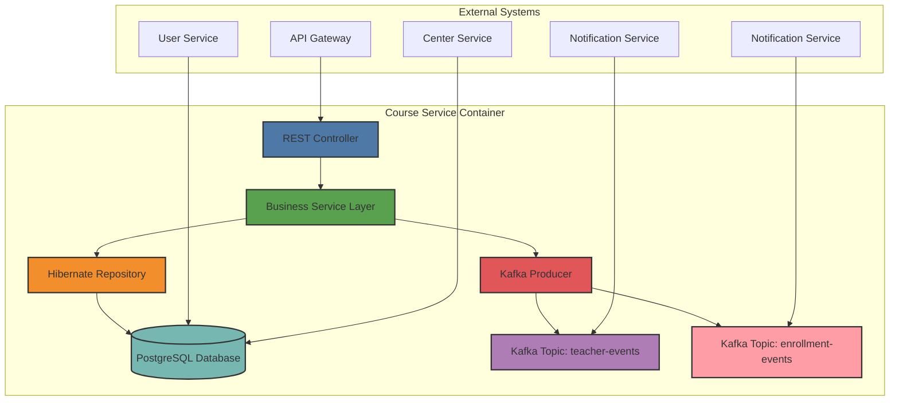
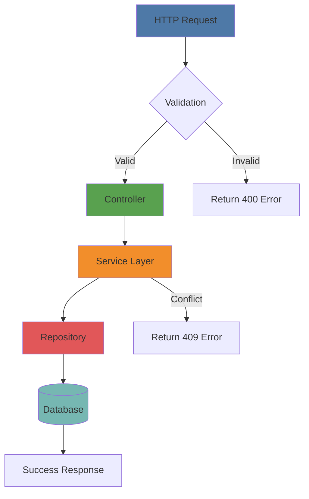
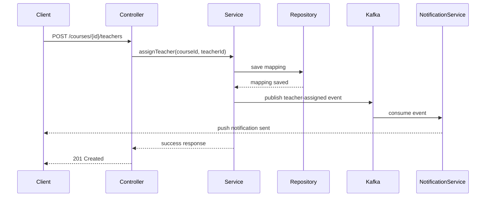
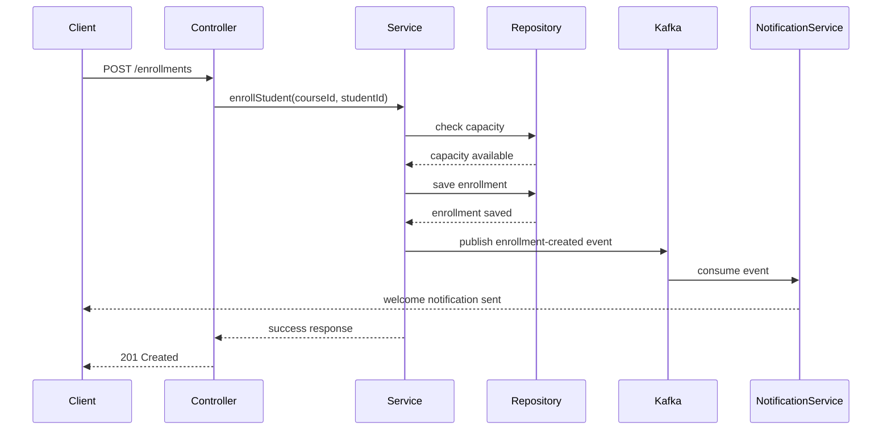
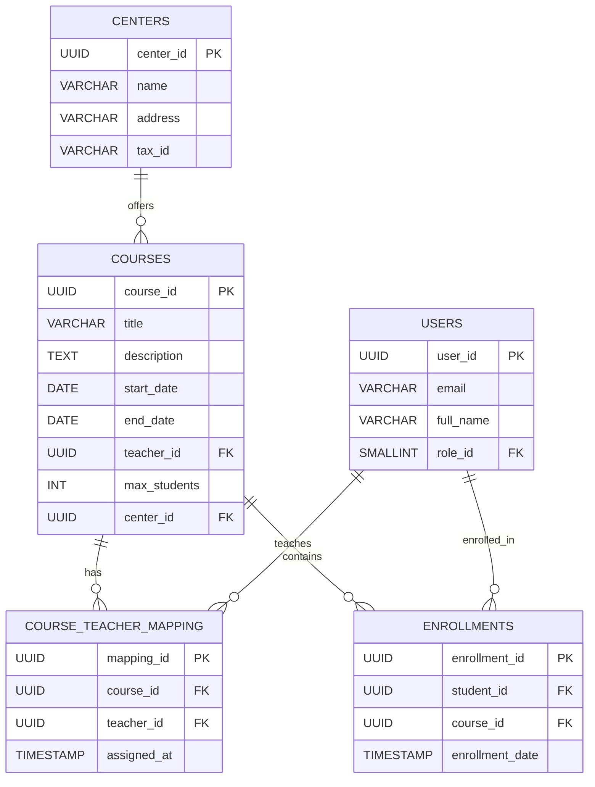

```markdown
# Course Service Architecture Documentation

## 1. Overview

The `course-service` is a core microservice within the Membership Hub platform, responsible for managing academic course entities, teacher assignments, student enrollment workflows, and course availability browsing. Built on Quarkus 3.15 LTS with Hibernate ORM Panache, it integrates with Apache Kafka for asynchronous event propagation and PostgreSQL for persistent storage.

This document provides a comprehensive architectural overview, including C4 container diagrams, component interactions, data flow sequences, and API contract specifications.

---

## 2. C4 Container Diagram



### Component Descriptions

| Component | Responsibility |
|----------|----------------|
| **REST Controller** | Handles incoming HTTP requests, validates input using Jakarta Bean Validation, routes to appropriate service methods |
| **Business Service Layer** | Contains core business logic including schedule conflict detection, enrollment validation, and Kafka event publishing |
| **Hibernate Repository** | Manages database persistence operations using Panache entities and repositories |
| **Kafka Producer** | Publishes domain events (`teacher-assigned`, `enrollment-created`) to respective Kafka topics |
| **PostgreSQL Database** | Stores all course-related entities with referential integrity constraints |

---

## 3. Business Process Flow

### 3.1 Course Management CRUD Flow



### 3.2 Teacher Assignment Event Flow



### 3.3 Student Enrollment Event Flow



---

## 4. Data Model

### 4.1 Entity Relationship Diagram



### 4.2 Database Schema Constraints

| Constraint | Description |
|-----------|-------------|
| `pk_courses` | Primary key on `course_id` |
| `fk_courses_teacher` | Foreign key referencing `users.user_id` |
| `fk_courses_center` | Foreign key referencing `centers.center_id` |
| `uq_enrollments_student_course` | Unique constraint preventing duplicate enrollments |
| `uq_attendance_student_course_date` | Unique constraint ensuring idempotency for attendance records |
| `ex_teacher_schedule_no_overlap` | Exclusion constraint preventing teacher schedule conflicts |

---

## 5. Kafka Integration

### 5.1 Event Topics

| Topic Name | Purpose | Partition Count | Retention |
|------------|---------|-----------------|-----------|
| `teacher-events` | Teacher assignment/unassignment notifications | 6 | 7 days |
| `enrollment-events` | Student enrollment lifecycle events | 6 | 7 days |

### 5.2 Event Schemas

#### Teacher Assigned Event

```json
{
  "eventType": "teacher-assigned",
  "eventId": "uuid",
  "timestamp": "ISO8601",
  "payload": {
    "courseId": "uuid",
    "teacherId": "uuid",
    "assignedAt": "ISO8601"
  }
}
```

#### Enrollment Created Event

```json
{
  "eventType": "enrollment-created",
  "eventId": "uuid",
  "timestamp": "ISO8601",
  "payload": {
    "enrollmentId": "uuid",
    "studentId": "uuid",
    "courseId": "uuid",
    "enrollmentDate": "ISO8601",
    "autoCreatedUser": "boolean"
  }
}
```

### 5.3 Transactional Outbox Pattern

All Kafka events are published using the transactional outbox pattern to ensure consistency between database transactions and message delivery:

1. Events are persisted in a local `outbox_event` table within the same transaction as business data
2. A separate poller reads committed outbox records and publishes them to Kafka
3. Each outbox record includes a unique identifier to support idempotent publishing

---

## 6. API Contract Specifications

### 6.1 Course Management Endpoints

| HTTP Method | Endpoint | Description | Targeted Tag IDs |
|-------------|----------|-------------|------------------|
| GET | `/api/v1/courses` | List all courses with pagination | [REQ-007] |
| POST | `/api/v1/courses` | Create a new course | [REQ-008] |
| PUT | `/api/v1/courses/{id}` | Update an existing course | [REQ-008] |
| DELETE | `/api/v1/courses/{id}` | Delete a course | [REQ-008] |
| GET | `/api/v1/courses/{id}/teachers` | List teachers assigned to a course | [REQ-009] |
| POST | `/api/v1/courses/{id}/teachers` | Assign a teacher to a course | [REQ-009] |
| DELETE | `/api/v1/courses/{id}/teachers/{teacherId}` | Remove a teacher from a course | [REQ-009] |

### 6.2 Student Course Browsing Endpoints

| HTTP Method | Endpoint | Description | Targeted Tag IDs |
|-------------|----------|-------------|------------------|
| GET | `/api/v1/students/courses/available` | Browse available courses for a student | [REQ-010] |

### 6.3 Enrollment Endpoints

| HTTP Method | Endpoint | Description | Targeted Tag IDs |
|-------------|----------|-------------|------------------|
| POST | `/api/v1/enrollments` | Enroll a student in a course | [REQ-011] |
| GET | `/api/v1/enrollments/student/{studentId}` | Get enrollments for a student | [REQ-011] |
| DELETE | `/api/v1/enrollments/{id}` | Cancel an enrollment | [REQ-011] |

### 6.4 Detailed API Specifications

#### GET `/api/v1/courses`

**Request Headers:**
```
Authorization: Bearer <jwt_token>
Accept: application/json
```

**Query Parameters:**
| Parameter | Type | Required | Default | Description |
|-----------|------|----------|---------|-------------|
| page | integer | No | 0 | Page number (0-indexed) |
| size | integer | No | 20 | Number of items per page |
| sort | string | No | "title,asc" | Sort field and direction |

**Response Schema (200 OK):**
```json
{
  "content": [
    {
      "courseId": "uuid",
      "title": "string",
      "description": "string",
      "startDate": "date",
      "endDate": "date",
      "teacherId": "uuid",
      "teacherName": "string",
      "maxStudents": "integer",
      "currentEnrollment": "integer",
      "centerId": "uuid"
    }
  ],
  "totalElements": "integer",
  "totalPages": "integer",
  "page": "integer",
  "size": "integer"
}
```

**Error Responses:**
| Status Code | Error Code | Message |
|-------------|------------|---------|
| 401 | UNAUTHORIZED | Authentication required |
| 403 | FORBIDDEN | Insufficient permissions |

#### POST `/api/v1/courses`

**Request Headers:**
```
Authorization: Bearer <jwt_token>
Content-Type: application/json
```

**Request Body Schema:**
```json
{
  "title": "string (max 150 chars)",
  "description": "string",
  "startDate": "date (YYYY-MM-DD)",
  "endDate": "date (YYYY-MM-DD)",
  "teacherId": "uuid",
  "maxStudents": "integer (default: 30, min: 1)"
}
```

**Response Schema (201 Created):**
```json
{
  "courseId": "uuid",
  "title": "string",
  "description": "string",
  "startDate": "date",
  "endDate": "date",
  "teacherId": "uuid",
  "maxStudents": "integer",
  "centerId": "uuid",
  "createdAt": "ISO8601"
}
```

**Error Responses:**
| Status Code | Error Code | Message |
|-------------|------------|---------|
| 400 | VALIDATION_FAILED | Invalid input data |
| 403 | FORBIDDEN | Insufficient permissions |
| 409 | SCHEDULE_CONFLICT | Teacher already assigned during this period |

#### POST `/api/v1/courses/{id}/teachers`

**Request Headers:**
```
Authorization: Bearer <jwt_token>
Content-Type: application/json
```

**Path Parameters:**
| Parameter | Type | Description |
|-----------|------|-------------|
| id | uuid | Course identifier |

**Request Body Schema:**
```json
{
  "teacherId": "uuid"
}
```

**Response Schema (201 Created):**
```json
{
  "mappingId": "uuid",
  "courseId": "uuid",
  "teacherId": "uuid",
  "assignedAt": "ISO8601"
}
```

**Error Responses:**
| Status Code | Error Code | Message |
|-------------|------------|---------|
| 400 | VALIDATION_FAILED | Invalid teacher ID |
| 403 | FORBIDDEN | Insufficient permissions |
| 404 | COURSE_NOT_FOUND | Course not found |
| 409 | TEACHER_ALREADY_ASSIGNED | Teacher already assigned to this course |

#### POST `/api/v1/enrollments`

**Request Headers:**
```
Authorization: Bearer <jwt_token>
Content-Type: application/json
```

**Request Body Schema:**
```json
{
  "courseId": "uuid"
}
```

**Response Schema (201 Created):**
```json
{
  "enrollmentId": "uuid",
  "studentId": "uuid",
  "courseId": "uuid",
  "enrollmentDate": "ISO8601",
  "autoCreatedUser": "boolean"
}
```

**Error Responses:**
| Status Code | Error Code | Message |
|-------------|------------|---------|
| 400 | VALIDATION_FAILED | Invalid course ID |
| 403 | FORBIDDEN | Insufficient permissions |
| 404 | COURSE_NOT_FOUND | Course not found |
| 409 | COURSE_FULL | Course has reached maximum capacity |
| 409 | ALREADY_ENROLLED | Student already enrolled in this course |

---

## 7. Traceability Matrix Reference

| Component/Module | Requirement Tags | Description |
|------------------|------------------|-------------|
| Course Listing API | [REQ-007] | Paginated course listing with filtering |
| Course CRUD Operations | [REQ-008] | Create, read, update, delete courses with schedule conflict detection |
| Teacher Assignment | [REQ-009] | Assign/unassign teachers with Kafka event publishing |
| Student Course Browsing | [REQ-010] | Browse available courses excluding already enrolled ones |
| Student Enrollment | [REQ-011] | Enroll students with auto-account creation and Kafka event publishing |
| Schedule Conflict Detection | [REQ-008] | Database-level exclusion constraint preventing overlapping schedules |
| Idempotency Guarantee | [REQ-013] | Unique constraints ensuring no duplicate operations |
| Kafka Integration | [ARC-007] | Asynchronous event publishing for teacher assignments and enrollments |
| Transactional Outbox | [ARC-007] | Ensuring consistency between DB transactions and Kafka events |

---

## 8. Security Considerations

### 8.1 Authentication & Authorization

- All endpoints require JWT bearer token authentication
- Role-based access control enforced via `@RolesAllowed` annotations
- System Admin and Center Admin roles have full CRUD access
- Teachers can only manage their own courses
- Students can only browse and enroll in courses

### 8.2 Input Validation

- All request bodies validated using Jakarta Bean Validation 3.0
- Path parameters validated for UUID format
- Query parameters bounded to prevent excessive pagination
- Date ranges validated to prevent invalid course schedules

### 8.3 Data Protection

- Sensitive fields masked in logs using structured logging patterns
- Audit logging for all mutating operations
- Database constraints enforce referential integrity
- Connection pooling configured with appropriate timeouts

---

## 9. Performance & Scalability

### 9.1 Database Indexing Strategy

| Index Name | Table | Columns | Purpose |
|------------|-------|---------|---------|
| idx_courses_teacher_id | courses | teacher_id | Fast lookup of courses by teacher |
| idx_courses_start_date | courses | start_date | Efficient date-range queries |
| idx_enrollments_student_id | enrollments | student_id | Quick student enrollment lookup |
| idx_enrollments_course_id | enrollments | course_id | Fast course enrollment counts |
| idx_attendance_course_date | attendance | course_id, attendance_date | Optimized attendance reporting |
| idx_attendance_student_date | attendance | student_id, attendance_date | Student attendance history |

### 9.2 Caching Strategy

- Redis cache for frequently accessed course listings
- TTL-based eviction policy (default 300 seconds)
- Cache warming for popular courses during peak hours
- Cache invalidation on course updates

### 9.3 Horizontal Scaling

- Stateless service design enabling horizontal pod autoscaling
- HPA configured based on CPU utilization (>70%) and latency (P95 > 300ms)
- Minimum 2 pods, maximum 20 pods per service
- Multi-zone deployment for high availability

---

## 10. Monitoring & Observability

### 10.1 Health Checks

- Liveness probe: `/q/health/live`
- Readiness probe: `/q/health/ready`
- Custom health checks for database connectivity and Kafka availability

### 10.2 Metrics

- Micrometer integration with Prometheus endpoint
- Key metrics tracked:
  - HTTP request latency by endpoint
  - Database query execution times
  - Kafka message production/consumption rates
  - Cache hit/miss ratios

### 10.3 Logging

- Structured JSON logging for centralized aggregation
- Correlation IDs for request tracing across services
- Audit logs for all mutating operations stored for 1 year
- Sensitive data automatically masked in all log levels

---

## 11. Deployment Configuration

### 11.1 Environment Variables

| Variable | Description | Default |
|----------|-------------|---------|
| QUARKUS_DATASOURCE_JDBC_URL | PostgreSQL connection URL | jdbc:postgresql://localhost:5432/membership_hub |
| QUARKUS_DATASOURCE_USERNAME | Database username | - |
| QUARKUS_DATASOURCE_PASSWORD | Database password | - |
| KAFKA_BOOTSTRAP_SERVERS | Kafka broker addresses | localhost:9092 |
| MP_JWT_VERIFY_ISSUER | JWT issuer claim | membership-hub |
| MP_JWT_VERIFY_PUBLICKEY_LOCATION | Public key location | publicKey.pem |

### 11.2 Docker Configuration

Multi-stage build process:
1. **Builder stage**: Maven compilation with Quarkus plugin
2. **Runtime stage**: Minimal JRE with application JAR
3. Image size optimized to <500MB
4. Non-root user execution for security

### 11.3 Kubernetes Deployment

- Deployment with resource requests/limits
- Liveness and readiness probes
- Horizontal Pod Autoscaler (HPA)
- Network policies for service-to-service communication
- Ingress with TLS termination

---

## 12. Error Handling Strategy

### 12.1 Global Exception Handler

Centralized exception handling through `@RestControllerAdvice`:

| Exception Type | HTTP Status | Error Code |
|----------------|-------------|------------|
| MethodArgumentNotValidException | 400 | VALIDATION_FAILED |
| ConstraintViolationException | 400 | VALIDATION_FAILED |
| DataIntegrityViolationException | 409 | DATA_CONFLICT |
| AuthenticationException | 401 | UNAUTHORIZED |
| AccessDeniedException | 403 | FORBIDDEN |
| EntityNotFoundException | 404 | NOT_FOUND |
| ScheduleConflictException | 409 | SCHEDULE_CONFLICT |
| CourseFullException | 409 | COURSE_FULL |
| AlreadyEnrolledException | 409 | ALREADY_ENROLLED |

### 12.2 Error Response Format

```json
{
  "timestamp": "ISO8601",
  "status": "integer",
  "errorCode": "string",
  "message": "string",
  "path": "string",
  "traceId": "string",
  "errors": [
    {
      "field": "string",
      "message": "string",
      "rejectedValue": "any"
    }
  ]
}
```

---

## 13. Testing Strategy

### 13.1 Unit Tests

- Service layer unit tests with Mockito mocks
- Repository tests with in-memory H2 database
- Controller tests with RestAssured
- Coverage target: ≥85%

### 13.2 Integration Tests

- Testcontainers for PostgreSQL and Kafka
- End-to-end API testing with realistic data
- Kafka message verification
- Database constraint validation

### 13.3 Contract Tests

- OpenAPI specification validation
- Consumer-driven contract tests with Pact
- API compatibility checks in CI pipeline

---

## 14. References

- [REQ-007]: List courses for authenticated users
- [REQ-008]: CRUD courses with schedule conflict detection
- [REQ-009]: Assign/unassign teachers with Kafka events
- [REQ-010]: Browse available courses for students
- [REQ-011]: Enroll students with auto-account creation
- [ARC-007]: QR attendance processing flow
- [DOC-001]: Enterprise documentation standards
```