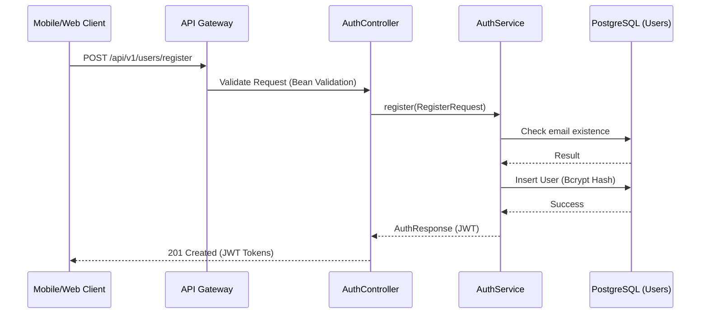

```markdown
# Enterprise Security & API Compliance Matrix: User Registration

## 1. Overview
This document outlines the technical specifications and security compliance requirements for the user registration module within the `membership-hub` platform. It serves as the primary reference for developers and security auditors to ensure alignment with OWASP standards and enterprise architectural requirements.

## 2. Traceability Matrix Reference
| Requirement Tag ID | Description | Architectural Component |
| :--- | :--- | :--- |
| [REQ-001] | User Registration Endpoint Implementation | `AuthController.java` |
| [DOC-001] | Enterprise Documentation Standard | `./sources/docs/api/user-center-contracts.md` |
| [ARC-006] | OAuth2/JWT Authentication Framework | `JwtTokenProvider.java` |
| [NFR-003] | Security & Compliance Baseline (TLS/Encryption) | API Gateway / Security Filter |

## 3. API Specification: User Registration
**Endpoint:** `POST /api/v1/users/register`

### 3.1. Business Logic
The registration endpoint facilitates the creation of new user accounts. It enforces strong password policies, email uniqueness, and mandatory terms of service acceptance. Upon successful registration, the system issues a JWT access token (15-minute validity) and a refresh token (7-day validity).

### 3.2. Request Schema
| Field | Type | Required | Constraints |
| :--- | :--- | :--- | :--- |
| `email` | String | Yes | Valid email format, max 255 chars |
| `password` | String | Yes | Min 8 chars, must include uppercase, digit, special char |
| `fullName` | String | Yes | Max 100 chars |
| `agreedToTerms` | Boolean | Yes | Must be `true` |

### 3.3. Response Schema
| Status | Description | Targeted Tag IDs |
| :--- | :--- | :--- |
| 201 | User registered successfully; returns JWT tokens | [REQ-001], [ARC-006] |
| 400 | Validation failed (e.g., weak password, invalid email) | [REQ-001], [EXC-004] |
| 409 | Email already exists in the system | [REQ-001], [EXC-004] |

### 3.4. Example Request (cURL)
```bash
curl -X POST 'https://api.membership-hub.org/api/v1/users/register' \
-H 'Content-Type: application/json' \
-d '{
  "email": "user@example.com",
  "password": "Str0ng!Password",
  "fullName": "Nguyen Van A",
  "agreedToTerms": true
}'
```

## 4. Security & Compliance Notes
*   **Rate Limiting:** This endpoint is strictly limited to 5 requests per minute per IP address to prevent brute-force and DoS attacks.
*   **RBAC Integration:** Newly registered users are assigned the `STUDENT` role by default. Role escalation requires administrative intervention via the RBAC matrix defined in `[ARC-001]` through `[ARC-005]`.
*   **Data Masking:** All registration logs are processed through the `SensitiveDataMaskingInterceptor` to ensure cleartext passwords and PII are never persisted in log files.

## 5. Registration Sequence Diagram

```