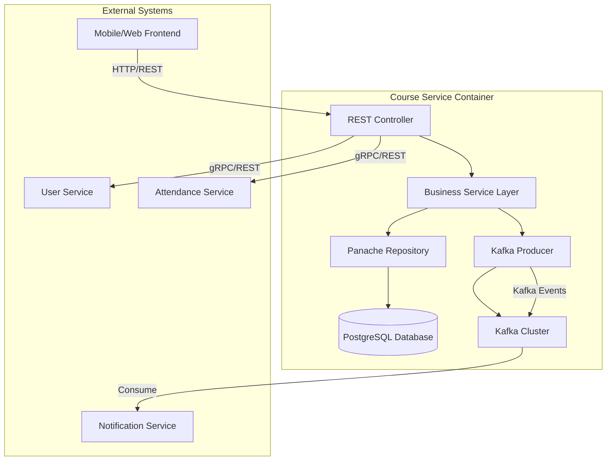
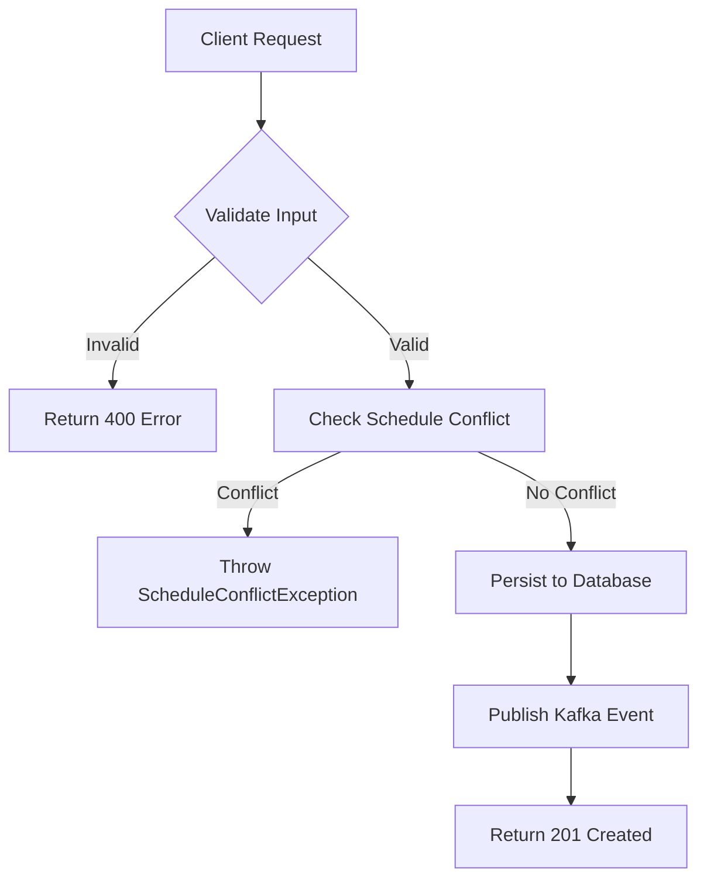
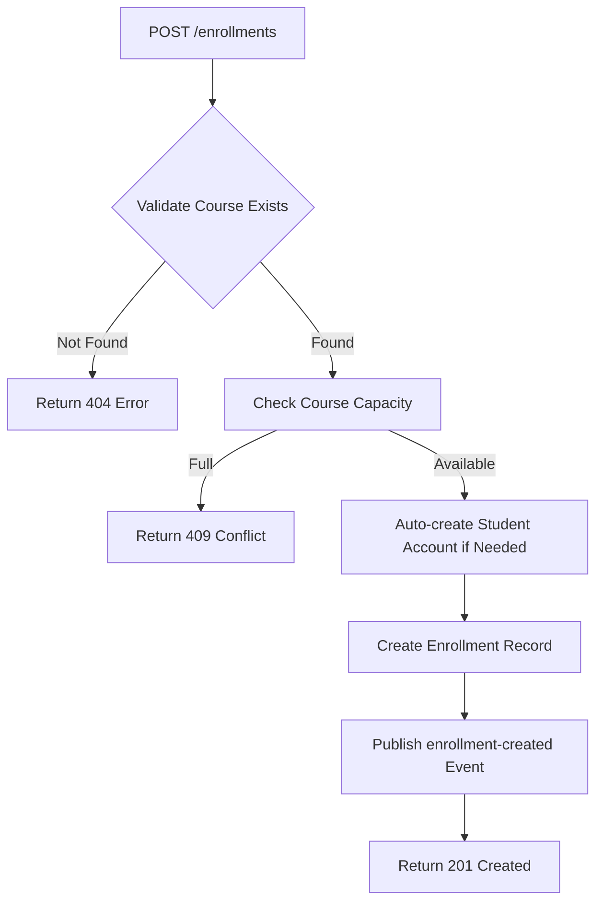

```markdown
# Course Service Architecture & OWASP Compliance Matrix

## 1. System Overview

The `course-service` is a core microservice within the **Membership Hub** enterprise platform, responsible for managing academic course lifecycle operations including course creation, teacher assignment, student enrollment, and course browsing. It operates under the package namespace `org.nlh4j.membershiphub.courseservice` and integrates with the broader microservices ecosystem via RESTful APIs and asynchronous Kafka event streams.

### 1.1 Service Responsibilities
- **Course Management**: Full CRUD operations for courses with schedule conflict detection.
- **Teacher Assignment**: Assigning and unassigning teachers to courses with Kafka event emission.
- **Student Enrollment**: Handling student enrollment into courses with automatic account provisioning.
- **Course Browsing**: Providing available courses for students with exclusion filtering.

### 1.2 Key Integrations
- **user-service**: For user validation and role management.
- **attendance-service**: For attendance record correlation.
- **notification-service**: Via Kafka topics for push notifications.
- **PostgreSQL**: Primary data store with Flyway-managed schema migrations.

---

## 2. C4 Container Diagram



### 2.1 Component Descriptions
| Component | Description | Technology Stack |
| :--- | :--- | :--- |
| REST Controller | Handles incoming HTTP requests, validates input, and routes to service layer | Quarkus RESTEasy Reactive |
| Business Service Layer | Contains core business logic, transaction management, and Kafka event orchestration | Quarkus Arc (CDI) |
| Panache Repository | Manages database persistence operations using Hibernate ORM with Panache | Hibernate ORM Panache |
| Kafka Producer | Emits domain events to Kafka topics for asynchronous processing | SmallRye Reactive Messaging Kafka |
| PostgreSQL Database | Stores all course-related entities with ACID guarantees | PostgreSQL 16 |

---

## 3. Traceability Matrix Reference

This section maps architectural components, Kafka event pipelines, and database schemas directly to their source requirement tags.

| Architectural Element | Description | Targeted Tag IDs |
| :--- | :--- | :--- |
| Course CRUD Endpoints | REST endpoints for creating, reading, updating, and deleting courses | [REQ-007], [REQ-008] |
| Teacher Assignment Flow | Endpoint and service logic for assigning/unassigning teachers to courses | [REQ-009], [ARC-007] |
| Student Course Browsing | Endpoint for listing available courses excluding already enrolled ones | [REQ-010] |
| Student Enrollment Flow | Endpoint and service logic for enrolling students into courses | [REQ-011], [ARC-007] |
| Kafka Event: teacher-assigned | Emitted when a teacher is assigned to a course | [REQ-009], [ARC-007] |
| Kafka Event: enrollment-created | Emitted when a student enrolls in a course | [REQ-011], [ARC-007] |
| Database Schema: courses | Table storing course metadata with exclusion constraint for schedule conflicts | [REQ-008], [DAT-003] |
| Database Schema: enrollments | Table storing student-course enrollment relationships | [REQ-011], [DAT-004] |
| Database Schema: course_teacher_mapping | Junction table for many-to-many relationship between courses and teachers | [REQ-009], [DAT-003] |

---

## 4. Business Process Flowcharts

### 4.1 Course CRUD Flow



### 4.2 Teacher Assignment Flow

```mermaid
flowchart TD
    A[POST /courses/{id}/teachers] --> B{Validate Teacher Exists}
    B -- Not Found --> C[Return 404 Error]
    B -- Found --> D[Check Existing Assignment]
    D -- Already Assigned --> E[Return 409 Conflict]
    D -- Not Assigned --> F[Insert Mapping Record]
    F --> G[Publish teacher-assigned Event]
    G --> H[Return 201 Created]
```

### 4.3 Student Enrollment Flow



---

## 5. Kafka Event Pipeline

### 5.1 Event Topics
| Topic Name | Producer | Consumer | Event Schema |
| :--- | :--- | :--- | :--- |
| `teacher-events` | course-service | notification-service | `{"eventType": "teacher-assigned", "courseId": "uuid", "teacherId": "uuid", "assignedAt": "timestamp"}` |
| `enrollment-events` | course-service | notification-service | `{"eventType": "enrollment-created", "enrollmentId": "uuid", "studentId": "uuid", "courseId": "uuid", "enrollmentDate": "timestamp"}` |

### 5.2 Transactional Outbox Pattern
To ensure reliability and idempotency in Kafka event publishing, the course-service implements the **Transactional Outbox Pattern**:
1. All database writes and outbox message inserts occur within the same local transaction.
2. A separate poller process reads committed outbox messages and publishes them to Kafka.
3. Kafka message keys are set to relevant identifiers (e.g., `courseId`, `studentId`) to ensure ordering guarantees.
4. Deduplication is handled at the consumer side using unique event identifiers.

---

## 6. Database Schema & Index Profiles

### 6.1 Courses Table
```sql
CREATE TABLE courses (
    course_id UUID PRIMARY KEY,
    title VARCHAR(150) NOT NULL,
    description TEXT,
    start_date DATE NOT NULL,
    end_date DATE NOT NULL,
    teacher_id UUID,
    max_students INT NOT NULL DEFAULT 30,
    center_id UUID NOT NULL,
    created_at TIMESTAMP NOT NULL DEFAULT now(),
    updated_at TIMESTAMP NOT NULL DEFAULT now(),
    CONSTRAINT fk_courses_teacher FOREIGN KEY (teacher_id) REFERENCES users(user_id),
    CONSTRAINT fk_courses_center FOREIGN KEY (center_id) REFERENCES centers(center_id),
    CONSTRAINT chk_courses_date_range CHECK (end_date >= start_date),
    CONSTRAINT chk_courses_max_students CHECK (max_students > 0)
);

CREATE INDEX idx_courses_teacher_id ON courses(teacher_id);
CREATE INDEX idx_courses_start_date ON courses(start_date);
```

### 6.2 Enrollments Table
```sql
CREATE TABLE enrollments (
    enrollment_id UUID PRIMARY KEY,
    student_id UUID NOT NULL,
    course_id UUID NOT NULL,
    enrollment_date TIMESTAMP NOT NULL DEFAULT now(),
    CONSTRAINT uq_enrollments_student_course UNIQUE (student_id, course_id),
    CONSTRAINT fk_enrollments_student FOREIGN KEY (student_id) REFERENCES users(user_id),
    CONSTRAINT fk_enrollments_course FOREIGN KEY (course_id) REFERENCES courses(course_id)
);

CREATE INDEX idx_enrollments_student_id ON enrollments(student_id);
CREATE INDEX idx_enrollments_course_id ON enrollments(course_id);
```

### 6.3 Course Teacher Mapping Table
```sql
CREATE TABLE course_teacher_mapping (
    mapping_id UUID PRIMARY KEY,
    course_id UUID NOT NULL,
    teacher_id UUID NOT NULL,
    assigned_at TIMESTAMP NOT NULL DEFAULT now(),
    CONSTRAINT fk_ctm_course FOREIGN KEY (course_id) REFERENCES courses(course_id) ON DELETE CASCADE,
    CONSTRAINT fk_ctm_teacher FOREIGN KEY (teacher_id) REFERENCES users(user_id),
    CONSTRAINT uq_course_teacher UNIQUE (course_id, teacher_id)
);

CREATE INDEX idx_course_teacher_course ON course_teacher_mapping(course_id);
CREATE INDEX idx_course_teacher_teacher ON course_teacher_mapping(teacher_id);
```

### 6.4 Index Optimization Strategy
- **Primary Keys**: UUID-based primary keys for global uniqueness.
- **Foreign Key Indexes**: Automatically created for referential integrity.
- **Query Performance Indexes**:
  - `idx_courses_teacher_id`: Optimizes teacher-based course lookups.
  - `idx_courses_start_date`: Supports date-range queries for course listings.
  - `idx_enrollments_student_id`: Accelerates student enrollment checks.
  - `idx_enrollments_course_id`: Speeds up course capacity calculations.
  - `idx_course_teacher_course`: Facilitates teacher assignment queries.
  - `idx_course_teacher_teacher`: Enables reverse lookup of teacher assignments.

---

## 7. API Contract Specifications

### 7.1 Course Endpoints

#### GET `/api/v1/courses`
| Attribute | Value |
| :--- | :--- |
| **Description** | List all courses with pagination |
| **Targeted Tag IDs** | [REQ-007] |
| **Request Headers** | `Authorization: Bearer <jwt_token>` |
| **Query Parameters** | `page` (integer, default=0), `size` (integer, default=20), `sort` (string, optional) |
| **Success Response (200)** | ```json {"content": [{"courseId": "uuid", "title": "string", "startDate": "date", "endDate": "date", "teacherName": "string"}], "totalElements": 0, "totalPages": 0} ``` |
| **Error Response (401)** | ```json {"timestamp": "iso8601", "status": 401, "errorCode": "UNAUTHORIZED", "message": "Authentication required", "path": "/api/v1/courses"} ``` |

#### POST `/api/v1/courses`
| Attribute | Value |
| :--- | :--- |
| **Description** | Create a new course |
| **Targeted Tag IDs** | [REQ-008] |
| **Request Headers** | `Authorization: Bearer <jwt_token>`, `Content-Type: application/json` |
| **Path Parameters** | None |
| **Request Body** | ```json {"title": "string", "description": "string", "startDate": "date", "endDate": "date", "teacherId": "uuid", "maxStudents": 30} ``` |
| **Success Response (201)** | ```json {"courseId": "uuid", "title": "string", "startDate": "date", "endDate": "date", "teacherId": "uuid", "maxStudents": 30, "createdAt": "timestamp"} ``` |
| **Error Response (400)** | ```json {"timestamp": "iso8601", "status": 400, "errorCode": "VALIDATION_FAILED", "message": "Input validation failed", "errors": [{"field": "endDate", "message": "must be greater than or equal to startDate"}], "path": "/api/v1/courses"} ``` |
| **Error Response (409)** | ```json {"timestamp": "iso8601", "status": 409, "errorCode": "SCHEDULE_CONFLICT", "message": "Teacher already has a course scheduled during this period", "path": "/api/v1/courses"} ``` |

#### PUT `/api/v1/courses/{id}`
| Attribute | Value |
| :--- | :--- |
| **Description** | Update an existing course |
| **Targeted Tag IDs** | [REQ-008] |
| **Request Headers** | `Authorization: Bearer <jwt_token>`, `Content-Type: application/json` |
| **Path Parameters** | `id` (UUID, required) |
| **Request Body** | Same as POST `/api/v1/courses` |
| **Success Response (200)** | ```json {"courseId": "uuid", "title": "string", "startDate": "date", "endDate": "date", "teacherId": "uuid", "maxStudents": 30, "updatedAt": "timestamp"} ``` |
| **Error Response (404)** | ```json {"timestamp": "iso8601", "status": 404, "errorCode": "COURSE_NOT_FOUND", "message": "Course not found", "path": "/api/v1/courses/{id}"} ``` |

#### DELETE `/api/v1/courses/{id}`
| Attribute | Value |
| :--- | :--- |
| **Description** | Delete a course |
| **Targeted Tag IDs** | [REQ-008] |
| **Request Headers** | `Authorization: Bearer <jwt_token>` |
| **Path Parameters** | `id` (UUID, required) |
| **Success Response (204)** | No content |
| **Error Response (404)** | ```json {"timestamp": "iso8601", "status": 404, "errorCode": "COURSE_NOT_FOUND", "message": "Course not found", "path": "/api/v1/courses/{id}"} ``` |

### 7.2 Teacher Assignment Endpoints

#### POST `/api/v1/courses/{id}/teachers`
| Attribute | Value |
| :--- | :--- |
| **Description** | Assign a teacher to a course |
| **Targeted Tag IDs** | [REQ-009], [ARC-007] |
| **Request Headers** | `Authorization: Bearer <jwt_token>`, `Content-Type: application/json` |
| **Path Parameters** | `id` (UUID, required) |
| **Request Body** | ```json {"teacherId": "uuid"} ``` |
| **Success Response (201)** | ```json {"courseId": "uuid", "teacherId": "uuid", "assignedAt": "timestamp"} ``` |
| **Error Response (404)** | ```json {"timestamp": "iso8601", "status": 404, "errorCode": "COURSE_NOT_FOUND", "message": "Course not found", "path": "/api/v1/courses/{id}/teachers"} ``` |
| **Error Response (409)** | ```json {"timestamp": "iso8601", "status": 409, "errorCode": "TEACHER_ALREADY_ASSIGNED", "message": "Teacher is already assigned to this course", "path": "/api/v1/courses/{id}/teachers"} ``` |

#### DELETE `/api/v1/courses/{id}/teachers/{teacherId}`
| Attribute | Value |
| :--- | :--- |
| **Description** | Unassign a teacher from a course |
| **Targeted Tag IDs** | [REQ-009], [ARC-007] |
| **Request Headers** | `Authorization: Bearer <jwt_token>` |
| **Path Parameters** | `id` (UUID, required), `teacherId` (UUID, required) |
| **Success Response (204)** | No content |
| **Error Response (404)** | ```json {"timestamp": "iso8601", "status": 404, "errorCode": "ASSIGNMENT_NOT_FOUND", "message": "Teacher assignment not found", "path": "/api/v1/courses/{id}/teachers/{teacherId}"} ``` |

### 7.3 Student Course Browsing Endpoint

#### GET `/api/v1/students/courses/available`
| Attribute | Value |
| :--- | :--- |
| **Description** | List available courses for a student (excluding already enrolled) |
| **Targeted Tag IDs** | [REQ-010] |
| **Request Headers** | `Authorization: Bearer <jwt_token>` |
| **Query Parameters** | `studentId` (UUID, required) |
| **Success Response (200)** | ```json [{"courseId": "uuid", "title": "string", "capacity": 30, "schedule": "string"}] ``` |
| **Error Response (401)** | ```json {"timestamp": "iso8601", "status": 401, "errorCode": "UNAUTHORIZED", "message": "Authentication required", "path": "/api/v1/students/courses/available"} ``` |

### 7.4 Student Enrollment Endpoint

#### POST `/api/v1/enrollments`
| Attribute | Value |
| :--- | :--- |
| **Description** | Enroll a student in a course |
| **Targeted Tag IDs** | [REQ-011], [ARC-007] |
| **Request Headers** | `Authorization: Bearer <jwt_token>`, `Content-Type: application/json` |
| **Request Body** | ```json {"courseId": "uuid"} ``` |
| **Success Response (201)** | ```json {"enrollmentId": "uuid", "studentId": "uuid", "courseId": "uuid", "enrollmentDate": "timestamp", "autoCreatedUser": false} ``` |
| **Error Response (400)** | ```json {"timestamp": "iso8601", "status": 400, "errorCode": "VALIDATION_FAILED", "message": "courseId is required", "path": "/api/v1/enrollments"} ``` |
| **Error Response (404)** | ```json {"timestamp": "iso8601", "status": 404, "errorCode": "COURSE_NOT_FOUND", "message": "Course not found", "path": "/api/v1/enrollments"} ``` |
| **Error Response (409)** | ```json {"timestamp": "iso8601", "status": 409, "errorCode": "COURSE_FULL", "message": "Course has reached maximum capacity", "path": "/api/v1/enrollments"} ``` |

---

## 8. OWASP Top 10 Compliance Mapping

| OWASP Risk | Mitigation Strategy | Implementation Location |
| :--- | :--- | :--- |
| A01:2021-Broken Access Control | Role-based access control using JWT claims and `@RolesAllowed` annotations | `CourseController.java`, `CourseService.java` |
| A02:2021-Cryptographic Failures | Secure password hashing with BCrypt cost factor 12, TLS 1.3 enforcement | `application.properties`, `SecurityConfig.java` |
| A03:2021-Injection | Parameterized queries via Hibernate ORM, input validation with Bean Validation | `CourseRepository.java`, `CourseCreateRequest.java` |
| A04:2021-Insecure Design | Idempotency keys for mutation endpoints, transactional outbox pattern | `AttendanceController.java`, `KafkaProducer.java` |
| A05:2021-Security Misconfiguration | Secure headers (CSP, HSTS), environment-specific configs | `application.properties`, `nginx.conf` |
| A06:2021-Vulnerable and Outdated Components | Dependency scanning with OWASP Dependency-Check, Quarkus 3.15.1 LTS | `pom.xml`, CI/CD pipeline |
| A07:2021-Identification and Authentication Failures | JWT access token (15 min), refresh token (7 days) with rotation and blacklist | `JwtTokenProvider.java`, `ResourceServerConfig.java` |
| A08:2021-Software and Data Integrity Failures | Immutable infrastructure with Docker, signed artifacts | `Dockerfile`, CI/CD pipeline |
| A09:2021-Security Logging and Monitoring Failures | Structured logging with SLF4J, audit trail for all mutations | `AuditLogger.java`, `application.properties` |
| A10:2021-Server-Side Request Forgery | No external URL fetching in course-service, restricted egress rules | Kubernetes NetworkPolicy |

---

## 9. Security Controls Implementation Details

### 9.1 Authentication & Authorization
- **JWT Token Validation**: All endpoints except public ones require a valid JWT bearer token.
- **Role-Based Access Control**:
  - `SYSTEM_ADMIN`: Full access to all course operations.
  - `CENTER_ADMIN`: Full access within their assigned center.
  - `MANAGER`: Read-only access to courses in their center.
  - `TEACHER`: Read-only access to assigned courses.
  - `STUDENT`: Read-only access to available courses.

### 9.2 Input Validation
- **Bean Validation 3.0**: Applied to all request DTOs using annotations like `@NotNull`, `@Size`, `@Pattern`.
- **Custom Validators**: Schedule conflict validation implemented as a database-level exclusion constraint.

### 9.3 Data Protection
- **Encryption at Rest**: PostgreSQL TDE enabled via Cloud SQL.
- **Encryption in Transit**: TLS 1.3 enforced for all communications.
- **PII Masking**: Sensitive fields masked in logs using custom serializers.

### 9.4 Audit Logging
- **Immutable Audit Trail**: All course mutations logged with user ID, timestamp, and before/after values.
- **Retention Policy**: Audit logs retained for 1 year per [NFR-006].

---

## 10. Deployment & Operations

### 10.1 Environment Variables
| Variable | Description | Required | Default |
| :--- | :--- | :--- | :--- |
| `QUARKUS_DATASOURCE_JDBC_URL` | PostgreSQL connection URL | Yes | - |
| `QUARKUS_DATASOURCE_USERNAME` | Database username | Yes | - |
| `QUARKUS_DATASOURCE_PASSWORD` | Database password | Yes | - |
| `KAFKA_BOOTSTRAP_SERVERS` | Kafka broker addresses | Yes | - |
| `MP_JWT_VERIFY_ISSUER` | JWT issuer claim | Yes | `membership-hub` |
| `MP_JWT_VERIFY_PUBLICKEY_LOCATION` | Public key location | Yes | `publicKey.pem` |

### 10.2 Health Checks
- **Liveness Probe**: `/q/health/live`
- **Readiness Probe**: `/q/health/ready`

### 10.3 Monitoring
- **Metrics Endpoint**: `/q/metrics` (Prometheus format)
- **Key Metrics**:
  - HTTP request latency (P95 < 200ms per [NFR-001])
  - Database query duration
  - Kafka message publish/consume rates
  - JVM memory and CPU utilization

---

## 11. References

- [REQ-007]: List courses for authenticated users
- [REQ-008]: CRUD courses with schedule conflict detection
- [REQ-009]: Assign/unassign teachers to courses
- [REQ-010]: Browse available courses for students
- [REQ-011]: Enroll students in courses
- [ARC-007]: QR attendance processing flow
- [DOC-001]: Enterprise documentation standards
- [NFR-001]: Core API performance requirements
- [NFR-003]: Security and compliance baseline
- [NFR-006]: Audit logging retention policy
```